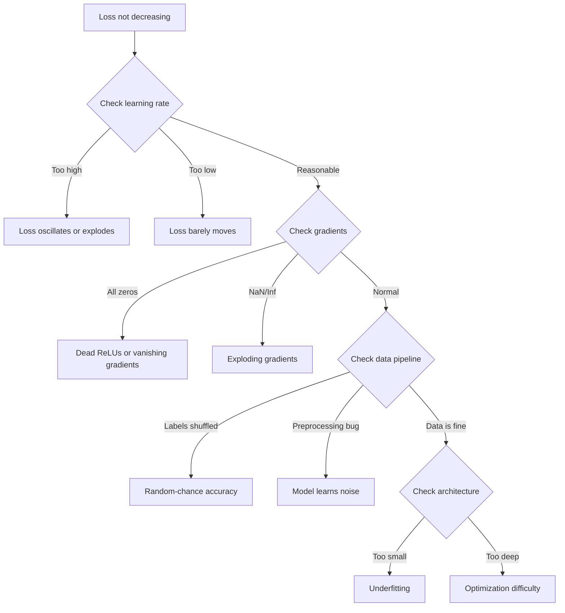
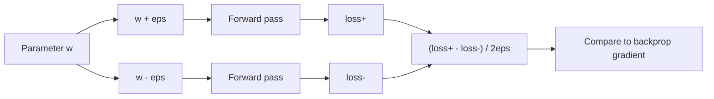
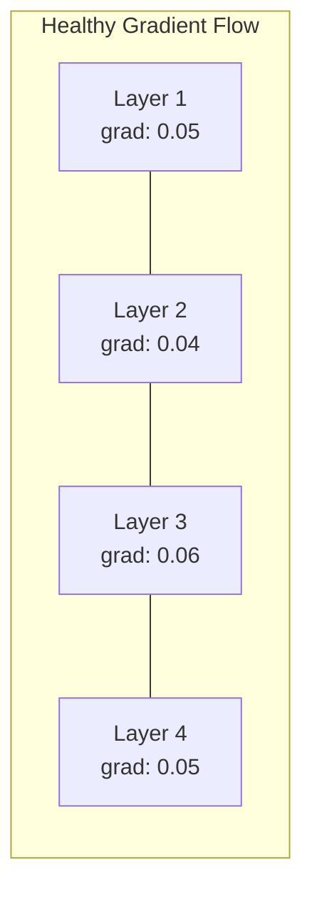
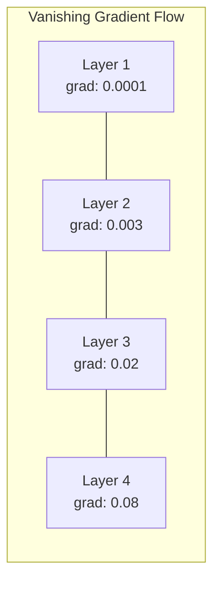
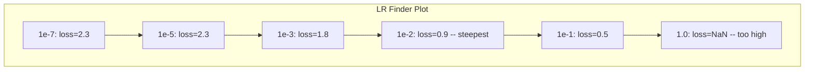

# إصلاح شبكات عصبية

> شبكتك مرتبة. لقد شنت. لقد أنتجت رقم. الرقم خاطئ ولا شيء قد اصطدم. مرحباً بك في نوع أسوأ إزالة التحذير -- نوع حيث لا توجد رسالة خطأ.

> **【中文解读】**网络编译了、运行了、输出了数字但数字是错误的,没有报错信息――这是最难调试:没有错误信息――本章系统介绍深度学习的调试方法论:过拟合单批 → 检查梯度 → 追踪数值稳定性 → 诊断学习率问题――

**Type:** Practice
**Type:** Build
**Languages:** Python, PyTorch
**Prerequisites:** Phase 03 Lessons 01-10 (especially backpropagation, loss functions, optimizers)
**Time:** ~90 minutes

## أهداف التعلم

- تشخيص فشل الشبكة العصبية الشائعة (خسارة NaN ، منحنى الخسارة المسطح ، الإفراط في التكيف ، التذبذب) باستخدام استراتيجيات التحليل المنهجي
- تطبيق تقنية "تجاوز المجموعة الواحدة" للتحقق من أن بنية النموذج الخاص بك و حلقة التدريب صحيحة
- فحص حجم التنحى وتوزيعات التفعيل ومعايير الوزن لتحديد مشاكل التنحى المتلاشى/المفجرة
- قم ببناء قائمة تفحص لإلغاء التحليلات التي تغطي خط الأنابيب البيانات ، ومهارات النموذج ، و وظيفة الخسارة ، و المحفزات ، و قضايا معدل التعلم

> **【中文解读】**本章系统化地教你调试神经网络──核心方法论:过拟合单批量(验证代码正确性)→ 梯度检查(验证反向传播)→ 激活统计(发现死 ReLU)→ 学习率搜索(找到合适的 lr)──60-70% من ML 调试时间花在"静默错误"上程序不报错但结果不对──

## المشكلة المشكلة المشكلة

البرمجيات التقليدية تتعطل عندما تكون محطمة. يشير صفر إلى استثناء. يفشل عدم مطابقة النوع في وقت التجميع. خطأ منفصل واحد ينتج نتائج خاطئة بوضوح.

> 传统软件在出问题时会崩──空指针抛出异常──类型不匹配在编译时失败──差一错产出明显错误的输出──

الشبكات العصبية لا تعطيك هذا الفاخر

> شبكة العصبية لن تعطيك هذا الرفاه

شبكة عصبية مكسورة تعمل حتى الانتهاء، طباعة قيمة الخسارة، وتخرج التنبؤات. قد تقلل الخسارة قد تبدو التنبؤات معقولة لكن النموذج خاطئ صامتًا - تعلم الشروط المختصرة، حفظ الضوضاء، أو التقارب إلى أدنى الحد المحلي غير المفيد. يقدر باحثو جوجل أن 60-70% من وقت إزالة التحليلات المستخدمة في ML ينفق على أخطاء "صامتة" لا تنتج أي أخطاء ولكن يضعف نوعية النموذج.

> يمكن أن تعمل شبكة عصبية مشاكل حتى الانتهاء، وتطبيق خسارة القيمة، وتخطي التنبؤات. يمكن أن تكون الخسارة في الانخفاض. يمكن أن تبدو التنبؤ معقولة. ولكن النموذج في الواقع يرتكب خطأ في تعلم السباقات.

الفرق بين نموذج عمل و نموذج مكسور هو غالباً خط واحد ضائع: خط مفقود `zero_grad()`، بعدة نقل، معدل التعلم أقل بنسبة 10x. يبدأ "وصفة لتدريب الشبكات العصبية" (2019) القنونيّة بهذا: "أشعاب الأخطاء في شبكة العصبية هي الأخطاء التي لا تتحطم".

> الفرق بين النموذج المستخدم والنموذج المتحلل غالبا ما يكون مجرد خطة من الموقع الخطأ`zero_grad()`、 维度转置错误、 学习率差 10 倍──经典的"训练神经网络的方法"(2019) 开头写道:" الأكثر شيوعاً خطأ في شبكة العصبية هو خطأ لن ينهار‬‬‬‬‬‬‬‬‬‬‬‬‬‬‬‬‬‬‬‬‬‬‬‬‬‬‬‬‬‬‬‬‬‬‬‬‬‬‬‬‬‬‬‬‬‬‬‬‬‬‬‬‬‬‬‬‬‬‬‬‬‬‬‬‬‬‬‬‬‬‬‬‬‬‬‬‬‬‬‬‬‬‬‬‬‬‬‬‬‬‬‬‬‬‬‬‬‬‬‬‬‬‬‬‬‬‬‬‬‬‬‬‬‬‬‬‬‬‬‬‬‬‬‬‬‬‬‬‬‬‬‬‬‬‬‬‬‬‬‬‬‬‬‬‬‬‬‬‬‬‬‬‬‬‬‬‬‬‬‬‬‬‬‬‬‬‬‬‬‬‬‬‬‬‬‬‬‬‬‬‬‬‬‬‬‬‬‬‬‬‬‬‬‬‬‬‬‬‬‬‬‬‬‬‬‬‬‬‬‬‬‬‬‬‬‬‬‬‬‬‬‬‬‬‬‬‬‬‬‬‬‬‬‬‬‬‬‬‬‬‬‬‬‬‬‬‬‬‬‬‬‬‬‬‬‬‬‬‬‬‬‬‬‬‬‬‬‬‬‬‬‬‬‬‬‬‬‬‬‬‬‬‬‬‬‬‬‬‬‬‬‬‬‬‬‬‬‬‬‬‬‬‬‬‬‬‬‬‬‬‬‬‬‬‬‬‬‬‬‬‬‬‬‬‬‬‬‬‬‬‬‬‬‬‬‬‬‬‬‬‬‬‬‬‬‬‬‬‬‬‬‬‬‬‬‬‬‬‬‬‬‬‬‬‬‬‬‬‬‬‬‬‬‬‬‬‬‬‬‬‬‬‬‬‬‬‬‬‬‬‬‬‬‬‬‬‬‬‬‬‬‬‬‬‬‬‬‬‬‬‬‬‬‬‬‬‬‬‬‬‬‬‬‬‬‬‬‬‬‬‬‬‬‬‬‬‬‬‬‬‬‬‬‬‬‬‬‬‬‬‬‬‬

هذه الدروس تعلّمك إيجاد تلك الحشرات

> هذه الدروس تُعلمك كيف تجد هذه الحشرات

> **【中文解读】**يحتوي البرمجيات التقليدية على إشارات خطأ واضحة (((غير عادية、 تدوين خطأ)  حيث أن أسوأ مكان للتحقيق في شبكة العصبية هو "خطأ صامت"

> **【拓展：大模型训练中的调试】**訓練 Llama 3 405B هذا النموذج(16384 块 H100,30.8M GPU 小时),一次 تدريب فشل من تكلفة ارتفعت إلى عدة ملايين دولار.

## المفهوم الأساسي

### طريقة التفكير المتحولة

انسى تحميل الخطأ في الطباعة والإصدار. تحميل الشبكة العصبية يتطلب نهجا منهجيا لأن حلقة التعليق بطيئة (دقائق إلى ساعات في كل دورة تدريبية) والأعراض غامضة (يمكن أن يعني فقدان سيء 20 شيء مختلف).

> نسيان الطباعة والطبعة 调试──الطباعة في شبكة النفس تحتاج إلى طريقة للتنظيم، لأن الدورة المضادة بطيئة (((المرحلة التدريبية تدخل خلال دقائق إلى ساعات) ، والعراض تتظاهر أنها لا تظهر))

القاعدة الذهبية:**start simple, add complexity one piece at a time, and verify each piece independently.**

> 黄金法则:**从简单开始，一次只加一个复杂度，独立验证每个组件。**

> **【中文解读】**调试神经网络的黄金法则: بدءاً من أسهل الحالات، كل مرة فقط أضف عنصر واحد، تحقق بشكل مستقل لكل عنصر.



### العارض الأول: الخسارة لا تقلل

هذه الشكوى الأكثر شيوعاً، حلقة التدريب تتدفق، وتتدفق العصور، وتبقى الخسارة ثابتة أو تتذبذب بشكل وحشي.

> هذه هي الشكوى الأكثر شيوعا. دورة التدريب في الجري، العصر الماضي واحد بعد الآخر، ولكن الخسارة دائما لا تتحرك أو ترتجف بشكل كبير.

**Wrong learning rate.**مرتفع جداً: الخسارة تتذبذب أو تقفز إلى NaN. منخفض جداً: الخسارة تقلّص ببطء بحيث تبدو مسطحة. بالنسبة لأدم، ابدأ من 1e-3. بالنسبة لـ SGD، ابدأ من 1e-1 أو 1e-2. حاول دائمًا 3 معدلات تعلم تتراوح بين 10x لكل واحد (مثل 1e-2, 1e-3, 1e-4) قبل استنتاج شيء آخر خاطئ.

> **学习率错误。**太高: خسارة 振荡或跳到NaN──太低: خسارة 降得太慢,看起来像不动──亚当从1e-3 开始──SGD从1e-1 或1e-2 开始── 在下结论说有其他问题之前,先尝试3个学习率(相差 10 倍,如1e-2、1e-3、1e-4)──

**Dead ReLUs.**إذا تلقى عصبية ريلو إدخال سلبي كبير، فإنه يخرج 0 و تراجعتها هي 0. فإنه لا ينشط مرة أخرى. إذا مات عدد كاف من الخلايا العصبية، فإن الشبكة لا يمكن أن تتعلم. تحقق: طباعة الجزء من التنشيط التي هي بالضبط 0 بعد كل طبقة ريلو. إذا > 50% مات، التبديل إلى ريلو سلبي أو تقليل معدل التعلم.

> **死亡 ReLU。**إذا استقبل العصب ReLU إدخالًا سلبيًا كبيرًا ، فإنه ينتج 0, gradient is 0, لن ينشط أبداً مرة أخرى.

**Vanishing gradients.**في الشبكات العميقة مع تنشيط sigmoid أو tanh ، تتقلص التدرج بشكل متسارع مع انتشارها إلى الوراء. في الوقت الذي تصل فيه إلى الطبقة الأولى ، تكون ~ 0. تتوقف الطبقات الأولى عن التعلم.

> **梯度消失。**في شبكة العميقة التي تعمل باستخدام sigmoid أو tanh ، تتقلص التدريج في الاتجاه المعاكس عند الانتشار.

**Exploding gradients.**المشكلة المعاكسة -- التدرج ينمو بشكل متسارع. شائع في RNNs وشبكات عميقة جدا. الخسارة قفز إلى NaN.`torch.nn.utils.clip_grad_norm_`), انخفاض معدل التعلم، أو إضافة التطبيع.

> **梯度爆炸。**相反问题梯度指数级增长──常见于RNN 和非常深的网络──损失 跳到NaN──修复:梯度剪`torch.nn.utils.clip_grad_norm_`)、 انخفاض معدل التعلم、 أو إضافة إلى التكوين

### العارض الثاني: فقدان يقلل لكن النموذج سيء

إن الخسارة تقلّت، دقة التدريب تصل إلى 99٪، لكن دقة الاختبار تصل إلى 55٪، أو النموذج ينتج نتائج غير منطقية على البيانات الحقيقية.

> الخسارة في النخفض. معدلات التدريب المحددة تصل إلى 99٪. ولكن معدلات التدريب المحددة تصل إلى 55٪. أو النموذج يخرج نتائج غير معقولة على البيانات الحقيقية.

**Overfitting.**النموذج يتذكر بيانات التدريب بدلاً من أنماط التعلم. يزداد الفجوة بين التدريب وفقدان التحقق من التحقق من التحقق من التحقق من التحقق من التحقق من التحقق من التحقق من التحقق من التحقق من التحقق من التحقق من التحقق من التحقق من التحقق من التحقق من التحقق من التحقق من التحقق من التحقق من التحقق من التحقق من التحقق من التحقق من التحقق من التحقق من التحقق من التحقق من التحقق من التحقق من التحقق من التحقق من التحقق من التحقق من التحقق من التحقق من التحقق من التحقق من التحقق من التحقق من التحقق من التحقق من التحقق من التحقق من التحقق من التحقق من التحقق من التحقق من التحقق من التحقق من التحقق من التحقق من التحقق من التحقق من التحقق من التحقق من التحقق من التحقق من التحقق من التحقق من التحقق من التحقق من التحقق من التحقق من التحقق من التحقق من التحقق من التحقق من التحقق.

> **过拟合。**模型在背诵训练数据而不是学习规律── training loss 和验证 loss 之间的差距随时间扩大──修复:更多数据、Dropout、权重衰减、早停、数据增强──

**Data leakage.**تسرب بيانات الاختبار في التدريب. الدقة مرتفعة بشكل مشبوه. الأسباب الشائعة: التخليط قبل التقسيم، المعالجة المسبقة مع الإحصاءات من مجموعة البيانات الكاملة، النسخة المكررة من عينات عبر التقسيمات. تصحيح: التقسيم الأول، والمعالجة المسبقة الثانية، التحقق من النسخة المكررة.

> **数据泄漏。**测试数据混入了训练――准确率高可可疑――常见原因:划分前先打乱、使用整个数据集的统计量做预处理、跨划分的重复样本──修复:先划分再预处理、检查重复──

**Label errors.**5-10٪ من اللبكات في معظم مجموعات البيانات الحقيقية خاطئة (نورتكوت وآخرون ، 2021 -- "خطأ اللباقة الشاملة في مجموعات الاختبار"). يتعلم النموذج الضوضاء. تصحيح: استخدام التعلم الثقة للعثور على أمثلة خاطئة في اللبغة وإصلاحها ، أو استخدام تخفيض الخسارة لتجاهل عينات الخسارة العالية.

> **标签错误。** التعلم الحقيقي في الاختبار: مع التعلم الثقة  العثور على ومصالحة النموذج الخطأ، أو استخدام تخفيض الخسارة  الامتناع عن الخسارة 

### العلامة الثالثة: فقدان النفط أو النفط

قيمة الخسارة تصبح`nan`أو`inf`التدريب قد انتهى

> قيمة الخسارة أصبحت`nan`أو`inf`تمارس الموت

**Learning rate too high.**تحديثات التدريجية تتجاوز الوزن حتى ينفجر

> **学习率太高。**梯度更新过冲到权重爆炸──修复: انخفض 10 倍──

**log(0) or log(negative).**محاسبات الخسارة المتقاطعة للاندروبي`log(p)`إذا كان النموذج الخاص بك تصدر بالضبط 0 أو احتمال سلبي، سجل انفجار.`[eps, 1-eps]`أين`eps=1e-7`. . .

> **log(0) 或 log(负数)。**交叉损失计算 `log(p)`إذا كان النموذج ينبعث بشكل صحيح 0 أو احتمالات سلبية، سيقوم التفجير.`[eps, 1-eps]`، من بينهم`eps=1e-7`.

**Division by zero.**ينفصل تطبيع اللحظة عن طريق الانحراف القياسي. اللحظة ذات القيم الثابتة لديها std=0.

> **除以零。**批归一化要除以标准差──一常数值的批次的 std=0──修复:分母加 epsilon(PyTorch 默认这样做,但自定义实现可能没有)──

**Numerical overflow.**التفعيلات الكبيرة مدفوعة في `exp()`إنتاج Inf. Softmax هو عرضة بشكل خاص. تحديد: خصم القصوى قبل التعريض (حيلة التخفيض-الجمع-الاضافه).

> **数值溢出。**                                                                                                                                                                                                                                                                                                                                                                                                                                                                                                                             `exp()`سوف تظهر Inf。Softmax 尤其容易──修复:指数化前减去最大值(لاگ- sumar-exp 技巧)

### التقنية 1: التحقق التدريجي: التقنية 1: التحقق التدريجي

مقارنة تراجع التحليل الخاص بك (من backprop) إلى تراجع عددي (من الاختلافات المحدودة). إذا كانوا لا يوافقون، فإن مرورك إلى الوراء لديه خطأ.

> ضع درجة تحليلك ((( من التنشر المعاكس) و درجة القيمة العددية ((( من التفاوت المحدود) تقارن.

التراجع الرقمي للفارغ `w`:

> 参数 `w`                                                                                                                                                                                                                                                              

```
grad_numerical = (loss(w + eps) - loss(w - eps)) / (2 * eps)
```

مقياس الاتفاق (الفارق النسبي):

>                                                                                                                                                                                                                                                               

```
rel_diff = |grad_analytical - grad_numerical| / max(|grad_analytical|, |grad_numerical|, 1e-8)
```

إذا`rel_diff < 1e-5`صحيح، إذا`rel_diff > 1e-3`بالتأكيد حشرة

> إذا`rel_diff < 1e-5`صحيح ..`rel_diff > 1e-3`: تقريبا بالتأكيد هناك حشرة



### التقنية 2: إحصاءات التفعيل التقنية 2: إحصاء التفعيل

مراقبة متوسط وفروق قياسي للتفعيلات بعد كل طبقة خلال التدريب. الشبكات الصحية تبقي التفعيلات مع متوسط قريب من 0 و std قريب من 1 (بعد التطبيع) أو على الأقل محدودة.

>  تدريب  مراقبة  متوسط قيمة التشغيل والمعايير  بعد كل مستوى  ‬ ‬ ‬ ‬ ‬ ‬ ‬ ‬ ‬ ‬ ‬ ‬ ‬ ‬ ‬ ‬ ‬ ‬ ‬ ‬ ‬ ‬ ‬ ‬ ‬ ‬ ‬ ‬ ‬ ‬ ‬ ‬ ‬ ‬ ‬ ‬ ‬ ‬ ‬ ‬ ‬ ‬ ‬ ‬ ‬ ‬ ‬ ‬ ‬ ‬ ‬ ‬ ‬ ‬ ‬ ‬ ‬ ‬ ‬ ‬ ‬ ‬ ‬ ‬ ‬ ‬ ‬ ‬ ‬ ‬ ‬ ‬ ‬ ‬ ‬ ‬ ‬ ‬ ‬ ‬ ‬ ‬ ‬ ‬ ‬ ‬ ‬ ‬ ‬ ‬ ‬ ‬ ‬ ‬ ‬ ‬ ‬ ‬ ‬ ‬ ‬ ‬ ‬ ‬ ‬ ‬ ‬ ‬ ‬ ‬ ‬ ‬ ‬ ‬ ‬ ‬ ‬ ‬ ‬ ‬ ‬ ‬ ‬ ‬ ‬ ‬ ‬ ‬ ‬ ‬ ‬ ‬ ‬ ‬ ‬ ‬ ‬ ‬ ‬ ‬ ‬ ‬ ‬ ‬ ‬ ‬ ‬ ‬ ‬ ‬ ‬ ‬ ‬ ‬ ‬ ‬ ‬ ‬ ‬ ‬ ‬ ‬ ‬ ‬ ‬ ‬ ‬ ‬ ‬ ‬ ‬ ‬ ‬ ‬ ‬ ‬ ‬ ‬ ‬ ‬ ‬ ‬ ‬ ‬ ‬ ‬ ‬ ‬ ‬ ‬ ‬ ‬ ‬ ‬ ‬ ‬ ‬ ‬ ‬ ‬ ‬ ‬ ‬ ‬ ‬ ‬ ‬ ‬ ‬ ‬ ‬ ‬ ‬ ‬ ‬ ‬ ‬ ‬ ‬ ‬ ‬ ‬ ‬ ‬ ‬ ‬ ‬ ‬ ‬ ‬ ‬ ‬ ‬ ‬ ‬ ‬ ‬ ‬ ‬ ‬ 

| Health indicator | Mean | Std | Diagnosis |
|-----------------|------|-----|-----------|
| Healthy | ~0 | ~1 | Network is learning normally |
| Saturated | >>0 or <<0 | ~0 | Activations stuck at extreme values |
| Dead | 0 | 0 | Neurons are dead (all zeros) |
| Exploding | >>10 | >>10 | Activations growing without bound |

| 健康指标 | 均值 | 标准差 | 诊断 |
|---------|------|--------|------|
| 健康 | ~0 | ~1 | 网络正常学习中 |
| 饱和 | >>0 或 <<0 | ~0 | 激活卡在极端值 |
| 死亡 | 0 | 0 | 神经元死了（全零） |
| 爆炸 | >>10 | >>10 | 激活无界增长 |

### التقنية 3: تصميم تدريجي التدفق

رسم متوسط حجم التهاب لكل طبقة. في شبكة صحية، يجب أن تكون magnitudes التهاب تقريبا مماثلة عبر الطبقات. إذا كانت الطبقات الأولى لديها تراجع 1000x أصغر من الطبقات اللاحقة، لديك تراجع تختفي.

> رسم متوسط ارتفاع التعدد لكل طبقة. في شبكة صحية، يجب أن يكون ارتفاع التعدد في كل طبقة تقريبا مماثلا. إذا كان ارتفاع الطابق الأمامي أقل من 1000 مرة من المستوى الخلفي، فإن لديك مشكلة اختفاء التعدد.





### التقنية 4: اختبار المكاسب المفروضة على المجموعة الواحدة

أهم تقنية تحريف أجهزة التعلم العميق

> أهم تقنية واحدة في التعلم العميق.

خذ مجموعة صغيرة واحدة (8-32 عينات). قم بتدريبها لمدة 100 مرة أو أكثر. يجب أن يصل الخسارة إلى الصفر تقريبًا وتحقيق التدريب إلى 100%. إذا لم يفعل ذلك، فإن نموذجك أو حلقة التدريب لديك خطأ أساسي - لا تتقدم إلى التدريب الكامل.

> خذ مجموعة صغيرة ((8-32 个样本)  في التدريب فوق 100+ مرة 代。 الخسارة يجب أن تنخفض إلى ما يقرب من صفر، وتدريب المعدل الدقيق يجب أن يصل إلى 100%♦ إذا لم يكن، نموذجك أو دورة التدريب لديها خطأ أساسي لا تدخل التدريب الكامل‬‬‬‬‬‬‬‬‬‬‬‬‬‬‬‬‬‬‬‬‬‬‬‬‬‬‬‬‬‬‬‬‬‬‬‬‬‬‬‬‬‬‬‬‬‬‬‬‬‬‬‬‬‬‬‬‬‬‬‬‬‬‬‬‬‬‬‬‬‬‬‬‬‬‬‬‬‬‬‬‬‬‬‬‬‬‬‬‬‬‬‬‬‬‬‬‬‬‬‬‬‬‬‬‬‬‬‬‬‬‬‬‬‬‬‬‬‬‬‬‬‬‬‬‬‬‬‬‬‬‬‬‬‬‬‬‬‬‬‬‬‬‬‬‬‬‬‬‬‬‬‬‬‬‬‬‬‬‬‬‬‬‬‬‬‬‬‬‬‬‬‬‬‬‬‬‬‬‬‬‬‬‬‬‬‬‬‬‬‬‬‬‬‬‬‬‬‬‬‬‬‬‬‬‬‬‬‬‬‬‬‬‬‬‬‬‬‬‬‬‬‬‬‬‬‬‬‬‬‬‬‬‬‬‬‬‬‬‬‬‬‬‬‬‬‬‬‬‬‬‬‬‬‬‬‬‬‬‬‬‬‬‬‬‬‬‬‬‬‬‬‬‬‬‬‬‬‬‬‬‬‬‬‬‬‬‬‬‬‬‬‬‬‬‬‬‬‬‬‬‬‬‬‬‬‬‬‬‬‬‬‬‬‬‬‬‬‬‬‬‬‬‬‬‬‬‬‬‬‬‬‬‬‬‬‬‬‬‬‬‬‬‬‬‬‬‬‬‬‬‬‬‬‬‬‬‬‬‬‬‬‬‬‬‬‬‬‬‬‬‬‬‬‬‬‬‬‬‬‬‬‬‬‬‬‬‬‬‬‬‬‬‬‬‬‬‬‬‬‬‬‬‬‬‬‬‬‬‬‬‬‬‬‬‬‬‬‬‬‬‬‬‬‬‬‬‬

هذا الاختبار يحتوي على:
- وظائف الخسارة المكسورة
- المخطوطات الخلفية المكسورة
- الهندسة المعمارية صغيرة جداً لتمثيل البيانات
- المحفز غير متصل بمعايير النموذج
- البيانات والعلامات غير المنسقة

> هذا الاختبار يمكن أن يلتقط: خسرة خسرة وظيفة، خسرة التنقل المضاد، بنية صغيرة جدا لا يمكن أن تعرض البيانات، المحفزات غير متصلة إلى العناصر النموذجية، البيانات والعلامات غير متطابقة.

هذا يستغرق 30 ثانية للعمل ويوفر ساعات من التحريف كامل التدريب تشغيل.

> هذا يستغرق 30 ثانية فقط من التشغيل، يمكن أن توفر ساعات كاملة من التدريب وتجربة الوقت.

> **【拓展：Andrej Karpathy 的调试建议】**توصي كارباتي في "وصفة لتدريب الشبكات العصبية": 1) لا تحكم في الأداء، وضمان الخسارة 计算正确; 2) في المثبتة 小数据集上过拟合; 3) 检查梯度用数值梯度验证; 4) 监控权重和梯度的范数; 5) 先用小模型验证,再扩大── وجهة نظره الرئيسية:" إذا لم تتمكن من تجاوز تناسب مجموعة صغيرة من البيانات،说明代码有错误──"

### التقنية 5: محاسبة تعلّم السعر 技术 5: محاسبة تعلّم السعر

اقترحت ليزلي سميث (2017) مسح معدل التعلم من صغير جدا (1e-7) إلى كبير جدا (10) على مدى حقبة واحدة مع تسجيل الخسارة. خسارة المؤثر مقابل معدل التعلم. معدل التعلم المثالي هو أقل بنحو 10 مرات من معدل حيث يبدأ الخسارة في الانخفاض أسرع.

> ليزلي سميث ((2017) طرح في عصر واحد 内把学习率从极小(1e-7)扫到极大(10),同时记录损失──绘制损失与学习率曲线──最优学习率大约是损失──开始下降最快处的学习率的1/10──



أفضل LR في هذا المثال: ~1e-3 (ترتيب واحد من الكبيرة قبل نقطة الركبة).

> أفضل معدل دراسة في هذا المثال: ~ 1e-3( في أقل درجات من الدرجة)

### حشرات الـ " بيتورش " المشتركة

هذه هي الحشرات التي تضيع ساعات أكثر جماعية في مجتمع (بايتورش):

> هذه هي أخطاء PyTorch  المجتمع 集体浪费最多时间:

> **【拓展：大模型训练中的 loss spike】**في التدريب على النموذج على نطاق كبير مثل GPT-4、Llama 3 ، سوف يظهر خسارة فجأة قمةخسارة من القيمة الطبيعية قفزة فجأة إلى very high إعادة التأهيل.

| Bug | Symptom | Fix |
|-----|---------|-----|
| Forgetting `optimizer.zero_grad()` | Gradients accumulate across batches, loss oscillates | Add `optimizer.zero_grad()` before `loss.backward()` |
| Forgetting `model.eval()` at test time | Dropout and batch norm behave differently, test accuracy varies between runs | Add `model.eval()` and `torch.no_grad()` |
| Wrong tensor shapes | Silent broadcasting produces wrong results, no error | Print shapes after every operation during debugging |
| CPU/GPU mismatch | `RuntimeError: expected CUDA tensor` | Use `.to(device)` on model AND data |
| Not detaching tensors | Computation graph grows forever, OOM | Use `.detach()` or `with torch.no_grad()` |
| In-place operations breaking autograd | `RuntimeError: modified by in-place operation` | Replace `x += 1` with `x = x + 1` |
| Data not normalized | Loss stuck at random-chance level | Normalize inputs to mean=0, std=1 |
| Labels as wrong dtype | Cross-entropy expects `Long`, got `Float` | Cast labels: `labels.long()` |

| Bug | 症状 | 修复 |
|-----|------|------|
| 忘记 `optimizer.zero_grad()` | 梯度跨 batch 累积，loss 振荡 | 在 `loss.backward()` 前加 `optimizer.zero_grad()` |
| 测试时忘记 `model.eval()` | Dropout 和 BN 行为不同，测试准确率波动 | 加 `model.eval()` 和 `torch.no_grad()` |
| 张量形状错误 | 静默广播产生错误结果，无报错 | 调试时每个操作后打印形状 |
| CPU/GPU 不匹配 | `RuntimeError: expected CUDA tensor` | 模型和数据都用 `.to(device)` |
| 没有分离张量 | 计算图永远增长，OOM | 用 `.detach()` 或 `with torch.no_grad()` |
| 原地操作破坏 autograd | `RuntimeError: modified by in-place operation` | 把 `x += 1` 改成 `x = x + 1` |
| 数据未归一化 | Loss 卡在随机猜测水平 | 把输入归一化到 mean=0, std=1 |
| 标签 dtype 错误 | 交叉熵要 `Long`，得到了 `Float` | 转换标签：`labels.long()` |

### طاولة إصلاح الأخطاء الرئيسية

| Symptom | Likely cause | First thing to try |
|---------|-------------|-------------------|
| Loss stuck at -log(1/num_classes) | Model predicting uniform distribution | Check data pipeline, verify labels match inputs |
| Loss NaN after a few steps | Learning rate too high | Reduce LR by 10x |
| Loss NaN immediately | log(0) or division by zero | Add epsilon to log/division operations |
| Loss oscillating wildly | LR too high or batch size too small | Reduce LR, increase batch size |
| Loss decreasing then plateaus | LR too high for fine-tuning phase | Add LR schedule (cosine or step decay) |
| Training acc high, test acc low | Overfitting | Add dropout, weight decay, more data |
| Training acc = test acc = chance | Model not learning anything | Run overfit-one-batch test |
| Training acc = test acc but both low | Underfitting | Bigger model, more layers, more features |
| Gradients all zero | Dead ReLUs or detached computation graph | Switch to LeakyReLU, check `.requires_grad` |
| Out of memory during training | Batch too large or graph not freed | Reduce batch size, use `torch.no_grad()` for eval |

| 症状 | 可能原因 | 首选尝试 |
|------|---------|---------|
| Loss 卡在 -log(1/num_classes) | 模型预测均匀分布 | 检查数据管线，验证标签与输入匹配 |
| 几步后 Loss 变 NaN | 学习率太高 | 学习率降低 10 倍 |
| Loss 立即变 NaN | log(0) 或除以零 | 给 log/除法操作加 epsilon |
| Loss 剧烈振荡 | LR 太高或 batch 太小 | 降低 LR，增大 batch |
| Loss 下降后停滞 | 微调阶段 LR 太高 | 加 LR 调度（cosine 或阶梯衰减） |
| 训练 acc 高，测试 acc 低 | 过拟合 | 加 Dropout、权重衰减、更多数据 |
| 训练 acc = 测试 acc = 随机水平 | 模型没学到东西 | 跑过拟合单 batch 测试 |
| 训练 acc = 测试 acc 都低 | 欠拟合 | 更大模型、更多层、更多特征 |
| 梯度全零 | Dead ReLU 或计算图被 detach | 换 LeakyReLU，检查 `.requires_grad` |
| 训练时 OOM | Batch 太大或计算图未释放 | 减小 batch，eval 时用 `torch.no_grad()` |

## بناء ذلك تحرك لتحقيق

> **【中文解读】**إنشاء شبكةDebugger  أداة التشخيص: باستخدام PyTorch المقبض والمركز الخلفي سجلات الذاتية لكل مستوى من الإحصاءات والتنسيقات التدريجية ‬ ثم تصنع عمداً ثلاث أخطاء ‬ ‬ ‬ ‬ ‬ ‬ ‬ ‬ ‬ ‬ ‬ ‬ ‬ ‬ ‬ ‬ ‬ ‬ ‬ ‬ ‬ ‬ ‬ ‬ ‬ ‬ ‬ ‬ ‬ ‬ ‬ ‬ ‬ ‬ ‬ ‬ ‬ ‬ ‬ ‬ ‬ ‬ ‬ ‬ ‬ ‬ ‬ ‬ ‬ ‬ ‬ ‬ ‬ ‬ ‬ ‬ ‬ ‬ ‬ ‬ ‬ ‬ ‬ ‬ ‬ ‬ ‬ ‬ ‬ ‬ ‬ ‬ ‬ ‬ ‬ ‬ ‬ ‬ ‬ ‬ ‬ ‬ ‬ ‬ ‬ ‬ ‬ ‬ ‬ ‬ ‬ ‬ ‬ ‬ ‬ ‬ ‬ ‬ ‬ ‬ ‬ ‬ ‬ ‬ ‬ ‬ ‬ ‬ ‬ ‬ ‬ ‬ ‬ ‬ ‬ ‬ ‬ ‬ ‬ ‬ ‬ ‬ ‬ ‬ ‬ ‬ ‬ ‬ ‬ ‬ ‬ ‬ ‬ ‬ ‬ ‬ ‬ ‬ ‬ ‬ ‬ ‬ ‬ ‬ ‬ ‬ ‬ ‬ ‬ ‬ ‬ ‬ ‬ ‬ ‬ ‬ ‬ ‬ ‬ ‬ ‬ ‬ ‬ ‬ ‬ ‬ ‬ ‬ ‬ ‬ ‬ ‬ ‬ ‬ ‬ ‬ ‬ ‬ ‬ ‬ ‬ ‬ ‬ ‬ ‬ ‬ ‬ ‬ ‬ ‬ ‬ ‬ ‬ ‬ ‬ ‬ ‬ ‬ ‬ ‬ ‬ ‬ ‬ ‬ ‬ ‬ ‬ ‬ ‬ ‬ ‬ ‬ ‬ ‬ ‬ ‬ ‬ ‬ ‬ ‬ 
```figure
learning-curves
```

## بناءها

مجموعة أدوات تشخيصية تتبع تنشيطات، تراجع، و منحنى الخسارة. سوف تفشل عمدا شبكة واستخدام مجموعة الأدوات لتشخيص كل مشكلة.

> مجموعة أدوات تشخيص التشغيل والتحكم في التشغيل والتحكم في التدفق والخسارة

### الخطوة الأولى: فئة إصلاح الأخطاء الشبكة الخطوة الأولى:

يربط في نموذج PyTorch لتسجيل إحصاءات التفعيل والتحركات على كل طبقة.

> أعطوا (بيتورش) نموذج تعليق على الصف ، سجل كل مستوى من التشغيل والتحديدات التدريجية

> NetworkDebugger باستخدام معقب PyTorch للأمام و معقب الخلفية مراقبة الذاتية لكل طبقة.`print_report()`输出综合诊断报告──

```python
import torch
import torch.nn as nn
import math


class NetworkDebugger:
    def __init__(self, model):
        self.model = model
        self.activation_stats = {}
        self.gradient_stats = {}
        self.loss_history = []
        self.lr_losses = []
        self.hooks = []
        self._register_hooks()

    def _register_hooks(self):
        for name, module in self.model.named_modules():
            if isinstance(module, (nn.Linear, nn.Conv2d, nn.ReLU, nn.LeakyReLU)):
                hook = module.register_forward_hook(self._make_activation_hook(name))
                self.hooks.append(hook)
                hook = module.register_full_backward_hook(self._make_gradient_hook(name))
                self.hooks.append(hook)

    def _make_activation_hook(self, name):
        def hook(module, input, output):
            with torch.no_grad():
                out = output.detach().float()
                self.activation_stats[name] = {
                    "mean": out.mean().item(),
                    "std": out.std().item(),
                    "fraction_zero": (out == 0).float().mean().item(),
                    "min": out.min().item(),
                    "max": out.max().item(),
                }
        return hook

    def _make_gradient_hook(self, name):
        def hook(module, grad_input, grad_output):
            if grad_output[0] is not None:
                with torch.no_grad():
                    grad = grad_output[0].detach().float()
                    self.gradient_stats[name] = {
                        "mean": grad.mean().item(),
                        "std": grad.std().item(),
                        "abs_mean": grad.abs().mean().item(),
                        "max": grad.abs().max().item(),
                    }
        return hook

    def record_loss(self, loss_value):
        self.loss_history.append(loss_value)

    def check_loss_health(self):
        if len(self.loss_history) < 2:
            return "NOT_ENOUGH_DATA"
        recent = self.loss_history[-10:]
        if any(math.isnan(v) or math.isinf(v) for v in recent):
            return "NAN_OR_INF"
        if len(self.loss_history) >= 20:
            first_half = sum(self.loss_history[:10]) / 10
            second_half = sum(self.loss_history[-10:]) / 10
            if second_half >= first_half * 0.99:
                return "NOT_DECREASING"
        if len(recent) >= 5:
            diffs = [recent[i+1] - recent[i] for i in range(len(recent)-1)]
            if max(diffs) - min(diffs) > 2 * abs(sum(diffs) / len(diffs)):
                return "OSCILLATING"
        return "HEALTHY"

    def check_activations(self):
        issues = []
        for name, stats in self.activation_stats.items():
            if stats["fraction_zero"] > 0.5:
                issues.append(f"DEAD_NEURONS: {name} has {stats['fraction_zero']:.0%} zero activations")
            if abs(stats["mean"]) > 10:
                issues.append(f"EXPLODING_ACTIVATIONS: {name} mean={stats['mean']:.2f}")
            if stats["std"] < 1e-6:
                issues.append(f"COLLAPSED_ACTIVATIONS: {name} std={stats['std']:.2e}")
        return issues if issues else ["HEALTHY"]

    def check_gradients(self):
        issues = []
        grad_magnitudes = []
        for name, stats in self.gradient_stats.items():
            grad_magnitudes.append((name, stats["abs_mean"]))
            if stats["abs_mean"] < 1e-7:
                issues.append(f"VANISHING_GRADIENT: {name} abs_mean={stats['abs_mean']:.2e}")
            if stats["abs_mean"] > 100:
                issues.append(f"EXPLODING_GRADIENT: {name} abs_mean={stats['abs_mean']:.2e}")
        if len(grad_magnitudes) >= 2:
            first_mag = grad_magnitudes[0][1]
            last_mag = grad_magnitudes[-1][1]
            if last_mag > 0 and first_mag / last_mag > 100:
                issues.append(f"GRADIENT_RATIO: first/last = {first_mag/last_mag:.0f}x (vanishing)")
        return issues if issues else ["HEALTHY"]

    def print_report(self):
        print("\n=== NETWORK DEBUGGER REPORT ===")
        print(f"\nLoss health: {self.check_loss_health()}")
        if self.loss_history:
            print(f"  Last 5 losses: {[f'{v:.4f}' for v in self.loss_history[-5:]]}")
        print("\nActivation diagnostics:")
        for item in self.check_activations():
            print(f"  {item}")
        print("\nGradient diagnostics:")
        for item in self.check_gradients():
            print(f"  {item}")
        print("\nPer-layer activation stats:")
        for name, stats in self.activation_stats.items():
            print(f"  {name}: mean={stats['mean']:.4f} std={stats['std']:.4f} zero={stats['fraction_zero']:.1%}")
        print("\nPer-layer gradient stats:")
        for name, stats in self.gradient_stats.items():
            print(f"  {name}: abs_mean={stats['abs_mean']:.2e} max={stats['max']:.2e}")

    def remove_hooks(self):
        for hook in self.hooks:
            hook.remove()
        self.hooks.clear()
```

### الخطوة الثانية: اختبار المكاسب المفروضة على المجموعة الواحدة

> هذه الوظيفة في مجموعة واحدة على نموذج التدريب 200 خطوة، يمكن أن تنخفض خسارة التحقق إلى ما يقرب من صفر، يمكن أن يصل معدل الدقة إلى 100٪.

```python
def overfit_one_batch(model, x_batch, y_batch, criterion, lr=0.01, steps=200):
    optimizer = torch.optim.Adam(model.parameters(), lr=lr)
    model.train()
    print("\n=== OVERFIT ONE BATCH TEST ===")
    print(f"Batch size: {x_batch.shape[0]}, Steps: {steps}")

    for step in range(steps):
        optimizer.zero_grad()
        output = model(x_batch)
        loss = criterion(output, y_batch)
        loss.backward()
        optimizer.step()

        if step % 50 == 0 or step == steps - 1:
            with torch.no_grad():
                preds = (output > 0).float() if output.shape[-1] == 1 else output.argmax(dim=1)
                targets = y_batch if y_batch.dim() == 1 else y_batch.squeeze()
                acc = (preds.squeeze() == targets).float().mean().item()
            print(f"  Step {step:3d} | Loss: {loss.item():.6f} | Accuracy: {acc:.1%}")

    final_loss = loss.item()
    if final_loss > 0.1:
        print(f"\n  FAIL: Loss did not converge ({final_loss:.4f}). Model or training loop is broken.")
        return False
    print(f"\n  PASS: Loss converged to {final_loss:.6f}")
    return True
```

### الخطوة الثالثة: محاسبة تعلّم السعر الثالثة: محاسبة تعلّم السعر

> هذا العامل من 极小学习率 ((1e-7) المؤشر مسح إلى 极大(10), كل خطوة تسجيل الخسارة, في النهاية تعطى "الخسارة  下降最快点之前 一个数级级" 建议──注意先深拷贝模型状态,跑完恢复

```python
def find_learning_rate(model, x_data, y_data, criterion, start_lr=1e-7, end_lr=10, steps=100):
    import copy
    original_state = copy.deepcopy(model.state_dict())
    optimizer = torch.optim.SGD(model.parameters(), lr=start_lr)
    lr_mult = (end_lr / start_lr) ** (1 / steps)

    model.train()
    results = []
    best_loss = float("inf")
    current_lr = start_lr

    print("\n=== LEARNING RATE FINDER ===")

    for step in range(steps):
        optimizer.zero_grad()
        output = model(x_data)
        loss = criterion(output, y_data)

        if math.isnan(loss.item()) or loss.item() > best_loss * 10:
            break

        best_loss = min(best_loss, loss.item())
        results.append((current_lr, loss.item()))

        loss.backward()
        optimizer.step()

        current_lr *= lr_mult
        for param_group in optimizer.param_groups:
            param_group["lr"] = current_lr

    model.load_state_dict(original_state)

    if len(results) < 10:
        print("  Could not complete LR sweep -- loss diverged too quickly")
        return results

    min_loss_idx = min(range(len(results)), key=lambda i: results[i][1])
    suggested_lr = results[max(0, min_loss_idx - 10)][0]

    print(f"  Swept {len(results)} steps from {start_lr:.0e} to {results[-1][0]:.0e}")
    print(f"  Minimum loss {results[min_loss_idx][1]:.4f} at lr={results[min_loss_idx][0]:.2e}")
    print(f"  Suggested learning rate: {suggested_lr:.2e}")

    return results
```

### الخطوة الرابعة: فحص التدريج

> المفتش التدريجي: تدرج الحل الذي تم تحديده لكل عنصر، مقارنة التدريج المتوسط والمتوسط المحدود الذي يتم الحصول عليه.`rel_diff < 1e-5`أظهرت صراحة`> 1e-3`几乎肯定有错误──注意需要双精度

```python
def _flat_to_multi_index(flat_idx, shape):
    multi_idx = []
    remaining = flat_idx
    for dim in reversed(shape):
        multi_idx.insert(0, remaining % dim)
        remaining //= dim
    return tuple(multi_idx)


def gradient_check(model, x, y, criterion, eps=1e-4):
    model.train()
    x_double = x.double()
    y_double = y.double()
    model_double = model.double()

    print("\n=== GRADIENT CHECK ===")
    overall_max_diff = 0
    checked = 0

    for name, param in model_double.named_parameters():
        if not param.requires_grad:
            continue

        layer_max_diff = 0

        model_double.zero_grad()
        output = model_double(x_double)
        loss = criterion(output, y_double)
        loss.backward()
        analytical_grad = param.grad.clone()

        num_checks = min(5, param.numel())
        for i in range(num_checks):
            idx = _flat_to_multi_index(i, param.shape)
            original = param.data[idx].item()

            param.data[idx] = original + eps
            with torch.no_grad():
                loss_plus = criterion(model_double(x_double), y_double).item()

            param.data[idx] = original - eps
            with torch.no_grad():
                loss_minus = criterion(model_double(x_double), y_double).item()

            param.data[idx] = original

            numerical = (loss_plus - loss_minus) / (2 * eps)
            analytical = analytical_grad[idx].item()

            denom = max(abs(numerical), abs(analytical), 1e-8)
            rel_diff = abs(numerical - analytical) / denom

            layer_max_diff = max(layer_max_diff, rel_diff)
            checked += 1

        overall_max_diff = max(overall_max_diff, layer_max_diff)
        status = "OK" if layer_max_diff < 1e-5 else "MISMATCH"
        print(f"  {name}: max_rel_diff={layer_max_diff:.2e} [{status}]")

    model.float()

    print(f"\n  Checked {checked} parameters")
    if overall_max_diff < 1e-5:
        print("  PASS: Gradients match (rel_diff < 1e-5)")
    elif overall_max_diff < 1e-3:
        print("  WARN: Small differences (1e-5 < rel_diff < 1e-3)")
    else:
        print("  FAIL: Gradient mismatch detected (rel_diff > 1e-3)")
    return overall_max_diff
```

### الخطوة 5: شبكات مكسورة عمداً . الخطوة الخامسة: خطأ تصنيع عمداً

الآن تطبيق مجموعة الأدوات على الشبكات المكسورة وتشخيص كل واحد منهم.

> الآن تُطبق الحزمة على شبكات مدمرة، بالتشخيص الفردي. ثلاثة أخطاء مصنوعة عمداً: 1) معدل التعلم مرتفع جداً.

```python
def demo_broken_networks():
    torch.manual_seed(42)
    x = torch.randn(64, 10)
    y = (x[:, 0] > 0).long()

    print("\n" + "=" * 60)
    print("BUG 1: Learning rate too high (lr=10)")
    print("=" * 60)
    model1 = nn.Sequential(nn.Linear(10, 32), nn.ReLU(), nn.Linear(32, 2))
    debugger1 = NetworkDebugger(model1)
    optimizer1 = torch.optim.SGD(model1.parameters(), lr=10.0)
    criterion = nn.CrossEntropyLoss()
    for step in range(20):
        optimizer1.zero_grad()
        out = model1(x)
        loss = criterion(out, y)
        debugger1.record_loss(loss.item())
        loss.backward()
        optimizer1.step()
    debugger1.print_report()
    debugger1.remove_hooks()

    print("\n" + "=" * 60)
    print("BUG 2: Dead ReLUs from bad initialization")
    print("=" * 60)
    model2 = nn.Sequential(nn.Linear(10, 32), nn.ReLU(), nn.Linear(32, 32), nn.ReLU(), nn.Linear(32, 2))
    with torch.no_grad():
        for m in model2.modules():
            if isinstance(m, nn.Linear):
                m.weight.fill_(-1.0)
                m.bias.fill_(-5.0)
    debugger2 = NetworkDebugger(model2)
    optimizer2 = torch.optim.Adam(model2.parameters(), lr=1e-3)
    for step in range(50):
        optimizer2.zero_grad()
        out = model2(x)
        loss = criterion(out, y)
        debugger2.record_loss(loss.item())
        loss.backward()
        optimizer2.step()
    debugger2.print_report()
    debugger2.remove_hooks()

    print("\n" + "=" * 60)
    print("BUG 3: Missing zero_grad (gradients accumulate)")
    print("=" * 60)
    model3 = nn.Sequential(nn.Linear(10, 32), nn.ReLU(), nn.Linear(32, 2))
    debugger3 = NetworkDebugger(model3)
    optimizer3 = torch.optim.SGD(model3.parameters(), lr=0.01)
    for step in range(50):
        out = model3(x)
        loss = criterion(out, y)
        debugger3.record_loss(loss.item())
        loss.backward()
        optimizer3.step()
    debugger3.print_report()
    debugger3.remove_hooks()

    print("\n" + "=" * 60)
    print("HEALTHY NETWORK: Correct setup for comparison")
    print("=" * 60)
    model_good = nn.Sequential(nn.Linear(10, 32), nn.ReLU(), nn.Linear(32, 2))
    debugger_good = NetworkDebugger(model_good)
    optimizer_good = torch.optim.Adam(model_good.parameters(), lr=1e-3)
    for step in range(50):
        optimizer_good.zero_grad()
        out = model_good(x)
        loss = criterion(out, y)
        debugger_good.record_loss(loss.item())
        loss.backward()
        optimizer_good.step()
    debugger_good.print_report()
    debugger_good.remove_hooks()

    print("\n" + "=" * 60)
    print("OVERFIT-ONE-BATCH TEST (healthy model)")
    print("=" * 60)
    model_test = nn.Sequential(nn.Linear(10, 32), nn.ReLU(), nn.Linear(32, 2))
    overfit_one_batch(model_test, x[:8], y[:8], criterion)

    print("\n" + "=" * 60)
    print("LEARNING RATE FINDER")
    print("=" * 60)
    model_lr = nn.Sequential(nn.Linear(10, 32), nn.ReLU(), nn.Linear(32, 2))
    find_learning_rate(model_lr, x, y, criterion)

    print("\n" + "=" * 60)
    print("GRADIENT CHECK")
    print("=" * 60)
    model_grad = nn.Sequential(nn.Linear(10, 8), nn.ReLU(), nn.Linear(8, 2))
    gradient_check(model_grad, x[:4], y[:4], criterion)
```

## استخدمها في إطار التنفيذ

> **【中文解读】**PyTorch 内置调试工具:`torch.autograd.detect_anomaly()`捕获 NaN/Inf`model.named_parameters()`遍历参数和梯度──生产环境用权重和偏差 (wandb) 或 TensorBoard 实时监控损失、梯度直方图、权重分布──关键在问题发生时能快速定位是哪一层出问题──

### PyTorch أدوات متكاملة

> PyTorch 内置工具:`detect_anomaly()`في فيكس فيكس فيكس فيكس فيكس فيكس فيكس فيكس فيكس فيكس فيكس فيكس فيكس فيكس فيكس فيكس فيكس فيكس فيكس فيكس فيكس فيكس فيكس فيكس فيكس فيكس فيكس فيكس فيكس فيكس فيكس فيكس فيكس فيكس فيكس فيكس فيكس فيكس فيكس فيكس فيكس فيكس فيكس فيكس فيكس فيكس فيكس فيكس فيكس فيكس فيكس فيكس فيكس فيكس فيكس فيكس فيكس فيكس فيكس فيكس فيكس فيكس فيكس فيكس فيكس فيكس فيكس فيكس فيكس فيكس فيكس فيكس فيكس فيكس فيكس فيكس فيكس فيكس فيكس فيكس فيكس فيكس فيكس فيكس فيكس فيكس فيكس فيكس فيكس فيكس فيكس فيكس فيكس فيكس فيكس فيكس فيكس فيكس فيكس فيكس فيكس فيكس فيكس فيكس فيكس فيكس فيكس فيكس فيكس فيكس فيكس فيكس فيكس`named_parameters()` عبر جميع العناصر ودرجاتها،  قابل الطباعة  متوسط قيمة تحديد المعدل الميتة 

```python
import torch
import torch.nn as nn

model = nn.Sequential(
    nn.Linear(768, 256),
    nn.ReLU(),
    nn.Linear(256, 10),
)

with torch.autograd.detect_anomaly():
    output = model(input_tensor)
    loss = criterion(output, target)
    loss.backward()

for name, param in model.named_parameters():
    if param.grad is not None:
        print(f"{name}: grad_mean={param.grad.abs().mean():.2e}")
```

### الوزن والتحيزات التكامل الوزن والتحيزات 集集

> W&B 集成: كل عصر 记录 loss、学习率、梯度范数,并为每参数记录梯度直方图──线上仪表盘实时显示训练曲线,能快速发现损失峰、梯度爆炸或参数和──

```python
import wandb

wandb.init(project="debug-training")

for epoch in range(100):
    loss = train_one_epoch()
    wandb.log({
        "loss": loss,
        "lr": optimizer.param_groups[0]["lr"],
        "grad_norm": torch.nn.utils.clip_grad_norm_(model.parameters(), float("inf")),
    })

    for name, param in model.named_parameters():
        if param.grad is not None:
            wandb.log({f"grad/{name}": wandb.Histogram(param.grad.cpu().numpy())})
```

### لوحة التنسور

> لوحة الـ TensorBoard 可視化:`add_scalar`记录标量(خسارة٬دقة٬تعلم`add_histogram`سجل الوزن وتوزيع الدرجة`tensorboard --logdir=runs/`启动本地仪表盘,实时查看训练曲线和参数分布变化──

```python
from torch.utils.tensorboard import SummaryWriter

writer = SummaryWriter("runs/debug_experiment")

for epoch in range(100):
    loss = train_one_epoch()
    writer.add_scalar("Loss/train", loss, epoch)

    for name, param in model.named_parameters():
        writer.add_histogram(f"weights/{name}", param, epoch)
        if param.grad is not None:
            writer.add_histogram(f"gradients/{name}", param.grad, epoch)
```

### قائمة التحقق من التحريف (قبل التدريب الكامل) 调试清单(完整训练前)

1. اجري اختبار "تفيت" في مجموعة واحدة، وإذا فشلت، توقف
2. لنشر ملخص النموذج -- التحقق من عدد المعايير معقول.
3. قم بإجراء مرور واحد للأمام مع بيانات عشوائية -- تحقق شكل الخروج.
4. التدريب لمدة 5 حقول -- التحقق من انخفاض الخسائر.
5. تحقق من إحصاءات التفعيل لا توجد طبقات ميتة ولا انفجارات
6. تحقق من تدفق التهاب -- لا اختفاء، لا انفجار.
7. التحقق من خط البيانات -- طبع 5 عينات عشوائية مع العلامات.

> 调试清单(完整训练前):
> 1. 跑過拟合单批 测试──失败就停止──
> 2. 打印模型摘要 验证参数合理──
> 3. باستخدام البيانات التي تم تشغيلها مرة واحدة
> 4. تدريب 5  دور  تجربة الخسارة 在下降──
> 5. لا يوجد أيّة مُوتات، لا يوجد انفجار
> 6. لا يوجد إختفاء ولا انفجار
> 7. 验证数据管线 印 5 个标签随机样本

## أرسلها .

هذا الدرس ينتج عن:
- `outputs/prompt-nn-debugger.md`-- تحذير للتشخيص فشل في تدريب شبكة الأعصاب
- `outputs/skill-debug-checklist.md`-- قائمة تفحص شجرة القرار لمشاكل إصلاح التدريب

أنماط النشر الرئيسية لإلغاء التحليل:
- إضافة خطافات مراقبة إلى نصوص تدريب الإنتاج
- إشغال السجلات وإحصاءات التراجع إلى W&B أو TensorBoard كل خطوة N
- تنفيذ تنبيهات تلقائية لخسارة NaN ، والعصبية الميتة (> 80٪ صفر) ، أو انفجار التراجع
- إعادة اختبار الإصلاحات المضافة إلى مجموعة واحدة عند تغيير الهندسة المعمارية أو خطوط البيانات

> 本课产出:
> - `outputs/prompt-nn-debugger.md` التشخيصات التدريبات النفسية
> - `outputs/skill-debug-checklist.md`调试训练问题决策树清单
>
> 调试的关键部署模式:
> - 给生产训练脚本加监控子
> - كل خطوة تصل إلى W&B أو TensorBoard
> - 实现自动告警:NaN فقدان 死亡神经元(>80% 零) 梯度爆炸
> - 改架构或数据管线时永远先跑过拟合单批 测试

## تمارين التدريب

1. **Add an exploding gradient detector.**تعديل`NetworkDebugger`للكشف عن عندما تتجاوز التدرج عتبة وتقترح تلقائيًا قيمة قطع التدرج. اختبره على شبكة 20 طبقة دون أي تطبيع.

   **添加梯度爆炸检测器。**修改 `NetworkDebugger`، اختبار التعدد يتجاوز قيمة عندما يوصي تطبيق التعدد بقطع القيمة  في شبكة 20 مستوى من عدم التوحيد 

2. **Build a dead neuron resurrector.**اكتب وظيفة تحدد الخلايا العصبية الميتة ReLU (دائما الخروج 0) وتعيد تشغيل أوزانها المقبلة مع تشغيل كايمينغ. أظهر أن هذا يعيد شبكة حيث > 70% من الخلايا العصبية ميتة.

   **构建死亡神经元复活器。**كتب وظيفة تحديد الموت ReLU 神经元(始终输出 0), باستخدام Kaiming ابتداء إعادة تشغيل إدخالها في الوزن.

3. **Implement the learning rate finder with plotting.**التمديد`find_learning_rate`لإنشاء النتائج كـ CSV و كتابة نص منفصل يقرأ CSV و يعرض منحنى LR مقابل الخسارة باستخدام matplotlib. حدد LR الأمثل لـ ResNet-18 على CIFAR-10.

   **实现带绘图的学习率搜索器。**扩展 `find_learning_rate`, ضع النتائج في CSV, وقم بكتابة كتابة مستقلة لقراءة CSV باستخدام مقال مشترك  رسم LR مقابل خسارة 曲线── في CIFAR-10 فوق ResNet-18 تحديد أفضل LR──

4. **Create a data pipeline validator.**اكتب وظيفة تحقق من: عينات مزدوجة عبر الانقسامات القطارية / الاختبارية ، وعدم توازن توزيع اللوحات (> نسبة 10: 1) ، وتطبيع المدخلات (متوسط قريب من 0 ، std قريب من 1) ، وقيم NaN / Inf في البيانات. قم بتشغيلها على مجموعة بيانات فاسدة عمدا.

   **创建数据管线验证器。**写一个函数检查:训练/测试划分间的重复样本、标签分布不平衡(>10:1 比例) 输入归结(平均值接近0,std 接近1)、数据中的 NaN/Inf 值──在故意损坏的数据集上运行──

5. **Debug a real failure.**خذ الإطار الصغير من الدروس 10 ، قم بتقديم خطأ خفيف (على سبيل المثال ، نقل المصفوفة الوزن إلى الوراء) ، واستخدم فحص التدفقات لمعرفة بالضبط أي معايير لها تدفقات غير صحيحة. وثيق عملية التحليل.

   **调试一个真实失败。**取第十 课的迷你框架,引入一个隐藏的 bug(如反向传播中转置权重矩阵), باستخدام 梯度检查精确定位哪个参数 梯度不对;;记录调试过程──

## شروط الرئيسية

| Term | What people say | What it actually means |
|------|----------------|----------------------|
| Silent bug | "It runs but gives bad results" | A bug that produces no error but degrades model quality -- the dominant failure mode in ML |
| Dead ReLU | "The neurons died" | A ReLU neuron whose input is always negative, so it outputs 0 and receives 0 gradient permanently |
| Vanishing gradients | "Early layers stop learning" | Gradients shrink exponentially through layers, making weights in early layers effectively frozen |
| Exploding gradients | "Loss went to NaN" | Gradients grow exponentially through layers, causing weight updates so large they overflow |
| Gradient checking | "Verify backprop is correct" | Comparing analytical gradients from backprop to numerical gradients from finite differences |
| Overfit-one-batch | "The most important debug test" | Training on a single small batch to verify the model CAN learn -- if it cannot, something is fundamentally broken |
| LR finder | "Sweep to find the right learning rate" | Exponentially increasing the learning rate over one epoch and picking the rate just before loss diverges |
| Data leakage | "Test data leaked into training" | When information from the test set contaminates training, producing artificially high accuracy |
| Activation statistics | "Monitor layer health" | Tracking mean, std, and zero-fraction of each layer's output to detect dead, saturated, or exploding neurons |
| Gradient clipping | "Cap the gradient magnitude" | Scaling gradients down when their norm exceeds a threshold, preventing exploding gradient updates |

| 术语 | 俗称 | 实际含义 |
|------|------|---------|
| Silent bug / 静默 bug | "能跑但结果差" | 不产生错误但降低模型质量的 bug——ML 中主要的失败模式 |
| Dead ReLU / 死亡 ReLU | "神经元死了" | 输入始终为负的 ReLU 神经元，永远输出 0、梯度为 0 |
| Vanishing gradients / 梯度消失 | "前面层停止学习" | 梯度穿过层时指数缩小，使前面层的权重实际上被冻结 |
| Exploding gradients / 梯度爆炸 | "Loss 变 NaN" | 梯度穿过层时指数增长，权重更新过大而溢出 |
| Gradient checking / 梯度检查 | "验证反向传播正确" | 把反向传播的解析梯度和有限差分的数值梯度做比较 |
| Overfit-one-batch / 过拟合单 batch | "最重要的调试测试" | 在单个小 batch 上训练，验证模型能学习——如果不能，就是根本性错误 |
| LR finder / 学习率搜索器 | "扫一遍找合适学习率" | 一个 epoch 内指数级增加学习率，挑发散前一刻的学习率 |
| Data leakage / 数据泄漏 | "测试数据泄漏到训练" | 测试集信息污染了训练，产生虚假的高准确率 |
| Activation statistics / 激活统计 | "监控层健康" | 追踪每层输出的均值、标准差、零比例，检测死亡、饱和或爆炸神经元 |
| Gradient clipping / 梯度裁剪 | "限制梯度幅度" | 当梯度范数超过阈值时按比例缩小，防止梯度爆炸更新 |

## المزيد من القراءة

- سميث، "تطورات التعلم الدورية للتدريب الشبكات العصبية" (2017) -- الورقة التي تعرض اختبار نطاق معدل التعلم (ملاحظ لـLR)
- نورثكوت وآخرون، "خطأ اللبنانات المنتشرة في مجموعات الاختبار تزعزع استقرار معايير التعلم الآلي" (2021) -- يظهر أن 3-6٪ من العلامات في ImageNet، CIFAR-10، وغيرها من المعايير الرئيسية خاطئة
- تشانغ وغيره، "فهم التعلم العميق يتطلب إعادة التفكير في التعميم" (2017) -- الورقة التي تظهر أن الشبكات العصبية يمكن أن تتذكر العلامات العشوائية، وهذا هو السبب في أن اختبار Overfit-One-batch يعمل
- وثائق PyTorch على `torch.autograd.detect_anomaly`و`torch.autograd.set_detect_anomaly`للكشف عن NaN/Inf المدمج

> 延伸阅读:
> - سميث،تطورات التعلم المتكررة لتدريب الشبكات العصبية(2017) طرحت شرح تعلم范围测试(LR finder)
> - نورث كوت 等人,خطأ اللقب المنتشر في مجموعات الاختبار استقرار معايير تعلم الآلة(2021) إثبات ImageNet、CIFAR-10等主要基准的标签 3-6% 是错的
> - تشانغ وغيره،فهم التعلم العميق يتطلب إعادة التفكير التعميم(2017) إثبات أن شبكة العصبية يمكن أن تتذكر مع علامات، وهذا هو السبب في أن المجموعة الواحدة من التعلم المتناسبة 测试有效
> - بيتورش 文档关于 `torch.autograd.detect_anomaly`和 `torch.autograd.set_detect_anomaly`استخدامها في إطار NaN / Inf 检测
