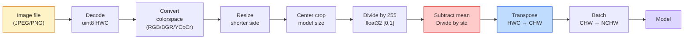
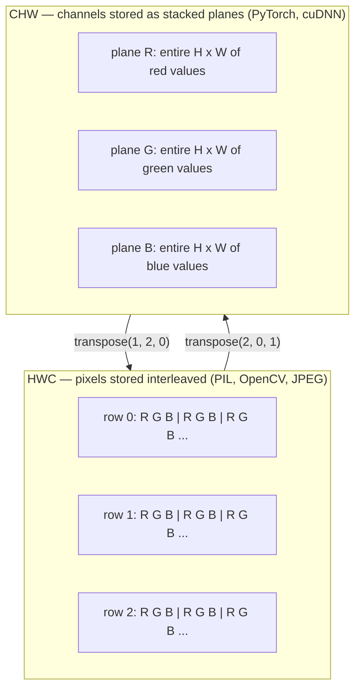

# أساسيات الصورة  البيكسلات، القنوات، الفضاء اللون  أساس الصورة  الصورة  المواصفات والمرورات والمرح

> الصورة هي عبارة عن عينة ضوئية كل نموذج رؤية ستستخدمها يبدأ من هذه الحقيقة

> **【中文解读】**الصورة هي في الواقع مجموعة من القيمة الصفرية للضوء. سواء كانت صور الهاتف أو القيادة الذاتية أو GPT-4V، جميع النماذج البصرية تنبع من هذه الحقيقة الأساسية.

**Type:** Build | **类型:** 动手
**Languages:** Python | **语言:** Python
**Prerequisites:** Phase 1 Lesson 12 (Tensor Operations), Phase 3 Lesson 11 (Intro to PyTorch) | **前置知识:** Phase 1 Lesson 12（张量运算）、Phase 3 Lesson 11（PyTorch 入门）
**Time:** ~45 minutes | **时间:** ~45 分钟

## أهداف التعلم

- شرح كيف يتم تحويل المشهد المستمر إلى بيكسل ولماذا تحدد قرارات العينات/الكميات السقف على كل نموذج متدفق
  ترجمة باللغة الصينية: شرح كيف تم تفريق المشهد المتسلسل إلى الصور ، وكذلك لماذا تحدد قرارات الاستخدام / القياس الحد الأقصى لجميع النماذج التالية
- قراءة، قطع، ومعاينة الصور كمتصفحات NumPy وتبديل بشكل متساوٍ بين تصميمات HWC و CHW
  中文翻译:读取、切片、检查图像的NumPy 数组表示,并自如切换在HWC和CHW布局之间
- تحويل بين RGB ، مقياس الرمادي ، HSV ، و YCbCr وتبرير لماذا يوجد كل مساحة لون
  ترجمة باللغة الصينية: تحويل بين RGB、灰度、HSV و YCbCr، وتوضيح كل نوع من الألوان
- تطبيق معالجة مسبقة على مستوى البيكسل (تطبيق الطبيعية، وتوحيد، وتغيير الحجم، القناة الأولى) بالضبط كما تتوقع نماذج رؤية PyTorch المتدربة مسبقا
  中文翻译:精确按照预训练 PyTorch 视觉模型的期望做像素级预处理(归一化、标准化、缩放、通道前置)

## المشكلة المشكلة المشكلة

كل ورقة ستقرأها، كل وزن مسبق تمرين سوف تنزيل، كل API رؤية سوف تدعو يفترض تشفير محدد من المدخل.`uint8`الصورة حيث يريد النموذج `float32`وسوف لا يزال يعمل  وتنتج صامتًا القمامة. إطعام BGR إلى شبكة تدرب على RGB وتنهار الدقة بنسبة عشرة نقاط. تسلم نموذج القنوات - المدخل الأخير عندما يتوقع القنوات - أولاً وتعامل الطبقة الأولى من المكونات الارتفاع كقناة ميزة. لا شيء من هذا يلقي خطأ. إنه فقط يدمر قياساتك وتقضي أسبوعًا في البحث عن خطأ يعيش في كيفية تحميل الملف.

> كل مقال ستقرأه، كل محاولة تحميل، كل إدارة تصويرية تستخدم، كل إدارة تصويرية، ستفترض نوعاً محدداً من إدخال الرموز.`uint8`الصور المرسومة`float32`النموذج، فإنه لا يزال يعمل ولكن صامتة تفرض نتائج قمامة. إعطاء BGR على شبكة تدريب على RGB، معدل دقة هبوط عشرة نقاط مئوية. إعطاء الممرات في الدخول الأخير إعطاء الممرات المطلوبة.

> **【中文解读】**هذا هو "الخطأ الخفي" الأكثر شيوعا في مجال التصوير الحاسوبي المصدر: البيانات غير متطابقة. النموذج لن يبلغ عن الخطأ، ولكن النتيجة خاطئة تماما. على سبيل المثال، وضع BGR على افتتاح CV كإضفاء الوصول إلى RGB.

إن التخفيف ليس معقداً بمجرد معرفة ما يتدفق عليه. الجزء الصعب هو أن "الصورة" تعني أشياء مختلفة للكاميرا ، ومعبرة JPEG ، PIL ، OpenCV ، torchvision ، و kernel CUDA. لكل كومة ترتيب محور خاص بها ، ومدى البايت ، ومعاهدة القناة. مهندس الرؤية الذي لا يستطيع الحفاظ على هذه السفن المستقيمة مكسورة الأنابيب.

> بمجرد معرفة ما يدور حول الملفات، فإنه ليس معقدا. الجزء المشكك هو أن "الصورة" على الجهازات، والجهازات الفارغة، والجهازات الفارغة، والجهازات الفارغة، والجهازات الفارغة، والجهاز الفارغة، والجهاز الفارغة، والجهاز الفارغة، والجهاز الفارغة، والجهاز الفارغة، والجهاز الفارغة، والجهاز الفارغة، والجهاز الفارغة، والجهاز الفارغة، والجهاز الفارغة، والجهاز الفارغة، والجهاز الفارغة، والجهاز الفارغة، والجهاز الفارغة، والجهاز الفارغة، والجهاز الفارغة، والجهاز الفارغة، والجهاز الفارغة، والجهاز الفارغة، والجهاز الفارغة، والجهاز الفارغة، والجهاز الفارغة، والجهاز الفارغة، والجهاز الفارغة، والجهاز الفارغة، والجهاز الفارغة، والجهازية، والجهاز الفارقة، والجهازية، والجهازية، والجهازية، والجهازية، والجهازية، والجهازية، والجهازية، والجهازية، والجهازية، والجهازية، والجهازية، والجهازية، والجهازية، والجهازية، والجهازية، والجهازية، والجهازية، والجهازية، والجهازية، والجهازية، والجهازية، والجهازية، والجهازية، والجهازية، والجهازية، والجهازية، والجهازية، والجهازية.

هذه الدروس تحدد الأساس حتى تتمكن بقية المرحلة من بناء عليه. في النهاية سوف تعرف ما هو البيكسل، لماذا هناك ثلاثة أرقام لكل بيكسل بدلا من واحد، ما "التطبيع مع إحصاءات ImageNet" في الواقع تفعل، وكيفية التحرك بين التخطيطين أو ثلاثة التي كل دروس أخرى في هذه المرحلة سوف تتخيل.

> هذا الدور هو الأساس الحقيقي، حتى يتم بناء باقي الدورات على هذا الدور. بعد الانتهاء من الدراسة سوف تعرف ما هو مثلث، لماذا كل مثلث لديه ثلاثة أرقام بدلا من واحد، ما الذي "تستخدم ImageNet 统计归化" حتى النهاية، وكيفية التبديل بين النظامين الثلاثة المفترضة في باقي الدورات.

> **【拓展：数据标注与质量】** تأثير المهام المرئية يعتمد على جودة البيانات المعلنة.‬‬‬‬‬‬‬‬‬‬‬‬‬‬‬‬‬‬‬‬‬‬‬‬‬‬‬‬‬‬‬‬‬‬‬‬‬‬‬‬‬‬‬‬‬‬‬‬‬‬‬‬‬‬‬‬‬‬‬‬‬‬‬‬‬‬‬‬‬‬‬‬‬‬‬‬‬‬‬‬‬‬‬‬‬‬‬‬‬‬‬‬‬‬‬‬‬‬‬‬‬‬‬‬‬‬‬‬‬‬‬‬‬‬‬‬‬‬‬‬‬‬‬‬‬‬‬‬‬‬‬‬‬‬‬‬‬‬‬‬‬‬‬‬‬‬‬‬‬‬‬‬‬‬‬‬‬‬‬‬‬‬‬‬‬‬‬‬‬‬‬‬‬‬‬‬‬‬‬‬‬‬‬‬‬‬‬‬‬‬‬‬‬‬‬‬‬‬‬‬‬‬‬‬‬‬‬‬‬‬‬‬‬‬‬‬‬‬‬‬‬‬‬‬‬‬‬‬‬‬‬‬‬‬‬‬‬‬‬‬‬‬‬‬‬‬‬‬‬‬‬‬‬‬‬‬‬‬‬‬‬‬‬‬‬‬‬‬‬‬‬‬‬‬‬‬‬‬‬‬‬‬‬‬‬‬‬‬‬‬‬‬‬‬‬‬‬‬‬‬‬‬‬‬‬‬‬‬‬‬‬‬‬‬‬‬‬‬‬‬‬‬‬‬‬‬‬‬‬‬‬‬‬‬‬‬‬‬‬‬‬‬‬‬‬‬‬‬‬‬‬‬‬‬‬‬‬‬‬‬‬‬‬‬‬‬‬‬‬‬‬‬‬‬‬‬‬‬‬‬‬‬‬‬‬‬‬‬‬‬‬‬‬‬‬‬‬‬‬‬‬‬‬‬‬‬‬‬‬‬‬‬‬‬‬‬‬‬‬‬‬‬‬‬‬‬‬‬‬‬‬‬‬‬‬‬‬‬‬‬‬‬‬‬‬‬‬‬‬‬‬‬‬‬‬‬‬‬‬‬‬‬‬‬‬‬‬‬‬‬‬‬‬‬‬‬‬‬‬‬‬‬‬‬‬‬‬‬‬

## المفهوم الأساسي

### خط الأنابيب الكاملة في نظرة واحدة

كل نظام رؤية الإنتاج هو نفس تسلسل من التحويلات العكسية. الحصول على خطوة واحدة خاطئة والنموذج يرى مدخل مختلف عن ما تم تدريب عليه.

> كل نظام تصنيفية من مستويات الإنتاج هو نفس التسلسلات المتغيرة.



الصناديق الحمراء والزرقاء هي حيث يعيش 80% من الفشل الصامت: غياب المعايير والترتيب الخطأ.

> الـ 紅色 والزرقاء هي مربعين 80% من الصمت يفشل في: عدم وجود تقييم وخاطئ في المخططات.

> **【中文解读】**80% من الأخطاء الخفية تركز على خططين: 1) عدم إجراء قياسية (<<<<<<<<<<<<<<<<<<<<<<<<<<<<<<<<<<<<<<<<<<<<<<<<<<<<<<<<<<<<<<<<<<<<<<<<<<<<<<<<<<<<<<<<<<<<<<<<<<<<<<<<<<<<<<<<<<<<<<<<<<<<<<<<<<<<<<<<<<<<<<<<<<<<<<<<<<<<<<<<<<<<<<<<<<<<<<<<<<<<<<<<<<<<<<<<<<<<<<<<<<<<<<<<<<<<<<<<<<<<<<<<<<<<<<<<<<<<<<<<<<<<<<<<<<<<<<<<<<<<<<<<<<<<<<<<<<<<<<<<<<<<<<<<<<<<<<<<<<<<<<<<<<<<<<<<<<<<<<<<<<<<<<<<<<<<<<<<<<<<<<<<<<<<<<<<<<<<<<<<<<<<<<<<<<<<<<<<<<<<<<<<<<<<<<<<<<<<<<<<<<<<<<<<<<<<<<<<<<<<<<<<<<<<<<<<<<<<<<<<<<<<<<<<<<<<<<<<<<<<<<<<<<<<<<<<<<<<<<<<<<<<<<<

### البيكسل هو عينة، وليس مربع 像素是采样点, وليس قطعة

يعد جهاز استشعار الكاميرا الفوتونات التي تهبط على شبكة من الكشفات الصغيرة. كل كشف يدمج الضوء لجزء من الثانية ويصدر ولتاجاً متناسباً مع عدد الكشفات التي تضربه. ثم يختفي جهاز الاستشعار هذا الجهد إلى عدد كامل. يصبح الكشف واحد بكسلًا واحدًا.

> 相机传感器统计落在微小探测器网格上的光子数量―― كل探测器 في فترة قصيرة من الزمن积分光线,并发射与击中它的光子数量成正比电压――传感器随后将电压分散为整数――探测器就成为一个像素――

```
Continuous scene                 Sensor grid                     Digital image
(infinite detail)                (H x W detectors)               (H x W integers)

    ~~~~~                        +--+--+--+--+--+                 210 198 180 155 120
   ♪ ♪ 205 195 178 152 118 ♪
  - الضوء - - - - - - - - - - - - - - - - - - - - - - - - - - - - - - - - - - - - - - - - - - - - - - - - - - - - - - - - - - - - - - - - - - - - - - - - - - - - - - - - - - - - - - - - - - - - - - - - - - - - - - - - - - - - - - - - - - - - - - - - - - - - - - - - - - - - - - - - - - - - - - - - - - - - - - - - - - - - - - - - - - - - - - - - - - - - - - - - - - - - - - - - - - - - - - - - - - - - - - - - - - - - - - - - - - - - - - - - - - - - - - - - - - - - - - - - - - - - - - - - - - - - - - - - - - - - - - - - - - - - - - - - - - - - - - - - - - - - - - - - - - - - - - - - - - - - - - - - - - - - - - - - - - - - - - - - - - - - - - - - - - - - - - - - - - - - - - - - - - - - - - - - - - - - - - - - - - - - - - - - - - - - - - - - - - - - - - - - - - - - - - - - - - - - - - - - - - - - - - - - - - - - - - - - - - - - - - - - - - - - - - - - - - - - - - - - - - - - - - - - - - - - - - - - - - - - - - - - - - - - - - - - - - - - - - - - - - - - - - - - - - - - - - - - - - - - - - - - - - - - - - - - - - -
   ~~~~~                         |  |  |  |  |  |                 195 185 170 148 112
                                 +--+--+--+--+--+                 188 180 165 145 108
```

هناك خياران يحدثان في هذه الخطوة و يصلحان السقف على كل شيء أسفل النهر:

- **Spatial sampling**يقرر عدد الكشفات لكل درجة من المشهد. قليل جداً، والحواف تصبح متزينة (التخفيف). كثير جداً، وتنفجر التخزين والحساب.
  中文翻译:空间采样决定场景每度有多少探测器──太少则边缘出现(混叠)──太多则储量和计算量暴增──
- **Intensity quantization**يقرر كيفية تدفق الجهد. 8 بتات يعطي 256 مستوى وهو معيار للتعرض. 10، 12، 16 بتات يعطي تراجعات أكثر سلاسة ومادة للتصوير الطبي، HDR، وخطوط أنابيب الاستشعار الخام.
  الصينية الترجمة: الحد الأقصى للقياسات الحد الأقصى للدفاع الكهربائي تم تقسيمه بشكل أكثر دقة.

البيكسل ليس مربع ملون مع مساحة. إنه قياس واحد. عندما تقوم بتغيير الحجم أو التناوب، فإنك تقوم بإعادة أخذ عينات من شبكة القياس.

> الصورة ليست مربع ملون مسطحها. إنها قياس. عندما تتضخم أو تدور، فأنت تستجد شبكة قياسها.

> **【中文解读】**الصورة ليست قطعة مربعة صغيرة ، بل نقطة استنتاجية  جهاز استشعار يُقيس قيمة عددية في موقع فضائي معين .

### لماذا ثلاثة قنوات لماذا ثلاثة قنوات

يحتسب أحد الكشفات الفوتونات عبر الطيف المرئي كله  وهو مستوى الرمادي. للحصول على اللون ، يغطي المستشعر الشبكة بمص mosaic من المرشحات الحمراء والخضراء والأزرق. بعد التمزيق ، كل موقع فضائي لديه ثلاثة أرقام كاملة: استجابة الكشف المصفاة بالحمر ، والمرشية المصفاة ، والزرقاء المصفاة بالقرب. هذه الأرقام الثلاثة هي ثلاثية RGB للبيكسل.

> احصاءات المراقبة كاملة على الطيف الضوئي المرئي  That's the grayness . . ..............................................................................................................................................................................................................................................

```
One pixel in memory:

    (R, G, B) = (210, 140, 30)   <- reddish-orange

An H x W RGB image:

    shape (H, W, 3)     stored as   H rows of W pixels of 3 values
                                    each in [0, 255] for uint8
```

ثلاثه ليست سحر. كاميرات العميقة تضيف قناة Z. تضيف الأقمار الصناعية الشرائط تحت الحمراء والأوترافيوليت. الاحصائيات الطبية غالباً ما يكون لها قناة واحدة (أشعة رين، CT) أو العديد (متطرفة). عدد القنوات هو المحور الأخير؛ وتعلم طبقات المكونات الاختلاط عبرها.

> 三不是魔法──深度摄像头增加 Z通道──卫星增加红外和紫外波段──医学扫描通常有一个通道(X光、CT) أو العديد من通道(高光谱)──通道数是最后一个轴;卷积层学习跨通道混合──

> **【拓展：多通道图像】**عادةً ما تكون الصور المُتبعة عن بعد الصناعة الصناعية ذات الطيف الأحمر والبيروتفاعلي وغيره من الموجات الأخرى.

### اتفاقيتين للتخطيط: HWC و CHW

نفس العجلة، ترتيبان كل مكتبة تختار واحدة

> مع واحد 张量, دو نوع من الترتيبات.

```
HWC (height, width, channels)           CHW (channels, height, width)

   W ->                                    H ->
  +-----+-----+-----+                     +-----+-----+
H |R G B|R G B|R G B|                   C |R R R R R R|
| +-----+-----+-----+                   | +-----+-----+
v |R G B|R G B|R G B|                   v |G G G G G G|
  +-----+-----+-----+                     +-----+-----+
                                          |B B B B B B|
                                          +-----+-----+

   PIL, OpenCV, matplotlib,              PyTorch, most deep learning
   almost every image file on disk       frameworks, cuDNN kernels
```

توجد CHW لأن نواة التخزين تتحرك عبر H و W. الحفاظ على محور القناة أولا يعني أن كل نواة ترى طائرة 2D متواصلة لكل قناة ، والتي تنقل نظيفة. تنظم شكلات القرص HWC لأن ذلك يطابق كيفية خروج خطوط المسح من جهاز استشعار.

> CHW 之所以存在,是因为卷积核在H 和 W 上滑动──保持通道轴在最前面意思是每个核看到是每个通道一个连续的2D平面,可以干净地向量化──磁盘格式保持HWC是因为那匹配传感器扫描线的输出方式──

> **【中文解读】**HWC(高×宽×通道) هو النموذج الافتراضي لـ PIL、OpenCV 等库، و هو أيضاً طريقة تخزين الملفات الصورة على القرص الصريحي。CHW(通道×高×宽) هو النموذج الذي يستخدمه PyTorch 和 GPU 计算(cuDNN) ، لأن الكتلة النووية في H 和 W 上滑, فإن وضع المقبل يجعل كل النوو يرى هو تسلسل 2D سطح، وتكثيفية الحساب أعلى。 التحويل بينهما هو كل يوم يجب أن يكتب عددًا من العمليات.

تحويل خط واحد سوف تكتب ألف مرة:

> ستقوم بضربة ألف مرة

```
img_chw = img_hwc.transpose(2, 0, 1)      # NumPy
img_chw = img_hwc.permute(2, 0, 1)        # PyTorch tensor
```

ترتيب الذاكرة، مرئية:

> إعدادات النظام:



### نطاقات البايت و dtype 字节 نطاق و نوع البيانات

ثلاث اتفاقات تهيمن على:

> ثلاثة أشكال:

| Convention | dtype | Range | Where you see it |
|------------|-------|-------|------------------|
| Raw | `uint8` | [0, 255] | Files on disk, PIL, OpenCV output |
| Normalized | `float32` | [0.0, 1.0] | After `img.astype('float32') / 255` |
| Standardized | `float32` | roughly [-2, +2] | After subtracting mean and dividing by std |

تم تدريب الشبكات المتحركة على المدخلات الموحدة.`mean=[0.485, 0.456, 0.406]`،`std=[0.229, 0.224, 0.225]`هي المتوسط الحسابي والانحراف القياسي للقنوات الثلاث على مجموعة تدريب ImageNet الكاملة ، المحاسبة على [0, 1] البيكسلات المعتادة.`uint8`في نموذج يتوقع العبث الموحد هو الفشل الصامت الأكثر شيوعا في الرؤية التطبيقية.

> 卷积网络 في إدخال قياسي على التدريب.`mean=[0.485, 0.456, 0.406]`.`std=[0.229, 0.224, 0.225]`هو كل ImageNet 訓練集三通道的算术平均值和标准差,在 [0, 1] 归结像素上计算──把原始 `uint8` نموذج إعطاء توقعات قياسية من النقاط هي أكثر النماذج شيوعا في التطبيقات الفشل الصامت.

> **【中文解读】**三种数据范围:(1) uint8 [0,255]  文件/PIL/OpenCV 的原始输出;(2) float32 [0,1]  归一化后;(3) float32 ≈[-2,+2]  ImageNet 标准化后──把 uint8 直接给期望标准化输入的模型,是最常见的"静默失败"──ImageNet 的平均值和标准差值是整个训练集统计出来的,几乎所有训练模型都使用这个组数量──

### الفضاء اللونى و لماذا يوجد

RGB هو شكل التقاط ولكن ليس دائماً هو التمثيل الأكثر فائدة لنموذج.

> RGB هو نمط التقاط، ولكن ليس دائماً أكثر تعبيرات مفيدة للنموذج.

```
 RGB               HSV                       YCbCr / YUV

 R red             H hue (angle 0-360)       Y luminance (brightness)
 G green           S saturation (0-1)        Cb chroma blue-yellow
 B blue            V value/brightness (0-1)  Cr chroma red-green

 Linear to         Separates color from      Separates brightness from
 sensor output     brightness. Useful for    color. JPEG and most video
                   color thresholding, UI    codecs compress the chroma
                   sliders, simple filters   channels harder because the
                                             human eye is less sensitive
                                             to chroma detail than to Y.
```

معظم قنوات التلفزيون الحديثة تقوم بتغذية RGB وتلتقي بمناطق أخرى عندما:

> بالنسبة لمعظم سي إن إن الحديث، أنت إدخال RGB.

- **HSV** رمز سيرته الذاتية الكلاسيكي، التقسيم القائم على الألوان، التوازن البيضاء.
  中文翻译: كلاسيكي سيف 代码、基于颜色的分化、白平衡──
- **YCbCr**قراءة محطات JPEG الداخلية، خطوط أنابيب الفيديو، نماذج عالية القرار التي تعمل على Y فقط.
  中文翻译:读取 JPEG 内部结构、视频流水线、仅在Y通道上操作的超分辨率模型──
- **Grayscale** OCR، نماذج الوثائق، أي حالة حيث يكون اللون متغيرًا في المضايقة بدلاً من الإشارة.
  中文翻译:OCR、文档模型、颜色是干扰变量而不是任何场景的信号──

مقياس الرمادي من RGB هو مبلغ معين، وليس متوسط، لأن العين البشرية أكثر حساسية للخضراء من الأحمر أو الأزرق:

> من RGB 转灰度 هو زيادة في الوزن وليس متوسطا، لأن العين البشرية أكثر حساسية لللون الأخضر من الأحمر أو الأزرق:

```
Y = 0.299 R + 0.587 G + 0.114 B       (ITU-R BT.601, the classic weights)
```

### نسبة الجوانب، إعادة الحجم، والترابط 宽高比 缩放与插值

كل نموذج لديه حجم مدخل ثابت (224 × 224 بالنسبة لمعظم تصنيفات ImageNet ، 384 × 384 أو 512 × 512 بالنسبة للمكشفات الحديثة). نادرا ما تتطابق الصور. الخيارات الثلاثة لتحديد الحجم التي تهم:

> كل نموذج لديه مقياس مدخل ثابتة. معظم الصور تصويرية هي 224x224، والمتفصليات الحديثة 384x384 أو 512x512)

- **Resize shorter side, then center crop**وصفة ImageNet القياسية. يحافظ على نسبة الجانب، يرمي شريط من البيكسلات الحافة.
  中文翻译:缩放短边然后中心裁剪标准 ImageNet做法──保持宽高比,丢弃一条边像素──
- **Resize and pad** يحافظ على نسبة الجانب وكل بكسل، يضيف شريطا أسود.
  ترجمة باللغة الصينية: المكثف والملء 保持宽高比和每个像素,添加黑边──检测和OCR 标准做法──
- **Resize directly to target** يمتد الصورة. رخيص، يلتهم الهندسة، جيد للعديد من مهام التصنيف.
  الصورة الموسعة: الصورة الموسعة.

طريقة التقاطع تحدد كيفية حساب البيكسلات المتوسطة عندما لا تتوافق الشبكة الجديدة مع الشبكة القديمة:

> 插值方法 decide كيفية حساب الصور الوسطى عندما تكون الشبكة الجديدة غير متطابقة مع الشبكة القديمة:

```
Nearest neighbour     fastest, blocky, only choice for masks/labels
Bilinear              fast, smooth, default for most image resizing
Bicubic               slower, sharper on upscaling
Lanczos               slowest, best quality, used for final display
```

قاعدة الإبهام: مليونيرية للتدريب، ثنائي مكعب أو لانسوز للأصول التي ستنظر إليها، أقرب لأي شيء يحتوي على هويات فئة الأعداد الكاملة.

>  تجربة قانون: تدريب مع دويلينية، عرض مع دويلين أو لانكوز، تحتوي على عدد كامل من الفئات ID من المستخدمين القريبة.

> **【中文解读】**缩放时的插值方法选择:近邻(近邻) 速度最快但会产生,只用于掩码/标签图;双线性( bilinear) 又快又平滑,是训练时的默认选择;双三次(立方) 慢慢但放大时更清晰;兰czos 最慢但质量最好──经验法则:训练用双线,展示用立方/兰czos,标签用近距离──

> **【拓展：工业部署中的视觉系统】**في التوزيع الصناعي الواقعي، تحتاج النموذج المرئي إلى النظر في التفكير في التأجيل، والنموذج الكبير، والجهاز الحدودي الملائمة وغيرها من المشاكل.
```figure
conv-output-size
```

## بناء ذلك التدريب المتحرك

### الخطوة 1: قم ببناء تنصر الصورة وتفتيش شكلها. الخطوة الأولى: قم ببناء صورة

ابدأ بتصوير مصطنعي محدد بحيث يتم تشغيل المختبر الأول خارج الاتصال مع NumPy فقط. تشكيل الملفات هو حدود منفصلة: بمجرد أن يعيد مفكّر JPEG أو PNG بعصائر RGB ، فإن كل عملية تنسور أدناه هي نفسها.

> من صورة صناعية محددة تبدأ، دع تجربة أولى فقط تحتاج إلى NumPy لتكون قادرة على الانترنت للعمل.

```python
import numpy as np

def synthetic_rgb(h=128, w=192, seed=0):
    rng = np.random.default_rng(seed)
    yy, xx = np.meshgrid(np.linspace(0, 1, h), np.linspace(0, 1, w), indexing="ij")
    r = (np.sin(xx * 6) * 0.5 + 0.5) * 255
    g = yy * 255
    b = (1 - yy) * xx * 255
    rgb = np.stack([r, g, b], axis=-1) + rng.normal(0, 6, (h, w, 3))
    return np.clip(rgb, 0, 255).astype(np.uint8)

arr = synthetic_rgb()

print(f"type:   {type(arr).__name__}")
print(f"dtype:  {arr.dtype}")
print(f"shape:  {arr.shape}     # (H, W, C)")
print(f"min:    {arr.min()}")
print(f"max:    {arr.max()}")
print(f"pixel at (0, 0): {arr[0, 0]}")
```

الناتج المتوقع: `shape: (H, W, 3)`،`dtype: uint8`، نطاق`[0, 255]`هذا هو التمثيل القنوني المفكّر سواء كانت البايتات تأتي من كاميرا أو مُفكّر الصور أو هذا المُولد الصناعي

> 预期输出:`shape: (H, W, 3)`.`dtype: uint8`、 نطاق `[0, 255]`هذا هو النظام الذي يظهر بعد التشخيص، سواء كان الطابع من الصورة أو الصورة أو المولدات المكونة.

### الخطوة الثانية: تقسيم القنوات وإعادة ترتيب التخطيط

سحب R، G، B بشكل منفصل، ثم تحويل من HWC إلى CHW ل PyTorch.

> 分别提取 R、G、B, ثم تحويل HWC إلى CHW لتقديم PyTorch استخدامها

```python
R = arr[:, :, 0]
G = arr[:, :, 1]
B = arr[:, :, 2]
print(f"R shape: {R.shape}, mean: {R.mean():.1f}")
print(f"G shape: {G.shape}, mean: {G.mean():.1f}")
print(f"B shape: {B.shape}, mean: {B.mean():.1f}")

arr_chw = arr.transpose(2, 0, 1)
print(f"\nHWC shape: {arr.shape}")
print(f"CHW shape: {arr_chw.shape}")
```

ثلاث طوابق على نطاق الرمادي، واحدة لكل قناة. CHW فقط إعادة ترتيب المحورات؛ لا توجد نسخة بيانات مطلوبة بشكل صارم عندما يسمح بتخطيط الذاكرة بذلك.

> ثلاثة مساحات من الدرجة، كل طريق واحد.

### الخطوة الثالثة: تحويلات الحمراء و HSV

مقياس الرمادي الموزن، ثم تقييم اليدوي RGB إلى HSV.

> إضافة الخصم والحجم، ثم التنفيذ اليدوي لتحقيق RGB 转 HSV

```python
def rgb_to_grayscale(rgb):
    weights = np.array([0.299, 0.587, 0.114], dtype=np.float32)
    return (rgb.astype(np.float32) @ weights).astype(np.uint8)

def rgb_to_hsv(rgb):
    rgb_f = rgb.astype(np.float32) / 255.0
    r, g, b = rgb_f[..., 0], rgb_f[..., 1], rgb_f[..., 2]
    cmax = np.max(rgb_f, axis=-1)
    cmin = np.min(rgb_f, axis=-1)
    delta = cmax - cmin

    h = np.zeros_like(cmax)
    mask = delta > 0
    argmax = np.argmax(rgb_f, axis=-1)
    rmax = mask & (argmax == 0)
    gmax = mask & (argmax == 1)
    bmax = mask & (argmax == 2)
    h[rmax] = ((g[rmax] - b[rmax]) / delta[rmax]) % 6
    h[gmax] = ((b[gmax] - r[gmax]) / delta[gmax]) + 2
    h[bmax] = ((r[bmax] - g[bmax]) / delta[bmax]) + 4
    h = h * 60.0

    s = np.divide(delta, cmax, out=np.zeros_like(delta), where=cmax > 0)
    v = cmax
    return np.stack([h, s, v], axis=-1)

gray = rgb_to_grayscale(arr)
hsv = rgb_to_hsv(arr)
print(f"gray shape: {gray.shape}, range: [{gray.min()}, {gray.max()}]")
print(f"hsv   shape: {hsv.shape}")
print(f"hue range: [{hsv[..., 0].min():.1f}, {hsv[..., 0].max():.1f}] degrees")
print(f"sat range: [{hsv[..., 1].min():.2f}, {hsv[..., 1].max():.2f}]")
print(f"val range: [{hsv[..., 2].min():.2f}, {hsv[..., 2].max():.2f}]")
```

Hue يخرج في درجات، والشباعة والقيمة في [0, 1]. وهذا يطابق OpenCV `hsv_full`الإتفاقية

> رنگ相以度数输出,和度和明度在 [0, 1] 范围内──这与OpenCV 的 `hsv_full`约定一致‬

### الخطوة الرابعة: التطبيع، التطبيق، والعكس. الخطوة الرابعة: التوحيد، التطبيق والتغيير العكسي.

اذهب من البايتات الخام إلى الجهاز المحدد الذي يتوقعه نموذج ImageNet المُتدرب مسبقاً ثم عود

> من الحلقة الأصلية إلى التدريب الاول ImageNet 模型期望的精确张量,再返回──

```python
mean = np.array([0.485, 0.456, 0.406], dtype=np.float32)
std = np.array([0.229, 0.224, 0.225], dtype=np.float32)

def preprocess_imagenet(rgb_uint8):
    x = rgb_uint8.astype(np.float32) / 255.0
    x = (x - mean) / std
    x = x.transpose(2, 0, 1)
    return x

def deprocess_imagenet(chw_float32):
    x = chw_float32.transpose(1, 2, 0)
    x = x * std + mean
    x = np.clip(x * 255.0, 0, 255).astype(np.uint8)
    return x

x = preprocess_imagenet(arr)
print(f"preprocessed shape: {x.shape}     # (C, H, W)")
print(f"preprocessed dtype: {x.dtype}")
print(f"preprocessed mean per channel:  {x.mean(axis=(1, 2)).round(3)}")
print(f"preprocessed std  per channel:  {x.std(axis=(1, 2)).round(3)}")

roundtrip = deprocess_imagenet(x)
max_diff = np.abs(roundtrip.astype(int) - arr.astype(int)).max()
print(f"roundtrip max pixel diff: {max_diff}    # should be 0 or 1")
```

يجب أن يكون متوسط كل قناة قريبًا من الصفر ، std قريبًا من واحد. زوج التحكم / التخفيض هو بالضبط ما يفعله كل مشعل`transforms.Normalize`المكالمة تعمل تحت الغطاء

> متوسط قيمة كل مقطع يجب أن يقترب من الصفر، والمعايير تقترب من واحد.`transforms.Normalize`调用在底层所做的事情──

### الخطوة 5: إعادة الحجم من الصفر

الجوار الأقرب كل إحداثيات الخروج إلى بيكسل مصدر واحد. تحصل التقاطع المزدوج على البيكسلات الأربعة المحيطة وتدمجها عن بعد. تستخدم كلا التطبيقات أدناه إحداثيات مرتبطة مع نقاط النهاية بحيث تبقى البيكسلات المصدرة الأولى والأخيرة ثابتة.

> مؤخراً، يستخدم كل محطة خروجية مقعدة أربعة وخمسة إلى صورة مصدرة واحدة.

```python
def resize_coordinates(source_length, target_length):
    if target_length == 1:
        return np.zeros(1, dtype=np.float32)
    return np.linspace(0, source_length - 1, target_length, dtype=np.float32)

def nearest_resize(image, target_height, target_width):
    y = np.rint(resize_coordinates(image.shape[0], target_height)).astype(int)
    x = np.rint(resize_coordinates(image.shape[1], target_width)).astype(int)
    return image[y[:, None], x[None, :]]

def bilinear_resize(image, target_height, target_width):
    y = resize_coordinates(image.shape[0], target_height)
    x = resize_coordinates(image.shape[1], target_width)
    y0 = np.floor(y).astype(int)
    x0 = np.floor(x).astype(int)
    y1 = np.minimum(y0 + 1, image.shape[0] - 1)
    x1 = np.minimum(x0 + 1, image.shape[1] - 1)
    wy = (y - y0)[:, None, None]
    wx = (x - x0)[None, :, None]

    source = image.astype(np.float32)
    top = source[y0[:, None], x0[None, :]] * (1 - wx)
    top += source[y0[:, None], x1[None, :]] * wx
    bottom = source[y1[:, None], x0[None, :]] * (1 - wx)
    bottom += source[y1[:, None], x1[None, :]] * wx
    result = top * (1 - wy) + bottom * wy
    return np.clip(np.rint(result), 0, 255).astype(image.dtype)

target_height = arr.shape[0] * 3
target_width = arr.shape[1] * 3
nearest = nearest_resize(arr, target_height, target_width)
bilinear = bilinear_resize(arr, target_height, target_width)

def local_roughness(x):
    gy = np.diff(x.astype(float), axis=0)
    gx = np.diff(x.astype(float), axis=1)
    return float(np.abs(gy).mean() + np.abs(gx).mean())

for name, out in [("nearest", nearest), ("bilinear", bilinear)]:
    print(f"{name:>8}  shape={out.shape}  roughness={local_roughness(out):6.2f}")
```

يصل الجهاز القريب إلى أعلى درجات في الصلابة لأنه يحافظ على الحواف الصلبة. يعد التخطين أكثر سلاسة لأن كل بكسل جديد يجمع بين موقعين على كل محور. يمتد الشريك القابل للعمل نفس الفكرة المنفصلة إلى أربعة جيران لكل محور باستخدام جوهر كابت كيتمول-روم ، ثم يقوم بطبع جميع النتائج الثلاثة دون مكتبة الصور.

> النتيجة القاسية القريبة في الجوار الأخير أعلى، لأنه يحافظ على الجانب الصلب.

> **【中文解读】**الصورة الخامسة الخطوة من "调 PIL 的尺寸" إلى "改为" 从零实现近邻与双线性"这是Build It 精神的归归:先用纯 NumPy理解插值的坐标映射(`np.linspace`端点对齐 + 索引集集),再去看库的封装──配套的 `code/main.py`كما تم تحقيق كاتمول-روم 双三次核، باستخدام نفس المجموعة قابلة للتفريق للثقل الطباعة أقرب / مليوني / ثنائي النتائج على النسبة.

## استخدمها في التطبيق العملي

يقوم PyTorch بنفس العمليات على الجهازات المجهزة. يقوم الرمز أدناه بتغيير حجم الجانب الأقصى ، ويحصل على محاصيل مركزية ، ويعدّد كل قناة ، ويُنتج الجهاز النيوبي المجهز المُتدرب من قبل.

> يقوم PyTorch بالعمليات نفسها على حجم الأجهزة الإدراكية المكتسبة.

```python
import torch
import torch.nn.functional as F

image_hwc = torch.from_numpy(synthetic_rgb(256, 320))
batch = image_hwc.permute(2, 0, 1).unsqueeze(0).float() / 255.0

height, width = batch.shape[-2:]
scale = 256 / min(height, width)
resized_height = round(height * scale)
resized_width = round(width * scale)
batch = F.interpolate(
    batch,
    size=(resized_height, resized_width),
    mode="bilinear",
    align_corners=False,
    antialias=True,
)

top = (resized_height - 224) // 2
left = (resized_width - 224) // 2
batch = batch[:, :, top:top + 224, left:left + 224]

mean = torch.tensor([0.485, 0.456, 0.406]).view(1, 3, 1, 1)
std = torch.tensor([0.229, 0.224, 0.225]).view(1, 3, 1, 1)
batch = (batch - mean) / std

print(f"tensor dtype: {batch.dtype}")
print(f"batched shape: {tuple(batch.shape)}")
print(f"per-channel mean: {batch.mean(dim=(0, 2, 3)).tolist()}")
print(f"per-channel std:  {batch.std(dim=(0, 2, 3)).tolist()}")
```

أربعة خطوات، في هذا الترتيب الدقيق: تحويل البايت إلى العائمة وتبادل HWC إلى NCHW، وتغيير حجم الجانب الأقصى إلى 256، اتخاذ 224x224 المحاصيل المركزية، ثم خصم متوسط ImageNet وتقسم بحسب انحرافها القياسي. عكس هذا الترتيب يغير بصمت ما يصل إلى النموذج.

> أربعة خطوات، وفق هذا الترتيب المحدد:把字节转成浮点并将HWC 换成NCHW,把短边缩小到256,取 224x224 中心剪切,然后减去 ImageNet 平均值并除其标准差──颠倒这个 الترتيب سوف يتغير صامتًا المحتوى الذي تلقىه النموذج──

> **【中文解读】**النسخة الجديدة "Uz Rahmen实现" من`torchvision.transforms`أصبح عارياً`torch`+ `torch.nn.functional`:permute→unpress 换布局`F.interpolate`缩放短边(注意 `antialias=True`مع`align_corners=False`هذه الدرجات الثانية من الإنتاج (التي تُعدّل قيمة الاختلافات) ، والتي تُعدّل قيمة الاختلافات.`transforms.Compose`تحت كل خطوة من التغيرات الحقيقية في الشكل

## أرسلها ، أرسلها

هذا الدرس ينتج عن:

> 本课产出:

- `outputs/prompt-vision-preprocessing-audit.md` طلب يحول أي بطاقة نموذج أو بطاقة مجموعة بيانات إلى قائمة تفتيش للمعدلات المتبقية المحددة التي يجب أن يحتفظ بها الفريق.
  中文翻译:`outputs/prompt-vision-preprocessing-audit.md` تحويل أي نموذج من البيانات إلى مجموعة من المعلومات يجب أن تتبع فريق التدبير المقبل
- `outputs/skill-image-tensor-inspector.md` مهارة التي، بالنظر إلى أي تنصر أو صف تشكل الصورة، تقرير dtype، التخطيط، النطاق، وما إذا كان يبدو خام، عادي، أو قياسية.
  中文翻译:`outputs/skill-image-tensor-inspector.md` مهارة: تحديد حجم أو مجموعة من أشكال الصورة المختلفة، وتقرير نوعها، والوضع، والمنطقة القيمة، وكذلك أنها تبدو أصلية أو موحدة أو معايدة.

## تمارين التدريب

> **【中文解读】**练题按照易/中级/Hard 三个难度递进──建议至少完成 级级中级的题目,Hard 级适合深入研究或面试准备──

1. **(Easy)**إخلق 2x2 RGB `uint8`تحويل HWC إلى CHW و العودة، طباعة كلا الشكليين، وإثبات رحلة ذهاب و ذهاب يحافظ على كل القيمة.
   中文翻译: إنشاء واحد يحتوي على أربعة ألوان مختلفة 2x2 RGB `uint8`عدد المجموعات: في الحركة الـ HWC والحركة الـ CHW، والطبع على شكلين، والثبتة والعودة والتحويل الحفاظ على كل قيمة.
2. **(Medium)**اكتب`standardize(img, mean, std)`و العكس الذي يمر معاً`roundtrip_max_diff <= 1`يجب أن تعمل وظائفك على صورة واحدة في HWC وعلى مجموعة في NCHW مع نفس المكالمة.
   中文翻译:编写 `standardize(img, mean, std)` و العكس من وظيفة، مطلوب في أي uint8  الصورة على طريق `roundtrip_max_diff <= 1`测试,且同一调用既支持单张图(HWC)也支持批量(NCHW)。
3. **(Hard)**خذ ثلاث قنوات ImageNet الموحد التنسور وتشغيله من خلال 1x1 Conv الذي يتعلم مزيج وزنه من RGB في قناة واحدة على نطاق الرمادي.`[0.299, 0.587, 0.114]`، تجميدهم ، وتحقق من ان المخرج يطابق دليلك`rgb_to_grayscale`ما هي التحوّلات الكلاسيكية الأخرى في الفضاء اللونية التي يمكن كتابتها كتحوّل 1x1؟
   中文翻译:取一个三通道 ImageNet 标准化张量,送进一个把 RGB 加权混合成单通道灰度的1x1卷积──把权重初始化为`[0.299, 0.587, 0.114]`ويقضي، يُحقق الخروج والإصدار`rgb_to_grayscale`الفرق في الفوارق في الفوارق. التفكير: ما هي التغييرات الكلاسيكية في الفضاء اللونية التي يمكن كتابتها في 1x1 卷卷؟

## شروط رئيسية

| Term | What people say | What it actually means |
|------|----------------|----------------------|
| Pixel | "A coloured square" | One sample of light intensity at one grid location — three numbers for colour, one for grayscale |
| Channel | "The colour" | One of the parallel spatial grids stacked into an image tensor; last axis in HWC, first in CHW |
| HWC / CHW | "The shape" | Axis orderings for an image tensor; disk and PIL use HWC, PyTorch and cuDNN use CHW |
| Normalize | "Scale the image" | Divide by 255 so pixels live in [0, 1] — necessary but not sufficient |
| Standardize | "Zero-center" | Subtract mean and divide by std per channel so the input distribution matches what the model was trained on |
| Grayscale conversion | "Average the channels" | A weighted sum with coefficients 0.299/0.587/0.114 that matches human luminance perception |
| Interpolation | "How resize picks pixels" | The rule that decides output values when the new grid does not align with the old one — nearest for labels, bilinear for training, bicubic for display |
| Aspect ratio | "Width over height" | The ratio that distinguishes "resize and pad" from "resize and stretch" |

> 术语对照:بيكسل=像素、قناة=通道、طبيعية=归一化、استنداريز=标准化、تحويل على نطاق الرمادي=灰度转换、تقاطع=插值、比例=宽高比──完整中文释义见 zh.md 的术语表──

## المزيد من القراءة

- [Charles Poynton — A Guided Tour of Color Space](https://poynton.ca/PDFs/Guided_tour.pdf) أكثر التعاملات الفنية وضوحا لماذا هناك العديد من المساحات اللونية ومتى كل واحدة مهمة
  ترجمة:تشارلز بوينتونالواني الفضاء导览 شرح لماذا يوجد الكثير من الألوان الواني الفضاء، وتحديدها متى مهمة أكثر وضوحاً تقنية..
- [PyTorch Vision Transforms Docs](https://pytorch.org/vision/stable/transforms.html) أنبوب كامل من التحويلات سوف تكوين في الواقع في الإنتاج
  中文翻译:PyTorch Vision Transforms 文档生产环境中你真正要组合的完整变换流水线──
- [How JPEG Works (Colt McAnlis)](https://www.youtube.com/watch?v=F1kYBnY6mwg) جولة بصرية حادة من خريطة الكروم، DCT، ولماذا JPEG ترمز YCbCr بدلا من RGB
  中文翻译:JPEG 是如何工作的(视频) 色度子采样、DCT 以及JPEG 为何编码 YCbCr而不是 RGB直观讲解──
- [ImageNet Preprocessing Conventions (torchvision models)](https://pytorch.org/vision/stable/models.html)مصدر الحقيقة`mean=[0.485, 0.456, 0.406]`و لماذا كل نموذج في حديقة الحيوان يتوقع ذلك
  中文翻译:torchvision 模型的 ImageNet 预处理约定`mean=[0.485, 0.456, 0.406]`مصدر السلطة، ولماذا كل النموذج يستخدمها.
