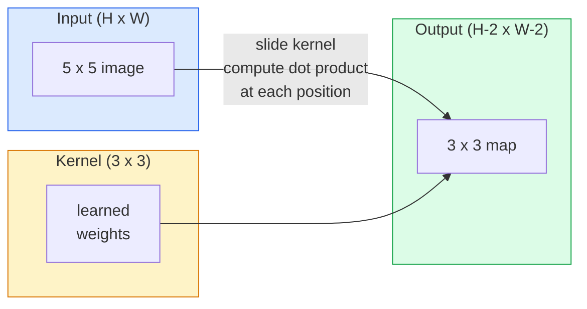
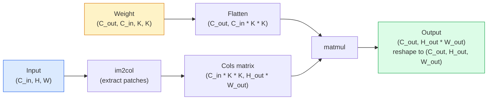

# تحويلات من الصفر من الصفر لتحقيق تحويلات

> التموج هو طبقة صغيرة كثيفة تتسلل عبر صورة، وتشارك نفس الوزن في كل موقع.

> **【中文解读】**卷积本质上是一个"سذاجة صغيرة كاملة التواصل الطبقة" باستخدام مجموعة واحدة من الوزن في كل موقع من الصورة حساب نقاط积. هذا يعطي لنا اثنين من الخصائص الرئيسية:平移等变性: ((دخول متحرك، خروج يتبع الحركة) والفاصل المشترك (((المتصفح نفس الخصائص المحقق على جميع الصورة) CNN 之所以能统治计算机视觉十余年 ((2012-2020) ، تماما لأن卷积 هو المعلومات الصورة المتحركة إلى الوصول الصحيح إلى الاختيارات.

**Type:** Build | **类型:** 动手
**Languages:** Python | **语言:** Python
**Prerequisites:** Phase 3 (Deep Learning Core), Phase 4 Lesson 01 (Image Fundamentals) | **前置知识:** Phase 3（深度学习核心），Phase 4 Lesson 01（图像基础）
**Time:** ~75 minutes | **时间:** ~75 分钟

## أهداف التعلم

- تنفيذ التخزين الثنائي الأبعاد من الصفر باستخدام NumPy فقط، بما في ذلك إصدار الحلقة المربطة والمركز `im2col`الإصدار
   فقط باستخدام NumPy من صفر تحقيق 2D 卷积، بما في ذلك嵌套循环版 و向量化 im2col 版
- احسب حجم المساحة المخرجة لأي مزيج من حجم المدخل وحجم النواة والشحنة والخطوة ، وبرر`(H - K + 2P) / S + 1`الصيغة
  计算任意输入大小、核大小、填充和步幅组合下输出尺寸,理解公式 `(H - K + 2P) / S + 1`
- النواة المصممة يدويا (حافة، ضبابية، حادة، صوبيل) ويشرح لماذا كل واحد ينتج نمط التفعيل الذي يفعل
  手动设计核(边缘检测、模糊、化、Sobel), شرح كل نوع من النووات لماذا تنتج على النحو التشغيلي
- تحويلات الدرج إلى مستخرج خاصية وربط عمق الدرج بحجم الحقل الاستقبالي
  تعبئة العديد من الطبقات المكونة لتكون مُجردة، فهم العلاقة بين عمق التجمع والشعور

> **【中文解读】**يُدعى أهداف التعلم المفردة التي يجب أن تتحكم فيها بعد الانتهاء من الدورة.


## المشكلة المشكلة المشكلة

طبقة متصلة بالكامل على صورة RGB 224 × 224 ستحتاج إلى 224 * 224 * 3 = 150,528 وزناً إدخالياً لكل خلية عصبية. طبقة واحدة مخفية مع 1000 وحدة هي بالفعل 150 مليون مبرمير قبل أن تتعلم أي شيء مفيد. والأسوأ من ذلك، أن هذه الطبقة لا تملك فكرة أن الكلب في الأعلى اليسار وكلب في الأسفل اليمين هي نفس النمط. إنه يعامل كل موقع بيكسل على أنه مستقل، وهو أمر خاطئ تماماً بالنسبة للصور: ترجمة قطة بثلاثة بيكسل لا يجب أن تجبر الشبكة على إعادة تعلم المفهوم.

> في 224x224 RGB  الصورة كل طبقة متصلة كل عصبية تحتاج 224 * 224 * 3 = 150,528 权输入. واحد فقط من 1000 وحدة خفية طبقة لديها بالفعل 1.5 مليار عنصر  قبل أن تتعلم أي شيء مفيد. أسوأ من ذلك، تلك الطبقة لا تعرف الكلاب في الزاوية اليسرى والكلاب في الزاوية اليمنى السفلى هي نفس النموذج.

> **【中文解读】**الصورة المرتبطة بالكامل لديها مشاكل قاتلة: 1) انفجار الجوانب  224x224  كل عصب للصورة يحتاج إلى 150,000 وزن ؛ 2)  عدم التغير المستوي  القط في الزاوية اليسرى والقط في الزاوية اليمنى اليمنى تم اعتبارهما نموذجا مختلفا تماما.

الخصائص الثانية التي يحتاجها نموذج الصورة هي**translation equivariance**(تغير الناتج عند تغير المدخل) و **parameter sharing**(المكشف نفسه يعمل في كل مكان) الطبقات الكثيفة تعطيك لا شيء. التحول يعطيك كليهما مجانا.

> الصورة الموديل تحتاج إلى اثنين من الخصائص هي**平移等变性**(إدخال و تحرك) و**参数共享**(المختبرات نفسها تعمل في جميع المواقع)

لم يتم اختراع التحول للتعلم العميق. إنها نفس العملية التي تعمل على ضغط JPEG ، والضباب الغاسسي في Photoshop ، وكشف الحافة في الرؤية الصناعية ، وجميع مرشحات الصوت التي تم شحنها من أي وقت مضى. السبب في سي أن إنز هيمنت على ImageNet من 2012 إلى 2020 هو أن التحول هو السباق الصحيح للبيانات التي ترتبط بها القيم القريبة ويمكن أن يظهر نفس النمط في أي مكان.

> لم يتم اختراع الكولومبيوتر للتعلم العميق. إنه محرك JPEG  الضغط  Photoshop 高斯模糊                                                                                                                                                                                                                                                                                                                                                                                                                                                                                                  

> **【拓展：CNN 的工业应用】**卷积并非深度学习发明的──JPEG 压缩、Photoshop 模糊、工业视觉边缘检测、音频波器都使用卷积──في مجال الذكاء الاصطناعي، قامت CNN بتحريك الاختبار المستهدف في السيارات الذاتية ((YOLO) 、医学影像分析、人脸识别(FaceNet) وغيرها من التطبيقات الأساسية──

## المفهوم الأساسي

### "كلمة واحدة، تتزلج "كلمة واحدة، تتسلل

تأخذ صيغة ثنائية الأبعاد ماتريساً صغيرةً للوزن تسمى النواة (أو المرشح) ، وتسلطها عبر المدخل، وتحسب في كل موقع مجموع المنتجات الحكيمة عن العناصر. يصبح هذا المبلغ بكسلًا واحدًا للخروج.

> 2D 卷积取一个称为核或波器的小权重矩阵,在输入上滑它,在每个位置计算每个元素乘积之和.



مثال 3x3 ملموس على مدخل 5x5 (لا ملابس، خطوة 1):

> في 5x5 输入上具体 3x3示例(无填充,步幅 1):

```
Input X (5 x 5):                Kernel W (3 x 3):

  1  2  0  1  2                   1  0 -1
  0  1  3  1  0                   2  0 -2
  2  1  0  2  1                   1  0 -1
  1  0  2  1  3
  2  1  1  0  1

The kernel slides across every valid 3 x 3 window. Output Y is 3 x 3:

 Y[0,0] = sum( W * X[0:3, 0:3] )
 Y[0,1] = sum( W * X[0:3, 1:4] )
 Y[0,2] = sum( W * X[0:3, 2:5] )
 Y[1,0] = sum( W * X[1:4, 0:3] )
 ... and so on
```

هذه الصيغة الوحيدة**shared weights, locality, sliding window**كل شيء آخر هو الحساب

> ذلك واحد الصيغة**共享权重、局部性、滑动窗口**就是全部思想──其他都是簿记──

> **【中文解读】**卷积的全部思想缩短为三点:共享权重(同一组参数在所有位置复用) 局部性(每次只看一个小窗口) 滑动窗口(次次遍历所有位置) ;;输出 Y 的每个元素是核和输入窗口的点积──

### صيغة حجم الخروج

نظراً لقياس مساحة المدخلات`H`، حجم النجم`K`، التشويش`P`، خطوة`S`:

```
H_out = floor( (H - K + 2P) / S ) + 1
```

تذكر هذا، ستحسبها عشرات المرات لكل معمارة

> تذكر هذه الصيغة. ستحسبها في كل بنية.

> **【中文解读】**输出尺寸公式 `H_out = floor((H - K + 2P) / S) + 1`هو تصميم أي CNN 架构时最常用的计算──"المثل التدبير"指让H_out = H(当S=1 时),此时P = (K-1) /2/──这就是为什么3x3 核最流行它是最小的奇数核,有明确的中心点──

| Scenario | H | K | P | S | H_out | 中文说明 |
|----------|---|---|---|---|-------|--------|
| Valid conv, no padding | 32 | 3 | 0 | 1 | 30 | 无填充，尺寸缩小 |
| Same conv (preserves size) | 32 | 3 | 1 | 1 | 32 | 同填充，保持尺寸 |
| Downsample by 2 | 32 | 3 | 1 | 2 | 16 | 步幅2，下采样 |
| Pool 2x2 | 32 | 2 | 0 | 2 | 16 | 池化层 |
| Large receptive field | 32 | 7 | 3 | 2 | 16 | 大感受野 |

"المثل" يعني اختيار P بحيث H_out == H عندما S == 1. بالنسبة K غير مقارنة، وهذا هو P = (K - 1) / 2. لهذا السبب 3x3 النواة تهيمن  هم أصغر النواة غير مقارنة التي لا تزال لديها مركز.

### أملأ

بدون التدفق، كل صعوبة تقلص خريطة الميزات. قم بتجميع 20 منها وتصبح صورتك 224x224 184x184، مما يضيع الحساب على الحدود ويعقد الاتصالات المتبقية التي تحتاج إلى أشكال مطابقة.

> لا تملأ، كل مرة يتمّ تعبئة الصور تتقلص. بعد تعبئة 20 طبقة تصورك 224x224 تصور 184x184، تضيع الحسابات على الحدود، وتجعل الحاجة إلى صيغة مطابقة من الاختلافات المتصلة تصبح معقدة.

```
Zero padding (P = 1) on a 5 x 5 input:

  0  0  0  0  0  0  0
  0  1  2  0  1  2  0
  0  0  1  3  1  0  0
  0  2  1  0  2  1  0       Now the kernel can centre on pixel
  0  1  0  2  1  3  0       (0, 0) and still have three rows and
  0  2  1  1  0  1  0       three columns of values to multiply.
  0  0  0  0  0  0  0
```

الأساليب التي تواجهها في الممارسة:`zero`(أكثر شيوعًا) ،`reflect`(مراياً على الحافة، يتجنب الحدود الصلبة في النماذج التوليدية)`replicate`(نسخ الحافة) ،`circular`(ملفوفة حولها، تستخدم في مشاكل الورم الحمضي).

> 实践中遇到的模式:`zero`(أفضل رؤى)`reflect`(镜像边缘,避免生成模型中的硬边界)`replicate`(مُعدّة)`circular`(المنطقة، للمسائل المرتبطة بالمنطقة)

### خطوة خطوة

خطوة هي حجم خطوة من المنحدر. `stride=1`هو الافتراضي`stride=2`يقلل من نصف الأبعاد الفضائية و هو الطريقة الكلاسيكية لإخراج العينات داخل سي إن إن دون طبقة تجميع منفصلة

> 步幅是滑动的步长──`stride=1`هو القيمة المُعتمدة`stride=2`إلى حد ما، فإنّ المجال يقلل إلى نصف، في سي إن إن داخل لا يستخدم مستوى التجميع لوحده.

```
Stride 1 on a 5 x 5 input, 3 x 3 kernel:

  starts: (0,0) (0,1) (0,2)        -> output row 0
          (1,0) (1,1) (1,2)        -> output row 1
          (2,0) (2,1) (2,2)        -> output row 2

  Output: 3 x 3

Stride 2 on the same input:

  starts: (0,0) (0,2)              -> output row 0
          (2,0) (2,2)              -> output row 1

  Output: 2 x 2
```

### قنوات دخول متعددة

الصور الحقيقية لديها ثلاثة قنوات. تحويل 3x3 على مدخل RGB هو في الواقع حجم 3x3x3: قطعة 3x3 واحدة لكل قناة مدخلة. في كل موقف فضائي، تضيف وتضاعف عبر جميع القنوات الثلاثة وتضيف تحيزًا.

> الصورة الحقيقية لديها ثلاثة مسارات. ‬ ‬ ‬ ‬ ‬ ‬ ‬ ‬ ‬ ‬ ‬ ‬ ‬ ‬ ‬ ‬ ‬ ‬ ‬ ‬ ‬ ‬ ‬ ‬ ‬ ‬ ‬ ‬ ‬ ‬ ‬ ‬ ‬ ‬ ‬ ‬ ‬ ‬ ‬ ‬ ‬ ‬ ‬ ‬ ‬ ‬ ‬ ‬ ‬ ‬ ‬ ‬ ‬ ‬ ‬ ‬ ‬ ‬ ‬ ‬ ‬ ‬ ‬ ‬ ‬ ‬ ‬ ‬ ‬ ‬ ‬ ‬ ‬ ‬ ‬ ‬ ‬ ‬ ‬ ‬ ‬ ‬ ‬ ‬ ‬ ‬ ‬ ‬ ‬ ‬ ‬ ‬ ‬ ‬ ‬ ‬ ‬ ‬ ‬ ‬ ‬ ‬ ‬ ‬ ‬ ‬ ‬ ‬ ‬ ‬ ‬ ‬ ‬ ‬ ‬ ‬ ‬ ‬ ‬ ‬ ‬ ‬ ‬ ‬ ‬ ‬ ‬ ‬ ‬ ‬ ‬ ‬ ‬ ‬ ‬ ‬ ‬ ‬ ‬ ‬ ‬ ‬ ‬ ‬ ‬ ‬ ‬ ‬ ‬ ‬ ‬ ‬ ‬ ‬ ‬ ‬ ‬ ‬ ‬ ‬ ‬ ‬ ‬ ‬ ‬ ‬ ‬ ‬ ‬ ‬ ‬ ‬ ‬ ‬ ‬ ‬ ‬ ‬ ‬ ‬ ‬ ‬ ‬ ‬ ‬ ‬ ‬ ‬ ‬ ‬ ‬ ‬ ‬ ‬ ‬ ‬ ‬ ‬ ‬ ‬ ‬ ‬ ‬ ‬ ‬ ‬ ‬ ‬ ‬ ‬ ‬ ‬ ‬ ‬ ‬ ‬ ‬ ‬ ‬ ‬ ‬ ‬ ‬ ‬ ‬ ‬ ‬ ‬ ‬ ‬ ‬ ‬ ‬ ‬ ‬ ‬ ‬ ‬ ‬ ‬ ‬ ‬ ‬ ‬ ‬ ‬ ‬ ‬ ‬ ‬ 

```
Input:   (C_in,  H,  W)        3 x 5 x 5
Kernel:  (C_in,  K,  K)        3 x 3 x 3 (one kernel)
Output:  (1,     H', W')       2D map

For a layer that produces C_out output channels, you stack C_out kernels:

Weight:  (C_out, C_in, K, K)   e.g. 64 x 3 x 3 x 3
Output:  (C_out, H', W')       64 x 3 x 3

Parameter count: C_out * C_in * K * K + C_out   (the + C_out is biases)
```

هذه الخط الأخير هو الذي سوف تحسب عند تخطيط نموذج.`64 * 3 * 3 * 3 + 64 = 1,792`المعلمات. رخيصة.

> آخر خط هو ما عليك القيام به في وضع النموذج.`64 * 3 * 3 * 3 + 64 = 1,792`个参数──很便宜──

> **【中文解读】**عدد المعايير في الحساب: عدد المعايير = C_out × C_in × K × K + C_out (مخصصة)  3 输入通道、64 输出通道 3x3 卷积只需要 1,792 个参数,远少于全连接层──

### خدعة إم توكول

الحلقات المضغوطة سهلة القراءة ولكن بطيئة. تريد GPU مضاعفات المصفوفة الكبيرة. الخدعة: تسطح كل نافذة حقل الاستقبال من المدخل إلى عمود واحد من المصفوفة الكبيرة، تسطح النواة إلى صف، وتصبح التخزين بأكمله مالم واحد.

> 嵌套循环易读但慢──GPU 需要大矩阵乘法──: سيتم إدخال كل إحساس من نوافذ الحدود إلى صف واحد من الم矩阵 الكبيرة، سيتم تكوين الموجات النووية إلى صف واحد، والحجم كله يتحول إلى محور واحد من الم矩阵乘法──



كل تنفيذ إنتاج conv هو نوع من هذه بالإضافة إلى خدوش التخزين المتخزين (conv مباشرة، Winograd، FFT conv للنواة الكبيرة). فهم im2col وأنت تفهم الأساس.

> كل درجة إنتاجية تتمثل في تغييرات من هذا، بالإضافة إلى تخطيطات الحفظات المباشرة.

> **【拓展：GPU 加速卷积】**جميع GPUs على التكامل التنفيذي ((cuDNN) هي متغيرات من im2col، بالإضافة إلى缓存分块优化(直接卷积、Winograd、FFT 卷积) ;; فهم im2col 就了解深度学习框架中卷积加速的核心原理──

### حقل استقبالي

3x3 Conv واحد ينظر إلى 9 بيكسلات مدخلة. مكعبين 3x3 Conv و العصبية في الطبقة الثانية ينظر إلى 5x5 بيكسلات مدخلة. 3 3x3 Conv يعطي 7x7.

> 单个3x3 卷积看 9 输入像素──堆叠两个3x3 卷积,第二层神经元看 5x5 输入像素──三个3x3 卷积给出7x7──一般而言:

```
RF after L stacked K x K convs (stride 1) = 1 + L * (K - 1)

With strides:   RF grows multiplicatively with stride along each layer.
```

السبب الكامل "3x3 down all the way" يعمل (VGG، ResNet، ConvNeXt) هو أن 2 3x3 convs ترى نفس مساحة المدخل مثل واحد 5x5 conv ولكن مع أقل ملامح و غير خطية إضافية بينهما.

> "كل استخدام 3x3" ((VGG、ResNet、ConvNeXt) كان سبب كل من المخططات هو أن منطقتين من 3x3 卷积看到的输入区域和一个 5x5 卷积相同, ولكن العنصر أقل, في الوسط هناك أيضا طبقة غير خطية。

> **【中文解读】**堆叠 L 层 K×K 卷积(步幅为1) من الحجم الحاسوب = 1 + L × (K-1) ・・・ هذا هو سبب VGG、ResNet وغيرها من شبكات "مستخدمة بالكامل 3x3": اثنين من 3x3 卷积 من الحجم الحاسوب يساوي واحد 5x5, ولكن العنصر أقل، في الوسط هناك أيضا أكثر من طبقة غير خطية التنشيط‬‬‬‬‬‬‬‬‬‬‬‬‬‬‬‬‬‬‬‬‬‬‬‬‬‬‬‬‬‬‬‬‬‬‬‬‬‬‬‬‬‬‬‬‬‬‬‬‬‬‬‬‬‬‬‬‬‬‬‬‬‬‬‬‬‬‬‬‬‬‬‬‬‬‬‬‬‬‬‬‬‬‬‬‬‬‬‬‬‬‬‬‬‬‬‬‬‬‬‬‬‬‬‬‬‬‬‬‬‬‬‬‬‬‬‬‬‬‬‬‬‬‬‬‬‬‬‬‬‬‬‬‬‬‬‬‬‬‬‬‬‬‬‬‬‬‬‬‬‬‬‬‬‬‬‬‬‬‬‬‬‬‬‬‬‬‬‬‬‬‬‬‬‬‬‬‬‬‬‬‬‬‬‬‬‬‬‬‬‬‬‬‬‬‬‬‬‬‬‬‬‬‬‬‬‬‬‬‬‬‬‬‬‬‬‬‬‬‬‬‬‬‬‬‬‬‬‬‬‬‬‬‬‬‬‬‬‬‬‬‬‬‬‬‬‬‬‬‬‬‬‬‬‬‬‬‬‬‬‬‬‬‬‬‬‬‬‬‬‬‬‬‬‬‬‬‬‬‬‬‬‬‬‬‬‬‬‬‬‬‬‬‬‬‬‬‬‬‬‬‬‬‬‬‬‬‬‬‬‬‬‬‬‬‬‬‬‬‬‬‬‬‬‬‬‬‬‬‬‬‬‬‬‬‬‬‬‬‬‬‬‬‬‬‬‬‬‬‬‬‬‬‬‬‬‬‬‬‬‬‬‬‬‬‬‬‬‬‬‬‬‬‬‬‬‬‬‬‬‬‬‬‬‬‬‬‬‬‬‬‬‬‬‬‬‬‬‬‬‬‬‬‬‬‬‬‬‬‬‬‬
```figure
convolution-kernel
```

## بناءها

## بناء ذلك التدريب المتحرك

### الخطوة الأولى: قم بتحديد المجموعة

ابدأ بأصغر بدائية: وظيفة تضع الصفر حول صفوف H x W.

> من الحد الأدنى من الأصل: واحد في H x W عدد الجماهير حول ملء صفر من وظيفة.

```python
import numpy as np

def pad2d(x, p):
    if p == 0:
        return x
    h, w = x.shape[-2:]
    out = np.zeros(x.shape[:-2] + (h + 2 * p, w + 2 * p), dtype=x.dtype)
    out[..., p:p + h, p:p + w] = x
    return out

x = np.arange(9).reshape(3, 3)
print(x)
print()
print(pad2d(x, 1))
```

خدعة المحورات التابعة`x.shape[:-2]`يعني نفس الوظيفة تعمل على `(H, W)`،`(C, H, W)`أو`(N, C, H, W)`بدون تعديل

> 尾轴技巧 `x.shape[:-2]`يعني نفس الوظيفة لا حاجة إلى تعديل يمكن استخدامها`(H, W)`.`(C, H, W)`أو`(N, C, H, W)`.

### الخطوة 2: التشويق الثنائي الأبعاد مع حلقات مستوى

تنفيذ المرجعية بطيئة ولكن لا لبس فيه. هذا ما`torch.nn.functional.conv2d`في المبدأ.

> 参考实现慢,但无歧义── هذا فى المبدأ هو`torch.nn.functional.conv2d`ما يجب القيام به

```python
def conv2d_naive(x, w, b=None, stride=1, padding=0):
    c_in, h, w_in = x.shape       # 输入：通道数、高、宽
    c_out, c_in_w, kh, kw = w.shape  # 权重：输出通道、输入通道、核高、核宽
    assert c_in == c_in_w          # 输入通道数必须匹配

    x_pad = pad2d(x, padding)     # 填充输入
    h_out = (h + 2 * padding - kh) // stride + 1  # 输出高度
    w_out = (w_in + 2 * padding - kw) // stride + 1  # 输出宽度

    out = np.zeros((c_out, h_out, w_out), dtype=np.float32)
    for oc in range(c_out):               # 遍历每个输出通道
        for i in range(h_out):            # 遍历输出高度
            for j in range(w_out):        # 遍历输出宽度
                hs = i * stride           # 输入中的起始行
                ws = j * stride           # 输入中的起始列
                patch = x_pad[:, hs:hs + kh, ws:ws + kw]  # 提取感受野窗口
                out[oc, i, j] = np.sum(patch * w[oc])      # 点积求和
        if b is not None:
            out[oc] += b[oc]              # 加偏置
    return out
```

أربعة حلقات مستجمعة (قناة الخروج، الصف، العمود، زائد المبلغ الضمني على C_in، kh، kw). هذه هي الحقيقة الأرضية التي سوف تحقق كل تنفيذ أسرع ضد.

> أربع طبقات في حلقة ((输出通道、行、列,加上对 C_in、kh、kw 的隐式求和) ⋅ هذا هو ما سوف تستخدم لتحقيق كل أسرع تحقيق من أساسية قيمة الحقيقية‬

### الخطوة الثالثة: التحقق من ذلك باستخدام النواة المصممة يدوياً باستخدام التصميم اليدوي للتحقق النووي

بناء ذرة صوبيل عمودية، تطبيقها على صورة خطوة اصطناعية، ومشاهدة حافة عمودية يضيء.

> 构建一个垂直索贝尔核,将其应用于合成阶梯图像,观察垂直边缘亮起──

```python
def synthetic_step_image():
    img = np.zeros((1, 16, 16), dtype=np.float32)
    img[:, :, 8:] = 1.0
    return img

sobel_x = np.array([
    [[-1, 0, 1],
     [-2, 0, 2],
     [-1, 0, 1]]
], dtype=np.float32)[None]

x = synthetic_step_image()
y = conv2d_naive(x, sobel_x, padding=1)
print(y[0].round(1))
```

توقع قيم إيجابية كبيرة على العمود 7 (زيادة في البهاء من اليسار إلى اليمين) والصفر في كل مكان آخر. هذه الطباعة الوحيدة هي التحقق من صحة العقل الخاص بك أن الرياضيات صحيحة.

> 预期第 7 列有大正值(从左到右亮度增加),其他地方为零――那一次打印就是对数学是否正确的完整性检查──

### الخطوة الرابعة: إم 2 كول

تحويل كل نافذة بحجم النواة في المدخل إلى عمود من المصفوفة.`C_in=3, K=3`كل عمود 27 رقم

> سيتم تحويل كل نافذة من حجم النواة إلى صف من المصفوفة.`C_in=3, K=3`، كل صف هو 27 个数

```python
def im2col(x, kh, kw, stride=1, padding=0):
    c_in, h, w = x.shape
    x_pad = pad2d(x, padding)
    h_out = (h + 2 * padding - kh) // stride + 1
    w_out = (w + 2 * padding - kw) // stride + 1

    cols = np.zeros((c_in * kh * kw, h_out * w_out), dtype=x.dtype)
    col = 0
    for i in range(h_out):
        for j in range(w_out):
            hs = i * stride
            ws = j * stride
            patch = x_pad[:, hs:hs + kh, ws:ws + kw]
            cols[:, col] = patch.reshape(-1)
            col += 1
    return cols, h_out, w_out
```

لا يزال حلقة Python، ولكن الآن رفع الثقيلة سيكون واحد متمل متجه.

> لا يزال دورة بيثون، ولكن العمل المثقل الآن سيكون ضربة محورية متكاملة.

### الخطوة 5: تسريع التجميع عبر im2col + matmul

استبدل الحلقة الأربعة بمضاعفة ماتريكية واحدة.

> باستخدام محور واحد وبدل أربعة دورات

```python
def conv2d_im2col(x, w, b=None, stride=1, padding=0):
    c_out, c_in, kh, kw = w.shape
    cols, h_out, w_out = im2col(x, kh, kw, stride, padding)
    w_flat = w.reshape(c_out, -1)
    out = w_flat @ cols
    if b is not None:
        out += b[:, None]
    return out.reshape(c_out, h_out, w_out)
```

التحقق من الدقة: تشغيل كلا التنفيذات ومقارنة.

> إصدارات: إصدارات: إصدارات: إصدارات: إصدارات: إصدارات: إصدارات: إصدارات: إصدارات: إصدارات: إصدارات: إصدارات: إصدارات: إصدارات: إصدارات: إصدارات: إصدارات: إصدارات: إصدارات: إصدارات: إصدارات: إصدارات: إصدارات: إصدارات: إصدارات: إصدارات: إصدارات: إصدارات: إصدارات: إصدارات: إصدارات: إصدارات: إصدارات: إصدارات: إصدارات: إصدارات: إصدارات: إصدارات: إصدارات: إصدارات: إصدارات: إصدارات: إصدارات: إصدارات: إصدارات: إصدارات: إصدارات: إصدارات: إصدارات: إصدارات: إصدارات: إصدارات: إصدارات: إصدارات: إصدارات: إصدارات: إصدارات: إصدارات: إصدارات: إصدارات: إصدارات: إصدارات: إصدارات: إصدارات: إصدارات: إصدارات: إصدارات: إصدارات: إصدارات: إصدارات: إصدارات: إصدارات: إصدارات: إص: إصدارات: إصدارات: إص: إصدارات: إص: إص: إص: إصدارات: إصدارات: إص: إصدارات: إص: إص: إص: إص: إص: إص: إص: إص: إص: إص: إص: إص: إص: إص: إص: إص: إص: إص: إص: إص: إص: إص: إص: إص: إص: إص: إص: إص: إص: إص: إص: إص: إ

```python
rng = np.random.default_rng(0)
x = rng.normal(0, 1, (3, 16, 16)).astype(np.float32)
w = rng.normal(0, 1, (8, 3, 3, 3)).astype(np.float32)
b = rng.normal(0, 1, (8,)).astype(np.float32)

y_naive = conv2d_naive(x, w, b, padding=1)
y_im2col = conv2d_im2col(x, w, b, padding=1)

print(f"max abs diff: {np.max(np.abs(y_naive - y_im2col)):.2e}")
```

`max abs diff`يجب أن تكون في الجوار`1e-5`الفرق هو ترتيب التراكم في النقطة العائمة، وليس حشرة.

> `max abs diff`يجب أن تكون`1e-5`الاختلافات هي النتائج التي تسببت في ترتيب التكامل، وليس الحذاء.

### الخطوة 6: مجموعة من الأجزاء المصممة يدوياً

خمسة مرشحات تظهر ما يمكن أن تعبّر به طبقة واحدة قبل أي تدريب

> 5 أجهزة تظهر مستوى واحد من المواد التي يمكن أن تظهر قبل أي تدريب

```python
KERNELS = {
    "identity": np.array([[0, 0, 0], [0, 1, 0], [0, 0, 0]], dtype=np.float32),
    "blur_3x3": np.ones((3, 3), dtype=np.float32) / 9.0,
    "sharpen": np.array([[0, -1, 0], [-1, 5, -1], [0, -1, 0]], dtype=np.float32),
    "sobel_x": np.array([[-1, 0, 1], [-2, 0, 2], [-1, 0, 1]], dtype=np.float32),
    "sobel_y": np.array([[-1, -2, -1], [0, 0, 0], [1, 2, 1]], dtype=np.float32),
}

def apply_kernel(img2d, kernel):
    x = img2d[None].astype(np.float32)
    w = kernel[None, None]
    return conv2d_im2col(x, w, padding=1)[0]
```

تطبق على أي صورة على نطاق الرمادي ، تُضفف ، وتُضفف الحواف ، وتُضفف الشفافات فوق الحواف ، تُضف Sobel-x الحواف العمودية ، تُضف Sobel-y الحواف الأفقية. هذه هي بالضبط الأنماط التي تعلمتها طبقة conv المدربة الأولى في AlexNet و VGG  لأن نموذج الصورة الجيد يحتاج إلى كشف الحواف والبقع بغض النظر عن المهمة التي تأتي في وقت لاحق.

> تطبق على أي صورة ذات جودة خفيفة،模糊柔化、化使边缘清晰、Sobel-x 点亮垂直边缘、Sobel-y 点亮水平边缘── وهذه هي النموذج الذي تمت تعلمه في نهاية المطاف في اليكسنت و في فجج.ج.ج.

> **【拓展：经典卷积核与 CNN 学习】**الوصف الأول من الوصف المتعلم في اليكسنت و VGG وغيره من الشبكات هو تقريباً الوصف النووي لمتصفح الحافة والنقاط اللونية المختبرة مثل هذه التصميمات اليدوية.

## استخدمها في التطبيق العملي

(بيتورش)`nn.Conv2d`يحتوي نفس العملية مع أوتوجراد، نواة CUDA، وتحسين cuDNN.

> بيتورش `nn.Conv2d`مع التشغيل الذاتي الضحية، CUDA 内核和 cuDNN 优化封装了相同操作──形状语义完全相同──

```python
import torch
import torch.nn as nn

conv = nn.Conv2d(in_channels=3, out_channels=64, kernel_size=3, stride=1, padding=1)
print(conv)
print(f"weight shape: {tuple(conv.weight.shape)}   # (C_out, C_in, K, K)")
print(f"bias shape:   {tuple(conv.bias.shape)}")
print(f"param count:  {sum(p.numel() for p in conv.parameters())}")

x = torch.randn(8, 3, 224, 224)
y = conv(x)
print(f"\ninput  shape: {tuple(x.shape)}")
print(f"output shape: {tuple(y.shape)}")
```

التغيير`padding=1`لـ`padding=0`وتخفض الناتج إلى 222 × 222`stride=1`لـ`stride=2`و ينخفض إلى 112 × 112 نفس الصيغة التي حفظتها أعلاه

> - لا .`padding=1`换成 `padding=0`, انخفض إلى 222 × 222 `stride=1`换成 `stride=2`،إنها تنخفض إلى 112 × 112... كما تذكرتها في الصيغة السابقة


> **【拓展：工业部署中的视觉系统】**في التوزيع الصناعي الواقعي، تحتاج النموذج المرئي إلى النظر في التفكير في التأجيل، والنموذج الكبير، والجهاز الحدودي الملائمة وغيرها من المشاكل.

## أرسلها ، أرسلها

هذا الدرس ينتج عن:

> 本课产出:

- `outputs/prompt-cnn-architect.md` عرض يضع، نظراً لقياس المدخلات، ميزانية المعلمات، وحقل الاستقبال المستهدف، مجموعة من`Conv2d`طبقات مع الـ K/S/P الصحيحة في كل خطوة.
  الصينية ترجمة:给定输入尺寸、参数预算和目标感受野,设计每步具有正确的 K/S/P `Conv2d`层堆的提示词──
- `outputs/skill-conv-shape-calculator.md` مهارة تمشي على مستوى شبكة المحدد طبقة بعد طبقة وتعيد الشكل الخروج، والحقل الاستقبال، وعداد المعلمات لكل كتلة.
  ترجمة باللغة الصينية: تدريجياً عبر المواصفات الشبكة و تعود إلى كل قطعة من أشكال الناتج و الحجم والمعايير.

## تمارين التدريب

> **【中文解读】**练题按照易/中级/Hard 三个难度递进──建议至少完成 级级中级的题目,Hard 级适合深入研究或面试准备──


1. **(Easy | 简单)**نظراً لـ 128 × 128 مدخل على مقياس الرمادي و كومة من `[Conv3x3(s=1,p=1), Conv3x3(s=2,p=1), Conv3x3(s=1,p=1), Conv3x3(s=2,p=1)]`، حساب حجم المساحة الخارجة والحقل الاستقبالي في كل طبقة يدويا. التحقق من مع PyTorch `nn.Sequential`من الحافلات المزيفة
   يدوي الحسابات المباشرة للصادرات والحجم والحاسوب باستخدام PyTorch 验证

2. **(Medium | 中等)**التمديد`conv2d_naive`و`conv2d_im2col`للاعتراف`groups`دعيني أريكم ذلك`groups=C_in=C_out`يعيد التخزين بعمق و أن عدد المعايير له`C * K * K`بدلاً من`C * C * K * K`. . .
   扩展卷积函数支持组 参数,验证深度卷积的参数从C×C×K×K 降至C×K×K。

3. **(Hard | 困难)**تنفيذ التخطيط الراجعي لـ `conv2d_im2col`باليد: بالنظر إلى تراجع الخروج، احسب تراجع `x`و`w`- تأكيد ضد`torch.autograd.grad`على نفس المدخلات والوزن. الخدعة: تراجع im2col هو`col2im`و يجب أن تتراكم النوافذ المتداخلة
   手动实现 im2col 卷积的反向传播, باستخدام مشعل.autograd.grad 验证──关键:

## شروط رئيسية

| Term | What people say | What it actually means | 中文释义 |
|------|----------------|----------------------|---------|
| Convolution | "Sliding a filter" | A learnable dot product applied at every spatial location with shared weights; mathematically a cross-correlation, but everyone calls it convolution | 卷积：在所有空间位置用共享权重做可学习的点积 |
| Kernel / filter | "The feature detector" | A small weight tensor of shape (C_in, K, K) whose dot product with a window of input produces one output pixel | 核/滤波器：小型权重张量，与输入窗口做点积产生一个输出像素 |
| Stride | "How far you jump" | The step size between consecutive kernel placements; stride 2 halves each spatial dimension | 步幅：核每次滑动的步长，步幅2将空间维度减半 |
| Padding | "Zeros on the edges" | Extra values added around the input so the kernel can centre on border pixels; `same` padding keeps output size equal to input size | 填充：在输入边缘补零，使核能对齐边界像素 |
| Receptive field | "How much the neuron sees" | The patch of original input that a given output activation depends on, growing with depth and stride | 感受野：一个输出激活值所依赖的原始输入区域 |
| im2col | "The GEMM trick" | Rearranging every receptive window into columns so convolution becomes one big matrix multiply — the core of every fast conv kernel | im2col：将感受野窗口重排为列，使卷积变成矩阵乘法 |
| Depthwise conv | "One kernel per channel" | A conv with `groups == C_in`, computing each output channel from only its matching input channel; the backbone of MobileNet and ConvNeXt | 深度卷积：每通道独立卷积，MobileNet/ConvNeXt 的核心组件 |
| Translation equivariance | "Shift in, shift out" | Property that shifting the input by k pixels shifts the output by k pixels; comes for free with shared weights | 平移等变性：输入平移k像素，输出也平移k像素 |


> **【拓展：数据标注与质量】** تأثير المهام المرئية يعتمد على جودة البيانات المعلنة.‬‬‬‬‬‬‬‬‬‬‬‬‬‬‬‬‬‬‬‬‬‬‬‬‬‬‬‬‬‬‬‬‬‬‬‬‬‬‬‬‬‬‬‬‬‬‬‬‬‬‬‬‬‬‬‬‬‬‬‬‬‬‬‬‬‬‬‬‬‬‬‬‬‬‬‬‬‬‬‬‬‬‬‬‬‬‬‬‬‬‬‬‬‬‬‬‬‬‬‬‬‬‬‬‬‬‬‬‬‬‬‬‬‬‬‬‬‬‬‬‬‬‬‬‬‬‬‬‬‬‬‬‬‬‬‬‬‬‬‬‬‬‬‬‬‬‬‬‬‬‬‬‬‬‬‬‬‬‬‬‬‬‬‬‬‬‬‬‬‬‬‬‬‬‬‬‬‬‬‬‬‬‬‬‬‬‬‬‬‬‬‬‬‬‬‬‬‬‬‬‬‬‬‬‬‬‬‬‬‬‬‬‬‬‬‬‬‬‬‬‬‬‬‬‬‬‬‬‬‬‬‬‬‬‬‬‬‬‬‬‬‬‬‬‬‬‬‬‬‬‬‬‬‬‬‬‬‬‬‬‬‬‬‬‬‬‬‬‬‬‬‬‬‬‬‬‬‬‬‬‬‬‬‬‬‬‬‬‬‬‬‬‬‬‬‬‬‬‬‬‬‬‬‬‬‬‬‬‬‬‬‬‬‬‬‬‬‬‬‬‬‬‬‬‬‬‬‬‬‬‬‬‬‬‬‬‬‬‬‬‬‬‬‬‬‬‬‬‬‬‬‬‬‬‬‬‬‬‬‬‬‬‬‬‬‬‬‬‬‬‬‬‬‬‬‬‬‬‬‬‬‬‬‬‬‬‬‬‬‬‬‬‬‬‬‬‬‬‬‬‬‬‬‬‬‬‬‬‬‬‬‬‬‬‬‬‬‬‬‬‬‬‬‬‬‬‬‬‬‬‬‬‬‬‬‬‬‬‬‬‬‬‬‬‬‬‬‬‬‬‬‬‬‬‬‬‬‬‬‬‬‬‬‬‬‬‬‬‬‬‬‬‬‬‬‬‬‬‬‬‬‬‬‬‬‬‬‬‬

## المزيد من القراءة

> **【中文解读】**延伸阅读 يوفر موارد عالية الجودة للتعلم المتعمق.


- [A guide to convolution arithmetic for deep learning (Dumoulin & Visin, 2016)](https://arxiv.org/abs/1603.07285) الرسومات النهائية للتدليك/التوسع/التوسع التي تقوم كل دورة بتنسخها بهدوء
- [CS231n: Convolutional Neural Networks for Visual Recognition](https://cs231n.github.io/convolutional-networks/) ملاحظات المحاضرة القنونية، بما في ذلك تفسير im2col الأصلي
- [The Annotated ConvNet (fast.ai)](https://nbviewer.org/github/fastai/fastbook/blob/master/13_convolutions.ipynb) دفتر ملاحظات يذهب من التخفيف اليدوي إلى مصنف أرقام مدرب
- [Receptive Field Arithmetic for CNNs (Dang Ha The Hien)](https://distill.pub/2019/computing-receptive-fields/) شرح تفاعلي نوعية الورق لحسابات الحقل الاستقبالي
