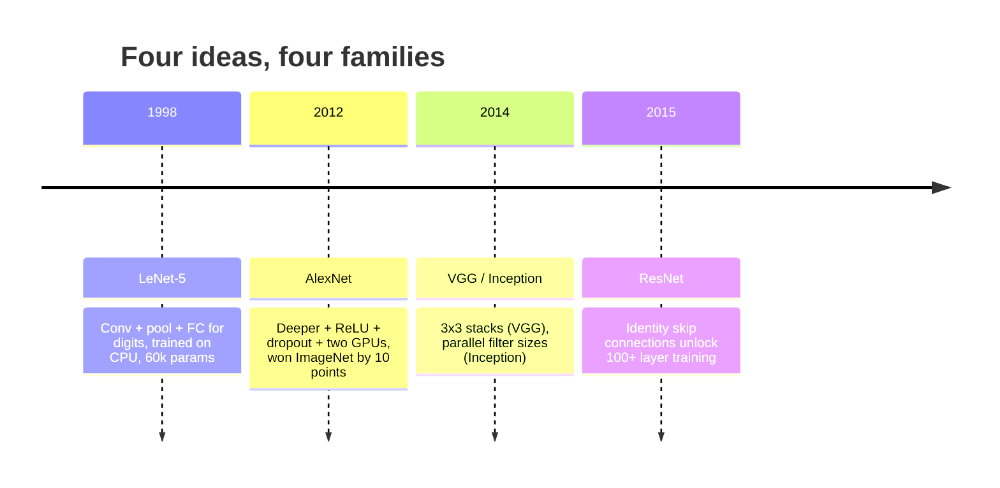
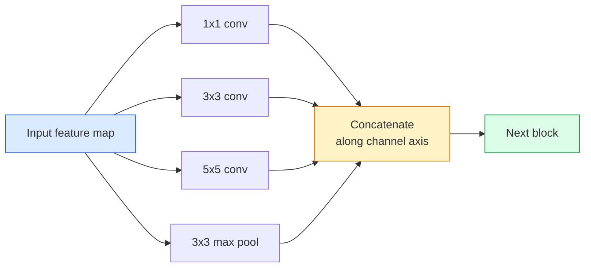
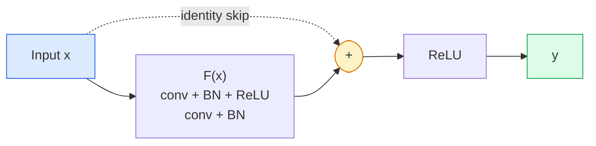

# سي إن إن إن إن إن إن إن إن إن إن إن إن إن إن إن إن إن إن إن إن إن إن إن إن إن إن إن إن إن إن إن إن إن إن إن إن إن إن إن إن إن إن إن إن إن إن إن إن إن إن إن إن إن إن إن إن إن إن إن إن إن إن إن إن إن إن إن إن إن إن إن إن إن إن إن إن إن إن إن إن إن إن إن إن إن إن إن إن إن إن إن إن إن إن إن إن إن إن إن إن إن إن إن إن إن إن إن إن إن إن إن إن إن إن إن إن إن إن إن إن إن إن إن إن إن إن إن إن إن إن إن إن إن إن إن إن إن إن إن إن إن إن إن إن إن إن إن إن إن إن

> كل CNN الرئيسية في السنوات الثلاثين الماضية هي نفس وصفة غير خطية نموذج أسفل مع فكرة جديدة واحدة.

> **【中文解读】**过去三十年所有重要 CNN 都是同一个模板 (卷积-激活-下采样) 加上一个新想法.

**Type:** Learn + Build | **类型:** 学习 + 动手
**Languages:** Python | **语言:** Python
**Prerequisites:** Phase 3 Lesson 11 (PyTorch), Phase 4 Lesson 01 (Image Fundamentals), Phase 4 Lesson 02 (Convolutions from Scratch) | **前置知识:** Phase 3 Lesson 11（PyTorch），Phase 4 Lesson 01（图像基础），Phase 4 Lesson 02（从零实现卷积）
**Time:** ~75 minutes | **时间:** ~75 分钟

## أهداف التعلم

- تتبع العائلة المعماريّة LeNet-5 -> AlexNet -> VGG -> Inception -> ResNet وذكر الفكرة الجديدة الوحيدة التي ساهمت بها كلّ عائلة
- تنفيذ LeNet-5، كتلة في نمط VGG، وResNet BasicBlock في PyTorch، كل تحت 40 سطر
- شرح لماذا تتحول الاتصالات المتبقية إلى شبكة من 1000 طبقة من غير قابلة للتدريب إلى أحدث
- قراءة العمود الفقري الحديث (ResNet-18، ResNet-50) وتنبؤ بشكل الخروج، الحقل الاستقبال، وعدد المعلمات قبل النظر إلى المصدر

> **【中文解读】**يُدعى أهداف التعلم المفردة التي يجب أن تتحكم فيها بعد الانتهاء من الدورة.


## المشكلة المشكلة المشكلة

في عام 2011، حصل أفضل تصنيف ImageNet على 74٪ من الدقة في أفضل 5 نقاط. في عام 2012 حصلت أليكسنت على 85٪. في عام 2015، حققت ريزنت 96٪. لا توجد بيانات جديدة لا يوجد جي بي يو جديد المكاسب جاءت من أفكار الهندسة المعمارية. يجب على مهندس الرؤية العامل أن يعرف من أي ورقة جاءت الفكرة لأن كل العمود الفقري الإنتاجي الذي ترسل في عام 2026 هو إعادة تجميع من نفس القطع  ولأن الأفكار لا تزال تنتقل:

> في عام 2011، أفضل ImageNet Top-5 ٪ 74 ٪ ٪ 2012 AlexNet ٪ 85 ٪ ٪ 2015 ٪ 96 ٪ ٪ ٪ ٪ ٪ ٪ ٪ ٪ ٪ ٪ ٪ ٪ ٪ ٪ ٪ ٪ ٪ ٪ ٪ ٪ ٪ ٪ ٪ ٪ ٪ ٪ ٪ ٪ ٪ ٪ ٪ ٪ ٪ ٪ ٪ ٪ ٪ ٪ ٪ ٪ ٪ ٪ ٪ ٪ ٪ ٪ ٪ ٪ ٪ ٪ ٪ ٪ ٪ ٪ ٪ ٪ ٪ ٪ ٪ ٪ ٪ ٪ ٪ ٪ ٪ ٪ ٪ ٪ ٪ ٪ ٪ ٪ ٪ ٪ ٪ ٪ ٪ ٪ ٪ ٪ ٪ ٪ ٪ ٪ ٪ ٪ ٪ ٪ ٪ ٪ ٪ ٪ ٪ ٪ ٪ ٪ ٪ ٪ ٪ ٪ ٪ ٪ ٪ ٪ ٪ ٪ ٪ ٪ ٪ ٪ ٪ ٪ ٪ ٪ ٪ ٪ ٪ ٪ ٪ ٪ ٪ ٪ ٪ ٪ ٪ ٪ ٪ ٪ ٪ ٪ ٪ ٪ ٪ ٪ ٪ ٪ ٪ ٪ ٪ ٪ ٪ ٪ ٪ ٪ ٪ ٪ ٪ ٪ ٪ ٪ ٪ ٪ ٪ ٪ ٪ ٪ ٪ ٪ ٪ ٪ ٪ ٪ ٪ ٪ ٪ ٪ ٪ ٪ ٪ ٪ ٪ ٪ ٪ ٪ ٪ ٪ ٪ ٪ ٪ ٪ ٪ ٪ ٪ ٪ ٪ ٪ ٪ ٪ ٪ ٪ ٪ ٪ ٪ ٪ ٪ ٪ ٪ ٪ ٪ ٪ ٪ ٪ ٪ ٪ ٪ ٪ ٪ ٪ ٪ ٪ ٪ ٪ ٪ ٪ ٪ ٪ ٪ ٪ ٪ ٪ ٪ ٪ ٪ ٪ ٪ ٪ ٪ ٪ ٪ ٪ ٪ ٪ ٪ ٪ ٪ ٪ ٪ ٪ ٪ ٪

> **【中文解读】**2011-2015 أعوام ٪ تصويب ImageNet ٪ ارتفع إلى 96٪ ٪ ، لا يعتمد على بيانات جديدة أو GPU جديدة ، ولكن الابتكارات التشريعية.

دراسة هذه الشبكات من أجل أيضا يحميك من خطأ شائع: الوصول إلى أكبر نموذج متاح عندما شبكة بحجم LeNet قد تحل المشكلة. MNIST لا تحتاج إلى ResNet. معرفة منحنى التوسع لكل أسرة يخبرك أين الجلوس عليه.

> 按顺序学习这些网络还能让你避免一个常见错误: عندما تكون شبكة LeNet كبيرة تستطيع حل المشاكل، إلا باستخدام أكبر نموذج متاح.

## المفهوم الأساسي

### الأفكار الأربعة التي غيرت الرؤية



لا شيء آخر في الرؤية الكلاسيكية يهم كثيرا مثل هذه القفزات الأربعة.

> لا يوجد شيء آخر في الفيديو الكلاسيكي أكثر أهمية من هذه الـ 4 مرات

### "لينيت-5" (1998)

جهاز التعرف على الأرقام من يان ليكون. 60.000 ملامح. كتبتين من حفرة المجمعات، و طبقتين متصلتين بالكامل، تنشطات التان.

> جهاز تحديد الرقمية يان ليكون. 60.000 عنصر.

```
input (1, 32, 32)
  conv 5x5 -> (6, 28, 28)
  avg pool 2x2 -> (6, 14, 14)
  conv 5x5 -> (16, 10, 10)
  avg pool 2x2 -> (16, 5, 5)
  flatten -> 400
  dense -> 120
  dense -> 84
  dense -> 10
```

كل ما يسميه العالم الحديث CNN  التناوبات المتناوبة وتخفيض العينات تغذية رأس المصنف الصغير  هو LeNet مع المزيد من الطبقات، قنوات أكبر، وتفعيلات أفضل.

> العالم الحديث يسميه كل شيء من سي إن إن  التبديل والتحويل إلى نوع صغير من المجموعات  هو أن هناك المزيد من الطبقات  أكبر الممرات  وأفضل تنشيط لينيت

> **【中文解读】**تعريف LeNet-5 جميع الموديلات الأساسية لـ CNN:卷积 → 池化 → 卷积 → 池化 → 全连接── فقط 60.000 جزيئة، ولكنها وضعت بنية أساسية لنظام التعلم البصري المتعمق──

### أليكسنت (2012) نقطة انفجار للتعلم العميق

ثلاثة تغييرات كسر ImageNet معا:

> ثلاثة تغييرات مشتركة تمكننا من إختراق ImageNet:

1. **ReLU**بدلاً من التن، تتوقف الدرجات عن التلاشى، وتسرع التدريب بمعدل ستة
2. **Dropout**في الرأس المتصل بالكامل، التنظيم يصبح طبقاً، وليس خدعة.
3. **Depth and width**خمسة طبقات مغلقة، ثلاث طبقات كثيفة، ملامح 60 ميتر، تدرب على GPUs مع نموذج منفصلة بينهم.

لا يزال الصورة 2 في الورقة تظهر أن GPU تم تقسيمها إلى تيارين متوازين. كان هذا التوازي حلًا للأجهزة ، وليس رؤية معمارية  ولكن الأفكار الثلاثة أعلاه لا تزال موجودة في كل نموذج تستخدمه.

> الرسم الثاني من المقال يظهر أن الجيبو تم تقسيمها إلى اثنين من التيارات الموازية.

> **【拓展：AlexNet 的遗产】**ثلاثة ابتكارات أُدّعت على أليكسنت حتى الآن لا توجد: 1) حلّت وظيفة ReLU  تفعيل مشكلة التناقض التدريجي؛ 2) منع الانقطاع، وذلك لمنع التكامل المضطرب؛ 3) تحسين التكبير في التكامل في التكامل في التكامل في التكامل في التكامل في التكامل في التكامل في التكامل في التكامل في التكامل في التكامل في التكامل في التكامل في التكامل في التكامل في التكامل في التكامل في التكامل في التكامل في التكامل في التكامل في التكامل في التكامل في التكامل في التكامل في التكامل في التكامل في التكامل في التكامل في التكامل في التكامل في التكامل في التكامل في التكامل في التكامل في التكامل في التكامل في التكامل في التكامل في التكامل في التكامل في التكامل في التكامل في التكامل في التكامل في التكامل في التكامل في التكامل في التكامل في التكامل في التكامل في التكامل في التكامل في التكامل في التكامل في التكامل في التكامل في التكامل في التكامل في التكامل في التكامل في التكامل في التكامل في التكامل في التكامل في التكامل في التكامل في التكامل في التكامل في التكامل في التكامل في التكامل في التكامل في التكامل في التكامل في التكامل في التكامل في التكنول في التكنول في التكنولولولولولولولولولولولولولولولولولولولولولولولولولولوجيا.

### (VGG (2014) ‬ 3x3 ‬ ‬ ‬ ‬ ‬ ‬ ‬ ‬ ‬ ‬ ‬

سأل VGG: ماذا يحدث إذا استخدمت فقط 3x3 التوترات وتذهب عميقًا؟

> إذا استخدمت فقط 3x3 卷积 ثم تعمقت، ماذا سيحدث؟

```
stack:   conv 3x3 -> conv 3x3 -> pool 2x2
repeat:  16 or 19 conv layers
```

يرى 2 قوائم 3 × 3 نفس مساحة مدخل 5 × 5 مثل 1 قوائم 5 × 5 ولكن مع معايير أقل (2 * 9 * C^2 = 18C^2 مقابل 25 * C^2) و ReLU إضافي في المقابل. حول VGG هذه الملاحظة إلى بنية كاملة. جعل البساطة  نوع كتلة واحدة ، تكرر  نقطة مرجع لكل ما جاء بعد ذلك.

> 两个 3x3 卷积看的 5x5 输入区域与一个 5x5 卷积相同,但参数更少(2*9*C^2 = 18C^2 مقابل 25*C^2), وسط هناك إضافية ReLU。VGG سوف تحويل هذا الملاحظة إلى بنية كاملة。简洁性 块类型,重复使用 让它成为后的参考点──

تكلفة: 138 مليون مبرمير، بطيئة التدريب، مكلفة في الاستنتاج.

> 代价:1.38 مليار参数, تدريب سريع, تقديم توصيات باهظة الثمن

### إنشاء (في نفس العام)

وكانت إجابة جوجل على "ما هو حجم النواة التي يجب أن أستخدمها؟" هي: جميعها، بالتوازي.

> الجواب على "ماذا يجب أن تستخدم النووي الكبير؟" هو:



يخصص كل فروع  1x1 للخليط القناة، 3x3 للنسجة المحلية، 5x5 للأنماط الأكبر، التجميع لميزات عدم تغير التحول  والقمع يسمح للطبقة التالية اختيار أي فروع مفيدة. استخدم الفروع v1 تحريكات 1x1 داخل كل فروع كعقدة زجاجة للحفاظ على عدد المعلمات.

> كل فروع متخصصة في مختلف الجوانب1x1 يستخدم في المخلوقات المشتركة،3x3 يستخدم في التركيبات المحلية،5x5 يستخدم في النمط الأكبر، وتحديد المكونات المتنقلة لا تتغير الصفات拼接让下层可以选择有用的分支.

### مشكلة التدهور

في عام 2015 ، عملت VGG-19 ولم تعمل VGG-32. كان من المفترض أن تساعد العمق ، ولكن بعد ~ 20 طبقة ، ازدادت سوء التدريب وفقدان الاختبار. هذا ليس مبالغ فيه. هذا هو المحافظ الذي يفشل في العثور على أوزان مفيدة لأن التراجعات تقلص بشكل مضاعف عبر كل طبقة.

> بحلول عام 2015، يمكن أن تعمل VGG-19 ولكن VGG-32 لا تذهب. كان ينبغي أن يكون هناك قدرة على المساعدة، ولكن أكثر من 20 مستوى بعد التدريب والاختبار فقدان أصبح أسوأ.

```
Plain deep network:
  y = f_L( f_{L-1}( ... f_1(x) ... ) )

Gradient wrt early layer:
  dL/dW_1 = dL/dy * df_L/df_{L-1} * ... * df_2/df_1 * df_1/dW_1

Each multiplicative term has magnitude roughly (weight magnitude) * (activation gain).
Stack 100 of them with gains < 1 and the gradient is effectively zero.
```

عملت VGG في 19 طبقة لأن معيار اللحظة (المطبوع في وقت واحد) أبقى التفعيلات على نطاق جيد. ولكن حتى معيار اللحظة لم يتمكن من إنقاذ عمق يتجاوز 30 طبقة.

> في 19 مستوى، كان العمل في VGG بسبب استحداث التوحيد الجماعي ([1]) في نفس الوقت، والحفاظ على تطور جيد في النشاط. ولكن حتى مع استحداث التوحيد الجماعي لا يمكن أن يتم الحفاظ عليه أكثر من 30 مستوى من عمق.

### ResNet (2015)  بقية التواصل  دراسة عميقة

هو، (تشانغ) ، (رين) ، (سون) اقترحوا تغييرًا واحدًا يصلح كل شيء

> لقد اقترح (هانغ رين) تغييرًا لتحسين كل شيء

```
standard block:   y = F(x)
residual block:   y = F(x) + x
```

- نعم`+ x`يعني أن الطبقة يمكنها دائماً أن تختار عدم فعل أي شيء بالقيادة`F(x)`إلى الصفر. إن شبكة ResNet ذات 1000 طبقة هي الآن على أقصى حد سيئة مثل شبكة ذات 1 طبقة، لأن كل كتلة إضافية لديها نافذة هروب بسيطة. مع هذه الضمانة، فإن المتحسنين مستعدون لجعل كل كتلة * قليلا * مفيدة  و مفيدة قليلا، مكبأة 100 مرة، هي حالة من الفن.

> `+ x`يعني أن هذه الطبقة يمكن أن تمر بها`F(x)`التوجه إلى الصفر للاختيار لا شيء يفعله. إن شبكة ResNet ذات 1000 مستوى هي الآن أكثر فأكثر مما يفعله شبكة ذات 1 مستوى، لأن كل بلاك إضافي لديه طريق هروب بسيط.



هناك نوعان من الكتلة تظهر في كل مكان:

> 两种块变体无处不在:

- **BasicBlock**(ريسنت -18، ريسنت -34): اثنان من طائرات 3×3، قفز حول كليهما.
  中文翻译: 基本块两个3x3卷积,跨两者的跳跃──
- **Bottleneck**(الـ 50، -101، -152): 1x1 أسفل، 3x3 وسط، 1x1 فوق، قفز حول الثلاثة. أرخص عندما عدد القنوات مرتفع.
  中文翻译:瓶块1x1 降维、3x3 中间、1x1 升维,跨三者跳──通道数高时更便宜──

عندما يتعين على المخطط عبور عينة أسفل (خطوة = 2) ، يتم استبدال مسار الهوية بمخطوة 1x1 = 2 conv لتطابق الأشكال.

> عندما يطلب القفز عبر التقاطع، يتم استبدال الطرق إلى 1x1 قدم = 2 في حجم صيغة مطابقة.

### لماذا المهمة البقايا خارج الرؤية

كانت الفكرة ليست حقا حول تصنيف الصور. كانت حول تحويل الشبكات العميقة من "تعبر أصابعك وتأمل أن تتحرى تراجع" إلى أداة هندسية موثوقة ومتوسطة. كل محول سوف تقرأ عن المرحلة التالية لديها نفس الاتصال القفز بالضبط في كل كتلة. بدون ResNet، لا يوجد GPT.

> هذه الفكرة ليست في الواقع عن تصنيف الصور. إنها عن تحويل شبكة العميقة من "تدابير الصلاة يمكن أن تبقى حية" إلى أداة هندسية موثوقة يمكن توسيعها.

> **【拓展：残差连接与 Transformer】**غير أن التواصلات المتفرقة غيرت فقط الرؤية ، بل جعلت شبكة العميقة من "تدابير الصلاة يمكن أن تبقى حية" إلى أدوات هندسية موثوقة. كل قطعة من الكتل المتحولة (بما في ذلك GPT、BERT、Claude الخلفية) تستخدم نفس التواصل القصير تماما.`y = F(x) + x`يمكن القول انها واحدة من أهم الوسائل للتعلم العميق.

> **【拓展：工业部署中的视觉系统】**في التوزيع الصناعي الواقعي، تحتاج النموذج المرئي إلى النظر في التفكير في التأجيل، والنموذج الكبير، والجهاز الحدودي الملائمة وغيرها من المشاكل.

```figure
pooling
```

## بناءها

## بناء ذلك التدريب المتحرك

### الخطوة الأولى: لينت-5

إنّه من الضروريّ أن نستخدم "الأنترنت" النقيّ، و"التّنّ" النشط، و"التّجمع المتوسط".`nn.CrossEntropyLoss`أسفل النهر بدلا من الاتصالات الغوسية الأصلية.

> إنّهُ يُمكنُ أنْ يُساعدَكَ في التّحقيق مع الحُسنِ.`nn.CrossEntropyLoss`وليس من الصلة الاصلية

```python
import torch
import torch.nn as nn
import torch.nn.functional as F

class LeNet5(nn.Module):
    def __init__(self, num_classes=10):
        super().__init__()
        self.conv1 = nn.Conv2d(1, 6, kernel_size=5)
        self.conv2 = nn.Conv2d(6, 16, kernel_size=5)
        self.pool = nn.AvgPool2d(2)
        self.fc1 = nn.Linear(16 * 5 * 5, 120)
        self.fc2 = nn.Linear(120, 84)
        self.fc3 = nn.Linear(84, num_classes)

    def forward(self, x):
        x = self.pool(torch.tanh(self.conv1(x)))
        x = self.pool(torch.tanh(self.conv2(x)))
        x = torch.flatten(x, 1)
        x = torch.tanh(self.fc1(x))
        x = torch.tanh(self.fc2(x))
        return self.fc3(x)

net = LeNet5()
x = torch.randn(1, 1, 32, 32)
print(f"output: {net(x).shape}")
print(f"params: {sum(p.numel() for p in net.parameters()):,}")
```

الناتج المتوقع: `output: torch.Size([1, 10])`،`params: 61,706`هذا هو كل تصنيف الأرقام الذي بدأ الرؤية الحديثة.

> 预期输出:`output: torch.Size([1, 10])`.`params: 61,706` هذا هو افتتاح كامل القطع الرقمية في مجال الرؤية الحديثة

### الخطوة الثانية: بلوك VGG

كتلة واحدة قابلة لإعادة الاستخدام: 2 محركات نقل 3×3، ريلو، معيار البطولة، أقصى حوض السباحة.

> واحد بلاك قابل للاستخدام: اثنين 3 × 3 卷积、ReLU、批量归一化、最大池化──

```python
class VGGBlock(nn.Module):
    def __init__(self, in_c, out_c):
        super().__init__()
        self.conv1 = nn.Conv2d(in_c, out_c, kernel_size=3, padding=1)
        self.bn1 = nn.BatchNorm2d(out_c)
        self.conv2 = nn.Conv2d(out_c, out_c, kernel_size=3, padding=1)
        self.bn2 = nn.BatchNorm2d(out_c)
        self.pool = nn.MaxPool2d(2)

    def forward(self, x):
        x = F.relu(self.bn1(self.conv1(x)))
        x = F.relu(self.bn2(self.conv2(x)))
        return self.pool(x)

class MiniVGG(nn.Module):
    def __init__(self, num_classes=10):
        super().__init__()
        self.stack = nn.Sequential(
            VGGBlock(3, 32),
            VGGBlock(32, 64),
            VGGBlock(64, 128),
        )
        self.head = nn.Sequential(
            nn.AdaptiveAvgPool2d(1),
            nn.Flatten(),
            nn.Linear(128, num_classes),
        )

    def forward(self, x):
        return self.head(self.stack(x))

net = MiniVGG()
x = torch.randn(1, 3, 32, 32)
print(f"output: {net(x).shape}")
print(f"params: {sum(p.numel() for p in net.parameters()):,}")
```

ثلاثة كتلة VGG على مدخل حجم CIFAR، حمام التكيف، طبقة خطية واحدة. ~290k المعلمات.

> 3 قطعة VGG على مقاس CIFAR 输入 自适应池化 一线性层──大约 29万参数──对 CIFAR-10 有余──

### الخطوة الثالثة: بلوك ريزنت الأساسي

البناء الأساسي لـ ResNet-18 و ResNet-34.

> قطع بناء جوهرية لـ ResNet-18 و ResNet-34

```python
class BasicBlock(nn.Module):
    def __init__(self, in_c, out_c, stride=1):
        super().__init__()
        self.conv1 = nn.Conv2d(in_c, out_c, kernel_size=3, stride=stride, padding=1, bias=False)
        self.bn1 = nn.BatchNorm2d(out_c)
        self.conv2 = nn.Conv2d(out_c, out_c, kernel_size=3, stride=1, padding=1, bias=False)
        self.bn2 = nn.BatchNorm2d(out_c)
        if stride != 1 or in_c != out_c:
            self.shortcut = nn.Sequential(
                nn.Conv2d(in_c, out_c, kernel_size=1, stride=stride, bias=False),
                nn.BatchNorm2d(out_c),
            )
        else:
            self.shortcut = nn.Identity()

    def forward(self, x):
        out = F.relu(self.bn1(self.conv1(x)))
        out = self.bn2(self.conv2(out))
        out = out + self.shortcut(x)
        return F.relu(out)
```

`bias=False`على طبقات conv هو اتفاقية معيار البطولة  بيتا برنامج BN يدير بالفعل التحيز، لذلك تحمل التحيز conv أيضا هو مضيعة.`shortcut`لا تحتاج إلى كونف حقيقي إلا عندما يتغير عدد الخطوات أو القنوات؛ وإلا فهو هو هوية بدون عملية.

> 卷积层上 `bias=False`لقد تم معالجة الاختيارات، لذلك في الوقت نفسه الحفاظ على الاختيارات هو ضائعة.`shortcut`فقط عندما يتغير عدد الخطوات أو الممرات تحتاج إلى مجتمع حقيقي؛ وإلا فإنه لا يعمل.

### الخطوة الرابعة: إنشاء شبكة ResNet الصغيرة

قم بتجميع أربع مجموعات من البلوكز الأساسية للحصول على شبكة ResNet تعمل للمدخولات ذات حجم CIFAR.

> 堆叠四组 BasicBlock 以获得适用于 CIFAR 尺寸输入工作ResNet。

```python
class TinyResNet(nn.Module):
    def __init__(self, num_classes=10):
        super().__init__()
        self.stem = nn.Sequential(
            nn.Conv2d(3, 32, kernel_size=3, stride=1, padding=1, bias=False),
            nn.BatchNorm2d(32),
            nn.ReLU(inplace=True),
        )
        self.layer1 = self._make_group(32, 32, num_blocks=2, stride=1)
        self.layer2 = self._make_group(32, 64, num_blocks=2, stride=2)
        self.layer3 = self._make_group(64, 128, num_blocks=2, stride=2)
        self.layer4 = self._make_group(128, 256, num_blocks=2, stride=2)
        self.head = nn.Sequential(
            nn.AdaptiveAvgPool2d(1),
            nn.Flatten(),
            nn.Linear(256, num_classes),
        )

    def _make_group(self, in_c, out_c, num_blocks, stride):
        blocks = [BasicBlock(in_c, out_c, stride=stride)]
        for _ in range(num_blocks - 1):
            blocks.append(BasicBlock(out_c, out_c, stride=1))
        return nn.Sequential(*blocks)

    def forward(self, x):
        x = self.stem(x)
        x = self.layer1(x)
        x = self.layer2(x)
        x = self.layer3(x)
        x = self.layer4(x)
        return self.head(x)

net = TinyResNet()
x = torch.randn(1, 3, 32, 32)
print(f"output: {net(x).shape}")
print(f"params: {sum(p.numel() for p in net.parameters()):,}")
```

أربعة مجموعات من كل كتلة. خطوة 2 في بداية مجموعات 2, 3, 4. عدد القناة يضاعف عند كل عينة أسفل. حوالي 2.8M المعلمات. هذه هي الوصفة القياسية التي تتراوح نظيفة إلى ResNet-152.

> أربعة مجموعات لكل مجموعة اثنين من الكتل.

### الخطوة 5: مقارنة الكفاءة من المعلم إلى الميزة

إشغال نفس المدخل عبر الشبكات الثلاثة ومقارنة عدد المعلمات.

> ستقوم بإدخال نفسها من خلال جميع الشبكات الثلاثة وتقارن عدد المعايير

```python
def summary(name, net, x):
    y = net(x)
    params = sum(p.numel() for p in net.parameters())
    print(f"{name:12s}  input {tuple(x.shape)} -> output {tuple(y.shape)}  params {params:>10,}")

x = torch.randn(1, 3, 32, 32)
summary("LeNet5",     LeNet5(),       torch.randn(1, 1, 32, 32))
summary("MiniVGG",    MiniVGG(),      x)
summary("TinyResNet", TinyResNet(),   x)
```

ثلاث نماذج، ثلاث فترات، ثلاث ترتيبات من الكبيرة في عدد المعلمات، لتحقيق CIFAR-10، تحتاج إلى ما يلي: 60٪ من لينييت، 89٪ من ميني فيجي، 93٪ من تيني ريزنيت بعد عدة فترات من التدريب.

> ثلاثة نماذج، ثلاثة أوقات، عدد العناصر ثلاثة أوقات.


## استخدمها في التطبيق العملي

`torchvision.models`يمنحك نسخة مسبقة من كل ما سبق. توقيع الدعوة هو نفسه عبر العائلات، وهو بالضبط نقطة الاستفادة العمود الفقري.

> `torchvision.models`أعطيك نسخة تدريبية سابقة لكل النموذج أعلاه.

```python
from torchvision.models import resnet18, ResNet18_Weights, vgg16, VGG16_Weights

r18 = resnet18(weights=ResNet18_Weights.IMAGENET1K_V1)
r18.eval()

print(f"ResNet-18 params: {sum(p.numel() for p in r18.parameters()):,}")
print(r18.layer1[0])
print()

v16 = vgg16(weights=VGG16_Weights.IMAGENET1K_V1)
v16.eval()
print(f"VGG-16   params: {sum(p.numel() for p in v16.parameters()):,}")
```

يحتوي ريزنت-18 على 11.7 مليون مبرمير. ويجي 16 لديها 138 مليون. مماثلة للدقة الأولى في ImageNet (69.8% مقابل 71.6%). وتشتري لك الاتصالات المتبقية فائدة 12x من كفاءة المبرمير. لهذا السبب هيمنت فاريانات ريزنت من عام 2016 حتى وصول ViT في عام 2021  وما زالت تهيمن على عمليات نشر في العالم الحقيقي حيث الحساب هو القيود.

> **【中文解读】**ريسنت-18 ((1170 مليون عنصر) مقابل VGG-16 ((1.38 مليار عنصر) ، إنماجنت 准确率相近، ولكن كفاءة الجوانب تختلف 12 مرات.

لتحويل التعلم، وصفة هي دائما نفسها: تحميل تدريب مسبق، تجميد العمود الفقري، استبدال رأس المصنف.

> بالنسبة للتعلم المتحرك، فإن النظام هو نفسه: تحميل الوزن، وتحويل شبكة العظام، وتبديل الجهاز.

```python
for p in r18.parameters():
    p.requires_grad = False
r18.fc = nn.Linear(r18.fc.in_features, 10)
```

ثلاث خطات، لديك الآن تصنيف CIFAR من 10 فئات يتراث بالممثلة التي دفعتها ImageNet.

> ثلاثة صفوف كود. أنت الآن لديك 10 فئة CIFAR، ومرثها ImageNet 付费得到表示.


> **【拓展：数据标注与质量】** تأثير المهام المرئية يعتمد على جودة البيانات المعلنة.‬‬‬‬‬‬‬‬‬‬‬‬‬‬‬‬‬‬‬‬‬‬‬‬‬‬‬‬‬‬‬‬‬‬‬‬‬‬‬‬‬‬‬‬‬‬‬‬‬‬‬‬‬‬‬‬‬‬‬‬‬‬‬‬‬‬‬‬‬‬‬‬‬‬‬‬‬‬‬‬‬‬‬‬‬‬‬‬‬‬‬‬‬‬‬‬‬‬‬‬‬‬‬‬‬‬‬‬‬‬‬‬‬‬‬‬‬‬‬‬‬‬‬‬‬‬‬‬‬‬‬‬‬‬‬‬‬‬‬‬‬‬‬‬‬‬‬‬‬‬‬‬‬‬‬‬‬‬‬‬‬‬‬‬‬‬‬‬‬‬‬‬‬‬‬‬‬‬‬‬‬‬‬‬‬‬‬‬‬‬‬‬‬‬‬‬‬‬‬‬‬‬‬‬‬‬‬‬‬‬‬‬‬‬‬‬‬‬‬‬‬‬‬‬‬‬‬‬‬‬‬‬‬‬‬‬‬‬‬‬‬‬‬‬‬‬‬‬‬‬‬‬‬‬‬‬‬‬‬‬‬‬‬‬‬‬‬‬‬‬‬‬‬‬‬‬‬‬‬‬‬‬‬‬‬‬‬‬‬‬‬‬‬‬‬‬‬‬‬‬‬‬‬‬‬‬‬‬‬‬‬‬‬‬‬‬‬‬‬‬‬‬‬‬‬‬‬‬‬‬‬‬‬‬‬‬‬‬‬‬‬‬‬‬‬‬‬‬‬‬‬‬‬‬‬‬‬‬‬‬‬‬‬‬‬‬‬‬‬‬‬‬‬‬‬‬‬‬‬‬‬‬‬‬‬‬‬‬‬‬‬‬‬‬‬‬‬‬‬‬‬‬‬‬‬‬‬‬‬‬‬‬‬‬‬‬‬‬‬‬‬‬‬‬‬‬‬‬‬‬‬‬‬‬‬‬‬‬‬‬‬‬‬‬‬‬‬‬‬‬‬‬‬‬‬‬‬‬‬‬‬‬‬‬‬‬‬‬‬‬‬‬‬‬‬‬‬‬‬‬‬‬‬‬‬‬‬‬‬

## أرسلها ، أرسلها

هذا الدرس ينتج عن:

> 本课产出:

- `outputs/prompt-backbone-selector.md` طلب يختار عائلة CNN المناسبة (LeNet/VGG/ResNet/MobileNet/ConvNeXt) لمهمة معينة وحجم مجموعة البيانات وميزانية الحساب.
  ترجمة باللغة الصينية: given fixed tasks、数据集大小和计算预算,选择正确 CNN 家族的提示词──
- `outputs/skill-residual-block-reviewer.md` مهارة تقرأ وحدات PyTorch وتعريض أخطاء التقاط الاتصال (المقصورة في تغيير الخطوة، ترتيب تفعيل المقصورة، وضع BN بالنسبة إلى الإضافة).
  中文翻译:读取 PyTorch 模块并标记跳跃连接错误的技能──

## تمارين التدريب

> **【中文解读】**练题按照易/中级/Hard 三个难度递进──建议至少完成 级级中级的题目,Hard 级适合深入研究或面试准备──


1. **(Easy | 简单)**عدّي المعلمات يدوياً`TinyResNet`طبقة بعد طبقة. مقارنة مع `sum(p.numel() for p in net.parameters())`أين تذهب معظم ميزانية المعايير  convs، BN، أو رأس المصنف؟
   حسابات القياسية للـ TinyResNet، وتحديد العناصر الرئيسية التي تتطور في أي مكان

2. **(Medium | 中等)**تنفيذ حلقة ضغوط الزجاجة (1x1 -> 3x3 -> 1x1 مع القفز) واستخدامه لبناء شبكة على شكل ResNet-50 لـ CIFAR. مقارنة المعلمات مع `TinyResNet`. . .
   实现 بوتلنيك 块,构建ResNet-50 风格网络,对比参数量──

3. **(Hard | 困难)**إزالة اتصال القفز من `BasicBlock`، تدريب شبكة "مواضعة" من 34 كتلة و 34 كتلة ResNet على CIFAR-10 لمدة 10 حقائق لكل منهما. تخسير التدريب مقابل حقبة لكل منهما. استعادة نتيجة He et al. الشكل 1 حيث تتقارب الشبكة العميقة المواضعة إلى خسارة أعلى من توأمها السطح.
    التدريب على 34 مستوى "بسيط" 网络 و 34 مستوى ResNet,复现 He 等人论文图 1 的结果──

## شروط رئيسية

| Term | What people say | What it actually means | 中文释义 |
|------|----------------|----------------------|---------|
| Backbone | "The model" | The stack of convolutional blocks that produces the feature map fed to the task head | 骨干网络：产生特征图的卷积块堆叠 |
| Residual connection | "Skip connection" | `y = F(x) + x`; lets the optimiser learn identity by setting F to zero, which makes arbitrary depth trainable | 残差连接/跳跃连接：让任意深度可训练 |
| BasicBlock | "Two 3x3 convs with a skip" | The ResNet-18/34 building block: conv-BN-ReLU-conv-BN-add-ReLU | 基本块：ResNet-18/34 的构建单元 |
| Bottleneck | "1x1 down, 3x3, 1x1 up" | The ResNet-50/101/152 block; cheap at high channel counts because the 3x3 runs on a reduced width | 瓶颈块：1x1降维-3x3卷积-1x1升维 |
| Degradation problem | "Deeper is worse" | Past ~20 plain conv layers, both training and test error increase; solved by residual connections, not by more data | 退化问题：层数加深后训练和测试误差都增大 |
| Stem | "The first layer" | The initial conv that converts 3-channel input into the base feature width; usually 7x7 stride 2 for ImageNet, 3x3 stride 1 for CIFAR | 茎部：网络的初始卷积层 |
| Head | "The classifier" | The layers after the final backbone block: adaptive pool, flatten, linear(s) | 头部：骨干网络之后的分类器层 |
| Transfer learning | "Pretrained weights" | Loading a backbone trained on ImageNet and fine-tuning only the head on your task | 迁移学习：加载预训练权重，只微调头部 |

## المزيد من القراءة

> **【中文解读】**延伸阅读 يوفر موارد عالية الجودة للتعلم المتعمق.


- [Deep Residual Learning for Image Recognition (He et al., 2015)](https://arxiv.org/abs/1512.03385) ورقة ريسنت؛ كل رقم يستحق الدراسة
- [Very Deep Convolutional Networks (Simonyan & Zisserman, 2014)](https://arxiv.org/abs/1409.1556)ورقة VGG؛ ما زالت أفضل مرجع ل"لماذا 3x3"
- [ImageNet Classification with Deep CNNs (Krizhevsky et al., 2012)](https://papers.nips.cc/paper_files/paper/2012/hash/c399862d3b9d6b76c8436e924a68c45b-Abstract.html)اليكسنت، ورقة أنهت عصر الميزات المصنوعة يدوياً
- [Going Deeper with Convolutions (Szegedy et al., 2014)](https://arxiv.org/abs/1409.4842) بداية v1؛ فكرة الفلتر الموازي التي لا تزال تظهر في محولات الرؤية
