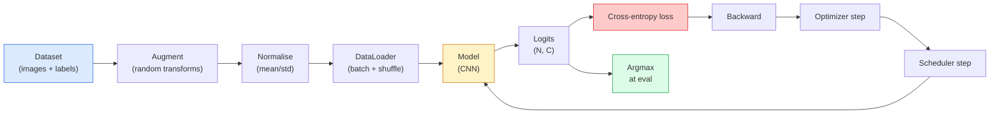

# تصنيف الصور  تصنيف الصور

> المصفوف هو وظيفة من البيكسل إلى توزيع الاحتمالات على الفئات. كل شيء آخر هو الصفحات.

> **【中文解读】**الصورة هي في الأساس وظيفة من الصورة إلى المجموعة احتمالية التوزيع. الاختبار. التقسيم. التسجيل. التسجيل. التسجيل. التسجيل. التسجيل. التسجيل. التسجيل. التسجيل. التسجيل. التسجيل. التسجيل. التسجيل.

**Type:** Build | **类型:** 动手
**Languages:** Python | **语言:** Python
**Prerequisites:** Phase 2 Lesson 09 (Model Evaluation), Phase 3 Lesson 10 (Mini Framework), Phase 4 Lesson 03 (CNNs) | **前置知识:** Phase 2 Lesson 09（模型评估），Phase 3 Lesson 10（迷你框架），Phase 4 Lesson 03（CNN）
**Time:** ~75 minutes | **时间:** ~75 分钟

## أهداف التعلم

- بناء خط أنابيب تصنيف الصور من نهاية إلى نهاية على CIFAR-10: مجموعة البيانات، التكثيف، النموذج، حلقة التدريب، التقييم
- شرح دور كل مكون (محميل البيانات، الخسارة، المتحسن، المجدول، التكبير) وتنبؤ كيفية كسر أي منها يتضح في منحنى الخسارة
- تنفيذ اختلاط، قطع، وتسهيل الملصقات من الصفر وتبرير عندما يستحق إضافة كل واحد
- قراءة ماتريكة الارتباك و جدول الدقة / استدعاء لكل فئة لتشخيص أخطاء مجموعة البيانات ونموذج خارج دقة إجمالية

> **【中文解读】**يُدعى أهداف التعلم المفردة التي يجب أن تتحكم فيها بعد الانتهاء من الدورة.


## المشكلة المشكلة المشكلة

كل مهمة رؤية يتم تقليصها إلى تصنيف الصورة على مستوى ما. الكشف يصنف المناطق. التقسيم يصنف البيكسلات. تحصل على ترتيبات حسب التشابه مع الصف المركزي. الحصول على تصنيف صحيح  حلقة مجموعة البيانات، سياسة التكبير، الخسارة، التقييم  هي المهارة التي تنتقل إلى كل مهمة أخرى في المرحلة.

> كل مهمة بصرية يتم تسليمها إلى حد ما يتم تقليدها إلى فئات الصور. فحص فئات المناطق. فصيلة الفصيلة. فحص حسب ترتيب التشابه مع مركز الفئة. فحص الفئة على دورة مجموعة البيانات.

> **【中文解读】**جميع المهام المرئية المطبقة في الواقع يمكن أن يتم تقليدها إلى فئات الصور: فحص الهدف هو "فئات منطقة"، فحص الفئات هو "فئات الصور" ، فحص الصور هو "ترتيب التشابه في مركز الفئة"، فحص الفئة هو المفتاح لتحقيق كل حلقة من خط تدفق المياه، و هو السيطرة على هذه المرحلة في جميع الدورات التالية.

معظم أخطاء التصنيف ليست في النموذج. إنهم يعيشون في خط الأنابيب: قياس مكسور، مجموعة تدريبية غير مرتبطة، زيادة تتوجه إلى إصلاحات غير صحيحة، تقسيم التحقق من التحقق من التحقق من البيانات التدريبية، معدل التعلم الذي يختلف بصمت بعد العصر 30. إذا كانت سي إن إن ستصل إلى 93٪ على CIFAR-10 مع إعداد صحيح عادة ما تسجل 70-75٪ مع واحدة مكسورة، ويعتبر منحنى الخسارة معقولًا طوال الوقت.

> غالبية حوادث الفئة غير موجودة في النموذج. توجد في الخطوط الجوية: التوطين الخطأ. مجموعة تدريبية غير مرتبطة. زيادة تعريفات الملتوية الملتوية. مجموعة تحديدات التلوث البيانات المتدربة. في العصر الثلاثين.

هذا الدروس يُشغل خط الأنابيب بأكمله يدوياً بحيث يمكن فحص كل جزء`torchvision.datasets`يمكن أن يخفي حشرة

> هذا هو المنهج الذي يستخدم في بناء كل خط المياه، حتى كل جزء يمكن التحقق منه.`torchvision.datasets`أي شيء يمكن أن يخفي الحشرات

> **【中文解读】**غالبية الحالات من الأخطاء لا تتم في النموذج نفسه، بل في الموجات: التأثيرات الفعلية، التدريبات، التشويق، التشويق، التدمير، التسجيلات، التحققات، التلوثات، وتسريبات التعلم، والنشر.

## المفهوم الأساسي

### خط الأنابيب للتصنيف



كل سطر في هذه الحلقة هو حيث يمكن أن يعيش الحشرة.`model(x).softmax()`قبل أن يُحسب الخسارة بصمت المُحافظة الخطأ

> كل سطر في هذه الدورة هو خطأ قد يكون هناك في أي مكان.`model(x).softmax()`مدينة صامتة تحسب خطأ درجة.

> **【中文解读】**流水线中每一行都可能藏有 bug──交叉接收是原始logits(未经软max 的值), إذا تم أولا softmax 再传入损失 函数,梯度计算就完全错了但不会报错── التزويج تنطبق على المدخلات فقط, وليس اللبؤات  باستثناء الاختلاط, الذي يخلط بينهما. `optimizer.zero_grad()`يجب أن يحدث مرة واحدة في كل خطوة؛ تخطي ذلك يجمع تراجعات ويبدو مثل معدل تعلم غير مستقرة للغاية. كل من هذه الحذاءات تسطح منحنى التعلم دون إلقاء خطأ.

### التشابهات المتقاطعة، واللوجيتات، والرطبة

إن تصنيف ينتج `C`أرقام لكل صورة تسمى اللوجيتس. تطبيق softmax يحولها إلى توزيع الاحتمالات:

>  分类器为每张图像产生 `C`个数字,称为 logits. 个数字,称为 logits. 个数字,称为 logits. 个数字,称为 logits. 个数字,称为 logits. 个数字,称为 logits. 个数字,称为 logits. 个数字,称为 logits. 个数字,称为 logits. 个数字. 个数字,称为 logits. 个数字. 个数字. 个数字. 个数字. 个数字. 个数字. 个数字. 个数字. 个数字. 个 logits. 个数字. 个数字. 个数字. 个数字. 个数字. 个数字. 个数. 个数. 个数. 个数. 个数. 个数. 个数. 个数. 个数. 个数. 个数. 个数. 个数. 个数. 个数. 个数. 个数. 个数. 个数. 个数. 个数. 个数. 个数. 个数. 个. 个. 个. 个. 个. 个. 个. 个. 个. 个. 个. 个. 个. 个. 个. 个.

```
softmax(z)_i = exp(z_i) / sum_j exp(z_j)
```

القياس المتقاطع للاندروبي يقيس احتمال السجل السلبي للفئة الصحيحة:

> 交叉衡正确类别的负对数概率:

```
CE(z, y) = -log( softmax(z)_y )
        = -z_y + log( sum_j exp(z_j) )
```

النموذج اليمنى هو المستقر عدديا (الدوج-جميع-exp).`nn.CrossEntropyLoss`يضم softmax + NLL في عملية واحدة و يأخذ اللغات الخام مباشرة. تطبيق softmax بنفسك أولاً هو دائمًا تقريبًا خطأ  تقوم بحساب log(softmax(softmax(z)) ، كمية بلا معنى.

> صيغة اليمين هو عدد الثمن ثابتة`nn.CrossEntropyLoss`في عملية واحدة تتجمع softmax + NLL، مباشرة استلام اللوجات الأصلية.

> **【中文解读】**بيتورش `nn.CrossEntropyLoss`内部已融合 softmax + 负对数似然,直接传入原始logits 即可── إذا قمت بتحديث softmax مرة أخرى إلى الخسارة, يعادل القيام بضع مرات softmax, gradient calcul error تماما──

### لماذا يعمل التوسع

لدى جهاز سي إن إن تحيزًا محرّكًا للتحويل (من تقاسم الوزن) ولكن لا يوجد تحيز متكامل في المحاصيل أو المفاتيح أو الاضطرابات اللونية أو الإغلاق. الطريقة الوحيدة لتعليمها هذه التحديات هي إظهارها بالبيكسلات التي تمارسها. كل تحول عشوائي أثناء التدريب هو طريقة لقول: "هذه الصورتين لها نفس اللقب؛ تعلموا الميزات التي تتجاهل الفرق".

> CNN على التنقل المباشر لديها تعصب ((( من المشاركة في الوزن) ، ولكن على قطع، التحول، اللون 动 أو غط لا يوجد أي تغيرات داخلية.

> **【拓展：数据增强与模型泛化】**تعزيز البيانات هو أقوى وسيلة تحسين القواعد الحرة في الذكاء الاصطناعي الحديث. في تدريبات النموذج التقليدية مثل ResNet、EfficientNet، تؤثر استراتيجيات تعزيز الخطر بشكل مباشر على معدل 3-5% من التحقق.

```
Original crop:  "dog facing left"
Flip:           "dog facing right"       <- same label, different pixels
Rotate(+15):    "dog, slight tilt"
Colour jitter:  "dog in warmer light"
RandomErasing:  "dog with patch missing"
```

القاعدة: يجب أن يحافظ التكبير على اللقب. يمكن لقطة وتدوير رقم على "6" إلى "9"; لهذا المجموعة البيانية تستخدم نطاقات دوران أصغر وتختار التكبيرات التي تحترم التغيرات المحددة للأرقام.

> قواعد: يجب أن تبقي الضخمة لا تتغير. يمكن أن تكون "6" إلى "9" على الأرقام.

### الاختلاط والخفض

التوسع العادي يغير البكسلات لكنه يبقي اللبنانات متواحدة**Mixup**و**cutmix**و تقطع ذلك عن طريق التقاط كليهما

> عادةً ما يزداد التغيرات في الصور لكن لا يزال هناك علامة واحدة**Mixup**和 **cutmix**من خلال إجراء إدخال قيمة على كل منهما، تمكننا من إفساد هذا النقطة.

```
Mixup:
  lambda ~ Beta(a, a)
  x = lambda * x_i + (1 - lambda) * x_j
  y = lambda * y_i + (1 - lambda) * y_j

Cutmix:
  paste a random rectangle of x_j into x_i
  y = area-weighted mix of y_i and y_j
```

لماذا يساعد: يتوقف النموذج عن حفظ أهداف واحدة ساخنة ويتعلم التقاط بين الفصول. يزداد خسارة التدريب، يزداد دقة الاختبار. إنه واحد من أرخص تحديثات الصمود لأي مصنف.

> لماذا يساعد: نموذج توقف الذكرى الراقية الدافئة  هدف واحد، التعلم بين الفئات  قيمة الدفع  فقدان التدريب يرتفع، معدل تحديد الاختبار يرتفع أيضا  هي أرخص أي فئة 

> **【拓展：Mixup 在大模型中的应用】**وقد انتشر فكرة الاختلاط إلى مجال النمط النووي لتحقيق خليط القيمة المضافة إلى النص. في تدريبات الشاتجبت وغيرها من ماجستير في التدريبات، تم استخدام تقنية التسجيل المُسطح والتسجيل السهل على نطاق واسع، مما يساعد النمط على إنتاج احتمالات أكثر تحديدًا للخروج، وتقليل الثقة المفرطة.

### تسليح اللوحات

ابن عم الخلط بدلاً من التدريب ضد`[0, 0, 1, 0, 0]`، القطار ضد`[eps/C, eps/C, 1-eps, eps/C, eps/C]`لفترة صغيرة`eps`مثل 0.1. يمنع النموذج من إنتاج اللوجيتات الحادة التعسفي وتحسين التصفية دون تكلفة تقريبًا.`nn.CrossEntropyLoss(label_smoothing=0.1)`منذ "بيتورك 1.10".

> اختلاطات قريبة.`[0, 0, 1, 0, 0]` أن تقوم بالتدريب، بل تستخدم `[eps/C, eps/C, 1-eps, eps/C, eps/C]`، من بينهم`eps`مثل 0.1── منع النموذج من إنتاج أي من أهم التسجيلات، تقريباً صفر تكلفة لتحسين المهارات.`nn.CrossEntropyLoss(label_smoothing=0.1)`في الوسط

### تقييم خارج دقة

الدقة الإجمالية تخفي عدم التوازن. تصنيف ثنائي 90-10 الذي يتوقع دائماً درجة الأغلبية 90٪. الأدوات التي تخبرك بالفعل بما يحدث:

> ٪%%%%%%%%%%%%%%%%%%%%%%%%%%%%%%%%%%%%%%%%%%%%%%%%%%%%%%%%%%%%%%%%%%%%%%%%%%%%%%%%%%%%%%%%%%%%%%%%%%%%%%%%%%%%%%%%%%%%%%%%%%%%%%%%%%%%%%%%%%%%%%%%%%%%%%%%%%%%%%%%%%%%%%%%%%%%%%%%%%%%%%%%%%%%%%%%%%%%%%%%%%%%%%%%%%%%%%%%%%%%%%%%%%%%%%%%%%%%%%%%%%%%%%%%%%%%%%%%%%%%%%%%%%%%%%%%%%%%%%%%%%%%%%%%%%%%%%%%%%%%%%%%%%%%%%%%%%%%%%%%%%%%%%%%%%%%%%%%%%%%%%%%%%%%%%%%%%%%%%%%%%%%%%%%%%%%%%%%%%%%%%%%%%%%%%%%%%%%%%%%%%%%%%%%%%%%%%%%%%%%%%%%%%%%%%%%%%%%%%%%%%%%%%%%%%%%%%%%%%%%%%%%%%%%%%%%%%%%%%%%%%%%%%%%%%%%%%%%%%%%%%%%%%%%

- **Per-class accuracy** رقم واحد لكل فئة؛ يظهر على الفور فئات أقل أداءً.
  كل فئة واحدة من الأرقام، وكل فئة تبين أنها لا تبدوا جيدا.
- **Confusion matrix** شبكة C x C مع صف i col j = عدد من الفئة الحقيقية i المتوقعة كفئة j؛ والشوارع هي الصحيحة، والشوارع خارجها هي حيث يعيش نموذجك.
  ترجمة باللغة الصينية:混矩阵C x C 网格,行 i 列 j = 真实类别 i 被预测为类别 j 的计数;对角线是正确的,非对角线是你的模型出错的地方。
- **Top-1 / Top-5** ما إذا كانت الفئة الصحيحة في أول 1 أو أفضل 5 توقعات ؛ Top-5 مهمة ل ImageNet لأن الفئات مثل "نورويتش تيريير" مقابل "نورفولك تيريير" هي غامضة حقا.
  الصفحة الأولى: Top-1 / Top-5 صحيح类别是否在前 1 أو前 5 个预测中;Top-5对 ImageNet 很重要,因为像"نورويش تيريير"vs"نورفولك تيريير"
- **Calibration (ECE)**هل توقعات الوقوف على الوقوف 0.8 تحصل على الصلاحية 80٪ من الوقت؟ الشبكات الحديثة أكثر ثقة منهجياً.
  中文翻译:校准(ECE) 0.8 置信度的预测 80% 的时间是对的吗?

> **【拓展：工业部署中的视觉系统】**في التوزيع الصناعي الواقعي، تحتاج النموذج المرئي إلى النظر في التفكير في التأجيل، والنموذج الكبير، والجهاز الحدودي الملائمة وغيرها من المشاكل.


## بناء ذلك تحرك لتحقيق

> **【中文解读】**هذا المقطع من خلال الكود من الصفر لتحقيق الخوارزمية النووية. هذا النوع من "من الصفر" يمكن أن يساعد على فهم المبدأ الخلفي للإطار، عندما يواجهون مشكلة لن يتم تعقلها في الصندوق الأسود.

```figure
receptive-field
```

## بناءها

### الخطوة الأولى: مجموعة بيانات صناعية تحديدية

CIFAR-10 يعيش على القرص. لجعل هذا الدروس قابلة للتكرار وسرعة بناء مجموعة بيانات اصطناعية التي تبدو مثل CIFAR  32x32 صور RGB مع هيكل خاصة للطبقة يجب أن يتعلم النموذج. نفس الأنابيب بالضبط يعمل دون تغيير على CIFAR-10 الحقيقي.

> CIFAR-10 موجود على القرص الصوتي. من أجل جعل هذا الدروس قابلة للتكرار والسرعة، قمنا ببناء مجموعة بيانات مركبة تبدو مثل CIFAR.

```python
import numpy as np
import torch
from torch.utils.data import Dataset


def synthetic_cifar(num_per_class=1000, num_classes=10, seed=0):
    rng = np.random.default_rng(seed)
    X = []
    Y = []
    for c in range(num_classes):
        centre = rng.uniform(0, 1, (3,))
        freq = 2 + c
        for _ in range(num_per_class):
            yy, xx = np.meshgrid(np.linspace(0, 1, 32), np.linspace(0, 1, 32), indexing="ij")
            r = np.sin(xx * freq) * 0.5 + centre[0]
            g = np.cos(yy * freq) * 0.5 + centre[1]
            b = (xx + yy) * 0.5 * centre[2]
            img = np.stack([r, g, b], axis=-1)
            img += rng.normal(0, 0.08, img.shape)
            img = np.clip(img, 0, 1)
            X.append(img.astype(np.float32))
            Y.append(c)
    X = np.stack(X)
    Y = np.array(Y)
    idx = rng.permutation(len(X))
    return X[idx], Y[idx]


class ArrayDataset(Dataset):
    def __init__(self, X, Y, transform=None):
        self.X = X
        self.Y = Y
        self.transform = transform

    def __len__(self):
        return len(self.X)

    def __getitem__(self, i):
        img = self.X[i]
        if self.transform is not None:
            img = self.transform(img)
        img = torch.from_numpy(img).permute(2, 0, 1)
        return img, int(self.Y[i])
```

كل فئة تحصل على لونها الخاص وتردد تردد، بالإضافة إلى ضجيج غوسيان لإجبار النموذج على تعلم الإشارة بدلاً من حفظ البيكسلات. عشرة فئات، ألف صورة لكل، محوّلة.

> كل فئة لها نمطها الخاص بالتدوين والتكثيف، بالإضافة إلى ضجيج عال لتحفيز إشارات تعلم النموذج وليس تصميمات الذاكرة.

### الخطوة الثانية: التطبيع والتكبير

هذان يتحولان كل خط أنابيب الرؤية لديهما

> كل خط تصويري لديه اثنين من التغيرات

```python
def standardize(mean, std):
    mean = np.array(mean, dtype=np.float32)
    std = np.array(std, dtype=np.float32)
    def _fn(img):
        return (img - mean) / std
    return _fn


def random_hflip(p=0.5):
    def _fn(img):
        if np.random.random() < p:
            return img[:, ::-1, :].copy()
        return img
    return _fn


def random_crop(pad=4):
    def _fn(img):
        h, w = img.shape[:2]
        padded = np.pad(img, ((pad, pad), (pad, pad), (0, 0)), mode="reflect")
        y = np.random.randint(0, 2 * pad)
        x = np.random.randint(0, 2 * pad)
        return padded[y:y + h, x:x + w, :]
    return _fn


def compose(*fns):
    def _fn(img):
        for fn in fns:
            img = fn(img)
        return img
    return _fn
```

تعكس المنتج قبل المحاصيل، وليس المنتج الصفر، لأن الحدود السوداء هي إشارة سيعلم النموذج تجاهلها بطريقة غير مفيدة.

> 剪裁前使用反射填充而不是零填充, لأن الحدود السوداء هي إشارة تجاهل النموذجية بطريقة غير مفيدة.

### الخطوة الثالثة: الخلط

يخلط صور وملفات داخل خطوة التدريب. يتم تنفيذها كتحول دفعة بحيث يعيش بالقرب من الممر المباشر بدلا من داخل مجموعة البيانات.

> في مرحلة التدريب، خليط بين الصور والعلامات. كتحويل كتلة، لذلك يقع على الجانب المقبل من التنشر وليس داخل مجموعة البيانات.

```python
def mixup_batch(x, y, num_classes, alpha=0.2):
    if alpha <= 0:
        return x, torch.nn.functional.one_hot(y, num_classes).float()
    lam = float(np.random.beta(alpha, alpha))
    idx = torch.randperm(x.size(0), device=x.device)
    x_mixed = lam * x + (1 - lam) * x[idx]
    y_onehot = torch.nn.functional.one_hot(y, num_classes).float()
    y_mixed = lam * y_onehot + (1 - lam) * y_onehot[idx]
    return x_mixed, y_mixed


def soft_cross_entropy(logits, soft_targets):
    log_probs = torch.log_softmax(logits, dim=-1)
    return -(soft_targets * log_probs).sum(dim=-1).mean()
```

`soft_cross_entropy`هو التشابه المتقاطع مع توزيع اللبنانة الناعمة. إنه ينخفض إلى حالة واحدة ساخنة المعتادة عندما يكون الهدف بالضبط واحد ساخن.

> `soft_cross_entropy`هو على التوزيع التسويقية التنفيذية ── عندما يكون الهدف هو واحد حار ، فإنه يتحول إلى حالة واحدة حار ‬ العادي.

### الخطوة الرابعة: حلقة التدريب

وصفة كاملة: واحد يمر على البيانات، تراجع مرة واحدة في كل دفعة، المخطط خطوة مرة واحدة في كل عصر.

> الحل الكامل: إجراء عملية دراسة واحدة على البيانات، كل مجموعة تحسب مرة واحدة على التسلسل، كل عصر

```python
import torch
import torch.nn as nn
from torch.utils.data import DataLoader
from torch.optim import SGD
from torch.optim.lr_scheduler import CosineAnnealingLR

def train_one_epoch(model, loader, optimizer, device, num_classes, use_mixup=True):
    model.train()
    total, correct, loss_sum = 0, 0, 0.0
    for x, y in loader:
        x, y = x.to(device), y.to(device)
        if use_mixup:
            x_m, y_soft = mixup_batch(x, y, num_classes)
            logits = model(x_m)
            loss = soft_cross_entropy(logits, y_soft)
        else:
            logits = model(x)
            loss = nn.functional.cross_entropy(logits, y, label_smoothing=0.1)
        optimizer.zero_grad()
        loss.backward()
        optimizer.step()
        loss_sum += loss.item() * x.size(0)
        total += x.size(0)
        # Training accuracy vs the un-mixed labels `y` is only an approximation
        # when mixup is on (the model saw soft targets, not y). Treat it as a
        # rough progress signal; rely on val accuracy for real performance.
        with torch.no_grad():
            pred = logits.argmax(dim=-1)
            correct += (pred == y).sum().item()
    return loss_sum / total, correct / total


@torch.no_grad()
def evaluate(model, loader, device, num_classes):
    model.eval()
    total, correct = 0, 0
    loss_sum = 0.0
    cm = torch.zeros(num_classes, num_classes, dtype=torch.long)
    for x, y in loader:
        x, y = x.to(device), y.to(device)
        logits = model(x)
        loss = nn.functional.cross_entropy(logits, y)
        pred = logits.argmax(dim=-1)
        for t, p in zip(y.cpu(), pred.cpu()):
            cm[t, p] += 1
        loss_sum += loss.item() * x.size(0)
        total += x.size(0)
        correct += (pred == y).sum().item()
    return loss_sum / total, correct / total, cm
```

خمسة مستحيلات تتحقق منها كلما كتبت حلقة تدريبية:

> خمسة مستمرات في كل دورة تدريبية

1. `model.train()`قبل التدريب`model.eval()`قبل التقييم  يقلل سلوك الإقلاع والحزمة
2. `.zero_grad()`قبل ذلك`.backward()`. . .
3. `.item()`عندما تجمع المقاييس حتى لا شيء يبقي الرسم البياني الحسابي حيا.
4. `@torch.no_grad()`أثناء التقييم يُخفي الذاكرة والوقت، ويمنع الحوادث الخفيفة.
5. Argmax مقابل المواد الخام، وليس softmax  نفس النتيجة، واحدة أقل من العملية.

### الخطوة 5: ضعها معاً

استخدم`TinyResNet`من الدروس السابقة، تدريب لعدة حقول، تقييم.

> استخدام上一课的`TinyResNet`, تدريب عدة حقول , تقييم

```python
from main import synthetic_cifar, ArrayDataset
from main import standardize, random_hflip, random_crop, compose
from main import mixup_batch, soft_cross_entropy
from main import train_one_epoch, evaluate
# TinyResNet comes from the previous lesson (03-cnns-lenet-to-resnet).
# Adjust the import path to wherever you stored the previous lesson's code.
from cnns_lenet_to_resnet import TinyResNet  # example placeholder

X, Y = synthetic_cifar(num_per_class=500)
split = int(0.9 * len(X))
X_train, Y_train = X[:split], Y[:split]
X_val, Y_val = X[split:], Y[split:]

mean = [0.5, 0.5, 0.5]
std = [0.25, 0.25, 0.25]
train_tf = compose(random_hflip(), random_crop(pad=4), standardize(mean, std))
eval_tf = standardize(mean, std)

train_ds = ArrayDataset(X_train, Y_train, transform=train_tf)
val_ds = ArrayDataset(X_val, Y_val, transform=eval_tf)

train_loader = DataLoader(train_ds, batch_size=128, shuffle=True, num_workers=0)
val_loader = DataLoader(val_ds, batch_size=256, shuffle=False, num_workers=0)

device = "cuda" if torch.cuda.is_available() else "cpu"
model = TinyResNet(num_classes=10).to(device)
optimizer = SGD(model.parameters(), lr=0.1, momentum=0.9, weight_decay=5e-4, nesterov=True)
scheduler = CosineAnnealingLR(optimizer, T_max=10)

for epoch in range(10):
    tr_loss, tr_acc = train_one_epoch(model, train_loader, optimizer, device, 10, use_mixup=True)
    va_loss, va_acc, _ = evaluate(model, val_loader, device, 10)
    scheduler.step()
    print(f"epoch {epoch:2d}  lr {scheduler.get_last_lr()[0]:.4f}  "
          f"train {tr_loss:.3f}/{tr_acc:.3f}  val {va_loss:.3f}/{va_acc:.3f}")
```

في مجموعة البيانات الاصطناعية، يصل هذا إلى دقة التحقق من التحقق من التحقق من التحقق من التحقق من التحقق من التحقق من التحقق من التحقق من التحقق من التحقق من التحقق من التحقق من التحقق من التحقق من التحقق من التحقق من التحقق من التحقق من التحقق من التحقق من التحقق من التحقق من التحقق من التحقق من التحقق من التحقق من التحقق من التحقق من التحقق من التحقق من التحقق من التحقق من التحقق من التحقق من التحقق من التحقق من التحقق من التحقق من التحقق من التحقق من التحقق من التحقق من التحقق من التحقق من التحقق من التحقق من التحقق من التحقق من التحقق من التحقق من التحقق من التحقق من التحقق من التحقق من التحقق من التحقق من التحقق من التحقق من التحقق من التحقق من التحقق من التحقق من التحققق من التحقق من التحققق من التحقق من التحقق من التحققق من التحقق من التحقق من التحققق من التحقق من التحقققق من التحققق من التحقققق من التحقق من التحقق من التحقققق من التحققق من التحقققق من التحقق من التحققق من التحققق من التحققققق من التحقق من التحقق من التحققق من التحققققق من التحقق من التحققق من التحققق.

> في مجموعة البيانات المكوّنة، يمكن أن تصل إلى معدل التحقق المثالي في خمس فترات، وهذا هو التركيز: التدفق هو صحيح، يمكن أن يتعلم النموذج إلى شيء يمكن أن يتعلمه. سيتم تحويل المجموعة إلى حقيقية CIFAR-10، نفس الدورة لا حاجة إلى تعديل لتتدريبها إلى حوالي 90٪.

### الخطوة 6: قراءة المصفوفة الخلط

الدقة وحدها لا تخبرك أبداً أين النموذج يفشل. ماتريسك الخلط يفعل.

> معدل التأكد الوحيد لن يخبرك أبداً أين النموذج يفشل

```python
def print_confusion(cm, labels=None):
    c = cm.shape[0]
    labels = labels or [str(i) for i in range(c)]
    print(f"{'':>6}" + "".join(f"{l:>5}" for l in labels))
    for i in range(c):
        row = cm[i].tolist()
        print(f"{labels[i]:>6}" + "".join(f"{v:>5}" for v in row))
    print()
    tp = cm.diag().float()
    fp = cm.sum(dim=0).float() - tp
    fn = cm.sum(dim=1).float() - tp
    prec = tp / (tp + fp).clamp_min(1)
    rec = tp / (tp + fn).clamp_min(1)
    f1 = 2 * prec * rec / (prec + rec).clamp_min(1e-9)
    for i in range(c):
        print(f"{labels[i]:>6}  prec {prec[i]:.3f}  rec {rec[i]:.3f}  f1 {f1[i]:.3f}")

_, _, cm = evaluate(model, val_loader, device, 10)
print_confusion(cm)
```

الصفوف هي فئات حقيقية، العمود هي التنبؤات. مجموعة من العد غير المتنحى بين الفئات 3 و 5 يعني أن النموذج يخلط بين هذين الاثنين ويقدم لك نقطة انطلاق لجمع البيانات المستهدفة أو زيادة خاصة بالفئة.

> يعد الجمع بين الفئات 3 و 5 غير متضاربة للخطوط العددية يعني أن النموذج مزج هذه الفئات، ويوفر لك نقطة بداية لجمع البيانات المستهدفة أو تعزيز الفئة المحددة.


## استخدمها في إطار التنفيذ

> **【中文解读】**هذا المقال يوضح كيفية استخدام إطار متقدم مثل PyTorch、HuggingFace وغيرها) سريعة تطبيق هذه التقنية.


`torchvision`ويتم وضع كل شيء أعلاه في مكونات صعبية بالنسبة لـ CIFAR-10 الحقيقي فإن خط الأنابيب الكامل هو أربعة خطوط بالإضافة إلى حلقة تدريبية

> `torchview`سوف تغليف كل المحتويات المذكورة أعلاه كمكونات عادة.

```python
from torchvision.datasets import CIFAR10
from torchvision.transforms import Compose, RandomCrop, RandomHorizontalFlip, ToTensor, Normalize

mean = (0.4914, 0.4822, 0.4465)
std = (0.2470, 0.2435, 0.2616)
train_tf = Compose([
    RandomCrop(32, padding=4, padding_mode="reflect"),
    RandomHorizontalFlip(),
    ToTensor(),
    Normalize(mean, std),
])
eval_tf = Compose([ToTensor(), Normalize(mean, std)])

train_ds = CIFAR10(root="./data", train=True,  download=True, transform=train_tf)
val_ds   = CIFAR10(root="./data", train=False, download=True, transform=eval_tf)
```

هناك شيئان يجب ملاحظتهم: متوسط / ستد**dataset-specific** حاسوب على مجموعة تدريب CIFAR-10 ، وليس ImageNet  والفراش الترددي هو سياسة المحاصيل الافتراضية للمجتمع. نقل-تمزق إحصاءات ImageNet هنا هو تسرب دقة ~ 1% لا أحد يلتقط حتى شخص ما ملفات نموذج.

> 两点注意事项: متوسط القيمة/标准差是**数据集特定的** في CIFAR-10  التدريبات المجموعة، وليس ImageNet  إضفاء التعبير هو مجتمع الاختيارية استراتيجية القصص.  في هذا النسخة الصغرى ImageNet   الحصص سوف تسبب حوالي 1% من معدلات التسريب، حتى يتم اكتشاف نموذج تحليل شخص واحد.


> **【拓展：数据标注与质量】** تأثير المهام المرئية يعتمد على جودة البيانات المعلنة.‬‬‬‬‬‬‬‬‬‬‬‬‬‬‬‬‬‬‬‬‬‬‬‬‬‬‬‬‬‬‬‬‬‬‬‬‬‬‬‬‬‬‬‬‬‬‬‬‬‬‬‬‬‬‬‬‬‬‬‬‬‬‬‬‬‬‬‬‬‬‬‬‬‬‬‬‬‬‬‬‬‬‬‬‬‬‬‬‬‬‬‬‬‬‬‬‬‬‬‬‬‬‬‬‬‬‬‬‬‬‬‬‬‬‬‬‬‬‬‬‬‬‬‬‬‬‬‬‬‬‬‬‬‬‬‬‬‬‬‬‬‬‬‬‬‬‬‬‬‬‬‬‬‬‬‬‬‬‬‬‬‬‬‬‬‬‬‬‬‬‬‬‬‬‬‬‬‬‬‬‬‬‬‬‬‬‬‬‬‬‬‬‬‬‬‬‬‬‬‬‬‬‬‬‬‬‬‬‬‬‬‬‬‬‬‬‬‬‬‬‬‬‬‬‬‬‬‬‬‬‬‬‬‬‬‬‬‬‬‬‬‬‬‬‬‬‬‬‬‬‬‬‬‬‬‬‬‬‬‬‬‬‬‬‬‬‬‬‬‬‬‬‬‬‬‬‬‬‬‬‬‬‬‬‬‬‬‬‬‬‬‬‬‬‬‬‬‬‬‬‬‬‬‬‬‬‬‬‬‬‬‬‬‬‬‬‬‬‬‬‬‬‬‬‬‬‬‬‬‬‬‬‬‬‬‬‬‬‬‬‬‬‬‬‬‬‬‬‬‬‬‬‬‬‬‬‬‬‬‬‬‬‬‬‬‬‬‬‬‬‬‬‬‬‬‬‬‬‬‬‬‬‬‬‬‬‬‬‬‬‬‬‬‬‬‬‬‬‬‬‬‬‬‬‬‬‬‬‬‬‬‬‬‬‬‬‬‬‬‬‬‬‬‬‬‬‬‬‬‬‬‬‬‬‬‬‬‬‬‬‬‬‬‬‬‬‬‬‬‬‬‬‬‬‬‬‬‬‬‬‬‬‬‬‬‬‬‬‬‬‬‬‬‬‬‬‬‬‬‬‬‬‬‬‬‬‬‬‬

## أرسلها .

> **【中文解读】**هذا المادة يركز على كيفية نشر النموذج كمنتج متاح. من النموذج الأصلي إلى النظام في مرحلة الإنتاج، تحتاج إلى النظر في العديد من الخصائص في تحسين الأداء والتعامل الخاطئ والتحكم.


هذا الدرس ينتج عن:

- `outputs/prompt-classifier-pipeline-auditor.md` طلب يفتقد نص تدريب لخمسة متغيرات أعلاه ويظهر الانتهاك الأول.
- `outputs/skill-classification-diagnostics.md` مهارة التي، نظرا لمصفوفة الخلط وقائمة أسماء الفئات، تلخص الفشل لكل فئة وتقترح الإصلاح الوحيد الأكثر تأثيرا.

> **【中文解读】**练题按照易/中级/Hard 三个难度递进──建议至少完成 级级中级的题目,Hard 级适合深入研究或面试准备──


## تمارين التدريب

1. **(Easy | 简单)**قم بتدريب نفس النموذج مع ودون خلط لمدة خمس فترات على مجموعة البيانات الاصطناعية. قم بتدريب القطار والخسارة في كل منهما. شرح لماذا تكون خسارة القطار مع خلط أعلى مع أن دقة القياس مماثلة أو أفضل.
   فصل مع وجود / لا خلط  التدريب 5  عصر، رسم التدريب والتحقق من الخسارة  منحنى، شرح لماذا الخلط فقدان التدريب أكثر من ذلك ولكن معدل تحديد التحقق لم يكن مختلفا.

2. **(Medium | 中等)**تنفيذ قطع  صفر مربع عشوائي 8x8 في كل صورة تدريب  وإجراء إزالة مقابل عدم زيادة، hflip+crop، hflip+crop+cutout، hflip+crop+mixup. تقرير دقة val لكل.
   实现 Cutout(随机遮 8x8 区域),对无增强、翻转+剪裁、翻转+剪剪+Cutout、翻转+剪剪+Mixup 四种方案做消融实验,报告验证准确率──

3. **(Hard | 困难)**بناء خط أنابيب CIFAR-100 (100 فئة ، نفس حجم المدخل) واستعادة تدريب ResNet-34 على نطاق أقل من 1% من الدقة المنشورة. إضافيات: مسح ثلاث معدلات التعلم وتراجع وزنين ، تسجيل الدخول إلى CSV المحلي ، وإنتاج الجدول النهائي للخلط-المصفوفة-أعلى-الخلط.
   建 CIFAR-100 流水线(100 类),复现 ResNet-34 نتائج التدريب إلى معدل التأكد المفتوحة مقارنة بنسبة 1% 以内。进阶:搜索三种学习率和两种权重衰减,记录到 CSV,生成混矩阵中最容易混的类别对──

## شروط رئيسية

| Term | What people say | What it actually means | 中文释义 |
|------|----------------|----------------------|---------|
| Logits | "Raw outputs" | The pre-softmax vector of C numbers per image; cross-entropy expects these, not softmaxed values | Logits：softmax 之前的原始输出向量，交叉熵直接接收它 |
| Cross-entropy | "The loss" | Negative log-probability of the correct class; combines log-softmax and NLL in one stable op | 交叉熵：正确类别的负对数概率，融合了 log-softmax 和 NLL |
| DataLoader | "The batcher" | Wraps a dataset with shuffling, batching, and (optional) multi-worker loading; gets blamed for half of training bugs | 数据加载器：封装数据集的打乱、分批、多进程加载 |
| Augmentation | "Random transforms" | Any pixel-level transform at training time that preserves the label; teaches invariances the CNN does not have natively | 数据增强：训练时保持标签不变的像素级变换，教会模型 CNN 天生不具备的不变性 |
| Mixup / Cutmix | "Mix two images" | Blend both inputs and labels so the classifier learns smooth interpolations instead of hard boundaries | Mixup/Cutmix：混合两张图像及其标签，让分类器学习平滑插值 |
| Label smoothing | "Softer targets" | Replace one-hot with (1-eps, eps/(C-1), ...); improves calibration and slightly boosts accuracy | 标签平滑：用软标签替代 one-hot，改善概率校准 |
| Top-k accuracy | "Top-5" | The correct class is in the k highest-probability predictions; used on datasets with genuinely ambiguous classes | Top-k 准确率：正确类别在前 k 个预测中即算对 |
| Confusion matrix | "Where errors live" | C x C table where entry (i, j) counts images of true class i predicted as j; diagonal is right, off-diagonal tells you what to fix | 混淆矩阵：C×C 表格，对角线是正确预测，非对角线揭示混淆的类别对 |

> **【中文解读】**延伸阅读 يوفر موارد عالية الجودة للتعلم المتعمق.


## المزيد من القراءة

- [CS231n: Training Neural Networks](https://cs231n.github.io/neural-networks-3/) لا يزال أكثر رحلة واضحة في خط التدريب على صفحة واحدة
- [Bag of Tricks for Image Classification (He et al., 2019)](https://arxiv.org/abs/1812.01187)كل خدعة صغيرة تضيف معا 3-4% إلى دقة ResNet على ImageNet
- [mixup: Beyond Empirical Risk Minimization (Zhang et al., 2017)](https://arxiv.org/abs/1710.09412) ورقة الخلط الأصلية، ثلاث صفحات من النظرية بالإضافة إلى التجارب القنعة
- [Why temperature scaling matters (Guo et al., 2017)](https://arxiv.org/abs/1706.04599) الورقة التي أثبتت أن الشبكات الحديثة غير مقياسية وصلحتها بمعيار واحد
