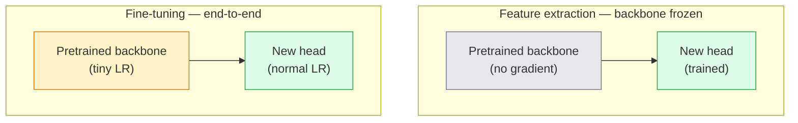

# نقل التعلم والتحسين

> شخص آخر قضى مليون ساعة في معالجة المعالجة المعالجة المعالجة (الذي يُعلم الشبكة كيف تبدو الحواف والنسيج وأجزاء الأشياء

> **【中文解读】**别人花了一百万GPU 小时教会网络识别边缘、纹理和物件部件──应先借这些特征在训练自己的模型之前──迁移学习是人工智能工程中最实用的技术预训骨干 +自定义分类头 = 几行代码就能解决新任务──

> **【拓展：迁移学习在工业界的应用】**تقريبا جميع أنظمة الإنتاج تصويري تستخدم الانتقال للتعلم: الصور الطبية  الصورة الصورة  التدريب الاول +                                                                                                                                                                                                                                                                                                                                                                                                                                                                                            

**Type:** Build | **类型:** 动手
**Languages:** Python | **语言:** Python
**Prerequisites:** Phase 4 Lesson 03 (CNNs), Phase 4 Lesson 04 (Image Classification) | **前置知识:** Phase 4 Lesson 03（CNN），Phase 4 Lesson 04（图像分类）
**Time:** ~75 minutes | **时间:** ~75 分钟

## أهداف التعلم

- تمييز استيراد الميزات من التنسيق الدقيق واختيار الميزة المناسبة بناءً على حجم مجموعة البيانات ومسافة النطاق وال ميزانية الحسابية
- تحميل العمود الفقري المُدرب مسبقاً، واستبدال رأس المُصنف، وتدريب رأس فقط إلى خط أساسي العمل في أقل من 20 خط
- تخفيف طبقات مع معدلات التعلم التمييزية تدريجياً حتى يتمكن الميزات الجينية المبكرة من الحصول على تحديثات أصغر من تلك المتأخرة المحددة للمهمة
- تشخيص ثلاثة أخطاء شائعة: التنحيل من الميزات عالية جدا LR على الكتل غير المجمدة، انهيار إحصاءات BN على مجموعات بيانات صغيرة، ونسيان كارثي

> **【中文解读】**يُدعى أهداف التعلم المفردة التي يجب أن تتحكم فيها بعد الانتهاء من الدورة.


## المشكلة المشكلة المشكلة

تدريب ResNet-50 على ImageNet يكلف حوالي 2000 ساعة GPU. عدد قليل جدا من الفرق لديها هذا الميزانية لكل مهمة يتم شحنها. ما تقريبا كل فريق في الواقع شحن هو العمود الفقري المدرب مسبقا مع رأس جديد مدرب على بضع مئات أو بضعة آلاف الصور المحددة للمهمة.

> في ImageNet على تدريب ResNet-50 حوالي تحتاج إلى 2000 GPU 小时── القليل من الفرق لديها ميزانية لكل مهمة تسليم ينفق الكثير منها── تقريبا جميع الفرق في الواقع تسليم هو شبكة التدريب العظمي المسبقة بالإضافة إلى واحدة جديدة من التدريب على عدة مئات أو آلاف من المهام على صورة محددة──

> **【中文解读】**من التدريب الصفر ResNet-50  بحاجة ~ 2000 GPU 小时, ولكن الانتقال تعلم فقط بضع دقائق.

هذا ليس طريق مختصر أول كتلة من أي قناة CNN تدرب على ImageNet تعلم الحواف والمرشحات مثل Gabor. في الأقسام القليلة التالية تتعلم النسخ والحافظات البسيطة الكتل الوسطى تتعلم أجزاء الكائنات الكتل الأخيرة تتعلم مزيجات تبدأ في أن تبدو مثل الفئات 1000 ImageNet. النسبة الـ 90% الأولى من هذه الهرمية تنتقل تقريباً دون تغيير إلى التصوير الطبي، والتفتيش الصناعي، بيانات الأقمار الصناعية، وكل مهمة رؤية أخرى  لأن الطبيعة لديها مفرد محدود من الحواف والنسائح. الـ10٪ الأخيرة هي ما تدرب عليه

> هذا ليس طريق مختصرة. أي من أول كتلة من CNN التي تم تدريبها على ImageNet على شبكة Gabor 波器. بعد ذلك بضع كتلة تتعلم الوجوه والنمط البسيط.

الحصول على حق نقل لديه ثلاثة أخطاء تنتظرك: تدمير الميزات المسبقة تدريب مع معدل التعلم مرتفع جدا، وجوع نموذج المعلومات عن طريق تجميد أكثر من اللازم، والسماح BatchNorm الإحصاءات الجارية تتحرك نحو مجموعة بيانات صغيرة التي لم تتعلم بقية الشبكة من. هذا الدرس يذهب كل منهم عن قصد.

> هناك ثلاثة أخطاء في انتظارك: استخدام معدل التعلم المرتفع لتدمير خصائص التدريب المسبق، والانتهاء من الكثير مما يؤدي إلى نقص معلومات النموذج، والتحويل إلى مجموعة صغيرة من البيانات التي لم تتعلم قط.

> **【中文解读】**迁移学习最常见的三个坑: ((1) ارتفاع معدلات التعلم قد أدى إلى تدمير خصائص التدريب المسبق ؛ ((2) 结多层导致模型 غير مناسب ؛ ((3) احصاءات BatchNorm تتحرك على مجموعة بيانات صغيرة.

## المفهوم الأساسي

> **【中文解读】**هذا المقطع يعرض المفاهيم والنظريات الأساسية. فهم هذه المفاهيم هو شرط لتحقيق التنفيذ التالي، وكذلك النقاط المعرفة في المقابلة والممارسة التجريبية.


### استخرج الميزات مقابل ضبطها

نظامين، يتم اختيارهم من خلال مدى ثقتك في الميزات المسبقة والتدريبات التي لديك

> هناك خيارين يعتمدون على كمية الوصول إلى التدريبات المسبقة التي تتمتع بها



قواعد الإبهام:

> 经验法则:

| Dataset size / 数据量 | Domain distance / 领域距离 | Recipe / 方案 |
|--------------|-----------------|--------|
| < 1k images | close to ImageNet / 接近 ImageNet | Freeze backbone, train head only / 冻结骨干，只训头部 |
| 1k-10k | close / 接近 | Freeze first 2-3 stages, fine-tune the rest / 冻结前2-3阶段，微调其余 |
| 10k-100k | any / 任意 | Fine-tune end-to-end with discriminative LR / 用判别性学习率端到端微调 |
| 100k+ | far / 远 | Fine-tune everything; consider training from scratch if domain is far enough / 全量微调；领域足够远则考虑从头训练 |

"قرب من ImageNet" يعني تقريبا صور RGB طبيعية مع محتوى يشبه الكائنات. المسحات المعلوماتية المعلوماتية الطبية، الصور الأقمار الصناعية الجوية، والنظارية هي مجالات بعيدة  الميزات لا تزال تساعد، ولكن سوف تحتاج إلى السماح المزيد من الطبقات للتكيف.

> "تقريب الصورة" يعني بشكل كبير مع محتوى كائن طبيعي RGB الصور.

> **【拓展：迁移学习策略选择】**في الممارسة الصناعية، تحدد حجم المجموعة والمسافة في المجالات استراتيجية الانتقال:<1k 张且与 ImageNet 接近结结骨干训练头部;10k 张就全量微调;;图像医疗,卫星图等远领域需要解更多层次;; U-Net 和 CLIP 视觉编码器的稳定传播都是典型例例经过大规模预训后微调;;

### لماذا التجمد يعمل على الإطلاق

يكتشف موقع "ميكنيت" أنّه ليس متخصصًا في الفئات الـ1.000. وهي متخصصة في إحصاءات الصور الطبيعية: الحواف عند التوجهات المحددة، والتركيبات، وأنماط التناقض، والشكل البدائي. هذه الإحصاءات مستقرة على جميع المجالات البصرية التي يمكن أن يسميها الإنسان تقريباً. لهذا السبب، فإن نموذج تم تدريبه على ImageNet وتقييم الصفر الصاروخ على CIFAR-10 مع رأس خطي جديد فقط (لا توضيح جيد للعمود الفقري) يصل إلى 80٪ + دقة. الرأس يتعلم أي من الميزات المكتسبة بالفعل لتنسق لهذا المهمة.

> لا تخصص خصائص ImageNet التي تعلمتها CNN إلى 1000 فئة. وهي تخص خصائص إحصائية للصورة الطبيعية: حافة اتجاهات محددة، التركيبات، النمط المقارنة، والشكل الأساسي. هذه الخصائص الإحصائية ثابتة في جميع مجالات الرؤية التي يمكن أن يطلق عليها الإنسان تقريبا. هذا هو السبب في أن نموذج تدرب على ImageNet ، فقط باستخدام رأس خطي جديد (((ميكروجو كريمون شبكة) في CIFAR-10 على التقييم الصينية يمكن أن يصل إلى 80٪ + نسبة دقة.

### معدلات التعلم التمييزية

عندما تقوم بتفكيك التجميد، يجب أن تتدرب الطبقات المبكرة بطيئة أكثر من الطبقات المتأخرة. الطبقات المبكرة ترميز الميزات العامة التي تريد الحفاظ عليها؛ الطبقات المتأخرة ترميز بنية محددة للمهمة التي تحتاج إلى التحرك كثيرا.

> عندما تقوم بتحليلها، يجب أن تكون المستويات المبكرة تدريبًا أبطأً من المستويات المتأخرة.

```
Typical recipe:

  stage 0 (stem + first group): lr = base_lr / 100    (mostly fixed)
  stage 1:                       lr = base_lr / 10
  stage 2:                       lr = base_lr / 3
  stage 3 (last backbone group): lr = base_lr
  head:                          lr = base_lr  (or slightly higher)
```

في PyTorch هذه ليست سوى قائمة من مجموعات المعلمات تم تمرير إلى المحافظ. نموذج واحد، خمسة معدلات التعلم، صفر رمز إضافي.

> في PyTorch، هذا مجرد نقل إلى قائمة المعايير من المحفزات.

### مشكلة "بيتش نورم"

طبقات BN تحمل`running_mean`و`running_var`المضخات التي تم تحديدها على ImageNet. إذا كانت مهمتك لديها توزيع مختلف للبيكسل  إضاءة مختلفة، جهاز استشعار مختلفة، مساحة مختلفة لون  تلك المضخات خاطئة. ثلاثة خيارات في ترتيب الاختيارات:

> نيمبيل 層持有在 ImageNet 上计算的 `running_mean`和 `running_var`إذا كانت مهمتك توزيع مختلف الصور  مختلف الضوء  مختلف المستشعر  مختلف الألوان الفضاء  تلك المرحلة هو خطأ  حسب الترتيب الأولوي هناك ثلاثة خيارات:

1. **Fine-tune with BN in train mode.**دع BN تحديث إحصائيات التشغيل مع كل شيء آخر. اختيار افتراضي عندما تكون مجموعة البيانات الخاصة بالمهمة متوسطة الحجم (>= 5k أمثلة).
2. **Freeze BN in eval mode.**حافظ على إحصاءات ImageNet وتدريب فقط الوزن. صحيح عندما مجموعة البيانات الخاصة بك صغيرة بما فيه الكفاية
3. **Replace BN with GroupNorm.**يزيل مشكلة المتوسط المتحرك بالكامل. يستخدم في الكشف والشقوق التقسيم حيث حجم اللحظة لكل GPU صغير.

إن أخطأت في هذا الأمر، فإن الدقة تتراوح بين 5 و15 بالمئة

> 弄错 هذا سيبلغ منخفضة 5-15% من معدلات التأكد

### تصميم الرأس

رأس التصنيف هو 1-3 طبقة خطية زائد إلقاء اختياري كل مشعل رؤية العمود الفقري يرسل رأس افتراضي الذي يمكنك استبدال:

> رأس الجهاز هو 1-3 个线性层加一个可选的 dropout──每个火视觉 骨干网络都附带一个你替换的默认头部:

```
backbone.fc = nn.Linear(backbone.fc.in_features, num_classes)          # ResNet
backbone.classifier[1] = nn.Linear(..., num_classes)                    # EfficientNet, MobileNet
backbone.heads.head = nn.Linear(..., num_classes)                       # torchvision ViT
```

بالنسبة لمجموعات بيانات صغيرة، تكون طبقة خطية واحدة كافية عادة. إضافة طبقة مخفية (خطية -> ReLU -> إيقاف -> خطية) تساعد عندما يكون توزيع المهام أبعد من توزيع التدريب في العمود الفقري.

> بالنسبة لمجموعة صغيرة من البيانات، تكون الطبقة الوحيدة من الخطوط عادة ما تكون كافية. عندما تكون التوزيع المفيد مع التوزيع التدريبي في شبكة العظام أكبر، فإن إضافة الطبقة الخفية ((خطية -> ريلو -> خفض -> خطية) سوف تساعد.

### التهالك المتعدد للطبقات

نسخة أكثر سلاسة من LR التمييزية المستخدمة في التنسيقات الدقيقة الحديثة (BEiT، DINOv2، ViT-B). بدلاً من تجميع الطبقات إلى مراحل، أعط كل طبقة LR أصغر قليلاً من تلك فوقها:

> 现代微调 (BET,DINOv2,ViT-B 微调)                                                                                                                                                                                                                                                     

```
lr_layer_k = base_lr * decay^(L - k)
```

مع التهالك = 0.75 و L = 12 كتلة محول، القطارات الأولى كتلة في `0.75^11 ≈ 0.04x`و هو أكثر أهمية لتحويل الموسيقى الدقيقة من لسي إن إن، حيث تكون الموسيقى الدقيقة المجموعة المرحلة عادة كافية.

> عندما التدهور = 0.75 且 L = 12 块                                                                                                                                                                                                                                                        `0.75^11 ≈ 0.04x`訓練── للتحويل 微调比CNN أكثر أهمية، متوسط درجة التعلم في CNN

### ما الذي يجب تقييمه

عمليات التعلم النقل تحتاج إلى رقمين لن تتبعها في عملية الخدش:

- **Pretrained-only accuracy**دقة الرأس مع تم تجميد العمود الفقري هذه هي الأرض
- **Fine-tuned accuracy**نفس النموذج بعد التدريب من نهايتها إلى نهايتها هذا هو سقفك

إذا كان المنسق الدقيق أقل من المميز فقط، لديك معدل التعلم أو خطأ BN.

> **【中文解读】**هذا المقطع من خلال الكود من الصفر لتحقيق الخوارزمية النووية. هذا النوع من "من الصفر" يمكن أن يساعد على فهم المبدأ الخلفي للإطار، عندما يواجهون مشكلة لن يتم تعقلها في الصندوق الأسود.

> **【拓展：工业部署中的视觉系统】**في التوزيع الصناعي الواقعي، تحتاج النموذج المرئي إلى النظر في التفكير في التأجيل، والنموذج الكبير، والجهاز الحدودي الملائمة وغيرها من المشاكل.


## بناء ذلك تحرك لتحقيق
```figure
transfer-learning
```

## بناءها

### الخطوة الأولى: قم بتحميل العمود الفقري المُدرب مسبقاً وتفتيشه

```python
import torch
import torch.nn as nn
from torchvision.models import resnet18, ResNet18_Weights

backbone = resnet18(weights=ResNet18_Weights.IMAGENET1K_V1)
print(backbone)
print()
print("classifier head:", backbone.fc)
print("feature dim:", backbone.fc.in_features)
```

`ResNet18`يحتوي على أربع مراحل (`layer1..layer4`) بالإضافة إلى جذع و`fc`كل قاعدة نخاع تصنيف مشعل رؤية لديها هيكل مماثل.

### الخطوة الثانية: استخراج الميزة

```python
def make_feature_extractor(num_classes=10):
    model = resnet18(weights=ResNet18_Weights.IMAGENET1K_V1)
    for p in model.parameters():
        p.requires_grad = False
    model.fc = nn.Linear(model.fc.in_features, num_classes)
    return model

model = make_feature_extractor(num_classes=10)
trainable = sum(p.numel() for p in model.parameters() if p.requires_grad)
frozen = sum(p.numel() for p in model.parameters() if not p.requires_grad)
print(f"trainable: {trainable:>10,}")
print(f"frozen:    {frozen:>10,}")
```

فقط`model.fc`العمود الفقري هو مستخرج مُجمد

### الخطوة الثالثة: التأقلم الدقيق التمييزي

أداة تُبني مجموعات المعلمات مع معدلات التعلم المحددة للمرحلة.

```python
def discriminative_param_groups(model, base_lr=1e-3, decay=0.3):
    stages = [
        ["conv1", "bn1"],
        ["layer1"],
        ["layer2"],
        ["layer3"],
        ["layer4"],
        ["fc"],
    ]
    groups = []
    for i, names in enumerate(stages):
        lr = base_lr * (decay ** (len(stages) - 1 - i))
        params = [p for n, p in model.named_parameters()
                  if any(n.startswith(k) for k in names)]
        if params:
            groups.append({"params": params, "lr": lr, "name": "_".join(names)})
    return groups

model = resnet18(weights=ResNet18_Weights.IMAGENET1K_V1)
model.fc = nn.Linear(model.fc.in_features, 10)
for p in model.parameters():
    p.requires_grad = True

groups = discriminative_param_groups(model)
for g in groups:
    print(f"{g['name']:>10s}  lr={g['lr']:.2e}  params={sum(p.numel() for p in g['params']):>8,}")
```

`decay=0.3`يعني كل خطة قطار بنسبة 30% من سرعة الخطوة التالية. `fc`يصل`base_lr`،`layer4`يصل`0.3 * base_lr`،`conv1`يصل`0.3^5 * base_lr ≈ 0.00243 * base_lr`صوت متطرف، و من الناحية التجريبية يعمل

### الخطوة الرابعة: التعامل مع المجموعة

مساعدة لتجميد بيانات BN بدون تجميد أوزانها

```python
def freeze_bn_stats(model):
    for m in model.modules():
        if isinstance(m, (nn.BatchNorm1d, nn.BatchNorm2d, nn.BatchNorm3d)):
            m.eval()
            for p in m.parameters():
                p.requires_grad = False
    return model
```

اتصل بها بعد أن تستقر`model.train()`في بداية كل عصر`model.train()`يُحول كل شيء إلى وضع التدريب، وهذا يعكسها فقط لطبقات BN.

### الخطوة 5: حلقة تحسينية من نهاية إلى نهاية

```python
from torch.optim import SGD
from torch.utils.data import DataLoader
from torch.optim.lr_scheduler import CosineAnnealingLR
import torch.nn.functional as F

def fine_tune(model, train_loader, val_loader, device, epochs=5, base_lr=1e-3, freeze_bn=False):
    model = model.to(device)
    groups = discriminative_param_groups(model, base_lr=base_lr)
    optimizer = SGD(groups, momentum=0.9, weight_decay=1e-4, nesterov=True)
    scheduler = CosineAnnealingLR(optimizer, T_max=epochs)

    for epoch in range(epochs):
        model.train()
        if freeze_bn:
            freeze_bn_stats(model)
        tr_loss, tr_correct, tr_total = 0.0, 0, 0
        for x, y in train_loader:
            x, y = x.to(device), y.to(device)
            logits = model(x)
            loss = F.cross_entropy(logits, y, label_smoothing=0.1)
            optimizer.zero_grad()
            loss.backward()
            optimizer.step()
            tr_loss += loss.item() * x.size(0)
            tr_total += x.size(0)
            tr_correct += (logits.argmax(-1) == y).sum().item()
        scheduler.step()

        model.eval()
        va_total, va_correct = 0, 0
        with torch.no_grad():
            for x, y in val_loader:
                x, y = x.to(device), y.to(device)
                pred = model(x).argmax(-1)
                va_total += x.size(0)
                va_correct += (pred == y).sum().item()
        print(f"epoch {epoch}  train {tr_loss/tr_total:.3f}/{tr_correct/tr_total:.3f}  "
              f"val {va_correct/va_total:.3f}")
    return model
```

خمس فترات مع وصفة CIFAR-10 أعلاه تأخذ `ResNet18-IMAGENET1K_V1`من 70٪ دقة الصور الخطية الصفراء إلى 93٪ دقة دقيقة. الرأس وحده سوف تتحرك نحو 86٪ دون أن تلمس العظم الفقري.

### الخطوة السادسة: تخفيف التجميد تدريجياً

جدول زمني يفتح مرحلة واحدة في كل عصر من النهاية إلى البداية.

```python
def progressive_unfreeze_schedule(model):
    stages = ["layer4", "layer3", "layer2", "layer1"]
    yielded = set()

    def start():
        for p in model.parameters():
            p.requires_grad = False
        for p in model.fc.parameters():
            p.requires_grad = True

    def unfreeze(epoch):
        if epoch < len(stages):
            name = stages[epoch]
            yielded.add(name)
            for n, p in model.named_parameters():
                if n.startswith(name):
                    p.requires_grad = True
            return name
        return None

    return start, unfreeze
```

اتصل`start()`مرة قبل العصر الأول.`unfreeze(epoch)`إعادة بناء المحفز كلما تغير مجموعة المعايير التي يمكن تدريبها، وإلا فإن الحدود المتجمدة لا تزال تحتوي على لحظات مخفية تحملها.


## استخدمها في إطار التنفيذ

> **【中文解读】**هذا المقال يوضح كيفية استخدام إطار متقدم مثل PyTorch、HuggingFace وغيرها) سريعة تطبيق هذه التقنية.


معظم المهام الحقيقية`torchvision.models`+ ثلاثة خطوط كافية. الآلات الثقيلة فوق مهمة عندما تلتقي بمشاكل التي لا يمكن إصلاحها من قبل المكتبة.

```python
from torchvision.models import resnet50, ResNet50_Weights

model = resnet50(weights=ResNet50_Weights.IMAGENET1K_V2)
model.fc = nn.Linear(model.fc.in_features, num_classes)
optimizer = torch.optim.AdamW(model.parameters(), lr=1e-4, weight_decay=1e-4)
```

اثنين آخرين من الاختلالات في درجة الإنتاج:

- `timm`السفن ~ 800 قاعدة رأس مرئية مسبقة مع API متسقة (`timm.create_model("resnet50", pretrained=True, num_classes=10)`(لجميع الموسيقى الخفيفة خارج حديقة الحيوانات، إنها المعيار
- بالنسبة للمتحولات`transformers.AutoModelForImageClassification.from_pretrained(name, num_labels=N)`يعطيك ViT / BEiT / DeiT مع نفس تعبيرات التحميل مثل نماذج النص.

> **【中文解读】**هذا المادة يركز على كيفية نشر النموذج كمنتج متاح. من النموذج الأصلي إلى النظام في مرحلة الإنتاج، تحتاج إلى النظر في العديد من الخصائص في تحسين الأداء والتعامل الخاطئ والتحكم.


> **【拓展：数据标注与质量】** تأثير المهام المرئية يعتمد على جودة البيانات المعلنة.‬‬‬‬‬‬‬‬‬‬‬‬‬‬‬‬‬‬‬‬‬‬‬‬‬‬‬‬‬‬‬‬‬‬‬‬‬‬‬‬‬‬‬‬‬‬‬‬‬‬‬‬‬‬‬‬‬‬‬‬‬‬‬‬‬‬‬‬‬‬‬‬‬‬‬‬‬‬‬‬‬‬‬‬‬‬‬‬‬‬‬‬‬‬‬‬‬‬‬‬‬‬‬‬‬‬‬‬‬‬‬‬‬‬‬‬‬‬‬‬‬‬‬‬‬‬‬‬‬‬‬‬‬‬‬‬‬‬‬‬‬‬‬‬‬‬‬‬‬‬‬‬‬‬‬‬‬‬‬‬‬‬‬‬‬‬‬‬‬‬‬‬‬‬‬‬‬‬‬‬‬‬‬‬‬‬‬‬‬‬‬‬‬‬‬‬‬‬‬‬‬‬‬‬‬‬‬‬‬‬‬‬‬‬‬‬‬‬‬‬‬‬‬‬‬‬‬‬‬‬‬‬‬‬‬‬‬‬‬‬‬‬‬‬‬‬‬‬‬‬‬‬‬‬‬‬‬‬‬‬‬‬‬‬‬‬‬‬‬‬‬‬‬‬‬‬‬‬‬‬‬‬‬‬‬‬‬‬‬‬‬‬‬‬‬‬‬‬‬‬‬‬‬‬‬‬‬‬‬‬‬‬‬‬‬‬‬‬‬‬‬‬‬‬‬‬‬‬‬‬‬‬‬‬‬‬‬‬‬‬‬‬‬‬‬‬‬‬‬‬‬‬‬‬‬‬‬‬‬‬‬‬‬‬‬‬‬‬‬‬‬‬‬‬‬‬‬‬‬‬‬‬‬‬‬‬‬‬‬‬‬‬‬‬‬‬‬‬‬‬‬‬‬‬‬‬‬‬‬‬‬‬‬‬‬‬‬‬‬‬‬‬‬‬‬‬‬‬‬‬‬‬‬‬‬‬‬‬‬‬‬‬‬‬‬‬‬‬‬‬‬‬‬‬‬‬‬‬‬‬‬‬‬‬‬‬‬‬‬‬‬‬‬‬‬‬‬‬‬‬‬‬‬‬‬‬‬‬‬

## أرسلها .

هذا الدرس ينتج عن:

- `outputs/prompt-fine-tune-planner.md` عرض يختار استخراج الميزات مقابل التقدم مقابل ضبط الدقيق من النهاية إلى النهاية بناءً على حجم مجموعة البيانات ، ومسافة النطاق ، وميزانية الحساب.
- `outputs/skill-freeze-inspector.md` مهارة التي، نظرا لنموذج PyTorch، تقرير ما هي المعايير التي يمكن تدريبها، والتي هي طبقات BatchNorm في وضع تقييم، وما إذا كان المتحسن يتم إعطاء المعايير التي يمكن تدريبها في الواقع.

> **【中文解读】**练题按照易/中级/Hard 三个难度递进──建议至少完成 级级中级的题目,Hard 级适合深入研究或面试准备──


## تمارين التدريب

1. **(Easy | 简单)**- إقترب`ResNet18`كمسبار خطي (مجمّد على العمود الفقري) وكمساعدة كاملة على مجموعة بيانات CIFAR المختلفة. قم بتقرير كل من الدقة جنبا إلى جنب. شرح أي فجوة تخبرك بتحويل الميزات بشكل جيد والتي تخبرك أنها لا تفعل ذلك.
   تميز باستخدام المراقبة السريرية (结骨干) و التدريب الكامل على الوصول إلى النظام الأساسي (ResNet18) ، مقابل معدل الدقة.

2. **(Medium | 中等)**إدخال خطأ عمدا: set `base_lr = 1e-1`على مرحلة العمود الفقري بدلا من الرأس.`discriminative_param_groups`المساعد، سجل المرحلة التي تبدأ فيها كل مرحلة بالتباين.
   فيتم إعدادها`base_lr = 1e-1`تصنيع خطأ، مشاهدة فقدان التدريبات، ثم استرداد معدل التعلم التقييمي، سجّل كل مرحلة تبدأ في نشر معدل التعلم.

3. **(Hard | 困难)**خذ مجموعة بيانات التصوير الطبي (مثل CheXpert-small أو PatchCamelyon أو HAM10000) وقارن ثلاثة أنظمة: (أ) ImageNet-pretrained frozen backbone + linear head؛ (ب) ImageNet-pretrained fine-tune end-to-end؛ (ج) تدريب الرمض. تقرير الدقة والتكلفة الحسابية لكل منها. في أي حجم مجموعة بيانات يصبح تدريب الرمض منافساً؟
   استخدام الصور الطبية المجموعة البيانية مقابل ثلاثة خطط: (أ) 结骨干+线性头; (ب) 量微调; (ج) من التدريب الصفر.

## شروط رئيسية

| Term | What people say | What it actually means | 中文释义 |
|------|----------------|----------------------|---------|
| Feature extraction | "Freeze and train head" | Backbone parameters frozen, only the new classifier head receives gradient | 特征提取：冻结骨干参数，只训练新的分类头 |
| Fine-tuning | "Retrain end-to-end" | All parameters trainable, usually with much smaller LR than scratch training | 微调：所有参数可训练，学习率远小于从零训练 |
| Discriminative LR | "Smaller LR for early layers" | Optimizer parameter groups where early-stage LR is a fraction of late-stage LR | 判别式学习率：早期层用更小的学习率 |
| Layer-wise LR decay | "Smooth LR gradient" | Per-layer LR multiplied by decay^(L - k); common in transformer fine-tunes | 逐层学习率衰减：每层 LR 乘以衰减系数 |
| Catastrophic forgetting | "The model lost ImageNet" | A too-high LR overwrites pretrained features before the new task signal is learnt | 灾难性遗忘：学习率过高导致预训练特征被覆盖 |
| BN statistics drift | "Running mean is wrong" | BatchNorm running_mean/var computed on a different distribution than the current task, silently hurting accuracy | BN 统计漂移：BatchNorm 的统计量与当前任务分布不匹配 |
| Linear probe | "Frozen backbone + linear head" | Evaluation of pretrained features — accuracy of the best linear classifier on top of the frozen representation | 线性探针：冻结骨干上训练线性分类器，评估预训练特征质量 |
| Catastrophic collapse | "Everything predicts one class" | Happens when fine-tuning with an LR high enough to destroy features before gradients from the head can stabilise | 灾难性崩塌：模型只预测一个类别 |

> **【中文解读】**延伸阅读 يوفر موارد عالية الجودة للتعلم المتعمق.


## المزيد من القراءة

- [How transferable are features in deep neural networks? (Yosinski et al., 2014)](https://arxiv.org/abs/1411.1792) الورقة التي تحدد كمية قابلية نقل الميزات عبر الطبقات
- [Universal Language Model Fine-tuning (ULMFiT, Howard & Ruder, 2018)](https://arxiv.org/abs/1801.06146) وصفة التمييز الأصلية لـ LR / التجمد التدريجي ؛ تنقل الأفكار مباشرة إلى الرؤية
- [timm documentation](https://huggingface.co/docs/timm) الإشارة إلى العظام الفقرية الحديثة للرؤية والخطوات الدقيقة التي تم تدريبها عليها
- [A Simple Framework for Linear-Probe Evaluation (Kornblith et al., 2019)](https://arxiv.org/abs/1805.08974) لماذا تُهم دقة الصفحة الخطية وكيفية الإبلاغ عنها بشكل صحيح
