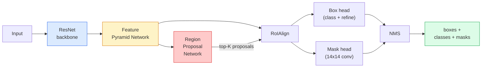

# التقسيم الحالي  القناع R-CNN ‬ ‬ مثال تقسيم ‬ القناع R-CNN

> إضافة فرع قناع صغير إلى كاشف R-CNN السريع و لديك تقسيم الحالة الجزء الصعب هو RoIAlign، وهو أصعب مما يبدو.

> **【中文解读】**في اختبار R-CNN السريع إضافة فرقة مخفية للحصول على تقسيم مثال. الصعوبة تكمن في أن RoIA align سوف تتوافق مع مناطق المرشحين المختلفة من الحجم إلى رسمية خصائص الحجم الثابت، والحفاظ على دقة الفضاء.

> **【拓展：实例分割的应用】**قناع R-CNN 广泛用于自动驾驶(区分不同车辆和行人) 机器人抓取(识别单个物体轮) 视频编辑(精确图)  roadlining 技术后来也被用于视觉变压器的适配器中──

**Type:** Build + Learn | **类型:** 动手 + 学习
**Languages:** Python | **语言:** Python
**Prerequisites:** Phase 4 Lesson 06 (YOLO), Phase 4 Lesson 07 (U-Net) | **前置知识:** Phase 4 Lesson 06（YOLO），Phase 4 Lesson 07（U-Net）
**Time:** ~75 minutes | **时间:** ~75 分钟

## أهداف التعلم

- تتبع معمارة ماسك R-CNN من نهايتها إلى نهايتها: العمود الفقري، FPN، RPN، RoIAlign، رأس الصندوق، رأس القناع
- تنفيذ RoIAlign من الصفر وتوضيح لماذا لم يعد يستخدم RoIPool
- استخدموا مشعل الرؤية`maskrcnn_resnet50_fpn_v2`نموذج متجه إلى التدريب المسبق لقناع النقطة ذات جودة الإنتاج وقراءة شكل الخروج بشكل صحيح
- تحديد ماسك R-CNN على مجموعة بيانات مخصصة صغيرة عن طريق استبدال الصندوق ورؤوس الماسك والحفاظ على العمود الفقري مجمد

> **【中文解读】**يُدعى أهداف التعلم المفردة التي يجب أن تتحكم فيها بعد الانتهاء من الدورة.


## المشكلة المشكلة المشكلة

التقسيم الدلالي يعطيك قناع واحد لكل فئة. تقسيم الحالة يعطيك قناع واحد لكل كائن، حتى عندما يشارك كائناتان فئة. احتساب الأفراد، تتبع عبر الإطارات، و قياس الأشياء (الصندوق المحدود لكل طوب في الجدار، كل خلية في صورة المجهر) جميعها تتطلب تقسيم الحالة.

> 语义分割给你每一类一个掩码――实例分割给你每一物体一个掩码,即使两个物体属于同一类――计数个体、跨跟踪和测量东西(在墙壁中的每块的边界框、显微镜图像中每个细胞) 都需要实例分割──

حل Mask R-CNN (He et al., 2017) هذا الأمر من خلال إعادة تقسيم الحالة كاكتشاف زائد قناع. كان التصميم نظيفًا جدًا بحيث كانت كل ورقة تقسيم الحالة تقريبًا في السنوات الخمس المقبلة متغيرًا ل Mask R-CNN ، ولا يزال تنفيذ مشعل البصيرة هو افتراض الإنتاج لمجموعات بيانات صغيرة إلى متوسطة.

> ماسك R-CNN ((هي 等,2017) من خلال تحديد تقسيم الحالات لتحقيق وتخفيف الحالات لحل هذه المشكلة. تصميمها كان نظيفاً جداً، حتى فترة السنوات الخمس المقبلة، كانت كل مقالة تقسيم الحالات تقريباً متغيرات من ماسك R-CNN، والتحقيق في رؤية الشعلة لا يزال اختيارًا افتراضيًا لإنتاج مجموعة بيانات صغيرة صغيرة.

مشكلة الهندسة الصعبة هي أخذ العينات: كيفية قطع منطقة ميزات ذات حجم ثابت من صندوق اقتراحات لا تتوافق زواياها مع حدود البيكسل؟ الحصول على هذا خطأ يكلف عشر نقطة MAP في كل مكان.

> مشكلة المهندسية المشكلة هي: كيف يمكنك قطع منطقة ذات خصائص ثابتة كبيرة من بين نقاط الزاوية غير المتكافئة مع الحدود الصورة؟

## المفهوم الأساسي

> **【中文解读】**هذا المقطع يعرض المفاهيم والنظريات الأساسية. فهم هذه المفاهيم هو شرط لتحقيق التنفيذ التالي، وكذلك النقاط المعرفة في المقابلة والممارسة التجريبية.


### الهندسة المعمارية



خمسة قطع يجب فهمها:

1. **Backbone** ResNet-50 أو ResNet-101 المدرب على ImageNet. ينتج ترتيبًا من خرائط الميزات في الخطوات 4، 8، 16، 32.
   中文翻译: في ImageNet 上训练的ResNet-50 或ResNet-101──生成步幅为4、8、16、32 层级特征图──
2. **FPN (Feature Pyramid Network)** وصلات أعلى إلى أسفل + جانبيّة توفر لكلّ مستوى قنوات من الميزات الغنية بالمعنى. استفسارات الكشف على مستوى FPN يطابق حجم الكائن.
   ترجمة باللغة الصينية: من فوق إلى أسفل إلى الارتباط ، وقدم كل مستوى من C 个通道的语义丰富特征──检测时查询与物体大小匹配的 FPN 层级──
3. **RPN (Region Proposal Network)** رأس مغلف صغير يتوقع في كل موقف من المرافق "هل هناك شيء هنا؟" و "كيف أعمل على تحسين الصندوق؟" ينتج 1000 مقترح لكل صورة.
   中文翻译:一个小的卷积头,在每个点位置预测"هل يوجد هناك أي شيء هنا؟"和"كيفية تعديل الحدود؟"──每张图像产生大约1000个候选区──
4. **RoIAlign** عينات معصمة ذات الحجم الثابت (مثل 7 × 7) من أي مربع على أي مستوى FPN.
   中文翻译: من أي فب ن 级级任意框中采样固定大小(如 7x7) 特征块──双线性采样,无量化──
5. **Heads** رأس مربع ذو طبقتين يضبط الصندوق ويحصل على فئة، بالإضافة إلى رأس مغلف صغير يخرج`28x28`قناع ثنائي لكل اقتراح
   中文翻译: دو层框头用于修改边界框并选择类别,加上一个小卷积头为每个候选区输出 `28x28`من الثاني قيمة

### لماذا رويالين وليس رويبول

استخدمت Fast R-CNN الأصلية RoIPool ، التي تقسم مربع المقترح إلى شبكة ، وتأخذ أقصى ميزة في كل خلية ، وتجول جميع الإحداثيات إلى أرقام كاملة. هذا التجول يخطئ خط الخريطة من إحداثيات البيكسل المدخلة إلى بكسل كامل خريطة الخريطة  صغير على صورة 224x224, كارثي عندما تكون خريطة الخريطة خطوة 32.

> يستخدم R-CNN الفوري الأصلي من RoIPool، فإنه سوف يفرز مربع المرشح إلى شبكة، يأخذ أكبر قيمة من كل صفة، ويعطي جميع الصفحات إلى أربعة وخمسة إلى عدد كامل.

```
RoIPool:
  box (34.7, 51.3, 98.2, 142.9)
  round -> (34, 51, 98, 142)
  split grid -> round each cell boundary
  misalignment accumulates at every step

RoIAlign:
  box (34.7, 51.3, 98.2, 142.9)
  sample at exact float coordinates using bilinear interpolation
  no rounding anywhere
```

يرفع رويالين ماسك AP بنسبة 3-4 نقاط على كوكو مجاناً. كل جهاز كشف يهتم بالتحديد الموقع يستخدمها الآن  YOLOv7 seg، RT-DETR، Mask2Former على حد سواء.

> رويالينج في كوكو 上免费提升掩码 AP 3-4 个点── كل جهاز اختبار تحديد المواقع الآن يستخدمها YOLOv7 seg、RT-DETR、Mask2Former 无一例外──

### الـ RPN في فقرة واحدة

في كل موقع من خريطة الميزات، ضع صناديق المرسومات K من أشكال وأحجام مختلفة. توقع نسبة من المواد لكل مرسومة وتعديل التراجعة لتحول المرسومة إلى مربع أفضل. ضعوا على رأس 1000 مربع من النقاط، وطبقوا النقود النووية عند 0.7 ووضعوا الناجين على الرؤوس يتم تدريب RPN مع خسارة صغيرة خاصة بها نفس الهيكل مثل خسارة YOLO من الدروس 6 ، فقط مع فئتين (المنشأ / لا شيء).

> في كل موقع على الرسم البياني وضع K 个不同大小和形状的框── للتنبؤ لكل框 个目标性分数和一个回归偏移量,将框转换为更适合的边界框──保留最高分数约1000个框,在 IoU 0.7 下应用 NMS,将幸存者交给后头部──RPN باستخدام وظائف التدريب 结构和第六课程的YOLO 损失相同,只有两个类别物体/非物体) 

### رأس القناع

لكل اقتراح (بعد RoIAlign) رأس القناع هو FCN صغير: أربعة 3x3 convs، 2x deconv، 1x1 Conv النهائي الذي ينتج `num_classes`قنوات الخروج في `28x28`القرار. يتم الاحتفاظ بالقناة المقابلة للفئة المتوقعة فقط؛ يتم تجاهل الآخرين. هذا يفصل التنبؤ عن التصنيف.

> 对于每个候选区(RoIAlign 之后),掩码头是一个微小的FCN:四个3x3卷积、一个2x反卷积、一个最终的1x1卷积,在`28x28`تكوين على حدة`num_classes`个输出通道──只保留与预测类对应的通道; 其他通道被忽视──这将掩盖预测与分类解──

قم بتعديل قناع 28 × 28 إلى حجم البيكسل الأصلي للمقترح لإنتاج القناع الثنائي النهائي.

> إعادة تعيين 28 × 28  مخبأ على النموذج إلى الصورة الأصلية في منطقة المرشحين، وتوليد الحجم الثاني النهائي 

### الخسائر

" ماسك آر سي إن " لديها أربع خسائر إضافية:

> الـ R-CNN لديه أربع وظائف ضائعة

```
L = L_rpn_cls + L_rpn_box + L_box_cls + L_box_reg + L_mask
```

- `L_rpn_cls`،`L_rpn_box` الموضوعية + عودة الصندوق لمقترحات RPN.
  中文翻译:RPN 候选区的目标性和边界框归归损失──
- `L_box_cls` الانتروبية المتقاطعة على فئات (C+1) (بما في ذلك الخلفية) على مصنف الرأس.
  中文翻译:头部分类器上 (C+1) 个类别(含背景) 的交叉损失──
- `L_box_reg` L1 سلس على صندوق الرأس
  中文翻译:头部边界框修正的平滑 L1 损失。
- `L_mask` إنتروبية ثنائية لكل بكسل على خروج قناع 28 × 28.
  中文翻译:28x28 掩码输出上逐像素二元交叉损失──

كل خسارة لها وزنها الافتراضي الخاص بها؛ تنفيذ مشعل رؤية يضعها كحجج البنائى.

> كل خسارة لها وزنها المخصص ؛ رؤية مشعلة لتحقيق عرضها للفعليات المكونة

### تنسيق الناتج

`torchvision.models.detection.maskrcnn_resnet50_fpn_v2`يعيد قائمة بالبصمات، واحدة لكل صورة:

```
{
    "boxes":  (N, 4) in (x1, y1, x2, y2) pixel coordinates,
    "labels": (N,) class IDs, 0 = background so indices are 1-based,
    "scores": (N,) confidence scores,
    "masks":  (N, 1, H, W) float masks in [0, 1] — threshold at 0.5 for binary,
}
```

> **【中文解读】**هذا المقطع من خلال الكود من الصفر لتحقيق الخوارزمية النووية. هذا النوع من "من الصفر" يمكن أن يساعد على فهم المبدأ الخلفي للإطار، عندما يواجهون مشكلة لن يتم تعقلها في الصندوق الأسود.


القناع لديه بالفعل قرار كامل للصورة تم تجميع النتائج الداخلية

> **【拓展：工业部署中的视觉系统】**في التوزيع الصناعي الواقعي، تحتاج النموذج المرئي إلى النظر في التفكير في التأجيل، والنموذج الكبير، والجهاز الحدودي الملائمة وغيرها من المشاكل.

> **【拓展：数据标注与质量】** تأثير المهام المرئية يعتمد على جودة البيانات المعلنة.‬‬‬‬‬‬‬‬‬‬‬‬‬‬‬‬‬‬‬‬‬‬‬‬‬‬‬‬‬‬‬‬‬‬‬‬‬‬‬‬‬‬‬‬‬‬‬‬‬‬‬‬‬‬‬‬‬‬‬‬‬‬‬‬‬‬‬‬‬‬‬‬‬‬‬‬‬‬‬‬‬‬‬‬‬‬‬‬‬‬‬‬‬‬‬‬‬‬‬‬‬‬‬‬‬‬‬‬‬‬‬‬‬‬‬‬‬‬‬‬‬‬‬‬‬‬‬‬‬‬‬‬‬‬‬‬‬‬‬‬‬‬‬‬‬‬‬‬‬‬‬‬‬‬‬‬‬‬‬‬‬‬‬‬‬‬‬‬‬‬‬‬‬‬‬‬‬‬‬‬‬‬‬‬‬‬‬‬‬‬‬‬‬‬‬‬‬‬‬‬‬‬‬‬‬‬‬‬‬‬‬‬‬‬‬‬‬‬‬‬‬‬‬‬‬‬‬‬‬‬‬‬‬‬‬‬‬‬‬‬‬‬‬‬‬‬‬‬‬‬‬‬‬‬‬‬‬‬‬‬‬‬‬‬‬‬‬‬‬‬‬‬‬‬‬‬‬‬‬‬‬‬‬‬‬‬‬‬‬‬‬‬‬‬‬‬‬‬‬‬‬‬‬‬‬‬‬‬‬‬‬‬‬‬‬‬‬‬‬‬‬‬‬‬‬‬‬‬‬‬‬‬‬‬‬‬‬‬‬‬‬‬‬‬‬‬‬‬‬‬‬‬‬‬‬‬‬‬‬‬‬‬‬‬‬‬‬‬‬‬‬‬‬‬‬‬‬‬‬‬‬‬‬‬‬‬‬‬‬‬‬‬‬‬‬‬‬‬‬‬‬‬‬‬‬‬‬‬‬‬‬‬‬‬‬‬‬‬‬‬‬‬‬‬‬‬‬‬‬‬‬‬‬‬‬‬‬‬‬‬‬‬‬‬‬‬‬‬‬‬‬‬‬‬‬‬‬‬‬‬‬‬‬‬‬‬‬‬‬‬‬‬‬‬‬‬‬‬‬‬‬‬‬‬‬‬‬‬‬


## بناء ذلك تحرك لتحقيق
```figure
cv3-roialign-sampling
```

## بناءها

### الخطوة الأولى: تحديد المواقف من الصفر

هذا هو المكون الوحيد من ماسك R-CNN الذي هو أسهل لفهم كرمز من النص.

> هذا هو المكون الوحيد في R-CNN الذي يستخدم الكود أكثر فهمًا من الكلمات.

```python
import torch
import torch.nn.functional as F

def roi_align_single(feature, box, output_size=7, spatial_scale=1 / 16.0):
    """
    feature: (C, H, W) single-image feature map
    box: (x1, y1, x2, y2) in original image pixel coordinates
    output_size: side of the output grid (7 for box head, 14 for mask head)
    spatial_scale: reciprocal of the feature map stride
    """
    C, H, W = feature.shape
    x1, y1, x2, y2 = [c * spatial_scale - 0.5 for c in box]
    bin_w = (x2 - x1) / output_size
    bin_h = (y2 - y1) / output_size

    grid_y = torch.linspace(y1 + bin_h / 2, y2 - bin_h / 2, output_size)
    grid_x = torch.linspace(x1 + bin_w / 2, x2 - bin_w / 2, output_size)
    yy, xx = torch.meshgrid(grid_y, grid_x, indexing="ij")

    gx = 2 * (xx + 0.5) / W - 1
    gy = 2 * (yy + 0.5) / H - 1
    grid = torch.stack([gx, gy], dim=-1).unsqueeze(0)
    sampled = F.grid_sample(feature.unsqueeze(0), grid, mode="bilinear",
                            align_corners=False)
    return sampled.squeeze(0)
```

كل رقم في وضع محاكاة على نحو مليوني لا يوجد إلتقاع، لا وجود لعدد، لا وجود لدرجات منخفضة

> كل قيمة تعتبر في مكان مثالي للخطين. لا يوجد أي تدبيرات، لا توجد أي تراجعات ضائعة.

### الخطوة الثانية: مقارنة مع المراقبة المتحركة

```python
from torchvision.ops import roi_align

feature = torch.randn(1, 16, 50, 50)
boxes = torch.tensor([[0, 10, 20, 100, 90]], dtype=torch.float32)  # (batch_idx, x1, y1, x2, y2)

ours = roi_align_single(feature[0], boxes[0, 1:].tolist(), output_size=7, spatial_scale=1/4)
theirs = roi_align(feature, boxes, output_size=(7, 7), spatial_scale=1/4, sampling_ratio=1, aligned=True)[0]

print(f"shape ours:   {tuple(ours.shape)}")
print(f"shape theirs: {tuple(theirs.shape)}")
print(f"max|diff|:    {(ours - theirs).abs().max().item():.3e}")
```

مع`sampling_ratio=1`و`aligned=True`، يطابقان داخل`1e-5`. . .

> عندما`sampling_ratio=1`و`aligned=True`时, تفاوت بينهما`1e-5`فى الداخل

### الخطوة الثالثة: تحميل قناع R-CNN المُدرب مسبقاً

```python
import torch
from torchvision.models.detection import maskrcnn_resnet50_fpn_v2, MaskRCNN_ResNet50_FPN_V2_Weights

model = maskrcnn_resnet50_fpn_v2(weights=MaskRCNN_ResNet50_FPN_V2_Weights.DEFAULT)
model.eval()
print(f"params: {sum(p.numel() for p in model.parameters()):,}")
print(f"classes (including background): {len(model.roi_heads.box_predictor.cls_score.out_features * [0])}")
```

46M المعلمات، 91 فئة (COCO). الفئة الأولى (id 0) هي الخلفية؛ كل ما يكتشف النموذج فعليا يبدأ في id 1.

> 46000000参数,91 个类别(COCO)。第一个类别(id 0) 是背景;模型实际检测所有类别从 id 1 开始。

### الخطوة الرابعة: اجري استنتاج

```python
with torch.no_grad():
    x = torch.randn(3, 400, 600)
    predictions = model([x])
p = predictions[0]
print(f"boxes:  {tuple(p['boxes'].shape)}")
print(f"labels: {tuple(p['labels'].shape)}")
print(f"scores: {tuple(p['scores'].shape)}")
print(f"masks:  {tuple(p['masks'].shape)}")
```

الـ (ماسك تينسر) شكل`(N, 1, H, W)`. الحد الأدنى عند 0.5 للحصول على قناع ثنائي لكل جسم:

> 掩码张量形状为 `(N, 1, H, W)` الحصول على قيمة ثنائية لكل جسم:

```python
binary_masks = (p['masks'] > 0.5).squeeze(1)  # (N, H, W) boolean
```

### الخطوة 5: تبادل الرؤوس لعدة فئة مخصصة

وصفة التنسيق الدقيق الشائعة: إعادة استخدام العمود الفقري، FPN، و RPN؛ استبدال رؤوس التصنيفين.

> 常见的微调方案:复用骨干网络、FPN 和 RPN;بدل رأسين من نوعين

```python
from torchvision.models.detection.faster_rcnn import FastRCNNPredictor
from torchvision.models.detection.mask_rcnn import MaskRCNNPredictor

def build_custom_maskrcnn(num_classes):
    model = maskrcnn_resnet50_fpn_v2(weights=MaskRCNN_ResNet50_FPN_V2_Weights.DEFAULT)
    in_features = model.roi_heads.box_predictor.cls_score.in_features
    model.roi_heads.box_predictor = FastRCNNPredictor(in_features, num_classes)
    in_features_mask = model.roi_heads.mask_predictor.conv5_mask.in_channels
    hidden_layer = 256
    model.roi_heads.mask_predictor = MaskRCNNPredictor(in_features_mask, hidden_layer, num_classes)
    return model

custom = build_custom_maskrcnn(num_classes=5)
print(f"custom cls_score.out_features: {custom.roi_heads.box_predictor.cls_score.out_features}")
```

`num_classes`يجب أن يتضمن فئة الخلفية، لذلك مجموعة بيانات مع 4 فئات كائن تستخدم `num_classes=5`. . .

> `num_classes`يجب أن يحتوي على فئات خلفية، لذلك هناك 4 مجموعات بيانات من فئات الأشياء تستخدم`num_classes=5`.

### الخطوة السادسة: تجمد ما لا يحتاج إلى تدريب

على مجموعات بيانات صغيرة، قم بتجميد العمود الفقري و FPN. فقط موضوع RPN + رجعة وتعلم الرؤوستان.

> في مجموعة بيانات صغيرة، تمتلك شبكة العظام و FPN.

```python
def freeze_backbone_and_fpn(model):
    # torchvision Mask R-CNN packs the FPN inside `model.backbone` (as
    # `model.backbone.fpn`), so iterating `model.backbone.parameters()` covers
    # both the ResNet feature layers and the FPN lateral/output convs.
    for p in model.backbone.parameters():
        p.requires_grad = False
    return model

custom = freeze_backbone_and_fpn(custom)
trainable = sum(p.numel() for p in custom.parameters() if p.requires_grad)
print(f"trainable after freeze: {trainable:,}")
```

> **【中文解读】**هذا المقال يوضح كيفية استخدام إطار متقدم مثل PyTorch、HuggingFace وغيرها) سريعة تطبيق هذه التقنية.


في مجموعات بيانات 500 صورة هذا هو الفرق بين التقارب والإفراط في التكيف.


> **【拓展：视觉模型的持续学习】**في بيئة الإنتاج، يتطلب نموذج الرؤية التكيف المستمر مع البيانات الجديدة.

## استخدمها في إطار التنفيذ

حلقة التدريب الكاملة لـ Mask R-CNN في torchvision هي 40 سطر ولا تتغير بشكل كبير بين المهام  تبادل مجموعات البيانات والذهاب.

```python
def train_step(model, images, targets, optimizer):
    model.train()
    loss_dict = model(images, targets)
    losses = sum(loss for loss in loss_dict.values())
    optimizer.zero_grad()
    losses.backward()
    optimizer.step()
    return {k: v.item() for k, v in loss_dict.items()}
```

- نعم`targets`يجب أن يكون في القائمة إشارات لكل صورة`boxes`،`labels`و`masks`(كما`(num_instances, H, W)`النموذج يعيد إشارة أربعة خسائر أثناء التدريب و قائمة من التنبؤات أثناء تقييم، على مفتاح `model.training`. . .

- نعم`pycocotools`يقوم المقيّم بتصنيع mAP@IoU=0.5:0.95 لكل من الصناديق والقناع، تحتاج إلى كلا الرقمين لمعرفة ما إذا كان رأس الصندوق أو رأس القناع هو عقد الزجاجة.

> **【中文解读】**هذا المادة يركز على كيفية نشر النموذج كمنتج متاح. من النموذج الأصلي إلى النظام في مرحلة الإنتاج، تحتاج إلى النظر في العديد من الخصائص في تحسين الأداء والتعامل الخاطئ والتحكم.


## أرسلها .

هذا الدرس ينتج عن:

> **【中文解读】**练题按照易/中级/Hard 三个难度递进──建议至少完成 级级中级的题目,Hard 级适合深入研究或面试准备──


- `outputs/prompt-instance-vs-semantic-router.md` طلب يطرح ثلاثة أسئلة و يختار مثال مقابل تعبير مقابل نظرية بالإضافة إلى النموذج الدقيق للبدء.
- `outputs/skill-mask-rcnn-head-swapper.md` مهارة تولد 10 خطوط من الرمز لتبادل الرؤوس على أي نموذج للكشف عن مشعل، نظراً للشاشة الجديدة `num_classes`. . .

## تمارين التدريب

1. **(Easy)**تحقق من خطك الممثل ضد`torchvision.ops.roi_align`على 100 مربع عشوائي. إبلغ عن أقصى اختلاف مطلق. إضافة إلى ذلك تشغيل RoIPool (سلوك قبل عام 2017) وظهر أنها تختلف بنحو 1-2 بكسل خريطة ميزات على مربعات بالقرب من الحدود.
2. **(Medium)**-حسناً`maskrcnn_resnet50_fpn_v2`على مجموعة بيانات مخصصة لـ 50 صورة (أي فئتين: البالونات والأسماك والثقب، والشعارات).
3. **(Hard)**استبدل رأس قناع Mask R-CNN بأحد يتنبأ بـ 56x56 بدلاً من 28x28. قياس mAP@IoU = 0.75 قبل وبعد ذلك. شرح لماذا تتطابق المكاسب (أو عدم وجود واحدة) مع التنازل المتوقع عن الحد - دقة / الذاكرة.

> **【中文解读】**في لغة "ما يقوله الناس" مقابل "ما يعنيه في الواقع" تم التمييز بين لغة اليومية والتقنية المحددة.


## شروط الرئيسية

| Term | What people say | What it actually means |
|------|----------------|----------------------|
| Mask R-CNN | "Detection plus masks" | Faster R-CNN + a small FCN head that predicts a 28x28 mask per proposal per class |
| FPN | "Feature pyramid" | Top-down + lateral connections that give every stride level C channels of semantic-rich features |
| RPN | "Region proposer" | A small conv head that produces ~1000 object/no-object proposals per image |
| RoIAlign | "No-rounding crop" | Bilinearly samples a fixed-size feature grid from any float-coordinate box |
| RoIPool | "Pre-2017 crop" | Same purpose as RoIAlign but rounds box coordinates; obsolete |
| Mask AP | "Instance mAP" | Average precision computed with mask IoU instead of box IoU; the COCO instance segmentation metric |
| Binary mask head | "Per-class mask" | Predicts one binary mask per class for each proposal; only the predicted class's channel is kept |
| Background class | "Class 0" | The catch-all "no object" class; indices for real classes start at 1 |

> **【中文解读】**延伸阅读 يوفر موارد عالية الجودة للتعلم المتعمق.


## المزيد من القراءة

- [Mask R-CNN (He et al., 2017)](https://arxiv.org/abs/1703.06870) الورقة؛ القسم 3 حول RoIAlign هو القراءة الحرجة
- [FPN: Feature Pyramid Networks (Lin et al., 2017)](https://arxiv.org/abs/1612.03144)ورقة FPN ، كل جهاز كشف حديث يستخدمها
- [torchvision Mask R-CNN tutorial](https://pytorch.org/tutorials/intermediate/torchvision_tutorial.html) الإشارة لخط التأقلم
- [Detectron2 model zoo](https://github.com/facebookresearch/detectron2/blob/main/MODEL_ZOO.md) تنفيذات الإنتاج مع أوزان مدربة لجميع أشكال الكشف والتقسيم تقريبا
