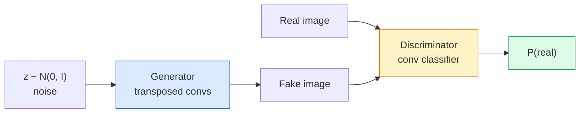
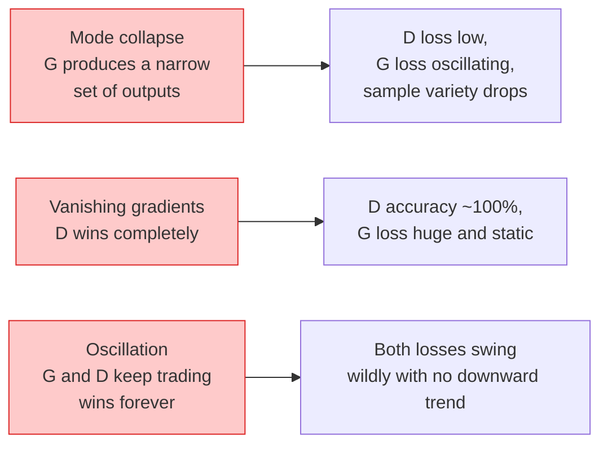

# إنتاج الصور  GANs ‬ إنتاج الصور ‬ 生成 ضد شبكة

> "جان" هي شبكتين عصبيتين في لعبة ثابتة، واحد يسحب، واحد ينتقد، يزدادون قدرة على التواصل مع بعضهم البعض حتى تخدع الرسوم النقاد.

> **【中文解读】**جين (بالإنجليزية: Generator Against Network) هو واحد من شبكتين العصبية: جيناتور رسومات، قاضيّة تحديداً، والتي تطورت معاً حتى جيناتور يمكن أن يخدع عبر قاضيّة.

> **【拓展：GAN 的遗产】**في StyleGAN (((إنسانية إنتاج) ✓CycleGAN ((风格迁移) ✓Super-Resolution GAN ((图像超分辨率)) في تطبيقات تاريخية‬‬‬‬‬‬‬‬‬‬‬‬‬‬‬‬‬‬‬‬‬‬‬‬‬‬‬‬‬‬‬‬‬‬‬‬‬‬‬‬‬‬‬‬‬‬‬‬‬‬‬‬‬‬‬‬‬‬‬‬‬‬‬‬‬‬‬‬‬‬‬‬‬‬‬‬‬‬‬‬‬‬‬‬‬‬‬‬‬‬‬‬‬‬‬‬‬‬‬‬‬‬‬‬‬‬‬‬‬‬‬‬‬‬‬‬‬‬‬‬‬‬‬‬‬‬‬‬‬‬‬‬‬‬‬‬‬‬‬‬‬‬‬‬‬‬‬‬‬‬‬‬‬‬‬‬‬‬‬‬‬‬‬‬‬‬‬‬‬‬‬‬‬‬‬‬‬‬‬‬‬‬‬‬‬‬‬‬‬‬‬‬‬‬‬‬‬‬‬‬‬‬‬‬‬‬‬‬‬‬‬‬‬‬‬‬‬‬‬‬‬‬‬‬‬‬‬‬‬‬‬‬‬‬‬‬‬‬‬‬‬‬‬‬‬‬‬‬‬‬‬‬‬‬‬‬‬‬‬‬‬‬‬‬‬‬‬‬‬‬‬‬‬‬‬‬‬‬‬‬‬‬‬‬‬‬‬‬‬‬‬‬‬‬‬‬‬‬‬‬‬‬‬‬‬‬‬‬‬‬‬‬‬‬‬‬‬‬‬‬‬‬‬‬‬‬‬‬‬‬‬‬‬‬‬‬‬‬‬‬‬‬‬‬‬‬‬‬‬‬‬‬‬‬‬‬‬‬‬‬‬‬‬‬‬‬‬‬‬‬‬‬‬‬‬‬‬‬‬‬‬‬‬‬‬‬‬‬‬‬‬‬‬‬‬‬‬‬‬‬‬‬‬‬‬‬‬‬‬‬‬‬‬‬‬‬‬‬‬‬‬‬‬‬‬‬‬‬‬‬‬‬‬‬‬‬‬‬‬‬‬‬‬‬‬‬‬‬‬‬‬‬‬‬‬‬‬‬‬‬‬‬

**Type:** Build | **类型:** 动手
**Languages:** Python | **语言:** Python
**Prerequisites:** Phase 4 Lesson 03 (CNNs), Phase 3 Lesson 06 (Optimizers), Phase 3 Lesson 07 (Regularization) | **前置知识:** Phase 4 Lesson 03（CNN），Phase 3 Lesson 06（优化器），Phase 3 Lesson 07（正则化）
**Time:** ~75 minutes | **时间:** ~75 分钟

## أهداف التعلم

- شرح اللعبة الحد الأدنى بين المولد والتمييز و لماذا يتوافق التوازن مع p_model = p_data
- تنفيذ DCGAN في PyTorch وجعله يخلق صور اصطناعية متماسكة 32x32 في أقل من 60 سطر
- استقرار تدريب GAN مع ثلاث حيل قياسية: فقدان غير المشبعة، المعيار الطيفي، TTUR (قاعدة تحديث مرتين)
- قراءة منحنى التدريب التي تميز التقارب الصحي من انهيار النظام، التذبذب، والتمييز-الفوز-كامل

> **【中文解读】**يُدعى أهداف التعلم المفردة التي يجب أن تتحكم فيها بعد الانتهاء من الدورة.


## المشكلة المشكلة المشكلة

التصنيف يعلم الشبكة كيفية رسم صور إلى العلامات. يُعكس الجيل المشكلة: عينة صور جديدة تبدو وكأنها جاءت من نفس التوزيع. لا توجد إنتاج "صحيح" يمكنك التفاوت معه؛ هناك فقط توزيع تريد محاكته.

> تُخطي شبكة التدريس الصورة إلى العلامات. تُنتج هذه المشكلة: تبدو النموذج من صورة جديدة من نفس التوزيع. لا توجد إصدارات "صحيحة" يمكن مقارنتها.

لا يمكن لـ (MSE، التنقل المتقاطع) قياس "هل جاءت هذه العينة من التوزيع الحقيقي". تقليل خطأ لكل بيكسل ينتج متوسطات مغمورة، وليس عينات واقعية. كان الانفجار هو معرفة الخسارة: تدريب شبكة ثانية وظيفتها هي معرفة حقيقة من مزيفة، واستخدام حكمها لدفع مولد.

> 標準損失函数 ((MSE、交叉) لا يمكن قياس" هل هذا النموذج يأتي من التوزيع الحقيقي"― الحد الأدنى من خيبة الصورة لتوليد متوسط المظلم، بدلا من النموذج الحقيقي―突破是学习损失:训练第二网络,其工作是区分真假,并用它判断推动生成器──

وقد وضعت GANs (Goodfellow et al., 2014) هذا الإطار. بحلول عام 2018، كانت StyleGAN تنتج 1024 × 1024 وجهًا لا يمكن التمييز بينهما من الصور. وقد استولى نماذج التنشر على العرش على الجودة والتحكم فيها منذ ذلك الحين، ولكن كل حيلة تجعل التنشر عملية  خيارات التطبيع، الفضاء الخفيف، فقدان الميزات  تم فهمها لأول مرة على GANs.

> غان ((Goodfellow وغيره، 2014) حدد هذا الإطار. حتى عام 2018، تمكن ستايلجان من إنتاج 1024 × 1024 面部 لا يمكن التمييز بينها مع الصورة.

## المفهوم الأساسي

> **【中文解读】**هذا المقطع يعرض المفاهيم والنظريات الأساسية. فهم هذه المفاهيم هو شرط لتحقيق التنفيذ التالي، وكذلك النقاط المعرفة في المقابلة والممارسة التجريبية.


### الشبكات



- نعم**generator**G يأخذ متجه للضوضاء `z`و يخرج صورة.**discriminator**D يأخذ صورة وتخرج مقياس واحد: احتمال أن الصورة حقيقية.

> **生成器**G 接收噪声向量 `z`وخرج صورة**判别器**D 接收一张图像并输出一个标量: هذه الصورة لفرص الصورة الحقيقية.

### اللعبة

(ج) يريد أن يكون (د) خاطئاً (د) يريد أن يكون محقاً

> G 希望 D 判断错, D 希望判断正确──形式化地:

```
min_G max_D  E_x[log D(x)] + E_z[log(1 - D(G(z)))]
```

اقرأ من اليمين إلى اليسار: D هو زيادة دقة على الحقيقي (`log D(real)`(و) وهمية`log (1 - D(fake))`(G) يقلل من دقة D على المزيفات`D(G(z))`أن تكون عالقاً

> من اليمين إلى اليسار:D في تحسين الصورة الحقيقية`log D(real)`) و صور وهمية`log(1 - D(fake))`) من المعدلات الدقيقة. G في الحد الأدنى D من المعدلات الدقيقة للصور الزائفة `D(G(z))`尽可能高──

أثبت (غودفيلو) أن هذا الحد الأدنى له توازن عالمي حيث`p_G = p_data`, D يخرج 0.5 في كل مكان، و الانفصال بين النموات المولدة والواقعية هو صفر. الجزء الصعب هو الحصول على ذلك.

> لقد أثبتت أن هناك نقطة توازن في العالم`p_G = p_data`،D في جميع المواقع الناتج 0.5 ، وتوليد التوزيع بين التوزيع الحقيقي و Jensen-Shannon  انتشار هو صفر. الجزء المشكول هو كيفية الوصول إلى ذلك التوازن.

### الخسارة غير المشبعة

النموذج أعلاه غير مستقرة عدداً في بداية التدريب`D(G(z))`هو قريب من الصفر لكل مزيف، لذلك `log(1 - D(G(z)))`لديه تراجعات تختفي فيما يتعلق بـ G. الإصلاح: ضياع فليب G.

> النموذج المذكور أعلاه غير مستقرة على القيمة العددية.`D(G(z))`لكل نموذج تقريباً صفر، لذلك`log(1 - D(G(z)))`على G من التدرجة تميل إلى الاختفاء.

```
L_D = -E_x[log D(x)] - E_z[log(1 - D(G(z)))]
L_G = -E_z[log D(G(z))]                          # non-saturating
```

الآن متى`D(G(z))`إنّه قريب من الصفر، فقدان G كبير و تراجعها معلوميّ.

> الآن، كن`D(G(z))`接近零时,G的损失很大,梯度信息充足──每现代GAN都使用这个变体训练──

### قواعد معماري DCGAN

رادفورد، ميتز، تشينتالا (2015) تمزق سنوات من التجارب الفاشلة إلى خمس قواعد تجعل تدريب GAN مستقرة:

> رادفورد ميتز تشينتالا ((2015)) سوف تعيش تجربة تجربة فشلت لعدة سنوات لتقديم قواعد ثابتة لتنمية GAN:

1. استبدل التجميع بالمركبات المتقدمة (كلتا الشباك).
   中文翻译:用步幅卷积替代池化层(两个网络都适用)
2. استخدم معايير اللحظة في كل من المولد والتمييز، باستثناء خروج G ومدخل D.
   ترجمة باللغة الصينية: يتم استخدام التوطين في جميع المنتجات والتحديدات، ولكن يتم استبعاد الطبقة المخرجة G و D من الطبقة المدخلة D.
3. إزالة الطبقات المتصلة بالكامل على المعماريات العميقة.
   中文翻译: في أعمق بنية تم نقل جميع الارتباطات.
4. G يستخدم ReLU على جميع الطبقات باستثناء الخروج (tanh للخروج في [-1, 1]).
   中文翻译:G 在所有层使用 ReLU,输出层除外(输出层用 tanh 将值域限制在 [-1, 1])。
5. D يستخدم LeakyReLU (منفي_التنحدر=0.2) على جميع الطبقات.
   中文翻译:D 在所有层使用LeakyReLU(负斜率=0.2)。

كل GAN الحديث القائم على المجموعات (StyleGAN، BigGAN، GigaGAN) لا يزال يبدأ من هذه القواعد ويستبدل الأجزاء واحدة في كل مرة.

> كل عصرية على أساس الحجم GAN ((StyleGAN、BigGAN、GigaGAN) لا تزال تنشأ من هذه القواعد، وتبدل كل واحد من المكونات.

### أساليب الفشل وتوقيعاتها



- **Mode collapse**: G يجد صورة واحدة تحكم D وينتج ذلك فقط.
  中文翻译:模式塌G 找到一张能骗过D的图像,然后只生成那张──修复:添加小批量判别、谱归归归归归归归归归归归归归归归归归归归归归归归归归归归归归归归归归归归归归归归归归归归归归归归归归归归归归归归归归归归归归归归归归归归归归归归归归归归归归归归归归归归归归归归归归归归归归归归归归归归归归归归归归归归归归归归归归归归归归归归归归归归归归归归归归归归归归归归归归归归归归归归归归归归归归归归归归归归归归归归归归归归归归归归归归归归归归归归归归归归归归归归归归归归归归归归归归归归归归归归归归归归归归归归归归归归归归归归归归归归归归归归归归归归归归归归归归归归归归归归归归归归归归归归归归归归归归归归归归归归归归归归归归归归归归归归归归归归归归归归归归归归归归归归归归归归归归归归归归归归归归归归归归归归归归归归归归归归归归归归归归归归归归归归归归归归归归归归归归归归归归归归归归归归归归归归归归归归归归归归归归归归归归归归归归归归归归归归归归归归归归归归归归归归归归归归归归归归归归归归归归归归归归归归归归归归归归归归归归归归归归归归归归归归归归归归归归归归归归归归归归归归归归归归归归归归归归归归归归归归归归归归归归归归归归归
- **Discriminator wins**D يصبح قوياً جداً بسرعة كبيرة، وتختفي تراجعيات G. إصلاح: D أصغر، معدل تعلم D أقل، أو تطبيق تسهيل اللوحة على اللوحات الحقيقية.
  中文翻译:判别器完胜D 变得太强太快,G 的梯度消失──修复:缩小 D、降低 D 学习率或对真标进行平滑──
- **Oscillation**: الفوز في التجارة دون الاقتراب من التوازن. تحديد: TTUR (تعلم D أسرع من G بمعدل 2-4) ، أو الانتقال إلى خسارة Wasserstein.
  中文翻译:振荡两个网络交替占优,永远无法接近平衡──修复:TTUR(D比 G 快 2-4 倍) أو切换到Wasserstein 损失──

### التقييم

لا يوجد حقيقة في الأراضي، لذا كيف تعرف أنهم يعملون؟

> لا يوجد إجابة معايير، كيف يمكنك أن تقرر ما إذا كانت تعمل بشكل طبيعي؟

- **Sample inspection**فقط انظر إلى 64 عينة في نهاية كل عصر. غير قابل للتفاوض.
  中文翻译:样本检查每个时代 结束时看64 个样本──这是不可省的步骤──
- **FID (Fréchet Inception Distance)** المسافة بين التوزيعات المميزة في Inception-v3 للجماعات الحقيقية والمتولدة. أقل هو أفضل. معيار اجتماعي.
  中文翻译:FID(Fréchet Inception Distance) 真实集和生成集在 Inception-v3 特征分布之间的距离──越低越好──社区标准──
- **Inception Score** أكبر سناً، أكثر هشاشة؛ تفضل FID.
  中文翻译:بداية النتيجة较老、较脆弱;优先使用FID。
- **Precision/Recall for generative models** تقيس الجودة (الدقة) والغطاء (التذكير) بشكل منفصل.
  ترجمة باللغة الصينية: شرح تحديد النموذج/تعدادات المنتجة分别衡量质量(精确率) و تغطية(تعدادات المنتجة)。比单独的FID更有信息量。

لتحقيق بيانات صناعية صغيرة، فان التفتيش العينوي كافيا.

> بالنسبة للمجربة الصغيرة المكونة من البيانات، فان اختبار النموذج كافٍ.

> **【中文解读】**هذا المقطع من خلال الكود من الصفر لتحقيق الخوارزمية النووية. هذا النوع من "من الصفر" يمكن أن يساعد على فهم المبدأ الخلفي للإطار، عندما يواجهون مشكلة لن يتم تعقلها في الصندوق الأسود.

> **【拓展：工业部署中的视觉系统】**في التوزيع الصناعي الواقعي، تحتاج النموذج المرئي إلى النظر في التفكير في التأجيل، والنموذج الكبير، والجهاز الحدودي الملائمة وغيرها من المشاكل.

> **【拓展：数据标注与质量】** تأثير المهام المرئية يعتمد على جودة البيانات المعلنة.‬‬‬‬‬‬‬‬‬‬‬‬‬‬‬‬‬‬‬‬‬‬‬‬‬‬‬‬‬‬‬‬‬‬‬‬‬‬‬‬‬‬‬‬‬‬‬‬‬‬‬‬‬‬‬‬‬‬‬‬‬‬‬‬‬‬‬‬‬‬‬‬‬‬‬‬‬‬‬‬‬‬‬‬‬‬‬‬‬‬‬‬‬‬‬‬‬‬‬‬‬‬‬‬‬‬‬‬‬‬‬‬‬‬‬‬‬‬‬‬‬‬‬‬‬‬‬‬‬‬‬‬‬‬‬‬‬‬‬‬‬‬‬‬‬‬‬‬‬‬‬‬‬‬‬‬‬‬‬‬‬‬‬‬‬‬‬‬‬‬‬‬‬‬‬‬‬‬‬‬‬‬‬‬‬‬‬‬‬‬‬‬‬‬‬‬‬‬‬‬‬‬‬‬‬‬‬‬‬‬‬‬‬‬‬‬‬‬‬‬‬‬‬‬‬‬‬‬‬‬‬‬‬‬‬‬‬‬‬‬‬‬‬‬‬‬‬‬‬‬‬‬‬‬‬‬‬‬‬‬‬‬‬‬‬‬‬‬‬‬‬‬‬‬‬‬‬‬‬‬‬‬‬‬‬‬‬‬‬‬‬‬‬‬‬‬‬‬‬‬‬‬‬‬‬‬‬‬‬‬‬‬‬‬‬‬‬‬‬‬‬‬‬‬‬‬‬‬‬‬‬‬‬‬‬‬‬‬‬‬‬‬‬‬‬‬‬‬‬‬‬‬‬‬‬‬‬‬‬‬‬‬‬‬‬‬‬‬‬‬‬‬‬‬‬‬‬‬‬‬‬‬‬‬‬‬‬‬‬‬‬‬‬‬‬‬‬‬‬‬‬‬‬‬‬‬‬‬‬‬‬‬‬‬‬‬‬‬‬‬‬‬‬‬‬‬‬‬‬‬‬‬‬‬‬‬‬‬‬‬‬‬‬‬‬‬‬‬‬‬‬‬‬‬‬‬‬‬‬‬‬‬‬‬‬‬‬‬‬‬‬‬‬‬‬‬‬‬‬‬‬‬‬‬‬‬‬‬‬


## بناء ذلك تحرك لتحقيق
```figure
cv-gan-image
```

## بناءها

### الخطوة الأولى: مولد

مولد DCGAN صغير يأخذ ضجيج 64 أبعاد وينتج صورة 32x32.

> جهاز DCGAN صغير، يتلقى 64 维 ضجيج ويولد 32x32 图像──

```python
import torch
import torch.nn as nn

class Generator(nn.Module):
    def __init__(self, z_dim=64, img_channels=3, feat=64):
        super().__init__()
        self.net = nn.Sequential(
            nn.ConvTranspose2d(z_dim, feat * 4, kernel_size=4, stride=1, padding=0, bias=False),
            nn.BatchNorm2d(feat * 4),
            nn.ReLU(inplace=True),
            nn.ConvTranspose2d(feat * 4, feat * 2, kernel_size=4, stride=2, padding=1, bias=False),
            nn.BatchNorm2d(feat * 2),
            nn.ReLU(inplace=True),
            nn.ConvTranspose2d(feat * 2, feat, kernel_size=4, stride=2, padding=1, bias=False),
            nn.BatchNorm2d(feat),
            nn.ReLU(inplace=True),
            nn.ConvTranspose2d(feat, img_channels, kernel_size=4, stride=2, padding=1, bias=False),
            nn.Tanh(),
        )

    def forward(self, z):
        return self.net(z.view(z.size(0), -1, 1, 1))
```

أربعة قوائم نقل، كل منها مع`kernel_size=4, stride=2, padding=1`لذا فهي تضاعف حجم المكان بشكل نظيف. تنشيط الخروج في [-1, 1] عبر tanh.

> أربع أدوات، كل استخدام`kernel_size=4, stride=2, padding=1`لتحقيق الصحة سوف يضاعف حجم الفضاء بضعة أضعاف.

### الخطوة الثانية: التمييز

مرآة المولّد، "المركبات المتدفقة" المتدفقة، تنتهي بـ "المناسبة"

> صور العداد المتحكمات.

```python
class Discriminator(nn.Module):
    def __init__(self, img_channels=3, feat=64):
        super().__init__()
        self.net = nn.Sequential(
            nn.Conv2d(img_channels, feat, kernel_size=4, stride=2, padding=1),
            nn.LeakyReLU(0.2, inplace=True),
            nn.Conv2d(feat, feat * 2, kernel_size=4, stride=2, padding=1, bias=False),
            nn.BatchNorm2d(feat * 2),
            nn.LeakyReLU(0.2, inplace=True),
            nn.Conv2d(feat * 2, feat * 4, kernel_size=4, stride=2, padding=1, bias=False),
            nn.BatchNorm2d(feat * 4),
            nn.LeakyReLU(0.2, inplace=True),
            nn.Conv2d(feat * 4, 1, kernel_size=4, stride=1, padding=0),
        )

    def forward(self, x):
        return self.net(x).view(-1)
```

آخر مقعد يقلل من`4x4`خريطة الميزات إلى `1x1`. إنتاج واحد من مستوى الكمبيوتر لكل صورة، تطبيق sigmoid فقط أثناء حساب الخسارة.

> آخر واحد卷 `4x4`خصائص التخفيض`1x1` لكل صورة إصدار حجم معين؛ فقط في حساب الخسارة تطبيق sigmoid‬

### الخطوة الثالثة: خطوة التدريب

بديل: تحديث D مرة واحدة، ثم G مرة واحدة، كل دفعة.

> 交替进行: كل حزمة 先更新 D 一次,再更新 G 一次。

```python
import torch.nn.functional as F

def train_step(G, D, real, z, opt_g, opt_d, device):
    real = real.to(device)
    bs = real.size(0)

    # D step
    opt_d.zero_grad()
    d_real = D(real)
    d_fake = D(G(z).detach())
    loss_d = (F.binary_cross_entropy_with_logits(d_real, torch.ones_like(d_real))
              + F.binary_cross_entropy_with_logits(d_fake, torch.zeros_like(d_fake)))
    loss_d.backward()
    opt_d.step()

    # G step
    opt_g.zero_grad()
    d_fake = D(G(z))
    loss_g = F.binary_cross_entropy_with_logits(d_fake, torch.ones_like(d_fake))
    loss_g.backward()
    opt_g.step()

    return loss_d.item(), loss_g.item()
```

`G(z).detach()`في الخطوة D أمر حاسم: نحن لا نريد أن تدفق التراجعات إلى G خلال تحديثها. نسيان ذلك هو خطأ المبتدئين الكلاسيكي.

> في الخطوة`G(z).detach()`至关重要: نحن لا نريد أن نرى درجة التدفق إلى G في عملية تحديث D.

### الخطوة الرابعة: حلقة تدريب كاملة على الأشكال الاصطناعية

```python
from torch.utils.data import DataLoader, TensorDataset
import numpy as np

def synthetic_images(num=2000, size=32, seed=0):
    rng = np.random.default_rng(seed)
    imgs = np.zeros((num, 3, size, size), dtype=np.float32) - 1.0
    for i in range(num):
        r = rng.uniform(6, 12)
        cx, cy = rng.uniform(r, size - r, size=2)
        yy, xx = np.meshgrid(np.arange(size), np.arange(size), indexing="ij")
        mask = (xx - cx) ** 2 + (yy - cy) ** 2 < r ** 2
        color = rng.uniform(-0.5, 1.0, size=3)
        for c in range(3):
            imgs[i, c][mask] = color[c]
    return torch.from_numpy(imgs)

device = "cuda" if torch.cuda.is_available() else "cpu"
data = synthetic_images()
loader = DataLoader(TensorDataset(data), batch_size=64, shuffle=True)

G = Generator(z_dim=64, img_channels=3, feat=32).to(device)
D = Discriminator(img_channels=3, feat=32).to(device)
opt_g = torch.optim.Adam(G.parameters(), lr=2e-4, betas=(0.5, 0.999))
opt_d = torch.optim.Adam(D.parameters(), lr=2e-4, betas=(0.5, 0.999))

for epoch in range(10):
    for (batch,) in loader:
        z = torch.randn(batch.size(0), 64, device=device)
        ld, lg = train_step(G, D, batch, z, opt_g, opt_d, device)
    print(f"epoch {epoch}  D {ld:.3f}  G {lg:.3f}")
```

`Adam(lr=2e-4, betas=(0.5, 0.999))`إذا كانت الوضع الاختيارية DCGAN  البيتا1 المنخفضة تبقي فترة الزخم من استقرار اللعبة المعارضة كثيرا.

> `Adam(lr=2e-4, betas=(0.5, 0.999))`هو التركيب الافتراضي لـ DCGAN  بيتا1 أقل  منع الحركة المكثفة على الاستقرار ضد التهديدات

### الخطوة 5: أخذ العينات

```python
@torch.no_grad()
def sample(G, n=16, z_dim=64, device="cpu"):
    G.eval()
    z = torch.randn(n, z_dim, device=device)
    imgs = G(z)
    imgs = (imgs + 1) / 2
    return imgs.clamp(0, 1)
```

دائماً انقل إلى وضع تقييم قبل أخذ العينات. بالنسبة لـ DCGAN هذا مهم لأن إحصاءات تشغيل معايير البطولة تستخدم بدلاً من إحصاءات البطولة.

> 采样前务必切换到 eval 模式── بالنسبة إلى DCGAN هذا مهم، لأن المجموعة التوحيدية ستستخدم إحصاءات عند التشغيل وليس إحصاءات اللحظة الحالية──

### الخطوة 6: التطبيع الطيفي

بديل للـ BN في المتميز الذي يضمن الشبكة هو 1-Lipschitz. يصلح معظم فشل "D يفوز بقوة كبيرة".

> 谱归归归化是判别器中批归归化即插即用替代方案,保证网络是1-Lipschitz 的──能修复大多数"D 赢得太彻底"的问题──

```python
from torch.nn.utils import spectral_norm

def build_sn_discriminator(img_channels=3, feat=64):
    return nn.Sequential(
        spectral_norm(nn.Conv2d(img_channels, feat, 4, 2, 1)),
        nn.LeakyReLU(0.2, inplace=True),
        spectral_norm(nn.Conv2d(feat, feat * 2, 4, 2, 1)),
        nn.LeakyReLU(0.2, inplace=True),
        spectral_norm(nn.Conv2d(feat * 2, feat * 4, 4, 2, 1)),
        nn.LeakyReLU(0.2, inplace=True),
        spectral_norm(nn.Conv2d(feat * 4, 1, 4, 1, 0)),
    )
```

> **【中文解读】**هذا المقال يوضح كيفية استخدام إطار متقدم مثل PyTorch、HuggingFace وغيرها) سريعة تطبيق هذه التقنية.


التغيير`Discriminator`لـ`build_sn_discriminator()`وغالباً ما لا تحتاج إلى خدعة TTUR. المعيار الطيفي هو أسهل تحديث واحد للقوة يمكنك تطبيقه.

> ستعمل`Discriminator`替换为 `build_sn_discriminator()`بعد ذلك لا تحتاج إلى تقنية التجربة.


> **【拓展：视觉模型的持续学习】**في بيئة الإنتاج، يتطلب نموذج الرؤية التكيف المستمر مع البيانات الجديدة.

## استخدمها في إطار التنفيذ

بالنسبة للإنتاج الجيد، استخدم الأوزان المُدربة مسبقاً أو أبدل التوزيع.

- `torch_fidelity`يحسب FID / IS على مولد الخاص بك دون كتابة رمز تقييم مخصص.
- `pytorch-gan-zoo`(الورث) و `StudioGAN`تم اختبار عمليات تنفيذ DCGAN و WGAN-GP و SN-GAN و StyleGAN و BigGAN على متن السفينة.

في عام 2026، لا تزال GANs هي أفضل خيار ل: إنتاج الصور في الوقت الحقيقي (التأخير <10 ms) ، ونقل الأسلوب، ترجمة الصورة إلى الصورة مع التحكم الدقيق (Pix2Pix، CycleGAN). ينتصر التوزيع على التصوير الصوري وتكييف النص.

> **【中文解读】**هذا المادة يركز على كيفية نشر النموذج كمنتج متاح. من النموذج الأصلي إلى النظام في مرحلة الإنتاج، تحتاج إلى النظر في العديد من الخصائص في تحسين الأداء والتعامل الخاطئ والتحكم.


## أرسلها .

هذا الدرس ينتج عن:

- `outputs/prompt-gan-training-triage.md` طلب يقرأ وصف منحنى التدريب ويحدد وضع الفشل (انهيار الوضع، D-فوز، التذبذب) بالإضافة إلى الإصلاح الموصى به.
- `outputs/skill-dcgan-scaffold.md`مهارة تكتب منصة DCGAN من`z_dim`، الهدف`image_size`و`num_channels`، بما في ذلك حلقة تدريب ومدفوعة العينات.

> **【中文解读】**练题按照易/中级/Hard 三个难度递进──建议至少完成 级级中级的题目,Hard 级适合深入研究或面试准备──


## تمارين التدريب

1. **(Easy)**قم بتدريب DCGAN أعلاه على مجموعة بيانات الدورات الاصطناعية وتحفظ شبكة من 16 عينة في نهاية كل عصر.
2. **(Medium)**استبدل قاعدة اللحظة من المتمييز مع قاعدة الطيف. تدريب كلا النسخين جنبا إلى جنب. أي واحد يتقارب أسرع؟ أي واحد لديه اختلاف أقل بين ثلاث بذور؟
3. **(Hard)**تنفيذ DCGAN مشروط: إدخال علامة الفئة في كل من G و D (تقاطع واحد حار إلى الضوضاء في G، وتقاطع قناة تضمين الفئة في D). تدريب على مجموعة بيانات "الدوائر مقابل المربع" الاصطناعية من الدروس 7 ووضح أن تطبيق التأهيل الفئة يعمل عن طريق أخذ العينات مع علامات محددة.

> **【中文解读】**في لغة "ما يقوله الناس" مقابل "ما يعنيه في الواقع" تم التمييز بين لغة اليومية والتقنية المحددة.


## شروط الرئيسية

| Term | What people say | What it actually means |
|------|----------------|----------------------|
| Generator (G) | "The draws-stuff net" | Maps noise to images; trained to fool the discriminator |
| Discriminator (D) | "The critic" | Binary classifier; trained to distinguish real from generated images |
| Minimax | "The game" | min over G, max over D of an adversarial loss; equilibrium is p_G = p_data |
| Non-saturating loss | "The numerically sane version" | G's loss is -log(D(G(z))) instead of log(1 - D(G(z))) to avoid vanishing gradients early in training |
| Mode collapse | "Generator makes one thing" | G produces only a small subset of the data distribution; fix with SN, minibatch discrimination, or larger batch |
| TTUR | "Two learning rates" | D learns faster than G, typically by a factor of 2-4; stabilises training |
| Spectral norm | "1-Lipschitz layer" | A weight-normalisation that bounds each layer's Lipschitz constant; stops D from becoming arbitrarily steep |
| FID | "Fréchet Inception Distance" | Distance between Inception-v3 feature distributions of real and generated sets; the standard evaluation metric |

> **【中文解读】**延伸阅读 يوفر موارد عالية الجودة للتعلم المتعمق.


## المزيد من القراءة

- [Generative Adversarial Networks (Goodfellow et al., 2014)](https://arxiv.org/abs/1406.2661)-الورقة التي بدأت كل شيء
- [DCGAN (Radford, Metz, Chintala, 2015)](https://arxiv.org/abs/1511.06434)قواعد الهندسة المعمارية التي جعلت GAN تدريبية
- [Spectral Normalization for GANs (Miyato et al., 2018)](https://arxiv.org/abs/1802.05957) خدعة الاستقرار الوحيدة الأكثر فائدة
- [StyleGAN3 (Karras et al., 2021)](https://arxiv.org/abs/2106.12423)" سوتا غان " ، يقرأ مثل ألبوم أفضل أغاني من كل خدعة من العقد الماضي
