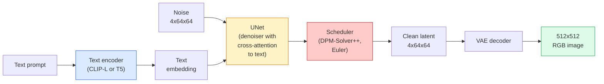

# التوزيع المستقر  الهندسة المعمارية والتنظيمات الدقيقة  التوزيع المستقر  التشكيل والصغرات

> Diffusion Stable هو DDPM الذي يعمل في الفضاء الخفيف ل VAE المدرب مسبقا، مشروط على النص عن طريق الانتباه المتقاطع، ومعينة مع حلول ODE تحديدية سريعة، وتحكم من خلال توجيه خالية من المصنف.

> **【中文解读】**التوزيع المستقر هو نموذج الانتشار الذي يعمل في الفضاء المحتمل في VAE ، من خلال التدريبات المشتركة.

> **【拓展：Stable Diffusion 生态】**التوزيع المستقر  مشتق من LoRA(خفيفة القدر من التوزيع) ControlNet(تحكم الموقف / الحافة) IP-Adapter(تصويرات النقاط) وغيرها الغنية النمو.

**Type:** Learn + Use | **类型:** 学习 + 应用
**Languages:** Python | **语言:** Python
**Prerequisites:** Phase 4 Lesson 10 (Diffusion), Phase 7 Lesson 02 (Self-Attention) | **前置知识:** Phase 4 Lesson 10（扩散模型），Phase 7 Lesson 02（自注意力）
**Time:** ~75 minutes | **时间:** ~75 分钟

## أهداف التعلم

- تتبع خمسة قطع من خط الأنابيب المتواصلة: VAE، مرموز النص، U-Net، المجدول، فحص السلامة  وما تفعله كل منها في الواقع
- شرح التوزيع المتخفي ولماذا تدريب في مساحة متخفية 4x64x64 (بدلاً من صورة 3x512x512) يقلل من الحساب بنسبة 48x دون فقدان الجودة
- استخدام`diffusers`لتوليد الصور، وتشغيل الصورة إلى الصورة، والرسومات الداخلية، وتوليد القيادة من ControlNet
- التنسيق الدقيق التنفيض المستقر مع LoRA على مجموعة بيانات مخصصة صغيرة و تحميل مكيّف LoRA عند الاستنتاج

> **【中文解读】**يُدعى أهداف التعلم المفردة التي يجب أن تتحكم فيها بعد الانتهاء من الدورة.


## المشكلة المشكلة المشكلة

تدريب DDPM مباشرة على صور RGB 512x512 مكلف. كل خطوة تدريبية تراجع من خلال شبكة U-Net التي ترى قيم المدخل 3x512x512 = 786,432، وتأخذ العينات 50+ إلى الأمام تمر عبر نفس شبكة U-Net. في مستوى جودة Stable Diffusion 1.5 (صادر في 2022) ، فإن انتشار الفضاء البيكسل يحتاج إلى حوالي 256 شهرًا من التدريب في GPU و 10-30 ثانية لكل صورة على GPU المستهلك.

> 直接在 512x512 RGB 图像上训练 DDPM 很昂贵. كل خطوة تدريبية يجب أن تمر عبر واحد ترى 3x512x512 = 786,432 个输入值 U-Net 反向传播,采样需要通过同一个 U-Net 进行 50+ 次前向传播.

الخدعة التي جعلت النص الصور المفتوحة مميزة كانت**latent diffusion**(Rombach et al., CVPR 2022). تدريب VAE الذي يرسم صورة 3x512x512 إلى 10x64x64 مضغوطة متخفية وراء، ثم القيام بالانشطاعات في هذا الفضاء المتخفية.`(3*512*512)/(4*64*64) = 48x`.تراجع معينة من عشرات الثواني إلى أقل من ثواني على نفس المصفوفة المعالجة

> لتحويل المقالة إلى الصور إلى مهارات عملية هي**潜空间扩散**(Rombach 等,CVPR 2022)  تدريب VAE سوف 3x512x512 图像映射到4x64x64 潜张量并恢复, ثم القيام بالانتشار في ذلك المجال潜空间‬‬ `(3*512*512)/(4*64*64) = 48x`في نفس الجيبو، تمت أخذ النموذج من عدة ثوان إلى ثواني

تقريبا كل نموذج جديد لتوليد الصور  SDXL، SD3، FLUX، HunyuanDiT، Wan-Video  هو نموذج انتشار متخفي مع اختلافات على المُحافظ الذاتي، والمنطق (U-Net أو DiT) ، وتكييف النص. تعلم Diffusion مستقر وقد تعلمت القالب.

>  تقريبا كل نموذج تصويري حديث SDXL、SD3、FLUX、HunyuanDiT、Wan-Video هي نموذج انتشار الفضاء المتوقع، في المعدات الذاتية Dealer noise (U-Net أو DiT) ومتطلبات الكتابة هناك اختلافات في ذلك.

## المفهوم الأساسي

> **【中文解读】**هذا المقطع يعرض المفاهيم والنظريات الأساسية. فهم هذه المفاهيم هو شرط لتحقيق التنفيذ التالي، وكذلك النقاط المعرفة في المقابلة والممارسة التجريبية.


### خط الأنابيب



- **VAE** مُجمدة مُصطدرة ذاتية. مُصطدرة تحوّل الصورة إلى مخططات (مستخدمة في img2img والتدريب). مُصطدرة تحوّل المخططات إلى صورة.
  中文翻译:VAE结的自编码器──编码器将图像转换为潜变量(用于img2img 和训练),解码器将潜变量还原为图像──
- **Text encoder** رمز نص CLIP (SD 1.x/2.x) ، CLIP-L + CLIP-G (SDXL) ، أو T5-XXL (SD3/FLUX). ينتج سلسلة من التوابل الرمزية.
  中文翻译:文本编码器CLIP 文本编码器(SD 1.x/2.x)、CLIP-L + CLIP-G(SDXL) أو T5-XXL(SD3/FLUX)。产生一系列代币 嵌入──
- **U-Net** المُعَلِّم. لديه طبقات إنتباه متقاطعة تُحضر من اللاتنت إلى النص المُضمن في كل مستوى قرار.
  中文翻译:U-Net去噪器──包含交叉注意力层, في كل درجة التوصل إلى القرار من المتغيرات المتغيرة关订本嵌入──
- **Scheduler**خوارزمية أخذ العينات (DDIM، Euler، DPM-Solver++). يختار sigmas، يجمع الضوضاء المتوقعة مرة أخرى إلى اللاتين.
  中文翻译:调度器采样算法(DDIM、Euler、DPM-Solver++) ・・・选择 sigma 值,将预测的噪音混合回潜变量──
- **Safety checker** مرشح NSFW / محتويات غير قانونية اختياري على الصورة المصدرة.
  中文翻译: جهاز فحص الأمن可选的NSFW / 违规内容过器,作用于输出图像──

### الإرشادات الخالية من التصنيف (CFG)

التعلم في تكوين النص البسيط `epsilon_theta(x_t, t, c)`لكل طلب`c`. CFG تدرب نفس الشبكة مع `c`انخفضت 10% من الوقت (حل محلها بتوابل فارغة) ، مما يعطي نموذج واحد يتوقع كل من الضجيج المشروط وغير المشروط.

> 纯文本条件化学习 `epsilon_theta(x_t, t, c)`لكل كلمة`c` التدريب على شبكة التدريبات المشتركة 10% من الوقت المفقود`c`(بدلًا من أجل إدخال الفضاء) ، تحصل على نموذج ضجيج غير مشروط ومع ذلك:

```
eps = eps_uncond + w * (eps_cond - eps_uncond)
```

`w`هو مقياس التوجيه`w=0`غير مشروط`w=1`هو مشروط`w>1`يدفع الإنتاج نحو "أكثر مشروطة على الإستعراض" على حساب التنوع.`w=7.5`. . .

> `w`هو قياس المعدات`w=0`هو غير مشروط`w=1`-إنه شروط طبيعية`w>1`كذبح التنوع مقابل التكلفة دفع الإنتاج إلى "التوافق مع النصيحة"`w=7.5`.

CFG هو السبب في أن النص إلى الصورة يعمل على جودة الإنتاج. بدونها، تحذير المخرج ضعيفًا؛ مع ذلك، تحكم التحذيرات.

> CFG هو سبب عمل المقال إلى الصورة في مستوى الإنتاج تحت الجودة.

### هندسة الفضاء المتخفية

الرقم المتخفي لـ 4 قنوات في إيه اي ليس مجرد صورة مضغوطة إنها مجموعة متنوعة حيث تتوافق الحسابات تقريبًا مع التحريرات التفاصلية (هناك هندسة السرعة + التقاطع كلاهما يعيش هنا) ، حيث تم تدريب شبكة U-Net للتنشر على إنفاق ميزانية النمذجة بأكملها. لا ينتج تشخيص 4x64x64 latente عشوائية صورة تبدو عشوائية  فإنه ينتج القمامة، لأن فقط مجموعة معينة من الاختفاءات تشخيص الصور الصالحة.

> 4 طريق خيارات في VAE ليس مجرد صورة مضغوطة. انها شكل، والتي تتميز بالتنسيق والتنسيق في الحسابات، كما يتم في التدريبات على شبكة الإنترنت.

عواقب:

> 两个后果:

1. **Img2img**= تشفير الصورة إلى غامضة، إضافة ضجيج جزئي، تشغيل المُعبر، فك تشفير. ينجو بنية الصورة لأن التشفير شبه قابلة للتحويل. يتغير المحتوى بناءً على الإشارة.
   中文翻译:**Img2img**= وضع تصميم الصورة لتحول، إضافة جزء من الضجيج، تشغيل جهاز الضجيج، فك الحفرة.
2. **Inpainting**= نفس img2img ولكن المحدد يحدد فقط المناطق المخفية؛ المناطق غير المخفية يتم الاحتفاظ بها في الخرق المشفر.
   中文翻译:**Inpainting**= مشابهة لـ img2img، ولكن جهاز الضجيج يقوم بتحديث منطقة الغابات فقط؛ منطقة غير الغابات تبقى لتحديد المتغيرات المحتملة بعد ذلك

### بنية شبكة الإنترنت

إن شبكة SD U-Net هي نسخة كبيرة من TinyUNet من الدروس 10 مع ثلاثة إضافات:

> SD U-Net هو 10 ة 课 TinyUNet الإصدار الكبير، تضيف ثلاثة مكونات:

- **Transformer blocks**في كل قرار مساحي، يحتوي على الاهتمام الذاتي + الاهتمام المتبادل بالنص المضمن.
  中文翻译: كل بلاك تحول في الفضاء على قرار، يتضمن الاهتمام الذاتي + الاهتمام المتبادل على المستندات المضمنة.
- **Time embedding**عبر MLP على تشفير السينوسويدي
  中文翻译:通过 MLP 处理正弦编码的时间嵌入──
- **Skip connections**بين المُرمّد والمُرمّد عند قرارات متطابقة.
  中文翻译:编码器和码器在匹配分辨率之间跳跃连接──

مجموع المعلمات في SD 1.5: ~ 860M. SDXL: ~ 2.6B. FLUX: ~ 12B. قفزة في المعلمات هي في الغالب في طبقات الاهتمام.

> SD 1.5  مجموع العناصر حوالي 8.6 مليار دولار. SDXL حوالي 26 مليار دولار. FLUX حوالي 120 مليار دولار.

### تحديدات الحجم

يحتاج التنسيق الكامل للتسريب المستقر إلى 20+ جيجابايت من VRAM ويحديث 860 مليون برمجة. LoRA (التكيف منخفض الرتب) يبقي النموذج الأساسي مجمدًا ويضرب matrices صغيرة من الدرجة التفكيك في طبقات الاهتمام. يعتبر مكيّف LoRA لـ SD عادةً 10-50 MB ، يتدرب في 10-60 دقيقة على GPU لمستهلك واحد ، ويتحمّل في وقت الاستنتاج كتحديث يضعف.

> يتطلب الكاملة التدريبات التدريبية المتواصلة 20+ جيجابايت 显存并更新 8.6 مليار参数。LoRA(低秩适应) للحفاظ على النموذج الأساسي结، في طبقة الاهتمام مدفوعة في صغيرة秩分解矩阵。SD 适配器 عادة ما تكون فقط 10-50 MB، في مجرد张消费级 GPU 上练 10-60 分钟,推理时作为即插即用的修改加载。

```
Original: W_q : (d_in, d_out)   frozen
LoRA:     W_q + alpha * (A @ B)   where A : (d_in, r), B : (r, d_out)

r is typically 4-32.
```

(لورا) هي الطريقة التي يتم بها توزيع كل الموسيقى المحددة في المجتمع تقريباً (سيفيتاي) و (تقبيل الوجه) يستضيفون ملايين منها

> "لورا" هي طريقة تنمية لجميع المجتمعات تقريباً.

### المواعيد التي ستراها

- **DDIM** تحديد، ~ 50 خطوة، بسيطة.
  中文翻译:DDIM确定性, حوالي 50 步,简单――
- **Euler ancestral** مستويات مستويات 30 إلى 50 خطوة، عينات أكثر إبداعاً قليلاً
  中文翻译:أبو أويلر随机性,30-50 步,样本更具创意──
- **DPM-Solver++ 2M Karras** تحديد، 20 إلى 30 خطوة، افتراض الإنتاج.
  中文翻译:DPM-Solver++ 2M Karras确定性,20-30 步,生产环境默认选择。
- **LCM / TCD / Turbo** نماذج التواصل والفرازات المقطوعة؛ 1-4 خطوات على حساب نوعية.
  中文翻译:LCM / TCD / Turbo一致性模型和蒸变体;1-4 步,代价是一些质量损失──

تغيير المخططات هو تغيير واحد خط في `diffusers`وأحياناً تصحيح مشاكل العينات دون أي إعادة التدريب.

> في`diffusers`محرك تحويل المعدات يحتاج فقط إلى صف من الكود، في بعض الأحيان لا حاجة إلى إعادة التدريب على إمكانية إصلاح النموذج.

> **【中文解读】**هذا المقطع من خلال الكود من الصفر لتحقيق الخوارزمية النووية. هذا النوع من "من الصفر" يمكن أن يساعد على فهم المبدأ الخلفي للإطار، عندما يواجهون مشكلة لن يتم تعقلها في الصندوق الأسود.

> **【拓展：工业部署中的视觉系统】**في التوزيع الصناعي الواقعي، تحتاج النموذج المرئي إلى النظر في التفكير في التأجيل، والنموذج الكبير، والجهاز الحدودي الملائمة وغيرها من المشاكل.

> **【拓展：数据标注与质量】** تأثير المهام المرئية يعتمد على جودة البيانات المعلنة.‬‬‬‬‬‬‬‬‬‬‬‬‬‬‬‬‬‬‬‬‬‬‬‬‬‬‬‬‬‬‬‬‬‬‬‬‬‬‬‬‬‬‬‬‬‬‬‬‬‬‬‬‬‬‬‬‬‬‬‬‬‬‬‬‬‬‬‬‬‬‬‬‬‬‬‬‬‬‬‬‬‬‬‬‬‬‬‬‬‬‬‬‬‬‬‬‬‬‬‬‬‬‬‬‬‬‬‬‬‬‬‬‬‬‬‬‬‬‬‬‬‬‬‬‬‬‬‬‬‬‬‬‬‬‬‬‬‬‬‬‬‬‬‬‬‬‬‬‬‬‬‬‬‬‬‬‬‬‬‬‬‬‬‬‬‬‬‬‬‬‬‬‬‬‬‬‬‬‬‬‬‬‬‬‬‬‬‬‬‬‬‬‬‬‬‬‬‬‬‬‬‬‬‬‬‬‬‬‬‬‬‬‬‬‬‬‬‬‬‬‬‬‬‬‬‬‬‬‬‬‬‬‬‬‬‬‬‬‬‬‬‬‬‬‬‬‬‬‬‬‬‬‬‬‬‬‬‬‬‬‬‬‬‬‬‬‬‬‬‬‬‬‬‬‬‬‬‬‬‬‬‬‬‬‬‬‬‬‬‬‬‬‬‬‬‬‬‬‬‬‬‬‬‬‬‬‬‬‬‬‬‬‬‬‬‬‬‬‬‬‬‬‬‬‬‬‬‬‬‬‬‬‬‬‬‬‬‬‬‬‬‬‬‬‬‬‬‬‬‬‬‬‬‬‬‬‬‬‬‬‬‬‬‬‬‬‬‬‬‬‬‬‬‬‬‬‬‬‬‬‬‬‬‬‬‬‬‬‬‬‬‬‬‬‬‬‬‬‬‬‬‬‬‬‬‬‬‬‬‬‬‬‬‬‬‬‬‬‬‬‬‬‬‬‬‬‬‬‬‬‬‬‬‬‬‬‬‬‬‬‬‬‬‬‬‬‬‬‬‬‬‬‬‬‬‬‬‬‬‬‬‬‬‬‬‬‬‬‬‬‬‬‬‬‬‬‬‬‬‬‬‬‬‬‬‬‬‬‬


## بناء ذلك تحرك لتحقيق
```figure
cv3-latent-compression
```

## بناءها

هذا الدرس يستخدم`diffusers`نهاية إلى نهاية بدلا من إعادة بناء Diffusion Stable من الصفر. الأجزاء التي ستحتاج إلى إعادة بناءها (VAE ، مرموز النص ، U-Net ، المجدول) هي مواضيع دروسهم الخاصة. هنا الهدف هو السهولة مع API الإنتاج.

> 本课端到端使用 `diffusers`بدلا من إعادة بناء الصفحة المتواصلة، تحتاج إلى إعادة بناء المكونات (VAE، ورق المخططات، U-Net، المعدات) كل دورة خاصة، والهدف هو معرفة كيفية إدارة API.

### الخطوة الأولى: النص إلى الصورة

```python
import torch
from diffusers import StableDiffusionPipeline

pipe = StableDiffusionPipeline.from_pretrained(
    "runwayml/stable-diffusion-v1-5",
    torch_dtype=torch.float16,
).to("cuda")

image = pipe(
    prompt="a dog riding a skateboard in tokyo, studio ghibli style",
    guidance_scale=7.5,
    num_inference_steps=25,
    generator=torch.Generator("cuda").manual_seed(42),
).images[0]
image.save("dog.png")
```

`float16`يقلل من نصف الـ VRAM دون فقدان نوعية مرئي. `num_inference_steps=25`مع تطابقات DPM-Solver++ الافتراضية `num_inference_steps=50`مع DDIM.

> `float16` نصف استخدامات الحفظات غير واضحة ضياع الجودة `num_inference_steps=25`                                                `num_inference_steps=50`.

### الخطوة الثانية: تغيير الموعد

```python
from diffusers import DPMSolverMultistepScheduler, EulerAncestralDiscreteScheduler

pipe.scheduler = DPMSolverMultistepScheduler.from_config(pipe.scheduler.config)
pipe.scheduler = EulerAncestralDiscreteScheduler.from_config(pipe.scheduler.config)
```

حالة المخطط منفصلة عن أوزان شبكة U. يمكنك التدريب على DDPM ومعينة مع أي المخطط.

> 调度器状态与 U-Net 权重解──你可以在DDPM上训练,用任何调度器采样──

### الخطوة الثالثة: صورة إلى صورة

```python
from diffusers import StableDiffusionImg2ImgPipeline
from PIL import Image

img2img = StableDiffusionImg2ImgPipeline.from_pretrained(
    "runwayml/stable-diffusion-v1-5",
    torch_dtype=torch.float16,
).to("cuda")

init_image = Image.open("dog.png").convert("RGB").resize((512, 512))
out = img2img(
    prompt="a dog riding a skateboard, oil painting",
    image=init_image,
    strength=0.6,
    guidance_scale=7.5,
).images[0]
```

`strength`كمية الضوضاء التي يجب إضافةها قبل التخلص (0.0 = غير متغيرة، 1.0 = إعادة التأهيل الكاملة).

> `strength`控制去噪音前添加多少噪音(0.0 = 不变,1.0 = 完全重新生成) ⋅0.5-0.7 هي المدى القياسي لتنقل الاحتياجات

### الخطوة الرابعة: إدلاء الطلاء

```python
from diffusers import StableDiffusionInpaintPipeline

inpaint = StableDiffusionInpaintPipeline.from_pretrained(
    "runwayml/stable-diffusion-inpainting",
    torch_dtype=torch.float16,
).to("cuda")

image = Image.open("dog.png").convert("RGB").resize((512, 512))
mask = Image.open("dog_mask.png").convert("L").resize((512, 512))

out = inpaint(
    prompt="a cat",
    image=image,
    mask_image=mask,
    guidance_scale=7.5,
).images[0]
```

البيكسلات البيضاء في القناع هي المنطقة التي يجب تجديدها. البيكسلات السوداء يتم الحفاظ عليها.

> 掩码中白色像素是需要重新生成的区域,黑色像素被保留──

### الخطوة 5: تحميل لورا

```python
pipe.load_lora_weights("sayakpaul/sd-lora-ghibli")
pipe.fuse_lora(lora_scale=0.8)

image = pipe(prompt="a village square in ghibli style").images[0]
```

`lora_scale`يحدد قوة؛ 0.0 = لا تأثير، 1.0 = تأثير كامل. `fuse_lora`يخبز المعدل إلى الأوزان الموضحة لسرعة، ولكن يمنع التبادل.`pipe.unfuse_lora()`قبل تحميل جهاز تعديل مختلف

> `lora_scale`控制强度;0.0 = 无效,1.0 = 完全效果──`fuse_lora`سوف تتحرك المعدات إلى الوزن لزيادة السرعة، ولكن سوف تتوقف عن التبديل.`pipe.unfuse_lora()`.

### الخطوة 6: تدريب لوري (رسم)

تدريب حقيقي لـ " لورا " يعيش في`peft`أو`diffusers.training`. المخطط:

> حقيقة لورا تدريب في`peft`أو`diffusers.training`النتائج:

```python
# Pseudocode
for step, batch in enumerate(dataloader):
    images, prompts = batch
    latents = vae.encode(images).latent_dist.sample() * 0.18215

    t = torch.randint(0, num_train_timesteps, (batch_size,))
    noise = torch.randn_like(latents)
    noisy_latents = scheduler.add_noise(latents, noise, t)

    text_emb = text_encoder(tokenizer(prompts))

    pred_noise = unet(noisy_latents, t, text_emb)  # LoRA weights injected here

    loss = F.mse_loss(pred_noise, noise)
    loss.backward()
    optimizer.step()
```

> **【中文解读】**هذا المقال يوضح كيفية استخدام إطار متقدم مثل PyTorch、HuggingFace وغيرها) سريعة تطبيق هذه التقنية.


تتلقى المصفوفات LoRA فقط تراجعًا؛ يتم تجميد U-Net و VAE ومدفوع النص. مع حجم اللحظة 1 ومراقبة تراجعية يتناسب مع 8 جيجابايت من VRAM.

> 只有 LoRA 矩阵接收梯度;基础 U-Net、VAE 和文本编码器都是结的──批量大小为 1并启用梯度检查点时,8GB 显存即可运行──


> **【拓展：视觉模型的持续学习】**في بيئة الإنتاج، يتطلب نموذج الرؤية التكيف المستمر مع البيانات الجديدة.

## استخدمها في إطار التنفيذ

في الإنتاج، القرارات التي تتخذها فعلياً:

- **Model family**: SD 1.5 لموسيقى مجتمع مفتوحة المصدر ، SDXL لتحقيق أعلى ، SD3 / FLUX للحصول على أحدث وتطلبات الترخيص الصارمة.
- **Scheduler**: DPM-Solver++ 2M Karras لمدة 20-30 خطوة، LCM-LoRA عندما يكون التأخير أقل من 1 ثانية.
- **Precision**: `float16`في 4080/4090`bfloat16`على A100 وأحدث،`int8`(بـ (`bitsandbytes`أو`compel`) عندما تكون VRAM ضيقة.
- **Conditioning**: يعمل النص البسيط؛ لإضافة ControlNet (قوة، عمق، وضع) على رأس خط الأنابيب الأساسي لتحسين التحكم.

> **【中文解读】**هذا المادة يركز على كيفية نشر النموذج كمنتج متاح. من النموذج الأصلي إلى النظام في مرحلة الإنتاج، تحتاج إلى النظر في العديد من الخصائص في تحسين الأداء والتعامل الخاطئ والتحكم.


لإنتاج اللحوم`AUTO1111`- لا ، لا`ComfyUI`هي أدوات المجتمع؛ لخدمات الإنتاج،`diffusers`+ `accelerate`أو`optimum-nvidia`مع تجميع TensorRT.


## أرسلها .

هذا الدرس ينتج عن:

- `outputs/prompt-sd-pipeline-planner.md` استشارة تختار SD 1.5 / SDXL / SD3 / FLUX بالإضافة إلى الجدول المحدد والدقة بالنظر إلى ميزانية التأخير والهدف الأمني والقيود المفروضة على الترخيص.
- `outputs/skill-lora-training-setup.md` مهارة تكتب إعداد تدريب كامل لـ LoRA لمجموعة بيانات مخصصة بما في ذلك العناوين الرئيسية والرتبة وحجم اللحظة وتيرة التعلم.

> **【中文解读】**练题按照易/中级/Hard 三个难度递进──建议至少完成 级级中级的题目,Hard 级适合深入研究或面试准备──


## تمارين التدريب

1. **(Easy)**أخلق نفس الإشارة مع `guidance_scale`في`[1, 3, 5, 7.5, 10, 15]`.أوصف كيف تتغير الصورة .بأي قيمة توجيهية تظهر الأثاث ؟
2. **(Medium)**خذ أي صورة حقيقية، فحصها`StableDiffusionImg2ImgPipeline`في`strength`في`[0.2, 0.4, 0.6, 0.8, 1.0]`ما هي القوة التي تحافظ على التركيب مع تغيير النمط؟ لماذا يتجاهل 1.0 المدخل بالكامل؟
3. **(Hard)**قم بتدريب LoRA على 10-20 صورة لموضوع واحد (حيوان أليف أو شعار أو شخصية) وخلق مشاهد جديدة مع هذا الموضوع فيها. قم بتقرير ترتيب LoRA وخطوات التدريب التي أنتجت أفضل الحفاظ على الهوية دون إعادة التكيف مع الصور المدخنة.

> **【中文解读】**في لغة "ما يقوله الناس" مقابل "ما يعنيه في الواقع" تم التمييز بين لغة اليومية والتقنية المحددة.


## شروط الرئيسية

| Term | What people say | What it actually means |
|------|----------------|----------------------|
| Latent diffusion | "Diffuse in latents" | Run the entire DDPM in the VAE latent space (4x64x64) instead of pixel space (3x512x512); 48x compute saving |
| VAE scale factor | "0.18215" | Constant that rescales the VAE's raw latent to roughly unit variance; hardcoded in every SD pipeline |
| Classifier-free guidance | "CFG" | Mix conditional and unconditional noise predictions; the single most impactful inference knob |
| Scheduler | "Sampler" | The algorithm that turns noise + model predictions into a denoised latent trajectory |
| LoRA | "Low-rank adapter" | Small rank-decomposition matrices that fine-tune attention layers without touching base weights |
| Cross-attention | "Text-image attention" | Attention from latent tokens to text tokens; injects prompt information at every U-Net level |
| ControlNet | "Structure conditioning" | A separately-trained adapter that steers SD with an extra input (canny, depth, pose, segmentation) |
| DPM-Solver++ | "The default scheduler" | Second-order deterministic ODE solver; best quality at low step counts (20-30) in 2026 |

> **【中文解读】**延伸阅读 يوفر موارد عالية الجودة للتعلم المتعمق.


## المزيد من القراءة

- [High-Resolution Image Synthesis with Latent Diffusion (Rombach et al., 2022)](https://arxiv.org/abs/2112.10752) ورقة التفريق المستقر؛ يتضمن كل إزالة تبرير التصميم
- [Classifier-Free Diffusion Guidance (Ho & Salimans, 2022)](https://arxiv.org/abs/2207.12598) ورقة CFG
- [LoRA: Low-Rank Adaptation of Large Language Models (Hu et al., 2021)](https://arxiv.org/abs/2106.09685) كانت لورا أول من قام بتطبيق النظام النووي؛ تم نقلها إلى SD دون أي تغيير تقريباً
- [diffusers documentation](https://huggingface.co/docs/diffusers) الإشارة لكل خط أنابيب SD / SDXL / SD3 / FLUX
