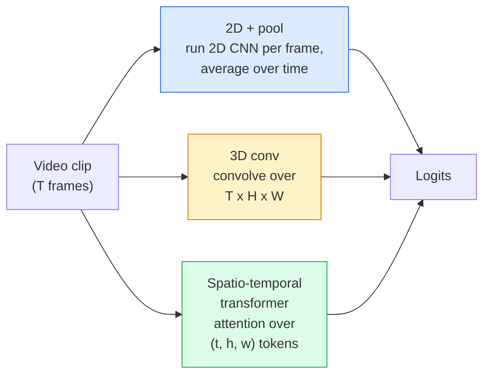

# الفيديو الفهم  نموذج مؤقت  الفيديو الفهم  时序建模

> الفيديو هو تسلسل من الصور بالإضافة إلى الفيزياء التي تربطها. كل نموذج فيديو يعامل الوقت إما كمحور إضافي (3D conv) ، أو تسلسل للاستضافة (تحول) ، أو ميزة لاستخراج مرة واحدة ومجمله (2D + المجمله).

> **【中文解读】**视频 هو مجموعة من أشكال الصورة بالإضافة إلى قوانينها الفيزيائية المرتبطة بها.

> **【拓展：视频 AI 应用】**视频理解驱动 YouTube/TikTok 内容推、安全监控的异常检查、体育赛事的自动分析──索拉等视频生成模型将视频理解推向新高度理解视频才能生成视频──

**Type:** Learn + Build | **类型:** 学习 + 动手
**Languages:** Python | **语言:** Python
**Prerequisites:** Phase 4 Lesson 03 (CNNs), Phase 4 Lesson 04 (Image Classification) | **前置知识:** Phase 4 Lesson 03（CNN），Phase 4 Lesson 04（图像分类）
**Time:** ~45 minutes | **时间:** ~45 分钟

## أهداف التعلم

- تمييز بين ثلاثة طرق نمذجة الفيديو الرئيسية (2D+pool، 3D conv، space-temporal transformer) وتنبؤ بالتنازلات بين تكلفة ودقة
- تنفيذ عينة الإطار، التجميع الزمني، وتصنيف خط أساسي 2D + المجم في PyTorch
- شرح لماذا تقوم الأجرام الثلاثية الأبعاد "المضخمة" في I3D بنقل جيد من وزنات ImageNet وما الذي يفعله المجموعة (2+1)
- اقرأ مجموعات بيانات ومقاييس التعرف على الإجراءات القياسية: Kinetics-400/600، UCF101, Something-Something V2; دقة 1 في مستوى المقطع والفيديو

> **【中文解读】**يُدعى أهداف التعلم المفردة التي يجب أن تتحكم فيها بعد الانتهاء من الدورة.


## المشكلة المشكلة المشكلة

فيديو 30 ثانية عند 30 fps هو 900 صورة. بشكل ساذج، تصنيف الفيديو تصنيف الصورة يتم تشغيله 900 مرة تليها نوع من الجمع. هذا يعمل عندما يكون العمل مرئيًا في كل إطار تقريبًا (الرياضة والطهي ومقاطع الفيديو للتمرين) ويفشل بشكل سيء عندما يتم تعريف الإجراء بالحركة نفسها: "دفع شيء من اليسار إلى اليمين" يبدو مثل كائنات ثابتة في كل إطار.

> فيديو 30 ثانية في الثانية هو 900 صورة. ببساطة، فحص الفيديو هو وضع الصورة في فئة مختلفة.

السؤال الأساسي لكل معمارة فيديو هو: متى يتم نمذجة الهيكل الزمني، وكيف؟ الإجابة تدفع كل شيء آخر  حساب التكلفة، استراتيجية قبل التدريب، ما إذا كان يمكنك إعادة استخدام أوزان ImageNet، ما هي مجموعات البيانات التي يتدرب عليها النموذج.

> السؤال الأساسي لكل بنية فيديو هو: متى يتم بناء النظام، وكيف يتم بناء؟ الإجابة تدفع كل شيء آخر  حساب التكاليف  استراتيجيات التدريب المسبق ‬ هل يمكن إعادة استخدام ImageNet 权重‬‬‬‬‬‬‬‬‬‬‬‬‬‬‬‬‬‬‬‬‬‬‬‬‬‬‬‬‬‬‬‬‬‬‬‬‬‬‬‬‬‬‬‬‬‬‬‬‬‬‬‬‬‬‬‬‬‬‬‬‬‬‬‬‬‬‬‬‬‬‬‬‬‬‬‬‬‬‬‬‬‬‬‬‬‬‬‬‬‬‬‬‬‬‬‬‬‬‬‬‬‬‬‬‬‬‬‬‬‬‬‬‬‬‬‬‬‬‬‬‬‬‬‬‬‬‬‬‬‬‬‬‬‬‬‬‬‬‬‬‬‬‬‬‬‬‬‬‬‬‬‬‬‬‬‬‬‬‬‬‬‬‬‬‬‬‬‬‬‬‬‬‬‬‬‬‬‬‬‬‬‬‬‬‬‬‬‬‬‬‬‬‬‬‬‬‬‬‬‬‬‬‬‬‬‬‬‬‬‬‬‬‬‬‬‬‬‬‬‬‬‬‬‬‬‬‬‬‬‬‬‬‬‬‬‬‬‬‬‬‬‬‬‬‬‬‬‬‬‬‬‬‬‬‬‬‬‬‬‬‬‬‬‬‬‬‬‬‬‬‬‬‬‬‬‬‬‬‬‬‬‬‬‬‬‬‬‬‬‬‬‬‬‬‬‬‬‬‬‬‬‬‬‬‬‬‬‬‬‬‬‬‬‬‬‬‬‬‬‬‬‬‬‬‬‬‬‬‬‬‬‬‬‬‬‬‬‬‬‬‬‬‬‬‬‬‬‬‬‬‬‬‬‬‬‬‬‬‬‬‬‬‬‬‬‬‬‬‬‬‬‬‬‬‬‬‬‬‬‬‬‬‬‬‬‬‬‬‬‬‬‬‬‬‬‬‬‬‬‬‬‬‬‬‬‬‬‬‬‬‬‬‬‬‬‬‬‬‬‬‬‬‬‬‬‬‬‬‬‬‬‬‬‬‬‬‬‬‬‬‬‬‬‬‬

هذه الدروس قصيرة عمداً من دروس الصورة الدقيقة. الآلة الأساسية للصورة موجودة بالفعل، وفهم الفيديو يتعلق في الغالب بالقصة الزمنية: أخذ العينات، والنمذجة، والجمع.

> هذا المرحلة لديها مقارنة مع المرحلة الصورة الحالية.

## المفهوم الأساسي

> **【中文解读】**هذا المقطع يعرض المفاهيم والنظريات الأساسية. فهم هذه المفاهيم هو شرط لتحقيق التنفيذ التالي، وكذلك النقاط المعرفة في المقابلة والممارسة التجريبية.


### العائلات المعماريّة الثلاثة



### 2D + حوض السباحة

خذ CNN 2D (ResNet، EfficientNet، ViT). قم بتشغيله بشكل مستقل على كل إطار تم أخذ العينات. متوسط (أو أقصى استجمام، أو استجمام الاهتمام) التوابع لكل إطار. إعطاء المتجه المجمع إلى مصنف.

> 取一个2D CNN(ResNet、EfficientNet、ViT),在每上独立运行,对每嵌入做平均(或最大池化、注意力池化),将池化后的量送进分类器──

المزايا:
- تحويلات قبل التدريب مباشرة
  中文翻译:ImageNet 预训练权重可直接迁移。
- أسهل شيء لتنفيذها
  中文翻译:实现最简单──
- رخيص: إطارات T * تكلفة استنتاج صورة واحدة.
  中文翻译:成本低:T  × 单推理开销。

السلبيات:
- لا أستطيع أن أظهر الحركة، العمل = مجموع المظاهر
  中文翻译:无法建模运动──动作 = جمع خارجية النظر
- التجميع المؤقت لا يتغير حسب النظام؛ "البواب المفتوح" و "البواب المغلق" تبدو نفسها.
  ترجمة: توقيت الحفرة هو ترتيب لا علاقة له؛ "فتح" و"关门" تبدو مثلها.

متى تستخدم: مهام ذات مظهر ثقيل، ونقل التعلم على مجموعات بيانات فيديو صغيرة، خطوط أساسية أولية.

> 何時使用:外观主导的任务、小视频数据集上的迁移学习、初始基线──

### التحولات الثلاثية الأبعاد

استبدل الأجزاء الثنائية الأبعاد (H، W) بأجزاء الثلاثية الأبعاد (T، H، W). تتدفق الشبكة عبر الفضاء والزمان. العائلة الأولى: C3D، I3D، SlowFast.

> سوف يتم استبدال 2D (H, W) 核 إلى 3D (T, H, W) 核──网络在空间和时间进行卷积──早期代表:C3D、I3D、SlowFast──

خدعة I3D: خذ نموذج ImageNet 2D مسبقًا ، "تضخم" كل جوهر 2D عن طريق نسخته على طول محور زمني جديد. يصبح محور 3x3 2D محور 3x3 3D. وهذا يعطي نموذج 3D أوزانًا قوية مسبقاً بدلاً من التدريب من الصفر.

> الممارسة الثلاثية: خذ تدريب إضافي للصورة الثلاثية، "توسع" كل 2D  النواة على طول محور الوقت الجديد

المزايا:
- بشكل مباشر نموذج الحركة.
  中文翻译:直接建模运动。
- التضخم I3D يعطي التعلم المجانى للتنقل
  中文翻译:I3D 膨胀提供免费的迁移学习。

السلبيات:
- T/8 أكثر FLOPs من نظيره 2D (لجيّة الزمن من 3 مكبّأ 3 مرات).
  中文翻译:比 2D 方案多 T/8 的 FLOPs (((对于时间核大小为 3、堆叠 3 次的情况) ]]
- الأجزاء الزمنية صغيرة، الحركة طويلة المدى تحتاج إلى نهج الهرم أو التدفق المزدوج.
  中文翻译:时间核很小;长距离运动需要金字塔或双流方法──

متى تستخدم: التعرف على العمل حيث الحركة هي الإشارة (شيء-شيء V2 ، السرعة مع فصول الحركة الثقيلة).

> 何时使用:运动是关键信号的动作识别(شيء-شيء V2、以运动主导的动力学 类别) ▽

### محولات الفضاء-الوقت

إضافة الفيديو إلى شبكة من المزادات الفضائية-الوقتية وشاهدها في جميعها.

> 将视频分词为时空补丁网格,并进行注意力计算在所有补丁之间──TimeSformer、ViViT、Video Swin、VideoMAE──

أنماط الاهتمام التي تهم:
- **Joint** واحد اهتمام كبير على (ت، ه، و). مربع في `T*H*W`؛ مكلفة.
  中文翻译:**联合** على (t, h, w) القيام مرة واحدة`T*H*W`من مربع،
- **Divided**اثنين من الانتباهات لكل كتلة: واحدة عبر الزمن، واحدة عبر الفضاء.
  中文翻译:**分离** كل قطعة اثنين من الاهتمام: مرة واحدة الوقت ٬ مرة واحدة الفضاء ٬ تقريب التوسع الحراري ٬
- **Factorised** الاهتمام بالوقت يتناوب مع الاهتمام بالمكان عبر الكتل.
  中文翻译:**分解** الوقت والفضاء والفضاء يتبادلان بين الكتل.

المزايا:
- دقة SOTA على كل مقياس مقارن كبير.
  中文翻译: في جميع الاختبارات الرئيسية التركيز على الوصول إلى SOTA 精度。
- نقلات من محولات الصورة (ViT) عبر التضخم في المزيفات.
  中文翻译:通过补丁膨胀从图像 Transformer(ViT)迁移──
- يدعم الفيديو طويل السياق عبر الاهتمام النادر.
  中文翻译:通过稀疏注意力支持长上下文视频。

السلبيات:
- جشع الحاسوب
  中文翻译:计算量巨大。
- يتطلب اختيار نمط الاهتمام بعناية أو بالونات
  中文翻译: تحتاج仔细选择注意力模式,否则运行时间膨胀──

متى تستخدم: مجموعات بيانات كبيرة، فهم الفيديو عالي الوفاء، مهام الفيديو + النص متعددة الطرق.

> 何時使用:大数据集、高保真视频理解、多模态视频+文本任务。

### أخذ عينات الإطار

شريط 10 ثواني عند 30 صورة في الثانية = 300 إطار؛ إطعام كل 300 إلى أي نموذج هو مضيعة. الاستراتيجيات القياسية:

> في 30 كلم في الثانية، تمتلك 300 ثانية، وكل 300 دولار تمتلك أي نموذج.

- **Uniform sampling**اختر إطارات T بالتساوي عبر المقطوعة
  中文翻译:**均匀采样**在片段中等间距选择 T ──2D+pool 的默认方式──
- **Dense sampling**نافذة T-إطار متواصلة عشوائية. شائعة للسيارات ثلاثية الأبعاد لأن الحركة تتطلب الإطار المجاور.
  中文翻译:**密集采样**随机连续 T 窗口──3D 卷积常用,因为运动需要相邻──
- **Multi-clip** عينة العديد من نوافذ T-إطار من نفس الفيديو، وتصنيف كل، المتوسط التنبؤات في وقت الاختبار.
  中文翻译:**多片段** من نفس الفيديو采样多个 T 窗口,分别分类,测试时平均预测结果──

عادةً ما تكون T 8، 16، 32 أو 64 T أعلى = إشارة زمنية أكثر عند الحساب.

> عادة تصل إلى 8、16、32 أو 64٬ T 越大 = 更多时序信号, ولكن الحساب أكبر △

### التقييم

مستويات:
- **Clip-level accuracy** النموذج يرى شريط واحد من إطار T، وتقرير top-k.
  中文翻译:**片段级精度**模型看一个T 片段, 报告 top-k――
- **Video-level accuracy** متوسط توقعات مستوى المقطع عبر مقاطع متعددة لكل فيديو؛ أعلى وأكثر استقرارًا.
  中文翻译:**视频级精度** على نفس الفيديو عدة قطع التوقعات تتوقع متوسطها؛ أعلى وأكثر استقرارا ً

دائماً ما تقرر كليهما. النموذج الذي يحصل على 78٪ من المقطع / 82٪ من الفيديو يعتمد بشكل كبير على متوسط وقت الاختبار ؛ النموذج الذي يحصل على 80٪ / 81٪ هو أكثر قوة لكل مقطع.

> 务必同时报告两者──78% 片段 / 82% 视频的模型严重依赖测试时平均;80% / 81% 视频的模型在单片段上更鲁棒──

### مجموعات البيانات التي ستقابلها

- **Kinetics-400 / 600 / 700** مجموعة بيانات العمل العامة. 400 ألف شريط؛ عناوين URL لـ YouTube (الكثير منها مات الآن).
  中文翻译:كينيكس-400/600/700通用动作数据集──40万片段;YouTube 链接(许多已失效)──
- **Something-Something V2** أفعال محددة بالحركة ("تحريك X من اليسار إلى اليمين"). لا يمكن حلها بواسطة 2D + بول.
  中文翻译:شيء-شيء V2运动定义的动作("将 X 从左移到右")。2D+pool 无法解决。
- **UCF-101**،**HMDB-51** أكبر سناً، أصغر، لا يزال يبلغ عن ذلك.
  中文翻译:UCF-101、HMDB-51较老、较小,仍在报告──
- **AVA** العمل *الوضع المحلي* في الفضاء والزمان؛ أصعب من التصنيف.
  中文翻译:AVA时空动作定位;比分类更难──

> **【中文解读】**هذا المقطع من خلال الكود من الصفر لتحقيق الخوارزمية النووية. هذا النوع من "من الصفر" يمكن أن يساعد على فهم المبدأ الخلفي للإطار، عندما يواجهون مشكلة لن يتم تعقلها في الصندوق الأسود.

> **【拓展：工业部署中的视觉系统】**في التوزيع الصناعي الواقعي، تحتاج النموذج المرئي إلى النظر في التفكير في التأجيل، والنموذج الكبير، والجهاز الحدودي الملائمة وغيرها من المشاكل.

> **【拓展：数据标注与质量】** تأثير المهام المرئية يعتمد على جودة البيانات المعلنة.‬‬‬‬‬‬‬‬‬‬‬‬‬‬‬‬‬‬‬‬‬‬‬‬‬‬‬‬‬‬‬‬‬‬‬‬‬‬‬‬‬‬‬‬‬‬‬‬‬‬‬‬‬‬‬‬‬‬‬‬‬‬‬‬‬‬‬‬‬‬‬‬‬‬‬‬‬‬‬‬‬‬‬‬‬‬‬‬‬‬‬‬‬‬‬‬‬‬‬‬‬‬‬‬‬‬‬‬‬‬‬‬‬‬‬‬‬‬‬‬‬‬‬‬‬‬‬‬‬‬‬‬‬‬‬‬‬‬‬‬‬‬‬‬‬‬‬‬‬‬‬‬‬‬‬‬‬‬‬‬‬‬‬‬‬‬‬‬‬‬‬‬‬‬‬‬‬‬‬‬‬‬‬‬‬‬‬‬‬‬‬‬‬‬‬‬‬‬‬‬‬‬‬‬‬‬‬‬‬‬‬‬‬‬‬‬‬‬‬‬‬‬‬‬‬‬‬‬‬‬‬‬‬‬‬‬‬‬‬‬‬‬‬‬‬‬‬‬‬‬‬‬‬‬‬‬‬‬‬‬‬‬‬‬‬‬‬‬‬‬‬‬‬‬‬‬‬‬‬‬‬‬‬‬‬‬‬‬‬‬‬‬‬‬‬‬‬‬‬‬‬‬‬‬‬‬‬‬‬‬‬‬‬‬‬‬‬‬‬‬‬‬‬‬‬‬‬‬‬‬‬‬‬‬‬‬‬‬‬‬‬‬‬‬‬‬‬‬‬‬‬‬‬‬‬‬‬‬‬‬‬‬‬‬‬‬‬‬‬‬‬‬‬‬‬‬‬‬‬‬‬‬‬‬‬‬‬‬‬‬‬‬‬‬‬‬‬‬‬‬‬‬‬‬‬‬‬‬‬‬‬‬‬‬‬‬‬‬‬‬‬‬‬‬‬‬‬‬‬‬‬‬‬‬‬‬‬‬‬‬‬‬‬‬‬‬‬‬‬‬‬‬‬‬‬‬‬‬‬‬‬‬‬‬‬‬‬‬‬‬‬‬‬‬‬‬‬‬‬‬‬‬‬‬‬‬‬‬‬


## بناء ذلك تحرك لتحقيق
```figure
v4-video-temporal
```

## بناءها

### الخطوة الأولى: عينة الإطار

عينة موحدة و كثيفة تعمل على قائمة من الإطارات (أو تنزور الفيديو).

> 均采样和密集采样器,用于列表或视频张量)

```python
import numpy as np

def sample_uniform(num_frames_total, T):
    if num_frames_total <= T:
        return list(range(num_frames_total)) + [num_frames_total - 1] * (T - num_frames_total)
    step = num_frames_total / T
    return [int(i * step) for i in range(T)]


def sample_dense(num_frames_total, T, rng=None):
    rng = rng or np.random.default_rng()
    if num_frames_total <= T:
        return list(range(num_frames_total)) + [num_frames_total - 1] * (T - num_frames_total)
    start = int(rng.integers(0, num_frames_total - T + 1))
    return list(range(start, start + T))
```

كلاهما يعود`T`مؤشرات تستخدمها لقطع الجهاز التنسوري الفيديو

> 两者都回归 `T`个索引用于切片视频张量──

### الخطوة الثانية: خط أساس 2D + المجموعة

إشغلي 2D ResNet-18 على كل إطار، ميزات المجموعة المتوسط، تصنيف.

> في كل يوم من خلال 2D ResNet-18، متوسط تعريف، ثم تقسيم

```python
import torch
import torch.nn as nn
from torchvision.models import resnet18, ResNet18_Weights

class FramePool(nn.Module):
    def __init__(self, num_classes=400, pretrained=True):
        super().__init__()
        weights = ResNet18_Weights.IMAGENET1K_V1 if pretrained else None
        backbone = resnet18(weights=weights)
        self.features = nn.Sequential(*(list(backbone.children())[:-1]))  # global avg pool kept
        self.head = nn.Linear(512, num_classes)

    def forward(self, x):
        # x: (N, T, 3, H, W)
        N, T = x.shape[:2]
        x = x.view(N * T, *x.shape[2:])
        feats = self.features(x).view(N, T, -1)
        pooled = feats.mean(dim=1)
        return self.head(pooled)

model = FramePool(num_classes=10)
x = torch.randn(2, 8, 3, 224, 224)
print(f"output: {model(x).shape}")
print(f"params: {sum(p.numel() for p in model.parameters()):,}")
```

11 مليون مبرمج، ImageNet تدرب مسبقا، تعمل لكل إطار، متوسطات، تصنيف. هذا الخط الأساسي غالبا ما يكون ضمن 5-10 نقاط من النماذج الثلاثية الأبعاد المناسبة على المهام التي تعتبر ثقيلة في المظهر  أحيانا أفضل، لأنه يستخدم مرة أخرى العمود الفقري ImageNet أقوى.

> 1000 مليون عنصر، ImageNet 预训练,逐运行、平均、分类── هذه القاعدة في المهام المهيمنة على المظهر عادة ما تختلف فقط عن النموذج 3D العادية 5-10 百分点 أحيانا حتى أفضل، لأنه يستخدم مرة أخرى أقوى ImageNet 骨干网络──

### الخطوة الثالثة: صمام 3D مضخم على الطراز I3D

حول محفظة 2D واحدة إلى محفظة 3D من خلال تكرار الأوزان على طول محور وقت جديد.

> 通過 along new time轴重重权重,将单个2D卷积转为3D卷积──

```python
def inflate_2d_to_3d(conv2d, time_kernel=3):
    out_c, in_c, kh, kw = conv2d.weight.shape
    weight_3d = conv2d.weight.data.unsqueeze(2)  # (out, in, 1, kh, kw)
    weight_3d = weight_3d.repeat(1, 1, time_kernel, 1, 1) / time_kernel
    conv3d = nn.Conv3d(in_c, out_c, kernel_size=(time_kernel, kh, kw),
                        padding=(time_kernel // 2, conv2d.padding[0], conv2d.padding[1]),
                        stride=(1, conv2d.stride[0], conv2d.stride[1]),
                        bias=False)
    conv3d.weight.data = weight_3d
    return conv3d

conv2d = nn.Conv2d(3, 64, kernel_size=3, padding=1, bias=False)
conv3d = inflate_2d_to_3d(conv2d, time_kernel=3)
print(f"2D weight shape:  {tuple(conv2d.weight.shape)}")
print(f"3D weight shape:  {tuple(conv3d.weight.shape)}")
x = torch.randn(1, 3, 8, 56, 56)
print(f"3D output shape:  {tuple(conv3d(x).shape)}")
```

التقسيم من قبل`time_kernel`يحتفظ حجم التفعيل باستمرار تقريبًا  مهم لعدم كسر إحصائيات القاعدة في اللحظة الأولى.

> إضافة إلى`time_kernel`الحفاظ على ارتفاع قيمة النشاط بشكل كبير لا يتغير هذا أمر مهم جدا لعدد الإحصائيات المحددة للجماعات التي لا تتسبب في الإضرار في التنشر المقبل الأول.

### الخطوة الرابعة: مقياس (2+1)

تقسيم محفظة 3D إلى محفظة 2D (مكاني) و 1D (زمني) نفس الحقل الاستقبالي ، معايير أقل ، دقة أفضل على بعض المعايير.

> سوف تقسيم 3D 卷积分成 2D 空间) و 1D 时间)卷积── نفس الحجم، أقل العناصر، على بعض المراحل الدقة أعلى──

```python
class Conv2Plus1D(nn.Module):
    def __init__(self, in_c, out_c, kernel_size=3):
        super().__init__()
        mid_c = (in_c * out_c * kernel_size * kernel_size * kernel_size) \
                // (in_c * kernel_size * kernel_size + out_c * kernel_size)
        self.spatial = nn.Conv3d(in_c, mid_c, kernel_size=(1, kernel_size, kernel_size),
                                 padding=(0, kernel_size // 2, kernel_size // 2), bias=False)
        self.bn = nn.BatchNorm3d(mid_c)
        self.act = nn.ReLU(inplace=True)
        self.temporal = nn.Conv3d(mid_c, out_c, kernel_size=(kernel_size, 1, 1),
                                  padding=(kernel_size // 2, 0, 0), bias=False)

    def forward(self, x):
        return self.temporal(self.act(self.bn(self.spatial(x))))

c = Conv2Plus1D(3, 64)
x = torch.randn(1, 3, 8, 56, 56)
print(f"(2+1)D output: {tuple(c(x).shape)}")
```

> **【中文解读】**هذا المقال يوضح كيفية استخدام إطار متقدم مثل PyTorch、HuggingFace وغيرها) سريعة تطبيق هذه التقنية.


شبكة R(2+1)D كاملة هي نفس شبكة ResNet-18 مع كل 3x3 conv استبدالها `Conv2Plus1D`. . .

> 完整的R(2+1)D 网络就是将ResNet-18 中的每3x3卷积替换为 `Conv2Plus1D`.


> **【拓展：视觉模型的持续学习】**في بيئة الإنتاج، يتطلب نموذج الرؤية التكيف المستمر مع البيانات الجديدة.

## استخدمها في إطار التنفيذ

توجد مكتبات فيديو تخطيطية:

- `torchvision.models.video` R(2+1) D، MViT، Swin3D مع وزن السرعة المسبقة. نفس API مثل نماذج الصورة.
- `pytorchvideo`(ميتا)  نموذج حديقة الحيوان، محملات البيانات للكيناتيكس / SSv2 / AVA، تحويلات قياسية.

> **【中文解读】**هذا المادة يركز على كيفية نشر النموذج كمنتج متاح. من النموذج الأصلي إلى النظام في مرحلة الإنتاج، تحتاج إلى النظر في العديد من الخصائص في تحسين الأداء والتعامل الخاطئ والتحكم.


لنماذج الفيديو في لغة الرؤية (مؤشر الفيديو، تحليل الفيديو) ، استخدم `transformers`(`VideoMAE`،`VideoLLaMA`،`InternVideo`)


## أرسلها .

هذا الدرس ينتج عن:

- `outputs/prompt-video-architecture-picker.md` عرض يختار محول 2D+pool / I3D / (2+1)D / محول بناء على المظهر مقابل الحركة وحجم مجموعة البيانات وميزانية الحساب.
- `outputs/skill-frame-sampler-auditor.md` مهارة تفتيش عينة خط الفيديو وتعريض الأخطاء الشائعة: مؤشر غير متكامل، أخذ العينات غير متساوية عندما `num_frames < T`، عدم وجود المحاصيل المحافظة على الجوانب ، إلخ.

> **【中文解读】**练题按照易/中级/Hard 三个难度递进──建议至少完成 级级中级的题目,Hard 级适合深入研究或面试准备──


## تمارين التدريب

1. **(Easy)**احسب FLOPs (تقريبي) لـ FramePool مع T=8 مقابل ResNet 3D على الطراز I3D مع T=8.
2. **(Medium)**إنشاء مجموعة بيانات فيديو اصطناعية: كرات عشوائية تتحرك في اتجاهات عشوائية، مدعومة بتوجيه الحركة ("من اليسار إلى اليمين"، "من اليمين إلى اليسار"، "القطعية إلى الأعلى"). قم بتدريب FramePool عليها. أظهر أنه يحقق دقة تقريبية، إثبات ظهور وحده غير كافٍ لمهام الحركة.
3. **(Hard)**بناء R(2+1) D-18 عن طريق استبدال كل Conv2d في ResNet-18 مع `Conv2Plus1D`. إضغط وزن أول محركات من جهاز ResNet 18 الذي تم تدريبه من قبل ImageNet.

> **【中文解读】**في لغة "ما يقوله الناس" مقابل "ما يعنيه في الواقع" تم التمييز بين لغة اليومية والتقنية المحددة.


## شروط الرئيسية

| Term | What people say | What it actually means |
|------|----------------|----------------------|
| 2D + pool | "Per-frame classifier" | Run a 2D CNN on every sampled frame, average-pool features across time, classify |
| 3D convolution | "Spatio-temporal kernel" | Kernel that convolves over (T, H, W); can model motion natively |
| Inflation | "Lift 2D weights to 3D" | Initialise 3D conv weights by repeating a 2D conv's weights along the new time axis, then divide by kernel_T to preserve activation scale |
| (2+1)D | "Factorised conv" | Split 3D into 2D spatial + 1D temporal; fewer parameters, extra non-linearity between |
| Divided attention | "Time then space" | Transformer block with two attentions per layer: one over tokens at the same frame, one over tokens at the same position |
| Clip | "T-frame window" | A sampled subsequence of T frames; the unit a video model consumes |
| Clip vs video accuracy | "Two eval settings" | Clip = one sample per video, video = average across multiple sampled clips |
| Kinetics | "The ImageNet of video" | 400-700 action classes, 300k+ YouTube clips, the standard video pretraining corpus |

> **【中文解读】**延伸阅读 يوفر موارد عالية الجودة للتعلم المتعمق.


## المزيد من القراءة

- [I3D: Quo Vadis, Action Recognition (Carreira & Zisserman, 2017)](https://arxiv.org/abs/1705.07750) يقدم التضخم ومجموعة بيانات كيناتيكس
- [R(2+1)D: A Closer Look at Spatiotemporal Convolutions (Tran et al., 2018)](https://arxiv.org/abs/1711.11248) التخميسات المفصلة، لا تزال خطة أساسية قوية
- [TimeSformer: Is Space-Time Attention All You Need? (Bertasius et al., 2021)](https://arxiv.org/abs/2102.05095)أول محول فيديو قوي
- [VideoMAE (Tong et al., 2022)](https://arxiv.org/abs/2203.12602) التدريب المسبق للفيديو
