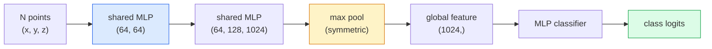

# رؤية ثلاثية الأبعاد غلافات السحاب والنواة

> رؤية 3D تأتي في طعمين. سحابة نقطة هي الخروج الخام لمستشعر. NeRFs هي المجال الحجمي المكتمل. كلاهما يجيب "ما هو أين في الفضاء".

> **【中文解读】**3D  الرؤية لديها نوعان من النماذج: نقطة云 هو传感器 ((LiDAR、深度相机) المخرج الأصلي؛ NeRF(المنطقة الإشعاعية العصبية) هي الميدان الكبيرة التي يتم تعلمها.

> **【拓展：3D 视觉的应用】**نيرف يستخدم في الواقع الافتراضي/增强现实(VR/AR)、建筑可视化、自动驾驶场景重建──3D Gaussian Splatting(下一课) هو خطة بديلة سريعة لنييرف، في الواقع 染质量更高──点云处理是自动驾驶 LiDAR 感知的核心──

**Type:** Learn + Build | **类型:** 学习 + 动手
**Languages:** Python | **语言:** Python
**Prerequisites:** Phase 4 Lesson 03 (CNNs), Phase 1 Lesson 12 (Tensor Operations) | **前置知识:** Phase 4 Lesson 03（CNN），Phase 1 Lesson 12（张量运算）
**Time:** ~45 minutes | **时间:** ~45 分钟

## أهداف التعلم

- تمييز التمثيلات الثلاثية الأبعاد الصريحة (سحابة النقاط، شبكة، فوكسل) والخاطئة (حقل المسافة الموقعة، NeRF) وعندما يتم استخدام كل منها
- فهم خدعة الوظيفة التناظرية من PointNet التي تجعل شبكة عصبية محول-غير متغير على مجموعة غير مرتبة من النقاط
- تتبع مرور NeRF إلى الأمام: إلقاء الأشعة، التصوير الحجمي، التشفير الموقع، كثافة MLP + رأس اللون
- استخدام`nerfstudio`أو`instant-ngp`لإعادة بناء ثلاثي الأبعاد المسبقة من مجموعة صغيرة من الصور الموضحة

> **【中文解读】**يُدعى أهداف التعلم المفردة التي يجب أن تتحكم فيها بعد الانتهاء من الدورة.


## المشكلة المشكلة المشكلة

تنتج الكاميرا صورة ثنائية الأبعاد. تنتج LIDAR مجموعة من النقاط الثلاثية الأبعاد دون ترتيب. تنتج خط الأنابيب من الحركة بنية من نقطة مفتاح ثلاثية الأبعاد. تقوم NeRF بإعادة إنشاء مشهد ثلاثي الأبعاد بأكمله من حفنة من الصور الموضحة. كل هذه "رؤية" ولكن لا تبدو أي منها مثل الجهاز الكثيف الذي تريده CNN.

> 相机产生 2D 图像──LiDAR 产生一组无序的3D点──运动恢复结构流水线产生稀疏的3D 关键点云──NeRF من عدة مواقع تصوير تصوير إعادة بناء كامل 3D المشهد──这些都是"视觉",但没有一个看起来像CNN 想要的密集张量──

يعتبر رؤية 3D مهمة لأن كل مهمة روبوتية ذات قيمة عالية تقريباً تعمل في 3D: التقاط، تجنب العقبات، الملاحة، حجب AR، التقاط محتوى 3D. يتم منع مهندس الرؤية الذي يفهم الصور 2D فقط من أسرع قطعة نمو في المجال (محتويات AR / VR، الروبوتات، كومات القيادة الذاتية، إعادة بناء 3D بناءً على NeRF للعقارات أو البناء).

> 3D  بصورة مهمة، لأن كل مهمة من أجهزة الجهاز ذات القيمة العالية تقريبا تعمل في 3D: التقاط، والحفاظ على الوقاية، والسير، والتنفيذ، والظل والظل والحصول على المحتوى الثلاثي الأبعاد. فهم فقط المهندسين الرؤية لصور ثنائية الأبعاد يتم حجزهم في الجزء الأسرع نموا في هذا المجال خارج (((AR / VR  محتوى ‬ الجهازات ‬ السيارات ‬ بناء العقارات أو المباني 3D على أساس NeRF) ‬

تمثل التمثيلين بشكل مختلف لأسباب مختلفة. السحب النقطية هي ما يعطيه الاستشعارات مجانا. النواة العصبية والخلفاء منها (3D Gaussian splatting، SDFs العصبية) هي ما تحصل عليه عندما تطلب من شبكة عصبية أن تتعلم مشهدًا.

> 两种表示因不同原因占据主导──点云是传感器免费给你──NeRF 及其后者(3D 高斯、神经SDF)

## المفهوم الأساسي

> **【中文解读】**هذا المقطع يعرض المفاهيم والنظريات الأساسية. فهم هذه المفاهيم هو شرط لتحقيق التنفيذ التالي، وكذلك النقاط المعرفة في المقابلة والممارسة التجريبية.


### غيول نقطة

سحابة النقاط هي مجموعة غير مرتبة من N نقاط في R^3، اختياريًا كل منها مع ميزات (اللون، والكثافة، والطبيعية).

> نقطة هي مجموعة غير مرتبة من N 个点 中 R^3 , كل نقطة يمكن أن تحمل خصائص ((اللون 强度 法线) 

```
cloud = [
  (x1, y1, z1, r1, g1, b1),
  (x2, y2, z2, r2, g2, b2),
  ...
  (xN, yN, zN, rN, gN, bN),
]
```

لا شبكة، لا اتصال، هناك خصائص تجعل ذلك صعباً للشبكات العصبية:

> لا شبكة، لا علاقة متصلة.

- **Permutation invariance** لا يجب أن تعتمد الناتجة على ترتيب النقاط.
  中文翻译:**置换不变性** لا يمكن أن يعتمد الخروج على ترتيب النقاط
- **Variable N** يجب أن يتعامل نموذج واحد مع السحب ذات الأحجام المختلفة.
  中文翻译:**可变 N** نموذج واحد يجب أن يعالج نقاط مختلفة

حل PointNet (Qi et al., 2017) كلتا هذه الأفكار بفكرة واحدة: تطبيق MLP مشتركة على كل نقطة، ثم جمعها مع وظيفة متماثلة (مجموعة أقصى). النتيجة هي متجه مقياس ثابت لا يعتمد على النظام.

> نقطة النت ((Qi 等,2017) حل مشكلة مع فكرة واحدة: ل كل نقطة تطبيق مشاركة MLP، ثم باستخدام معادلة وظيفة (((أكبر مجموعة) تجمع.

```
f(P) = max_{p in P} MLP(p)
```

هذه هي جوهر PointNet بأكمله. الإختلافات العميقة (PointNet+++، Point Transformer) تضيف العينات الهرمية والجمع المحلي ولكن خدعة الوظيفة التناظرية لا تتغير.

> هذا هو جوهر نقطة النت. المتغيرات العميقة (بما أنها تزيد من التقاط الصفوف والمجموعة المحلية، ولكن تقنيات المهام لا تتغير.

### بنية نقطة الشبكة



"المشاركة MLP" تعني نفس MLP تعمل على كل نقطة بشكل مستقل. يتم تنفيذها كـ 1x1 conv على بعد النقطة لتحقيق الكفاءة.

> "المشاركة في MLP" تعني نفس MLP على كل نقطة تعمل بشكل مستقل.

### حقل الإشعاع العصبي (Neural Radiance Fields)

أخذ NeRFs (Mildenhall et al., 2020) السؤال "هل يمكننا إعادة بناء مشهد 3D من N صور؟" وأجابوا بشبكة عصبية هي المشهد. خرائط الشبكة `(x, y, z, viewing_direction)`إلى`(density, colour)`إعطاء رؤية جديدة هو حلقة إرسال الأشعة على هذه الشبكة

> نيف ((ميلدنهول وغيره،2020) أجاب على "هل يمكن من N 张照片 إعادة بناء 3D منظر؟" هذا السؤال باستخدام شبكة عصبية لتعبير عن المشهد نفسه‬‬‬‬‬‬‬‬‬‬‬‬‬‬‬‬‬‬‬‬‬‬‬‬‬‬‬‬‬‬‬‬‬‬‬‬‬‬‬‬‬‬‬‬‬‬‬‬‬‬‬‬‬‬‬‬‬‬‬‬‬‬‬‬‬‬‬‬‬‬‬‬‬‬‬‬‬‬‬‬‬‬‬‬‬‬‬‬‬‬‬‬‬‬‬‬‬‬‬‬‬‬‬‬‬‬‬‬‬‬‬‬‬‬‬‬‬‬‬‬‬‬‬‬‬‬‬‬‬‬‬‬‬‬‬‬‬‬‬‬‬‬‬‬‬‬‬‬‬‬‬‬‬‬‬‬‬‬‬‬‬‬‬‬‬‬‬‬‬‬‬‬‬‬‬‬‬‬‬‬‬‬‬‬‬‬‬‬‬‬‬‬‬‬‬‬‬‬‬‬‬‬‬‬‬‬‬‬‬‬‬‬‬‬‬‬‬‬‬‬‬‬‬‬‬‬‬‬‬‬‬‬‬‬‬‬‬‬‬‬‬‬‬‬‬‬‬‬‬‬‬‬‬‬‬‬‬‬‬‬‬‬‬‬‬‬‬‬‬‬‬‬‬‬‬‬‬‬‬‬‬‬‬‬‬‬‬‬‬‬‬‬‬‬‬‬‬‬‬‬‬‬‬‬‬‬‬‬‬‬‬‬‬‬‬‬‬‬‬‬‬‬‬‬‬‬‬‬‬‬‬‬‬‬‬‬‬‬‬‬‬‬‬‬‬‬‬‬‬‬‬‬‬‬‬‬‬‬‬‬‬‬‬‬‬‬‬‬‬‬‬‬‬‬‬‬‬‬‬‬‬‬‬‬‬‬‬‬‬‬‬‬‬‬‬‬‬‬‬‬‬‬‬‬‬‬‬‬‬‬‬‬‬‬‬‬‬‬‬‬‬‬‬‬‬‬‬‬‬‬‬‬‬‬‬‬‬‬‬‬‬‬‬‬‬‬‬‬‬‬‬‬‬‬‬‬‬‬‬`(x, y, z, 观察方向)`映射到 `(密度, 颜色)`染新视角 هي القيام بعملية إلقاء الضوء على هذا الشبكة‬

```
NeRF MLP:  (x, y, z, theta, phi) -> (sigma, r, g, b)

To render a pixel (u, v) of a new view:
  1. Cast a ray from the camera through pixel (u, v)
  2. Sample points along the ray at distances t_1, t_2, ..., t_N
  3. Query the MLP at each point
  4. Composite the colours weighted by (1 - exp(-sigma * dt))
  5. The sum is the rendered pixel colour
```

يُقارن الخسارة البيكسل المُسجّل بـ بيكسل الحقيقة الأرضية في صور التدريب. يقوم الخلفية من خلال خطوة التصوير بتحديث MLP. لا يوجد حقيقة الأرض 3D، لا يوجد هندسة صريحة  يتم تخزين المشهد في أوزان MLP.

> 損失 وظيفة مقارنة الصور الحقيقية في الصور التدريبية  من خلال مراحل التدريب إلى التنشر المضاد إلى التنشر المنتشر  بدون قيمة حقيقية ثلاثية الأبعاد، لا توجد أي نظرية واضحة  مخزن المشهد في MLP 权重中──

### تشفير الموقف في NeRF

فانيلا ملفا على`(x, y, z)`لا يمكن أن تمثل تفاصيل عالية التردد لأن MLPs متحيزة بشكل طيفي نحو ترددات منخفضة. يصلح NeRF هذا عن طريق ترميز كل إحداثيات إلى متجه ميزة فوري قبل MLP:

> المعتاد MLP في`(x, y, z)`لا يمكن أن يعبر عن التفاصيل عالية التردد، لأن MLP 频谱偏向低频──NeRF 通过在每个坐标送入 MLP 编码为里叶特征向量来修复这个问题:

```
gamma(p) = (sin(2^0 pi p), cos(2^0 pi p), sin(2^1 pi p), cos(2^1 pi p), ...)
```

ما يصل إلى مستويات التردد L=10. هذه هي نفس الحيلة التي يستخدمها المحولون للمواقع، ويظهر مرة أخرى في تكييف الوقت التفشي (الدرس 10). بدونها، تبدو NeRFs ضبابية.

> أقصى L=10 个频率级别── هذا يستخدم نفس المهارات في الموقع مع Transformer، وظهر مرة أخرى في الوقت المحدد في نموذج التوسع.

### التسجيل الكمي

```
C(r) = sum_i T_i * (1 - exp(-sigma_i * delta_i)) * c_i

T_i  = exp(- sum_{j<i} sigma_j * delta_j)
delta_i = t_{i+1} - t_i
```

`T_i`هو الانتقال  كم من الضوء ينجو من النقطة i. `(1 - exp(-sigma_i * delta_i))`هو التضليل في النقطة i. `c_i`هو اللون. البيكسل النهائي هو المبلغ الموزن على طول الشعاع.

> `T_i`يُمكن أن يُبقى الكثير من الضوء في النقطة الأولى`(1 - exp(-sigma_i * delta_i))`هو الأول من عدم الشفافية`c_i`هو اللون. الصورة النهائية هي زيادة الوقود على طول الضوء.

### ما الذي استبدل NRFs

إن النواة النقية للنواة النقدية بطيئة في التدريب (الساعات) والبطيئة في الإصدار (الثوان لكل صورة).

> 純 NeRF 訓練慢(小時级) و 染慢(每张图像秒级) 』后续发展:

- **Instant-NGP**(2022)  تشفير شبكة الهاش يحل محل مدخل الموقف من MLP؛ القطارات في الثواني.
  中文翻译:**Instant-NGP**(2022) 哈希网格编码替代 MLP 的位置输入;秒级训练──
- **Mip-NeRF 360** يتعامل مع مشاهد غير محدودة ومكافحة التخفيف
  中文翻译:**Mip-NeRF 360** التعامل مع المشهد والمعارضة 🏼
- **3D Gaussian Splatting**(2023)  يحل محل الحقل الحجمي بملايين غوسيانات 3D؛ القطارات في دقائق، يعطي في الوقت الحقيقي.
  中文翻译:**3D 高斯泼溅**(2023)  باستخدام ملايين 3D 高斯替代体积场;分钟级训练,实时染──当前生产默认方案──

تقريبا كل منتج حقيقي من نيرف في عام 2026 هو في الواقع 3D غوسيانة البث. النموذج العقلي لا يزال نيرف.

> في عام 2026 تقريبا كل منتجات NeRF الحقيقية هي في الواقع 3D 高斯── ولكن نموذج الذهان لا يزال NeRF──

### مجموعات البيانات ومعايير الموازنة

- **ShapeNet** تصنيف وتقسيم نماذج CAD ثلاثية الأبعاد كغواص نقطة.
  中文翻译:شيب نت3D CAD 模型的点云分类和分割──
- **ScanNet** مسحات داخلية حقيقية لتقسيم
  中文翻译:ScanNet真实室内扫描,用于分割──
- **KITTI** سحابة نقطة LIDAR للقيادة الذاتية في الهواء الطلق.
  中文翻译:KITTI户外 LiDAR 点云,用于自动驾驶。
- **NeRF Synthetic**- لا ، لا**Blended MVS** مجموعات بيانات الصور الموضحة لتركيب الرؤية.
  中文翻译:NeRF Synthetic / Blended MVS带位姿的图像数据集,用于视角合成。
- **Mip-NeRF 360**مجموعة بيانات  مشاهد حقيقية غير محدودة.
  中文翻译:Mip-NeRF 360 数据集无界真实场景──

> **【中文解读】**هذا المقطع من خلال الكود من الصفر لتحقيق الخوارزمية النووية. هذا النوع من "من الصفر" يمكن أن يساعد على فهم المبدأ الخلفي للإطار، عندما يواجهون مشكلة لن يتم تعقلها في الصندوق الأسود.

> **【拓展：工业部署中的视觉系统】**في التوزيع الصناعي الواقعي، تحتاج النموذج المرئي إلى النظر في التفكير في التأجيل، والنموذج الكبير، والجهاز الحدودي الملائمة وغيرها من المشاكل.

> **【拓展：数据标注与质量】** تأثير المهام المرئية يعتمد على جودة البيانات المعلنة.‬‬‬‬‬‬‬‬‬‬‬‬‬‬‬‬‬‬‬‬‬‬‬‬‬‬‬‬‬‬‬‬‬‬‬‬‬‬‬‬‬‬‬‬‬‬‬‬‬‬‬‬‬‬‬‬‬‬‬‬‬‬‬‬‬‬‬‬‬‬‬‬‬‬‬‬‬‬‬‬‬‬‬‬‬‬‬‬‬‬‬‬‬‬‬‬‬‬‬‬‬‬‬‬‬‬‬‬‬‬‬‬‬‬‬‬‬‬‬‬‬‬‬‬‬‬‬‬‬‬‬‬‬‬‬‬‬‬‬‬‬‬‬‬‬‬‬‬‬‬‬‬‬‬‬‬‬‬‬‬‬‬‬‬‬‬‬‬‬‬‬‬‬‬‬‬‬‬‬‬‬‬‬‬‬‬‬‬‬‬‬‬‬‬‬‬‬‬‬‬‬‬‬‬‬‬‬‬‬‬‬‬‬‬‬‬‬‬‬‬‬‬‬‬‬‬‬‬‬‬‬‬‬‬‬‬‬‬‬‬‬‬‬‬‬‬‬‬‬‬‬‬‬‬‬‬‬‬‬‬‬‬‬‬‬‬‬‬‬‬‬‬‬‬‬‬‬‬‬‬‬‬‬‬‬‬‬‬‬‬‬‬‬‬‬‬‬‬‬‬‬‬‬‬‬‬‬‬‬‬‬‬‬‬‬‬‬‬‬‬‬‬‬‬‬‬‬‬‬‬‬‬‬‬‬‬‬‬‬‬‬‬‬‬‬‬‬‬‬‬‬‬‬‬‬‬‬‬‬‬‬‬‬‬‬‬‬‬‬‬‬‬‬‬‬‬‬‬‬‬‬‬‬‬‬‬‬‬‬‬‬‬‬‬‬‬‬‬‬‬‬‬‬‬‬‬‬‬‬‬‬‬‬‬‬‬‬‬‬‬‬‬‬‬‬‬‬‬‬‬‬‬‬‬‬‬‬‬‬‬‬‬‬‬‬‬‬‬‬‬‬‬‬‬‬‬‬‬‬‬‬‬‬‬‬‬‬‬‬‬‬‬‬‬‬‬‬‬‬‬‬‬‬‬‬‬‬‬‬


## بناء ذلك تحرك لتحقيق
```figure
nerf-rays
```

## بناءها

### الخطوة الأولى: تصنيف PointNet

```python
import torch
import torch.nn as nn

class PointNet(nn.Module):
    def __init__(self, num_classes=10):
        super().__init__()
        self.mlp1 = nn.Sequential(
            nn.Conv1d(3, 64, 1),    nn.BatchNorm1d(64),   nn.ReLU(inplace=True),
            nn.Conv1d(64, 64, 1),   nn.BatchNorm1d(64),   nn.ReLU(inplace=True),
        )
        self.mlp2 = nn.Sequential(
            nn.Conv1d(64, 128, 1),  nn.BatchNorm1d(128),  nn.ReLU(inplace=True),
            nn.Conv1d(128, 1024, 1), nn.BatchNorm1d(1024), nn.ReLU(inplace=True),
        )
        self.head = nn.Sequential(
            nn.Linear(1024, 512),   nn.BatchNorm1d(512),  nn.ReLU(inplace=True),
            nn.Dropout(0.3),
            nn.Linear(512, 256),    nn.BatchNorm1d(256),  nn.ReLU(inplace=True),
            nn.Dropout(0.3),
            nn.Linear(256, num_classes),
        )

    def forward(self, x):
        # x: (N, 3, num_points) — transposed for Conv1d
        x = self.mlp1(x)
        x = self.mlp2(x)
        x = torch.max(x, dim=-1)[0]       # (N, 1024)
        return self.head(x)

pts = torch.randn(4, 3, 1024)
net = PointNet(num_classes=10)
print(f"output: {net(pts).shape}")
print(f"params: {sum(p.numel() for p in net.parameters()):,}")
```

حوالي 1.6 مليون مبرمير، يعمل على 1,024 نقطة لكل سحابة.

> حوالي 160،000 عنصر. كل نقطة تعالج 1,024 نقطة.

### الخطوة الثانية: تشفير المواقع

```python
def positional_encoding(x, L=10):
    """
    x: (..., D) -> (..., D * 2 * L)
    """
    freqs = 2.0 ** torch.arange(L, dtype=x.dtype, device=x.device)
    args = x.unsqueeze(-1) * freqs * 3.141592653589793
    sinc = torch.cat([args.sin(), args.cos()], dim=-1)
    return sinc.reshape(*x.shape[:-1], -1)

x = torch.randn(5, 3)
y = positional_encoding(x, L=10)
print(f"input:  {x.shape}")
print(f"encoded: {y.shape}     # (5, 60)")
```

مضاعفة بـ `2^l * pi`يعطي ترددات أعلى تدريجياً.

> 乘以 `2^l * pi`تظهر معدل ارتفاع تدريجي

### الخطوة الثالثة: نيك نيف ملف

```python
class TinyNeRF(nn.Module):
    def __init__(self, L_pos=10, L_dir=4, hidden=128):
        super().__init__()
        self.L_pos = L_pos
        self.L_dir = L_dir
        pos_dim = 3 * 2 * L_pos
        dir_dim = 3 * 2 * L_dir
        self.trunk = nn.Sequential(
            nn.Linear(pos_dim, hidden), nn.ReLU(inplace=True),
            nn.Linear(hidden, hidden),  nn.ReLU(inplace=True),
            nn.Linear(hidden, hidden),  nn.ReLU(inplace=True),
            nn.Linear(hidden, hidden),  nn.ReLU(inplace=True),
        )
        self.sigma = nn.Linear(hidden, 1)
        self.color = nn.Sequential(
            nn.Linear(hidden + dir_dim, hidden // 2), nn.ReLU(inplace=True),
            nn.Linear(hidden // 2, 3), nn.Sigmoid(),
        )

    def forward(self, x, d):
        x_enc = positional_encoding(x, self.L_pos)
        d_enc = positional_encoding(d, self.L_dir)
        h = self.trunk(x_enc)
        sigma = torch.relu(self.sigma(h)).squeeze(-1)
        rgb = self.color(torch.cat([h, d_enc], dim=-1))
        return sigma, rgb

nerf = TinyNeRF()
x = torch.randn(128, 3)
d = torch.randn(128, 3)
s, c = nerf(x, d)
print(f"sigma: {s.shape}   rgb: {c.shape}")
```

ضئيلة مقارنة مع NeRF الأصلية (التي لديها 2 قذائف MLP من عمق 8). يكفي لإظهار الهندسة المعمارية.

> مقارنة بسيطة مع النفط النووي الأصلي ((((

### الخطوة الرابعة: التصوير الكمي على طول شعاع

```python
def volumetric_render(sigma, rgb, t_vals):
    """
    sigma: (..., N_samples)
    rgb:   (..., N_samples, 3)
    t_vals: (N_samples,) distances along the ray
    """
    delta = torch.cat([t_vals[1:] - t_vals[:-1], torch.full_like(t_vals[:1], 1e10)])
    alpha = 1.0 - torch.exp(-sigma * delta)
    trans = torch.cumprod(torch.cat([torch.ones_like(alpha[..., :1]), 1.0 - alpha + 1e-10], dim=-1), dim=-1)[..., :-1]
    weights = alpha * trans
    rendered = (weights.unsqueeze(-1) * rgb).sum(dim=-2)
    depth = (weights * t_vals).sum(dim=-1)
    return rendered, depth, weights


N = 64
t_vals = torch.linspace(2.0, 6.0, N)
sigma = torch.rand(N) * 0.5
rgb = torch.rand(N, 3)
rendered, depth, weights = volumetric_render(sigma, rgb, t_vals)
print(f"rendered colour: {rendered.tolist()}")
print(f"depth:           {depth.item():.2f}")
```

> **【中文解读】**هذا المقال يوضح كيفية استخدام إطار متقدم مثل PyTorch、HuggingFace وغيرها) سريعة تطبيق هذه التقنية.


شعاع واحد، 64 عينة، مركبة إلى بكسل RGB واحد وعمق.

> واحد ضوء، 64 نقطة، مع تصبح واحدة RGB 像素和深度值.


> **【拓展：视觉模型的持续学习】**في بيئة الإنتاج، يتطلب نموذج الرؤية التكيف المستمر مع البيانات الجديدة.

## استخدمها في إطار التنفيذ

للعمل الحقيقي:

- `nerfstudio`(Tancik et al.)  مكتبة المرجعية الحالية لـ NeRF / Instant-NGP / Gaussian Splatting. خط الأوامر بالإضافة إلى متصفح الويب.
- `pytorch3d`(ميتا)  التعبير المميز، وسائل تسجيل السحابة النقطة، عمليات الشبكة.
- `open3d` معالجة السحابة النقطية، التسجيل، التصور.

> **【中文解读】**هذا المادة يركز على كيفية نشر النموذج كمنتج متاح. من النموذج الأصلي إلى النظام في مرحلة الإنتاج، تحتاج إلى النظر في العديد من الخصائص في تحسين الأداء والتعامل الخاطئ والتحكم.


لتنفيذها، استبدل التصفيق الثلاثي الأبعاد غوسي في معظم الأحيان النوافذ النظيفة النظيفة لأنّه يجعل 100 مرة أسرع. جودة إعادة الإعمار مماثلة.


## أرسلها .

هذا الدرس ينتج عن:

> **【中文解读】**练题按照易/中级/Hard 三个难度递进──建议至少完成 级级中级的题目,Hard 级适合深入研究或面试准备──


- `outputs/prompt-3d-task-router.md` عرض يتوجه إلى التمثيل الثلاثي الأبعاد الصحيح (سحابة النقاط، شبكة، فوكسل، NeRF، غوسيان) بناء على المهام والبيانات المدخولية.
- `outputs/skill-point-cloud-loader.md`مهارة كتب بيتورش`Dataset`للفيديات .ply / .pcd / .xyz مع التطبيع الصحيح ، والمركزية ، ومعينة النقاط.

## تمارين التدريب

1. **(Easy)**أظهر أن نقطة النت غير متغيرة: قم بتشغيل نفس السحابة مرتين، مرة واحدة مع تضلط النقاط. تحقق من أن المخرجات متطابقة حتى ضجيج نقطة عائمة.
2. **(Medium)**تنفيذ وظيفة توليد الأشعة الحد الأدنى التي، بالنظر إلى أساسيات الكاميرا وموقفها، تنتج أصول الأشعة واتجاهات لكل بكسل من صورة H x W.
3. **(Hard)**تدريب TinyNeRF على مجموعة بيانات اصطناعية من مشاهدات عرضة لمكعب ملونة (تولد عن طريق التصوير المميز أو متبع شعاع بسيط). تقرير الخسارة التصوير في الفترات 1 ، 10 و 100. في أي عصر ينتج النموذج مشاهدات قابلة للتعرف؟

> **【中文解读】**في لغة "ما يقوله الناس" مقابل "ما يعنيه في الواقع" تم التمييز بين لغة اليومية والتقنية المحددة.


## شروط الرئيسية

| Term | What people say | What it actually means |
|------|----------------|----------------------|
| Point cloud | "3D points from LIDAR" | Unordered set of (x, y, z) + optional features per point |
| PointNet | "First neural net on point clouds" | Shared MLP per point + symmetric (max) pool; permutation-invariant by construction |
| NeRF | "MLP that is the scene" | Network mapping (x, y, z, dir) to (density, colour); rendered by ray casting |
| Positional encoding | "Fourier features" | Encode each coordinate into sin/cos at multiple frequencies to overcome MLP low-frequency bias |
| Volumetric rendering | "Ray integration" | Composite samples along a ray into a single pixel using transmittance and alpha |
| Instant-NGP | "Hash-grid NeRF" | Replaces NeRF's coordinate MLP with a multi-resolution hash grid; 100-1000x faster |
| 3D Gaussian splatting | "Millions of Gaussians" | Scene = collection of 3D Gaussians; renders in real time, trains in minutes |
| SDF | "Signed distance field" | Function returning signed distance to the nearest surface; another implicit representation |

> **【中文解读】**延伸阅读 يوفر موارد عالية الجودة للتعلم المتعمق.


## المزيد من القراءة

- [PointNet (Qi et al., 2017)](https://arxiv.org/abs/1612.00593) تصنيف المتغيرات المتغيرة
- [NeRF (Mildenhall et al., 2020)](https://arxiv.org/abs/2003.08934)الورقة التي جعلت إعادة بناء 3D من الصور مشكلة شبكة عصبية
- [Instant-NGP (Müller et al., 2022)](https://arxiv.org/abs/2201.05989)شبكات الهاشيش، 1000x السرعة
- [3D Gaussian Splatting (Kerbl et al., 2023)](https://arxiv.org/abs/2308.04079) الهندسة المعمارية التي استبدلت النفط النووية في الإنتاج
