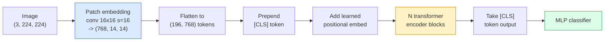

# تحويلات الرؤية (VIT) 视觉 Transformer

> قطع الصورة إلى ملصقات، تعامل كل ملصقة ككلمة، تشغيل محول قياسي. لا تنظر للخلف.

> **【中文解读】**将图像切成小块(补丁),把每个补丁 当作一个"词",然后使用标准变压器 处理──就是如此简单──ViT 证明了变压器 架构不仅有效在NLP,在视觉领域也可以超越CNN──

> **【拓展：ViT 与 GPT-4V】**فييت هو GPT-4V、Claude's بصرية القدرة、LLaVA وغيرها من الموديلات الكبيرة. من عام 2021 حتى الآن، فييت أصبح بنية بنية للفيديو الكمبيوتر، وتستخدم في CLIP、SAM、DINO وغيرها من النماذج الأساسية. فييت تثبت أيضا تصميم الفيديو التحولية ومتعدد الموديلات.

**Type:** Build | **类型:** 动手
**Languages:** Python | **语言:** Python
**Prerequisites:** Phase 7 Lesson 02 (Self-Attention), Phase 4 Lesson 04 (Image Classification) | **前置知识:** Phase 7 Lesson 02（自注意力），Phase 4 Lesson 04（图像分类）
**Time:** ~45 minutes | **时间:** ~45 分钟

## أهداف التعلم

- تنفيذ إضافة المفاتيح ، والتطبيقات الموضعية المتعلمة ، والرمز الطبقي ، وكمات مبرمجة المحول من الصفر لبناء ViT الحد الأدنى
- شرح لماذا كان يعتقد أن في تي بحاجة إلى بيانات ضخمة قبل التدريب حتى أثبت دي تي و MAE خلاف ذلك
- مقارنة ViT، Swin، و ConvNeXt على ما سبق معمارياتهم (لا، انتباه النافذة المحلية، الخلية المكونة)
- ضبط ViT المسبق للتدريب على مجموعة بيانات صغيرة باستخدام `timm`و وصفة الصفحة الخالصة القياسية

> **【中文解读】**يُدعى أهداف التعلم المفردة التي يجب أن تتحكم فيها بعد الانتهاء من الدورة.


## المشكلة المشكلة المشكلة

لمدة عقد ، كان التحول مترادفًا لرؤية الكمبيوتر. كان لدى سي إن إن تحيزات استناداوية قوية  المحلية ، وتساوي الترجمة  لا أحد يعتقد أنه يمكن استبدالها. ثم أظهر دوسويتسكي وآخرون (2020) أن محول بسيط يتم تطبيقه على مسطحات الصورة المسطحة ، دون أي آلية تغيير على الإطلاق ، يمكن أن يطابق أو يفوز بأفضل سي إن إن على نطاق واسع.

> على مدى عشر سنوات، كان التشغيل هو اسم للفيديو الحاسوبي. كان هناك الكثير من التشغيلات المثبتة في التشغيل المحلي.

لقد كان الصيد "في نطاق واسع" فقدت (في تي) على (إيمجنيت-1ك) من (ريستنيت). ويت تدرب على ImageNet-21k أو JFT-300M ثم تحسن على ImageNet-1k ضرب ذلك. النتيجة كانت أن المحولات لم تكن لديها سابقات مفيدة لكنها يمكن أن تتعلمها من بيانات كافية. أظهرت الدراسات اللاحقة (DeiT، MAE، DINO) أن مع وصفات التدريب الصحيحة  زيادة قوية، الإشراف على الذات قبل التدريب، التقطير  تدريب الفيتات على البيانات الصغيرة أيضا.

> 陷是" على نطاق واسع"──في في في في في في في في في في في في في في في في في في في في في في في في في في في في في في في في في في في في في في في في في في في في في في في في في في في في في في في في في في في في في في في في في في في في في في في في في في في في في في في في في في في في في في في في في في في في في في في في في في في في في في في في في في في في في في في في في في في في في في في في في في في في في في في في في في في في في في في في في في في في في في في في في في في في في في في في في في في في في في في في في في في في في في في في في في في في في في في في في في في في في في في في في في في في في في في في في في في في في في في في في في في في في في في في في في في في في في في في في في في في في في في في في في في في في في في في في في في في في في في في في في في في في في في في في في في في في في في في في في في في في في في في في في في في في في في في في في في في في في في في في في في في في في في في في في في في في في في في في في في في في في في في في في في في في في في في في في في في في في في في في في في في في في في في في في في في في في في في في في في في في في في في في في في في في في في في في في في في في في في في في في في في في في في في في في في في في في في في في في في في في في في في في في في في في في في في في في في في في في في في في في في في في في في في في في في في في في في في في في في في في في في في في في في في في في في في في في في في في في في في في في في في في في في في في في في في في في في في في في في في في في في في في في في في في في في في في في في في في في في في في في في في في في في في في في في في في في في في في

بحلول عام 2026 ، لا تزال سي إن إنات نقية تنافسية على أجهزة الحافة (كونفنيكت هي أقوى) ، ولكن المحولات تهيمن على كل شيء آخر: التقسيم (ماسك2فورمر ، سيغفورمر) ، الكشف (ديتير ، آر تي-ديتير) ، المليمولدا (كليب ، سيجليب) ، الفيديو (فيديوما إي ، فيجي إي بي إي). بنية كتلة فييت هي التي يجب معرفتها.

> حتى عام 2026، لا تزال هناك منافسة على جهازات الحدود على CNN ، ولكن Transformer سيطرت على كل شيء آخر: تقسيم ماسك2مقدم Segمقدم) 检测(DETR、RT-DETR) 多模态(CLIP、SigLIP) 视频(VideoMAE、VJEPA) 

## المفهوم الأساسي

> **【中文解读】**هذا المقطع يعرض المفاهيم والنظريات الأساسية. فهم هذه المفاهيم هو شرط لتحقيق التنفيذ التالي، وكذلك النقاط المعرفة في المقابلة والممارسة التجريبية.


### خط الأنابيب



سبع خطوات. معطيات -> رموز -> انتباه -> تصنيف. كل فاريج (DeiT ، Swin ، ConvNeXt ، MAE قبل التدريب) يغير واحد أو اثنين من السبع ويترك الباقي وحده.

> 七步──补丁 -> رمز -> 注意力 -> 分类器──每个变体(DeiT、Swin、ConvNeXt、MAE 预训练) فقط تغير واحد من الخطوات السبعة، والباقي يبقى غير متغير。

### إضافة المفاتيح

أول مخزن هو السر. حجم الأساس 16، خطوة 16، لذلك تصميم 224x224 يصبح شبكة 14x14 من 16x16 المقطوعات، كل منها مدروسة إلى 768-dim تضمين. هذا مخزن واحد كل من المقطوعات وتقديم مشروعات خطية.

> أول مجلد هو السرّة. الجوهر الكبير 16، التسلسل 16، لذا تصميم 224x224 يصبح 14x14 16x16، كل مجلد يحتوي على 768 جزء.

```
Input:  (3, 224, 224)
Conv (3 -> 768, k=16, s=16, no padding):
Output: (768, 14, 14)
Flatten spatial: (196, 768)
```

196 معدل = 196 رمزا. طول ميزة كل رمزا هو 768 (ViT-B) ، 1024 (ViT-L) ، أو 1280 (ViT-H).

> 196 个补丁 = 196 个标志── كل رمز 个特征维度为 768(ViT-B)、1024(ViT-L) أو 1280(ViT-H)。

### رمز الفئة

متجه واحد تعلمت قبل التسلسل:

> وحدة يمكن تعلمها إضافة إلى المسلسل:

```
tokens = [CLS; patch_1; patch_2; ...; patch_196]   shape (197, 768)
```

بعد N كتلة المحول،`[CLS]`النتائج هي تمثيل الصورة العالمي. رأس التصنيف يقرأ فقط هذا المتجه واحد.

> بعد مرور N 个 صبغات`[CLS]`النتائج هي تعبير الصورة بأكملها.

### إضافة موضعية

المحولات لا تملك فكرة متكاملة للموقع الفضائي إضافة متجه تعلم لكل رمز:

> المحول 没有内置的空间位置概念── أعط كل رمز إضافة إلى حجم يمكن تعلمه:

```
tokens = tokens + learned_pos_embedding   (also shape (197, 768))
```

إن الإدراج هو مبرمير للنموذج؛ يتكيف التدريب القائم على التدرج مع هيكل الصورة 2D. توجد بدائل 2D سينوسويدية ولكن نادرا ما تستخدم في الممارسة.

> 嵌入是模型的参数; تدريبات بناء على التدرجات تجعل من الصورة تتناسب مع 2D 图像结构── هناك حلول بديلة للصنود 2D، ولكن في الواقع لا يستخدمها كثيرا ً──

### حجر مُشفّر المحول

القياسية، الاهتمام الذاتي متعدد الرؤوس، MLP، وصلات بقايا، قبل الطبقة.

> 标准结构──多头自注意力、MLP、残差连接、前置 LayerNorm──

```
x = x + MSA(LN(x))
x = x + MLP(LN(x))

MLP is two-layer with GELU: Linear(d -> 4d) -> GELU -> Linear(4d -> d)
```

تعدد ViT-B/16 12 من هذه الكتل، كل منها 12 رأسًا للاهتمام، وبلغ إجماليها 86 مليون ملامح.

> في تي-بي 16  تراكم 12 كتلة من هذا القبيل، كل منها 12 رأس الاهتمام، إجمالي 86 مليون عنصر

### لماذا قبل الـ LN

المحولات المبكرة المستخدمة بعد LN (`x = LN(x + sublayer(x))`وواجهت صعوبة في التدريب بعد 6-8 طبقات دون تدفئة.`x = x + sublayer(LN(x))`يستخدم كل برنامج فييت وكل برنامج دراسية حديثة قبل الـ LN.

> 早期 محول استخدام后置 LN(`x = LN(x + sublayer(x))`), من الصعب تدريب دون حرارة سابقة أكثر من 6-8 طبقة.`x = x + sublayer(LN(x))`(بعد أن تمتلك كل مدرسة في العالم الوطني والمعاهد العليا الحديثة)

### التنازل عن حجم اللصوص

- 16×16 اللقطات -> 196 رمزا، قياسية.
  中文翻译:16x16 补丁 -> 196 个代币,标准配置。
- 32x32 تصفيات -> 49 رموز، أسرع ولكن أقل قرار.
  ترجمة: 32x32 补丁 -> 49 个标志, أسرع ولكن القرار أقل
- 8×8 اللقطات -> 784 رموز، دقيقة ولكن O n^2) التكلفة الاهتمام مقياس سيئة.
  中文翻译:8x8 补丁 -> 784 个代币,更精细但O(n^2)

المساحات الأكبر = أقل رموز = أسرع ولكن أقل تفاصيل فضائية. SwinV2 يستخدم مساحات 4x4 في النوافذ الهرمية.

> إضافة أكبر = إضافة أقل = إضافة أسرع ولكن تفاصيل فضائية أقل.

### وصفة DeiT لتدريب ViT على ImageNet-1k

احتجت شركة ViT الأصلية JFT-300M لتغلب على قناة CNN. تدرب DeiT (Touvron et al., 2020) ViT-B إلى 81.8% من أول مستوى على ImageNet-1k وحدها مع أربع تغييرات:

> 始 ViT 需要 JFT-300M 才能击败CNN──DeiT(Touvron等,2020) فقط باستخدام أربعة تحسينات على ImageNet-1k 上将 ViT-B 训练到81.8% top-1:

1. التكثيف الثقيل: التكثيف العشوائي، الاختلاط، القطع المختلط، التمرير العشوائي.
   中文翻译:强数据增强:RandAugment、Mixup、CutMix、Random Erasing。
2. عمق استوكاستيك (سقط كتلة كاملة عشوائيا أثناء التدريب).
   中文翻译:随机深度( تدريب وقت随机丢弃整个块)
3. التكبير المتكرر (مختبر نفس الصورة 3 مرات في كل دفعة).
   中文翻译:重复增强(同一图像在每个批次 中采样 3 次) 』
4. التقطير من معلم سي إن إن (اختياري، يزيد من الدقة).
   中文翻译: من CNN

كل وصفة تدريبية حديثة من "ديي تي"

> كل برنامج تدريب جديد من التدريبات

### سوين مقابل كونفنيكس

- **Swin**(Liu et al., 2021)  الاهتمام القائم على النافذة. كل كتلة تلتقي ضمن نافذة محلية؛ وتحول كتلة متناوبة النافذة لمزيج المعلومات عبر النافذة. يعيد موقعًا يشبه CNN إلى ما قبل مع الحفاظ على عامل الاهتمام.
  中文翻译:**Swin**(Liu 等,2021)  الاهتمام على أساس النافذة. كل بلاك يقوم بالاهتمام داخل النافذة المحلية.
- **ConvNeXt**(Liu et al., 2022)  أعيد تصميم CNN التي تطابق اختيارات معمارية سوين (Convs عميقة، LayerNorm، GELU، عكس عنق الزجاجة). أظهر أن الفجوة ليست "الاهتمام مقابل التحول" ولكن "وصفة التدريب الحديثة + العمارة".
  中文翻译:**ConvNeXt**(Liu 等,2022)  إعادة تصميم CNN,匹配 Swin's架构选择(深度可分离卷积、LayerNorm、GELU、倒置瓶)                                                                                                                                                                                                                                        

في عام 2026، كونفنيكت-ف2 و سوين-ف2 هما كلاهما من نوع الإنتاج؛ والخيار الصحيح يعتمد على كومة استنتاجك (كونفنيكت يجمع أفضل للجوار) والجسم قبل التدريب.

> 2026 سنة، كونفينت-V2 و سوينت-V2 هم خطة إنتاجية؛ صحيح اختيار يعتمد على التفكير

### التدريب المسبق

المُخترع الآلي المُغطى (He et al., 2022): قُم بتغطية 75% من المُصَلِّحات عشوائية، تدرب المُخترع لمعالجة 25% المرئية فقط، تدرب مُخترع صغير لإعادة بناء المُصَلِّحات المُغطية من خروج المُخترع. بعد التدريب المسبق، فلتخلص من المُخترع وتحسن المُخترع.

> 掩码自编码器(ه等,2022):随机掩藏 75% من الإصلاحات، تدريب المعدّد فقط معالجة 25% من الملاحظة، تدريب جهاز مفصل صغير من المعدّد المصدر إعادة بناء إصلاحات مخفية.

MAE يجعل ViT قابل للتدريب على ImageNet-1k وحدها، يضرب SOTA، وهو الوصفة القابلة للتدقيق الذاتي.

> MAE يستخدم ViT فقط في ImageNet-1k 上可训练، للوصول إلى SOTA، هو حالياً المتفق عليه برنامج تدريب مراقبة الذات.

> **【中文解读】**هذا المقطع من خلال الكود من الصفر لتحقيق الخوارزمية النووية. هذا النوع من "من الصفر" يمكن أن يساعد على فهم المبدأ الخلفي للإطار، عندما يواجهون مشكلة لن يتم تعقلها في الصندوق الأسود.

> **【拓展：工业部署中的视觉系统】**في التوزيع الصناعي الواقعي، تحتاج النموذج المرئي إلى النظر في التفكير في التأجيل، والنموذج الكبير، والجهاز الحدودي الملائمة وغيرها من المشاكل.

> **【拓展：数据标注与质量】** تأثير المهام المرئية يعتمد على جودة البيانات المعلنة.‬‬‬‬‬‬‬‬‬‬‬‬‬‬‬‬‬‬‬‬‬‬‬‬‬‬‬‬‬‬‬‬‬‬‬‬‬‬‬‬‬‬‬‬‬‬‬‬‬‬‬‬‬‬‬‬‬‬‬‬‬‬‬‬‬‬‬‬‬‬‬‬‬‬‬‬‬‬‬‬‬‬‬‬‬‬‬‬‬‬‬‬‬‬‬‬‬‬‬‬‬‬‬‬‬‬‬‬‬‬‬‬‬‬‬‬‬‬‬‬‬‬‬‬‬‬‬‬‬‬‬‬‬‬‬‬‬‬‬‬‬‬‬‬‬‬‬‬‬‬‬‬‬‬‬‬‬‬‬‬‬‬‬‬‬‬‬‬‬‬‬‬‬‬‬‬‬‬‬‬‬‬‬‬‬‬‬‬‬‬‬‬‬‬‬‬‬‬‬‬‬‬‬‬‬‬‬‬‬‬‬‬‬‬‬‬‬‬‬‬‬‬‬‬‬‬‬‬‬‬‬‬‬‬‬‬‬‬‬‬‬‬‬‬‬‬‬‬‬‬‬‬‬‬‬‬‬‬‬‬‬‬‬‬‬‬‬‬‬‬‬‬‬‬‬‬‬‬‬‬‬‬‬‬‬‬‬‬‬‬‬‬‬‬‬‬‬‬‬‬‬‬‬‬‬‬‬‬‬‬‬‬‬‬‬‬‬‬‬‬‬‬‬‬‬‬‬‬‬‬‬‬‬‬‬‬‬‬‬‬‬‬‬‬‬‬‬‬‬‬‬‬‬‬‬‬‬‬‬‬‬‬‬‬‬‬‬‬‬‬‬‬‬‬‬‬‬‬‬‬‬‬‬‬‬‬‬‬‬‬‬‬‬‬‬‬‬‬‬‬‬‬‬‬‬‬‬‬‬‬‬‬‬‬‬‬‬‬‬‬‬‬‬‬‬‬‬‬‬‬‬‬‬‬‬‬‬‬‬‬‬‬‬‬‬‬‬‬‬‬‬‬‬‬‬‬‬‬‬‬‬‬‬‬‬‬‬‬‬‬‬‬‬‬‬‬‬‬‬‬‬‬‬‬‬‬‬‬‬


## بناء ذلك تحرك لتحقيق
```figure
batchnorm-inference
```

## بناءها

### الخطوة الأولى: إضافة الملفات

```python
import torch
import torch.nn as nn

class PatchEmbedding(nn.Module):
    def __init__(self, in_channels=3, patch_size=16, dim=192, image_size=64):
        super().__init__()
        assert image_size % patch_size == 0
        self.proj = nn.Conv2d(in_channels, dim, kernel_size=patch_size, stride=patch_size)
        num_patches = (image_size // patch_size) ** 2
        self.num_patches = num_patches

    def forward(self, x):
        x = self.proj(x)
        return x.flatten(2).transpose(1, 2)
```

واحد من التجميع، واحد من السطح، واحد من الترجمة. هذا هو خطوة الصورة إلى الرموز بأكملها.

> واحد من المخططات، وحدة التسجيل، وحدة تحويل.

### الخطوة الثانية: حلقة تحويل

قبل الـ (إل إن) ، الاهتمام الذاتي متعدد الرؤوس، (م.إل.بي) مع (جي.إل.يو) ، الاتصالات المتبقية

> السابق وضع LN 多头自注意力 带 GELU MLP 残差连接──

```python
class Block(nn.Module):
    def __init__(self, dim, num_heads, mlp_ratio=4, dropout=0.0):
        super().__init__()
        self.ln1 = nn.LayerNorm(dim)
        self.attn = nn.MultiheadAttention(dim, num_heads, dropout=dropout, batch_first=True)
        self.ln2 = nn.LayerNorm(dim)
        self.mlp = nn.Sequential(
            nn.Linear(dim, dim * mlp_ratio),
            nn.GELU(),
            nn.Dropout(dropout),
            nn.Linear(dim * mlp_ratio, dim),
            nn.Dropout(dropout),
        )

    def forward(self, x):
        a, _ = self.attn(self.ln1(x), self.ln1(x), self.ln1(x), need_weights=False)
        x = x + a
        x = x + self.mlp(self.ln2(x))
        return x
```

`nn.MultiheadAttention`يدير الانقسام إلى رؤوس، ومنتج النقطة المتوسطة، والتنبؤ المخرج. `batch_first=True`لذا الأشكال هي`(N, seq, dim)`. . .

> `nn.MultiheadAttention`处理多头拆分、缩放点积和输出投影──`batch_first=True`أن تشكل`(N, seq, dim)`.

### الخطوة الثالثة:

```python
class ViT(nn.Module):
    def __init__(self, image_size=64, patch_size=16, in_channels=3,
                 num_classes=10, dim=192, depth=6, num_heads=3, mlp_ratio=4):
        super().__init__()
        self.patch = PatchEmbedding(in_channels, patch_size, dim, image_size)
        num_patches = self.patch.num_patches
        self.cls_token = nn.Parameter(torch.zeros(1, 1, dim))
        self.pos_embed = nn.Parameter(torch.zeros(1, num_patches + 1, dim))
        self.blocks = nn.ModuleList([
            Block(dim, num_heads, mlp_ratio) for _ in range(depth)
        ])
        self.ln = nn.LayerNorm(dim)
        self.head = nn.Linear(dim, num_classes)
        nn.init.trunc_normal_(self.pos_embed, std=0.02)
        nn.init.trunc_normal_(self.cls_token, std=0.02)

    def forward(self, x):
        x = self.patch(x)
        cls = self.cls_token.expand(x.size(0), -1, -1)
        x = torch.cat([cls, x], dim=1)
        x = x + self.pos_embed
        for blk in self.blocks:
            x = blk(x)
        x = self.ln(x[:, 0])
        return self.head(x)

vit = ViT(image_size=64, patch_size=16, num_classes=10, dim=192, depth=6, num_heads=3)
x = torch.randn(2, 3, 64, 64)
print(f"output: {vit(x).shape}")
print(f"params: {sum(p.numel() for p in vit.parameters()):,}")
```

حوالي 2.8M المعلمات  ViT صغير قابل للتعامل على CPU. ViT-B الحقيقي هو 86M؛ نفس تعريف الفئة مع `dim=768, depth=12, num_heads=12`. . .

> حوالي 280 مليون خيارات  واحد يمكن تدريبها على CPU على ViT صغيرة `dim=768, depth=12, num_heads=12`.

### الخطوة الرابعة: التحقق من الصحة العقلية  استنتاج صورة واحدة

```python
logits = vit(torch.randn(1, 3, 64, 64))
print(f"logits: {logits}")
print(f"probs:  {logits.softmax(-1)}")
```

> **【中文解读】**هذا المقال يوضح كيفية استخدام إطار متقدم مثل PyTorch、HuggingFace وغيرها) سريعة تطبيق هذه التقنية.


يجب أن تعمل دون خطأ.

> 应无错运行──概率之和为1──


> **【拓展：视觉模型的持续学习】**في بيئة الإنتاج، يتطلب نموذج الرؤية التكيف المستمر مع البيانات الجديدة.

## استخدمها في إطار التنفيذ

`timm`يُرسل كل نوع من طرازات "في تي" مع أوزان "إيمج نت" المُتدربة مسبقاً

```python
import timm

model = timm.create_model("vit_base_patch16_224", pretrained=True, num_classes=10)
```

`timm`هو افتراض الإنتاج لتحولات الرؤية في عام 2026. يدعم ViT ، DeiT ، Swin ، Swin-V2 ، ConvNeXt ، ConvNeXt-V2 ، MaxViT ، MViT ، EfficientFormer ، وعشرات أخرى تحت نفس API.

للعمل المتعدد الطرق (الصورة + النص) ، `transformers`سفن CLIP، SigLIP، BLIP-2، LLaVA. رمز الصورة في كل هذه هي فاريان ViT.

> **【中文解读】**هذا المادة يركز على كيفية نشر النموذج كمنتج متاح. من النموذج الأصلي إلى النظام في مرحلة الإنتاج، تحتاج إلى النظر في العديد من الخصائص في تحسين الأداء والتعامل الخاطئ والتحكم.


## أرسلها .

هذا الدرس ينتج عن:

- `outputs/prompt-vit-vs-cnn-picker.md` طلب يختار بين ViT، ConvNeXt، أو Swin بناء على حجم مجموعة البيانات، الحساب، والإستنتاج.
- `outputs/skill-vit-patch-and-pos-embed-inspector.md` مهارة تثبت أن تشكيلات إدخال اللمسات الخاصة بـ ViT وتشكيلات إدخال المواقع تتطابق مع طول التسلسل المتوقع للنموذج ، وتصطياد أخطاء التنسيق الأكثر شيوعاً.

> **【中文解读】**练题按照易/中级/Hard 三个难度递进──建议至少完成 级级中级的题目,Hard 级适合深入研究或面试准备──


## تمارين التدريب

1. **(Easy)**طبع شكل كل مؤشر متوسط لتمرير إلى الأمام من خلال ViT الصغيرة أعلاه. تأكيد: المدخل `(N, 3, 64, 64)`-> المزقات`(N, 16, 192)`-> مع CLS `(N, 17, 192)`-> إدخال المصنف `(N, 192)`-> الخروج `(N, num_classes)`. . .
2. **(Medium)**- أجهزوا جيداً`timm`ViT-S/16 على مجموعة بيانات CIFAR الاصطناعية من الدروس 4. مقارنة مع تحسينات ResNet-18 على نفس البيانات. تقرير وقت التدريب والدقة النهائية.
3. **(Hard)**تنفيذ تدريب MAE قبل التدريب على ViT الصغيرة: غط 75% من المفاتيح ، تدريب المُشفّر + مُشفّر صغير لإعادة بناء المفاتيح المُغطّاة. تقييم دقة الصوتية على البيانات الاصطناعية قبل وبعد التدريب.

> **【中文解读】**في لغة "ما يقوله الناس" مقابل "ما يعنيه في الواقع" تم التمييز بين لغة اليومية والتقنية المحددة.


## شروط الرئيسية

| Term | What people say | What it actually means |
|------|----------------|----------------------|
| Patch embedding | "The first conv" | A conv with kernel size = stride = patch size; turns the image into a grid of token embeddings |
| Class token | "[CLS]" | A learned vector prepended to the token sequence; its final output is the global image representation |
| Positional embedding | "Learned pos" | A learned vector added to every token so the transformer knows where each patch came from |
| Pre-LN | "LayerNorm before sublayer" | The stable transformer variant: `x + sublayer(LN(x))` instead of `LN(x + sublayer(x))` |
| Multi-head attention | "Parallel attention" | Standard transformer attention split into num_heads independent subspaces, concatenated afterwards |
| ViT-B/16 | "Base, patch 16" | The canonical size: dim=768, depth=12, heads=12, patch_size=16, image=224; ~86M params |
| DeiT | "Data-efficient ViT" | ViT trained on ImageNet-1k alone with strong augmentation; proved large pretraining datasets are not strictly required |
| MAE | "Masked autoencoder" | Self-supervised pretraining: mask 75% of patches, reconstruct; the dominant ViT pretraining recipe |

> **【中文解读】**延伸阅读 يوفر موارد عالية الجودة للتعلم المتعمق.


## المزيد من القراءة

- [An Image is Worth 16x16 Words (Dosovitskiy et al., 2020)](https://arxiv.org/abs/2010.11929) ورقة ViT
- [DeiT: Data-efficient Image Transformers (Touvron et al., 2020)](https://arxiv.org/abs/2012.12877) كيفية تدريب ViT على ImageNet-1k وحدها
- [Masked Autoencoders are Scalable Vision Learners (He et al., 2022)](https://arxiv.org/abs/2111.06377) التدريب المسبق
- [timm documentation](https://huggingface.co/docs/timm) الإشارة لكل محول للرؤية الذي ستستخدم في الإنتاج
