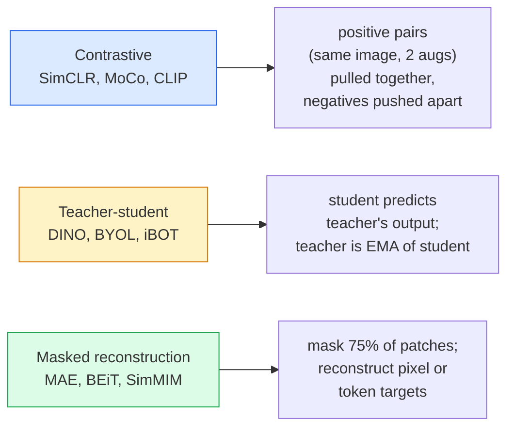

# رؤية ذاتية الإشراف  SimCLR، DINO، MAE  自监督视觉  SimCLR、DINO、MAE

> العلامات هي عقدة الرؤية المراقبة، التدريب المُراقب الذاتي يزيلها: تعلم الميزات البصرية من 100 مليون صورة غير مرموقة، وتحسينها على تلك التي تحمل 10 ألف ملصق.

> **【中文解读】**标签是监督学习的瓶──自监督预训练消除了这个限制: من 1 مليار张无标签图像中学习视觉特征,然后在10,000张标签图像上微调──三种主流方法:SimCLR(对比学习)、DINO(自蒸)、MAE(掩码自编码器)──

> **【拓展：自监督学习是 GPT 的秘密】**GPT 就是一种 نموذج مراقبة الذات 通過預測下一個字來學習──在視覺領域,MAE 通過預測被遮蔽的补丁來學習,DINO 通過自蒸學習语义特征──DINOv2 已成为许多視覺任务的基础模型──

**Type:** Learn + Build | **类型:** 学习 + 动手
**Languages:** Python | **语言:** Python
**Prerequisites:** Phase 4 Lesson 04 (Image Classification), Phase 4 Lesson 14 (ViT) | **前置知识:** Phase 4 Lesson 04（图像分类），Phase 4 Lesson 14（ViT）
**Time:** ~75 minutes | **时间:** ~75 分钟

## أهداف التعلم

- تتبع العائلات الثلاث الرئيسية التي يتم إشرافها على نفسها  التناقض (SimCLR) ، والمعلم الطالب (DINO) ، وإعادة الإعمار المخفي (MAE)  وتشير إلى ما يفضل كل منها
- تنفيذ خسارة InfoNCE من الصفر وتفسير لماذا تعمل مجموعة من 512 ولكن مجموعة من 32 فشل
- شرح لماذا نسبة تخفيض 75% من MAE ليست تعسفية وكيف تختلف عن 15% من BERT بالنسبة للنص
- استخدام نقاط تفتيش DINOv2 أو MAE ImageNet للتحقيق الخطوي والحصول على الرصاصة الصفرة

> **【中文解读】**يُدعى أهداف التعلم المفردة التي يجب أن تتحكم فيها بعد الانتهاء من الدورة.


## المشكلة المشكلة المشكلة

تحت إشراف ImageNet، تمتلك 1.3 مليون صورة مع علامات، والتي تكلف حوالي 10 ملايين دولار لتعليقاً. مجموعات البيانات الطبية والصناعية أصغر وأكثر تكلفة لتعليقاً. يسأل كل فريق رؤية: هل يمكننا التدريب على البيانات غير المعنونة الرخيصة  إطارات YouTube، التصفحات على الإنترنت، لقطات الكامبرايت، مسحات الأقمار الصناعية  ثم ضبطها على مجموعة صغيرة مع علامة؟

> 监督式 ImageNet لديها 1.3 مليون صورة مرموزة، وتقديرات تكلفة مرموزة 1000 مليون دولار. المجموعة البيانية الطبية والصناعية أصغر، وتكلفة مرموزة أعلى. كل فريق فيديو يسأل: هل يمكننا التدريب على المجموعة البيانية غير المرموزة رخيصة  YouTube  网络爬爬取 网络摄像头录像 卫星扫描 然后微调到小的标签集?

التعلم المراقب الذاتي هو الإجابة. يصل إلى أو يفوق دقة ImageNet المراقبة عند ضبطها بشكل جيد. كما أنه ينقل بشكل أفضل إلى المهام المتدفقة (الاكتشاف والتنقيم والعمق) من التدريب المقبل المراقب. DINOv2 (Meta، 2023) وMAE (Meta، 2022) هي الاختيارات القابلة للتصنيع الحالية لميزات الرؤية المتحولة.

> يتحرك التعلم إلى الأعلى من التدريبات المقبلة. DINOv2(Meta,2023) وMAE(Meta,2022) هو اختيار افتراضي لإنتاج الميزات المميزة للنظرة.

التحول المفاهيمي هو أن مهمة الاسباب  الشيء الذي تم تدريب النموذج على القيام به  لا يجب أن تكون مهمة التدريجية. ما يهم هو أنه يجبر النموذج على تعلم الميزات المفيدة. التنبؤ باللون لصور على نطاق الرمادي، وتدوير الصور وطلب من النموذج تصنيف الدوران، وتقديم مساحات قناع وإعادة بناءها  كل عمل. المقاربات الثلاثة التي تُستخدم في هذا النطاق هي التعلم المُقاوم، وتقطيع المعلم والطالب، وإعادة الإعمار المخفي.

> التحول المفاهيمي هو مهمة مقدمة ما يُدرّب النموذج للقيام به لا بدّ من مهمة أسفل. المهمّ هو أنه يُضطر النموذج إلى تعلم خصائص مفيدة.

## المفهوم الأساسي

> **【中文解读】**هذا المقطع يعرض المفاهيم والنظريات الأساسية. فهم هذه المفاهيم هو شرط لتحقيق التنفيذ التالي، وكذلك النقاط المعرفة في المقابلة والممارسة التجريبية.


### ثلاث عائلات



### التعلم المضاد (SimCLR)

خذ صورة واحدة، وطبق إضافات عشوائية، والحصول على مشاهدتين. إطعام كليهما من خلال نفس المُشفّر بالإضافة إلى رأس التبصير. تقليل الخسارة التي تقول "هذه التوابع الثنائية يجب أن تكون قريبة" و "هذه التوابع يجب أن تكون بعيدة عن كل التوابع الأخرى من الصور في المجموعة".

> 取一张图像,施加两种随机增强,得到两种视图――将两者通过同一编码器加投影头――最小化一个损失函数:" يجب أن تكون هذه الإدخالات مقربة"而" يجب أن تكون هذه الإدخالات بعيدة عن جميع إدخالات الصور الأخرى في المجموعة"――

```
Loss for positive pair (z_i, z_j) among 2N views per batch:

   L_ij = -log( exp(sim(z_i, z_j) / tau) / sum_k in batch \ {i} exp(sim(z_i, z_k) / tau) )

sim = cosine similarity
tau = temperature (0.1 standard)
```

هذه هي خسارة InfoNCE. يتطلب الكثير من السلبيات لكل إيجابية، لذلك حجم اللحظة مهمة. تحتاج SimCLR 512-8192.

> هذا هو InfoNCE 损失── إنها تحتاج لكل نموذج صحيح للتعامل مع الكثير من النماذج السلبية، لذلك حجم الجملة هو أمر مهم SimCLR 需要 512-8192──MoCo 引入了过去批次动量队列来解负样本数量和批量大小──

### المعلم الطالب (DINO)

شبكتين ذات بنية واحدة: الطالب والمعلم. المعلم هو متوسط متحرك متبقي (EMA) لوزن الطالب. كلتا ترى وجهات نظر متزايدة للصورة. يتم تدريب نتائج الطالب لتطابق مع معلم  لا سلبيات صريحة.

> شبكة متشابهة: الطالب والمعلم. متوسط الوزن المعلمي يتحرك.

```
loss = CE( student_output(view_1),  teacher_output(view_2) )
     + CE( student_output(view_2),  teacher_output(view_1) )

teacher_weights = m * teacher_weights + (1 - m) * student_weights   (m ≈ 0.996)
```

لماذا لا يتراجع "تنبؤ باستمرار": يتم تركيز إنتاج المعلم (استبعاد المتوسط لكل بعد) وتحديد (تقسيمها بالدرجة الحرارة الصغيرة). تمنع المركزية من السيطرة على بعد واحد؛ تمنع التحديد من انهيار الإنتاج إلى متساوية.

> لماذا لا يقع في "العدد المعتاد التوقعي": خفض المعلمين المخرجات في المواطنين (خفض متوسط الأبعاد) و化 (خفض متوسط الأبعاد)

DINO هو ما يزيد DINOv2 ، على 142 مليون صورة منتظمة. الميزات الناتجة هي SOTA الحالية لاسترداد بصري صفر الصور والتنبؤ الكثيف.

> DINO هو أساس DINOv2 ، في 1.42 مليار张 تمت توسيعها على الصور المحددة.

### إعادة الإعمار المغطاة (MAE)

تغطي 75% من اللقطات من إدخال ViT. تمر فقط 25% المرئية عبر المشفير. يتم تلقي المشفير الصغير إصدار المشفير بالإضافة إلى رموز الماسك في المواقع المخفية، ويتم تدريبه لإعادة بناء البكسلات من اللقطات المخفية.

> 掩藏 ViT 输入 75% 补丁──只会见 25% 通过编码器──一个小解码器接收编码器输出加上掩码位置的掩码代币,训练重建被掩藏补丁的像素──

```
Encoder:  visible 25% of patches -> features
Decoder:  features + mask tokens at masked positions -> reconstructed pixels
Loss:     MSE between reconstructed and original pixels on masked patches only
```

خيارات التصميم الرئيسية التي تجعل MAE تعمل:

> لتحقيق تأثيرات المهنية:

- **75% mask ratio** عالية. يضطر المُشفّر إلى تعلم الميزات الزمنية؛ إعادة بناء 25% سيكون طفيفاً تقريبًا (البيكسلات المجاورة مرتبطة بحيث يمكن لسي إن إن أن يضخها).
  中文翻译:**75% 掩码率**很高──迫使编码器学习语义特征; إعادة بناء 25% 几乎是平凡的(相邻像素高度相关,一个CNN就能做到)
- **Asymmetric encoder/decoder** يقوم مرموز ViT الكبير ببصمات مرئية فقط، ومرموز Decoder صغير (8 طبقة، 512 غامرة) بإعادة الإعمار. 3x أسرع قبل التدريب من BEiT الباهية.
  中文翻译:**非对称编码器/解码器** جهاز تصميمات الكبيرة في التلفزيون 编码器只看可见补丁;小型解码器(8层,512 维) معالجة إعادة البناء。比朴素BEiT 预训练快3倍。
- **Pixel-space reconstruction target** أبسط من هدف BEiT المُرمّح ويعمل بشكل أفضل على ViT.
  中文翻译:**像素空间重建目标**                                                                                                                                                                                                                                                              

بعد التدريب، ألق العداد المعدل.

> 预训练后丢弃解码器──编码器就是特征提取器──

### لماذا 75% وليس 15%

برت يغطي 15٪ من الرموز، MAE يغطي 75٪، الفرق هو كثافة المعلومات.

> برت تغطي 15% من الرمز.

- اللغة الطبيعية لديها ارتفاع الانتروبيا لكل رمز. التنبؤ بنسبة 15٪ من الرموز لا يزال صعباً لأن كل موقف مخفي لديه العديد من الانتهاءات المثيرة للصدق.
  ترجمة باللغة الصينية: الطبيعي لغة كل رمز  مرتفع للغاية.
- تظهر البقع الصورة منخفضة الإنتروبيّة  غالباً ما تحدد الحيّة غير المغطّية بكسلات البقع المغطّية تقريباً بالضبط. لتحقيق التنبؤ يتطلب فهمًا معنويّاً، عليك أن تُغطّي بشكلٍ عدّيّ.
  ترجمة باللغة الصينية: تُقرر أنّ المُبَيِّنَاتِ المُتَمَكِّنَةِ من الإضفاء على الصورِ، يجب أن تُكَثِّرَ.

75% عالية بما فيه الكفاية بحيث لا يمكن الاستخراج الفضائي البسيط حل المهمة؛ يجب أن يمثل المُرمّح محتوى الصورة.

> 75% عالية إلى البسيطة من الفضاء خارج لا يمكن حل المهام؛ يجب على المعدل أن يعرض محتوى الصورة.

### تقييم المسحات الخطية

بعد التدريب المسبق الذي يتم إشرافه بنفسه، يتم تقييم القياسية**linear probe**: تجميد المُشفّر، تدريب مصنف خطي واحد على أعلى على علامات ImageNet. تقرير الدقة الأولى.

> بعد التدريب، والقياس المعياري هو**线性探测**:结编码器,在图像网标签上训练单个线性分类器──报告 top-1 准确率──

- SimCLR ResNet-50: ~71% (2020)
- DINO ViT-S/16: ~77% (2021)
- MAE ViT-L/16: ~76% (2022)
- DINOv2 ViT-g/14: ~ 86% (2023)

المسح الخطي هو مقياس نقي لجودة الميزات؛ التنسيق الدقيق يضيف عادة 2-5 نقاط ولكن أيضا يخلط في تأثير إعادة تدريب الرأس.

> الاختبار السريع هو مقياس نقي للجودة المميزة؛ عادة ما يزيد التغييرات عن 2-5 نقطة مئوية، ولكن أيضاً يخلط مع تأثيرات تدريب الرأس بشكل ثقيل.

> **【拓展：工业部署中的视觉系统】**في التوزيع الصناعي الواقعي، تحتاج النموذج المرئي إلى النظر في التفكير في التأجيل، والنموذج الكبير، والجهاز الحدودي الملائمة وغيرها من المشاكل.

> **【拓展：数据标注与质量】** تأثير المهام المرئية يعتمد على جودة البيانات المعلنة.‬‬‬‬‬‬‬‬‬‬‬‬‬‬‬‬‬‬‬‬‬‬‬‬‬‬‬‬‬‬‬‬‬‬‬‬‬‬‬‬‬‬‬‬‬‬‬‬‬‬‬‬‬‬‬‬‬‬‬‬‬‬‬‬‬‬‬‬‬‬‬‬‬‬‬‬‬‬‬‬‬‬‬‬‬‬‬‬‬‬‬‬‬‬‬‬‬‬‬‬‬‬‬‬‬‬‬‬‬‬‬‬‬‬‬‬‬‬‬‬‬‬‬‬‬‬‬‬‬‬‬‬‬‬‬‬‬‬‬‬‬‬‬‬‬‬‬‬‬‬‬‬‬‬‬‬‬‬‬‬‬‬‬‬‬‬‬‬‬‬‬‬‬‬‬‬‬‬‬‬‬‬‬‬‬‬‬‬‬‬‬‬‬‬‬‬‬‬‬‬‬‬‬‬‬‬‬‬‬‬‬‬‬‬‬‬‬‬‬‬‬‬‬‬‬‬‬‬‬‬‬‬‬‬‬‬‬‬‬‬‬‬‬‬‬‬‬‬‬‬‬‬‬‬‬‬‬‬‬‬‬‬‬‬‬‬‬‬‬‬‬‬‬‬‬‬‬‬‬‬‬‬‬‬‬‬‬‬‬‬‬‬‬‬‬‬‬‬‬‬‬‬‬‬‬‬‬‬‬‬‬‬‬‬‬‬‬‬‬‬‬‬‬‬‬‬‬‬‬‬‬‬‬‬‬‬‬‬‬‬‬‬‬‬‬‬‬‬‬‬‬‬‬‬‬‬‬‬‬‬‬‬‬‬‬‬‬‬‬‬‬‬‬‬‬‬‬‬‬‬‬‬‬‬‬‬‬‬‬‬‬‬‬‬‬‬‬‬‬‬‬‬‬‬‬‬‬‬‬‬‬‬‬‬‬‬‬‬‬‬‬‬‬‬‬‬‬‬‬‬‬‬‬‬‬‬‬‬‬‬‬‬‬‬‬‬‬‬‬‬‬‬‬‬‬‬‬‬‬‬‬‬‬‬‬‬‬‬‬‬‬‬‬‬‬‬‬‬‬‬‬‬‬‬‬‬‬‬‬


## بناء ذلك تحرك لتحقيق

> **【中文解读】**هذا المقطع من خلال الكود من الصفر لتحقيق الخوارزمية النووية. هذا النوع من "من الصفر" يمكن أن يساعد على فهم المبدأ الخلفي للإطار، عندما يواجهون مشكلة لن يتم تعقلها في الصندوق الأسود.

```figure
data-augmentation
```

## بناءها

### الخطوة الأولى: خط أنابيب إضافة المشاهد الثنائية

```python
import torch
import torchvision.transforms as T

two_view_train = lambda: T.Compose([
    T.RandomResizedCrop(96, scale=(0.2, 1.0)),
    T.RandomHorizontalFlip(),
    T.ColorJitter(0.4, 0.4, 0.4, 0.1),
    T.RandomGrayscale(p=0.2),
    T.ToTensor(),
])


class TwoViewDataset(torch.utils.data.Dataset):
    def __init__(self, base):
        self.base = base
        self.aug = two_view_train()

    def __len__(self):
        return len(self.base)

    def __getitem__(self, i):
        img, _ = self.base[i]
        v1 = self.aug(img)
        v2 = self.aug(img)
        return v1, v2
```

كل واحد__getitem__يعود عرضان متزايدين لنفس الصورة؛ لا توجد حاجة إلى علامات.

> كل مرة`__getitem__`عودة إلى نفس الصورة ‬ ‬ ‬ ‬ ‬ ‬ ‬ ‬ ‬ ‬ ‬ ‬ ‬ ‬ ‬ ‬ ‬ ‬ ‬ ‬ ‬ ‬ ‬ ‬

### الخطوة الثانية: فقدان InfoNCE

```python
import torch.nn.functional as F

def info_nce(z1, z2, tau=0.1):
    """
    z1, z2: (N, D) L2-normalised embeddings of paired views
    """
    N, D = z1.shape
    z = torch.cat([z1, z2], dim=0)  # (2N, D)
    sim = z @ z.T / tau              # (2N, 2N)

    mask = torch.eye(2 * N, dtype=torch.bool, device=z.device)
    sim = sim.masked_fill(mask, float("-inf"))

    targets = torch.cat([torch.arange(N, 2 * N), torch.arange(0, N)]).to(z.device)
    return F.cross_entropy(sim, targets)
```

L2 تعاديل التثبيت قبل الاتصال. `tau=0.1`هو الاختيار المعياري SimCLR؛ أقل يجعل الخسارة أكثر وضوحا وتتطلب المزيد من السلبيات.

> 调用前对嵌入做 L2 归一化──`tau=0.1`هو SimCLR 默认值; كلما انخفضت خسارة كلما انتشر, تحتاج الى المزيد من النماذج السلبية

### الخطوة الثالثة: فحص الصحة العقلية

```python
z1 = F.normalize(torch.randn(16, 32), dim=-1)
z2 = z1.clone()
loss_same = info_nce(z1, z2, tau=0.1).item()
z2_random = F.normalize(torch.randn(16, 32), dim=-1)
loss_random = info_nce(z1, z2_random, tau=0.1).item()
print(f"InfoNCE with identical pairs:  {loss_same:.3f}")
print(f"InfoNCE with random pairs:     {loss_random:.3f}")
```

يجب أن توفر الأزواج المتطابقة خسارة منخفضة (قريبة من 0 لفرقة كبيرة ودرجة حرارة باردة). يجب أن توفر الأزواج العشوائية log(2N-1) = ~log(31) = ~3.4 مع فرقة 16 زوجًا.

> معدل التكيف مع التكيف مع التكيف مع التكيف مع التكيف مع التكيف مع التكيف مع التكيف مع التكيف مع التكيف مع التكيف مع التكيف مع التكيف مع التكيف مع التكيف مع التكيف مع التكيف مع التكيف مع التكيف مع التكيف مع التكيف مع التكيف مع التكيف مع التكيف مع التكيف مع التكيف مع التكيف مع التكيف مع التكيف مع التكيف مع التكيف مع التكيف مع التكيف مع التكيف مع التكيف مع التكيف مع التكيف مع التكيف مع التكيف مع التكيف مع التكيف مع التكيف مع التكيف مع التكيف مع التكيف مع التكيف مع التكيف مع التكيف مع التكيف مع التكيف مع التكيف مع التكيف مع التكيف مع التكيف مع التكيف مع التكيف مع التكيف مع التكيف مع التكيف مع التكيف مع التكيف مع التكيف مع التكيف مع التكيف مع التكيف مع التكيف مع التكيف مع التكيف مع التكيف مع التكيف مع التكيف مع التكيف مع التكيف مع التكيف مع التكيف مع التكيف مع التكيف مع التكيف مع التكيف مع التكيف مع التكيف.

### الخطوة الرابعة: تقديم قناع في نمط MAE

```python
def random_mask_indices(num_patches, mask_ratio=0.75, seed=0):
    g = torch.Generator().manual_seed(seed)
    n_keep = int(num_patches * (1 - mask_ratio))
    perm = torch.randperm(num_patches, generator=g)
    visible = perm[:n_keep]
    masked = perm[n_keep:]
    return visible.sort().values, masked.sort().values


num_patches = 196
visible, masked = random_mask_indices(num_patches, mask_ratio=0.75)
print(f"visible: {len(visible)} / {num_patches}")
print(f"masked:  {len(masked)} / {num_patches}")
```

> **【中文解读】**هذا المقال يوضح كيفية استخدام إطار متقدم مثل PyTorch、HuggingFace وغيرها) سريعة تطبيق هذه التقنية.


بسيط وسرع وحدد لذرة معينة. تنفيذات MAE الحقيقية تقوم بتجميع هذا و تحافظ على أقنعة لكل عينة.

> 简单、快速、对给定种子确定性―― MAE 实际实现会批量处理并保留每个样本的掩码――


> **【拓展：视觉模型的持续学习】**في بيئة الإنتاج، يتطلب نموذج الرؤية التكيف المستمر مع البيانات الجديدة.

## استخدمها في إطار التنفيذ

DINOv2 هو معيار الإنتاج في عام 2026:

```python
import torch
from transformers import AutoImageProcessor, AutoModel

processor = AutoImageProcessor.from_pretrained("facebook/dinov2-base")
model = AutoModel.from_pretrained("facebook/dinov2-base")
model.eval()

# Per-image embeddings for zero-shot retrieval
with torch.no_grad():
    inputs = processor(images=[pil_image], return_tensors="pt")
    outputs = model(**inputs)
    embedding = outputs.last_hidden_state[:, 0]  # CLS token
```

النتيجة من ذلك هو استرجاع الصور الحديثة، والمراسلة الكثيفة، والخطوط النقلية الصفرة. نادرا ما يحتاج التنسيق الدقيق في مهمة أسفل التيار إلى أكثر من رأس خطي.

بالنسبة لتوابل الصور والنص، فإن SigLIP أو OpenCLIP هي المكافئة؛ بالنسبة للتحسينات الدقيقة على النمط MAE، فإن `timm`سُفر إرسال البضائع إلى كل نقطة تفتيش

> **【中文解读】**هذا المادة يركز على كيفية نشر النموذج كمنتج متاح. من النموذج الأصلي إلى النظام في مرحلة الإنتاج، تحتاج إلى النظر في العديد من الخصائص في تحسين الأداء والتعامل الخاطئ والتحكم.


## أرسلها .

> **【中文解读】**练题按照易/中级/Hard 三个难度递进──建议至少完成 级级中级的题目,Hard 级适合深入研究或面试准备──


هذا الدرس ينتج عن:

- `outputs/prompt-ssl-pretraining-picker.md` طلب يختار SimCLR / MAE / DINOv2 نظراً لقياس مجموعة البيانات والحساب والمهام المتدفقة.
- `outputs/skill-linear-probe-runner.md` مهارة تكتب تقييمات الصفحة الخطية لأي مرموز تجميد + مجموعة بيانات مع علامة.

## تمارين التدريب

1. **(Easy)**التحقق من أن خسارة InfoNCE تنخفض عند خفض درجة الحرارة للتركيبات المنسقة جيدا ويزداد عند خفض درجة الحرارة للتركيبات العشوائية.`tau in [0.05, 0.1, 0.2, 0.5]`مقابل الخسارة
2. **(Medium)**قم بتنفيذ عازف مركزي على شكل DINO، و أظهر أنه بدون المركز، يتراجع الطالب إلى متجه ثابت في غضون عدة فترات.
3. **(Hard)**تدريب MAE على CIFAR-100 باستخدام TinyUNet من الدروس 10 كعمود الفخذ. تقرير دقة الصوف الخطية في 10 ، 50 ، و 200 عصر. أظهر أن صوف خطي تدرب من قبل MAE يضرب صوف خطي مراقب من الصفر على نفس مجموعة فرعية من الصور 1000.

> **【中文解读】**في لغة "ما يقوله الناس" مقابل "ما يعنيه في الواقع" تم التمييز بين لغة اليومية والتقنية المحددة.


## شروط الرئيسية

| Term | What people say | What it actually means |
|------|----------------|----------------------|
| Self-supervised | "Label-free" | A pretext task that produces useful representations from unlabelled data |
| Pretext task | "The fake task" | The objective used during SSL (reconstruct patches, match views); discarded after pretraining |
| Linear probe | "Frozen encoder + linear head" | Standard SSL evaluation: train only a linear classifier on top of frozen features |
| InfoNCE | "Contrastive loss" | softmax over cosine similarities; positive pair is the target class, all others are negatives |
| EMA teacher | "Moving-average teacher" | Teacher whose weights are an exponential moving average of the student's; used by BYOL, MoCo, DINO |
| Mask ratio | "% of patches hidden" | Fraction of patches masked during MAE; 75% for vision, 15% for text |
| Representation collapse | "Constant output" | SSL failure where the encoder outputs a constant vector for all inputs; prevented by centring, sharpening, or negatives |
| DINOv2 | "Production SSL backbone" | Meta's 2023 self-supervised ViT; strongest general-purpose image features in 2026 |

> **【中文解读】**延伸阅读 يوفر موارد عالية الجودة للتعلم المتعمق.


## المزيد من القراءة

- [SimCLR (Chen et al., 2020)](https://arxiv.org/abs/2002.05709) إشارة للتعلم المُتناقضة
- [DINO (Caron et al., 2021)](https://arxiv.org/abs/2104.14294) معلم الطالب مع الزخم، المركزية، الحادة
- [MAE (He et al., 2022)](https://arxiv.org/abs/2111.06377) التدريب المسبق لـ ViT
- [DINOv2 (Oquab et al., 2023)](https://arxiv.org/abs/2304.07193) تحويل المعلومات المتعلقة بالشركات ذاتية الإشراف إلى ميزات الإنتاج
