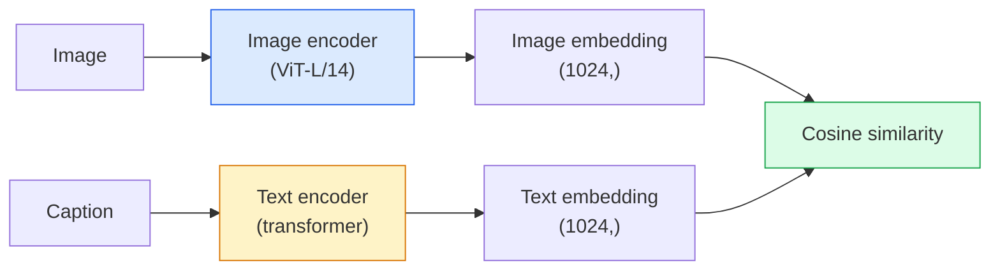

# رؤية المفردات المفتوحة  CLIP  开放词汇视觉  CLIP

> قم بتدريب رمز الصورة و رمز النص معاً بحيث تصل أزواج المقابلة (الصورة، الشعار) إلى نفس الموقع في مساحة مشتركة. هذه هي الخدعة كلها.

> **【中文解读】**CLIP مع التدريب على مُعدّل الصور ومُعدّل النصوص، لتطبيق مُعدّل الصور، والوصف) على نفس النقطة من الفضاء المشترك.

> **【拓展：CLIP 是多模态 AI 的基石】**CLIP هو DALL-E、Stable Diffusion ((صيغة النص))、LVA、GPT-4V وغيرها من الموديلات الأساسية المكونة.

**Type:** Build + Use | **类型:** 动手 + 应用
**Languages:** Python | **语言:** Python
**Prerequisites:** Phase 4 Lesson 14 (ViT), Phase 4 Lesson 17 (Self-Supervised) | **前置知识:** Phase 4 Lesson 14（ViT），Phase 4 Lesson 17（自监督）
**Time:** ~45 minutes | **时间:** ~45 分钟

## أهداف التعلم

- شرح بنية CLIP من برجين و هدف التدريب المقابل
- استخدام CLIP (أو SigLIP) المسبق للتدريب للتصنيف بدون أي تدريب محدد للمهمة
- تنفيذ تصنيف الصفر من الصفر: طلبات تشفير الفئة، حساب تشابه الكوسين، أخذ argmax
- تمييز نماذج الرؤية CLIP و SigLIP و OpenCLIP و LLaVA/ LLaMA  ما هو كل منها في عام 2026

> **【中文解读】**يُدعى أهداف التعلم المفردة التي يجب أن تتحكم فيها بعد الانتهاء من الدورة.


## المشكلة المشكلة المشكلة

المصفوفات التقليدية هي المفردات المغلقة: يمكن لنموذج ImageNet من 1000 فئة التنبؤ فقط 1000 علامة. كل فئة جديدة تتطلب بيانات معينة ورأس مدرب.

> 传统分类器是封闭词汇的:1000 类的 ImageNet 模型只能预测1000 标签──每一个新类都需要标签数据和重新训练头──

أظهرت CLIP (رادفورد وزملاءه، OpenAI 2021) أن التدريب على 400 مليون زوج (صورة، عنوان) تم شقيعه من الويب ينتج نموذجا يمكن تصنيفه إلى أي مجموعة من الفئات عند الاستنتاج، ووصفها بحتة باللغة الطبيعية. يمكنك إعطائها فئة جديدة عن طريق كتابة جملة.

> CLIP(رادفورد وغيره،OpenAI 2021) يظهر أن النموذج الذي ينشأ من خلال شبكة الانترنت المكتسبة 4 مليارات (صور، عنوانات) على التدريب يمكن أن يتم تقسيمه في أي فئة من مجموعات التفكير، باستخدام اللغة الطبيعية البحتة.

هذه القدرة  نقل الصفر الصور  هي السبب في أن كل نظام رؤية حديث يبدأ بمراقبة CLIP-family. الكشف (Grounding DINO ، OWL-ViT) ، التقسيم (CLIPSeg ، SAM) ، الاستعلام ، اعتدال المحتوى ، VLMs ، وتوليد النص إلى الصورة جميعها بناء على إدمج مشترك على نمط CLIP.

> ذلك القدرة零样本迁移就是为什么 كل نظام رؤية حديث يبدأ من نقطة فحص CLIP 家庭的检查点开始――检测(Grounding DINO、OWL-ViT) 、分割(CLIPSeg、SAM) 、检索、内容审核、VLM 和文本到图像生成都建立在CLIP 风格的联合嵌入上――

## المفهوم الأساسي

> **【中文解读】**هذا المقطع يعرض المفاهيم والنظريات الأساسية. فهم هذه المفاهيم هو شرط لتحقيق التنفيذ التالي، وكذلك النقاط المعرفة في المقابلة والممارسة التجريبية.


### برجين



ينتهي كلا المرموزين بعرض خطي إلى نفس بعد التضمين (512 بالنسبة لـ CLIP-B/32 ، 1024 بالنسبة لـ CLIP-L/14).

>  اثنين من المعدات تم إلقاءها على الخط إلى نفس الوضع في الامتدادات تنتهي CLIP-B/32 مقابل 512 维,CLIP-L/14 مقابل 1024 维)。L2 归结后计算余弦相似度──

### الهدف

نظراً لفرقة من أزواج N (الصورة، الأسطح) ، قم ببناء ماتريكس تشابه NxN. قم بتدريب كلا المرموزين بحيث يكون للشبهة العرضية (أزواج متطابقة) تشابه كبير والشبهات خارج الشبهة (غير متطابقة) تشابه منخفض.

> 给定一批 N 个图像,标题) 对,构建 NxN 相似度矩阵――训练两个编码器使对角线(匹配对) 相似度高,非对角线(非匹配对) 相似度低――

```
sim_matrix = image_embeddings @ text_embeddings.T / tau

loss_i2t = cross_entropy(sim_matrix,       targets=arange(N))
loss_t2i = cross_entropy(sim_matrix.T,     targets=arange(N))
loss = (loss_i2t + loss_t2i) / 2
```

التناظر لأن كل من الصورة إلى النص والصورة إلى الصورة لاسترداد يجب أن تعمل. `tau`(الدرجة الحرارة) عادة ما يتم تعلمها كمتعلم مقياسي، المبكر إلى 0.07.

> وذلك لأن البحث عن الصور إلى النص والنص إلى الصور يجب أن يكون فعالا.`tau`(الدرجة الحرارة) عادةً كمتطلبات الرياضيات، تبدأ في 0.07..

### سيجليب: خسارة أفضل

استبدل SigLIP (Zhai et al., 2023) softmax بـ sigmoid لكل زوج:

> إضافة إلى إضافة إضافية إلى إضافية،

```
loss = mean over pairs of log(1 + exp(-y_ij * sim_ij))
y_ij = +1 if matching, -1 otherwise
```

يزيل الخسارة لكل زوج التطبيق على مستوى الحزمة الذي يتطلبه CLIP. يتدرب SigLIP بشكل أفضل في أحجام الحزم الصغيرة ويتطابق أو يتجاوز CLIP عند البيانات المتساوية.

> تمت إزالة التكامل في المجموعات التي تتطلبها CLIP.

### تصنيف الصفر

مع وجود CLIP مدرب:

> -أعطينا بعض التدريبات

1. لكل فئة، قم بتكوين طلب: "صورة من {الفئة}".
   中文翻译:为每个类别构造提示词:"صورة من {类别}"。
2. قم بتشفير جميع طلبات الفئة باستخدام رمز النص -> `T`الشكل (C, d).
   中文翻译:用文本编码器编码所有类提示词 -> `T`形状 (ج، د)
3. رمزية صورة الاختبار -> `I`الشكل (1, د).
   中文翻译:编码测试图像 -> `I`形状 (1, د)
4. التشابه = `I @ T.T`الشكل (1, ج).
   中文翻译:相似度 = `I @ T.T`形状 (1, ج)
5. Argmax -> فئة متوقعة.
   中文翻译:Argmax -> 预测类别。

أبرز المواد الهندسية. نشر OpenAI 80 قالبًا من الشكلات المفروضة لـ ImageNet ("صورة {}" ، "صورة مبهمة من {}" ، "رسمة من {}"، ...). متوسط إدخال جميع الشكلات لكل فئة لتحقيق إضافي 1-3٪ من أعلى 1.

> 提示词工程很重要──OpenAI 为 ImageNet 发布了80 个提示模板──将每个类别的所有模板嵌入取平均可以额外提升 1-3% 的 top-1 准确率──

### حيث تستخدم نماذج على طراز CLIP في عام 2026

- **Zero-shot classification** الاستخدام المباشر
  中文翻译:**零样本分类**直接使用──
- **Image retrieval** تشفير جميع الصور مرة واحدة، إضافة استفسار في الاستنتاج.
  中文翻译:**图像检索** إصدار واحد لكل الصور، تقديم إضافة استفسار
- **Text-conditioned detection** إرسال DINO، OWL-ViT لف برج نص CLIP حول الكشف.
  中文翻译:**文本条件检测**إرسال DINO、OWL-ViT 在检测器外包装 CLIP 文本塔──
- **Text-conditioned segmentation** CLIPSeg؛ SAM تستخدم مدخلات النص عبر CLIP.
  中文翻译:**文本条件分割**CLIPSeg;SAM 通過 CLIP 使用文本提示输入。
- **VLMs** LLaVA، Qwen-VL، InternVL سلكة تشفير رؤية عائلة CLIP في ماجستير في العلوم.
  中文翻译:**VLM**LLaVA、Qwen-VL、InternVL سوف CLIP عائلة تصويري المعدات المرتبطة LLM‬
- **Text-to-image gen** انتشار ثابت، شرط DALL-E 3 على إدخال نص CLIP.
  中文翻译:**文本到图像生成**التنشر المستقر DALL-E 3  على أساس CLIP 文本嵌入进行条件化

بمجرد أن يكون لديك مساحة تشكيل مشتركة، تصبح كل مهمة رؤية+لغة حسابة لمسافات.

> بمجرد أن يكون هناك مساحة تشاركية، كل مهمة فيديو + لغة تحولت إلى حساب المسافة.

> **【中文解读】**هذا المقطع من خلال الكود من الصفر لتحقيق الخوارزمية النووية. هذا النوع من "من الصفر" يمكن أن يساعد على فهم المبدأ الخلفي للإطار، عندما يواجهون مشكلة لن يتم تعقلها في الصندوق الأسود.

> **【拓展：工业部署中的视觉系统】**في التوزيع الصناعي الواقعي، تحتاج النموذج المرئي إلى النظر في التفكير في التأجيل، والنموذج الكبير، والجهاز الحدودي الملائمة وغيرها من المشاكل.

> **【拓展：数据标注与质量】** تأثير المهام المرئية يعتمد على جودة البيانات المعلنة.‬‬‬‬‬‬‬‬‬‬‬‬‬‬‬‬‬‬‬‬‬‬‬‬‬‬‬‬‬‬‬‬‬‬‬‬‬‬‬‬‬‬‬‬‬‬‬‬‬‬‬‬‬‬‬‬‬‬‬‬‬‬‬‬‬‬‬‬‬‬‬‬‬‬‬‬‬‬‬‬‬‬‬‬‬‬‬‬‬‬‬‬‬‬‬‬‬‬‬‬‬‬‬‬‬‬‬‬‬‬‬‬‬‬‬‬‬‬‬‬‬‬‬‬‬‬‬‬‬‬‬‬‬‬‬‬‬‬‬‬‬‬‬‬‬‬‬‬‬‬‬‬‬‬‬‬‬‬‬‬‬‬‬‬‬‬‬‬‬‬‬‬‬‬‬‬‬‬‬‬‬‬‬‬‬‬‬‬‬‬‬‬‬‬‬‬‬‬‬‬‬‬‬‬‬‬‬‬‬‬‬‬‬‬‬‬‬‬‬‬‬‬‬‬‬‬‬‬‬‬‬‬‬‬‬‬‬‬‬‬‬‬‬‬‬‬‬‬‬‬‬‬‬‬‬‬‬‬‬‬‬‬‬‬‬‬‬‬‬‬‬‬‬‬‬‬‬‬‬‬‬‬‬‬‬‬‬‬‬‬‬‬‬‬‬‬‬‬‬‬‬‬‬‬‬‬‬‬‬‬‬‬‬‬‬‬‬‬‬‬‬‬‬‬‬‬‬‬‬‬‬‬‬‬‬‬‬‬‬‬‬‬‬‬‬‬‬‬‬‬‬‬‬‬‬‬‬‬‬‬‬‬‬‬‬‬‬‬‬‬‬‬‬‬‬‬‬‬‬‬‬‬‬‬‬‬‬‬‬‬‬‬‬‬‬‬‬‬‬‬‬‬‬‬‬‬‬‬‬‬‬‬‬‬‬‬‬‬‬‬‬‬‬‬‬‬‬‬‬‬‬‬‬‬‬‬‬‬‬‬‬‬‬‬‬‬‬‬‬‬‬‬‬‬‬‬‬‬‬‬‬‬‬‬‬‬‬‬‬‬‬‬‬‬‬‬‬‬‬‬‬‬‬‬‬‬‬‬‬


## بناء ذلك تحرك لتحقيق
```figure
clip-contrastive
```

## بناءها

### الخطوة الأولى: نموذج صغير من برجين

CLIP الحقيقي هو محول ViT +. لهذا الدروس البرج صغيرة MLPs على الميزات المستخرجة مسبقا حتى إشارة التدريب مرئية على CPU.

> إن CLIP الحقيقي هو ViT + Transformer. برج هذا الدراسة هو MLP صغير على الخصائص المسبقة، حتى يتم رؤية إشارات التدريب على CPU.

```python
import torch
import torch.nn as nn
import torch.nn.functional as F


class TwoTower(nn.Module):
    def __init__(self, img_in=128, txt_in=64, emb=64):
        super().__init__()
        self.image_proj = nn.Sequential(nn.Linear(img_in, 128), nn.ReLU(), nn.Linear(128, emb))
        self.text_proj = nn.Sequential(nn.Linear(txt_in, 128), nn.ReLU(), nn.Linear(128, emb))
        self.logit_scale = nn.Parameter(torch.ones([]) * 2.6592)  # ln(1/0.07)

    def forward(self, img_feats, txt_feats):
        i = F.normalize(self.image_proj(img_feats), dim=-1)
        t = F.normalize(self.text_proj(txt_feats), dim=-1)
        return i, t, self.logit_scale.exp()
```

توقعات، إنتاج مشترك، درجة حرارة تعلمت، نفس الشكل مثل API CLIP الحقيقي.

> 两个投影、共享维度输出、可学习温度──与真正的CLIP API 形状相同──

### الخطوة الثانية: الخسارة المقابلة

```python
def clip_loss(image_emb, text_emb, logit_scale):
    N = image_emb.size(0)
    sim = logit_scale * image_emb @ text_emb.T
    targets = torch.arange(N, device=sim.device)
    l_i = F.cross_entropy(sim, targets)
    l_t = F.cross_entropy(sim.T, targets)
    return (l_i + l_t) / 2
```

التناظر: مقياس التخفيف أعلى = نضج أكثر = أكثر ثقة ولكن خطر عدم الاستقرار.

> على الصعيد العالي.

### الخطوة الثالثة: تصنيف الصفر

```python
@torch.no_grad()
def zero_shot_classify(model, image_feats, class_text_feats, class_names):
    """
    image_feats:      (N, img_in)
    class_text_feats: (C, txt_in)   one averaged embedding per class
    """
    i = F.normalize(model.image_proj(image_feats), dim=-1)
    t = F.normalize(model.text_proj(class_text_feats), dim=-1)
    sim = i @ t.T
    pred = sim.argmax(dim=-1)
    return [class_names[p] for p in pred.tolist()]
```

خط واحد لكل خطوة، هذا هو الإجراء المحدد المستخدم مع نقطة تفتيش CLIP الإنتاجية.

> كل خطوة على الخط. هذا هو عملية التنظيم المحددة للنقطة التفتيشية.

### الخطوة الرابعة: التحقق من صحة العقل

```python
torch.manual_seed(0)
model = TwoTower()

img = torch.randn(8, 128)
txt = torch.randn(8, 64)
i, t, scale = model(img, txt)
loss = clip_loss(i, t, scale)
print(f"batch size: {i.size(0)}   loss: {loss.item():.3f}")
```

الخسارة يجب أن تكون قريبة من`log(N) = log(8) = 2.08`بالنسبة لنموذج تم تشريعه عشوائياً  الهدف المتناظر للترابط المتقاطع عندما لا يتم تعلم الهيكل بعد.

> مع تقدم النموذج الأولية يجب أن تقترب`log(N) = log(8) = 2.08` لم يتعلم حتى الان الهدف

> **【中文解读】**هذا المقال يوضح كيفية استخدام إطار متقدم مثل PyTorch、HuggingFace وغيرها) سريعة تطبيق هذه التقنية.


> **【拓展：视觉模型的持续学习】**في بيئة الإنتاج، يتطلب نموذج الرؤية التكيف المستمر مع البيانات الجديدة.

## استخدمها في إطار التنفيذ

OpenCLIP هي الافتراض المجتمعي في عام 2026:

```python
import open_clip
import torch
from PIL import Image

model, _, preprocess = open_clip.create_model_and_transforms("ViT-B-32", pretrained="laion2b_s34b_b79k")
tokenizer = open_clip.get_tokenizer("ViT-B-32")

image = preprocess(Image.open("dog.jpg")).unsqueeze(0)
text = tokenizer(["a photo of a dog", "a photo of a cat", "a photo of a car"])

with torch.no_grad():
    image_features = model.encode_image(image)
    text_features = model.encode_text(text)
    image_features = image_features / image_features.norm(dim=-1, keepdim=True)
    text_features = text_features / text_features.norm(dim=-1, keepdim=True)
    probs = (100.0 * image_features @ text_features.T).softmax(dim=-1)

> **【中文解读】** 本节关注如何将模型部署为可用的产品。从原型到生产级系统需要考虑性能优化、错误处理、监控等多个维度。


print(probs)
```

إن سيجليب أحدث، وتتدرب بشكل أفضل على نطاقات صغيرة، وتفضل العمل الجديد: `google/siglip-base-patch16-224`-تحتضن سفن الوجهين


## أرسلها .

> **【中文解读】**练题按照易/中级/Hard 三个难度递进──建议至少完成 级级中级的题目,Hard 级适合深入研究或面试准备──


هذا الدرس ينتج عن:

- `outputs/prompt-zero-shot-class-picker.md` عرض تصميم نماذج الفئة لـ CLIP الصفر المقطوع مع إعطاء قائمة من الفئات والمنطقة.
- `outputs/skill-image-text-retriever.md` مهارة تبني مؤشر إضافة الصورة مع أي نقطة تفتيش CLIP، وتدعم الاستفسار حسب النص والسؤال حسب الصورة.

## تمارين التدريب

1. **(Easy)**استخدم OpenCLIP ViT-B/32 المُدربة مسبقاً واصنع تصنيف صفر إطلاق على CIFAR-10 مع مجموعة عرض 80 نموذج.
2. **(Medium)**مقارنة الشكل الواحد ("صورة {}") مقابل 80 شكل متوسط التوابل على نفس مهمة CIFAR-10. تحديد الفجوة وتوضيح لماذا الشكلات تساعد.
3. **(Hard)**قم ببناء مؤشر استرداد الصور الصفرية صفر إطلاق: ضم 1000 صورة مع CLIP، قم بإنشاء مؤشر FAISS، استفسار مع وصف لغة طبيعية. قم بتقديم تقرير استرداد recall@5 لـ 20 استفسارًا تم إرسالها يدويًا.

> **【中文解读】**في لغة "ما يقوله الناس" مقابل "ما يعنيه في الواقع" تم التمييز بين لغة اليومية والتقنية المحددة.


## شروط الرئيسية

| Term | What people say | What it actually means |
|------|----------------|----------------------|
| Two-tower | "Dual encoder" | Separate image and text encoders ending in a shared-dim projection head |
| Zero-shot | "No task-specific training" | Classify into classes described only by text at inference; no labels touched |
| Temperature / logit_scale | "tau" | Learned scalar that scales the similarity matrix before softmax |
| Prompt template | "A photo of a {}" | Natural-language wrapper around class names; averaging many templates boosts zero-shot accuracy |
| CLIP | "Image+text model" | The 2021 OpenAI model; vocabulary of the field in 2026 |
| SigLIP | "Sigmoid CLIP" | Swaps softmax for per-pair sigmoid; trains better at small batches |
| OpenCLIP | "Open reproduction" | Community-trained CLIP variants on LAION; production default for open-source pipelines |
| VLM | "Vision-language model" | A CLIP-family encoder plus an LLM, trained to answer questions about images |

> **【中文解读】**延伸阅读 يوفر موارد عالية الجودة للتعلم المتعمق.


## المزيد من القراءة

- [CLIP: Learning Transferable Visual Models from Natural Language Supervision (Radford et al., 2021)](https://arxiv.org/abs/2103.00020)
- [SigLIP: Sigmoid Loss for Language-Image Pre-Training (Zhai et al., 2023)](https://arxiv.org/abs/2303.15343)
- [OpenCLIP](https://github.com/mlfoundations/open_clip)قاعدة التعليمات المجتمعية
- [DINOv2 vs CLIP vs MAE: a features comparison](https://huggingface.co/blog/dinov2) دليل HF مع حالات الاستخدام جنبا إلى جنب
