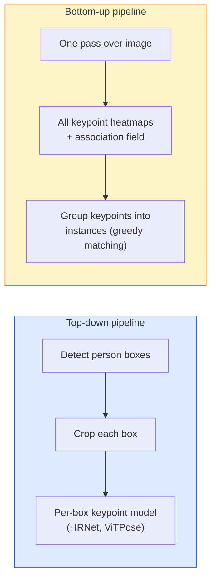

# كليف بوينت كشف وتقدير الموقف  Keypoint Detection و التقدير الموقف

> الموقف هو مجموعة من نقاط المفاتيح مرتبة كاشف نقطة المفاتيح هو خريطة حرارة رجعي كل شيء آخر هو الحساب

> **【中文解读】**姿态 هو مجموعة من النقاط الرئيسية المرتبطة مثل جسم الإنسان (البحث عن النقاط الرئيسية)  姿态 هو جهاز تحليل النقاط الرئيسية في الأساس هو جهاز تحديد القوة الحرارية للنقطة الرئيسية للتنبؤ بالاحتمالات  姿态 تقدير يستخدم على نطاق واسع في تحليل الحركة       

> **【拓展：姿态估计的应用】**OpenPose、MediaPipe、YOLO-Pose هي أداة تقييم الموقف المعتادة.

**Type:** Build | **类型:** 动手
**Languages:** Python | **语言:** Python
**Prerequisites:** Phase 4 Lesson 06 (Detection), Phase 4 Lesson 07 (U-Net) | **前置知识:** Phase 4 Lesson 06（目标检测），Phase 4 Lesson 07（U-Net）
**Time:** ~45 minutes | **时间:** ~45 分钟

## أهداف التعلم

- تمييز بين تقدير وضعية من أعلى إلى أسفل و من أسفل إلى الأعلى و تحديد متى يتم استخدام كل منهما
- خرائط حرارة رجعة لمقاطع K المفتاحية مع هدف غوسيان لكل نقطة مفتاحية واستخراج إحداثيات نقطة المفتاحية عند الاستنتاج
- شرح حقل التواصل الجزئي (PAFs) وكيفية ربط خطوط الأنابيب من أسفل إلى أعلى النقاط الرئيسية إلى حالات
- استخدم MediaPipe Pose أو MMPose لتقدير نقطة الأساسية الإنتاج وفهم تنسيقها

> **【中文解读】**يُدعى أهداف التعلم المفردة التي يجب أن تتحكم فيها بعد الانتهاء من الدورة.


## المشكلة المشكلة المشكلة

المهام الرئيسية تختبئ تحت العديد من الأسماء: وضع البشر (17 مفصل الجسم) ، علامات الوجهه (68 أو 478 نقطة) ، اليد (21 نقطة) ، وضع الحيوانات ، وضع الأشياء الروبوتية ، علامات التشريح الطبي. كل منها يشارك في نفس الهيكل: اكتشاف نقاط K منفصلة على جسم وتصدر إحداثياتها (x ، y).

> 关键点任务藏在许多名称下: 的人体姿态(17 个身体关节) 面部特征点(68 أو 478 个点) 手部(21 个点) 动物姿态、机器人物体姿态、医学解剖标志── كل منها له نفس الهيكل: K 个离散点并输出它们的 (x, y) 坐标──

تقدير الموقف هو أساس التقاط الحركة وتطبيقات اللياقة البدنية وتحليل الرياضة ومراقبة الإيماءات والتحريك وتجربة AR والمساعدة الروبوتية. حالة 2D متقدمة ؛ وضع 3D (تقدير المواقع المشتركة في إحداثيات العالم من كاميرا واحدة) هو الحدود البحثية الحالية.

> 姿势估算是动作捕捉,健身应用,运动分析,手势控制,动画,AR 试穿和机器人抓取的基础――2D 情况已经成熟;3D 姿势(从单个相机估计世界坐标中的关节位置) 是当前研究前沿――

السؤال الهندسي هو الحجم. صورة واحدة، شخص واحد وضع مشكلة 20ms. وضع متعدد الأشخاص في حشد في 30 fps هو مشكلة مختلفة مع معالم مختلفة.

> مشكلة المهنية هي الحجم. صورة واحدة، صورة واحدة، صورة واحدة هي مشكلة 20ms.

## المفهوم الأساسي

> **【中文解读】**هذا المقطع يعرض المفاهيم والنظريات الأساسية. فهم هذه المفاهيم هو شرط لتحقيق التنفيذ التالي، وكذلك النقاط المعرفة في المقابلة والممارسة التجريبية.


### من أعلى إلى أسفل مقابل أسفل إلى الأعلى



- **Top-down** اكتشاف الأشخاص أولاً، ثم تشغيل نموذج نقطة مفتاح لكل شخص على كل محصول. أعلى دقة؛ يُقَاسُ خطياً مع عدد الأشخاص.
  中文翻译:**自顶向下** أولاً فحص مربع البشر، ثمّ على كل منطقة قصّة للعمل
- **Bottom-up** واحد تقدم تقدير جميع نقاط المفاتيح بالإضافة إلى حقل الارتباط؛ مجموعة لهم. وقت ثابت بغض النظر عن حجم الحشد.
  中文翻译:**自底向上** مرة واحدة قبل الالتزام التنبؤ جميع المفاتيح نقطة加关联场; ثم分组── بغض النظر عن حجم المجموعة هي عدد العادي من الوقت──

أعلى إلى أسفل (HRNet، ViTPose) هو قائد الدقة؛ أسفل إلى الأعلى (OpenPose، HigherHRNet) هو قائد التوصيل للمشاهد المزدحمة.

> 自顶向下(HRNet、ViTPose) هو القائد精度؛自底上(OpenPose、HigherHRNet) هو القائد الانتشار من المشهد المزدحمة。

### تراجع خريطة الحرارة

بدلاً من التراجع`(x, y)`مباشرة، التنبؤ`H x W`خريطة حرارة لكل نقطة مفتاحية مع قنبلة غوسية مركزة في الموقع الحقيقي.

> غير مباشرة`(x, y)`و لكن لكل نقطة مهمة`H x W`热力图, فى مركز الموقع الحقيقي وضع علامات عالية

```
target[k, y, x] = exp(-((x - cx_k)^2 + (y - cy_k)^2) / (2 sigma^2))
```

عند الاستنتاج، فإن argmax لكل خريطة حرارة هو الموقع المتوقع لمفتاح.

لماذا تعمل خرائط الحرارة بشكل أفضل من التراجع المباشر: يتماشى هيكل الشبكة الفضائي (خريطة ميزات conv) بشكل طبيعي مع الناتج الفضائي.

> لماذا هو أفضل من العودة مباشرة: إنشاء شبكة الفضاء (تحت صيغة الصفحة) مع المجال المنتج الطبيعي على الجمال.

### تحديد موقع الفرعية للبيكسل

يعطي Argmax إحداثيات عدد كامل. من أجل دقة الفرعية للبيكسل، قم بتحسينها عن طريق تثبيت المظلة على argmax وجيرانها، أو استخدم تعويض معروف `(dx, dy) = 0.25 * (heatmap[y, x+1] - heatmap[y, x-1], ...)`الاتجاه

> أرجماكس  أعطى عدد كامل                                                                                                                                                                                                                                                                                                                                                                                                                                                                                                                     

### حقل التواصل الجزئي (PAFs)

خدعة OpenPose للربط من أسفل إلى الأعلى. لكل زوج من نقاط المفاتيح المتصلة (على سبيل المثال الكتف الأيسر إلى الكتف الأيسر) ، توقع حقل 2 قنوات يرمز متجه الوحدة المؤشر من واحد إلى آخر. لربط كتف مع الكتف، دمج PAF على طول الخط الذي يربط أزواج المرشحين. يتم مطابقة الزوج مع أعلى جزء متكامل.

```
For each connection (limb):
  PAF channels: 2 (unit vector x, y)
  Line integral: sum over sample points of (PAF . line_direction)
  Higher integral = stronger match
```

أنيقة ومتوازنة إلى أحجام حشد تعسفية دون محاصيل لكل شخص

### نقاط المفاتيح COCO

مجموعة البيانات القياسية التي تضم جسمًا: 17 نقطة مفتاحية لكل شخص ، و PCK (مئوية نقاط مفتاحية صحيحة) و OKS (مثل نقطة مفتاحية كائن) كمقاييس. OKS هو مقارنة نقطة مفتاحية لـ IoU وهو ما تقارير COCO mAP@OKS.

> 标准人体姿态数据集:每人 17 个关键点,PCK(正确关键点百分比) و OKS(目标关键点相似度) كقياس。OKS هي النقطة الرئيسية للطبعة IoU, هي COCO mAP@OKS 报告的内容。

### 2D مقابل 3D

- **2D pose** إحداثيات الصورة؛ حل في جودة الإنتاج (MediaPipe، HRNet، ViTPose).
- **3D pose** نقاط العالم / الكاميرا؛ البحث لا يزال نشطاً. النهج المشترك:
  - رفع التنبؤات 2D إلى 3D مع MLP الصغيرة (VideoPose3D).
  - التراجع الثلاثي الأبعاد المباشر من الصورة (PyMAF، MHFormer).
  - إعدادات متعددة الرؤية (CMU Panoptic) للحقيقة الأرضية.

> **【中文解读】**هذا المقطع من خلال الكود من الصفر لتحقيق الخوارزمية النووية. هذا النوع من "من الصفر" يمكن أن يساعد على فهم المبدأ الخلفي للإطار، عندما يواجهون مشكلة لن يتم تعقلها في الصندوق الأسود.

> **【拓展：工业部署中的视觉系统】**في التوزيع الصناعي الواقعي، تحتاج النموذج المرئي إلى النظر في التفكير في التأجيل، والنموذج الكبير، والجهاز الحدودي الملائمة وغيرها من المشاكل.

> **【拓展：数据标注与质量】** تأثير المهام المرئية يعتمد على جودة البيانات المعلنة.‬‬‬‬‬‬‬‬‬‬‬‬‬‬‬‬‬‬‬‬‬‬‬‬‬‬‬‬‬‬‬‬‬‬‬‬‬‬‬‬‬‬‬‬‬‬‬‬‬‬‬‬‬‬‬‬‬‬‬‬‬‬‬‬‬‬‬‬‬‬‬‬‬‬‬‬‬‬‬‬‬‬‬‬‬‬‬‬‬‬‬‬‬‬‬‬‬‬‬‬‬‬‬‬‬‬‬‬‬‬‬‬‬‬‬‬‬‬‬‬‬‬‬‬‬‬‬‬‬‬‬‬‬‬‬‬‬‬‬‬‬‬‬‬‬‬‬‬‬‬‬‬‬‬‬‬‬‬‬‬‬‬‬‬‬‬‬‬‬‬‬‬‬‬‬‬‬‬‬‬‬‬‬‬‬‬‬‬‬‬‬‬‬‬‬‬‬‬‬‬‬‬‬‬‬‬‬‬‬‬‬‬‬‬‬‬‬‬‬‬‬‬‬‬‬‬‬‬‬‬‬‬‬‬‬‬‬‬‬‬‬‬‬‬‬‬‬‬‬‬‬‬‬‬‬‬‬‬‬‬‬‬‬‬‬‬‬‬‬‬‬‬‬‬‬‬‬‬‬‬‬‬‬‬‬‬‬‬‬‬‬‬‬‬‬‬‬‬‬‬‬‬‬‬‬‬‬‬‬‬‬‬‬‬‬‬‬‬‬‬‬‬‬‬‬‬‬‬‬‬‬‬‬‬‬‬‬‬‬‬‬‬‬‬‬‬‬‬‬‬‬‬‬‬‬‬‬‬‬‬‬‬‬‬‬‬‬‬‬‬‬‬‬‬‬‬‬‬‬‬‬‬‬‬‬‬‬‬‬‬‬‬‬‬‬‬‬‬‬‬‬‬‬‬‬‬‬‬‬‬‬‬‬‬‬‬‬‬‬‬‬‬‬‬‬‬‬‬‬‬‬‬‬‬‬‬‬‬‬‬‬‬‬‬‬‬‬‬‬‬‬‬‬‬‬‬‬‬‬‬‬‬‬‬‬‬‬‬‬‬‬‬‬‬‬‬‬‬‬‬‬‬‬‬‬‬‬‬‬


## بناء ذلك تحرك لتحقيق
```figure
cv3-pose-heatmap
```

## بناءها

### الخطوة الأولى: هدف خريطة الحرارة الجاوسي

```python
import numpy as np
import torch

def gaussian_heatmap(size, cx, cy, sigma=2.0):
    yy, xx = np.meshgrid(np.arange(size), np.arange(size), indexing="ij")
    return np.exp(-((xx - cx) ** 2 + (yy - cy) ** 2) / (2 * sigma ** 2)).astype(np.float32)

hm = gaussian_heatmap(64, 32, 32, sigma=2.0)
print(f"peak: {hm.max():.3f} at ({hm.argmax() % 64}, {hm.argmax() // 64})")
```

خرائط الحرارة لكل نقطة مفتاحية متداخلة على طول محور القناة تعطى الجهد المستهدف الكامل.

> كل نقطة رئيسية من الطاقة الحرارية تتراكم على طول الطريق، لتشكيل حجم المستهدف الكامل.

### الخطوة الثانية: رأس المفتاح الصغير

نموذج على شكل شبكة U-Net الذي يخرج قنوات خريطة حرارة K.

> نموذج U-Net 风格,输出 K 个热力图通道──

```python
import torch.nn as nn
import torch.nn.functional as F

class TinyKeypointNet(nn.Module):
    def __init__(self, num_keypoints=4, base=16):
        super().__init__()
        self.down1 = nn.Sequential(nn.Conv2d(3, base, 3, 2, 1), nn.ReLU(inplace=True))
        self.down2 = nn.Sequential(nn.Conv2d(base, base * 2, 3, 2, 1), nn.ReLU(inplace=True))
        self.mid = nn.Sequential(nn.Conv2d(base * 2, base * 2, 3, 1, 1), nn.ReLU(inplace=True))
        self.up1 = nn.ConvTranspose2d(base * 2, base, 2, 2)
        self.up2 = nn.ConvTranspose2d(base, num_keypoints, 2, 2)

    def forward(self, x):
        h1 = self.down1(x)
        h2 = self.down2(h1)
        h3 = self.mid(h2)
        u1 = self.up1(h3)
        return self.up2(u1)
```

المدخلات`(N, 3, H, W)`, الناتج`(N, K, H, W)`الخسارة هي MSE لكل بكسل ضد أهداف غوسيان

### الخطوة الثالثة: الإستثمار  استخراج نقاط المفتاح

```python
def heatmap_to_coords(heatmaps):
    """
    heatmaps: (N, K, H, W)
    returns:  (N, K, 2) float coordinates in image pixels
    """
    N, K, H, W = heatmaps.shape
    hm = heatmaps.reshape(N, K, -1)
    idx = hm.argmax(dim=-1)
    ys = (idx // W).float()
    xs = (idx % W).float()
    return torch.stack([xs, ys], dim=-1)

coords = heatmap_to_coords(torch.randn(2, 4, 32, 32))
print(f"coords: {coords.shape}")  # (2, 4, 2)
```

خط واحد عند الاستنتاج، لتطوير النقاط الفرعية، التقاط حول argmax.

### الخطوة الرابعة: مجموعة بيانات نقطة مفتاحية اصطناعية

بسيط: رسم أربعة نقاط على لوح أبيض وتعلم كيف تتوقعها.

```python
def make_synthetic_sample(size=64):
    img = np.ones((3, size, size), dtype=np.float32)
    rng = np.random.default_rng()
    kps = rng.integers(8, size - 8, size=(4, 2))
    for cx, cy in kps:
        img[:, cy - 2:cy + 2, cx - 2:cx + 2] = 0.0
    hms = np.stack([gaussian_heatmap(size, cx, cy) for cx, cy in kps])
    return img, hms, kps
```

سهل بما فيه الكفاية لنموذج صغير يتعلم في دقيقة

### الخطوة 5: التدريب

```python
model = TinyKeypointNet(num_keypoints=4)
opt = torch.optim.Adam(model.parameters(), lr=3e-3)

for step in range(200):
    batch = [make_synthetic_sample() for _ in range(16)]
    imgs = torch.from_numpy(np.stack([b[0] for b in batch]))
    hms = torch.from_numpy(np.stack([b[1] for b in batch]))
    pred = model(imgs)
    # Upsample pred to full resolution
    pred = F.interpolate(pred, size=hms.shape[-2:], mode="bilinear", align_corners=False)
    loss = F.mse_loss(pred, hms)
    opt.zero_grad(); loss.backward(); opt.step()
```

> **【中文解读】**هذا المقال يوضح كيفية استخدام إطار متقدم مثل PyTorch、HuggingFace وغيرها) سريعة تطبيق هذه التقنية.


> **【拓展：视觉模型的持续学习】**في بيئة الإنتاج، يتطلب نموذج الرؤية التكيف المستمر مع البيانات الجديدة.

## استخدمها في إطار التنفيذ

- **MediaPipe Pose** تقدير وضع الإنتاج من جوجل؛ يرسل WebGL + أوقات تشغيل المحمول مع تأخر أقل من 10ms.
- **MMPose**قاعدة برمجة بحثية شاملة، كل معمارة SOTA مع أوزان مقدمة التدريب.
- **YOLOv8-pose** أسرع وضع متعدد الأشخاص في الوقت الحقيقي مع مرور واحد للأمام.
- **transformers HumanDPT / PoseAnything** مقاربات لغة الرؤية الجديدة للوضع المفتوح للمفردات (أي كائن، أي مجموعة من نقاط المفتاح).

> **【中文解读】**هذا المادة يركز على كيفية نشر النموذج كمنتج متاح. من النموذج الأصلي إلى النظام في مرحلة الإنتاج، تحتاج إلى النظر في العديد من الخصائص في تحسين الأداء والتعامل الخاطئ والتحكم.


## أرسلها .

> **【中文解读】**练题按照易/中级/Hard 三个难度递进──建议至少完成 级级中级的题目,Hard 级适合深入研究或面试准备──


هذا الدرس ينتج عن:

- `outputs/prompt-pose-stack-picker.md` استشارة تختار MediaPipe / YOLOv8-pose / HRNet / ViTPose نظراً للتأخير ، وحجم الحشد ، والاحتياجات 2D مقابل 3D.
- `outputs/skill-heatmap-to-coords.md` مهارة تكتب خريطة حرارة إلى التنسيق المستخدمة من قبل كل نموذج وضع الإنتاج.

## تمارين التدريب

1. **(Easy)**قم بتدريب نموذج نقطة المفتاح الصغيرة على مجموعة بيانات 4 نقاط اصطناعية. تقرير متوسط خطأ L2 بين النقاط المفتاحية المتوقعة والصحيحة بعد 200 خطوة.
2. **(Medium)**إضافة تحسين الفرعي للبيكسل: بالنظر إلى موقع argmax ، قم بتضمين مظلة 1D على طول x و y من البيكسلات المجاورة. قم بتقرير زيادة الدقة مقابل عدد كامل argmax.
3. **(Hard)**قم ببناء مجموعة بيانات اصطناعية من شخصين حيث تظهر كل صورة مثالين من نمط 4 نقاط مفتاحة. قم بتدريب خط أنابيب من أسفل إلى الأعلى مع PAFs التي تتوقع أي نقطة مفتاحية تنتمي إلى أي مثال ، وتقييم OKS.

> **【中文解读】**في لغة "ما يقوله الناس" مقابل "ما يعنيه في الواقع" تم التمييز بين لغة اليومية والتقنية المحددة.


## شروط الرئيسية

| Term | What people say | What it actually means |
|------|----------------|----------------------|
| Keypoint | "A landmark" | A specific ordered point on an object (joint, corner, feature) |
| Pose | "The skeleton" | An ordered set of keypoints belonging to one instance |
| Top-down | "Detect then pose" | Two-stage pipeline: person detector + per-crop keypoint model; highest accuracy |
| Bottom-up | "Pose first, group later" | Single-pass all-keypoint prediction + grouping; constant time in crowd size |
| Heatmap | "Gaussian target" | H x W tensor per keypoint with peak at the true location; the preferred regression target |
| PAF | "Part Affinity Field" | 2-channel unit vector field encoding limb directions; used to group keypoints into instances |
| OKS | "Keypoint IoU" | Object Keypoint Similarity; the COCO metric for pose |
| HRNet | "High-Resolution Net" | The dominant top-down keypoint architecture; preserves high-res features throughout |

> **【中文解读】**延伸阅读 يوفر موارد عالية الجودة للتعلم المتعمق.


## المزيد من القراءة

- [OpenPose (Cao et al., 2017)](https://arxiv.org/abs/1812.08008) التأثير من أسفل إلى الأعلى مع PAFs؛ لا يزال أفضل كتابة من النهج
- [HRNet (Sun et al., 2019)](https://arxiv.org/abs/1902.09212) بنية المرجعية من أعلى إلى أسفل
- [ViTPose (Xu et al., 2022)](https://arxiv.org/abs/2204.12484) ViT بسيط كعمود الفقري في وضعية؛ SOTA الحالية على العديد من المعايير
- [MediaPipe Pose](https://developers.google.com/mediapipe/solutions/vision/pose_landmarker) وضع الإنتاج في الوقت الحقيقي؛ أسرع كومة تنشر في عام 2026
