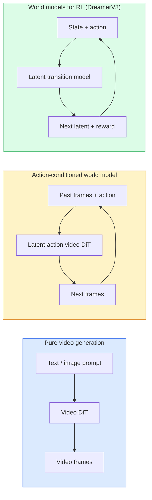

# النماذج العالمية وتوزيع الفيديو

> نموذج فيديو يتنبأ بالثواني القادمة من المشهد هو محاكاة العالم. تحديد ذلك التنبؤ على الإجراءات و لديك محرك لعبة تعلم.

> **【中文解读】**能够预测场景下来几秒的视频模型就是一个世界模拟器――将预测条件化为动作,就得到了一个学习的游戏引擎――世界模型是AI的前沿方向让AI理解物理世界的动态规律――

> **【拓展：世界模型的前沿】**سورة ((OpenAI) وGenie ((DeepMind) هي ممثلة للنموذج العالمي.

**Type:** Learn + Build | **类型:** 学习 + 动手
**Languages:** Python | **语言:** Python
**Prerequisites:** Phase 4 Lesson 10 (Diffusion), Phase 4 Lesson 12 (Video Understanding), Phase 4 Lesson 23 (DiT + Rectified Flow) | **前置知识:** Phase 4 Lesson 10（扩散模型），Phase 4 Lesson 12（视频理解），Phase 4 Lesson 23（DiT + 整流流）
**Time:** ~75 minutes | **时间:** ~75 分钟

## أهداف التعلم

- شرح الفرق بين نموذج توليد الفيديو النقي (Sora 2) ونموذج العالم المتحكم في العمل (Genie 3 ، DreamerV3)
- وصف فيديو DiT: معطيات الفضاء-الوقت، تشفير الموقف ثلاثي الأبعاد، الاهتمام المشترك عبر رموز (T، H، W)
- تتبع كيفية توصيل نموذج عالمي إلى الروبوتات: خطط VLM → نموذج الفيديو يحاكي → ديناميكيات عكسية تنبعث عن أفعال
- اختيار بين سورا 2، جني 3، رينواي GWM-1 العالمات، وان فيديو، وحنيوانفيديو للحصول على حالة استخدام معينة (فيديو إبداعي، سيم التفاعلي، التوليد الحكم الذاتي القيادة)

> **【中文解读】**يُدعى أهداف التعلم المفردة التي يجب أن تتحكم فيها بعد الانتهاء من الدورة.


## المشكلة المشكلة المشكلة

إنتاج الفيديو و نموذج العالم يتقارب في عام 2026. نموذج يمكنه توليد دقيقة متماسكة من الفيديو، تعلم، بطريقة ما، كيف يتحرك العالم: استمرارية الأشياء، الجاذبية، السببية، النمط. إذا قمت بتشريط ذلك التنبؤ على الإجراءات (مشي يساراً، فتح الباب) ، يصبح نموذج الفيديو محاكاة قابلة للتعلم يمكن استبدال محرك اللعبة، محاكاة القيادة، أو بيئة الروبوتات.

> 视频生成和世界建模于 2026年融合了──一个能生成一分钟连贯视频的模型在某种意义上学到了世界如何运动:物体持久性,重力,因果关系,风格──如果您在预测上以动作为条件 (((向左走、开门),视频模型就变成了一个可学习的模拟器,可以替代游戏引擎、驾驶模拟器或机器环境──

المراهنات ملموسة جيني 3 تولد بيئات قابلة للعب من صورة واحدة. "المساحة المقصودة "جي.إم.إيه-1 العالمات تقوم بتوليد مشاهد لا نهاية لها تنتج Sora 2 مقاطع فيديو طويلة الدقيقة مع صوت متزامن وطبيعة نموذجية. إنفيديا كوسمو-درايف ووايف غايا-2 و تسلا دريفينغ وورلد تولد مقاطع فيديو قيادة واقعية لمعلومات تدريب السيارات الذاتية. نموذج العالم يتولى بشكل هادئ التمثيل الفعلي للروبوتات

> 利害关系是具体的──Genie 3 从单张图像生成可玩环境──Runway GWM-1 Worlds 合成无限可探索场景──Sora 2 生成带同步音频和物理建模的分钟级视频──NVIDIA Cosmos-Drive、Wayve Gaia-2 和 Tesla DrivingWorld 为自动驾驶训练数据生成真实驾驶视频──世界模型范式然接管机器人的模拟到真实的──

هذه الدروس هي درسة "الصورة الكبيرة" للمرحلة 4. إنها تربط إنتاج الصور وفهم الفيديو والحكمة العاملة مع نمط الهندسة المعمارية التي يتحرك إليها البحث السائد.

> هذا الدراسة هي الدورة الرابعة من "المشهد الكامل"، والتي ستقوم بتوليد الصور والتفاهم في الفيديو والتفكير الذكي في الارتباط مع النمط الإنشائي المتوجه في البحث.

## المفهوم الأساسي

> **【中文解读】**هذا المقطع يعرض المفاهيم والنظريات الأساسية. فهم هذه المفاهيم هو شرط لتحقيق التنفيذ التالي، وكذلك النقاط المعرفة في المقابلة والممارسة التجريبية.


### ثلاث عائلات من النموذج العالمي



- **Sora 2**هو إنتاج الفيديو النقيّة المُشروط على الإشارات، لا يوجد واجهة عمل. لا يمكنك "توجيه"ها في منتصف التنفيذ.
  中文翻译:**Sora 2**هو مجرد إنتاج الفيديو، مشروط إلى النص.
- **Genie 3**،**GWM-1 Worlds**،**Mirage / Magica**النماذج العالمية المتحركة. إضافة الإجراءات الخفية من الفيديو الملاحظ، ثم تحديد التنبؤات الإطار المستقبلية على الإجراءات. التفاعلية  تضغط على المفاتيح أو تحريك الكاميرا والسينة تستجيب.
  中文翻译:**Genie 3**.**GWM-1 Worlds**.**Mirage / Magica**هو النموذج العالمي للتحرك المشترك. من المشاهد فيديو التخمين على الحركة المحتملة، ثم باستخدام الحركة المشتركة للتحقيق في المستقبل.
- **DreamerV3**وتتوقع عائلة النموذج العالمي الكلاسيكي RL في مساحة خفية مع تكييف العمل الصريح ، مدربة على إشارة مكافأة. أقل بصرية ؛ أكثر فائدة ل RL فعالة العينات.
  中文翻译:**DreamerV3**和经典 RL 世界模型家族在潜空间预测,带显式动作条件化,在奖励信号上训练;;视觉性较弱;对样本高效的RL更有用;;

### معمارة الفيديو

```
Video latent:          (C, T, H, W)
Patchify (spatial):    grid of P_h x P_w patches per frame
Patchify (temporal):   group P_t frames into a temporal patch
Resulting tokens:      (T / P_t) * (H / P_h) * (W / P_w) tokens
```

التشفير الموضعي هو 3D: إدخال مدير أو تعلم لكل إحداثيات (t، h، w).

- **Full joint** جميع الرموز الاحتياطية على جميع الرموز الاحتياطية. O ((N^2) مع الرموز الاحتياطية. محظور على مقاطع الفيديو الطويلة.
  中文翻译:**全联合**所有符号 注意所有符号──O(N^2)──对长视频不可行──
- **Divided** التناوب التناوبي (الموقف الفضائي نفسه عبر الزمن: `(H*W) * T^2`) والاهتمام بالمساحة (المساوية في الوقت، عبر الفضاء: `T * (H*W)^2`يستخدمها TimeSformer ومعظم المشاهد الفيديو
  中文翻译:**分离**交替时间注意力(同空间位置,跨时间) 和空间注意力(同时间步,跨空间) ――TimeSformer 和大多数视频 DiT 使用。
- **Window** نوافذ محلية في (t, h, w). يستخدمها فيديو سوين.
  中文翻译:**窗口**(t, h, w) 中的局部窗口──视频Swin 使用──

كل نموذج للتوزيع الفيديو لعام 2026 يستخدم أحد هذه الأنماط الثلاثة بالإضافة إلى تكييف AdaLN (الدرس 23) وتدفق المصلح.

> كل نموذج نشر الفيديو لعام 2026 يستخدم أحد هذه الأنماط الثلاثة، بالإضافة إلى إضافة إلى إضافة إضافة إضافة إضافة إضافة إضافة إضافة إضافة إضافة إضافة إضافة إضافة إضافة إضافة إضافة إضافة إضافة إضافة إضافة إضافة إضافة إضافة إضافة إضافة إضافة إضافة إضافة إضافة إضافة إضافة إضافة إضافة إضافة إضافة إضافة إضافة إضافة إضافة إضافة إضافة إضافة إضافة إضافة إضافة إضافة إضافة إضافة إضافة إضافة إضافة إضافة إضافة إضافة إضافة إضافة إضافة إضافة إضافة إضافة إضافة إضافة إضافة إضافة إضافة إضافة إضافة إضافة إضافة إضافة إضافة إضافة إضافة إضافة إضافة إضافة إضافة إضافة إضافة إضافة إضافة إضافة إضافة إضافة إضافة إضافة إضافة إضافة إضافة إضافة إضافة إضافة إضافة إضافة إضافة إضافة إضافة إضافة إضافة إضافة إضافة إضافة إضافة إضافة إضافة إضافة إضافة إضافة إضافة إضافة إضافة إضافة إضافة إضافة إضافة إضافة إضافة إضافة إضافة إضافة إضافة إضافة إضافة إضافة إضافة إضافة إضافة إضافة إضافة إضافة إض

### تكييف الإجراءات: نماذج عمل غامضة

العبقري يتعلم**latent action**في كل إطار من خلال التنبؤ التمييزي بالعمل بين زوج من الإطارات المتتالية. ثم يقوم مُشعّر النموذج بتشريع الإجراء المتخفّض المستنير  وليس على مفاتيح لوحة المفاتيح الصريحة. عند الإستنتاج، يمكن للمستخدم تحديد إجراء متخفّض (أو أخذ عينة من سابقة جديدة) ويولد النموذج الإطار التالي المتوافق مع هذا الإجراء.

سورا تخطي واجهة العمل بالكامل. مقياسها يتنبأ بالتعليمات التالية من رموز الزمن الفضائي السابقة. تحدد السرعة البدء؛ لا شيء يديرها في منتصف الجيل.

### الموافقة الجسدية

إصدار Sora 2 لعام 2026 يعلن صراحة **physical plausibility**: الوزن، والتوازن، استمرارية الكائن، السبب والنتيجة. يقاسه الفريق عن طريق درجات المثقلة المحددة يدوياً؛ يحسن النموذج بشكل واضح على الكائنات التي سقطت، والحروف التي اصطدمت، والفشل في الغرض (قفز مفقود) مقابل Sora 1.

لا تزال الموافقة هي النظام المهيمن للخلف. أشرطة الفيديو 2024-2025 التي تظهر أشخاص يأكلون سباجيتي أو يشربون من النظارات كشفت عن عدم وجود تمثيل كائن مستمر في النموذج. أشرطة 2026 (سورا 2 ، رينواي جين 5 ، HunyuanVideo) تقلل من هذه المواد ولكن لا تخلص منها.

### نماذج عالمية للقيادة الذاتية

نموذجات العالم القيادة تولد مشاهد طريق واقعية مشروطة على المسارات أو صناديق الحدود أو خرائط الملاحة. الاستخدام:

- **Cosmos-Drive-Dreams**(NVIDIA)  تولد دقائق من الفيديو القيادة للتدريب RL.
- **Gaia-2**(موجة)  تركيب المشهد المحدد عن المسار لتقييم السياسات.
- **DrivingWorld**(تيسلا)  يحاكي مختلف الطقس، وقت اليوم، ظروف المرور.
- **Vista**(بايت دانس)  رد فعل تركيب مشهد القيادة.

إنها تحل محل جمع بيانات عالية الثمن في العالم الحقيقي لحالات الزاوية  مشوار المشاة في الليل، التقاطعات الجليدية، أنواع المركبات غير العادية  التي تتطلب في غير ذلك ملايين الأميال من القيادة.

> لقد استبدلت هذه المعلومات من العالم الحقيقي المكلفة لتعامل مع الحدود: المشي في الليل يمر في طريق ثلج، ويتطلب السيارات غير العادية نوعاً ما، وإلا فستحتاج إلى قيادة ملايين الأميال.

### كومة الروبوتات: VLM + نموذج الفيديو + ديناميكية عكسية

حلقة الروبوتات الناشئة من ثلاثة مكونات:

> 新兴的三组件机器人循环:

1. **VLM**يُحلل الهدف ("تقط الكأس الحمراء") ، ويحدد تسلسلًا للعمل على مستوى عال.
   中文翻译:**VLM**解析目标 (("拿起红色杯子"),规划高层动作序列──
2. **Video generation model**يحاكي كيفية تنفيذ كل عمل  يتوقع الملاحظات N الإطارات في الأمام.
   中文翻译:**视频生成模型**模拟执行每动作后样子预测 N 后的观测──
3. **Inverse dynamics model**يستخرج القيود المتحركة الملموسة التي ستنتج هذه الملاحظات.
   中文翻译:**逆动力学模型**提取产生 these observations 提取产生 these observations 提取 these observations 提取 these observations 提取 these observations 提取 these observations 提取 these observations 提取 these observations 提取 these observations 提取 these observations 提取 these observations 提取 these observations 提取 these observations 提取 these observations 提取 these observations 提取 these observations 提取 these observations 提取 these observations 提取 these observations 提取 these observations 提取 these observations 提取 these observations 提取 these observations 提取 these observations 提取 these observations 提取 these observations 提取 these observations 提取 these observations 提取 these observations 提取 these observations 提取 these observations 提取 提取 提取 提取 提取 提取 提取 提取 提取 提取 提取 提取 提取 提取 提取 提取 提取 提取 提取 提取 提取 提取 提取 提取 提取 提取 提取 提取 提取 提取 提取 提取 提取 提取 提取 提取 提取 提取 提取 提取 提取 提 提 提取 提取 提 提 提 提 提 提 提 提 提 提 提 提 提 提 提 提 提 提 提 提 提 提 提 提 提 提 提 提 提 提 提 提 提 提 提 提 提 提 提 提 提 提 提 提 提 提 提 提 提 提 提 提 提 提 提 提 提 提 提 提 提 提 提 提 提 提 提 提 提 提 提 提 提 提 提 提 提 提 提 提 提 提 提 提 提 提 提 提 提 提 提 提 提 提 

هذا يحل محل تشكيل الجائزة و RL ثقيلة العينات. يقوم نموذج العالم بالتخيل؛ وتغلق الديناميكيات العكسية الحلقة على التفعيل. Genie Envisioner هي مثال واحد؛ العديد من مجموعات البحوث تتحرك على هذا الهيكل.

> هذا استبدل RL المكثفة للشكل والنموذج المكافأة.

### التقييم

- **Visual quality** FVD (Fréchet Video Distance) ، دراسات المستخدمين.
  中文翻译:**视觉质量**FVD(Fréchet 视频距离) 、用户研究。
- **Prompt alignment** درجة كليبس لكل إطار، تقييم على شكل VQA.
  中文翻译:**提示对齐** كل CLIPScore、VQA 风格评估──
- **Physical plausibility** تصنيف يدوي على مجموعة مقياسية (المقياس المقياس الداخلي لـ Sora 2، VBench).
  中文翻译:**物理合理性** 在基准套件上人工评分(سورة 2 内部基准、VBench)
- **Controllability**(لنموذجات العالم التفاعلية)  العمل → التواصل الملاحظ؛ هل يمكنك العودة إلى حالة سابقة؟
  中文翻译:**可控性**(交互式世界模型) 动作→观测一致性;能否回到前前的状态?

### نموذج المناظر الطبيعية في عام 2026

| Model | Use | Parameters | Output | License |
|-------|-----|------------|--------|---------|
| Sora 2 | text-to-video, audio | — | 1-min 1080p + audio | API only |
| Runway Gen-5 | text/image-to-video | — | 10s clips | API |
| Runway GWM-1 Worlds | interactive world | — | infinite 3D rollout | API |
| Genie 3 | interactive world from image | 11B+ | playable frames | research preview |
| Wan-Video 2.1 | open text-to-video | 14B | high-quality clips | non-commercial |
| HunyuanVideo | open text-to-video | 13B | 10s clips | permissive |
| Cosmos / Cosmos-Drive | autonomous driving sim | 7-14B | driving scenes | NVIDIA open |
| Magica / Mirage 2 | AI-native game engine | — | modifiable worlds | product |

> **【中文解读】**هذا المقطع من خلال الكود من الصفر لتحقيق الخوارزمية النووية. هذا النوع من "من الصفر" يمكن أن يساعد على فهم المبدأ الخلفي للإطار، عندما يواجهون مشكلة لن يتم تعقلها في الصندوق الأسود.

> **【拓展：工业部署中的视觉系统】**في التوزيع الصناعي الواقعي، تحتاج النموذج المرئي إلى النظر في التفكير في التأجيل، والنموذج الكبير، والجهاز الحدودي الملائمة وغيرها من المشاكل.

> **【拓展：数据标注与质量】** تأثير المهام المرئية يعتمد على جودة البيانات المعلنة.‬‬‬‬‬‬‬‬‬‬‬‬‬‬‬‬‬‬‬‬‬‬‬‬‬‬‬‬‬‬‬‬‬‬‬‬‬‬‬‬‬‬‬‬‬‬‬‬‬‬‬‬‬‬‬‬‬‬‬‬‬‬‬‬‬‬‬‬‬‬‬‬‬‬‬‬‬‬‬‬‬‬‬‬‬‬‬‬‬‬‬‬‬‬‬‬‬‬‬‬‬‬‬‬‬‬‬‬‬‬‬‬‬‬‬‬‬‬‬‬‬‬‬‬‬‬‬‬‬‬‬‬‬‬‬‬‬‬‬‬‬‬‬‬‬‬‬‬‬‬‬‬‬‬‬‬‬‬‬‬‬‬‬‬‬‬‬‬‬‬‬‬‬‬‬‬‬‬‬‬‬‬‬‬‬‬‬‬‬‬‬‬‬‬‬‬‬‬‬‬‬‬‬‬‬‬‬‬‬‬‬‬‬‬‬‬‬‬‬‬‬‬‬‬‬‬‬‬‬‬‬‬‬‬‬‬‬‬‬‬‬‬‬‬‬‬‬‬‬‬‬‬‬‬‬‬‬‬‬‬‬‬‬‬‬‬‬‬‬‬‬‬‬‬‬‬‬‬‬‬‬‬‬‬‬‬‬‬‬‬‬‬‬‬‬‬‬‬‬‬‬‬‬‬‬‬‬‬‬‬‬‬‬‬‬‬‬‬‬‬‬‬‬‬‬‬‬‬‬‬‬‬‬‬‬‬‬‬‬‬‬‬‬‬‬‬‬‬‬‬‬‬‬‬‬‬‬‬‬‬‬‬‬‬‬‬‬‬‬‬‬‬‬‬‬‬‬‬‬‬‬‬‬‬‬‬‬‬‬‬‬‬‬‬‬‬‬‬‬‬‬‬‬‬‬‬‬‬‬‬‬‬‬‬‬‬‬‬‬‬‬‬‬‬‬‬‬‬‬‬‬‬‬‬‬‬‬‬‬‬‬‬‬‬‬‬‬‬‬‬‬‬‬‬‬‬‬‬‬‬‬‬‬‬‬‬‬‬‬‬‬‬‬‬‬‬‬‬‬‬‬‬‬‬‬‬‬‬‬


## بناء ذلك تحرك لتحقيق
```figure
v4-world-rollout
```

## بناءها

### الخطوة 1: تصفح الفيديو ثلاثية الأبعاد

```python
import torch
import torch.nn as nn


class VideoPatch3D(nn.Module):
    def __init__(self, in_channels=4, dim=64, patch_t=2, patch_h=2, patch_w=2):
        super().__init__()
        self.proj = nn.Conv3d(
            in_channels, dim,
            kernel_size=(patch_t, patch_h, patch_w),
            stride=(patch_t, patch_h, patch_w),
        )
        self.patch_t = patch_t
        self.patch_h = patch_h
        self.patch_w = patch_w

    def forward(self, x):
        # x: (N, C, T, H, W)
        x = self.proj(x)
        n, c, t, h, w = x.shape
        tokens = x.reshape(n, c, t * h * w).transpose(1, 2)
        return tokens, (t, h, w)
```

محفظة ثلاثية الأبعاد مع خطوة مساوية للنواة تعمل كمسحوق فضائي-زمني. `(T, H, W) -> (T/2, H/2, W/2)`شبكة الرموز

### الخطوة 2: تشفير الموقف الدوري 3D

إرسال الموقف المتحرك (RoPE) يتم تطبيقه بشكل منفصل على طول `t`،`h`،`w`المحاور:

```python
def rope_3d(tokens, t_dim, h_dim, w_dim, grid):
    """
    tokens: (N, T*H*W, D)
    grid: (T, H, W) sizes
    t_dim + h_dim + w_dim == D
    """
    T, H, W = grid
    n, seq, d = tokens.shape
    if t_dim + h_dim + w_dim != d:
        raise ValueError(f"t_dim+h_dim+w_dim ({t_dim}+{h_dim}+{w_dim}) must equal D={d}")
    assert seq == T * H * W
    t_idx = torch.arange(T, device=tokens.device).repeat_interleave(H * W)
    h_idx = torch.arange(H, device=tokens.device).repeat_interleave(W).repeat(T)
    w_idx = torch.arange(W, device=tokens.device).repeat(T * H)
    # Simplified: just scale channels by frequencies. Real RoPE rotates pairs.
    freqs_t = torch.exp(-torch.log(torch.tensor(10000.0)) * torch.arange(t_dim // 2, device=tokens.device) / (t_dim // 2))
    freqs_h = torch.exp(-torch.log(torch.tensor(10000.0)) * torch.arange(h_dim // 2, device=tokens.device) / (h_dim // 2))
    freqs_w = torch.exp(-torch.log(torch.tensor(10000.0)) * torch.arange(w_dim // 2, device=tokens.device) / (w_dim // 2))
    emb_t = torch.cat([torch.sin(t_idx[:, None] * freqs_t), torch.cos(t_idx[:, None] * freqs_t)], dim=-1)
    emb_h = torch.cat([torch.sin(h_idx[:, None] * freqs_h), torch.cos(h_idx[:, None] * freqs_h)], dim=-1)
    emb_w = torch.cat([torch.sin(w_idx[:, None] * freqs_w), torch.cos(w_idx[:, None] * freqs_w)], dim=-1)
    return tokens + torch.cat([emb_t, emb_h, emb_w], dim=-1)
```

شكل مضيف مبسط. يدور ROPE الحقيقي القنوات المزدوجة عند الترددات. المعلومات الموضعية هي نفسها.

### الخطوة الثالثة: حظر الانتباه

```python
class DividedAttentionBlock(nn.Module):
    def __init__(self, dim=64, heads=2):
        super().__init__()
        self.time_attn = nn.MultiheadAttention(dim, heads, batch_first=True)
        self.space_attn = nn.MultiheadAttention(dim, heads, batch_first=True)
        self.ln1 = nn.LayerNorm(dim)
        self.ln2 = nn.LayerNorm(dim)
        self.ln3 = nn.LayerNorm(dim)
        self.mlp = nn.Sequential(nn.Linear(dim, 4 * dim), nn.GELU(), nn.Linear(4 * dim, dim))

    def forward(self, x, grid):
        T, H, W = grid
        n, seq, d = x.shape
        # time attention: same (h, w), across t
        xt = x.view(n, T, H * W, d).permute(0, 2, 1, 3).reshape(n * H * W, T, d)
        a, _ = self.time_attn(self.ln1(xt), self.ln1(xt), self.ln1(xt), need_weights=False)
        xt = (xt + a).reshape(n, H * W, T, d).permute(0, 2, 1, 3).reshape(n, seq, d)
        # space attention: same t, across (h, w)
        xs = xt.view(n, T, H * W, d).reshape(n * T, H * W, d)
        a, _ = self.space_attn(self.ln2(xs), self.ln2(xs), self.ln2(xs), need_weights=False)
        xs = (xs + a).reshape(n, T, H * W, d).reshape(n, seq, d)
        xs = xs + self.mlp(self.ln3(xs))
        return xs
```

الاهتمام بالوقت يصل داخل كل موقف فضائي عبر الزمن. الاهتمام بالمكان يصل داخل كل إطار عبر المواقع. عمليات O  T ^ 2 + (HW) ^ 2) بدلاً من O  THW) ^ 2). هذا هو جوهر TimeSformer وكل فيديو حديث DiT.

### الخطوة الرابعة: قم بتأليف مقطع فيديو صغير

```python
class TinyVideoDiT(nn.Module):
    def __init__(self, in_channels=4, dim=64, depth=2, heads=2):
        super().__init__()
        self.patch = VideoPatch3D(in_channels=in_channels, dim=dim, patch_t=2, patch_h=2, patch_w=2)
        self.blocks = nn.ModuleList([DividedAttentionBlock(dim, heads) for _ in range(depth)])
        self.out = nn.Linear(dim, in_channels * 2 * 2 * 2)

    def forward(self, x):
        tokens, grid = self.patch(x)
        for blk in self.blocks:
            tokens = blk(tokens, grid)
        return self.out(tokens), grid
```

ليس مولد فيديو يعمل، إنه عرض هيكلي يشكّل كل قطعة بشكل صحيح.

### الخطوة 5: تحقق من الأشكال

```python
vid = torch.randn(1, 4, 8, 16, 16)  # (N, C, T, H, W)
model = TinyVideoDiT()
out, grid = model(vid)
print(f"input  {tuple(vid.shape)}")
print(f"tokens grid {grid}")
print(f"output {tuple(out.shape)}")
```

انتظر`grid = (4, 8, 8)`و`out = (1, 256, 32)`بعد التشغيل، يُنشر الرأس بعد ذلك إلى تقطيعات مساحية زمنية محددة، جاهزة لتكون غير مُشغّلة مرة أخرى في فيديو.

> **【中文解读】**هذا المقال يوضح كيفية استخدام إطار متقدم مثل PyTorch、HuggingFace وغيرها) سريعة تطبيق هذه التقنية.


> **【拓展：视觉模型的持续学习】**في بيئة الإنتاج، يتطلب نموذج الرؤية التكيف المستمر مع البيانات الجديدة.

## استخدمها في إطار التنفيذ

أنماط وصول الإنتاج لعام 2026:

- **Sora 2 API**(OpenAI)  نص إلى الفيديو، صوت متزامن. أسعار مكافأة.
- **Runway Gen-5 / GWM-1**(مشاركة) الصورة إلى الفيديو، العوالم التفاعلية.
- **Wan-Video 2.1 / HunyuanVideo** مفتوح المصدر المضيف الذاتي.
- **Cosmos / Cosmos-Drive**(نفيديا)  قيادة محاكاة الوزن المفتوحة.
- **Genie 3** عرض مقدم للبحوث، طلب الوصول.

لبناء نموذج ديمو عالمي تفاعلي: ابدأ مع وان فيديو للجودة، وضع على مكيّف عمل غامض للتفاعل. لمحاكاة القيادة الذاتية: كوسموس-درايو هو مرجع مفتوح 2026 .

للروبوتات، الكبيرة في البرية:

> **【中文解读】**هذا المادة يركز على كيفية نشر النموذج كمنتج متاح. من النموذج الأصلي إلى النظام في مرحلة الإنتاج، تحتاج إلى النظر في العديد من الخصائص في تحسين الأداء والتعامل الخاطئ والتحكم.


1. هدف اللغة -> VLM (Qwen3-VL) -> خطة مستوى عالية.
2. خطة -> نموذج فيديو عمل غامض -> التنفيذ المتخيل.
3. الإطلاق -> نموذج الديناميكية المعاكسة -> إجراءات منخفضة المستوى.
4. الإجراءات التي تم تنفيذها -> الملاحظة التي تم إعادة إدخالها إلى الخطوة 1.


## أرسلها .

> **【中文解读】**练题按照易/中级/Hard 三个难度递进──建议至少完成 级级中级的题目,Hard 级适合深入研究或面试准备──


هذا الدرس ينتج عن:

- `outputs/prompt-video-model-picker.md` اختيارات بين Sora 2 / Runway / Wan / HunyuanVideo / Cosmos مع إعطاء المهمة والترخيص والتمدد.
- `outputs/skill-physical-plausibility-checks.md` مهارة تحدد التحققات الآلية (استمرارية الكائن والجاذبية والاستمرار) للعمل على أي فيديو تم إنشاؤه قبل الشحن.

## تمارين التدريب

1. **(Easy)**احسب عدد الرموز لفيديو 360p لمدة 5 ثوان عند اللمسة t=2, اللمسة h=8, اللمسة w=8.
2. **(Medium)**قم بتغيير كتلة الاهتمام المقسمة أعلاه للحصول على كتلة الاهتمام المشتركة الكاملة وقياس شكل وعدد المعلمات. شرح لماذا الاهتمام المقسم ضروري لنماذج الفيديو الحقيقية.
3. **(Hard)**بناء نموذج فيديو عمل غامض ضئيل: خذ مجموعة بيانات من (frame_t، action_t، frame_{t+1}) ثلاثية (أي لعبة 2D بسيطة) ، تدريب فيديو DiT صغير مشروط على إضافة العمل، وأظهر أن الإجراءات المختلفة تنتج إطارات مختلفة التالية.

> **【中文解读】**في لغة "ما يقوله الناس" مقابل "ما يعنيه في الواقع" تم التمييز بين لغة اليومية والتقنية المحددة.


## شروط الرئيسية

| Term | What people say | What it actually means |
|------|----------------|----------------------|
| World model | "Learned simulator" | A model that predicts future observations given state and action |
| Video DiT | "Spacetime transformer" | Diffusion transformer with 3D patchification and divided attention |
| Latent action | "Inferred control" | Discrete or continuous action latent inferred from frame pairs; used to condition next-frame generation |
| Divided attention | "Time then space" | Two attention operations per block — across time then across space — to keep O(N^2) manageable |
| Object permanence | "Things stay real" | Scene property that video models must learn; classic failure mode on food, glassware |
| FVD | "Fréchet Video Distance" | Video equivalent of FID; primary visual quality metric |
| Inverse dynamics model | "Observations to actions" | Given (state, next state), output the action that connects them; closes robotics loop |
| Cosmos-Drive | "NVIDIA driving sim" | Open-weights autonomous-driving world model for RL and evaluation |

> **【中文解读】**延伸阅读 يوفر موارد عالية الجودة للتعلم المتعمق.


## المزيد من القراءة

- [Sora technical report (OpenAI)](https://openai.com/index/video-generation-models-as-world-simulators/)
- [Genie: Generative Interactive Environments (Bruce et al., 2024)](https://arxiv.org/abs/2402.15391) نماذج عالم العمل الخفية
- [TimeSformer (Bertasius et al., 2021)](https://arxiv.org/abs/2102.05095) الاهتمام الموزع لتحولات الفيديو
- [DreamerV3 (Hafner et al., 2023)](https://arxiv.org/abs/2301.04104) نماذج عالمية لـ RL
- [Cosmos-Drive-Dreams (NVIDIA, 2025)](https://research.nvidia.com/labs/toronto-ai/cosmos-drive-dreams/) نموذج العالم للقيادة
- [Top 10 Video Generation Models 2026 (DataCamp)](https://www.datacamp.com/blog/top-video-generation-models)
- [From Video Generation to World Model — survey repo](https://github.com/ziqihuangg/Awesome-From-Video-Generation-to-World-Model/)
