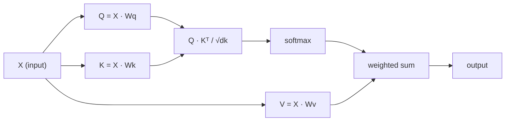

# الاهتمام الذاتي من الصفر
# التفكير من الصفر

> الانتباه هو جدول بحث حيث كل كلمة تسأل "من يهمني؟"

> الاهتمام هو جدول بحث، كل كلمة منها في سؤال "من هو المهم بالنسبة لي؟" ثم تعلمت الإجابة.

> **【中文解读】**الانتباه الذاتي هو جوهر Transformer: Q*K^T  حساب كل رمز على اهتمام الوهم الآخر. فهم Q/K/V هو فهم مباشرة GPT/BERT الأساس.

**Type:** Build | **类型:** 动手
**Language:**" بايثون "**语言:**بايثون
**Prerequisites:** Phase 3 (Deep Learning Core), Phase 5 Lesson 10 (Sequence-to-Sequence) | **前置知识:** 阶段 3（深度学习基础），阶段 5 第 10 课（序列到序列）
**Time:** ~90 minutes | **时间:** ~90 分钟

## أهداف التعلم

- تنفيذ الاهتمام الذاتي للمنتج النقطي على نطاق واسع من الصفر باستخدام NumPy فقط ، بما في ذلك استفسارات / مفتاح / تقديرات القيمة والجمع الموزن لـ softmax
  استخدام NumPy فقط من الصفر لتحقيق التكبير النقطة جمع نفس الاهتمام، بما في ذلك استفسار / مفتاح / قيمة الإلقاء والسلم
- بناء طبقة الاهتمام متعددة الرؤوس التي تقسم الرؤوس، وحساب الاهتمام المتوازي، وتجمع النتائج
  构建多头注意力层,实现头分分,并行注意力计算和结果拼接
- تتبع كيفية استيعاب ماتريكية الاهتمام علاقات رمزية وشرح لماذا تحديد النطاق ب sqrt(d_k) يمنع التشبث المكثف
   تتبع توجه矩阵 كيفية التقاط الرمز  علاقة,并 شرح لماذا عدا في مربع
- تطبيق التخفيض العوجي لتحويل الاهتمام الثنائي الاتجاه إلى الاهتمام التراجعي (على شكل المُعزل)
  应用因果掩码将双向注意力转换为自归归 (الجهاز)

## المشكلة المشكلة المشكلة

تقوم RNN بعملية تسلسلات رمز واحد في وقت واحد. بحلول الوقت الذي تصل فيه إلى رمز 50 ، تم ضغط المعلومات من رمز 1 من خلال 50 خطوة ضغط. يتم سحق الاعتمادات طويلة المدى إلى حالة مخفية ذات الحجم الثابت  عقدة زجاجة لا يحل أي كمية من إطار LSTM بالكامل.

> RNN  individual token  processing sequence  عندما تصل إلى 50 رمزاً، تم ضغط معلومات من الرمز الأول 50 مرة  التوقف الطويل على الضغط إلى حالة مخفية ثابتة كبيرة  هذه عبارة عن قنينة لا يمكن حلها بالكامل 

أظهرت ورقة الاهتمام في 2014 Bahdanau الإصلاح: دع المفكّر ينظر إلى الوراء في كل موقف من المشفّرات ويقرر أي منها مهم للخطوة الحالية. ولكنّها كانت لا تزال مقبّلة على RNN. طرح ورقة 2017 "الاهتمام هو كل ما تحتاجه" سؤالًا أكثر حيوية: ماذا لو كان الاهتمام هو الجهاز * الوحيد*؟ لا تكرار. لا تغير. فقط الاهتمام.

> أظهرت مقالة باهداينو للدقة في عام 2014 طريقة تعديل: جعل المُفَكِّر يتراجع عن كل مكانٍ من المُفَكِّر، ويقرر ما هي الخطوات المهمة للخطوات الحالية. ولكنّها لا تزال متضمنة في مقال "الاهتمام هو كل ما تحتاجه" في عام 2017، حيث طرحت سؤالًا أكثر حيوية: إذا كان الاهتمام هو الجهاز الوحيد؟ لا يوجد دورة.

الاهتمام الذاتي يسمح لكل موقع في تسلسل يراقب كل موقع آخر في خطوة متوازية واحدة. هذا ما يجعل المحولات سريعة، قابلة للتوسع، والسيطرة.

> يترك الاهتمام لكل موقع في الترتيب التركيز على جميع المواقع الأخرى في خطوة متوافقة واحدة. هذا هو السبب في أن Transformer يمكن أن يمتد بسرعة وتحكم في الموقع.

> **【中文解读】**نقل المعلومات من RNN مثل传话游戏经过多步后信息严重失真──Bahdanau 注意力让解码器"回头看" كل موقع من المعدات، ولكن لا يزال يعتمد على RNN──الثورة من المحولات هي: التخلي عن الدورة تماما، فقط باستخدام الاهتمام آلية واحدة── الاهتمام جعل كل موقع في الترتيب يمكن أن يتركز مباشرة على جميع المواقع الأخرى، خطوة إلى موقع──

## المفهوم الأساسي

### " تقارنة البحث في قاعدة البيانات "

فكر في الاهتمام كبحث بسيط في قاعدة البيانات:

> أن تكون الاهتمام تخيل كمدخلاً للبيانات

```
Traditional database:
  Query: "capital of France"  -->  exact match  -->  "Paris"

Attention:
  Query: "capital of France"  -->  similarity to ALL keys  -->  weighted blend of ALL values
```

كل رمز يخلق ثلاثة متجهات:
- **Query (Q)**"ما الذي أبحث عنه؟"
  **查询 (Query, Q)**"أنا في البحث عن ماذا؟"
- **Key (K)**"ما الذي يحتوي عليه؟"
  **键 (Key, K)**"ما الذي يحتوي عليه؟"
- **Value (V)**: "ما المعلومات التي أقدمها إذا تم اختيارها؟"
  **值 (Value, V)**"إذا تم اختياره، ما المعلومات التي سأقدمها؟"

إن نسبة النقاط بين استفسار وجميع المفاتيح تنتج نقاط الاهتمام. تعني النسبة العالية "تطابق هذه المفاتيح استفساري". هذه النقاط تزن القيم. الخروج هو مجموع مقيم من القيم.

> 查询与所有键的点积产生注意分数.高分意味着"هذا المفتاح يتناسب مع سؤالي".

> **【中文解读】**فمن خلال هذه المرحلة، يتم تحديد المعلومات التي تُستخدم في البحث عن المعلومات، والتي تُستخدم في البحث عن المعلومات، والتي تُستخدم في البحث عن المعلومات، والتي تُستخدم في البحث عن المعلومات.

> **【拓展：注意力机制在真实系统中的应用】**GPT 系列使用因果自注意力(每个代币只能看到前的代币);BERT 使用双向自注意力(每个代币 能看到所有代币);交叉注意力(Cross-Attention)则在T5、稳定扩散等模型中连接编码器和编码器──理解Q/K/V是理解所有这些变体的基础──

### Q، K، V الحسابات

كل إضافة رمزية يتم عرضها من خلال ثلاث ماتريصات وزن تعلم:

> كل رمز يُدرج من خلال ثلاث محورات للثقل للتصوير:

```
Input embeddings (sequence of n tokens, each d-dimensional):

  X = [x1, x2, x3, ..., xn]       shape: (n, d)

Three weight matrices:

  Wq  shape: (d, dk)
  Wk  shape: (d, dk)
  Wv  shape: (d, dv)

Projections:

  Q = X @ Wq    shape: (n, dk)      each token's query
  K = X @ Wk    shape: (n, dk)      each token's key
  V = X @ Wv    shape: (n, dv)      each token's value
```

بصرياً، لنقل:

> مباشرةً، بالنسبة لبرنامج:

```
             Wq
  x_i ------[*]------> q_i    "What am I looking for?"
       |
       |     Wk
       +----[*]------> k_i    "What do I contain?"
       |
       |     Wv
       +----[*]------> v_i    "What do I offer?"
```

### ماتريسكة الاهتمام

بمجرد أن يكون لديك Q، K، V لجميع الرموز، نقاط الاهتمام تشكل ماتريكس:

> بمجرد أن يكون لديك كل علامات Q K V، فان عدد الاهتمام يشكّل مُربعاً:

```
Scores = Q @ K^T    shape: (n, n)

              k1    k2    k3    k4    k5
        +-----+-----+-----+-----+-----+
   q1   | 2.1 | 0.3 | 0.1 | 0.8 | 0.2 |   <- how much q1 attends to each key
        +-----+-----+-----+-----+-----+
   q2   | 0.4 | 1.9 | 0.7 | 0.1 | 0.3 |
        +-----+-----+-----+-----+-----+
   q3   | 0.2 | 0.6 | 2.3 | 0.5 | 0.1 |
        +-----+-----+-----+-----+-----+
   q4   | 0.9 | 0.1 | 0.4 | 1.7 | 0.6 |
        +-----+-----+-----+-----+-----+
   q5   | 0.1 | 0.3 | 0.2 | 0.5 | 2.0 |
        +-----+-----+-----+-----+-----+

Each row: one token's attention over the entire sequence
```

### لماذا الحجم؟ لماذا التخفيض؟
شاهد استفسار واحد في كل مرة مسح المفاتيح: كل سطر يسجل كل رمز، softmax يحول النتائج إلى وزنه، و متجه السياق هو مزيج وزنه من القيم.

```figure
attention-matrix
```

### لماذا النطاق؟

إن منتجات النقاط تنمو مع الأبعاد dk. إذا dk = 64, يمكن أن تكون منتجات النقاط في نطاق العشرات، مما يدفع softmax إلى مناطق حيث تختفي التراجع.

> نقط积随维度 dk 增长──如果 dk = 64, نقط积可能在几十的范围内,将软max 推进梯度消失的区域──修复方法:除以平方(dk)──

```
Scaled scores = (Q @ K^T) / sqrt(dk)
```

هذا يبقي القيم في نطاق حيث softmax ينتج تراجعات مفيدة.

> هذا يجعل القيمة تحتفظ في حد ما يمكن أن تنتج درجة مفيدة.

> **【中文解读】**缩放因子 1/sqrt(dk) هو تفاصيل مهمة ولكن سهلة الاهتمام. عندما يكون الدرجة أكبر من الوقت، فإن قيمة النقاط تصبح كبيرة جداً، مما يؤدي إلى دخول 和区  输出接近 one-hot) ، والدرجة تقريباً إلى صفر.

### سوف تغير المعدلات إلى الوزن

تحويل Softmax النتائج الخام إلى توزيع الاحتمالات عبر كل سطر:

> سوف تقوم Softmax بتحويل عدد النقاط الأصلية إلى توزيع احتمالية لكل صف:

```
Raw scores for q1:   [2.1, 0.3, 0.1, 0.8, 0.2]
                            |
                         softmax
                            |
Attention weights:   [0.52, 0.09, 0.07, 0.14, 0.08]   (sums to ~1.0)
```

الآن كل رمز لديه مجموعة من الوزن تقول كم يجب أن يشاهد كل رمز آخر.

> الآن كل رمز لديه مجموعة من الوزن، يعبر عن درجة الاهتمام بالرمز الآخر.

> **【拓展：注意力矩阵的可解释性】**توجهات النظام (N×N) هي أداة مهمة في البحث عن تحويلات يمكن تفسيرها. من خلال التركيز على التركيز على التركيز، يمكن العثور على نموذج تعلمت من النموذج اللغوي: أيّة بين التركيزات لديها علاقة قوية. على سبيل المثال، فإن كلمة "إنها" عادة ما تكون مهتمة للغاية بإسمها.

### المجموع الموزن من القيم والمزيد من القيم

إن الخروج النهائي لكل رمز هو جمع موازن لجميع متجهات القيمة:

> كل رمز هو الناتج النهائي هو كل قيمة المتوسطات المضافة إلى الاحتمالات:

```
output_i = sum( attention_weight[i][j] * v_j  for all j )

For token 1:
  output_1 = 0.52 * v1 + 0.09 * v2 + 0.07 * v3 + 0.14 * v4 + 0.08 * v5
```

### خط الأنابيب الكامل



الصيغة في سطر واحد:

> واحد:

```
Attention(Q, K, V) = softmax( Q @ K^T / sqrt(dk) ) @ V
```

## بناء ذلك تحرك لتحقيق
```figure
softmax-attention-scaling
```

## بناءها

### الخطوة 1: Softmax من الصفر الخطوة 1: من الصفر لتحقيق Softmax

Softmax يحول اللغات الخام إلى احتمالات.

> سوف يعد Softmax المواقع الأصلية  تحويل إلى احتمالية  خفض القيمة القصوى لضمان استقرار القيمة العددية

```python
import numpy as np

def softmax(x):
    shifted = x - np.max(x, axis=-1, keepdims=True)
    exp_x = np.exp(shifted)
    return exp_x / np.sum(exp_x, axis=-1, keepdims=True)

logits = np.array([2.0, 1.0, 0.1])
print(f"logits:  {logits}")
print(f"softmax: {softmax(logits)}")
print(f"sum:     {softmax(logits).sum():.4f}")
```

### الخطوة الثانية: تحديد النقطة - منتج الاهتمام الخطوة الثانية: تكثيف الاهتمام

الوظيفة الأساسية تأخذ المصفوفات Q، K، V وتعيد خروج الاهتمام زائد المصفوفة الوزن.

> 核心函数──接收 Q、K、V 矩阵, 回归注意力输出和权重矩阵──

```python
def scaled_dot_product_attention(Q, K, V):
    dk = Q.shape[-1]
    scores = Q @ K.T / np.sqrt(dk)
    weights = softmax(scores)
    output = weights @ V
    return output, weights
```

### الخطوة الثالثة: دروس الانتباه الذاتي مع التنبؤات المتعلمة.

وحدة مراقبة الذات كاملة مع Wq، Wk، Wv المصفوفات الوزن باستخدام قياس كاسبير.

> واحد كاملة من وحدات الاهتمام الذاتي، يحتوي على Wq、Wk、Wv 权重矩阵، باستخدام Xavier 式缩放初始化──

```python
class SelfAttention:
    def __init__(self, d_model, dk, dv, seed=42):
        rng = np.random.default_rng(seed)
        scale = np.sqrt(2.0 / (d_model + dk))
        self.Wq = rng.normal(0, scale, (d_model, dk))
        self.Wk = rng.normal(0, scale, (d_model, dk))
        scale_v = np.sqrt(2.0 / (d_model + dv))
        self.Wv = rng.normal(0, scale_v, (d_model, dv))
        self.dk = dk

    def forward(self, X):
        Q = X @ self.Wq
        K = X @ self.Wk
        V = X @ self.Wv
        output, weights = scaled_dot_product_attention(Q, K, V)
        return output, weights
```

### الخطوة الرابعة: قم بتشغيله على جملة الخطوة الرابعة: قم بتشغيله على جملة

إخلق إضافة مزيفة لعبارة وشاهد التركيز

> للفصيلة إنشاء الاختراقات الزائفة، مراقبة الاهتمام

```python
sentence = ["The", "cat", "sat", "on", "the", "mat"]
n_tokens = len(sentence)
d_model = 8
dk = 4
dv = 4

rng = np.random.default_rng(42)
X = rng.normal(0, 1, (n_tokens, d_model))

attn = SelfAttention(d_model, dk, dv, seed=42)
output, weights = attn.forward(X)

print("Attention weights (each row: where that token looks):\n")
print(f"{'':>6}", end="")
for token in sentence:
    print(f"{token:>6}", end="")
print()

for i, token in enumerate(sentence):
    print(f"{token:>6}", end="")
    for j in range(n_tokens):
        w = weights[i][j]
        print(f"{w:6.3f}", end="")
    print()
```

### الخطوة 5: تخيل الاهتمام مع خريطة حرارة ASCII الخطوة 5: استخدام ASCII 热力图可视化注意力

خريطة أوزان الاهتمام إلى الشخصيات للحصول على رؤية سريعة.

> أن يتم إعادة تصوير الاهتمام إلى الأخطاء لتسريع التبصر.

```python
def ascii_heatmap(weights, tokens, chars=" ░▒▓█"):
    n = len(tokens)
    print(f"\n{'':>6}", end="")
    for t in tokens:
        print(f"{t:>6}", end="")
    print()

    for i in range(n):
        print(f"{tokens[i]:>6}", end="")
        for j in range(n):
            level = int(weights[i][j] * (len(chars) - 1) / weights.max())
            level = min(level, len(chars) - 1)
            print(f"{'  ' + chars[level] + '   '}", end="")
        print()

ascii_heatmap(weights, sentence)
```

## استخدمها في إطار التنفيذ

(بيتورش)`nn.MultiheadAttention`يفعل بالضبط ما بنيناه، بالإضافة إلى التقسيم متعدد الرؤوس والتنبيهات الخارجة:

> بيتورش `nn.MultiheadAttention`تم تحقيق المحتوى الذي قمنا ببناءه بالكامل، بالإضافة إلى العديد من التقسيمات والإصدارات المضربة:

```python
import torch
import torch.nn as nn

d_model = 8
n_heads = 2
seq_len = 6

mha = nn.MultiheadAttention(embed_dim=d_model, num_heads=n_heads, batch_first=True)

X_torch = torch.randn(1, seq_len, d_model)

output, attn_weights = mha(X_torch, X_torch, X_torch)

print(f"Input shape:            {X_torch.shape}")
print(f"Output shape:           {output.shape}")
print(f"Attention weight shape: {attn_weights.shape}")
print(f"\nAttn weights (averaged over heads):")
print(attn_weights[0].detach().numpy().round(3))
```

الفرق الرئيسي: توجه الرأس المتعدد يعمل على وظائف الاهتمام المتعددة بالتوازي ، كل منها مع توقعات Q ، K ، V الخاصة به من الحجم dk = d_model / n_heads ، ثم يجمع النتائج. وهذا يسمح للنموذج بالانتباه إلى أنواع العلاقة المختلفة في وقت واحد.

> 关键区别:多头注意力并行运行多头注意力函数, كل منها لديه Q、K、V 投影,大小为 dk = d_model / n_heads,然后拼接结果──这让模型能同时关注不同类型的关系──

> **【中文解读】**بيتورش `nn.MultiheadAttention`تغطية كل المنطق الذي ننجزه من الصفر، بالإضافة إلى التقسيم المتعدد والإخراج من الإضفاء على الصورة.

> **【拓展：多头注意力的生物学类比】**يمكن أن يتم تشبيه الاهتمام المتعدد في جهاز اختبار الخصائص المتعدد في طبقة المرئية. مثل أنواع مختلفة من العصب في منطقة V1 تتحقق على حدة أو اتجاه أو لون، تعلم الاهتمام المتعدد تعلم التقاط أنواع مختلفة من الرموز 间关系.

## أرسلها .

هذا الدرس ينتج عن:
- `outputs/prompt-attention-explainer.md` طلب لشرح الاهتمام من خلال تشبيه البحث في قاعدة البيانات

> 本课产生:
> - `outputs/prompt-attention-explainer.md`                                                                                                                                                                                                                                                              

## تمارين التدريب

1. تغيير`scaled_dot_product_attention`للاستقبال من ماتريكس القناع الاختياري الذي يضع بعض المواقع إلى اللانهاية السلبية قبل softmax (هكذا يعمل القناع السببية / المفكّر)
   修改 `scaled_dot_product_attention`في المقابل، يتم وضع بعض المواقع على نحو سلبي في المعدات المختارة.

2. تنفيذ الاهتمام متعدد الرؤوس من الصفر: تقسيم Q، K، V إلى `n_heads`قطع، تشغيل الاهتمام على كل واحد، وتقرب، ونشر من خلال المصفوفة الوزن النهائي
   من التحقق من الاهتمام المتعدد: 将 Q、K、V 拆分为 `n_heads`块,分别运行注意力,拼接,并通过最终权重矩阵 Wo 投影

3. خذ جملتين مختلفتين ذات الطول، ومدعها من خلال نفس مثال الاهتمام الذاتي، و قارن أنماط اهتمامهم. ما الذي يتغير؟ ما الذي يبقى نفسه؟
   خذ جملتين مختلفة ذات طول واحد، من خلال نفس مثال الاهتمام الذاتي، مقارنة نمط الاهتمام بينهما.

## شروط الرئيسية

| Term | What people say / 人们怎么说 | What it actually means / 实际含义 |
|------|------------------------------|----------------------------------|
| Query (Q) | "The question vector" / "问题向量" | A learned projection of the input that represents what information this token is looking for. 输入的学习投影，表示这个 token 在寻找什么信息。 |
| Key (K) | "The label vector" / "标签向量" | A learned projection that represents what information this token contains, matched against queries. 学习投影，表示这个 token 包含什么信息，与查询匹配。 |
| Value (V) | "The content vector" / "内容向量" | A learned projection carrying the actual information that gets aggregated based on attention scores. 学习投影，携带根据注意力分数聚合的实际信息。 |
| Scaled dot-product attention | "The attention formula" / "注意力公式" | softmax(QK^T / sqrt(dk)) @ V — scaling prevents softmax saturation in high dimensions. softmax(QK^T / sqrt(dk)) @ V — 缩放防止高维时 softmax 饱和。 |
| Self-attention | "The token looks at itself and others" / "token 看自己和其他 token" | Attention where Q, K, V all come from the same sequence, letting every position attend to every other position. Q、K、V 都来自同一序列的注意力，让每个位置关注所有其他位置。 |
| Attention weights | "How much focus" / "多少关注" | A probability distribution over positions, produced by softmax over scaled dot products. 位置上的概率分布，由缩放点积上的 softmax 产生。 |
| Multi-head attention | "Parallel attention" / "并行注意力" | Running multiple attention functions with different projections, then concatenating results for richer representations. 使用不同投影运行多个注意力函数，然后拼接结果以获得更丰富的表示。 |

## المزيد من القراءة

- [Attention Is All You Need (Vaswani et al., 2017)](https://arxiv.org/abs/1706.03762) ورق المحول الأصلي
  Vaswani 等人(2017)  原始 تحويلات 论文

- [The Illustrated Transformer (Jay Alammar)](https://jalammar.github.io/illustrated-transformer/) أفضل مشروع بصري من خلال الهندسة المعمارية الكاملة
  جي عالمار's可视化变压器  最佳完整架构可视化讲解

- [The Annotated Transformer (Harvard NLP)](https://nlp.seas.harvard.edu/annotated-transformer/) تنفيذ PyTorch خطًا بعد خطًا مع تفسيرات
  هارفارد NLP 注释版 المحول  逐行 PyTorch 实现与解释

> **【拓展：Flash Attention 与注意力优化】**標準自注意的 O(N^2) 内存开销是长序列处理的瓶──Flash Attention(2022) من خلال تقسيم الحسابات والتنسيقات الحسابية، في حالة عدم تغيير النتائج الرياضية سوف تقل تعقيد الاحتفاظ في O(N)──هذا في 128K من GPT-4 上下文窗口 وغيرها من التطبيقات الفعلية.
