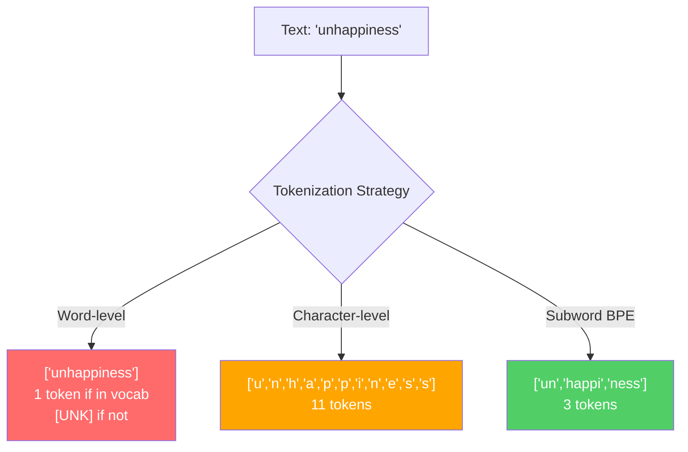
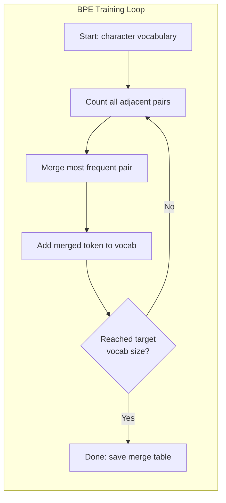
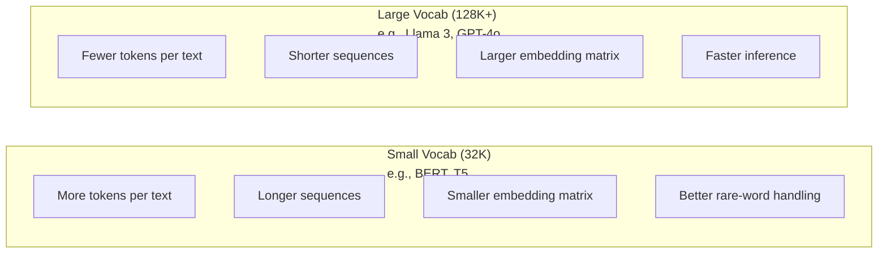

# الـ BPE، WordPiece، SentencePiece ‬ 分词器: BPE、WordPiece、SentencePiece

> ماجستيرك في العلوم لا يقرأ الإنجليزية، إنه يقرأ الأرقام الكاملة. الجهاز الذي يقرر ما إذا كانت تلك الأرقام الكاملة تحمل معنى أو تضيعها.

> **【中文解读】**LLM 不读英文,它读整数──分词器决定这些整数是有意义还是浪费──子词分词(符号化) بين كلمات وخطوط

> **【拓展：BPE→GPT系列】**جميع نماذج OpenAI ((GPT-2、GPT-3、GPT-4) تستخدم جميع BPE 分词器──tiktoken هي مجموعة GPT 系列分词器库──分词质量直接影响上下文窗口利用率"لسوء الحظ" 拆分4符号 مقابل 1符号,等于上下文窗口缩水 75%──

**Type:** Build
**Languages:** Python
**Prerequisites:** Phase 05 (NLP Foundations)
**Time:** ~90 minutes

## أهداف التعلم

- تنفيذ خوارزميات التكنولوجيا BPE و WordPiece و Unigram من الصفر ومقارنة استراتيجيات دمجها
  من التنفيذ من الصفر BPE、WordPiece 和 Unigram 分词算法، مقارنة استراتيجيات التجمع بينها
- شرح كيف يؤثر حجم المفردات على كفاءة النموذج: إنما تكون القليلة جداً تخلق تسلسلات طويلة، والنفايات الكبيرة جداً تضم ملامح
  解释词表大小 كيف يؤثر على كفاءة النموذج:
- تحليل أدوات التكنولوجيا عبر اللغات والرموز، وتحديد أين يتم تفكيك التكنولوجيا المحددة
  تحليل الحدود بين اللغات والكود، ومعرفة نقاط الفشل في الجهاز المحدد
- استخدم مكتبات الـ tiktoken و phrasepiece لتعريف النص وتفحص هويات الـ token الـ ID الناتجة
  استخدام تيكتون وقطع الجملة 库分词文本并检查生成的代币 ID

> **【中文解读】**أهداف تعلم هذا الفصل حول أربعة ابعاد من الجهاز: تنفيذ: رسم يدوي BPE / WordPiece / Unigram 算法) 、 فهم: 词表大小的工程权衡) 、 تحليل: 跨语言分词的边界情况) 、应用: 符号/句子 工具库) 、分词是LLM 管线的第一步,直接影响模型效率和成本──

## المشكلة المشكلة المشكلة

ماجستيرك في العلوم لا يقرأ الإنجليزية، لا يقرأ أي لغة، يقرأ الأرقام.

> بلغاتك لا تدرس بلغاتك لا تدرس بلغاتك لا تدرس بلغاتك لا تدرس بلغاتك لا تدرس بلغاتك لا تدرس بلغاتك لا تدرس بلغاتك لا تدرس بلغاتك لا تدرس بلغاتك لا تدرس بلغاتك لا تدرس بلغاتك لا تدرس بلغاتك لا تدرس بلغاتك لا تدرس بلغاتك لا تدرس بلغاتك لا تدرس بلغاتك لا تدرس بلغاتك لا تدرس بلغاتك لا تدرس بلغاتك لا تدرس بلغاتك لا تدرس بلغاتك لا تدرس

الفجوة بين "مرحباً، العالم!" و [15496, 11, 995, 0] هي الوهم. يجب تحويل كل كلمة، كل مساحة، كل علامة نقطة إلى عدد كامل قبل أن يتم معالجتها من قبل نموذج. هذا التحويل ليس محايداً. يخبز الافتراضات في النموذج التي لا يمكن إلغاءها في وقت لاحق.

> "مرحباً، العالم!" و[15496, 11, 995, 0] بين الجسر هو 分词器── كل كلمة、 كل فجوة、 كل علامة علامة 符号都必须转换为整数,模型才能处理── هذا التحويل ليس متوسطاً

إذا أخطأت في هذا النموذج، ستفقد القدرة على تشفير الكلمات المشتركة مع رموز متعددة. "لسوء الحظ" يصبح أربعة رموز بدلاً من واحدة. نافذة السياق الخاصة بك 128K فقط ضيق بنسبة 75% بالنسبة النص ثقيل في الكلمات متعددة الأحرف. إذا قمت بذلك بشكل صحيح، فإن نفس النافذة السياقية تحمل ضعف معنى. الفرق بين "هذا النموذج يتعامل مع الكود بشكل جيد" و "هذا النموذج يختنق على Python" غالبا ما يتراجع إلى كيفية تدريب الجهاز.

> فعل خطأ، نموذجك سوف يضيع القدرة على استخدام العديد من الرموز 编码常见词语──"لسوء الحظ" 变成四个令子而不是 واحد──你128K من النافذة العلوية للنص على متن متعدد الصوتات الكلمات كثيفة تم تقليصها مباشرة بنسبة 75%──做对对,同样上下文窗口可以下载两倍的信息──"هذا النموذج يعالج الرموز بشكل جيد" و"هذا النموذج في Python 上卡" التمييز، غالباً يعتمد على كيفية تدريب العاملات الكلمات──

كل مكالمة API تقوم بها إلى GPT-4 أو Claude يتم تسعيرها لكل رمز. كل رمز يولد نموذجك تكاليف الحساب. كلما قل عدد الرموز اللازمة لتمثيل إنتاج، كلما أسرع استنتاج نهاية إلى نهاية. التوكن ليس معالجة مسبقة. إنها معمارة.

> كل مرة تستخدم فيها GPT-4 أو API من كلود كانت حسب رمز 计费的── كل رمز تم إنشاؤه من نموذجك كانت تستخدم قوة حسابية── تعبر عن إصدار مطلوب من رمز 越少,端到端推理就越快──分词不是预处理── إنها بنية──

> **【中文解读】**分词 ليس مجرد خطوة سابقة للتعامل، بل جزء من بنية النموذج. كل مرة يتم استخدامها GPT-4 API تم حسب تكاليف الرموز، كل رمز من إنتاجها تم استهلاكها.

> **【拓展：API 定价与分词效率】**GPT-4o 的定价为 $5/M input tokens、$15 / M أوتوت توكنات. في نفس الصين، مع GPT-2 分词器 قد تستغرق 500 توكنات، مع GPT-4o o200k_base 分词器 تحتاج فقط إلى حوالي 200 توكنات، وتتباين التكلفة 2.5 倍. وهذا هو السبب في أن Llama 3 سوف تعزز تعريف الكلمات من 32K                                                                                                                                                                                                                                                                                                                                                                                                                                          

>  **【前置】**學本節前 يرجى التعلم أولاً: 1) المرحلة 05 (NLP أساسيات)  فهم المقالة من التقييمات表示、词嵌入基础; 2) Python 字典/Counter 与贪心算法实现模式; 3) UTF-8 编码、Unicode 码点(codepoint) و字节的关系; 4) 概率论基础频率统计与互信息──不熟悉这些会难理解 BPE 的合并据判──

## المفهوم الأساسي

### ثلاثة طرق فشلت (وواحدة فازت)

هناك ثلاثة طرق واضحة لتحويل النص إلى أرقام. اثنان منها لا تعمل على المقياس.

> هناك ثلاثة طرق واضحة لتحويل النص إلى رقم. اثنان منها لا يمكن أن تعمل في المشهد الكبير.

**Word-level tokenization**"القطة قامت" تصبح ["The"، "cat", "sat"]. بسيطة. لكن ماذا عن "التوكينيزة"؟ أو "GPT-4o"؟ أو كلمة مضافة ألمانية مثل "Geschwindigkeitsbegrenzung"? مستوى الكلمات يتطلب مخزونًا كبيرًا من المفردات لتغطية كل كلمة في كل لغة. تفوت كلمة وتصبح خائفاً`[UNK]`رمز -- طريقة النموذج للقول "لا أعرف ما هذا". الإنجليزية وحدها لديها أكثر من مليون شكل كلمة. أضف رمز، عناوين URL، علامة علمية، و 100 لغة أخرى و تحتاج إلى مخزون لغوي لا نهاية له.

> **词级分词**按空格和标点拆分──"القطة جلست" 变成 ["The", "cat", "sat"]──很简单──但"tokenization" هيه؟"GPT-4o" هيه؟ أو ال德语复合词 "Geschwindigkeitsbegrenzung" هيه؟`[UNK]`تُقال: "أنا لا أعرف تماماً ما هذا". في الإنجليزية فقط، هناك أكثر من مليون كلمة.

**Character-level tokenization**يذهب الاتجاه الآخر. "مرحبا" يصبح ["h"، "e"، "l"، "l"، "o"". المفردات صغيرة (بضع مئات من الأحرف). لا توجد رموز مجهولة أبدا. ولكن التسلسل تصبح طويلة للغاية. جملة التي ستكون رموز مستوى 10 كلمات تصبح رموز مستوى 50 حرف. يجب على النموذج أن يتعلم أن "t"، "h"، "e" معا تعني "ال" -- تحرق قدرة الاهتمام على شيء يتعلمه الإنسان في سن الثلاث سنوات.

> **字符级分词**走向另一个极端──"مرحبا" 变成 ["h", "e", "l", "l", "l", "o"]──词表很小(几百个字符)──永远不会出现未知符号──但序列变得极长──一个10个词级符号的句子变成50个字符级符号──模型必须学会 "t"、"h"、"e"组合起来是"把注意力容量浪费在人类三岁就学会的事情上──

**Subword tokenization**يجد النقطة الحلوة. الكلمات الشائعة تبقى كاملة: "ال" هو رمز واحد. الكلمات النادرة تتحلل إلى قطع ذات مغزى: "السوء" يصبح ["غير"، "حسن"، "نيس"]. الكلمات تبقى قابلة للتحكم (30K إلى 128K رموز). تتبقى التسلسل قصيرة. الرموز غير المعروفة تختفي في الأساس لأن أي كلمة يمكن بناءها من قطع من الكلمات الفرعية.

> **子词分词**وجدت أفضل نقطة توازن. تعريف الكلمات المعتادة للحفاظ على الكمال: "ال" هو رمز.

> **【中文解读】**词级分词) 词级分词) 词级分词) 词表爆炸英语有百万级词形,加上代码、URL、科学记数法和其他语言,词表会无限增长──字符级分词) 字符级分词) 字符级分词) 字符级分词) 字符级分词) 字符级分词) 字符级分词) 字符级分词) 字符级分词) 字符级分词) 字符级分词) 字符级分词) 字符级分词) 字符级分词) 字符级分词) 字符级分词) 字符级分词) 字符级分词) 字符级分词 (字符级分词) 字符级分词) 字符级分词 (字符级分词) 字符级分词 (字符级分词) 字符级分词 (字符级分词) 字符级分词 (字符级分词) 字符级分词 (字符级分词) 字符级分词 (字符级分词) 字符号 字符号 字符号 字符号 字符号 字符号 字符号 字符号 字符号 字符号 字符号 字符号 字符号 字符号 字符号 字符号 字符号 字符号 字符号 字符号 字符号 字符号 字符号 字符号 字符号 字符号 字符号 字符号 字符号 字符号 字符号 字符号 字符号 字 字符号 字符号 字 字符号 字 字 字 字 字 字 字 字 字 字 字 字 字 字 字 字 字 字 字 字 字 字 字 字 字 字 字 字 字 字 字 字 字 字 字 字 字 字 字 字 字 字 字

>  **【类比】**分词器像"乐高积木分类工厂":常见词("the") جعل إلى كامل كتلة كبيرة积木直接用,罕见词("不快乐") تفكيك "un"+"happy"+"ness" 三块标准小积木拼起来;;词级是只卖整块定制积木(漏货就崩),字符级是只卖单个原点(拼一句话要100个);;BPE是"高频组合自动包包成块",自适应找到成本与表达力的平衡点;;

كل ماجستير في العلوم الحديثة يستخدم رمزية كلمات فرعية. GPT-2، GPT-4، BERT، Llama 3، كلود -- كل منهم. السؤال هو أي خوارزمية.

> كل ماجستير في العلوم الحديثة 都使用子词分词──GPT-2、GPT-4、BERT、Llama 3、Claude全都如此──المشكلة تكمن في استخدام أي خوارزميات──



### BPE: تشفير زوج البايت

بيبي هو خوارزمية ضغط طموحة تم إعادة تطبيقها للتكنولوجيا. الفكرة بسيطة بما فيه الكفاية لتتناسب على بطاقة مؤشر.

> BPE هو طريقة إعادة استخدام لـ "شعر" من الجهاز.

ابدأ بأحرف فردية، احسب كل زوج مجاور في مجموعة التدريبات، دمج الزوج الأكثر شيوعاً في رمز جديد، كرر حتى تصل إلى حجم المفردات المستهدفة.

> من مجرد حرف يبدأ. تدريبات الإحصاء تعدد ظهور جميع الكلمات المجاورة للخطوط المجاورة.
```figure
tokenizer-bpe
```

هنا هي BPE تعمل على مجموعة صغيرة مع الكلمات "أدنى" "أدنى" و "أحدث":

```
Corpus (with word frequencies):
  "lower"  x5
  "lowest" x2
  "newest" x6

Step 0 -- Start with characters:
  l o w e r       (x5)
  l o w e s t     (x2)
  n e w e s t     (x6)

Step 1 -- Count adjacent pairs:
  (e,s): 8    (s,t): 8    (l,o): 7    (o,w): 7
  (w,e): 13   (e,r): 5    (n,e): 6    ...

Step 2 -- Merge most frequent pair (w,e) -> "we":
  l o we r        (x5)
  l o we s t      (x2)
  n e we s t      (x6)

Step 3 -- Recount and merge (e,s) -> "es":
  l o we r        (x5)
  l o we s t      (x2)    <- 'es' only forms from 'e'+'s', not 'we'+'s'
  n e we s t      (x6)    <- wait, the 'e' before 'we' and 's' after 'we'

Actually tracking this precisely:
  After "we" merge, remaining pairs:
  (l,o): 7   (o,we): 7   (we,r): 5   (we,s): 8
  (s,t): 8   (n,e): 6    (e,we): 6

Step 3 -- Merge (we,s) -> "wes" or (s,t) -> "st" (tied at 8, pick first):
  Merge (we,s) -> "wes":
  l o we r        (x5)
  l o wes t       (x2)
  n e wes t       (x6)

Step 4 -- Merge (wes,t) -> "west":
  l o we r        (x5)
  l o west        (x2)
  n e west        (x6)

...continue until target vocab size reached.
```

جدول المدمج هو رمز التشفير. لتشفير النص الجديد، قم بتطبيق المدمج في الترتيب الذي تعلمته. يحدد مجموعة التدريب التي توجد فيها المدمجات، ويتغير هذا الخيار بشكل دائم ما يراه النموذج.

> 合并表就是分词器──编码新文本时,按学习顺序应用合并──训练语料决定哪些合并存在,这个选择永久地塑造模型看到的内容──

> **【中文解读】**دورة التدريب الأساسية لـ BPE: بدءاً من حروف واحدة، والحصص على كل الأحرف المجاورة على ارتفاع تردد ظهورها، وسوف تكون أعلى تردد على التجمع إلى رمز جديد، والتكامل حتى تصل إلى هدف الكلمات表大小──合并表(المجموعة المدمجة) هي الاختلافات نفسها──编码新文本时, حسب التدريبات التالية التطبيقات التالية التالية التطبيقات  التسلسل مهم، لأن التجمع 1 قد يؤدي إلى "th"، والتكامل 5 تصل إلى "the" على أساس "th"+"e.

> **【拓展：BPE 的压缩原理】**كان BPE في البداية هو الخوارزمية العامة لضغط البيانات في عام 1994。 سنريتش 等人 في عام 2016 كان قد قدمها في مجال النلپ ‬‬‬‬‬‬‬‬‬‬‬‬‬‬‬‬‬‬‬‬‬‬‬‬‬‬‬‬‬‬‬‬‬‬‬‬‬‬‬‬‬‬‬‬‬‬‬‬‬‬‬‬‬‬‬‬‬‬‬‬‬‬‬‬‬‬‬‬‬‬‬‬‬‬‬‬‬‬‬‬‬‬‬‬‬‬‬‬‬‬‬‬‬‬‬‬‬‬‬‬‬‬‬‬‬‬‬‬‬‬‬‬‬‬‬‬‬‬‬‬‬‬‬‬‬‬‬‬‬‬‬‬‬‬‬‬‬‬‬‬‬‬‬‬‬‬‬‬‬‬‬‬‬‬‬‬‬‬‬‬‬‬‬‬‬‬‬‬‬‬‬‬‬‬‬‬‬‬‬‬‬‬‬‬‬‬‬‬‬‬‬‬‬‬‬‬‬‬‬‬‬‬‬‬‬‬‬‬‬‬‬‬‬‬‬‬‬‬‬‬‬‬‬‬‬‬‬‬‬‬‬‬‬‬‬‬‬‬‬‬‬‬‬‬‬‬‬‬‬‬‬‬‬‬‬‬‬‬‬‬‬‬‬‬‬‬‬‬‬‬‬‬‬‬‬‬‬‬‬‬‬‬‬‬‬‬‬‬‬‬‬‬‬‬‬‬‬‬‬‬‬‬‬‬‬‬‬‬‬‬‬‬‬‬‬‬‬‬‬‬‬‬‬‬‬‬‬‬‬‬‬‬‬‬‬‬‬‬‬‬‬‬‬‬‬‬‬‬‬‬‬‬‬‬‬‬‬‬‬‬‬‬‬‬‬‬‬‬‬‬‬‬‬‬‬‬‬‬‬‬‬‬‬‬‬‬‬‬‬‬‬‬‬‬‬‬‬‬‬‬‬‬‬‬‬‬‬‬‬‬‬‬‬‬‬‬‬‬‬‬‬‬‬‬‬‬‬‬‬‬‬‬‬‬‬‬‬‬‬‬‬‬‬‬‬‬‬‬‬‬‬‬‬‬‬‬‬‬‬‬‬‬‬‬‬‬‬

> ️ **【易错点】**手写 BPE 三个常见 bug: ((1) **忘了每次合并后重新计数** مباشرة في زوج الأول يعادل 上循环, مما يؤدي إلى المشاركة "نحن" 后还在旧频次选 (e,s), نتيجة المشاركة表全是噪声;(2) **合并顺序错乱**编码时必须按训练时学到的合并级 严格从低到高应用,先合并 "th" 再合并 "the",颠倒会得到完全不同的代币;(3) **未做预分词（pre-tokenization）** مباشرة على كل المواد، يظهر "e c" ((" القط" من بين跨词合并并) ، تدريب إلى رمز عبر كلمة بلا معنى──修复: باستخدام GPT-2 من الاصطلاحيات الأولى



### مستوى البايت BPE (GPT-2، GPT-3، GPT-4)

يعمل BPE القياسي على أحرف يونيكود. يعمل BPE على مستوى البايت على البايتات الخام (0-255). هذا يعطيك ذخيرة لفظية أساسية من بالضبط 256 ، يتعامل مع أي لغة أو تشفير ، ولا ينتج أية رمز مجهول.

> 标准 BPE 操作 Unicode 字符──字节级 BPE 操作原始字节(0-255)。 هذا يعطيك قائمة أساسية 256 كلمة، قادرة على معالجة أي لغة أو رمز، لن تولد أبداً رمز غير معروف‬‬‬‬‬‬‬‬‬‬‬‬‬‬‬‬‬‬‬‬‬‬‬‬‬‬‬‬‬‬‬‬‬‬‬‬‬‬‬‬‬‬‬‬‬‬‬‬‬‬‬‬‬‬‬‬‬‬‬‬‬‬‬‬‬‬‬‬‬‬‬‬‬‬‬‬‬‬‬‬‬‬‬‬‬‬‬‬‬‬‬‬‬‬‬‬‬‬‬‬‬‬‬‬‬‬‬‬‬‬‬‬‬‬‬‬‬‬‬‬‬‬‬‬‬‬‬‬‬‬‬‬‬‬‬‬‬‬‬‬‬‬‬‬‬‬‬‬‬‬‬‬‬‬‬‬‬‬‬‬‬‬‬‬‬‬‬‬‬‬‬‬‬‬‬‬‬‬‬‬‬‬‬‬‬‬‬‬‬‬‬‬‬‬‬‬‬‬‬‬‬‬‬‬‬‬‬‬‬‬‬‬‬‬‬‬‬‬‬‬‬‬‬‬‬‬‬‬‬‬‬‬‬‬‬‬‬‬‬‬‬‬‬‬‬‬‬‬‬‬‬‬‬‬‬‬‬‬‬‬‬‬‬‬‬‬‬‬‬‬‬‬‬‬‬‬‬‬‬‬‬‬‬‬‬‬‬‬‬‬‬‬‬‬‬‬‬‬‬‬‬‬‬‬‬‬‬‬‬‬‬‬‬‬‬‬‬‬‬‬‬‬‬‬‬‬‬‬‬‬‬‬‬‬‬‬‬‬‬‬‬‬‬‬‬‬‬‬‬‬‬‬‬‬‬‬‬‬‬‬‬‬‬‬‬‬‬‬‬‬‬‬‬‬‬‬‬‬‬‬‬‬‬‬‬‬‬‬‬‬‬‬‬‬‬‬‬‬‬‬‬‬‬‬‬‬‬‬‬‬‬‬‬‬‬‬‬‬‬‬‬‬‬‬‬‬‬‬‬‬‬‬‬‬‬‬‬‬‬‬‬‬‬‬‬‬‬‬‬‬‬

أطلقت GPT-2 هذا النهج. يغطي المفردات الأساسية كل بايت ممكن. يدمج BPE على أعلى ذلك. تقوم مكتبة تيكتون OpenAI بتنفيذ BPE على مستوى بايت مع هذه أحجام المفردات:

> أدى GPT-2 إلى إدخال هذه الطريقة. تعتمد الكلمات الأساسية على كل الكتب المحتملة. تم بناء BPE على ذلك. تم تحقيق كيبويت درجة BPE من خلال OpenAI. الكلمات الكبيرة هي:

> **【中文解读】**字节级 BPE(Byte-level BPE) هو إدخال GPT-2 关键创新──传统 BPE 操作 Unicode 字符,而字节级 BPE 直接操作原始字节(0-255),基础词表恰好 256 个,理论上可处理任何语言或编码,永远不会出现 [UNK] 代币──这就是为什么 GPT 系列模型能处理代码、emoji、多语言混合文本而不会"卡住"──

> 🤔 **【困惑】**س: لماذا هو ترتيب تركيب BPE مهم جدا؟ هل يمكن التدريب الجيد分词器能"修改"؟ أ: 合并顺序就是分词器的"程序"编码时必须严格按照训练时学到的级别从小到大应用:若级=5是"th",rank=100是"the",遇到"时先合成"th",再合成"the"――任意颠倒或单独跳过某步会产生不同的代币序列――生产中**不要修改合并表**، لأن إضافة النموذج 矩阵强绑定改一个代币的ID,模型会输出乱码──需要改变词表只能重训分词器 +重训模型嵌入──

- GPT-2: 50257 رمزا
- GPT-3.5/GPT-4: ~100،256 رمز (تشفير cl100k_base)
- GPT-4o: 200،019 رمز (o200k_base encoding)

### ورودبيس (BERT)

يبدو WordPiece مشابهًا لـ BPE ولكن الاختيارات تتضامن بشكل مختلف. بدلاً من التردد الخام، يزيد من احتمالات بيانات التدريب:

> يبدو WordPiece مشابهًا لـ BPE ، ولكن تختار طريقة مشتركة مختلفة.

```
BPE merge criterion:      count(A, B)
WordPiece merge criterion: count(AB) / (count(A) * count(B))
```

يسأل BPE: "أيهما يظهر أكثر في كثير من الأحيان؟" يسأل WordPiece: "أيهما يظهر معا أكثر من ما كنت تتوقع من العدفة؟" هذا الفرق الخفيف ينتج مفردات مختلفة. WordPiece يفضل الاندماج حيث يحدث التزامن بشكل مفاجئ، وليس فقط متكرر.

> BPE 问:"أين الصيغة الأكثر تكرارًا؟"WordPiece 问:"أين الصيغة الأكثر تكرارًا تتجاوز المتوقع؟" هذا الاختلاف الصغير يخلق صيغة مختلفة.

WordPiece يستخدم أيضاً إضافة "##" للكلمات الفرعية المتابعة:

> WordPiece أيضاً يستخدم "##" 前标记续接子词:

```
"unhappiness" -> ["un", "##happi", "##ness"]
"embedding"   -> ["em", "##bed", "##ding"]
```

يخبرك مقدمة "##" أن هذه القطعة تستمر في رمز سابق. يستخدم BERT WordPiece مع ذخيرة لغوية من 30،522 رمز. كل فاريان BERT - DistilBERT، روبرتا Tokenizer هو في الواقع BPE، ولكن BERT نفسها WordPiece.

> "##" 前告诉你这个片段续接前一个代币──BERT 使用 WordPiece,词表为 30,522 个代币──每个 BERT 变体DistilBERT,ROBERTA的分词器实际上是BPE,但BERT 本身是 WordPiece──

### جملة (لاما، T5)

تعامل SentencePiece المدخلات كدفق خام من أحرف يونيكود ، بما في ذلك الفضاء الأبيض. لا يوجد خطوة من قبل التوكن. لا توجد قواعد لغوية محددة حول حدود الكلمات. وهذا يجعلها لغوية جدًا - تعمل على اللغات الصينية واليابانية والتايلندية وغيرها من اللغات التي لا تفصل فيها الفضاء عن الكلمات.

> ستقوم SentencePiece بإدخالها على أنها 字符流 يونيكود الأصلي ، بما في ذلك空格.

يدعم SentencePiece خوارزميتين:

> جملة:

- **BPE mode**: نفس منطق الاندماج مثل BPE القياسية، تطبيق على تسلسلات الحروف الخام
  中文翻译:**BPE 模式**: معايير BPE مشابهة للمجموعة المرتبطة، تُستخدم في سلسلة الأحرف الأصلية
- **Unigram mode**يبدأ مع مجموعة كبيرة من المفردات ويزيل بشكل متكرر الرموز التي لا تؤثر على الاحتمال العام. عكس BPE -- التقط بدلا من الاندماج.
  中文翻译:**Unigram 模式**: من الكلمات الكبيرة تبدأ، 代移除对整体似然影响最小的符号──与 BPE 相反剪枝而非合并──

تطبق Llama 2 SentencePiece BPE مع ذخيرة لغوية من 32000 رمز. ت5 تستخدم SentencePiece Unigram مع 32000 رمز. ملاحظة: تم التبديل إلى رمز BPE على مستوى البايت القائم على التكوكين مع 128 256 رمز.

> علامة 2 استخدام جملةBPE، كلمة表为 32,000 个标签──T5 استخدام جملةPiece Unigram، كلمة表为 32,000 个标签──注意: علامة 3 切换到了基于TikToken的字节级 BPE 分词器,词表为 128,256 个标签──

> **【中文解读】**يتوقف الفريدة من نوعها على أنها تضع إدخالها كشكل أساسي من أشكال Unicode 字符流 (بما في ذلك الفراغ) ، لا تقوم بأي لغة من قبل.

> **【拓展：SentencePiece 在开源模型中的地位】**Google T5(110 مليار参数)、Llama 2(7B-70B)、Mistral 7B 等开源模型都使用SentencePiece。 ميزتها في عدم صلة اللغة مع واحد分词器 يمكن معالجة 100 + 种语言 بدون الحاجة إلى أي لغة محددة قواعد التجهيز.

### حجم الكلمات التجارة

هذا قرار هندسي حقيقي مع عواقب قابلة للقياس

> هذا قرار حقيقي للتحكم في النتائج القياسية



أرقام ملموسة. بالنسبة لمفرد 128K مع تضمينات 4,096 بعد، فإن ماتريكية تضمينها وحدها هي 128,000 × 4,096 = 524 مليون ملامح. بالنسبة لمفرد 32K، فإنه هو 131 مليون ملامح. وهذا هو فرق ملامح 400M عن اختيار الوهم وحده.

> 具体数字── بالنسبة إلى 128K 词表和 4,096 维嵌入, 仅嵌矩阵就有 128,000 x 4,096 = 5.24 مليار参数── بالنسبة إلى 32K 词表,则是1.31 مليار参数── 仅分词器选择就带来了4 مليار参数的差异──

لكن المفردات الكبيرة تضغط النص بشكل أكثر عدوانية. نفس الفقرة الإنجليزية التي تأخذ 100 رمزا مع مفردة 32K قد تأخذ 70 رمزا مع مفردة 128K. وهذا يعني 30% أقل من المشاركات المقدمة خلال توليد. بالنسبة لنموذج يخدم الملايين من الطلبات، وهذا هو خفض مباشر في تكلفة الحوسبة.

> ولكن الكلمات الأكبر أكثر فعالية ضغط النص. نفس المقطع الإنجليزي مع 32K الكلمات قد تحتاج إلى 100 رمز، مع 128K الكلمات قد تحتاج فقط إلى 70 رمز. وهذا يعني انخفاض 30% من الوقت المنتج إلى الأمام للتنشر.

الاتجاه واضح: حجم المفردات ينمو. GPT-2 استخدم 50.257. GPT-4 يستخدم ~ 100K. Llama 3 يستخدم 128K. GPT-4o يستخدم 200K.

> 趋势很明确:词表大小在增长──GPT-2 用 50,257──GPT-4 用约100K──Llama 3 用 128K──GPT-4o 用 200K──

| Model | Vocab Size | Tokenizer Type | Avg Tokens per English Word |
|-------|-----------|----------------|---------------------------|
| BERT | 30,522 | WordPiece | ~1.4 |
| GPT-2 | 50,257 | Byte-level BPE | ~1.3 |
| Llama 2 | 32,000 | SentencePiece BPE | ~1.4 |
| GPT-4 | ~100,256 | Byte-level BPE | ~1.2 |
| Llama 3 | 128,256 | Byte-level BPE (tiktoken) | ~1.1 |
| GPT-4o | 200,019 | Byte-level BPE | ~1.0 |

### الضريبة المتعددة اللغات

الـ Tokenizer المتدربون بشكل أساسي على اللغة الإنجليزية وحشيون بالنسبة للغات الأخرى. النص الكوري في Tokenizer GPT-2 يبلغ متوسط 2-3 رموز لكل كلمة. الصيني يمكن أن يكون أسوأ. وهذا يعني أن المستخدم الكوري لديه نافذة سياقية هي نصف حجم المستخدم الإنجليزي - يدفع نفس السعر مقابل كثافة المعلومات أقل.

> في اللغة الإنجليزية، يكون هذا الأمر صعبًا. في اللغة الإنجليزية، يكون متوسط الكلمات في كل كلمة من الكلمات في GPT-2 أقل من 2 إلى 3 علامات.

هذا هو السبب في أن Llama 3 قد ربع مرات مخزون الكلمات من 32K إلى 128K. المزيد من الرموز المخصصة لخطوط غير الإنجليزية يعني ضغط أكثر عدالة بين اللغات.

> هذا هو السبب في أن Llama 3 سوف تزيد من 32K إلى 128K.

> **【中文解读】**多语言税 (多语言税) هو مشكلة العدالة التي يسهل تجاهلها في تصميم العبارات. على سبيل المثال، في GPT-2 分词器، فإن متوسط الكلمات في كوريا الجنوبية تحتاج إلى 2-3 رموز، والصينية قد تكون أسوأ. وهذا يعني أن النافذة الفعالة للعملاء في كوريا الجنوبية/الصينية لا تدفع سوى نصف المستخدمين في كوريا الجنوبية، ولكن كثافة المعلومات التي يتم الحصول عليها أقل.

> **【拓展：多语言分词的实际影响】**في GPT-3.5 cl100k_base 分词器، فإن الفصل الصيني 1000 كلمة يحتاج إلى ~ 1500 رمز، بينما حجم المعلومات الإنجليزية قد يحتاج فقط ~ 500 رمز. وهذا يعني أن API المستخدم الصيني يصبح 3 مرات المستخدم الإنجليزي.

## بناء ذلك تحرك لتحقيق
```figure
tokenizer-tradeoff
```

## بناءها

### الخطوة الأولى: إشارة مستوى الشخصيات

تبدأ من الأساس. رمزية على مستوى الأحرف تقوم بتخريط كل حرف إلى نقطة رمز يونيكود. لا حاجة للتدريب. لا توكنات مجهولة. مجرد خريطة مباشرة.

> من البداية. . . . . . . . . . . . . . . . . . . . . . . . . . . . . . . . . . . . . . . . . . . . . . . . . . . . . . . . . . . . . . . . . . . . . . . . . . . . . . . . . . . . . . . . . . . . . . . . . . . . . . . . . . . . . . . . . . . . . . . . . . . . . . . . . . . . . . . . . . . . . . . . . . . . . . . . . . . . . . . . . . . . . . . . . . . . . . . . . . . . . . . . . . . . . . . . . . . . . . . . . . . . . . . . . . . . . . . . . . . . . . . . . . . . . . . . . . . . . . . . . . . . . . . . . . . . . . . . . . . . . . . . . . . . . . . . . . . . . . . . . . . . . . . . . . . . . . . . . . . . . . . . . . . . . . . . . . . . . . . . . . . . . . . . . . . . . . . . . . . . . . . . . . . . . . . . . . . . . . . . . . . . . . . . . . . . . . . . . . . . . . . . . . . . . . . . . . . . . . . . . . . . . . . . . . . . . . . . . . . . . . . . . . . . . . . . . . . . . . . . . . . . . . . . . . . . . . . . . . . . . . . . . . . . . . . . . . . . . . . . . . . . . . . . . . . . . . . . . . . . . . . . . .

```python
class CharTokenizer:
    def encode(self, text):
        return [ord(c) for c in text]

    def decode(self, tokens):
        return "".join(chr(t) for t in tokens)
```

"مرحباً" يصبح [104, 101, 108, 108, 111]. كل شخصية هي رمزها الخاص. هذه هي الخط الأساسي الذي نتحسن عليه.

> "مرحبا" 变成 [104, 101, 108, 108, 111].

### الخطوة 2: BPE Tokenizer من الصفر

التنفيذ الحقيقي. نحن نتدرب على البايتات الخام (مثل GPT-2) ، والعد أزواج، والدمج الأكثر تكرارا، وتسجيل كل دمج في الترتيب. الجدول دمج هو tokenizer.

> الواقع الحقيقي. نحن في التدريب على الخطوط الأصلية. مثل GPT-2، والحسابات على المعدلات، والانضمام إلى أعلى المعدلات، والانضمام إلى التسجيلات التلقائية.

```python
from collections import Counter

class BPETokenizer:
    def __init__(self):
        self.merges = {}
        self.vocab = {}

    def _get_pairs(self, tokens):
        pairs = Counter()
        for i in range(len(tokens) - 1):
            pairs[(tokens[i], tokens[i + 1])] += 1
        return pairs

    def _merge_pair(self, tokens, pair, new_token):
        merged = []
        i = 0
        while i < len(tokens):
            if i < len(tokens) - 1 and tokens[i] == pair[0] and tokens[i + 1] == pair[1]:
                merged.append(new_token)
                i += 2
            else:
                merged.append(tokens[i])
                i += 1
        return merged

    def train(self, text, num_merges):
        tokens = list(text.encode("utf-8"))
        self.vocab = {i: bytes([i]) for i in range(256)}

        for i in range(num_merges):
            pairs = self._get_pairs(tokens)
            if not pairs:
                break
            best_pair = max(pairs, key=pairs.get)
            new_token = 256 + i
            tokens = self._merge_pair(tokens, best_pair, new_token)
            self.merges[best_pair] = new_token
            self.vocab[new_token] = self.vocab[best_pair[0]] + self.vocab[best_pair[1]]

        return self

    def encode(self, text):
        tokens = list(text.encode("utf-8"))
        for pair, new_token in self.merges.items():
            tokens = self._merge_pair(tokens, pair, new_token)
        return tokens

    def decode(self, tokens):
        byte_sequence = b"".join(self.vocab[t] for t in tokens)
        return byte_sequence.decode("utf-8", errors="replace")
```

حلقة التدريب هي جوهر BPE: إعداد أزواج، دمج الفائز، تكرار. كل دمج يقلل من إجمالي عدد الرموز. بعد `num_merges`في الجولات، تنمو المفردات من 256 (بايت أساسي) إلى 256 + رقم_مدمج.

> دورة التدريب هي جوهر BPE:统计对频,合并胜者,重复──每次合并减少总代币 数──经过 `num_merges`轮后,词表 من 256(基础字节) تزداد إلى 256 + عدد_إندماجها

يطبق التشفير الاندماج في الترتيب الدقيق الذي تعلموه. هذا مهم. إذا تم إنشاء 1 من "th" والاندماج 5 من "the"، يجب أن يطبق التشفير الاندماج 1 أولا حتى يمكن أن تشكل "the" من "th" + "e" في الاندماج 5.

> 编码按学习的确顺序应用合并――这很重要―― إذا تم إنشاء "th" ، فإن "合并 5" قد تم إنشاء "the" ، يجب أن يتم أولاً تطبيق "the" 才能在合并 5 من خلال "th" + "e" 形成──

فك التشفير هو العكس: البحث عن كل رمز تعريف في المفردات، وتحديد الحزمة البايتز، فك التشفير إلى UTF-8.

> 解码是逆过程: 在词表中查找每个代币 ID,拼接字节,解码为 UTF-8──

### الخطوة 3: إشعار وتفكير رحلة ذهابًا وإيابًا

```python
corpus = (
    "The cat sat on the mat. The cat ate the rat. "
    "The dog sat on the log. The dog ate the frog. "
    "Natural language processing is the study of how computers "
    "understand and generate human language. "
    "Tokenization is the first step in any NLP pipeline."
)

tokenizer = BPETokenizer()
tokenizer.train(corpus, num_merges=40)

test_sentences = [
    "The cat sat on the mat.",
    "Natural language processing",
    "tokenization pipeline",
    "unhappiness",
]

for sentence in test_sentences:
    encoded = tokenizer.encode(sentence)
    decoded = tokenizer.decode(encoded)
    raw_bytes = len(sentence.encode("utf-8"))
    ratio = len(encoded) / raw_bytes
    print(f"'{sentence}'")
    print(f"  Tokens: {len(encoded)} (from {raw_bytes} bytes) -- ratio: {ratio:.2f}")
    print(f"  Roundtrip: {'PASS' if decoded == sentence else 'FAIL'}")
```

نسبة الضغط تخبرك بمدى فعالية الـ Tokenizer نسبة 0.50 تعني أن الـ Tokenizer قد ضغط النص إلى نصف عدد الـ Tokens كما في البايتات الخامة. أقل أفضل على التدريب، سيكون النسبة جيدة. على النص خارج التوزيع مثل "السوء" (الذي لا يظهر في الجسم) ، فإن النسبة ستكون أسوأ - الوسيط يعود إلى تشفير مستوى الأحرف للأنماط غير المرئية.

>                                                                                                                                                                                                                                                               

### الخطوة 4: مقارنة مع التكوكين

```python
import tiktoken

enc = tiktoken.get_encoding("cl100k_base")

texts = [
    "The cat sat on the mat.",
    "unhappiness",
    "Hello, world!",
    "def fibonacci(n): return n if n < 2 else fibonacci(n-1) + fibonacci(n-2)",
    "Geschwindigkeitsbegrenzung",
]

for text in texts:
    our_tokens = tokenizer.encode(text)
    tiktoken_tokens = enc.encode(text)
    tiktoken_pieces = [enc.decode([t]) for t in tiktoken_tokens]
    print(f"'{text}'")
    print(f"  Our BPE:   {len(our_tokens)} tokens")
    print(f"  tiktoken:  {len(tiktoken_tokens)} tokens -> {tiktoken_pieces}")
```

تيكتون تستخدم نفس الخوارزمية بالضبط ولكن تدرب على مئات الجيغابايت من النص مع 100،000 دمج. الخوارزمية هي نفسها. الفرق هو بيانات التدريب وعدد دمج. Tokenizer الخاص بك تدرب على الفقرة مع 40 دمج لا يمكن أن تتنافس مع 100K دمج تيكتون على مجموعة ضخمة. ولكن الآلية هي نفسها.

> تيكتون يستخدم نفس الخوارزمية تماما، ولكن على مئات المرات من المستندات تم تدريبها 100,000 مرة على المستندات المكونة من غيغابايت. الخوارزمية هي تماما. الفرق في تدريب البيانات والمرات المكونة من المستندات المكونة من المكونات المكونة من المكونات المكونة من المكونات المكونة من المكونات المكونة من المكونات المكونة من المكونات المكونة من المكونات المكونة من المكونات المكونة من المكونات المكونة من المكونات المكونة من المكونات المكونة من المكونات المكونة من المكونات المكونة من المكونات المكونة من المكونات المكونة من المكونات المكونة من المكونات المكونة من المكونات المكونة من المكونات المكونة من المكونات المكونة من المكونات المكونة من المكونات المكونة من المكونات المكونة من المكونات المكونة من المكونات، ولكن الجهاز هو نفسه.

### الخطوة 5: تحليل المفردات

```python
def analyze_vocabulary(tokenizer, test_texts):
    total_tokens = 0
    total_chars = 0
    token_usage = Counter()

    for text in test_texts:
        encoded = tokenizer.encode(text)
        total_tokens += len(encoded)
        total_chars += len(text)
        for t in encoded:
            token_usage[t] += 1

    print(f"Vocabulary size: {len(tokenizer.vocab)}")
    print(f"Total tokens across all texts: {total_tokens}")
    print(f"Total characters: {total_chars}")
    print(f"Avg tokens per character: {total_tokens / total_chars:.2f}")

    print(f"\nMost used tokens:")
    for token_id, count in token_usage.most_common(10):
        token_bytes = tokenizer.vocab[token_id]
        display = token_bytes.decode("utf-8", errors="replace")
        print(f"  Token {token_id:4d}: '{display}' (used {count} times)")

    unused = [t for t in tokenizer.vocab if t not in token_usage]
    print(f"\nUnused tokens: {len(unused)} out of {len(tokenizer.vocab)}")
```

هذا يكشف عن توزيع زيف في المفردات الخاصة بك. يهيمن عدد قليل من الرموز (المناطق، "ال" ، "إي"). غالبية الرموز نادرا ما تستخدم. تخصيصات الإنتاج تخصيص هذا التوزيع - النماذج الشائعة تحصل على أجهزة تعريف الرموز القصيرة، والأنماط النادرة تحصل على تمثيلات أطول.

> **【中文解读】**كشف تحليل الكلمات عن قاعدة Zipf: عدد قليل من الرموز يحتوي على معظم استخداماتها مثل空格、"the"、"e"), معظم الرموز يستخدمون قليلًا.

> **【拓展：生产环境的词表优化】**في GPT-4o ، تمتلك كلمات o200k_base 表 200،019 رمزًا ، ولكن أكثر الكلمات استخدامًا 1000 رمزًا تغطي تقارب 80% من ظهور المقالة الإنجليزية اليومية. في وقت التنفيذ في LLM ، تمت إضافة 矩阵的大小直接由词表决定:128K 表 x 4096 维 = 5.24 مليار عنصر ، فقط تمتلك الطبقة الإضافة حوالي 2GB 显存(FP16)。

## استخدمها في إطار التنفيذ

إنّ خربتك تعمل، الآن انظر كيف تبدو أدوات الإنتاج

> إنّك تستطيع أن تعمل على تحقيق النمو البيولوجيّ الآن، انظر كيف هي أدوات الإنتاج.

### تيكتون (OpenAI)

```python
import tiktoken

enc = tiktoken.get_encoding("cl100k_base")

text = "Tokenizers convert text to integers"
tokens = enc.encode(text)
print(f"Tokens: {tokens}")
print(f"Pieces: {[enc.decode([t]) for t in tokens]}")
print(f"Roundtrip: {enc.decode(tokens)}")
```

تكتوكين مكتوب في Rust مع Python التزامات. انها ترميز الملايين من الرموز في الثانية. نفس خوارزمية BPE، التنفيذ الصناعي القوة.

> تيكتون استخدام الروسط  كتابة وتقديم بيثون  ربطها.

### أجهزة إشارة للوجه

```python
from tokenizers import Tokenizer
from tokenizers.models import BPE
from tokenizers.trainers import BpeTrainer
from tokenizers.pre_tokenizers import ByteLevel

tokenizer = Tokenizer(BPE())
tokenizer.pre_tokenizer = ByteLevel()

trainer = BpeTrainer(vocab_size=1000, special_tokens=["<pad>", "<eos>", "<unk>"])
tokenizer.train(["corpus.txt"], trainer)

output = tokenizer.encode("The cat sat on the mat.")
print(f"Tokens: {output.tokens}")
print(f"IDs: {output.ids}")
```

مكتبة رمزية "تقبيل الوجه" هي أيضاً "رست تحت الغطاء" وهي تدرب "بي بي إي" على "جيبايت" على نطاق ثواني

> تعبئة الوجوه الوهمية 库底层也是 Rust. انها يمكن أن تدرب على BPE في غضون بضع ثوان على مستوى GB 语料.

### تحميل Tokenizer للاما

```python
from transformers import AutoTokenizer

tokenizer = AutoTokenizer.from_pretrained("meta-llama/Llama-3.1-8B")

text = "Tokenizers are the unsung heroes of LLMs"
tokens = tokenizer.encode(text)
print(f"Token IDs: {tokens}")
print(f"Tokens: {tokenizer.convert_ids_to_tokens(tokens)}")
print(f"Vocab size: {tokenizer.vocab_size}")

multilingual = ["Hello world", "Hola mundo", "Bonjour le monde"]
for text in multilingual:
    ids = tokenizer.encode(text)
    print(f"'{text}' -> {len(ids)} tokens")
```

قاموس 128K للاما 3 يضغط النص غير الإنجليزي بشكل أفضل بكثير من قاموس 50K ل GPT-2 يمكنك التحقق من هذا بنفسك - تشفير نفس الجملة في لغات متعددة ويعد الرموز.

> Llama 3 128K 词表缩写非英语文比 GPT-2 50K 词表好得多──你可以验证自己用多种语言编码同一个句子并计算代码数字──

## أرسلها .

هذا الدرس يُنتج`outputs/prompt-tokenizer-analyzer.md`-- طلب قابل للاستعمال الذي يحلل كفاءة إضفاء الطابع على أي تركيبة من النص والنموذج. إطعامها بعينة نص وتخبرك أي نموذج من النموذج إضفاء الطابع على أفضل.

> 本课产出 `outputs/prompt-tokenizer-analyzer.md` استنشاق قابل للنقل، تحليل كفاءة الكلمات في أي متن ومجموعة نموذجية.

## تمارين التدريب

1. تعديل رمز BPE لتطبيق المفردات في كل خطوة من مراحل الاندماج. شاهد كيف "t" + "h" تصبح "th"، ثم "th" + "e" تصبح "the". تتبع كيف يتم جمع الكلمات الإنجليزية الشائعة قطعةً بتتبعها.
   中文翻译:修改 BPE 分词器,在每次合并步骤打印词表──观察 "t" + "h" 如何变成 "th",然后 "th" + "e" 如何变成 "the"──追踪常见英文词汇如何被逐步组装──

2. إضافة رموز خاصة (`<pad>`،`<eos>`،`<unk>`) إلى رمز BPE. أعطي لهم هويات 0, 1, 2 و تحويل جميع الرموز الأخرى وفقا لذلك. تنفيذ خطوة قبل التوكن التي تقسم على الفضاء الأبيض قبل تشغيل BPE.
   中文翻译:向 BPE 分词器添加特殊令牌(`<pad>`.`<eos>`.`<unk>`)¬ تخصيص الهوية 0、1、2 并相应移动其他代币── تحقيق خطوة في تشغيل BPE

3. تنفيذ معايير دمج WordPiece (نسبة احتمال بدلا من تردد). تدريب كل من BPE و WordPiece على نفس الجسم مع نفس عدد من دمج. مقارنة المفردات الناتجة - أي واحد ينتج كلمات فرعية أكثر معنى لغويًا؟
   中文翻译:实现 WordPiece 合并标准(似然比替代频率) ―― على نفس اللغة باستخدام نفس المعدل من المرات تدريب BPE 和 WordPiece── مقارنة المنتجة الكلمات表

4. قم ببناء مقياس كفاءة التوكنيزر متعدد اللغات. خذ 10 جمل باللغة الإنجليزية والإسبانية والصينية والكورية والعربية. قم بتوكنيز كل منها باستخدام التوكن (cl100k_base) وقاس متوسط التوكنز لكل حرف. قم بتعيين "ضريبة متعددة اللغات" لكل لغة.
   中文翻译:构建多语言分词效率基准──取英文、西班牙文、中文、韩文和阿拉伯文各 10 个句子──用 tiktoken(cl100k_base)分词并测量每字符平均 token 数──量化每种语言的"多语言税"──

5. قم بتدريب رمز BPE الخاص بك على مجموعة أكبر (تنقل مقالة في فيكيبيديا). قم بتنسيق عدد المدمجات لتحقيق نسبة ضغط داخل 10% من التكوكين على نفس النص. هذا يضطرك إلى فهم العلاقة بين حجم الكوربوس ، ومعدل المدمج ، ونوعية الضغط.
   中文翻译:在更大的语料上训练 BPE 分词器(下载一篇维基百科文章) ――调整并次使压缩比在同一文本上与TikToken 相差不超过10%──这迫使你理解语料大小、合并次数和压缩质量之间的关系──

## شروط الرئيسية

| Term | What people say | What it actually means | 中文释义 |
|------|----------------|----------------------|---------|
| Token | "A word" | A unit in the model's vocabulary -- could be a character, subword, word, or multi-word chunk | 词元，模型词表中的基本单元 |
| BPE | "Some compression thing" | Byte Pair Encoding -- iteratively merge the most frequent adjacent pair of tokens until the target vocabulary size is reached | 字节对编码，贪心合并最高频相邻对 |
| WordPiece | "BERT's tokenizer" | Like BPE but merges maximize the likelihood ratio count(AB)/(count(A)*count(B)) instead of raw frequency | 基于似然比的子词分词，BERT 使用 |
| SentencePiece | "A tokenizer library" | A language-agnostic tokenizer that operates on raw Unicode without pre-tokenization, supporting BPE and Unigram algorithms | 语言无关的分词库，支持 BPE/Unigram |
| Vocabulary size | "How many words it knows" | The total number of unique tokens: GPT-2 has 50,257, BERT has 30,522, Llama 3 has 128,256 | 词表大小，直接影响嵌入矩阵参数量 |
| Fertility | "Not a tokenizer term" | Average number of tokens per word -- measures tokenizer efficiency across languages (1.0 is perfect, 3.0 means the model works three times harder) | 生育率，每词平均 token 数，衡量分词效率 |
| Byte-level BPE | "GPT's tokenizer" | BPE operating on raw bytes (0-255) instead of Unicode characters, guaranteeing no unknown tokens for any input | 字节级 BPE，基础词表恰好 256 个字节 |
| Merge table | "The tokenizer file" | Ordered list of pair merges learned during training -- this IS the tokenizer, and order matters | 合并表，训练学到的有序合并规则 |
| Pre-tokenization | "Splitting on spaces" | Rules applied before subword tokenization: whitespace splitting, digit separation, punctuation handling | 预分词，子词分词前的规则化拆分 |
| Compression ratio | "How efficient the tokenizer is" | Tokens produced divided by input bytes -- lower means better compression and faster inference | 压缩比，token 数/输入字节数，越低越好 |

## المزيد من القراءة

- [Sennrich et al., 2016 -- "Neural Machine Translation of Rare Words with Subword Units"](https://arxiv.org/abs/1508.07909)-- الورقة التي قدمت BPE لـ NLP، تحويل خوارزمية الضغط 1994 إلى أساس التكنولوجيا الحديثة
- [Kudo & Richardson, 2018 -- "SentencePiece: A simple and language independent subword tokenizer"](https://arxiv.org/abs/1808.06226)-- التكنولوجيا اللغوية التي جعلت النماذج متعددة اللغات عملية
- [OpenAI tiktoken repository](https://github.com/openai/tiktoken)-- إنتاج تنفيذ BPE في Rust مع Python التماس، تستخدم من قبل GPT-3.5/4/4o
- [Hugging Face Tokenizers documentation](https://huggingface.co/docs/tokenizers)-- تدريب على الجهاز التوجيهي للقيام بالإنتاج مع أداء Rust
