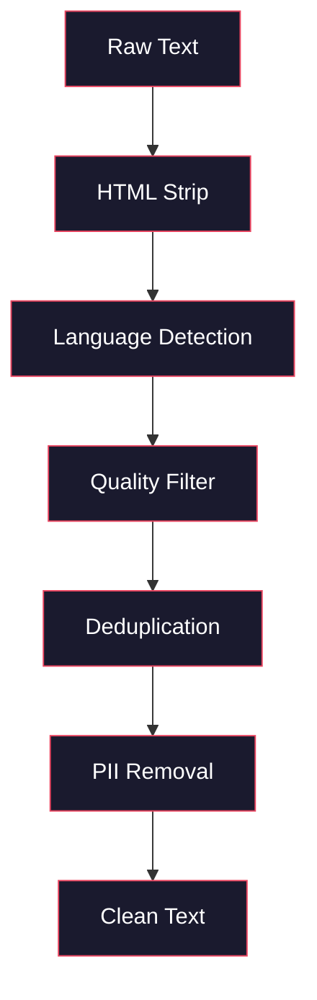
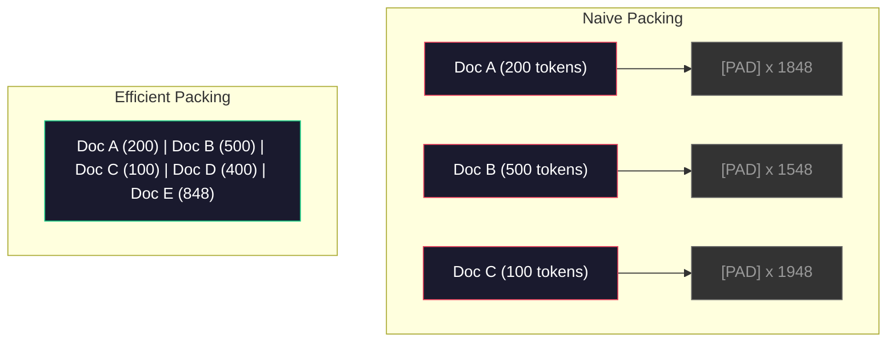

# أنابيب بيانات للتدريب المسبق

> النموذج هو مرآة، يعكس أي بيانات تُطعمها، يطعمها القمامة، يعكس القمامة بسلاسة تامة.

> **【中文解读】**النموذج هو مرآة، يعكس بشكل مخلص البيانات التي تعطيها.

> **【拓展：数据质量→GPT-4/Claude】**GPT-4 وClaude's عالية الجودة المخرجة من خط البيانات المصممة بعناية.

**Type:** Build
**Languages:** Python
**Prerequisites:** Phase 10, Lessons 01-02 (Tokenizers, Building a Tokenizer)
**Time:** ~90 minutes

## أهداف التعلم

- بناء خط أنابيب البيانات المتدفق التي تعبر عن علامات، قطع، مزج، وبطاقات من التيرا بايت من النص دون تحميل كل ذلك في الذاكرة
  构建流式数据管线,实现分词、分块、打乱和批处理, بدون الحاجة إلى تحميل كل شيء إلى الذاكرة
- تنفيذ مرشحات جودة البيانات (تخفيض النسخة، اكتشاف اللغة، تصفية المحتوى) المستخدمة في خطوط الأنابيب الحقيقية قبل التدريب
  实现真实预训练管线中使用的数据质量过器(去重、语言检测、内容过)
- إنشاء تسلسلات تدريبية ذات طول ثابتة مع أقنعة الاهتمام المناسبة ومعالجة الحدود الوثائقية
  إنشاء سلسلة تدريبية ذات الاهتمام الصحيح في تخفيض الحدود المستندية ومعالجة الحدود
- إنتاج خط الأنابيب الموضعي لضمان أن يحافظ محمول البيانات على سرعة تدريب GPU
  تحليل التشغيل، تأكد من سرعة تحميل البيانات تتوافق مع سرعة تدريب GPU

> **【中文解读】**هذا الدرس ركز على التدريبات المقبلة على أنبوب البيانات LLM  العوامل الحاسمة الحقيقية التي تحدد نوعية الانبوبات ‬‬‬‬‬‬‬‬‬‬‬‬‬‬‬‬‬‬‬‬‬‬‬‬‬‬‬‬‬‬‬‬‬‬‬‬‬‬‬‬‬‬‬‬‬‬‬‬‬‬‬‬‬‬‬‬‬‬‬‬‬‬‬‬‬‬‬‬‬‬‬‬‬‬‬‬‬‬‬‬‬‬‬‬‬‬‬‬‬‬‬‬‬‬‬‬‬‬‬‬‬‬‬‬‬‬‬‬‬‬‬‬‬‬‬‬‬‬‬‬‬‬‬‬‬‬‬‬‬‬‬‬‬‬‬‬‬‬‬‬‬‬‬‬‬‬‬‬‬‬‬‬‬‬‬‬‬‬‬‬‬‬‬‬‬‬‬‬‬‬‬‬‬‬‬‬‬‬‬‬‬‬‬‬‬‬‬‬‬‬‬‬‬‬‬‬‬‬‬‬‬‬‬‬‬‬‬‬‬‬‬‬‬‬‬‬‬‬‬‬‬‬‬‬‬‬‬‬‬‬‬‬‬‬‬‬‬‬‬‬‬‬‬‬‬‬‬‬‬‬‬‬‬‬‬‬‬‬‬‬‬‬‬‬‬‬‬‬‬‬‬‬‬‬‬‬‬‬‬‬‬‬‬‬‬‬‬‬‬‬‬‬‬‬‬‬‬‬‬‬‬‬‬‬‬‬‬‬‬‬‬‬‬‬‬‬‬‬‬‬‬‬‬‬‬‬‬‬‬‬‬‬‬‬‬‬‬‬‬‬‬‬‬‬‬‬‬‬‬‬‬‬‬‬‬‬‬‬‬‬‬‬‬‬‬‬‬‬‬‬‬‬‬‬‬‬‬‬‬‬‬‬‬‬‬‬‬‬‬‬‬‬‬‬‬‬‬‬‬‬‬‬‬‬‬‬‬‬‬‬‬‬‬‬‬‬‬‬‬‬‬‬‬‬‬‬‬‬‬‬‬‬‬‬‬‬‬‬‬‬‬‬‬‬‬‬‬‬‬‬‬‬‬‬‬‬‬‬‬‬‬‬‬‬‬‬

## المشكلة المشكلة المشكلة

لديك رمز، والآن تحتاج إلى بيانات

> لديك جهاز تعريف المعلومات الآن تحتاج إلى بيانات

ليس مجموعة بيانات، ليس ملف CSV، تيرابايت من النص -- نظف، نزع، تم تصفية الجودة، تم تدوينها إلى تسلسلات طويلة ثابتة، وتقديمها في مجموعات عشوائية بسرعة كافية حتى لا تنتظر مجموعة 8 جي بي يو في اللحظة التالية.

> ليس مجموعة بيانات، ليس ملفات CSV، عدد المواد التي تمت من خلال التنظيف والإزالة والجودة والحجم، والتي تمت من خلالها تقديم خدمات في مجموعات معينة، والتي تصل بسرعة إلى مجموعة البيانات الثمانية الجيبويتز التي لن تنتظر قطعة بيانات أخرى أبدا.

يعتقد معظم الناس أن تدريب ماجستير في العلوم الدراسية هو حول الهندسة المعمارية النموذجية. ليس كذلك. استخدم Llama 3 15.6 تريليون رمز. استخدم GPT-3 300 مليار. استخدم DeepSeek-V2 8.1 تريليون. الهندسة المعمارية في جميع الثلاثة هي تقريبا نفسها: كتلة المحولات المتداخلة مع الاهتمام والتغذية المستمرة الطبقات. الفرق في جودة الخروج تأتي بشكل كبير من البيانات.

> يعتبر معظم الناس أن تدريب LLM هو حول بنية النموذج. ليس من. لااما 3 استخدم 15.6 مليار توكن. GPT-3 استخدم 3000 مليار. DeepSeek-V2 استخدم 8.1 مليار.

ورقة (تشينشيلا) من (ديب ميند) جعلت هذا دقيقاً بالنسبة لحد معين من ميزانيات الحساب، هناك نسبة مثالية من المعلمات النموذجية إلى رموز التدريب. أظهرت تشينشيلا أن معظم النماذج في عام 2022 كانت غير قادرة بشكل كبير -- كانت لديها الكثير من المعلمات لمقدار البيانات التي رأوها. نموذج 70B المعلم المدرب على 1.4 تريليون رمز (Chinchilla-أفضل) أدى بأداء أفضل من نموذج 280B المدرب على 300 مليار رمز (Gopher).

> يوضح مقال Chinchilla في DeepMind هذا الأمر بوضوح. بالنسبة لحدد الميزانية الحسابية المحدد، هناك النسبة المثلى بين العناصر النموذجية والرموز التدريبية. تشينشيلا تشير إلى أن معظم النماذج في 2022 لا تمتد بشكل كبير.

إن خط البيانات الخاص بك يحدد ما إذا كان نموذجك يتعلم اللغة أو يتعلم الضوضاء.

> إنّ خط بياناتك يحدّد ما يتعلّم نموذجك عن اللغة أم الضوضاء.

> **【中文解读】**مقال Chinchilla 论文(DeepMind 2022) دليل: في ميزانية الحساب الثابتة، نموذج الحد والتربية رمزية عدد ينبغي أن يكون مساوية توسيعها.

> **【拓展：数据混合比的工程经验】**يُقال أن بيانات تدريبية لـ GPT-4 تحتوي على الكثير من الكودات (التحسين في القدرة على التفكير) والدراسات العلمية (التحسين في دقة الحقيقة) ، والنسبة لا يوجد لها عبارة قابلة للتطبيق، تعتمد بالكامل على التجارب والتقييمات.

>  **【前置】**学本节前 يرجى التعلم أولا:(1) المرحلة 10·01 和 02(分词器)  فهم رمز مع 字节流;(2) المرحلة 10·01 提到的Chinchilla مقياس القانون فهم الحجم مع عدد الرمز أفضل النسبة ؛(3) Python 生成器 / `IterableDataset`- لا ، لا`datasets.stream`流式处理范式;(4) MinHash + LSH 近似去重算法(不熟悉请先看Llama 3 / RefinedWeb 论文的相关章节)

## المفهوم الأساسي

### من أين تأتي البيانات

كل نموذج لغوي كبير يتم تدريبه على مزيج من المصادر. التركيب الدقيق هو سر محرص على الحفاظ على كثافة لمعظم المختبرات، ولكننا نعرف ما يكفي لفهم الفئات.

> كل نموذج لغة كبيرة يتم تدريبه على مصادر بيانات مختلطة. معظم المختبرات لديها سرية تشكيل محددة، ولكننا نعرف ما يكفي لفهم كل الفئات.

| Source | Size | Quality | Used By |
|--------|------|---------|---------|
| Common Crawl | ~250 TB raw | Low (needs heavy filtering) | GPT-3, Llama, most open models |
| Wikipedia | ~20 GB | High | Every major LLM |
| GitHub code | ~1 TB+ | Medium (lots of duplicates, dead code) | StarCoder, CodeLlama, DeepSeek-Coder |
| Books (BookCorpus, Pile) | ~100 GB | High | GPT-2, GPT-3, early models |
| Academic papers (arXiv, S2ORC) | ~100 GB | High for STEM | Llama, Galactica |
| StackOverflow, Reddit | ~100 GB | Medium | Llama, Falcon |
| Curated web (C4, RefinedWeb) | ~5 TB | Medium-High (pre-filtered) | T5, Falcon |

كشفت Llama 3 عن مزيج بياناتها: حوالي 50% من بيانات الويب ، 25٪ من الشفرة ، 13٪ من الكتب والأوراق الأكاديمية ، 8٪ من بيانات الرياضيات ، و 4٪ من بيانات الويب متعددة اللغات. كان إجمالي 15.6 تريليون رمز من مصادر تتجاوز 5 TB من النص الخام.

> علّم إلاما 3 نسبة توزيع بياناته: حوالي 50%  صفحات البيانات 25% 代码  13%  كتب وتقريرات علمية  8%  اعداد و شمار و 4%  صفحات البيانات متعددة اللغات  مجموع 15.6 مليار توكن، من أكثر من 5 طبيلا من مصادر البيانات في النص الأصلي 

النسبة مهمة بقدر الحجم الإجمالي. الكثير من البيانات على شبكة الإنترنت والنموذج يصبح طائر ريدت. ضئيل جدا من البرمجة ولا يمكن برمجتها. ضئيل جدا من الرياضيات وفشل في التفكير. الحصول على هذا المزيج بشكل صحيح هو أحد أصعب الأجزاء من تدريب ماجستير في العلوم العليا، وليس هناك صيغة -- يتطلب التجربة والتقييم.

> على سبيل المثال مع إجمالي الحجم هو أمر مهم جدا، والنموذج يصبح Reddit 🏼 代码 قليل جدا، فإنه لن يعد ‬ ‬ ‬ ‬ ‬ ‬ ‬ ‬ ‬ ‬ ‬ ‬ ‬ ‬ ‬ ‬ ‬ ‬ ‬ ‬ ‬ ‬ ‬ ‬ ‬ ‬ ‬ ‬ ‬ ‬ ‬ ‬ ‬ ‬ ‬ ‬ ‬ ‬ ‬ ‬ ‬ ‬ ‬ ‬ ‬ ‬ ‬ ‬ ‬ ‬ ‬ ‬ ‬ ‬ ‬ ‬ ‬ ‬ ‬ ‬ ‬ ‬ ‬ ‬ ‬ ‬ ‬ ‬ ‬ ‬ ‬ ‬ ‬ ‬ ‬ ‬ ‬ ‬ ‬ ‬ ‬ ‬ ‬ ‬ ‬ ‬ ‬ ‬ ‬ ‬ ‬ ‬ ‬ ‬ ‬ ‬ ‬ ‬ ‬ ‬ ‬ ‬ ‬ ‬ ‬ ‬ ‬ ‬ ‬ ‬ ‬ ‬ ‬ ‬ ‬ ‬ ‬ ‬ ‬ ‬ ‬ ‬ ‬ ‬ ‬ ‬ ‬ ‬ ‬ ‬ ‬ ‬ ‬ ‬ ‬ ‬ ‬ ‬ ‬ ‬ ‬ ‬ ‬ ‬ ‬ ‬ ‬ ‬ ‬ ‬ ‬ ‬ ‬ ‬ ‬ ‬ ‬ ‬ ‬ ‬ ‬ ‬ ‬ ‬ ‬ ‬ ‬ ‬ ‬ ‬ ‬ ‬ ‬ ‬ ‬ ‬ ‬ ‬ ‬ ‬ ‬ ‬ ‬ ‬ ‬ ‬ ‬ ‬ ‬ ‬ ‬ ‬ ‬ ‬ ‬ ‬ ‬ ‬ ‬ ‬ ‬ ‬ ‬ ‬ ‬ ‬ ‬ ‬ ‬ ‬ ‬ ‬ ‬ ‬ ‬ ‬ ‬ ‬ ‬ ‬ ‬ ‬ ‬ ‬ ‬ ‬ ‬ ‬ ‬ ‬ ‬ ‬ ‬ ‬ ‬ 

### تنظيف البيانات

البيانات الخام على شبكة الإنترنت قذرة.

> البيانات الصفحة البحرية المعتادة

- علامات HTML و JavaScript
  中文翻译:HTML 标签和 جاوا سكرفت
- أدوات التسجيلات
  中文翻译:样板页眉、页脚、导航菜单
- الصفحات المكررة (مكررة دقيقة و شبه المكررة)
  中文翻译:重复页面(精确和近似重复)
- الرسائل غير المرغوب فيها
  中文翻译: محتويات القمامة التي يولدها الآلة
- معلومات شخصية (PII)
  中文翻译:个人身份信息 (PII)
- النص منخفضة الجودة (قوائم الكلمات الرئيسية، رسائل غير مرغوب فيها في تحسينات المحتوى)
  中文翻译:低质量文本(关键词列表、SEO 垃圾)
- محتوى غير نصي مرموز كنصي
  中文翻译:编码为文本的非文本内容

تنظيف هذا ليس اختياريًا. إنه الفرق بين نموذج يخلق فقرات متماسكة ومن نموذج يخرج علامات HTML مختلطة بعلامات المنتجات.

> 清洗 ليس خيارا. هذا هو الفرق بين نموذج إنتاج المقطع المتسلسل والإصدار المختلط HTML علامات وموديل قائمة المنتجات.

>  **【类比】**اعداد و شمار خطوط مثل "مصنع السيارات المتعددة الدرجات": الماء الاولى ((مصنع السيارات المتعددة الدرجات)                                                                                                                                                                                                                                            



كل خطوة تُزيل فئة من الضوضاء:

> كل خطوة لإزالة نوع من الضوضاء:

**HTML stripping:**إزالة كل علامات. إبق فقط محتوى النص المرئي. المكتبات مثل `trafilatura`أو`readability`استخراج محتوى المقال بينما تتخلص من الملاحة والإعلانات واللواح.

> **HTML 剥离：**移除所有标记──只保留可见文本内容──`trafilatura`أو`readability`等库提取文章内容,同时丢弃导航、广告和样板──

**Language detection:**استخدم نموذج تحديد اللغة في fastText (lid.176.bin) لتصنيف كل وثيقة. قم بتصفية لغات المستهدف الخاصة بك. وثيقة تصنف كإنجليزية ذات ثقة أقل من 0.8 لا يمكن أن تكون إنجليزية نظيفة.

> **语言检测：**استخدام fastText 语言识别模型 (lid.176.bin) على كل ورقة من المواد المفصلة.

**Quality filtering:**هذا هو المكان الذي يصبح فيه الأمر مثيراً للاهتمام. يستخدم RefinedWeb (مجموعة البيانات وراء Falcon) مرشحًا مقيدًا على الارتباك: تدريب نموذج لغوي صغير على ويكيبيديا ، ثم تسجيل كل مستند. الارتباك العالي يعني أن الوثيقة تختلف عن ويكيبيديا - على الأرجح عن طريق البريد الإلكتروني ، أو قوائم الكلمات الرئيسية ، أو المحتوى الذي يولد به الآلة. يتم إزالة الوثائق التي تتجاوز حدًا.

> **质量过滤：**هذا هو الجزء المثير للاهتمام. ((WEB (((فالكون  خلفية المجموعة البيانية) باستخدام عداد من المواد القائمة على الاحتياجات: على ويكيبيديا على تدريب نموذج لغة صغيرة، ثم على كل مقالة تصنيف المستندات.

**Deduplication:**الخطوة الوحيدة الأكثر تأثيراً للتنظيف. يحتوي Common Crawl على عدد هائل من الصفحات المكررة - الإعلانات القانونية عن المسؤولية، إشعارات الكوكيز، شروط الخدمة. التدريب على المكررات يُفقد الحساب ويمكن أن يسبب نموذج التذكر والإعادة التأثير على المقاطع المحددة حرفياً.

> **去重：**影响最大的清洗步骤──Common Crawl 包含大量重复页面法律声明、cookie 通知、服务条款──在重复数据上训练浪费算力,也可能导致模型逐字记忆和复述特定段落──

**PII removal:**أسماء، عناوين البريد الإلكتروني، أرقام الهاتف، أرقام الضمان الاجتماعي، الكشف القائم على Regex لـ PII المهيكلة، نماذج NER لأسماء في السياق.

> **PII 移除：**姓名、电子邮件地址、电话号码、社会安全号码──结构化 PII 用正则检测,上下文中的姓名用 NER 模型──

> **【中文解读】**إن تنظيف البيانات هو أهم جزء من التدريبات المسبقة ولكن الأكثر أهمية. البيانات المنزلية مليئة بالضوضاء:HTML 标签、导航菜单、机器生成的SEO 垃圾、个人隐私信息(PII)。 تنظيف الأنابيب التالية التنفيذ:HTML 剥离 → 语言检测 → 质量过 → 去重 → PII 移除。RefinedWeb 使用困惑度过

> **【拓展：去重的工程影响】**لا يقتصر التدريب على إضافة الحسابات إلى إضافة القيمة إلى النقطة المحددة من الذكريات، وزيادة خطر الإفصاح عن الخصوصية.

> ️ **【易错点】**أربعة حفرة عادية:**整库加载进内存**`datasets.load_dataset("common_crawl", split="train")`默认会实例化  جميع رموز 15T، يجب أن OOM؛ يجب أن تستخدم `streaming=True`أو`IterableDataset`((2) **去重时把"高密度优质内容"误删**文档 A 包含整篇维基百科 (((5KB) ،文档 B 是只引用一句话的博客(500 字),MinHash 误判为高相似度──修复:在 shingle 之前对每篇文档归归一化长度,或对小文档用更保守的值;(3) **打包（pack）跨文档 attention 漏 mask**把3 篇短文拼拼进2048 رمز ولكن لا تضيف قناع حدود الوثائق، 1 末尾的符号会"看到" 2 开头的符号,造成跨文档污染;修复: باستخدام FlashAttention 的 `varlen`接口或 كتلة-القطعية قناع الاهتمام ؛(4) **配比（mix）在 epoch 间漂移**خلط 时按"文档级"而不是"token 级"采样,结果小文档被过度采样、大文档欠采样──

### التخفيض من المضاعفة مع MinHash

إن التخفيض الدقيق سهل: تتميز كل مستند، وإزالة النسخ المزدوجة. ولكن النسخ المزدوجة القريبة هي المشكلة الحقيقية. نسختان من نفس المقال الإخباري مع إعلانات مختلفة قليلا حولها هي النسخ المزدوجة القريبة. المحتوى هو 95٪ متطابقة، ولكن بايت مقابل بايت تختلفان.

> 精确去重很简单:对每篇文档哈希,移除重复──但近似重复才是真正的问题──两本复制的文章是真实的问题──但近似重复是不同的内容.

يحل "MinHash + Hashing Sensitive to Location" (LSH) هذا بشكل فعال.

> من هاش + 局部敏感哈希(LSH) 高效地 حل هذه المشكلة


الفكرة:

> 核心思想:

1. **Shingling:**تحويل كل وثيقة إلى مجموعة من n-جرام (مثل 5جرام من الكلمات أو الأحرف). "الرأس البني السريع" مع الشينغول 3 كلمات يصبح {"الرأس البني السريع" ، "الرأس البني السريع"}.
   中文翻译:**Shingling：**将每篇文档转换为一组 n-gram 集合(如5词或5字符的n-gram) ・・・"الرأس البني السريع" 用3词 shingle 变为 {"الرأس البني السريع" ، "الرأس البني السريع"}。

2. **MinHash:**لجميع مجموعة الشينجل لكل وثيقة، احسب قيم الهاش ك. كل قيمة الهاش هي الحد الأدنى من الهاش على جميع الشينجل تحت وظيفة الهاش مختلفة. هذا يخلق "توقيع" ذات الحجم الثابت الذي يقترب من تشابه جاكارد بين أي وثائقين.
   中文翻译:**MinHash：**على كل مستندات الشنجل 集合计算 k 个哈希值──每哈希值是所有شنجل 在不同哈希函数下最小哈希── هذا يخلق "توقيع" ثابت الحجم، تقريبا أي اثنين من الملفات جاكارد التشابه──

3. **LSH:**مجموعة الوثائق إلى علب بناء على فصائل من توقيعهم من MinHash. الوثائق في نفس العلبة هي مرشحين شبه المكرر. هذا يتجنب مقارنة كل زوج - يمكنك مقارنة المرشحين فقط.
   中文翻译:**LSH：**根据MinHash 签名条带将文档分组到桶中──文档在同一桶中的文档是候选人近似重复──这避免了两两比较只比较候选人对──

4. **Verify:**لكل زوج مرشح، احسب تشابه جاكارد الدقيق. إزالة نسخة واحدة إذا تجاوزت الشبيه عتبة (عادة 0.8).
   中文翻译:**验证：**لكل مرشح، حسابات دقيقة Jaccard شبيهة. إذا كان شبيهة يتجاوز  قيمة، عادة 0.8، إزالة نسخة واحدة.

أبلغ فريق إلاما عن إزالة حوالي 38% من بيانات الويب الخاصة بهم من خلال التخريب. هذا ليس عدداً صغيراً. أكثر من ثلث التصفحات المشتركة هو محتوى مزدوج أو شبه مزدوج.

> تم نقل إحصائيات النظام من خلال إعادة نقل حوالي 38٪ من بيانات الصفحة على الإنترنت. هذا ليس رقم صغير.

### إعداد التسلسل

نموذجك يتوقع تسلسل مدخل بطول ثابت وثائقك بطول متغير بعضها 50 رمزا بعضها 50 ألف رمزا

> نموذجك يتوقع تحديد مدة تسلسل إدخال.

نهج ساذج: وضع كل وثيقة على أقصى طول التسلسل. هذا يضيع حسابات هائلة على رموز التملئة التي لا تساهم في التعلم.

> طريقة بسيطة: إملأ كل ملف إلى أقصى طول الترتيب. هذا يضيع الكثير من الحسابات في المساهمة في إملء رمز الصفر.

نهج أفضل: إصطحاب وثائق متعددة في تسلسل واحد، منفصلة عن طريق رموز نهاية السلسلة. تسلسل 2048 رمزا قد تحتوي على ثلاث وثائق قصيرة متسلسلة مع رموز [EOS] بينها.

> أفضل طريقة:将多篇文档打包到单个序列中, باستخدام序列结束代币 分隔── 2048

> 🤔 **【困惑】**س: بما أن التعبئة تتلوث عبر الملفات، لماذا لا تستخدم التعبئة مباشرة؟多浪费点算力换正确性不是更稳定吗؟ ج: لأن التدريب التدريبي التدريبي باهظ جدا لاما 3  التدريب تكلفة تقدر بـ 100 مليار دولار.`cu_seqlens`أو الاهتمام بالجزء المقطع) دع البحث الأول  النهاية  نظرة غير إلى الثانية  المفتاح / القيمة‬‬‬‬‬‬‬‬‬‬‬‬‬‬‬‬‬‬‬‬‬‬‬‬‬‬‬‬‬‬‬‬‬‬‬‬‬‬‬‬‬‬‬‬‬‬‬‬‬‬‬‬‬‬‬‬‬‬‬‬‬‬‬‬‬‬‬‬‬‬‬‬‬‬‬‬‬‬‬‬‬‬‬‬‬‬‬‬‬‬‬‬‬‬‬‬‬‬‬‬‬‬‬‬‬‬‬‬‬‬‬‬‬‬‬‬‬‬‬‬‬‬‬‬‬‬‬‬‬‬‬‬‬‬‬‬‬‬‬‬‬‬‬‬‬‬‬‬‬‬‬‬‬‬‬‬‬‬‬‬‬‬‬‬‬‬‬‬‬‬‬‬‬‬‬‬‬‬‬‬‬‬‬‬‬‬‬‬‬‬‬‬‬‬‬‬‬‬‬‬‬‬‬‬‬‬‬‬‬‬‬‬‬‬‬‬‬‬‬‬‬‬‬‬‬‬‬‬‬‬‬‬‬‬‬‬‬‬‬‬‬‬‬‬‬‬‬‬‬‬‬‬‬‬‬‬‬‬‬‬‬‬‬‬‬‬‬‬‬‬‬‬‬‬‬‬‬‬‬‬‬‬‬‬‬‬‬‬‬‬‬‬‬‬‬‬‬‬‬‬‬‬‬‬‬‬‬‬‬‬‬‬‬‬‬‬‬‬‬‬‬‬‬‬‬‬‬‬‬‬‬‬‬‬‬‬‬‬‬‬‬‬‬‬‬‬‬‬‬‬‬‬‬‬‬‬‬‬‬‬‬‬‬‬‬‬‬‬‬‬‬‬‬‬‬‬‬‬‬‬‬‬‬‬‬‬‬‬‬‬‬‬‬‬‬‬‬‬‬‬‬‬‬‬‬‬‬‬‬‬‬‬‬‬‬‬‬‬‬‬‬‬‬‬‬‬‬‬‬‬‬‬‬‬‬‬‬‬‬‬‬‬‬‬‬‬‬‬‬‬‬‬‬‬‬‬‬‬‬‬‬‬‬‬‬‬‬‬‬‬‬‬‬‬‬‬



يجب أن يتم تعيين قناع الانتباه بشكل صحيح. لا ينبغي أن تلتحق الرموز من الوثيقة A مع الرموز من الوثيقة B ضمن نفس التسلسل المعبأة. وهذا يتطلب قناع الانتباه المكون من شكل كتلة.

> يجب أن يكون التركيز على التركيز على التركيز على التركيز على التركيز على التركيز على التركيز على التركيز على التركيز على التركيز على التركيز على التركيز على التركيز على التركيز على التركيز على التركيز على التركيز على التركيز على التركيز على التركيز على التركيز على التركيز على التركيز على التركيز على التركيز على التركيز على التركيز على التركيز على التركيز على التركيز على التركيز على التركيز على التركيز على التركيز على التركيز على التركيز على التركيز على التركيز على التركيز على التركيز على التركيز على التركيز على التركيز على التركيز على التركيز على التركيز على التركيز على التركيز على التركيز على التركيز على التركيز على التركيز على التركيز على التركيز على التركيز على التركيز على التركيز على التركيز على التركيز على التركيز على التركيز على التركيز على التركيز على التركيز على التركيز على التركيز على الجهة

يتم تقسيم الوثائق الطويلة أو تقسيمها إلى قطع عند حدود التسلسل. نقطة الانقسام مهمة: تقسيم منتصف الجملة يفرض على النموذج رؤية الأفكار غير الكاملة. بعض خطوط الأنابيب تتحسّن الانقسام إلى حدود الفقرة أو الجملة عند المستطاع.

> 长文档在序列边界处被切断或分分成块──分分点很重要:在句子中分断迫使模型看到不完整的思想──一些管线在可能时将分分点对齐到段落或句子边界──

> **【中文解读】**序列打包(Sequence Packing) هو سوف يتغير长文档填充到固定长度训练序列的技术──简单方法使用PAD 填充会浪费大量算力──高效方法将多个短文档使用 [EOS] 分隔拼拼接进同一序列,但需要块对角注意力掩码(块- Diagonal attention mask)文档 A的代币不应注意到同一序列中文档 B的代币──

> **【拓展：Chinchilla 定律与过度训练】**تشينشيلا 定律 يعتقد أن نموذج العناصر والتدريب رمزية عدد التوالي والنمو. ولكن نموذج 70B للاما 3 في 15T رموز التدريب على ارتفاع التدريبات (((المتفوق الأفضل حوالي 1.4T) ، وهذا هو "التفكير الأفضل" استراتيجية: تكلفة تدريب الكثير من النفقات هو مرة واحدة، ولكن أقل من تكلفة الخدمة نموذج خفض بشكل دائم.

### قانون تراكم تشينشيلا

بالنسبة لـ ميزانية الحساب الثابتة C (المقياسة في FLOP) ، فإن الحجم الأمثل لنموذج N وحجم مجموعة البيانات D يتبع:

> 对于固定的计算预算 C(以 FLOPs 衡量),最优模型大小N 和数据集大小D 遵循:

```
N_opt ~ C^0.5
D_opt ~ C^0.5
```

في الممارسة العملية، هذا يعني أنه يجب أن تقوم بتحديد حجم النموذج وحجم مجموعة البيانات بنفس القدر تقريبا. تحتاج النموذج الذي لديه 10 مرات أكثر من المعلمات إلى حوالي 10 مرات أكثر من رموز التدريب لتحقيق نفس الخسارة.

> في الممارسة العملية، هذا يعني أنه يجب أن تكون تقريباً على نطاق مساوي لتوسيع حجم النموذج والكتابات.

| Model | Parameters | Training Tokens | Chinchilla-Optimal? |
|-------|-----------|----------------|-------------------|
| GPT-3 | 175B | 300B | No (undertrained 3-4x) |
| Chinchilla | 70B | 1.4T | Yes (by design) |
| Llama 2 | 70B | 2T | Overtrained (intentionally) |
| Llama 3 | 70B | 15T | Heavily overtrained |

يخرق Llama 3 عمداً قانون تشينشيلا. وجد Meta أن التدريب الزائد على المزيد من البيانات - أبعد بكثير من نسبة الحساب الأمثل - ينتج نماذج أفضل للإستنتاج. يتم دفع تكلفة التدريب الإضافية مرة واحدة ، ولكن النموذج الأصغر أرخص للاستمرار. يطلق على هذا في بعض الأحيان على نهج التوسع "الإستنتاج الأمثل" ، وقد أصبح معيار الصناعة منذ عام 2024.

> لاما 3 عمداً خرق قانون تشينشيلا. اكتشاف الميثا أن استخدام المزيد من البيانات المفرطة للتدريب على التوجهات المفرطة يمكن أن يؤدي إلى نتائج أفضل من النموذج. تكلفة التدريب الإضافية تدفع مرة واحدة فقط، ولكن النموذج الأصغر دائمًا يكون أكثر便宜ًا في الخدمة. هذا ما يُسمى أحياناً "أفضل طريقة للتدريب" التميزية، وقد أصبح معيارًا في الصناعة منذ عام 2024.

## بناء ذلك تحرك لتحقيق
```figure
l5-data-pipeline
```

## بناءها

### الخطوة الأولى: تنظيف النص

قم بتخريج HTML، وتطبيع الفضاء الأبيض، وإزالة المحتوى غير النصي. سنستخدم نصًا في المجال العام (مشروع غوتينبرغ) كجزء صغير من الكتب.

> 剥离 HTML、归一化空白、移除文本内容──我们将使用公共领域文本(古堡计划) كمكونات صغيرة

```python
import re

def clean_text(text):
    text = re.sub(r"<[^>]+>", "", text)
    text = re.sub(r"http\S+", "", text)
    text = re.sub(r"[^\x20-\x7E\n]", "", text)
    text = re.sub(r"\n{3,}", "\n\n", text)
    text = re.sub(r" {2,}", " ", text)
    return text.strip()

def quality_filter(text, min_words=50, max_ratio_caps=0.3, max_ratio_special=0.1):
    words = text.split()
    if len(words) < min_words:
        return False
    caps_ratio = sum(1 for w in words if w.isupper()) / len(words)
    if caps_ratio > max_ratio_caps:
        return False
    special_chars = sum(1 for c in text if not c.isalnum() and not c.isspace())
    if special_chars / max(len(text), 1) > max_ratio_special:
        return False
    return True
```

تصفية الجودة تساعد على اكتشاف البريد الإلكتروني (كل الكابس) ، والضوضاء التي تولدها الآلة (نسبة كبيرة من الأحرف الخاصة) ، والصفحات القصيرة جدا. هذه التحققات الثلاثة وحدها تخرج كمية مفاجئة من القمامة من التفتيش على شبكة الإنترنت.

> 质量过器捕获 SEO 垃圾(全大写) 机器生成的噪音(高特殊字符比例) 和存根页面(太短) 

### الخطوة الثانية: تخفيض عدد من ميني هاش

تنفيذ MinHash من الصفر لا توجد مكتبات خارجية مطلوبة فقط`hashlib`. . .

> من التنفيذ من هاش.`hashlib`.

```python
import hashlib
from collections import defaultdict

def get_shingles(text, k=5):
    words = text.lower().split()
    if len(words) < k:
        return set()
    return {" ".join(words[i:i+k]) for i in range(len(words) - k + 1)}

def minhash_signature(shingles, num_hashes=128):
    signature = []
    for i in range(num_hashes):
        min_hash = float("inf")
        for shingle in shingles:
            h = int(hashlib.sha256(f"{i}:{shingle}".encode()).hexdigest(), 16)
            min_hash = min(min_hash, h)
        signature.append(min_hash)
    return signature

def lsh_buckets(signature, bands=16):
    rows_per_band = len(signature) // bands
    buckets = []
    for b in range(bands):
        start = b * rows_per_band
        band_data = tuple(signature[start:start + rows_per_band])
        bucket_hash = hashlib.md5(str(band_data).encode()).hexdigest()
        buckets.append((b, bucket_hash))
    return buckets

def deduplicate(documents, threshold=0.8, num_hashes=128, bands=16):
    signatures = []
    shingle_sets = []
    for doc in documents:
        shingles = get_shingles(doc)
        shingle_sets.append(shingles)
        signatures.append(minhash_signature(shingles, num_hashes))

    bucket_map = defaultdict(list)
    for doc_idx, sig in enumerate(signatures):
        for band_id, bucket_hash in lsh_buckets(sig, bands):
            bucket_map[(band_id, bucket_hash)].append(doc_idx)

    duplicate_pairs = set()
    for bucket_docs in bucket_map.values():
        if len(bucket_docs) < 2:
            continue
        for i in range(len(bucket_docs)):
            for j in range(i + 1, len(bucket_docs)):
                duplicate_pairs.add((bucket_docs[i], bucket_docs[j]))

    removed = set()
    for i, j in duplicate_pairs:
        if i in removed or j in removed:
            continue
        s1, s2 = shingle_sets[i], shingle_sets[j]
        if not s1 or not s2:
            continue
        jaccard = len(s1 & s2) / len(s1 | s2)
        if jaccard >= threshold:
            removed.add(j)

    return [doc for idx, doc in enumerate(documents) if idx not in removed], len(removed)
```

- نعم`num_hashes=128`و`bands=16`تعتبر هذه القيم مناسبة للوصول إلى النصوص الالكاذبة. يتم تحديد المقاييس التي تسيطر على التداول بين التذكر الدقيق والإستعادة. تعطي المزيد من الأشرطة تقديرات تشابه أكثر دقة. تزيد النطاقات من التذكر (التقاط مزيد من النسخ المكررة) على حساب المزيد من الإيجابيات الكاذبة. تعمل هذه القيم بشكل جيد بالنسبة إلى النصوص الالكترونية النموذجية.

> `num_hashes=128`和 `bands=16`参数控制精度-召回率的权衡──更多哈希值给出更准确的相似性估计──更多条带增加召回率(捕获更多重复),代价是更多误报──这些值对典型网页文本效果良好──

### الخطوة الثالثة: تعريف وتعبئة التسلسلات

خذ النص النقي، المُنحَص من النسخة، ووضعها على علامات، ووضعها في تسلسلات طويلة ثابتة للتدريب.

> 取清洗、去重后的文本,分词,打包为固定长度序列用于训练──

```python
def tokenize_corpus(documents, tokenizer):
    all_tokens = []
    for doc in documents:
        tokens = tokenizer.encode(doc)
        all_tokens.extend(tokens)
        all_tokens.append(tokenizer.eos_id)
    return all_tokens

def pack_sequences(token_ids, seq_length, pad_id=0):
    sequences = []
    attention_masks = []
    for i in range(0, len(token_ids), seq_length):
        seq = token_ids[i:i + seq_length]
        mask = [1] * len(seq)
        if len(seq) < seq_length:
            pad_count = seq_length - len(seq)
            seq = seq + [pad_id] * pad_count
            mask = mask + [0] * pad_count
        sequences.append(seq)
        attention_masks.append(mask)
    return sequences, attention_masks
```

### الخطوة الرابعة: DataLoader للتدريب

إعطاء مجموعات عشوائية من التسلسلات المعبأة هذا ما يستهلك حلقة التدريب.

> تطورات التسلسلات التلقائية.

```python
import random

class PreTrainingDataLoader:
    def __init__(self, sequences, attention_masks, batch_size, shuffle=True):
        self.sequences = sequences
        self.attention_masks = attention_masks
        self.batch_size = batch_size
        self.shuffle = shuffle

    def __len__(self):
        return (len(self.sequences) + self.batch_size - 1) // self.batch_size

    def __iter__(self):
        indices = list(range(len(self.sequences)))
        if self.shuffle:
            random.shuffle(indices)
        for start in range(0, len(indices), self.batch_size):
            batch_idx = indices[start:start + self.batch_size]
            batch_seqs = [self.sequences[i] for i in batch_idx]
            batch_masks = [self.attention_masks[i] for i in batch_idx]
            yield batch_seqs, batch_masks
```

### الخطوة 5: إحصاءات مجموعة البيانات

احسب الأرقام التي تهم: مجموع الرموز، الرموز الفريدة، نسبة الضغط، توزيع طول الوثيقة.

> 计算关键指标:总代币 数、唯一代币 数、压缩比、文档长度分布──

```python
from collections import Counter

def compute_statistics(documents, token_ids, sequences, tokenizer_vocab_size):
    total_chars = sum(len(d) for d in documents)
    total_tokens = len(token_ids)
    unique_tokens = len(set(token_ids))
    compression_ratio = total_chars / total_tokens

    doc_lengths = [len(d.split()) for d in documents]
    avg_doc_length = sum(doc_lengths) / max(len(doc_lengths), 1)
    max_doc_length = max(doc_lengths) if doc_lengths else 0
    min_doc_length = min(doc_lengths) if doc_lengths else 0

    token_counts = Counter(token_ids)
    top_tokens = token_counts.most_common(10)

    non_pad_tokens = sum(sum(1 for t in seq if t != 0) for seq in sequences)
    total_positions = sum(len(seq) for seq in sequences)
    utilization = non_pad_tokens / max(total_positions, 1)

    stats = {
        "total_documents": len(documents),
        "total_characters": total_chars,
        "total_tokens": total_tokens,
        "unique_tokens": unique_tokens,
        "vocab_utilization": unique_tokens / tokenizer_vocab_size,
        "compression_ratio": compression_ratio,
        "avg_doc_length_words": avg_doc_length,
        "max_doc_length_words": max_doc_length,
        "min_doc_length_words": min_doc_length,
        "num_sequences": len(sequences),
        "sequence_utilization": utilization,
        "top_10_tokens": top_tokens,
    }
    return stats
```

نسبة الضغط تخبرك بمدى كفاءة الـ Tokenizer على هذا الجسم. النص الإنجليزي عادة ما يضغط إلى حوالي 3-4 حرفًا لكل رمز. إذا رأيت 1.5 حرفًا لكل رمز، فإن الـ Tokenizer الخاص بك ينقسم بشكل عنيف جدًا. إذا رأيت 8 + ، فقد تعلم دمجًا محددًا للغاية للمجال.

> 压缩比告诉你分词器在此语料上的效率──英文文本通常被压缩到每个代币约3~4字符──如果你看到每个代币1.5字符,说明分词器分断过激进──如果看到8+,说明它学到了非常特定领域的合并──

استخدام التسلسل يخبرك كم من التسلسلات المعبأة هي بيانات حقيقية مقابل التعبئة. أقل من 90% يعني أن التعبئة غير فعالة - أنت تضيع الحساب على رموز التعبئة.

> 序列利用率 تخبرك كم من المسلسلات المزودة هي بيانات حقيقية مقابل الوفاء  低于90% يعني كفاءة الوفاء منخفضة  您在填充代币 上浪费算力

## استخدمها في إطار التنفيذ

### مقارنة مع مجموعة بيانات HuggingFace

قم بتحميل نفس الجسم من خلال مكتبة مجموعة البيانات في HuggingFace وقارن سرعة خط الأنابيب.

> 通過 HuggingFace المجموعات البيانية 库 load the same语料并比较管线速度──

```python
from datasets import load_dataset
from transformers import AutoTokenizer

ds = load_dataset("wikitext", "wikitext-2-raw-v1", split="train")
tokenizer = AutoTokenizer.from_pretrained("meta-llama/Meta-Llama-3-8B")

import time

start = time.time()
tokenized = ds.map(
    lambda x: tokenizer(x["text"], truncation=True, max_length=2048),
    batched=True,
    num_proc=4,
)
hf_time = time.time() - start
total_tokens = sum(len(t) for t in tokenized["input_ids"])
print(f"HuggingFace: {total_tokens:,} tokens in {hf_time:.2f}s ({total_tokens/hf_time:,.0f} tokens/sec)")
```

استخدام خط أنابيب HuggingFace Rust Tokenizers تحت الغطاء والمعالجة المتوازية عبر 4 نواة. أنابيب Python Pure ستكون بطيئة 10-50x. هذا الفجوة هو السبب في استخدام فرق الإنتاج التكنولوجيا المجمعة. الخوارزمية هي نفسها. لغة التنفيذ هو الفرق.

> HuggingFace 管线底层使用 Rust 分词器和 4 核并行处理。你的纯 Python 管线会慢10-50倍──这就是为什么生产团队使用编译分词器──算法相同──实现语言是区别──

## أرسلها .

هذه الدروس تنتج طلبا للتحقق من جودة البيانات وتحليلها في خطوط تدريب الجامعة. انظر `outputs/prompt-data-quality-checker.md`. . .

> هذا المنتج مصدر للتحقق والتحقيق في الـ LLM  تدريبات`outputs/prompt-data-quality-checker.md`.

## تمارين التدريب

1. **Easy:**إضافة الكشف عن اللغة إلى خط الأنابيب التنظيف باستخدام عملية هيرستيكية بسيطة (تحليل مجموعة الأحرف). قم بتصفية الوثائق الإنجليزية فقط وقياس عدد الوثائق التي يتم إزالتها.
2. **Medium:**تنفيذ التخفيض الدقيق باستخدام SHA-256 hashs جنبا إلى جنب مع MinHash القريب من التخفيض. مقارن عدد المثليات التي تم القبض عليها من قبل كل طريقة على الجسم المزق على شبكة الإنترنت.
3. **Hard:**قم ببناء مرشح جودة قائم على الارتباك. قم بتدريب نموذج لغة الكبير الصغير على نص ويكيبيديا، وقم بتسجيل كل وثيقة حسب الارتباك، وإزالة الجزء السفلي من 20٪. قم بتقارن نوعية النتائج عند التدريب على البيانات المصفاة مقابل غير المصفاة.

## شروط الرئيسية

| Term | What people say | What it actually means | 中文释义 |
|------|----------------|----------------------|---------|
| Common Crawl | "The internet" | A non-profit that crawls the web monthly -- ~250TB raw, the starting point for most LLM training data | 通用爬虫，LLM 训练数据的起点 |
| MinHash | "Some hashing trick" | A technique to estimate Jaccard similarity between sets using fixed-size signatures -- enables near-duplicate detection at scale | 最小哈希，近似重复检测的核心技术 |
| LSH | "Locality-Sensitive Hashing" | A method to group similar items into the same bucket -- reduces pairwise comparisons from O(n^2) to near-linear | 局部敏感哈希，将 O(n^2) 降为近似线性 |
| Sequence packing | "Concatenating documents" | Fitting multiple documents into fixed-length sequences with proper attention masks -- eliminates padding waste | 序列打包，消除填充浪费 |
| Chinchilla scaling | "Train on more data" | For a fixed compute budget, optimal performance requires scaling model size and training tokens roughly equally | Chinchilla 缩放定律，参数和数据应等比增长 |
| Fertility | "Tokens per word" | Average number of tokens per word -- 1.3 for English in GPT-4, higher for non-Latin scripts | 生育率，每词 token 数 |
| Data mixing | "Choosing training data" | The ratio of code vs text vs math vs multilingual data -- no formula, requires experimentation | 数据混合比，需实验确定 |
| Perplexity filter | "Quality scoring" | Use a small language model to score documents -- high perplexity means the text is unlike clean reference data | 困惑度过滤，低质量文档评分高 |
| Deduplication | "Removing copies" | Eliminating exact and near-duplicate documents -- typically removes 30-40% of raw web data | 去重，通常移除 30-40% 网页数据 |
| Attention mask | "Which tokens to look at" | A binary mask that prevents attention across document boundaries in packed sequences | 注意力掩码，阻止跨文档注意力 |

## المزيد من القراءة

- [Hoffmann et al., 2022 -- Training Compute-Optimal Large Language Models (Chinchilla)](https://arxiv.org/abs/2203.15556)-- الورقة التي غيرت طريقة تفكيرنا عن نطاق البيانات
- [Penedo et al., 2023 -- The RefinedWeb Dataset for Falcon LLM](https://arxiv.org/abs/2306.01116)-- كيفية تصفية المزق المشترك إلى جودة عالية
- [Touvron et al., 2023 -- Llama 2: Open Foundation and Fine-Tuned Chat Models](https://arxiv.org/abs/2307.09288)-- تفاصيل خط البيانات لـ "لاما 2"
- [Lee et al., 2022 -- Deduplicating Training Data Makes Language Models Better](https://arxiv.org/abs/2107.06499)لماذا التخفيف مهم أكثر مما تعتقد
- [Broder, 1997 -- On the Resemblance and Containment of Documents](https://ieeexplore.ieee.org/document/666900)- ورقة " مين هاش " الأصلية
- [Meta, 2024 -- Llama 3 Technical Report](https://arxiv.org/abs/2407.21783)-- 15.6T رموز، نسبة خليط البيانات، تصفية خط الأنابيب
