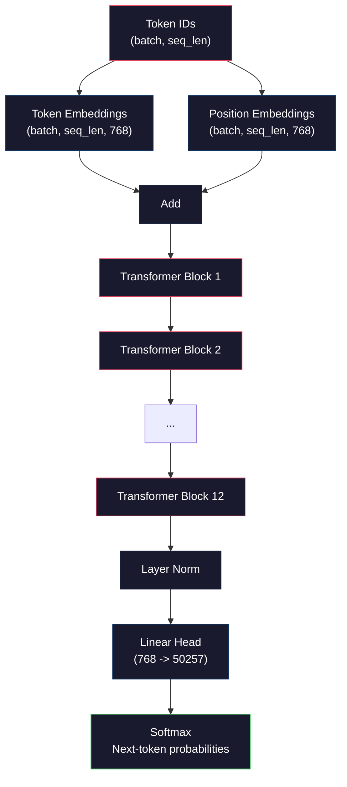
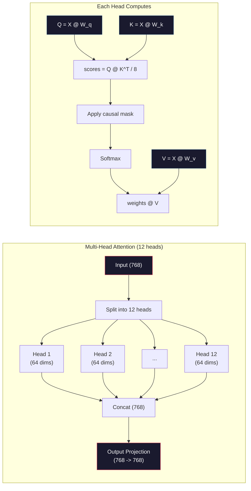
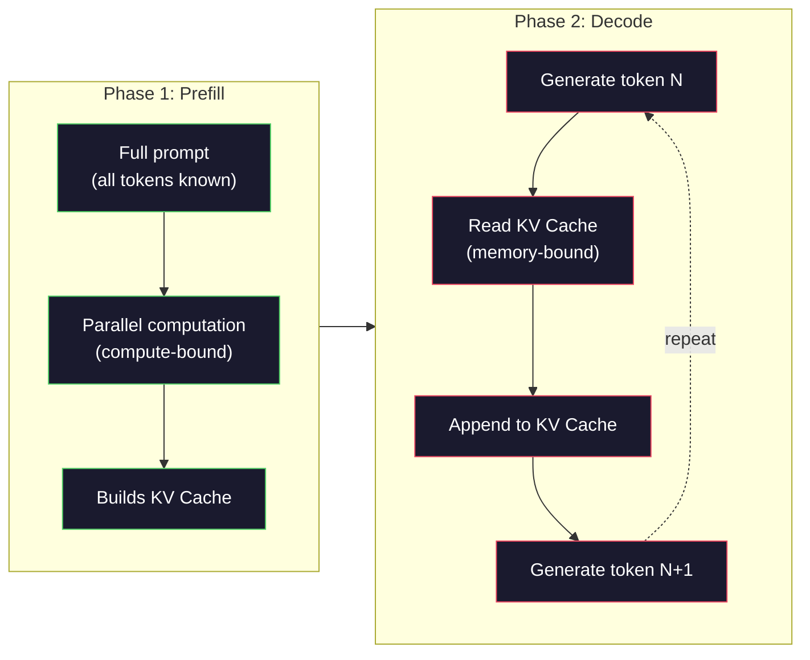

# قبل تدريب GPT ميني (124 م م م م) 预训练迷你 GPT(1.24 亿参数)

> GPT-2 Small لديه 124 مليون مبرمج. هذا هو 12 طبقة من المحولات، 12 رؤوس الاهتمام، و 768-dimensional embeddings. يمكنك تدريبها من الصفر على GPU واحد في بضع ساعات. معظم الناس لا يفعلون هذا.

> **【中文解读】**GPT-2 Small لديه 1.24 مليار عنصر: 12 مستوى محول ✓ 12 个注意力头、768 维嵌入── واحد GPU 几小时即可从头训练──理解预训练是理解大模型的第一步──

> **【拓展：大模型三阶段】**                                                                                                                                                                                                                                                              

>  **【前置】**學本節前 يرجى التعلم أولاً:(1) المرحلة 10·01-03(分词器、数据管线)  فهم الهوية الوهمية 序列 如何输入模型;(2) المحول 架构(المرحلة 05) 自我注意、LayerNorm、FFN;(3) numpy 矩阵运算、反向传播手算(Phase 03 微积分与链式法则);(4) 交叉损失函数的梯度推导──本课**用 numpy 实现**، لا تعتمد على (بيتورش أوتوغراد) ، لتستطيع كتابة كتابة نفسي`backward()`.

**Type:** Build
**Languages:** Python (with numpy)
**Prerequisites:** Phase 10, Lessons 01-03 (Tokenizers, Building a Tokenizer, Data Pipelines)
**Time:** ~120 minutes

## أهداف التعلم

- تنفيذ بنية GPT-2 الكاملة (124 مليون ملامح) من الصفر: إدخال الرمز، إدخال المواقع، كتلة المحول، ورأس نموذج اللغة
  من صفر تحقيق كامل GPT-2 架构(124M 参数):الرموز 嵌入、位置嵌入、Transformer 块和语言模型头
- تدريب نموذج GPT على جسم نص باستخدام التنبؤ بالتوقيت التالي مع فقدان الانتروبيا المتقاطعة
  استخدام下一符号 预测和交叉损失在文本语料上训练 GPT 模型
- تنفيذ توليد نص مصنف بالتخلف مع أخذ العينات الحرارية وتصفية top-k/top-p
  实现带温度采样和 top-k/top-p 过的自归文本生成
- مراقبة منحنى فقدان التدريب وتؤكد أن النموذج يتعلم أنماط لغوية متماسكة
   مراقبة التدريبات فقدان منحنى، تصنيف النموذج تعلمت تسلسل لغوي

> **【中文解读】**هذا الدراسة باستخدام النمط النقي من التنفيذ GPT-2 Small(124M 参数)  سوف ترى 1.24 مليار 参数 كيفية مرور على قبل الاتجاه نشر、 فقدان حساب、 عكس الاتجاه نشر、 حلقة تدريبية تحديث الوزن لتنبؤ التوكن التالي  هذا ليس بيتورش 黑盒 كل矩阵 ضربات هي قابلة للنظر 

## المشكلة المشكلة المشكلة

تعرف ما هو محول، لقد قرأت الرسوم البيانية، يمكنك أن تقرأ "الاهتمام هو كل ما تحتاجه" و ترسم صناديق تحمل علامة "الاهتمام متعدد الرؤوس" على اللوحة البيضاء.

> تعرف ما هو المحول. ترى الرسم البياني. يمكنك أن تذكري "الاهتمام هو كل ما تحتاجه" و ترسم على اللوحة البيضاء مربع مع علامة "الاهتمام متعدد الرؤوس".

لا يعني هذا أنك تفهم ما يحدث عندما تولد النموذج نصاً

> هذا لا يعني أنك تفهم ما حدث عندما تم إنشاء النموذج

هناك 124 438 272 ملامح في GPT-2 Small (مع ربط الوزن). كل واحد منهم تم تعيينها من خلال تشغيل حلقة تدريبية: المضي قدما، فقدان الحساب، المضي قدما، وزن تحديث. اثني عشر كتلة من المحولات اثني عشر رأسًا من الاهتمام في كل حي. مساحة تضمين 768 بعد مجموعة من 50257 رمز في كل مرة تولد فيها النموذج رمزًا ، تشارك جميع المعلمات التي تبلغ 124 مليون شكل في سلسلة مضاعفة ماريكس واحدة تأخذ تسلسلًا من أجهزة الهوية الرمزية وتنتج توزيعًا احتماليًا على الرمز التالي.

> GPT-2 Small لديه 124,438,272 个参数(含权重共享) ⋅ كل参数 تمر من خلال دورة تدريبية: قبل الاتجاه نشر、 حساب الخسارة、反向传播、更新权重── 12 块 من تحويلات الكتلة، لكل كتلة 12 个注意力头,768 维嵌入空间,50,257 词表── لكل إشارة إنتاجية، جميع 1.24 مليار 参数链参与一条矩阵乘法،将代币 ID 序列转换为下一个代币的概率分布──

إذا لم تقوم ببناء هذا بنفسك، فإنك تعمل مع صندوق أسود. يمكنك استخدام إيه بي. يمكنك ضبطها. ولكن عندما يذهب شيء خطأ -- عندما يسهل النموذج، عندما يتكرر نفسه، عندما يرفض اتباع التعليمات -- ليس لديك نموذج عقلي لـ * لماذا.

> إذا لم تكن قد بنيت هذا النموذج بنفسك من قبل، فأنت تستخدم صندوق أسود. يمكنك استخدام API، يمكنك التغيير. ولكن عندما يظهر النموذج شعور، أو يعيد نفسه أو يرفض اتباع التعليمات، لا تعرف لماذا.

هذه الدروس تبني GPT-2 Small من الصفر. ليس في PyTorch. في numpy. كل مضاعفة المصفوفة مرئية. كل تراجع يتم حسابها بواسطة رمزك. سترى بالضبط كيف 124 مليون رقم تتآمر للتنبؤ الكلمة التالية.

> هذا الدرس من الصفر بناء GPT-2 Small── لا حاجة PyTorch── باستخدام numpy── كل矩阵乘法都可见── كل درجة都由你的代码计算── سوف ترى 1.24 مليار رقم كيفية تعاون预测 下一个词──

> هذا الدرس من الصفر بناء GPT-2 Small── لا حاجة PyTorch── باستخدام numpy── كل矩阵乘法都可见── كل درجة都由你的代码计算── سوف ترى 1.24 مليار رقم كيفية تعاون预测 下一个词──

## المفهوم الأساسي

### معمارة GPT

هنا هو الرسم البياني الكامل للحساب من أجهزة الهوية إلى احتمالات الوهم التالي:

> فيما يلي مخطط كامل من رمز الهوية إلى الهوية التالية

1. أوراق الهوية تأتي. شكل: (بث_حجم، seq_len).
2. إضافة رمز البحث. كل هوية خريطة إلى متجه 768 بعد. شكل: (بث_حجم، seq_len، 768).
3. الموقف يضمن البحث. كل موقع (0, 1, 2, ...) خريطة إلى متجه 768 بعد. نفس الشكل.
4. إضافة إضافة إضافة إضافة إضافة إضافة إضافة إضافة إضافة إضافة إضافة إضافة إضافة إضافة إضافة إضافة إضافة إضافة إضافة إضافة إضافة إضافة إضافة إضافة إضافة إضافة إضافة إضافة إضافة إضافة إضافة إضافة إضافة إضافة إضافة إضافة إضافة إضافة إضافة إضافة إضافة إضافة إضافة إضافة إضافة إضافة إضافة إضافة إضافة إضافة إضافة إضافة إضافة إضافة إضافة إضافة إضافة إضافة إضافة إضافة إضافة إضافة إضافة إضافة إضافة إضافة إضافة إضافة إضافة إضافة إضافة إضافة إضافة إضافة إضافة إضافة إضافة إضافة إضافة إضافة إضافة إضافة إضافة إضافة إضافة إضافة إضافة إضافة إضافة إضافة إضافة إضافة إضافة إضافة إضافة إضافة إضافة إضافة إضافة إضافة إضافة إضافة إضافة إضافة إضافة إضافة إضافة إضافة إضافة إضافة إضافة إضافة إضافة إضافة إضافة إضافة إضافة إضافة إضافة إضافة إضافة إضافة إضافة إضافة إضافة إضافة إضافة إضافة إضافة إضافة إضافة إضافة إضافة إضافة إضافة إضافة إضافة إضافة إضافة إضافة إضافة إضافة إضافة إضافة إضافة إضافة إضافة إضافة إضافة إضافة إضافة إضافة إضافة إضافة إضافة إضافة إضافة إضافة إضافة إضافة إضافة إضافة إضافة إضضضافة إضضضضضضضضضضضضضضض
5. تمر عبر 12 كتلة من المحولات
6. الطبقة النهائية التطبيع.
7. التنبيه الخطى إلى حجم المفردات. شكل: (بث_size، seq_len، vocab_size).
8. -نعم، أقصى قدر للحصول على الاحتمالات

هذا هو النموذج بأكمله، لا تطورات، لا تكرار، مجرد إضافة، الاهتمام، شبكات التغذية، وطبقات القواعد المتراكمة 12 مرة.

> هذا هو النموذج بأكمله. لا يوجد مجلد. لا يوجد دورة.

>  **【类比】**GPT 像一台"流水线打字机":纸带送进代币 ID → 印章 1(الادراجات الادراجات)盖出 768 维向量 → 印章 2(الوضع الادراجات) وضع فوق الموقع → 12 道工人(بلوك المحول) تدريجياً تعديل هذا الادراجات → 末端喷墨头(LM head) على 50257 个候选词喷概率分布 → 选择最高概率的词输出 → 把新词同时再送回纸带开头,循环──一切秘藏在那12 道工人如何"修改" 量而注意 الذات



### كتلة التحويل

تتبع كل من الحجرات الثانية عشرة نفس النمط. بنية ما قبل المعايير (GPT-2 تستخدم ما قبل المعايير ، وليس ما بعد المعايير مثل المحول الأصلي):

> كل واحد من 12 个块 يتبع نفس النموذج.

1. الطبقة النظامية
2. الاهتمام الذاتي متعدد الرؤوس
3. اتصال بقية (إضافة المدخلات إلى الوراء)
4. الطبقة النظامية
5. شبكة إرسال المواد المغذية (MLP)
6. اتصال بقية (إضافة المدخلات إلى الوراء)

العلاقات المتبقية حاسمة. بدونها، تختفي التدرجات عندما تصل إلى الكتلة 1 أثناء الانتشار الخلفي. معها، يمكن أن تتدفق التدرجات مباشرة من الخسارة إلى أي طبقة عبر مسار "القفز". لهذا السبب يمكنك تجميع 12، 32 أو حتى 96 كتلة (يتم إشاعة استخدام GPT-4 120).

> الحلقة الثانية هي المفتاح. لا توجد أي منها، يمكن أن تختفي بعد الانتشار في الاتجاه المعاكس حتى الحجر الأول.

> **【中文解读】**مركز GPT 架构是Transformer 解码器块的堆积──每个块包含:LayerNorm → 多头自注意力 →残差连接 → LayerNorm → 前网络(MLP)→残差连接──GPT-2 使用 pre-norm(先归化再注意力),而不是原始Transformer 的后-norm──残差连接是关键没有它,梯度在12层反向传播后会消失,无法训练深层网络──

> **【拓展：GPT 系列的架构演进】**GPT-2 Small(124M,12 层 768 维)→ GPT-2 Medium(355M,24 层 1024 维)→ GPT-2 Large(774M,36 层 1280 维)→ GPT-2 XL(1.5B,48 层 1600 维)→ GPT-3(175B,96 层 12288 维)。 الإنشاءات الأساسية نفسها، مجرد عدد و الدرجة المتزايدة。 لم يتم فتح المعلومات عن المكونات المحددة للGPT-4، ولكن اقتراحات استخدم حوالي 120 层 و MoE((متزايدة الخبراء) الإنشاءات。

### الاهتمام: الآلية الأساسية

الاهتمام الذاتي يسمح لكل رمز بالنظر إلى كل رمز سابق ويقرر كم يجب أن يشاهد كل واحد.

> عن الانتباه جعل كل رمز  رؤية كل رمز السابق،并 قرر على كل رمز  منح الكثير من الاهتمام.

لكل موقف رمزي، احسب ثلاثة متجهات من المدخل:
- **Query (Q)**"ما الذي أبحث عنه؟"
  中文翻译:**查询（Q）**"أنا في البحث عن ماذا؟"
- **Key (K)**"ما الذي يحتوي عليه؟"
  中文翻译:**键（K）**"ما الذي يحتوي عليه؟"
- **Value (V)**: "ما المعلومات التي أحملها؟"
  中文翻译:**值（V）**"ما المعلومات التي أحملها؟"

```
Q = input @ W_q    (768 -> 768)
K = input @ W_k    (768 -> 768)
V = input @ W_v    (768 -> 768)

attention_scores = Q @ K^T / sqrt(d_k)
attention_scores = mask(attention_scores)   # causal mask: -inf for future positions
attention_weights = softmax(attention_scores)
output = attention_weights @ V
```

القناع السببية هي ما يجعل GPT autoregressive. الموقف 5 يمكن أن يتابع المواقع 0-5 ولكن ليس 6, 7, 8 ، وهلم جرا. هذا يمنع النموذج من "الخداع" من خلال النظر إلى الرموز المستقبلية أثناء التدريب.

> بسبب الغطاء يجعل GPT  تصبح نموذجًا يُرجع نفسه. الموقع 5 يمكن ملاحظة الموقع 0-5 ولكن لا يمكن ملاحظة 6、7、8 وما إلى ذلك. هذا يمنع نموذج في التدريب من خلال إشارة مستقبلية من "الخداع".

**Multi-head attention**يقسّم الفضاء البعدي 768 إلى 12 رأسًا من 64 بعدًا لكل منهما. يتعلم كل رأس نمطًا مختلفًا للاهتمام. قد تتبع رأس واحد علاقات صيغية (اتفاق الموضوع - الفعل). قد تتبع رأس آخر شبيهات معنوية (مختلفات). قد تتبع آخر قربًا موضعيًا (كلمات قريبة). يتم تشبيك نتائج جميع الرؤوس الثانية عشرة وتُنشر إلى 768 بعدًا.

> **多头注意力**سوف نقسم 768 维空间 إلى 12 维的头── كل رأس يتعلم مختلفة الاهتمام نمط── واحد رأس يمكن أن تتبع 句法关系(主谓一致)── الآخر قد تتبع 语义相似性(同义词)── الآخر قد تتبع موقع قريبة 相邻词)── كل 12 头的输出被拼接并投影回 768 维──



تقسيم بـ (sqrt(d_k) -- (sqrt(64) = 8 -- هو التوسع. بدونها، تنتج منتجات النقاط كبيرة لمتجهات عالية الأبعاد، مما يدفع softmax إلى مناطق حيث تكون التراجعات شبه صفر. كانت هذه واحدة من المعلومات الرئيسية في ورقة "الاهتمام هو كل ما تحتاجه" الأصلية.

> إلى جانب مربع ((d_k) sqrt(64) = 8 هو التكفيض. بدونها، نقطة تجميع في ارتفاع الارتفاع على حجم الكهرباء سوف تصبح كبيرة جدا، سوف يضعف الارتفاع إلى التدابير القريبة من منطقة صفر.

### كيف كاش: لماذا التخمين سريع

أثناء التدريب، تقوم بمعالجة التسلسل بأكمله في وقت واحد. أثناء الاستنتاج، تقوم بتوليد رمز واحد في وقت واحد. دون تحسين، فإن توليد رمز N يتطلب إعادة حساب الاهتمام لجميع رموز N-1 السابقة. وهذا هو O(N^2) لكل رمز تم توليده، أو O(N^3) إجمالي لسلسلة من الطول N.

> 訓練時,你一次處理整個序列──推理時,你個個生成代币──無優化詞,生成代币 N 需要为所有N-1 个之前代币重新计算注意力──这是每个生成代币的O(N^2),或长度N 的序列总共O(N^3)。

كيف كاشي يحل هذا بعد حساب K و V لكل رمز، تخزينهم. عند توليد رمز N + 1 ، تحتاج فقط إلى حساب Q للرمز الجديد والبحث عن الاحتفاظ K و V من جميع الرموز السابقة. هذا يقلل من تكلفة كل رمز من O(N) إلى O(1) للحساب K و V. حساب درجة الاهتمام لا يزال O(N) لأنك تلتزم بكل المواقف السابقة، ولكنك تتجنب مضاعفات المصفوفة الإضافية على المدخل.

> ك.و 缓存 حل هذه المشكلة.‬‬‬‬‬‬‬‬‬‬‬‬‬‬‬‬‬‬‬‬‬‬‬‬‬‬‬‬‬‬‬‬‬‬‬‬‬‬‬‬‬‬‬‬‬‬‬‬‬‬‬‬‬‬‬‬‬‬‬‬‬‬‬‬‬‬‬‬‬‬‬‬‬‬‬‬‬‬‬‬‬‬‬‬‬‬‬‬‬‬‬‬‬‬‬‬‬‬‬‬‬‬‬‬‬‬‬‬‬‬‬‬‬‬‬‬‬‬‬‬‬‬‬‬‬‬‬‬‬‬‬‬‬‬‬‬‬‬‬‬‬‬‬‬‬‬‬‬‬‬‬‬‬‬‬‬‬‬‬‬‬‬‬‬‬‬‬‬‬‬‬‬‬‬‬‬‬‬‬‬‬‬‬‬‬‬‬‬‬‬‬‬‬‬‬‬‬‬‬‬‬‬‬‬‬‬‬‬‬‬‬‬‬‬‬‬‬‬‬‬‬‬‬‬‬‬‬‬‬‬‬‬‬‬‬‬‬‬‬‬‬‬‬‬‬‬‬‬‬‬‬‬‬‬‬‬‬‬‬‬‬‬‬‬‬‬‬‬‬‬‬‬‬‬‬‬‬‬‬‬‬‬‬‬‬‬‬‬‬‬‬‬‬‬‬‬‬‬‬‬‬‬‬‬‬‬‬‬‬‬‬‬‬‬‬‬‬‬‬‬‬‬‬‬‬‬‬‬‬‬‬‬‬‬‬‬‬‬‬‬‬‬‬‬‬‬‬‬‬‬‬‬‬‬‬‬‬‬‬‬‬‬‬‬‬‬‬‬‬‬‬‬‬‬‬‬‬‬‬‬‬‬‬‬‬‬‬‬‬‬‬‬‬‬‬‬‬‬‬‬‬‬‬‬‬‬‬‬‬‬‬‬‬‬‬‬‬‬‬‬‬‬‬‬‬‬‬‬‬‬‬‬‬‬‬‬‬‬‬‬‬‬‬‬‬‬‬‬‬‬‬‬‬‬‬‬‬‬‬‬‬‬‬‬‬‬‬‬‬‬‬‬‬‬‬‬‬‬‬‬‬‬‬‬‬‬‬‬‬‬‬‬‬‬‬‬‬‬‬

بالنسبة لـ GPT-2 مع 12 طبقة و 12 رأسًا ، يحتفظ ذاكرة الاحتفاظ KV 2 (K + V) x 12 طبقة x 12 رأسًا x 64 ديم = 18,432 قيمًا لكل رمز. بالنسبة لسلسلة 1024 رمزًا ، وهذا حوالي 75MB في FP32. بالنسبة لـ Llama 3 405B مع 128 طبقة ، يمكن أن يتجاوز ذاكرة الاحتفاظ KV لسلسلة واحدة 10GB. لهذا السبب يتم تحديد استنتاج السياق الطويل بالذاكرة.

> بالنسبة لـ 12 مستوى 12 رأس GPT-2,KV 缓存 لكل رمز 存储 2(K + V) x 12 مستوى x 12 رأس x 64 维 = 18,432 个值。 بالنسبة لـ 1024 سلسلة من الرموز، في FP32 في حوالي 75MB。 بالنسبة لـ 128 مستوى من Llama 3 405B، يمكن أن تتجاوز سلسلة KV 缓存 10GB。 هذا هو السبب في أن التفكير هو الحد من الذاكرة.

### المكملات المسبقة مقابل التشريح: مرحلتين من الإستفسار

عندما ترسل طلباً إلى ماجستير في مجال القانون، فإن الاستنتاج يحدث في مرحلتين متميزتين.

> عندما ترسل إلى ماجستير في إدارة الأعمال، فإن التفكير يحدث في مرحلتين مختلفتين.

**Prefill**يعالج كل طلبك بالتوازي. جميع الرموز المعروفة، لذلك يمكن أن يحسب النموذج الاهتمام لجميع المواقع في وقت واحد. هذه المرحلة مرتبطة بالحساب -- تقوم GPU بمضاعفة المصفوفات عند التكامل الكامل. لطلب 1000 رموز على A100، يستغرق التمليح المسبق حوالي 20-50ms.

> **预填充（Prefill）**ويعمل على التعامل مع كل عرضة. جميع الرموز معروفة، لذلك يمكن أن يحسب النموذج في نفس الوقت كل التركيز على الموقع. هذه المرحلة هي محاسبة كثيفة من نوع GPU باستخدام الانتفاع الكامل للقيام بموجب ضربة.

**Decode**يُولد الرموز الواحدة تلو الأخرى. كل رمز جديد يعتمد على كل الرموز السابقة. هذه المرحلة مرتبطة بالذاكرة -- عقدة الزجاجة هي قراءة وزن النموذج و KV cache من ذاكرة GPU، وليس الرياضيات المصفوفة نفسها. و نواة الحاسوب في الجيبوير تجلس في الغالب في حالة عفوا في انتظار قراءة الذاكرة بالنسبة لـ GPT-2 ، كل خطوة لتفكيك تستغرق حوالي نفس الوقت بغض النظر عن عدد FLOPs التي تتطلبها المتمولات ، لأن عرض النطاق الترددي للذاكرة هو القيود.

> **解码（Decode）**个别生成代币――每个新代币依赖所有前代币―― هذه المرحلة هي 瓶 من نوع الاحتفاظ المكثف  من GPU 内存读取模型权重和KV 缓存,而不是矩阵运算本身── GPU 计算核心 计算核心 计算核心 计算核心 计算核心 计算核心 计算时间大部分时间在等待内存读取──对于 GPT-2, كل خطوة حل 代码的时间大致相同,无论矩阵乘法需要多少 FLOP,因为内存宽度是有限的──

هذا التمييز مهم للأنظمة الإنتاجية. قم بتحديد نطاقات النمو باستخدام حسابات GPU (مزيد من FLOPS = أسرع إعداد). قم بتحديد نطاقات النمو باستخدام عرض النطاق الذاكري (الذاكري الأسرع = تسريع تسريع). لهذا يركز H100 من NVIDIA على تحسين عرض النطاق الذاكري على A100 - فإنه يسرع مباشرة إنتاج الرمز.

> هذا الفرق مهم جداً في نظام الإنتاج. هذا الفرق بين نطاق التحميل المسبق والقدرة على الحساب في GPU. هذا هو السبب في أن NVIDIA H100 على أساس A100 ركز على تحسين نطاق التحميل المسبق.



### حلقة التدريب

تدريب LLM هو التنبؤ بالتوقيع التالي. مع إعطاء الوهم [0, 1, 2, ..., N-1] ، التنبؤ بالتوقيعات [1, 2, 3, ..., N]. وظيفة الخسارة هي التنقل المتقاطع بين توزيع الاحتمال المتوقع للنموذج والوهم التالي الفعلي.

> 訓練 LLM 就是下一代币 预测──给定代币 [0, 1, 2, ..., N-1],预测代币 [1, 2, 3, ..., N]── فقدان وظيفة هي التوزيع على الاحتمالات من نموذج التنبؤ مع عملية 预测 交叉──

خطوة تدريبية واحدة:

> خطوة تدريبية:

1. **Forward pass**: قم بتشغيل اللعبة عبر كل 12 كتلاً، احصل على علامات (بعد الارتفاع) لكل موقع.
2. **Compute loss**: التشابه المتقاطع بين اللوجيتات والرموز المستهدفة (المدخل تم تحويله إلى وضع واحد).
3. **Backward pass**: حساب التراجعية لجميع المعلمات 124M باستخدام التنشر الخلفي.
4. **Optimizer step**تحديث الوزن. GPT-2 يستخدم آدم مع دراسة معدل تسخين وتدهور السكري.

يُعتبر نظام التعلم أكثر أهمية مما تتوقعه. يُحترم GPT-2 من 0 إلى معدل التعلم القصوى خلال الخطوات الأولى 2000، ثم يتدهور بعد منحنى كوسين. يُسبب بدء معدل التعلم العالي أن يختلف النموذج. يُسبب الحفاظ على معدل عال ثابت تذبذب في التدريب اللاحق. يستخدم نمط التدفئة ثم التدهور من قبل كل ماجستير في التدريب العالي.

> تعديل معدل التعلم أكثر أهمية مما تتخيل. GPT-2 في 2000 خطوة من 0 预热到峰值学习率, ثم على حافة الزيادة انحطاط.

### GPT-2 صغير: الأرقام

| Component | Shape | Parameters |
|-----------|-------|------------|
| Token embeddings | (50257, 768) | 38,597,376 |
| Position embeddings | (1024, 768) | 786,432 |
| Per-block attention (W_q, W_k, W_v, W_out) | 4 x (768, 768) | 2,359,296 |
| Per-block FFN (up + down) | (768, 3072) + (3072, 768) | 4,718,592 |
| Per-block LayerNorms (2x) | 2 x 768 x 2 | 3,072 |
| Final LayerNorm | 768 x 2 | 1,536 |
| **Total per block** | | **7,080,960** |
| **Total (12 blocks)** | | **85,054,464 + 39,383,808 = 124,438,272** |

يشارك التنبؤ الخارجي (رأس اللوجيتس) الوزن مع ماتريكس إدراج الرمز. هذا يسمى الوزن الارتباط - يقلل من عدد المعلمات بنسبة 38M ويحسن الأداء لأنه يضطر النموذج إلى استخدام نفس مساحة التمثيل للدخول والخروج.

> **【中文解读】**توزيع المعايير GPT-2: الهيئة التشريعية 嵌入层占 38.6M(50257 x 768),12 个 变压器块各占 7.1M,最终 LayerNorm 只有 1.5K;;权重共享(重量绑定) 让输出投影层复用代币 嵌入矩阵,减少 38M 参数的同时还提升了性能因为输入和输出被强制使用相同表示空间──

## بناء ذلك تحرك لتحقيق

### الخطوة الأولى: إدخال الطبقة

تضمنت إدخالات الرمز كل من 50257 رمزا محتملة إلى متجه 768 بعد. تضمنت إدخالات الموقع معلومات عن مكان كل رمزا في التسلسل. يتم جمع الاثنين.

> الوهم 嵌入将 50,257 个可能的符号 各映射到一个 768 维向量──位置嵌入添加每个符号 在序列中位置的信息──两者相加──

```python
import numpy as np

class Embedding:
    def __init__(self, vocab_size, embed_dim, max_seq_len):
        self.token_embed = np.random.randn(vocab_size, embed_dim) * 0.02
        self.pos_embed = np.random.randn(max_seq_len, embed_dim) * 0.02

    def forward(self, token_ids):
        seq_len = token_ids.shape[-1]
        tok_emb = self.token_embed[token_ids]
        pos_emb = self.pos_embed[:seq_len]
        return tok_emb + pos_emb
```

الاختلاف القياسي 0.02 للتبديل يأتي من ورقة GPT-2. كبير جدا والمرورات الأوليّة للأمام تنتج قيمًا متطرفةً تُزعزع الاستقرار في التدريب. صغير جداً والخروجات الأوليّة متطابقة تقريبًا لجميع المدخلات، مما يجعل إشارات التراجع المبكرة غير مفيدة.

> 0.02 標準差的初始化来自GPT-2 论文──太大则初始前向传播产生极端值,破坏训练稳定性──太小则所有输入的初始输出几乎相同,使早期梯度信号无用──

### الخطوة الثانية: الاهتمام الذاتي مع قناع السبب

التركيز على رأس واحد أولاً. القناع السببي يضع المواقف المستقبلية إلى اللانهاية السلبية قبل softmax، مما يضمن لكل موقف أن يلاحظ نفسه ومواقف سابقة فقط.

> قبل القيام بعمل واحد الاهتمام. سبب الاختفاء في الموقف المقبل المُعد لخفض لا نهاية له. تأكد من أن كل موقع يمكن أن يلاحظ فقط نفسه والمركز السابق.

```python
def attention(Q, K, V, mask=None):
    d_k = Q.shape[-1]
    scores = Q @ K.transpose(0, -1, -2 if Q.ndim == 4 else 1) / np.sqrt(d_k)
    if mask is not None:
        scores = scores + mask
    weights = np.exp(scores - scores.max(axis=-1, keepdims=True))
    weights = weights / weights.sum(axis=-1, keepdims=True)
    return weights @ V
```

تنفيذ softmax يقلل من الحد الأقصى قبل تعدد. دون هذا، exp(large_number) يتجاوز إلى اللانهاية. هذه خدعة استقرار عددي لا يغير الخروج لأن softmax(x - c) = softmax(x) لأي ثابت c.

> softmax 实现在取指数前减去最大值──没有这个,exp(大_数) 会溢出到无穷大──这是一个数值稳定性技巧,不改变输出,因为对任意常数 c,softmax(x - c) = softmax(x)──

### الخطوة الثالثة: الاهتمام متعدد الرؤوس

تقسيم المدخل 768 بعد إلى 12 رأس من 64 بعد كل رأس يحسب الاهتمام بشكل مستقل. تحكم النتائج وتعيد إلى 768 بعد.

> سوف تُقسم 768 维输入 إلى 12 维 64 维的头──每个头独立计算注意力──拼接结果并投投回 768 维──

```python
class MultiHeadAttention:
    def __init__(self, embed_dim, num_heads):
        self.num_heads = num_heads
        self.head_dim = embed_dim // num_heads
        self.W_q = np.random.randn(embed_dim, embed_dim) * 0.02
        self.W_k = np.random.randn(embed_dim, embed_dim) * 0.02
        self.W_v = np.random.randn(embed_dim, embed_dim) * 0.02
        self.W_out = np.random.randn(embed_dim, embed_dim) * 0.02

    def forward(self, x, mask=None):
        batch, seq_len, d = x.shape
        Q = (x @ self.W_q).reshape(batch, seq_len, self.num_heads, self.head_dim).transpose(0, 2, 1, 3)
        K = (x @ self.W_k).reshape(batch, seq_len, self.num_heads, self.head_dim).transpose(0, 2, 1, 3)
        V = (x @ self.W_v).reshape(batch, seq_len, self.num_heads, self.head_dim).transpose(0, 2, 1, 3)

        scores = Q @ K.transpose(0, 1, 3, 2) / np.sqrt(self.head_dim)
        if mask is not None:
            scores = scores + mask
        weights = np.exp(scores - scores.max(axis=-1, keepdims=True))
        weights = weights / weights.sum(axis=-1, keepdims=True)
        attn_out = weights @ V

        attn_out = attn_out.transpose(0, 2, 1, 3).reshape(batch, seq_len, d)
        return attn_out @ self.W_out
```

الرقص الذي يُعد شكلًا - يُعد شكلًا - يُعد الجزء الأكثر إرتباكًا من الاهتمام المتعدد الرأس. هنا ما يحدث: (بارتش، seq_len، 768) يكون التنسور (بارتش، seq_len، 12, 64) ، ثم (بارتش، 12, seq_len، 64). الآن كل من الرؤوس 12 لديه ماتريسك الخاص (seq_len، 64) لإدارة الاهتمام. بعد الانتباه، نقلب العملية: (بارتش، 12، seq_len، 64) يصبح (بارتش، seq_len، 12, 64) يصبح (بارتش، seq_len، 768).

> عملية إعادة تشكيل-تحويل-إعادة تشكيل هي أكثر جزءاً مُربّكاً من تركيز الرّأى.

### الخطوة الرابعة: حجر المحول

كتلة واحدة كاملة للمتحول: LayerNorm، الاهتمام متعدد الرؤوس مع بقايا، LayerNorm، التغذية المسبقة مع بقايا.

> واحد كاملة المحولات 块:LayerNorm、带残差的多头注意力、LayerNorm、带残差的前网络──

```python
class LayerNorm:
    def __init__(self, dim, eps=1e-5):
        self.gamma = np.ones(dim)
        self.beta = np.zeros(dim)
        self.eps = eps

    def forward(self, x):
        mean = x.mean(axis=-1, keepdims=True)
        var = x.var(axis=-1, keepdims=True)
        return self.gamma * (x - mean) / np.sqrt(var + self.eps) + self.beta


class FeedForward:
    def __init__(self, embed_dim, ff_dim):
        self.W1 = np.random.randn(embed_dim, ff_dim) * 0.02
        self.b1 = np.zeros(ff_dim)
        self.W2 = np.random.randn(ff_dim, embed_dim) * 0.02
        self.b2 = np.zeros(embed_dim)

    def forward(self, x):
        h = x @ self.W1 + self.b1
        h = np.maximum(0, h)  # GELU approximation: ReLU for simplicity
        return h @ self.W2 + self.b2


class TransformerBlock:
    def __init__(self, embed_dim, num_heads, ff_dim):
        self.ln1 = LayerNorm(embed_dim)
        self.attn = MultiHeadAttention(embed_dim, num_heads)
        self.ln2 = LayerNorm(embed_dim)
        self.ffn = FeedForward(embed_dim, ff_dim)

    def forward(self, x, mask=None):
        x = x + self.attn.forward(self.ln1.forward(x), mask)
        x = x + self.ffn.forward(self.ln2.forward(x))
        return x
```

شبكة التغذية المسبقة توسع المدخل 768 بعدما إلى 3,072 بعدما (4x) ، وتطبق عدم الخطية ، ثم يُنشر مرة أخرى إلى 768. هذا النمط التوسع-التقريب يعطي النموذج تمثيل داخلي "أوسع" للعمل معه في كل موقف. GPT-2 يستخدم تنشيط GELU ، ولكن نستخدم ReLU هنا لسهولة - الفرق صغير لفهم الهندسة المعمارية.

> قبل شبكة ستوسع 768 维输入 إلى 3,072 维(4 倍) ، تطبيق غير خطي، ثم تنبذ 768 . هذا النموذج التوسع-التضخم يعطي نموذج "أوسع" من خلال النموذج في كل موقع.

### الخطوة 5: نموذج GPT الكامل

قم بتجميع 12 كتلة من محولات، أضف طبقة التثبيت في الأمام والتصوير في الخلف.

> 堆叠 12 变压器 块──前面加嵌层,后面加输出投影──

```python
class MiniGPT:
    def __init__(self, vocab_size=50257, embed_dim=768, num_heads=12,
                 num_layers=12, max_seq_len=1024, ff_dim=3072):
        self.embedding = Embedding(vocab_size, embed_dim, max_seq_len)
        self.blocks = [
            TransformerBlock(embed_dim, num_heads, ff_dim)
            for _ in range(num_layers)
        ]
        self.ln_f = LayerNorm(embed_dim)
        self.vocab_size = vocab_size
        self.embed_dim = embed_dim

    def forward(self, token_ids):
        seq_len = token_ids.shape[-1]
        mask = np.triu(np.full((seq_len, seq_len), -1e9), k=1)

        x = self.embedding.forward(token_ids)
        for block in self.blocks:
            x = block.forward(x, mask)
        x = self.ln_f.forward(x)

        logits = x @ self.embedding.token_embed.T
        return logits

    def count_parameters(self):
        total = 0
        total += self.embedding.token_embed.size
        total += self.embedding.pos_embed.size
        for block in self.blocks:
            total += block.attn.W_q.size + block.attn.W_k.size
            total += block.attn.W_v.size + block.attn.W_out.size
            total += block.ffn.W1.size + block.ffn.b1.size
            total += block.ffn.W2.size + block.ffn.b2.size
            total += block.ln1.gamma.size + block.ln1.beta.size
            total += block.ln2.gamma.size + block.ln2.beta.size
        total += self.ln_f.gamma.size + self.ln_f.beta.size
        return total
```

لاحظوا الوزن:`logits = x @ self.embedding.token_embed.T`. تستخدم التنبؤات المصدرة مرة أخرى ماتريكس إدراج الرمز (تضمن). هذه ليست مجرد خدعة لإنقاذ المعايير. يعني أن النموذج يستخدم نفس المساحة المتجهة لفهم الرمز (الترابطات) وتنبؤ بها (المخرج).

> انتباه:`logits = x @ self.embedding.token_embed.T`输出投影复用代币 嵌入矩阵(转置) ・・・ هذا ليس مجرد مهارات لإنقاذ العناصر── يعني أن النموذج يستخدم نفس المساحة الكمومية لفهم الادبالات(嵌入) و الادبالات التوقيتية(输出) ・・・

### الخطوة السادسة: حلقة التدريب

لتمارين تدريبية حقيقية على ملامح 124M، ستحتاج إلى GPU و PyTorch. هذه الحلقة تدريبية تظهر الميكانيكية على نموذج صغير يعمل في نومبي خالص. نستخدم نموذج صغير (4 طبقات، 4 رؤوس، 128 ضيق) لجعل من قابل للتحكم.

> 对于 124M 参数的真正训练运行,你需要GPU和PyTorch. 对于 124M 参数的真正训练运行,你需要GPU和PyTorch. 对于这项训练循环在纯粹的 numpy 运行的小模型上演示机制.

```python
def cross_entropy_loss(logits, targets):
    batch, seq_len, vocab_size = logits.shape
    logits_flat = logits.reshape(-1, vocab_size)
    targets_flat = targets.reshape(-1)

    max_logits = logits_flat.max(axis=-1, keepdims=True)
    log_softmax = logits_flat - max_logits - np.log(
        np.exp(logits_flat - max_logits).sum(axis=-1, keepdims=True)
    )

    loss = -log_softmax[np.arange(len(targets_flat)), targets_flat].mean()
    return loss


def train_mini_gpt(text, vocab_size=256, embed_dim=128, num_heads=4,
                   num_layers=4, seq_len=64, num_steps=200, lr=3e-4):
    tokens = np.array(list(text.encode("utf-8")[:2048]))
    model = MiniGPT(
        vocab_size=vocab_size, embed_dim=embed_dim, num_heads=num_heads,
        num_layers=num_layers, max_seq_len=seq_len, ff_dim=embed_dim * 4
    )

    print(f"Model parameters: {model.count_parameters():,}")
    print(f"Training tokens: {len(tokens):,}")
    print(f"Config: {num_layers} layers, {num_heads} heads, {embed_dim} dims")
    print()

    for step in range(num_steps):
        start_idx = np.random.randint(0, max(1, len(tokens) - seq_len - 1))
        batch_tokens = tokens[start_idx:start_idx + seq_len + 1]

        input_ids = batch_tokens[:-1].reshape(1, -1)
        target_ids = batch_tokens[1:].reshape(1, -1)

        logits = model.forward(input_ids)
        loss = cross_entropy_loss(logits, target_ids)

        if step % 20 == 0:
            print(f"Step {step:4d} | Loss: {loss:.4f}")

    return model
```

تبدأ الخسارة بالقرب من ln(vocab_size) - لمفردة مستوى البايت 256 رمز ، أي ln(256) = 5.55. يعطي نموذج عشوائي احتمال متساو لكل رمز. مع تقدم التدريب ، تنخفض الخسارة لأن النموذج يتعلم التنبؤ بالأنماط الشائعة: "ث" بعد "ت"، الفضاء بعد فترة ، وهكذا.

> 损失初始接近 ln(vocacab_size)  بالنسبة 256 رمز 字节级词表,即 ln(256) = 5.55。随机模型给每个 token 分配等概率。 مع إجراء التدريب، انخفض الخسارة، لأن模型学会预测常见模式:"t" 后面是"th",句号后面是空格等。

في الإنتاج، ستستخدم أدم المكيف مع تراكم التراكم، وتدفئة معدل التعلم، وتقطيع التراكم. حلقة التقدم-المرور-الخسارة-العودة-التحديث هو نفسه. المكيف أكثر تعقيدا.

> في الإنتاج، ستستخدم آدم  تحسينات مع التراكم التدريجي   معدلات التعلم  التدريجي  التدريجي  التدريجي  التدريجي  التدريجي  التدريجي  التدريجي  التدريجي  التدريجي  التدريجي  التدريجي  التدريجي  التدريجي  التدريجي  التدريجي  التدريجي  التدريجي  التدريجي  التدريجي  التدريجي  التدريجي  التدريجي  التدريجي  التدريجي  التدريجي  التدريجي  التدريجي  التدريجي  التدريجي  التدريجي  التدريجي  التدريجي  التدريجي  التدريجي  التدريجي  التدريجي  التدريجي  التدريجي  التدريجي  التدريجي  التدريجي  التدريجي  التدريجي

### الخطوة السابعة: توليد النص

يستخدم الجيل النموذج المدرب للتنبؤ بطاقة واحدة في كل مرة. يتم أخذ كل تنبؤ من توزيع الخروج (أو يتم أخذها بفارق طمعية باسم argmax).

> 生成 استخدام تدريب جيد نموذج على حدة توقعات رمز.

```python
def generate(model, prompt_tokens, max_new_tokens=100, temperature=0.8):
    tokens = list(prompt_tokens)
    seq_len = model.embedding.pos_embed.shape[0]

    for _ in range(max_new_tokens):
        context = np.array(tokens[-seq_len:]).reshape(1, -1)
        logits = model.forward(context)
        next_logits = logits[0, -1, :]

        next_logits = next_logits / temperature
        probs = np.exp(next_logits - next_logits.max())
        probs = probs / probs.sum()

        next_token = np.random.choice(len(probs), p=probs)
        tokens.append(next_token)

    return tokens
```

الحرارة تسيطر على الرفيعة. الحرارة 1.0 تستخدم التوزيع الخام. الحرارة 0.5 تحددها (أكثر تحديدًا - يختار النموذج خياراته العليا أكثر فترة). الحرارة 1.5 تسطحها (أكثر عشوائية - توكنات احتمالية منخفضة تحصل على فرصة أكبر). الحرارة 0.0 هي تشخيص طموح (اختر دائمًا علامة الاحتمالية العالية).

> 温度控制随机性──温度 1.0 使用原始分布──温度 0.5 使其更尖(更确定性模型更频繁地选择顶部候选)──温度 1.5 使其更平坦(更随机低概率代币 获得更大的机会)──温度 0.0 是贪心解码(始终选择最高概率代币)──

- نعم`tokens[-seq_len:]`النافذة ضرورية لأن النموذج لديه أقصى طول السياق (1024 بالنسبة GPT-2). بمجرد تجاوزها، يجب عليك إلقاء أقدم الرموز. هذه هي "نافذة السياق" التي يتحدث الجميع عنها.

> `tokens[-seq_len:]`النوافذ هي ضرورية، لأن النموذج لديه أقصى عرض على النص التالي ((GPT-2 为 1024)  بمجرد تجاوزها، يجب عليك التخلص من أقدم علامة  هذا ما يقوله الجميع "على النوافذ التالية"‬

## استخدمها في إطار التنفيذ
```figure
sampling-decoder
```

## استخدمها

### التدريب الكامل و التجربة التجريبية

```python
corpus = """The transformer architecture has revolutionized natural language processing.
Attention mechanisms allow the model to focus on relevant parts of the input.
Self-attention computes relationships between all pairs of positions in a sequence.
Multi-head attention splits the representation into multiple subspaces.
Each attention head can learn different types of relationships.
The feedforward network provides nonlinear transformations at each position.
Residual connections enable gradient flow through deep networks.
Layer normalization stabilizes training by normalizing activations.
Position embeddings give the model information about token ordering.
The causal mask ensures autoregressive generation during training.
Pre-training on large text corpora teaches the model general language understanding.
Fine-tuning adapts the pre-trained model to specific downstream tasks."""

model = train_mini_gpt(corpus, num_steps=200)

prompt = list("The transformer".encode("utf-8"))
output_tokens = generate(model, prompt, max_new_tokens=100, temperature=0.8)
generated_text = bytes(output_tokens).decode("utf-8", errors="replace")
print(f"\nGenerated: {generated_text}")
```

على مجموعة صغيرة مع نموذج صغير، النص المولود سيكون شبه متماسك في أفضل الأحوال. سوف تتعلم بعض أنماط مستوى البايت من نص التدريب ولكن لا يمكن تعميم الطريقة التي تقوم بها GPT-2 مع 40 جيجابايت من بيانات التدريب ومهندسية المعلمات الكاملة 124M. النقطة ليست نوعية الخروج النقطة هي أنه يمكنك تتبع كل خطوة: إضافة البحث، حساب الاهتمام، تحويل المعلومات المتوفرة، كل عملية مرئية

> في المواد الصغيرة والنموذج الصغير، فإن الكتب المنجزة تتزايد في الكمية نصف تسلسل. فإنها تتعلم من الكتب التدريبية إلى بعض أشكال الطراز، ولكن لا يمكن أن تكون مثل GPT-2 في 40GB التدريب البيانات والتكامل 124M الممارسات التكوين.

## أرسلها .

هذا الدرس يُنتج`outputs/prompt-gpt-architecture-analyzer.md`-- عرض يُحلل خيارات الهندسة المعمارية في أي نموذج على شكل GPT. إعطائه بطاقة نموذج أو تقرير فني ويمزق تقسيم المعلمات، تصميم الاهتمام، وقرارات التوسع.

> 本课产出 `outputs/prompt-gpt-architecture-analyzer.md` تحليل إرادي GPT 风格模型架构选择的提示──输入模型卡或技术报告,它将分解参数分配、注意设计和缩缩决策──

## تمارين التدريب

1. تعديل النموذج لاستخدام 24 طبقة و 16 رأس بدلا من 12/12. احتساب المعايير. كيف يختلف مضاعفة العمق مع مضاعفة العرض (بعالم الإدراج) ؟

2. تنفيذ وظيفة تنشيط GELU (GELU(x) = x * 0.5 * (1 + erf(x / sqrt(2)))) واستبدال ReLU في شبكة التغذية. تشغيل التدريب لمدة 500 خطوة مع كل تنشيط ومقارنة الخسارة النهائية.

3. إضافة cache KV إلى وظيفة التوليد. تخزين K و V tensors لكل طبقة بعد أول مرسلة إلى الأمام، واستعادتها للشعارات اللاحقة. قياس السرعة: توليد 200 شعارة مع ودون الاحتفاظ والتقارن الوقت الحائط-الساعة.

4. قم بتنفيذ عينة من أعلى مستوى (اعتبر فقط رموز k ذات أعلى احتمال) وعينة من أعلى مستوى (عينة من أعلى مستوى: اعتبر أصغر مجموعة من رموز احتمالها التراكمية تتجاوز p). مقارنة نوعية الخروج عند درجة الحرارة 0.8 مع أعلى مستوى (k=50) مقابل أعلى مستوى (p=0.95.

5. قم ببناء خطة تخطيط خسارة التدريب. قم بتدريب النموذج على 1000 خطوة وخسارة خطوة مقابل خطوة. حدد ثلاث مراحل: هبوط سريع في البداية (تعلم البايتات المشتركة) ، والمرحلة المتوسطة البطيئة (أنماط البايتات التعلم) ، والمنحدر (التكيف على الجسم الصغير). شكل هذا المنحدر هو نفسه سواء كنت تدريب نموذج 128 بعد أو GPT-4.

## شروط الرئيسية

| Term | What people say | What it actually means | 中文释义 |
|------|----------------|----------------------|---------|
| Autoregressive | "It generates one word at a time" | Each output token is conditioned on all previous tokens -- the model predicts P(token_n \| token_0, ..., token_{n-1}) | 自回归，逐 token 生成，每个 token 依赖之前所有 token |
| Causal mask | "It can't see the future" | An upper-triangular matrix of -infinity values that prevents attention to future positions during training | 因果掩码，防止看到未来位置 |
| Multi-head attention | "Multiple attention patterns" | Splitting Q, K, V into parallel heads (e.g., 12 heads of 64 dims each for GPT-2) so each head can learn different relationship types | 多头注意力，并行学习不同关系类型 |
| KV Cache | "Caching for speed" | Storing computed Key and Value tensors from previous tokens to avoid redundant computation during autoregressive generation | KV 缓存，避免重复计算已生成 token 的 K/V |
| Prefill | "Processing the prompt" | The first inference phase where all prompt tokens are processed in parallel -- compute-bound on GPU FLOPS | 预填充阶段，并行处理 prompt，计算密集 |
| Decode | "Generating tokens" | The second inference phase where tokens are generated one at a time -- memory-bound on GPU bandwidth | 解码阶段，逐 token 生成，访存密集 |
| Weight tying | "Sharing embeddings" | Using the same matrix for input token embeddings and the output projection head -- saves 38M params in GPT-2 | 权重共享，输入输出共用嵌入矩阵 |
| Residual connection | "Skip connection" | Adding the input directly to the output of a sublayer (x + sublayer(x)) -- enables gradient flow in deep networks | 残差连接，使深层网络梯度流通 |
| Layer normalization | "Normalizing activations" | Normalizing across the feature dimension to mean 0 and variance 1, with learnable scale and bias parameters | 层归一化，特征维度归一化 |
| Cross-entropy loss | "How wrong the predictions are" | -log(probability assigned to the correct next token), averaged over all positions -- the standard LLM training objective | 交叉熵损失，LLM 训练的标准目标函数 |

## المزيد من القراءة

- [Radford et al., 2019 -- "Language Models are Unsupervised Multitask Learners" (GPT-2)](https://cdn.openai.com/better-language-models/language_models_are_unsupervised_multitask_learners.pdf)-- ورقة GPT-2 التي قدمت عائلة المعلمات 124M إلى 1.5B
- [Vaswani et al., 2017 -- "Attention Is All You Need"](https://arxiv.org/abs/1706.03762)-- ورقة المحول الأصلية مع توجه منتج نقطة مقياسية و انتباه رأس متعددة
- [Llama 3 Technical Report](https://arxiv.org/abs/2407.21783)-- كيف قام Meta بتحويل بنية GPT إلى 405B مع 16K GPU
- [Pope et al., 2022 -- "Efficiently Scaling Transformer Inference"](https://arxiv.org/abs/2211.05102)-- الورقة التي رسمية تحليل الاحتفاظ قبل التملأ مقابل فك وتحليل الاحتفاظ KV
