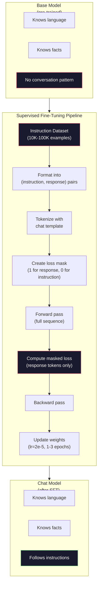

# إعداد التعليمات (SFT) ✓ 指令微调监督微调)

> النموذج الأساسي يتوقع الرمز التالي. هذا هو. لا يتبع التعليمات، أو يجيب على الأسئلة، أو يرفض الطلبات الضارة. SFT هو الجسر بين المتوقع الرمزي ومساعد مفيد. كل نموذج تحدثت معه - كلود، GPT، Llama Chat - مر هذه الخطوة.

> **【中文解读】**基础模型只会预测下一个代币──它不会遵循指令、回答问题或拒绝有害请求──SFT(监督微调) 是连接"代币 预测器"和"有用助手"的桥梁──Claude、ChatGPT、Llama Chat 都经过这个步骤──

> **【拓展：SFT→ChatGPT】**تدريبات الجينات:GPT-3.5 预训练 → SFT(استعمال البيانات المحادثة في علامات البشر)→ RLHF(استعمال البيانات المفضلة في البشر على حد سواء)。SFT هي جعل النموذج الأساسي يصبح خطوة رئيسية للمساعد في المحادثة。

>  **【前置】**學本節前 請先掌握:Phase 10·04(Pre-Training Mini GPT) 理解预训如何得到基础模型;Phase 11·08(LoRA) 理解微调的具体技术(本节是全参微调,LoRA是其轻量版);PyTorch 训练循环基础(loss、优化、退后) 

**Type:** Build
**Languages:** Python (with numpy)
**Prerequisites:** Phase 10, Lesson 04 (Pre-Training a Mini GPT)
**Time:** ~90 minutes

>  **【类比】**SFT = 给"博学"上课──预训让会说所有人话(能力语言),但不会对话(你说"你好",它说"今日天气不错"纯统计接龙)──SFT 用10,000对"问答"示范教它"问你好应该回答你好"从统计变成会谈──

> ️ **【易错点】**3 个坑: ((1) **指令格式不统一**بعض نموذج استخدام `User:`-أجل`Assistant:`، بعضها`<|user|>`-أجل`<|assistant|>`,模型学不会统一格式;务必固定模板(如ChatML) ・・・(2) **拒绝样本不足**100،000 حوار في 50 条 فقط "رفض الطلبات الضارة"، النموذج لن يرفض؛ على الأقل 5-10% رفض النموذج تغطي الهجمات المختلفة.** catastrophic forgetting**SFT 数据太窄 ((全是客服对话), النموذج نسيت القدرة العامة;混入 20-30% 通用数据 ((ألباكا、FLAN)保住基础能力──

## أهداف التعلم

- تنفيذ ضبط رقيق مرصد (SFT) الذي يحول نموذج لغة أساسية إلى مساعد يتبع التعليمات
  实现监督微调(SFT) ،将基础语言模型转换为指令跟随助手
- تنسيق بيانات التدريب باستخدام نماذج الدردشة مع أدوار النظام والمستخدم والمساعد، وفقدان القناع على الرموز غير المساعدة
  استخدام مع نظام / المستخدم / المساعد 角色的聊天模板格式化训练数据,并对非助手代币 进行损失掩码
- شرح لماذا هناك حاجة إلى SFT: النماذج الأساسية تستمر في النص بدلاً من الإجابة على الأسئلة
  شرح لماذا تحتاج إلى SFT: النموذج الأساسي هو مواصلة النص وليس الإجابة على الأسئلة
- تقييم جودة SFT عن طريق مقارنة النموذج الأساسي مقابل استجابات النموذج المحددة على مجموعة تعليمات متأخرة
  من خلال مقارنة النموذج الأساسي مع النموذج المتغير في مجموعة التعليمات المتبقية لتقييم جودة SFT

> **【中文解读】**هذا الدرس سوف يحول النموذج الأساسي إلى تعليمات تتبع المساعد.

## المشكلة المشكلة المشكلة

لقد تدربت نموذج في الدروس 04. يمكنه التنبؤ بالرمز التالي مع إعطاء تسلسل. إطعامها "بنية المعالم" و قد يستمر "قامت بتغيير معالجة اللغة الطبيعية". هذا مثير للإعجاب بالنسبة لموقع الرمز التالي.

> أنت في الدورة الرابعة تدريب على نموذج.

الآن حاول هذا: إطعامها "ما هي عاصمة فرنسا؟" النموذج الأساسي لا يجيب على "باريس". قد ينتج "ما هي عاصمة ألمانيا؟ ما هي عاصمة إسبانيا؟" لأنها تعلمت من الوثائق التي تحتوي على قوائم من الأسئلة. أو قد ينتج "سؤال يطرحه الكثير من الناس" لأن هذا استمرار محتمل للبرنامج التالي. النموذج لا يملك مفهوم *الرد* إنه لا يعرف سوى "التواصل"

> 现在试试这个:输入 "ما هي عاصمة فرنسا؟" 基础模型不会回答"باريس". 它会继续模式──它可能生成 "ما هي عاصمة ألمانيا؟ ما هي عاصمة إسبانيا؟" لأنه من المحتوي على المشكلة قائمة المواد المكتسبة في المقالة.

هذا هو الفجوة بين GPT-3 (نموذج الأساس ، أصدرت في يونيو 2020) و ChatGPT (معدل التعليمات ، أصدرت في نوفمبر 2022). نفس الهندسة المعمارية. نفس التدريب المسبق. الفرق هو 20,000 إلى 100,000 زوجات صناعة بعناية (التعليمات ، الاستجابة) التي علمت النموذج اتباع نمط المحادثة.

> هذا هو الفرق بين GPT-3 (مؤشر أساسي) و ChatGPT (مؤشر أساسي) ، والتي تم نشرها في 11 أكتوبر 2022، والتي تعتبر نفسها.

أظهرت شركة ستانفورد الألباكا أنه لا تحتاج إلى ملايين الأمثلة. في مارس 2023، قاموا بتحسين إلاما 7B على 52 ألف زوج فقط من التعليمات والرد على النظام الذي تم إنشاؤه بواسطة GPT-3.5.$600. The result was a chatbot that could follow instructions, answer questions, and hold conversations. Not as good as ChatGPT, but shockingly close for $600 و بضع ساعات من التدريب

> ستانفورد ألباكا  اثبات أنك لا تحتاج إلى ملايين العينات. في 3 مارس 2023، قاموا فقط باستخدام 52،000 条 GPT-3.5 生成的指令-回复对微调的Llama 7B.

استخدم "ميتا لاما 2 تشات" فقط 27000 مثال عالي الجودة للمرحلة الأولى من SFT. المفهوم الرئيسي: الجودة مهمة أكثر من الكمية. 27000 مثال كتب من قبل الملاحظين المهرة يضرب 1 مليون مثال ضجيج من الإنترنت.

> يستخدم Meta's Llama 2 Chat ابتداء SFT 阶段 فقط حوالي 27،000 条 نموذج عالي الجودة.

> **【中文解读】**GPT-3(2020.6) و ChatGPT(2022.11) بين فقط فرق بين 2،000 إلى 10،000 条精心构建的(指令,回复) 对―― ستانفورد الألبكا باستخدام 52,000 条 GPT-3.5 生成的指令数据微调 Llama 7B,成本 فقط 600 美元── Llama 2 Chat of Meta باستخدام فقط حوالي 27,000 条高质量标签数据──核心洞察:质量比数量更重要27,000 条 条由熟练标签者编写的样本胜过1000000条互联网噪声数据──

> **【拓展：Llama 2 的 SFT 数据质量标准】**يشار إلى أن بيانات SFT في Llama 2 Chat تمت إعدادها من قبل فريق التسجيل المهني ، وتم إجراء مراجعة متعددة الجولات.

## المفهوم الأساسي

### ما تفعله الفيروسات الفكرية

يواصل التنسيق المراقب نفس حلقة التدريب من قبل التدريب -- المضي قدما، فقدان الحسابات، المضي قدما، تحديث الأوزان -- ولكن على نوع مختلف من البيانات. بدلا من النص الخام، تدرب على المحادثات المهيكلة:

> 监督微调延续预训练的相同训练循环前向传播、计算损失、反向传播、更新权重但在不同类型的数据上──你用结构化对话代替原始文本进行训练:

```json
{
  "system": "You are a helpful assistant.",
  "user": "What is the capital of France?",
  "assistant": "The capital of France is Paris."
}
```

تعلمت النموذج بالفعل أن باريس هي عاصمة فرنسا. تعلمت هذا أثناء التدريب المسبق على ويكيبيديا، والكتب الدراسية، والصفحات الإلكترونية. SFT لا يعلم النموذج حقائق جديدة. يعلم النموذج سلوك جديد: عندما ترى سؤال، تنتج إجابة. عندما ترى تعليمات، تنتج إكمال. عندما ترى طلب ضار، تنتج رفض.

> 模型已经知道巴黎是法国的首都──它在预训练期间从维基百科,教科书和网页中学到这一点──SFT 不教模型新事实──它教模型一种新*行为*:看到问题时,给答.看到指令时,给完成.看到有害请求时,给拒绝──

فكري بالأمر بهذه الطريقة. التدريب المسبق يعطي المعرفة النموذجية.

> هذا هو ما يعتقد: التدريب المبدئي يعطي المعرفة المبدئية.

> **【中文解读】**إن أساس SFT هو سلسلة تدريبية للمواصلة ، ولكن البيانات تتحول من النص الأصلي إلى حوار مهيكلي. التقنية الرئيسية هي الخسارة الغابية: فقط في المساعدات.

### تنسيقات البيانات

ثلاثة أشكال تهيمن على هذه الصناعة. كل منها يرمز نفس المعلومات -- من قال ماذا -- مع حددات مختلفة.

> الصناعة الرئيسية لديها ثلاثة أشكال. كل نوع من الرموز نفس المعلومات.

**Alpaca Format**(ستانفورد، مارس 2023):

```json
{
  "instruction": "Summarize the following article in 3 sentences.",
  "input": "The European Central Bank raised interest rates...",
  "output": "The ECB increased rates by 25 basis points..."
}
```

بسيط ومستخدم على نطاق واسع.`input`هذا هو المجال الاختياري -- العديد من التعليمات لا تحتاج إلى سياق إضافي. نشر ستانفورد 52،000 مثال في هذا النموذج، التي تم إنشاؤها من قبل GPT-3.5 مقابل 600 دولار. هذا أطلق حركة ضبط التعليمات مفتوح المصدر.

> 简单且广泛使用──`input`字段是可选的许多指令不需要额外上下文──斯坦福以此格式发布了52,000 样本,由GPT-3.5生成,成本 600 美元──这开启了开源指令微调运动──

**ShareGPT Format**(المجتمع، 2023):

```json
{
  "conversations": [
    {"from": "system", "value": "You are a helpful assistant."},
    {"from": "human", "value": "What causes tides?"},
    {"from": "gpt", "value": "Tides are caused by the gravitational pull of the Moon..."},
    {"from": "human", "value": "How often do they occur?"},
    {"from": "gpt", "value": "Most coastal areas experience two high tides and two low tides per day..."}
  ]
}
```

يدعم المحادثات متعددة التحولات. يستخدم حقل "من" "إنسان" و "gpt" حسب التقليد ، بغض النظر عن النموذج الفعلي. تم تدريب Vicuna على 70,000 محادثة ShareGPT التي تم استخدامه من نسخ ChatGPT المشتركة بين المستخدمين.

> 支持多轮对话──"من" 字段 حسب المعتاد باستخدام "إنسان" 和 "gpt", مهما كان النموذج الحقيقي هو──Vicuna في 70,000 shareGPT على التدريب على المحادثات من المشاركة من المستخدم ChatGPT على سجل المحادثات──

**ChatML Format**(OpenAI، يستخدمها العديد من نماذج المصدر المفتوح):

```
<|im_start|>system
You are a helpful assistant.<|im_end|>
<|im_start|>user
What is the capital of France?<|im_end|>
<|im_start|>assistant
The capital of France is Paris.<|im_end|>
```

يستخدم رموز خاصة (`<|im_start|>`،`<|im_end|>`تُضاف هذه الرموز إلى مفردات الجهاز أثناء ضبطها. تستخدم Qwen، Yi، وغيرها من النماذج الأخرى ChatML.

> استخدام رمز خاص`<|im_start|>`.`<|im_end|>`(→ مقالات)                                                                                                                                                                                                                                                             

كل النماذج الثلاثة تحقق نفس الشيء: يقولون للنموذج "هذه هي التعليمات، هذه هي الاستجابة، تعلم هذا النموذج".

> ثلاثى أشكال تفعل نفس الشيء: أخبر النموذج "هذه تعليمات، هي ردود فعل، تعلم هذا النموذج"".

### لماذا يعمل

لقد رأى الموديل بالفعل اللغة من قبل التدريب. لقد رأى مليارات أمثلة من الأسئلة تليها الإجابات، والإرشادات تليها الإكمالات، والمحادثات بين الناس.

> لقد تعلمت اللغة في التدريبات المسبقة. لقد رأيت مليارات الأسئلة وراء الإجابة وراء التوجيهات وراء الانتهاء.

تركز SFT هذه القدرة الخفية. بدلاً من أن يحتاج النموذج إلى معرفة من السياق ما إذا كان يجب أن يجيب على سؤال أو يستمر في مستند، يقوم SFT بشكل صريح بتدريب نمط المحادثة. بعد بضعة آلاف من الأمثلة، يتعلم النموذج: عندما ترى علامة الدور المساعد، تنتج استجابة مفيدة.

> SFT 集中 هذه القدرة المحتملة. لم تعد بحاجة إلى نموذج من العكس إلى النتائج التي تظهر في المقالة التالية. يجب أن يجيب على الأسئلة أو يستمر في كتابة المقالة.

هذا هو السبب في أن 27000 مثال يكفي. أنت لا تدرس النموذج الإنجليزي. أنت لا تدرس له الحقائق حول العالم. أنت تدرس له سلوك بسيط واحد: الاستجابة للتعليمات. المعرفة كانت موجودة بالفعل.

> هذا هو السبب في أن 27000 مثال يكفي. أنت لست في تعليم النموذج الإنجليزي. لست في تعليمها حول الحقائق العالمية. أنت تدريسها سلوك بسيط:

### الخسارة المختبئة

هذا هو أهم التفاصيل الفنية في SFT، ومعظم الدروس تفوتها.

> هذا هو أهم التفاصيل التقنية في SFT، معظم التدريسات تم تجاوزها.

أثناء التدريب المسبق، تقوم الحساب الخسارة على كل رمز. يتعلم النموذج التنبؤ بكل رمز التالي في التسلسل. خلال SFT، تقوم الحساب الخسارة فقط على رموز * الاستجابة *. رموز التعليمات موجودة للسياق، ولكن النموذج لا يتم عقوبته على "التنبؤ" بها بشكل غير صحيح.

> 预训练时,你对每一个代币 计算损失――模型学习预测序列中的每一个下一个代币――SFT 时,你只对*回复*代币 计算损失――指令代币 提供上下文,但模型不会因"预测"而不准确而受到惩罚――

لماذا؟ لأنك لا تريد أن يتعلم النموذج كيفية * توليد * التعليمات. تريد أن يتعلم كيفية * الاستجابة * للتعليمات. إذا قمت بحساب الخسارة على رموز التعليمات، كنت تدرب النموذج للتنبؤ "ما هو عاصمة فرنسا؟" كما لو أنه هو الذي يطرح السؤال. وهذا يضيع إشارة تراجع ويمكن أن يخلط النموذج في الارتباك حول دوره.

> لماذا؟ لأنك لا تريد أن تكون مدرسة النموذجية* توليد* التعليمات.. أنت تريد أن تكون مدرسة النموذجية* التجاوب* التعليمات.. إذا كنت تتعامل مع رمز التعليمات  حساب الخسارة، أنت في تدريب نموذج التنبؤ "ما هي عاصمة فرنسا؟"، مثلما هو في السؤال..

في الممارسة العملية، تقوم بإنشاء قناع الخسارة: 1 لبرمجيات الاستجابة، 0 لبرمجيات التعليمات. ضرب الخسارة لكل برمجيات بهذه القناع قبل التوسط.

> في الممارسة العملية، أنت تخلق خسارة مخفية: إعادة رمز لـ 1, إرشاد رمز لـ 0.

```
Tokens:    [SYS] You are helpful [USER] What is the capital? [ASST] Paris is the capital [EOS]
Loss mask:   0    0    0     0      0     0   0  0     0       1     1    1   1     1      1
```

فقط الرموز بعد`[ASST]`يساهم النموذج في الخسارة. يرى النموذج المحادثة الكاملة خلال المرور الأمامي (يحتاج إلى التعليمات لإنتاج الاستجابة الصحيحة) ولكن يحدد فقط وزنه استنادا إلى مدى التنبؤ الجيد بالرد.

> فقط`[ASST]`后后的符号 贡献损失──模型在前向传播中看到完整对话它需要指令才能产生正确回复),但只根据预测回复的好坏来更新权重──

### المعلمات المهنية

يستخدم الفحص الفكري مختلفاً بشكل كبير عن المعلمين المسبقين للتدريب، أنت لا تدرب من الصفر، أنت تعديل نموذج يعمل بالفعل.

> استخدام SFT للفائدة المرتفعة يختلف تماما عن التدريب المسبق. أنت لست من التدريب المسبق. أنت تقوم بتعديل نموذج فعال بالفعل.

| Parameter | Pre-Training (Llama 2 7B) | SFT (Llama 2 Chat) |
|-----------|---------------------------|---------------------|
| Learning rate | 3e-4 (peak) | 2e-5 |
| Epochs | 1 (single pass over data) | 2 |
| Batch size | 4M tokens | 64 examples |
| Warmup steps | 2,000 | 0-100 |
| Weight decay | 0.1 | 0.0-0.1 |
| Data size | 2T tokens | 27,000 examples |

معدل التعلم أقل بنسبة 15 مرة لـ SFT. هذا أمر حاسم. معدل التعلم العالي أثناء التنسيق الدقيق يدمر المعرفة المسبقة للتدريب. النموذج "يتنسى" ما تعلمته ويتجاوز مجموعة بيانات التنسيق الدقيق الصغيرة. هذا هو النسيان الكارثي.

> انخفاض معدل التعلم في SFT 15 مرة. هذا أمر مهم.

> **【中文解读】**الخسارة المخفية هي أهم تفاصيل تقنية في SFT.  التدريب المسبق على جميع الرموز  الخسارة الحسابية،  التدريب المسبق فقط على الرموز الإعادة للمساعد  الخسارة الحسابية.  التدريب المسبق على الرموز المستخدمة في تقديم النص التالي، ولكن لا تشارك في الخسارة الحسابية  لا فإن النموذج سيتعلم "إرشادات إنتاج" بدلا من "إرشادات الإجابة".

> **【拓展：SFT 的数据规模与成本】**كمية بيانات SFT أقل من التدريب المقبل:Llama 2 Chat باستخدام 27،000 条、Alpaca باستخدام 52،000 条、Vicuna باستخدام 70،000 条 حوار。 التكلفة منخفضة جداالبالباكا SFT بيانات إنتاج تكلفة 600 دولار فقط。 المفتاح في جودة البيانات بعيدة عن الكمية مهمة。 SFT الحديثة لا يزال يستخدم التعبئة 技术 سوف العديد من المحادثات القصيرة مصطلحة إلى نفس التسلسلة لتحسين استخدام GPU ‬‬‬‬‬‬‬‬‬‬‬‬‬‬‬‬‬‬‬‬‬‬‬‬‬‬‬‬‬‬‬‬‬‬‬‬‬‬‬‬‬‬‬‬‬‬‬‬‬‬‬‬‬‬‬‬‬‬‬‬‬‬‬‬‬‬‬‬‬‬‬‬‬‬‬‬‬‬‬‬‬‬‬‬‬‬‬‬‬‬‬‬‬‬‬‬‬‬‬‬‬‬‬‬‬‬‬‬‬‬‬‬‬‬‬‬‬‬‬‬‬‬‬‬‬‬‬‬‬‬‬‬‬‬‬‬‬‬‬‬‬‬‬‬‬‬‬‬‬‬‬‬‬‬‬‬‬‬‬‬‬‬‬‬‬‬‬‬‬‬‬‬‬‬‬‬‬‬‬‬‬‬‬‬‬‬‬‬‬‬‬‬‬‬‬‬‬‬‬‬‬‬‬‬‬‬‬‬‬‬‬‬‬‬‬‬‬‬‬‬‬‬‬‬‬‬‬‬‬‬‬‬‬‬‬‬‬‬‬‬‬‬‬‬‬‬‬‬‬‬‬‬‬‬‬‬‬‬‬‬‬‬‬‬‬‬‬‬‬‬‬‬‬‬‬‬‬‬‬‬‬‬‬‬‬‬‬‬‬‬‬‬‬‬‬‬‬‬‬‬‬‬‬‬‬‬‬‬‬‬‬‬‬‬‬‬‬‬‬‬‬‬‬‬‬‬‬‬‬‬‬‬‬‬‬‬‬‬‬‬‬‬‬‬‬‬‬‬‬‬‬‬‬‬‬‬‬‬‬‬‬‬‬‬‬‬‬‬‬‬‬‬‬‬‬‬‬‬‬‬

اثنين من العصور يعني أن النموذج يرى كل مثال التدريب مرتين. أكثر من 3 عصور على مجموعة بيانات صغيرة يؤدي إلى التذاكر -- النموذج يبدأ في إعادة إنتاج مثالات التدريب حرفيا بدلاً من التعميم.

> 两时代 两个时代 两个时代 两个时代 两个时代 两个时代 两个时代 两个时代 两个时代 两个时代 两个时代 两个时代 两个时代 两个时代 两个时代 两个时代 两个时代 两个时代 两个时代 两个时代 两个时代 两个时代 两个时代 两个时代 两个时代 两个时代 两个时代 两个时代 两个时代 两个时代 两个时代 两个时代 两个时代 两个时代 两个时代 两个时代 两个时代 两个时代 两个时代 两个时代 两个时代 两个时代 两个时代 两个时代 两个时代 两个时代 两个时代 两个时代 两个时代 两个时代 两个时代 两个时代 两个时代 两个时代 两个时代 两个时代 两个时代 两个时代 两个时代 两个时代 两个时代 两个时代 两个时代 两个时代 两个时代 两个 两个时代 两个 时代 两个 时代 两个 时代 时代 时代 时代 时代 时代 时代 时代 时代 时代 时代 时代 时代 时代 时代 时代 时代 时代 时代 时代 时代 时代 时代 时代 时代 时代 时时时时时时时时时 时 时 时 时 时 时 时 时 时 时 时 时 时 时 时 时 时 时 时 时 时 时 时 时 时 时 时 时 时 时 时 时 时 时 时 时 时 时 时 时 时 时 时 时 时 时 时 时 时 时 时 时 时 时 时 时 时 时 时 时 时 时 时 时 时 时 时 时 时 时 时 时

### النسيان الكارثي

يمكن أن يدمر التنسيق الدقيق القدرات العامة. التدريب على البيانات التي تتبع التعليمات لفترة طويلة جداً ويفقد النموذج قدرته على كتابة الرمز أو القيام بالرياضيات أو إنتاج نص إبداعي. يصبح جيدًا جدًا في النموذج المحدد لبيانات التدريب والمرعب في كل شيء آخر.

> 微调可能破坏 العامة القدرة. في التدريب على البيانات تتبع التعليمات لفترة طويلة، النموذج سوف تفقد القدرة على كتابة البرمجة أو القيام بالرياضيات أو إنتاج نص إبداعي.

ثلاثة تخفيفات:

> ثلاث أساليب للتخفيف:

1. **Low learning rate.**1e-5 إلى 5e-5 - تحديثات أصغر يعني تقليل تدمير الميزات المسبقة للتدريب.

2. **Short training.**1-3 أوقات توقف قبل أن يزداد النموذج

3. **Mix in pre-training data.**خلط Llama 2 Chat نسبة صغيرة (2-5%) من البيانات الخام قبل التدريب في مجموعة بيانات SFT. هذا "يعطى" نموذج قدراته العامة أثناء تعلم السلوك الجديد الذي يتبع التعليمات.

### الأرقام الحقيقية

تحسين نموذج 7B على 10،000 زوج تعليمات عالية الجودة يستغرق حوالي ساعة واحدة على GPU واحد NVIDIA A100 80GB.

> في واحد张 NVIDIA A100 80GB GPU 上 باستخدام 10,000 条 High Quality instruction على التنظيمات الصغيرة 7B 模型大约需要 1 小时──计算如下:

- 10،000 مثال × 512 رموز متوسط = 5.12M رموز
- 2 دور = 10.24 مليون رمز إجمالي
- A100 إمكانية الإنتقال لتحديد النموذج 7B: ~ 3000 رمز/ثانية
- 10.24M / 3000 = ~ 3,400 ثانية = ~ 57 دقيقة

بالنسبة لـ GPT (الأربعة طبقات، 128 درجة) ، التدريب هو تقريباً فوري.

> بالنسبة لنا الغريب GPT ((4 درجة,128 维) ، التدريب تقريبا على الفور.



## بناء ذلك تحرك لتحقيق
```figure
loss-masking
```

## بناءها

### الخطوة الأولى: مجموعة بيانات التعليمات

إنشاء مجموعة بيانات تعليمات اصطناعية في الإنتاج، شركات مثل Scale AI و Anthropic تستخدم مفسرين بشريين للكتابة هذه. سنقوم بإنشاؤها برنامجياً لإظهار النموذج.

> إنشاء مجموعة بيانات التعليمات المركبة. في الإنتاج، تستخدم الشركات AI و Anthropic وغيرها المشاركين الإدراكيين لتكتيب هذه. سنستخدم البرنامج لإنشاءها لتقديمها على شكل.

```python
import numpy as np

INSTRUCTION_DATA = [
    {
        "instruction": "What is the capital of France?",
        "response": "The capital of France is Paris."
    },
    {
        "instruction": "Explain gravity in one sentence.",
        "response": "Gravity is the force that attracts objects with mass toward each other."
    },
    {
        "instruction": "Write a haiku about the ocean.",
        "response": "Waves crash on the shore, salt and foam beneath the sun, endless blue expanse."
    },
    {
        "instruction": "What is 15 multiplied by 7?",
        "response": "15 multiplied by 7 is 105."
    },
    {
        "instruction": "Name three programming languages.",
        "response": "Three programming languages are Python, Rust, and TypeScript."
    },
    {
        "instruction": "Summarize photosynthesis.",
        "response": "Photosynthesis converts sunlight, water, and carbon dioxide into glucose and oxygen."
    },
    {
        "instruction": "What year did World War II end?",
        "response": "World War II ended in 1945."
    },
    {
        "instruction": "Define machine learning.",
        "response": "Machine learning is a field where algorithms learn patterns from data to make predictions."
    },
]
```

8 أمثلة صغيرة. استنفورد ألباكا استخدم 52000، ولكن الميكانيكا هي نفسها سواء كان لديك 8 أو 52000: رمزية، قناع، فقدان الحساب على الاستجابات فقط.

> 八个例子很少── ستانفورد ألباكا استخدم 52،000 个── ولكن سواء كان لديك 8 أو 52،000 个, الجهاز هو نفسه:分词、掩码、 فقط على تعدد الحساب خسارة──

### الخطوة الثانية: إضافة علامات مع نموذج الدردشة

تحويل أزواج التعليمات-الرد إلى تسلسلات رمزية مع علامات دور خاصة. علامات تخبر النموذج أين تنتهي التعليمات ومتى تبدأ الرد.

> سوف تُذكر التوجيهات التي تُعدّل لتحويلها إلى أدوار خاصة.

```python
SPECIAL_TOKENS = {
    "INST_START": 253,
    "INST_END": 254,
    "RESP_START": 255,
}


def tokenize_instruction_pair(instruction, response, vocab_size=256):
    inst_tokens = list(instruction.encode("utf-8"))
    resp_tokens = list(response.encode("utf-8"))

    inst_tokens = [min(t, vocab_size - 4) for t in inst_tokens]
    resp_tokens = [min(t, vocab_size - 4) for t in resp_tokens]

    tokens = (
        [SPECIAL_TOKENS["INST_START"]]
        + inst_tokens
        + [SPECIAL_TOKENS["INST_END"]]
        + [SPECIAL_TOKENS["RESP_START"]]
        + resp_tokens
    )

    return tokens


def create_loss_mask(tokens):
    mask = np.zeros(len(tokens), dtype=np.float32)
    in_response = False

    for i, token in enumerate(tokens):
        if token == SPECIAL_TOKENS["RESP_START"]:
            in_response = True
            continue
        if in_response:
            mask[i] = 1.0

    return mask
```

قناع الخسارة هو كل الصفر لترميزات التعليمات والجميع لترميزات الاستجابة.`RESP_START`الوهم نفسه يحصل على قناع من 0 لأنه هو حد، وليس جزء من محتوى الاستجابة.

> 损失掩码对命令令令 全为 0,对回复令令令 全为 1。`RESP_START`رمز الحجوزات هو 0، لأنه هو منفصل، وليس جزءا من المحتويات.

### الخطوة الثالثة: فقدان التشويش المتقاطع

إنتروبيا متقاطعة قياسية، ولكن مضاعفة بمقنعة الخسارة.

> 标准交叉,但乘以损失掩码 只有回复符号 贡献梯度

```python
def masked_cross_entropy_loss(logits, targets, loss_mask):
    batch, seq_len, vocab_size = logits.shape
    logits_flat = logits.reshape(-1, vocab_size)
    targets_flat = targets.reshape(-1)
    mask_flat = loss_mask.reshape(-1)

    max_logits = logits_flat.max(axis=-1, keepdims=True)
    log_softmax = logits_flat - max_logits - np.log(
        np.exp(logits_flat - max_logits).sum(axis=-1, keepdims=True)
    )

    per_token_loss = -log_softmax[np.arange(len(targets_flat)), targets_flat]

    masked_loss = per_token_loss * mask_flat
    num_response_tokens = mask_flat.sum()
    if num_response_tokens == 0:
        return 0.0
    loss = masked_loss.sum() / num_response_tokens

    return loss
```

المُعنى هو`num_response_tokens`لا ، لا`seq_len`إذا قمت بتقسيمها بالطول الإجمالي للسلسلة، فإن التعليمات الطويلة تخفف إشارة التراجع. تقسيمها بمعدل رموز الاستجابة يضمن وزنًا متساوًا لكل رموز الاستجابة بغض النظر عن طول التعليمات.

> -أجل`num_response_tokens`، ليس`seq_len`إذا تمتزيل طول المسلسل العام، فإن إرشادات أطول ستكون نادرة التفريغات الإشارات‬إذا تمتزيل إرشادات إعادة التأثير، فإن تمتزيل عدد إرشادات إعادة التأثيرات الإشارات 权重相等، بغض النظر عن طول الإرشادات‬‬‬‬‬‬‬‬‬‬‬‬‬‬‬‬‬‬‬‬‬‬‬‬‬‬‬‬‬‬‬‬‬‬‬‬‬‬‬‬‬‬‬‬‬‬‬‬‬‬‬‬‬‬‬‬‬‬‬‬‬‬‬‬‬‬‬‬‬‬‬‬‬‬‬‬‬‬‬‬‬‬‬‬‬‬‬‬‬‬‬‬‬‬‬‬‬‬‬‬‬‬‬‬‬‬‬‬‬‬‬‬‬‬‬‬‬‬‬‬‬‬‬‬‬‬‬‬‬‬‬‬‬‬‬‬‬‬‬‬‬‬‬‬‬‬‬‬‬‬‬‬‬‬‬‬‬‬‬‬‬‬‬‬‬‬‬‬‬‬‬‬‬‬‬‬‬‬‬‬‬‬‬‬‬‬‬‬‬‬‬‬‬‬‬‬‬‬‬‬‬‬‬‬‬‬‬‬‬‬‬‬‬‬‬‬‬‬‬‬‬‬‬‬‬‬‬‬‬‬‬‬‬‬‬‬‬‬‬‬‬‬‬‬‬‬‬‬‬‬‬‬‬‬‬‬‬‬‬‬‬‬‬‬‬‬‬‬‬‬‬‬‬‬‬‬‬‬‬‬‬‬‬‬‬‬‬‬‬‬‬‬‬‬‬‬‬‬‬‬‬‬‬‬‬‬‬‬‬‬‬‬‬‬‬‬‬‬‬‬‬‬‬‬‬‬‬‬‬‬‬‬‬‬‬‬‬‬‬‬‬‬‬‬‬‬‬‬‬‬‬‬‬‬‬‬‬‬‬‬‬‬‬‬‬‬‬‬‬‬‬‬‬‬‬‬‬‬‬‬‬‬‬‬‬‬‬‬‬‬‬‬‬‬‬‬‬‬‬‬‬‬‬‬‬‬‬‬‬‬‬‬‬‬‬‬‬‬‬‬‬‬‬‬‬

### الخطوة الرابعة: حلقة تدريبية لـ SFT

إعادة استخدام MiniGPT من الدروس 04. تبدو حلقة التدريب متطابقة تقريباً مع التدريب المسبق، ولكن مع تنسيق التعليمات والخسارة المخفية.

> 复用第四课程的MiniGPT──循环训练看起来几乎相同与预训练,但有指令格式化和掩码损失──

```python
import sys
import os
sys.path.insert(0, os.path.join(os.path.dirname(__file__), "..", "..", "04-pre-training-mini-gpt", "code"))
from main import MiniGPT, LayerNorm, FeedForward, MultiHeadAttention, TransformerBlock, Embedding


def sft_train(model, dataset, num_epochs=2, lr=2e-5, seq_len=64):
    formatted_data = []
    for example in dataset:
        tokens = tokenize_instruction_pair(example["instruction"], example["response"])
        mask = create_loss_mask(tokens)
        formatted_data.append((tokens, mask))

    print(f"SFT Training: {len(formatted_data)} examples, {num_epochs} epochs, lr={lr}")
    print(f"Total tokens: {sum(len(t) for t, _ in formatted_data):,}")
    print()

    losses = []

    for epoch in range(num_epochs):
        epoch_loss = 0.0
        num_batches = 0

        indices = np.random.permutation(len(formatted_data))

        for idx in indices:
            tokens, mask = formatted_data[idx]

            if len(tokens) < 3:
                continue
            if len(tokens) > seq_len:
                tokens = tokens[:seq_len]
                mask = mask[:seq_len]

            input_ids = np.array(tokens[:-1]).reshape(1, -1)
            target_ids = np.array(tokens[1:]).reshape(1, -1)
            loss_mask = np.array(mask[1:]).reshape(1, -1)

            logits = model.forward(input_ids)
            loss = masked_cross_entropy_loss(logits, target_ids, loss_mask)

            batch_size, s_len, v_size = logits.shape
            probs = np.exp(logits - logits.max(axis=-1, keepdims=True))
            probs = probs / probs.sum(axis=-1, keepdims=True)
            dlogits = probs.copy()
            dlogits[np.arange(batch_size)[:, None], np.arange(s_len), target_ids] -= 1.0

            mask_expanded = loss_mask[:, :, np.newaxis]
            num_resp = loss_mask.sum()
            if num_resp > 0:
                dlogits = dlogits * mask_expanded / num_resp

            for block in model.blocks:
                block.ffn.W1 -= lr * np.random.randn(*block.ffn.W1.shape) * 0.01
                block.ffn.W2 -= lr * np.random.randn(*block.ffn.W2.shape) * 0.01
                block.ffn.b1 -= lr * np.random.randn(*block.ffn.b1.shape) * 0.01
                block.ffn.b2 -= lr * np.random.randn(*block.ffn.b2.shape) * 0.01

            epoch_loss += loss
            num_batches += 1
            losses.append(loss)

        avg_loss = epoch_loss / max(num_batches, 1)
        print(f"Epoch {epoch + 1}/{num_epochs} | Avg Loss: {avg_loss:.4f}")

    return model, losses
```

معدل التعلم هو 2e-5، مماثل للاما 2 تشات. مقارنة هذا مع 3e-4 المستخدمة في التدريب المسبق -- 15x أصغر. يتم إخفاء التدرج: رموز التعليمات تنتج صفر التدرج. رموز الاستجابة فقط تدفع الوزن.

> معدل تعلم 2e-5 ، مع لامة 2 دردشة 一致── مع التدريب الاول 3e-4 相比小 15 倍──梯度被掩码: إرشاد رمز 产生零梯度──只有回复 رمز 推动权重更新──

### الخطوة 5: مقارنة النموذج القائم مقابل SFT

النقطة الكاملة من SFT هي تغيير السلوك. دعونا نقيسها عن طريق التحقق من كيفية استجابة النموذج إلى المدخلات التي يتم تنسيقها على تعليمات مقابل استمرارات النص الخام.

> كل معنى SFT يكمن في تغيير السلوك. دعونا من خلال فحص كيفية الاستجابة لنموذج إرشادات في شكل إدخال مقابل إعادة كتابة النص الأصلي لقياسها.

```python
def generate_response(model, prompt_tokens, max_new_tokens=50, temperature=0.8):
    tokens = list(prompt_tokens)
    seq_len = model.embedding.pos_embed.shape[0]

    for _ in range(max_new_tokens):
        context = np.array(tokens[-seq_len:]).reshape(1, -1)
        logits = model.forward(context)
        next_logits = logits[0, -1, :]

        next_logits = next_logits / max(temperature, 1e-8)
        probs = np.exp(next_logits - next_logits.max())
        probs = probs / probs.sum()
        probs = np.clip(probs, 1e-10, 1.0)
        probs = probs / probs.sum()

        next_token = np.random.choice(len(probs), p=probs)
        tokens.append(int(next_token))

    return tokens


def evaluate_instruction_following(model, instructions):
    print("Evaluating instruction following:")
    print("-" * 50)

    for instruction in instructions:
        tokens = (
            [SPECIAL_TOKENS["INST_START"]]
            + [min(t, 252) for t in list(instruction.encode("utf-8"))]
            + [SPECIAL_TOKENS["INST_END"]]
            + [SPECIAL_TOKENS["RESP_START"]]
        )

        output = generate_response(model, tokens, max_new_tokens=30, temperature=0.6)
        response_start = len(tokens)
        response_tokens = output[response_start:]
        response_bytes = bytes([t for t in response_tokens if t < 128])
        response_text = response_bytes.decode("utf-8", errors="replace")

        print(f"  Q: {instruction}")
        print(f"  A: {response_text[:80]}")
        print()
```

على نموذج صغير مع 8 أمثلة، لا تكون الردود ذات مغزى. هذا متوقع. الشيء المهم هو * الهيكل *: يتعلم النموذج أن ينتج الخروج بعد علامة الاستجابة بدلاً من الاستمرار في توليد المزيد من التعليمات.

> في 8 نموذجات فقط من النماذج الصغيرة، لا يكون الإجراءات ذات مغزى. هذا هو المنتظر.

### الخطوة السادسة: قم بتحديد النسيان الكارثي

مقارنة قدرة النموذج على التنبؤ بالرمز التالي قبل وبعد SFT. إذا أدى SFT إلى تلف القدرات العامة، فإن الخسارة على النص الخام ستزداد.

> مقارنة SFT  التوقعات  القدرة  إذا SFT  أضرار القدرة العامة، فإن الخسائر على النص الأصلي سوف تزداد ‬

```python
def measure_forgetting(model, test_text, seq_len=64):
    tokens = np.array(list(test_text.encode("utf-8")[:512]))

    total_loss = 0.0
    num_windows = 0

    for start in range(0, len(tokens) - seq_len - 1, seq_len):
        input_ids = tokens[start:start + seq_len].reshape(1, -1)
        target_ids = tokens[start + 1:start + seq_len + 1].reshape(1, -1)

        logits = model.forward(input_ids)

        batch, s_len, vocab_size = logits.shape
        logits_flat = logits.reshape(-1, vocab_size)
        targets_flat = target_ids.reshape(-1)

        max_logits = logits_flat.max(axis=-1, keepdims=True)
        log_softmax = logits_flat - max_logits - np.log(
            np.exp(logits_flat - max_logits).sum(axis=-1, keepdims=True)
        )

        loss = -log_softmax[np.arange(len(targets_flat)), targets_flat].mean()
        total_loss += loss
        num_windows += 1

    return total_loss / max(num_windows, 1)
```

في التنسيق الدقيق الحقيقي، يمكنك تتبع هذه المقاييس طوال التدريب. إذا زادت خسارة النص الخام بأكثر من 10 إلى 15٪، فإن SFT الخاص بك هو عدواني جدا. خفض معدل التعلم أو تقليل عدد الفترات.

> في التغييرات الحقيقية، يجب عليك متابعة هذا المؤشر خلال عملية التدريب بأكملها. إذا زادت خسائر النص الأصلي أكثر من 10 إلى 15٪، فهذا يعني أن SFT قد تحسنت كثيرا.

## استخدمها في إطار التنفيذ

### التجربة الكاملة لخط أنابيب SFT

```python
if __name__ == "__main__":
    np.random.seed(42)

    test_text = """The transformer architecture processes sequences through self-attention.
Each layer applies multi-head attention followed by a feedforward network.
Residual connections and layer normalization stabilize deep networks.
The model learns to predict the next token given all previous tokens."""

    print("=" * 70)
    print("INSTRUCTION TUNING (SFT) DEMO")
    print("=" * 70)
    print()

    model = MiniGPT(
        vocab_size=256, embed_dim=128, num_heads=4,
        num_layers=4, max_seq_len=128, ff_dim=512
    )
    print(f"Model: {model.count_parameters():,} parameters")
    print(f"Config: 4 layers, 4 heads, 128 dims (mini GPT from Lesson 04)")
    print()

    print("PRE-SFT: Measuring base model loss on raw text")
    base_loss = measure_forgetting(model, test_text)
    print(f"  Base model loss: {base_loss:.4f}")
    print()

    print("=" * 70)
    print("SFT TRAINING")
    print("=" * 70)

    model, losses = sft_train(
        model, INSTRUCTION_DATA, num_epochs=3, lr=2e-5, seq_len=128
    )

    print()
    print("POST-SFT: Measuring fine-tuned model loss on raw text")
    sft_loss = measure_forgetting(model, test_text)
    print(f"  SFT model loss: {sft_loss:.4f}")
    print(f"  Change: {((sft_loss - base_loss) / base_loss * 100):+.1f}%")
    if abs(sft_loss - base_loss) / base_loss < 0.15:
        print("  Minimal forgetting (< 15% change)")
    else:
        print("  Significant forgetting detected")
    print()

    print("=" * 70)
    print("INSTRUCTION FOLLOWING EVALUATION")
    print("=" * 70)
    print()

    test_instructions = [
        "What is the capital of France?",
        "Name a programming language.",
        "Define gravity.",
    ]
    evaluate_instruction_following(model, test_instructions)

    print("=" * 70)
    print("DATA FORMAT EXAMPLES")
    print("=" * 70)
    print()

    for i, example in enumerate(INSTRUCTION_DATA[:3]):
        tokens = tokenize_instruction_pair(example["instruction"], example["response"])
        mask = create_loss_mask(tokens)
        resp_count = int(mask.sum())
        total_count = len(tokens)
        print(f"  Example {i + 1}: {total_count} tokens, {resp_count} response tokens ({resp_count/total_count:.0%} of sequence)")
        print(f"    Instruction: {example['instruction']}")
        print(f"    Response: {example['response']}")
        print()

    print("=" * 70)
    print("TRAINING LOSS CURVE")
    print("=" * 70)
    print()

    if losses:
        window = max(1, len(losses) // 5)
        for i in range(0, len(losses), window):
            chunk = losses[i:i + window]
            avg = sum(chunk) / len(chunk)
            print(f"  Steps {i:3d}-{i + len(chunk) - 1:3d}: avg loss = {avg:.4f}")
```

## أرسلها .

هذا الدرس يُنتج`outputs/prompt-sft-data-curator.md`-- عرض يساعدك على تصميم وتحكم في مجموعات بيانات التعليمات لـ SFT. بالنظر إلى قدرة الهدف (إنتاج الشفرة والرياضيات والمحادثة) ، فإنه ينتج خطة جمع البيانات مع مواصفات النموذج ومعايير الجودة ومتطلبات التنوع.

## تمارين التدريب

1. إضافة دعم فورية النظام. تعديل `tokenize_instruction_pair`لقبض رسالة النظام وتجهيزها قبل التعليم. قم بإنشاء 5 أمثلة مع طلبات النظام المختلفة ("أنت شاعر" ، "أنت معلم رياضي") والتحقق من أن النموذج يرى طلبات النظام المختلفة أثناء التدريب.

2. تنفيذ مزيج البيانات. إنشاء وظيفة تأخذ مجموعة بيانات SFT و مجموعة نص خام ، ثم تنتج مجموعات تدريبية حيث 5٪ من الأمثلة هي نص خام (لا تخفيض) و 95٪ هي أزواج تعليمات (خفيض). تشغيل 3 حقول وتقارن قياسات النسيان مع تدريب SFT النقي.

3. قم ببناء مؤشر جودة البيانات. لكل زوج من التعليمات والردود، احسب: (أ) طول الاستجابة في الرموز، (ب) نسبة التعليمات للردود، (ج) تنوع المفردات (الرموز الفريدة / الرموز الإجمالية). قم بتصفية الأمثلة التي لديها طول الاستجابة < 10 رموز أو تنوع < 0.3.

4. تنفيذ تدريب محادثة متعددة التحولات. توسيع رمزية التعامل مع محادثات 3 التحولات (المستخدم مساعد-المستخدم مساعد-المستخدم مساعد). يجب أن يغطي قناع الخسارة كل ثلاث التحولات المساعدة. التحقق من أن القناع صحيح عن طريق طباعة التوجه القناع الوهمي على سبيل المثال واحد.

5. مقارنة معدلات التعلم. قم بتدريب نفس النموذج ثلاث مرات مع lr = 1e-4, lr = 2e-5, و lr = 1e-6. رسم منحنى الخسارة. يجب أن يظهر الجولة 1e-4 انخفاضًا سريعًا في البداية ولكن الخسارة النهائية أعلى (تكثيف). يجب أن تتحرك الجولة 1e-6 بالكاد. يجب أن تكون الجولة 2e-5 نقطة اللطيفة.

## شروط الرئيسية

| Term | What people say | What it actually means | 中文释义 |
|------|----------------|----------------------|---------|
| SFT | "Fine-tuning on conversations" | Supervised Fine-Tuning: continuing training on (instruction, response) pairs with loss computed only on response tokens | 监督微调，在指令-回复对上继续训练，仅对回复 token 计算损失 |
| Instruction tuning | "Teaching the model to follow instructions" | Training on explicit instruction-response pairs so the base model learns the conversation pattern, not new knowledge | 指令微调，训练基础模型学会对话模式而非新知识 |
| Loss masking | "Ignoring the prompt" | Setting loss to zero for instruction tokens so gradients only flow from response token predictions | 损失掩码，指令 token 损失设为零，梯度仅来自回复预测 |
| ChatML | "Chat Markup Language" | A token format using `<\|im_start\|>` and `<\|im_end\|>` delimiters to mark speaker roles in conversation data | 聊天标记语言，用特殊 token 标记对话角色 |
| Alpaca format | "Stanford's format" | A JSON format with instruction/input/output fields, used for 52K GPT-3.5-generated examples that cost $600 | Alpaca 格式，Stanford 的 JSON 指令格式，52K 样本成本 $600 |
| Catastrophic forgetting | "The model gets dumber" | Fine-tuning destroys pre-trained capabilities because gradient updates overwrite general knowledge with task-specific patterns | 灾难性遗忘，微调破坏预训练能力 |
| Weight tying | "Shared embeddings" | Using the same matrix for input token embeddings and output prediction head, saving parameters and improving coherence | 权重共享，输入输出共用嵌入矩阵 |
| Chat template | "How you format the prompt" | The specific token sequence (role markers, delimiters) that structures a conversation for the model | 聊天模板，格式化对话的 token 序列 |

## المزيد من القراءة

- [Ouyang et al., 2022 -- "Training language models to follow instructions with human feedback" (InstructGPT)](https://arxiv.org/abs/2203.02155)-- الورقة التي أدخلت إعداد التعليمات + RLHF في OpenAI
- [Taori et al., 2023 -- "Stanford Alpaca: An Instruction-following LLaMA Model"](https://github.com/tatsu-lab/stanford_alpaca)-- 52K أمثلة تعليمات مقابل 600 دولار، إثبات SFT يعمل على مجموعات بيانات صغيرة
- [Touvron et al., 2023 -- "Llama 2: Open Foundation and Fine-Tuned Chat Models"](https://arxiv.org/abs/2307.09288)-- خط أنابيب SFT + RLHF في Meta مع 27K من الأمثلة عالية الجودة
- [Chiang et al., 2023 -- "Vicuna: An Open-Source Chatbot Impressing GPT-4"](https://lmsys.org/blog/2023-03-30-vicuna/)-- تدريب على 70K ShareGPT محادثات
- [Zhou et al., 2023 -- "LIMA: Less Is More for Alignment"](https://arxiv.org/abs/2305.11206)-- يثبت أن 1000 مثال تمت تدوينها بعناية يمكن أن تتطابق مع SFT على مجموعات بيانات أكبر بكثير
