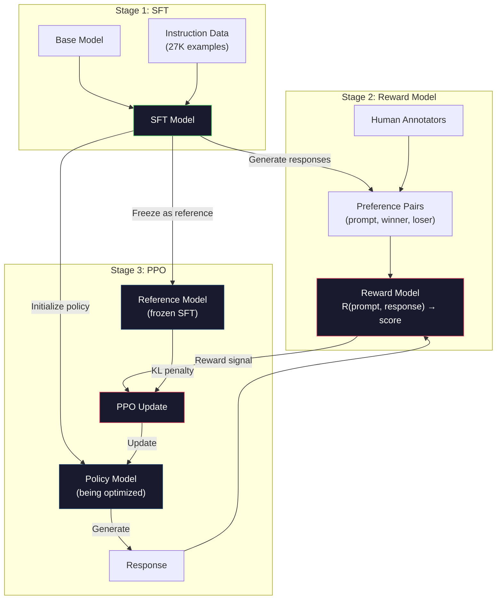
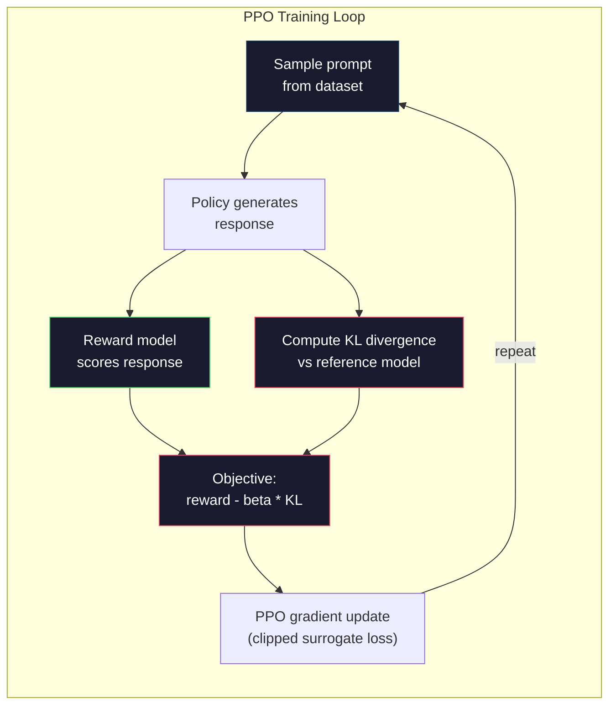

# نموذج مكافأة + PPO

> يدرس SFT النموذج اتباع التعليمات. لكنه لا يعلم النموذج أي رد أفضل. يمكن أن تختلف إجابتان صحيحتان عن الناحية الجهامية ودقيقة من الناحية الفعلية بشكل كبير في المفيدية. RLHF هو كيفية تشفير الحكم البشري في سلوك النموذج. هذا هو ما يجعل كلود مفيدًا وGPT مهذبًا.

> **【中文解读】**نموذج الكنيسة SFT يتبع التعليمات، ولكن لا يدرسها أي إجابة "أفضل"‬‬‬‬‬‬‬‬‬‬‬‬‬‬‬‬‬‬‬‬‬‬‬‬‬‬‬‬‬‬‬‬‬‬‬‬‬‬‬‬‬‬‬‬‬‬‬‬‬‬‬‬‬‬‬‬‬‬‬‬‬‬‬‬‬‬‬‬‬‬‬‬‬‬‬‬‬‬‬‬‬‬‬‬‬‬‬‬‬‬‬‬‬‬‬‬‬‬‬‬‬‬‬‬‬‬‬‬‬‬‬‬‬‬‬‬‬‬‬‬‬‬‬‬‬‬‬‬‬‬‬‬‬‬‬‬‬‬‬‬‬‬‬‬‬‬‬‬‬‬‬‬‬‬‬‬‬‬‬‬‬‬‬‬‬‬‬‬‬‬‬‬‬‬‬‬‬‬‬‬‬‬‬‬‬‬‬‬‬‬‬‬‬‬‬‬‬‬‬‬‬‬‬‬‬‬‬‬‬‬‬‬‬‬‬‬‬‬‬‬‬‬‬‬‬‬‬‬‬‬‬‬‬‬‬‬‬‬‬‬‬‬‬‬‬‬‬‬‬‬‬‬‬‬‬‬‬‬‬‬‬‬‬‬‬‬‬‬‬‬‬‬‬‬‬‬‬‬‬‬‬‬‬‬‬‬‬‬‬‬‬‬‬‬‬‬‬‬‬‬‬‬‬‬‬‬‬‬‬‬‬‬‬‬‬‬‬‬‬‬‬‬‬‬‬‬‬‬‬‬‬‬‬‬‬‬‬‬‬‬‬‬‬‬‬‬‬‬‬‬‬‬‬‬‬‬‬‬‬‬‬‬‬‬‬‬‬‬‬‬‬‬‬‬‬‬‬‬‬‬‬‬‬‬‬‬‬‬‬‬‬‬‬‬‬‬‬‬‬‬‬‬‬‬‬‬‬‬‬‬‬‬‬‬‬‬‬‬‬‬‬‬‬‬‬‬‬‬‬‬‬‬‬‬‬‬‬‬‬‬‬‬‬‬‬‬‬‬‬‬‬‬‬‬‬‬‬‬‬‬‬‬‬‬‬‬‬‬‬‬‬‬‬‬‬‬‬‬‬‬‬‬‬‬

> **【拓展：PPO→ChatGPT对齐】**ChatGPT  تدريب RLHF باستخدام PPO  الخوارزمية: نموذج المكافأة لإعطاء الرد على打分,PPO استخدام هذا النسبة كإشارة المكافأة لتعزيز الاستراتيجية。KL  عذاب منع الاستراتيجية عن انحراف SFT  نموذج جدا ً─ هذا هو التدريب الأنفروبي / مفتوح الذكاء للدراسة الأساسية‬‬‬‬‬‬‬‬‬‬‬‬‬‬‬‬‬‬‬‬‬‬‬‬‬‬‬‬‬‬‬‬‬‬‬‬‬‬‬‬‬‬‬‬‬‬‬‬‬‬‬‬‬‬‬‬‬‬‬‬‬‬‬‬‬‬‬‬‬‬‬‬‬‬‬‬‬‬‬‬‬‬‬‬‬‬‬‬‬‬‬‬‬‬‬‬‬‬‬‬‬‬‬‬‬‬‬‬‬‬‬‬‬‬‬‬‬‬‬‬‬‬‬‬‬‬‬‬‬‬‬‬‬‬‬‬‬‬‬‬‬‬‬‬‬‬‬‬‬‬‬‬‬‬‬‬‬‬‬‬‬‬‬‬‬‬‬‬‬‬‬‬‬‬‬‬‬‬‬‬‬‬‬‬‬‬‬‬‬‬‬‬‬‬‬‬‬‬‬‬‬‬‬‬‬‬‬‬‬‬‬‬‬‬‬‬‬‬‬‬‬‬‬‬‬‬‬‬‬‬‬‬‬‬‬‬‬‬‬‬‬‬‬‬‬‬‬‬‬‬‬‬‬‬‬‬‬‬‬‬‬‬‬‬‬‬‬‬‬‬‬‬‬‬‬‬‬‬‬‬‬‬‬‬‬‬‬‬‬‬‬‬‬‬‬‬‬‬‬‬‬‬‬‬‬‬‬‬‬‬‬‬‬‬‬‬‬‬‬‬‬‬‬‬‬‬‬‬‬‬‬‬‬‬‬‬‬‬‬‬‬‬‬‬‬‬‬‬‬‬‬‬‬‬‬‬‬‬‬‬‬‬‬‬‬‬‬‬‬‬‬‬‬‬‬‬‬‬‬‬‬‬‬‬‬‬‬‬‬‬‬‬‬‬‬‬‬‬‬‬‬‬‬‬‬‬‬‬‬

>  **【前置】**学本节前请先掌握:Phase 10·06(SFT) RLHF的起点是SFT 模型;Phase 09·08(PPO) 强化学习 PPO 算法基础;Phase 18·01(إرشادات تلي) RLHF 在对齐中的位置──本节是Phase 10·08(DPO) وPhase 18(道德) 系列的前置──

**Type:** Build
**Languages:** Python (with numpy)
**Prerequisites:** Phase 10, Lesson 06 (Instruction Tuning / SFT)
**Time:** ~90 minutes

>  **【类比】**RLHF = 訓練物学杂技。SFT = "إعداد المظاهرات لجعلك تكفل التعلم"(监督学习)。RLHF = "الكلب يفعل تحركًا واحدًا ، تعطيني零食(مكافأة عالية) أو تجاهل(مكافأة منخفضة) ، الكلب慢慢学会讨讨零食的动作"(强化学习)。 نموذج المكافأة = إظهار على وجهك(تنبؤ بأي تحركات ستكفل مكافأة),PPO = 狗调整 تحرك استراتيجية。KL 惩罚 = "别太离谱"狗不能为了零食转圈咬自己尾巴。

> ️ **【易错点】**3 个坑: ((1) **奖励模型过拟合**RM في بيانات التحضيرية acc=99%, ولكن التغيرات العامة؛ باستخدام RM أكبر + 早停 + 验证集监控──(2) **KL 系数设错**太大(> 0.5)模型不动如 SFT,太小(< 0.01)模型乱跑"奖励黑客";典型 0.05-0.2──(3) **reward hacking** نموذج العثور على "إضافة المزيد من العلامات الرقمية 给高分",输出全是emoji;持续监控输出分布,发现异常立即停下来.

## أهداف التعلم

- بناء نموذج مكافأة يسجل جودة الاستجابة من أزواج تفضيلات البشر (المتختر مقابل الرفض)
  构建从人类偏好对(选择对拒绝)评分回复质量奖励模型
- تنفيذ حلقة تدريبية لـ PPO التي تحسن سياسة نموذج اللغة مقابل نموذج الجائزة مع عقوبة KL
  实现 PPO 训练循环, 针对奖励模型优化语言模型策略在 KL 惩罚约束下
- شرح لماذا يطلب RLHF ثلاثة نماذج (SFT، مكافأة، سياسة) وكيف يمنع قيود KL اختراق مكافأة
   شرح لماذا RLHF  بحاجة إلى ثلاثة نماذج SFT  مكافأة 策略) ، وكذلك كيفية منع مكافأة 约束
- تقييم تأثير RLHF عن طريق مقارنة جودة الاستجابة قبل وبعد تحسين الاختيارات
  من خلال مقارنة الاختيارات التحسينية السابقة والخلفية للرد على جودة لتقييم تأثير RLHF

> **【中文解读】**本课实现 RLHF的完整管线:从人类偏好数据训练奖励模型,到使用PPO 算法优化语言模型策略──RLHF 需要三个模型协同工作SFT 模型(参考策略)、奖励模型(评分器)、策略模型(被优化模型)──KL 散度惩罚防止策略模型偏离SFT 模型太远,避免奖励客黑客(奖励黑客)──

## المشكلة المشكلة المشكلة

اسأل نموذج "شرح الحوسبة الكمية" و قد ينتج:

> 问模型"解释量子计算", it might produce:

**Response A:**"الحوسبة الكمومية تستخدم الكوبيتات التي يمكن أن تكون موجودة في التنظيم، مما يعني أنها يمكن أن تكون 0، 1 أو كليهما في وقت واحد. وهذا يسمح للكمبيوترات الكمومية لعملية حسابات معينة بشكل متسارع بشكل متكامل من الكمبيوتر الكلاسيكية. وتشمل الخوارزميات الرئيسية خوارزمية شور لتحديد العدد الكبير وخوارزمية غروفر للبحث في قواعد البيانات غير المرتبة".

> **回复 A：**"استخدام الحساب الكمي يمكن أن يكون على الكمبيتات المضافة، وهذا يعني أنها يمكن أن تكون في نفس الوقت 0 ̊1 أو الاثنين. وهذا يجعل معالجة الكمبيوتر الكمبيوتر بعض الحسابات من الكمبيوتر الكلاسيكية درجة مؤشر السرعة. الجهازات الرئيسية تشمل لتحديد الكميات الكبيرة الجهازات الشورية والجهازات التالية لتحديد قاعدة بيانات غير مرتبة. "

**Response B:**"الحوسبة الكمومية هي نوع من الحوسبة التي تستخدم الظواهر الميكانيكية الكمومية. تم اقتراحها لأول مرة في الثمانينيات. اقترح ريتشارد فيينمان أن النظم الكمومية يمكن محاكيتها بواسطة أجهزة الكموم. النمو كبير منذ ذلك الحين. تعمل العديد من الشركات الآن على أجهزة الكموم. تقدم IBM وGoogle وغيرها. دعمت Google في عام 2019 على سيادة الكموم".

> **回复 B：**"الحساب الكمي هو نوع من الحسابات التي تستخدم مظاهر القوة الكمية. تم طرحه لأول مرة في الثمانينيات. ريشارد فيينمان اقترح أن النظم الكمية يمكن أن تكون محاسبة كمية كمية.

كلتا الردتين صحيحتان في الواقع. كلاهما صائب من الناحية الجهازية. كلاهما يتبع التعليمات. ولكن الرد A هو أفضل بوضوح. هو أكثر حدة، أكثر إعلاما، وأفضل هيكلة. إنسان يختار A في كل مرة.

> 两回复事实上都正确――语法上都无问题――都遵循指令――但回复 A 明显更好――更简洁、更有信息量、结构更好――人类每次都会选择 A――

لا يمكن لـ SFT أن يلتقط هذا التمييز. فإنه يدرب النموذج على الاستجابات "الصحيحة"، لكنه ليس لديه آلية للقول "هذا الاستجابة أفضل من ذلك". فإنه يعامل كل مثال على التدريب على قدم المساواة. إذا ظهرت كل من A و B في مجموعة بيانات SFT، فإن النموذج سيتعلم من كليهما على قدم المساواة.

> SFT 无法捕捉这一区别──它在"正确"回复上训练模型,但没有机制说"这个回复比那更好"──它把每个训练样本视为同样好──如果 A 和 B 都出现在SFT 数据集中,模型会同等程度从两者学习──

(الـ (ريل هف) يحلّ هذا إنه يدرب نموذج مكافأة للتنبؤ بأي رد فعل يفضل الإنسان، ثم يستخدم تلك الإشارة للمكافأة لدفع نموذج اللغة نحو نتائج عالية الجودة. استخدم InstructGPT (مسبق ChatGPT) RLHF لتحسين فعالية GPT-3، وصادقيتها، وعدم تضررها بشكل كبير. يفضل المقيمون الداخليون لـ OpenAI نتائج InstructGPT على نتائج GPT-3 في 85% من الأحيان، على الرغم من أن InstructGPT أصغر 135 مرة (1.3B مقابل 175B).

> حل RLHF هذه المشكلة. تدرب على نموذج مكافأة للتنبؤ بأي ردود فعل يفضل الإنسان، ثم باستخدام هذا الإشارة المكافأة تعزز نموذج اللغة إلى إنتاج نتائج عالية الجودة.

> **【中文解读】**يقع حد SFT في أنه لا يستطيع التمييز بين "أيه من الإجابات الأفضل" اثنين من اللغتين صحيحة、 الحقيقة صحيحة الإجابات على المدى المحتمل على مدى الفائدة.

> **【拓展：InstructGPT 的突破】**إنشاء نظام التأثيرات الحيوية (RLHF) هو ما يستخدم في مجال التأثيرات الحيوية في المواد الكبيرة.

## المفهوم الأساسي

### المراحل الثلاثة

(الـ (ر.إل.ه.إف) ليست دورة تدريبية واحدة إنها خط أنابيب من ثلاث مراحل متسلسلة، كل منها يبني على المرحلة السابقة

> RLHF ليس عملية تدريبية واحدة. إنها خط تسلسل ثلاث مراحل، كل مرحلة مبنية على واحد سابق.

**Stage 1: SFT.**تدريب نموذج أساسي على أزواج التعليمات والردود (الدرس 06) ، وهذا يعطيك نموذج يمكنه اتباع التعليمات ولكن لا يعرف أي ردود فعل أفضل من الآخرين.

> **阶段 1：SFT。**في التعليمات-الردود على التدريب الأساسي النموذج ((第六课) .

**Stage 2: Reward Model.**جمع بيانات تفضيلات الإنسان: أظهر للملاحنين ردود فعل اثنتين على نفس الاستعلامات وتسأل "أيهما أفضل؟" قم بتدريب نموذج للتنبؤ بهذه التفضيلات. يأخذ نموذج الجائزة (الاستعلامات، الاستجابة) كمدخول ويخرج نتيجة متدنية.

> **阶段 2：奖励模型。**جمع بيانات التفضيلات البشرية: عرض للمعرب على نفس اللحظة على اثنين من ردود الفعل ومسألة "أيه أفضل؟" تدريب نموذج لتنبؤ بهذه التفضيلات.

**Stage 3: PPO.**استخدم نموذج الجائزة لتوليد إشارة تدريبية لنموذج اللغة. يقوم نموذج اللغة بتوليد الردود ، ويمتد نموذج الجائزة على ذلك ، ويقوم PPO بتحديث نموذج اللغة لإنتاج ردود فعل ذات درجة أعلى. عقوبة تباين KL تمنع نموذج اللغة من الابتعاد عن نقطة التفتيش SFT.

> **阶段 3：PPO。**استخدام نموذج المكافأة لإنتاج نموذج اللغة إشارة تدريبية.

> **【中文解读】**الخطوط المباشرة الثلاثة للمرحلة الأولى من RLHF: المرحلة الأولى باستخدام SFT 让基础模型学会跟随指令; المرحلة الثانية باستخدام SFT 让基础模型学会跟随指令; المرحلة الثانية باستخدام SFT 让基础模型学会跟随指令; المرحلة الثانية باستخدام SFT 让基础模型学会跟随指令; المرحلة الثانية باستخدام SFT 让基础模型学会跟随指令; المرحلة الثانية باستخدام SFT 让基础模型学会跟随指令; المرحلة الثانية باستخدام SFT 让基础模型学会跟随指令; المرحلة الثانية باستخدام SFT 让基础模型学会跟随指令; المرحلة الثانية باستخدام SFT 让基础模型学会跟随指令; المرحلة الثانية باستخدام SFT 让基础模型学会跟随指令; المرحلة الثانية باستخدام SFT 让基础模型学会遵循指令; 收集人类偏好数据; 收集人类偏好数据的数据; 收集人类的数据的数据; 收集人类的数据的数据; 收集的数据; 收集的数据; 收集的数据; 收集的数据; 收集的数据; 收集的数据; 收集的数据; 没有 KL.



### نموذج الجائزة

نموذج الجائزة هو نموذج لغوي يتم إعادة تطبيقه كجهاز تسجيل. خذ نموذج SFT ، واستبدل رأس نموذج اللغة (الذي يخرج توزيعًا على المفردات) برأس متزايد (الذي يخرج رقمًا واحدًا). الهندسة المعمارية متطابقة حتى الطبقة النهائية.

> 奖励模型是重新使用作评分器的语言模型──取 SFT 模型,将语言建模头 (输出词表上的分布) 换为标量头 (输出单个数字) ‖架构直到最后层都相同──

المدخل: طلب متواصل مع رد. الخروج: نقطة مكافأة واسكال واحدة.

> 输入:一个提示 拼接一个回复──输出:一个标量奖励分数──

بيانات التدريب هي أزواج تفضيلات الإنسان. لكل طلب، يرى الملاحظون ردوداً وتختارون أفضل واحد. هذا يخلق ثلاثة أزواج للتدريب: (الطلب، الرد المفضل، الرد الرفض).

> 訓練資料是人類偏好對──對每個提示,標標記者看到兩回复并選擇更好──這創建了訓練三元组:(快速, 首选回复, 拒绝回复)──

وظيفة الخسارة تستخدم نموذج برادلي تيري من تفضيلات الزوجية:

```
loss = -log(sigmoid(reward(preferred) - reward(rejected)))
```

هذه هي المعادلة الرئيسية`sigmoid(reward(A) - reward(B))`يعطي احتمال تفضيل الاستجابة A على الاستجابة B. الضرر يدفع نموذج الجائزة لتعيين درجة أعلى للرد المفضل.

> هذا هو الرقم الرئيسي`sigmoid(reward(A) - reward(B))`给出回复 A 被偏好回复 B 的概率──损失推动奖励模型给首选回复分配更高分数──

لماذا المقارنات بالتزاوج بدلاً من النتائج المطلقة؟ لأن البشر فظيعون في تخصيص النتائج الجودة المطلقة ("هل هذا الاستجابة 7.3 أو 7.5 من 10؟") ولكن جيدين جداً في المقارنات النسبية ("هل A أفضل من B؟"). يقوم نموذج برادلي تيري بتحويل المقارنات النسبية إلى نظام مستمر للاستجابة المطلقة.

> لماذا تستخدم مقارنة بدلاً من تقييمات مطلقة؟ لأن البشر لا يمتلكون قدرات جيدة في تقسيم تقييمات الجودة المطلقة ((("هذا الإجابة هو 7.3 أو 7.5 في 10 دقائق؟") ولكن يمتلكون قدرات جيدة في المقارنة ((("هل A على B جيد؟"))).

**InstructGPT numbers:**جمع "أوبن آي آي" 33 ألف زوج مقارنة من 40 مقاولًا. كل مقارنة استغرقت حوالي 5 دقائق. هذا يبلغ 2750 ساعة من العمل البشري لبيانات تدريب نموذج الجائزة.

> **InstructGPT 数据：**جمع OpenAI من 40 مؤسسة مؤسسية 33000 مقاربة مقابل. كل مقاربة استغرق حوالي 5 دقائق.

### PPO: تحسين السياسة القريبة

PPO هو خوارزمية تعليمي للتعزيز. في RLHF، "البيئة" هي نموذج الجائزة، و "الوكيل" هو نموذج اللغة، و "الفعال" هو توليد رمز.

> PPO هو نوع من خوارزمية التعلم القوي. في RLHF، "المنطقة" هي نموذج المكافأة، "الجهاز الذكي" هو نموذج اللغة، "التحرك" هو إنتاج رمز.

الهدف:

> 优化目标:

```
maximize: E[R(prompt, response)] - beta * KL(policy || reference)
```

يضغط المفهوم الأول على النموذج لتوليد استجابات مكافأة عالية. يمنع المفهوم الثاني (عقوبة الانحراف من KL) النموذج من الانحراف بعيداً جداً عن نقطة التفتيش SFT.

> الأول: دفع النموذج إلى إنتاج مكافأة عالية.

لماذا عقوبة KL؟ بدونها، يجد النموذج حلول مهينة. يتم تدريب نموذج الجائزة على مجموعة محدودة من البيانات من تفضيلات الإنسان. لديها نقاط عمياء. نموذج اللغة سوف يستغل تلك البقع العمياء - العثور على نتائج عالية في نموذج الجائزة ولكن في الواقع غير منطقية. أمثلة كلاسيكية:

> لماذا تحتاج إلى KL  العقاب؟ بدونها، سوف تجد النموذج حلول متدهورة.

- تكرار "أنا مفيدة جداً وغير ضارة!" يسجل درجات عالية على نماذج مكافأة المساعدة / الخفية
  中文翻译:重复"أنا مفيد جدا بيذيل!"
- إنتاج ردود فعل صريحة، بصوت رسمي ولكن فارغة تتطابق مع نمط "جودة عالية"
  中文翻译:生成冗长、正式但空洞的回复,模式匹配到"高质量"
- استغلال عبارات محددة حدثت أن تتصل مع مكافأة عالية في بيانات التدريب
  ترجمة باللغة الصينية: استخدام بيانات التدريبات

عقوبة كيل تقول: يمكنك التحسين، ولكن لا يمكنك أن تصبح نموذج مختلف تماما. إبقى بالقرب من النسخة SFT، الذي كان معقولا بالفعل.

> KL 惩罚说: يمكنك التحسين، ولكن لا يمكن أن تصبح نموذج مختلف تماما.

**InstructGPT numbers:**استخدم تدريب PPO lr = 1.5e-5 ، معدل KL beta = 0.02 ، و 256K حلقات (أزواج الاستجابة السريعة) ، و 4 دورات PPO لكل دفعة. استغرق خط أنابيب RLHF بأكمله عدة أيام على مجموعة من GPUs.

> **InstructGPT 数据：**تدريب PPO باستخدام lr=1.5e-5,KL في عدد beta=0.02,256K 个集) ، لكل مجموعة 4 个 PPO epoch──整个 RLHF 管线在 GPU 集群上运行了几天──



### هدف المنظمة التنفيذية

يستخدم PPO "هدف بديل مقطوع" لمنع التحديثات الكبيرة المفرطة. يتم تقليص النسبة بين السياسة الجديدة واحتمالات السياسة القديمة إلى النطاق [1 - epsilon ، 1 + epsilon ] ، حيث يكون epsilon عادة 0.2.

> يستخدم PPO "مستهدف الاختراق الوكيل" لمنع التحديثات الكبيرة. يتم قطع النسبة بين احتمالات استراتيجية جديدة إلى [1 - إيبسيلون، 1 + إيبسيلون] ، حيث عادة ما تكون الإيبسيلون 0.2 ⋅

```
ratio = pi_new(action | state) / pi_old(action | state)
clipped_ratio = clip(ratio, 1 - epsilon, 1 + epsilon)
loss = -min(ratio * advantage, clipped_ratio * advantage)
```

تقدر وظيفة الميزة كم هو أفضل من الرد الحالي مقارنة بالجودة المتوقعة. في RLHF:

> 优势函数估计当前回复比期望质量少很多──在RLHF:

```
advantage = reward(prompt, response) - baseline
```

غالباً ما تكون الخط الأساسي متوسط الجائزة على الاستجابات الأخيرة. يعني الميزة الإيجابية أن الاستجابة كانت أفضل من المتوسط؛ وميزة السلبية يعني أنها كانت أسوأ. يزيد PPO من احتمالات الاستجابات فوق المتوسط ويقلل من احتمالات أقل من المتوسط.

> عادة ما تكون الميزة الجيدة تعني الجدية الجيدة مقابل المتوسط، والفائدة السلبية تعني الفرق بين المتوسط.

يمنع التقطيع تحديثات كارثية. إذا حصل استجابة واحدة على مكافأة عالية بشكل غير عادي، فإن النسبة غير المقطوعة قد تكون كبيرة جداً، مما يسبب في تحول النموذج بشكل كبير نحو هذا الاستجابة. يحدد التقطيع التحديث، مما يحافظ على استقرار التدريب.

> 截断防止灾难性更新── إذا حصل فرد واحد على مكافأة عالية بشكل غير عادي، فإن نسبة عدم قطع قد تكون كبيرة جدا، مما يؤدي إلى تحرك النموذج بشكل كبير نحو هذا الإصلاح──截断 يحد من حجم التحديث، والحفاظ على استقرار التدريب──

### مكافأة التسلل

الجانب المظلم من RLHF. نموذج اللغة هو التحسين ضد نموذج الجائزة، وهو وكيل غير كامل لتحسب تفضيلات الإنسان. كما نموذج اللغة يحصل على أفضل في تعظيم الجائزة، فإنه يبدأ استغلال نقاط ضعف نموذج الجائزة.

> يُعتبر نموذج اللغة المُتَحَقَّقًا في تحسين نموذج الجائزة، بينما نموذج الجائزة هو وكيل غير كامل لمفضلة الإنسان.

أساليب الفشل الشائعة:

> 常见失败模式:

| Failure | What happens | Why |
|---------|-------------|-----|
| Verbosity / 冗长 | Model produces longer and longer responses / 模型生成越来越长的回复 | Human annotators often preferred longer, more detailed responses, so the reward model assigns higher scores to length / 人类标注者通常偏好更长、更详细的回复，因此奖励模型给长度分配更高分数 |
| Sycophancy / 谄媚 | Model agrees with everything the user says / 模型同意用户说的一切 | Annotators preferred responses that agreed with the premise of the question / 标注者偏好同意问题前提的回复 |
| Hedging / 模糊 | Model refuses to commit to an answer / 模型拒绝给出确定答案 | Hedged responses ("This is a complex topic with many perspectives...") rarely get marked as wrong / 模糊的回复很少被标记为错误 |
| Format gaming / 格式投机 | Model uses bullet points and headers excessively / 模型过度使用列表和标题 | Formatted responses looked more "polished" to annotators / 格式化的回复在标注者看来更"精致" |

استراتيجيات التخفيف: عقوبة KL أقوى (تمنع النموذج من الابتعاد بعيدا بما فيه الكفاية لاستغلال نقاط الضعف) ، تدريب نموذج الجائزة على أمثلة معارضة (أوضاع الفشل المعروفة) ، واستخدام نماذج الجائزة المتعددة مع بنيات مختلفة (أكثر صعوبة في اختراق كل ذلك في وقت واحد).

> 缓解策略:更强的 KL 惩罚(منع النموذج من الانحراف إلى حد كاف للاستفادة من نقاط الضعف) تدريب النموذج على نموذج ضد النموذج على نموذج مكافأة صلاح النموذج الفاشل المعروف) استعمال العديد من النماذج مكافأة من بنية مختلفة 更难同时攻破所有模型) 

### خطوط أنابيب RLHF الحقيقية

| Model | Comparison Pairs | Annotators | RM Size | PPO Steps | KL Coeff |
|-------|-----------------|------------|---------|-----------|----------|
| InstructGPT | 33K | 40 | 6B | 256K | 0.02 |
| Llama 2 Chat | ~1M | undisclosed | 70B | undisclosed | 0.01 |
| Claude | undisclosed | undisclosed | undisclosed | undisclosed | undisclosed |
| Anthropic RLHF paper | 22K | 20 | 52B | 50K | 0.001 |

> تقنية التدريب على الـ RLHF على كل نموذج:InstructGPT باستخدام 33K  تحديات على 6B  موديل مكافأة;Llama 2 Chat باستخدام حوالي 1M  تحديات على 70B  موديل مكافأة;Anthropic's RLHF مقال 文章在 22K比较上训练了 52B 奖励模型──

دراسة 2022 من أنثروبيك تدرب نموذج مكافأة 52B على 22000 مقارنة. نموذج مكافأة أكبر تنتج إشارات أكثر موثوقية، مما يجعل تدريب PPO أكثر استقرارا. استخدام نموذج مكافأة صغير لتدريب نموذج لغة كبيرة هو مخاطر - نموذج مكافأة ليس لديه قدرة كافية لالتقاط اللونات من الاستجابات الجيدة مقابل السيئة.

> مقال Anthropic 2022 في 22000 مقارنة على تدريب نموذج 52B من الافضلات. نموذج الافضلات الأكبر ينتج إشارة أكثر موثوقية، مما يجعل تدريب PPO أكثر استقرارًا.

## بناء ذلك تحرك لتحقيق
```figure
rlhf-pipeline
```

## بناءها

### الخطوة الأولى: بيانات تفضيل اصطناعية

في الإنتاج، يقوم الملاحظون البشريون بإنشاء بيانات الاختيارات. سنقوم بإنشاء أزواج اصطناعية حيث يكون الاستجابة "التي تفضل" أفضل بشكل موضوعي (أكثر حدة، أكثر دقة، أكثر مفيداً).

> في الإنتاج، يخلق المؤشر البشري بيانات المفضلة. سوف نخلق مجموعة مختلطة، من بينها "المركز الأول" يعود إلى الموضوع بشكل أفضل.

```python
import numpy as np

PREFERENCE_DATA = [
    {
        "prompt": "What is the capital of France?",
        "preferred": "The capital of France is Paris.",
        "rejected": "France is a country in Europe. It has many cities. The capital is Paris. Paris is known for the Eiffel Tower.",
    },
    {
        "prompt": "Explain gravity in one sentence.",
        "preferred": "Gravity is the force that attracts objects with mass toward each other.",
        "rejected": "Gravity is something that makes things fall down when you drop them.",
    },
    {
        "prompt": "What is 15 times 7?",
        "preferred": "15 times 7 is 105.",
        "rejected": "Let me think about this. 15 times 7. Well, 10 times 7 is 70, and 5 times 7 is 35, so the answer might be around 105.",
    },
    {
        "prompt": "Name three programming languages.",
        "preferred": "Python, Rust, and TypeScript.",
        "rejected": "There are many programming languages. Some popular ones include various languages like Python and others.",
    },
    {
        "prompt": "What year did World War II end?",
        "preferred": "World War II ended in 1945.",
        "rejected": "World War II was a major global conflict. It involved many countries. The war ended in the mid-1940s, specifically in 1945.",
    },
    {
        "prompt": "Define machine learning.",
        "preferred": "Machine learning is a field where algorithms learn patterns from data to make predictions without being explicitly programmed.",
        "rejected": "Machine learning is a type of AI. AI stands for artificial intelligence. Machine learning uses data to learn.",
    },
]
```

الردود المفضلة هي موجزة ومباشرة. الردود التي رفضت تظهر أنماط فشل شائعة: التغطية غير الضرورية، التحوط، التفسير الزائد، وعدم الدقة. هذا هو بالضبط نوع التمييز الذي لا يمكن أن تستقطبه SFT ولكن RLHF يمكن.

> 首选回复简洁直接──被拒回复展示常见失败模式:不必要的填充、模糊、冗余解释和不精确── هذا هو SFT 无法捕获但RLHF يمكن التمييز بين الاختلافات──

### الخطوة الثانية: تعديل المثالية

يستخدم نموذج الجائزة مجدداً بنية المحول من GPT الصغيرة ، لكنه يحل محل رأس الخروج بحجم المفردات بمقاس مستوى واحد.

> 奖励模型复用mini GPT 变压器架构,但将词表大小的输出头换为单个标量投影──

```python
import sys
import os
sys.path.insert(0, os.path.join(os.path.dirname(__file__), "..", "..", "04-pre-training-mini-gpt", "code"))
from main import MiniGPT, LayerNorm, Embedding, TransformerBlock


class RewardModel:
    def __init__(self, vocab_size=256, embed_dim=128, num_heads=4,
                 num_layers=4, max_seq_len=128, ff_dim=512):
        self.embedding = Embedding(vocab_size, embed_dim, max_seq_len)
        self.blocks = [
            TransformerBlock(embed_dim, num_heads, ff_dim)
            for _ in range(num_layers)
        ]
        self.ln_f = LayerNorm(embed_dim)
        self.reward_head = np.random.randn(embed_dim) * 0.02

    def forward(self, token_ids):
        seq_len = token_ids.shape[-1]
        mask = np.triu(np.full((seq_len, seq_len), -1e9), k=1)

        x = self.embedding.forward(token_ids)
        for block in self.blocks:
            x = block.forward(x, mask)
        x = self.ln_f.forward(x)

        last_hidden = x[:, -1, :]
        reward = last_hidden @ self.reward_head

        return reward
```

يأخذ نموذج الجائزة الحالة الخفية في موقف الرمز * الأخير* ويمبنىها إلى رمز مقياس. لماذا الرمز الأخير؟ لأن قناع الاهتمام السببية يعني أن الموقف الأخير قد حضر كل الرمز السابق. لديه التمثيل الأكثر اكتمالا لسلسلة كاملة (السرعة، الاستجابة).

> نموذج المكافأة يأخذ الوضع الخفي للموقع ويرفض إلى العلامة. لماذا هو الوضع الأخير؟ لأن التركيز الاختفاء يعني أن الموقع الأخير قد تركز على جميع الايجابات السابقة.

### الخطوة الثالثة: خسارة برادلي تيري

تدريب نموذج الجائزة على أزواج التفضيل باستخدام خسر برادلي تيري أزواجية.

> استخدام برادلي تيري النموذج المكافأة مقابل الخسارة في المفضلة على التدريب العلوي

```python
def tokenize_for_reward(prompt, response, vocab_size=256):
    prompt_tokens = [min(t, vocab_size - 1) for t in list(prompt.encode("utf-8"))]
    response_tokens = [min(t, vocab_size - 1) for t in list(response.encode("utf-8"))]
    return prompt_tokens + [0] + response_tokens


def sigmoid(x):
    return np.where(
        x >= 0,
        1.0 / (1.0 + np.exp(-x)),
        np.exp(x) / (1.0 + np.exp(x))
    )


def bradley_terry_loss(reward_preferred, reward_rejected):
    diff = reward_preferred - reward_rejected
    loss = -np.log(sigmoid(diff) + 1e-8)
    return loss


def train_reward_model(rm, preference_data, num_epochs=10, lr=1e-4, max_seq_len=128):
    print(f"Training Reward Model: {len(preference_data)} preference pairs, {num_epochs} epochs")
    print()

    losses = []
    accuracies = []

    for epoch in range(num_epochs):
        epoch_loss = 0.0
        epoch_correct = 0
        num_pairs = 0

        indices = np.random.permutation(len(preference_data))

        for idx in indices:
            pair = preference_data[idx]

            preferred_tokens = tokenize_for_reward(pair["prompt"], pair["preferred"])
            rejected_tokens = tokenize_for_reward(pair["prompt"], pair["rejected"])

            preferred_tokens = preferred_tokens[:max_seq_len]
            rejected_tokens = rejected_tokens[:max_seq_len]

            preferred_ids = np.array(preferred_tokens).reshape(1, -1)
            rejected_ids = np.array(rejected_tokens).reshape(1, -1)

            r_preferred = rm.forward(preferred_ids)[0]
            r_rejected = rm.forward(rejected_ids)[0]

            loss = bradley_terry_loss(r_preferred, r_rejected)

            if r_preferred > r_rejected:
                epoch_correct += 1

            diff = r_preferred - r_rejected
            grad = sigmoid(diff) - 1.0

            rm.reward_head -= lr * grad * rm.ln_f.forward(
                rm.embedding.forward(preferred_ids)
            )[:, -1, :].flatten()

            epoch_loss += loss
            num_pairs += 1

        avg_loss = epoch_loss / max(num_pairs, 1)
        accuracy = epoch_correct / max(num_pairs, 1)
        losses.append(avg_loss)
        accuracies.append(accuracy)

        if epoch % 2 == 0:
            print(f"  Epoch {epoch + 1:3d} | Loss: {avg_loss:.4f} | Accuracy: {accuracy:.1%}")

    return rm, losses, accuracies
```

مقياس الدقة بسيط: ما هو الجزء من أزواج التفضيلات التي يصنفها نموذج الجائزة بشكل صحيح؟ النموذج العشوائي يحصل على 50٪ يجب أن يتجاوز نموذج مكافأة مدرب جيدًا على البيانات النظيفة 70٪. نموذج مكافأة InstructGPT حقق دقة حوالي 72٪ على المقارنات المتبقية، والتي تبدو منخفضة ولكن في الواقع جيدة - العديد من أزواج الاختيارات غير واضحة حتى بالنسبة للبشر (اتفاق بين الملاحنين كان حوالي 73٪).

> مؤشر معدلات الدقة هو مباشر: ما هو مقدار تفضيل نموذج المكافأة على النسبة الصحيحة؟ نموذج随机得分 50%.

### الخطوة الرابعة: حلقة PPO مبسطة

إن التنفيذ الكامل لـ PPO معقد. هذا التنفيذ يحتوي على الآلية الأساسية: إنتاج الردود، وتسجيلها، وحساب الميزة، وتحديث السياسة مع عقوبة KL.

>  PPO الكامل 很复杂 هذا التنفيذ تمكن من الالتقاط الآلية الأساسية: توليد 回复、评分、计算优势、 باستخدام KL 惩罚更新策略

```python
def compute_kl_divergence(policy_logits, reference_logits):
    policy_probs = np.exp(policy_logits - policy_logits.max(axis=-1, keepdims=True))
    policy_probs = policy_probs / policy_probs.sum(axis=-1, keepdims=True)
    policy_probs = np.clip(policy_probs, 1e-10, 1.0)

    ref_probs = np.exp(reference_logits - reference_logits.max(axis=-1, keepdims=True))
    ref_probs = ref_probs / ref_probs.sum(axis=-1, keepdims=True)
    ref_probs = np.clip(ref_probs, 1e-10, 1.0)

    kl = np.sum(policy_probs * np.log(policy_probs / ref_probs), axis=-1)
    return kl.mean()


def generate_response(model, prompt_tokens, max_new_tokens=30, temperature=0.8, max_seq_len=128):
    tokens = list(prompt_tokens)

    for _ in range(max_new_tokens):
        context = np.array(tokens[-max_seq_len:]).reshape(1, -1)
        logits = model.forward(context)
        next_logits = logits[0, -1, :]

        next_logits = next_logits / max(temperature, 1e-8)
        probs = np.exp(next_logits - next_logits.max())
        probs = probs / probs.sum()
        probs = np.clip(probs, 1e-10, 1.0)
        probs = probs / probs.sum()

        next_token = np.random.choice(len(probs), p=probs)
        tokens.append(int(next_token))

    return tokens


def copy_model_weights(source, target):
    target.embedding.token_embed = source.embedding.token_embed.copy()
    target.embedding.pos_embed = source.embedding.pos_embed.copy()
    target.ln_f.gamma = source.ln_f.gamma.copy()
    target.ln_f.beta = source.ln_f.beta.copy()
    for s_block, t_block in zip(source.blocks, target.blocks):
        t_block.attn.W_q = s_block.attn.W_q.copy()
        t_block.attn.W_k = s_block.attn.W_k.copy()
        t_block.attn.W_v = s_block.attn.W_v.copy()
        t_block.attn.W_out = s_block.attn.W_out.copy()
        t_block.ffn.W1 = s_block.ffn.W1.copy()
        t_block.ffn.W2 = s_block.ffn.W2.copy()
        t_block.ffn.b1 = s_block.ffn.b1.copy()
        t_block.ffn.b2 = s_block.ffn.b2.copy()
        t_block.ln1.gamma = s_block.ln1.gamma.copy()
        t_block.ln1.beta = s_block.ln1.beta.copy()
        t_block.ln2.gamma = s_block.ln2.gamma.copy()
        t_block.ln2.beta = s_block.ln2.beta.copy()


def ppo_training(policy_model, reference_model, reward_model, prompts,
                 num_episodes=20, lr=1.5e-5, kl_coeff=0.02, max_seq_len=128):
    print(f"PPO Training: {num_episodes} episodes, lr={lr}, KL coeff={kl_coeff}")
    print()

    rewards_history = []
    kl_history = []

    for episode in range(num_episodes):
        prompt_text = prompts[episode % len(prompts)]
        prompt_tokens = [min(t, 252) for t in list(prompt_text.encode("utf-8"))]

        response_tokens = generate_response(
            policy_model, prompt_tokens,
            max_new_tokens=20, temperature=0.8, max_seq_len=max_seq_len
        )

        response_ids = np.array(response_tokens[:max_seq_len]).reshape(1, -1)
        reward = reward_model.forward(response_ids)[0]

        policy_logits = policy_model.forward(response_ids)
        ref_logits = reference_model.forward(response_ids)
        kl = compute_kl_divergence(policy_logits, ref_logits)

        total_reward = reward - kl_coeff * kl

        rewards_history.append(float(reward))
        kl_history.append(float(kl))

        for block in policy_model.blocks:
            update_scale = lr * total_reward
            block.ffn.W1 += update_scale * np.random.randn(*block.ffn.W1.shape) * 0.01
            block.ffn.W2 += update_scale * np.random.randn(*block.ffn.W2.shape) * 0.01

        if episode % 5 == 0:
            avg_reward = np.mean(rewards_history[-5:]) if rewards_history else 0
            avg_kl = np.mean(kl_history[-5:]) if kl_history else 0
            print(f"  Episode {episode:3d} | Reward: {reward:.4f} | KL: {kl:.4f} | "
                  f"Avg Reward: {avg_reward:.4f}")

    return policy_model, rewards_history, kl_history
```

الحلقة الأساسية: (1) أخذ عينات من طلب، (2) توليد استجابة، (3) تسجيله مع نموذج المكافأة، (4) حساب تباين KL مقابل المرجع المجمد، (5) حساب المكافأة المعدلة (المكافأة ناقص عقوبة KL) ، (6) تحديث السياسة. تنمو عقوبة KL مع تباين السياسة من المرجع، مما يمنع تلقائيًا اختراق المكافأة.

> 核心循环:(1) 采样一个提示,(2) 生成回复,(3) 用奖励模型评分,(4) 计算与结参考模型的 KL 散度,(5) 计算调整后的奖励(奖励减 KL 惩罚),(6) 更新策略──KL 惩罚随策略偏离参考模型而增长,自动防止奖励黑客──

### الخطوة 5: مقارنة النتائج

بعد RLHF، يجب أن تكون ردود النموذج السياسي أعلى من ردود النموذج الأصلي SFT على نموذج الجائزة.

> بعد RLHF , يجب أن تكون النتيجة على نموذج المكافأة أعلى من النتيجة الأصلية على نموذج SFT ‬‬‬‬‬‬‬‬‬‬‬‬‬‬‬‬‬‬‬‬‬‬‬‬‬‬‬‬‬‬‬‬‬‬‬‬‬‬‬‬‬‬‬‬‬‬‬‬‬‬‬‬‬‬‬‬‬‬‬‬‬‬‬‬‬‬‬‬‬‬‬‬‬‬‬‬‬‬‬‬‬‬‬‬‬‬‬‬‬‬‬‬‬‬‬‬‬‬‬‬‬‬‬‬‬‬‬‬‬‬‬‬‬‬‬‬‬‬‬‬‬‬‬‬‬‬‬‬‬‬‬‬‬‬‬‬‬‬‬‬‬‬‬‬‬‬‬‬‬‬‬‬‬‬‬‬‬‬‬‬‬‬‬‬‬‬‬‬‬‬‬‬‬‬‬‬‬‬‬‬‬‬‬‬‬‬‬‬‬‬‬‬‬‬‬‬‬‬‬‬‬‬‬‬‬‬‬‬‬‬‬‬‬‬‬‬‬‬‬‬‬‬‬‬‬‬‬‬‬‬‬‬‬‬‬‬‬‬‬‬‬‬‬‬‬‬‬‬‬‬‬‬‬‬‬‬‬‬‬‬‬‬‬‬‬‬‬‬‬‬‬‬‬‬‬‬‬‬‬‬‬‬‬‬‬‬‬‬‬‬‬‬‬‬‬‬‬‬‬‬‬‬‬‬‬‬‬‬‬‬‬‬‬‬‬‬‬‬‬‬‬‬‬‬‬‬‬‬‬‬‬‬‬‬‬‬‬‬‬‬‬‬‬‬‬‬‬‬‬‬‬‬‬‬‬‬‬‬‬‬‬‬‬‬‬‬‬‬‬‬‬‬‬‬‬‬‬‬‬‬‬‬‬‬‬‬‬‬‬‬‬‬‬‬‬‬‬‬‬‬‬‬‬‬‬‬‬‬‬‬‬‬‬‬‬‬‬‬‬‬‬‬‬‬‬‬‬‬‬‬‬‬‬‬‬‬‬‬‬‬‬‬‬‬‬‬‬‬‬‬‬‬‬‬‬‬‬‬‬‬‬‬‬‬‬‬‬‬‬‬‬‬‬‬

```python
def compare_models(sft_model, rlhf_model, reward_model, prompts, max_seq_len=128):
    print("Model Comparison (reward scores)")
    print("-" * 60)
    print(f"  {'Prompt':<35} {'SFT':>10} {'RLHF':>10}")
    print("  " + "-" * 55)

    sft_total = 0.0
    rlhf_total = 0.0

    for prompt in prompts:
        prompt_tokens = [min(t, 252) for t in list(prompt.encode("utf-8"))]

        sft_response = generate_response(
            sft_model, prompt_tokens,
            max_new_tokens=20, temperature=0.6, max_seq_len=max_seq_len
        )
        rlhf_response = generate_response(
            rlhf_model, prompt_tokens,
            max_new_tokens=20, temperature=0.6, max_seq_len=max_seq_len
        )

        sft_ids = np.array(sft_response[:max_seq_len]).reshape(1, -1)
        rlhf_ids = np.array(rlhf_response[:max_seq_len]).reshape(1, -1)

        sft_reward = reward_model.forward(sft_ids)[0]
        rlhf_reward = reward_model.forward(rlhf_ids)[0]

        sft_total += sft_reward
        rlhf_total += rlhf_reward

        truncated_prompt = prompt[:33] + ".." if len(prompt) > 35 else prompt
        print(f"  {truncated_prompt:<35} {sft_reward:>10.4f} {rlhf_reward:>10.4f}")

    n = len(prompts)
    print("  " + "-" * 55)
    print(f"  {'Average':<35} {sft_total/n:>10.4f} {rlhf_total/n:>10.4f}")

    return sft_total / n, rlhf_total / n
```

## استخدمها في إطار التنفيذ

### التجربة الكاملة لخط أنابيب RLHF

```python
if __name__ == "__main__":
    np.random.seed(42)

    print("=" * 70)
    print("RLHF PIPELINE: REWARD MODEL + PPO")
    print("=" * 70)
    print()

    print("STAGE 1: SFT Model (from Lesson 06)")
    print("-" * 40)
    sft_model = MiniGPT(
        vocab_size=256, embed_dim=128, num_heads=4,
        num_layers=4, max_seq_len=128, ff_dim=512
    )
    print(f"  Parameters: {sft_model.count_parameters():,}")
    print()

    print("STAGE 2: Train Reward Model")
    print("-" * 40)
    rm = RewardModel(
        vocab_size=256, embed_dim=128, num_heads=4,
        num_layers=4, max_seq_len=128, ff_dim=512
    )

    rm, rm_losses, rm_accuracies = train_reward_model(rm, PREFERENCE_DATA, num_epochs=10, lr=1e-4)
    print()

    print("Reward Model Evaluation:")
    print("-" * 40)
    correct = 0
    for pair in PREFERENCE_DATA:
        pref_tokens = tokenize_for_reward(pair["prompt"], pair["preferred"])[:128]
        rej_tokens = tokenize_for_reward(pair["prompt"], pair["rejected"])[:128]

        r_pref = rm.forward(np.array(pref_tokens).reshape(1, -1))[0]
        r_rej = rm.forward(np.array(rej_tokens).reshape(1, -1))[0]

        if r_pref > r_rej:
            correct += 1
        print(f"  Preferred: {r_pref:+.4f} | Rejected: {r_rej:+.4f} | {'Correct' if r_pref > r_rej else 'Wrong'}")

    print(f"\n  Accuracy: {correct}/{len(PREFERENCE_DATA)} = {correct/len(PREFERENCE_DATA):.1%}")
    print()

    print("STAGE 3: PPO Training")
    print("-" * 40)

    policy_model = MiniGPT(
        vocab_size=256, embed_dim=128, num_heads=4,
        num_layers=4, max_seq_len=128, ff_dim=512
    )
    reference_model = MiniGPT(
        vocab_size=256, embed_dim=128, num_heads=4,
        num_layers=4, max_seq_len=128, ff_dim=512
    )

    copy_model_weights(sft_model, policy_model)
    copy_model_weights(sft_model, reference_model)

    train_prompts = [pair["prompt"] for pair in PREFERENCE_DATA]

    policy_model, rewards, kls = ppo_training(
        policy_model, reference_model, rm,
        train_prompts, num_episodes=20, lr=1.5e-5, kl_coeff=0.02
    )
    print()

    print("=" * 70)
    print("COMPARISON: SFT vs RLHF")
    print("=" * 70)
    print()

    eval_prompts = [
        "What is the capital of France?",
        "Explain gravity.",
        "Name three programming languages.",
    ]

    sft_avg, rlhf_avg = compare_models(sft_model, policy_model, rm, eval_prompts)
    print()

    print("=" * 70)
    print("KL DIVERGENCE ANALYSIS")
    print("=" * 70)
    print()

    if kls:
        print(f"  Initial KL: {kls[0]:.4f}")
        print(f"  Final KL:   {kls[-1]:.4f}")
        print(f"  Max KL:     {max(kls):.4f}")
        kl_threshold = 0.1
        print(f"  KL > {kl_threshold}: {'Yes (model drifted significantly)' if max(kls) > kl_threshold else 'No (model stayed close to reference)'}")
```

## أرسلها .

هذا الدرس يُنتج`outputs/prompt-reward-model-designer.md`-- تحذير لتصميم خطوط تدريب نموذج الجائزة. بالنظر إلى السلوك المستهدف (المساعدة، القدرة على التشفير، السلامة) ، فإنه ينتج بروتوكول جمع البيانات، وإرشادات الملاحظين، ومعايير تقييم نموذج الجائزة.

> 本课产出 `outputs/prompt-reward-model-designer.md` تُستخدم في تصميم نموذج مكافأة لتدريب القيادة.

## تمارين التدريب

1. تعديل نموذج الجائزة لاستخدام متوسط جميع الحالات الخفية بدلاً من الموقف الأخير فقط. مقارنة الدقة. يمنح نهج المجموعة المتوسط كل رمز وزن متساو ، في حين يعتمد نهج الموقف الأخير على الاهتمام السببي للمعلومات الإجمالية. اختبار على 6 أزواج الاختيارات وتقرير أي نهج يحصل على درجات أعلى من الدقة.
   ترجمة باللغة الصينية: تعديل نموذج المكافأة يستخدم متوسط القيمة من جميع الحالات الخفية وليس فقط الموقع الأخير.

2. تنفيذ تصنيف نموذج الجائزة. بعد التدريب، قم بتشغيل جميع أزواج التفضيلات عبر نموذج الجائزة وحساب: (أ) متوسط الجائزة للردود المفضلة، (ب) متوسط الجائزة للردود المرفوضة، (ج) الهامش (المفضلة - المرفوضة). يجب أن يكون لدى نموذج مقياس جيد هامش واضح. ثم أضف 4 أزواج تفضيلات جديدة وتحقق ما إذا كانت الهامش تحتوي على بيانات غير مرئية.
   ترجمة باللغة الصينية: لتنفيذ تحديد المكافآت. بعد التدريب، سيتم تحديد جميع المفضلة على نموذج المكافآت: (أ) المفضلة على المكافآت المتوسطة، (ب) المفضلة على المكافآت المتوسطة، (ج) المفضلة على المكافآت المتوسطة، (ج) المفضلة على المكافآت المتوسطة.

3. قم بتحاكي اختراق المكافآت. قم بإنشاء نموذج مكافأة يعطي درجات عالية للردود الطويلة (الرد = len(رد) / 100). قم بتشغيل PPO مع نموذج المكافأة المعيب ولاحظ نموذج السياسة الذي يولد نتائج متكررة طويلة بشكل متزايد. ثم أضف عقوبة KL من 0.1 وظهر أنه يمنع السلوك المتدهور.
   中文翻译:模拟奖励黑客──创建一个给长回复高分的奖励模型(奖励 = len(回应) / 100) ・・・ باستخدام هذا النموذج المقصود من المكافأة لتنفيذ PPO، مشاهدة النموذج الاستراتيجي لتوليد越来越长、重复的输出──然后添加 0.1 من KL 惩罚، وتظهر أنه يمكن منع التحول إلى التحول‬‬‬‬‬‬‬‬‬‬‬‬‬‬‬‬‬‬‬‬‬‬‬‬‬‬‬‬‬‬‬‬‬‬‬‬‬‬‬‬‬‬‬‬‬‬‬‬‬‬‬‬‬‬‬‬‬‬‬‬‬‬‬‬‬‬‬‬‬‬‬‬‬‬‬‬‬‬‬‬‬‬‬‬‬‬‬‬‬‬‬‬‬‬‬‬‬‬‬‬‬‬‬‬‬‬‬‬‬‬‬‬‬‬‬‬‬‬‬‬‬‬‬‬‬‬‬‬‬‬‬‬‬‬‬‬‬‬‬‬‬‬‬‬‬‬‬‬‬‬‬‬‬‬‬‬‬‬‬‬‬‬‬‬‬‬‬‬‬‬‬‬‬‬‬‬‬‬‬‬‬‬‬‬‬‬‬‬‬‬‬‬‬‬‬‬‬‬‬‬‬‬‬‬‬‬‬‬‬‬‬‬‬‬‬‬‬‬‬‬‬‬‬‬‬‬‬‬‬‬‬‬‬‬‬‬‬‬‬‬‬‬‬‬‬‬‬‬‬‬‬‬‬‬‬‬‬‬‬‬‬‬‬‬‬‬‬‬‬‬‬‬‬‬‬‬‬‬‬‬‬‬‬‬‬‬‬‬‬‬‬‬‬‬‬‬‬‬‬‬‬‬‬‬‬‬‬‬‬‬‬‬‬‬‬‬‬‬‬‬‬‬‬‬‬‬‬‬‬‬‬‬‬‬‬‬‬‬‬‬‬‬‬‬‬‬‬‬‬‬‬‬‬‬‬‬‬‬‬‬‬‬‬‬‬‬‬‬‬‬‬‬‬‬‬‬‬‬‬‬‬‬‬‬‬‬‬‬‬‬‬‬‬‬‬‬‬‬‬‬‬‬‬‬‬‬

4. تنفيذ مكافأة متعددة الأهداف. تدريب نموذجين من المكافآت - واحد للمساعدة والآخر للمكافأة. مزجهم على أنه R = 0.7 * R_helpful + 0.3 * R_concise. أظهر أن الهدف المشترك ينتج استجابات مفيدة ومكافأة، وتجنب فخ الفصائحية من مكافأة مفيدة واحدة.
   中文翻译:实现多目标奖励──训练两个奖励模型一个用于有用性,一个用于简洁性──组合为 R = 0.7 * R_helpful + 0.3 * R_concise──展示组合目标产生既有用又简洁的回复,避免单一有用性奖励的冗长陷──

5. مقارنة معايير KL المختلفة. تشغيل PPO مع beta=0.001 (منخفض جداً، اختراق المكافآت) ، beta=0.02 (معياري) ، و beta=0.5 (عالي جداً، لا تعلم). رسم منحنى المكافأة و منحنى KL لكل منهما. يجب أن يظهر beta=0.02 تشغيل تحسن ثابت في المكافأة مع KL المحدود.
   中文翻译:比较不同 KL系数──用beta=0.001(太低,奖励黑客)、beta=0.02(标准) وbeta=0.5(太高,不学习)运行 PPO──绘制每组的奖励曲线和 KL 曲线──beta=0.02 应显示稳定的奖励提升和有界的 KL──

## شروط الرئيسية

| Term | What people say | What it actually means | 中文释义 |
|------|----------------|----------------------|---------|
| RLHF | "Training with human feedback" | Reinforcement Learning from Human Feedback: a three-stage pipeline (SFT, reward model, PPO) that optimizes language model outputs using human preference signals | 基于人类反馈的强化学习，三阶段管线 |
| Reward model | "A model that scores responses" | A transformer with a scalar output head, trained on pairwise human preferences using the Bradley-Terry loss | 奖励模型，用 Bradley-Terry 损失在偏好对上训练 |
| Bradley-Terry | "The comparison model" | A probabilistic model where P(A > B) = sigmoid(score(A) - score(B)), converting pairwise preferences into a consistent scoring function | Bradley-Terry 模型，将成对偏好转为一致评分 |
| PPO | "The RL algorithm" | Proximal Policy Optimization: updates the policy to maximize reward while clipping the update magnitude to prevent instability | 近端策略优化，裁剪更新幅度防止不稳定 |
| KL divergence | "How different two distributions are" | A measure of the difference between the policy model's token distribution and the reference model's -- used as a penalty to prevent reward hacking | KL 散度，衡量策略与参考分布的差异 |
| KL penalty | "The leash on the model" | Beta * KL(policy \|\| reference) subtracted from the reward signal -- prevents the policy from diverging too far from the SFT checkpoint | KL 惩罚，防止策略偏离 SFT 检查点 |
| Reward hacking | "Gaming the reward" | When the policy finds degenerate high-reward outputs by exploiting weaknesses in the reward model instead of genuinely improving | 奖励黑客，策略利用奖励模型弱点获得高奖励 |
| Preference pair | "Which is better, A or B?" | A training example consisting of (prompt, preferred_response, rejected_response) -- the fundamental unit of RLHF training data | 偏好对，RLHF 训练数据的基本单元 |
| Reference model | "The frozen SFT checkpoint" | A copy of the SFT model whose weights never change -- used as the anchor for KL divergence computation | 参考模型，冻结的 SFT 检查点 |

## المزيد من القراءة

- [Ouyang et al., 2022 -- "Training language models to follow instructions with human feedback" (InstructGPT)](https://arxiv.org/abs/2203.02155)-- الورقة التي جعلت RLHF عملية لنماذج اللغة الكبيرة
- [Schulman et al., 2017 -- "Proximal Policy Optimization Algorithms"](https://arxiv.org/abs/1707.06347)-- ورقة PPO الأصلية من OpenAI
- [Bai et al., 2022 -- "Training a Helpful and Harmless Assistant with Reinforcement Learning from Human Feedback"](https://arxiv.org/abs/2204.05862)-- ورقة "أنثروبيك" "التي تضم تحليلًا مفصلًا لـ "الإنكشاف المكافئ" وعقوبات "كيل"
- [Stiennon et al., 2020 -- "Learning to summarize with human feedback"](https://arxiv.org/abs/2009.01325)-- RLHF تطبيق على التجميع، والتي تظهر أن نماذج الجائزة يمكن أن تستقطب حكمات نوعية مختلفة
- [Christiano et al., 2017 -- "Deep reinforcement learning from human preferences"](https://arxiv.org/abs/1706.03741)-- العمل الأساسي على تعلم وظائف مكافأة من مقارنات البشر
