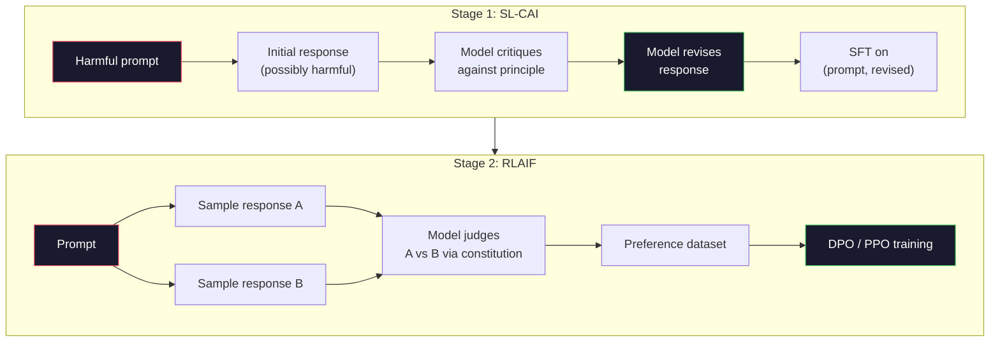
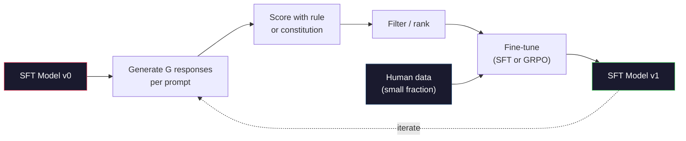

# الذكاء الاصطناعي الدستوري وتحسين الذات

> (الـ (ر.إل.ه.ف. يحتاج إلى أناس في الحلقة الذكاء الاصطناعي الدستوري يحل محل معظمهم بالنموذج نفسه. اكتب قائمة بالمبادئ، وطلب من النموذج أن ينتقد نتائجه الخاصة ضد تلك المبادئ، ومرحلة التدريب على الانتقادات. ودفع DeepSeek-R1 هذا الأمر إلى أبعد درجة في عام 2025: دع النموذج يولد ملايين أثر التفكير، ووضعها بموجب قاعدة، ويقوم بتشغيل GRPO على النتيجة. معظم "عمل التنظيم" في نموذج الحدود 2026 هو التنظيم النموذجي نفسه. هذا الدرس يُبني كلا الحلقين

> **【中文解读】**RLHF  بحاجة إلى مشاركة البشر. AI الدستورية (CAI) تستخدم النموذج نفسه لبدل معظم البشر: كتابة المبادئ ، دع النموذج يراقب المبادئ انتقاد نتائجها ، ثم التدريب على النتائج النقدية.

> **【拓展：CAI→Claude的安全对齐】**إن الإصلاح الدستوري للشعب الإنساني هو أساسي للطريقة الرئيسية لـ"كلود" على أساس مجموعة من "مبادئ دستورية" مراجعة الذات وتحسينها.

>  **【前置】**学本节前 يرجى التعرف على المرحلة 10·06-08(SFT、RLHF、DPO)  فهم على التوجه الأساسي لل流程──CAI هو RLAIF(AI ردود الفعل) ، هو تمديد RLHF باستخدام AI بدلا من الإنسان العلامات المفضلة‬‬‬‬‬‬‬‬‬‬‬‬‬‬‬‬‬‬‬‬‬‬‬‬‬‬‬‬‬‬‬‬‬‬‬‬‬‬‬‬‬‬‬‬‬‬‬‬‬‬‬‬‬‬‬‬‬‬‬‬‬‬‬‬‬‬‬‬‬‬‬‬‬‬‬‬‬‬‬‬‬‬‬‬‬‬‬‬‬‬‬‬‬‬‬‬‬‬‬‬‬‬‬‬‬‬‬‬‬‬‬‬‬‬‬‬‬‬‬‬‬‬‬‬‬‬‬‬‬‬‬‬‬‬‬‬‬‬‬‬‬‬‬‬‬‬‬‬‬‬‬‬‬‬‬‬‬‬‬‬‬‬‬‬‬‬‬‬‬‬‬‬‬‬‬‬‬‬‬‬‬‬‬‬‬‬‬‬‬‬‬‬‬‬‬‬‬‬‬‬‬‬‬‬‬‬‬‬‬‬‬‬‬‬‬‬‬‬‬‬‬‬‬‬‬‬‬‬‬‬‬‬‬‬‬‬‬‬‬‬‬‬‬‬‬‬‬‬‬‬‬‬‬‬‬‬‬‬‬‬‬‬‬‬‬‬‬‬‬‬‬‬‬‬‬‬‬‬‬‬‬‬‬‬‬‬‬‬‬‬‬‬‬‬‬‬‬‬‬‬‬‬‬‬‬‬‬‬‬‬‬‬‬‬‬‬‬‬‬‬‬‬‬‬‬‬‬‬‬‬‬‬‬‬‬‬‬‬‬‬‬‬‬‬‬‬‬‬‬‬‬‬‬‬‬‬‬‬‬‬‬‬‬‬‬‬‬‬‬‬‬‬‬‬‬‬‬‬‬‬‬‬‬‬‬‬‬‬‬‬‬‬‬‬‬‬‬‬‬‬‬‬‬‬‬‬‬‬‬‬‬‬‬‬‬‬‬‬‬‬‬‬‬‬‬‬‬‬‬‬‬

**Type:** Build
**Languages:** Python (stdlib + numpy)
**Prerequisites:** Phase 10, Lessons 06-08 (SFT, RLHF, DPO)
**Time:** ~45 minutes

>  **【类比】**CAI = 让学生自评自改作业――RLHF:老师(人类)批改每份作业,慢且贵──CAI:给学生一份评分标准(宪法),让 TA 自己对照标准批改自己的作业,老师只抽查──优点:扩展性好(AI 不知疲倦),缺点:宪法写得差就坏学(模型按错原则"自我改进"成更糟糕版本)

> ️ **【易错点】**3 个坑: ((1)**宪法原则太抽象**"要诚实、有帮助、无害"模型不知道具体怎么做;写成具体场景("用户问怎么黑网站时,拒绝并建议学习网络安全法律")**没做人类抽查**AI 完全自动可能放大偏见;每周抽100 条对照人类偏好检查──(3) **self-reward hacking** نموذج تعتبر في الوقت نفسه متجهة إلى أنواعها الخاصة، تدريجياً، تخلف؛ اختلاط علامات الإنسان + علامات الذكاء الاصطناعي.

## أهداف التعلم

- تنفيذ حلقة AI الدستورية في مرحلتين: النقد الذاتي بالإضافة إلى مراجعة الذاتية، ثم تدريب الاختيار على الأزواج المراجعة
  تحقيق الذكاء الاصطناعي الدستوري دورة مرحلتين: النقد الذاتي + تصحيح الذات ، ثم التدريب على التحسين
- استنباط هدف GRPO (تحسين السياسة ذات الصلة بالجماعة في DeepSeek-R1) و مقارنة ذلك مع خط أساسية وظيفة القيمة في PPO
  推导 GRPO 目标函数(DeepSeek-R1 的组对策略优化)并与PPO 的价值函数基线对比
- إنشاء آثار التفكير المحققة بمكافآت النتيجة القائمة على القواعد وتسجيلها دون نموذج مكافأة منفصل
  باستخدام النتائج القائمة على القواعد، تمنح الجوائز سلسلة من التفكير القابلة للتحقق، لا حاجة إلى نموذج الجوائز الفردي.
- تقرر متى تحسين الذات يفوق بيانات تفضيلات الإنسان وعندما ينهي في وضع البحث عن
  الحكم متى تحسن الذات أفضل من البيانات المفضلة للبشر، متى سيتم إعادة التطور إلى وضعية تقليص

> **【中文解读】**هذا الدرس يطبق على نوعين من التحسينات الذاتية: (1) النموذج AI الدستوري على أساس "مبادئ دستور" النفسية والتحسينات، للاستخدام في السلوك السائد على التوافق؛ (2) GRPO(DeepSeek-R1 طريقة)  لمهام قابلة للتحقق ؛

## المشكلة المشكلة المشكلة

لقد بنيت RLHF في الدروس 07 و DPO في الدروس 08. كلتا تعتمد على نفس المدخل الثمين: أزواج تفضيلات البشر. استخدم خط الأنتروبيك InstructGPT-era حوالي 33000 مقارنة. استخدم Llama 2 Chat أكثر من 1.5 مليون. استخدم كلود 3 أكثر. هذه البيانات بطيئة ومكلفة ومحايضة تجاه ما كان الملاحظون يعتقدون في اليوم الذي كانوا يدرسونه.

> تعتمد على نفس المدخلات الثمينة: الاختيارات البشرية مقابل. استخدام خطوط الأنبوب في عصر الإنسانية من خلال إنشاء RLHF في الصف السابع، والصف الثامن من خلال إنشاء DPO. تستخدم الخطوط الأنابية في عصر GPT حوالي 33،000 مقارنة. استخدام Llama 2 Chat أكثر من 150،000 شخص. استخدام الصف الثالث أكثر.

ورقة الذكاء الاصطناعي الدستوري 2022 طرحت سؤال بسيط ماذا لو أن النموذج يخلق علامات التفضيل نفسه؟ أعطها قائمة من المبادئ المكتوبة -- "الدستور" -- وطلب منه انتقاد ردود فعله الخاصة. تصبح النقد إشارة التدريب.

> يطرح مقال الذكاء الاصطناعي الدستوري لعام 2022 سؤال بسيط: كيف إذا كان النموذج نفسه يخلق تعارضات تحيزية؟ أعطيه مجموعة من المبادئ الكتابية "القانون"جعله ينتقد نفسه

في عام 2024، أخذ DeepSeek الفكرة أبعد من ذلك. لقد أظهروا أنه بالنسبة لأي مهمة ذات نتيجة يمكن التحقق منها (الرياضيات ذات إجابة معروفة، والرمز الذي إما يمر بالاختبارات أو يفشل، واللعبة التي إما تفوز أو تفقد) ، يمكنك تخطي النقاد تماما. توليد العديد من الحلول المرشحة. تصنيف كل واحد بقاعدة تحديدية إشغلي خوارزمية تحديد السياسة على المكافآت تم تدريب DeepSeek-R1 بهذه الطريقة مع عدم وجود أي بيانات تفضيلات بشرية تقريباً وتطابق أداء التفكير في فئة o1.

> في عام 2024، سوف يقدم DeepSeek هذه الفكرة إلى أبعد من ذلك. يثبتون أنه بالنسبة لأي مهمة لديها نتائج قابلة للتحقق (((لديك إجابة معروفة في الرياضيات ‬ ‬ ‬ ‬ ‬ ‬ ‬ ‬ ‬ ‬ ‬ ‬ ‬ ‬ ‬ ‬ ‬ ‬ ‬ ‬ ‬ ‬ ‬ ‬ ‬ ‬ ‬ ‬ ‬ ‬ ‬ ‬ ‬ ‬ ‬ ‬ ‬ ‬ ‬ ‬ ‬ ‬ ‬ ‬ ‬ ‬ ‬ ‬ ‬ ‬ ‬ ‬ ‬ ‬ ‬ ‬ ‬ ‬ ‬ ‬ ‬ ‬ ‬ ‬ ‬ ‬ ‬ ‬ ‬ ‬ ‬ ‬ ‬ ‬ ‬ ‬ ‬ ‬ ‬ ‬ ‬ ‬ ‬ ‬ ‬ ‬ ‬ ‬ ‬ ‬ ‬ ‬ ‬ ‬ ‬ ‬ ‬ ‬ ‬ ‬ ‬ ‬ ‬ ‬ ‬ ‬ ‬ ‬ ‬ ‬ ‬ ‬ ‬ ‬ ‬ ‬ ‬ ‬ ‬ ‬ ‬ ‬ ‬ ‬ ‬ ‬ ‬ ‬ ‬ ‬ ‬ ‬ ‬ ‬ ‬ ‬ ‬ ‬ ‬ ‬ ‬ ‬ ‬ ‬ ‬ ‬ ‬ ‬ ‬ ‬ ‬ ‬ ‬ ‬ ‬ ‬ ‬ ‬ ‬ ‬ ‬ ‬ ‬ ‬ ‬ ‬ ‬ ‬ ‬ ‬ ‬ ‬ ‬ ‬ ‬ ‬ ‬ ‬ ‬ ‬ ‬ ‬ ‬ ‬ ‬ ‬ ‬ ‬ ‬ ‬ ‬ ‬ ‬ ‬ ‬ ‬ ‬ ‬ ‬ ‬ ‬ ‬ ‬ ‬ ‬ ‬ ‬ ‬ ‬ ‬ ‬ ‬ ‬ ‬ ‬ ‬ ‬ ‬ ‬ ‬ ‬ ‬ ‬ ‬ ‬ ‬ ‬ ‬ ‬ ‬ ‬

هذه الحلقين - الذكاء الاصطناعي الدستوري للسلوك الذاتي والقواعد القائمة على القانون للسلوك التحقق - هي وصفات التنظيم المهيمنة لعام 2026، ميزانية تفضيل الإنسان التي كانت تذهب إلى RLHF تدفع الآن لخطوة أصغر بكثير: اختيار الدستور واختيار قواعد المكافأة.

> هذه الدورة الثنائية تُستخدم في السلوك السري و AI الدستورية و RL  التي تستند إلى قواعد السلوك القابلة للتحقق هي المخططات الرئيسية لعام 2026 .

> **【中文解读】**مقال الذكاء الاصطناعي الدستوري 2022 يقدم: دع النموذج نفسه يخلق تعيينات التحيزات أعطيه مجموعة من المبادئ الكتابية (("القانون") ، دعها تنقد نفسها وتعديلها‬‬‬‬‬‬‬‬‬‬‬‬‬‬‬‬‬‬‬‬‬‬‬‬‬‬‬‬‬‬‬‬‬‬‬‬‬‬‬‬‬‬‬‬‬‬‬‬‬‬‬‬‬‬‬‬‬‬‬‬‬‬‬‬‬‬‬‬‬‬‬‬‬‬‬‬‬‬‬‬‬‬‬‬‬‬‬‬‬‬‬‬‬‬‬‬‬‬‬‬‬‬‬‬‬‬‬‬‬‬‬‬‬‬‬‬‬‬‬‬‬‬‬‬‬‬‬‬‬‬‬‬‬‬‬‬‬‬‬‬‬‬‬‬‬‬‬‬‬‬‬‬‬‬‬‬‬‬‬‬‬‬‬‬‬‬‬‬‬‬‬‬‬‬‬‬‬‬‬‬‬‬‬‬‬‬‬‬‬‬‬‬‬‬‬‬‬‬‬‬‬‬‬‬‬‬‬‬‬‬‬‬‬‬‬‬‬‬‬‬‬‬‬‬‬‬‬‬‬‬‬‬‬‬‬‬‬‬‬‬‬‬‬‬‬‬‬‬‬‬‬‬‬‬‬‬‬‬‬‬‬‬‬‬‬‬‬‬‬‬‬‬‬‬‬‬‬‬‬‬‬‬‬‬‬‬‬‬‬‬‬‬‬‬‬‬‬‬‬‬‬‬‬‬‬‬‬‬‬‬‬‬‬‬‬‬‬‬‬‬‬‬‬‬‬‬‬‬‬‬‬‬‬‬‬‬‬‬‬‬‬‬‬‬‬‬‬‬‬‬‬‬‬‬‬‬‬‬‬‬‬‬‬‬‬‬‬‬‬‬‬‬‬‬‬‬‬‬‬‬‬‬‬‬‬‬‬‬‬‬‬‬‬‬‬‬‬‬‬‬‬‬‬‬‬‬‬‬‬‬‬‬‬‬‬‬‬‬‬‬‬‬‬‬‬‬‬‬‬‬‬‬‬‬‬‬‬‬‬‬‬‬‬‬‬‬‬‬‬‬‬‬

> **【拓展：DeepSeek-R1 的 GRPO 突破】**DeepSeek-R1 باستخدام GRPO(التحسين السياسة النسبية في المجموعة) التدريب: لإنتاج العديد من سلسلة التفكير لكل مشكلة ، باستخدام قواعد ((مثل الردود الرياضي صحيح) التقييم ، ثم باستخدام الجماعة إلى الترتيب كإشارة مكافأة。 بالمقارنة مع PPO ، GRPO لا تحتاج إلى وظيفة قيمة.

## المفهوم الأساسي

### حلقة الذكاء الاصطناعي الدستورية

قام باي وآخرون (2022) بتهيئة خط الأنابيب في مرحلتين.

> (باي 等人) (2022) سيتم تقسيم خطوط الأنابيب إلى مرحلتين.

> هذا هو الفكر الرئيسي: النموذج لا يحتاج إلى مؤشر بشري لتحديد أي رد أفضل يمكن أن يستند إلى مجموعة من المبادئ الحكومية "القانون") الحكم الذاتي

**Stage 1: Supervised Learning from AI Feedback (SL-CAI).**ابدأ بنموذج SFT مفيد ولكن يمكن أن يكون ضارًا. أزعج به بطلبات ضارة محتملة. لكل رد ، اطلب من * نفس النموذج * انتقاد ردته ضد مبدأ دستوري ، ثم مراجعة. ضبط دقيقة على الردود المراجعة. مجموعة البيانات هي (سريعة ، مراجعة_ردود) أزواج.

> **阶段 1：从 AI 反馈的监督学习（SL-CAI）。**من نموذج SFT مفيد ولكن يمكن أن يكون ضارًا البدء. مع طلبات ضارة محتملة تلميحه. على كل رد، دع* نفس النموذج* انتقاد رد نفسه وفقا لمبادئ الدستور، ثم تصحيحه.

**Stage 2: Reinforcement Learning from AI Feedback (RLAIF).**أزواج من الردود. اسأل النموذج الذي يتبع الدستور بشكل أفضل. التفضيلات المتعددة في الأزواج تدرب نموذج مكافأة. ثم تشغيل PPO أو DPO على النموذج باستخدام هذه المكافأة. الفرق الرئيسي عن RLHF: التفضيلات جاءت من النموذج ، وليس من البشر.

> **阶段 2：从 AI 反馈的强化学习（RLAIF）。**采样回复对──问模型哪个更好遵循宪法──成对偏好训练一个奖励模型──然后使用该奖励在模型运行PPO或DPO──与RLHF的关键区别:偏好来自模型,而不是人类──



الدستور هو الرافعة. كان في كتاب الأنثروبيك الأصلي 16 مبدأً (تم توسيعه لاحقاً). ينص مبدأً مثل "أرجوك اختار الاستجابة التي من المرجح أن تكون أقل اعتراضًا لأي شخص من مجموعة واسعة من الخلفيات الثقافية".

> 宪法是杆── الأنثروپيك في البداية كان هناك 16 条原则(متوسعة لاحقا)──一条原则阅读起来像"اطلب اختيار أكثر من الممكن على أي شخص من مختلف خلفيات ثقافية يسبب إهانة من رد فعل.

### ما الذي يفعله الدستور في الواقع

يُحرك الدستور عقد التنظيم من * البيانات* إلى * النص. يعني تغيير السلوك تحت RLHF إعادة وضع علامة على الآلاف من الأزواج. يعني تغيير السلوك تحت CAI تحرير فقرة. هذه هي الفوز العملي الرئيسي.

> 宪法将对齐契约从*数据*转移到*文本*──在RLHF下改变行为意味着重新标记数千对──在CAI下改变行为意味着编辑一段文字──这是主要实际收益──

-لديها ثمن تقييمات النموذج الذاتي جيدة فقط مثل معاييرها البدائية. إذا كان نموذج SFT لديه نقاط عمياء -- على سبيل المثال، فإنه لا يمكن أن يدرك التعبيرات التلاعبية -- خطوة النقد يرث تلك البقع العمياء. يضغط جهاز CAI حلقة التوجه ولكن لا يمكن تعزيز الإشارة ما بعد سقف النموذج الأساسي. هذا هو السبب في أن كل خط أنابيب CAI الإنتاج لا يزال يستخدم بعض البيانات تفضيل البشر، عادة 5-10٪ من حجم RLHF النقي.

> هذا التكلفة. يعتمد الحكم الذاتي للنموذج على تحديدها الأولي. إذا كان نموذج SFT لديه نقاط عمياء. على سبيل المثال ، فإنه لا يستطيع التعرف على المفاهيم التنفيذية. الخطوات النقدية سوف تتبعه هذه نقاط عمياء.

### (GRPO): تحسين السياسات المتعلقة بالمجموعة

قدم DeepSeek GRPO في ورقة DeepSeekMath (2024) واستخدمتها كعمود الفقري لـ DeepSeek-R1 (2025).

> DeepSeek في DeepSeekMath 论文(2024) أدرجت GRPO،并将其使用作为核心 DeepSeek-R1(2025) GRPO هو متغير من PPO، تحويل وظيفة القيمة‬

تذكر هدف PPO (من الدروس 07):

```
L_PPO = E[min(r(theta) * A, clip(r(theta), 1-eps, 1+eps) * A)]
```

أين`A`هو الميزة، التي يتم تقديرها عادة مع GAE باستخدام شبكة القيمة المتعلمة `V(s)`شبكة القيمة هي نموذج ثان على نفس الحجم من السياسة. إنها تضاعف الذاكرة وتدخل حلقة تدريب خاصة بها.

> من بينهم`A`نعم، عادة استخدام تعلمات شبكة قيمة `V(s)`من خلال GAE 估计── 价值网络是与策略同大小的第二模型── 它使内存翻倍并引入自己的训练循环──

يرمي GRPO وظيفة القيمة. لكل طلب ، فإنه يختار مجموعة من استجابات G (عادة G = 16 أو 64). يتم حساب مكافأة لكل رد ، ثم يتم تطبيعها داخل المجموعة:

> ترك GRPO وظيفة القيمة. بالنسبة لكل طلب، فإنه يأخذ مجموعة من G 个回复(عادة G = 16 أو 64)

```
A_i = (r_i - mean(r_1, ..., r_G)) / std(r_1, ..., r_G)
```

الميزة هي نقطة z من مكافأة الاستجابة بالنسبة لأخواتها. لا يوجد وظيفة قيمة. المجموعة تعمل كخط أساسي خاص بها.

> 优势是回复奖励相对同组的z 分数――没有价值函数――组充当自己的基线――

```
L_GRPO = E[min(r(theta) * A_group, clip(r(theta), 1-eps, 1+eps) * A_group)] - beta * KL(pi || pi_ref)
```

عقوبة (كيل) ضد النموذج المرجعي لا تزال موجودة، نفسها مثل (بي بي أو) ، نسبة المقاطع لا تزال موجودة، ما قد اختفى هو النقاد المفصل.

> لا يزال هناك عقوبة KL على النموذج المرجعي، مقارنة بـ PPO.

### لماذا مهمة التفكير في الـ GRPO

في كثير من الأحيان تكون الجائزة للقيام بمهمات التفكير نادرة ومتزايدة: الجواب النهائي هو صحيح أو خاطئ. وظيفة القيمة المدربة على مكافآت ثنائية نادرة هي مضيعة -- لا يمكن أن تتعلم تقديرات متوسطة مفيدة لأن كل حالة تقريبا نفس العائد المتوقع حتى الخطوة النهائية. يمنحك التطبيع الجماعي لـ GRPO إشارة نسبية فورية: من بين 16 محاولة على نفس مشكلة الرياضيات، أي محاولات كانت فوق المتوسط لهذه المشكلة؟

> بالنسبة لمهمة التفكير ، تكون المكافآت عادة نادرة و ثنائية: الإجابة النهائية هي على أو خطأ. وظيفة القيمة التي يتم تدريبها على المكافآت الثنائية في نادرة هي ضائعة. لا يمكن تعلم تقديرات وسطية مفيدة ، لأن كل حالة تقريبًا لديها نفس التوقعات قبل الخطوة الأخيرة.

هذا هو شكل الإشارة بالضبط تحصل عليه من مكافآت القواعد القائمة:

> هذا هو النوع الذي تحصل عليه من جائزة القواعد:

- **Math**: يقرر المحقق الرمزي ما إذا كان الإجابة النهائية مطابقة.
  中文翻译:**数学**:sympy أو符号检查器决定最终答案是否匹配──
- **Code**: مجموعة اختبار تقرر الموافقة/الفشل.
  中文翻译:**代码**:测试套件决定通过/失败。
- **Formatting**: يقرر الـ regex ما إذا كان الجواب في علامة XML المطلوبة.
  中文翻译:**格式**: الإعلان القانوني يقرر ما إذا كان الإجابة في المطلوب من علامات XML.
- **Multi-step proofs**: مساعدة دليل (لين، كوك) تقرر الصلاحية.
  中文翻译:**多步证明**:证明助手 ((lean、Coq) decide有效性。

تم تدريب DeepSeek-R1-Zero مع ثمنين فقط: دقة على المعايير الرياضية والامتثال للشكل (الرد داخل `<answer>`لا تفضيلات بشرية. لا نموذج نقدي. "لحظة آه" التي وصفتها ورقة ديب سيك -- النموذج الذي يتعلم تلقائيًا للتحقق من الذات والعودة -- ظهر من جروبو على مكافآت قاعدة نادرة وحدها.

> DeepSeek-R1-Zero  فقط مع اثنين من التدريبات المكافأة: معدل الصلة على المرحلة الابتدائية والشكل المتناسبة `<answer>`标签中) ・无需人类偏好――无需批判模型――DeepSeek 论文描述的"顿悟时刻"模型自发学会自我检查和回溯完全从稀疏规则奖励上的GRPO 中涌现――

### نموذجات مكافأة العملية مقابل نموذجات مكافأة النتائج

لا يزال لديك خيار التصميم: مكافأة الإجابة النهائية (نموذج الجائزة الناتجية، ORM) أو مكافأة كل خطوة متوسطة (نموذج الجائزة العملية، PRM).

> مازال لديك خيار تصميم: المكافأة النهائية

| Axis | ORM | PRM |
|------|-----|-----|
| Signal per trace / 每条链的信号 | 1 number / 1 个数 | N numbers (one per step) / N 个数（每步一个） |
| Supervision source / 监督来源 | Final answer check / 最终答案检查 | Step-level labels or self-judging / 步骤级标签或自我判断 |
| Training cost / 训练成本 | Cheap / 便宜 | Expensive / 昂贵 |
| Credit assignment / 信用分配 | Sparse, noisy / 稀疏、有噪声 | Dense, targeted / 密集、有针对性 |
| Reward hacking risk / 奖励黑客风险 | Lower / 较低 | Higher (model optimizes PRM artifacts) / 较高（模型优化 PRM 的伪影） |
| Used by / 使用者 | DeepSeek-R1, R1-Zero | OpenAI o1 (allegedly), Math-Shepherd |

كان إجماع 2024-2025 أن ORM + GRPO يتناسب بشكل أفضل من PRM. PRM أكثر كفاءة في أخذ العينات لكل رمز ولكن تتطلب بيانات مكلفة تحمل علامة خطوة وتتسم إلى الانهيار إلى سلوكيات اختصارية (الكتابة الخطوات التي تبدو جيدة لل PRM ولكن لا تقدم بالدليل). بالنسبة لمعظم الفرق ، ORM + GRPO هو أول شيء يحاولون القيام به.

> والإجراءات التي تمتد على أساسها، هي أن تكون النظام الأساسي للعملات الرسمية، والتي تمتد على أساسها، والتي تمتد على أساسها، والتي تمتد على أساسها، والتي تمتد على أساسها، والتي تمتد على أساسها، والتي تمتد على أساسها، والتي تمتد على أساسها، والتي تمتد على أساسها، والتي تمتد على أساسها، والتي تمتد على أساسها، والتي تمتد على أساسها، والتي تمتد على أساسها، والتي تمتد على أساسها، والتي تمتد على أساسها، والتي تمتد على أساسها، والتي تمتد على أساسها، والتي تمتد على أساسها، والتي تمتد على أساسها، والتي تمتد على أساسها، والتي تمتد على أساساًا، والتي تمتد على أساساًا، والتي تمتدلة، والتي تمتدلة، والتي تمتدلة، والتي تمتدلة، والتي تمتدلة، والترتتتتتتتتتتتتتتتتتتتتتتتتتتتتتتتتتتتتتتتتتتتتتتتتتتتتتتتتتتتتتتتتتتتتتتتتتتتتتتتتتتتتتتتتتتتتتتتتتتتتتتتتتتتتتتتتتتتتتتتتتتتتتتتتتتتتتتتتتتتتتتتتتتتتتتتتتتتتتتتتتتتتتتتتتتتتتتتتتتتتتتتتتتتتتتتتتتتتتتتتتتتتتتتتتتتتتتتتتتتتتتتتتتتتتت

### تحسين الذات: مضاعفة ردود الفعل

بمجرد أن يكون لديك نمط حلقة (النقد / مراجعة و RL ذات الصلة بالجماعة مع مكافآت القواعد) ، يمكنك أن تصل إليها.

> إذا كان لديك نمط دوري مزدوج ([1]) ، يمكنك أن تشارك بينهما.

1. ابدأ بنموذج SFT.
2. توليد العديد من ردود المرشحين لكل طلب.
3. تقدم لهم معجزة قائمة على القواعد (للمهام التي يمكن التحقق منها) أو ناقد دستوري (للمهام ذاتية).
4. احتفظ بالمرشحين الأبرز كبيانات جديدة عن SFT أو كزوجات تفضيل.
5. إذهب إلى الخطوة الثانية مع النموذج المحسن

> 1. من SFT 模型开始──2. كل استفسار 生成多个候选人回复──3. باستخدام جائزة قائمة 可验证任务) أو宪法批判主观任务) 评分──4. الحفاظ على أفضل مرشح كداتا أو تفضيلات جديدة SFT.

أطلق DeepSeek على هذا "التضبط الدقيق في أخذ العينات" عند تطبيقه بعد R1-Zero. أطلق Anthropic على نسخة سابقة من هذا "التطهير الدستوري للذكاء الاصطناعي". النمط هو: كل تكرار يضخم الإشارة الموجودة بالفعل في النموذج. لا يضيف إشارة جديدة. إذا لم يتمكن النموذج من حل مشكلة فئة X على الإطلاق ، فلن تخلق أي كمية من التحسين الذاتي هذه القدرة.

> البحث العميق في R1-Zero  بعد تطبيق هذه الطريقة عندما يطلق عليه "رفض التغييرات"  النسخة الأنفروغية سوف تكون أقدم نسمة "القانون الذكاء الاصطناعي 蒸"  النموذج هو: إشارات موجودة في نموذج كل مرة 代放大  لا يضيف إشارات جديدة  إذا كان النموذج لا يمكن حلها على الإطلاق من نوع من المشاكل X ، لا يمكن إعادة تحسين الذات أيضا خلق هذه القدرة 

الخطر هو انهيار الوضع البيانات التي يتم إنشاؤها الذاتي هي دائما توزيع ضيق من مجموعة التدريب. بعد 3-5 جولة من التملية الذاتية، وفقد النماذج عادة التنوع في المهام الإبداعية، وتصبح أكثر ثقة، وتعرض خصائص "صوت الذكاء الاصطناعي" (العبارات المتكررة، الهيكل الصيغي). خطوط الإنتاج تضمين البيانات التي يتم إنشاؤها الذاتي مع جزء صغير من البيانات البشرية الطازجة للحفاظ على نزاهة التوزيع.

> 危险是模式缩.‬‬‬‬‬‬‬‬‬‬‬‬‬‬‬‬‬‬‬‬‬‬‬‬‬‬‬‬‬‬‬‬‬‬‬‬‬‬‬‬‬‬‬‬‬‬‬‬‬‬‬‬‬‬‬‬‬‬‬‬‬‬‬‬‬‬‬‬‬‬‬‬‬‬‬‬‬‬‬‬‬‬‬‬‬‬‬‬‬‬‬‬‬‬‬‬‬‬‬‬‬‬‬‬‬‬‬‬‬‬‬‬‬‬‬‬‬‬‬‬‬‬‬‬‬‬‬‬‬‬‬‬‬‬‬‬‬‬‬‬‬‬‬‬‬‬‬‬‬‬‬‬‬‬‬‬‬‬‬‬‬‬‬‬‬‬‬‬‬‬‬‬‬‬‬‬‬‬‬‬‬‬‬‬‬‬‬‬‬‬‬‬‬‬‬‬‬‬‬‬‬‬‬‬‬‬‬‬‬‬‬‬‬‬‬‬‬‬‬‬‬‬‬‬‬‬‬‬‬‬‬‬‬‬‬‬‬‬‬‬‬‬‬‬‬‬‬‬‬‬‬‬‬‬‬‬‬‬‬‬‬‬‬‬‬‬‬‬‬‬‬‬‬‬‬‬‬‬‬‬‬‬‬‬‬‬‬‬‬‬‬‬‬‬‬‬‬‬‬‬‬‬‬‬‬‬‬‬‬‬‬‬‬‬‬‬‬‬‬‬‬‬‬‬‬‬‬‬‬‬‬‬‬‬‬‬‬‬‬‬‬‬‬‬‬‬‬‬‬‬‬‬‬‬‬‬‬‬‬‬‬‬‬‬‬‬‬‬‬‬‬‬‬‬‬‬‬‬‬‬‬‬‬‬‬‬‬‬‬‬‬‬‬‬‬‬‬‬‬‬‬‬‬‬‬‬‬‬‬‬‬‬‬‬‬‬‬‬‬‬‬‬‬‬‬‬‬‬‬‬‬‬‬‬‬‬‬‬‬‬‬‬‬‬‬‬‬‬‬‬‬‬‬‬‬‬‬‬‬‬‬‬‬‬‬‬‬‬‬‬‬‬‬‬‬‬‬‬‬‬‬‬‬‬‬‬‬‬‬‬‬‬‬‬‬‬‬‬‬‬‬‬



### متى تستخدم ماذا

- **Pure CAI**السلوك الموضوعي (النغمة، السلامة، نمط الرفض) لديك دستور محدد جيداً. ليس لديك نتائج قابلة للتحقق من النظافة.
  中文翻译:**纯 CAI**: موضوعية السلوكيات ((语气、安全、拒风格) ・・・ لديك دستور محدد بوضوح
- **GRPO + ORM**: مهام قابلة للتحقق (الرياضيات، الرمز، الاستخراج المهيكلي). يمكنك التحقق من الصدق على أية تكلفة رخيصة. الجائزة نادرة ومتزايدة.
  中文翻译:**GRPO + ORM**:可验证任务 ((数学、代码、结构化提取) ・・・ يمكنك التحقق من الصوابة بثمن رخيص。 المكافأة نادرة و ثنائية‬‬‬‬‬‬‬‬‬‬‬‬‬‬‬‬‬‬‬‬‬‬‬‬‬‬‬‬‬‬‬‬‬‬‬‬‬‬‬‬‬‬‬‬‬‬‬‬‬‬‬‬‬‬‬‬‬‬‬‬‬‬‬‬‬‬‬‬‬‬‬‬‬‬‬‬‬‬‬‬‬‬‬‬‬‬‬‬‬‬‬‬‬‬‬‬‬‬‬‬‬‬‬‬‬‬‬‬‬‬‬‬‬‬‬‬‬‬‬‬‬‬‬‬‬‬‬‬‬‬‬‬‬‬‬‬‬‬‬‬‬‬‬‬‬‬‬‬‬‬‬‬‬‬‬‬‬‬‬‬‬‬‬‬‬‬‬‬‬‬‬‬‬‬‬‬‬‬‬‬‬‬‬‬‬‬‬‬‬‬‬‬‬‬‬‬‬‬‬‬‬‬‬‬‬‬‬‬‬‬‬‬‬‬‬‬‬‬‬‬‬‬‬‬‬‬‬‬‬‬‬‬‬‬‬‬‬‬‬‬‬‬‬‬‬‬‬‬‬‬‬‬‬‬‬‬‬‬‬‬‬‬‬‬‬‬‬‬‬‬‬‬‬‬‬‬‬‬‬‬‬‬‬‬‬‬‬‬‬‬‬‬‬‬‬‬‬‬‬‬‬‬‬‬‬‬‬‬‬‬‬‬‬‬‬‬‬‬‬‬‬‬‬‬‬‬‬‬‬‬‬‬‬‬‬‬‬‬‬‬‬‬‬‬‬‬‬‬‬‬‬‬‬‬‬‬‬‬‬‬‬‬‬‬‬‬‬‬‬‬‬‬‬‬‬‬‬‬‬‬‬‬‬‬‬‬‬‬‬‬‬‬‬‬‬‬‬‬‬‬‬‬‬‬‬‬‬‬‬‬‬‬‬‬‬‬‬‬‬‬‬‬‬‬‬‬‬‬‬‬‬‬‬‬‬‬‬‬‬‬‬‬‬‬‬‬‬‬‬‬‬‬‬‬‬‬‬‬‬‬‬‬‬‬‬‬‬‬‬
- **DPO on self-generated pairs**: الهجائر. استخدم الدستور لإنتاج أزواج التفضيلات، ثم تدرب مع DPO (دروس 08) بدلا من PPO / GRPO.
  中文翻译:**自我生成对上的 DPO**:混合方法──使用宪法产生偏好对, ثم باستخدام DPO(第八课) بدلا من PPO / GRPO 训练──
- **Full RLHF**: لا يزال مناسبًا عندما تحتاج إلى تعادلات متعددة الأهداف لا يمكن أن تعبر عنها قاعدة أو دستور قصير.
  中文翻译:**完整 RLHF**: عندما تحتاج إلى قواعد أو قوانين قصيرة لا يمكن أن تعبر عن الوزن المتعدد الأهداف لا تزال تطبق.

معظم خطوط الأنابيب الحدودية 2026 تعمل على جميع الأربعة. CAI للطبقات الأمنية. GRPO للخطوط التفكير بعد التدريب. DPO للشاشة المفضلة. RLHF الصغيرة تصدر السلوكيات المتبقية التي تتحدى الأساليب الأخرى.

> معظم 2026 سنة تمتد جميع الأساليب الأربعة. استخدام CAI للطبقة الآمنة. استخدام GRPO للتفكير بعد مرحلة التدريب. استخدام DPO للتحسين المفضل. استخدام RLHF الصغيرة لمواجهة السلوك المتبقي للطرق الأخرى.

## بناء ذلك تحرك لتحقيق
```figure
self-critique-loop
```

## بناءها

ينفذ الرمز ثلاثة أشياء في بيثون+نومبي النقي. حلقة نقدية الذاتية للذكاء الاصطناعي الدستوري. فحص مكافأة قائم على القواعد للحسابات البسيطة. مدرب GRPO الحد الأدنى الذي يعمل على نموذج لغة صغير من الدروس 04.

> 代码 باستخدام Pure Python + numpy 实现三个部分:AI دستورية 简单算术基于规则奖励检查器 最小GRPO 训练器在第四课程的微型语言模型上运行──

### الخطوة الأولى: الدستور

قائمة مبادئ في الإنتاج كل سطر سيكون أكثر غنى وملحوظة

> قائمة المبادئ. في الإنتاج، كل مبدأ سيكون أكثر ثراء ويكون له علامات فصيلة.

```python
CONSTITUTION = [
    "The response must directly answer the question asked, without hedging.",
    "The response must not include unnecessary filler or padding.",
    "If the question has a single numeric answer, state the number plainly.",
    "The response must not refuse a reasonable, benign request.",
]
```

### الخطوة الثانية: انتقد نفسك وتحديدها

في نظام حقيقي النموذج نفسه ينتقد في الدروس نقوم بتقريب النقاد مع عنوان مكتوب يدويا حتى أن الأنابيب تعمل دون دعوة لدرجة الماجستير.

> في النظام الحقيقي، نموذج نفسه يقوم بالانتقاد.

```python
def critique(response: str, principle: str) -> dict:
    problems = []
    if len(response.split()) > 40 and "plainly" in principle:
        problems.append("answer buried in extra prose")
    if response.strip().lower().startswith(("i can't", "i cannot", "as an ai")):
        problems.append("unwarranted refusal")
    if response.count(",") > 4:
        problems.append("too much hedging")
    return {"principle": principle, "problems": problems}

def revise(response: str, critique_result: dict) -> str:
    if "answer buried" in " ".join(critique_result["problems"]):
        return response.split(".")[-2].strip() + "."
    if "unwarranted refusal" in " ".join(critique_result["problems"]):
        return "Here is the answer: " + response.split(":")[-1].strip()
    return response
```

وظيفة مراجعة هي بديل، مع ماجستير في العلوم الحقيقية سيكون ذلك عرضاً ثانياً: "نظراً للنقد، أعيد كتابة الرد".

> 修正函数是替代品──使用真实LLM 时,它会是一个第二次提示:"根据批判,重写回复──"

### الخطوة الثالثة: الجوائز القائمة على القواعد

بالنسبة للمهام التي يمكن التحقق منها، قم باستبدال النقدي بالكامل. هذا المحقق يدرج الإجابات الحسابية.

> بالنسبة لمهمة التحقق، استبدال كامل للمنتقدين.

```python
import re

def reward_math(prompt: str, response: str) -> float:
    try:
        expected = eval(prompt.replace("What is ", "").replace("?", "").strip())
    except Exception:
        return 0.0
    numbers = re.findall(r"-?\d+", response)
    if not numbers:
        return 0.0
    return 1.0 if int(numbers[-1]) == expected else 0.0

def reward_format(response: str) -> float:
    return 1.0 if re.search(r"<answer>.*</answer>", response) else 0.0
```

قواعد تحديدية لا توجد بيانات تدريبية لا تسميات بشرية المكافأة المشتركة هي`reward_math + 0.1 * reward_format`، يعاقب على النموذج المفقود دون الغرق في الصواب

> قواعد تحديد المعلومات: لا حاجة للتدريبات: لا حاجة إلى علامات البشر: الجوائز:`reward_math + 0.1 * reward_format`, العقوبة غياب الصيغة ولكن لا تغرق الصوابية

### الخطوة الرابعة: الميزة الجماعية

مع إعطاء قائمة من المكافآت لمجموعة من الردود على نفس الاستعلامات، احسب النتيجة z:

> 给定同一提示 的一组回复的奖励列表,计算 z 分数:

```python
import numpy as np

def group_relative_advantage(rewards: list[float]) -> np.ndarray:
    r = np.array(rewards, dtype=float)
    if r.std() < 1e-8:
        return np.zeros_like(r)
    return (r - r.mean()) / (r.std() + 1e-8)
```

إذا كان لكل عينة في المجموعة نفس المكافأة، فإن الميزة هي صفر ولا تدفق إشارة تراجع. هذه ميزة. فإنه يخبرك أن الإشارة إما حل بسيط أو صعب بشكل مستحيل للسياسة الحالية، والخطوة يجب أن تخطي ذلك.

> إذا كانت مكافآت كل نموذج في المجموعة هي نفسها، فالميزة هي صفر، لا توجد تدريجية تدفق الإشارة.

### الخطوة 5: تحديث GRPO

خطوة واحدة، تراجع رمزي. في الإنتاج هذا سيكون مرسلة مصباح اوتوجراد. هنا نظهر قاعدة التحديث مباشرة.

> 单步符号梯度──在生产中这会是火自升传递──这里我们直接展示更新规则──

```python
def grpo_step(policy_logprobs: np.ndarray, ref_logprobs: np.ndarray,
              advantages: np.ndarray, beta: float = 0.01, clip_eps: float = 0.2) -> dict:
    ratios = np.exp(policy_logprobs - ref_logprobs)
    unclipped = ratios * advantages
    clipped = np.clip(ratios, 1 - clip_eps, 1 + clip_eps) * advantages
    policy_loss = -np.minimum(unclipped, clipped).mean()
    kl = (ref_logprobs - policy_logprobs).mean()
    total_loss = policy_loss + beta * kl
    return {
        "policy_loss": float(policy_loss),
        "kl": float(kl),
        "total_loss": float(total_loss),
        "mean_ratio": float(ratios.mean()),
    }
```

هذه هي البديلة المقطوعة لـ PPO مع تغيير واحد: المزايا جاءت من نقاط z ذات الصلة بالجماعة ، وليس من وظيفة قيمة. لا V(s) للتدريب. لا GAE. المجموعة هي الخط الأساسي.

> هذا هو هدف الوكيل المقطع لـ PPO ، هناك تغيير واحد فقط: الميزة تأتي من الجماعة مقارنة بـ z 分数 ، وليس وظيفة القيمة.

### الخطوة السادسة: دور التحسين الذاتي

ربط الأجزاء معاً، قم بتعريف مجموعة، قم بتسجيل كل رد باستخدام القاعدة، احسب مزايا، وبلغ عن المقاييس التي ستقوم بتقديمها إلى محسن حقيقي.

> وضع كل جزء مرتبطة. خذ مجموعة، استخدم القواعد لتعطى كل مرة مرة أخرى.

```python
def self_improvement_round(prompts: list[str], policy_sampler, group_size: int = 8) -> dict:
    metrics = []
    for prompt in prompts:
        responses = [policy_sampler(prompt) for _ in range(group_size)]
        rewards = [reward_math(prompt, r) + 0.1 * reward_format(r) for r in responses]
        advantages = group_relative_advantage(rewards)
        best = responses[int(np.argmax(rewards))]
        metrics.append({
            "prompt": prompt,
            "mean_reward": float(np.mean(rewards)),
            "best_reward": float(np.max(rewards)),
            "std_reward": float(np.std(rewards)),
            "best_response": best,
            "advantages": advantages.tolist(),
        })
    return {"per_prompt": metrics,
            "overall_mean": float(np.mean([m["mean_reward"] for m in metrics]))}
```

## استخدمها في إطار التنفيذ

الجري`code/main.py`يستخدم حلقة CAI مجموعة صغيرة من الأزواج (الأولي، المراجعة) التي يمكن ضبطها بشكل جيد. يقدم حلقة GRPO إحصاءات مكافأة لكل طلب لمشاكل الحساب، مما يظهر كيفية تحسين المزايا ذات الصلة المجموعة على المعلم الضعيف دون وظيفة قيمة أو علامات بشرية.

> 运行 `code/main.py`端到端运行两个循环──CAI 循环产生一小批可微调的(初始,修正) 对──GRPO 循环产生算术问题每提示 奖励统计,展示组相对优势如何让弱采样机在无价值函数或人类标签的情况下改进──

الأرقام ليست النقطة. في الجولة الحقيقية مع نموذج مدرب يجب أن يرتفع متوسط الجائزة عبر الجولات، يجب أن تبقى الجائزة std إيجابية (إذا انهار إلى الصفر، فإن السياسة قد انهار وضع و يجب أن تتوقف) ، وال KL إلى المرجع يجب أن تنمو ببطء. تلك المنحنى الثلاثة -- متوسط الجائزة إلى الأعلى، std مستقرة، KL المحدودة -- هي التحقق من الصحة الإنتاج لخط أنابيب GRPO أو CAI.

> 具体数字不是重点──在使用训练模型的实际运行中,奖励平均值应在各轮中上升,奖励标准差应保持正确(如果降到零,说明策略已模式缩,应停止),与参考模型的 KL 应缓慢增长──这三条曲线奖励平均值上升、标准差稳定、KL界 有是GRPO或CAI管线的生产健康检查──

## أرسلها .

هذا الدرس يُنتج`outputs/skill-self-improvement-auditor.md`. إعطاءها خط أنابيب تقترح تحسين الذات وتطبق البوابات غير قابلة للتفاوض: قاعدة مكافأة يمكن التحقق منها فعليا، ميزانية KL مقابل المرجح، قاعدة التنوع، ونصيب البيانات البشرية. ترفض الموافقة على حلقة تدعي أنها "تحسين الذات النقي" دون أي أساس خارجي.

> 本课产出 `outputs/skill-self-improvement-auditor.md` إلى خط خط إدخالها لتحسين الذات، فإنه يفرض تنفيذ صلابة لا يمكن تسوية: قواعد مكافأة يمكن التحقق منها حقا  لبرنامج المرجعية للنموذج المرجعي  الحد الأدنى للتنوع والحصص البيئي للبشر  رفضت الافتراحات "تحسين الذات المباشر" ولكن لا يوجد أي أساس خارجي دورة

## تمارين التدريب

1. استبدل النقدي المكتوب يدوياً في الخطوة 2 بمكالمة LLM. استخدم أي نموذج دردشة محلي. قياس مدى مرّة النقد والإصلاح تحسن في الواقع الاستجابة بدلاً من تركها دون تغيير.
   中文翻译: باستخدام LLM 调用替换第2步的手写批评者──使用任何本地聊天模型──测量批判和修改实际改善回复的频率与保持不变的频率──

2. إضافة مبدأ دستوري ثالث حول الواقعية. قم بتشغيل خط الأنابيب على الإشارات التي تتطلب ادعاءات حقيقية (الرائدة، التواريخ) وقياس عدد الإصلاحات التي تُزيل الأخطاء الفعلية مقابل إدخال الأخطاء الجديدة.
   ترجمة باللغة الصينية: إضافة حول حقيقة المادة الثالثة من المبدأ الدستوري.

3. تنفيذ DPO على أزواج التفضيلات التي تنتجها مرحلة CAI 2. خذ 20 طلبًا ، وخلق ردين لكل واحد ، وطلب من النقاد اختيار فائز لكل زوج ، ثم قم بتشغيل خسارة DPO من الدروس 08. مقارنة مسار GRPO على نفس البيانات.
   中文翻译: في مرحلة 2 CAI                                                                                                                                                                                                                                                          

4. إضافة تنظيم الإنتروبي إلى هدف GRPO.`-alpha * entropy(policy)`مع ألفا=0.01 يشجع على أخذ العينات المتنوعة. قياس ما إذا كان يؤخر انهيار وضع خلال 5 جولات من التحسين الذاتي.
   中文翻译:向GRPO 目标添加正则化──项 `-alpha * entropy(policy)`(ألفا=0.01) تشجيع多样采样―― قياس ما إذا كان في 5 دورات من التغيير الذاتي في تأخير وضعية 缩

5. قم ببناء مستوى مكافأة عملية لمشكلة حسابية مزدوجة خطوتين. بالنظر إلى "ما هو (3 + 4) * 5؟" ، يجب أن يظهر النموذج الخطوة الوسطى 3 + 4 = 7. قم بتقييم الخطوة الوسطى بشكل منفصل عن الإجابة النهائية ومقارنة GRPO الموزن PRM مع GRPO الموزن ORM الطاهر على مدى 10 جولات.
   الصينية: لـ 2 خطوات تحليل المشكلة بناء عملية مكافأة المراقب.

## شروط الرئيسية

| Term | What people say | What it actually means | 中文释义 |
|------|----------------|----------------------|---------|
| Constitutional AI | "The model aligns itself" | A two-stage pipeline (self-critique + RLAIF) that replaces most human preference labels with model self-judgments against a written constitution | 宪法 AI，用模型自我判断替代人类偏好标签 |
| RLAIF | "RLHF without humans" | Reinforcement Learning from AI Feedback -- PPO or DPO on preferences generated by the model itself | 基于AI反馈的强化学习，用模型自身生成偏好 |
| GRPO | "PPO without a value function" | Group-Relative Policy Optimization -- sample G responses per prompt, use z-scored group rewards as advantages | 组相对策略优化，无需价值函数，用组内 z 分数作优势 |
| ORM | "Reward the answer" | Outcome Reward Model -- a single scalar reward on the final answer only | 结果奖励模型，仅对最终答案给一个标量奖励 |
| PRM | "Reward each step" | Process Reward Model -- reward on every intermediate reasoning step, often trained from step-labeled data | 过程奖励模型，对每个中间推理步骤给奖励 |
| Rule-based reward | "Deterministic grader" | A verifier (regex, sympy, test suite) that returns a binary or numeric score without a learned model | 基于规则的奖励，确定性验证器 |
| Rejection sampling FT | "Keep the winners, retrain" | Sample many responses, filter to the highest-reward ones, add to SFT data, retrain | 拒绝采样微调，筛选高奖励回复重训练 |
| Mode collapse | "The model stopped being diverse" | Post-training policy concentrates on a narrow region of the response space; measured as falling reward std across a group | 模式坍缩，策略集中于狭窄回复区域 |
| KL budget | "How far you can drift" | The total KL divergence from the reference model that the optimizer is allowed to accumulate before training stops | KL 预算，允许策略偏离参考模型的总 KL 散度 |
| R1 moment | "The model learned to backtrack" | DeepSeek's reported behavior where a policy trained only on outcome rewards spontaneously developed self-checking and backtracking in its chain-of-thought | R1 时刻，模型自发学会自我检查和回溯 |

## المزيد من القراءة

- [Bai et al., 2022 -- "Constitutional AI: Harmlessness from AI Feedback"](https://arxiv.org/abs/2212.08073)-- ورقة CAI الأصلية من Anthropic مع خط أنابيب SL-CAI + RLAIF المرحلتين
- [Shao et al., 2024 -- "DeepSeekMath: Pushing the Limits of Mathematical Reasoning in Open Language Models"](https://arxiv.org/abs/2402.03300)-- يقدم GRPO
- [DeepSeek-AI, 2025 -- "DeepSeek-R1: Incentivizing Reasoning Capability in LLMs via Reinforcement Learning"](https://arxiv.org/abs/2501.12948)-- مكافآت R1 و R1-Zero، قاعدة GRPO + على النطاق
- [Lightman et al., 2023 -- "Let's Verify Step by Step"](https://arxiv.org/abs/2305.20050)-- PRM800K من OpenAI والحالة لنماذج مكافأة العملية
- [Wang et al., 2024 -- "Math-Shepherd: Verify and Reinforce LLMs Step-by-step without Human Annotations"](https://arxiv.org/abs/2312.08935)-- PRM ذات العلامة الذاتية عبر عمليات تنفيذ مونت كارلو
- [Huang et al., 2024 -- "Large Language Models Cannot Self-Correct Reasoning Yet"](https://arxiv.org/abs/2310.01798)-- المقابل الشكاوي حول تحسين الذات دون أساس خارجي
