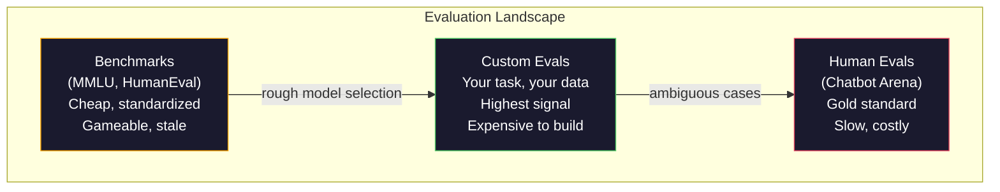
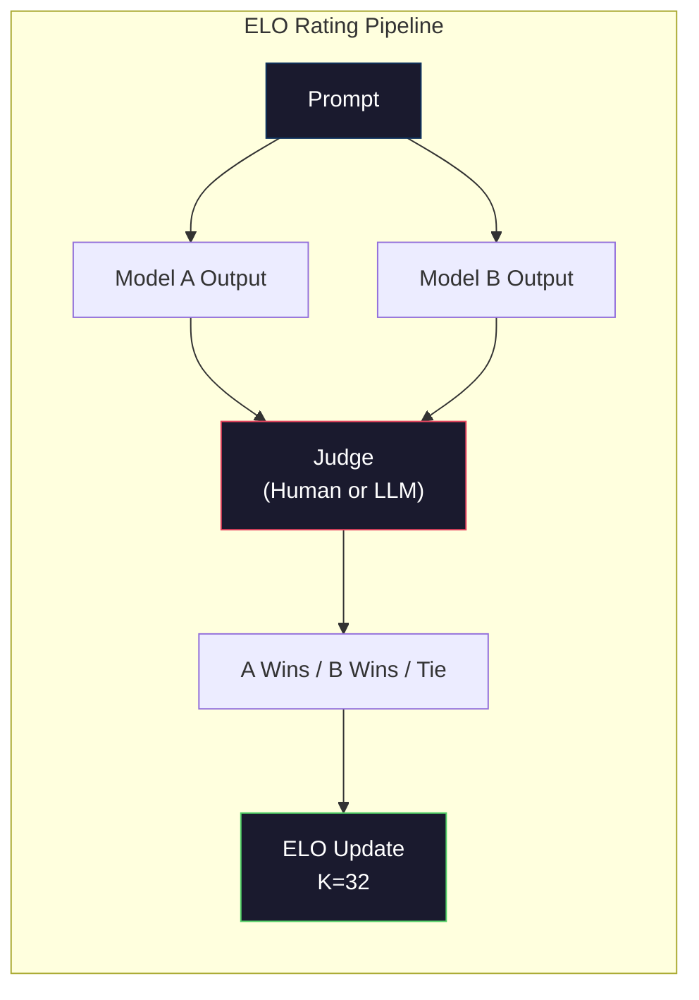

# التقييم: مقاييس، Evals، LM Harness 评估:基准、评测、LM Harness

> قانون غودارت: عندما تصبح القياس هدفاً، فإنه يتوقف عن أن يكون مقياسًا جيدًا. كل لعبة مختبرة حدودية تعتبر مقياسًا. ترتفع درجات MMLU بينما لا تزال النماذج لا تستطيع حساب عدد R بشكل موثوق في "الجبور الفراولة". القيمة الوحيدة التي تهم هو تقييمك - في مهمتك، مع بياناتك.

> **【中文解读】**قاعدة الحدود المحددة: عندما يصبح مؤشر هدفًا ، فإنه لم يعد مؤشرًا جيدًا.

> **【拓展：LLM评测→实际应用】**نظام تقييم الجامعة يضم:MMLU (معرفة) ✓HumanEval (معدل) ✓MATH (رياضيات) ✓Arena (مفضلة) ✓إنساني ✓ ولكن أهم شيء في التطبيق الحقيقي هو تقييمك الخاص ✓ في مهمتك الخاصة و ✓

>  **【前置】**学本节前请先掌握:Phase 10·01-05(LLM 基础);Phase 11·10(التقييم)生产LLM 应用的评估──本节聚焦模型本身的评估──

>  **【类比】**المعدل المرجعي = إجمالي الامتحانات العليا المختلفة، ولكن لا علاقة لها بالقدرة على العمل المحددة.

**Type:** Build
**Languages:** Python
**Prerequisites:** Phase 10, Lessons 01-05 (LLMs from Scratch)
**Time:** ~90 minutes

## أهداف التعلم

- قم ببناء حزمة تقييم مخصصة تعمل على اختيارات متعددة ومعايير مفتوحة مقابل نموذج لغة
  构建自定义评测工具,对语言模型运行多选题和开放式基准测试
- شرح لماذا تعتز المراجع المعيارية (MMLU، HumanEval) وتفشل في تمييز النماذج الحدودية
  解释为什么标准基准(MMLU、HumanEval) 会和且无法区分前沿模型
- تنفيذ تقييمات محددة للمهمة مع قياسات مناسبة: مطابقة دقيقة، F1، BLEU، ودرجة LLM-as-judge
  实现带正确指标的任务特定评测:精确匹配、F1、BLEU 和 LLM-as-judge 评分
- تصميم مجموعة تقييم مخصصة تستهدف حالة الاستخدام الخاصة بك بدلاً من الاعتماد فقط على المجلات العامة
  تصميم لمجموعة تقييمات تعريف ذاتي لمستخدم محدد، وليس فقط على الدرجة العامة

> **【中文解读】**هذا التركيز على LLM 评估的工程实践──核心观点:公共基准(MMLU、HumanEval) وقد تم和, تمت ضغط عدد النموذج المباشر على نطاق 3 分, الاختلاف هو الضوضاء الإحصائية وليس الفجوة في القدرة الحقيقية── المهم الوحيد هو المهمة الخاصة بك٬ بياناتك٬ تقييمات في نمط فشلك٬٬

## المشكلة المشكلة المشكلة

تم نشر MMLU في عام 2020 مع 15908 سؤالًا عبر 57 موضوعًا. في غضون ثلاث سنوات ، اكتفيت النماذج الحدودية بها. حصل GPT-4 على 86.4٪. حصل Claude 3 Opus على 86.8٪. حصل Llama 3 405B على 88.6٪. تم تضغط لوحة النسب إلى نطاق 3 نقاط حيث تكون الاختلافات ضوضاء إحصائية ، وليس فجوات قدرة حقيقية.

> تم إصدار MMLU في عام 2020 ، يحتوي على 15،908 سؤال من 57 تخصصات. في غضون ثلاث سنوات ، حصل النموذج المتحرك على 86.4٪ ، حصل كلود 3 أوبوس على 86.8٪ ، حصل لاما 3 405B على 88.6٪. تم تضخيم المرتبة إلى 3٪ ، والفرق هو ضجيج الإحصائي ، وليس الفجوة الحقيقية في القدرة.

في الوقت نفسه، نفس النماذج تفشل في المهام التي يديرها الطفل بعمر 10 سنوات دون تفكير. كلود 3.5 سونيت، الذي حصل على 88.7 في المائة على MMLU، في البداية لم يتمكن من احتساب الحروف في "فراولة" -- مهمة تتطلب صفر معرفة العالم و صفر التفكير، مجرد تكرار على مستوى الشخصيات. يختبر HumanEval توليد الرمز مع 164 مشكلة النماذج تسجل أكثر من 90٪ على ذلك بينما لا يزال ينتج رمز الذي يتحطم على الحافة الحالات أي مطور صغير يمكن أن يلتقط.

> في الوقت نفسه، فشلت هذه النماذج في المهمة التي يمكن أن ينجح بها الأطفال في سن العاشرة. حصلت كلود 3.5 سونيت MMLU على 88.7% من النقاط، ولكن في البداية لم يتمكن من حساب "الجباز" في عدد قليل من المشاريع. لم تتطلب هذه المهمة أي معرفة أو تقرير عالمي، فقط مستوى الأحرف.

الفجوة بين أداء المؤشر والموثوقية في العالم الحقيقي هي المشكلة المركزية لتقييم الـ LLM. المقاييس تخبرك كيف يعمل النموذج على المقاييس لا يخبرونك تقريباً بأي شيء عن كيفية أداء هذا النموذج في مهمتك المحددة، مع بياناتك المحددة، في ظل أوضاع الفشل المحددة. إذا كنت تقوم ببناء روبوت دعم العملاء، MMLU غير ذات صلة. إذا كنت تقوم ببناء مساعدة رمزية، فإن HumanEval يغطي فقط توليد مستوى الوظيفة -- لا يقول شيئا عن إزالة التشغيل أو إعادة التصنيف أو شرح الكود عبر الملفات.

> 基准性能与真世界可靠性之间的沟是 LLM 评估的核心问题――基准告诉你模型在基准上的表现――它们几乎没有说任何关于模型在你的具体任务,具体数据,具体失败模式下表现的信息――如果你在构建客户支持机器人,MMLU 无关紧要――如果你在构建代码助手,HumanEval 只有覆盖函数级生成对调试,重构或跨文件代码解释一无所知――

تحتاج إلى تقييمات مخصصة ليس لأن المعايير غير مفيدة -- إنها مفيدة لانتخاب النماذج القاسية -- ولكن لأن التقييم النهائي يجب أن يتطابق مع ظروف التنفيذ الخاصة بك بالضبط.

> تحتاج إلى تقييم ذاتي. ليس لأن المعلومات الأساسية لا تستخدمها، بل لأن التقييم النهائي يجب أن يتوافق تماما مع شروط التنفيذ الخاصة بك.

> **【中文解读】**基准分数与真世界可靠性之间的沟是 LLM 评估的核心问题──GPT-4 MMLU 86.4%、Claude 3 Opus 86.8%、Llama 3 405B 88.6%3 分的差距是统计噪声──但这些模型在"عدد الفراولة 里有几个 r"这样的简单任务中仍然失败──基准告诉你模型在基准上的表现,几乎没有什么信息说它将如何表现在你的具体任务中──

> **【拓展：Arena 评测与 Elo 评分】**Chatbot Arena(LMSYS) استخدام Blind测 Elo 评分 البشر المستخدمين مع اثنين من النماذج المجهولة الحوار并投票选择更好的回复── هذا هو حالياً أكثر الاعتراف موثوقية طريقة تصنيف النماذج──GPT-4o、Claude 3.5 Sonnet、Gemini 1.5 Pro

## المفهوم الأساسي

### المشهد الإيفالي

هناك ثلاث فئات من التقييمات، كل منها مع مختلفة التكلفة ونوعية الإشارة.

> هناك ثلاث فئات من التقييمات، كل منها لها تكلفة مختلفة وجودة الإشارة.

**Benchmarks**الميزة: الجميع يستخدم نفس الاختبار، حتى تتمكن من مقارنة النماذج. العيب: النماذج و بيانات التدريب تلوث هذه المعايير بشكل متزايد. المختبرات تدرب على البيانات التي تشمل أسئلة المعايير. ترتفع النقاط. قد لا تكون القدرة على ذلك.

> **基准**هو مجموعة اختبارات قياسية. MMLU、HumanEval、SWE-bench、MATH、ARC、HellaSwag。 أنت تتعامل مع نموذج عمل المياه المباشرة وتحصل على النسب.

**Custom evals**هي مجموعات اختبار تقوم ببناءها لحالة الاستخدام الخاصة بك. تحدد المدخلات والخروجات المتوقعة والوظيفة التسجيل. يتم تقييم ملخص الوثائق القانونية على الوثائق القانونية. يتم تقييم مولد SQL على مخطط قاعدة البيانات الخاصة بك. هذه مكلفة لإنشاء ولكنها هي التقييم الوحيد الذي يتوقع أداء الإنتاج.

> **自定义评估**تعريف المعلومات المقدمة، وتوقعات المعلومات المقدمة، وتقييم المعلومات المقدمة، وتقييم المعلومات المقدمة، وتقييم المعلومات المقدمة، وتقييم المعلومات المقدمة، وتقييم المعلومات المقدمة، وتقييم المعلومات المقدمة، وتقييم المعلومات المقدمة، وتقييم المعلومات المقدمة، وتقييم المعلومات المقدمة، وتقييم المعلومات المقدمة، وتقييم المعلومات المقدمة، وتقييم المعلومات المقدمة، وتقييم المعلومات المقدمة، وتقييم المعلومات المقدمة، وتقييم المعلومات المقدمة، وتقييم المعلومات المقدمة، وتقييم المعلومات المقدمة، وتقييم المعلومات المقدمة، وتقييم المعلومات المقدمة، وتقييم المعلومات المقدمة، وتقييم المعلومات المقدمة، وتقييم المعلومات المقدمة، وتقييم المقدمة، والموارد المقدمة، والموارد المقدمة، والموارد المقدمة، والمواردة، والمواردة المقدمة، والمواردة.

**Human evals**استخدام الملاحظين المدفوعين لتحكم في نتائج النموذج على معايير مثل المفيدية والصوابية والسريعة والسلامة. المعيار الذهبي للمهام المفتوحة التي تفشل فيها النتائج الآلية. جمع Chatbot Arena أكثر من 2 مليون صوت تفضيل بشري عبر 100 + نموذج. السلب: التكلفة ($0.10-$الساعة الثانية لكل حكم) والسرعة (الساعات إلى الأيام).

> **人工评估**استخدام مدعي الرسوم على أساس المفيدية والصوابية والجدوى والسلامة وتصدر النموذج القياسي للمحاكمة.$0.10-$(تصفيق) وسرعة (عدة ساعات إلى عدة أيام)



### لماذا تتحطم المعايير

هناك ثلاثة آليات تجعل درجات الموازنة تتوقف عن أن تعكس القدرة الحقيقية.

> ثلاثة آليات تؤدي إلى عدم إظهار عدد المعدلات الأساسية للقدرة الحقيقية.

**Data contamination.**تجري تجارب التدريب على الإنترنت. تسأل أسئلة مقياسية على الإنترنت مباشرة. النماذج ترى الإجابات أثناء التدريب. هذه ليست خداع في المعنى التقليدي - المختبرات لا تشمل عمدا بيانات مقياسية. ولكن تجريب النطاق على شبكة الإنترنت يجعل من المستحيل تقريبا استبعاد.

> **数据污染。**تدريب المواد من الإنترنت استغلال.‬‬المشكلة في التركيز موجودة في الإنترنت‬‬‬‬‬‬‬‬‬‬‬‬‬‬‬‬‬‬‬‬‬‬‬‬‬‬‬‬‬‬‬‬‬‬‬‬‬‬‬‬‬‬‬‬‬‬‬‬‬‬‬‬‬‬‬‬‬‬‬‬‬‬‬‬‬‬‬‬‬‬‬‬‬‬‬‬‬‬‬‬‬‬‬‬‬‬‬‬‬‬‬‬‬‬‬‬‬‬‬‬‬‬‬‬‬‬‬‬‬‬‬‬‬‬‬‬‬‬‬‬‬‬‬‬‬‬‬‬‬‬‬‬‬‬‬‬‬‬‬‬‬‬‬‬‬‬‬‬‬‬‬‬‬‬‬‬‬‬‬‬‬‬‬‬‬‬‬‬‬‬‬‬‬‬‬‬‬‬‬‬‬‬‬‬‬‬‬‬‬‬‬‬‬‬‬‬‬‬‬‬‬‬‬‬‬‬‬‬‬‬‬‬‬‬‬‬‬‬‬‬‬‬‬‬‬‬‬‬‬‬‬‬‬‬‬‬‬‬‬‬‬‬‬‬‬‬‬‬‬‬‬‬‬‬‬‬‬‬‬‬‬‬‬‬‬‬‬‬‬‬‬‬‬‬‬‬‬‬‬‬‬‬‬‬‬‬‬‬‬‬‬‬‬‬‬‬‬‬‬‬‬‬‬‬‬‬‬‬‬‬‬‬‬‬‬‬‬‬‬‬‬‬‬‬‬‬‬‬‬‬‬‬‬‬‬‬‬‬‬‬‬‬‬‬‬‬‬‬‬‬‬‬‬‬‬‬‬‬‬‬‬‬‬‬‬‬‬‬‬‬‬‬‬‬‬‬‬‬‬‬‬‬‬‬‬‬‬‬‬‬‬‬‬‬‬‬‬‬‬‬‬‬‬‬‬‬‬‬‬‬‬‬‬‬‬‬‬‬‬‬‬‬‬‬‬‬‬‬‬‬‬‬‬‬‬‬‬‬‬‬‬‬‬‬‬‬‬‬‬‬‬‬‬‬‬‬‬‬‬‬‬‬‬‬‬‬‬‬‬‬‬‬‬‬‬‬‬‬‬‬‬‬

**Teaching to the test.**تعمل المختبرات على تحسين خليط التدريب لأداء الموازنة. إذا كان 5٪ من خليط التدريب خيار متعدد على النمط MMLU ، يتعلم النموذج النموذج وتوزيع الإجابة. MMLU خيار متعدد على النطاق الأربع. تتعلم النماذج أن توزيع الإجابة متساوى تقريبًا عبر A / B / C / D ، مما يساعد حتى عندما لا يعرف النموذج الإجابة.

> **应试训练。**实验室为基准性能优化训练混合――如果5%的训练混合是MMLU风格的多选题,模型就学会了形式和答案分布――MMLU是四选一――模型学到答案分布大致均分布在A/B/C/D,这甚至有助于模型不知道答案时猜测――

**Saturation.**عندما يحصل كل نموذج حدودي على 85-90% على مقياس مقياس، يتوقف المعيار المقياس عن التمييز. قد تكون الباقية من 10-15٪ من الأسئلة غامضة أو غير واضحة أو تتطلب معرفة مجال غامض. التحسن من 87٪ إلى 89٪ على MMLU قد يعني أن النموذج حفظ سؤالين غامضين آخرين، وليس أنه أصبح أكثر ذكاءً.

> **饱和。**عندما يحصل النموذج السابق على 85-90% من النقاط على المرحلة الأساسية، لم يعد هناك فرق بين المرحلة الأساسية والمسائل المتبقية من 10 إلى 15٪ قد يكون هناك اختلافات، أو قد يكون هناك خطأ في التعرف على المرحلة الباردة.

### الارتباك: فحص سريع للصحة

يُقيس الغموض مدى إفاجأة النموذج من خلال سلسلة من الرموز. بشكل رسمي، هو متوسط احتمال السجل السلبي المتعرض:

> في شكل، هو متوسط السلبية على عدد مماثل:

```
PPL = exp(-1/N * sum(log P(token_i | context)))
```

تعبير 10 يعني أن النموذج غير مؤكد على المتوسط، كما هو الحال في اختيار 10 خيارات بشكل متساوي في كل موقف رمزي. أقل هو أفضل. تحصل GPT-2 على تعبير 30 على ويكيتيكست-103. تحصل GPT-3 على ~20.

> 困惑度 10 يعني نموذج متوسطاً في كل رمز 位置不确定性 يساوي 平均选择在10个选项中──越低越好──GPT-2 在 WikiText-103 上困惑度约30──GPT-3 约20──Llama 3 8B 约7──

يمكن أن يكون نموذجًا منخفضًا من الارتباك عن طريق أن يكون جيدًا في التنبؤ بالأنماط الشائعة بينما يكون فظيعًا في الأنماط النادرة ولكن المهمة. كما لا يقول أي شيء عن اتباع التعليمات أو التفكير أو دقة الحقائق. استخدمها كتحقيق للصواب ، وليس حكم نهائي.

> يمكن أن يحصل النموذج على ضجة أقل من خلال التنبؤ بشكل جيد في النموذج العادي، ولكن قد يكون أقل في النموذج النادر ولكن المهم.

### ماجستير في الدراسة كقاضي

استخدم نموذج قوي لتقييم نتائج نموذج أضعف. الفكرة بسيطة: اطلب من GPT-4o أو كلود سونيت لتقييم الاستجابة على مقياس 1-5 للصواب، والفائدة، والسلامة. هذا يكلف حوالي 0.01 دولار لكل حكم مع GPT-4o-ميني ويتوافق بشكل مفاجئ مع الأحكام البشرية - حوالي 80٪ توافق على معظم المهام.

> استخدام نموذج قوي لتقييم نتائج نموذج ضعيف. فكرة بسيطة: جعل GPT-4o أو Claude Sonnet على الصوابية والفائدة والسلامة على 1-5 分评分. استخدام GPT-4o-mini كل مرة تقرير حوالي 0.01 دولار، والارتباط مع الحكم البشري يظهر بشكل جيد.

إن طلب السجل مهم أكثر من النموذج. إن طلب غامض ("سجل هذا الاستجابة") ينتج نقاط ضوضاء. إن طلب مهيكلي مع عنوان ("سجل 5 إذا كان الجواب صحيحاً في الواقع ويقول مصدرًا ، 4 إذا كان صحيحًا ولكن غير مصدرًا ، 3 إذا كان صحيحًا جزئيًا ...") ينتج نقاطًا متسقة قابلة للتكرار.

> 评分快速比模型更重要──模糊的快速("给这个回复打分")产生杂的分数──带有评分标准的结构化快速("إذا كان الرد صحيحاً ومستشهداً مصدراً على 5 分، صحيحاً ولكن بدون مصدراً على 4 分، جزءاً صحيحاً على 3 分...")产生一致、可复现的分数──

أساليب الفشل: تظهر نماذج القضاة تحيزًا في الموقف (تفضل الاستجابة الأولى في المقارنات ذات الزوجية) ، تحيزًا في الكلام (تفضيل الاستجابات الطويلة) ، وتفضيل الذاتي (تستعمل GPT-4 نتائج GPT-4 أعلى من نتائج Claude الموازية). التخفيف: تعديل الترتيب عشوائيًا ، وتطبيع الطول ، واستخدام قاض مختلف عن النموذج الذي يتم تقييمه.

> نموذج الفشل: نموذج المراجعة يظهر في وضع التحيزات (((في الصفحة الأولى من مقارنة التحيزات) 冗长 التحيزات (((تحيزات أقصى من المقارنة) وتحيزات الذات (((GPT-4 على GPT-4 输出评分高于等价Claude 输出) ◊ تدابير التخفيف:随机化顺序、按长度归化、使用与被评估模型不同的评审──

### تصنيفات ELO من مقارنات زوجية

طريقة "شاتبوت أرنا". عرض ردود فعل على نفس الإستعراض من نماذج مختلفة. يختار الإنسان (أو قاضي ماجستير) الأفضل. من آلاف هذه المقارنات، احسب تصنيف ELO لكل نموذج - نفس النظام المستخدم في الشطرنج.

> طريقة أراضي الشاتبوت. العرض من مختلف النماذج على نفس اللحظة. البشر. أو ماجستير في مجال التعليمات العليا.

مزايا ELO: التصنيف النسبي أكثر موثوقية من النتيجة المطلقة ، ويعالج العلاقات بكرامة ، ويتقارب مع مقارنات أقل من تسجيل كل نتيجة بشكل مستقل. اعتبارا من أوائل عام 2026 ، تظهر تصنيفات Chatbot Arena GPT-4o ، Claude 3.5 Sonnet ، و Gemini 1.5 Pro ضمن 20 نقطة من كل شيء من ELO في القمة.

> الايلو 优势: مقارنة التصنيف أكثر موثوقية من التصنيف الحالي,优雅处理平局,收 需要比较次次少于独立评分──截至 2026年初,Chatbot Arena 排名显示GPT-4o、Claude 3.5 Sonnet 和 Gemini 1.5 Pro 在顶部只有差不多 20 个



### الإطارات المتساوية

**lm-evaluation-harness**(EleutherAI): إطار تقييم مفتوح المصدر القياسي. يدعم 200 مقياس. تشغيل أي نموذج Hugging Face ضد MMLU ، HellaSwag ، ARC ، إلخ. بأمر واحد. يستخدم من قبل Open LLM Leaderboard.

> **lm-evaluation-harness**(EleutherAI): معيار مفتوح المصدر تقييم الإطار. . . دعم 200+ 基准. . .

**RAGAS**: إطار تقييم خاص لخطوط النفط RAG. يقيس الوفاء (هل الرد يطابق السياق الذي تم استرداده؟) ، والساهمة (هل السياق الذي تم استرداده ذو صلة بالسؤال؟) ، وصواب الصواب.

> **RAGAS**: خصيصا لبرنامج تقييم RAG 管线.

**promptfoo**: تقييم القيادة على التكوين لمهندسة التسجيل. تحديد حالات الاختبار في YAML، تشغيل ضد نماذج متعددة، الحصول على تقرير مرور / فشل. مفيدة لتحقيق إختبار التراجعية الإرشادات - تأكد من التغيير السريع لا يكسر حالات الاختبار القائمة.

> **promptfoo**: تدوين محركات السرعة 工程评测── تعريف حالة الاختبار في YAML، لمتعدد النماذج تشغيل، الحصول على مرور/ فشل تقرير── تستخدم لتسريع عودة الاختبار ضمان التغييرات السريعة لا تدمير حالة الاختبار الحالية──

### بناء أشكال مخصصة

التقييم الوحيد الذي يهم في الإنتاج

> النمو والإصدارات:

1. **Define the task.**ما الذي يجب أن يفعله النموذج بالضبط؟ كن دقيقاً. "إجابة الأسئلة" غامضة جداً. "عندما تتوفر رسالة إلكترونية لشكوى العميل، استخراج اسم المنتج و فئة المشكلة والشعور" هي مهمة يمكنك تقييمها.
   中文翻译:1. **定义任务。**模型到底应该做什么?要精确――"回答问题"太模糊――"给定客户投诉邮件,提取产品名称、问题类别和情感"是可以评估的任务――

2. **Create test cases.**50 على الأقل لتحقيق النموذج الأول، 200+ للإنتاج. كل حالة اختبارية هي زوج (إدخال، متوقع_خروج) . تضم الحافة الحالات: المدخلات الفارغة، المدخلات المتناقضة، المدخلات الغامضة، المدخلات في لغات أخرى.
   中文翻译:2. **创建测试用例。**تُعدّل الحالات المُختلفة في كلّ إطار من الحالات المُختلفة، مثل:

3. **Define scoring.**مطابقة دقيقة للمخرجات المهيكلة. BLEU/ROUGE لتشابه النص. LLM-as-judge لجودة مفتوحة. F1 لمهام الاستخراج. مزيج من المقاييس متعددة مع الوزن.
   中文翻译:3. **定义评分。**结构化输出用精确匹配──文本相似度用 BLEU/ROUGE──开放式质量用 LLM-as-judge──抽取任务用 F1──组合多个指标并加权──

4. **Automate.**كل تقييم يعمل بأمر واحد لا خطوات يدوية تخزين النتائج في شكل يسمح بالمقارنة مع مرور الوقت
   中文翻译:4.**自动化。**كل تقييم واحد أمر يعمل.

5. **Track over time.**لا معنى له درجة التقييم في العزلة. تحتاج إلى خط الاتجاه. هل تحسنت النتيجة بعد آخر تغيير الإرشاد؟ هل تراجعت بعد تغيير النماذج؟ نسخة تقييمك إلى جانب الإرشادات الخاصة بك.
   中文翻译:5. **追踪趋势。**评测分数孤立看无意义──你需要趋势线── 上次提示更改后分数是否升高? 切换模型后退步了吗?

| Eval Type | Cost per judgment | Agreement with humans | Best for |
|-----------|------------------|----------------------|----------|
| Exact match / 精确匹配 | ~$0 | 100% (when applicable) / 100%（适用时） | Structured output, classification / 结构化输出、分类 |
| BLEU/ROUGE | ~$0 | ~60% | Translation, summarization / 翻译、摘要 |
| LLM-as-judge / LLM 评审 | ~$0.01 | ~80% | Open-ended generation / 开放式生成 |
| Human eval / 人工评估 | $0.10-$2.00 | N/A (is the ground truth) / N/A（即真实标准） | Ambiguous, high-stakes tasks / 有歧义、高风险任务 |

## بناء ذلك تحرك لتحقيق
```figure
perplexity-loss
```

## بناءها

### الخطوة الأولى: إطار الحد الأدنى من المساواة

حدد الاستخراجات الأساسية. حالة تقييم لديها مدخل ، ومخرج متوقع ، ومطالب متطبع اختياري. يقوم المستحقين بأخذ توقع ومراجعة ويردون نتيجة بين 0 و 1.

> تعريف الاختبارات الأساسية. استعراض الحالات المستخدمة للقياسات لديها إدخال وتوقعات إخراج والحالات المختارة.

```python
import json
from collections import Counter

class EvalCase:
    def __init__(self, input_text, expected, metadata=None):
        self.input_text = input_text
        self.expected = expected
        self.metadata = metadata or {}

class EvalSuite:
    def __init__(self, name, cases, scorers):
        self.name = name
        self.cases = cases
        self.scorers = scorers

    def run(self, model_fn):
        results = []
        for case in self.cases:
            prediction = model_fn(case.input_text)
            scores = {}
            for scorer_name, scorer_fn in self.scorers.items():
                scores[scorer_name] = scorer_fn(prediction, case.expected)
            results.append({
                "input": case.input_text,
                "expected": case.expected,
                "prediction": prediction,
                "scores": scores,
            })
        return results
```

### الخطوة الثانية: تسجيل الوظائف

بناء مطابقة دقيقة، رمز F1، ومحاكاة ماجستير في الدراسة كقاضي.

> 构建精确匹配、代币 F1 和模拟的LLM-as-judge 评分器──

```python
def exact_match(prediction, expected):
    return 1.0 if prediction.strip().lower() == expected.strip().lower() else 0.0

def token_f1(prediction, expected):
    pred_tokens = set(prediction.lower().split())
    exp_tokens = set(expected.lower().split())
    if not pred_tokens or not exp_tokens:
        return 0.0
    common = pred_tokens & exp_tokens
    precision = len(common) / len(pred_tokens)
    recall = len(common) / len(exp_tokens)
    if precision + recall == 0:
        return 0.0
    return 2 * (precision * recall) / (precision + recall)

def llm_judge_simulated(prediction, expected):
    pred_words = set(prediction.lower().split())
    exp_words = set(expected.lower().split())
    if not exp_words:
        return 0.0
    overlap = len(pred_words & exp_words) / len(exp_words)
    length_penalty = min(1.0, len(prediction) / max(len(expected), 1))
    return round(overlap * 0.7 + length_penalty * 0.3, 3)
```

### الخطوة الثالثة: نظام التصنيف ELO

تنفيذ المقارنات بالتزاوج مع تحديثات ELO. هذا هو بالضبط النظام الذي تستخدم Chatbot Arena لتقييم النماذج.

> 实现带 ELO 更新的成对比较──这是Chatbot Arena المستخدمة لتصنيف النموذج──

```python
class ELOTracker:
    def __init__(self, k=32, initial_rating=1500):
        self.ratings = {}
        self.k = k
        self.initial_rating = initial_rating
        self.history = []

    def _ensure_player(self, name):
        if name not in self.ratings:
            self.ratings[name] = self.initial_rating

    def expected_score(self, rating_a, rating_b):
        return 1 / (1 + 10 ** ((rating_b - rating_a) / 400))

    def record_match(self, player_a, player_b, outcome):
        self._ensure_player(player_a)
        self._ensure_player(player_b)

        ea = self.expected_score(self.ratings[player_a], self.ratings[player_b])
        eb = 1 - ea

        if outcome == "a":
            sa, sb = 1.0, 0.0
        elif outcome == "b":
            sa, sb = 0.0, 1.0
        else:
            sa, sb = 0.5, 0.5

        self.ratings[player_a] += self.k * (sa - ea)
        self.ratings[player_b] += self.k * (sb - eb)

        self.history.append({
            "a": player_a, "b": player_b,
            "outcome": outcome,
            "rating_a": round(self.ratings[player_a], 1),
            "rating_b": round(self.ratings[player_b], 1),
        })

    def leaderboard(self):
        return sorted(self.ratings.items(), key=lambda x: -x[1])
```

### الخطوة الرابعة: حسابات معقدة

الحسابات المثيرة للقلق باستخدام احتمالات الرمز. في الممارسة العملية كنت قد حصلت على هذه من المناسبات النموذج. هنا نقوم بتحاكي مع توزيع الاحتمالات.

> استخدام رمز  احتمال حساب مشوشة  في الممارسة العملية  تحصل على هذه القيم  هنا نستخدم تقسيم احتمال المثابة 

```python
import numpy as np

def perplexity(log_probs):
    if not log_probs:
        return float("inf")
    avg_neg_log_prob = -np.mean(log_probs)
    return float(np.exp(avg_neg_log_prob))

def token_log_probs_simulated(text, model_quality=0.8):
    np.random.seed(hash(text) % 2**31)
    tokens = text.split()
    log_probs = []
    for i, token in enumerate(tokens):
        base_prob = model_quality
        if len(token) > 8:
            base_prob *= 0.6
        if i == 0:
            base_prob *= 0.7
        prob = np.clip(base_prob + np.random.normal(0, 0.1), 0.01, 0.99)
        log_probs.append(float(np.log(prob)))
    return log_probs
```

### الخطوة 5: نتائج إجمالية

قم بحساب إحصائيات ملخصة على طول عملية تقييم: المتوسط، المتوسط، معدل الانتقال عند عتبة، والانقسامات المترتبة.

> 计算评测运行的汇总计:均值、中位数、值通过率和每指标细分──

```python
def summarize_results(results, threshold=0.8):
    all_scores = {}
    for r in results:
        for metric, score in r["scores"].items():
            all_scores.setdefault(metric, []).append(score)

    summary = {}
    for metric, scores in all_scores.items():
        arr = np.array(scores)
        summary[metric] = {
            "mean": round(float(np.mean(arr)), 3),
            "median": round(float(np.median(arr)), 3),
            "std": round(float(np.std(arr)), 3),
            "min": round(float(np.min(arr)), 3),
            "max": round(float(np.max(arr)), 3),
            "pass_rate": round(float(np.mean(arr >= threshold)), 3),
            "n": len(scores),
        }
    return summary

def print_summary(summary, suite_name="Eval"):
    print(f"\n{'=' * 60}")
    print(f"  {suite_name} Summary")
    print(f"{'=' * 60}")
    for metric, stats in summary.items():
        print(f"\n  {metric}:")
        print(f"    Mean:      {stats['mean']:.3f}")
        print(f"    Median:    {stats['median']:.3f}")
        print(f"    Std:       {stats['std']:.3f}")
        print(f"    Range:     [{stats['min']:.3f}, {stats['max']:.3f}]")
        print(f"    Pass rate: {stats['pass_rate']:.1%} (threshold >= 0.8)")
        print(f"    N:         {stats['n']}")
```

### الخطوة السادسة: قم بتشغيل خط الأنابيب الكامل

قم بتجميع كل شيء. حدد مهمة، قم بإنشاء حالات اختبار، قم بتحاكي نماذج، قم بتشغيل تقييمات، احسب ELO من مقارنات زوجية، وانسخ قائمة النتائج.

> 将所有部分串联――定义任务、创建测试用例、模拟两个模型、运行评测、从成对比计算 ELO 并打印排行列──

```python
def demo_model_good(prompt):
    responses = {
        "What is the capital of France?": "Paris",
        "What is 2 + 2?": "4",
        "Who wrote Hamlet?": "William Shakespeare",
        "What language is PyTorch written in?": "Python and C++",
        "What is the boiling point of water?": "100 degrees Celsius",
    }
    return responses.get(prompt, "I don't know")

def demo_model_bad(prompt):
    responses = {
        "What is the capital of France?": "Paris is the capital city of France",
        "What is 2 + 2?": "The answer is four",
        "Who wrote Hamlet?": "Shakespeare",
        "What language is PyTorch written in?": "Python",
        "What is the boiling point of water?": "212 Fahrenheit",
    }
    return responses.get(prompt, "Unknown")

cases = [
    EvalCase("What is the capital of France?", "Paris"),
    EvalCase("What is 2 + 2?", "4"),
    EvalCase("Who wrote Hamlet?", "William Shakespeare"),
    EvalCase("What language is PyTorch written in?", "Python and C++"),
    EvalCase("What is the boiling point of water?", "100 degrees Celsius"),
]

suite = EvalSuite(
    name="General Knowledge",
    cases=cases,
    scorers={
        "exact_match": exact_match,
        "token_f1": token_f1,
        "llm_judge": llm_judge_simulated,
    },
)

results_good = suite.run(demo_model_good)
results_bad = suite.run(demo_model_bad)

print_summary(summarize_results(results_good), "Model A (concise)")
print_summary(summarize_results(results_bad), "Model B (verbose)")
```

النموذج "الجيد" يعطي إجابات دقيقة. النموذج "سيئ" يعطي تعبيرات مفصلة. المقابلة الدقيقة تعاقب النموذج المفصلة بشدة. الوهم F1 و LLM- كقاضي أكثر مغفرة. وهذا يوضح لماذا الاختيار الميتر مهم: نفس النموذج يبدو عظيما أو فظيعا اعتمادا على كيفية تسجيله.

> نموذج "جيد" يعطي إجابة دقيقة. نموذج "坏" يعطي ردود فعل طويلة.

### الخطوة 7: بطولة ELO

قم بتقارنات متزاوجة بين النماذج عبر جولات متعددة.

> مقارنة بين النماذج المتداولة

```python
elo = ELOTracker(k=32)

for case in cases:
    pred_a = demo_model_good(case.input_text)
    pred_b = demo_model_bad(case.input_text)

    score_a = token_f1(pred_a, case.expected)
    score_b = token_f1(pred_b, case.expected)

    if score_a > score_b:
        outcome = "a"
    elif score_b > score_a:
        outcome = "b"
    else:
        outcome = "tie"

    elo.record_match("model_a_concise", "model_b_verbose", outcome)

print("\nELO Leaderboard:")
for name, rating in elo.leaderboard():
    print(f"  {name}: {rating:.0f}")
```

### الخطوة الثامنة: مقارنة معيرة

مقارنة التعقيد بين "النماذج" من مستويات الجودة المختلفة.

> "نموذج" مقارنة مستوى الجودة المختلفة

```python
test_text = "The quick brown fox jumps over the lazy dog in the garden"

for quality, label in [(0.9, "Strong model"), (0.7, "Medium model"), (0.4, "Weak model")]:
    log_probs = token_log_probs_simulated(test_text, model_quality=quality)
    ppl = perplexity(log_probs)
    print(f"  {label} (quality={quality}): perplexity = {ppl:.2f}")
```

## استخدمها في إطار التنفيذ

### الـ"م-تقييم" (EleutherAI)

الأداة القياسية لإجراء مقاييس على أي نموذج.

> في أي نموذج يعمل على أدوات معيارية

```python
# pip install lm-eval
# Command line:
# lm_eval --model hf --model_args pretrained=meta-llama/Llama-3.1-8B --tasks mmlu --batch_size 8

# Python API:
# import lm_eval
# results = lm_eval.simple_evaluate(
#     model="hf",
#     model_args="pretrained=meta-llama/Llama-3.1-8B",
#     tasks=["mmlu", "hellaswag", "arc_easy"],
#     batch_size=8,
# )
# print(results["results"])
```

### promptfoo

تقييم القيادة على التكوين لمهندسة السرعة. تعريف الاختبارات في YAML وإجراء ضد مزودي متعددين.

> 配置驱动的提示 工程评测── تعريف اختبار في YAML ومشروع على العديد من المقدمين──

```yaml
# promptfoo.yaml
providers:
  - openai:gpt-4o-mini
  - anthropic:claude-3-haiku

prompts:
  - "Answer in one word: {{question}}"

tests:
  - vars:
      question: "What is the capital of France?"
    assert:
      - type: contains
        value: "Paris"
  - vars:
      question: "What is 2 + 2?"
    assert:
      - type: equals
        value: "4"
```

### المعلومات المقدمة لقيام تقييم المعلومات المقدمة

```python
# pip install ragas
# from ragas import evaluate
# from ragas.metrics import faithfulness, answer_relevancy, context_precision
#
# result = evaluate(
#     dataset,
#     metrics=[faithfulness, answer_relevancy, context_precision],
# )
# print(result)
```

تقيس RAGAS ما يفتقده تقييمات عامة: ما إذا كان إجابة النموذج متأساسا في السياق المسترد ، وليس فقط ما إذا كان الإجابة "صحيحة" في المجرد.

> راغاس قياس عامة التقييمات النسخة: ما إذا كان الإجابة على النموذج مبنية على الاختبار على ما يلي، وليس فقط ما إذا كان الإجابة "صحيحة" بمعنى مجرد.

## أرسلها .

هذا الدرس يُنتج`outputs/prompt-eval-designer.md`-- عرض قابل للاستعمال الذي يصمم مجموعات تقييم مخصصة لأي مهمة. أعطيه وصف مهمة ويولد حالات الاختبار، وظائف تسجيل، وتوصية عتبة الموافقة / الفشل.

> 本课产出 `outputs/prompt-eval-designer.md` عرض قابل للكرار، لجميع المهام تصميم مجموعة تقييمات ذاتية تعريفها.

كما أنها تنتج`outputs/skill-llm-evaluation.md`-- إطار قرار لانتخاب استراتيجية التقييم الصحيحة بناء على نوع المهمة، الميزانية، ومتطلبات التأخير.

> أيضاً`outputs/skill-llm-evaluation.md` إطار اتخاذ القرارات بناء على نوع المهام، الميزانية والطلبات المتأخرة اختيار استراتيجية التقييم الصحيحة

## تمارين التدريب

1. إضافة نقطة "التوافق" التي تمر نفس المدخل عبر النموذج 5 مرات وتقييم عدد المواجهات. الإجابات غير المتسقة على المدخلات التحديدية تكشف عن إشارات هشة أو إعدادات درجة حرارة عالية.
   ترجمة باللغة الصينية: إضافة "一致性" المقيّم، سوف يُدخِل نفس المُدخِل من خلال نموذج التشغيل 5 مرات并测量输出匹配的频率── عدم توافق الإجابة على إدخال اليقينية كشف عن الإستعصار الضعيف أو إعداد درجة الحرارة العالية──

2. قم بتوسيع متابعة ELO لدعم وظائف القضاة المتعددة (التطابق الدقيق، F1، LLM-as-judge) ووزنها. مقارن كيف يتغير اللوحة التابعة عندما تضع وزنًا كبيرًا للتطابق الدقيق مقابل F1.
   中文翻译:扩展 ELO 跟踪器支持多种评审函数(精确匹配、F1、LLM-as-judge)并加权──比较重度加权精确匹配与重度加权 F1 时排行榜如何变化──

3. قم ببناء مجموعة تقييم لمهمة محددة: تصنيف البريد الإلكتروني إلى 5 فئات. قم بإنشاء 100 حالة اختبارية مع أمثلة متنوعة بما في ذلك الحافة (بريد الإلكتروني الذي يمكن أن ينتمي إلى فئات متعددة، البريد الإلكتروني الفارغ، البريد الإلكتروني في لغات أخرى). قم بقياس كيفية أداء "الموديلات" المختلفة (قاعدة القواعد، تطابق الكلمات الرئيسية، محاكاة LLM).
   中文翻译:为特定任务构建评测套件:邮件分为 5类. إنشاء 100 حالة اختبارية، بما في ذلك العديد من المثاليات والحوافديات.

4. تنفيذ الكشف عن التلوث: بالنظر إلى مجموعة من أسئلة التقييم و مجموعة تدريبية، تحقق من مئة أسئلة التقييم (أو المقاطع المُقربة) التي تظهر في بيانات التدريب. هكذا يقوم الباحثون بمراجعة صحة مقارنة.
   ترجمة باللغة الصينية: إنجاز فحص التلوث: أعطيت مجموعة من المشاكل والحالات التي تعرض لها المهارات، فحص عدد المئات من المشاكل التي تعرض لها المهارات، أو تقاربها.

5. قم ببناء أداة "مختلف النموذج". بالنظر إلى نتائج تقييم من إصدارين نموذجيين، قم بتسليط الضوء على الحالات التجريبية المحددة التي تحسنت، والتي تراجعت، والتي بقيت نفسها. هذا هو ما يعادل تقييم رمز التخلف - أمر ضروري لفهم ما إذا كان التغيير ساعد أو أضر.
   中文翻译:构建"模型 diff"工具──给定两个模型版本的评测结果,高亮哪些测试用例改进了─哪些退步了─哪些保持不变──这是评测版的代码 diff理解改进是帮助还是伤害的关键──

## شروط الرئيسية

| Term | What people say | What it actually means | 中文释义 |
|------|----------------|----------------------|---------|
| MMLU | "The benchmark" | Massive Multitask Language Understanding -- 15,908 multiple choice questions across 57 subjects, saturated above 88% by 2025 | 大规模多任务语言理解，57 科目 15908 题选择题 |
| HumanEval | "Code eval" | 164 Python function-completion problems from OpenAI, tests only isolated function generation | 代码评估，164 个 Python 函数补全题 |
| SWE-bench | "Real coding eval" | 2,294 GitHub issues from 12 Python repos, measures end-to-end bug fixing including test generation | 真实编码评估，2294 个 GitHub issue 端到端修复 |
| Perplexity | "How confused the model is" | exp(-avg(log P(token_i given context))) -- lower means the model assigns higher probability to the actual tokens | 困惑度，越低表示模型预测越准确 |
| ELO rating | "Chess ranking for models" | A relative skill rating computed from pairwise win/loss records, used by Chatbot Arena to rank 100+ models | Elo 等级分，来自成对比较的相对技能评分 |
| LLM-as-judge | "Using AI to grade AI" | A strong model scores a weaker model's outputs against a rubric, ~80% agreement with human judges at ~$0.01/judgment | LLM 评审，用强模型给弱模型打分，约 $0.01/次 |
| Data contamination | "The model saw the test" | Training data includes benchmark questions, inflating scores without improving real capability | 数据污染，训练数据包含基准题目 |
| Eval suite | "A bunch of tests" | A versioned collection of (input, expected_output, scorer) triples that measure a specific capability | 评测套件，版本化的测试集合 |
| Pass rate | "What percentage it gets right" | Fraction of eval cases scoring above a threshold -- more actionable than mean score because it measures reliability | 通过率，得分超过阈值的用例比例 |
| Chatbot Arena | "Model ranking website" | LMSYS platform with 2M+ human preference votes, producing the most trusted LLM leaderboard via ELO ratings | Chatbot Arena，200 万+人类偏好投票的模型排名平台 |

## المزيد من القراءة

- [Hendrycks et al., 2021 -- "Measuring Massive Multitask Language Understanding"](https://arxiv.org/abs/2009.03300)-- ورقة MMLU، لا تزال أكثر المراجع المشار إليها في ماجستير في العلوم على الرغم من اكتثافها
- [Chen et al., 2021 -- "Evaluating Large Language Models Trained on Code"](https://arxiv.org/abs/2107.03374)-- ورقة HumanEval من OpenAI، وضع طريقة تقييم توليد الرمز
- [Zheng et al., 2023 -- "Judging LLM-as-a-Judge"](https://arxiv.org/abs/2306.05685)-- تحليل منهجي لاستخدام القانون الدولي لتقييم القانون الدولي الدولي الدولي، بما في ذلك نتائج التمييز الموقع والتمييز الكلام
- [LMSYS Chatbot Arena](https://chat.lmsys.org/)-- منصة مقارنة النماذج المستخدمة من قبل الجمهور مع أصوات 2M + ، التصنيف الأكثر ثقة في عالم الواقع LLM
