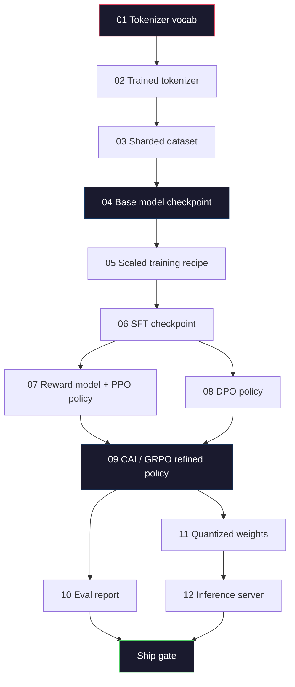
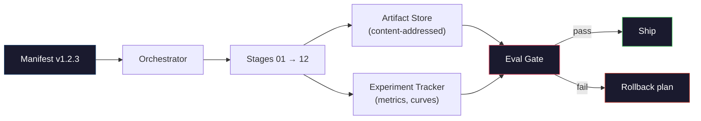

# بناء خط أنابيب كاملة لدرجة الماجستير

> كل شيء من الدروس 01 إلى 12 هي مرحلة واحدة من خط أنابيب واحد. هذه الدروس هي الدرج الذي يحول تلك المراحل إلى مسار واحد من نهاية إلى نهاية: التوجه، قبل القطار، النطاق، SFT، التوجه، تقييم، الكميات، الخدمة. لن تدرب نموذج 70B على جهاز كمبيوتر محمول ستقومون بإنتاج طبقة التنسيق، والإشارة، وبوابة التقييم، وخطة التراجع التي تستخدمها فريق الحدود لعام 2026 لتحديد ما سيتم شحنه. هذه هي الحجر الرئيسي

> **【中文解读】**第 01-12 课程是一条管线的各个阶段──本课程将它们串联为端到端运行:分词→预训练→扩展→SFT→对齐→评估→量化→部署──你不会在笔记本上训练70B 模型,但你会出 2026年前沿团队用来决定发布什么编排层──

> **【拓展：端到端管线→生产实践】**حقيقة النموذج الكبير إنتاج القنابل أيضا يتضمن: بيانات إدارة الإصدارات التجربة تتبع (W&B) 模型注册 A/B 测试、回滚计划── هي MLOps في عصر النموذج الكبير تمديد──

>  **【前置】**هذا هو الحجر الرئيسي للمرحلة 10 (******************************************************************************************************************************************************************************************************************************************************************************************************************************************************************************************************************************************************************************************************************

>  **【类比】**完整 LLM 管线 = 造车流水线. 前面 12 课学了每个工位. 发动机、装底盘、喷漆), 本节是工厂设计师把这些工位按顺序串起来,加上"质检门" (门) "返工通道" (轮回) "生产计划表" (表) .

**Type:** Build
**Languages:** Python (stdlib)
**Prerequisites:** All Phase 10 lessons 01-12
**Time:** ~120 minutes

## أهداف التعلم

- قم بتجميع الدرس الـ11 السابق (التوكينيزر والبيانات والتدريب المسبق وتوسيع النطاقات والتحديدات، والتحديدات، والتحديدات، والتحديدات، والإدراك، والإدراك، والإدراك، والتحديد، والكميات، والإستنتقاد) إلى تحديد واحد قابل للتكرار
  将分词、数据、预训练、扩展、SFT、RLHF、DPO、CAI、评估、量化、推理) المجموعة إلى تنظيمات خط الأنابيب الواحدة القابلة للتطبيق
- تحديد عقد الأثاث بين المراحل: ما يستهلك كل مرحلة، ما ينتج، وكيفية التحقق من المدخلات في المرحلة التالية
  定义阶段间产品契约: كل مرحلة استهلاك ما 产出 ما  下一阶段 كيفية تحديد المدخل
- بناء منظمة موسيقية تتبع التجارب، وتحويلها الأثرية، والبوابات السفن القرارات على عتبات التقييم
  بناء جهاز تنظيم، تتبع التجارب، والخيارات، وتقييم القيمة على القيادة وإصدار القرارات
- صياغة خطة إعادة التدريب: أي أثاث رخيص لإعادة التدريب، والتي باهظة الثمن، وما تكلفة نقطة تفتيش فاسدة
  设计回滚计划: ما هي المنتجات التي يمكن أن تبدوا رخيصة، ما هي مكلفة، وتلفة

## المشكلة المشكلة المشكلة

الدروس السابقة كل عمل. تم تدريب Tokenizer. تم تدريب GPT المسبق. تم تجميع مجموعة بيانات SFT. تم تدريب نموذج مكافأة. تم تشغيل DPO. تم قياس الموازين. تم تصدير الأوزان الكمية. تم تشغيل خادم الإستثمار. كل واحد هو دفتر مذكرة. لكل واحد لديه اتفاقيات خاصة به، مسارات خروجه الخاصة، بذور خاصة به.

>  دروس سابقة كل منها قادر على العمل分词器训练了──迷你 GPT 预训练了──SFT 数据集组装了──奖励模型训练了──DPO 运行了──评估测量了──量化权重导出了──推理服务器启动了──每一个都是笔记本──每个都有自己的约定,自己的输出路径,自己的种子──

التدريب على الحدود ليس دفترًا مذكريًا إلاما 3 405B أخذ 30 مليون H100 ساعة على مدى حوالي 54 يوما. تستغرق "ديب سيك" (V3) حوالي 2.8 مليون ساعة خلال ذلك الوقت، نقطة تفتيش واحدة فاسدة، تلوث واحد للبيانات، رجعة واحدة تقييم يمكن أن تكلف فريق أسبوع من ساعة الحائط وشهر من ميزانية GPU. الطريقة التي تنجو بها الفرق من هذا هو من خلال نظافة خطوط الأنابيب: كل مرحلة لديها مدخل تحديدي، ومخرج تحديدي، ومرسوم، ومرسوم، وبوابة.

> لم يكن التدريب على خط الملاحظة. لم يستخدم Llama 3 405B حوالي 3000 مليون H100 小时, حوالي 54 天. DeepSeek-V3 استخدم حوالي 280 مليون H800 小时.

هذه هي الحجر النهائي. لن تشغيل خط الأنابيب من نهاية إلى نهاية على جهاز كمبيوتر محمول. سوف تكتب الموسيقي الذي ينسق المراحل، والخطاب الذي يصف الجري، والتحقق الذي يمنع قرارات السفن، وخطة إعادة التشغيل التي تسمح لطرف ثالث بإعادة تشغيل عملك من ملف واحد. الرمز صغير؛ والتنظيم كبير.

> هذا هو الدروس العليا. لن تقوم بالعمل على خط التشغيل من نهاية إلى آخر على الكمبيوتر. سوف تكتب جهاز تنظيم المخططات المنسقة للمرحلة، وتصف عملية التشغيل، وحدة تحديد القرارات التي يتم التحكم فيها، وترك الطرف الثالث يقوم بإعادة تشغيل عملك من وثائق واحدة.

النمط يتراوح من 100M إلى 1T دون تغيير. نفس المكونات الأربعة -- المظهر، الموسيقي، بوابة التقييم، متجر الأثرية -- تشغيل Llama 3 وتشغيل هوايتك GPT أيضا. الفرق هو حجم الأرقام داخل إعداد كل مرحلة، وليس شكل الأنابيب.

## المفهوم الأساسي

> **【中文解读】**هذا الدراسة سوف يقدم جميع المكونات للتكامل لتحقيق كاملة LLM  تدريبات :分词器 → 数据管线 → 预训练 → SFT → 对齐.

> **【拓展：完整管线的成本估算】**訓練一款 Llama 3 70B 级型模型的完整管线成本:预训练约200-500万美元(GPU 时间),SFT约1-5万美元(数据标注),RLHF/DPO约5-10万美元(偏好数据标注) ;;总成本预训占95%+, ولكن المرحلة المحددة تحدد عملية النموذج والسلامة.


### المراحل الثانية عشر

كل درس من المرحلة 10 هو مرحلة.



يمكن أن تعمل المراحل 07 و 08 بالتوازي. كل شيء آخر يعتمد على صعوبة. تغيير في المرحلة 02 (tokenizer) يؤدي إلى إلغاء كل أداة أسفل التيار. تغيير في المرحلة 10 (eval) يؤدي إلى إلغاء قرار السفينة فقط.

> 阶段 07 和 08 可以并行运行──其他都是硬依赖──阶段 02(分词器) التغييرات التي تجعل جميع المنتجات التالية غير فعال──阶段 10(评估) التغيرات التي تجعل فقط إصدار القرارات غير فعال──

### الظهور

المخطط هو ملف واحد يصف تشغيلًا كاملًا بما يكفي لإعادة تشغيله. لا شيء ينتجه الخط أن يعتمد على حالة ليست في المخطط. الحقول مملة و إلزامية.

```
pipeline_version: 1.2.3
seed: 42
git_commit: a1b2c3d4
stages:
  01_tokenizer:
    recipe: bpe_32k
    input_hash: sha256:...
    output_hash: sha256:...
    wall_clock_sec: 3600
    cost_usd: 12
```

إن خروج الناتج من المرحلة N هو خروج المدخل من المرحلة N + 1. أي انحراف وتوقف خط الأنابيب. هكذا يمكنك اكتشاف الفساد البيانات مبكرا. كما أنه كيف يثبت زميل في فريق في قارة مختلفة أن إعادة تشغيله أنتجت نفس العناصر التي أنتجتها.

في الممارسة الفريقية تستخدم مخطط YAML صغير بالإضافة إلى ملف التحقق من المظاهر الذي يختلف عن الجري الناجح السابق. أي دلتا خارج الحقول المتوقعة (تكلفة، ساعة الجدار) هو راية حمراء.

### تطبيق الأثاث

إنّ إنتاج كلّ مرحلة هو أداة مكتوبة، ليس قطعة إداريّة، وليس طعم، بل نوعٌ مسمّى مع مخطّط معروف.

| Stage | Artifact Type | Key Fields |
|-------|--------------|-----------|
| 01-02 | Tokenizer | vocab.json, merges.txt, config.json, hash |
| 03 | Dataset | shards[], row count, token count, dedup stats |
| 04-05 | Checkpoint | weights.safetensors, config.json, optimizer state, step count |
| 06 | SFT Model | checkpoint + SFT recipe + data mix |
| 07 | Reward Model | RM checkpoint + preference data hash |
| 08-09 | Policy | checkpoint + reference hash + beta + KL budget consumed |
| 10 | Eval Report | benchmark scores + regression diffs + eval data hash |
| 11 | Quantized Model | quantized weights + calibration data + accuracy delta vs FP16 |
| 12 | Server Spec | endpoint + model hash + config + observability hooks |

يمنع التطبيق وضع الفشل الأكثر شيوعاً: استخدام خروج مرحلة 08 كمدخل مرحلة 06 ، وإرسال نموذج مدرب من DPO عبر مسار SFT. تصنع الأثاث المميزة وتوقيعات المرحلة المميزة هذه الأخطاء أخطاء في وقت التجميع ، وليس أخطاء يوم خمسة.

### بوابة إيفال

الشحن ليس "التدريب انتهى". الشحن هو "التدريب انتهى والبوابة التقييم تمت. "بوابة يتم تعريفها قبل بدء الجولة.

```
gates:
  mmlu:      >= baseline + 0.5   # no regression
  humaneval: >= baseline + 1.0
  truthfulqa: >= baseline         # no drop
  safety_refusal_rate: <= 0.05
  kl_from_reference: <= 25.0
  cost_total_usd: <= 50000
```

كل بوابة هو عددية عتبة. لا بوابات "يبدو جيدة". لا علامات ذاتية. إذا تمر كل بوابة، يتم وضع علامة على التحف المرسلة. إذا فشل أي بوابة، يتم إجراء الجولة في انتظار الإغلاق الصريح من قبل المراجع المسمى، والذي يتم تسجيل نفسه في المذكرة.

بوابة * 2 بوابات تقاطع معظم الكوارث. بوابة * رجعة * (يجب أن يكون النموذج الجديد على الأقل جيدًا بنفس الجودة التي كانت عليه في النماذج المرجعية الأساسية) تقاطع أخطاء التدريب. بوابة * كيل ميزانية * (لا يجب أن تكون السياسة المنسقة قد انحرفت أبعد من X من مرجعها) تقاطع تعديل التنظيم. كل خط أنابيب الإنتاج له كل منهما.

### الموسيقي

قطعة صغيرة من الشفرة التي تقرأ المخطط، وتقوم بإرسال المراحل، وتتبع الأثاث، وتوقف عن أي انتهاك للعقد. هذه ليست Airflow. هذه ليست Kubeflow.

وظيفة الموسيقي ضيقة:

1. أخرجوا اليوم من المذكرة
2. لكل مرحلة، تحقق من وجود الخروج المتوقع بالفعل عند الاختراق الصحيح (فقط إذا كان كذلك).
3. إدارة المسرح، التقاط stdout / stderr، قياس الساعة الجدارية والتكلفة.
4. التحقق من الاختراق الخارجي مقابل الاختراق المدخل المتوقع للمرحلة التدريجية.
5. عند الفشل، اكتب بيان جزئي مع مرحلة الفشل الدقيقة والخروج غير الصفر.

هذا 200 سطر من بيثون. سوف تبدو مثل الملف`code/main.py`تحت الغطاء، أنبوب حقيقي يستخدم`torchrun`أو`ray`لتنفيذ مراحل فردية على مجموعة، ولكن الموسيقي نفسه يعمل على صندوق واحد.

### تتبع التجارب وتخزين الأثاث

نظامان خارجيان يثبتون خط الأنابيب

**Experiment tracker (wandb, neptune, mlflow).**يُسجل منحنى الخسارة، ومقاييس التقييم، وتلفزية النظام لكل مرحلة. المسجل هو المكان الذي تذهب إليه عندما تحتاج إلى مقارنة الجولة A مع الجولة B بعد ثلاثة أسابيع. الفريقات تستخدم دائماً تقريباً مسجلًا مضيفًا لهذا -- كتابة وقتك الخاص يفقد الوقت الذي يجب أن يذهب إلى التدريب.

**Artifact store (S3, R2, GCS).**متجر غير قابل للتغيير للمواقع التفتيشية ومجموعات البيانات والمعلامات والتقارير التقييمية. يتم تعيين الأدوات عن طريق الهاش، وليس عن طريق اسم الملف. اسم ملف مثل `latest.pt`هو بندقية قدم`ckpt-7b-step-20000-sha256:abc123.safetensors`هو عقد

الموسيقي يكتب لكل منهما، ومتابعة البشر يبحثون عن الرسوم البيانية، ومتجر الأثاث هو للمرحلة التالية يبحثون عن المدخلات.

### التكلفة

في الجولة الحدودية يوجد رقم دولار مرفق.

**Pre-run estimate.**من المخطط، الحساب المتوقع FLOPs (للمسابقة التدريب: 6 x بارامز x توكنات) ، متوقع ساعات GPU (FLOPs / ذروة التعبير / الاستخدام) ، والتكلفة بالدولار في معدل الإيجار الحالي. إذا تجاوزت التقدير البوابة الميزانية، فإن خط الأنابيب يرفض البدء.

**In-run tracking.**يتم تسجيل الساعة الحائطية للمرحلة بعد المرحلة والتكلفة في المذكرة. بعد كل مرحلة، يتم التحقق من الميزانية المتبقية. إذا تجاوزت مرحلة، يتم تقييم بوابة المرحلة التالية مع الميزانية المتبقية الجديدة. لا تجد أنك نفدت المال عندما يطلب VC.

تكلفة "إلاما 3" المبلغ عنها كانت $61M. DeepSeek-V3 reported $5.6 مليون للسباق الرئيسي قبل التدريب. النسبة هي في الغالب كفاءة الأجهزة بالإضافة إلى مزيج من الخبراء -- ولكن التكلفة المحددة واضحة لأن كل فريق تعقبها على مرحلة، وليس على سبيل المثال.

### إعادة التكاثر مقابل التحديد

هذه ليست نفسها. * قابل للتنظيم* يعني نفس المظهر بالإضافة إلى نفس الشفرة بالإضافة إلى نفس البنية التحتية تنتج نقطة تفتيش مع قياسات متكافئة في المستوى التدريجي. * تعني التحدد* الناتج متطابق بيت.

التدريب الحديث لدرجة الماجستير في مجال القانون يمكن إعادة تكوينه ولكن ليس ديترمينستيا. يجمع نظام تدريب الموزع من أجل الحد من النظام، وعدم تحديد جوهر GPU (cuBLAS، flash-attn) ، والإدراج الدقيق المختلط لإنتاج طائرات تختلف على مستوى 1e-5 بين الجوائز. هذا جيد بالنسبة للمقاييس النهائية، التي لا تتحرك. إنه أمر مميت إذا كنت تحاول إصلاح التباينات على مستوى البيت. العلاج هو تسجيل كل مرحلة من المشاريع والخروج والمقاييس الرسمية -- إذا كانت هذه تتطابق، فإن الجولة "تتكرر" حتى لو لم تكن الوزن متطابقة.



### خطة الرد

قبل بدء السباق، اكتب ما يحدث في فشل كل مرحلة. ثلاث فئات.

- **Cheap to re-run**(ساعات): الـ Tokenizer، تقييم، كمية، خادم الاستنتاج.
- **Medium**(أيام): SFT، DPO، CAI. حافظ على النموذج الأساسي؛ إعادة تشغيل فقط مراحل التنحية.
- **Expensive**(أسابيع وملايين الدولارات): التدريب المسبق. خطة الاحتياط هنا ليست "إعادة التدريب". إنها "استخدام آخر نقطة تفتيش جيدة وإعادة التدريب في مراحل التدريب الأرخص مع بيانات مراجعة".

لأن الاعتمادات على المرحلة يتم كتابتها وتحويلها، يمكن للموسيقي حساب مجموعة التراجع تلقائيًا: إلغاء المرحلة الفاشلة بالإضافة إلى كل نَسَل. الفشل في المرحلة 06 (SFT) يؤدي إلى إلغاء 06, 07, 08, 09, 10, 11, 12. الفشل في المرحلة 11 (الكمبئية) يؤدي إلى إلغاء 11 و 12 فقط. وتجنب تسمية هذا في الأمام التبديل بينما يكون الفريق متعبًا في 4 صباحا.

### وصفات الإنتاج الملاحظة في عام 2026

معظم فرق الحدود تجمع على نفس العظم.

- الـ 128K بيبي مع إرجاع بايت، تدرب على شريحة صغيرة متوازنة متعددة اللغات
- التدريب المسبق: رموز 10-20T، معظمها شبكة زائد رمز زائد اصطناعي. معالجة الميون أو آدم و. FSDP2 أو ديبسيبيد زرو-3. التفتيش التدريبي. وزن BF16، FP32 الماستر.
- SFT: 500k-2M أزواج تعليمات، مختلطة البشر والصناعية، مع تقليل صارم ضد مجموعة تقييم.
- التنحية: DPO أو CAI + GRPO. RLHF فقط عندما تكون إشارة الاختيار متعددة الأبعاد جداً لـ DPO.
- إيفال: MMLU-Pro، MATH، HumanEval+، GPQA، SWE-Bench Verified، LiveBench، بالإضافة إلى مجموعة خاصة تمتلكها الجمهور لا ترى أبدا.
- الكمية: GPTQ أو AWQ 4 بتات للخدمة، 8 بتات لتقييمات السلامة حيث أن الدقة مهمة.
- خدمة: vLLM، TensorRT-LLM، أو في المنزل.

الأرقام تتغير كل ستة أشهر لكن العظم لا يتغير

```figure
beam-search
```

## بناءها

> **【拓展：训练管线的工程挑战】** كاملة LLM  تدريب خط الهندسة تتضمن: اختبار النقاط الإدارة  كل خطوة حفظ حالة النموذج، التدريب وقف بعد يمكن استعادة) 日志 و مراقبة WandB  تتبع فقدان منحنى  تعلم معدل  التقاط)  فائقة العيارات 


## بناء ذلك تحرك لتحقيق

رمز الدروس هو جهاز ترقية ومحقق مظهر ، وليس اثني عشر نصوص تدريبية. يتم محاكاة كل مرحلة مع محفظة مساحة تنتج عنصرًا خارجيًا بحجم صحيحًا ومركزًا. تشغيل جهاز ترقية من نهاية إلى نهاية يثبت أن الأنابيب تعمل قبل حرق أموال GPU على المراحل الحقيقية.

> هذا المادة هو المعدل والفحص الصفحة، وليس اثني عشر كتاب تدريب. كل مرحلة تستخدم محركات المثبتة، وتنتج الصيغة الصحيحة والمنتجات الخارجة من الجهاز.

خط الأنابيب في`main.py`يستخدم 12 مرحلة من المقرر، ويُنتج منشور، ويقوم بممارسة بوابة تقييم غير فعالة لتظهر كيف يبدو المقرر.

> `main.py`تمتدّة الممرات المرتبطة بـ 12 مرحلة، وتخرج من المخططات، وتجربة تحديدات الفشل لتوضيح كيفية تشغيل الممرات المرتبطة بـ 12 مرحلة، وتحويلها إلى قائمة تدريبية حقيقية.

## استخدمها في إطار التنفيذ

سير العمل القنوني لديه ثلاث أوامر.

> 标准工作流有三个命令──

أركض`plan`معظم أخطاء خطوط الأنابيب تظهر في الوقت المناسب - حدود البوابة المفقودة، الهيشات القديمة، تجاوزات الميزانية.`plan`هو مجاني، ركض`run`إنقاذ المال من خلال صيد الحشرات على الجانب الرخيص.

> كل مرة يبدأ بها`plan` عدة خطات في التخطيط يحدث انقطاع القيمة المضادة  المدة المطلوبة  الميزانية الزائدة  التنفيذ `plan`免费──运行 `run`昂贵──在便宜的一侧捕捉虫 省钱──

إنتاج `gate`هو إما`SHIP`أو`HOLD: <reason>`. لا تعتبر الجولة التي تمت إتمامها فشلاً، بل نقطة قرار. إما أن يقوم المراجع المسمى بإلغاء (وتسجل الإلغاء) ، أو يوافق على إعادة التدفق.

> `gate`          `SHIP`أو`HOLD: <reason>` لا يفلح عملية التثبيت؛ إنها نقطة قرار.

## أرسلها .

هذا الدرس يُنتج`outputs/skill-llm-pipeline-reviewer.md`. إعطاءها بيان خط الأنابيب المقترح ويتحقق من جميع العقود: التصفيف المرحلي، سلسلة الهاش، البوابات، خطة التراجع، تقدير التكلفة. يرفض الموافقة على بيان مع البوابة الافتراضية المفقودة، ميزانية KL غير المحدودة، أو تشغيل يخلط بيانات الافتراض والتدريب.

> 本课产出 `outputs/skill-llm-pipeline-reviewer.md` إلى قائمة الخطوط المضافة التي تقدمها، فإنها تحقق من جميع المعاهدات: نوع المرحلة ✓ الحبس الخليوي ✓ الحكم ✓ التخطيط التدريجي ✓ التقديرات التكلفة ✓ رفضت الموافقة على قائمة المعلومات المضافة إلى القيادة ✓ الميزانية المحدودة للخدمات المشتركة أو المختلطة للتقييم والتدريب ✓

## تمارين التدريب

1. تمديد الموسيقي لدعم تنفيذ المراحل 07 و 08. استخدم stdlib `concurrent.futures`وحدات. تأكد من أن المظهر النهائي يسجل نتائج كل من المراحل وأن hash المدخل من المرحلة 09 هو مزيج تحديدية من كليهما.
   中文翻译:扩展编排器支持阶段 07 和 08 的并行执行──使用标准库 `concurrent.futures`模块──确认最终清单记录两个阶段的输出,而阶段09的输入哈希是两者的确定性组合──

2. إضافة بوابة "تحقق من التلوث". بالنظر إلى مجموعة بيانات eval hash وقطع مجموعة بيانات التدريب، احسب التداخل (التطابق الدقيق في السطر أو 13 جرام). يفشل البوابة إذا تجاوز التداخل 0.1٪. إطعامها مجموعة تدريب ملوثة وتأكيد أن البوابة تحمل الجولة.
   中文翻译:添加"污染检查"门控──给定评估数据集哈希和训练数据集分片,计算重叠(精确字符串匹配或13克匹配)──重叠超过0.1% 则门控失败──进入受污染的训练集并确认门控挂起运行──

3. تنفيذ تقدير التكلفة من المبادئ الأولى. للمرحلة 04 (التدريب المسبق) ، تقدير FLOPs على أنها 6 × پارامز x رموز ، افترض 40% MFU (استخدام FLOPs النموذج) على H100 عند 989 TFLOPs BF16, عند 2.50 دولار / جي بي يو-ساعة. تقرير تقدير لنموذج 7B المدرب على رموز 2T. مقارنة مع أرقام Llama 2 المنشورة.
   中文翻译:从第一性原理实现成本估算器──对于阶段 04(预训练),估算 FLOPs为 6 x 参数 x token,假设 H100 上 40% MFU(模型算力利用率),989 TFLOPS BF16,$2.50/GPU-小时──报告 7B 模型在2T token 上训练的估算──与已发表的Llama 2 数据比较──

4. قم ببناء إعادة التداول الجزئي. قم بتحاكي فشل في المرحلة 09 (CAI) ، ثم قم بإعادة تشغيل المرحلة 09 إلى 12 بينما ترك 01-08 مسجلاً. يجب على الموسيقي اكتشاف الأدوات المسجلة بواسطة الهاش وتخطوها. قم بتقييم ساعة الحائط التي تم حفظها مقابل إعادة تشغيل كاملة.
   中文翻译:构建部分回滚──模拟阶段 09(CAI) فشل، ثم重跑阶段 09-12 同时保持 01-08 缓存──编排器应通过哈希检查缓存产品并跳过──测量相比完整重跑节省的挂钟时间──

5. إضافة قابلية للملاحظة. إصدار OpenTelemetry امتدادات لكل مرحلة، مع صفات لبرامج، رموز رأى، الخسارة، والتكلفة. أنبوب الممتدات إلى جمع محلي. النقطة ليست لوحة التحكم؛ النقطة هي أن صحة كل مرحلة يمكن تتبعها من هوية تتبع واحدة.
   中文翻译:添加可观测性──发发 OpenTelemetry span,带参数、已见代币、损失和成本属性──将 span 管道到本地收集器──重点不是仪表盘;重点是每个阶段的健康可从单个痕迹ID 追踪──

## شروط الرئيسية

| Term | What people say | What it actually means | 中文释义 |
|------|----------------|----------------------|---------|
| Manifest | "The recipe file" | YAML or JSON describing pipeline version, seed, per-stage config, and gate thresholds — sufficient to replay a run | 清单文件，描述管线版本、种子和每阶段配置 |
| Content-addressed | "By hash not name" | Artifacts stored by SHA-256 of their contents, so you can never confuse version A with version B | 内容寻址，按 SHA-256 哈希存储产物 |
| Eval gate | "The ship criteria" | Numeric thresholds on benchmark metrics and safety scores that must pass before an artifact is marked shippable | 评估门控，基准和安全分数必须达标才能发布 |
| KL budget | "How far alignment drifted" | A cap on cumulative KL(policy || reference) across alignment stages, enforced as a gate | KL 预算，对齐阶段累计 KL 散度的上限 |
| MFU | "How much of the GPU you used" | Model FLOPs Utilization — achieved FLOPs divided by theoretical peak. 40% is typical at 70B scale, 55% at 7B | 模型算力利用率，实际 FLOPs / 理论峰值 |
| Rollback plan | "What we do when it breaks" | Pre-written set of actions per stage on failure: re-run, fall back, retrain with revised inputs | 回滚计划，每个阶段失败时的预设行动方案 |
| Orchestrator | "The conductor" | The process that reads the manifest, dispatches stages, verifies hashes, halts on any contract violation | 编排器，读取清单、调度阶段、验证哈希 |
| Artifact store | "Versioned S3 for weights" | Immutable content-addressed object store — single source of truth for checkpoints, datasets, eval reports | 产物存储，不可变的内容寻址对象存储 |
| Reproducible | "Same metrics on replay" | Different bit-level weights but equivalent downstream metrics — the realistic target for distributed LLM training | 可复现，重跑时指标等价（权重可能不同） |
| Cost gate | "You cannot exceed X" | Pre-run cost estimate plus in-run tracker — the pipeline refuses to start if the estimate exceeds budget | 成本门控，预估超预算则拒绝启动 |

## المزيد من القراءة

- [Dubey et al., 2024 -- "The Llama 3 Herd of Models"](https://arxiv.org/abs/2407.21783)-- التفصيل العام لأكثر تفصيلاً لخط الأنابيب الحدودية بما في ذلك البيانات والتدريب والتنسيق والتقييم
- [DeepSeek-AI, 2024 -- "DeepSeek-V3 Technical Report"](https://arxiv.org/abs/2412.19437)-- أنبوب الكفاءة الأول على نحو 1/10 من تكلفة تدريب درجة Llama 3
- [Kaplan et al., 2020 -- "Scaling Laws for Neural Language Models"](https://arxiv.org/abs/2001.08361)-- العلاقة الأصلية بين الحوسبة والبيانات والفئات
- [Hoffmann et al., 2022 -- "Training Compute-Optimal Large Language Models (Chinchilla)"](https://arxiv.org/abs/2203.15556)-- تصحيح كابلان الذي أعاد توازن الميزانيات البيانات الحديثة
- [PyTorch FSDP2 documentation](https://pytorch.org/docs/stable/fsdp.html)-- التدريب القديم الموزع الذي يحل محل FSDP1 في PyTorch 2.4+
- [Weights & Biases LLM Reports](https://wandb.ai/site/llms)-- المخططات الحقيقية ومخرجات متابعة التجربة لدرجات LLM مفتوحة المصدر، مفيدة كملوائح يمكن التلاعب بها
