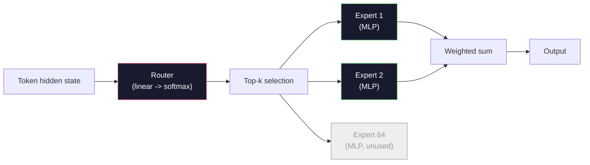

# نموذجات مفتوحة: معمارية المشى .

> لقد بنيت جهاز GPT-2 صغير من الصفر في الدروس 04. النماذج المفتوحة الحدودية في عام 2026 هي نفس العائلة مع خمسة أو ست تغييرات ملموسة. RMSNorm بدلا من LayerNorm. (سويجلو) بدلاً من (جيلو) (روبي) بدلاً من المواقف المتعلقة (جيكا) أو (ملا) بدلاً من (مها) الكاملة مزيج من الخبراء على نطاق واسع الرياضيات التي تعرفها بالفعل تغطي 95٪ منهم. هذه الدروس تقرأ Llama 3، DeepSeek-V3، Mixtral، Qwen، و Gemma جنبا إلى جنب وسمي الخط الدقيق حيث تختلف كل معمارية.

> **【中文解读】**أنت في الصف الرابع من الصف الحادي والعشرين من المرحلة الماضية، قمنا ببناء GPT-2 Small.

> **【拓展：DeepSeek架构】**المفاتيح الرئيسية لـ DeepSeek-V3: MLA ((多头潜在注意力,压缩 KV-cache) 无助损失的MoE 负载均衡、MTP(多代币 预测) وDualPipe 训练── فهم هذه المباني هو فهم اتجاهات تطوير النموذج الكبير 2025-2026‬‬‬‬‬‬‬‬‬‬‬‬‬‬‬‬‬‬‬‬‬‬‬‬‬‬‬‬‬‬‬‬‬‬‬‬‬‬‬‬‬‬‬‬‬‬‬‬‬‬‬‬‬‬‬‬‬‬‬‬‬‬‬‬‬‬‬‬‬‬‬‬‬‬‬‬‬‬‬‬‬‬‬‬‬‬‬‬‬‬‬‬‬‬‬‬‬‬‬‬‬‬‬‬‬‬‬‬‬‬‬‬‬‬‬‬‬‬‬‬‬‬‬‬‬‬‬‬‬‬‬‬‬‬‬‬‬‬‬‬‬‬‬‬‬‬‬‬‬‬‬‬‬‬‬‬‬‬‬‬‬‬‬‬‬‬‬‬‬‬‬‬‬‬‬‬‬‬‬‬‬‬‬‬‬‬‬‬‬‬‬‬‬‬‬‬‬‬‬‬‬‬‬‬‬‬‬‬‬‬‬‬‬‬‬‬‬‬‬‬‬‬‬‬‬‬‬‬‬‬‬‬‬‬‬‬‬‬‬‬‬‬‬‬‬‬‬‬‬‬‬‬‬‬‬‬‬‬‬‬‬‬‬‬‬‬‬‬‬‬‬‬‬‬‬‬‬‬‬‬‬‬‬‬‬‬‬‬‬‬‬‬‬‬‬‬‬‬‬‬‬‬‬‬‬‬‬‬‬‬‬‬‬‬‬‬‬‬‬‬‬‬‬‬‬‬‬‬‬‬‬‬‬‬‬‬‬‬‬‬‬‬‬‬‬‬‬‬‬‬‬‬‬‬‬‬‬‬‬‬‬‬‬‬‬‬‬‬‬‬‬‬‬‬‬‬‬‬‬‬‬‬‬‬‬‬‬‬‬‬‬‬‬‬‬‬‬‬‬‬‬‬‬‬‬‬‬‬‬‬‬‬‬‬‬‬‬‬‬‬‬‬‬‬‬

>  **【前置】**学本节前请先掌握:Phase 10·04(Pre-Training Mini GPT) 理解原始 GPT 架构;Phase 10·05(توسيع الحجم);Phase 10·12(تحسين الإستدلال) 理解 KV cache 才能懂 MLA。本节是后续 15-22 节(架构创新详解) 概览。

>  **【类比】**انظر 2026 开源模型 = 看不同品牌的电动车──Llama 3 = 特斯拉(务实,GQA + RoPE 标准配置);DeepSeek-V3 = 比亚迪(堆料王,MLA + MoE + MTP + DualPipe 全套);Mixtral = 大众 ID(MoE 老牌);Qwen = 小(多尺寸覆盖);Gemma = 沃尔沃(精简安全)──底层都是 Transformer(电动车底盘),差异在 5-6 个关键模块──

**Type:** Learn
**Languages:** Python (stdlib)
**Prerequisites:** Phase 10, Lessons 04, 05, 12 (Pre-training, Scaling, Inference)
**Time:** ~45 minutes

## أهداف التعلم

- اقرأ config.json من Llama 3، Mistral، Mixtral، Gemma 2، Qwen 2.5، و DeepSeek-V3 و اشرح كل حقل
  阅读 لاما 3、مسترال、مختلط、جما 2、كوين 2.5 和 DeepSeek-V3
- أسمائ التغييرات المعماريّة المحدّدة التي أجريها كلّ نموذج مقابل GPT-2 Small وبرّحها من المبادئ الأولى
  وتحدث عن كل نموذج مقارنة بـ GPT-2 Small
- عدد المعلمات الحسابية، حجم ذاكرة التخزين KV، وذاكرة التفعيل لأي نموذج مفتوح من تكوينها وحدها
  فقط من التكوين الحسابات من أي نموذج مفتوح المصدر عدد الإثباتات
- اختر النموذج المفتوح المناسب لهدف التنفيذ بالنظر إلى قيود التأخير والذاكرة والقدرة
  على أساس التأخير والذاكرة والقدرة، لتنفيذ الهدف اختيار مناسبة لنموذج مفتوح المصدر

## المشكلة المشكلة المشكلة

في الدروس 04 كتبت 350 سطر من النمبي وكان لديك نموذج على شكل GPT-2. إلاما 3 405B لديها تقرير فني من 200 صفحة. غريزةك هي أن هذه هي حيوانات مختلفة -ليسوا كذلك الصفحات 200 تصف نفس الموضوع مع خمسة أو ست تعديلات جيدة الحافز، بالإضافة إلى ألف تفاصيل تنفيذ حول التوسع. العظم -- التوابل، كتلة المحول، الاهتمام، MLP، القاعدة، الرأس -- غير متغيرة.

> كتبت في الصف الرابع 350 صفة من النمط على شكل GPT-2 ‬‬‬‬‬‬‬‬‬‬‬‬‬‬‬‬‬‬‬‬‬‬‬‬‬‬‬‬‬‬‬‬‬‬‬‬‬‬‬‬‬‬‬‬‬‬‬‬‬‬‬‬‬‬‬‬‬‬‬‬‬‬‬‬‬‬‬‬‬‬‬‬‬‬‬‬‬‬‬‬‬‬‬‬‬‬‬‬‬‬‬‬‬‬‬‬‬‬‬‬‬‬‬‬‬‬‬‬‬‬‬‬‬‬‬‬‬‬‬‬‬‬‬‬‬‬‬‬‬‬‬‬‬‬‬‬‬‬‬‬‬‬‬‬‬‬‬‬‬‬‬‬‬‬‬‬‬‬‬‬‬‬‬‬‬‬‬‬‬‬‬‬‬‬‬‬‬‬‬‬‬‬‬‬‬‬‬‬‬‬‬‬‬‬‬‬‬‬‬‬‬‬‬‬‬‬‬‬‬‬‬‬‬‬‬‬‬‬‬‬‬‬‬‬‬‬‬‬‬‬‬‬‬‬‬‬‬‬‬‬‬‬‬‬‬‬‬‬‬‬‬‬‬‬‬‬‬‬‬‬‬‬‬‬‬‬‬‬‬‬‬‬‬‬‬‬‬‬‬‬‬‬‬‬‬‬‬‬‬‬‬‬‬‬‬‬‬‬‬‬‬‬‬‬‬‬‬‬‬‬‬‬‬‬‬‬‬‬‬‬‬‬‬‬‬‬‬‬‬‬‬‬‬‬‬‬‬‬‬‬‬‬‬‬‬‬‬‬‬‬‬‬‬‬‬‬‬‬‬‬‬‬‬‬‬‬‬‬‬‬‬‬‬‬‬‬‬‬‬‬‬‬‬‬‬‬‬‬‬‬‬‬‬‬‬‬‬‬‬‬‬‬‬‬‬‬‬‬‬‬‬‬‬‬‬‬‬‬‬‬‬‬‬‬‬‬‬‬‬‬‬‬‬‬‬‬‬‬‬‬‬‬‬‬‬‬‬‬‬‬‬‬‬‬‬‬‬‬‬‬‬‬‬‬‬‬‬‬‬‬‬‬‬‬‬‬‬‬‬‬‬‬‬‬‬‬‬‬‬

هذه الدروس هي مختلفة. لكل عائلة نموذج مفتوحة رئيسية، نقوم بإدراج بالضبط ما تغير من GPT-2، لماذا، وما تكلفته. عندما تنتهي يمكنك قراءة بطاقة نموذج جديدة وتحويلها ذهنيا إلى خط أساس GPT-2.

> هذا الدراسة هو اختلاف. بالنسبة لكل عائلة نموذج مفتوحة رئيسية، ندرج مقارنة GPT-2 إلى ما تغيرت في نهاية المطاف، لماذا تغيرت؟ ثمنها هي ما.

الفائدة العملية هي أنه عندما تطلق Meta Llama 5 أو DeepSeek V4 ، لن تحتاج إلى نموذج عقلي جديد. ستنظر إلى التكوين ، وترى أي من الزر المعروفة تتحرك ، وتعرف ما هي الآثار التدريجية. هي معمارات 2026 صندوق أدوات محدودة. يختار كل نموذج جديد مجموعة فرعية مختلفة.

> الفائدة الحقيقية هي: عندما يُصدر Meta Llama 5 أو DeepSeek V4 ، لا تحتاج إلى نموذج جديد للذكاء.

## المفهوم الأساسي

> **【中文解读】**本课对比开源 LLM 架构演进:GPT 系列 密集变压器)→ لاما 2/3(RMSNorm、SwiGLU、RoPE、GQA)→ مسطرة(滑动窗口注意力)→ مخلوط(MOE 稀疏激活)  فهم هذه الاختلافات الهيكلية هي أساس الموديل الملائم للاختيار.

> **【拓展：架构演进的趋势】**اتجاهات البناء في 2024-2025: ROPE  تحويل الموقع  تحويل الموقع  تحويل الموقع  تحويل الموقع  تحويل الموقع  تحويل الموقع  تحويل الموقع  تحويل الموقع  تحويل الموقع  تحويل الموقع  تحويل الموقع  تحويل الموقع  تحويل الموقع  تحويل الموقع  تحويل الموقع  تحويل الموقع  تحويل الموقع  تحويل الموقع  تحويل الموقع  تحويل الموقع  تحويل الموقع  تحويل الموقع  تحويل الموقع  تحويل الموقع  تحويل الموقع  تحويل الموقع  تحويل الموقع  تحويل الموقع  تحويل الموقع  تحويل الموقع  تحويل الموقع  تحويل الموقع  تحويل الموقع  تحويل الموقع  تحويل الموقع  تحويل الموقع  تحويل الموقع  تحويل الموقع  تحويل الموقع  تحويل الموقع  تحويل الموقع  تحويل الموقع  تحويل الموقع  تحويل الموقع  تحويل الموقع  تحويل الموقع  تحويلات


### الجوهر المتغير

جميع النماذج المفتوحة ذات التراجعية تشارك:

- تعريفات تعريفات (تجميل الكلمات x hidden_dim).
- كومة من N كتلة المفكّر: القاعدة، الاهتمام الذاتي، المتبقية، القاعدة، MLP، المتبقية.
- القاعدة النهائية والرأس الخطية المتجهة إلى حجم الكلمات (غالبا ما تكون مرتبطة بالوزن مع التوابع).
- قناع السبب، الخسارة المتقاطعة التوقيت التالي.

هذا هو الشكل، الباقي هو القفازات

### الـ6 عقدات التي تتحرك فعلاً

في كل نموذج مفتوح للحدود 2024-2026, يتم اختيار نفس الخيارات الستة للتصميم مرارا وتكرارا:

1. **Normalization.**الطبقة النظرية -> RMSNorm.
2. **Positional encoding.**تعلمت المطلقة -> ROPE (إضافة إلى التغيرات: YaRN ، NTK).
3. **Activation.**GELU -> SwiGLU (أو GeGLU).
4. **Attention head sharing.**المجلس الوطني للطاقة الذرية -> GQA -> MQA -> MLA.
5. **Dense vs sparse MLP.**كثيفة -> مزيج من الخبراء.
6. **Pre-norm placement.**البداية للطبيعة تبقى، بعد الطبيعة قد اختفت

كل شيء آخر (جدول زمني معدل التعلم، مزيج البيانات، حجم الحزمة، طول السياق) يعيش في إعداد التدريب، وليس في الهندسة المعمارية. ستة أزرار.

### القنبلة 1: RMSNorm

LayerNorm يخص متوسط، وينقسم بواسطة std، مقياس، وتحركات. RMSNorm يحتفظ فقط بالمقياس:

```
RMSNorm(x) = x / sqrt(mean(x^2) + eps) * gamma
```

لا يعني الحد من النسب. لا يوجد تحيز. واحد من الممل أقل لكل رمز. جادل Zhang و Sennrich (2019) أنه يطابق LayerNorm على الترجمة الآلية مع أن يكون أسرع بنسبة 10%. كل نموذج مفتوح حديث يعمل عليه.

التكلفة: لا شيء، الفائدة: ربح صغير، رمز أبسط.

### القنبلة الثانية:

كانت التوابل المكتسبة في الموقف هي جدول بحث 1024 فتحة في GPT-2.

إضافة موقف الدوران (RoPE، Su et al. 2021) يُحقق الموقف عن طريق تدوير كل متجه Q و K بالزوجات قبل منتج نقطة الاهتمام. زاوية الدوران هي وظيفة تحديدية للموقف، لذلك لا يوجد شيء يتم تعلمه ولا شيء ينفذ منه. مع خدوش التوسع (التقاط النقاط بين الجهات التي تدرك NTK ، YaRN) ، يمكن لنموذج تم تدريبه على سياق 8k أن يمتد إلى 128k عند الاستنتاج مع فقدان دقة متواضع.

```
q_rotated = rotate(q, angle(pos))
k_rotated = rotate(k, angle(pos))
score = q_rotated . k_rotated
```

كل إلاما، وميسترال، وكوين، وديب سيك، و جيما يستخدمون روبي. يستخدم جيما 2 هجين (روبي على معظم الطبقات، والانتباه المحلي النافذة المنزلقة على الآخرين).

### القنبلة الثالثة: SwiGLU

المخططات المختلفة لـ GPT-2 هي`x -> gelu(xW1 + b1) -> (...)W2 + b2`. يُستبدل SwiGLU (Shazeer 2020) التفعيل بمنتج مغلق:

```
SwiGLU(x) = (xW1) * sigmoid(xW1) * xV
```

تمت إعداد مقياسات متوازية بدلاً من مقياس واحد، وتتوافق مع عملية تنشيط سويش. أقوى تجريبياً على التعقيد لكل مبرمج. اعتمدت Llama 2 ، اتبعها الجميع. يتم تحديد حجم المبرمج المخبأ عادةً بحيث يطابق عدد المبرمجات الكلي مع MLP الكثيفة الأصلية: إذا استخدم GPT-2`ff_dim = 4 * hidden`, SwiGLU يستخدم `ff_dim = (2/3) * 4 * hidden = 8/3 * hidden`. . .

### القنبلة الرابعة: مشاركة الرأس

GPT-2 المستخدم **Multi-Head Attention (MHA)**كل رأس لديه مشهد Q، K، V الخاص به

**Multi-Query Attention (MQA, Shazeer 2019)**يشارك K و V على جميع الرؤوس. يقطع cache KV من قبل عدد_رؤوس، وهو خفض 12x إلى 32x على نموذج نموذجي. ينخفض الدقة قليلا على مقارنات صعبة.

**Grouped-Query Attention (GQA, Ainslie et al. 2023)**هو المنتصف: مجموعات G من رؤوس Q تشارك واحدة K و واحدة V. Llama 3 8B تستخدم GQA مع 32 رؤوس Q و 8 رؤوس KV (G = 8 ، لذلك مخزن KV يقلل 4x مقابل كامل MHA.

**Multi-Head Latent Attention (MLA, DeepSeek 2024)**يضغط K و V إلى متبادل متخفي منخفض الرتب ، مما يعيد إلقاءهم إلى أعلى لكل رأس. يقلل من مخزن KV مع الحفاظ على التعبير لكل رأس. يعتمد DeepSeek-V2 و V3 على هذا لأداءها في السياق الطويل.

| Scheme | KV Heads | KV Cache | Accuracy |
|--------|----------|----------|----------|
| MHA    | num_heads | full | best |
| GQA    | num_groups (G < num_heads) | num_heads / G reduction | near-MHA |
| MQA    | 1 | num_heads reduction | small hit |
| MLA    | latent, per-head decompression | smaller than MQA | near-MHA |

بالنسبة لأي نموذج أعلى من معايير ~ 13B ، فإن GQA أو MLA إلزامي بشكل فعال. MHA الكامل على مقياس هو كارثة cache KV.

### القنبلة 5: خليط من الخبراء

يقوم MLP الكثيف بتفعيل جميع معاييرها لكل رمز. يحتوي MLP MoE على خبراء K لكل كتلة ومركز يقوم بتحديد الخبراء من أعلى k لكل رمز (عادةً أعلى 2). يرى وزن هؤلاء الخبراء فقط مرسلًا إلى الأمام لهذا الرمز.

```
router_logits = xW_r
indices, weights = top_k(router_logits, k=2)
output = sum_i weights[i] * expert[indices[i]](x)
```

النداء: يمكنك أن يكون لديك 64 خبير من الحجم 7B كل واحد (لذا إجمالي عدد المعلمات هائل) بينما تعمل فقط 2 منهم لكل رمز (لذا حساب لكل رمز يطابق نموذج 7B كثيف). Mixtral 8x7B لديها 47B مجموع المعلمات ولكن ينشط فقط 13B لكل رمز. DeepSeek-V3 لديها 671B مجموع المعلمات ولكن ينشط فقط 37B لكل رمز.



المزايا: نفس الحساب، المزيد من المعلمات، قدرة أفضل. السلبيات: لا يزال على الذاكرة الخبيرة أن تعيش في مكان ما (لذلك تحتاج الخدمة إلى المزيد من VRAM من مكافئ كثيفة) ، وتوازن الحمل على الجهاز التوجيهي صعب، وتحسين الجهاز التوجيهي أثناء التنظيم هو مجال بحثه الخاص.

### القنبلة 6: البقاء قبل المعايير

يطبق المحول الأصلي معيار الطبقة بعد كل طبقة فرعية. كل نموذج مفتوح منذ GPT-2 يضع * قبل * كل طبقة فرعية. قبل القاعدة هو أسهل بشكل صارم للتدريب في العمق. لا شيء للجدل.

### فرق النموذج عن النموذج

هذه هي الطاولة التي تصنع كل هذا الخرسانة.

| Model | Year | Total Params | Active Params | Norm | Activation | Position | Attention | MoE | Context |
|-------|------|-------------|---------------|------|-----------|----------|-----------|-----|---------|
| GPT-2 Small | 2019 | 124M | 124M | LayerNorm | GELU | Learned | MHA (12 heads) | no | 1k |
| Llama 3 8B | 2024 | 8B | 8B | RMSNorm | SwiGLU | RoPE | GQA (32/8) | no | 128k |
| Llama 3 70B | 2024 | 70B | 70B | RMSNorm | SwiGLU | RoPE | GQA (64/8) | no | 128k |
| Llama 3 405B | 2024 | 405B | 405B | RMSNorm | SwiGLU | RoPE | GQA (128/16) | no | 128k |
| Mistral 7B | 2023 | 7.2B | 7.2B | RMSNorm | SwiGLU | RoPE | GQA | no | 32k |
| Mixtral 8x7B | 2023 | 47B | 13B | RMSNorm | SwiGLU | RoPE | GQA | yes (8 experts, top-2) | 32k |
| Gemma 2 9B | 2024 | 9B | 9B | RMSNorm (pre+post) | GeGLU | RoPE + sliding | GQA | no | 8k |
| Qwen 2.5 72B | 2024 | 72B | 72B | RMSNorm | SwiGLU | RoPE (YaRN) | GQA (64/8) | no | 128k |
| DeepSeek V2 236B | 2024 | 236B | 21B | RMSNorm | SwiGLU | RoPE | MLA | yes (160 experts, top-6) | 128k |
| DeepSeek V3 | 2024 | 671B | 37B | RMSNorm | SwiGLU | RoPE | MLA | yes (256 experts, top-8) | 128k |

مسح العمود. RMSNorm عالمية. SwiGLU أو ابن عمها GeGLU عالمية. RoPE عالمية. GQA عالمية فوق 7B إلا عندما يتم استبدالها بواسطة MLA. MoE هو المميز في الطرف العلوي.

### قراءة إصدارات

إعداد Llama 3 8B:

```
{
  "hidden_size": 4096,
  "intermediate_size": 14336,
  "num_hidden_layers": 32,
  "num_attention_heads": 32,
  "num_key_value_heads": 8,
  "max_position_embeddings": 131072,
  "rope_theta": 500000.0,
  "rms_norm_eps": 1e-5,
  "vocab_size": 128256
}
```

كل مجال يتوافق مع شيء قمت بتنفيذه بالفعل.

- `hidden_size`: أبعاد الإضافة
- `intermediate_size`: حجم مخفي MLP (3.5x مخفي -- SWIGLU الرياضيات).
- `num_hidden_layers`: عمق الدرج
- `num_attention_heads`رؤوس القي
- `num_key_value_heads`: رؤوس الكهرباء (GQA).
- `max_position_embeddings`: مدة السياق التدريبي.
- `rope_theta`: تردد أساسي RoPE. تم تحديده من 10k الافتراضي إلى 500k لاستقطاب السياق الطويل.
- `rms_norm_eps`: استقرار عددي.
- `vocab_size`: الرموز

من هذه وحدها تقوم بحساب المعلمات الإجمالية، و KV التخزين، و ذكر الذكرى ذروة التفعيل. انظر `code/main.py`للصيغ الدقيقة

### ميزانية ذاكرة التفعيل

تهيمن التفعيلات على ذاكرة التدريب فوق بضع مليارات ملامح. قاعدة الإبهام للتدريب المسبق (مع التفتيش على التراجع):

```
activation_mem ~ batch_size * seq_len * hidden_size * num_layers * bytes_per_element
```

بالنسبة لـ Llama 3 8B في الحزمة الأولى، seq 8192, BF16, 32 طبقة، مخفية 4096: حوالي 8 جيجا غاي فقط للتفعيل مع التفتيش، 40 جيجا غاي بدون. هذا هو السبب في أن الاهتمام الفلاشي والاهتمام الحلقي مهم -- يكرروا حساب الاهتمام بحيث تتناسب التفعيلات.

### ميزانية KV Cache

للخلاصة في أقصى سياق:

```
kv_cache = 2 * num_layers * num_kv_heads * head_dim * max_seq_len * bytes_per_element
```

إلاما 3 8B في سياق 128k، BF16، رأس_الفقرة = مخفي / رقم_الرؤوس = 128:
`2 * 32 * 8 * 128 * 131072 * 2 = 17.2 GB`لكل تسلسل

وزن 8B هو 16 جيجابايت في BF16. مخزن KV لسلسلة واحدة 128k أكبر من الوزن. هذا هو ضغط الذاكرة القيادة GQA، MLA، و KV مخزن كمية البحوث.

### عندما يفوز كل نموذج

- **Single 80GB GPU, no MoE**: لامة 3 8 ب، ميسرال 7 ب، جيمما 2 9 ب. سهل الخدمة، أدوات واسعة.
- **Single node (8x80GB), big capacity**: إلاما 3 70 ب، كوان 2.5 72 ب. أعلى قدرة مفتوحة كثافة.
- **Biggest open capability, accept MoE complexity**: DeepSeek V3، Mixtral 8x22B. أفضل قدرة لكل FLOP نشطة.
- **Long-context needs**: Llama 3 (128k مع مقياس RoPE) ، DeepSeek (ميزة MLA).
- **Low-latency serving**: Gemma 2 9B (انقطاع النافذة يقطع الحسابات طويلة السياق).


> **【拓展：开源模型的选型指南】**2024-2025 سال مفتوح المصدر نموذج الاختيار:通用对话选 Llama-3-70B,推理任务选 DeepSeek-R1,代码生成选 DeepSeek-Coder-V2,长上下文选 Qwen-2.5-72B(128K 上下文),轻量级选 Llama-3-8B 或 Qwen-2.5-7B──


## بناء ذلك تحرك لتحقيق
```figure
rmsnorm-vs-layernorm
```

## بناءها

رمز الدروس هو جهاز حساب. بالنظر إلى أي config.json ، فإنه يطبخ عدد المعلمات حسب المكونات ، و KV cache عند أقصى سياق ، و SwiGLU MLP نسبة ، وحكم قصير على الهندسة المعمارية (كثيفة / GQA / MLA / MoE).

```python
config = {
    "hidden_size": 4096, "intermediate_size": 14336,
    "num_hidden_layers": 32, "num_attention_heads": 32,
    "num_key_value_heads": 8, "vocab_size": 128256,
    "max_position_embeddings": 131072,
}
```

يمر النص المخطط في حقل الهندسة المعمارية حسب الحقل ، ويحسب عددات المعلمات للتضمين ، والاهتمام (مع تقليل GQA) ، و MLP (مع توسيع SwiGLU) ، والقواعد الطبقةية ، والرأس. ثم يحسب cache KV في طول السياق المحدد ويطبق ملخصا.

انظر`code/main.py`لتنفيذها.

## استخدمها في إطار التنفيذ

قم بتشغيل الحاسبة على إعدادات Llama 3 8B و Mistral 7B و Mixtral 8x7B و DeepSeek V3 المجمعة في النص. مقارنة تفكيكات المعلمات. لاحظ أن نماذج MoE لديها عدد المعلمات الإجمالي الذي يتقصر على نماذج الكثافة ولكن عدد المعلمات النشطة الذي هو في كثير من الأحيان أصغر. لاحظ أن cache KV في DeepSeek V3 أصغر من Llama 3 405B على الرغم من وجود المزيد من المعلمات الإجمالية - وهذا هو MLA في العمل.

ثم قم بتوصيل إعداد لأي نموذج لديك محليا، وقرأ الموجة، وقرر ما إذا كان يناسب GPU الخاص بك.

## أرسلها .

هذا الدرس يُنتج`outputs/skill-open-model-picker.md`. بالنظر إلى هدف التنفيذ (نوع GPU، VRAM، طول السياق، ميزانية التأخير) وملف مهمة (المحادثة، الرمز، التفكير، السياق الطويل) ، فإنه يوصي بنموذج مفتوح، وخطة كمية من الدروس 11، ومجموعة استنتاج من الدروس 12, مع التفكير الصريح حول الأزرار المعماريّة الستة.

> 本课产出 `outputs/skill-open-model-picker.md` إعطاء أهداف التنفيذ (GPU 类型、显存、上下文长度、延迟预算) وتخصيص المهام  الحديث、代码、推理、长上下文) ، فإنه يوصي بنموذج مفتوح المصدر、 المخطط الكمي للصف الحادي عشر والصف الثاني عشر، ويعطي إعطاء التفكير الواضح للستة من المخططات الإطارية.

## تمارين التدريب

1. اقرأ تشكيل Qwen 2.5 72B من HuggingFace. احسب مجموع المعلمات من الصفر. مقارنة مع القيمة التي تم الإبلاغ عنها في HF وتحديد من أين يأتي أي دلتا (التدويج الرئيسي، عامل مشاركة KV، إلخ).
   中文翻译:阅读 HuggingFace 上的 Qwen 2.5 72B 配置──从零计算总参数──与 HF 报告值比较,找出差异来源(头维度舍入、KV 共享因子等)──

2. تستخدم DeepSeek V3 256 خبيرًا مع توجيه 8 أهم. احسب نسبة الخبراء المفعولين إلى إجمالي الخبراء ومقارنة مع 2 أهم من 8 من Mixtral 8x7B. ما الذي يعني التحول من النادر (25%) إلى النادر الأكثر كثافة (3%) حول القدرة لكل FLOP؟
   中文翻译:DeepSeek V3 باستخدام 256 专家前-8 路由──计算激活专家与总专家的比率, مقارنة مع Mixtral 8x7B's前-2 من 8 比──                                                                                                                                                                                                                                    

3. قم بحساب الاحتفاظ بالخزنة KV لـ Llama 3 405B في سياق 128k في FP8 و BF16. في FP8 هو نصف رقم BF16. كم سلسلة متوازية يمكنك تقديمها على عقدة 8xH100 واحدة (80GB كل = 640GB إجمالي ، ناقص الوزن الذاكرة) ؟
   中文翻译:计算 Llama 3 405B 在 128K 上下文 下 FP8 和 BF16 的 KV 缓存──FP8 是 BF16 的一半──单个8xH100 节点(每张 80GB = 总共 640GB,减权重内存)能服务多少并行序列?

4. Gemma 2 يتناوب بين طبقات الاهتمام الكامل والنقطة المنزلقة والنقطة المنزلقة. اكتب الرياضيات لخزنة KV عندما تستخدم نصف الطبقات نافذة الزرقة 4096 رمز بدلاً من السياق الكامل. كم من الذاكرة توفر ذلك في سياق إجمالي 8k؟
   中文翻译:Gemma 2 交替使用全注意力和滑动窗口注意力层──写出一半层使用4096-代码滑动窗口而不是全上下文时 KV 缓存的数学公式──在8K 总上下文省多少内存?

5. ابحث عن نموذج جديد مفتوح للحدود الذي صدر بعد كتابة هذا الدروس. حدد أي من الأزرار الستة التي اختارها وما إذا كانت قدمت أزرار السابعة. سوف يشعر المناهج الدراسية بالارتداد في اللحظة التي يتم فيها تطوير الهندسة الجديدة -- الهدف هو تحديث جدولك دون إعادة بناء نموذجك العقلي.
   ترجمة باللغة الصينية: find a textbook written after publication. تعرف ما الذي اختارته من بين الستة حلقات، وما إذا كان قد تم إدخالها في السابع حلقات.

## شروط الرئيسية

| Term | What people say | What it actually means | 中文释义 |
|------|----------------|----------------------|---------|
| RMSNorm | "LayerNorm without the mean" | Normalize by root mean square only, with a learned scale — cheaper and comparable to LayerNorm | 均方根归一化，仅按均方根归一化，更廉价 |
| RoPE | "Rotary positions" | Rotate each Q and K vector in 2D pairs by an angle that depends on position — extrapolates beyond training length with scaling tricks | 旋转位置编码，按位置旋转 Q/K 向量 |
| SwiGLU | "The new MLP activation" | Gated linear unit with Swish: `(xW1) * sigmoid(xW1) * xV` — standard in every 2024+ open model | SwiGLU 激活，门控线性单元，2024+ 模型标配 |
| GQA | "Middle ground attention" | Grouped-Query Attention: G groups of Q heads share one K and one V head — shrinks KV cache without MQA's accuracy hit | 分组查询注意力，Q 头分组共享 K/V |
| MLA | "DeepSeek's attention" | Multi-Head Latent Attention: compress K/V into a shared low-rank latent, decompress per head — smallest KV cache for large models | 多头潜在注意力，将 K/V 压缩为低秩潜在向量 |
| MoE | "Sparse experts" | Mixture of Experts: N MLPs per block, router picks top-k per token — huge total params, small active params | 混合专家，每块 N 个 MLP，路由器选 top-k |
| Top-k routing | "Pick k experts per token" | The router computes a score per expert and activates the k highest — typical k is 2 (Mixtral) to 8 (DeepSeek) | Top-k 路由，每个 token 激活 k 个专家 |
| YaRN | "Stretch RoPE" | Yet another RoPE extension — interpolates rotary angles to extend context from 8k to 128k+ at inference time | YaRN，通过插值旋转角度扩展上下文 |
| Sliding-window attention | "Don't attend to everything" | Each token attends only to the last W tokens — caps attention cost at O(W) per token, used in Gemma 2 and early Mistral | 滑动窗口注意力，每个 token 只关注最近 W 个 token |
| Active params | "What runs per token" | For MoE models, the parameter count that sees a forward pass per token (much smaller than total params) — governs per-token FLOPs | 激活参数，MoE 模型每 token 实际使用的参数量 |

## المزيد من القراءة

- [Dubey et al., 2024 -- "The Llama 3 Herd of Models"](https://arxiv.org/abs/2407.21783)-- المرجع المعماري والتدريب لعائلة Llama 3 الكثيفة
- [DeepSeek-AI, 2024 -- "DeepSeek-V3 Technical Report"](https://arxiv.org/abs/2412.19437)-- MLA + توازن الحمل الخالي من الخسائر المساعدة + 671B MoE
- [Jiang et al., 2024 -- "Mixtral of Experts"](https://arxiv.org/abs/2401.04088)-- ورقة النموذج المفتوحة للوزارة
- [Su et al., 2021 -- "RoFormer: Enhanced Transformer with Rotary Position Embedding"](https://arxiv.org/abs/2104.09864)- ورق روبي
- [Shazeer, 2020 -- "GLU Variants Improve Transformer"](https://arxiv.org/abs/2002.05202)- سويجلو، جيجلو، وأصدقاء
- [Ainslie et al., 2023 -- "GQA: Training Generalized Multi-Query Transformer Models"](https://arxiv.org/abs/2305.13245)- ورقة GQA
- [Gemma 2 Team, 2024 -- "Gemma 2: Improving Open Language Models at a Practical Size"](https://arxiv.org/abs/2408.00118)-- الهجينة كامل+التحرك الاهتمام، قبل + بعد القاعدة
- [Qwen Team, 2024 -- "Qwen 2.5 Technical Report"](https://arxiv.org/abs/2412.15115)-- إضافة السياقات الـ YaRN وصفات التدريب على السياق الطويل
