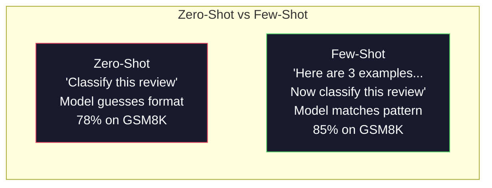
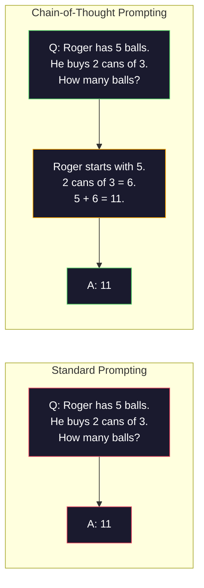
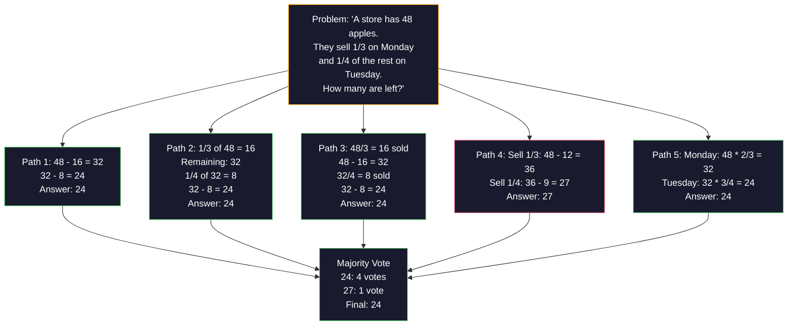
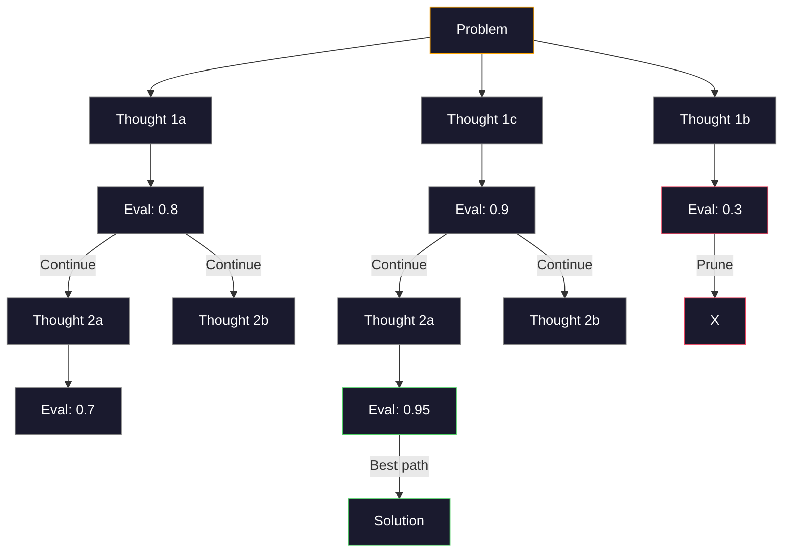

# القليل من اللقطات، سلسلة التفكير، شجرة التفكير ٠ ٠ ٠ ٠ ٠ ٠ ٠ ٠ ٠ ٠ ٠ ٠ ٠ ٠ ٠ ٠ ٠ ٠ ٠ ٠ ٠ ٠ ٠ ٠ ٠ ٠ ٠ ٠ ٠ ٠ ٠ ٠ ٠ ٠ ٠ ٠ ٠ ٠ ٠ ٠ ٠ ٠ ٠ ٠ ٠ ٠ ٠ ٠ ٠ ٠ ٠ ٠ ٠ ٠ ٠ ٠ ٠ ٠ ٠ ٠ ٠ ٠ ٠ ٠ ٠ ٠ ٠ ٠ ٠ ٠ ٠ ٠ ٠ ٠ ٠ ٠ ٠ ٠ ٠ ٠ ٠ ٠ ٠ ٠ ٠ ٠ ٠ ٠ ٠ ٠ ٠ ٠ ٠ ٠ ٠ ٠ ٠ ٠ ٠ ٠                                                                                                                                                                                                                                                                                                      

> إخبار النموذج ما يجب فعله هو التحفيز. إظهار كيفية التفكير هو الهندسة. الفجوة بين دقة 78٪ و 91٪ على نفس النموذج، نفس المهمة، نفس البيانات ليست نموذج أفضل. انها استراتيجية تفكير أفضل.

> **【中文解读】**告诉模型"做什么" هو نصيحة، عرض "كيف تفكر" هو مجرد انجنيرا. ارتفاع معدل التأكد من 78% إلى 91% ليس على أساس نموذج أفضل، ولكن على أساس استراتيجية تفكير أفضل.

> **【拓展：推理策略→AI Agent】**CoT/ToT/ReAct هي الأساس التفكيري للعميل الذكاء الاصطناعي الحديث.

>  **【前置】**تعلم 节前 节前 节前 节前 节前 节前 节前 节 节前 节 节 节 节 节 节 节 节 节 节 节 节 节 节 节 节 节 节 节 节 节 节 节 节 节 节 节 节 节 节 节 节 节 节 节 节 节 节 节 节 节 节 节 节 节 节 节 节 节 节 节 节 节 节 节 节 节 节 节 节 节 节 节 节 节 节 节 节 节 节 节 节 节 节 节 节 节 节 节 节 节 节 节 节 节 节 节 节 节 节 节 节 节 节 节 节 节 节 节 节 节 节 节 节 节 节 节 节 节 节 节 节 节 节 节 节 节 节 节 节 节 节 节 节 节 节 节 节 节 节 节 节 节 节 节 节 节 节 节 节 节 节 节 节 节 节 节 节 节 节 节 节 节 节 节 节 节 节 节 节 节 节 节 节 节 节 节 节 节 节 节 节 节 节 节 节 节 节 节 节 节 节 节 节 节 节 节 节 节 节 节 节 节 节 节 节 节 节 节 节 节 节 节 节 节 节 节    节      节                                                         

**Type:** Build | **类型:** 构建
**Languages:** Python | **语言:** Python
**Prerequisites:** Lesson 11.01 (Prompt Engineering) | **前置知识:** Phase 11 · 01 (提示工程)
**Time:** ~45 minutes | **时间:** ~45 分钟

## أهداف التعلم

- تنفيذ طلبات القليل من اللقطات عن طريق اختيار وتصميم نماذج مثالية تعزز دقة المهمة
  通過 اختيار وتقديم نماذج نموذجية لتحقيق عدد قليل من النماذج، وتعظيم تحديد المهام
- تطبيق سلسلة التفكير (CoT) للتفكير لتحسين دقة المشاكل متعددة الخطوات مثل مشاكل الكلمات الرياضية
  التطبيقات التفكير (CoT) التوصيات لتحسين عدد الخطوات المشكلة (مثلاً المشكلة التطبيقات الرياضية)
- بناء شجرة من الأفكار استفسار استكشاف طرق التفكير متعددة واختيار أفضل واحد
  构建思维树提示,探索多条推理路径并选择最佳路径
- قياس تحسن الدقة من صفر إطلاق مقابل القليل إطلاق مقابل CoT على مقياس قياسي
  في المعيار الأساسي لقياس صفر نموذج مقابل أقل نموذج مقابل CoT

> **【中文解读】**هدف دراسة: إتقان القليل من المعلومات ((في المكالمة المفروضة) وسلسلة التفكير ((تطلب نموذج خطوة خطوة للتفكير لتحسين قدرة التفكير)


## المشكلة المشكلة المشكلة

تقوم ببناء تطبيق تعليم الرياضيات. طلبك يقول: "حل مشكلة الكلمة هذه". GPT-5 يحصل على الحق 94% من الوقت على GSM8K، المعيار المعتاد الرياضيات في المرحلة الابتدائية. تعتقد أنك قد بلغت ذروتك. لا ت سلسلة التفكير لا يزال يضيف 3-4 نقاط.

> أنت بنيت تطبيقًا تدريجيًا رياضيًا. نصيحتك تقول: "حل هذه المشكلة التطبيقية". "تعدّة الصوابية على GPT-5 في GSM8K على المعدل المعتاد للرياضيات هي 94%، ولكنك تعتقد أنّها قد وصلت إلى القمة.

أضف خمس كلمات -- "دعونا نفكر خطوة بخطوة" -- والدقة ترتفع إلى 91٪. أضف بعض الأمثلة المعملة وتصل إلى 95٪. نفس النموذج. نفس درجة الحرارة. نفس تكلفة API. الفرق الوحيد هو أنك أعطيت النموذج ورقة خدش.

> 加上五个词"دعونا نفكر خطوة بخطوة" معدلات الادقة ترتفع إلى 91%‬‬‬‬‬‬‬‬‬‬‬‬‬‬‬‬‬‬‬‬‬‬‬‬‬‬‬‬‬‬‬‬‬‬‬‬‬‬‬‬‬‬‬‬‬‬‬‬‬‬‬‬‬‬‬‬‬‬‬‬‬‬‬‬‬‬‬‬‬‬‬‬‬‬‬‬‬‬‬‬‬‬‬‬‬‬‬‬‬‬‬‬‬‬‬‬‬‬‬‬‬‬‬‬‬‬‬‬‬‬‬‬‬‬‬‬‬‬‬‬‬‬‬‬‬‬‬‬‬‬‬‬‬‬‬‬‬‬‬‬‬‬‬‬‬‬‬‬‬‬‬‬‬‬‬‬‬‬‬‬‬‬‬‬‬‬‬‬‬‬‬‬‬‬‬‬‬‬‬‬‬‬‬‬‬‬‬‬‬‬‬‬‬‬‬‬‬‬‬‬‬‬‬‬‬‬‬‬‬‬‬‬‬‬‬‬‬‬‬‬‬‬‬‬‬‬‬‬‬‬‬‬‬‬‬‬‬‬‬‬‬‬‬‬‬‬‬‬‬‬‬‬‬‬‬‬‬‬‬‬‬‬‬‬‬‬‬‬‬‬‬‬‬‬‬‬‬‬‬‬‬‬‬‬‬‬‬‬‬‬‬‬‬‬‬‬‬‬‬‬‬‬‬‬‬‬‬‬‬‬‬‬‬‬‬‬‬‬‬‬‬‬‬‬‬‬‬‬‬‬‬‬‬‬‬‬‬‬‬‬‬‬‬‬‬‬‬‬‬‬‬‬‬‬‬‬‬‬‬‬‬‬‬‬‬‬‬‬‬‬‬‬‬‬‬‬‬‬‬‬‬‬‬‬‬‬‬‬‬‬‬‬‬‬‬‬‬‬‬‬‬‬‬‬‬‬‬‬‬‬‬‬‬‬‬‬‬‬‬‬‬‬‬‬‬‬‬‬‬‬‬‬‬‬‬‬‬‬‬‬‬‬‬‬‬‬‬‬‬‬‬‬‬‬‬‬‬‬‬‬‬‬‬‬‬‬‬‬‬‬‬‬‬‬‬‬‬‬‬‬‬‬

هذا ليس اختراقًا. هذا هو كيف يعمل التفكير. البشر لا يحلون مشاكل متعددة الخطوات في قفزة عقلية واحدة. ولا المحولات. عندما تضطر نموذجًا إلى إنتاج رموز متوسطة، تصبح تلك الرموز جزءًا من السياق للرمز التالي. كل خطوة من الخطوات التفكير تغذي الخطوة التالية. يقوم النموذج حرفيًا بحساب طريقه إلى الإجابة.

> هذا ليس خدعة. هذا هو طريقة العمل من التفكير. لا يكتمل البشر في وقت واحد العديد من الخطوات. التحويلات أيضا لن. عندما تضطر النموذج إلى إنتاج الرمز الوسطى. عندما تصبح هذه الرمز جزءا من النموذج التالي. كل خطوة من التفكير تقدم معلومات للخطوة التالية.

>  **【类比】**لا تستخدم كوت 像让人" حسابات الوسط 17 × 24" معظم الناس سوف يحسبون خطأ أو كارتون. باستخدام كوت 像给一张草稿纸:"17 × 24 = 17 × 20 + 17 × 4 = 340 + 68 = 408" خطوة خطوة كتابة إلى أسفل لن يكون خطأ.

> ️ **【易错点】**3 个坑: ((1) **示例数量错误**0-طلق CoT 加 "دعونا نفكر خطوة بخطوة" 就足, 再加 3-5 个少拍示例能再 2-5 点; 超過 8 个示例性价比下降(快速 太长、成本 上) 2) **示例顺序敏感** مع 3 أمثلة حسب A،B،C 排 و C،B،A 排، فإن معدل الاصلاحات يتباين بين 5 إلى 10٪؛**CoT 不适用于简单任务**"تاليوم几号?"加 CoT 反而让模型出错;CoT فقط على العديد من الخطوات التفكير(الرياضيات 逻辑 规划)有效。

ولكن "تفكير خطوة بخطوة" هي البداية وليس النهاية. ماذا لو قمت بتعليم خمسة طرق للتفكير وتأخذت صوت الأغلبية؟ ماذا لو سمحت للنموذج باستكشاف شجرة من الإمكانيات، وتقييم وتقليص الأغصان؟ ماذا لو قمت بتدخل التفكير باستخدام الأدوات؟ هذه ليست فرضيات. إنها تقنيات نشرت مع تحسينات مقياسية، وسوف تبني كل منها في هذا الدروس.

> ولكن "التفكير بالتدريج" مجرد بداية وليس نهاية. إذا كنت تستخدم خمس طرق للتفكير ثم تقوم بالعمومية، ماذا سيحدث؟ إذا جعلت النموذج يستكشف شجرة إمكانات، كيف ستقوم بتقييم وتقطيع الفرع؟ كيف سيحدث إذا كنت ستستخدم التفكير والوسائل بدلاً من ذلك؟ هذه ليست فرضيات.

## المفهوم الأساسي

> **【中文解读】**كم نموذج للتعلم (((قليل-مدفع) و فكري سلسلة التفكير ((Chain-of-Thought، CoT) هي التقنيات الرئيسية الثنائية للهندسة السريعة.

> **【拓展：CoT 的推理提升效果】**يثبت مقال في جوجل 2022 ، في مهمة التفكير الرياضي ، أن CoT سوف يرفع معدل تحديد PaLM 540B من 17% إلى 56٪.

> 🤔 **【困惑】**س: 2026 سنة النموذج التفكيري الأصلي (Claude Extended Thinking、o3) كل شيء يضمن التفكيري المتسلل ، هل أحتاج أيضاً إلى كتابة "التفكيري خطوة بخطوة" ؟ أ: لا حاجة ، ولكن هناك شرط:`reasoning_effort`أو`thinking`参数، استخدمها؛ وإلا استخدمها على الفور


### الصفر مقابل القليل: عندما تتفوق الأمثلة على التعليمات

إنّ محاولة إطلاق الصور الصفر تعطي النموذج مهمة ولا شيء آخر، لكنّ محاولة إطلاق الصور القليلة تعطي أمثلة أولاً.

> 零样本提示只给模型一个任务,不加其他内容──少样本提示则先给模型一个任务,不加其他内容──

وقاس Wei et al. (2022) هذا عبر 8 معايير. بالنسبة للمهام البسيطة مثل تصنيف المشاعر ، تم إجراء صفر-شوت و قليل-شوت في حدود 2% من بعضها البعض. بالنسبة للمهام المعقدة مثل الحساب متعدد الخطوات والحكمة الرمزية ، تحسنت عدد قليل من الصور دقة 10-25%.

> وقد قام Wei 等人 (بالإنجليزية: Wei 等人) بتقييم هذا النقطة على 8 أساسيات. بالنسبة للمهمات البسيطة مثل الجهاز العاطفي، فإن الفرق بين أداء الصيغة الصيغة الصيغة الصيغة الصيغة الصيغة الصيغة الصيغة الصيغة الصيغة الصيغة الصيغة الصيغة الصيغة الصيغة الصيغة الصيغة الصيغة الصيغة الصيغة الصيغة الصيغة الصيغة الصيغة الصيغة الصيغة الصيغة الصيغة الصيغة الصيغة الصيغة الصيغة الصيغة الصيغة الصيغة الصيغة الصيغة الصيغة الصيغة الصيغة الصيغة الصيغة الصيغة الصيغة الصيغة الصيغة الصيغة الصيغة الصيغة الصيغة الصيغة الصيغة الصيغة الصيغة الصيغة الصيغة الصيغة الصيغة الصيغة الصيغة الصيغة الصيغة الصيغة الصيغة الصيغة الصيغة الصيغة الصيغة الصيغة الصيغة الصيغة الصيغة الصيغة الصيغة الصيغة الصيغة الصيغة الصيغة الصيغة الصيغة الصيغة الصيغة الصيغة الصيغة الصيغة الصيغة الصيغة الصيغة الصيغة الصيغة الصيغة الصيغة الصيغة الصيغة الصيغة الصيغة الصيغة الصيغة الصيغة الصيغة الصيغة الصيغة الصيغة الصيغة الصيغة الصيغة الصيغة الصيغة الصيغة الصيغة الصيغة الصيغة الصيغة الصيغة الصيغة الصيغة الصيغة الصيغة الصيغة الصيغة الصيغة الصيغة الصيغة الصيغة باسم "صيغة الصيغة الصيغة الصيغة الصيغة الصيغة الصيغة الصيغة الصيغة الصيغة الصيغة الصيغة الصيغة الصيغة "صغرافاً" والصيغة الصيغة "صيغة الصيغة الصيغة الصيغة الصيغة "صيغة الصيغة الصيغة الصيغة

الاندماج: المثال هو التعليمات المضغوطة. بدلا من وصف صيغة الخروج، تظهرها. بدلا من شرح عملية التفكير، تظهرها. النموذج نمط تتطابق على المثال بشكل أكثر موثوقية من أنه تفسير التعليمات المجردة.

> 直觉: النموذج هو أمر مضغوط. مع وصفه النموذج المخرج، ليس مثل إظهارها مباشرة. مع عملية التفكير في تفسيرها، ليس مثل إظهارها مباشرة.



**When few-shot wins:**مهام حساسة للصيغة، التصنيف، الاستخراج المهيكلي، الجارغون المحدد للمجال، أي مهام تحتاج النموذج إلى مطابقة نمط معين.

> **少样本胜出的场景**: صيغة مهمة حساسة                                                                                                                                                                                                                                                           

**When zero-shot wins:**أسئلة حقيقية بسيطة، مهام إبداعية حيث تقيد الأمثلة الإبداع، مهام حيث يُصعب إيجاد أمثلة جيدة على كتابة تعليمات جيدة.

> **零样本胜出的场景**: مشكلة حقيقية بسيطة، ومثلة تحد من المهام الإبداعية الإبداعية، البحث عن أمثلة جيدة من كتابة تعليمات جيدة أكثر صعوبة المهام.

### اختيار المثال: ضربات مشابهة عشوائية

لا تكون جميع الأمثلة متساوية. اختيار أمثلة مشابهة للمدخول المستهدف يفوق الاختيار العشوائي بنسبة 5-15% في مهام التصنيف (Liu et al., 2022). ثلاثة مبادئ:

> ليس كل المثال مثالي. المثال المماثل لخيار المهام المفصلة في فئة المهام هو 5-15% من المثال الممثل لخيار المهام المفصلة.

1. **Semantic similarity**: اختيار الأمثلة القريبة من المدخل في مساحة التثبيت
   **语义相似性**: اختيار مثال على أقرب إدخال في داخل الفضاء
2. **Label diversity**: تغطي جميع فئات الخروج في أمثالك
   **标签多样性**: في المثال تغطي جميع فئات الإصدار
3. **Difficulty matching**: تتناسب مع مستوى تعقيد المشكلة المستهدفة
   **难度匹配**: ملاءمة المشكلة من الصعيد

عدد الأمثلة المثالي لمعظم المهام هو 3-5، تحت 3، لا يوجد لدى النموذج إشارة كافية لاستخراج النمط. فوق 5، تضغط على العائدات المتناقضة وتسريب رموز نافذة السياق. للتصنيف مع العديد من اللبصات، استخدم مثالًا واحدًا لكل ملصق.

> أفضل عدد الأمثلة في معظم المهام هو 3-5 ∙ أقل من 3 ∙، النموذج ليس لديه إشارة كافية لتحقيق النموذج ∙ أكثر من 5 ∙، الحدودية الاستفادة وتخفيض ضائعة على النوافذ التالية.

### سلسلة التفكير: إعطاء نماذج ورقة شرب

تم إدخال محاولة سلسلة التفكير (CoT) من قبل Wei et al. (2022) في Google Brain. الفكرة بسيطة: بدلاً من طلب النموذج فقط من الإجابة ، اطلب منه أن يظهر خطوات التفكير الخاصة به أولاً.

> 链式思维(CoT)提示由Google Brain 的 Wei 等人 (2022)引入──思想很简单: ليس فقط يطلب النموذج أن يقدم إجابة، بل يطلب من ذلك أن يظهر الخطوات التفكير.



لماذا يعمل هذا بشكل ميكانيكي؟ كل رمز يولد من المحول يصبح سياقًا للرمز التالي. بدون CoT ، يجب على النموذج ضغط جميع التفكير في الحالة الخفية من مرور واحد إلى الأمام. مع CoT ، يقوم النموذج بتخريج الحسابات الوسطى كرمز. كل رمز التفكير يمتد عمق الحساب الفعال.

> لماذا هذا فعال على الجهاز؟ كل رمز من المتحولات التي تنتجها تصبح على الجهاز التالي. بدون CoT، يجب أن يكون النموذج جميع التفكيرات ضغط إلى حالة مخفية من الانتشار إلى الأمام مرة واحدة.

**GSM8K benchmarks (grade-school math, 8.5K problems):**

| Model | Zero-Shot | Zero-Shot CoT | Few-Shot CoT |
|-------|-----------|---------------|--------------|
| GPT-4o | 78% | 91% | 95% |
| GPT-5 | 94% | 97% | 98% |
| o4-mini (reasoning) | 97% | — | — |
| Claude Opus 4.7 | 93% | 97% | 98% |
| Gemini 3 Pro | 92% | 96% | 98% |
| Llama 4 70B | 80% | 89% | 94% |
| DeepSeek-V3.1 | 89% | 94% | 96% |

**Note on reasoning models.**تعمل نماذج مثل OpenAI o-series (o3 ، o4-mini) و DeepSeek-R1 سلسلة التفكير داخليا قبل إصدار إجاباتهم. إضافة "دعونا نفكر خطوة بخطوة" إلى نموذج التفكير أمر زائد وأحيانا مضاد للإنتاجية.

> **关于推理模型的说明。**مثل OpenAI o 系列 ((o3、o4-mini) و DeepSeek-R1 ، فإن النموذج في النتائج المخرجة سوف يكون في التفكير في الأسلحة الداخلية قبل أن يتم إجابة.

طعمين من كوت:

> أشكال:

**Zero-shot CoT**: إضافة "دعونا نفكر خطوة بخطوة" إلى الإشارة. لا حاجة إلى أمثلة. كوجيما وآخرون (2022) أظهر هذا الجملة الواحدة تحسن دقة في جميع مهام الحساب والعقل العام والحكمة الرمزية.

> **零样本 CoT**: في提示末尾添加"دعونا نفكر خطوة بخطوة"──不需要示例──Kojima 等人(2022) يظهر هذا العبارة على أنه يمكن أن يزيد من معدلات التأكد في المهام الحسابية、常识和符号推理──

**Few-shot CoT**: توفر أمثلة تشمل خطوات التفكير. أكثر فعالية من CoT الصفر الصارخ لأن النموذج يرى صيغة التفكير الدقيقة التي تتوقعها.

> **少样本 CoT**: توفير مثالات تتضمن خطوات التفكير.

**When CoT hurts**: التذكير الفعلي البسيط ("ما هي عاصمة فرنسا؟") ، التصنيف في خطوة واحدة، مهام تتعلق فيها السرعة أكثر من الدقة. CoT يضيف 50-200 رموز من التفكير العام لكل استفسار. بالنسبة للمهام عالية الناتج، منخفضة التعقيد، وهذا هو ضاعة التكلفة.

> **CoT 何时有害**: simple fact recollection ((("ما هو أول شيء في فرنسا؟") 、 ٬ ٬ ٬ ٬ ٬ ٬ ٬ ٬ ٬ ٬ ٬ ٬ ٬ ٬ ٬ ٬ ٬ ٬ ٬ ٬ ٬ ٬ ٬ ٬ ٬ ٬ ٬ ٬ ٬ ٬ ٬ ٬ ٬ ٬ ٬ ٬ ٬ ٬ ٬ ٬ ٬ ٬ ٬ ٬ ٬ ٬ ٬ ٬ ٬ ٬ ٬ ٬ ٬ ٬ ٬ ٬ ٬ ٬ ٬ ٬ ٬ ٬ ٬ ٬ ٬ ٬ ٬ ٬ ٬ ٬ ٬ ٬ ٬ ٬ ٬ ٬ ٬ ٬ ٬ ٬ ٬ ٬ ٬ ٬ ٬ ٬ ٬ ٬ ٬ ٬ ٬ ٬ ٬ ٬ ٬ ٬ ٬ ٬ ٬ ٬ ٬ ٬ ٬ ٬ ٬ ٬ ٬ ٬ ٬ ٬ ٬ ٬ ٬ ٬ ٬ ٬ ٬ ٬ ٬ ٬ ٬ ٬ ٬ ٬ ٬ ٬ ٬ ٬ ٬ ٬ ٬ ٬ ٬ ٬ ٬ ٬ ٬ ٬ ٬ ٬ ٬ ٬ ٬ ٬ ٬ ٬ ٬ ٬ ٬ ٬ ٬ ٬ ٬ ٬ ٬ ٬ ٬ ٬ ٬ ٬ ٬ ٬ ٬ ٬ ٬ ٬ ٬ ٬ ٬ ٬ ٬ ٬ ٬ ٬ ٬ ٬ ٬ ٬ ٬ ٬ ٬ ٬ ٬ ٬ ٬ ٬ ٬ ٬ ٬ ٬ ٬ ٬ ٬ ٬ ٬ ٬ ٬ ٬ ٬ ٬ ٬ ٬ ٬ ٬ ٬ ٬ ٬ ٬ ٬ ٬ ٬ ٬ ٬ ٬ ٬ ٬ ٬ ٬ ٬ ٬ ٬ ٬ ٬ ٬ ٬ ٬ ٬ ٬ ٬ ٬ ٬ ٬ ٬ ٬ ٬ ٬ ٬ ٬ ٬ ٬ ٬ ٬ ٬ ٬ 

### التوافق الذاتي: عينة الكثير، صوت مرة واحدة

واندوست وانغ وزملاء (2023) التوافق الذاتي. المفهوم: مسار واحد CoT قد تحتوي على أخطاء التفكير. ولكن إذا قمت بعمل عينات من مسارات التفكير مستقلة N (باستخدام درجة الحرارة > 0) وتأخذ صوت الأغلبية على الجواب النهائي، فإن الأخطاء يتم إلغاءها.

> وانغ 等人(2023) قدمت نفس الموافقة.洞察:单条 CoT 路径可能包含推理错误── ولكن إذا كنت تستخدم ن 条独立的推理路径(采用温度 > 0)并进行多数投票对最终答案,错误就会相互抵消──



تحسنت التوافق الذاتي دقة GSM8K من 56.5% (Cot واحد) إلى 74.4% مع N = 40 على التجارب الأصلية PaLM 540B. في GPT-5 التحسن صغير (97% إلى 98%) لأن دقة القاعدة قد اكتملت بالفعل. التقنية تظهر بشكل أفضل على نماذج مع دقة 60-85% من القاعدة CoT -- نقطة حلوة حيث الأخطاء في طريق واحد متكررة ولكن ليس منهجيا. بالنسبة لنماذج التفكير (السلسلة O، R1)، يتم استحفاظ التوافق الذاتي من خلال أخذ العينات الداخلية المدمجة.

> في تجربة الذاتية في PaLM 540B الاصلية، سيتم رفع معدل تحديد GSM8K من 56.5% (((مرحلة واحدة CoT) إلى 74.4% ((N=40))). في GPT-5 تحسن بشكل كبير ((97% إلى 98%) ، لأن معدل تحديد الأساس قد تم和── هذه التقنية على أساس معدل تحديد CoT 60-85% على النموذج أداء أفضل

التنازل: تعني عينات N Nx تكلفة API وتأخير. في الممارسة العملية، N = 5 يستحوذ على معظم الفوائد. N = 3 هو الحد الأدنى للاستفادة من التصويت ذات مغزى. N > 10 له عوائد متناقصة لمعظم المهام.

> 权衡:N 个样本意味着N 倍的API 成本和延迟――在实践中,N=5 捕获了大部分收益――N=3 是有意义的投票最低要求――N > 10 对大多数任务的边际收益递减――

### شجرة التفكير: استكشاف الفرع

ياو وزملاء (2023) قدموا شجرة التفكير (ToT). حيث تتبع CoT مسار واحد للتفكير الخطري ، يستكشف ToT فروع متعددة وتقييمات أكثر إثباتا قبل الاستمرار.

> ياو 等人(2023) قدمت فكرة التفكير ️️‬‬‬‬‬‬‬‬‬‬‬‬‬‬‬‬‬‬‬‬‬‬‬‬‬‬‬‬‬‬‬‬‬‬‬‬‬‬‬‬‬‬‬‬‬‬‬‬‬‬‬‬‬‬‬‬‬‬‬‬‬‬‬‬‬‬‬‬‬‬‬‬‬‬‬‬‬‬‬‬‬‬‬‬‬‬‬‬‬‬‬‬‬‬‬‬‬‬‬‬‬‬‬‬‬‬‬‬‬‬‬‬‬‬‬‬‬‬‬‬‬‬‬‬‬‬‬‬‬‬‬‬‬‬‬‬‬‬‬‬‬‬‬‬‬‬‬‬‬‬‬‬‬‬‬‬‬‬‬‬‬‬‬‬‬‬‬‬‬‬‬‬‬‬‬‬‬‬‬‬‬‬‬‬‬‬‬‬‬‬‬‬‬‬‬‬‬‬‬‬‬‬‬‬‬‬‬‬‬‬‬‬‬‬‬‬‬‬‬‬‬‬‬‬‬‬‬‬‬‬‬‬‬‬‬‬‬‬‬‬‬‬‬‬‬‬‬‬‬‬‬‬‬‬‬‬‬‬‬‬‬‬‬‬‬‬‬‬‬‬‬‬‬‬‬‬‬‬‬‬‬‬‬‬‬‬‬‬‬‬‬‬‬‬‬‬‬‬‬‬‬‬‬‬‬‬‬‬‬‬‬‬‬‬‬‬‬‬‬‬‬‬‬‬‬‬‬‬‬‬‬‬‬‬‬‬‬‬‬‬‬‬‬‬‬‬‬‬‬‬‬‬‬‬‬‬‬‬‬‬‬‬‬‬‬‬‬‬‬‬‬‬‬‬‬‬‬‬‬‬‬‬‬‬‬‬‬‬‬‬‬‬‬‬‬‬‬‬‬‬‬‬‬‬‬‬‬‬‬‬‬‬‬‬‬‬‬‬‬‬‬‬‬‬‬‬‬‬‬‬‬‬‬‬‬‬‬‬‬‬‬‬‬‬‬‬‬‬‬‬‬‬‬‬‬‬‬‬‬‬‬‬‬‬‬‬‬‬‬‬‬‬‬‬‬‬‬‬‬‬‬‬‬‬‬‬‬‬‬‬‬‬



توت لديها ثلاثة مكونات:

> هناك ثلاثة مكونات:

1. **Thought generation**: تُنتج العديد من الخطوات التالية
   **思维生成**: تكوين العديد من المرشحين
2. **State evaluation**: تقدير كل مرشح (يمكن استخدام ماجستير في العلوم الطبية نفسه كمقيّم)
   **状态评估**: للجميع المُرشحين打分(يمكن استخدام ماجستير في العلوم الذاتية كجهاز تقييم)
3. **Search algorithm**: BFS أو DFS عبر الشجرة، قصة الفروع ذات النتيجة المنخفضة
   **搜索算法**: من خلال BFS أو DFS عبر الأشجار، قطع أسفل

في لعبة 24 مهمة (جمع 4 أرقام باستخدام الحسابات لتكون 24) ، GPT-4 مع الاستعانة القياسية يحل 7.3% من المشاكل. مع CoT، 4.0% (CoT يؤلم في الواقع هنا لأن مساحة البحث واسعة). مع ToT، 74%.

> في لعبة 24 任务 (بالإنجليزية: GPT-4) ، تستخدم الحسابات لتحل 7.3% من المشاكل.

توت مكلفة. كل عقدة في الشجرة تتطلب دعوة LLM. شجرة مع عامل التفرق 3 والعمق 3 تتطلب ما يصل إلى 39 دعوة LLM. استخدمه فقط للمشاكل التي يكون مساحة البحث كبيرة ولكن قابلة للتقييم -- التخطيط، حل اللغز، حل المشاكل الإبداعية مع القيود.

> كل قطاع من الأشجار يحتاج إلى استخدام واحد لـ LLM 调用  分支因子为 3 深度为 3 الأشجار الأكثر حاجة إلى 39 مرة لـ LLM 调用 仅在搜索空间大但可评估问题上使用规划 解 带束的创意问题求解

### رد فعل: التفكير + العمل

ياو وآخرون (2022) مزجوا آثار التفكير مع الإجراءات. يتناوب النموذج بين التفكير (إنتاج التفكير) والعمل (تصل بالأدوات والبحث والحوسبة).

> ياو 等人(2022) سوف يُنظر إلى المسار و العمل结合──模型在思考(生成推理) و العمل(调用工具、搜索、计算) 之间交换──

```mermaid
graph LR
    Q["Question:\nWhat is the\npopulation of the\ncountry where\nthe Eiffel Tower\nis located?"]
    T1["Thought: I need to\nfind which country\nhas the Eiffel Tower"]
    A1["Action: search\n'Eiffel Tower location'"]
    O1["Observation:\nParis, France"]
    T2["Thought: Now I need\nFrance's population"]
    A2["Action: search\n'France population 2024'"]
    O2["Observation:\n68.4 million"]
    T3["Thought: I have\nthe answer"]
    F["Answer:\n68.4 million"]

    Q --> T1 --> A1 --> O1 --> T2 --> A2 --> O2 --> T3 --> F

    style Q fill:#1a1a2e,stroke:#ffa500,color:#fff
    style T1 fill:#1a1a2e,stroke:#51cf66,color:#fff
    style A1 fill:#1a1a2e,stroke:#e94560,color:#fff
    style O1 fill:#1a1a2e,stroke:#808080,color:#fff
    style T2 fill:#1a1a2e,stroke:#51cf66,color:#fff
    style A2 fill:#1a1a2e,stroke:#e94560,color:#fff
    style O2 fill:#1a1a2e,stroke:#808080,color:#fff
    style T3 fill:#1a1a2e,stroke:#51cf66,color:#fff
    style F fill:#1a1a2e,stroke:#51cf66,color:#fff
```



يُفوق ReAct على CoT النقي في المهام المكثفة المعرفة لأنه يمكنه تأسيس التفكير في بيانات حقيقية. على HotpotQA (رد على الأسئلة متعددة الحافظ) ، يصل ReAct مع GPT-4 إلى مطابقة دقيقة بنسبة 35.1% مقابل 29.4% لـ CoT وحدها. القوة الحقيقية هي أن أخطاء التفكير يتم تصحيحها من خلال الملاحظات - يمكن لنموذج تحديث خطته في منتصف التنفيذ.

> في مهمة كثيفة المعرفة ، تفوق ReAct على CoT النقي ، لأنه يمكن أن يُحكم على أساس البيانات الحقيقية. في HotpotQA ، ReAct يصل إلى 35.1% من المكاسب الدقيقة مع GPT-4 ، بينما CoT النقي هو 29.4%. القوة الحقيقية تكمن في التفكير في الأخطاء التي يمكن تصحيحها من خلال الملاحظة. يمكن أن يتم تحديث النموذج أثناء عملية التنفيذ.

ReAct هو أساس وكلاء الذكاء الاصطناعي الحديث. كل إطار عميل (LangChain، CrewAI، AutoGen) ينفذ بعض التغيرات من حلقة التفكير-الفعال-الملاحظة. سوف تقوم ببناء وكلاء كاملين في المرحلة 14. هذا الدروس يغطي نمط الإستقاذ.

> ReAct هو أساس وكيل الذكاء الاصطناعي الحديث. كل وكيل يتمتع بوضع طابور مختلفة في حلقة التفكير والعمل والملاحظة. ستقوم في المرحلة الرابعة عشرة ببناء وكيل كامل.

### الإشارة المهيكلة: علامات XML، وحدات الحد، عناوين

مع تعقيد الإشارات، تمنع الهيكل النموذج من إضطراب القسمات.

> مع تصبح النص معقدة، يمكن أن تمنع النظام من التشويش في مختلف الأجزاء.

**XML tags**(يعمل بشكل أفضل مع (كلود، صلب في كل مكان):
```
<context>
You are reviewing a pull request.
The codebase uses TypeScript and React.
</context>

<task>
Review the following diff for bugs, security issues, and style violations.
</task>

<diff>
{diff_content}
</diff>

<output_format>
List each issue with: file, line, severity (critical/warning/info), description.
</output_format>
```

**Markdown headers**(الجامعي):
```
## Role
Senior security engineer at a fintech company.

## Task
Analyze this API endpoint for vulnerabilities.

## Input
{api_code}

## Rules
- Focus on OWASP Top 10
- Rate each finding: critical, high, medium, low
- Include remediation steps
```

**Delimiters**(أقل ولكن فعال):
```
---INPUT---
{user_text}
---END INPUT---

---INSTRUCTIONS---
Summarize the above in 3 bullet points.
---END INSTRUCTIONS---
```

### السلاسل السريعة: التفكك المتسلسل

بعض المهام معقدة جداً لمطلب واحد. تسدد السلسلة السريعة لهم في خطوات، حيث تصبح خروج واحدة من الاستعلام المدخلة للآخر.

> بعض المهام معقدة جدا، لا يمكن إنجازها باستخدام نصيحة واحدة.


ضربات السلاسل واحدة لثلاث أسباب:

> هناك ثلاثة أسباب:

1. **Each step is simpler**: النموذج يدير مهمة واحدة مركزة بدلا من التغلب على كل شيء
   **每个步骤更简单**النموذج: التعامل مع مهمة مركزة بدلا من التعامل مع كل شيء في نفس الوقت
2. **Intermediate outputs are inspectable**: يمكنك التحقق من التحقق والتصحيح بين الخطوات
   **中间输出可检查**يمكنك: بين الخطوات التحقق والتحديد
3. **Different steps can use different models**: استخدام نموذج رخيص للتصدير، واحد مكلف للتفكير
   **不同步骤可以使用不同模型**: مع نموذج رخيص، مع نموذج مكلف

### مقارنة الأداء

| Technique | Best For | GSM8K Accuracy (GPT-5) | API Calls | Token Overhead | Complexity |
|-----------|----------|------------------------|-----------|----------------|------------|
| Zero-Shot | Simple tasks | 94% | 1 | None | Trivial |
| Few-Shot | Format matching | 96% | 1 | 200-500 tokens | Low |
| Zero-Shot CoT | Quick reasoning boost | 97% | 1 | 50-200 tokens | Trivial |
| Few-Shot CoT | Maximum single-call accuracy | 98% | 1 | 300-600 tokens | Low |
| Self-Consistency (N=5) | High-stakes reasoning | 98.5% | 5 | 5x token cost | Medium |
| Reasoning model (o4-mini) | Drop-in CoT replacement | 97% | 1 | hidden (2-10x internal) | Trivial |
| Tree-of-Thought | Search/planning problems | N/A (74% on Game of 24) | 10-40+ | 10-40x token cost | High |
| ReAct | Knowledge-grounded reasoning | N/A (35.1% on HotpotQA) | 3-10+ | Variable | High |
| Prompt Chaining | Complex multi-step tasks | 96% (pipeline) | 2-5 | 2-5x token cost | Medium |

تعتمد التقنية الصحيحة على ثلاثة عوامل: متطلبات الدقة، ميزانية التأخير، وتسامح التكاليف. بالنسبة لمعظم أنظمة الإنتاج، تغطي CoT القليل من الرصاص مع تراجع التوافق الذاتي 3 عينات 90٪ من الحالات الاستخدامية.

> تتوقف التقنية الصحيحة على ثلاثة عوامل: طلب معدل الدقة، التأخير في الميزانية، وتسامح التكاليف.

## بناء ذلك تحرك لتحقيق
```figure
few-shot-curve
```

## بناءها

سنقوم ببناء حل مشكلة رياضية يجمع بين القليل من الإحتياجات، سلسلة من التفكير، والتصويت التناغم الذاتي في خط أنابيب واحد. ثم سنضيف شجرة من التفكير للمشاكل الصعبة.

> سنقوم ببناء مشاكل رياضية، ونقوم ببناء مجموعة صغيرة من النقاط، والحسب التفكير والاتفاقية، ونقوم بتجميع خط واحد.

التنفيذ الكامل في `code/advanced_prompting.py`هذه هي المكونات الرئيسية

>  كامل تحقيق `code/advanced_prompting.py`中──以下是关键组件──

### الخطوة الأولى: خزنة مثالية

يدير المكون الأول أمثلة قليلة ويحدد أهمها بالنسبة لمشكلة معينة.

> الأول: إدارة المكونات من نموذج أقل، ومُعطى نموذجًا محددًا للمسألة.

```python
GSM8K_EXAMPLES = [
    {
        "question": "Janet's ducks lay 16 eggs per day. She eats three for breakfast every morning and bakes muffins for her friends every day with four. She sells every egg at the farmers' market for $2. How much does she make every day at the farmers' market?",
        "reasoning": "Janet's ducks lay 16 eggs per day. She eats 3 and bakes 4, using 3 + 4 = 7 eggs. So she has 16 - 7 = 9 eggs left. She sells each for $2, so she makes 9 * 2 = $18 per day.",
        "answer": "18"
    },
    ...
]
```

كل مثال يحتوي على ثلاثة أجزاء: السؤال، سلسلة التفكير، والجواب النهائي. سلسلة التفكير هي ما يحول مثال عادي القليل إلى مثال CoT القليل.

> كل مثال له ثلاثة أجزاء: السؤال، سلسلة التفكير والجواب النهائي.

### الخطوة الثانية: بناء السلسلة الفكرية

يقوم صانع المفاوضات بتجميع رسالة النظام، ومثلة قليلة مع سلسلة التفكير، والسؤال المستهدف في طلب واحد.

> 提示 المُبني يُعد رسالة النظام ٬ و يُعدّ نموذجًا صغيرًا من القناة التّوجيهية ومُشكلة الهدف إلى تَجمّع في نصيحة واحدة٬

```python
def build_cot_prompt(question, examples, num_examples=3):
    system = (
        "You are a math problem solver. "
        "For each problem, show your step-by-step reasoning, "
        "then give the final numerical answer on the last line "
        "in the format: 'The answer is [number]'."
    )

    example_text = ""
    for ex in examples[:num_examples]:
        example_text += f"Q: {ex['question']}\n"
        example_text += f"A: {ex['reasoning']} The answer is {ex['answer']}.\n\n"

    user = f"{example_text}Q: {question}\nA:"
    return system, user
```

قيود الشكل ("الجواب هو [رقم]") أمر حاسم. بدونها، لا يمكن الاستفادة من التوافق الذاتي استخراج ومقارنة الإجابات عبر العينات.

> 格式约束 (("الجواب هو [عدد]") 至关重要──没有它,自一致性无法在不同样本之间提取和比较答案──

### الخطوة الثالثة: التصويت المتوافق مع الذات

خذ نموذج N مسارات التفكير واخذ إجابة الأغلبية.

> 采样 N 条推理路径,取多数答案──

```python
def self_consistency_solve(question, examples, client, model, n_samples=5):
    system, user = build_cot_prompt(question, examples)

    answers = []
    reasonings = []
    for _ in range(n_samples):
        response = client.chat.completions.create(
            model=model,
            messages=[
                {"role": "system", "content": system},
                {"role": "user", "content": user}
            ],
            temperature=0.7
        )
        text = response.choices[0].message.content
        reasonings.append(text)
        answer = extract_answer(text)
        if answer is not None:
            answers.append(answer)

    vote_counts = Counter(answers)
    best_answer = vote_counts.most_common(1)[0][0] if vote_counts else None
    confidence = vote_counts[best_answer] / len(answers) if best_answer else 0

    return best_answer, confidence, reasonings, vote_counts
```

درجة الحرارة 0.7 مهمة. عند درجة الحرارة 0.0، جميع عينات N ستكون متطابقة، مما يفشل الغرض. تحتاج إلى عشوائية كافية لمسارات التفكير المتنوعة ولكن ليس كثيراً بحيث ينتج النموذج المضطرب.

> درجة الحرارة 0.7  مهم جدا ً. في درجة الحرارة 0.0  下, كل النماذج N 个样本都会相同, فقدت المعنى ً. تحتاج إلى الكثير من الاختلافات لتوليد العديد من الطرق التفكير, ولكن لا يمكن أن تكون كثيرة جداً حتى النموذج يخلق الفوضى ً.

### الخطوة الرابعة: حل الشجرة من الفكر

بالنسبة للمشاكل التي تفشل فيها التفكير الخطوي، تستكشف ToT العديد من النهج وتقييم الاتجاه الأكثر وعداً.

> على مشاكل الفشل في التفكير السريع، استكشاف العديد من الطرق وتقييم أي اتجاهات لديها أفضل آفاق.

```python
def tree_of_thought_solve(question, client, model, breadth=3, depth=3):
    thoughts = generate_initial_thoughts(question, client, model, breadth)
    scored = [(t, evaluate_thought(t, question, client, model)) for t in thoughts]
    scored.sort(key=lambda x: x[1], reverse=True)

    for current_depth in range(1, depth):
        next_thoughts = []
        for thought, score in scored[:2]:
            extensions = extend_thought(thought, question, client, model, breadth)
            for ext in extensions:
                ext_score = evaluate_thought(ext, question, client, model)
                next_thoughts.append((ext, ext_score))
        scored = sorted(next_thoughts, key=lambda x: x[1], reverse=True)

    best_thought = scored[0][0] if scored else ""
    return extract_answer(best_thought), best_thought
```

المقيّم هو نفسه دعوة لدرجة الماجستير. تسأل النموذج: "على مقياس من 0.0 إلى 1.0, كم تعدّ هذه المسارة من المفاوضات لحل المشكلة؟" هذه هي المفهوم الرئيسي من ToT -- يقوم النموذج بتقييم حلولها الجزئية الخاصة.

> المقياس نفسه هو LLM 调用──你问模型:" في نطاق 0.0 إلى 1.0، كيف هي المواجهة التي تواجه هذه الطريقة للتفكير لحل المشكلة؟"

### الخطوة 5: خط الأنابيب الكامل

خط الأنابيب يجمع بين كل التقنيات مع استراتيجية التصعيد

> 流水线结合所有技术和升级策略──

```python
def solve_with_escalation(question, examples, client, model):
    system, user = build_cot_prompt(question, examples)
    single_response = call_llm(client, model, system, user, temperature=0.0)
    single_answer = extract_answer(single_response)

    sc_answer, confidence, _, _ = self_consistency_solve(
        question, examples, client, model, n_samples=5
    )

    if confidence >= 0.8:
        return sc_answer, "self_consistency", confidence

    tot_answer, _ = tree_of_thought_solve(question, client, model)
    return tot_answer, "tree_of_thought", None
```

منطق التصعيد: حاول رخيصا (Cot واحد) أولاً. إذا كان ثقة التوافق الذاتي أقل من 0.8 (أقل من 4 من 5 عينات توافق) ، تصاعد إلى ToT. هذا يوازن التكلفة والدقة - معظم المشاكل يتم حلها رخيصاً، المشاكل الصعبة تحصل على المزيد من الحسابات.

> 升级逻辑:先尝试廉价的(单次 CoT) ―― إذا كان التوافق بين الثقة أقل من 0.8(5 عينات أقل من 4 توافقات) ، فترتقي إلى ToT── هذا يميز التكلفة والحد من التوصل إلى معدل التوصل إلى التوصل إلى التوصل إلى التوصل إلى التوصل إلى التوصل إلى التوصل إلى التوصل إلى التوصل إلى التوصل إلى التوصل إلى التوصل إلى التوصل إلى التوصل إلى التوصل إلى التوصل إلى التوصل إلى التوصل إلى التوصل إلى التوصل إلى التوجهات التكلفية.

## استخدمها في إطار التنفيذ

### أثر القليل من الصور القائمة على العلامات

يوفر LangChain دعمًا مدمجًا للشablones الفورية والتحليلات المصدرية التي تبسط أنماط القليل من اللقطات والCoT:

> لانغ تشين لتبسيط نموذج أقل و CoT  نموذج تقديم المعلومات

```python
from langchain_core.prompts import FewShotPromptTemplate, PromptTemplate
from langchain_openai import ChatOpenAI

example_prompt = PromptTemplate(
    input_variables=["question", "reasoning", "answer"],
    template="Q: {question}\nA: {reasoning} The answer is {answer}."
)

few_shot_prompt = FewShotPromptTemplate(
    examples=examples,
    example_prompt=example_prompt,
    suffix="Q: {input}\nA: Let's think step by step.",
    input_variables=["input"]
)

llm = ChatOpenAI(model="gpt-4o", temperature=0.7)
chain = few_shot_prompt | llm
result = chain.invoke({"input": "If a train travels 120 km in 2 hours..."})
```

لانج تشين أيضاً`ExampleSelector`فئات لانتخاب التشابهات التفاصلية:

> هناك أيضاً`ExampleSelector`类用于语义相似性选择:

```python
from langchain_core.example_selectors import SemanticSimilarityExampleSelector
from langchain_openai import OpenAIEmbeddings

selector = SemanticSimilarityExampleSelector.from_examples(
    examples,
    OpenAIEmbeddings(),
    k=3
)
```

### المشاركات المجمعة

DSPy يعامل الاستراتيجيات الاستعلامية ك وحدات قابلة للتحسين. بدلاً من تصميم طلبات CoT يدوياً، تحدد توقيعًا وتسمح لـ DSPy بتحسين طلب:

> سوف يحدد DSPy استراتيجية الإشارة كمودول للتحسين.

```python
import dspy

dspy.configure(lm=dspy.LM("openai/gpt-4o", temperature=0.7))

class MathSolver(dspy.Module):
    def __init__(self):
        self.solve = dspy.ChainOfThought("question -> answer")

    def forward(self, question):
        return self.solve(question=question)

solver = MathSolver()
result = solver(question="Janet's ducks lay 16 eggs per day...")
```

ديسبي `ChainOfThought`يضيف تلقائيا آثار التفكير`dspy.majority`تنفذ التماسك الذاتي:

> ديسبي `ChainOfThought`تلقائي إضافة إلى طريقها`dspy.majority`实现自一致性:

```python
result = dspy.majority(
    [solver(question=q) for _ in range(5)],
    field="answer"
)
```

### مقارنة: من الخردة مقابل الإطار

| Feature | From-Scratch (this lesson) | LangChain | DSPy |
|---------|--------------------------|-----------|------|
| Control over prompt format | Full | Template-based | Automatic |
| Self-consistency | Manual voting | Manual | Built-in (`dspy.majority`) |
| Example selection | Custom logic | `ExampleSelector` | `dspy.BootstrapFewShot` |
| Tree-of-Thought | Custom tree search | Community chains | Not built-in |
| Prompt optimization | Manual iteration | Manual | Automatic compilation |
| Best for | Learning, custom pipelines | Standard workflows | Research, optimization |

## أرسلها .

هذا الدرس يُنتج اثنين من الأثاث

> هذا الصف يتسبب في اثنين من المنتجات

**1. Reasoning Chain Prompt**(`outputs/prompt-reasoning-chain.md`): نموذج عرضي جاهز للإنتاج لعدد قليل من الصور CoT مع التوافق الذاتي.

> **1. 推理链提示**(`outputs/prompt-reasoning-chain.md`): نموذج صغير من الإنتاج على استعداد للاستفادة من النتائج المشتركة.

**2. CoT Pattern Selection Skill**(`outputs/skill-cot-patterns.md`): إطار قرار لانتخاب تقنية التفكير الصحيحة بناء على نوع المهمة ومتطلبات الدقة وقلص التكلفة.

> **2. CoT 模式选择技能**(`outputs/skill-cot-patterns.md`): تحديد إطار اتخاذ القرارات حسب نوع المهام  احتياجات وتكاليف التكلفة

## تمارين التدريب

1. **Measure the gap**خذ 10 مشاكل GSM8K. حل كل منها مع صفر إطلاق، القليل إطلاق، صفر إطلاق CoT، والقليل إطلاق CoT. سجل دقة لكل منهما. أي تقنية تعطى أكبر رفع على نموذجك؟
   **测量差距**: خذ 10 طرق GSM8K 题目──用零样本、少样本、零样本 CoT 和少样本 CoT 分别求解──记录每种方法的准确率──哪些技术给你的模型带来最大提升?

2. **Example selection experiment**: للمشكلة 10 نفسها، مقارنة اختيار مثال عشوائي مقابل مثالات مشابهة مختارة يدويا. قياس الفرق في الدقة. في أي نقطة مهمة نوعية المثال أكثر من كمية المثال؟
   **示例选择实验**: للمسألة ذات الصلة من 10 طرق، مقارنة نموذج التميز والانتخابات اليدوية مماثلة للمثلة.

3. **Self-consistency cost curve**: تشغيل التوافق الذاتي مع N = 1 ، 3 ، 5 ، 7 ، 10 على 20 مشكلة GSM8K. دقة المسار مقابل التكلفة (الرموز الإجمالية). أين ركبة المنحنى لنموذجك؟
   **自一致性成本曲线**: في 20 طريق GSM8K 题目用N=1、3、5、7、10 运行自一致性──绘制准确率 vs 成本(总代币)图──你的模型的拐点在哪里?

4. **Build a ReAct loop**: توسيع خط الأنابيب مع أداة الحاسبة. عندما يقوم النموذج بتوليد تعبير رياضي، تنفيذه باستخدام Python `eval()`(في صندوق رمل) وتغذية النتيجة مرة أخرى. قياس ما إذا كان التفكير المستند إلى الأدوات أداء أفضل من مجرد CoT.
   **构建 ReAct 循环**: باستخدام أداة الحاسبة توسيع تدفقات المياه.`eval()`(في الصندوق) تنفيذ و سوف تكون النتائج ضخمة.

5. **ToT for creative tasks**: تكييف حل الشجرة من الفكر لمهمة الكتابة الإبداعية: "اكتب قصة من 6 كلمات هي مرحة وحزينة على حد سواء". استخدم ماجستير في التدريس كمتقييم. هل تحقيق التفرع يقدم نتائج إبداعية أفضل من جيل واحد؟
   **ToT 用于创意任务**:将将思维树求解器适应创意写作任务:"كتب قصة مضحكة ومأساوية". باستخدام ماجستير في التعلم كجهاز تقييم.

## شروط الرئيسية

| Term | What people say | What it actually means | 中文释义 |
|------|----------------|----------------------|---------|
| Few-shot prompting | "Give it some examples" / "给些示例" | Including input-output demonstrations in the prompt to anchor the model's output format and behavior | 少样本提示：在提示中包含输入/输出演示，锚定模型的输出格式和行为 |
| Chain-of-Thought | "Make it think step by step" / "让它一步步想" | Eliciting intermediate reasoning tokens that extend the model's effective computation before producing a final answer | 链式思维：引出中间推理 token，在产生最终答案之前扩展模型的有效计算 |
| Self-Consistency | "Run it multiple times" / "多跑几次" | Sampling N diverse reasoning paths at temperature > 0 and selecting the most common final answer by majority vote | 自一致性：在 temperature > 0 下采样 N 条多样推理路径，通过多数投票选择最常见的最终答案 |
| Tree-of-Thought | "Let it explore options" / "让它探索选项" | Structured search over reasoning branches where each partial solution is evaluated and only promising paths are expanded | 思维树：对推理分支进行结构化搜索，评估每个部分解，只扩展有前景的路径 |
| ReAct | "Thinking + tool use" / "思考+工具使用" | Interleaving reasoning traces with external actions (search, compute, API calls) in a Thought-Action-Observation loop | ReAct：在 Thought-Action-Observation 循环中交替推理轨迹与外部行动 |
| Prompt chaining | "Break it into steps" / "分成几步" | Decomposing a complex task into sequential prompts where each output feeds the next input | 提示链：将复杂任务分解为顺序提示，每个输出作为下一个输入 |
| Zero-shot CoT | "Just add 'think step by step'" / "加一句'一步步想'" | Appending a reasoning trigger phrase to a prompt without any examples, relying on the model's latent reasoning capability | 零样本 CoT：在提示末尾添加推理触发短语，不使用任何示例，依赖模型的潜在推理能力 |

## المزيد من القراءة

- [Chain-of-Thought Prompting Elicits Reasoning in Large Language Models](https://arxiv.org/abs/2201.11903)-- Wei et al. 2022. ورقة CoT الأصلية من Google Brain. اقرأ القسم 2-3 للنتائج الأساسية.
  وايو 等人 2022。 Google Brain's original CoT 论文──阅读第 2-3 节获取核心结果──
- [Self-Consistency Improves Chain of Thought Reasoning in Language Models](https://arxiv.org/abs/2203.11171)-- وانغ وزملاء 2023. ورقة التوافق الذاتي. الجدول 1 لديه كل الأرقام التي تحتاجها.
  وانغ 等人 2023──自一致性论文──表 1 包含所有你需要的数据──
- [Tree of Thoughts: Deliberate Problem Solving with Large Language Models](https://arxiv.org/abs/2305.10601)-- ياو وزملاء 2023. ورقة TOT. نتائج لعبة 24 في القسم 4 هي نقطة الاكبر.
  ياو 等人 2023──思维树论文──第 4 节的24 结果是亮点──
- [ReAct: Synergizing Reasoning and Acting in Language Models](https://arxiv.org/abs/2210.03629)-- ياو وزملاء 2022 . أساس وكلاء الذكاء الاصطناعي الحديث. القسم 3 يشرح حلقة التفكير-العمل-الملاحظة.
  ياو 等人 2022。 الأساس العامل الذكاء الاصطناعي الحديث‬ ‬ ‬ ‬ ‬ ‬ ‬ ‬ ‬ ‬ ‬ ‬ ‬ ‬ ‬ ‬ ‬ ‬ ‬ ‬ ‬ ‬ ‬ ‬ ‬ ‬ ‬ ‬ ‬ ‬ ‬ ‬ ‬ ‬ ‬ ‬ ‬ ‬ ‬ ‬ ‬ ‬ ‬ ‬ ‬ ‬ ‬ ‬ ‬ ‬ ‬ ‬ ‬ ‬ ‬ ‬ ‬ ‬ ‬ ‬ ‬ ‬ ‬ ‬ ‬ ‬ ‬ ‬ ‬ ‬ ‬ ‬ ‬ ‬ ‬ ‬ ‬ ‬ ‬ ‬ ‬ ‬ ‬ ‬ ‬ ‬ ‬ ‬ ‬ ‬ ‬ ‬ ‬ ‬ ‬ ‬ ‬ ‬ ‬ ‬ ‬ ‬ ‬ ‬ ‬ ‬ ‬ ‬ ‬ ‬ ‬ ‬ ‬ ‬ ‬ ‬ ‬ ‬ ‬ ‬ ‬ ‬ ‬ ‬ ‬ ‬ ‬ ‬ ‬ ‬ ‬ ‬ ‬ ‬ ‬ ‬ ‬ ‬ ‬ ‬ ‬ ‬ ‬ ‬ ‬ ‬ ‬ ‬ ‬ ‬ ‬ ‬ ‬ ‬ ‬ ‬ ‬ ‬ ‬ ‬ ‬ ‬ ‬ ‬ ‬ ‬ ‬ ‬ ‬ ‬ ‬ ‬ ‬ ‬ ‬ ‬ ‬ ‬ ‬ ‬ ‬ ‬ ‬ ‬ ‬ ‬ ‬ ‬ ‬ ‬ ‬ ‬ ‬ ‬ ‬ ‬ ‬ ‬ ‬ ‬ ‬ ‬ ‬ ‬ ‬ ‬ ‬ ‬ ‬ ‬ ‬ ‬ ‬ ‬ ‬ ‬ ‬ ‬ ‬ ‬ ‬ ‬ ‬ ‬ ‬ ‬ ‬ ‬ ‬ ‬ ‬ ‬ ‬ ‬ ‬ ‬ ‬ ‬ ‬ ‬ ‬ ‬ ‬ ‬ ‬ ‬
- [Large Language Models are Zero-Shot Reasoners](https://arxiv.org/abs/2205.11916)-- كوجيما وآخرون 2022. ورقة "دعونا نفكر خطوة بخطوة". فعالة بشكل مفاجئ لكونها بسيطة.
  كوجيما 等人 2022──"دعونا نفكر خطوة بخطوة" 论文──如此简单却出奇地有效──
- [DSPy: Compiling Declarative Language Model Calls into Self-Improving Pipelines](https://arxiv.org/abs/2310.03714)ختاب وآخرون 2023. يعاملون الإشارة كمسألة تجميع. اقرأ إذا كنت تريد أن تتجاوز الهندسة الإشارة اليدوية.
  الخطاب 等人 2023──将提示视为编译问题──如果你想超越手动提示工程,值得一读──
- [OpenAI — Reasoning models guide](https://platform.openai.com/docs/guides/reasoning)-- توجيهات الموردين عندما تصبح سلسلة التفكير وضع داخلي، سعر لكل رمز "الاعتقاد" مقابل خدعة مستوى السرعة.
  OpenAI  حول إرشادات النموذج التقييم: التفكير المتسلسل عندما يصبح داخليا ‬ ‬ ‬ ‬ ‬ ‬ ‬ ‬ ‬ ‬ ‬ ‬ ‬ ‬ ‬ ‬ ‬ ‬ ‬ ‬ ‬ ‬ ‬ ‬ ‬ ‬ ‬ ‬ ‬ ‬ ‬ ‬ ‬ ‬ ‬ ‬ ‬ ‬ ‬ ‬ ‬ ‬ ‬ ‬ ‬ ‬ ‬ ‬ ‬ ‬ ‬ ‬ ‬ ‬ ‬ ‬ ‬ ‬ ‬ ‬ ‬ ‬ ‬ ‬ ‬ ‬ ‬ ‬ ‬ ‬ ‬ ‬ ‬ ‬ ‬ ‬ ‬ ‬ ‬ ‬ ‬ ‬ ‬ ‬ ‬ ‬ ‬ ‬ ‬ ‬ ‬ ‬ ‬ ‬ ‬ ‬ ‬ ‬ ‬ ‬ ‬ ‬ ‬ ‬ ‬ ‬ ‬ ‬ ‬ ‬ ‬ ‬ ‬ ‬ ‬ ‬ ‬ ‬ ‬ ‬ ‬ ‬ ‬ ‬ ‬ ‬ ‬ ‬ ‬ ‬ ‬ ‬ ‬ ‬ ‬ ‬ ‬ ‬ ‬ ‬ ‬ ‬ ‬ ‬ ‬ ‬ ‬ ‬ ‬ ‬ ‬ ‬ ‬ ‬ ‬ ‬ ‬ ‬ ‬ ‬ ‬ ‬ ‬ ‬ ‬ ‬ ‬ ‬ ‬ ‬ ‬ ‬ ‬ ‬ ‬ ‬ ‬ ‬ ‬ ‬ ‬ ‬ ‬ ‬ ‬ ‬ ‬ ‬ ‬ ‬ ‬ ‬ ‬ ‬ ‬ ‬ ‬ ‬ ‬ ‬ ‬ ‬ ‬ ‬ ‬ ‬ ‬ ‬ ‬ ‬ ‬ ‬ ‬ ‬ ‬ ‬ ‬ ‬ ‬ ‬ ‬ ‬ ‬ ‬ ‬ ‬ ‬ ‬ ‬ ‬ ‬ ‬ ‬ ‬ ‬ ‬ ‬ ‬ ‬ ‬ ‬ ‬
- [Lightman et al., "Let's Verify Step by Step" (2023)](https://arxiv.org/abs/2305.20050)-- نماذج مكافأة العملية (PRM) التي تصنف كل خطوة من سلسلة؛ إشارة الإشراف التفكير التي تنجح في مكافآت النتيجة فقط.
  过程奖励模型 (PRM) ، تحديد كل خطوة من السلسلة؛ فوق مجرد نتائج من المكافآت
- [Snell et al., "Scaling LLM Test-Time Compute Optimally" (2024)](https://arxiv.org/abs/2408.03314)-- دراسة منهجية لعدد CoT، أخذ العينات ذاتية التوافق، و MCTS؛ حيث "تفكير خطوة بخطوة" يحدث عندما الدقة مهمة أكثر من التخفيف.
  على طول المجموعة، وتطبيقات التوافق النظامية والدراسة في مجال المعلومات والموارد المتقدمة؛ حيث أن معدل التأكد أكثر أهمية من التأخير، وتحديد اتجاهات التطور في التفكير التدريجي.
