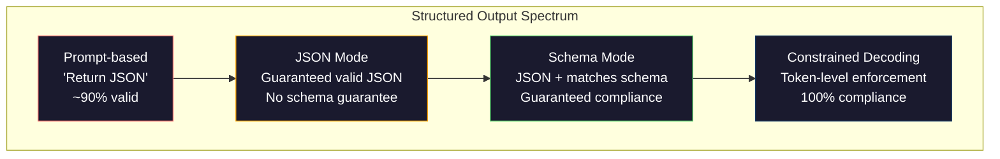
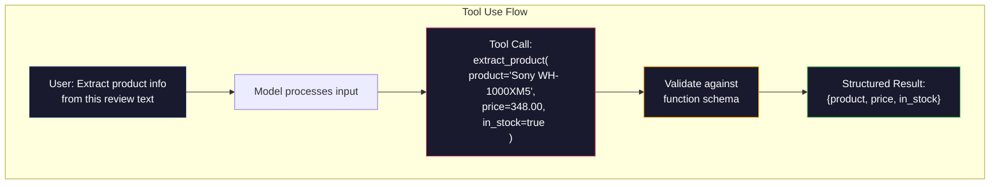

# الخروج المهيكل: JSON، تصحيح الخطة، تشفير القيود المحدود ‬ ‬ الخروج المهيكل: JSON‬ ‬ ‬ التحقق من الخطة ومحافظة الحزمة

> يعيد ماجستيرك في التدريس سلسلة. تطبيقك يحتاج إلى JSON. هذا الفجوة قد حطمت أكثر من أنظمة الإنتاج من أي الهلوسة النموذجية. الخروج المهيكلي هو الجسر بين اللغة الطبيعية والبيانات المطبوعة. الحصول على الحق و ماجستيرك في التدريس يصبح API موثوقة. الحصول على خطأ و كنت تحليل النص الحر مع regex في 3 صباحا.

> **【中文解读】**الـ LLM  يعود إلى الخيط، ولكن تطبيقها يحتاج إلى JSON ∙ . . . . . . . . . . . . . . . . . . . . . . . . . . . . . . . . . . . . . . . . . . . . . . . . . . . . . . . . . . . . . . . . . . . . . . . . . . . . . . . . . . . . . . . . . . . . . . . . . . . . . . . . . . . . . . . . . . . . . . . . . . . . . . . . . . . . . . . . . . . . . . . . . . . . . . . . . . . . . . . . . . . . . . . . . . . . . . . . . . . . . . . . . . . . . . . . . . . . . . . . . . . . . . . . . . . . . . . . . . . . . . . . . . . . . . . . . . . . . . . . . . . . . . . . . . . . . . . . . . . . . . . . . . . . . . . . . . . . . . . . . . . . . . . . . . . . . . . . . . . . . . . . . . . . . . . . . . . . . . . . . . . . . . . . . . . . . . . . . . . . . . . . . . . . . . . . . . . . . . . . . . . . . . . . . . . . . . . . . . . . . . . . . . . . . . . . . . . . . . . . . . . . . . . . . . . . . . . . . . . . . . . . . . . . . . . . . . . . . . . . . . . . . . . . . . . . . . . . . . . . . . . . . . . . . . . . . . . . . . . . . . . . . . .

> **【拓展：结构化输出→AI应用开发】**结构化输出是函数调用、RAG管道、数据提取等 AI 应用的基础──OpenAI 的`response_format`استخدام الأدوات الإنسانية، والمعلمين هي الأدوات الأساسية في هذا المجال.

>  **【前置】**学本节前请先掌握:(1) المرحلة 10·01-05(LLM 基础)  فهم رمز 生成;(2) JSON Schema 基础(`type`.`properties`.`required`();(3) Python `pydantic`المكتبة`dataclasses`本节使用Pydantic做验证──如果不懂JSON Schema,先看 jsonschema.org的5分钟教程──

**Type:** Build | **类型:** 构建
**Languages:** Python | **语言:** Python
**Prerequisites:** Phase 10, Lessons 01-05 (LLMs from Scratch) | **前置知识:** Phase 10 · 01-05 (从零构建 LLM)
**Time:** ~90 minutes | **时间:** ~90 分钟
**Related:**المرحلة 5 · 20 (المخرجات المهيكلة والتشفير المحدود) تغطي نظرية مستوى المفكّر (معالجات FSM / CFG logit ، الخطوط المخططية ، XGrammar). يركز هذا الدروس على سطح SDK الإنتاج (OpenAI `response_format`(استخدام أدوات الأنثروبية، مدرب)  اقرأ المرحلة 5 · 20 أولاً إذا كنت تريد أن تفهم ما يحدث تحت API. ‬**相关:**المرحلة 5 · 20 (struktur化输出与约束解码) 讲解码器级理论(FSM/CFG logit 处理器、概要、XGrammar)`response_format`استخدام الأدوات الإنسانية (المعلم) 想了解API 发生 تحت

## أهداف التعلم

- تنفيذ خروجيات في وضع JSON ومقيدة من مخطط باستخدام معايير OpenAI و API Anthropic
  استخدام OpenAI و API الأنثروبية 参数 لتحقيق JSON 模式 و Schema 约束输出
- بناء طبقة التحقق من Pydantic التي ترفض نتائج LLM الملفوفة وتجربات إعادة مع رد فعل الخطأ
  构建 Pydantic 验证层,拒绝格式错误的 LLM 输出并通过错误反重试
- شرح كيفية قيود فك التشفير القوى JSON صالحة على مستوى الرمز دون بعد المعالجة
   شرح حدة حل الشفرة كيفية توليد JSON فعالة على مستوى الاختبار
- تصميم أجهزة استخراج قوية تحويل النص غير المهيكلي بشكل موثوق به إلى هيكلات بيانات مدرجة
  设计鲁棒的提取提示,可靠地将非结构化文本转换为类型化数据结构

> **【中文解读】**هذا هو الخطوة الرئيسية لترقية LLM من أدوات المحادثة إلى المكونات المهنية.


## المشكلة المشكلة المشكلة

تسأل ماجستير في العلوم: "استخرج اسم المنتج، السعر، والتوفر من هذا النص".

> تسأل LLM:"من هذا المقال 中提取产品名称、价格和库存状态──"

هذا إجابة صحيحة تماماً. إنه لا فائدة له أيضاً لتطبيقك. نظامك للمخزون يحتاج`{"product": "Sony WH-1000XM5", "price": 348.00, "in_stock": true}`تحتاج إلى جسم JSON مع مفاتيح محددة وأنواع محددة، وقيود قيمة محددة. لا تحتاج إلى جملة.

> هذا إجابة صحيحة تماماً ولكن لا تستخدم في تطبيقك تماماً`{"product": "Sony WH-1000XM5", "price": 348.00, "in_stock": true}`◊ تحتاج إلى كائن JSON مع كيب محدد ‬نوع محدد و قيمة محددة ‬‬‬‬‬‬‬‬‬‬‬‬‬‬‬‬‬‬‬‬‬‬‬‬‬‬‬‬‬‬‬‬‬‬‬‬‬‬‬‬‬‬‬‬‬‬‬‬‬‬‬‬‬‬‬‬‬‬‬‬‬‬‬‬‬‬‬‬‬‬‬‬‬‬‬‬‬‬‬‬‬‬‬‬‬‬‬‬‬‬‬‬‬‬‬‬‬‬‬‬‬‬‬‬‬‬‬‬‬‬‬‬‬‬‬‬‬‬‬‬‬‬‬‬‬‬‬‬‬‬‬‬‬‬‬‬‬‬‬‬‬‬‬‬‬‬‬‬‬‬‬‬‬‬‬‬‬‬‬‬‬‬‬‬‬‬‬‬‬‬‬‬‬‬‬‬‬‬‬‬‬‬‬‬‬‬‬‬‬‬‬‬‬‬‬‬‬‬‬‬‬‬‬‬‬‬‬‬‬‬‬‬‬‬‬‬‬‬‬‬‬‬‬‬‬‬‬‬‬‬‬‬‬‬‬‬‬‬‬‬‬‬‬‬‬‬‬‬‬‬‬‬‬‬‬‬‬‬‬‬‬‬‬‬‬‬‬‬‬‬‬‬‬‬‬‬‬‬‬‬‬‬‬‬‬‬‬‬‬‬‬‬‬‬‬‬‬‬‬‬‬‬‬‬‬‬‬‬‬‬‬‬‬‬‬‬‬‬‬‬‬‬‬‬‬‬‬‬‬‬‬‬‬‬‬‬‬‬‬‬‬‬‬‬‬‬‬‬‬‬‬‬‬‬‬‬‬‬‬‬‬‬‬‬‬‬‬‬‬‬‬‬‬‬‬‬‬‬‬‬‬‬‬‬‬‬‬‬‬‬‬‬‬‬‬‬‬‬‬‬‬‬‬‬‬‬‬‬‬‬‬‬‬‬‬‬‬‬‬‬‬‬‬‬‬‬‬‬‬‬‬‬‬‬‬‬‬‬‬‬‬‬‬‬‬‬‬‬‬‬‬‬‬‬‬‬‬‬‬‬‬‬‬‬‬‬‬‬‬‬‬‬‬‬‬‬‬‬‬‬‬‬‬‬‬‬

الحل البديل: إضافة "رد في JSON" إلى طلبك. هذا يعمل 90٪ من الوقت. 10% الآخر من النموذج يلف JSON في حواجز رمز التسجيل، أو يضيف مقدمة مثل "هنا JSON:"، أو ينتج JSON غير صالحة عن طريق النصية لأنه أغلق شريط مبكرا. محلل JSON الخاص بك ينهار. أنابيبك تتعطل تضيف محاولة/إستثناء و حلقة محاولة ثانية في بعض الأحيان، الإعادة تُنتج بيانات مختلفة. الآن لديك مشكلة التماسك فوق مشكلة التحليل

> حل بسيط: في نصيحتك إضافة "استعمال JSON 回复"。 هذا ينطبق في 90% من الحالات. في الباقي 10% من الحالات، سيضيف النموذج JSON 包 في كتلة رمزية محددة، أو إضافة "هذه هي JSON:" مثل النوع الأول من الكلمات، أو لأن التوقيت المُقفل لتنفيذها يسبب JSON                                                                                                                                                                                                               

هذه ليست مشكلة هندسية سريعة. إنها مشكلة فك تشفير. النموذج يولد رموز من اليسار إلى اليمين. في كل موقف، فإنه يختار رمزاً آخر من المفردات من خيارات 100K +. معظم هذه الخيارات ستنتج JSON غير صالحة في أي موقف معين. إذا كان النموذج قد أصدرت للتو `{"price":`, يجب أن تكون الرمز التالي رقم ، اقتباس (لسلسلة) ،`null`،`true`،`false`أي شيء آخر ينتج JSON غير صالحة. بدون قيود، قد يختار النموذج كلمة إنجليزية معقولة تماماً

> هذه ليست مشكلة هندسة النص. هذه مشكلة حل الشفرة. النموذج من اليسار إلى اليمين يخلق رمز. في كل موقع، فإنه يختار من قائمة الكلمات 100،000 + من الخيارات.`{"price":`, next token 必須是数字、引号 ((用于字符串)`null`.`true`.`false`أو负号. أي شيء آخر قد ينتج غير فعال JSON. بدون حظر الكلمات، قد يختار النموذج كلمة إنجليزية معقولة تماما، ولكن في اللغة الخطأ الكارثي.

>  **【类比】**لا يحتمل أن يكون هناك أي شيء آخر يمكن أن يغيره. في الواقع، لا يمكن أن يكون هناك أي شيء آخر يمكن أن يغيره. في الواقع، لا يمكن أن يكون هناك أي شيء آخر يمكن أن يغيره.

> ️ **【易错点】**结构化输出 3 个坑: ((1) **Schema 字段过多** أكثر من 20 个字段模型记不住,会漏字段或填错;修复:拆成嵌套对象,每层不超过 5 个字段──(2) **要求 LLM 输出"创造性"字段但又强 Schema**مثل "تأسيسات مبتكرة"`title: str`, الموديل تم تخطيطه 约束后变得保守;修复:用 `temperature=0.9`+ مخطط 中加 `min_length: 10`留余地‬ (٣) **没用 Pydantic 验证**مباشرة`json.loads()`تم تصميم الصفحة "348" على أنها صارغة وليس عائمة، باستخدام نوع التحويل القسري الذاتي Pydantic

## المفهوم الأساسي

> **【中文解读】**结构化输出是让LLM 生成 JSON、XML等格式可控输出──关键技术:函数调用(Function Calling)让模型输出预定义的 JSON schema,JSON mode 强制模型生成合法 JSON,约束解码(تشريح مقيد) 在代币级保证输出格式──

> 🤔 **【困惑】**س: OpenAI `response_format={"type": "json_object"}`和 `response_format={"type": "json_schema", ...}`هناك فرق؟ أ: السابق هو "موضة JSON" ضمان إصدار JSON قانوني، ولكن لا يضمن 字段。 الأخير هو "المخرجات المهيكلة" أعطيت JSON Schema، نموذج ضمان حسب Schema 输出(باستخدام قيود حل كود لتنفيذ)。 السابق رخيص ولكن ليس صارم، الأخير في كل مرة ثمناً بضعة رصيدات ولكن 100%  حسب المواصفات。`json_schema`模式──

> **【拓展：结构化输出的工程实践】**إنتاجات OpenAI المهيكلة ((2024) ضمان النموذج المخرجات JSON Schema مطابقة بشكل صارم ، والموثوقية من حوالي 90% 提升 إلى 100%.


### الطيف المُنشئ للإنتاج

هناك أربع مستويات من التحكم في الخروج المهيكلة، كل منها أكثر موثوقية من الأخيرة.

>  التحكم في المخرجات المهيكلية لديها أربع فئات، كل منها أكثر موثوقية من السابق.



**Prompt-based**("رد في JSON صالحة"): لا تطبيق. النموذج يلتزم عادة ولكن في بعض الأحيان لا. موثوقية: ~ 90٪. وضع الفشل: حواجز التسجيل، نص المبادئ، الناتج المختصر، بنية خاطئة.

> **基于提示**("باستخدام JSON فعالة 回复"): لا يوجد إجبارية التنفيذ. النموذج عادة ما يتبع، ولكن في بعض الأحيان لن يكون.

**JSON mode**: يضمن API أن المخرج هو JSON صالح.`response_format: { type: "json_object" }`المخرج سوف تحلل دون أخطاء. ولكن قد لا تتطابق النظام المتوقع -- المفاتيح الإضافية، النوع الخطأ، الحقول المفقودة.

> **JSON 模式**:API ضمان إنتاج هو فعال JSON.`response_format: { type: "json_object" }`تمكين هذه الميزة. . . . . . . . . . . . . . . . . . . . . . . . . . . . . . . . . . . . . . . . . . . . . . . . . . . . . . . . . . . . . . . . . . . . . . . . . . . . . . . . . . . . . . . . . . . . . . . . . . . . . . . . . . . . . . . . . . . . . . . . . . . . . . . . . . . . . . . . . . . . . . . . . . . . . . . . . . . . . . . . . . . . . . . . . . . . . . . . . . . . . . . . . . . . . . . . . . . . . . . . . . . . . . . . . . . . . . . . . . . . . . . . . . . . . . . . . . . . . . . . . . . . . . . . . . . . . . . . . . . . . . . . . . . . . . . . . . . . . . . . . . . . . . . . . . . . . . . . . . . . . . . . . . . . . . . . . . . . . . . . . . . . . . . . . . . . . . . . . . . . . . . . . . . . . . . . . . . . . . . . . . . . . . . . . . . . . . . . . . . . . . . . . . . . . . . . . . . . . . . . . . . . . . . . . . . . . . . . . . . . . . . . . . . . . . . . . . . . . . . . . . . . . . . . . . . . . . . . . . . . . . . . . . . . . . . . . . . . . . . . . . . . . . . . . . . . . . . . . . . . . . . .

**Schema mode**: يأخذ API مخطط JSON ويضمن أن الخروج يطابقها. في عام 2026 كل مزود رئيسي يدعم هذا بشكل أصلي: OpenAI `response_format: { type: "json_schema", json_schema: {...} }`(و أيضاً)`tool_choice="required"`), استخدام أدوات الأنثروبيك مع `input_schema`، و التوأم`response_schema`+ `response_mime_type: "application/json"`.المخرج لديه المفاتيح والأنواع والقيود التي حددتها بالضبط.

> **Schema 模式**:API  قبول JSON Schema 并保证输出匹配──2026年 每个主要供应商都原生支持:OpenAI 的 `response_format: { type: "json_schema" }`、أنثروبيك `input_schema`استخدام الأدوات`response_schema` النفذ مع المفاتيح المحددة وتلك التي تحددها

**Constrained decoding**في كل وضع رمز أثناء توليد، يقوم المفكّر بتخفيض جميع الرموز التي ستنتج خروجاً غير صالحة. إذا كانت النموذج تتطلب رقمًا والنموذج على وشك إصدار حرفًا، يتم تعيين هذه الرموز إلى احتمال صفر. يمكن للنموذج إنتاج الرموز التي تؤدي فقط إلى خروجاً صالحًا. هذا ما ينفذه وضع الخروج المهيكلي OpenAI والمكتبات مثل الخطوط المخطوطة والإرشادات تحت الغطاء.

> **约束解码**: في كل رمز في عملية إنتاج  موقع، يحجب الكودر جميعها لإنتاج رمز الخروج غير الفعال. إذا كانت النظام تطلب الرقم والنموذج سوف ينتج حرفا، فإن احتمالية هذا الرمز يتم تحديده إلى صفر. يمكن أن ينتج نموذج فقط يؤدي إلى إصدار فعال. هذا هو OpenAI  الإصدار المهيكلي و الخطوط المخططات  الإرشادات وغيرها من الطرق التابعة لتحقيق المستوى الأساسي.

### مخطط JSON: لغة العقد

مخطط JSON هو كيفية إخبار النموذج (أو طبقة التحقق) ما الشكل الذي يجب أن يكون له الخروج. كل نظام خروج مهيكلي كبير يستخدمها.

> مخطط JSON هو كيفية تخبر الموديل (أو التحقق) أن المخرج يجب أن يكون له شكل. كل نظام مصدر مكون بشكل رئيسي يستخدمها.

```json
{
  "type": "object",
  "properties": {
    "product": { "type": "string" },
    "price": { "type": "number", "minimum": 0 },
    "in_stock": { "type": "boolean" },
    "categories": {
      "type": "array",
      "items": { "type": "string" }
    }
  },
  "required": ["product", "price", "in_stock"]
}
```

هذا النظام يقول: إنتاج يجب أن يكون كائن مع سلسلة `product`، رقم غير سلبي `price`، و بوليان `in_stock`، وسلسلة اختيارية من السلاسل `categories`أي إصدار لا يطابق يتم رفضه

> هذا النظام يقول: الخروج يجب أن يكون كائن، يحتوي على الخطوط`product`、غير الرقم الرئيسي `price`قيمة`in_stock`和可选的字符串数组 `categories`أي تصدير غير متوافق سيتم رفضه

النماذج تتعامل مع الحالات الصعبة: الأشياء المتعقدة، المجموعات التي تحتوي على عناصر منخفضة، والإينومات (تقييد سلسلة إلى قيم محددة) ، ومطابقة الأنماط (الرد على السلاسل) ، والمزيج (oneOf، anyOf، allOf للمخرجات متعددة الأشكال).

> المخططات المعالجة المختلفة:嵌套对象、带类型项的数组、枚举(将字符串约束为特定值)、模式匹配(字符串上的正则表达式) و组合器(oneOf、anyOf、allOf 用于多态输出) ⋅

### النمط البيدانتي

في بايثون، لا تكتب مخطط JSON يدوياً. أنت تعريف نموذج Pydantic و يخلق مخطط لك.

> في بايثون، أنت لا تحتاج إلى كتابة خطة JSON يدويا.

```python
from pydantic import BaseModel

class Product(BaseModel):
    product: str
    price: float
    in_stock: bool
    categories: list[str] = []
```

هذا ينتج نفس مخطط JSON كما هو أعلاه. تقوم مكتبة المعلم (و SDK OpenAI) بقبول نماذج Pydantic مباشرة: اجتياز فئة النموذج، والعودة إلى مثال معتمد. إذا لم تتطابق نتائج LLM، يقوم المعلم بمحاولة إعادة تلقائيًا.

> هذا سوف ينتج نفس مخطط JSON أعلاه.

### مكالمة الوظيفة / استخدام الأدوات

واجهة بديلة لنفس المشكلة. بدلاً من طلب النموذج من إنتاج JSON مباشرة، تعريف "الأدوات" (الظروف) مع المعلمات المكتوبة. النموذج يخرج دعوة وظيفة مع حجج مهيكلة. OpenAI يطلق على هذا "دعوة الوظيفة". Anthropic يطلق عليه "استخدام الأدوات". النتيجة هي نفسها: بيانات مهيكلة.

> حل نفس المشكلة. ليس هناك حاجة إلى أن تكون JSON مباشرة، ولكن تحديد مع نوع المواد المكونة.



يفضل استخدام الأداة عندما يحتاج النموذج إلى اختيار الوظيفة التي سيتم استدعائها ، وليس فقط ملء المعايير. إذا كان لديك 10 مخططات استخراج مختلفة ويجب على النموذج اختيار المناسب على أساس المدخلات ، فإن استخدام الأداة يعطيك كل من اختيار مخطط والمخرج المهيكلي.

> عندما يحتاج النموذج إلى اختيار أي وظيفة لا يقتصر على إملأ العنصر، فاستخدم أداة الاختيار الأولية. إذا كان لديك 10 مخططات مختلفة لتحديد النموذج، يجب أن تستخدم الأداة على أساس الإدخال والخيار الصحيح.

### أساليب الفشل الشائعة

حتى مع تنفيذ النظام، الخروج المهيكلة يمكن أن تفشل بطرق خفيفة.

> حتى لو كان هناك مخطط إضافي، يمكن أن يفشل الإصدارات المهيكلية بطريقة دقيقة.

**Hallucinated values**: الخروج يطابق النظام ولكن يحتوي على بيانات مخترعة. النموذج ينتج `{"price": 299.99}`عندما يقول النص 348 دولار. التحقق من النظام لا يمكن أن تلتقط هذا -- النوع صحيح، القيمة خاطئة.

> **幻觉值**: النتائج المنسقة ولكن تحتوي على بيانات وهمية.`{"price": 299.99}`الخطط 验证不能捕捉这个问题类型正确,值错误──

**Enum confusion**: تحدّد حقلًا إلى `["in_stock", "out_of_stock", "preorder"]`. النموذج الخروج`"available"`-- صحيحة من الناحية النطاقية، ولكن ليس في مجموعة المسموح بها. التشخيص المقيد جيد يمنع هذا. نهج مبني على اللحظة لا يفعل ذلك.

> **枚举混淆**ستحصل على حكم`["in_stock", "out_of_stock", "preorder"]` نموذج النفاذ`"available"`语义上正确,但不是允许的集合中. 

**Nested object depth**: النماذج المرتبطة بعمق (4+ مستويات) تنتج أخطاء أكثر. كل مستوى من مستويات التجميد هو مكان آخر حيث يمكن أن يفقد النموذج البنية.

> **嵌套对象深度**: خطة في الوضع العميقة (٤+ طبقة) تسبب المزيد من الأخطاء. كل طبقة من الوضع هو مكان آخر من النموذج يمكن أن تفقد التركيب.

**Array length**: قد ينتج النموذج الكثير جداً أو عدد قليل جداً من المواد في صف.`minItems`و`maxItems`لكن ليس كل مقدمي الخدمات يطبقونها على مستوى فك الكود.

> **数组长度**النموذج يمكن أن يحدث الكثير أو القليل جدا من النقاط في الحجم.`minItems`和 `maxItems`ولكن ليس كل المقدمين في درجة الحل القضائي.

**Optional field omission**: النموذج يفتقر إلى الحقول التي هي اختياريًا تقنيًا ولكن مهمة من الناحية الدلالية لحالة الاستخدام الخاصة بك. حددها حسب المتطلبات في النموذج حتى لو كانت البيانات مفقودة أحيانًا - اجبر النموذج على إنتاج`null`صراحة

> **可选字段遗漏**: النموذج ينقص التقنية المختارة ولكن في المعنى الدراسي الحصص المهمة لحالة الاستخدام الخاص بك. حتى لو كانت هناك غياب في بعض الأحيان، في النظام أيضا سوف يتم وضعها على النموذج الضروري.`null`.

## بناء ذلك تحرك لتحقيق
```figure
mx-schema-funnel
```

## بناءها

### الخطوة 1: مؤكدة مخطط JSON

قم ببناء مؤكدة من الصفر التي تحقق ما إذا كان كائن Python يطابق مخطط JSON. هذا ما يعمل على جانب الخروج للتحقق من الامتثال.

> من零构建验证器، تحقق Python على ما إذا كان العنصر يتناسب مع JSON Schema.

```python
import json

def validate_schema(data, schema):
    errors = []
    _validate(data, schema, "", errors)
    return errors

def _validate(data, schema, path, errors):
    schema_type = schema.get("type")

    if schema_type == "object":
        if not isinstance(data, dict):
            errors.append(f"{path}: expected object, got {type(data).__name__}")
            return
        for key in schema.get("required", []):
            if key not in data:
                errors.append(f"{path}.{key}: required field missing")
        properties = schema.get("properties", {})
        for key, value in data.items():
            if key in properties:
                _validate(value, properties[key], f"{path}.{key}", errors)

    elif schema_type == "array":
        if not isinstance(data, list):
            errors.append(f"{path}: expected array, got {type(data).__name__}")
            return
        min_items = schema.get("minItems", 0)
        max_items = schema.get("maxItems", float("inf"))
        if len(data) < min_items:
            errors.append(f"{path}: array has {len(data)} items, minimum is {min_items}")
        if len(data) > max_items:
            errors.append(f"{path}: array has {len(data)} items, maximum is {max_items}")
        items_schema = schema.get("items", {})
        for i, item in enumerate(data):
            _validate(item, items_schema, f"{path}[{i}]", errors)

    elif schema_type == "string":
        if not isinstance(data, str):
            errors.append(f"{path}: expected string, got {type(data).__name__}")
            return
        enum_values = schema.get("enum")
        if enum_values and data not in enum_values:
            errors.append(f"{path}: '{data}' not in allowed values {enum_values}")

    elif schema_type == "number":
        if not isinstance(data, (int, float)):
            errors.append(f"{path}: expected number, got {type(data).__name__}")
            return
        minimum = schema.get("minimum")
        maximum = schema.get("maximum")
        if minimum is not None and data < minimum:
            errors.append(f"{path}: {data} is less than minimum {minimum}")
        if maximum is not None and data > maximum:
            errors.append(f"{path}: {data} is greater than maximum {maximum}")

    elif schema_type == "boolean":
        if not isinstance(data, bool):
            errors.append(f"{path}: expected boolean, got {type(data).__name__}")

    elif schema_type == "integer":
        if not isinstance(data, int) or isinstance(data, bool):
            errors.append(f"{path}: expected integer, got {type(data).__name__}")
```

### الخطوة الثانية: نموذج في النمط البيانتيكي إلى الخطة

قم ببناء محول من الفئة إلى الخطة الحد الأدنى. حدد فئة Python وولد مخطط JSON تلقائيا.

> 构建最小类到方案 转换器──定义 Python 类,自动生成其 JSON Schema──

```python
class SchemaField:
    def __init__(self, field_type, required=True, default=None, enum=None, minimum=None, maximum=None):
        self.field_type = field_type
        self.required = required
        self.default = default
        self.enum = enum
        self.minimum = minimum
        self.maximum = maximum

def python_type_to_schema(field):
    type_map = {
        str: "string",
        int: "integer",
        float: "number",
        bool: "boolean",
    }

    schema = {}

    if field.field_type in type_map:
        schema["type"] = type_map[field.field_type]
    elif field.field_type == list:
        schema["type"] = "array"
        schema["items"] = {"type": "string"}
    elif isinstance(field.field_type, dict):
        schema = field.field_type

    if field.enum:
        schema["enum"] = field.enum
    if field.minimum is not None:
        schema["minimum"] = field.minimum
    if field.maximum is not None:
        schema["maximum"] = field.maximum

    return schema

def model_to_schema(name, fields):
    properties = {}
    required = []

    for field_name, field in fields.items():
        properties[field_name] = python_type_to_schema(field)
        if field.required:
            required.append(field_name)

    return {
        "type": "object",
        "properties": properties,
        "required": required,
    }
```

### الخطوة الثالثة: تصفية الوسائل المعيارية المحدودة

محاكاة تشفير القيود المحدود. مع إعطاء سلسلة JSON جزئية ونظام رسمية، تحديد أي فئات رمزية صالحة في الموقف الحالي.

> 模拟约束解码──给定部分 JSON 字符串和方案,确定当前位置哪些代币 类别有效──

```python
def next_valid_tokens(partial_json, schema):
    stripped = partial_json.strip()

    if not stripped:
        return ["{"]

    try:
        json.loads(stripped)
        return ["<EOS>"]
    except json.JSONDecodeError:
        pass

    last_char = stripped[-1] if stripped else ""

    if last_char == "{":
        return ['"', "}"]
    elif last_char == '"':
        if stripped.endswith('":'):
            return ['"', "0-9", "true", "false", "null", "[", "{"]
        return ["a-z", '"']
    elif last_char == ":":
        return [" ", '"', "0-9", "true", "false", "null", "[", "{"]
    elif last_char == ",":
        return [" ", '"', "{", "["]
    elif last_char in "0123456789":
        return ["0-9", ".", ",", "}", "]"]
    elif last_char == "}":
        return [",", "}", "]", "<EOS>"]
    elif last_char == "]":
        return [",", "}", "<EOS>"]
    elif last_char == "[":
        return ['"', "0-9", "true", "false", "null", "{", "[", "]"]
    else:
        return ["any"]

def demonstrate_constrained_decoding():
    partial_states = [
        '',
        '{',
        '{"product"',
        '{"product":',
        '{"product": "Sony"',
        '{"product": "Sony",',
        '{"product": "Sony", "price":',
        '{"product": "Sony", "price": 348',
        '{"product": "Sony", "price": 348}',
    ]

    print(f"{'Partial JSON':<45} {'Valid Next Tokens'}")
    print("-" * 80)
    for state in partial_states:
        valid = next_valid_tokens(state, {})
        display = state if state else "(empty)"
        print(f"{display:<45} {valid}")
```

### الخطوة الرابعة: خط أنابيب الاستخراج

قم بتجميع كل شيء في خط أنابيب استخراج: حدد مخططًا، وقلل من LLM ينتج نتائجًا مهيكلةً، وصدّق الناتج، واعتدّل التجربات المُجدّدة.

> وضع كل شيء على نفسها وتحديد النظام المحدد

```python
def simulate_llm_extraction(text, schema, attempt=0):
    if "headphones" in text.lower() or "sony" in text.lower():
        if attempt == 0:
            return '{"product": "Sony WH-1000XM5", "price": 348.00, "in_stock": true, "categories": ["audio", "headphones"]}'
        return '{"product": "Sony WH-1000XM5", "price": 348.00, "in_stock": true}'

    if "laptop" in text.lower():
        return '{"product": "MacBook Pro 16", "price": 2499.00, "in_stock": false, "categories": ["computers"]}'

    return '{"product": "Unknown", "price": 0, "in_stock": false}'

def extract_with_retry(text, schema, max_retries=3):
    for attempt in range(max_retries):
        raw = simulate_llm_extraction(text, schema, attempt)

        try:
            data = json.loads(raw)
        except json.JSONDecodeError as e:
            print(f"  Attempt {attempt + 1}: JSON parse error -- {e}")
            continue

        errors = validate_schema(data, schema)
        if not errors:
            return data

        print(f"  Attempt {attempt + 1}: Schema validation errors -- {errors}")

    return None

product_schema = {
    "type": "object",
    "properties": {
        "product": {"type": "string"},
        "price": {"type": "number", "minimum": 0},
        "in_stock": {"type": "boolean"},
        "categories": {"type": "array", "items": {"type": "string"}},
    },
    "required": ["product", "price", "in_stock"],
}
```

### الخطوة 5: قم بتشغيل خط الأنابيب الكامل

> الخطوة 5:运行完整流水线──

```python
def run_demo():
    print("=" * 60)
    print("  Structured Output Pipeline Demo")
    print("=" * 60)

    print("\n--- Schema Definition ---")
    product_fields = {
        "product": SchemaField(str),
        "price": SchemaField(float, minimum=0),
        "in_stock": SchemaField(bool),
        "categories": SchemaField(list, required=False),
    }
    generated_schema = model_to_schema("Product", product_fields)
    print(json.dumps(generated_schema, indent=2))

    print("\n--- Schema Validation ---")
    test_cases = [
        ({"product": "Test", "price": 10.0, "in_stock": True}, "Valid object"),
        ({"product": "Test", "price": -5.0, "in_stock": True}, "Negative price"),
        ({"product": "Test", "in_stock": True}, "Missing price"),
        ({"product": "Test", "price": "ten", "in_stock": True}, "String as price"),
        ("not an object", "String instead of object"),
    ]

    for data, label in test_cases:
        errors = validate_schema(data, product_schema)
        status = "PASS" if not errors else f"FAIL: {errors}"
        print(f"  {label}: {status}")

    print("\n--- Constrained Decoding Simulation ---")
    demonstrate_constrained_decoding()

    print("\n--- Extraction Pipeline ---")
    texts = [
        "The Sony WH-1000XM5 headphones are priced at $348 and currently available.",
        "The new MacBook Pro 16-inch laptop costs $2499 but is sold out.",
        "This is a random sentence with no product info.",
    ]

    for text in texts:
        print(f"\n  Input: {text[:60]}...")
        result = extract_with_retry(text, product_schema)
        if result:
            print(f"  Output: {json.dumps(result)}")
        else:
            print(f"  Output: FAILED after retries")
```

## استخدمها في إطار التنفيذ

### المخرجات المهيكلة OpenAI

> OpenAI 结构化输出──

```python
# from openai import OpenAI
# from pydantic import BaseModel
#
# client = OpenAI()
#
# class Product(BaseModel):
#     product: str
#     price: float
#     in_stock: bool
#
# response = client.beta.chat.completions.parse(
#     model="gpt-5-mini",
#     messages=[
#         {"role": "system", "content": "Extract product information."},
#         {"role": "user", "content": "Sony WH-1000XM5, $348, in stock"},
#     ],
#     response_format=Product,
# )
#
# product = response.choices[0].message.parsed
# print(product.product, product.price, product.in_stock)
```

يستخدم وضع الخروج المهيكلي من OpenAI تشفير مقيد داخليا. كل رمز يولد من النموذج يضمن إنتاج خروج يطابق مخطط Pydantic. لا حاجة إلى إعادة التجربة. لا حاجة إلى التحقق من التحقق من التحقق من التحقق من التحقق من التحقق من التحقق من التحقق من التحقق من التحقق من التحقق من التحقق من التحقق من التحقق من التحقق من التحقق من التحقق من التحقق من التحقق من التحقق من التحقق من التحقق من التحقق من التحقق من التحقق من التحقق من التحقق من التحقق من التحقق من التحقق من التحقق من التحقق من التحقق من التحقق من التحقق من التحقق من التحقق من التحقق من التحقق من التحقق من التحقق من التحقق من التحقق من التحقق من التحقق من التحقق من التحقق من التحقق من التحقق من التحقق.

> أسلوب إصدار هيكلي OpenAI في داخلية استخدام الحزمة للشفرة. كل رمز تم إنشاؤه من النموذج يضمن أن تكون هناك إصدار متطابق من مخطط بيدانتيك.

### استخدام الأدوات الإنسانية

> الأنثروبية 工具使用──

```python
# import anthropic
#
# client = anthropic.Anthropic()
#
# response = client.messages.create(
#     model="claude-opus-4-7",
#     max_tokens=1024,
#     tools=[{
#         "name": "extract_product",
#         "description": "Extract product information from text",
#         "input_schema": {
#             "type": "object",
#             "properties": {
#                 "product": {"type": "string"},
#                 "price": {"type": "number"},
#                 "in_stock": {"type": "boolean"},
#             },
#             "required": ["product", "price", "in_stock"],
#         },
#     }],
#     messages=[{"role": "user", "content": "Extract: Sony WH-1000XM5, $348, in stock"}],
# )
```

يصل Anthropic إلى إنتاج مهيكلي من خلال استخدام الأدوات. ينشر النموذج نداءً أدواتًا مع حجج مهيكلية تتطابق مع input_schema. نفس النتيجة ، سطح API مختلف.

> النظام النموذجي يستخدم أداة التشغيل، ويتم استخدامها في أدوات التشغيل.

### مكتبة المعلمين

> مدرب 库。

```python
# pip install instructor
# import instructor
# from openai import OpenAI
# from pydantic import BaseModel
#
# client = instructor.from_openai(OpenAI())
#
# class Product(BaseModel):
#     product: str
#     price: float
#     in_stock: bool
#
# product = client.chat.completions.create(
#     model="gpt-5-mini",
#     response_model=Product,
#     messages=[{"role": "user", "content": "Sony WH-1000XM5, $348, in stock"}],
# )
```

يقوم المعلم بتصوير أي عميل LLM ويزيد من التجربات التلقائية مع التحقق. إذا فشلت المحاولة الأولى في التحقق، فإنه يرسل الأخطاء إلى النموذج كسياق ويطلب منه إصلاح الخروج. يعمل هذا مع أي مزود، وليس فقط OpenAI.

> المعلم  حزمة أي LLM  المستخدم  المضافة مع التحقق من التحقق التلقائي مرة أخرى. إذا فشلت المحاولة الأولى للتحقق، فإنه سوف يكون خطأ على النحو التالي وتطلب تعديل الناتج.

## أرسلها .

هذا الدرس يُنتج`outputs/prompt-structured-extractor.md`-- نموذج استقالة قابل للاستعمال الذي يستخرج البيانات المهيكلة من أي نص مع تعريف مخطط. إطعام مخطط JSON والنص غير المهيكلة، ويعود JSON الموثق.

> 本课产生 `outputs/prompt-structured-extractor.md` نموذج اقتراح قابل للاستعادة، معين المخطط 定义، من أي نص من بين الاستخدامات البيانات المهيكلة.

كما أنها تنتج`outputs/skill-structured-outputs.md`-- إطار قرار لانتخاب استراتيجية الخروج المنظمة المناسبة بناء على مزودك، متطلبات موثوقية، وتعقيد مخطط.

> لقد حدث ذلك`outputs/skill-structured-outputs.md` إطار قرار، وفقاً لمقدمك  احتياجات و مخططات موثوقية  تعقيد اختيار استراتيجية إصدار هيكلية صحيحة

## تمارين التدريب

1. تمديد مؤكدة النظام لدعم `oneOf`(يجب أن تتطابق البيانات بالضبط مع واحدة من العديد من الخرائط) هذا يتعامل مع المخرجات متعددة الأشكال - على سبيل المثال، حقل يمكن أن يكون إما`Product`أو`Service`كائن ذو أشكال مختلفة
    توسيع النظام  مؤكدة لدعم `oneOf`(البيانات يجب أن تتطابق مع واحدة من العديد من النماذج)`Product`أو`Service`المُجرد

2. قم ببناء أداة "مختلفة الخطة" التي تقارن مخططين وتحدد التغييرات المكسورة (إزالة الحقول المطلوبة، وتغيير الأنواع) مقابل التغييرات غير المكسورة (إضافة الحقول الاختيارية، القيود المسترخة). هذا أمر ضروري لتطبيق مخططات الاستخراج الخاصة بك في الإنتاج.
   بناء أداة "مختلفة الخطة"، مقارنة الخطة والتحديد التغييرات المدمرة  حذف الحاجة إلى الحجم  نوع التغييرات) والتحديد غير المدمرة  إضافة الحجم المختار  تخفيف الحزمة)

3. قم بتنفيذ محاكاة تشخيص القيود المحدودة الأكثر واقعية. مع إعطاء مخطط JSON ومجموعة من 100 رمز (حروف وأرقام ونقاط، كلمات رئيسية) ، قم بمشي من خلال إنتاج خطوة بخطوة، وتخفي رموز غير صالحة في كل موقع. قياس مدى نسبة المئة من المفردات صالحة في كل خطوة.
   实现一个更真实的约束解码模拟器──给定 JSON Schema 和 100 个代币的词表,逐步生成,在每个位置屏蔽无效代币──测量每一步词表的有效百分比──

4. قم ببناء مجموعة تقييم الاستخراج. قم بإنشاء 50 وصف للمنتج مع نتائج JSON المسموحة يدوياً. قم بتشغيل خط أنابيب الاستخراج الخاصة بك على جميع 50 وقياس المقابلة الدقيقة ودقة مستوى المجال وتوافق النموذج. حدد أسوأ الحقول للاستخراج بشكل صحيح.
   构建一个提取评估套件──创建 50 产品描述及标签 JSON 输出──在所有 50 运行提取流水线上,测量精确匹配、字段级准确率和类型合规性──

5. إضافة "درجات الثقة" إلى خط أنابيب استخراجك. لكل حقل استخراج، تقدير مدى ثقة النموذج (بناء على احتمالات الرمز، أو عن طريق تشغيل استخراج 3 مرات وتقييم التماسك). علامة الحقول منخفضة الثقة للمراجعة البشرية.
   لـ "مُتَقَدِّمُ الـمُتَقَدِّمَة" (مُتَقَدِّمُ الـ"مُتَقَدِّمُ الـمُتَقَدِّمَة")

## شروط الرئيسية

| Term | What people say | What it actually means | 中文释义 |
|------|----------------|----------------------|---------|
| JSON mode | "Returns JSON" / "返回 JSON" | API flag that guarantees syntactically valid JSON output, but does not enforce any particular schema | JSON 模式：API 标志，保证语法有效的 JSON 输出，但不强制执行特定 schema |
| Structured output | "Typed JSON" / "类型化 JSON" | Output that matches a specific JSON Schema with correct keys, types, and constraints | 结构化输出：匹配特定 JSON Schema 的输出，具有正确的键、类型和约束 |
| Constrained decoding | "Guided generation" / "引导生成" | At each token position, mask out tokens that would produce invalid output -- guarantees 100% schema compliance | 约束解码：在每个 token 位置屏蔽会产生无效输出的 token，保证 100% schema 合规 |
| JSON Schema | "A JSON template" / "JSON 模板" | A declarative language for describing the structure, types, and constraints of JSON data (used by OpenAPI, JSON Forms, etc.) | JSON Schema：描述 JSON 数据结构、类型和约束的声明式语言 |
| Pydantic | "Python dataclasses+" / "Python 数据类+" | Python library that defines data models with type validation, used by FastAPI and Instructor to generate JSON Schemas | Pydantic：定义带类型验证数据模型的 Python 库，用于生成 JSON Schema |
| Function calling | "Tool use" / "工具使用" | LLM outputs a structured function invocation (name + typed arguments) instead of free text -- OpenAI and Anthropic both support this | 函数调用：LLM 输出结构化的函数调用（名称+类型化参数），而非自由文本 |
| Instructor | "Pydantic for LLMs" / "LLM 的 Pydantic" | Python library that wraps LLM clients to return validated Pydantic instances, with automatic retry on validation failure | Instructor：包装 LLM 客户端返回验证过的 Pydantic 实例的 Python 库 |
| Token masking | "Filtering the vocabulary" / "过滤词表" | Setting specific token probabilities to zero during generation so the model cannot produce them | Token 屏蔽：在生成过程中将特定 token 概率设为零 |
| Schema compliance | "Matches the shape" / "匹配形状" | The output has every required field, correct types, values within constraints, and no extra disallowed fields | Schema 合规：输出具有每个必需字段、正确类型、约束内的值 |
| Retry loop | "Try again until it works" / "重试直到成功" | Send validation errors back to the model and ask it to fix the output -- Instructor does this automatically, up to a configurable max | 重试循环：将验证错误发回模型并要求修复输出 |

## المزيد من القراءة

- [OpenAI Structured Outputs Guide](https://platform.openai.com/docs/guides/structured-outputs)-- الوثائق الرسمية لـ " JSON Schema " القيود القيودية القيودية في API OpenAI
  OpenAI API في المستندات الرسمية للشكل JSON
- [Willard & Louf, 2023 -- "Efficient Guided Generation for Large Language Models"](https://arxiv.org/abs/2307.09702)-- ورقة الخطوط المخططية، وتصف كيفية تجميع مخططات JSON في آلات الحالة المحدودة للقيود على مستوى الرمز
  بيانات مقال، وصف كيفية وضع نظام JSON 编译为有限状态机以实现代币 级约束
- [Instructor documentation](https://python.useinstructor.com/)-- المكتبة القياسية للحصول على نتائج مهيكلة من أي ماجستير في العلوم مع التحقق من معايير و إعادة الاختبار
  من أي ماجستير في التدريس  الحصول بامتحانات و إعادة التجربة
- [Anthropic Tool Use Guide](https://docs.anthropic.com/en/docs/tool-use)-- كيف ينفذ كلود الناتج المهيكلي عبر استخدام الأدوات مع JSON Schema input_schema
  كلود  كيفية استخدام أداة JSON Schema input_schema 实现结构化输出
- [JSON Schema specification](https://json-schema.org/)-- المواصفات الكاملة لغة النظام المستخدمة من قبل كل نظام إنتاج مهيكلي رئيسي
  كل نظام هيكلي كبير للمصدرات والخروج النظامية
- [Outlines library](https://github.com/outlines-dev/outlines)-- إعداد مصدر مفتوح مقيد باستخدام regex و JSON Schema مرتبة إلى آلات الحالة المحدودة
  استخدام قواعد و JSON مخططات 编译为有限状态机的开源约束生成库
- [Dong et al., "XGrammar: Flexible and Efficient Structured Generation Engine for Large Language Models" (MLSys 2025)](https://arxiv.org/abs/2411.15100)-- محرك اللغة الحديث الحالي؛ مجموعة أوتوماتيكية تدفع أسفل التي تغطي الرموز عند ~ 100 ns / الرموز.
  حاليًا أقدم محرك لغة؛ أسفل التشغيل الآلي، بسرعة حوالي 100 نسا/مؤشر
- [Beurer-Kellner et al., "Prompting Is Programming: A Query Language for Large Language Models" (LMQL)](https://arxiv.org/abs/2212.06094)-- إطار الورق LMQL القيود ك لغة استفسار مع قيود النوع والقيمة.
  تحويل القيود إلى قواعد تشكيل لغة استفسارات ذات نوع وقيمة
- [Microsoft Guidance (framework docs)](https://github.com/guidance-ai/guidance)-- التوليد المحدود القائم على العلامات التشريعية؛ إضافة معتاد على البائع إلى الخطوط المخططية و XGrammar.
  模板驱动的约束生成;概要和 XGrammar 的供应商无关补充
