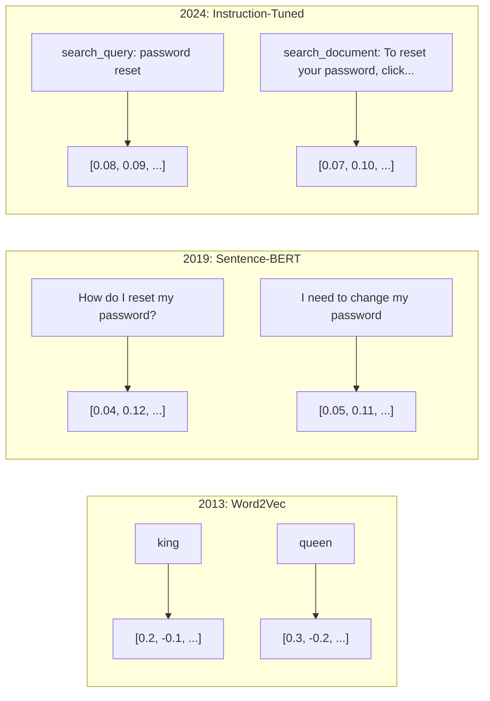
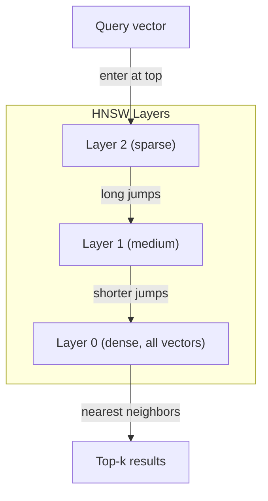
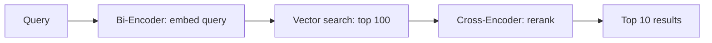

# التوابع والممثليات المتجهة

> النص منفصل. الرياضيات مستمرة. كلما طلبت من ماجستير في العلوم العليا العثور على وثائق "مماثلة" أو مقارنة المعاني أو البحث خارج الكلمات الرئيسية، كنت تعتمد على جسر بين هذين العالمين. تلك الجسر هي إضافة. إذا كنت لا تفهم الإضافة، أنت لا تفهم الذكاء الاصطناعي الحديث. أنت فقط تستخدمها.

> **【中文解读】**المقال هو متفرق، والرياضيات هي متواصلة.

> **【拓展：嵌入→RAG与搜索】**嵌入是RAG (检索增强生成) النظام البنية التحتية الأساسية.

>  **【前置】**تعلمون: 1) Python 基础 (موقع) ؛ 2) 高中向量数学点积、角、模长(不知道这些先看 阶段01·02 متريشيات المتجهات); 3) 阶段05·03(Word Embeddings Word2Vec) 会讲词嵌入基础, 本节是其延伸到句子/文档级──本节会用到`numpy`.`scikit-learn`يمكن أن تختار`chromadb`أو`qdrant`.

**Type:** Build | **类型:** 构建
**Languages:** Python | **语言:** Python
**Prerequisites:** Phase 11, Lesson 01 (Prompt Engineering) | **前置知识:** Phase 11 · 01 (提示工程)
**Time:** ~75 minutes | **时间:** ~75 分钟
**Related:**المرحلة 5 · 22 (إمبيدينغ موديلز غوص عميق) تغطي كثافة مقابل نادر مقابل متعدد المتجهات، وتقصر ماتريوشكا، واختيار النموذج لكل محور. يركز هذا الدروس على خط الأنابيب الإنتاج (متجهات DB، HNSW، الرياضيات المماثلة). اقرأ المرحلة 5 · 22 قبل اختيار نموذج.**相关:**المرحلة 5 · 22 (嵌入模型深度解析) تغطي密/稀疏/多向量、ماتريوشكا 截断和分轴模型选择。本课聚焦生产管线(向量库、HNSW、相似度数学)。选模型前先读

## أهداف التعلم

- إنشاء إضافة نصية باستخدام مزودي API ونماذج مفتوحة المصدر ، وحساب التشابه بينها
  استخدام API  مُقدّم و نموذج مفتوح المصدر لتوليد إدخال النص، و حساب التشابه بينهما
- شرح لماذا تُحل المكالمات المضمنة مشكلة عدم مطابقة المفردات التي لا يمكن البحث عن الكلمات الرئيسية التعامل معها
   شرح لماذا تضمين يمكن حل الكلمات الرئيسية بحث لا يمكن معالجتها الكلمات غير المتطابقة
- بناء مؤشر بحث تعريفية يستعيد المستندات حسب المعنى بدلا من مطابقة الكلمات الرئيسية بالضبط
  构建一个语义搜索索引擎,按意义而非精确关键词匹配搜索文档
- تقييم جودة التضمين باستخدام معايير الاسترداد (precision@k، recall) واختيار نموذج التضمين المناسب لمهمتك
  استخدام检索基准(precision@k、recall) تقييم النموذج الموضعي،并为任务选择合适的嵌入模型

> **【中文解读】**هدف هذا الدراسة: فهم مبادئ وتطبيقات إدخال النص إلى النقطة، مما يجعل النص على النص على النص على النطاق الأكبر من المسافة في الفضاء النطاقي.


## المشكلة المشكلة المشكلة

لديك 10 آلاف تذكرة دعم. يكتب عميل "دفعي لم يمر". تحتاج للعثور على تذاكر سابقة مماثلة. بحث الكلمات الرئيسية يجد تذاكر تحتوي على "دفع" و "لم يمر". يفتقد "فشل المعاملة،" "تم رفض الرسوم،" و "خطأ الفواتير". هذه التذاكر تصف نفس المشكلة بالضبط بكلمات مختلفة تماما.

> لديك 10،000 张工单. كتب العميل "ديدياليبم لا ينجح". تحتاج إلى العثور على نفس المشكلة. مطلوبة الكلمات الرئيسية بحثاً وجدت "دفع" و"لم يمر" من المشاريع، ولكن فقدت "فشل المعاملة" أو "تم رفض الرسوم" أو "خطأ الفواتير".

هذه هي مشكلة عدم مطابقة المفردات. اللغة البشرية لديها عشرات الطرق لقول الشيء نفسه. بحث الكلمات الرئيسية يعامل كل كلمة كرمز مستقل دون معنى. لا يمكن أن يعرف أن "رفض" و "لم يمر" يشير إلى نفس المفهوم.

> هذا هو مشكلة عدم تطابق الكلمات. لغة الإنسان لديها عدة عشرات الطرق للتعبير عن نفس الشيء.

>  **【类比】**关键词搜索像用"按拼音查字典""水果"和"果"是两条目,互相找不到. 嵌入像"按含义分类""水果""果实""果"都被放进"可食用植物产品"这个语义盒里,能跨语言、跨表达方式匹配──这就是为什么ChatGPT 能理解你的提议即使你打错字或用罕见说法──

تحتاج إلى تمثيل من النص حيث تعتمد المعنى، وليس التنفيذ، على التشابه. تحتاج إلى طريقة لوضع "دفعي لم يمر" و "تم رفض الصفقة" قربًا معًا في بعض المساحات الرياضية، بينما تدفع "دفعي وصل في الوقت المناسب" بعيداً على الرغم من مشاركة كلمة "دفع".

> تحتاج إلى طريقة لتعبير النص، والتي لا تعني أن تكون مكتوبة على نحو ما تكون مشابهة. تحتاج إلى طريقة لترك "دفعي غير ناجح" و"التداول يتم رفضه" في مساحة رياضية قريبة من بعضها البعض.

هذه التمثيل هي إضافة.

> هذا هو الإشارة

## المفهوم الأساسي

> **【中文解读】**嵌入(Embeddings) سوف تحويل النص إلى عالية الارتفاع في المجال، مما يجعل النص المماثل للصغرى في المجال المتوسط أقرب.

> **【拓展：嵌入模型的演进】**嵌入模型 from Word2Vec/GloVe(静态词嵌入) إلى BERT(上下文嵌入) إلى نموذج嵌入专用 (如 BGE、E5、GTE) ◦ إضافة النص OpenAI إلى 3-كبيرة في MTEB 基准 تصل إلى حوالي 64 分.


### ما هو التبني؟

التضمين هو متجه كثيف من أرقام النقاط العائمة التي تمثل معنى النص. كلمة "كثافة" مهمة - كل بعد يحمل المعلومات، على عكس التمثيلات النادرة (كيس الكلمات، TF-IDF) حيث معظم الأبعاد صفر.

> 嵌入是表示文本含义的浮点数密向量──"密" مهم كل طول تحمل المعلومات،不像稀疏表示(词袋、TF-IDF)

"القطة جلست على السجادة" تصبح شيئا مثل`[0.023, -0.041, 0.087, ..., 0.012]`-- قائمة من 768 إلى 3072 أرقام اعتمادا على النموذج. هذه الأرقام ترميز المعنى. أنت لا تفتشها مباشرة. أنت مقارنة لهم.

> " القط يجلس على 子" أصبح مثل `[0.023, -0.041, 0.087, ..., 0.012]`شيءٌ مختلفٌ حسب النموذج، فهو قائمةٍ من الأرقام بين 768 و 3072... هذه الأرقام تُرمز معنىها...

### الانفجار في Word2Vec

في عام 2013، نشر توماس ميكولوف وزملاؤه في جوجل Word2Vec. البصيرة الأساسية: تدريب شبكة عصبية للتنبؤ بكلمة من جيرانها (أو الجيران من كلمة) ، وتصبح أوزان الطبقة المخفية تمثيلات متجهة ذات معنى.

> في عام 2013، نشر توماس ميكولوف وشركاؤه في جوجل Word2Vec── رؤى جوهرية: تدريب شبكات العصبية من الجيران

النتيجة الشهيرة:

> 著名结果:

```
king - man + woman = queen
```

الحسابات المتجهة على التوابل الكلمة تسجل العلاقات المفصلية. الاتجاه من "الرجل" إلى "المرأة" هو تقريبا نفس الاتجاه من "الملك" إلى "الملكة". كانت هذه اللحظة التي أدركت فيها الحقل أن الهندسة يمكن أن ترمز المعنى.

> 词嵌的量算术能捕捉语义关系──"الرجل" إلى " المرأة" الاتجاه تقريباً على قدم المساواة مع "الملك" إلى "الملكة"──

>  **【类比】**يمثل الاتجاه إلى المجال هو "التعريف الدرجة" . مثلًا في إحدى الاتجاهات يُعد "الجينس" ((الرجل ‬الملكة ‬الملكة ‬العمة ‬العمومة) ، في الاتجاه الآخر يُعد "توقيت الوضع" ((مشي ‬المشي ‬مشي ‬مشي)) ، في الاتجاه الثالث يُعد "عدد" ((قطط ‬الكلاب ‬الكلاب) ‬‬‬‬‬‬‬‬‬‬‬‬‬‬‬‬‬‬‬‬‬‬‬‬‬‬‬‬‬‬‬‬‬‬‬‬‬‬‬‬‬‬‬‬‬‬‬‬‬‬‬‬‬‬‬‬‬‬‬‬‬‬‬‬‬‬‬‬‬‬‬‬‬‬‬‬‬‬‬‬‬‬‬‬‬‬‬‬‬‬‬‬‬‬‬‬‬‬‬‬‬‬‬‬‬‬‬‬‬‬‬‬‬‬‬‬‬‬‬‬‬‬‬‬‬‬‬‬‬‬‬‬‬‬‬‬‬‬‬‬‬‬‬‬‬‬‬‬‬‬‬‬‬‬‬‬‬‬‬‬‬‬‬‬‬‬‬‬‬‬‬‬‬‬‬‬‬‬‬‬‬‬‬‬‬‬‬‬‬‬‬‬‬‬‬‬‬‬‬‬‬‬‬‬‬‬‬‬‬‬‬‬‬‬‬‬‬‬‬‬‬‬‬‬‬‬‬‬‬‬‬‬‬‬‬‬‬‬‬‬‬‬‬‬‬‬‬‬‬‬‬‬‬‬‬‬‬‬‬‬‬‬‬‬‬‬‬‬‬‬‬‬‬‬‬‬‬‬‬‬‬‬‬‬‬‬‬‬‬‬‬‬‬‬‬‬‬‬‬‬‬‬‬‬‬‬‬‬‬‬‬‬‬‬‬‬‬‬‬‬‬‬‬‬‬‬‬‬‬‬‬‬‬‬‬‬‬‬‬‬‬‬‬‬‬‬‬‬‬‬‬‬‬‬‬‬‬‬‬‬‬‬‬‬‬‬‬‬‬‬‬‬‬‬‬‬‬‬‬‬‬‬‬‬‬‬‬‬‬‬‬‬‬‬‬

وقد أنتج Word2Vec متجهات ثلاثمائة بعد. حصلت كل كلمة على متجه واحد بغض النظر عن السياق. كان "البنك" في "نحو النهر" و "الحساب المصرفي" لديهما نفس التوابع. هذا القيود دفع العقد التالي من البحث.

> كلمة2Vec 产生 300 维向量── كل كلمة بغض النظر عن كيفية النص على أسفل تحصل على 量──"بحر النهر" (****************************************************************************************************************************************************************************************************************************************************************************************************************************************************************************************************************************************************************************************

### من الكلمات إلى الجمل

تمثل إضافة الكلمات رموزًا واحدةً. تحتاج أنظمة الإنتاج إلى إضافة جمل أو فقرات أو وثائق كاملة. ظهرت أربعة منهج:

> 词嵌入表示单个代币――生产系统需要嵌入整个句子、段落或文档――出现了四种方法:

**Averaging**: تأخذ المتوسط من جميع متجهات الكلمات في الجملة. رخيصة، ضائعة، ومنعمة بشكل مفاجئ للنص القصير. يفقد ترتيب الكلمات بالكامل -- "الكلب يضرب الرجل" و "الرجل يضرب الكلب" يحصلون على سمات متطابقة.

> **平均法**:取句中所有词向量的平均值──廉价、有损,对短文效果出奇地好──完全丢失词序"狗咬人"和"人咬狗"得到相同的嵌入──

**CLS token**: نماذج المحول (BERT، 2018) تنطلق إدخال رمز خاص [CLS] يمثل المدخل بأكمله. أفضل من المتوسط ولكن تم تدريب رمز [CLS] للتنبؤ بالجملة التالية ، وليس التشابه.

> **CLS token**:Transformer 模型(BERT, 2018)输出一个特殊的 [CLS] رمز 嵌入表示整个输入──比平均法好,但[CLS] رمز هو لل下一句预测任务训练的, وليس ل相似度任务──

**Contrastive learning**: تدريب النموذج صراحة لدفع أزواج مماثلة معًا وأزواج غير مماثلة إلى جانبها. استخدم Sentence-BERT (Reimers & Gurevych ، 2019) هذا النهج وأصبح أساسًا لنماذج التضمين الحديثة. بالنظر إلى "كيف أعيد تعيين كلمة المرور الخاصة بي؟" و "يجب أن أغير كلمة المرور الخاصة بي" ، يتعلم النموذج أن يكون لديهم متجهات متطابقة تقريبًا.

> **对比学习**: نموذج التدريب المبين سوف يشبه إلى لا近、不相似 إلى推远──Sentence-BERT(Reimers & Gurevych، 2019) تبنت هذه الطريقة، لتصبح أساسا لنموذج التثبيت الحديث──عطيت "كيفية إعادة وضع الكلمة؟" و"أحتاج إلى تعديل الكلمة"، والنموذج يتعلم حتى يكون لديهم نفس القطر تقريبا──

**Instruction-tuned embeddings**: النهج الأخير. تستقبل نماذج مثل E5 و GTE مقدمة مهمة ("search_query:"، "search_document:") التي تخبر النموذج عن نوع الإضافة التي يجب إنتاجها. وهذا يسمح لنموذج واحد بتقديم مهام متعددة.

> **指令微调嵌入**: أحدث طريقة. E5 和 GTE 等模型接受任务前("search_query:"、"search_document:"), أخبر النموذج كيفية إدخالها.



### نماذج إضافة حديثة

وقد استقر السوق في عدد قليل من الخيارات التي تتسم بمرحلة الإنتاج (درجات MTEB اعتبارًا من أوائل عام 2026 ، MTEB v2):

> سوق قليل من المنتجات المختلفة:

| Model | Provider | Dimensions | MTEB | Context | Cost / 1M tokens |
|-------|----------|-----------|------|---------|------------------|
| Gemini Embedding 2 | Google | 3072 (Matryoshka) | 67.7 (retrieval) | 8192 | $0.15 |
| embed-v4 | Cohere | 1024 (Matryoshka) | 65.2 | 128K | $0.12 |
| voyage-4 | Voyage AI | 1024/2048 (Matryoshka) | 66.8 | 32K | $0.12 |
| text-embedding-3-large | OpenAI | 3072 (Matryoshka) | 64.6 | 8192 | $0.13 |
| text-embedding-3-small | OpenAI | 1536 (Matryoshka) | 62.3 | 8192 | $0.02 |
| BGE-M3 | BAAI | 1024 (dense+sparse+ColBERT) | 63.0 multilingual | 8192 | Open-weight |
| Qwen3-Embedding | Alibaba | 4096 (Matryoshka) | 66.9 | 32K | Open-weight |
| Nomic-embed-v2 | Nomic | 768 (Matryoshka) | 63.1 | 8192 | Open-weight |

تغطي MTEB (Masssive Text Embedding Benchmark) v2 أكثر من 100 مهمة عبر الاستخدام والتصنيف والتكسيم وإعادة التصنيف والإجمال. أعلى أفضل بحلول عام 2026، تتطابق النماذج المفتوحة الوزن (Qwen3-Embedding، BGE-M3) أو تغلب على النماذج المضيفة المغلقة على معظم المحاور. يتوجب على Gemini Embedding 2 الاسترداد النقي؛ ويتوجب على Voyage/Cohere أن يُقيم مجالات محددة (المالية والقانون والرمز). دائماً استناد على أسئلتك الخاصة قبل الالتزام.

> MTEB(موجب النص الضخم إضافة مقياس) v2  تشمل الاختبار 分类、聚类、重排和摘要等 100+ 个任务──分数越高越好──到2026 年,开源权重模型(Qwen3-Embedding、BGE-M3) على الأغلبية الامتداد على مطابقة أو فوق الإغلاق 源托管模型──Gemini Embedding 2 在纯检索上领先;Voyage/Cohere 在特定领域(金融、法律、代码)领先──承诺之前必在自己的查询上做基准测──

### مقاييس التشابه

بالنظر إلى متجهين إضافة، هناك ثلاثة طرق لقياس مدى شباهتهم:

> وبالإعطاء مقياسين من الجهاز، هناك ثلاثة طرق لقياس شباهتهم:

**Cosine similarity**: كوسين زاوية بين متجهين. يتراوح من -1 (العكس) إلى 1 (الجهة المماثلة). يتجاهل الحجم -- جملة 10 كلمات وثيقة 500 كلمة يمكن أن تسجل 1.0 إذا كانت تشير إلى نفس الاتجاه. هذا هو الافتراض المحدد ل90٪ من الحالات الاستخدامية.

> **余弦相似度**: اثنين من الحجم بين 角 ∞ ∞ ∞ ∞ ∞ ∞ ∞ ∞ ∞ ∞ ∞ ∞ ∞ ∞ ∞ ∞ ∞ ∞ ∞ ∞ ∞ ∞ ∞ ∞ ∞ ∞ ∞ ∞ ∞ ∞ ∞ ∞ ∞ ∞ ∞ ∞ ∞ ∞ ∞ ∞ ∞ ∞ ∞ ∞ ∞ ∞ ∞ ∞ ∞ ∞ ∞ ∞ ∞ ∞ ∞ ∞ ∞ ∞ ∞ ∞ ∞ ∞ ∞ ∞ ∞ ∞ ∞ ∞ ∞ ∞ ∞ ∞ ∞ ∞ ∞ ∞ ∞ ∞ ∞ ∞ ∞ ∞ ∞ ∞ ∞ ∞ ∞ ∞ ∞ ∞ ∞ ∞ ∞ ∞ ∞ ∞ ∞ ∞ ∞ ∞ ∞ ∞ ∞ ∞ ∞ ∞ ∞ ∞ ∞ ∞ ∞ ∞ ∞ ∞ ∞ ∞ ∞ ∞ ∞ ∞ ∞ ∞ ∞ ∞ ∞ ∞ ∞ ∞ ∞ ∞ ∞ ∞ ∞ ∞ ∞ ∞ ∞ ∞ ∞ ∞ ∞ ∞ ∞ ∞ ∞ ∞ ∞ ∞ ∞ ∞ ∞ ∞ ∞ ∞ ∞ ∞ ∞ ∞ ∞ ∞ ∞ ∞ ∞ ∞ ∞ ∞ ∞ ∞ ∞ ∞ ∞ ∞ ∞ ∞ ∞ ∞ ∞ ∞ ∞ ∞ ∞ ∞ ∞ ∞ ∞ ∞ ∞ ∞ ∞ ∞ ∞ ∞ ∞ ∞ ∞ ∞ ∞ ∞ ∞ ∞ ∞ ∞ ∞ ∞ ∞ ∞ ∞ ∞ ∞ ∞ ∞ ∞ ∞ ∞ ∞ ∞ ∞ ∞ ∞ ∞ ∞ ∞ ∞ ∞ ∞ ∞ ∞ ∞ ∞ ∞ ∞ ∞ ∞ ∞ ∞ ∞ ∞ ∞ ∞ ∞ ∞ ∞ ∞ ∞ ∞ ∞ ∞ ∞ ∞ ∞

> 🤔 **【困惑】**س: لماذا معظم الحالات تستخدم شبيهة السلاسل بدلاً من مسافة أوجين؟ ج: لأن "طول" الكمية المضمنة في الموجات عادة ما لا يعني نفس العبارة باستخدام 10 كلمة أو 100 كلمة، ولكن طول السلاسل قد يختلف كثيراً.

```
cosine_sim(a, b) = dot(a, b) / (||a|| * ||b||)
```

**Dot product**: المنتج الداخلي الخام لمتجهين. متطابق مع التشابه الكوسيني عندما يتم تطبيع المتجهات (طول الوحدة). أسرع للحساب. يتم تطبيع تضمينات OpenAI ، لذلك يعطي منتج النقطة والكوسيني نفس التصنيف.

> **点积**: النقطة الأولى من اثنين من الاختيارات. عندما يتم توحيد الاختيارات، تكون مساوية لامتثال الاختيارات.

```
dot(a, b) = sum(a_i * b_i)
```

**Euclidean (L2) distance**: مسافة خط مستقيم في الفضاء المتجه. أصغر = أكثر مماثلة. حساسة لفرق الكبيرة. استخدم عندما يكون الموقف المطلق في الفضاء مهمًا ، وليس فقط الاتجاه.

> **欧氏（L2）距离**: المسافة المباشرة في المجال الحدودي.

```
L2(a, b) = sqrt(sum((a_i - b_i)^2))
```

متى تستخدم:

> ماذا تفعل؟

| Metric | Use when | Avoid when |
|--------|----------|------------|
| Cosine similarity / 余弦相似度 | Comparing texts of different lengths; most retrieval tasks / 比较不同长度文本；大多数检索任务 | Magnitude carries information / 幅度携带信息 |
| Dot product / 点积 | Embeddings are already normalized; maximum speed / 嵌入已归一化；最大化速度 | Vectors have varying magnitudes / 向量幅度不同 |
| Euclidean distance / 欧氏距离 | Clustering; spatial nearest-neighbor problems / 聚类；空间近邻问题 | Comparing documents of wildly different lengths / 比较长度悬殊的文档 |

### قواعد بيانات المتجهات و HNSW

بحث تشابه بقوة قاسية يقارن البحث مع كل متجه مخزن في مليون متجه مع 1536 بعد، وهذا هو 1.5 مليار عملية مضاعفة إضافة لكل استفسار. بطيئ جدا.

> في حالة 1536 维، كل استفسار يتطلب 15 مليار مرة مضاعفة الحسابات.

قواعد بيانات متجهة تحل هذا مع خوارزميات القريب القريب (ANN). خوارزمية المهيمنة هي HNSW (العالم الصغير الملاحة الهرمية):

> إلى قاعدة بيانات الكمية باستخدام الجهاز الحالي لحل هذه المشكلة. الجهاز الرئيسي هو HNSW:

1. قم ببناء رسمية متعددة الطبقات من المتجهات
    صور متعددة المستويات من حجم البناء
2. الطبقات العليا نادرة -- الاتصالات طويلة المدى بين الكتائب البعيدة
                                                                                                                                                                                                                                                                 
3. الطبقات السفلية كثيفة -- صلات حادة بين المتجهات القريبة
   التواصل بين الصفوف القريبة
4. البحث يبدأ في الطبقة العليا، ينزل طمعيا لتصميم
   البحث من الأعلى إلى الأسفل
5. يعيد نتائج مقربة من أعلى (k) في O(log n) وقت بدلا من O(n)
   في O(log n) 而非 O(n) 时间内回归近似 top-k 结果

تتداول HNSW خسارة دقيقة صغيرة في الدقة (عادة ما تكون 95-99٪ من التذكر) لتحقيق مكاسب كبيرة في السرعة. عند 10 ملايين متجه، يستغرق القوة الخامث الثواني. تستغرق HNSW ميل ثانية.

> HNSW باستخدام ضياع الدقة القليل ((عادة 95-99٪ ٪ ٪ ٪ ٪ ٪ ٪ ٪ ٪ ٪ ٪ ٪ ٪ ٪ ٪ ٪ ٪ ٪ ٪ ٪ ٪ ٪ ٪ ٪ ٪ ٪ ٪ ٪ ٪ ٪ ٪ ٪ ٪ ٪ ٪ ٪ ٪ ٪ ٪ ٪ ٪ ٪ ٪ ٪ ٪ ٪ ٪ ٪ ٪ ٪ ٪ ٪ ٪ ٪ ٪ ٪ ٪ ٪ ٪ ٪ ٪ ٪ ٪ ٪ ٪ ٪ ٪ ٪ ٪ ٪ ٪ ٪ ٪ ٪ ٪ ٪ ٪ ٪ ٪ ٪ ٪ ٪ ٪ ٪ ٪ ٪ ٪ ٪ ٪ ٪ ٪ ٪ ٪ ٪ ٪ ٪ ٪ ٪ ٪ ٪ ٪ ٪ ٪ ٪ ٪ ٪ ٪ ٪ ٪ ٪ ٪ ٪ ٪ ٪ ٪ ٪ ٪ ٪ ٪ ٪ ٪ ٪ ٪ ٪ ٪ ٪ ٪ ٪ ٪ ٪ ٪ ٪ ٪ ٪ ٪ ٪ ٪ ٪ ٪ ٪ ٪ ٪ ٪ ٪ ٪ ٪ ٪ ٪ ٪ ٪ ٪ ٪ ٪ ٪ ٪ ٪ ٪ ٪ ٪ ٪ ٪ ٪ ٪ ٪ ٪ ٪ ٪ ٪ ٪ ٪ ٪ ٪ ٪ ٪ ٪ ٪ ٪ ٪ ٪ ٪ ٪ ٪ ٪ ٪ ٪ ٪ ٪ ٪ ٪ ٪ ٪ ٪ ٪ ٪ ٪ ٪ ٪ ٪ ٪ ٪ ٪ ٪ ٪ ٪ ٪ ٪ ٪ ٪ ٪ ٪ ٪ ٪ ٪ ٪ ٪ ٪ ٪ ٪ ٪ ٪ ٪ ٪ ٪ ٪ ٪ ٪ ٪ ٪ ٪ ٪ ٪ ٪ ٪ ٪ ٪ ٪ ٪ ٪ ٪ ٪ ٪ ٪ ٪ ٪ ٪ ٪ ٪

>  **【类比】**HNSW 像地图搜索:"全国地图"只画大城市(顶层稀疏),"省地图"画到县城(中层),"街道地图"画到每个建筑物(底层密) ・・・ 找"北京大学"时,先在全国层跳到北京(一次大跳),再在省层跳到海区(中跳),最后在街道层找到具体位置(小跳) ・・・比一一楼挨个查查快几个数级.



> ️ **【易错点】**3 个坑: ((1)**召回率随参数变化**`ef_construction`                                                                                                                                                                                                                                                              **删除代价高**HNSW هو تصميم، حذف节点会破坏连接,多数实现是"软删除" (التعريف: تم حذفها) ، تحتاج إلى إعادة بناءها بانتظام.**过滤性能差**البحث الأول عن النمو الكبير يصل إلى نتائج غير مشروطة في الكثافة؛ الحل: باستخدام البحث المصفاة من Qdrant أو الهجين النادر الكثافة من Pinecone،

خيارات الإنتاج:

> تخصيصات:

| Database | Type | Best for | Max scale |
|----------|------|----------|-----------|
| Pinecone | Managed SaaS / 托管 SaaS | Zero-ops production / 零运维生产 | Billions / 十亿级 |
| Weaviate | Open source / 开源 | Self-hosted, hybrid search / 自托管、混合搜索 | 100M+ / 一亿+ |
| Qdrant | Open source / 开源 | High performance, filtering / 高性能、过滤 | 100M+ / 一亿+ |
| ChromaDB | Embedded / 嵌入式 | Prototyping, local dev / 原型、本地开发 | 1M / 百万 |
| pgvector | Postgres extension / Postgres 扩展 | Already using Postgres / 已在用 Postgres | 10M / 千万 |
| FAISS | Library / 库 | In-process, research / 进程内、研究 | 1B+ / 十亿+ |

### استراتيجيات التجزئة

وثائق طويلة جداً لتدمجها كمتنقل واحد. PDF 50 صفحة تغطي عشرات المواضيع -- تمكنت من دمجها من أن تصبح متوسطاً لكل شيء، مماثلاً لأي شيء محدد. تقوم بتقسيم الوثائق إلى قطع وتدمج كل منها.

> الملفات طويلة جدا، لا يمكن أن تكون كقطعة واحدة من التركيبات. 50 صفحة PDF تغطي عدة عشرات من المواضيع.

**Fixed-size chunking**: تقسيم كل رموز N مع تداخل رموز M. بسيط ومتوقع. يعمل بشكل جيد عندما لا توجد هيكل واضح. جزء من 512 رمزا مع تداخل 50 رمزا: جزء 1 هو رموز 0-511، جزء 2 هو رموز 462-973.

> **固定大小分块**: كل N 个 token 拆分一次,带 M 个 token 重叠──简单可预测──文档无清晰结构时效果好──512 token 分块加50 token 重叠:块 1 是 token 0-511,块 2 是 token 462-973──

**Sentence-based chunking**: تقسيم على حدود الجملة، وتجميع الجمل حتى تصل إلى الحد الرمزي. كل جزء هو على الأقل جملة كاملة. أفضل من الحجم الثابت لأنك لا تقسم فكرة إلى النصف.

> **基于句子的分块**: في الحدود الحدودية للقسم،分组句 حتى تصل إلى رمز العلامة العليا.

**Recursive chunking**حاول الانقسام في الحدود الأكبر أولاً (رؤوس القسم). إذا كان كبيرًا جدًا ، حاول حدود الفقرة. ثم حدود الجملة. ثم حدود الأحرف. هذه هي حد لاندشين `RecursiveCharacterTextSplitter`ويعمل بشكل جيد على الجهازات المختلطة.

> **递归分块**:先在最大边界(章节标题)拆分──若仍太大,尝试段落边界──然后句子边界──然后字符限制──这是 长链的 `RecursiveCharacterTextSplitter`, على الاختلاط في النمط

**Semantic chunking**: تضمين كل جملة، ثم مجموعة جمل متتالية تتشابه إضافةها. عندما تنخفض تشابه إضافة دون عتبة، بدء قطعة جديدة. مكلفة (تطلب تضمين كل جملة بشكل فردي) ولكن تنتج أكثر قطع متماسكة.

> **语义分块**: إدخال كل جملة، ثم إدخال مثل سلسلة جملة قطعة. عندما تكون شبكية الإدخال أقل من 值، تبدأ في بلوك جديد.

| Strategy | Complexity | Quality | Best for |
|----------|-----------|---------|----------|
| Fixed-size / 固定大小 | Low / 低 | Decent / 尚可 | Unstructured text, logs / 非结构化文本、日志 |
| Sentence-based / 基于句子 | Low / 低 | Good / 好 | Articles, emails / 文章、邮件 |
| Recursive / 递归 | Medium / 中 | Good / 好 | Markdown, HTML, mixed docs / Markdown、HTML、混合文档 |
| Semantic / 语义 | High / 高 | Best / 最佳 | Critical retrieval quality / 关键检索质量 |

نقطة الحلوة لمعظم الأنظمة: 256-512 قطعة رمزية مع 50 رمزية تتداخل.

> أفضل نقاط النظام: 256-512 رمز 块加 50 رمز 重叠──

> ️ **【易错点】**3 حفرة حقيقية من قطعة:**块太大**(> 1024 رمز) 嵌入被稀释,每个块都"既像A 又像B",检索精度暴跌;-قاعدة البصمة:不超过模型最大 input 的 1/4──(2) **块太小**(< 64 رمز) 上下文丢失, "它"指代的前文消失,嵌入成无意义的噪声──(3) **重叠设为 0** الحدود في الحدود يتم قطعها، على سبيل المثال"... 不要。**删除**هذا الملف. "يمكن أن يتم قطع إلى قطعتين، بحث" حذف الملف" لا يصل إلى التطابق.

### المُشفرين الثنائيين مقابل المُشفرين المتقاطعين

يقوم المُشفّر الثنائي بإدمج البحث والوثائق بشكل مستقل، ثم يقارن المتجهات. سريعًا -- تضع البحث مرة واحدة وتقارن مع إدمجات المستندات المُحاسَبَة مسبقاً. هذا ما تستخدمه للحصول.

> 双编码器独立嵌入查询和文件,然后比较向量──快速你只嵌入查询一次,与预计算的文件嵌入比较──这是检查时使用方案──

يقوم المُشفّر المتقاطع بتحويل الاستفسار والوثيقة كإدخال واحد ويخرج نتيجة ذات صلة. بطيئة - يعالج كل زوج من استفسار وثيقة عبر النموذج الكامل. ولكن أكثر دقة بكثير لأنه يمكن أن يشارك عبر رموز الاستفسار والوثيقة في نفس الوقت.

> سيقوم المعدل المشترك بمعالجة كل استفسار وثائق على حد سواء، لأنه يمكن أن يتركز على كل استفسار وثائق على حد سواء.

نمط الإنتاج: الترميز الثنائي يستعيد أفضل 100 مرشح، و الترميز المتقاطع يعيد ترتيبهم إلى أفضل 10. هذا هو خط الأنابيب استرجاع ثم ترتيب.

> نمط النمو: دوء محطات التسجيل الاولى 100 مرشح ,交叉 محطات التسجيل الاولى 10 .

> ️ **【易错点】**الملفات المتحولة المتحولة المتحولة المتحولة المتحولة المتحولة المتحولة المتحولة المتحولة المتحولة المتحولة المتحولة المتحولة المتحولة المتحولة المتحولة المتحولة المتحولة المتحولة المتحولة المتحولة المتحولة المتحولة المتحولة المتحولة المتحولة المتحولة المتحولة المتحولة المتحولة المتحولة المتحولة المتحولة المتحولة المتحولة المتحولة المتحولة المتحولة المتحولة المتحولة المتحولة المتحولة المتحولة المتحولة المتحولة المتحولة المتحولة المتحولة المتحولة المتحولة المتحولة المتحولة المتحولة المتحولة المتحولة المتحولة المتحولة المتحولة المتحولة المتحولة المتحولة**永远用 Bi-Encoder 召回 + Cross-Encoder 重排** كراس-إنكدر فقط على 100 مرشح واحد واحد 100 مرة، ملي ثانية درجة الانتهاء.



نماذج الترتيب: Cohere Rerank 3.5 ($ 2 لكل 1000 استفسار) ، BGE-reranker-v2 (حرة، مفتوحة المصدر) ، Jina Reranker v2 (حرة، مفتوحة المصدر).

> 重排模型:Cohere Rerank 3.5( لكل 1000 查询 $ 2)、BGE-reanker-v2(免费、开源)、Jina Reranker v2(免费、开源)。

### "متروشكا"

التوابل التقليدية هي كل شيء أو لا شيء. متجه 1536 بعد يستخدم 1536 عائما. لا يمكنك تقليص إلى 256 بعد دون إعادة التدريب.

> 传统嵌入不此即彼的──1536 维向量使用 1536 个浮点数──不重训就无法截截至 256 维──

> 🤔 **【困惑】**س: ماتريوشكا 嵌入的"截断"是什么意思?为什么要做? A: 类比俄罗斯套娃(ماتريوشكا الدمية) 大套娃里套小套娃,前 256 维是"最重要的含义"(小套娃),加到 768 维是"中等细节",加到 1536 维是"完整精细含义"(最大套娃) ;;**收益**: مخزن省 6 倍(1536→256),检索快 6 倍,精度 فقط سقط 1-3 个点。RAG 系统常用 256 维存向量 + 1536 维重排,兼顾速度和精度。

تعالج تعلم تمثيل ماتريوشكا (Kusupati et al., 2022) هذا. يتم تدريب النموذج بحيث تستقطب أول N الأبعاد المعلومات الأكثر أهمية ، مثل دمية العشاء الروسية. تقليص 1536d ماتريوشكا المدمجة إلى 256 بعد يفقد بعض الدقة ولكن يبقى وظيفيا.

> ماتريوشكا 表示学习(Kusupati 等人 2022) أعاد هذا النقطة.

دعم OpenAI إضافة نصي 3 - صغير وإضافة نصي 3 - كبير تركنشيا ماتريوشكا عبر `dimensions`تُخفض التخزين بنسبة 6x مع فقدان دقة بنسبة 3-5% على مقارنات MTEB.

> OpenAI's إضافة نصية-3-صغيرة 和 إضافة نصية-3-كبير 通過 `dimensions`参数支持 ماتريوشكا 截断── طلب 256 维 بدلا من 1536 维将储存减少 6 倍,在MTEB 基准上损失约 3-5% 精度──

### الكمية الثنائية

إضافة 1536 بعد مخزنة ك float32 تستخدم 6,144 بايت. ضرب 10 ملايين وثيقة: 61 جيجا بايت فقط للنواقل.

> 1536 维嵌入以 float32 存储用 6,144 字节──乘以 10000000 文档: 只有向量就需要 61 GB──

تحويل الكمية الثنائية كل طائرة إلى بيت واحد: تصبح القيم الإيجابية 1 ، تصبح القيم السلبية 0. انخفاض تخزين من 6144 بايت إلى 192 بايت - خفض 32x. يتم حساب التشابه باستخدام مسافة هامينغ (عد البيتات المختلفة) ، والتي يمكن أن تقوم بها معالجات المعالجة المركزية في تعليمة واحدة.

> سيتم تحويل كل نقطة فوقها إلى بيت واحد: التغير الصحي 1 ، التغير السلبي 0 ⋅ تخزين من 6,144 字节 انخفض إلى 192 字节32 倍 مضغوطة。 التشابه مع الحساب بفارق بيت) حساب ، CPU 单条命令即可完成。

النمط الشائع: تعريف الكميات الثنائية للبحث الأول على ملايين المتجهات، ثم إعادة تعيين أعلى 1000 مع متجهات الدقة الكاملة. هذا يحصل لك على 95٪ + دقة الدقة الكاملة عند 32x أقل ذاكرة.

> 检索召回率精度损失大约 5-10%──常见模式: باستخدام القيمة الثانية تقييم القيام بمسح واحد لمليون محور، ثم باستخدام كامل الدقة محور على أعلى 1000 الدرجة الثقيلة── هذا يسمح لك الحصول على 95% + من الدقة الكاملة في 32 مرة أقل في الاحتفاظ.──

## بناء ذلك تحرك لتحقيق
```figure
cosine-similarity
```

## بناءها

بناء محرك بحث معنوي من الصفر لا قاعدة بيانات متجهة لا API خارجية تضمين بيثون نقية مع numpy للرياضيات

> نحن من الصفر بدأنا بناء محركات البحث لغوية. لا حاجة إلى قاعدة بيانات حجم، لا حاجة إلى إدخال خارجي في API.

### الخطوة الأولى: تقطيع النص

```python
def chunk_text(text, chunk_size=200, overlap=50):
    words = text.split()
    chunks = []
    start = 0
    while start < len(words):
        end = start + chunk_size
        chunk = " ".join(words[start:end])
        chunks.append(chunk)
        start += chunk_size - overlap
    return chunks


def chunk_by_sentences(text, max_chunk_tokens=200):
    sentences = text.replace("\n", " ").split(".")
    sentences = [s.strip() + "." for s in sentences if s.strip()]
    chunks = []
    current_chunk = []
    current_length = 0
    for sentence in sentences:
        sentence_length = len(sentence.split())
        if current_length + sentence_length > max_chunk_tokens and current_chunk:
            chunks.append(" ".join(current_chunk))
            current_chunk = []
            current_length = 0
        current_chunk.append(sentence)
        current_length += sentence_length
    if current_chunk:
        chunks.append(" ".join(current_chunk))
    return chunks
```

### الخطوة الثانية: بناء المواد المدمجة من الصفر

نطبق إضافة كثيفة بسيطة باستخدام TF-IDF مع تطبيع L2. هذا ليس إضافة عصبية، لكنه يتبع نفس العقد: النص في، والنقل في حجم ثابت، النص المماثلة تنتج نقلات مماثلة.

> نستخدم مع L2 归化 TF-IDF 实现简单的密嵌入──这不是网络神经嵌入,但遵循相同的契约:文本进,固定大小向量出,相似文本产生相似向量──

```python
import math
import numpy as np
from collections import Counter

class SimpleEmbedder:
    def __init__(self):
        self.vocab = []
        self.idf = []
        self.word_to_idx = {}

    def fit(self, documents):
        vocab_set = set()
        for doc in documents:
            vocab_set.update(doc.lower().split())
        self.vocab = sorted(vocab_set)
        self.word_to_idx = {w: i for i, w in enumerate(self.vocab)}
        n = len(documents)
        self.idf = np.zeros(len(self.vocab))
        for i, word in enumerate(self.vocab):
            doc_count = sum(1 for doc in documents if word in doc.lower().split())
            self.idf[i] = math.log((n + 1) / (doc_count + 1)) + 1

    def embed(self, text):
        words = text.lower().split()
        count = Counter(words)
        total = len(words) if words else 1
        vec = np.zeros(len(self.vocab))
        for word, freq in count.items():
            if word in self.word_to_idx:
                tf = freq / total
                vec[self.word_to_idx[word]] = tf * self.idf[self.word_to_idx[word]]
        norm = np.linalg.norm(vec)
        if norm > 0:
            vec = vec / norm
        return vec
```

### الخطوة الثالثة: وظائف التشابه

```python
def cosine_similarity(a, b):
    dot = np.dot(a, b)
    norm_a = np.linalg.norm(a)
    norm_b = np.linalg.norm(b)
    if norm_a == 0 or norm_b == 0:
        return 0.0
    return float(dot / (norm_a * norm_b))


def dot_product(a, b):
    return float(np.dot(a, b))


def euclidean_distance(a, b):
    return float(np.linalg.norm(a - b))
```

### الخطوة الرابعة: مؤشر المتجهات مع البحث عن القوة القاسية

```python
class VectorIndex:
    def __init__(self):
        self.vectors = []
        self.texts = []
        self.metadata = []

    def add(self, vector, text, meta=None):
        self.vectors.append(vector)
        self.texts.append(text)
        self.metadata.append(meta or {})

    def search(self, query_vector, top_k=5, metric="cosine"):
        scores = []
        for i, vec in enumerate(self.vectors):
            if metric == "cosine":
                score = cosine_similarity(query_vector, vec)
            elif metric == "dot":
                score = dot_product(query_vector, vec)
            elif metric == "euclidean":
                score = -euclidean_distance(query_vector, vec)
            else:
                raise ValueError(f"Unknown metric: {metric}")
            scores.append((i, score))
        scores.sort(key=lambda x: x[1], reverse=True)
        results = []
        for idx, score in scores[:top_k]:
            results.append({
                "text": self.texts[idx],
                "score": score,
                "metadata": self.metadata[idx],
                "index": idx
            })
        return results

    def size(self):
        return len(self.vectors)
```

### الخطوة 5: محرك البحث المتعنى

```python
class SemanticSearchEngine:
    def __init__(self, chunk_size=200, overlap=50):
        self.embedder = SimpleEmbedder()
        self.index = VectorIndex()
        self.chunk_size = chunk_size
        self.overlap = overlap

    def index_documents(self, documents, source_names=None):
        all_chunks = []
        all_sources = []
        for i, doc in enumerate(documents):
            chunks = chunk_text(doc, self.chunk_size, self.overlap)
            all_chunks.extend(chunks)
            name = source_names[i] if source_names else f"doc_{i}"
            all_sources.extend([name] * len(chunks))
        self.embedder.fit(all_chunks)
        for chunk, source in zip(all_chunks, all_sources):
            vec = self.embedder.embed(chunk)
            self.index.add(vec, chunk, {"source": source})
        return len(all_chunks)

    def search(self, query, top_k=5, metric="cosine"):
        query_vec = self.embedder.embed(query)
        return self.index.search(query_vec, top_k, metric)

    def search_with_scores(self, query, top_k=5):
        results = self.search(query, top_k)
        return [
            {
                "text": r["text"][:200],
                "source": r["metadata"].get("source", "unknown"),
                "score": round(r["score"], 4)
            }
            for r in results
        ]
```

### الخطوة 6: مقارنة مقاييس التشابه

```python
def compare_metrics(engine, query, top_k=3):
    results = {}
    for metric in ["cosine", "dot", "euclidean"]:
        hits = engine.search(query, top_k=top_k, metric=metric)
        results[metric] = [
            {"score": round(h["score"], 4), "preview": h["text"][:80]}
            for h in hits
        ]
    return results
```

## استخدمها في إطار التنفيذ

مع API الإنشائية الإنتاجية ، تبقى الهندسة المعمارية متطابقة. يتغير فقط المُضمن:

> استخدام الطراز الإنتاج إدخال API، والهيكل هو نفسه تماما.

```python
from openai import OpenAI

client = OpenAI()

def openai_embed(texts, model="text-embedding-3-small", dimensions=None):
    kwargs = {"model": model, "input": texts}
    if dimensions:
        kwargs["dimensions"] = dimensions
    response = client.embeddings.create(**kwargs)
    return [item.embedding for item in response.data]
```

التخفيضات الماتريوشكا مع OpenAI -- نفس النموذج، أبعاد أقل، تخزين أقل:

> استخدام OpenAI من ماتريوشكا 截断 模样,更少维度,更低存储:

```python
full = openai_embed(["semantic search query"], dimensions=1536)
compact = openai_embed(["semantic search query"], dimensions=256)
```

يستخدم المتجه 256d 6x أقل تخزينًا. بالنسبة إلى 10 ملايين مستند، هذا هو 10 جيجابايت مقابل 61 جيجابايت. فقدان الدقة حوالي 3-5% على المعايير القياسية.

> 256 维向量使用6倍较少存储――对1000万文档,就是10GB مقابل 61GB――在标准基准上精度损失约为3-5%――

لتحويل رتبة مع (كوهير):

> استخدام Cohere 重排:

```python
import cohere

co = cohere.ClientV2()

results = co.rerank(
    model="rerank-v3.5",
    query="What is the refund policy?",
    documents=["Full refund within 30 days...", "No refunds after 90 days..."],
    top_n=3
)
```

بالنسبة للمكثفات المحلية بدون اعتماد على API:

> في الواقع، لا يوجد إطار إستخدام إلكتروني

```python
from sentence_transformers import SentenceTransformer

model = SentenceTransformer("BAAI/bge-small-en-v1.5")
embeddings = model.encode(["semantic search query", "another document"])
```

فئة VectorIndex من بناءنا تعمل مع أي من هذه. تغيير وظيفة التضمين، الحفاظ على منطق البحث.

> نُبني ويكتور إندكس 类可与上述任意方案配合──换嵌入函数,保留搜索逻辑──

## أرسلها .

هذا الدرس ينتج عن:
- `outputs/prompt-embedding-advisor.md`-- إشارة لانتخاب نماذج وتجديدات التضمين في حالات الاستخدام المحددة
  选择嵌入模型和策略 (توجيهات لمشهد معين)
- `outputs/skill-embedding-patterns.md`-- مهارة تعلّم العملاء كيفية استخدام المُضخّمات بفعالية في الإنتاج
  تدريس وكيل كيفية استخدام مهارات التثبيت بشكل فعال في الإنتاج

## تمارين التدريب

1. **Metric comparison**: إجراء نفس 5 استفسارات على المستندات العينة باستخدام شبيهة الكوسين، ومعدل النقاط، والمسافة الأوكليدية. سجل النتائج الثلاثة الأولى لكل منها. بالنسبة إلى أي استفسارات لا توافق المعايير؟ لماذا؟
   **指标比较**: 5 استفسارات على الملفات النموذجية باستخدام شبيهات السلسلة المتبقية ✓ نقاط ✓ و ✓ مسافة عمل نفسها ✓ سجّل أفضل 3 نتائج لكل نوع ✓ أي استفسارات تحت المؤشر ✓ اختلافات؟ لماذا؟

2. **Chunk size experiment**: تحديد نموذج الوثائق بحجم قطع 50، 100، 200، و 500 كلمة. لكل منها، قم بتشغيل 5 استفسارات وتسجيل درجة التشابه الأولى. رسم العلاقة بين حجم الجزء ونوعية الاستخدام. العثور على النقطة التي تبدأ فيها قطع أكبر الألم.
   **分块大小实验**: باستخدام 50、100、200、500 كلمة من الكتل الكبيرة الإندكستات نموذج الملفات.

3. **Matryoshka simulation**: بناء SimpleEmbedder الذي ينتج متجهات 500d. قصر إلى 50، 100، 200، و 500 أبعاد. قياس كيفية تدهور استرداد التذكر في كل قصر. هذا يحاكي سلوك ماتريوشكا دون الحاجة إلى خدعة التدريب الحقيقية.
   **Matryoshka 模拟**: بناء لتوليد 500 维向量的 SimpleEmbedder── قطع إلى 50、100、200、500 维── قياس كل قطع 检索召回率如何下降──

4. **Binary quantization**: تأخذ التوابل من محرك البحث، وتحويلها إلى ثنائي (1 إذا كان إيجابيًا، 0 إذا كان سلبيًا) ، وتنفيذ بحث عن المسافة هامينغ. مقارنة أفضل 10 نتائج مع تشابه كوزين بدقة كاملة. قياس نسبة التداخل.
   **二值量化**:取嵌在搜索引擎,转为二进制(正为 1,负为 0),实现汉明距离搜索──对比前10 结果与全精度余弦相似度──测量重叠百分比──

5. **Sentence-based chunking**: استبدال التجزئة ذات الحجم الثابت بـ `chunk_by_sentences`إجراء نفس الأسئلة ومقارنة النتائج الإستردادية هل يحسن احترام حدود الجملة النتائج؟
   **基于句子的分块**: سوف يثبت الكبيرة`chunk_by_sentences` إجراء نفس الاستفسارات، مقارنة عدد الاستفسارات.

## شروط الرئيسية

| Term | What people say | What it actually means | 中文释义 |
|------|----------------|----------------------|---------|
| Embedding | "Text to numbers" | A dense vector where geometric proximity encodes semantic similarity | 嵌入：稠密向量，几何邻近编码语义相似度 |
| Word2Vec | "The OG embedding" | 2013 model that learned word vectors by predicting context words; proved vector arithmetic encodes meaning | Word2Vec：2013 年模型，通过预测上下文词学习词向量；证明向量算术编码含义 |
| Cosine similarity | "How similar are two vectors" | Cosine of the angle between vectors; 1 = identical direction, 0 = orthogonal, -1 = opposite | 余弦相似度：向量夹角余弦；1=同向，0=正交，-1=反向 |
| HNSW | "Fast vector search" | Hierarchical Navigable Small World graph -- multi-layer structure enabling O(log n) approximate nearest neighbor search | HNSW：层次可导航小世界图——多层结构实现 O(log n) 近似最近邻搜索 |
| Bi-encoder | "Embed separately, compare fast" | Encodes query and document independently into vectors; enables pre-computation and fast retrieval | 双编码器：独立编码查询和文档为向量；允许预计算和快速检索 |
| Cross-encoder | "Slow but accurate reranker" | Processes query-document pair jointly through the full model; higher accuracy, no pre-computation | 交叉编码器：联合处理查询-文档对；更高精度，无法预计算 |
| Matryoshka embeddings | "Truncatable vectors" | Embeddings trained so the first N dimensions capture the most important information, enabling variable-size storage | Matryoshka 嵌入：训练使前 N 维捕获最重要信息，支持变维存储 |
| Binary quantization | "1-bit embeddings" | Converting float vectors to binary (sign bit only) for 32x storage reduction with Hamming distance search | 二值量化：将浮点向量转为二进制（仅符号位）实现 32 倍存储压缩配汉明距离搜索 |
| Chunking | "Split docs for embedding" | Breaking documents into 256-512 token segments so each can be independently embedded and retrieved | 分块：将文档拆分为 256-512 token 段以便独立嵌入和检索 |
| Vector database | "Search engine for embeddings" | Data store optimized for storing vectors and performing approximate nearest neighbor search at scale | 向量数据库：为存储向量和大规模近似最近邻搜索优化的数据存储 |
| Contrastive learning | "Train by comparison" | Training approach that pushes similar pair embeddings together and dissimilar pair embeddings apart | 对比学习：将相似对嵌入拉近、不相似对推远的训练方法 |
| MTEB | "The embedding benchmark" | Massive Text Embedding Benchmark -- 56 datasets across 8 tasks; standard for comparing embedding models | MTEB：大规模文本嵌入基准——8 任务 56 数据集；比较嵌入模型的标准 |

## المزيد من القراءة

- ميكولوف وآخرون، "التقدير الفعال لممثلي الكلمات في الفضاء المتجه" (2013) -- ورقة Word2Vec التي بدأت ثورة التضمين مع تشبيه الملك الملكة
  ميكولوف وغيره، "التقدير الفعال لممثلي الكلمات في الفضاء المتجه" (2013)
- ريمرز و غيورفيتش، "Sentence-BERT: Sentence Embeddings using Siamese BERT-Networks" (2019) -- كيفية تدريب المرموزين الثنائيين على التشابه على مستوى الجملة، أساس نماذج التدمج الحديثة
  ريمرز و غورفيتش، "Sentence-BERT" (سنة 2019)  كيفية تدريب الحجم على التشابه
- كوسوباتي وزملاء، "تعلم تمثيل ماتريوشكا" (2022) -- التقنية وراء إدخال الأبعاد المتغيرة التي اعتمدتها OpenAI لإدخال النص-3
  كوسوباتي 等, "ماريوشكا التعلم التمثيلي" ((2022) 变维嵌入后背的技术,OpenAI 在文本嵌入-3 中采用
- مالكوف و ياشونين، "الجهة القريبة القريبة المثلى والثابتة باستخدام الرسوم البيانية التسلسلية للملاحة الصغيرة العالمية" (2018) -- ورقة HNSW، الخوارزمية وراء معظم البحث عن المتجهات الإنتاجية
  مالكو و ياشونين، "HNSW" ((2018) HNSW 论文, معظم الإنتاج
- دليل إضافة OpenAI (platform.openai.com/docs/guides/embeddings) -- مرجع عملي لنماذج إضافة نص-3 بما في ذلك تقليل الأبعاد الماتريوشكا
  OpenAI 嵌入指南文本嵌入-3 模型的实用参考,包括 ماتريوشكا 降维
- لوحة الرؤوس MTEB (huggingface.co/spaces/mteb/leaderboard) -- مقياس قياسي مباشر يُقارن جميع نماذج التضمين عبر المهام واللغات
  MTEB 排行榜跨任务和语言比较所有嵌入模型的实时基准
- [Muennighoff et al., "MTEB: Massive Text Embedding Benchmark" (EACL 2023)](https://arxiv.org/abs/2210.07316)-- مقياس الموازنة الذي يحدد 8 فئات المهام (التصنيف، التجميع، تصنيف الأزواج، إعادة التصنيف، الاسترداد، STS، التجميع، استخراج النص البييت) التي تقررها اللوحة الرائدة؛ قراءة قبل الثقة بأي نتيجة واحدة من MTEB.
  Muennighoff 等,"MTEB"(EACL 2023)  تحديد 8 个任务类别(分类、聚类、对分类、重排、检索、STS、摘要、双语文本挖掘) 基准;信任任何单一MTEB 分数前必读──
- [Sentence Transformers documentation](https://www.sbert.net/)-- الإشارة القنونيّة لـ (بيكودر) مقابل (كروس كودر) ، استراتيجيات التجميع، وخط الأنابيب RAG المشتركة المشتركة المشتركة هذه الدروس تطبقها.
  جملة Transformers 文档双编码器 vs 交叉编码器、池化策略和本课实现的摄取-拆分-嵌入-存储RAG管线的权威参考──
