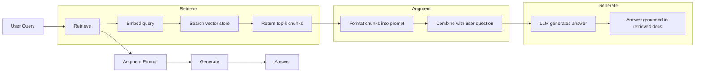
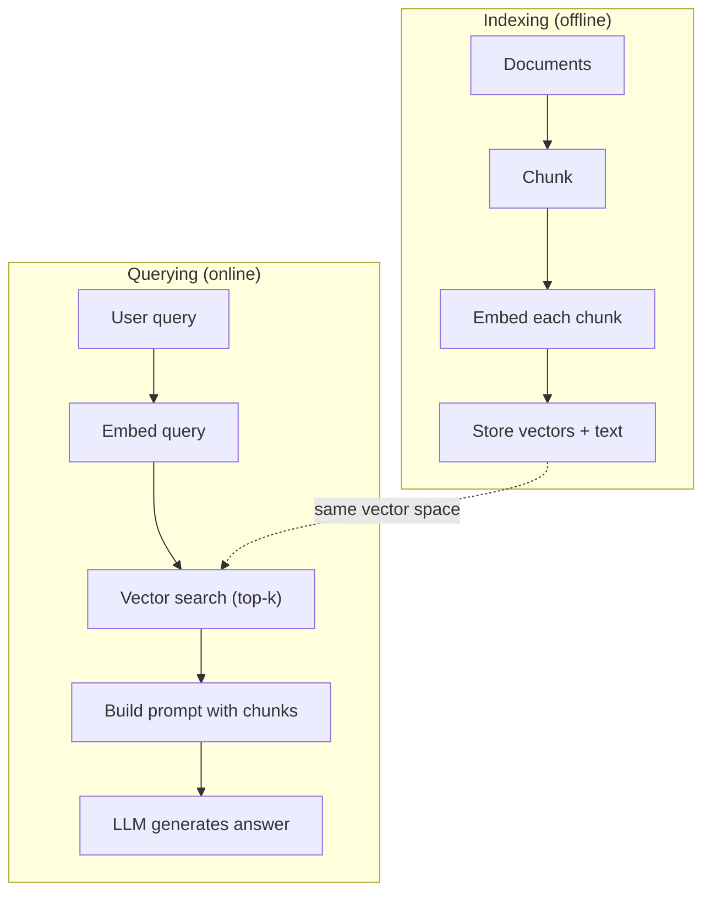

# (RAG) (الجيول المُعززة للإنعاش) 检索增强生成

> ماجستيرك في التدريب يعرف كل شيء حتى وقت التدريب. لا يعرف أي شيء عن وثائق شركتك، قاعدة التعليمات الخاصة بك، أو ملاحظات الاجتماع الأسبوع الماضي. يقوم RAG بحل هذا عن طريق استرداد الوثائق ذات الصلة ووضعها في المشاركة. إنه النمط الأكثر انتشارًا في الإنتاج الذكاء الاصطناعي. إذا قمت ببناء شيء من هذه الدورة، قم ببناء خط أنابيب RAG.

> **【中文解读】**ماجستير في إدارة الأعمال فقط يعرف التدريب截止日期前的信息──RAG 通过检查相关文档并注入提示来弥补知识缺口──这是最广泛的生产环境部署 AI 模式如果你只学一件事,就学RAG──

> **【拓展：RAG→企业AI应用】**RAG هو أول خطة اختيار للشركات التي تتخذ من الذكاء الاصطناعي: معلومات المعلومات والمسائل والمعاهدات والمساعدات في المستندات التقنية والتحليلات المالية والتحليلات المالية.

>  **【前置】**學本節前请先掌握:(1) المرحلة 11·04(التركيبات)  فهم 量空间、相似度、HNSW;(2) المرحلة 05·23(استراتيجيات التمزيق)  فهم文档切分;(3) المرحلة 10(LLM من الصفر)  فهم سريع 如何影响生成──本节会用到 `chromadb`أو`faiss`.`langchain`أو`llamaindex`.

**Type:** Build | **类型:** 构建
**Languages:** Python | **语言:** Python
**Prerequisites:** Phase 10 (LLMs from Scratch), Phase 11 Lessons 01-05 | **前置知识:** Phase 10（从零理解 LLM）、Phase 11 Lesson 01-05
**Time:** ~90 minutes | **时间:** ~90 分钟
**Related:**المرحلة 5 · 23 (استراتيجيات التجزئة لـ RAG) للخوارزميات الستة التي تقوم بتجزئة وتفوز كل منها. المرحلة 5 · 22 (إمبيدينغ موديلز غوص عميق) لانتخاب المُضمن. المرحلة 11 · 07 (إمبيدينغ راج) للبحث الهجري وإعادة التصنيف وتحويل المُسائل.**相关:**المرحلة 5 · 23(RAG 分块策略)介绍六种分块算法及各自适用场景――Phase 5 · 22(嵌入模型深度解析)介绍如何选择嵌入器――Phase 11 · 07(高级RAG)介绍混合搜索、重排和查询转换──

## أهداف التعلم

- بناء خط أنابيب RAG كامل: تحميل الوثائق، التجزئة، الإضافة، تخزين المتجهات، الاستعراض، وتوليدها
  构建完整 RAG 管线:文档加载、分块、嵌入、向量存储、检索、生成
- تنفيذ البحث الترقمي باستخدام قاعدة بيانات متجهة (ChromaDB أو FAISS أو Pinecone) مع الترتيب المناسب
  استخدام حجم البيانات المستندة إلى ChromeDB أو FAISS أو Pinecone)实现语义搜索并正确索引
- شرح لماذا يفضل استخدام RAG على التكيف الدقيق للتطبيقات القائمة على المعرفة (تكلفة، طازجة، إصدار)
  解释为什么知识接地应用更好RAG而不是微调(成本、新鲜度、归因)
- تقييم جودة المجموعة باستخدام مقاييس الاسترداد (الدقة والإستدعاء) ومقياسات التوليد (الوفاء والساهة)
  تستخدم معايير التحقق من الدقة والتذكر و إنتاج معايير الوفاء والساهلية لتقييم RAG

> **【中文解读】**هدف هذا الدراسة: تحقيق RAG كاملة (تعميق عملية الوصول إلى المعلومات)


## المشكلة المشكلة المشكلة

تقوم ببناء روبوت دردشة لشركتك. يسأل عميل "ما هي سياسة استرداد المبلغ للخطط المؤسسية؟" يستجيب LLM بإجابة عامة حول سياسات استرداد SaaS النموذجية. السياسة الفعلية ، مدفونة في ويكي داخلي من 200 صفحة ، تقول أن عملاء المؤسسات يحصلون على نافذة 60 يومًا مع استردادات معدل. لم يرى LLM هذا الوثيقة قط. لا يمكنه معرفة ما لم يتم تدريبه عليه.

> هل قمت ببناء جهاز دردشة للشركة. . . . يسأل العملاء "ما هي سياسة إعادة الائتمان في إصدار الشركة؟" . . . . . . . . . . . . . . . . . . . . . . . . . . . . . . . . . . . . . . . . . . . . . . . . . . . . . . . . . . . . . . . . . . . . . . . . . . . . . . . . . . . . . . . . . . . . . . . . . . . . . . . . . . . . . . . . . . . . . . . . . . . . . . . . . . . . . . . . . . . . . . . . . . . . . . . . . . . . . . . . . . . . . . . . . . . . . . . . . . . . . . . . . . . . . . . . . . . . . . . . . . . . . . . . . . . . . . . . . . . . . . . . . . . . . . . . . . . . . . . . . . . . . . . . . . . . . . . . . . . . . . . . . . . . . . . . . . . . . . . . . . . . . . . . . . . . . . . . . . . . . . . . . . . . . . . . . . . . . . . . . . . . . . . . . . . . . . . . . . . . . . . . . . . . . . . . . . . . . . . . . . . . . . . . . . . . . . . . . . . . . . . . . . . . . . . . . . . . . . . . . . . . . . . . . . . . . . . . . . . . . . . . . . . . . . . . . . . . . . . . . . . . . . . . . . . . . . . . . . . . . . . . . . . . . . . .

التنسيق الدقيق هو حل واحد. خذ ماجستير في الأعمال، تدرب عليه على وثائقك الداخلية، ونشر النموذج المحديث. هذا يعمل ولكن لديه مشاكل خطيرة. التنسيق الدقيق يكلف الآلاف من الدولارات في الحساب. يصبح النموذج قديم في اللحظة التي يتغير فيها مستند. ليس لديك طريقة لمعرفة من أي مصدر استخرج النموذج. وإذا حصلت الشركة على خط منتج آخر الشهر المقبل، تقوم بتنسيق الدقيق مرة أخرى.

> 微调是一种 حل. ولكن التغييرات الصغيرة تحتاج إلى آلاف الدولارات من التكلفة الحسابية.

(راج) هو الحل الآخر اترك النموذج دون ملامسة عندما يظهر سؤال، ابحث في مخزن الوثائق عن المقاطع ذات الصلة، ورسمها في المشاركة قبل السؤال، ودع النموذج يجيب باستخدام تلك المقاطع كسياق. يمكن تحديث مخزن الوثائق في دقائق. يمكنك أن ترى بالضبط ما هي الوثائق التي تم استردادها. النموذج نفسه لا يتغير أبداً هذا هو السبب في أن RAG هو النمط المهيمن في الإنتاج: هو أرخص، أكثر طفرة، أكثر مراجعة، ويعمل مع أي ماجستير.

> RAG هو حل آخر. الحفاظ على النموذج ثابت. عندما تأتي المشاكل، فبحث في مخزن المستندات الخاصة بك عن المواد ذات الصلة، ورسمها إلى واجهة المشكلة، دع النموذج يستخدم هذه المواد على النحو السفلي للإجابة.

>  **【类比】**RAG 像开卷考试: طالب (LLM) ليس على الاطلاق وضع كل الدروس خلفها ((تحسينات) ، ولكن مع إحدى المواد التدريبية (المناسبة) للدخول.

## المفهوم الأساسي

> **【中文解读】**RAG(التحقيق-الإنتاج المزدوج، والتحقيق زيادة) سوف يجمع المعلومات الخارجية مع LLM 结合: المستخدم يسأل إلى من المستندات المتعلقة باختبار المعلومات المتعلقة بمحيط البيانات إلى إدخال نتائج الاختبار على الفور إلى LLM  على أساس نتائج الاختبار إنتاج الإجابة.

> **【拓展：RAG 的生产实践】**典型 RAG 管线:文档切分(chunking) إلى嵌入生成到量存储(Pinecone/Weaviate/Chroma) إلى相似度检索到重排序(تقييم) إلى注入 prompt。LlamaIndex 和 LangChain هي الأكثر شعبية RAG 框架──بحوث الميثا تظهر RAG على المهام المكثفة المعرفة ستزيد من الادقة 30-50%──


### نمط RAG

النمط كله يناسب في أربعة خطوات:

> كل هذا يتعلق بالخطوة:



استفسار -> استرداد -> إضافة إلحاح -> توليد. يتبع كل نظام RAG هذا النمط. الاختلافات بين أنظمة RAG الإنتاج هي في تفاصيل كل خطوة: كيفية تشكيل، كيفية إدراج، كيفية البحث، وكيفية بناء الإرشاد.

> 查询 -> 检索 -> 增强提示 -> 生成── كل نظام RAG 系统都遵循 هذا النموذج── إنتاج اختلافات في نظام RAG 系统 في كل خطوة التفاصيل: كيف تقسيم الكتل 如何嵌入 如何搜索 如何构建提示──

> 🤔 **【困惑】**س: لماذا لا تضع الملف كله مباشرة في الفور؟ الآن كلود لديه 200 ألف دولار على النافذة التالية، ضعها في الأسفل؟**精度下降** دراسة تظهر (((مثل Lost in the Middle, Liu et al. 2023) ، وقدرة LLM في长上下文中召回中间内容 بشكل ملحوظ انخفضت ، تجاوزت 32K 后准确率掉20%+ ؛(2) **成本爆炸**200 ألف رمز 输入约 $3/查询，而 RAG 检索 top-5 块只占 2K tokens（$03) ؛(3) **响应慢**长 prompt 推理延迟数倍于短 prompt。RAG 用精准检索换全量加载。

### لماذا يُفوق الرق على التنسيق الجيد

| Concern | Fine-tuning | RAG |
|---------|------------|-----|
| Cost / 成本 | $1,000-$100,000+ per training run / 每训练 1K-100K+ 美元 | $0.01-$0.10 per query (embedding + LLM) / 每查询 0.01-0.10 美元 |
| Freshness / 新鲜度 | Stale until retrained / 重训前都过时 | Updated in minutes by re-indexing docs / 重新索引文档即可在几分钟内更新 |
| Auditability / 可审计性 | Cannot trace answer to source / 无法追溯答案来源 | Can show exact retrieved passages / 可显示精确检索段落 |
| Hallucination / 幻觉 | Still hallucinates freely / 仍自由幻觉 | Grounded in retrieved documents / 基于检索文档接地 |
| Data privacy / 数据隐私 | Training data baked into weights / 训练数据固化在权重中 | Documents stay in your vector store / 文档留在你的向量存储中 |

تغيير التنسيق الدقيق وزن النموذج بشكل دائم. تغيير RAG سياق النموذج مؤقتا. بالنسبة لمعظم التطبيقات، سياق مؤقت هو ما تريد.

> 微调永久改变模型权重──RAG 临时改变模型上下文──对大多数应用,临时上下文就是你要的──

الحالة الوحيدة التي يفوز فيها التنسيق الدقيق: عندما تحتاج إلى نموذج لتمثيل نمط أو نغمة أو نمط معين لا يمكن تحقيقه عن طريق الإستغناء وحده.

> الحالة الوحيدة التي تُفوز فيها: عندما تحتاج إلى نموذج يتبنى نمطاً محدداً أو نمطاً أو نمطاً للتفكير، فهذا لا يمكن تحقيقه إلا عن طريق النص.

> ️ **【易错点】**3 قاعات عادية في منطقة الرأس**切分粒度错误**块太大(> 1024 رمز)嵌入被稀释召回不到,块太小(< 64 رمز)丢失上下文;起点:256-512 رمز + 50 重叠。(2) **没做 query 改写** المستخدم يسأل " كيف يستخدم؟" 指代不明,向量库找不到;修复:先用 LLM 把问题改写成包含上下文的完整查询──(3) **只看召回率不看准确率**أعلى 10 召回 90% ولكن فقط 3 条相关,模型被噪音干扰幻觉;加跨编码重排到前3 高质量块──

### إضافة النماذج

نموذج إضافة يحول النص إلى متجه كثيف. تنتج نصوص مماثلة متجهات قريبة من بعضها البعض في هذا الفضاء العالي الأبعاد. "كيف أعيد تعيين كلمة المرور الخاصة بي؟" و "يجب أن أغير كلمة المرور الخاصة بي" ينتج متجهات متطابقة تقريبًا على الرغم من مشاركة عدد قليل من الكلمات. "الجروة جلست على المصفاة" تنتج متجهًا مختلفًا تمامًا.

> 嵌入模型将文本转化为密向量──类似文本在这个高维空间产生距离接近的向量──"كيف أعيد وضع رمز؟"和"我需要修改密码" على الرغم من عدم وجود العديد من الكلمات المشتركة، إلا أنها تولد نفس الجهاز تقريبا ً──"قطة جلست على 子" تولد قطعة مختلفة تماما ً──

نماذج التثبيت المشتركة (تصنيف 2026)  انظر المرحلة 5 · 22 للحصول على تحليل كامل):

> 常见嵌入模型(2026 年阵容完整分析见阶段 5 · 22):

| Model | Dimensions | Provider | Notes |
|-------|-----------|----------|-------|
| text-embedding-3-small | 1536 (Matryoshka) | OpenAI | Best price/performance for most use cases / 大多数场景最佳性价比 |
| text-embedding-3-large | 3072 (Matryoshka) | OpenAI | Higher accuracy, truncatable to 256/512/1024 / 更高精度，可截断到 256/512/1024 |
| Gemini Embedding 2 | 3072 (Matryoshka) | Google | Top MTEB retrieval; 8K context / 顶级 MTEB 检索；8K 上下文 |
| voyage-4 | 1024/2048 (Matryoshka) | Voyage AI | Domain variants (code, finance, law) / 领域变体（代码、金融、法律）|
| Cohere embed-v4 | 1024 (Matryoshka) | Cohere | Strong multilingual, 128K context / 强多语言，128K 上下文 |
| BGE-M3 | 1024 (dense + sparse + ColBERT) | BAAI (open-weight) | Three views from one model / 一个模型三种视图 |
| Qwen3-Embedding | 4096 (Matryoshka) | Alibaba (open-weight) | Top open-weight retrieval score / 顶级开源权重检索分数 |
| all-MiniLM-L6-v2 | 384 | Open-weight (Sentence Transformers) | Prototyping baseline / 原型基线 |

لهذا الدروس، نُبني إضافة بسيطة خاصة بنا باستخدام TF-IDF. ليس لأن TF-IDF هي ما تستخدمه أنظمة الإنتاج، ولكن لأنه يجعل المفهوم ملموساً: النص يدخل، والمتجه يخرج، والنصوص المماثلة تنتج متجهات مماثلة.

> في هذا الدروس نستخدم TF-IDF لإنشاء إدخالات بسيطة لنفسي. ليس لأن TF-IDF هو نظام إنتاج يستخدم، ولكن لأنه يجعل المفهوم ملموس: النص يدخل، النص يخرج، النص يشبه النص ينتج مثل النص.

### تشابه المتجه

نظرا لمتجهين، كيف تقيسين التشابه؟ ثلاثة خيارات:

> 给定两个向量, كيفية قياس التشابه؟

**Cosine similarity**: كوسينز الزاوية بين متجهين. يتراوح من -1 (العكس) إلى 1 (وحيد). يتجاهل الحجم، لا يهتم فقط بالاتجاه. هذه هي الافتراض الافتراضي لـ RAG.

> **余弦相似度**: اثنين من حوافز الحدود المتعددة.

```
cosine_sim(a, b) = dot(a, b) / (||a|| * ||b||)
```

**Dot product**: المنتج الداخلي الخام. المتجهات الكبيرة تحصل على درجات أعلى. مفيدة عندما يحمل الحجم المعلومات (قد تكون الوثائق أطول أكثر أهمية).

> **点积**:أصل داخل ⋅أعلى حجم ⋅أعلى حجم ⋅أعلى حجم ⋅أعلى حجم ⋅أعلى حجم ⋅أعلى حجم ⋅أعلى حجم ⋅أعلى حجم ⋅أعلى حجم ⋅أعلى حجم ⋅أعلى حجم ⋅أعلى حجم ⋅أعلى حجم ⋅أعلى حجم ⋅أعلى حجم ⋅أعلى حجم ⋅أعلى حجم ⋅أعلى حجم ⋅أعلى حجم ⋅أعلى حجم ⋅أعلى حجم ⋅أعلى حجم ⋅أعلى حجم ⋅أعلى حجم ⋅أعلى حجم ⋅أعلى حجم ⋅أعلى حجم ⋅أعلى حجم ⋅أعلى حجم ⋅أعلى حجم ⋅أعلى حجم ⋅أعلى حجم ⋅أعلى حجم ⋅أعلى حجم ⋅أعلى حجم ⋅أعلى حجم ⋅أعلى حجم ⋅أعلى حجم ⋅أعلى حجم ⋅أعلى حجم ⋅أعلى حجم ⋅أعلى ⋅أعلى ⋅

```
dot(a, b) = sum(a_i * b_i)
```

**L2 (Euclidean) distance**: مسافة خط مستقيم في الفضاء المتجه. مسافة أصغر = أكثر شبيهة. حساسة لفرق الكبيرة.

> **L2（欧氏）距离**: المسافة المباشرة في المجال الحدودي. المسافة أكثر مماثلة.

```
L2(a, b) = sqrt(sum((a_i - b_i)^2))
```

تشابه الكوزين هو المعيار. يتعامل مع المستندات من أطول مختلفة بجد لأنه يطبيع من حيث الحجم. عندما يقول شخص ما "البحث عن المتجهات،" يقصدون تقريبا دائما تشابه الكوزين.

> 余弦相似度是标准──它优雅处理不同长度文档,因为它按幅度归结──当有人说"向量搜索",几乎总是指余弦相似度──

### استراتيجيات التجزئة

المستندات طويلة جداً لتدمجها كمتنقل واحد. قد ينتج PDF من 50 صفحة إدمجًا فظيعًا لأنه يحتوي على عشرات الموضوعات. بدلاً من ذلك، تقوم بتقسيم المستندات إلى قطع وتدمج كل جزء بشكل منفصل.

> الملف طويل جداً، لا يمكن إدخاله كقطعة واحدة. 50 صفحة PDF قد تكون إدخالًا سيئًا، لأنه يحتوي على عدة عشرات من المواضيع. على العكس من ذلك، ستقوم بتقسيم الملف إلى كتلة، وتدخله إلى كل كتلة.

**Fixed-size chunking**: تقسيم كل رموز N. بسيطة وقابلة للتنبؤ. جزء من 512 رمزا مع 50 رمزا تتداخل يعني الجزء 1 هو رموز 0-511، الجزء 2 هو رموز 462-973، وهلم جرا. التداخل يضمن عدم تقسيم جملة على حدة غير محظوظ.

> **固定大小分块**: كل رمز N 拆分一次──简单可预测──512 رمز 块加 50 رمز 重叠 يعني بلاك 1 هو رمز 0-511, بلاك 2 هو رمز 462-973, حسب هذا النوع من التوصيات──重叠 ضمان أنك لن تكون في الحدود المفاجئة للخطوط

**Semantic chunking**: تقسيم على الحدود الطبيعية. الفقرات، القسمات، أو العناوين التميز. كل جزء هو وحدة متماسكة من المعنى. أكثر تعقيدا لتنفيذ ولكن ينتج استرداد أفضل.

> **语义分块**: في الحدود الطبيعية الانفصال. 段落、章节 أو Markdown 标题.  प्रत्येक块 هو واحد من المعاني المتسلسل.

**Recursive chunking**: حاول تقسيم في الحدود الأكبر أولاً (رؤوس القسم). إذا كان القسم ما زال كبيرًا جدًا، فقسم في حدود الفقرات. إذا كان الفقرة ما زال كبيرة جدًا، فقسم في حدود الجملة. هذا هو نهج LangChain RecursiveCharacterTextSplitter وهو يعمل بشكل جيد في الممارسة العملية.

> **递归分块**:先在最大边界(章节标题) تفريق.若节仍太大,在段落边界拆分.若段落仍太大,在句子边界拆分.

حجم الجزء مهم أكثر مما يعتقد الناس:

> 块大小 أكثر أهمية من ما يعتقد الناس:

- ضئيلة جداً (64-128 رمزاً): كل قطعة تفتقر إلى السياق. "لقد زاد بنسبة 15% في الربع الماضي" لا يعني شيئاً دون معرفة ما يشير إليه "إنه".
  太小(64-128 رمز): كل قطعة لا يوجد فيها على النحو التالي.
- الكبير جداً (2048 + رموز): كل جزء يغطي مواضيع متعددة، مما يضعف الصلة. عندما تبحث عن بيانات الإيرادات، تحصل على جزء هو 10% عن الإيرادات و 90% عن عدد العاملين.
  太大(2048+ توكن): كل بلاك يغطي العديد من الموضوعات، نادرة Release Relevancy.
- نقطة حلوة (256-512 رمزا): سياق كافٍ لتكون ذاتية، ومركزة بما فيه الكفاية لتكون ذات صلة.
  النقطة الرائعة ((256-512 رمز): كافى عن نفسه على نطاق ما يلي، كافى عن التركيز على الارتباط.

معظم أنظمة الإنتاج RAG تستخدم 256-512 قطعة رمزية مع تداخل 50 رمز. توصي إرشادات RAG من Anthropic بهذا النطاق.

> 大多数生产 RAG 系统 باستخدام 256-512 رمز 块加 50 رمز 重叠──Anthropic 的 RAG 指南推这个范围──

### قواعد بيانات المتجهات

بمجرد أن يكون لديك إضافة، تحتاج إلى مكان لتخزينها وتبحث عنها.

> بمجرد أن تكون لديك إضافة، تحتاج إلى مكان تخزين ومبحثها.

| Database | Type | Best for |
|----------|------|----------|
| FAISS | Library (in-process) / 库（进程内）| Prototyping, small to medium datasets / 原型、中小数据集 |
| Chroma | Lightweight DB / 轻量 DB | Local development, small deployments / 本地开发、小型部署 |
| Pinecone | Managed service / 托管服务 | Production without ops overhead / 无运维开销的生产 |
| Weaviate | Open source DB / 开源 DB | Self-hosted production / 自托管生产 |
| pgvector | Postgres extension / Postgres 扩展 | Already using Postgres / 已在用 Postgres |
| Qdrant | Open source DB / 开源 DB | High-performance self-hosted / 高性能自托管 |

لهذا الدروس ، قمنا ببناء متجر متجه بسيط في الذاكرة. فإنه يحتفظ بالمتجهات في قائمة ويقوم باحث عن تشابه الكوسينات القوة الخامة. هذا يعادل FAISS مع مؤشر مسطح. يتناسب إلى ربما 100,000 متجه قبل أن يصبح بطيء. تستخدم أنظمة الإنتاج خوارزميات القريبة القريبة (ANN) مثل HNSW للبحث عن ملايين المتجهات في ملايين الثوان.

> في هذا الدروس قمنا ببناء مخزن محمول بسيط للنقل القياسي. سوف يتمكن من البحث عن شبيهات الحقل القياسي في القائمة. وهذا يساوي البحث عن شبيهات الحقل القياسي في المصفوفات.

### خط الأنابيب الكامل



مرحلة الترتيب يتم تنفيذها مرة واحدة لكل وثيقة (أو عند تحديث الوثائق). مرحلة الاستفسار تمت على كل طلب من المستخدمين. في الإنتاج، قد يعالج الترتيب الملايين من الوثائق على مدار ساعات. يجب أن يستجيب الاستفسار في أقل من ثانية.

> المرجع المرجع المرجع المرجع المرجع المرجع المرجع المرجع المرجع المرجع المرجع المرجع المرجع المرجع المرجع المرجع المرجع المرجع المرجع المرجع المرجع المرجع المرجع المرجع المرجع المرجع المرجع المرجع المرجع المرجع المرجع المرجع المرجع المرجع المرجع المرجع المرجع المرجع المرجع المرجع المرجع المرجع المرجع المرجع المرجع المرجع المرجع المرجع المرجع المرجع المرجع المرجع المرجع المرجع المرجع المرجع المرجع المرجع المرجع المرجع المرجع المرجع المرجع المرجع المرجع المرجع المرجع المرجع المرجع المرجع المرجع المرجع المرجع المرجع المرجع المرجع المرجع المرجع المرجع المرجع المرجع المرجع المرجع المرجع المرجع المرجع المرجع المرجع المرجع المرجع في غض

### الأرقام الحقيقية

معظم أنظمة RAG الإنتاجية تستخدم هذه المعايير:

> معظم الإنتاج RAG 系统 باستخدام هذه العناصر:

- **k = 5 to 10**قطع متقطعة لكل استفسار
  كل استفسار استفسار 5-10 块
- **Chunk size = 256 to 512 tokens**مع تعليق 50 رمز
  块大小 256-512 رمز إضافة 50 رمز 重叠
- **Context budget**: 2500 - 5000 رمز من المحتوى المسترد لكل استفسار
  上下文 الميزانية: لكل استفسار 2500-5000 رمز  مراجعة المحتوى
- **Total prompt**: ~ 8,000-16,000 رموز (مواصلة النظام + قطع استرداد + تاريخ المحادثة + استفسار المستخدم)
  总提示: حوالي 8000-16,000 رمز ((نظام提示 + 检索块 + 对话历史 + 用户查询)
- **Embedding dimension**: 384-3072 اعتمادا على النموذج
  嵌入维度:384-3072 取决于模型
- **Indexing throughput**: 100-1,000 وثيقة في الثانية مع إدخال API
  索引吞吐量: استخدام API 嵌入每秒 100-1,000 文档
- **Query latency**: 50-200ms للحصول على، 500-3000ms للإنتاج
  查询延迟:检索 50-200ms، توليد 500-3000ms

## بناء ذلك تحرك لتحقيق
```figure
rag-chunking
```

## بناءها

### الخطوة الأولى: تحديد الوثائق

```python
def chunk_text(text, chunk_size=200, overlap=50):
    words = text.split()
    chunks = []
    start = 0
    while start < len(words):
        end = start + chunk_size
        chunk = " ".join(words[start:end])
        chunks.append(chunk)
        start += chunk_size - overlap
    return chunks
```

### الخطوة الثانية: إدخال TF-IDF

نُبني وظيفة إضافة بسيطة. TF-IDF (تردد المدة العكسي المقابل المستندية) ليس إضافة عصبية، ولكنه يغير النص إلى متجهات بطريقة تلتقط أهمية الكلمات. الكلمات المتكررة في مستند تحصل على أعلى TF. الكلمات النادرة عبر الجسم تحصل على أعلى IDF. المنتج يعطي متجه حيث الكلمات المهمة المميزة لها قيم عالية.

> نحن نبني وظيفة إدخال بسيطة.TF-IDF ({\displaystyle \frequency-reverse }) ليست إدخال عصبي، ولكنها تقوم بتحويل المقال إلى محور على طريقة أهمية الكلمات.

> 🤔 **【困惑】**س: لماذا تعلّم باستخدام TF-IDF بدلاً من إدخال عصبي حقيقي مثل OpenAI؟**零依赖**本节用纯 Python 标准库教学,不要求你注册 API或下模型;(2) **可读**TF-IDF                                                                                                                                                                                                                                                            **教学聚焦**本节核心是 RAG 流程(chunk→embed→retrieve→prompt→generate),嵌入器换掉流程不变──**生产环境务必换神经嵌入**TF-IDF 不理解语义, "付款失败" و"扣款不成功" في TF-IDF 下完全不匹配, ولكن العصبية في غلافها يمكن أن تعرفهم نفس المعنى.

```python
import math
from collections import Counter

def build_vocabulary(documents):
    vocab = set()
    for doc in documents:
        vocab.update(doc.lower().split())
    return sorted(vocab)

def compute_tf(text, vocab):
    words = text.lower().split()
    count = Counter(words)
    total = len(words)
    return [count.get(word, 0) / total for word in vocab]

def compute_idf(documents, vocab):
    n = len(documents)
    idf = []
    for word in vocab:
        doc_count = sum(1 for doc in documents if word in doc.lower().split())
        idf.append(math.log((n + 1) / (doc_count + 1)) + 1)
    return idf

def tfidf_embed(text, vocab, idf):
    tf = compute_tf(text, vocab)
    return [t * i for t, i in zip(tf, idf)]
```

### الخطوة الثالثة: البحث عن تشابهات الكوزين

```python
def cosine_similarity(a, b):
    dot = sum(x * y for x, y in zip(a, b))
    norm_a = math.sqrt(sum(x * x for x in a))
    norm_b = math.sqrt(sum(x * x for x in b))
    if norm_a == 0 or norm_b == 0:
        return 0.0
    return dot / (norm_a * norm_b)

def search(query_embedding, stored_embeddings, top_k=5):
    scores = []
    for i, emb in enumerate(stored_embeddings):
        sim = cosine_similarity(query_embedding, emb)
        scores.append((i, sim))
    scores.sort(key=lambda x: x[1], reverse=True)
    return scores[:top_k]
```

### الخطوة الرابعة: بناء سريع

هذا هو المكان الذي يحدث فيه "المزيد" في RAG. خذ القطع المكتسبة، وفرمجها في عرض، واطلب من ماجستير في العلوم الإجابة بناءً على السياق المقدم.

> هذا هو المكان الذي يحدث فيه "增强" في RAG.

> ️ **【易错点】**أُسْرِعُ 模板的 3 个坑:(1) **没说"基于上下文回答"**模型会调用自己的参数知识回答(产生幻觉),把 "الرد على أساس السياق التالي فقط" 加到 prompt 最前;(2) **没给"不知道就说不知道"的退路**模型宁可盲编也不承认无能为力,必须显式写 "إذا لم يحتوي السياق على إجابة، قل 'ليس لدي معلومات كافية'";(3) **没要求引用来源** الإجابة لا يمكن تعديلها، الفشل في المراجعة؛修复: مطلوب نموذج في الإجابة`[Source N]`标记,让用户能点开看原文.

```python
def build_rag_prompt(query, retrieved_chunks):
    context = "\n\n---\n\n".join(
        f"[Source {i+1}]\n{chunk}"
        for i, chunk in enumerate(retrieved_chunks)
    )
    return f"""Answer the question based ONLY on the following context.
If the context doesn't contain enough information, say "I don't have enough information to answer that."

Context:
{context}

Question: {query}

Answer:"""
```

### الخطوة 5: خط أنابيب RAG الكامل

```python
class RAGPipeline:
    def __init__(self):
        self.chunks = []
        self.embeddings = []
        self.vocab = []
        self.idf = []

    def index(self, documents):
        all_chunks = []
        for doc in documents:
            all_chunks.extend(chunk_text(doc))
        self.chunks = all_chunks
        self.vocab = build_vocabulary(all_chunks)
        self.idf = compute_idf(all_chunks, self.vocab)
        self.embeddings = [
            tfidf_embed(chunk, self.vocab, self.idf)
            for chunk in all_chunks
        ]

    def query(self, question, top_k=5):
        query_emb = tfidf_embed(question, self.vocab, self.idf)
        results = search(query_emb, self.embeddings, top_k)
        retrieved = [(self.chunks[i], score) for i, score in results]
        prompt = build_rag_prompt(
            question, [chunk for chunk, _ in retrieved]
        )
        return prompt, retrieved
```

### الخطوة 6: توليد (مثبت)

في الإنتاج، هذا هو المكان الذي تسميه API LLM. لهذا الدروس، نقوم بتحاكي الجيل عن طريق استخراج الجملة الأكثر ملاءمة من السياق المسترد.

> في المنتجات هذا هو مكان استخدام LLM API.

```python
def simple_generate(prompt, retrieved_chunks):
    query_words = set(prompt.lower().split("question:")[-1].split())
    best_sentence = ""
    best_score = 0
    for chunk in retrieved_chunks:
        for sentence in chunk.split("."):
            sentence = sentence.strip()
            if not sentence:
                continue
            words = set(sentence.lower().split())
            overlap = len(query_words & words)
            if overlap > best_score:
                best_score = overlap
                best_sentence = sentence
    return best_sentence if best_sentence else "I don't have enough information."
```

## استخدمها في إطار التنفيذ

مع نموذج إضافة حقيقي و ماجستير في العلوم، بالكاد يتغير الرمز:

> مع النموذج الحقيقي و LLM، الكود لا يتغير تقريبا:

```python
from openai import OpenAI

client = OpenAI()

def embed(text):
    response = client.embeddings.create(
        model="text-embedding-3-small",
        input=text
    )
    return response.data[0].embedding

def generate(prompt):
    response = client.chat.completions.create(
        model="gpt-4o-mini",
        messages=[{"role": "user", "content": prompt}],
        temperature=0
    )
    return response.choices[0].message.content
```

أو مع " الأنثروبيك "

> أو بالأنثروبية:

```python
import anthropic

client = anthropic.Anthropic()

def generate(prompt):
    response = client.messages.create(
        model="claude-sonnet-5",
        max_tokens=1024,
        messages=[{"role": "user", "content": prompt}]
    )
    return response.content[0].text
```

خط الأنابيب هو نفسه. تغيير وظيفة الإضافة. تغيير وظيفة توليد. منطق الاستخدام، التجزئة، بناء السرعة -- كل نفسها بغض النظر عن النموذج الذي تستخدم.

> 管线相同. 管线相同. 管线相同. 管线相同. 管线相同. 管线相同. 管线相同. 管线相同. 管线相同. 管线相同. 管线相同. 管线相同. 管线相同. 管线相同. 管线相同. 管线相同. 管线相同. 管线相同. 管线相同. 管线相同. 管线相同. 管线相同. 管线相同. 管线相同. 管线相同. 管线相同. 管线相同. 管线相同. 管线相同. 管线相同. 管线相同. 管线. 管线. 管线. 管线. 管线. 管线. 管线. 管线. 管线. 管线. 管线. 管. 管. 管. 管. 管. 管. 管. 管. 管. 管. 管. 管. 管. 管. 管. 管. 管. 管. 管. 管. 管. 管. 管. 管. 管. 管. 管. 管. 管.

لخزن المتجهات على نطاق واسع، قم باستبدال البحث عن القوة الخامة بمدينة بيانات متجهات مناسبة:

>  بالنسبة لخزن الكمية الكبيرة، باستخدام قاعدة بيانات الكمية المناسبة

```python
import chromadb

client = chromadb.Client()
collection = client.create_collection("my_docs")

collection.add(
    documents=chunks,
    ids=[f"chunk_{i}" for i in range(len(chunks))]
)

results = collection.query(
    query_texts=["What is the refund policy?"],
    n_results=5
)
```

تقوم Chroma بمعالجة الإضافة داخلياً (إنها تستخدم كل MiniLM-L6-v2 بشكل افتراضي) وتخزين المتجهات في قاعدة بيانات محلية. نفس النمط، مختلفة التبني.

> Chroma 内部处理嵌入式 (默认使用全MiniLM-L6-v2)并将向量存在本地数据库──相同模式,不同管道──

## أرسلها .

هذا الدرس ينتج عن:
- `outputs/prompt-rag-architect.md`-- طلب لتصميم أنظمة RAG لحالات الاستخدام المحددة
  لمثال معين تصميم RAG 系统的提示
- `outputs/skill-rag-pipeline.md`-- مهارة تعلّم العملاء كيفية بناء وتحليل خط الأنابيب RAG
  تدريس كيفية بناء وتحديث مهارات RAG

## تمارين التدريب

1. استبدل إدخالات TF-IDF بنهج بسيط من كلمات (المركز الثنائي: 1 إذا كان الكلمة موجودة، 0 إذا لم تكن موجودة). مقارنة جودة الاستخدام على المستندات العينة. يجب أن تفوق TF-IDF لأنها تراجعت الكلمات النادرة أعلى.
   استخدام طريقة بكراتة كلمة (二值:词出现为 1,否则为 0) استبدال TF-IDF 嵌入──在样本文档上比较检索质量──TF-IDF 应胜出,因为它给稀有词更高权重──

2. تجربة مع حجم الجزء: حاول 50، 100، 200، و 500 كلمة على نفس مجموعة الوثائق. لكل حجم، قم بتشغيل نفس 5 استفسارات و احتساب عدد العائدات التي تعود إلى الجزء ذي الصلة في الجزء العلوي 3.
   实验块大小:试 50、100、200、500 词在同一文档集中. 试 50、100、200、500 词. 试 5 查询,试 5 查询,试 5 查询,试试 5 个试题,试试 5 个试题,试试 试试 试试 试试 试 试 试 试 试 试 试 试 试 试 试 试 试 试 试 试 试 试 试 试 试 试 试 试 试 试 试 试 试 试 试 试 试 试 试 试 试 试 试 试 试 试 试 试 试 试 试 试 试 试 试 试 试 试 试 试 试 试 试 试 试 试 试 试 试 试 试 试 试 试 试 试 试 试 试 试 试 试 试 试 试 试 试 试 试 试 试 试 试 试 试 试 试 试 试 试 试 试 试 试 试 试 试 试 试 试 试 试 试 试 试 试 试 试 试 试 试 试 试 试 试 试 试 试 试 试 试 试 试 试 试 试 试 试 试 试 试 试 试 试 试 试 试 试 试 试 试 试 试 试 试 试 试 试 试 试 试 试 试 试 试 试 试 试 试 试 试 试 试 试 试 试 试 试 试 试 试 试 试 试 试 试 试 试 试 试 试 试 试 试 试 试 试 试 试 试 试 试 试 试 试 试 试 试 试 试 试 试 试 试 试 试 试 试

3. إضافة البيانات المعدنية لكل جزء (اسم الوثيقة المصدرة ، موقع الجزء). تعديل القالب المطلوب لتشمل إصدار المصدر حتى يذكر الهيئة المصدر.
   给每块添加元数据(源文档名、块位置) 修改提示模板包含源归因,让LLM 引用其来源──

4. تنفيذ تقييم بسيط: مع إعطاء 10 أزواج من الأسئلة والإجابات، قم بتشغيل كل سؤال من خلال خط أنابيب RAG، وقياس مدى نسبة المئات من الكسوف التي تم استردادها تحتوي على الإجابة. هذا هو استرداد الاسترداد عند k.
   实现简单评估:给定 10 个问答对,将每个问题通过RAG管线运行,测量检索块包含答案的百分比――这是检索 recall@k。

5. بناء خط أنابيب RAG واعية للحوار: الحفاظ على تاريخ من 3 الصفقات الأخيرة وإدراجها في المشاركة إلى جانب القطاعات التي تم استردادها. اختبار مع أسئلة متابعة مثل "ماذا عن الشركة؟" بعد طرح الأسعار.
   构建对话感知 RAG 管线:维护近 3次交换历史,与检索块一起包含在提示中.

## شروط الرئيسية

| Term | What people say | What it actually means | 中文释义 |
|------|----------------|----------------------|---------|
| RAG | "AI that reads your docs" | Retrieve relevant documents, paste them into the prompt, and generate an answer grounded in those documents | RAG：检索相关文档、粘贴进提示、基于这些文档生成接地答案 |
| Embedding | "Convert text to numbers" | A dense vector representation of text where similar meanings produce similar vectors | 嵌入：文本的稠密向量表示，相似含义产生相似向量 |
| Vector database | "Search engine for AI" | A data store optimized for storing vectors and finding the nearest neighbors by similarity | 向量数据库：为存储向量和按相似度找近邻优化的数据存储 |
| Chunking | "Split docs into pieces" | Breaking documents into smaller segments (typically 256-512 tokens) so each can be embedded and retrieved independently | 分块：将文档拆为更小段（通常 256-512 token）以便独立嵌入和检索 |
| Cosine similarity | "How similar are two vectors" | The cosine of the angle between two vectors; 1 = identical direction, 0 = orthogonal, -1 = opposite | 余弦相似度：两向量夹角余弦；1=同向，0=正交，-1=反向 |
| Top-k retrieval | "Get the k best matches" | Return the k most similar chunks to the query from the vector store | Top-k 检索：从向量存储返回与查询最相似的 k 个块 |
| Context window | "How much text the LLM can see" | The maximum number of tokens the LLM can process in a single request; retrieved chunks must fit within this | 上下文窗口：LLM 单次请求能处理的最大 token 数；检索块必须放得下 |
| Augmented generation | "Answer using given context" | Generating a response using retrieved documents as context rather than relying solely on trained knowledge | 增强生成：用检索文档作为上下文生成响应，而非仅依赖训练知识 |
| TF-IDF | "Word importance scoring" | Term Frequency times Inverse Document Frequency; weights words by how distinctive they are within a corpus | TF-IDF：词频乘逆文档频率；按词在语料库中的独特性加权 |
| Indexing | "Preparing docs for search" | The offline process of chunking, embedding, and storing documents so they can be searched at query time | 索引：分块、嵌入、存储文档的离线过程，以便查询时搜索 |

## المزيد من القراءة

- لويس وآخرون، "الإنتاج المُتزايد من أجل مهام النمط النووي المكثفة المعرفة" (2020) -- ورقة RAG الأصلية من بحث Facebook AI التي شكلت نمط الاسترداد ثم إنتاج
  لويس وغيره، "الإنعاش-التزايد الجيل لمهام المعرفة مكثفة النمط النووي" (2020) فيسبوك البحث الذكاء الاصطناعي الأصلي RAG 论文, شكلت الاولة الاختبار بعد توليد النمط
- وثائق RAG من Anthropic (docs.anthropic.com) -- إرشادات عملية لأحجام القطعة، والبناء السريع، والتقييم
  المعلومات المعلوماتية المعلوماتية المعلوماتية المعلوماتية المعلوماتية المعلوماتية المعلوماتية المعلوماتية المعلوماتية المعلوماتية المعلوماتية المعلوماتية المعلوماتية المعلوماتية المعلوماتية المعلوماتية المعلوماتية المعلوماتية المعلوماتية المعلوماتية المعلوماتية المعلوماتية المعلوماتية المعلوماتية المعلوماتية المعلوماتية المعلوماتية المعلوماتية المعلوماتية المعلوماتية المعلوماتية المعلوماتية المعلوماتية المعلوماتية المعلوماتية المعلوماتية المعلوماتية المعلوماتية المعلوماتية المعلوماتية المعلوماتية المعلوماتية المعلوماتية المعلوماتية المعلوماتية المعلوماتية المعلوماتية المعلوماتية المعلوماتية المعلوماتية
- مركز التعلم بينيكون، "ما هو RAG؟" -- تفسيرات بصرية واضحة لخط أنابيب RAG مع اعتبارات الإنتاج
  مركز تعليم Pinecone RAG 管线的清晰可视化解释,含生产考量
- جملة-BERT: Reimers & Gurevych (2019) -- ورقة وراء نماذج إدمج كل MiniLM، التي تظهر كيفية تدريب المرموزين الثنائيين للتشابه التمويلي
  جملة-BERT: Reimers & Gurevych(2019) جميع المينيلم 嵌入模型背后的论文,展示如何为语义相似度训练双编码器
- [Karpukhin et al., "Dense Passage Retrieval for Open-Domain Question Answering" (EMNLP 2020)](https://arxiv.org/abs/2004.04906)-- ورقة DPR التي أثبتت كثافة إعادة إعادة إعادة التشفير ثنائي المرموزات تفوق BM25 على المجال المفتوح QA ووضعت النمط لمتساعدات RAG الحديثة.
  كاربوخين 等، "DPR" ((EMNLP 2020)  دليل 密双编码器检索在开放域 QA 上胜过 BM25 的 DPR 论文,设定了现代RAG 检索器的模式──
- [LlamaIndex High-Level Concepts](https://docs.llamaindex.ai/en/stable/getting_started/concepts.html)-- المفاهيم الرئيسية التي يجب أن تعرفها عند بناء خطوط أنابيب RAG: محملات البيانات، مفصلات العقد، مؤشرات، استرداد، مختللي الاستجابة.
  LlamaIndex مفهوم عالي الدرجة بناء RAG 管线需要知的主要概念:数据加载器、节点解析器、索引、检索器、响应合成器──
- [LangChain RAG tutorial](https://python.langchain.com/docs/tutorials/rag/)-- أوركستراتر النكهة المعاكسة؛ سلسلة من الأدوات التشغيلية نظرة نفس استرداد ثم توليد نمط.
  LangChain RAG تعليمات مختلف طعم المعدات; نفس الاختبار الاول بعد توليد نمط可运行链视图──
