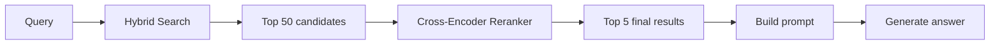
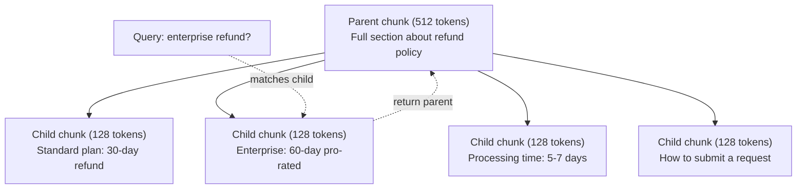
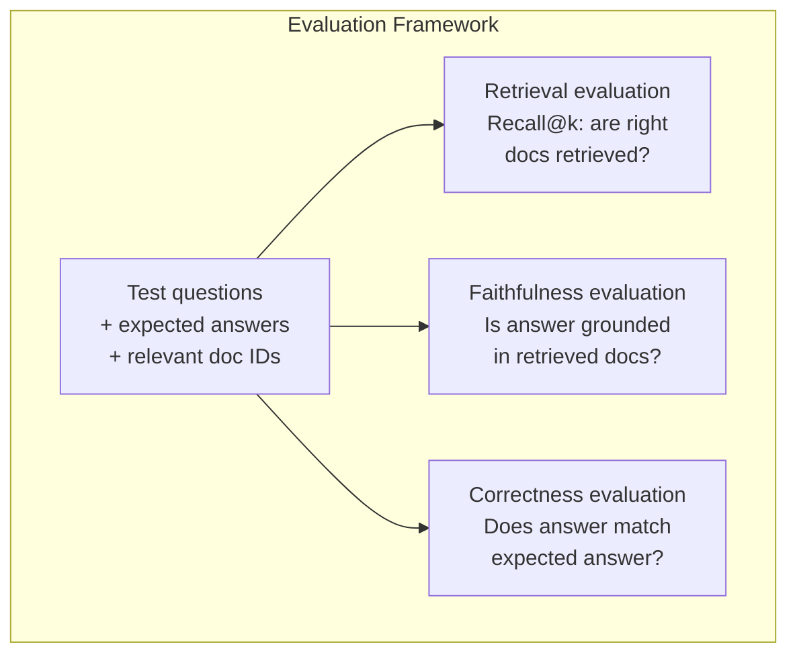

# متقدمة RAG (تخفيض، ترتيب، بحث هجين) ٠ ٠ ٠ ٠ ٠ ٠ ٠ ٠ ٠ ٠ ٠ ٠ ٠ ٠ ٠ ٠ ٠ ٠ ٠ ٠ ٠ ٠ ٠ ٠ ٠ ٠ ٠ ٠ ٠ ٠ ٠ ٠ ٠ ٠ ٠ ٠ ٠ ٠ ٠ ٠ ٠ ٠ ٠ ٠ ٠ ٠ ٠ ٠ ٠ ٠ ٠ ٠ ٠ ٠ ٠ ٠ ٠ ٠ ٠ ٠ ٠ ٠ ٠ ٠ ٠ ٠ ٠ ٠ ٠ ٠ ٠ ٠ ٠ ٠ ٠ ٠ ٠ ٠ ٠ ٠ ٠ ٠ ٠ ٠ ٠ ٠ ٠ ٠ ٠ ٠ ٠ ٠ ٠ ٠ ٠ ٠ ٠ ٠ ٠ ٠ ٠ ٠ ٠ ٠ ٠ ٠ ٠ ٠ ٠ ٠ ٠ ٠ ٠ ٠ ٠ ٠ ٠ ٠                                                                                                                                                                                                                                                                 

> يقوم RAG الأساسي باسترداد الجزء العلوي الأكثر تشابهًا. هذا يعمل على الأسئلة البسيطة. إنه ينفصل عن التفكير متعدد المكالمات، والسؤال الغامض، والجماعات الكبيرة. RAG المتقدمة هو الفرق بين عرض عرض يعمل على 10 وثائق ونظام يعمل على 10 ملايين.

> **【中文解读】**基础 RAG 检索 top-k 相似块,适用简单问题――但在多跳推理、歧义查询和大规模语料上会失效――高级RAG هو التمييز بين "10篇文档的演示" و"千万文档的生产系统"──

> **【拓展：高级RAG→金融场景】**تحليل المعلومات المالية تحتاج إلى المزيد من القفز على المعلومات ، والبحث المختلط

>  **【前置】**学本节前请先掌握:Phase 11·06(RAG) 理解基础RAG 流程。本节是其进阶,假设你已经能写出 chunk→embed→retrieve→prompt→generate 的最小可用RAG──会用 `chromadb`.`rank_bm25`.`sentence-transformers`أو`cohere`إعادة تصنيف API.

**Type:** Build | **类型:** 构建
**Languages:** Python | **语言:** Python
**Prerequisites:** Phase 11, Lesson 06 (RAG) | **前置知识:** Phase 11 · 06 (RAG)
**Time:** ~90 minutes | **时间:** ~90 分钟
**Related:**المرحلة 5 · 23 (استراتيجيات التجزئة لـ RAG) تغطي جميع خوارزميات التجزئة الستة  التجاوبية، والمعنى، والجملة، والوثيقة الأولي، والتجزئة المتأخرة، والحصول على السياق  مع المعايير المتطرفة لـ Vectara/Anthropic. هذه الدروس تبني على الأعلى: البحث الهجري، إعادة التصنيف، تحويل المسائل. ‬**相关:**المرحلة 5 · 23(RAG 分块策略) تغطي جميع الستة أنواع من الجهازات التنظيمية 递归、语义、句子、父文档、晚分块、上下文检索含вектара/أنثروپيك 基准──本课在其构建:混合搜索、重排、查询转换──

## أهداف التعلم

- تنفيذ استراتيجيات متقدمة لتحديد المواد (الترجمانية والتكريرية والوالدين والطفل) التي تحافظ على هيكل الوثائق والسياق
  实现 حفظ النظام المستند والقواعد المفصلة العليا للصيغة التالية
- بناء خط أنابيب بحث هجين يجمع بين مطابقة كلمات الرئيسية BM25 مع البحث المتجهة للنطقية وإعادة ترتيب المرموزات المتقاطعة
  构建结合 BM25 关键词匹配、语义向量搜索和交叉编码器重排器的混合搜索管线
- تطبيق تقنيات تحويل الاستفسارات (HyDE، متعددة الاستفسارات، خطوة إلى الوراء) لتحسين الاسترداد على الأسئلة المزجة أو المعقدة
  تطبيق استفسار تحويل التقنية ((HyDE、多查询、خطوة إلى الوراء) تحسين المشكلة الموضحة أو المعقدة
- تشخيص وإصلاح أخطاء RAG الشائعة: استرداد جزء خاطئ، الإجابة غير في سياق، تفكيك التفكير متعدد المكالمات
  诊断和修复常见RAG 失败:检索错块、答案不上下文中、多跳推理崩

> **【中文解读】**هدف هذا الدراسة: إتقان تقنية RAG الارتفاع  استفسار إعادة الكتابة  اختلاط الإستفسار  ترتيب إعادة التأهيل  تطابق الذات الإستفسار  تقرير 

>  **【类比】**基础 RAG 像新手图书管理员你说"营收",他按字面找带"营收"的书──高级RAG 像资深管理员:(1) **Query 改写**قول "营收", he翻译成"上一季度财报中的收入数字"再找;(2) **混合搜索**既翻主题目录(语义)又翻关键词索引(BM25),两边结果合并;(3) **重排** استدعاء 100 كتاب بعد،仔细看每本摘要排序挑出最相关 5 本(跨编码)

> ️ **【易错点】**3 个坑 高级 RAG: ((1) **HyDE 用错场景**HyDE(جعلي LLM أن يخلق افتراضات الإجابة واستخدامات الإجابة) في استفسارات حقيقية على عكس التهمة الإجراءات المضللة؛ فقط على مشكلة مفتوحة فعالة。(2) **重排模型选错** باستخدام المُرمّح الثنائي عندما يُعيد المُرمّح المتقاطع (مثل BGE-M3 نفسه) ، لم يحصل على تحسين دقة المُرمّح المتقاطع الحقيقي؛ باستخدام المُرمّح المتقاطع الخاص بـ BGE-v2、Cohere Rerank──(3) **混合搜索没归一化**BM25 分数 0-30،向量相似度 0-1,直接相加向量永远被淹没; باستخدام الاندماج المتبادل للدرجة (RRF) أو الـ min-max 归一化──

> 🤔 **【困惑】**س: 多跳推理该让模型做还是检查做? A: 检查做. 让模型在 prompt 里推理,每跳检查一次,把上一跳结果作为下一跳查询的输入. 例如:"哪个团队满意度提升最大?"→先检查"所有团队满意度分数"→让模型比较→得出"A 团队"→再检查"A 团队详细"──一跳一次检查,避免一次性塞所有可能相关文档──


## المشكلة المشكلة المشكلة

لقد بنيت خط أنابيب RAG في الدروس 06، يعمل على الأسئلة البسيطة على مجموعة صغيرة. الآن جرب هذه:

> أنت في الدورة 06                                                                                                                                                                                                                                                                                                                                                                                                                                                                                                                         

**Ambiguous query**: "ما كان الإيرادات الربع الماضي؟" البحث الدلالي يعود قطع عن استراتيجية الإيرادات، وتوقعات الإيرادات، ومفكرات المدير المالي على نمو الإيرادات. كل شيء مماثل بشكل معنوي للكلمة "إيرادات". لا يوجد أي منها يحتوي على العدد الفعلي. القسم الصحيح يقول "إيرادات الدلالي"$47.2M in Q3 2025" but uses the word "earnings" instead of "revenue." The embedding model thinks "revenue strategy" is closer to the query than "Q3 earnings were $47.2 م. "

> **模糊查询**:" كم هو الإيرادات في الربع الماضي؟" بحث لغوي يعود عن استراتيجية الإيرادات وتوقعات الإيرادات ومشاهدة المدير المالي عن رؤية الإيرادات في نمو الإيرادات

**Multi-hop question**: "أيه فريق كان لديه أكبر تحسن في درجة رضا العملاء؟" هذا يتطلب العثور على درجات رضا لكل فريق، مقارنة بينها، وتحديد أقصى حد. لا يوجد جزء واحد يحتوي على الإجابة. يتم توزيع المعلومات على تقارير الفريق.

> **多跳问题**:"أي فريق من الفريق يرفع أعلى تقديرات رضا العملاء؟" هذا يتطلب العثور على تقديرات رضا كل فريق، مقارنة معهم، وتحديد أقصى قيمة.

**Large corpus problem**لديك 2 مليون قطعة. الإجابة الصحيحة في الجزء #1,847,293. استردادك في 5 أعلى سحب القطعة # 14, #89,201, #1,200,000, #44, و #901,333. قريبة في مساحة التضمين، ولكن لا تحتوي على الإجابة. على هذه المقياسة، تقريبي قريب البحث يقدم خطأ كافيا أن النتائج ذات الصلة يتم دفع خارج أعلى-ك.

> **大型语料库问题**: لديك 200 مليون شريحة. الجواب الصحيح في المقطع رقم 1,847,293.

فشل RAG الأساسي لأن شبكة المتجهات ليست نفسها ذات الصلة. يمكن أن تكون جزء مماثلة من الناحية الدلوية إلى سؤال دون أن تكون مفيدة للإجابة عليه. تعالج RAG المتقدمة هذا الأمر باستخدام أربع تقنيات: البحث الهجري (إضافة مطابقة الكلمات الرئيسية) ، وإعادة التصنيف (سجل المرشحين بعناية أكبر) ، وتحويل الاستفسار (صلاح الاستفسار قبل البحث) ، والتحقيق الأفضل (الالتقاط عند الحجم الصحيح).

> 基础RAG 失败是因为向量相似度不等于相关性──高级RAG 用四种技术解决:混合搜索(添加关键词匹配)、重排序(更仔细地评分候选人)、查询转换(搜索前修复查询) 和更好的分块(以正确的粒度检查)。

## المفهوم الأساسي

> **【中文解读】**高级RAG 技术解决基础RAG 局限性:查询重写将模糊问题转为精确查询) 混合检索(向量 + 关键词) 重排序(使用跨编码器 精排) 自适应检索(判断是否需要检索) 多跳推理(分解复杂问题为多次检索) 

> **【拓展：高级 RAG 的工业应用】**النظام RAG للقيام بالقيام بالقيام بالقيام بالقيام بالقيام بالقيام بالقيام بالقيام بالقيام بالقيام بالقيام بالقيام بالقيام بالقيام بالقيام بالقيام بالقيام بالقيام بالقيام بالقيام بالقيام بالقيام بالقيام بالقيام بالقيام بالقيام بالقيام بالقيام بالقيام بالقيام بالقيام بالقيام بالقيام بالقيام بالقيام بالقيام بالقيام بالقيام بالقيام بالقيام بالقيام بالقيام بالقيام بالقيام بالقيام بالقيام بالقيام بالقيام بالقيام بالقيام بالقيام بالقيام بالقيام بالقيام بالقيام بالقيام بالقيام بالقيام بالقيام بالقيام بالقيام بالقيام بالقيام بالقيام بالقيام بالقيام بالقيام بالقيام بالقيام بالقيام بالقيام بالقيام بالقيام بالقيام بالقيام بالقيام بالقيام بالقيام بالقيام بالقيام بالقيام بالقيام بالقيام بالقيام بالقيام بالقيام بالقيام بالقيام بالقيام بالقيام بالقيام بالقيام بالقيام بالقيام بالقيام بالقيام بالقيام بالقيام بالقيام بالقيام بالقيام بالقيام بالقيام بالقيام بالقيام بالقيام بالقيام بالقيام بالقيام بالقيام بالقيام بالقيام بالقيام بالقيام بالقيام بالقيام بالقيام بالقيام بالقيام بالقيام بالقيام بالقيام بالقيام بالقيام بالقيام بالقيام بالقيام بالقيام بالقيام بالقيام بالقيام بالقيام بالقيام بالقيام بالقيام بالقيام بالقيام بالقيام بالقيام بالقيام بالقيام بالقيام بالقيام بالقيام بالقيام بالقيام بالقيام بالقيام بالقيام بالقيام بالقيام بالقيام بالقيام بالقيام بالقيام بالقيام بالقيام بالقيام بالقيام بالقيام بالقيام بالقيام بالقيام بالقيام بالقيام بالقيام بالقيام بالقي


### البحث الهجري: تعبير + كلمة رئيسية

البحث الدلالي (تشابه المتجه) جيد في فهم المعنى. "كيف يمكنني إلغاء الاشتراك الخاص بي؟" يطابق "خطوات لإنهاء خطتك" على الرغم من أنهم لا يشتركون كلمات. لكنه يفتقد التطابقات الدقيقة. "رمز الخطأ E-4021" قد لا يطابق جزء يحتوي على "E-4021" إذا كان نموذج التضمين يعالج ذلك كضوضاء.

> 语义搜索(向量相似度)擅长理解含义──"كيف ألغاء المشاركة؟"匹配"终止计划的步骤"尽管不共享单词──但它错过精确匹配──"错误码 E-4021"可能不匹配包含"E-4021"块,如果嵌入模型将视为噪声──

بحث الكلمات الرئيسية (BM25) هو العكس. إنه يتفوق في المقابلة الدقيقة. "E-4021" يطابق تماما. ولكن "إلغاء الاشتراك الخاص بي" يعود صفر نتائج إذا كان الوثيقة تقول "إنهاء خطتك".

> 关键词搜索(BM25)相反──它擅长精确匹配──"E-4021"完美匹配──但"取消我的订阅"如果文档说"终止你的计划"则返回零结果──

البحث الهجري يدير كل منهما، ثم يدمج النتائج.

> 混合搜索同时运行两者,然后合并结果──

**BM25**(Best Matching 25) هو خوارزمية البحث القياسية عن الكلمات الرئيسية. لقد كان العمود الفقري لمحركات البحث منذ التسعينات. الصيغة:

> **BM25**(Best Matching 25) هي المعيار الرئيسية لغة البحث الحسابات.

```
BM25(q, d) = sum over terms t in q:
    IDF(t) * (tf(t,d) * (k1 + 1)) / (tf(t,d) + k1 * (1 - b + b * |d| / avgdl))
```

حيث tf(t،d) هو تردد المفهوم من t في الوثيقة d، IDF(t) هو تردد الوثيقة العكسية، و \ \ \ \ \ \ \ \ \ \ \ \ \ \ \ \ \ \ \ \ \ \ \ \ \ \ \ \ \ \ \ \ \ \ \ \ \ \ \ \ \ \ \ \ \ \ \ \ \ \ \ \ \ \ \ \ \ \ \ \ \ \ \ \ \ \ \ \ \ \ \ \ \ \ \ \ \ \ \ \ \ \ \ \ \ \ \ \ \ \ \ \ \ \ \ \ \ \ \ \ \ \ \ \ \ \ \ \ \ \ \ \ \ \ \ \ \ \ \ \ \ \ \ \ \ \ \ \ \ \ \ \ \ \ \ \ \ \ \ \ \ \ \ \ \ \ \ \ \ \ \ \ \ \ \ \ \ \ \ \ \ \ \ \ \ \ \ \ \ \ \ \ \ \ \ \ \ \ \ \ \ \ \ \ \ \ \ \ \ \ \ \ \ \ \ \ \ \ \ \ \ \ \ \ \ \ \ \ \ \ \ \ \ \ \ \ \ \ \ \ \ \ \ \ \ \ \ \ \ \ \ \ \ \ \ \ \ \ \ \ \ \ \ \ \ \ \ \ \ \ \ \ \ \ \ \ \ \ \ \ \ \ \ \ \ \ \ \ \ \ \ \ \ \ \ \ \ \ \ \ \ \ \ \ \ \ \ \ \ \ \ \ \ \ \ \ \ \ \ \ \ \ \ \ \ \ \ \ \ \ \ \ \ \ \ \ \ \ \ \ \ \ \ \ \ \ \ \ \ \ \ \ \ \ \ \ \ \ \ \ \ \ \ \ \ \ \ \ \ \ \ \ \ \ \ \ \ \ \ \ \ \ \ \ \ \ \ \ \ \ \ \ \ \ \ \ \ \ \ \ \ \ \ \ \ \ \ \ \ \ \ \ \ \ \ \ \ \ \ \ \ \ \ \ \ \ \ \ \ \ \ \ \ \ \ \ \ \ \ \ \ \ \ \ \ \ \ \ \ \ \ \ \ \ \ \ \ \ \ \ \ \ \ \ \ \ \ \ \ \ \ \ \ \ \ \ \ \ \ \ \ \ \ \ \ \ \ \ \ \ \

> ومن بينها tf(t,d) 是 t 在文档 d 中的词频,IDF(t) 是逆文档频率,

وبشكل واضح: يُسجل BM25 الوثائق أعلى عندما تحتوي على شروط استفسار (خاصة النادرة) ، ولكن مع عائدات متناقصة للشروط المتكررة. الوثيقة التي تحتوي على كلمة "إيرادات" 50 مرة ليست 50 مرة أكثر أهمية من واحدة معها مرة واحدة.

> 简而言之:BM25 给包含查询词 (خاصة نادر有词) 文档更高分,但重复词有递减收益.

### الاندماج المتبادل للدرجة (RRF)

لديك قائمتين مرتبة: واحدة من البحث عن المتجهات، واحدة من BM25. كيف تجمع بينهم؟ الاندماج المتبادل من الرتب هو النهج القياسي.

> لديك قائمة ترتيبين: واحدة من البحث عن الكمية، والآخر من BM25. كيفية المشاركة معهم؟

```
RRF_score(d) = sum over rankings R:
    1 / (k + rank_R(d))
```

حيث k ثابت (عادة 60) الذي يمنع النتيجة ذات التصنيف الأعلى من السيطرة.

> من بينها k هو العدد العادي (عادة 60) ، لمنع ترتيب الأول من نتائج المدير.

وثيقة مرتبة رقم 1 في البحث عن المتجهات والخامسة في BM25 تحصل: 1/(60+1) + 1/(60+5) = 0.0164 + 0.0154 = 0.0318

وثيقة مرتبة # 3 في البحث عن المتجهات وال # 2 في BM25 تحصل: 1/(60 + 3) + 1/(60 + 2) = 0.0159 + 0.0161 = 0.0320

> في محيط الحد البحث排名 اولى  BM25 排名第五的文档得:1/(60+1) + 1/(60+5) = 0.0164 + 0.0154 = 0.0318。 في محيط الحد البحث排名第三、BM25 排名第二的文档得:1/(60+3) + 1/(60+2) = 0.0159 + 0.0161 = 0.0320。

يوازن RRF بشكل طبيعي الإشارات الثنائية. يحصل مستند يرتب في المرتبة العالية في كلتا القوائم على أفضل درجة. يحصل مستند يرتب في المرتبة الأولى في قائمة واحدة لكنه غائب من الأخرى على درجة معتدلة. هذا قوي لأنه يستخدم صفوف ، وليس درجات خامة ، لذلك لا يهم الاختلافات في توزيع النقاط بين النظمين.

> RRF توازن طبيعي اثنين من الإشارات. في كل قائمتين، تمتلك المستندات المرتبة العالية أعلى نقاط. في قائمة واحدة تمتلك المستندات المفقودة في قائمة واحدة، ولكن في قائمة أخرى تمتلك المستندات المفقودة في متوسط النسبة.

### إعادة التصنيف

الاسترداد (سواء كان متجهًا أو كلمة رئيسية أو هجينة) سريعًا ولكنه غير دقيق. يستخدم مُرموزًا ثنائيًا: يتم إدخال الاستفسار وكل مستند بشكل مستقل ، ثم مقارنة. يتم حساب الإدخالات مرة واحدة وتخزينها. هذا يصل إلى ملايين الوثائق.

> 检索(无论向量、关键词还是混合)快但不精确──它使用双编码器:查询和每个文档独立嵌入,然后比较──嵌入计算一次并缓存──这可扩展到百万文档──

يستخدم الترتيبات الترتيبية مُرموزات متعددة: يتم إدخال الاستفسار وثيقة مرشحة معاً في نموذج يخرج نتيجة ذات صلة. يرى النموذج كل من النصين في وقت واحد ويمكنه التقاط تفاعلات دقيقة بينهما. يمكن للمرموزة المتقاطعة فهم أن "ما كانت أرباح الربع الثالث؟" ذات صلة عالية مع قطعة تحتوي على "47.2 مليون دولار في الربع الثالث" حتى لو غاب المرموز الثنائي عن الاتصال.

> 重排使用交叉编码器: إدخال الملفات المطلوبة والمرشحة معا في نموذج من الناتج المرتبطة الناتج.

التنازل: إنّ المُشفّرات المتقاطعة أبطأ 100-1000 مرة من المُشفّرات الثنائية لأنها تعالج زوج المُسائل والوثائق بشكل مشترك. لا يمكنك حساب درجات المُشفّرات المتقاطعة من قبل لمليون وثيقة. الحل: استرداد مجموعة مرشحات أكبر (أعلى 50 من البحث الهجين) ، ثم إعادة ترتيبها مع مُشفّر متقاطع للحصول على المُشفّرات النهائية الخامسة.

> 权衡:交叉编码器比双编码器慢100-1000 倍,因为它联合处理查询-文档对──你不能为百万文档预计算交叉编码器分数──解决方案:检索更大候选集(混合搜索 top-50),然后使用交叉编码器重排得到最终 top-5──



نماذج إعادة التصنيف المشتركة (2026 lineup):

> 常见重排模型(2026 年阵容):

- ترتيب التوافق 3.5: API المدارة، متعددة اللغات، أفضل مكاسب في الاستدعاء على الجسم المختلط
  托管 API、多语言、混合语料 على أكبر قدر من الاستدعاء
- تعديل رتبة الرحلة-2.5: API المدارة، أدنى تأخر من خيارات المضيفة
  托管 API、托管选项中最低延迟
- جينا-رينكر-v2 متعددة اللغات: مفتوحة الوزن، أكثر من 100 لغة
  开源权重、100+ 语言
- bge-reanker-v2-m3: وزن مفتوح، نقطة أساس قوية
  开源权重、强基线
- كراس-كودر/ms-ماركو-MiniLM-L-6-v2: مفتوح الوزن، يعمل على جهاز CPU للعمل على النماذج الأولية
  开源权重、可在CPU上运行原型
- ColBERTv2 / Jina-ColBERT-v2: متواصلات متأخرة التفاعل المتعددة المتجهات  O(شعارات) ليس O(دوق) في وقت تسجيل النقاط
  后期交互多向量重排器评分时 O(tokens) وليس O(docs)

### التحويل المطلوب

في بعض الأحيان ليست المشكلة استرداد ولكن السؤال نفسه. "ما كان ذلك الشيء حول تغيير السياسة الجديدة؟" هو سؤال بحث رهيب. لا يحتوي على مصطلحات محددة. التضمين غامض. لا يمكن لأي نظام استرداد العثور على الوثائق الصحيحة من هذا.

> في بعض الأحيان لا تسأل عن البحث، ولكن في البحث نفسه. "ما هو هذا الشيء الذي تغير السياسة الجديدة؟" هو البحث السيء.

**Query rewriting**: إعادة صياغة استفسار المستخدم إلى استفسار بحث أفضل. يمكن أن يقوم ماجستير في العلوم التدريبية بهذا:

> **查询重写**:将用户查询重述为更好的搜索查询――LLM 可做这件事:

```
User: "What was that thing about the new policy change?"
Rewritten: "Recent policy changes and updates"
```

**HyDE (Hypothetical Document Embeddings)**: بدلاً من البحث مع السؤال، تولد إجابة افتراضية، وضعت ذلك، والبحث عن وثائق حقيقية مماثلة.

> **HyDE（假设文档嵌入）**: لا تحتاج إلى بحث بحث، ولكن توليد افتراضات، وضعتها، بحث على غرار الملفات الحقيقية

```
Query: "What is the refund policy for enterprise?"
Hypothetical answer: "Enterprise customers are eligible for a full refund
within 60 days of purchase. Refunds are pro-rated based on the remaining
subscription period and processed within 5-7 business days."
```

تضمين الإجابة الفرضية والبحث عن وثائق حقيقية مشابهة لها. الحدس: الإجابة الفرضية تعيش أقرب في إضافة مساحة إلى الإجابة الحقيقية من السؤال الأصلي. الأسئلة والجواب لها هيكلات لغوية مختلفة. من خلال إنشاء الإجابة الفرضية، تقوم بث الفجوة بين "مساحة السؤال" و "مساحة الإجابة" في الإضافة.

> 嵌入假设答案并搜索与它相似的真实文档──直觉: إجابة假设在嵌入空间中比原始问题更接近真题──问题和答案有不同的语言结构──通过生成假设答案,你弥合嵌入中的"问题空间"和"答案空间"的差距──

يضيف HyDE مكالمة LLM واحدة قبل الاستعلام. وهذا يزيد من التأخير بنسبة 500-2000ms. يستحق ذلك عندما تكون جودة الاستعلام ضعيفة على استفسارات خامة.

> HyDE في الاختبار قبل إضافة مرة واحدة LLM 调用── This increased 500-2000ms 延迟──

### التشويش بين الوالدين والأطفال

تفرض التجزئة القياسية تنازلًا: قطع صغيرة للحصول على استرداد دقيق، قطع كبيرة لمستوى كاف. تُزيل التجزئة بين الوالدين والأطفال هذا التنازل.

> 标准分块强制权衡: 小块精确检索,大块足够上下文──父子分块消除这个权衡──

إدراج قطع صغيرة (128 رمزا) لاسترداد. عندما يتم استرداد جزء صغير ، ارجع جزءه الأولي (512 رمزا) للطلب. يطابق الجزء الصغير البحث بدقة. الجزء الأولي يوفر سياقًا كافياً لشركة التدريب القانوني لتوليد إجابة جيدة.

> 索引小块(128 رمز) للاستجواب. 索索到小块时, 回归其父块(512 رمز) للاستجواب.



السؤال "استرداد الشركات؟" يطابق جزء الطفل C2 بدقة. ولكن الإستعلام يتلقى جزء الأب كامل P، والذي يتضمن السياق المحيط حول وقت المعالجة وعملية الإرسال.

> 查詢"استرداد الشركات؟" تحديد الموافقة على الكتلة C2── ولكن تلقيت على النحو التالي الكامل من الكتلة P، بما في ذلك حول وقت المعالجة وتقديم عملية التبادل.

### تصفية البيانات المعدنية

قبل تشغيل البحث المتجه للنقل، قم بتصفية الجسم حسب البيانات المعدنية: التاريخ، المصدر، الفئة، المؤلف، اللغة. وهذا يقلل من مساحة البحث ويمنع النتائج غير ذات الصلة.

> في عملية البحث عن الطول، قبل البحث عن البحث عن الطول، حسب بيانات المستخدم:日期、来源、类别、作者、语言──.

"ما الذي تغير في سياسة الأمن الشهر الماضي؟" يجب أن تبحث فقط في الوثائق من الـ 30 يوما الماضية في فئة الأمن. بدون تصفية البيانات المعدنية، تبحث في الكوربوس بأكمله وربما تستعيد وثيقة أمن عمرها سنتين مماثلة من الناحية الدلوية.

> "ما هو التغيير في استراتيجية الأمن في الشهر الماضي؟" يجب أن تبحث فقط في ما مضى 30 يوم من الملفات الأمن.

تخزين أنظمة RAG الإنتاج البيانات المعدنية جنبا إلى جنب مع كل جزء: وثيقة المصدر، تاريخ الابتكار، الفئة، المؤلف، النسخة. تقوم قواعد البيانات المتقاطعة بتسجيل البيانات المعدنية قبل البحث عن التشابه، وهو أمر حاسم للاداء على نطاق واسع.

> النظام RAG في كل بلوك قرب تخزين بيانات: المصدرات، وتكوينها، وتصنيفها، والإصدارات، والحجم المستندات دعم التشابهة البحث، وهذا أمر مهم جداً للاستخدام الكبير.

### التقييم

لقد بنيت نظام "راج" كيف تعرف إن كان يعمل؟

> لقد بنيت نظام RAG كيف تعرف أنه فعال؟

**Retrieval relevance (Recall@k)**: لسلسلة من الأسئلة الاختبارية مع الوثائق ذات الصلة المعروفة، ما هو النسبة المئوية من الوثائق ذات الصلة التي تظهر في نتائج top-k؟ إذا كان الإجابة على سؤال في الجزء #47، هل الجزء #47 تظهر في top-5؟

> **检索相关性（Recall@k）**: ما هو النسبة المئوية التي تظهر في المستندات ذات الصلة في النتائج الأولى؟ إذا كانت إجابة سؤال في المكونة 47، هل المكونة 47 ظهرت في المكونة 5 الأولى؟

**Faithfulness**إذا كانت الأجزاء المكتسبة تقول "فندوق استرداد 60 يوما" والنموذج يقول "فندوق استرداد 90 يوما"، فهذا فشل في الوفاء. النموذج الهلوسة على الرغم من وجود السياق الصحيح.

> **忠实度**إذا كان البحث يقول "60 天退款窗口" والنموذج يقول "90 天退款窗口" ، فهذا يعني وفاء الفشل.

**Answer correctness**: هل الإجابة المولدة تتطابق مع الإجابة المتوقعة؟ هذه هي المقياسة من نهاية إلى نهاية.

> **答案正确性**: هل إجابة المنتج تتطابق مع إجابة المتوقع؟ هذا مؤشر نهاية إلى نهاية.

فحص بسيط للصداقية: خذ كل ادعاء في الجواب المولد وتحقق من أنه يظهر (في المحتوى) في الأجزاء المكتسبة. إذا كانت الجواب تحتوي على حقيقة ليست في أي جزء من الأجزاء المكتسبة، فمن المحتمل أن تكون الهلوسة.

> 简单忠实检查:取生成答案中的每一个声明,验证它(实质上) ظهرت في بلوك البحث.



## بناء ذلك تحرك لتحقيق
```figure
agentic-rag-loop
```

## بناءها

### الخطوة الأولى: تنفيذ BM25

```python
import math
from collections import Counter

class BM25:
    def __init__(self, k1=1.2, b=0.75):
        self.k1 = k1
        self.b = b
        self.docs = []
        self.doc_lengths = []
        self.avg_dl = 0
        self.doc_freqs = {}
        self.n_docs = 0

    def index(self, documents):
        self.docs = documents
        self.n_docs = len(documents)
        self.doc_lengths = []
        self.doc_freqs = {}

        for doc in documents:
            words = doc.lower().split()
            self.doc_lengths.append(len(words))
            unique_words = set(words)
            for word in unique_words:
                self.doc_freqs[word] = self.doc_freqs.get(word, 0) + 1

        self.avg_dl = sum(self.doc_lengths) / self.n_docs if self.n_docs else 1

    def score(self, query, doc_idx):
        query_words = query.lower().split()
        doc_words = self.docs[doc_idx].lower().split()
        doc_len = self.doc_lengths[doc_idx]
        word_counts = Counter(doc_words)
        score = 0.0

        for term in query_words:
            if term not in word_counts:
                continue
            tf = word_counts[term]
            df = self.doc_freqs.get(term, 0)
            idf = math.log((self.n_docs - df + 0.5) / (df + 0.5) + 1)
            numerator = tf * (self.k1 + 1)
            denominator = tf + self.k1 * (1 - self.b + self.b * doc_len / self.avg_dl)
            score += idf * numerator / denominator

        return score

    def search(self, query, top_k=10):
        scores = [(i, self.score(query, i)) for i in range(self.n_docs)]
        scores.sort(key=lambda x: x[1], reverse=True)
        return scores[:top_k]
```

### الخطوة الثانية: الاندماج المتبادل

```python
def reciprocal_rank_fusion(ranked_lists, k=60):
    scores = {}
    for ranked_list in ranked_lists:
        for rank, (doc_id, _) in enumerate(ranked_list):
            if doc_id not in scores:
                scores[doc_id] = 0.0
            scores[doc_id] += 1.0 / (k + rank + 1)
    fused = sorted(scores.items(), key=lambda x: x[1], reverse=True)
    return fused
```

### الخطوة الثالثة: خط أنابيب البحث الهجري

```python
def hybrid_search(query, chunks, vector_embeddings, vocab, idf, bm25_index, top_k=5, fusion_k=60):
    query_emb = tfidf_embed(query, vocab, idf)
    vector_results = search(query_emb, vector_embeddings, top_k=top_k * 3)
    bm25_results = bm25_index.search(query, top_k=top_k * 3)
    fused = reciprocal_rank_fusion([vector_results, bm25_results], k=fusion_k)
    return fused[:top_k]
```

### الخطوة الرابعة: إعادة ترتيب البنود

في الإنتاج، ستستخدم نموذج التشفير المتقاطع. هنا نُبني رينكر يسجل مدى صلة الوثيقة المطلوبة باستخدام التداخل بين الكلمات، أهمية المصطلحات، وتطابق العبارات.

> في النمو سوف تستخدم نموذج محركات التدوين المتقاطعة. هنا نستخدم تعديلات تعديلات تعديلات تعديلات تعديلات تعديلات تعديلات تعديلات تعديلات تعديلات تعديلات تعديلات تعديلات تعديلات تعديلات تعديلات تعديلات تعديلات تعديلات تعديلات تعديلات تعديلات تعديلات تعديلات تعديلات تعديلات تعديلات تعديلات تعديلات تعديلات تعديلات تعديلات تعديلات تعديلات تعديلات تعديلات تعديلات تعديلات تعديلات تعديلات تعديلات تعديلات تعديلات تعديلات تعديلات تعديلات تعديلات تعديلات تعديلات تعديلات تعديلات تعديلات تعديلات تعديلات تعديلات تعديلات تعديلات تعديلات تعديلات تعديلات تعديلات تعديلات تعديلات تعديلات تعديلات تعديلات تعديلات تعديلات تعديلات تعديلات تعديلات تعديلات تعديلات تعديلات تعديلات تعديلات تعديلات تعديلات تعديلات تعديلات تعديلات تعديلات تعديلات تعديلات تعديلات تعديلات تعديلات تعديلات تعديلات تعديلات تعديلات تعديلات تعديلات تعديلات تعديلات تعديلات تعديلات تعديلات

```python
def rerank(query, candidates, chunks):
    query_words = set(query.lower().split())
    stop_words = {"the", "a", "an", "is", "are", "was", "were", "what", "how",
                  "why", "when", "where", "do", "does", "for", "of", "in", "to",
                  "and", "or", "on", "at", "by", "it", "its", "this", "that",
                  "with", "from", "be", "has", "have", "had", "not", "but"}
    query_terms = query_words - stop_words

    scored = []
    for doc_id, initial_score in candidates:
        chunk = chunks[doc_id].lower()
        chunk_words = set(chunk.split())

        term_overlap = len(query_terms & chunk_words)

        query_bigrams = set()
        q_list = [w for w in query.lower().split() if w not in stop_words]
        for i in range(len(q_list) - 1):
            query_bigrams.add(q_list[i] + " " + q_list[i + 1])
        bigram_matches = sum(1 for bg in query_bigrams if bg in chunk)

        position_boost = 0
        for term in query_terms:
            pos = chunk.find(term)
            if pos != -1 and pos < len(chunk) // 3:
                position_boost += 0.5

        rerank_score = (
            term_overlap * 1.0
            + bigram_matches * 2.0
            + position_boost
            + initial_score * 5.0
        )
        scored.append((doc_id, rerank_score))

    scored.sort(key=lambda x: x[1], reverse=True)
    return scored
```

### الخطوة 5: HyDE (التركيطات المفترضة في الوثيقة)

```python
def hyde_generate_hypothesis(query):
    templates = {
        "what": "The answer to '{query}' is as follows: Based on our documentation, {topic} involves specific policies and procedures that define how the process works.",
        "how": "To address '{query}': The process involves several steps. First, you need to initiate the request. Then, the system processes it according to the defined rules.",
        "default": "Regarding '{query}': Our records indicate specific details and policies related to this topic that provide a comprehensive answer."
    }
    query_lower = query.lower()
    if query_lower.startswith("what"):
        template = templates["what"]
    elif query_lower.startswith("how"):
        template = templates["how"]
    else:
        template = templates["default"]

    topic_words = [w for w in query.lower().split()
                   if w not in {"what", "is", "the", "how", "do", "does", "a", "an",
                                "for", "of", "to", "in", "on", "at", "by", "and", "or"}]
    topic = " ".join(topic_words) if topic_words else "this topic"

    return template.format(query=query, topic=topic)


def hyde_search(query, chunks, vector_embeddings, vocab, idf, top_k=5):
    hypothesis = hyde_generate_hypothesis(query)
    hypothesis_emb = tfidf_embed(hypothesis, vocab, idf)
    results = search(hypothesis_emb, vector_embeddings, top_k)
    return results, hypothesis
```

### الخطوة السادسة: التشغيل بين الوالدين والأطفال

```python
def create_parent_child_chunks(text, parent_size=200, child_size=50):
    words = text.split()
    parents = []
    children = []
    child_to_parent = {}

    parent_idx = 0
    start = 0
    while start < len(words):
        parent_end = min(start + parent_size, len(words))
        parent_text = " ".join(words[start:parent_end])
        parents.append(parent_text)

        child_start = start
        while child_start < parent_end:
            child_end = min(child_start + child_size, parent_end)
            child_text = " ".join(words[child_start:child_end])
            child_idx = len(children)
            children.append(child_text)
            child_to_parent[child_idx] = parent_idx
            child_start += child_size

        parent_idx += 1
        start += parent_size

    return parents, children, child_to_parent
```

### الخطوة السابعة: تقييم الوفاء

```python
def evaluate_faithfulness(answer, retrieved_chunks):
    answer_sentences = [s.strip() for s in answer.split(".") if len(s.strip()) > 10]
    if not answer_sentences:
        return 1.0, []

    grounded = 0
    ungrounded = []
    context = " ".join(retrieved_chunks).lower()

    for sentence in answer_sentences:
        words = set(sentence.lower().split())
        stop_words = {"the", "a", "an", "is", "are", "was", "were", "and", "or",
                      "to", "of", "in", "for", "on", "at", "by", "it", "this", "that"}
        content_words = words - stop_words
        if not content_words:
            grounded += 1
            continue

        matched = sum(1 for w in content_words if w in context)
        ratio = matched / len(content_words) if content_words else 0

        if ratio >= 0.5:
            grounded += 1
        else:
            ungrounded.append(sentence)

    score = grounded / len(answer_sentences) if answer_sentences else 1.0
    return score, ungrounded


def evaluate_retrieval_recall(queries_with_relevant, retrieval_fn, k=5):
    total_recall = 0.0
    results = []

    for query, relevant_indices in queries_with_relevant:
        retrieved = retrieval_fn(query, k)
        retrieved_indices = set(idx for idx, _ in retrieved)
        relevant_set = set(relevant_indices)
        hits = len(retrieved_indices & relevant_set)
        recall = hits / len(relevant_set) if relevant_set else 1.0
        total_recall += recall
        results.append({
            "query": query,
            "recall": recall,
            "hits": hits,
            "total_relevant": len(relevant_set)
        })

    avg_recall = total_recall / len(queries_with_relevant) if queries_with_relevant else 0
    return avg_recall, results
```

## استخدمها في إطار التنفيذ

مع مُعبرة مُعَبرة حقيقية لإعادة التصنيف:

> 用真实交叉编码器重排:

```python
from sentence_transformers import CrossEncoder

reranker = CrossEncoder("cross-encoder/ms-marco-MiniLM-L-6-v2")

def rerank_with_cross_encoder(query, candidates, chunks, top_k=5):
    pairs = [(query, chunks[doc_id]) for doc_id, _ in candidates]
    scores = reranker.predict(pairs)
    scored = list(zip([doc_id for doc_id, _ in candidates], scores))
    scored.sort(key=lambda x: x[1], reverse=True)
    return scored[:top_k]
```

مع إدارة (كوهير) المُتجدّد:

> استخدام المجموعة التابعة للتصميم:

```python
import cohere

co = cohere.Client()

def rerank_with_cohere(query, candidates, chunks, top_k=5):
    docs = [chunks[doc_id] for doc_id, _ in candidates]
    response = co.rerank(
        model="rerank-english-v3.0",
        query=query,
        documents=docs,
        top_n=top_k
    )
    return [(candidates[r.index][0], r.relevance_score) for r in response.results]
```

لـ HyDE مع ماجستير في العلوم الحقيقي:

> "استعملوا "القانون الحقيقي

```python
import anthropic

client = anthropic.Anthropic()

def hyde_with_llm(query):
    response = client.messages.create(
        model="claude-sonnet-5",
        max_tokens=256,
        messages=[{
            "role": "user",
            "content": f"Write a short paragraph that would be a good answer to this question. Do not say you don't know. Just write what the answer would look like.\n\nQuestion: {query}"
        }]
    )
    return response.content[0].text
```

للبحث عن الإنتاج الهجري مع Weaviate:

> استخدام النسيج صنع الإنتاج المختلط

```python
import weaviate

client = weaviate.connect_to_local()

collection = client.collections.get("Documents")
response = collection.query.hybrid(
    query="enterprise refund policy",
    alpha=0.5,
    limit=10
)
```

يسيطر معايير ألفا على التوازن: 0.0 = كلمة مفتاحة نقية (BM25) ، 1.0 = متجه نقي ، 0.5 = وزن مساو. معظم أنظمة الإنتاج تستخدم ألفا بين 0.3 و 0.7.

> ألفا 参数控制平衡:0.0=纯关键词(BM25),1.0=纯向量,0.5=等权重── معظم النظم الإنتاجية تستخدم ألفا في 0.3 إلى 0.7 之间──

## أرسلها .

هذا الدرس ينتج عن:
- `outputs/prompt-advanced-rag-debugger.md`-- تحذير للتشخيص وإصلاح مشاكل جودة RAG
  إختبار وتصميم RAG مشكلة الجودة
- `outputs/skill-advanced-rag.md`-- مهارة لبناء RAG من الدرجة الإنتاجية مع البحث الهجري وإعادة التصنيف
  مهارات RAG في بناء معالجة المزيجة

## تمارين التدريب

1. مقارنة BM25 مقابل البحث المتجه مقابل البحث الهجري على وثائق العينات. لكل من 5 استفسارات الاختبار، سجل أي منهج يعيد الجزء الأكثر أهمية في الموقف #1. يجب أن يفوز البحث الهجري على الأقل 3 من 5.
   في الملفات النموذجية مقارنة BM25 مقابل البحث المتعدد مقابل البحث المختلط. على 5 طلبات اختبارية، سجل أي طريقة في الموقع الأول  عودة إلى المكونات الأكثر ارتباطا.

2. قم بتنفيذ مرشح البيانات المعدنية. أضف حقل "فئة" لكل وثيقة (أمن، فاتورة، API، منتج). قبل تشغيل البحث المتجهري، مرشح قطع إلى الفئة ذات الصلة فقط. اختبر مع "ما هي التشفير المستخدمة؟" وتحقق من أنه يبحث فقط عن قطع فئة الأمن.
   实现元数据过器──给每个文档加"category"字段(الأمن、البيانات、الملابس、المنتج)──运行向量搜索前,过块到相关类别──用"使用什么加密?"测试,验证它只搜索安全 类块──

3. قم ببناء خط أنابيب HyDE كامل باستخدام وظيفة Generate بسيطة من الدروس 06. مقارنة جودة الاسترداد (التساوي الثالث) بين البحث المباشر عن استفسارات وبحث HyDE على جميع استفسارات الاختبار الخمسة. يجب أن يحسن HyDE النتائج لل استفسارات الغامضة.
   باستخدام الدروس 06 من وظيفة البناء البسيطة بناء HyDE كاملة 管线。 مقارنة بحث بحث مباشر و HyDE 搜索在 5 测试查询上的检查质量(top-3 相关性)。 HyDE 应改进模糊查询的结果──

4. تنفيذ استراتيجية التجزئة بين الوالدين والطفل على وثائق العينات. استخدم child_size=30 و parent_size=100. ابحث مع قطع الأطفال ولكن ارجع قطع الوالدين في المشاركة. مقارنة الإجابات المولدة للتجزئة القياسية مع chunk_size=50.
   في الملفات النموذجية تنفيذ استراتيجية التقسيم على كتلة. استخدام child_size=30 和 parent_size=100── استخدام كتلة بحث ولكن العودة إلى كتلة.

5. إنشاء مجموعة بيانات التقييم: 10 أسئلة مع قطع إجابات معروفة. قم بتقييم Recall@3، Recall@5، و Recall@10 (أ) للبحث عن المتجهات فقط، (ب) BM25 فقط، (ج) البحث الهجري، (د) الاختبار الهجري + إعادة التصنيف. رسم النتائج وتحديد المكان الذي يساعد فيه إعادة التصنيف أكثر.
   创建评估数据集:10 个带已知答案块问题──为 (أ) 仅向量搜索、((ب) 仅 BM25、((ج) 混合搜索、((د) 混合 + 重排测量 Recall@3、Recall@5、Recall@10──绘制结果并识别重排在哪里帮助最大──

## شروط الرئيسية

| Term | What people say | What it actually means | 中文释义 |
|------|----------------|----------------------|---------|
| BM25 | "Keyword search" | A probabilistic ranking algorithm that scores documents by term frequency, inverse document frequency, and document length normalization | BM25：按词频、逆文档频率和文档长度归一化给文档评分的概率排序算法 |
| Hybrid search | "Best of both worlds" | Running semantic (vector) and keyword (BM25) search in parallel, then merging results with rank fusion | 混合搜索：并行运行语义（向量）和关键词（BM25）搜索，然后用排名融合合并结果 |
| Reciprocal Rank Fusion | "Merge ranked lists" | Combining multiple ranked lists by summing 1/(k + rank) for each document across all lists | 倒数排名融合：通过对每个文档在所有列表中求和 1/(k + rank) 合并多个排序列表 |
| Reranking | "Second pass scoring" | Using a more expensive cross-encoder model to re-score a candidate set from initial retrieval | 重排：用更昂贵的交叉编码器模型对初始检索的候选集重新评分 |
| Cross-encoder | "Joint query-document model" | A model that takes a query and document as a single input, producing a relevance score; more accurate than bi-encoders but too slow for full corpus search | 交叉编码器：将查询和文档作为单一输入的模型，输出相关性分数；比双编码器精确但太慢无法全语料搜索 |
| Bi-encoder | "Independent embedding model" | A model that embeds queries and documents independently; fast because embeddings are precomputed, but less accurate than cross-encoders | 双编码器：独立嵌入查询和文档的模型；快因为嵌入预计算，但比交叉编码器精度低 |
| HyDE | "Search with a fake answer" | Generate a hypothetical answer to the query, embed it, and search for real documents similar to it | HyDE：生成查询的假设答案，嵌入它，搜索相似真实文档 |
| Parent-child chunking | "Small search, big context" | Index small chunks for precise retrieval but return the larger parent chunk to provide sufficient context | 父子分块：索引小块精确检索但返回较大父块提供足够上下文 |
| Metadata filtering | "Narrow before searching" | Filtering documents by attributes (date, source, category) before running vector search to reduce the search space | 元数据过滤：运行向量搜索前按属性（日期、来源、类别）过滤文档以缩小搜索空间 |
| Faithfulness | "Did it stay grounded" | Whether the generated answer is supported by the retrieved documents, as opposed to hallucinated from the model's training data | 忠实度：生成的答案是否被检索文档支持，而非从模型训练数据幻觉 |

## المزيد من القراءة

- روبرتسون و زراغوزا، "إطار الصلة المحتملة: BM25 و ما وراء" (2009) -- الإشارة النهائية ل BM25، تشرح الأسس المحتملة وراء الصيغة
  روبرتسون و زاراغوزا، "إطار الصلة المحتملة: BM25 وما وراء" (2009)
- كورمك وغيره، "الاندماج المتبادل للدرجة تفوق أساليب التعلم الكوندورسيط والمركز الفردي" (2009) -- ورقة RRF الأصلية التي تظهر أنها تفوق أساليب الاندماج المعقدة
  كورماك وغيرها، "الاندماج المتبادل للدرجات... " (2009) RRF 原始文,展示它击败更复杂的融合方法
- غاو وغيرهم، "الانتشاط الكثيف بدقة من الصفر بدون علامات الصلة" (2022) -- ورقة HyDE التي تظهر أن إضافة مستندات افتراضية تحسن الاستخدام دون أي بيانات تدريبية
  غاو 等، "التحقيق الصفر-مدفع الكثافة الاستعراض... "(2022) HyDE 论文, عرض假设文档嵌入无需训练数据即可改进检索
- نوغويرا وشو، "إعادة ترتيب الممر مع BERT" (2019) -- أظهرت إعادة ترتيب المرموزات المتقاطعة فوق BM25 تحسن نوعية الاسترداد بشكل كبير
  نوغيرا وشو، "إعادة ترتيب الممر مع برت" ((2019)  عرض على BM25 之上的交叉编码器重排显著改善检索质量
- [Khattab et al., "DSPy: Compiling Declarative Language Model Calls into Self-Improving Pipelines" (2023)](https://arxiv.org/abs/2310.03714)-- يعامل بناء سريع واختيار الوزن كمشكلة تحسين على خطوط الانتقال؛ اقرأ هذا لـ "برنامج LLM" بدلا من "LLM سريع".
  خطبة 等، "DSPy" ((2023)  سوف تقتضي بناء والصلاحية اختيار النظر في مشكلة تحسين على خط التفتيش؛ قراءة ذلك ل" البرنامج LLM" وليس" تقتضي LLM"。
- [Edge et al., "From Local to Global: A Graph RAG Approach to Query-Focused Summarization" (Microsoft Research 2024)](https://arxiv.org/abs/2404.16130)-- ورقة GraphRAG: استخراج العلاقات بين الكيانات + اكتشاف المجتمع ليدين لجمع الاختبارات المركزة على السؤال؛ التمييز بين الاسترداد العالمي والمقلي.
  Edge 等,"من المحلي إلى العالمي: نهج RAG الرسمي..."ميكروسوفت البحث 2024) GraphRAG 论文:实体关系抽取 + ليدن 社区检测用于查询聚焦摘摘;全局 vs 局部检索的区别──
- [Asai et al., "Self-RAG: Learning to Retrieve, Generate, and Critique through Self-Reflection" (ICLR 2024)](https://arxiv.org/abs/2310.11511)-- تقييم الذاتي RAG مع رموز التردد؛ الحدود الوكالة الماضي استرداد ثابت ثم توليد.
  أساى 等، "Self-RAG" ((ICLR 2024) 带反思代币 的自评RAG;静态先检索后生成之外的智能体前沿──
- [LangChain Query Construction blog](https://blog.langchain.dev/query-construction/)-- كيفية ترجمة استفسارات اللغة الطبيعية إلى استفسارات قاعدة بيانات مهيكلة (من النص إلى SQL، كايفر) كخطوة مسبقة للحصول على البيانات.
  LangChain 查询构建博客如何将自然语言查询翻译为结构化数据库查询(Text-to-SQL、Cypher) كخطوة التحقيقات المسبقة.
