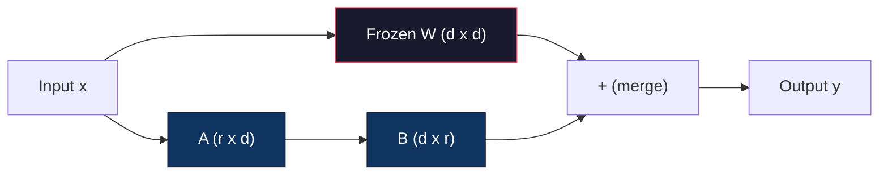
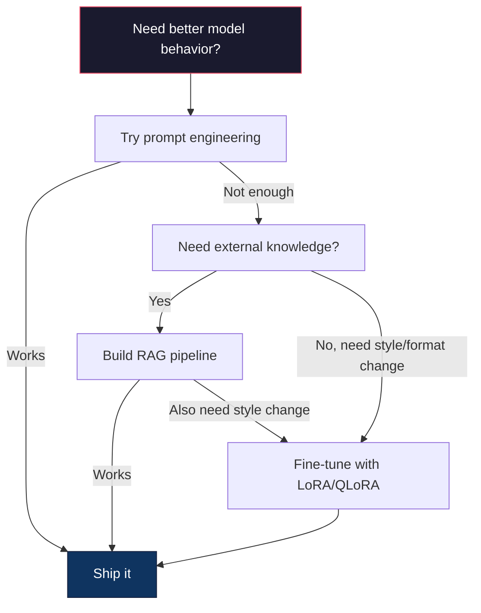

# التنسيق الجيد مع LoRA و QLoRA                                                                                                                                                                                                                                                                                                                                                                                                                                                                                                                  

> التنسيق الكامل لنموذج 7B يتطلب 56 جيجابايت من VRAM. ليس لديك ذلك. ولا معظم الشركات تفعل ذلك. LoRA يسمح لك بتنسيق النموذج نفسه في 6 جيجابايت عن طريق تدريب أقل من 1% من المعلمات. هذا ليس تعزيزا - انها تتطابق مع جودة التنسيق الكامل في معظم المهام. النظام الإيكولوجي الكامل مفتوح المصدر التنسيق الكامل يعمل على هذه الحيلة واحدة.

> **【中文解读】**يتطلب النموذج 56GB من الاحتفاظ الضئيل. لا يحتوي على سوى تدريب أقل من 1٪ من العناصر.

> **【拓展：LoRA微调→定制大模型】**لورا هي التقنية الأساسية للنموذج الكبير للتخصيص للشركات: باستخدام عدد قليل من النماذج الأساسية للبيانات ، والحصول على القدرة المهنية (مثل التحليل المالي ، التوصيل القانوني ، إنتاج الشفرات ، وما إلى ذلك)

>  **【前置】**学本节前请先掌握:(1) المرحلة 10·06(إرشادات ضبط SFT)  فهم المراقبة التغيرات التنظيمية؛(2) 线性代数基础矩阵乘法、秩、SVD 分解(看 Phase 01·11 SVD);(3) PyTorch 基础`nn.Linear`.`backward()`.`optimizer.step()`• 4) العناق الوجه`transformers`库的基本用法──本节会用 `peft`和 `trl`كوكا

**Type:** Build | **类型:** 构建
**Languages:** Python | **语言:** Python
**Prerequisites:** Phase 10, Lesson 06 (Instruction Tuning / SFT) | **前置知识:** Phase 10 · 06（指令微调/SFT）
**Time:** ~75 minutes | **时间:** ~75 分钟
**Related:**المرحلة 10 تغطي حلقات SFT / DPO من الصفر. هذا الدروس يربط تلك في 2026 مجموعة أدوات PEFT (PEFT، TRL، Unsloth، Axolotl، LLaMA-فابريكه).**相关:**المرحلة 10 من التفاصيل عن دورة SFT/DPO.

## أهداف التعلم

- تنفيذ LoRA عن طريق حقن مصفوفات المعدلات منخفضة الصف (A و B) في طبقات الاهتمام الخاصة بالنموذج المُدرب مسبقاً
  通过向预训练模型的注意力层注入低秩适配矩阵(A 和 B) تحقيق LoRA
- حساب وفورات المعلمات من LoRA مقابل التنظيم الدقيق الكامل: ترتيب r مع d_مثل الأبعاد القطارات 2*r*d المعلمات بدلا من d^2
  计算 LoRA بمقابل 全量微调的参数节省:秩 r 配 d_model 维度训练 2*r*d 参数而不是 d^2
- ضبط النموذج باستخدام QLoRA (4 بت قاعدة كمية + مكيّفات LoRA) لتناسب مع ذاكرة GPU المستهلك
  استخدام QLoRA(4 بت 量化基础模型 + LoRA 适配器)
- دمج وزنات LoRA مرة أخرى في النموذج الأساسي لتنفيذ وتقارن سرعة الاستنتاج مع ودون مُعدات
  لتحديد LoRA  الوزن المشترك مع الوضع الأساسي النموذج المستخدم في التنفيذ، ومقارنة مع / بدون معدل السرعة التفكير

> **【中文解读】**هدف دراسة: استخدام لورا/كلورا لتنفيذ العوامل عالية الجودة.


## المشكلة المشكلة المشكلة

لديك نموذج أساسي. إلاما 3 8 ب. تريد أن يجيب على تذاكر دعم العملاء بصوت شركتك. SFT هو الحل. ولكن SFT لديها مشكلة تكلفة.

> لديك نموذج أساسي. لاما 3 8 ب. أنت تريد استخدامها في تصميم الشركة الخاصة بك.

تحديثات التنسيق الدقيق الكاملة لكل پیرامتر في النموذج. Llama 3 8B لديها 8 مليارات پیرامتر. في fp16 ، كل پیرامتر يتطلب 2 بايت. هذا هو 16 جيجا غاي فقط لتحميل الوزن. أثناء التدريب ، تحتاج أيضًا إلى تراجع (16 جيجا غاي) ، وحالات التحسين لـ آدم (32 جيجا غاي لتحرك + تغير) ، وتفعيلات. إجمالي: حوالي 56 جيجا غاي لـ VRAM لنموذج واحد من 8B.

> كل عنصر في النموذج الجديد. لاما 3 8B لديه 80 مليار عنصر. fp16.

A100 80GB بالكاد يمكن أن تستوعب هذا.$3-4/hour on cloud providers. Training for 3 epochs on 50,000 examples takes 6-10 hours. That's $30-40 لكل تجربة، إنجز 10 تجارب لتصل إلى المعايير المضادة بشكل صحيح و إنفقت 400 دولار قبل نشر أي شيء

> واحد A100 80GB 勉强能装下──两张 A100 在云上每小时 $3-4。在 50,000 个样本上训练 3 个 epoch 需要 6-10 小时。每次实验 $30-40:

هناك مشكلة أعمق أيضاً. التنسيق الكامل يغير كل وزن في النموذج. إذا قمت بتنسيق كل بيانات دعم العملاء، قد تدهور القدرات العامة للنموذج. هذا يسمى النسيان الكارثي. النموذج يتحسن في مهمتك وأسوأ في كل شيء آخر.

> هناك مشكلة أعمق أيضاً. كل عنصر يقلل من وزن النموذج. إذا قمت بتخفيف البيانات العملية، فقد تقلل من القدرة العامة للنموذج.

تحتاج إلى طريقة تدرب أقل ملامح، تستخدم أقل ذاكرة، ولا تدمر المعرفة الموجودة في النموذج.

> تحتاج إلى تدريب أقل من العناصر، استخدام أقل من الذاكرة، وعدم تدمير النموذج من أساليب المعرفة الحالية.

>  **【类比】**                                                                                                                                                                                                                                                              

## المفهوم الأساسي

> **【中文解读】**لورا ((مرتبة منخفضة التكيف) هو الوسيلة الأساسية للبرامج عالية الكفاءة المتناسبة (PEFT): 结原始权重, فقط تدريب درجة منخفضة لتفريق الموجة (A*B), سوف يمكن تدريب العناصر من مليارات إلى ملايين.

> **【拓展：LoRA 的工程实践】**ترتيب لورا) عادة ما يعد 8-64 ، تطبق على Q / V 投投影矩阵效果最好。QLoRA(4-bit 基础模型 + LoRA)让你在单张 RTX 4090 上微调 Llama-3-8B。HuggingFace PEFT库让 LoRA 微调几行代码即可实现。 تكلفة لورا تبلغ نحو 1/10, وتتقرب التأثير。

> 🤔 **【困惑】**س: QLoRA هو ما؟ و LoRA 区别؟ A: QLoRA = LoRA كمية. النموذج الأساسي باستخدام 4-بيت 量化(NF4) تخزين، LoRA 适配器 باستخدام bf16 训练。 هكذا 16GB الجهاز الجهاز الجهاز الجهاز الجهاز الجهاز الجهاز الجهاز الجهاز الجهاز الجهاز الجهاز الجهاز الجهاز الجهاز الجهاز الجهاز الجهاز الجهاز الجهاز الجهاز الجهاز الجهاز الجهاز الجهاز الجهاز الجهاز الجهاز الجهاز الجهاز الجهاز الجهاز الجهاز الجهاز الجهاز الجهاز الجهاز الجهاز الجهاز الجهاز الجهاز الجهاز الجهاز الجهاز الجهاز الجهاز الجهاز الجهاز الجهاز الجهاز الجهاز الجهاز الجهاز الجهاز الجهاز الجهاز الجهاز الجهاز الجهاز الجهاز الجهاز الجهاز الجهاز الجهاز الجهاز الجهاز الجهاز الجهاز الجهاز الجهاز الجهاز الجهاز الجهاز الجهاز الجهاز الجهاز الجهاز الجهاز الجهاز الجهاز الجهاز الجهاز الجهاز الجهاز الجهاز الجهاز الجهاز الجهاز الجهاز الجهاز الجهاز الجهاز الجهاز الجهاز الجهاز الجهاز الجهاز الجهاز الجهاز الجهاز الجهاز الجهاز الجهاز الجهاز الجهاز الجهاز الجهاز الجهاز الجهاز الجهاز الجهاز الجهاز الجهاز الجهاز الجهاز الجهاز الجهاز الجهاز الجهاز الجهاز الجهاز الجهاز الجهاز الجهاز الجهاز الجهاز الجهاز الجهاز الجهاز الجهاز الجهاز الجهاز الجهاز الجهاز الجهاز الجهاز الجهاز الجهاز الجهاز الجهاز الجهاز الجهاز الجهاز الجهاز الجهاز الجهاز الجهاز الجهاز


### لورا: التكيف منخفض الرتب

نشر إدوارد هو وزملاؤه في مايكروسوفت LoRA في يونيو 2021. نظرة ورقة: تحديثات الوزن أثناء ضبط الدقة لديها رتبة داخلية منخفضة. لا تحتاج إلى تحديث جميع المعلمات 16.7 مليون في ماتريكس الوزن 4096x4096. يمكن التقاط المعلومات المفيدة في التحديث بواسطة ماتريكس من رتبة 16 أو 32.

> إدوارد هو وميكروسوفت 同事于 2021 年 6 月发表 LoRA──论文洞察:微调期间权重更新具有低内在排列──你不需要更新 4096x4096 权重矩阵中全部1670万参数──更新中的有用信息可被排列 16或 32 的矩阵捕获──

> 🤔 **【困惑】**س: لماذا يمكن للنظام الزمني أن يكتشف معلومات محددة؟ أ: الملاحظة التجريبيةأغاجيانيان وغيرها(2020) وجدت الوزن على نموذج التدريب الزمني للقيام بتحديثات الدين في الدرجة الدبوية (البعيدة الداخلية) منخفض جداً، عادة ما يكون هناك فقط بضع مئات إلى بضعة آلاف من الأطراف على القدرة على تعلم مهمة جديدة.

هذه هي الرياضيات، طبقة خطية قياسية تحسب:

> 数学如下──标准线性层计算:

```
y = Wx
```

حيث W هو d_out x d_in المصفوفة. بالنسبة لمبادرة 4096x4096 الاهتمام، هذا هو 16،777،216 ملامح.

> من بينها W هو d_out x d_in 矩阵. بالنسبة 4096x4096 انتباه الصور، فهو 16,777,216 个参数.

لورا تجميد W و يضيف تدمير منخفض الدرجة:

> لا يضاف إلى أسفل قائمة التفريق:

> ️ **【易错点】**(لورا) (ميكرو)**秩 r 设太大**r=64 起步就太大,参数接近全量微调,省显存优势消失;起点 r=8 أو r=16,效果不够再加倍──(2) **target_modules 选错**فقط على`q_proj`加 LoRA 效果有限، الممارسة المعيارية هي`["q_proj", "v_proj", "k_proj", "o_proj"]`بالإضافة إلى ذلك، يمكن أن يزيد من التحفيز على MLP `gate_proj`-أجل`up_proj`-أجل`down_proj`‬ ‬ ‬ ‬ ‬ ‬**学习率没调高**الجهاز هو الجهاز الجديد، يحتاج إلى وزن أكبر من الجهاز التدريب المسبق؛ العادي الجهاز = 1e-4 إلى 3e-4 ((比全量微调的 2e-5 高 5-10 倍)

```
y = Wx + BAx
```

حيث B هو (d_out x r) و A هو (r x d_in). صفوف r أصغر بكثير من d -- عادة 8, 16 أو 32.

> بينها B هو (d_out x r) ، A هو (r x d_in)。رتبة r 比 d 小得多通常 8、16 أو 32。

ل r=16 على طبقة 4096x4096:
- المعلمات الأصلية: 4096 × 4096 = 16،777،216
- معايير لورا: (4096 × 16) + (16 × 4096) = 65536 + 65536 = 131 072
- الخصم: 131,072 / 16,777,216 = 0.78%

> بالنسبة 4096x4096 على الصفحة r=16:
> - العنصر الأصلي:4096 × 4096 = 16,777,216
> - الحد الأساسي: 4096 × 16) + (16 × 4096) = 65536 + 65536 = 131 072
> - 减少:131,072 / 16,777,216 = 0.78%

أنت تدرب 0.78% من المعلمات وتحصل على 95-100% من الجودة.

> تمرين 0.78% من العناصر، الحصول على 95-100% من الجودة.



A يتم تشغيله مع غوسيان عشوائي. B يتم تشغيله إلى الصفر. وهذا يعني أن مساهمة LoRA تبدأ من الصفر -- يبدأ النموذج التدريب من سلوكها الأصلي وتتعلم تدريجيا التكيف.

> استخدام随机高斯初始化.B初始化为零.

### عامل الحجم: ألفا

LoRA يقدم عامل مقياس ألفا الذي يتحكم في مدى تأثير التحديث المنخفض على الخروج:

> إدخال لورا  إدخال إضافة الفاكهة، تحكم درجة التأثير على الناتج:

```
y = Wx + (alpha / r) * BAx
```

عندما يكون ألفا = r، فإن التوسع هو 1x. عندما يكون ألفا = 2r (المتباعدة المشتركة) ، فإن التوسع هو 2x. هذه المعلمة المفرطة تحكم معدل التعلم من مسار LoRA بشكل مستقل عن معدل التعلم الأساسي.

> عندما ألفا = ر، يتم توزيعها إلى 1x♦ عندما ألفا = 2r♦) ، يتم توزيعها إلى 2x♦ هذا العيار المرتفع يعتمد على معدل التعلم الأساسي تحكم معدل التعلم في LoRA 路径♦

الإرشادات العملية:
- الف = 2 * رتبة هو اتفاقية مجتمعية شائعة (الورقة الأصلية المستخدمة الف = رتبة في معظم التجارب)
  ألفا = 2 * رتبة هو habitu见社区约定(原论文 معظم تجربات الفا = رتبة)
- الفا = رتبة يعطي 1x مقياس، المحافظة ولكن مستقرة
  ألفا = رتبة عطى 1x كمية، حافظة ولكن ثابتة
- الفا العليا تعني تحديثات أكبر لكل خطوة، والتي يمكن أن تسريع التقارب أو تسبب عدم الاستقرار
  ألفا أعلى يعني كل خطوة أكبر تحديث، قد تسريع الاستحواذ أو يؤدي إلى عدم الاستقرار

### أين تطبيق LoRA

المحول لديه العديد من الطبقات الخطية. لا تحتاج إلى إضافة لورا إلى جميعها. الورق الأصلي اختبر مزيجات مختلفة:

> المحول لديه العديد من الطبقات الحيوية.

| Target Layers | Trainable Params (7B) | Quality |
|--------------|----------------------|---------|
| q_proj only / 仅 q_proj | 4.7M | Good / 好 |
| q_proj + v_proj | 9.4M | Better / 更好 |
| q_proj + k_proj + v_proj + o_proj | 18.9M | Best for attention / 注意力最佳 |
| All linear (attention + MLP) / 所有线性层 | 37.7M | Marginal gain, 2x params / 边际收益、2 倍参数 |

نقطة الحلوة لمعظم المهام: q_proj + v_proj. هذا يستهدف استفسار وتقديرات القيمة في الانتباه الذاتي ، والتي تحكم ما يشتري النموذج وما المعلومات التي يستخرجها. إضافة طبقات MLP تساعد في المهام المعقدة مثل توليد الشفرة ولكن تضاعف عدد المعايير لخفض العائدات على المهام البسيطة.

> أفضل النقاط في معظم المهام:q_proj + v_proj. هذا يستهدف استفسارات والقيمة التقاطع على الذات، والتحكم في النموذج التركيز على ما ‬التقاط ما المعلومات‬‬‬‬‬‬‬‬‬‬‬‬‬‬‬‬‬‬‬‬‬‬‬‬‬‬‬‬‬‬‬‬‬‬‬‬‬‬‬‬‬‬‬‬‬‬‬‬‬‬‬‬‬‬‬‬‬‬‬‬‬‬‬‬‬‬‬‬‬‬‬‬‬‬‬‬‬‬‬‬‬‬‬‬‬‬‬‬‬‬‬‬‬‬‬‬‬‬‬‬‬‬‬‬‬‬‬‬‬‬‬‬‬‬‬‬‬‬‬‬‬‬‬‬‬‬‬‬‬‬‬‬‬‬‬‬‬‬‬‬‬‬‬‬‬‬‬‬‬‬‬‬‬‬‬‬‬‬‬‬‬‬‬‬‬‬‬‬‬‬‬‬‬‬‬‬‬‬‬‬‬‬‬‬‬‬‬‬‬‬‬‬‬‬‬‬‬‬‬‬‬‬‬‬‬‬‬‬‬‬‬‬‬‬‬‬‬‬‬‬‬‬‬‬‬‬‬‬‬‬‬‬‬‬‬‬‬‬‬‬‬‬‬‬‬‬‬‬‬‬‬‬‬‬‬‬‬‬‬‬‬‬‬‬‬‬‬‬‬‬‬‬‬‬‬‬‬‬‬‬‬‬‬‬‬‬‬‬‬‬‬‬‬‬‬‬‬‬‬‬‬‬‬‬‬‬‬‬‬‬‬‬‬‬‬‬‬‬‬‬‬‬‬‬‬‬‬‬‬‬‬‬‬‬‬‬‬‬‬‬‬‬‬‬‬‬‬‬‬‬‬‬‬‬‬‬‬‬‬‬‬‬‬‬‬‬‬‬‬‬‬‬‬‬‬‬‬‬‬‬‬‬‬‬‬‬‬‬‬‬‬‬‬‬‬‬‬‬‬‬‬‬‬‬‬‬‬‬‬‬‬‬‬‬‬‬‬‬‬‬‬‬‬‬‬‬‬‬‬‬‬‬‬‬‬‬‬‬‬‬‬‬‬‬‬‬‬‬‬‬‬‬‬‬‬

### اختيار الرتب

الدرجة r تحكم التعبير من التكيف:

> 秩 r 控制适应:

| Rank | Trainable Params (per layer) | Best For |
|------|---------------------------|----------|
| 4 | 32,768 | Simple classification, sentiment / 简单分类、情感 |
| 8 | 65,536 | Single-domain Q&A, summarization / 单领域问答、摘要 |
| 16 | 131,072 | Multi-domain tasks, instruction following / 多领域任务、指令遵循 |
| 32 | 262,144 | Complex reasoning, code generation / 复杂推理、代码生成 |
| 64 | 524,288 | Diminishing returns for most tasks / 大多数任务回报递减 |
| 128 | 1,048,576 | Rarely justified / 很少合理 |

أظهرت هوو وآخرون أن r=4 يحتوي بالفعل على معظم التكيف للمهام البسيطة. r=8 و r=16 هي الخيارات الأكثر شيوعا في الممارسة. تجاوز r=64 نادرا ما يحسن الجودة ويبدأ في فقدان ميزة الذاكرة للورا.

> وظهر Hu 等人 أن r=4 已捕获大部分 من المهمات البسيطة.

### QLoRA: 4-bit كمية + LoRA

نشر تيم ديتمرز وزملاؤه في جامعة واشنطن QLoRA في مايو 2023. فكرة: تحديد النموذج الأساسي المجمد إلى دقة 4-بيت، ثم توصيل مكيّفات LoRA في fp16 في الأعلى.

> تمت ديتمرز وزملاء جامعة واشنطن في مايو 2023 نشر QLoRA.

هذا يغير معادلة الذاكرة بشكل كبير:

> هذا تغير بشكل كبير في معادلة الحفاظ على الأحياء:

| Method | Weight Memory (7B) | Training Memory (7B) | GPU Required |
|--------|-------------------|---------------------|-------------|
| Full fine-tune (fp16) | 14GB | ~56GB | 1x A100 80GB |
| LoRA (fp16 base) | 14GB | ~18GB | 1x A100 40GB |
| QLoRA (4-bit base) | 3.5GB | ~6GB | 1x RTX 3090 24GB |

تقوم QLoRA بثلاث مساهمات فنية:

> قلوبا تقديم ثلاثة مساهمات تقنية:

**NF4 (Normal Float 4-bit)**: نوع بيانات جديد مصمم خصيصًا لوزن الشبكات العصبية. يتابع وزن الشبكات العصبية توزيعًا طبيعيًا تقريبًا. يضع NF4 مستويات تعريفها الكمية 16 في كوانتيلات توزيع طبيعي قياسي. هذا مثاليًا من الناحية النظرية للمعلومات للمعلومات الموزعة عادة. يفقد أقل معلومات من التعريف الكملي الموحد بـ 4 بتات (INT4) أو Float4 القياسي.

> **NF4（Normal Float 4-bit）**: نوع جديد من البيانات المصممة خصيصاً لثقل شبكات العصبية. حق الشبكات العصبية مهم للغاية للاستيعاب للتوزيع الصارم.NF4 وضع 16 درجة قياسية على عدد من المنتجات في التوزيع الصارم.

**Double quantization**: استمرارات الكمية نفسها تأخذ الذاكرة. كل كتلة من 64 وزنها تحتاج إلى عامل مقياس fp32 (4 بايت). بالنسبة لنموذج 7B، هذا هو 0.4GB إضافي. الكمية المزدوجة تحكم هذه المستمرات إلى fp8, وتقلل من التكلفة الجوية إلى 0.1GB. صغير ولكن يجمع.

> **双重量化**: تكوين العاملات نفسها تُحمل النموذج. في كل 64  حصة ثقيلة تحتاج إلى fp32  ضخم                                                                                                                                                                                                                                                                                                                                                                                                                                                                                          

**Paged optimizers**خلال التدريب، يمكن أن تتجاوز حالة المحفز (دفع وأزمة آدم) ذاكرة GPU على تسلسلات طويلة. يستخدم المحفز المصفحات ذاكرة موحدة NVIDIA لتصفح حالة المحفز تلقائيًا إلى ذاكرة CPU عندما يتم استنفاد ذاكرة GPU، ويعيد الصفحة مرة أخرى عند الحاجة. هذا يمنع انهيار OOM على حساب بعض التنفيذ.

> **分页优化器**: خلال التدريب، قد يتجاوز حجم وفرق الإنترنت على حالة المحافظة على المعدات الجافية. يمكن أن يتجاوز الحفاظ على الجهاز الجافية.

### مسألة الجودة

هل تقليل المعلمات أو تقييم القاعدة يؤثر على الجودة؟

>  減量化 減量化 減量化 減量化 減量化 減量化 減量化 減量化 減量化 減量化 減量化 減量化 減量化 減量化 減量化 減量化 減量化 減量化 減量化 減量化 減量化 減量化 減量化 減量化 減量化 減量化 減量化 減量化 減量化 減量化 減量化 減量化 減量化 減量化 減量化 減量化 減量化 減量化 減量化 減量化 減量化 減量化 減量化 減量化 減量化 減量化 減量化 減量化 減量化 減量化 減量化 減量化 減量化 減量化 減量化 減量化 減量化 減量化 減量化 減量化 減量化 減量化 減量化 減量化 減量化 減量化 減量化 減量

| Method | MMLU (5-shot) | MT-Bench | HumanEval |
|--------|--------------|----------|-----------|
| Full fine-tune (Llama 2 7B) / 全量微调 | 48.3 | 6.72 | 14.6 |
| LoRA r=16 | 47.9 | 6.68 | 14.0 |
| QLoRA r=16 (NF4) | 47.5 | 6.61 | 13.4 |
| QLoRA r=64 (NF4) | 48.1 | 6.70 | 14.2 |

يقع مقياس LoRA عند r=16 ضمن 1% من التنسيق الدقيق الكامل على معظم المعايير. يفقد QLoRA عند r=16 جزءًا آخر من المئة. يطابق QLoRA عند r=64 في الأساس التنسيق الدقيق الكامل مع استخدام 90٪ أقل من الذاكرة.

> في معظم المراجع، يختلف قراءة القيمة القيمة القيمة القيمة القيمة القيمة القيمة القيمة القيمة القيمة القيمة القيمة القيمة القيمة القيمة القيمة القيمة القيمة القيمة القيمة القيمة القيمة القيمة القيمة القيمة القيمة القيمة القيمة القيمة القيمة القيمة القيمة القيمة القيمة القيمة القيمة القيمة القيمة القيمة القيمة القيمة القيمة القيمة القيمة القيمة القيمة القيمة القيمة القيمة القيمة القيمة القيمة القيمة القيمة القيمة القيمة القيمة القيمة القيمة القيمة القيمة القيمة القيمة القيمة القيمة القيمة القيمة القيمة القيمة القيمة القيمة القيمة القيمة القيمة القيمة القيمة القيمة القيمة القيمة القيمة القيمة القيمة القيمة القيمة القيمة القيمة القيمة القيمة القيمة القيمة القيمة القيمة القيمة القيمة القيمة القيمة القيمة القيمة القيمة القيمة القيمة القيمة القيمة القيمة القيمة القيمة القيمة القيمة القيمة القيمة القيمة القيمة القيمة القيمة القيمة القيمة القيمة القيمة القيمة القيمة القيمة القيمة القيمة القيمة القيمة القيمة القيمة القيمة القيمة القيمة القيمة القيمة القيمة القيمة القيمة القيمة القيمة القيمة القيمة القيمة القيمة القيمة القيمة القيمة القيمة القيمة القيمة القيمة القيمة القيمة القيمة القيمة القيمة القيمة القيمة القيمة القيمة القيمة القيمة القيمة القيمة القيمة القيمة القيمة القيمة القيمة القيمة القيمة القيمة القيمة القيمة القيمة القيمة القيمة القيمة القيمة القيمة القيمة القيمة القيمة القيمة القيمة القيمة القيمة القيمة القيمة القيمة القيمة القيمة القيمة القيمة القيمة القيمة القيمة القيمة القيمة القيمة القيمة القيمة القيمة القيمة القيمة القيمة القيمة القيمة القيمة القيمة القيمة القيمة القيمة القيمة القيمة القيمة القيمة القيمة القيمة القيمة القيمة القيمة القيمة القيمة القيمة القيمة القيمة القيمة القيمة القيمة القيمة القيمة القيمة القيمة القيمة القيمة القيمة القيمة القيمة القيمة القيمة القيمة القيمة القيمة القيمة القيمة القيمة القيمة القيمة القيمة القيمة الق

### التكاليف الحقيقية

التنسيق الدقيق للاما 3 8B على 50،000 مثال (3 حقول):

> في 50،000 نموذج على التغيرات اللامام 3 8B ((3 个时代):

| Method | GPU | Time | Cost |
|--------|-----|------|------|
| Full fine-tune / 全量微调 | 2x A100 80GB | 8 hours | ~$32 |
| LoRA r=16 | 1x A100 40GB | 4 hours | ~$8 |
| QLoRA r=16 | 1x RTX 4090 24GB | 6 hours | ~$5 |
| QLoRA r=16 (Unsloth) | 1x RTX 4090 24GB | 2.5 hours | ~$2 |
| QLoRA r=16 | 1x T4 16GB | 12 hours | ~$4 |

تكلفة QLoRA على جهاز GPU لمستهلك واحد أقل من غداء. هذا هو السبب في انفجار مجتمع ضبط الدقة المفتوحة في عام 2023 ولماذا كل إطار تدريب أقل من QLoRA بطبيعة الحال في عام 2026.

> 单张消费级 GPU 上的QLoRA 成本不到一顿午餐──这就是原因 2023开源权微调社区爆发,也是原因2026所有训练框架默认搭载QLoRA──

### كومة PEFT 2026

| Framework | What it is | Pick when |
|-----------|-----------|-----------|
| **Hugging Face PEFT** | The canonical LoRA/QLoRA/DoRA/IA3 library / 标准 LoRA/QLoRA/DoRA/IA3 库 | You want raw control and your training loop is already on `transformers.Trainer` / 想要原始控制且训练循环已在 `transformers.Trainer` 上 |
| **TRL** | HF's reinforcement-from-feedback trainers (SFT, DPO, GRPO, PPO, ORPO) / HF 反馈强化学习训练器 | You need DPO/GRPO after SFT; built on top of PEFT / SFT 后需要 DPO/GRPO；构建于 PEFT 之上 |
| **Unsloth** | Triton-kernel rewrite of the forward/backward pass / 前向/反向传播的 Triton 内核重写 | You want 2-5x speedup + half the VRAM with no accuracy loss; Llama/Mistral/Qwen family / 想要 2-5 倍加速 + 一半 VRAM 无精度损失；Llama/Mistral/Qwen 家族 |
| **Axolotl** | YAML-config wrapper over PEFT + TRL + DeepSpeed + Unsloth / PEFT + TRL + DeepSpeed + Unsloth 的 YAML 配置封装 | You want reproducible, version-controlled training runs / 想要可重现、版本控制的训练运行 |
| **LLaMA-Factory** | GUI/CLI/API over PEFT + TRL / PEFT + TRL 的 GUI/CLI/API | You want zero-code fine-tuning; 100+ model families supported / 想要零代码微调；支持 100+ 模型家族 |
| **torchtune** | Native PyTorch recipes, no `transformers` dep / 原生 PyTorch 配方，无 `transformers` 依赖 | You want minimal deps and your org already standardizes on PyTorch / 想要最小依赖且组织已标准化于 PyTorch |

قاعدة البصمة: استخدام البحث أو تجربة فريدة → PEFT. خط أنابيب الإنتاج المتكرر → أكسولوتل مع أجزاء Unsloth تمكينها. تصميم النماذج الأولية القذيفة → LLaMA-Factory.

>  تجربة قانون: دراسة أو تجربة واحدة → PEFT。可重复生产管线 → 启用 Unsloth 内核的 Axolotl。抛弃式原型 → LLaMA-Factory。

### إندماج المعدات

بعد التدريب، لديك شيئين: نموذج الأساس المجمد ومعدل LoRA الصغير (عادة 10-100MB).

> بعد التدريب لديك اثنين من الأشياء: 结的基础模型和小的LoRA 适配器(عادة 10-100MB) ―― يمكنك:

1. **Keep them separate**: تحميل النموذج الأساسي، تحميل المعدل فوق. تبادل المعدلات للمهام المختلفة. هكذا يمكنك تقديم العديد من التغيرات المعدلة من النموذج الأساسي واحد.

   **保持分离**: تحميل النموذج الأساسي، فوق تحميل المعدلات.

2. **Merge them permanently**: حساب W' = W + (ألفا / ر) * BA و حفظ النتيجة كنموذج جديد كامل. النموذج المدمج هو نفس الحجم من الأصلي. لا تكلفة استنتاجية. لا يوجد مكيّف لإدارة.

   **永久合并**: حساب W' = W + (ألفا/ر) * BA 并将结果保存为新完整模型──合并后模型与原始相同大小──无推理开销──无适配器需管理──

لخدمة مهام متعددة (معدل دعم العملاء، معدل رمز، معدل ترجمة) ، حافظ على تفاصيلها. لتنفيذ نموذج متخصص واحد، دمج.

> 服务多个任务(客服适配器、代码适配器、翻译适配器) 保持分离──部署单一专用模型则合并──

تقنيات الاندماج المتقدمة لمجتمع العديد من المعدات:

> 组合多个适配器的高级合并技术:

- **TIES-Merging**(يادف وزملاء 2023): يقطع معايير الحجم الصغير، يحل الصراعات الإشارية، ثم يدمج. يقلل من التداخل بين المكيفات.
  修剪小幅度参数, حل符号冲突, ثم合并──减少适配器间干扰──
- **DARE**(Yu et al. 2023): يُسقط عشوائياً معايير المعدل قبل دمجها ويعيد التقييم على الباقي. فعال بشكل مفاجئ في دمج القدرات.
  合并前随机丢弃适配器参数并重新缩放其余参数──组合能力效果惊──
- **Task arithmetic**: ببساطة إضافة أو خصم وزن المعدل. إضافة معدل "رمز" ومعدل "رياضيات" غالبا ما ينتج نموذج جيد في كليهما.
  简单加或减适配器权重.加"代码"适配器和"数学"适配器通常都产生两者都擅长的模型.

### عندما لا يجب أن تكون على ما يرام

التنسيق الدقيق هو الخيار الثالث، وليس الأول.

> الاختيار الثالث ليس الأول

**First: prompt engineering.**اكتب طلب نظام أفضل، أضف بعض الأمثلة القليلة، استخدم سلسلة التفكير، هذا لا يكلف شيئاً و يستغرق دقائق، إذا كان التسجيل يصل لك إلى 80٪ من الطريق، فربما لا تحتاج إلى ضبطها.

> **第一：提示工程。**كتابة أفضل النظام النصيحة. زيادة نموذج المثال.

**Second: RAG.**إذا كان النموذج بحاجة إلى معرفة بياناتك المحددة (وثائق، قاعدة المعرفة، كتالوج المنتجات) ، فإن الاسترداد أرخص وأكثر صيانة من خبزها في الوزن. انظر الدروس 06.

> **第二：RAG。**إذا كان النموذج يحتاج إلى معرفة بياناتك المحددة (المستندات، المكتبات، المنتجات) ، فالتفتيش على الحفر في الوزن هو أكثر تكلفة، ويمكن الاحتفاظ به.

**Third: fine-tuning.**استخدم هذا عندما تحتاج إلى النموذج لتبني نمط أو شكل أو نمط معين لا يمكن تحقيقه من خلال الاستفسار. عندما تحتاج إلى خروج منظمة ثابتة. عندما تحتاج إلى تصنيف نموذج أكبر إلى أصغر. عندما يهم التأخير ولا يمكنك تحمل الرموز الإضافية من استفسار بضع أوراق.

> **第三：微调。**عندما تحتاج إلى نموذج يتبنى نمط محدد أو صيغة أو نموذج تقرير ((لا يمكن أن تمر على النقطة) استخدام الوقت. عندما تحتاج إلى نموذج متوافق من المنتجات الهيكلية. عندما تحتاج إلى جعل النموذج الكبير إلى نموذج صغير. عندما يكون تأخير مهم و أنت تحمل لا يبدأ عدد قليل من النقطة.



## بناء ذلك تحرك لتحقيق
```figure
lora-params
```

## بناءها

نطبق "لورا" من الصفر في "بيتورش" النقي، لا مكتبات، لا سحر، ستبني طبقة "لورا" وتحقنها في نموذج، وتدربها، وتدمج الوزن مرة أخرى.

> نستخدم بيكورش خالص من الصفر لتحقيق لورا.

### الخطوة الأولى: طبقة لورا

```python
import torch
import torch.nn as nn
import math

class LoRALayer(nn.Module):
    def __init__(self, in_features, out_features, rank=8, alpha=16):
        super().__init__()
        self.rank = rank
        self.alpha = alpha
        self.scaling = alpha / rank

        self.A = nn.Parameter(torch.randn(in_features, rank) * (1 / math.sqrt(rank)))
        self.B = nn.Parameter(torch.zeros(rank, out_features))

    def forward(self, x):
        return (x @ self.A @ self.B) * self.scaling
```

يتم تشغيل A مع قيم عشوائية مقياسية. يتم تشغيل B إلى الصفر. يبدأ المنتج BA من الصفر، لذلك يبدأ النموذج بسلوكها الأصلي.

> A 用缩放随机值初始化──B 初始化为零──乘积 BA 从零开始,所以模型以其原始行为开始──

### الخطوة الثانية: طبقة خطية ملفوفة بـ "لورا"

```python
class LinearWithLoRA(nn.Module):
    def __init__(self, linear, rank=8, alpha=16):
        super().__init__()
        self.linear = linear
        self.lora = LoRALayer(
            linear.in_features, linear.out_features, rank, alpha
        )

        for param in self.linear.parameters():
            param.requires_grad = False

    def forward(self, x):
        return self.linear(x) + self.lora(x)
```

يتم تجميد الطبقة الخطية الأصلية. يمكن تدريبها فقط لمعايير LoRA (A و B).

> تم تعيين الطبقة الأولى فقط

### الخطوة الثالثة: حقن لورا في النموذج

```python
def inject_lora(model, target_modules, rank=8, alpha=16):
    for param in model.parameters():
        param.requires_grad = False

    lora_layers = {}
    for name, module in model.named_modules():
        if isinstance(module, nn.Linear):
            if any(t in name for t in target_modules):
                parent_name = ".".join(name.split(".")[:-1])
                child_name = name.split(".")[-1]
                parent = dict(model.named_modules())[parent_name]
                lora_linear = LinearWithLoRA(module, rank, alpha)
                setattr(parent, child_name, lora_linear)
                lora_layers[name] = lora_linear
    return lora_layers
```

أولاً، قم بتجميد كل معايير في النموذج. ثم قم بالتمرير على شجرة النموذج، واكتشف طبقات خطية تطابق أسماء المستهدف الخاصة بك، واستبدلها بإصدارات LoRA الملفوفة. هي المصفوفات A و B LoRA هي المعايير الوحيدة التي يمكن تدريبها في النموذج بأكمله.

> أولاً،结模型中的所有参数──然后遍历模型树,找到匹配目标名称的线性层,用LoRA 包装版本取代它们──LoRA A 和 B矩阵是整个模型中唯一可训练的参数──

### الخطوة الرابعة: احتساب المعايير

```python
def count_parameters(model):
    total = sum(p.numel() for p in model.parameters())
    trainable = sum(p.numel() for p in model.parameters() if p.requires_grad)
    frozen = total - trainable
    return {
        "total": total,
        "trainable": trainable,
        "frozen": frozen,
        "trainable_pct": 100 * trainable / total if total > 0 else 0
    }
```

### الخطوة 5: إندماج الوزن مرة أخرى

```python
def merge_lora_weights(model):
    for name, module in model.named_modules():
        if isinstance(module, LinearWithLoRA):
            with torch.no_grad():
                merged = (
                    module.lora.A @ module.lora.B
                ) * module.lora.scaling
                module.linear.weight.data += merged.T
            parent_name = ".".join(name.split(".")[:-1])
            child_name = name.split(".")[-1]
            if parent_name:
                parent = dict(model.named_modules())[parent_name]
            else:
                parent = model
            setattr(parent, child_name, module.linear)
```

بعد الاندماج، تختفي طبقات LoRA، النموذج هو نفس الحجم من الأصلي مع التكيف مخبز في الوزن. لا يوجد استنتاج على التكلفة العليا.

> 合并后 LoRA 层消失──模型与原始大小相同,适应烤进权重──无推理开销──

### الخطوة 6: محاكاة كمية QLoRA

```python
def quantize_to_nf4(tensor, block_size=64):
    blocks = tensor.reshape(-1, block_size)
    scales = blocks.abs().max(dim=1, keepdim=True).values / 7.0
    scales = torch.clamp(scales, min=1e-8)
    quantized = torch.round(blocks / scales).clamp(-8, 7).to(torch.int8)
    return quantized, scales

def dequantize_from_nf4(quantized, scales, original_shape):
    dequantized = quantized.float() * scales
    return dequantized.reshape(original_shape)
```

هذا يحاكي تحديد الكميات من 4 بتات عن طريق رسم خرائط للأوزان إلى 16 مستوى منفصلة داخل كتلة من 64 .

> من خلال ذلك سيتم تصوير الوزن إلى 64 بلوك من 16 فصيلة منفصلة مقارنة بـ 4 بتات قياسها.

### الخطوة السابعة: حلقة التدريب

```python
def train_lora(model, data, epochs=5, lr=1e-3, batch_size=4):
    optimizer = torch.optim.AdamW(
        [p for p in model.parameters() if p.requires_grad], lr=lr
    )
    criterion = nn.MSELoss()

    losses = []
    for epoch in range(epochs):
        epoch_loss = 0.0
        n_batches = 0
        indices = torch.randperm(len(data["inputs"]))

        for i in range(0, len(indices), batch_size):
            batch_idx = indices[i:i + batch_size]
            x = data["inputs"][batch_idx]
            y = data["targets"][batch_idx]

            output = model(x)
            loss = criterion(output, y)

            optimizer.zero_grad()
            loss.backward()
            optimizer.step()

            epoch_loss += loss.item()
            n_batches += 1

        avg_loss = epoch_loss / n_batches
        losses.append(avg_loss)

    return losses
```

### الخطوة الثامنة: التجربة الكاملة

```python
def demo():
    torch.manual_seed(42)
    d_model = 256
    n_classes = 10

    model = nn.Sequential(
        nn.Linear(d_model, 512),
        nn.ReLU(),
        nn.Linear(512, 512),
        nn.ReLU(),
        nn.Linear(512, n_classes),
    )

    n_samples = 500
    x = torch.randn(n_samples, d_model)
    y = torch.randint(0, n_classes, (n_samples,))
    y_onehot = torch.zeros(n_samples, n_classes).scatter_(1, y.unsqueeze(1), 1.0)

    data = {"inputs": x, "targets": y_onehot}

    params_before = count_parameters(model)

    lora_layers = inject_lora(
        model, target_modules=["0", "2"], rank=8, alpha=16
    )

    params_after = count_parameters(model)

    losses = train_lora(model, data, epochs=20, lr=1e-3)

    merge_lora_weights(model)
    params_merged = count_parameters(model)

    return {
        "params_before": params_before,
        "params_after": params_after,
        "params_merged": params_merged,
        "losses": losses,
    }
```

يخلق التجربة نموذجًا صغيرًا ، ويُحقق LoRA في طبقتين ، ويعمل عليه ، ويهضم الوزن مرة أخرى. ينخفض عدد المعايير من التدريب الكامل إلى ~ 1% قابل للتدريب أثناء تدريب LoRA ، ثم يعود إلى الهندسة المعمارية الأصلية بعد الاندماج.

> 演示 إنشاء نموذج صغير ✓ إدراج LoRA إلى المستويات ✓ تدريبها ✓ التأثيرات المعدنية من التدريب الكامل إلى تدريب LoRA ✓ حوالي 1% قابل للتدريب خلال التدريب ، ثم التأثيرات المعدنية بعد العودة إلى البنية الأصلية‬

## استخدمها في إطار التنفيذ

مع نظام "الوجهه المقبلة" ، يأخذ "لورا" على نموذج حقيقي حوالي 20 سطر:

> مع معانقة الوجه 生态, حقيقي نموذج على لورا فقط تحتاج إلى حوالي 20 行:

```python
from transformers import AutoModelForCausalLM, AutoTokenizer
from peft import LoraConfig, get_peft_model, TaskType

model = AutoModelForCausalLM.from_pretrained("meta-llama/Llama-3.1-8B")
tokenizer = AutoTokenizer.from_pretrained("meta-llama/Llama-3.1-8B")

lora_config = LoraConfig(
    task_type=TaskType.CAUSAL_LM,
    r=16,
    lora_alpha=32,
    lora_dropout=0.05,
    target_modules=["q_proj", "v_proj"],
)

model = get_peft_model(model, lora_config)
model.print_trainable_parameters()
```

بالنسبة لـ QLoRA، أضف بيتساند بايتس كمية:

>  بالنسبة لـ QLoRA، إضافة بيتس و بايتس قياس:

```python
from transformers import BitsAndBytesConfig

bnb_config = BitsAndBytesConfig(
    load_in_4bit=True,
    bnb_4bit_quant_type="nf4",
    bnb_4bit_compute_dtype=torch.bfloat16,
    bnb_4bit_use_double_quant=True,
)

model = AutoModelForCausalLM.from_pretrained(
    "meta-llama/Llama-3.1-8B",
    quantization_config=bnb_config,
    device_map="auto",
)

model = get_peft_model(model, lora_config)
```

هذا هو، نفس حلقة التدريب نفس خط البيانات النموذج الأساسي يعيش الآن في 4 بتات، مُعايضات LoRA تدرب في Fp16, والشيء كله يناسب في 6 جيجابايت.

للتدريب مع مدرب الوجه المقبض:

```python
from transformers import TrainingArguments, Trainer
from datasets import load_dataset

dataset = load_dataset("tatsu-lab/alpaca", split="train[:5000]")

training_args = TrainingArguments(
    output_dir="./lora-llama",
    num_train_epochs=3,
    per_device_train_batch_size=4,
    gradient_accumulation_steps=4,
    learning_rate=2e-4,
    fp16=True,
    logging_steps=10,
    save_strategy="epoch",
    optim="paged_adamw_8bit",
)

trainer = Trainer(
    model=model,
    args=training_args,
    train_dataset=dataset,
)

trainer.train()

model.save_pretrained("./lora-adapter")
```

المعدل المحفوظ هو 10-100 ميغابايت. النموذج الأساسي يبقى غير متأثر. يمكنك مشاركة المعدلات على حلقة Hugging Face دون إعادة توزيع النموذج الكامل.

## أرسلها .

هذا الدرس ينتج عن:
- `outputs/prompt-lora-advisor.md`-- طلب يساعدك على تحديد درجة LoRA، وحدات الهدف، والعلامات العالية لمهمتك المحددة
- `outputs/skill-fine-tuning-guide.md`-- مهارة تعلّم العملاء شجرة القرارات متى وكيفية ضبط

## تمارين التدريب

1. **Rank ablation study.**قم بتشغيل التجربة التجريبية مع الصفوف 2، 4، 8، 16، 32، و 64. قم بتخطيط الخسارة النهائية مقابل الصف. ابحث عن نقطة العائد المتناقص حيث لا يزيد تضاعف الصف عن النصف الخسارة. بالنسبة لمهمة تصنيف بسيطة على ميزات 256 بعد، يجب أن يكون هذا حوالي r = 8-16 .

2. **Target module comparison.**تعديل inject_lora لتحديد الارض فقط طبقة "0"، طبقة "2"، طبقة "4" وحدها، والثلاثة. تدريب كل فارقة لمدة 20 حقبة. مقارنة سرعة التقارب والخسارة النهائية. هذا يعكس القرار الحقيقي لتحديد الارض q_proj مقابل v_proj مقابل جميع الطبقات الخطية.

3. **Quantization error analysis.**خذ ماتريصات الوزن التي تم تدريبها قبل وبعد quantize_to_nf4 / dequantize_from_nf4. احسب متوسط الخطأ التربيعي، أقصى خطأ مطلق، والارتباط بين الوزن الأصلي والإعادة بناء. التجربة مع قيم حجم الكتل من 32, 64, 128 و 256.

4. **Multi-adapter serving.**قم بتدريب مُعايير LoRA على مجموعتين فرعية مختلفة من البيانات (حتى المؤشرات مقابل المؤشرات الغريبة). حفظ كلا المُعايير. قم بتحميل النموذج الأساسي مرة واحدة، ثم قم بتبادل المُعايير وتحقق من أن كل منها ينتج نتائج مختلفة على نفس المدخل. هكذا تعمل أنظمة الإنتاج على عدة نماذج دقيقة من قاعدة واحدة.

5. **Merge vs. unmerged inference.**مقارنة خروج نموذج LoRA قبل وبعد merge_lora_weights على نفس 100 مدخل. التحقق من أن الخروج هي متطابقة (في حدود تحمل نقطة عائمة من 1e-5). ثم استنتاج سرعة مقارنة لكلا - دمج يجب أن يكون أسرع قليلا لأنه هو المصفوفة واحدة مضاعفة بدلا من اثنين.

## شروط الرئيسية

| Term | What people say | What it actually means | 中文释义 |
|------|----------------|----------------------|---------|
| LoRA | "Efficient fine-tuning" | Low-Rank Adaptation: freeze base weights, train two small matrices A and B whose product approximates the full weight update | |
| QLoRA | "Fine-tune on a laptop" | Quantized LoRA: load the base model in 4-bit NF4, train LoRA adapters in fp16 on top, enabling 7B fine-tuning in 6GB VRAM | |
| Rank (r) | "How much the model can learn" | The inner dimension of the A and B matrices; controls expressiveness vs. parameter count | |
| Alpha | "LoRA learning rate" | Scaling factor applied to the LoRA output; alpha/r scales the adaptation's contribution to the final output | |
| NF4 | "4-bit quantization" | Normal Float 4: a 4-bit data type with quantization levels at normal distribution quantiles, optimal for neural network weights | |
| Adapter | "The small trained part" | The LoRA A and B matrices saved as a separate file (10-100MB), loadable on top of any copy of the base model | |
| Target modules | "Which layers to LoRA" | The specific linear layers (q_proj, v_proj, etc.) where LoRA adapters are injected | |
| Merging | "Bake it in" | Computing W + (alpha/r) * BA and replacing the original weight, eliminating the adapter overhead at inference | |
| Paged optimizers | "Don't OOM during training" | Offloading optimizer states (Adam momentum, variance) to CPU when GPU memory is exhausted | |
| Catastrophic forgetting | "Fine-tuning broke everything else" | When updating all weights causes the model to lose previously learned capabilities | |

## المزيد من القراءة

- هوو وآخرون، "لورا: تكييف درجة منخفضة لنماذج اللغة الكبيرة" (2021) -- الورقة الأصلية التي تقدم طريقة التفكك منخفضة الدرجة، اختبرت على GPT-3 175B مع درجة منخفضة 4
- ديتمرز وغيرهم، "QLoRA: التنسيق الجيد لنموذجات اللغة المعدلة" (2023) -- يقدم NF4 ، التعريف المعدل المزدوج ، ومحفزات الصفحات ، مما يتيح 65B التنسيق الجيد على GPU واحد 48GB
- وثائق مكتبة PEFT (huggingface.co/docs/peft) -- المكتبة القياسية لـ LoRA و QLoRA ، وغيرها من الطرق الفعالة بالبرامج في النظام البيئي Hugging Face
- ياداف وغيره، "TIES-Merging: Solving Interference When Merging Models" (2023) -- تقنيات لمزيج العديد من مُعدات LoRA دون تدهور الجودة
- [Rafailov et al., "Direct Preference Optimization: Your Language Model is Secretly a Reward Model" (NeurIPS 2023)](https://arxiv.org/abs/2305.18290)-- استنتاج DPO؛ مرحلة تحسين الاختيارات التي تأتي بعد SFT، لا يوجد نموذج مكافأة مطلوب.
- [TRL documentation](https://huggingface.co/docs/trl/)-- المرجع الرسمي ل`SFTTrainer`،`DPOTrainer`،`KTOTrainer`، و سطح التكامل مع PEFT/bitsandbytes/Unsloth.
- [Unsloth documentation](https://docs.unsloth.ai/)-- الأجزاء المدمجة التي تضاعف التناسب الدقيق وتقلل من الذاكرة إلى النصف؛ طبقة الأداء تحت TRL.
- [Axolotl documentation](https://axolotl-ai-cloud.github.io/axolotl/)-- مدرب متعدد GPU SFT / DPO / QLoRA الذي تم تكوينه بواسطة YAML ؛ بديل للتكوين كرمز للخطوط المكتوبة يدوياً.
