# بروتوكولات الاتصال

> العملاء الذين لا يستطيعون التحدث بنفس اللغة ليسوا فريق إنهم غرباء يصرخون في الفراغ

> **【中文解读】**هذا المقطع يعرض طريقة قياسية لـ "مجموعة وكلاء" 通信协议

> **【拓展：communication protocols→具体应用】**ثلاثة مستويات من الاتفاقية الحديثة: 1) 传输层A2A (HTTP+JSON)  MCP (JSON-RPC) 、gRPC; 2) 语义层Agent Card 描述能力,任务描述意图; 3) 协调层发言人选择、投票、协商──2026 سنوات


**Type:** Build | **类型:** 构建
**Languages:** TypeScript | **语言:** TypeScript
**Prerequisites:** Phase 14 (Agent Engineering), Lesson 16.01 (Why Multi-Agent) | **前置知识:** Phase 14 (Agent 工程), Lesson 16.01 (为什么需要多 Agent)
**Time:** ~120 minutes | **时间:** ~120 分钟

>  **【前置】**學本節前 請先掌握:Phase 14 Agent 工程基础) Phase 16·01-02 多 Agent 动机与FIPA 历史) Phase 13 MCP 协议) 本节 动手实现多 Agent 通信选协议 应按延迟和协作范围权衡──
>  **【类比】**多 وكيل 通信 = "جهاز الاتصال الوسيلة"──HTTP+JSON(A2A) = 邮件(异步、跨组织);JSON-RPC(MCP) = Slack(工具调用);gRPC = 内部电话(低延迟、强类型)──选错协议 = 团队效率灾难──

## أهداف التعلم

- تنفيذ اكتشاف أداة MCP ودعوة حتى يتمكن العملاء من استخدام الأدوات التي تعرض لها الخوادم الخارجية
  中文翻译: تنفيذ MCP 工具发现调用,使 Agent 能够使用外部服务器暴露的工具
- قم ببناء بطاقة وكيل A2A ونقطة نهاية المهمة التي تسمح لوكيل واحد بتفويض العمل إلى آخر عبر HTTP
  中文翻译: تشكيل وكيل A2A 卡片和任务端点, السماح وكيل 通过 HTTP إلى وكيل آخر 委派工作
- مقارنة MCP (الوصول إلى الأدوات) ، A2A (من وكيل إلى وكيل) ، ACP (دقيق المؤسسات) ، و ANP (الثقة اللامركزية) و شرح أي بروتوكول يحل أي مشكلة
  中文翻译:比较 MCP(工具访问) 、A2A(وكيل على وكيل) 、ACP(مراجعة الشركات) و ANP(去中心化信任),解释哪个协议解决哪个问题
- توصيل بروتوكولات متعددة معا في نظام واحد حيث يقوم العملاء بتكتشيف الأدوات عبر MCP وتمرير المهام عبر A2A
  中文翻译: فى نظام واحد متصل العديد من الاتفاقيات,الوكيل من خلال MCP 发现工具并通过 A2A 委派任务

## المشكلة المشكلة المشكلة

تقسم نظامك إلى عدة وكلاء باحث ومدفوع ومتحلل إنهم بارعون في وظائفهم الفردية ولكن الآن تحتاجون إليهم للتحدث مع بعضهم البعض

> ستقوم بتقسيم النظام إلى العديد من الوكلاء: الباحث، المُعدّر، المُراجع، والذي يُمثّل بشكلٍ رائع في مهماتهما، ولكن الآن تحتاج إليها للحوار الحقيقي مع بعضها البعض.

محاولة أولى واضحة: إرسال السلاسل حول. الباحث يعيد بقعة من النص، ويقوم البرمجة بتفحصها على أي حال كان بإمكانه. يعمل حتى يفسر البرمجة بشكل خاطئ ملخص البحث، أو اثنين من العاملين في حالة تعطل تنتظر بعضها البعض، أو تحتاج إلى العاملين الذين بنيتهم فرق مختلفة للتعاون. فجأة "فقط إرسال السلاسل" تفكك.

> تجربتك الأولى واضحة: إرسال خيطات. المحقق يعود إلى كتب كتب، ويكدّر كل ما يمكنه من تحليلها.

هذه هي مشكلة بروتوكول الاتصال بدون عقد مشترك حول كيفية تبادل العملاء للمعلومات، أنظمة متعددة العملاء هشة، غير قابلة للدراسة،

> هذه هي مشكلة اتفاقية الاتصالات. اتفاقية مشاركة معلومات بدون وكيل، نظام وكيل متعدد ضعيف وغير قابل للتدقيق، ولا يمكن توسيعه إلى عدد قليل من وكلاء كتبتهم بنفسك.

استجاب نظام الإيكولوجيا الذكية الذكية بأربعة بروتوكولات، وحل كل منها جزء مختلف من المشكلة:

- **MCP**للوصول إلى الأدوات
  中文翻译:**MCP**استخدام أدوات الوصول
- **A2A**للتعاون بين العملاء
  中文翻译:**A2A**يستخدم الوكيل 间协作
- **ACP**لتحقيق قابلية للمؤسسات
  中文翻译:**ACP**تستخدم في مجال التحقيق
- **ANP**لتحقيق الهوية والثقة اللامركزية
  中文翻译:**ANP**لتحويل الوصف والثقة

هذه الدروس تذهب عميقة. سوف تقرأ أشكال الأسلاك الحقيقية من كل مواصفات، وبناء تنفيذات العمل، والربط الأربعة في نظام موحد.

> سوف تقرأ أشكال الخط الحقيقي لكل نظام، وتحقيق عمليات عملية، وتتصل جميع البروتوكولات الأربعة إلى نظام موحد.

## المفهوم الأساسي

### منظرة البروتوكول

فكروا في هذه البروتوكولات الأربعة كطبقات، كل منها يُعالج سؤال مختلف:

> النظر إلى هذه الاتفاقيات الأربعة على مستويات مختلفة، كل حل مشكلة مختلفة:

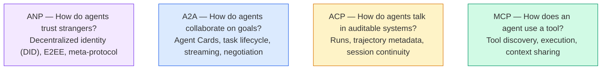

إنهم ليسوا منافسين، إنهم يحلون مشاكل مختلفة على مستويات مختلفة.

> إنها ليست علاقة تنافسية. إنها تحل مشاكل مختلفة على مستويات مختلفة.

نظام إنتاج حقيقي يستخدم بروتوكولات متعددة معا: MCP للأدوات داخل منظمتك، A2A للتعاون مع العملاء، سجل المسار على النمط ACP للتوافق، ANP للهوية عبر منظمة. اختيار واحد وإجبار كل شيء من خلالها ينتج نظام أسوأ من خلطهم من خلال القلق.

> مجموعة النظم الإنتاجية الحقيقية تستخدم العديد من البروتوكولات:MCP تستخدم الأدوات داخل المنظمة A2A تستخدم وكيل تعاون ACP النمط السير للكتابة المختلفة

### المعدل المعدني (إعادة التأهيل)

يتم تغطية MCP بعمق في المرحلة 13. التجريب السريع: MCP يوحد كيفية اتصال LLM بالأدوات الخارجية ومصادر البيانات.**client-server**بروتوكول يكتشف وكيل (عميل) ويدعو الأدوات التي كشفها الخادم.

> في المرحلة 13 ، كان هناك تحليلات متعمقة.**客户端-服务器**协议,Agent(客户端) وجدت并调用服务器暴露的工具──

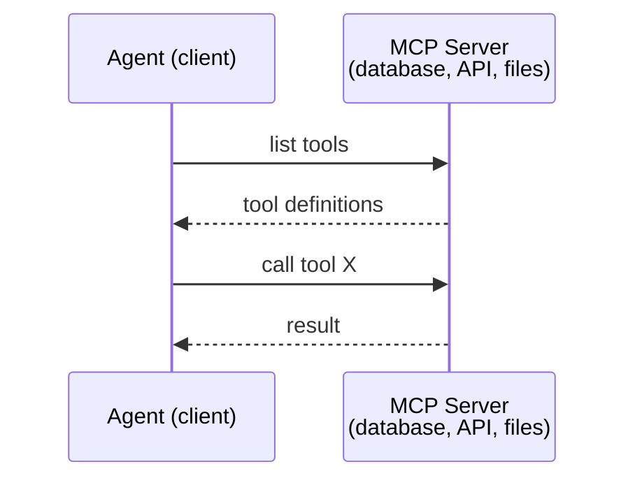

المملكة المتحدة**agent-to-tool**لا يساعد العملاء على التحدث مع بعضهم البعض

> المفوضية**Agent 到工具**الاتصال... لا يمكن أن يساعد العميل على الاتصال ببعضه البعض

إن الانقسام الرأسوي/الأفقي نظيف: MCP هو السلك الرأسوي (الوكيل يصل إلى الأدوات/البيانات) ؛ A2A هو السلك الأفقي (الوكيل يصل إلى وكلاء الأقران).

> 垂直/水平分离清晰:MCP هي خطوط مستقيمة ؛ A2A هي خطوط مستطيل ؛ A2A هو خطوط مستطيل ؛ A2A هو خطوط مستطيل ؛ A2A هو خطوط مستطيل ؛ A2A هو خطوط مستطيل ؛ A2A هو خطوط مستطيل ؛ A2A هو خطوط مستطيل ؛ A2A هو خطوط مستطيل ؛ A2A هو خطوط مستطيلة ؛ A2A هو خطوط مستطيلة ؛ A2A هو خطوط مستطيلة ؛ A2A هو خطوط مستطيلة ؛ A2A هو خطوط مستطيلة ؛ A2A هو خطوط مستطيلة ؛ A2A هو خطوط مستطيلة .

### A2A (بروتوكول الوكيل2الوكيل)

**Created by:**جوجل (الآن تحت مؤسسة لينكس)`lf.a2a.v1`)
**Spec version:**1.0.0
**Problem:**كيف يتعاون وكلاء مستقلون ويتفاوضون ويمنحون بعضهم بعضهم بعضاً من المهام؟

> **创建者：**جوجل ((现由 لينكس مؤسسة 管理为 `lf.a2a.v1`)
> **规范版本：**1.0.0
> **问题：**وكيل مستقل كيف يتعاون ويتفاوض ويتولى المهام المتبادلة؟

A2A هو بروتوكول ل**peer-to-peer agent collaboration**حيث يربط MCP وكيل مع الأدوات، يربط A2A وكيل مع وكلاء آخرين.**Agent Card**في عنوان URL معروف، وكلاء آخرون يكتشفون، يتفاوضون معه، ويمنحون مهام له.

> A2A هو**点对点 Agent 协作**الاتفاقات: MCP  الاتصال العميل إلى الوسائل: A2A  الاتصال العميل إلى الوكيل الآخر: كل عميل في عنوان معروف:**Agent 卡片**يمكن أن يجد وكيل آخر، يتفاوض ويتولى مهام المفوضية.

#### كيف يعمل A2A

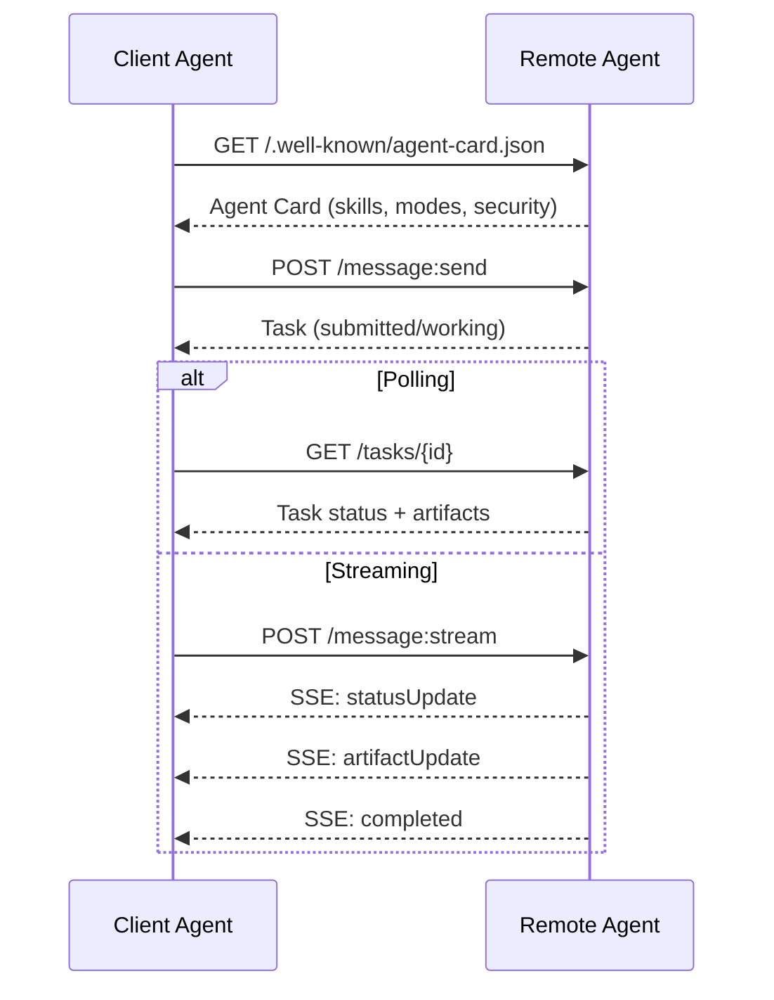

#### بطاقة العميل الحقيقي

هذا ما تبدو عليه بطاقة عميل A2A في البرية`GET /.well-known/agent-card.json`:

```json
{
  "name": "Research Agent",
  "description": "Searches documentation and summarizes findings",
  "version": "1.0.0",
  "supportedInterfaces": [
    {
      "url": "https://research-agent.example.com/a2a/v1",
      "protocolBinding": "JSONRPC",
      "protocolVersion": "1.0"
    },
    {
      "url": "https://research-agent.example.com/a2a/rest",
      "protocolBinding": "HTTP+JSON",
      "protocolVersion": "1.0"
    }
  ],
  "provider": {
    "organization": "Your Company",
    "url": "https://example.com"
  },
  "capabilities": {
    "streaming": true,
    "pushNotifications": false
  },
  "defaultInputModes": ["text/plain", "application/json"],
  "defaultOutputModes": ["text/plain", "application/json"],
  "skills": [
    {
      "id": "web-research",
      "name": "Web Research",
      "description": "Searches the web and synthesizes findings",
      "tags": ["research", "search", "summarization"],
      "examples": ["Research the latest changes in React 19"]
    },
    {
      "id": "doc-analysis",
      "name": "Documentation Analysis",
      "description": "Reads and analyzes technical documentation",
      "tags": ["docs", "analysis"],
      "inputModes": ["text/plain", "application/pdf"],
      "outputModes": ["application/json"]
    }
  ],
  "securitySchemes": {
    "bearer": {
      "httpAuthSecurityScheme": {
        "scheme": "Bearer",
        "bearerFormat": "JWT"
      }
    }
  },
  "security": [{ "bearer": [] }]
}
```

أشياء مهمة يجب ملاحظتها:
- **Skills**كل واحد لديه معرف، علامات، وأنواع MIME المدعومة المدخل / الخروج. هكذا يقرر وكيل العميل ما إذا كان هذا وكيل عن بعد يمكن التعامل مع طلبه.
  中文翻译:**技能**هو شيء يمكن للعميل أن يفعل. كل واحد لديه هويتها، علامات ودعم إدخال / إصدار من نوع MIME.
- **supportedInterfaces**يدرج العديد من روابط البروتوكول. وكيل واحد يمكن أن يتحدث JSON-RPC، REST، و gRPC في نفس الوقت.
  中文翻译:**supportedInterfaces**列出多个协议绑定──单个代理可以同时使用JSON-RPC、REST 和 gRPC──
- **Security**ويتم دمجها في البطاقة، ويعرف العميل ما هو المطلوب قبل أن يطلب طلباً واحداً.
  中文翻译:**安全性**في الواقع، لا يوجد أي شيء آخر في هذا المجال.

#### دورة حياة المهام

المهام هي الوحدة الأساسية للعمل في A2A. تتحرك عبر الحالات المحددة:

> 任务是 A2A من الوحدات العمل الأساسية.

الآلة الحكومية هي ما يجعل A2A مختلفة عن RPC بسيطة. يمكن للمهمة التوقف (المدخل مطلوب) ، الاستئناف (المستخدم يقدم المدخل) ، الفشل، أو إلغاء. لا يحتاج العميل إلى الحظر؛ فإنه يختار أو يشترك في التحديثات.

> 状态机是 A2A و RPC بسيطة مختلفة عن ذلك. المهام يمكن أن تعليقها.

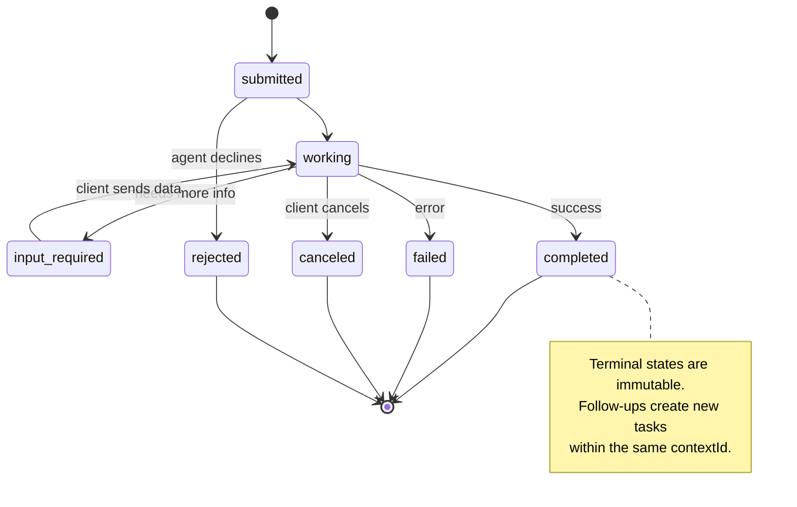

جميع الدول الثمانية (التفاصيل تعريف أيضا `UNSPECIFIED`كحارس، يتم حذفها هنا):

> تم تعريف الحكم`UNSPECIFIED`كمسجن، هنا省略):

| State | Terminal? | Meaning / 含义 |
|---|---|---|
| `TASK_STATE_SUBMITTED` | No | Acknowledged, not yet processing / 已确认，尚未处理 |
| `TASK_STATE_WORKING` | No | Actively being processed / 正在处理 |
| `TASK_STATE_INPUT_REQUIRED` | No | Agent needs more info from client / Agent 需要客户端更多信息 |
| `TASK_STATE_AUTH_REQUIRED` | No | Authentication needed / 需要认证 |
| `TASK_STATE_COMPLETED` | Yes | Finished successfully / 成功完成 |
| `TASK_STATE_FAILED` | Yes | Finished with error / 出错完成 |
| `TASK_STATE_CANCELED` | Yes | Canceled before completion / 完成前取消 |
| `TASK_STATE_REJECTED` | Yes | Agent declined the task / Agent 拒绝任务 |

الحالات النهائية (التي اكتملت، فشلت، ألغيت، رفضت) لا تتغير  بمجرد وصول مهمة إلى واحدة، لا يسمح بإعادة التحديث. يجب أن يخلق العمل المتابع مهمة جديدة في نفس `contextId`للحفاظ على استمرارية الجلسة.

> 终态(completed、failed、cancelled、rejected) is unchangeable بمجرد وصول المهمة إلى النهاية، لا يسمح بإعادة التطورات الأخرى.`contextId`إنشاء مهمة جديدة للحفاظ على استمرارية المحادثة.

بمجرد أن تصل المهمة إلى حالة نهائية، فهي لا تتغير. لا مزيد من الرسائل. التتابع يخلق مهمة جديدة داخل نفسها `contextId`. . .

> بمجرد أن تصل المهمة إلى النهاية، فإنها لا تتغير. لا يمكن إعادة إرسال الرسالة.`contextId`"إنشاء مهمة جديدة"

#### تنسيق الأسلاك

A2A يستخدم JSON-RPC 2.0 هنا ما يبدو عليه تبادل الرسائل الحقيقية:

**Client sends a task:**
```json
{
  "jsonrpc": "2.0",
  "id": 1,
  "method": "SendMessage",
  "params": {
    "message": {
      "messageId": "msg-001",
      "role": "ROLE_USER",
      "parts": [{ "text": "Research React 19 compiler features" }]
    },
    "configuration": {
      "acceptedOutputModes": ["text/plain", "application/json"],
      "historyLength": 10
    }
  }
}
```

**Agent responds with a task:**
```json
{
  "jsonrpc": "2.0",
  "id": 1,
  "result": {
    "task": {
      "id": "task-abc-123",
      "contextId": "ctx-xyz-789",
      "status": {
        "state": "TASK_STATE_COMPLETED",
        "timestamp": "2026-03-27T10:30:00Z"
      },
      "artifacts": [
        {
          "artifactId": "art-001",
          "name": "research-results",
          "parts": [{
            "data": {
              "findings": [
                "React 19 compiler auto-memoizes components",
                "No more manual useMemo/useCallback needed",
                "Compiler runs at build time, not runtime"
              ]
            },
            "mediaType": "application/json"
          }]
        }
      ]
    }
  }
}
```

**Streaming via SSE:**
```text
POST /message:stream HTTP/1.1
Content-Type: application/json
A2A-Version: 1.0

data: {"task":{"id":"task-123","status":{"state":"TASK_STATE_WORKING"}}}

data: {"statusUpdate":{"taskId":"task-123","status":{"state":"TASK_STATE_WORKING","message":{"role":"ROLE_AGENT","parts":[{"text":"Searching documentation..."}]}}}}

data: {"artifactUpdate":{"taskId":"task-123","artifact":{"artifactId":"art-1","parts":[{"text":"partial findings..."}]},"append":true,"lastChunk":false}}

data: {"statusUpdate":{"taskId":"task-123","status":{"state":"TASK_STATE_COMPLETED"}}}
```

### ACP (بروتوكول الاتصال بالوكيل)

**Created by:**آي بي إم / بي آي آي
**Spec version:**0.2.0 (OpenAPI 3.1.1)
**Status:**الاندماج في A2A تحت مؤسسة لينكس
**Problem:**كيف يتواصل العملاء مع قابلية التدقيق الكاملة، استمرارية الجلسات، وتتبع المسار؟

> **创建者：**آي بي إم / بي آي آي
> **规范版本：**0.2.0 (OpenAPI 3.1.1)
> **状态：**في A2A من Linux Foundation
> **问题：**كيف يتواصل العميل مع وجود إمكانية التدقيق الكامل؟

ACP هو**enterprise protocol**على عكس ما يزعمه العديد من الموجبات، فإن ACP تفعل **not**استخدام JSON-LD. إنه API REST / JSON بسيط محدد عن طريق OpenAPI. ما يجعله مميز هو **TrajectoryMetadata**: كل رد العميل يمكن أن يحمل سجل مفصل من خطوات التفكير ودعوات الأدوات التي أنتجتها.

> ACP هو**企业协议**                                                                                                                                                                                                                                                              **不**استخدام JSON-LD. هو واحد من خلال OpenAPI                                                                                                                                                                                                                                                                                                                                                                                                                                                                                                                  **TrajectoryMetadata**كل وكيل يمكن أن يحمل لإنتاجها التفكير والإجراءات

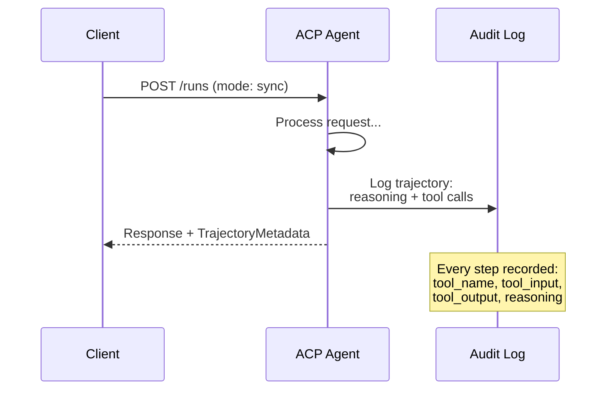

#### العميل "ديسكفري" في "إكسي"

يحدد ACP أربعة طرق للاكتشاف:

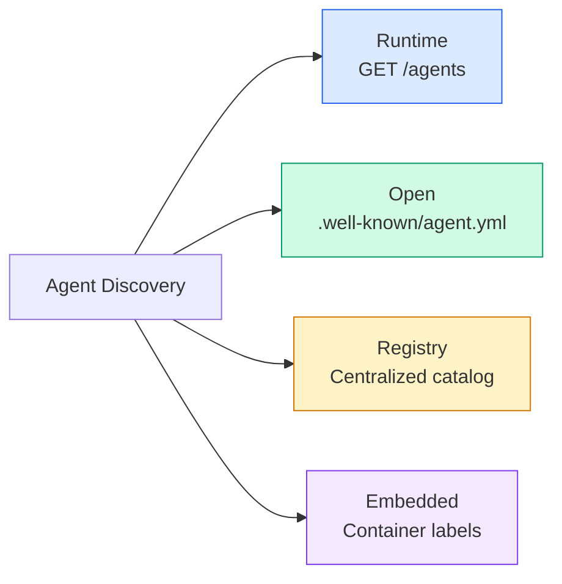

- نعم**AgentManifest**هو أبسط من بطاقة وكيل A2A:

> **AgentManifest**أكثر بساطة من بطاقة وكيل A2A:

```json
{
  "name": "summarizer",
  "description": "Summarizes documents with source citations",
  "input_content_types": ["text/plain", "application/pdf"],
  "output_content_types": ["text/plain", "application/json"],
  "metadata": {
    "tags": ["summarization", "RAG"],
    "framework": "BeeAI",
    "capabilities": [
      {
        "name": "Document Summarization",
        "description": "Condenses long documents into key points"
      }
    ],
    "recommended_models": ["llama3.3:70b-instruct-fp16"],
    "license": "Apache-2.0",
    "programming_language": "Python"
  }
}
```

لا توجد روابط بروتوكول (API REST) ، لا مخططات أمن (مُنقلة إلى مستوى الخادم) ، لا قائمة مهارات (القدرات هي بيانات متضخمة). التجارة: أسهل في التنفيذ، أقل وصف ذاتي.

> 没有协议绑定(单一 REST API) 没有安全方案(委托给服务器级别) 没有技能列表(能力是平元数据) 权衡:部署更简单,自描述性较差──

#### إدارة دورة الحياة

يستخدم ACP "Runs" بدلاً من "Task". Run هو تنفيذ وكيل مع ثلاثة أنظمة:

> استخدام ACP"Runs" بدلا من"Task"──Run هو لديه ثلاثة أنماط من الوكيل  تنفيذ:

| Mode | Behavior |
|---|---|
| `sync` | Blocking. Response contains the complete result. |
| `async` | Returns 202 immediately. Poll `GET /runs/{id}` for status. |
| `stream` | SSE stream. Events fire as the agent works. |

> ‫أحسن طريقة ‫
> ----------
> ‬ ‬`sync`# الإغلاق # الإجابة تحتوي على النتائج الكاملة #
> ‬ ‬`async`‬ ‫رجع إلى 202 فورًا‬ ‫`GET /runs/{id}`الحصول على الحالة.
> ‬ ‬`stream`‬ ‫أحداث مع العميل ‬ ‫العمل ‬‬‬‬‬‬‬‬‬‬

خرائط اختيار الوضع لمتطلبات تجربة المستخدم: المزامنة للطلبات السريعة، المزامنة للعمل الخلفي، التدفق للمهام طويلة الأجل حيث يريد المستخدم مؤشرات التقدم.

> 模式选择映射到用户体验需求:sync 用于快速查询,async 用于后台作业,流 用于用户想要进度指示的长时间运行任务──

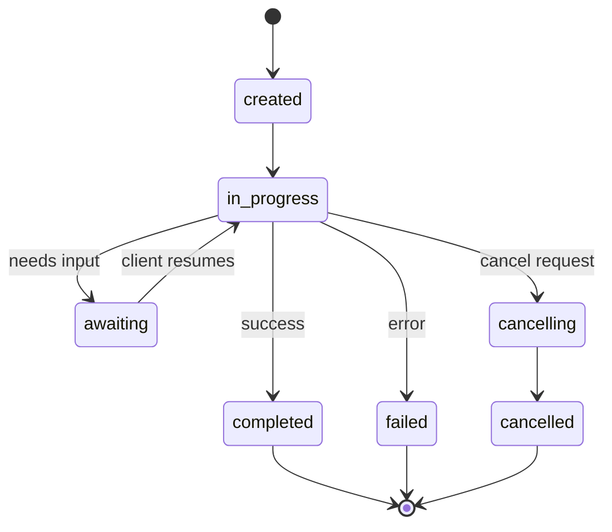

#### المسار البيانات المعدنية (مسار المراجعة)

هذا هو المُختلف الرئيسي لـ ACP. كل جزء من الرسالة يمكن أن يحتوي على بيانات متادية تظهر بالضبط ما فعله الوكيل:

```json
{
  "role": "agent/researcher",
  "parts": [
    {
      "content_type": "text/plain",
      "content": "The weather in San Francisco is 72F and sunny.",
      "metadata": {
        "kind": "trajectory",
        "message": "I need to check the weather for this location",
        "tool_name": "weather_api",
        "tool_input": { "location": "San Francisco, CA" },
        "tool_output": { "temperature": 72, "condition": "sunny" }
      }
    }
  ]
}
```

بالنسبة للصناعات المنظمة هذا هو الذهب. كل إجابة تأتي مع سلسلة دليل يمكن إثباتها: أدوات تم استدعائها، ما هي المدخلات التي تم استخدامها، ما هي النتائج التي تم تلقيها. لا يوجد مربع أسود.

> بالنسبة للصناعة المنظمة، هذا هو الثمن الذي لا يقدر بثمن. كل إجابة تحمل سلسلة إدراكية يمكن إثباتها: ما هي الأدوات التي استخدمتها؟ ما هي الإدخال التي استخدمتها؟ ما هي الإخراج التي حصلت عليها؟

تتطلب البنوك والرعاية الصحية والتنفيذ الحكومي هذا النوع من التحقيق. البيانات المتحركة للمسيرات من ACP هي ما يجعل وكلاء LLM مقبولين في هذه البيئات. دون ذلك، يرفض المنظمون الانتشار.

> تحتاج الجهات المصرفية والطبية والحكومية إلى هذه الجهات المراقبة.

كما يدعم ACP **CitationMetadata**لخصم المصدر:

> دعم ACP**CitationMetadata**مصدر:

```json
{
  "kind": "citation",
  "start_index": 0,
  "end_index": 47,
  "url": "https://weather.gov/sf",
  "title": "NWS San Francisco Forecast"
}
```

### (بروتوكول شبكة الوكلاء)

**Created by:**مجتمع المصدر المفتوح (الذي أسسه غاووي تشانغ)
**Repo:** [github.com/agent-network-protocol/AgentNetworkProtocol](https://github.com/agent-network-protocol/AgentNetworkProtocol)
**Problem:**كيف يثق العملاء من المنظمات المختلفة ببعضهم البعض بدون سلطة مركزية؟

> **创建者：**开源社区(由 غاووي تشانغ 创立)
> **代码库：** [github.com/agent-network-protocol/AgentNetworkProtocol](https://github.com/agent-network-protocol/AgentNetworkProtocol)
> **问题：**كيف يمكن لوكلاء مختلفين أن يثقوا ببعضهم البعض بدون سلطة مركزية؟

النظام الأساسي هو**decentralized identity protocol**يُبني الثقة باستخدام المُعرّفات الامتناعية W3C (DIDs) وتشفير من نهاية إلى نهاية. على عكس A2A حيث تكتشف العملاء من خلال نقاط نهاية معروفة، يسمح ANP للعملاء بإثبات هويتهم من خلال التشفير.

> ANP هو**去中心化身份协议** يستخدم W3C 去中心化标识符(DID) و端到端加密建立信任── باستخدام A2A من الوكيل من خلال النقطة المعروفة للاكتشاف مختلفة عن،ANP 让 Agent 以加密方式证明其身份──

إنب يحتوي على ثلاث طبقات:

> هناك ثلاثة مستويات:

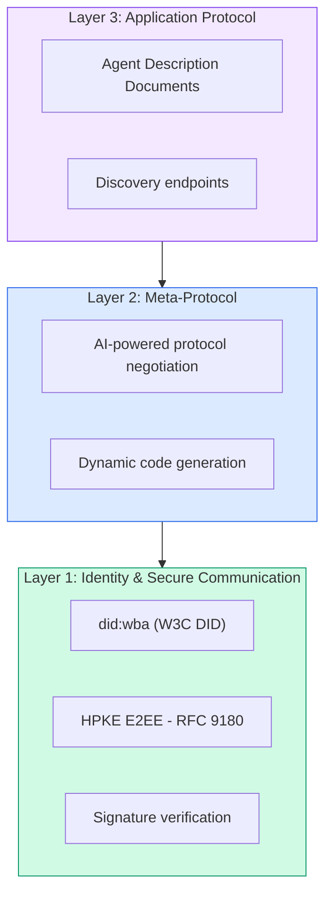

#### وثائق DID (الهيكل الحقيقي)

ANP يستخدم طريقة DID المخصصة تسمى `did:wba`(عميل على شبكة الإنترنت)`did:wba:example.com:user:alice`يقرر`https://example.com/user/alice/did.json`:

```json
{
  "@context": [
    "https://www.w3.org/ns/did/v1",
    "https://w3id.org/security/suites/jws-2020/v1",
    "https://w3id.org/security/suites/secp256k1-2019/v1"
  ],
  "id": "did:wba:example.com:user:alice",
  "verificationMethod": [
    {
      "id": "did:wba:example.com:user:alice#key-1",
      "type": "EcdsaSecp256k1VerificationKey2019",
      "controller": "did:wba:example.com:user:alice",
      "publicKeyJwk": {
        "crv": "secp256k1",
        "x": "NtngWpJUr-rlNNbs0u-Aa8e16OwSJu6UiFf0Rdo1oJ4",
        "y": "qN1jKupJlFsPFc1UkWinqljv4YE0mq_Ickwnjgasvmo",
        "kty": "EC"
      }
    },
    {
      "id": "did:wba:example.com:user:alice#key-x25519-1",
      "type": "X25519KeyAgreementKey2019",
      "controller": "did:wba:example.com:user:alice",
      "publicKeyMultibase": "z9hFgmPVfmBZwRvFEyniQDBkz9LmV7gDEqytWyGZLmDXE"
    }
  ],
  "authentication": [
    "did:wba:example.com:user:alice#key-1"
  ],
  "keyAgreement": [
    "did:wba:example.com:user:alice#key-x25519-1"
  ],
  "humanAuthorization": [
    "did:wba:example.com:user:alice#key-1"
  ],
  "service": [
    {
      "id": "did:wba:example.com:user:alice#agent-description",
      "type": "AgentDescription",
      "serviceEndpoint": "https://example.com/agents/alice/ad.json"
    }
  ]
}
```

أشياء مهمة يجب ملاحظتها:
- **Key separation**يتم تطبيقها. مفاتيح التوقيع (secp256k1) منفصلة عن مفاتيح التشفير (X25519).
  中文翻译:**密钥分离**هو إلزامية. . . . . . . . . . . . . . . . . . . . . . . . . . . . . . . . . . . . . . . . . . . . . . . . . . . . . . . . . . . . . . . . . . . . . . . . . . . . . . . . . . . . . . . . . . . . . . . . . . . . . . . . . . . . . . . . . . . . . . . . . . . . . . . . . . . . . . . . . . . . . . . . . . . . . . . . . . . . . . . . . . . . . . . . . . . . . . . . . . . . . . . . . . . . . . . . . . . . . . . . . . . . . . . . . . . . . . . . . . . . . . . . . . . . . . . . . . . . . . . . . . . . . . . . . . . . . . . . . . . . . . . . . . . . . . . . . . . . . . . . . . . . . . . . . . . . . . . . . . . . . . . . . . . . . . . . . . . . . . . . . . . . . . . . . . . . . . . . . . . . . . . . . . . . . . . . . . . . . . . . . . . . . . . . . . . . . . . . . . . . . . . . . . . . . . . . . . . . . . . . . . . . . . . . . . . . . . . . . . . . . . . . . . . . . . . . . . . . . . . . . . . . . . . . . . . . . . . . . . . . . . . . . . . . . . . . . . . . . . . . . . . . . . . . . . . . . . . . . . . . . . . . . .
- **`humanAuthorization`**هذه المفاتيح تتطلب موافقة بشرية صريحة (بيومترية، كلمة مرور، HSM) قبل استخدامها. العمليات عالية المخاطر مثل تحويلات الأموال تمر عبر هذه المسار.
  中文翻译:**`humanAuthorization`**هو ANP 独有的. . . . . . . . . . . . . . . . . . . . . . . . . . . . . . . . . . . . . . . . . . . . . . . . . . . . . . . . . . . . . . . . . . . . . . . . . . . . . . . . . . . . . . . . . . . . . . . . . . . . . . . . . . . . . . . . . . . . . . . . . . . . . . . . . . . . . . . . . . . . . . . . . . . . . . . . . . . . . . . . . . . . . . . . . . . . . . . . . . . . . . . . . . . . . . . . . . . . . . . . . . . . . . . . . . . . . . . . . . . . . . . . . . . . . . . . . . . . . . . . . . . . . . . . . . . . . . . . . . . . . . . . . . . . . . . . . . . . . . . . . . . . . . . . . . . . . . . . . . . . . . . . . . . . . . . . . . . . . . . . . . . . . . . . . . . . . . . . . . . . . . . . . . . . . . . . . . . . . . . . . . . . . . . . . . . . . . . . . . . . . . . . . . . . . . . . . . . . . . . . . . . . . . . . . . . . . . . . . . . . . . . . . . . . . . . . . . . . . . . . . . . . . . . . . . . . . . . . . . . . . . . . . . . . . . . . . . . . . . . . . . . . . . . . . . . . . . . . . . . . . . . .
- **`keyAgreement`**يتم استخدام المفاتيح لتشفير HPKE من نهاية إلى نهاية (RFC 9180).
  中文翻译:**`keyAgreement`**密钥用于HPKE 端到端加密(RFC 9180)。
- - نعم**service**الروابط في القسم إلى وثيقة وصف الوكيل.
  中文翻译:**service**部分链接到 وكيل 描述文档──

نمط فصل المفاتيح هو ما تتطلبه أنظمة العملات الرقمية في العالم الحقيقي ولكن بروتوكولات JSON غالبا ما تتخطى. تنفذ ANP ذلك لأن وكلاء متعددين المنظمات يتعاملون مع المال والعقود ، و PII  لا يجب أن يفتح مفتاح واحد مصاب بكل قدرة.

> النموذج المفتاحي المفصل هو ما يطلبه النظام الرموي الحالي ، ولكن اتفاقية JSON غالبا ما تمر.

#### كيف يعمل الثقة في ANP

إنب يفعل**not**استخدام شبكة الثقة أو الرسم البياني للتأييد. الثقة ثنائية ومحققة لكل تفاعل:

> النظام الوطني**不**استخدام信任网络或背书图──信任是双边的,每次交互都会验证:

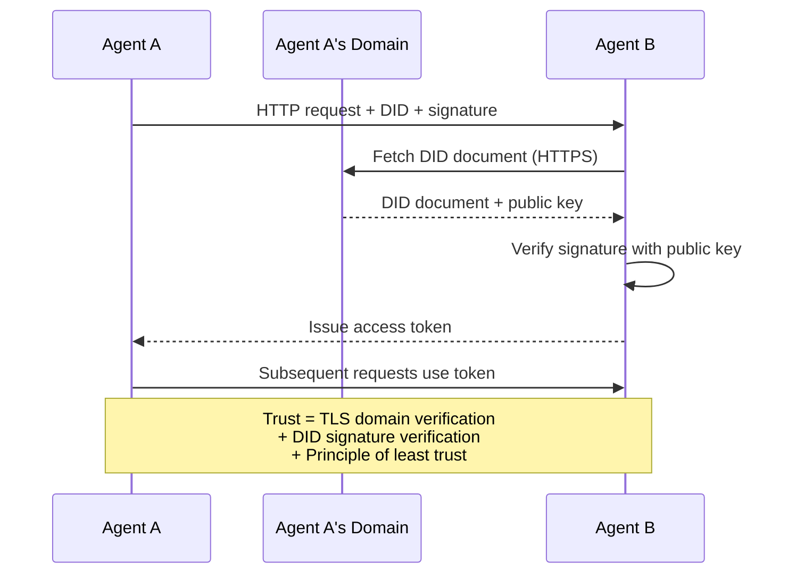

الثقة تأتي من ثلاثة مصادر:
1. **Domain-level TLS**يُحقق من استضافة الوثيقة DID
   中文翻译:**域级 TLS**验证 DID 文档主机
2. **DID cryptographic signatures**التحقق من هوية الوكيل
   中文翻译:**DID 加密签名**验证 وكيل
3. **Principle of least trust**يمنح الحد الأدنى من الإذنات فقط
   中文翻译:**最小信任原则**فقط منح الحد الأدنى من الحقوق

التصميم الثلاثي المصدر يتجنب نقاط الفشل الفردية. TLS وحدها غير كافية (أي شخص لديه شهادة يمكن استضافة DID). DID وحدها غير كافية (مفتاح مسروق مزيف الهوية). جنبا إلى جنب مع أقل اعتماد تصريح، تحصل على الدفاع في عمق دون سلطة مركزية.

> ثلاثة مصادر تصميم تجنب نقطة واحدة فاشلة. فقط TLS لا يكفي.

لا توجد نشر ثقة مبني على الشائعات أو تسجيل صفحة المرتبة يمكنك التحقق من كل عميل مباشرة من خلال هوية الشخصية

> لا يوجد أي تقرير أو تصنيف على الصفحة

#### التفاوض في البروتوكول المنتظم

هذه هي أحدث ميزة في ANP عندما يلتقي اثنان من العملاء من النظم البيئية المختلفة، فإنهم لا يحتاجون إلى تنسيقات بيانات متفق عليها مسبقا.

> هذه هي أحدث وظيفة للإنب. عندما يتواجد وكيل من نظام بيئي مختلف، فإنه لا يحتاج إلى شكل بيانات محدد مسبقا.

```json
{
  "action": "protocolNegotiation",
  "sequenceId": 0,
  "candidateProtocols": "I can communicate using:\n1. JSON-RPC with hotel booking schema\n2. REST with OpenAPI 3.1 spec\n3. Natural language over HTTP",
  "modificationSummary": "Initial proposal",
  "status": "negotiating"
}
```

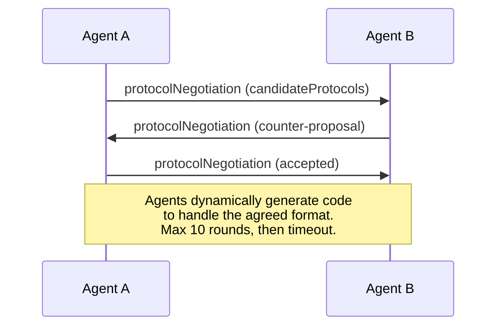

يقوم العملاء بالذهاب والعودة (حوالي 10 جولات) حتى يتفقوا على شكل، ثم يقومون بتوليد رمز ديناميكي للتعامل معه.`negotiating`،`rejected`،`accepted`،`timeout`. . .

> العامل عودة للتشاور ((أغلب 10 دورات) حتى يتم التوصل إلى صيغة متفقة، ثم الحركة توليد كود للتعامل معها.`negotiating`(مجلس النقاش)`rejected`(رفض)`accepted`(قبل)`timeout`(توقيت)

هذا يعني أن عملاءين لم يراهم من قبل يمكنهم معرفة كيفية التواصل دون أن يحدد أحد مخططًا مشتركًا مسبقاً.

> هذا يعني أن اثنين من العملاء الذين لم يسبق لهم أن يلتقوا يمكن أن يجدوا طريقة للتواصل دون وجود شخص محدد سابقة لنموذج المشاركة.

الرؤية: شبكة عملاء مفتوحة حيث يمكن لأي عميل التحدث إلى أي عميل آخر ، دون عمل إدماج سابق. ما إذا كان هذا يتجاوز عرضات الألعاب هو سؤال مفتوح في عام 2026.

> 愿景: مفتوح الوكيل 网络 任何 وكيل يمكن أن يكون مع أي وكيل آخر 临时对话, بدون الحاجة إلى قبل المدة التجميع العمل .

### المقارنة (مصححة)

| | MCP | A2A | ACP | ANP |
|---|---|---|---|---|
| **Created by** | Anthropic | Google / Linux Foundation | IBM / BeeAI | Community |
| **Spec format** | JSON-RPC | JSON-RPC / REST / gRPC | OpenAPI 3.1 (REST) | JSON-RPC |
| **Primary use** | Agent to Tool | Agent to Agent | Agent to Agent | Agent to Agent |
| **Discovery** | Tool listing | `/.well-known/agent-card.json` | `GET /agents`, `/.well-known/agent.yml` | `/.well-known/agent-descriptions`, DID service endpoints |
| **Identity** | Implicit (local) | Security schemes (OAuth, mTLS) | Server-level | W3C DID (`did:wba`) with E2EE |
| **Audit trail** | N/A | Basic (task history) | TrajectoryMetadata (tool calls, reasoning) | Not formally specified |
| **State machine** | N/A | 9 task states | 7 run states | N/A |
| **Streaming** | N/A | SSE | SSE | Transport-agnostic |
| **Unique feature** | Tool schemas | Agent Cards + Skills | Trajectory audit trail | Meta-protocol negotiation |
| **Best for** | Tools & data | Dynamic collaboration | Regulated industries | Cross-org trust |
| **Status** | Stable | Stable (v1.0) | Merging into A2A | Active development |

### كيف يعملون معاً

هذه البروتوكولات ليست متبادلة. نظام مؤسسة واقعي يستخدم العديد من:

> هذه الاتفاقيات ليست متبادلة. نظام عمل حقيقي يستخدم العديد من الاتفاقيات:

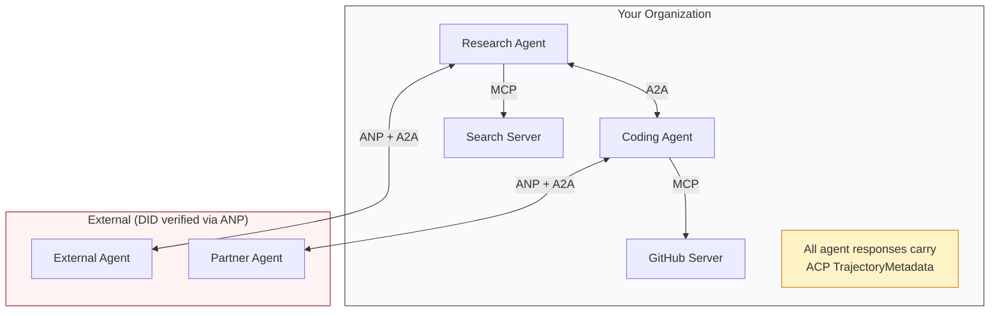

- **MCP**يربط كل عامل بأدواته
  中文翻译:**MCP**كل عميل يتصل بأدواته
- **A2A**يتعامل مع التعاون بين الوكلاء (الداخليين والخارجيين)
  中文翻译:**A2A**处理 وكيل 之间的协作(内部和外部)
- **ACP**يحتوي على الاستجابات في بيانات المياه المتحركة من أجل قابلية التحقيق
  中文翻译:**ACP**استخدام السكة البيانات المعبأة استجابة لتحقيق قابلية للتدقيق
- **ANP**يوفر التحقق من الهوية للعملاء الذين لا تسيطر عليهم
  中文翻译:**ANP**لم تكن لديك أي سيطرة على العميل

## بناء ذلك تحرك لتحقيق
```figure
swarm-message-bus
```

## بناءها

### الخطوة الأولى: أنواع الرسائل الأساسية

كل نظام متعدد الوكلاء يبدأ بتصميم رسالة، ونحن نعرّف أنواع التي تعرض ما تستخدمه البروتوكولات الحقيقية:

> كل نظام وكيل مختلف يبدأ بأسلوب رسالة.

```typescript
import crypto from "node:crypto";

type MessageRole = "user" | "agent";

type MessagePart =
  | { kind: "text"; text: string }
  | { kind: "data"; data: unknown; mediaType: string }
  | { kind: "file"; name: string; url: string; mediaType: string };

type TrajectoryEntry = {
  reasoning: string;
  toolName?: string;
  toolInput?: unknown;
  toolOutput?: unknown;
  timestamp: number;
};

type AgentMessage = {
  id: string;
  role: MessageRole;
  parts: MessagePart[];
  trajectory?: TrajectoryEntry[];
  replyTo?: string;
  timestamp: number;
};

function createMessage(
  role: MessageRole,
  parts: MessagePart[],
  replyTo?: string
): AgentMessage {
  return {
    id: crypto.randomUUID(),
    role,
    parts,
    replyTo,
    timestamp: Date.now(),
  };
}

function textMessage(role: MessageRole, text: string): AgentMessage {
  return createMessage(role, [{ kind: "text", text }]);
}
```

لاحظ:`MessagePart`هو متعددة الحركات (نص، بيانات مهيكلة، ملفات) تماما مثل المواصفات الحقيقية A2A و ACP. `TrajectoryEntry`يحتوي على سلسلة التفكير، مماثلة لتقنية "ميتاداتا" التي يستخدمها أوكي.

> انتباه:`MessagePart`هو نوع من المواد (مصدرات، بيانات، وثائق) ، مثل A2A الحقيقي و ACP`TrajectoryEntry`捕获推理链,匹配 ACP's TrajectoryMetadata‬

### الخطوة الثانية: بطاقة وكيل A2A و سجل

بناء اكتشاف وكيل الذي يطابق المواصفات الحقيقية A2A:

> 构建匹配真 A2A 规范的代理 发现:

```typescript
type Skill = {
  id: string;
  name: string;
  description: string;
  tags: string[];
  inputModes: string[];
  outputModes: string[];
};

type AgentCard = {
  name: string;
  description: string;
  version: string;
  url: string;
  capabilities: {
    streaming: boolean;
    pushNotifications: boolean;
  };
  defaultInputModes: string[];
  defaultOutputModes: string[];
  skills: Skill[];
};

class AgentRegistry {
  private cards: Map<string, AgentCard> = new Map();

  register(card: AgentCard) {
    this.cards.set(card.name, card);
  }

  discoverBySkillTag(tag: string): AgentCard[] {
    return [...this.cards.values()].filter((card) =>
      card.skills.some((skill) => skill.tags.includes(tag))
    );
  }

  discoverByInputMode(mimeType: string): AgentCard[] {
    return [...this.cards.values()].filter(
      (card) =>
        card.defaultInputModes.includes(mimeType) ||
        card.skills.some((skill) => skill.inputModes.includes(mimeType))
    );
  }

  resolve(name: string): AgentCard | undefined {
    return this.cards.get(name);
  }

  listAll(): AgentCard[] {
    return [...this.cards.values()];
  }
}
```

هذا أكثر غنى بكثير من خريطة سمة إلى قدرة بسيطة. يمكنك اكتشاف العاملين من خلال علامات المهارات، من خلال أشكال إدخال MIME، أو من خلال الاسم، تماما كما يدعم المواصفات الحقيقية A2A.

> هذا أكثر من مجرد اسم إلى قدرة تخطيط المعلومات. يمكنك من خلال علامات مهارات، إدخال MIME نوع أو اسم العثور على وكيل، مثل حقيقية A2A  المواصفات دعم.

### الخطوة الثالثة: دورة حياة المهام A2A

قم ببناء آلة حالة المهمة الكاملة:

> 构建完整的任务状态机:

```typescript
type TaskState =
  | "submitted"
  | "working"
  | "input-required"
  | "auth-required"
  | "completed"
  | "failed"
  | "canceled"
  | "rejected";

const TERMINAL_STATES: TaskState[] = [
  "completed",
  "failed",
  "canceled",
  "rejected",
];

type TaskStatus = {
  state: TaskState;
  message?: AgentMessage;
  timestamp: number;
};

type Artifact = {
  id: string;
  name: string;
  parts: MessagePart[];
};

type Task = {
  id: string;
  contextId: string;
  status: TaskStatus;
  artifacts: Artifact[];
  history: AgentMessage[];
};

type TaskEvent =
  | { kind: "statusUpdate"; taskId: string; status: TaskStatus }
  | {
      kind: "artifactUpdate";
      taskId: string;
      artifact: Artifact;
      append: boolean;
      lastChunk: boolean;
    };

type TaskHandler = (
  task: Task,
  message: AgentMessage
) => AsyncGenerator<TaskEvent>;

class TaskManager {
  private tasks: Map<string, Task> = new Map();
  private handlers: Map<string, TaskHandler> = new Map();
  private listeners: Map<string, ((event: TaskEvent) => void)[]> = new Map();

  registerHandler(agentName: string, handler: TaskHandler) {
    this.handlers.set(agentName, handler);
  }

  subscribe(taskId: string, listener: (event: TaskEvent) => void) {
    const existing = this.listeners.get(taskId) ?? [];
    existing.push(listener);
    this.listeners.set(taskId, existing);
  }

  async sendMessage(
    agentName: string,
    message: AgentMessage,
    contextId?: string
  ): Promise<Task> {
    const handler = this.handlers.get(agentName);
    if (!handler) {
      const task = this.createTask(contextId);
      task.status = {
        state: "rejected",
        timestamp: Date.now(),
        message: textMessage("agent", `No handler for ${agentName}`),
      };
      return task;
    }

    const task = this.createTask(contextId);
    task.history.push(message);
    task.status = { state: "submitted", timestamp: Date.now() };

    this.processTask(task, handler, message).catch((err) => {
      task.status = {
        state: "failed",
        timestamp: Date.now(),
        message: textMessage("agent", String(err)),
      };
    });
    return task;
  }

  getTask(taskId: string): Task | undefined {
    return this.tasks.get(taskId);
  }

  cancelTask(taskId: string): boolean {
    const task = this.tasks.get(taskId);
    if (!task || TERMINAL_STATES.includes(task.status.state)) return false;
    task.status = { state: "canceled", timestamp: Date.now() };
    this.emit(taskId, {
      kind: "statusUpdate",
      taskId,
      status: task.status,
    });
    return true;
  }

  private createTask(contextId?: string): Task {
    const task: Task = {
      id: crypto.randomUUID(),
      contextId: contextId ?? crypto.randomUUID(),
      status: { state: "submitted", timestamp: Date.now() },
      artifacts: [],
      history: [],
    };
    this.tasks.set(task.id, task);
    return task;
  }

  private async processTask(
    task: Task,
    handler: TaskHandler,
    message: AgentMessage
  ) {
    task.status = { state: "working", timestamp: Date.now() };
    this.emit(task.id, {
      kind: "statusUpdate",
      taskId: task.id,
      status: task.status,
    });

    try {
      for await (const event of handler(task, message)) {
        if (TERMINAL_STATES.includes(task.status.state)) break;

        if (event.kind === "statusUpdate") {
          task.status = event.status;
        }
        if (event.kind === "artifactUpdate") {
          const existing = task.artifacts.find(
            (a) => a.id === event.artifact.id
          );
          if (existing && event.append) {
            existing.parts.push(...event.artifact.parts);
          } else {
            task.artifacts.push(event.artifact);
          }
        }
        this.emit(task.id, event);
      }
    } catch (err) {
      task.status = {
        state: "failed",
        timestamp: Date.now(),
        message: textMessage("agent", String(err)),
      };
      this.emit(task.id, {
        kind: "statusUpdate",
        taskId: task.id,
        status: task.status,
      });
    }
  }

  private emit(taskId: string, event: TaskEvent) {
    for (const listener of this.listeners.get(taskId) ?? []) {
      listener(event);
    }
  }
}
```

هذا ينفذ دورة حياة المهمة الحقيقية A2A: المقدمة، والعمل، والمستحقة من المدخلات، والحالات المحطة. المعاملون هي مولدات التزامية التي تنتج الأحداث (تحديثات الحالة وقطع الأثاث) التي تطابق نموذج SSE التدفق.

> هذا تحقق حقيقية A2A  المهام دورة حياة:مقدم ‬العمل ‬المدخل مطلوب ‬الموقف النهائي‬‬‬‬‬‬‬‬‬‬‬‬‬‬‬‬‬‬‬‬‬‬‬‬‬‬‬‬‬‬‬‬‬‬‬‬‬‬‬‬‬‬‬‬‬‬‬‬‬‬‬‬‬‬‬‬‬‬‬‬‬‬‬‬‬‬‬‬‬‬‬‬‬‬‬‬‬‬‬‬‬‬‬‬‬‬‬‬‬‬‬‬‬‬‬‬‬‬‬‬‬‬‬‬‬‬‬‬‬‬‬‬‬‬‬‬‬‬‬‬‬‬‬‬‬‬‬‬‬‬‬‬‬‬‬‬‬‬‬‬‬‬‬‬‬‬‬‬‬‬‬‬‬‬‬‬‬‬‬‬‬‬‬‬‬‬‬‬‬‬‬‬‬‬‬‬‬‬‬‬‬‬‬‬‬‬‬‬‬‬‬‬‬‬‬‬‬‬‬‬‬‬‬‬‬‬‬‬‬‬‬‬‬‬‬‬‬‬‬‬‬‬‬‬‬‬‬‬‬‬‬‬‬‬‬‬‬‬‬‬‬‬‬‬‬‬‬‬‬‬‬‬‬‬‬‬‬‬‬‬‬‬‬‬‬‬‬‬‬‬‬‬‬‬‬‬‬‬‬‬‬‬‬‬‬‬‬‬‬‬‬‬‬‬‬‬‬‬‬‬‬‬‬‬‬‬‬‬‬‬‬‬‬‬‬‬‬‬‬‬‬‬‬‬‬‬‬‬‬‬‬‬‬‬‬‬‬‬‬‬‬‬‬‬‬‬‬‬‬‬‬‬‬‬‬‬‬‬‬‬‬‬‬‬‬‬‬‬‬‬‬‬‬‬‬‬‬‬‬‬‬‬‬‬‬‬‬‬‬‬‬‬‬‬‬‬‬‬‬‬‬‬‬‬‬‬‬‬‬‬‬‬‬‬‬‬‬‬‬‬‬‬‬‬‬‬‬‬‬‬‬‬‬‬‬‬‬‬‬‬‬‬‬‬‬‬‬‬‬‬‬‬‬‬‬‬‬‬‬‬‬‬‬‬‬‬‬‬‬‬‬‬‬‬‬‬‬‬‬

### الخطوة الرابعة: مسار مراجعة النمط الأفريقي

إغلاق الاتصالات مع تتبع المسار:

> استخدام المسار تتبع المعلومات المحتملة:

```typescript
type AuditEntry = {
  runId: string;
  agentName: string;
  input: AgentMessage[];
  output: AgentMessage[];
  trajectory: TrajectoryEntry[];
  status: "created" | "in-progress" | "completed" | "failed" | "awaiting";
  startedAt: number;
  completedAt?: number;
  sessionId?: string;
};

class AuditableRunner {
  private log: AuditEntry[] = [];
  private handlers: Map<
    string,
    (input: AgentMessage[]) => Promise<{
      output: AgentMessage[];
      trajectory: TrajectoryEntry[];
    }>
  > = new Map();

  registerAgent(
    name: string,
    handler: (input: AgentMessage[]) => Promise<{
      output: AgentMessage[];
      trajectory: TrajectoryEntry[];
    }>
  ) {
    this.handlers.set(name, handler);
  }

  async run(
    agentName: string,
    input: AgentMessage[],
    sessionId?: string
  ): Promise<AuditEntry> {
    const entry: AuditEntry = {
      runId: crypto.randomUUID(),
      agentName,
      input: structuredClone(input),
      output: [],
      trajectory: [],
      status: "created",
      startedAt: Date.now(),
      sessionId,
    };
    this.log.push(entry);

    const handler = this.handlers.get(agentName);
    if (!handler) {
      entry.status = "failed";
      return entry;
    }

    entry.status = "in-progress";
    try {
      const result = await handler(input);
      entry.output = structuredClone(result.output);
      entry.trajectory = structuredClone(result.trajectory);
      entry.status = "completed";
      entry.completedAt = Date.now();
    } catch (err) {
      entry.status = "failed";
      entry.trajectory.push({
        reasoning: `Error: ${String(err)}`,
        timestamp: Date.now(),
      });
      entry.completedAt = Date.now();
    }
    return entry;
  }

  getFullAuditLog(): AuditEntry[] {
    return structuredClone(this.log);
  }

  getAuditLogForAgent(agentName: string): AuditEntry[] {
    return structuredClone(
      this.log.filter((e) => e.agentName === agentName)
    );
  }

  getAuditLogForSession(sessionId: string): AuditEntry[] {
    return structuredClone(
      this.log.filter((e) => e.sessionId === sessionId)
    );
  }

  getTrajectoryForRun(runId: string): TrajectoryEntry[] {
    const entry = this.log.find((e) => e.runId === runId);
    return entry ? structuredClone(entry.trajectory) : [];
  }
}
```

كل عملية تنفيذ وكيل تنتج مدخلات مراجعة كاملة: ما دخل، ما خرج، والمسار الكامل من الدعوات الأداة والخطوات التفكير بينهما. يمكنك الاستفسار عن طريق وكيل، من خلال جلسة، أو من خلال تشغيل فردي.

> كل مرة يقوم بها الوكيل يُنتج فيها إدراجًا كاملًا: ما أدخل، ما أخرج، وكذلك المسار الكامل بين إعداد الأدوات وتقييم الخطوات.

### الخطوة 5: التحقق من الهوية في نمط ANP

بناء الهوية والتحقق القائم على DID:

> بناء على هوية و إثبات DID:

```typescript
type VerificationMethod = {
  id: string;
  type: string;
  controller: string;
  publicKeyDer: string;
};

type DIDDocument = {
  id: string;
  verificationMethod: VerificationMethod[];
  authentication: string[];
  keyAgreement: string[];
  humanAuthorization: string[];
  service: { id: string; type: string; serviceEndpoint: string }[];
};

type AgentIdentity = {
  did: string;
  document: DIDDocument;
  privateKey: crypto.KeyObject;
  publicKey: crypto.KeyObject;
};

class IdentityRegistry {
  private documents: Map<string, DIDDocument> = new Map();

  publish(doc: DIDDocument) {
    this.documents.set(doc.id, doc);
  }

  resolve(did: string): DIDDocument | undefined {
    return this.documents.get(did);
  }

  verify(did: string, signature: string, payload: string): boolean {
    const doc = this.documents.get(did);
    if (!doc) return false;

    const authKeyIds = doc.authentication;
    const authKeys = doc.verificationMethod.filter((vm) =>
      authKeyIds.includes(vm.id)
    );

    for (const key of authKeys) {
      const publicKey = crypto.createPublicKey({
        key: Buffer.from(key.publicKeyDer, "base64"),
        format: "der",
        type: "spki",
      });
      const isValid = crypto.verify(
        null,
        Buffer.from(payload),
        publicKey,
        Buffer.from(signature, "hex")
      );
      if (isValid) return true;
    }
    return false;
  }

  requiresHumanAuth(did: string, operationKeyId: string): boolean {
    const doc = this.documents.get(did);
    if (!doc) return false;
    return doc.humanAuthorization.includes(operationKeyId);
  }
}

function createIdentity(domain: string, agentName: string): AgentIdentity {
  const did = `did:wba:${domain}:agent:${agentName}`;
  const { publicKey, privateKey } = crypto.generateKeyPairSync("ed25519");

  const publicKeyDer = publicKey
    .export({ format: "der", type: "spki" })
    .toString("base64");

  const keyId = `${did}#key-1`;
  const encKeyId = `${did}#key-x25519-1`;

  const document: DIDDocument = {
    id: did,
    verificationMethod: [
      {
        id: keyId,
        type: "Ed25519VerificationKey2020",
        controller: did,
        publicKeyDer,
      },
      {
        id: encKeyId,
        type: "X25519KeyAgreementKey2019",
        controller: did,
        publicKeyDer,
      },
    ],
    authentication: [keyId],
    keyAgreement: [encKeyId],
    humanAuthorization: [],
    service: [
      {
        id: `${did}#agent-description`,
        type: "AgentDescription",
        serviceEndpoint: `https://${domain}/agents/${agentName}/ad.json`,
      },
    ],
  };

  return { did, document, privateKey, publicKey };
}

function signPayload(identity: AgentIdentity, payload: string): string {
  return crypto
    .sign(null, Buffer.from(payload), identity.privateKey)
    .toString("hex");
}
```

هذا يعكس نموذج الهوية الحقيقي لـ ANP: لدى العملاء وثائق DID مع تصديق منفصل وموافقة مفتاحية ومفاتيح تصريح بشرية.`IdentityRegistry`يحاكي قرار DID (في الإنتاج هذا سيكون HTTP جلب إلى نطاق الوكيل).

> هذا يعكس نموذج أنبوية حقيقية: وكيل لديه وثائق DID ذات صلة بالتحديد المميزات والاتفاقية المفتاحية والمركز المفروض الإصطناعي.`IdentityRegistry`模拟 DID 解析 (((في بيئة الإنتاج، هذا سيكون إلى النظام الوكيل HTTP 获取)

### الخطوة 6: بوابة البروتوكول

قم بتوصيل جميع البروتوكولات الأربعة إلى نظام موحد:

> كل البروتوكولات الأربعة متصلة بنظام موحد:

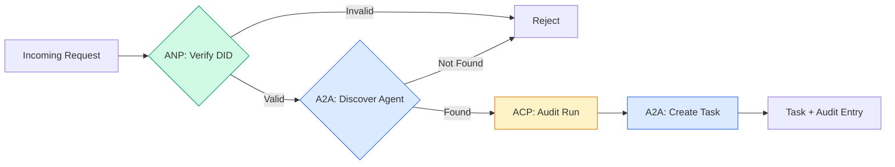

```typescript
class ProtocolGateway {
  private registry: AgentRegistry;
  private taskManager: TaskManager;
  private auditRunner: AuditableRunner;
  private identityRegistry: IdentityRegistry;

  constructor(
    registry: AgentRegistry,
    taskManager: TaskManager,
    auditRunner: AuditableRunner,
    identityRegistry: IdentityRegistry
  ) {
    this.registry = registry;
    this.taskManager = taskManager;
    this.auditRunner = auditRunner;
    this.identityRegistry = identityRegistry;
  }

  async delegateTask(
    fromDid: string,
    signature: string,
    targetAgent: string,
    message: AgentMessage,
    sessionId?: string
  ): Promise<{ task: Task; audit: AuditEntry } | { error: string }> {
    if (!this.identityRegistry.verify(fromDid, signature, message.id)) {
      return { error: "Identity verification failed" };
    }

    const card = this.registry.resolve(targetAgent);
    if (!card) {
      return { error: `Agent ${targetAgent} not found in registry` };
    }

    const audit = await this.auditRunner.run(
      targetAgent,
      [message],
      sessionId
    );
    const task = await this.taskManager.sendMessage(targetAgent, message);

    return { task, audit };
  }

  discoverAndDelegate(
    fromDid: string,
    signature: string,
    skillTag: string,
    message: AgentMessage
  ): Promise<{ task: Task; audit: AuditEntry } | { error: string }> {
    const candidates = this.registry.discoverBySkillTag(skillTag);
    if (candidates.length === 0) {
      return Promise.resolve({
        error: `No agents found with skill tag: ${skillTag}`,
      });
    }
    return this.delegateTask(
      fromDid,
      signature,
      candidates[0].name,
      message
    );
  }
}
```

البوابة تفعل أربعة أشياء في مكالمة واحدة:
1. **ANP**: يُحقق من هوية المتصل عبر توقيع DID
   中文翻译:**ANP**: من خلال DID 签名验证调用者身份
2. **A2A**: يكتشف العميل المستهدف ويتحقق من قدرات
   中文翻译:**A2A**: اكتشاف الجهد وكيل ومراقبة القدرة
3. **ACP**: يحتوي على تنفيذ في مسار مراجعة مع مسار
   中文翻译:**ACP**: استخدام المراقبة التابعة للتنفيذ
4. **A2A**: يخلق مهمة مع تتبع دورة الحياة الكاملة
   中文翻译:**A2A**: إنشاء مهمة تتبع دورة الحياة كاملة

### الخطوة السابعة: قم بتجميعها

```typescript
async function protocolDemo() {
  const registry = new AgentRegistry();
  registry.register({
    name: "researcher",
    description: "Searches and summarizes findings",
    version: "1.0.0",
    url: "https://researcher.local/a2a/v1",
    capabilities: { streaming: true, pushNotifications: false },
    defaultInputModes: ["text/plain"],
    defaultOutputModes: ["text/plain", "application/json"],
    skills: [
      {
        id: "web-research",
        name: "Web Research",
        description: "Searches the web",
        tags: ["research", "search", "summarization"],
        inputModes: ["text/plain"],
        outputModes: ["application/json"],
      },
    ],
  });
  registry.register({
    name: "coder",
    description: "Writes code from specs",
    version: "1.0.0",
    url: "https://coder.local/a2a/v1",
    capabilities: { streaming: false, pushNotifications: false },
    defaultInputModes: ["text/plain", "application/json"],
    defaultOutputModes: ["text/plain"],
    skills: [
      {
        id: "code-gen",
        name: "Code Generation",
        description: "Generates code",
        tags: ["coding", "generation"],
        inputModes: ["text/plain", "application/json"],
        outputModes: ["text/plain"],
      },
    ],
  });

  const taskManager = new TaskManager();
  const auditRunner = new AuditableRunner();

  const researchTrajectory: TrajectoryEntry[] = [];

  taskManager.registerHandler(
    "researcher",
    async function* (task, message) {
      yield {
        kind: "statusUpdate" as const,
        taskId: task.id,
        status: { state: "working" as const, timestamp: Date.now() },
      };

      researchTrajectory.push({
        reasoning: "Searching for React 19 documentation",
        toolName: "web_search",
        toolInput: { query: "React 19 compiler features" },
        toolOutput: {
          results: ["react.dev/blog/react-19", "github.com/react/react"],
        },
        timestamp: Date.now(),
      });

      researchTrajectory.push({
        reasoning: "Extracting key findings from search results",
        toolName: "doc_analysis",
        toolInput: { url: "react.dev/blog/react-19" },
        toolOutput: {
          summary:
            "React 19 compiler auto-memoizes, no manual useMemo needed",
        },
        timestamp: Date.now(),
      });

      yield {
        kind: "artifactUpdate" as const,
        taskId: task.id,
        artifact: {
          id: crypto.randomUUID(),
          name: "research-results",
          parts: [
            {
              kind: "data" as const,
              data: {
                findings: [
                  "React 19 compiler auto-memoizes components",
                  "No more manual useMemo/useCallback needed",
                  "Compiler runs at build time, not runtime",
                ],
                sources: ["react.dev/blog/react-19"],
              },
              mediaType: "application/json",
            },
          ],
        },
        append: false,
        lastChunk: true,
      };

      yield {
        kind: "statusUpdate" as const,
        taskId: task.id,
        status: { state: "completed" as const, timestamp: Date.now() },
      };
    }
  );

  auditRunner.registerAgent("researcher", async () => ({
    output: [
      textMessage("agent", "React 19 compiler auto-memoizes components"),
    ],
    trajectory: researchTrajectory,
  }));

  const identityRegistry = new IdentityRegistry();

  const coderIdentity = createIdentity("coder.local", "coder");
  const researcherIdentity = createIdentity("researcher.local", "researcher");

  identityRegistry.publish(coderIdentity.document);
  identityRegistry.publish(researcherIdentity.document);

  const gateway = new ProtocolGateway(
    registry,
    taskManager,
    auditRunner,
    identityRegistry
  );

  console.log("=== Protocol Demo ===\n");

  console.log("1. Agent Discovery (A2A)");
  const researchAgents = registry.discoverBySkillTag("research");
  console.log(
    `   Found ${researchAgents.length} agent(s):`,
    researchAgents.map((a) => a.name)
  );

  console.log("\n2. Identity Verification (ANP)");
  const message = textMessage("user", "Research React 19 compiler features");
  const signature = signPayload(coderIdentity, message.id);
  const verified = identityRegistry.verify(
    coderIdentity.did,
    signature,
    message.id
  );
  console.log(`   Coder DID: ${coderIdentity.did}`);
  console.log(`   Signature verified: ${verified}`);

  console.log("\n3. Task Delegation (A2A + ACP + ANP)");
  const result = await gateway.delegateTask(
    coderIdentity.did,
    signature,
    "researcher",
    message,
    "session-001"
  );

  if ("error" in result) {
    console.log(`   Error: ${result.error}`);
    return;
  }

  console.log(`   Task ID: ${result.task.id}`);
  console.log(`   Task state: ${result.task.status.state}`);
  console.log(`   Artifacts: ${result.task.artifacts.length}`);

  console.log("\n4. Audit Trail (ACP)");
  console.log(`   Run ID: ${result.audit.runId}`);
  console.log(`   Status: ${result.audit.status}`);
  console.log(`   Trajectory steps: ${result.audit.trajectory.length}`);
  for (const step of result.audit.trajectory) {
    console.log(`     - ${step.reasoning}`);
    if (step.toolName) {
      console.log(`       Tool: ${step.toolName}`);
    }
  }

  console.log("\n5. Full Audit Log");
  const fullLog = auditRunner.getFullAuditLog();
  console.log(`   Total runs: ${fullLog.length}`);
  for (const entry of fullLog) {
    const duration = entry.completedAt
      ? `${entry.completedAt - entry.startedAt}ms`
      : "in-progress";
    console.log(`   ${entry.agentName}: ${entry.status} (${duration})`);
  }
}

protocolDemo().catch((err) => {
  console.error("Protocol demo failed:", err);
  process.exitCode = 1;
});
```

## ما الذي يذهب خطأ

البروتوكولات تحل الطريق السعيد، إليك ما يفسد الإنتاج:

> حلّ الاتفاقية المسار الطبيعي، وهذه هي المشكلة التي تظهر في مجتمع الإنتاج:

**Schema drift.**العميل (أ) ينشر إعلان بطاقة العميل`application/json`النسخة. ولكن مخطط JSON يتغير بين الإصدارات. وكيل B يحتل النموذج القديم ويستقبل القمامة. تصحيح: إصدار مهاراتك وخطط الإصدار. تطبيق A2A يدعم `version`على العميل بطاقات لهذا السبب.

> **模式漂移。**العميل أ أصدرت إعلان`application/json`输出 وكيل 卡片── ولكن JSON 模式 يحدث تغيير بين الإصدارات── وكيل B 解析旧格式并得到垃圾数据──修复:版本化你的技能和输出模式──A2A 规范为此支持 وكيل 卡片上的`version`.

**State machine violations.**وكيل يُساعد على إعطاء`completed`الحدث، ثم يحاول أن يعطي المزيد من الأثاث. المهمة لا تتغير. رمزك يترك الصمت التحديثات أو يرمي. تصحيح: تحقق من حالة المحطة قبل الإعطاء.`TaskManager`أعلاه يفرض هذا مع `break`بعد الحالات النهائية.

> **状态机违规。**العميل  عملية المعالجة تخلق `completed`الحدث، ثم حاول أن تنتج المزيد من المواد. المهمة لا يمكن تغييرها.`TaskManager`                                                                                                                                                                                                                                                                                                                                                                                                                                                                                                                             `break`ليتم إجراءها

**Trust resolution failures.**يحاول العميل A التحقق من DID العميل B، ولكن النطاق العميل B هو منخفض. الوثيقة DID لا يمكن الحصول عليها. هل تفشل في فتح (قبل وكلاء غير مصدقين) أو تفشل في إغلاق (رفض كل شيء) ؟ توصي ANP بإغلاق الفشل مع مبدأ أقل ثقة.

> **信任解析失败。**العميل A 试试验证 العميل B 的 DID,但代理 B 的域名机已──DID 文档无法获取──你是开放失败 (你是开放失败) 接受未经验证的代理) 还是关闭失败 (拒绝一切)?ANP 建议以最小信任原则关闭失败──

**Trajectory bloat.**تسجيل المسار ACP قوي ولكن مكلف. وكيل معقد يقوم بـ 200 مكالمة أداة في كل جولة ينتج إدخالات تدقيق ضخمة. تصحيح: سجل المسار على مستويات الكلمات المتكاملة. سجل أسماء الأدوات و IO للتوافق، تخطي خطوات التفكير لحملات العمل غير المنظمة.

> **轨迹膨胀。**أوكي 轨迹日志功能强大但代价高昂―― وكيل معقد يقوم بتشغيل 200 أداة في كل عملية تصل إلى إنتاج عدد كبير من المواد المراجعة.

**Discovery thundering herd.**50 عميل كل استفسار `GET /agents`في نفس الوقت عند بدء العمل. إصلاح: تخزين بطاقات وكيل مع TTL، فترات اكتشاف التفاصيل، أو استخدام التسجيل القائم على دفع بدلا من استطلاع.

> **发现惊群。**50 عميل في وقت التشغيل في وقت واحد استفسار`GET /agents` تعديل: استخدام TTL 缓存 وكيل 卡片,交错发现间隔, أو استخدام على أساس تقديم التسجيل وليس استفسار

## استخدمها في إطار التنفيذ

### التنفيذ الحقيقي

**A2A**هو الأكثر نضجاً.[official spec](https://github.com/google/A2A)و هو مفتوح المصدر تحت مؤسسة لينكس. SDKs ل Python و TypeScript. إذا كان عملاءك يحتاجون إلى اكتشاف ديناميكي والتعاون، تبدأ من هنا.

> **A2A**هو الأكثر نضجاً.[官方规范](https://github.com/google/A2A)في Linux Foundation 下开源──有 Python 和 TypeScript SDK── إذا كان وكيلك 需要动态发现和合作,从这里开始──

**ACP**يدمج في A2A. IBM [BeeAI project](https://github.com/i-am-bee/acp)تم إنشاء ACP كبديل REST أولاً، ولكن مفهوم البيانات المتحركة في المسار يتم امتصاصها في النظام البيئي A2A. استخدم أنماط ACP (سجل المسار، دورة حياة التشغيل) حتى لو كنت تستخدم A2A كوسيلة النقل.

> **ACP**أنا في طريقها إلى A2A. IBM[BeeAI 项目](https://github.com/i-am-bee/acp)تم إنشاء ACP كإستبدال لـ REST، ولكن مفهوم البيانات المتداولة في السير يتم استيعابها في النظم الحيوية A2A.

**ANP**هو الأكثر تجريبية.[community repo](https://github.com/agent-network-protocol/AgentNetworkProtocol)يحتوي على بروتوكولات متتالية جديدة، تستحق المشاهدة للتنفيذ عبر المنظمات.

> **ANP**هو الأكثر تجربة[社区仓库](https://github.com/agent-network-protocol/AgentNetworkProtocol)هناك برنامج تنمية Python (SDK) ((AgentConnect) 

**MCP**إذا كنت تريد أن يستخدم العملاء الأدوات، فإن MCP هو المعيار.

> **MCP**إذا كنت تريد أن تجعل العميل استخدام الأدوات، MCP هو المعيار

### اختيار البروتوكول المناسب

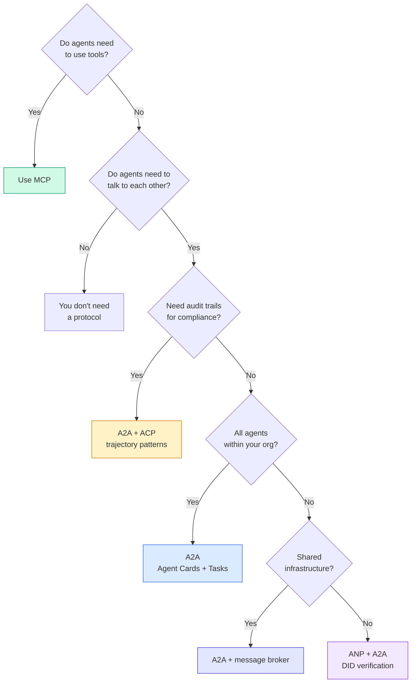

## أرسلها .

هذا الدرس ينتج عن:
- `code/main.ts`-- تنفيذ كامل لأربعة أنماط البروتوكول
  中文翻译:`code/main.ts` التنفيذ الكامل لأربعة أنواع من النموذج
- `outputs/prompt-protocol-selector.md`-- طلب يساعدك على اختيار البروتوكولات لنظامك
  中文翻译:`outputs/prompt-protocol-selector.md`  مساعدتك للنظام اختيار اتفاقية

## تمارين التدريب

1. **Multi-hop task delegation.**تمديد `TaskManager`لذا يمكن للمعاملين المختصين تفويض المهام الفرعية إلى العملاء الآخرين. يحصل الباحث على مهمة، ويمنح "البحث" و"التلخيص" للمهام الفرعية إلى عملاء متخصصين، ينتظر كل منهما أن يكتمل، ثم يدمج النتائج في أثاثه الخاصة.
   中文翻译:**多跳任务委派。**扩展 `TaskManager`، بحيث يمكن للعميل  إدارة العملية إلى المهام الأخرى الوكالة  المفوضية  المفوضية  المفوضية  المفوضية  المفوضية  المفوضية  المفوضية  المفوضية  المفوضية  المفوضية  المفوضية  المفوضية  المفوضية  المفوضية  المفوضية  المفوضية  المفوضية  المفوضية  المفوضية  المفوضية  المفوضية  المفوضية  المفوضية  المفوضية  المفوضية  المفوضية  المفوضية  المفوضية  المفوضية  المفوضية  المفوضية  المفوضية  المفوضية  المفوضية  المفوضية  المفوضية  المفوضية  المفوضية  المفوضية  المفوضية  المفوضية  المفوضية  المفوضية  المفوضية  المفوضية

2. **Streaming audit trail.**تعديل`AuditableRunner`بدلاً من الانتظار للنتيجة الكاملة،`AuditEntry`تحديثات في الوقت الحقيقي مع إضافة إدخالات المسار. استخدم مولد التزامنا الذي ينتج صور الفورية المراجعة.
   中文翻译:**流式审计跟踪。**修改 `AuditableRunner`في تأييده النموذج التدريجي.`AuditEntry`更新── استخدام产生审计快照的异步生成器──

3. **DID rotation.**إضافة دوران مفتاح إلى `IdentityRegistry`يجب أن يكون الوكيل قادرًا على نشر وثيقة DID الجديدة مع مفاتيح محدثة مع الحفاظ على الوصف`previousDid`الإشارة: يجب على المؤكدين قبول توقيعات من كل من المفتاح الحالي والسابق خلال فترة فترة.
   中文翻译:**DID 轮换。**إلى`IdentityRegistry`添加密钥轮换──الوكيل 应能够发布带有更新密钥的新DID 文档,同时维护 `previousDid`引用── المؤكد يجب أن يقبل توقيع المفاتيح الحالية والسبقية فى فترة طويلة.

4. **Protocol negotiation.**تنفيذ مفهوم البروتوكول المنتظم من قبل النظام الأساسي للإنترنت`protocolNegotiation`الرسائل ذات تنسيقات مرشحة (مثل "يمكنني التحدث JSON-RPC" مقابل "أفضل REST"). بعد ما يصل إلى 3 جولات ، يتفقون على تنسيق أو توقيت.`TaskManager`أو`AuditableRunner`يستخدمونها
   中文翻译:**协议协商。**تطبيق مفهوم الاتفاقية الوطنية للجنة الوطنية للترشيد`protocolNegotiation`消息(如"我可以说 JSON-RPC"对比"我更喜欢 REST")

5. **Rate-limited discovery.**إضافة`RateLimitedRegistry`الملفوف الذي يحفظ البحث عن بطاقة العميل مع TTL قابلة للتكوين ويحد من استفسارات الاكتشاف لكل عميل في الثانية. محاكاة مجموعة رعد من 100 عميل يكتشف بعضهم البعض عند بدء وتقييم الفرق.
   中文翻译:**限速发现。**إضافة واحدة`RateLimitedRegistry`包装器,使用可配置的 TTL 缓存 代理卡片查找,并限制每秒每个代理的发现查询──模拟100代理 启动时互相发现的惊群效应并测量差异──

## شروط الرئيسية

| Term | What people say | What it actually means |
|------|----------------|----------------------|
| MCP | "The protocol for AI tools" / "AI 工具协议" | A client-server protocol for agents to discover and use tools. Agent-to-tool, not agent-to-agent. / 用于 Agent 发现和使用工具的客户端-服务器协议。Agent 到工具，不是 Agent 到 Agent。 |
| A2A | "Google's agent protocol" / "Google 的 Agent 协议" | A peer-to-peer protocol for agent collaboration under the Linux Foundation. Discovery via Agent Cards, 9-state task lifecycle, streaming via SSE. Supports JSON-RPC, REST, and gRPC bindings. / Linux Foundation 下的 Agent 协作点对点协议。通过 Agent 卡片发现，9 状态任务生命周期，SSE 流。支持 JSON-RPC、REST 和 gRPC 绑定。 |
| ACP | "Enterprise agent messaging" / "企业 Agent 消息" | IBM/BeeAI's REST API for agent runs with TrajectoryMetadata: every response carries the full chain of reasoning and tool calls. Merging into A2A. / IBM/BeeAI 的 Agent 运行 REST API，带轨迹元数据：每个响应携带完整的推理链和工具调用。正在合并到 A2A。 |
| ANP | "Decentralized agent identity" / "去中心化 Agent 身份" | A community protocol using `did:wba` (DID) for cryptographic identity, HPKE for E2EE, and AI-powered meta-protocol negotiation for agents that have never seen each other. / 使用 `did:wba` (DID) 进行加密身份、HPKE 进行端到端加密、AI 驱动的元协议协商的社区协议。 |
| Agent Card / Agent 卡片 | "An agent's business card" / "Agent 的名片" | A JSON document at `/.well-known/agent-card.json` describing skills, supported MIME types, security schemes, and protocol bindings. / 描述技能、支持的 MIME 类型、安全方案和协议绑定的 JSON 文档。 |
| DID | "Decentralized ID" / "去中心化 ID" | W3C standard for cryptographically verifiable identities hosted on the agent's own domain. ANP uses `did:wba` method. / W3C 标准，用于托管在 Agent 自己域上的加密可验证身份。ANP 使用 `did:wba` 方法。 |
| TrajectoryMetadata / 轨迹元数据 | "The audit receipt" / "审计收据" | ACP's mechanism for attaching reasoning steps, tool calls, and their inputs/outputs to every agent response. / ACP 的机制，将推理步骤、工具调用及其输入/输出附加到每个 Agent 响应。 |
| Meta-protocol / 元协议 | "Agents negotiating how to talk" / "Agent 协商如何对话" | ANP's approach where agents use natural language to dynamically agree on data formats, then generate code to handle them. / ANP 的方法，Agent 使用自然语言动态就数据格式达成一致，然后生成代码处理。 |
| Task / 任务 | "A unit of work" / "工作单元" | A2A's stateful object tracking work from submission through completion. Immutable once terminal. / A2A 的有状态对象，跟踪从提交到完成的工作。一旦终态则不可变。 |

## المزيد من القراءة

- [Google A2A specification](https://github.com/google/A2A)-- المواصفات الرسمية و SDKs (v1.0.0، Linux Foundation)
  中文翻译:Google A2A 规范  官方规范和 SDK(v1.0.0,Linux Foundation)
- [IBM/BeeAI ACP specification](https://github.com/i-am-bee/acp)-- تطبيق OpenAPI 3.1 لتشغيل العملاء و بيانات المياه
  中文翻译:IBM/BeeAI ACP 规范  وكيل 运行和轨迹元数据的 OpenAPI 3.1 规范
- [Agent Network Protocol](https://github.com/agent-network-protocol/AgentNetworkProtocol)-- الهوية القائمة على DID، E2EE، مفاوضات البروتوكول المنتظم
  中文翻译:بروتوكول شبكة العملاء  基于 DID的身份、端到端加密、元协议协商
- [Model Context Protocol docs](https://modelcontextprotocol.io/)-- تخصيص MCP من Anthropic (المغطى في المرحلة 13)
  中文翻译:نموذج بروتوكول السياق 文档  الأنثروپي 的 MCP 规范(在阶段 13 中涵盖)
- [W3C Decentralized Identifiers](https://www.w3.org/TR/did-core/)-- معيار الهوية الذي يؤيد ANP
  中文翻译:W3C 去中心化标识符  支 ANP 的身份标准
- [RFC 9180 (HPKE)](https://www.rfc-editor.org/rfc/rfc9180)-- نظام التشفير الذي تستخدمه ANP لـ E2EE
  中文翻译:RFC 9180 (HPKE)  ANP يستخدم لتنظيم التشفير من نهاية إلى آخر
- [FIPA Agent Communication Language](http://www.fipa.org/specs/fipa00061/SC00061G.html)-- الرائد الأكاديمي للبروتوكولات الوكالة الحديثة
  中文翻译:FIPA Agent 通信语言  现代 Agent 协议的学术前身
