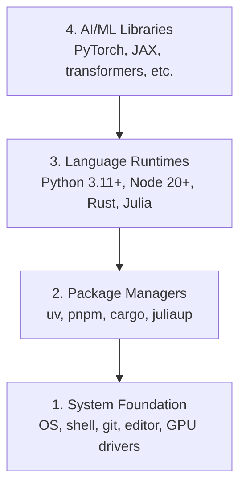

# Desarrollo de entorno desarrollo de entorno construido

> Sus herramientas dan forma a su pensamiento.

> **【中文解读】**Tu herramienta forma tu pensamiento  Una vez y para siempre, una vez y para siempre. Este capítulo es el punto de partida de todo el curso: construirás un conjunto completo de AI  ingeniería y desarrollo de entorno (Python, Node.js, Rust  herramienta cadena), y comprobar si la GPU acelerar o no es útil.

**Type:** Build | **类型:** 构建
**Languages:** Python, Node.js, Rust | **语言:** Python, Node.js, Rust
**Prerequisites:** None | **前置知识:** 无
**Time:** ~45 minutes | **时间:** ~45 分钟

## Objetivos de aprendizaje

- Configure Python 3.11+, Node.js 20+, y cadenas de herramientas Rust desde cero
  Traducción: desde零 construir Python 3.11+、Node.js 20+ 和 Rust 工具链
- Configurar entornos virtuales y administradores de paquetes para edificaciones reproducibles
  Traducción:Configuración de ambiente virtual y paquete administrador, asegurar la construcción de la capacidad de reproducción
- Verificar el acceso de la GPU con CUDA/MPS y ejecutar una operación de tensor de prueba
  La aplicación de la CPU (cuda/mps) es de uso.
- Comprender la pila de cuatro capas: sistema, paquetes, tiempos de ejecución, bibliotecas de IA
  En español, el lenguaje de la lengua es el lenguaje de la lengua.

## El problema es describir el problema

Estás a punto de aprender ingeniería de IA en más de 500 lecciones usando Python, TypeScript, Rust y Julia. Si tu entorno se rompe, cada lección se convierte en una lucha contra la herramienta en lugar de aprender.

> Usted va a pasar por más de 500 clases de aprendizaje de desarrollo de ingeniería artificial, que involucran Python, TypeScript, Rust y Julia. Si su entorno tiene problemas, cada sección se convertirá en un instrumento de lucha, no en aprendizaje.

La mayoría de la gente omite la configuración del entorno y luego pasa horas debujando errores de importación, conflictos de versiones y controladores de CUDA faltantes.

> La mayoría de la gente saltó el ambiente construido. Luego pasaron unas horas probando la importación de errores, conflictos de versiones y la falta de CUDA.

> **【中文解读】**
> 环境问题是你遇到"import error""",版本冲突""",找不到 CUDA"等报错的根本原因──与其每次上课都修环境,不如一次性搭好──

## El concepto central.

Un entorno de ingeniería de IA tiene cuatro capas:

> El entorno de ingeniería artificial tiene cuatro niveles:



Installamos abajo arriba. Cada capa depende de la que está debajo de ella.

> Nos instalamos de abajo a arriba. Cada uno de los niveles depende de la otra.

> **【中文解读】**
> El entorno de ingeniería de IA es de cuatro niveles: el más bajo es el sistema operativo y el motor, el más alto es el administrador de paquetes, el más alto es el lenguaje de ejecución, el más alto es el PyTorch, los transformadores, etc.

> **【拓展：为什么需要 uv 而不是 pip？】**
> uv es un Python 包管理器 de Rust 写的, velocidad de pip 快 10-100 veces, también puede administrar automáticamente el ambiente virtual. En proyectos de IA reales, usted puede mantener al mismo tiempo la dependencia de varios proyectos, como uno con PyTorch 2.1, otro con 2.4),uv 能让环境隔离变得非常简单.
```figure
s0-env-stack
```

## Construye con la mano.

> **【中文解读】**Se pueden copiar y pegar directamente hasta el terminal de ejecución. Si utilizas Windows, recomienda utilizar WSL2 (Windows Subsistema para Linux) para obtener Linux 环境。

### Paso 1: Fundamento del sistema.

Compruebe su sistema e instale los elementos básicos.

> 检查你的系统并安装基础工具──

```bash
# macOS
xcode-select --install
brew install git curl wget

# Ubuntu/Debian
sudo apt update && sudo apt install -y build-essential git curl wget

# Windows (use WSL2)
wsl --install -d Ubuntu-24.04
```

### Paso 2: Python con UV. Paso 2: usar UV para instalar Python.

Usamos`uv`Es 10-100 veces más rápido que pip y maneja entornos virtuales automáticamente.

> Nosotros usamos`uv`Es 10-100 veces más rápido que el pip, y puede administrar automáticamente el ambiente virtual

> **【拓展：Python 版本选择】** Python 3.12                                                                                                                                                                                                                                                             `python install`会自动下载和管理 Python 版本, ya no se necesita pyenv.

```bash
curl -LsSf https://astral.sh/uv/install.sh | sh

uv python install 3.12

uv venv
source .venv/bin/activate  # or .venv\Scripts\activate on Windows

uv pip install numpy matplotlib jupyter
```

Verifique:

> 验证安装:

```python
import sys
print(f"Python {sys.version}")

import numpy as np
print(f"NumPy {np.__version__}")
a = np.array([1, 2, 3])
print(f"Vector: {a}, dot product with itself: {np.dot(a, a)}")
```

### Paso 3: Node.js con pnpm.

> **【中文解读】**Node.js es el ambiente de funcionamiento de TypeScript.

Para clases de TypeScript (agentes, servidores MCP, aplicaciones web).

> Utilizado en el tipo de escritura  cursos                                                                                                                                                                                                                                                                                                                                                                                                                                                                                                                    

```bash
curl -fsSL https://fnm.vercel.app/install | bash
fnm install 22
fnm use 22

npm install -g pnpm

node -e "console.log('Node', process.version)"
```

**macOS / Apple Silicon (M1/M2/M3/M4):**Si el instalador deja de instalar `Error: Cannot install under Rosetta 2 in ARM default prefix (/opt/homebrew)`, su terminal está funcionando bajo Rosetta 2 (`arch`huellas`i386`Instálle el arm64 forzador de fnm, cablealo en su caparazón, y luego vuelva a ejecutar los comandos anteriores desde `fnm install 22`¿Qué es esto ?

> **苹果芯片 Mac 用户注意**: Si instalador                                                                                                                                                                                                                                                                                                                                                                                                                                                                                                                          `Error: Cannot install under Rosetta 2 in ARM default prefix (/opt/homebrew)`, explicando que tu terminal funciona en Rosetta 2`arch`                                                                                                                                                                                                                                                                                                                                                                                                                                                                                                                             `i386`), mientras que Homebrew es original arm64  versión.`fnm install 22`开始重跑上的命令:

```bash
arch -arm64 brew install fnm
echo 'eval "$(fnm env --use-on-cd)"' >> ~/.zshrc
source ~/.zshrc
```

### Paso 4: Rust. Paso 4: Instalar Rust.

Para las lecciones críticas al rendimiento (inferencia, sistemas).

> Utiliza clases sensibles al rendimiento (¡¡¡¡¡¡¡¡¡¡¡¡¡¡¡¡¡¡¡¡¡¡¡¡¡¡¡¡¡¡¡¡¡¡¡¡¡¡¡¡¡¡¡¡¡¡¡¡¡¡¡¡¡¡¡¡¡¡¡¡¡¡¡¡¡¡¡¡¡¡¡¡¡¡¡¡¡¡¡¡¡¡¡¡¡¡¡¡¡¡¡¡¡¡¡¡¡¡¡¡¡¡¡¡¡¡¡¡¡¡¡¡¡¡¡¡¡¡¡¡¡¡¡¡¡¡¡¡¡¡¡¡¡¡¡¡¡¡¡¡¡¡¡¡¡¡¡¡¡¡¡¡¡¡¡¡¡¡¡¡¡¡¡¡¡¡¡¡¡¡¡¡¡¡¡¡¡¡¡¡¡¡¡¡¡¡¡¡¡¡¡¡¡¡¡¡¡¡¡¡¡¡¡¡¡¡¡¡¡¡¡¡¡¡¡¡¡¡¡¡¡¡¡¡¡¡¡¡¡¡¡¡¡¡¡¡¡¡¡¡¡¡¡¡¡¡¡¡¡¡¡¡¡¡¡¡¡¡¡¡¡¡¡¡¡¡¡¡¡¡¡¡¡¡¡¡¡¡¡¡¡¡¡¡¡¡¡¡¡¡¡¡¡¡¡¡¡¡¡¡¡¡¡¡¡¡¡¡¡¡¡¡¡¡¡¡¡¡¡¡¡¡¡¡¡¡¡¡¡¡¡¡¡¡¡¡¡¡¡¡¡¡¡¡¡¡¡¡¡¡¡¡¡¡¡¡¡¡¡¡¡¡¡¡¡¡¡¡¡¡¡¡¡¡¡¡¡¡¡¡¡¡¡¡¡¡¡¡¡¡¡¡¡¡¡¡¡¡¡¡¡¡¡¡¡¡¡¡¡¡¡¡¡¡¡¡¡¡¡¡¡¡¡¡¡¡¡¡¡¡¡¡¡¡¡¡¡¡¡¡¡¡¡¡¡¡¡¡¡¡¡¡¡¡¡¡¡¡¡¡¡¡¡¡¡¡¡¡¡¡¡¡¡¡¡¡¡¡¡¡¡¡¡¡¡¡¡¡¡¡¡¡¡¡¡¡¡¡¡¡¡

> **【中文解读】**Rust utiliza la parte sensible de la performance de este curso, como la optimización de la teoría (fase 12) y el sistema autónomo (fase 15-17): Rust es Rust 官方安装器, cargo es Rust 包管理器+构建工具 (equivalente a la Pip+make de la versión Rust)

```bash
curl --proto '=https' --tlsv1.2 -sSf https://sh.rustup.rs | sh

rustc --version
cargo --version
```

### Paso 5: Julia (opcional)

Para clases de matemáticas pesadas donde Julia brilla.

> Con el programa de matemáticas de Julia.

```bash
curl -fsSL https://install.julialang.org | sh

julia -e 'println("Julia ", VERSION)'
```

### Paso 6: Configuración de GPU (si tienes uno)

**NVIDIA (Linux / Windows):**

> **【中文解读】**NVIDIA 显卡先用 `nvidia-smi`确认驱动正常,重新安装 CUDA 版 PyTorch; 果芯片 Mac 没有 CUDA 属正常现象直接装默认版 PyTorch(内置 MPS/Metal 后端) 即可,不要传 `--index-url .../cuXXX`(Las ruedas sólo apoyan Linux/Windows, se han vuelto a perder)

```bash
nvidia-smi

# Install PyTorch with CUDA
uv pip install torch torchvision torchaudio --index-url https://download.pytorch.org/whl/cu124
```

**macOS / Apple Silicon (M1/M2/M3/M4):**No hay CUDA en un Mac que se espera, no un fracaso.**not**Pasé .`--index-url .../cuXXX`(aquellas ruedas son solo Linux / Windows, por lo que la instalación falla). Instale la construcción simple, que incluye el backend de la GPU MPS (Metal) de Apple:

> **macOS / 苹果芯片（M1/M2/M3/M4）**Esto es un comportamiento esperado, no es un error.`--index-url .../cuXXX`(aquelas ruedas                                                                                                                                                                                                                                                             

```bash
uv pip install torch torchvision torchaudio
```

Verificar (funciona en cualquier plataforma):

> 验证(任意平台通用):

```python
import torch
print(f"CUDA available: {torch.cuda.is_available()}")           # False on macOS — expected
print(f"MPS available:  {torch.backends.mps.is_available()}")   # True on Apple Silicon
if torch.cuda.is_available():
    print(f"GPU: {torch.cuda.get_device_name(0)}")
```

No hay GPU? No hay problema. La mayoría de las clases funcionan en CPU. Para las clases pesadas de entrenamiento, utilice Google Colab o GPUs en la nube.

> 没有 GPU?没关系── La mayor parte de los cursos se pueden ejecutar en la CPU── los cursos de gran cantidad de entrenamiento se pueden usar con Google Colab o GPU de nube──

> **【拓展：GPU vs CPU 性能对比】**训练 GPT-2 small(117M 参数):CPU 约7 天,单块 RTX 3090 约3 小时,A100 约40 分钟──推理阶段差距略小但仍然显著──本课程大部分课程可用CPU 跑,只有10阶段(从零训练LLM)等少数课程建议使用GPU──

> **【拓展：GPU 在 AI 中的作用】**
> GPU (graphic processor) es indispensable en la IA, es porque puede realizar al mismo tiempo miles de millones de simples cálculos.

### Paso 7: Verifique la ruta que quiere comenzar. Paso 7: Verifique la ruta que quiere comenzar.

ejecuta cada comando en esta lección desde la raíz del repositorio, el directorio que
contiene `README.md`y `phases/`El prevuelo sólo comprueba lo que necesitas .
comienza la ruta seleccionada. Salta las herramientas posteriores por defecto para que un nuevo aprendiz vea
una respuesta clara en lugar de un muro de advertencias.

> Todos los mandamientos de esta clase están en el registro de almacenamiento`README.md`Y `phases/`Pre-check script only check you start your chosen route (en inglés) (en inglés) (en inglés) (en inglés) (en inglés) (en inglés) (en inglés) (en inglés) (en inglés) (en inglés) (en inglés) (en inglés) (en inglés) (en inglés) (en inglés) (en inglés) (en inglés) (en inglés) (en inglés) (en inglés) (en inglés) (en inglés) (en inglés) (en inglés) (en inglés) (en inglés) (en inglés) (en inglés) (en inglés) (en inglés) (en inglés) (en inglés) (en inglés) (en inglés) (en inglés) (en inglés) (en inglés) (en inglés) (en inglés) (en inglés) (en inglés) (en inglés) (en inglés) (en inglés) (en inglés) (en inglés) (en inglés) (en inglés) (en inglés) (en inglés) (en inglés) (en inglés) (en inglés) (en inglés) (en inglés) (en inglés) (en inglés) (en inglés) (en inglés) (en inglés) (en inglés) (en inglés) (en inglés) (en inglés) (en inglés) (en inglés) (en inglés) (en inglés) (en inglés) (en inglés) (en inglés) (en inglés) (en inglés) (en inglés) (en inglés) (en inglés) (en inglés) (en inglés) (en inglés) (en inglés) (en inglés) (en inglés) (en inglés) (en inglés) (en inglés) (en inglés) (en inglés) (en inglés) (en inglés) (en inglés) (en inglés) (en anglais) (en anglais) (en anglais) (en anglais) (anglais) (anglais) (anglais) (anglais) (anglais) (anglais) (anglais) (anglais) (anglais) (anglais) (anglais) (anglais) (anglais) (anglais) (anglais) (anglaislaislaislaislaislaislaislais) (anglaislaislaislais) (anglaislaislaislaislaislaislaislaislaislaislaislaislaislais).

Comience la secuencia completa de principiantes:

> Início completo de la serie de estudiantes:

```bash
python3 phases/00-setup-and-tooling/01-dev-environment/code/verify.py --route beginner
```

O sólo compruebe la ruta que quieras:

> O sólo revisar tu camino de aprendizaje:

```bash
python3 phases/00-setup-and-tooling/01-dev-environment/code/verify.py --route ml-foundations
python3 phases/00-setup-and-tooling/01-dev-environment/code/verify.py --route llm-engineering
python3 phases/00-setup-and-tooling/01-dev-environment/code/verify.py --route agents
python3 phases/00-setup-and-tooling/01-dev-environment/code/verify.py --route mcp
python3 phases/00-setup-and-tooling/01-dev-environment/code/verify.py --route agent-skills
python3 phases/00-setup-and-tooling/01-dev-environment/code/verify.py --route certification
```

Añadir`--show-later`cuando se desea el mismo prevuelo para inspeccionar herramientas opcionales
Una herramienta posterior que no haya sido utilizada nunca bloqueará la
la ruta seleccionada.

> 想让预检同时检查后课程将使用可选工具和依赖时,加上 `--show-later`                                                                                                                                                                                                                                                              

Cada verificación requerida fallida incluye el camino detectado o el error de importación y un
Las habilidades de los agentes y las rutas de certificación también muestran
las comprobaciones manuales del host porque un script Python no puede probar que un host de IA tiene
Descubre una habilidad o que el alcance de habilidad que elijas es escritorio.

> Cada prueba de prueba obligatoria fallida se adjuntará a la prueba de un camino o de un error de importación, así como a una orden de revisión precisa.

Cuando el prevuelo de principiante pasa, imprime la primera lección ejecutable exacta:

> Cuando los estudiantes iniciales aprueban, el guión imprimirá el primer curso ejecutable:

```text
Ready to start Beginner course.
Next: python3 phases/01-math-foundations/01-linear-algebra-intuition/code/vectors.py
```

> **【中文解读】**预检脚本是"按路线最小环境"落地:beginner只需要Python和Git,ml-foundations 再加 NumPy,agentes/mcp 路线连 Node 都可以先不装用到再装.Windows usuario把命令里 `python3`换成   cambió`python`Es decir,

## Usa la guía.

> **【中文解读】**La siguiente tabla te dice en qué fases se utiliza el Python. La primera fase de Python es la principal: la primera fase de Python. La segunda fase de Python es la primera fase de Python. La segunda fase de Python es la primera fase de Python. La segunda fase de Python es la primera fase de Python.

Su entorno está listo para comenzar la ruta que comprobó.
Cuando una lección pide por ellos en lugar de bloquear su primera lección en su conjunto
Esto es lo que usará en todo el plan de estudios:

> Su entorno ya puede comenzar a revisar la línea que ha revisado. Después de todo, las herramientas y el tiempo de uso de la clase se vuelven a instalar.

| Language | Used In | Package Manager |
|----------|---------|-----------------|
| Python | Phases 1-12 (ML, DL, NLP, Vision, Audio, LLMs) | uv |
| TypeScript | Phases 13-17 (Tools, Agents, Swarms, Infra) | pnpm |
| Rust | Phases 12, 15-17 (Performance-critical systems) | cargo |
| Julia | Phase 1 (Math foundations) | Pkg |

| 语言 | 用在哪些阶段 | 包管理器 |
|------|------------|---------|
| Python | 阶段 1-12（ML、DL、NLP、视觉、音频、LLM） | uv |
| TypeScript | 阶段 13-17（工具、Agent、集群、基础设施） | pnpm |
| Rust | 阶段 12, 15-17（高性能系统） | cargo |
| Julia | 阶段 1（数学基础） | Pkg |

## Envíe el producto .

> **【拓展：环境检查 Prompt】** `outputs/prompt-env-check.md`Es un instante que se puede dar directamente a la AI para ayudar a diagnosticar problemas ambientales. En el trabajo real, este tipo de "instante de autoevaluación ambiental" es muy útil.

Esta lección produce un guión de verificación que cualquiera puede ejecutar para comprobar su configuración.

> Este curso ha producido un guión de verificación, cualquiera puede usarlo para revisar su propio ambiente.

¿ Qué ?`outputs/prompt-env-check.md`para una respuesta que ayuda a los asistentes de IA a diagnosticar problemas ambientales.

> 参见 `outputs/prompt-env-check.md`, que contiene una ayuda a la IA  asistente de diagnóstico de problemas ambientales inmediato.

## Los ejercicios.

1. Ejecutar el guión de verificación y corregir cualquier falla
   运行验证脚本并修复 todos los controles fallidos
2. Crear un entorno virtual Python para este curso e instalar PyTorch
   Para este curso crear Python  ambiente virtual y instalar PyTorch
3. Escriba un "hola mundo" en los cuatro idiomas y ejecuta cada uno
   Usando cuatro idiomas para escribir un "hola mundo" y funcionar
