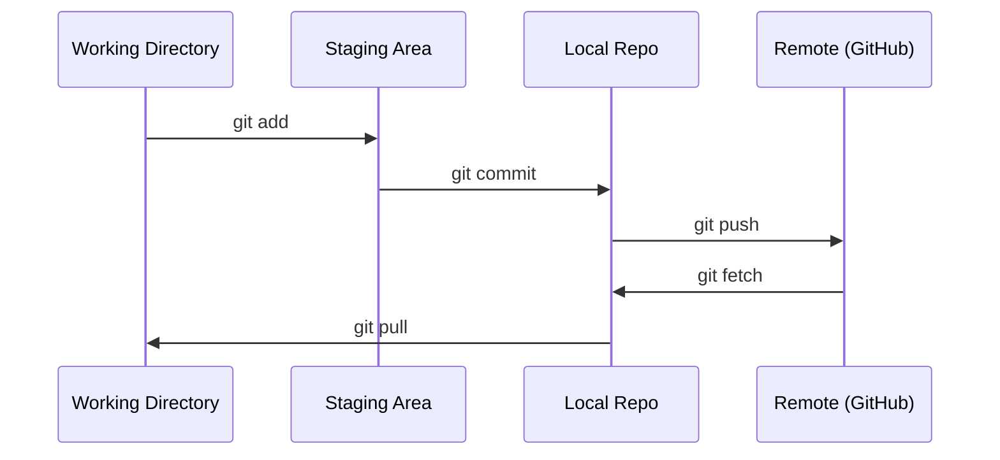

# Git y colaboración

> Cada experimento, modelo, lección se rastrea.
> Control de la versión no es opcional Cada experimento cada modelo cada resultado de cada sección de la clase

**Type:** Learn | **类型:** 学习
**Languages:** -- | **语言:** 无
**Prerequisites:** Phase 0, Lesson 01 | **前置知识:** Phase 0, 第 01 课
**Time:** ~30 minutes | **时间:** ~30 分钟

## Objetivos de aprendizaje

- Configurar la identidad de git y utilizar el flujo de trabajo diario de agregar, comprometer y empujar
  Configurar Git 身份信息, dominar agregar, hacer, empujar
- Crear y fusionar ramas para experimentos aislados sin romper el principal
  Traducción:Crear y juntar las partes, realizar la experiencia de separarse sin destruir las partes principales
- Escriba un`.gitignore`que excluye los puntos de control de modelo y los archivos binarios grandes
  Traducción:编写`.gitignore`文件, excluir modelos
- Navegar por el historial de compromisos con `git log`para comprender la evolución del proyecto
  En inglés:`git log`浏览提交历史, conocer el proceso de desarrollo del proyecto

> **【中文解读】**
> Git es una herramienta de control de versión, para rastrear cada modificación del código. En los proyectos de IA, usted modificará frecuentemente los parámetros y el código del modelo en el experimento, Git le permite volver a cualquier estado anterior.

> **【拓展：Git 在 AI 工程中的角色】**La IA 工程和传统软件开发不同每次实验(超参数调整、数据集变更) son una "versión"──con Git 追踪实验 significa: los resultados del entrenamiento han cambiado, puedes`git diff`Find out what has changed; modelo de implementación de problemas, puede `git revert`El proceso de trabajo de los grandes modelos de equipo (como Hugging Face) está completamente basado en Git.

## El problema es describir el problema

Estás a punto de escribir cientos de archivos de código en 20 fases sin control de versión perderás trabajo, romperás cosas que no puedes deshacer y no tendrás manera de colaborar con otros.

> Usted va a escribir cientos de documentos de código en 20 fases. Sin control de versión, perderá el resultado del trabajo.

Git es la herramienta. GitHub es donde vive el código. Esta lección cubre lo que necesitas para este curso y nada más.

> Git es un instrumento, GitHub es un lugar de gestión de código.

> **【中文解读】**
> Usted escribirá cientos de archivos de código, sin control de versión = 随时可能失去工作成果、无法回归、无法合作──Git 解决的就是这个问题──

## El concepto central.



Tres cosas que recordar:
1. Salvar con frecuencia (`git commit`(en inglés)
2. Empujar a la distancia (`git push`(en inglés)
3. Ramo de los experimentos (`git checkout -b experiment`(en inglés)

> Hay tres cosas que hay que recordar:
> 1. 经常保存(`git commit`(en inglés)
> 2. 推送到远程(`git push`(en inglés)
> 3. Usó la mano para hacer una experiencia.`git checkout -b experiment`(en inglés)

> **【中文解读】**
> GIT: 暂存区(git add)→ 本地仓库(git commit)→ 远程仓库(git push)。记住三件事:经常提交、推送到远程、用分支做实验。

> **【拓展：分支策略与 AI 实验】**AI  proyecto propone la estrategia "cada experimento una分支":`experiment/lr-0.001`¿Qué es esto?`experiment/add-dropout`Así que cada vez que el código del experimento cambia, se separa, el experimento fracasa directamente elimina la sección, el éxito se combina.`v1.0-baseline`), facilita la implementación en el código de la versión especificada.

## Construye y realiza.
```figure
s0-commit-dag
```

## Construye el mismo

### Paso 1: Configurar git

> Paso 1: Configurar Git

```bash
git config --global user.name "Your Name"
git config --global user.email "you@example.com"
```

### Paso 2: El flujo de trabajo diario

```bash
git status                              # 查看哪些文件有改动
git add file.py                         # 把改动加入暂存区
git commit -m "Add perceptron implementation"  # 提交到本地仓库
git push origin main                    # 推送到 GitHub 远程仓库
```

### Paso 3: Subdivisión para experimentos con la división de hacer experimentos.

```bash
git checkout -b experiment/new-optimizer  # 创建并切换到新分支

# ... make changes, commit ...  # 在新分支上修改和提交，不影响主分支

git checkout main                         # 切回主分支
git merge experiment/new-optimizer        # 把实验分支的改动合并到主分支
```

### Paso 4: Trabajar con este repuesto de curso.

> **【拓展：Fork vs Clone】**Si quieres conservar tu propio progreso de aprendizaje sin afectar el almacén original, usa`fork`(en GitHub 上操作) en lugar de clonar directamente. Después de la horquilla, tienes tu propia copia completa, puedes enviar libremente.

No se puede presionar al propio repo del curso  sólo los mantenedores tienen acceso a escribir.`origin`puntos en su propia copia:

```bash
git clone https://github.com/YOUR-USERNAME/ai-engineering-from-scratch.git
cd ai-engineering-from-scratch

git checkout -b my-progress
# work through lessons, commit your code
git push origin my-progress
```

## Usa la guía.

> **【拓展：.gitignore 在 AI 项目中至关重要】**AI  proyectos generará un gran número de no presentar grandes archivos: modelo`.pt`¿Qué es esto?`.safetensors`Hasta 10 GB) ≈ training日志、 datos`__pycache__`¿Qué es esto?`.venv`Un buen trabajo.`.gitignore`能防止 tú accidentalmente enviar un archivo de modelo de 10 GB a GitHub.`gitignore.io`生成 Python/ML 项目的模板──

Para este curso, necesitas exactamente estos comandos:

> En este curso sólo necesitas estas órdenes:

| Command | When |
|---------|------|
| `git clone` | Get the course repo |
| `git add` + `git commit` | Save your work |
| `git push` | Back it up to GitHub |
| `git checkout -b` | Try something without breaking main |
| `git log --oneline` | See what you've done |

| 命令 | 什么时候用 |
|------|-----------|
| `git clone` | 下载课程仓库 |
| `git add` + `git commit` | 保存你的工作 |
| `git push` | 备份到 GitHub |
| `git checkout -b` | 安全地尝试新想法 |
| `git log --oneline` | 查看你做了什么 |

No necesitas rebases, selección de cerezas o submodules para este curso.

> En este curso no se necesita una base de base o submodules.

## Los ejercicios.

1. Clonar este repo, crear una rama llamada `my-progress`, hacer un archivo, comprometerlo, empujarlo
   克隆仓库,创建 `my-progress`分支, nuevos documentos, presentar y enviar
1. Forque este repo, clone su tenedor, crea una rama llamada `my-progress`, hacer un archivo, comprometerlo, empujarlo
2. Crear un `.gitignore`que excluye los archivos de los puntos de control modelo (`.pt`¿ Qué ?`.pth`¿ Qué ?`.safetensors`(en inglés)
    Crear `.gitignore`文件, excluir modelos
3. Mira el historial de los compromisos de este repo con `git log --oneline`y leer cómo se agregaron las lecciones
   ¿ Qué ?`git log --oneline`查看提交历史, conocer cómo el curso es construido paso a paso

## Términos clave .

> **【中文解读】**Compromiso (comprometido) = 项目快照,Ramión (Ramión) = 独立开发线,Merge (Merger) = Colocar un grupo de cambios en el almacenamiento de GitHub (Remote) =

| Term | What people say | What it actually means |
|------|----------------|----------------------|
| Commit | "Saving" | A snapshot of your entire project at a point in time |
| Branch | "A copy" | A pointer to a commit that moves forward as you work |
| Merge | "Combining code" | Taking changes from one branch and applying them to another |
| Remote | "The cloud" | A copy of your repo hosted somewhere else (GitHub, GitLab) |

| 术语 | 俗称 | 实际含义 |
|------|------|---------|
| Commit | "保存" | 项目在某一时刻的完整快照 |
| Branch | "副本" | 指向某个提交的可移动指针，随工作向前推进 |
| Merge | "合并代码" | 将一个分支的改动应用到另一个分支 |
| Remote | "云端" | 托管在其他地方的仓库副本（如 GitHub、GitLab） |
