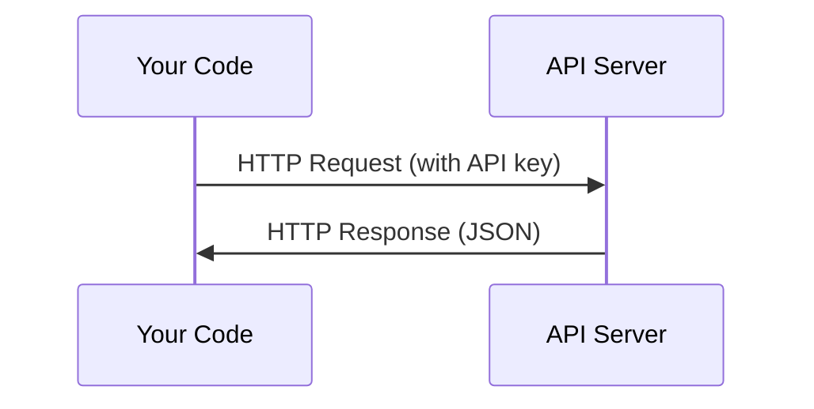

# API y llaves . API y gestión de llaves

> Cada API de IA funciona de la misma manera: enviar una solicitud, obtener una respuesta. Los detalles cambian, el patrón no.
> Todos los métodos de trabajo de las API de la IA son los mismos: enviar peticiones, obtener respuestas, detalles diferentes, modelos no cambian.

**Type:** Build | **类型:** 构建
**Languages:** Python, TypeScript | **语言:** Python, TypeScript
**Prerequisites:** Phase 0, Lesson 01 | **前置知识:** Phase 0, 第 01 课
**Time:** ~30 minutes | **时间:** ~30 分钟

## Objetivos de aprendizaje

- Almacenar las claves de API de forma segura utilizando variables del entorno y `.env`archivos
  La lengua inglesa se traduce en inglés como "la lengua de la lengua"`.env`文件安全存储 API 密钥
- Hacer una llamada de API LLM utilizando tanto el SDK de Python Antropic como el HTTP crudo
  China traducción: usar Antropic Python SDK y HTTP original 两种方式调用 LLM API
- Comparar los formatos de solicitud/respuesta HTTP basados en SDK y en bruto para el depuración
  Traducción:对比 SDK 和原始 HTTP 的请求/响应格式,以便调试
- Identificar y manejar errores comunes de API, incluidos los límites de autenticación y tasa
  Chino:识别并处理常见 API 错误, incluido el problema de la certificación y el límite de flujo

> **【中文解读】**
> Todos los métodos de trabajo de la API de la IA son los mismos: enviar solicitudes, obtener respuestas, leer cómo administrar de forma segura la API de la clave, utilizar la API de la LLM, así como entender la diferencia entre el uso de la SDK y las solicitudes HTTP originales, esto es la base de la posterior construcción de un agente de IA.

## El problema es describir el problema

A partir de la Fase 11, llamará a las API de LLM (Antropic, OpenAI, Google). En la Fase 13-16 construirá agentes que utilizan estas API en bucles. Necesita saber cómo funcionan las claves de API, cómo almacenarlas de forma segura y cómo hacer su primera llamada de API.

> Desde la etapa 11  comenzando, usted va a utilizar el API de LLM Antropic、OpenAI、Google . Durante la etapa 13-16, usted va a construir un ciclo de manipulación de estos API .

> **【中文解读】**
> Desde la etapa 11  comenzando, usted va a utilizar la API LLM; la etapa 13-16 会构建循环调用 API的代理── usted necesita primero dominar la API 密钥管理和基本调用方式──

## El concepto central.



Cada llamada de API tiene:
1. Un punto final (URL)
2. Una clave de API (autenticación)
3. Un organismo de solicitud (lo que quieras)
4. Un cuerpo de respuesta (lo que obtienes de vuelta)

> Cada API 调用 contiene cuatro elementos:
> 1. 端点(URL)
> 2. API 密钥(身份认证)
> 3. Pide lo que quieras
> 4. 响应体(返回什么)

> **【中文解读】**
> Cada API 调用 contiene cuatro elementos:端点 URL、API 密钥(身份认证) 请求体(你想要什么) 响应体(返回什么)  Comprender este modelo, todas las API de AI son iguales。

> **【拓展：API 在 AI Agent 中的角色】**
> El ciclo central de un agente de IA es: construir un mensaje → utilizar una API de LLM → resolver una respuesta → ejecutar una acción → volver a utilizar una API.
```figure
s0-secret-inject
```

## Construye el mismo

## Construye y realiza.

> **【拓展：API 密钥安全的铁律】**绝不把API key 硬编码在代码里.  Una vez que llegue a GitHub, los reptiles descubrirán en unos segundos que no usan su clave.                                                                                                                                                                                                                                           `.env`文件 + `python-dotenv`O el cambio en el ambiente del sistema operativo.

### Paso 1: Guarde las llaves de API de forma segura

Nunca ponga claves API en el código.

> 永远不要把API 密钥写在代码里. 永远不要把API 密钥写在代码里. 永远不要把API 密钥写在代码里.

```bash
export ANTHROPIC_API_KEY="sk-ant-..."  # 设置环境变量（密钥永远不要写在代码里！）
export OPENAI_API_KEY="sk-..."
```

O usar un`.env`archivo (agrega a `.gitignore`):

> O usar `.env`文件(recuerde añadir hasta `.gitignore`):

```
ANTHROPIC_API_KEY=sk-ant-...  # .env 文件（确保加入 .gitignore）
OPENAI_API_KEY=sk-...
```

### Paso 2: Primera llamada de API (Python)

```python
import os

import anthropic

client = anthropic.Anthropic()  # 自动从环境变量读取密钥

MODEL = os.environ.get("LLM_MODEL", "claude-sonnet-5")

response = client.messages.create(
    model="claude-sonnet-4-20250514",  # 指定模型
    max_tokens=256,  # 最大输出长度
    messages=[{"role": "user", "content": "What is a neural network in one sentence?"}]  # 用户消息
    model=MODEL,
    max_tokens=256,
    messages=[{"role": "user", "content": "What is a neural network in one sentence?"}]
)

print(response.content[0].text)  # 打印模型回复
```

### Paso 3: Primera llamada de API (TypeScript)

> **【拓展：Token 计费机制】**El programa de formación de la LLM 按token计费:Claude Sonnet 约 $3/百万输入 token、$15/million输出代币──一个英文单词约1.3 代币,一个中文字约2-3 代币──`max_tokens=256`Significa que el modelo más de 256 tokens son de aproximadamente 200 palabras en inglés.`max_tokens`Es un medio clave para ahorrar costes.
`LLM_MODEL`Selecciona el id del modelo Anthropic, y el alias predeterminado es el alias Sonnet no datado. Otros proveedores (OpenAI, Google y otros) siguen el mismo patrón de una clave más un id del modelo, pero cada uno tiene su propio SDK, punto final y esquema de solicitud / respuesta.

### Paso 3: Primera llamada de API (TypeScript)

```typescript
import Anthropic from "@anthropic-ai/sdk";

const client = new Anthropic();

const MODEL = process.env.LLM_MODEL ?? "claude-sonnet-5";

const response = await client.messages.create({
  model: MODEL,
  max_tokens: 256,
  messages: [{ role: "user", content: "What is a neural network in one sentence?" }],
});

console.log(response.content[0].text);
```

### Paso 4: HTTP crudo (sin SDK)

```python
import os
import urllib.request
import json

url = "https://api.anthropic.com/v1/messages"  # API 端点
headers = {
    "Content-Type": "application/json",  # 请求格式为 JSON
    "x-api-key": os.environ["ANTHROPIC_API_KEY"],  # 从环境变量读取密钥
    "anthropic-version": "2023-06-01",  # API 版本号
}
body = json.dumps({
    "model": "claude-sonnet-4-20250514",  # 模型名称
    "max_tokens": 256,  # 最大输出 token 数
    "model": os.environ.get("LLM_MODEL", "claude-sonnet-5"),
    "max_tokens": 256,
    "messages": [{"role": "user", "content": "What is a neural network in one sentence?"}],
}).encode()

req = urllib.request.Request(url, data=body, headers=headers, method="POST")  # 构造 POST 请求
with urllib.request.urlopen(req) as resp:
    result = json.loads(resp.read())  # 解析 JSON 响应
    print(result["content"][0]["text"])  # 提取并打印回复文本
```

Esto es lo que hacen los SDKs bajo el capó. Entender la llamada HTTP crudo ayuda al desactivar.

> Esto es lo que hace SDK en la base.

> **【中文解读】**
> SDK                                                                                                                                                                                                                                                                                                                                                                                                                                                                                                                            

## Usa la guía.

> **【中文解读】**现在不需要注册所有API──Phase 4-10 用 Hugging Face(免费),Phase 11-16 需要人类或开机AI──等课程用到时再注册即可──

Para este curso:

> En el curso:

| API | When you need it | Free tier |
|-----|-----------------|-----------|
| Anthropic (Claude) | Phases 11-16 (agents, tools) | $5 credit on signup |
| OpenAI | Phase 11 (comparison) | $5 credit on signup |
| Hugging Face | Phases 4-10 (models, datasets) | Free |

| API | 何时需要 | 免费额度 |
|-----|---------|---------|
| Anthropic (Claude) | 阶段 11-16（Agent、工具） | 注册送 $5 额度 |
| OpenAI | 阶段 11（对比实验） | 注册送 $5 额度 |
| Hugging Face | 阶段 4-10（模型、数据集） | 免费 |

No las necesitas todas ahora, hazlas cuando la lección lo requiera.

> Usted no necesita ahora para registrarse en todas las API.

## Envíe el producto .

> **【拓展：429 限流处理】**调用 LLM API 时最常见的错误是429 Rate Limit──处理方式:指数退避重试(等 1s → 2s → 4s → 8s)──Antropic SDK 内置自动重试,但理解原理很重要在实际代理系统中,你可能需要自己实现限流逻辑来控制成本和避免被封锁──

Esta lección produce:
- `outputs/prompt-api-troubleshooter.md`- diagnóstico de errores comunes de API

> 本课产 出:
> - `outputs/prompt-api-troubleshooter.md`- 诊断常见 API 错误的提示

## Los ejercicios.

1. Obtenga una clave de API de Anthropic y haga su primera llamada de API
    obtención de API Antropic  clave, completar tu primera API 调用
2. Prueba la versión HTTP en bruto y compara el formato de respuesta con la versión del SDK
   尝试原始 HTTP 方式调用, en comparación con el formato de respuesta de SDK 方式
3. Usar intencionalmente una clave de API incorrecta y leer el mensaje de error
   Por lo tanto, el uso erróneo de API clave, leer información errónea

## Términos clave .

| Term | What people say | What it actually means |
|------|----------------|----------------------|
| API key | "Password for the API" | A unique string that identifies your account and authorizes requests |
| Rate limit | "They're throttling me" | Maximum requests per minute/hour to prevent abuse and ensure fair usage |
| Token | "A word" (in API context) | A billing unit: input and output tokens are counted and charged separately |
| Streaming | "Real-time responses" | Getting the response word by word instead of waiting for the full response |

| 术语 | 俗称 | 实际含义 |
|------|------|---------|
| API key | "API 密码" | 标识你账户并授权请求的唯一字符串 |
| Rate limit | "被限流了" | 每分钟/小时的请求上限，防止滥用 |
| Token | "词"（API 语境） | 计费单位：输入和输出 token 分别计费 |
| Streaming | "实时响应" | 逐词返回响应，而非等待完整响应 |
