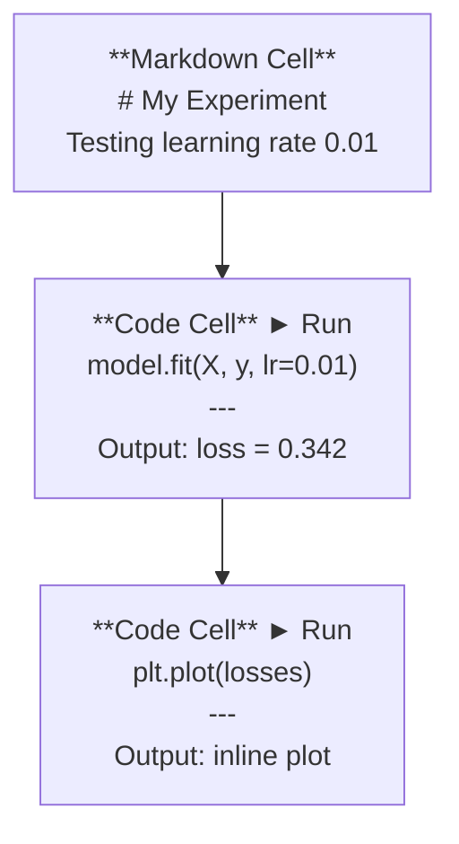
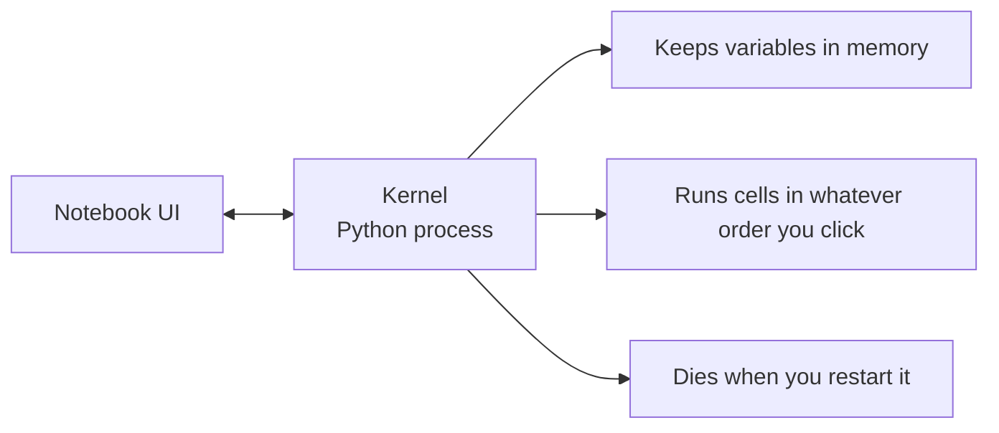

# Los cuadernos de Jupyter  Jupyter 笔记本

> Las computadoras son el banco de laboratorio de la ingeniería de IA.
> 笔记本是AI 工程的实验工作台―― tú haces aquí la prueba original, y luego pones la parte efectiva en la producción―

**Type:** Build | **类型:** 构建
**Languages:** Python | **语言:** Python
**Prerequisites:** Phase 0, Lesson 01 | **前置知识:** Phase 0, 第 01 课
**Time:** ~30 minutes | **时间:** ~30 分钟

## Objetivos de aprendizaje

- Instalar y lanzar JupyterLab, Jupyter Notebook o VS Code con la extensión Jupyter
  En español: JúpiterLab, Júpiter Notebook o con Júpiter  Extender de VS Code
- Utilice comandos mágicos (`%timeit`¿ Qué ?`%%time`¿ Qué ?`%matplotlib inline`) para comparar y visualizar en línea
  En español: usar el orden de magia`%timeit`¿Qué es esto?`%%time`¿Qué es esto?`%matplotlib inline`) realizar pruebas de base y visibilización de la estructura
- Distinguir cuándo utilizar cuadernos de notas vs scripts y aplicar el flujo de trabajo "explorar en cuadernos de notas, enviar en scripts"
  China: distinguir cuándo usar un libro de cuentas, cuándo usar un libro de cuentas, practicar el proceso de trabajo de "explorar un libro de cuentas, escribir un libro de cuentas"
- Identificar y evitar las trampas comunes de los portátiles: ejecución fuera de orden, estado oculto y fugas de memoria
  Chino: 识别并避免笔记本常见陷:乱序执行、隐藏状态和内存泄漏

> **【中文解读】**
> Jupyter Notebook es el "laboratorio de trabajo" de ingenieros de IA. Puedes usar el código en cada fase de su ejecución.`.py`脚本中部署── también en el mismo

## El problema es describir el problema

Cada artículo de IA, tutorial y competencia Kaggle utiliza cuadernos Jupyter. Te permiten ejecutar código en pedazos, ver las salidas en línea, mezclar código con explicaciones e iterar rápidamente. Si intentas aprender IA sin cuadernos, estás haciendo tareas matemáticas sin rascar papel.

> Casi todos los trabajos  de AI  de tutoriales y Kaggle  de competición utilizan el Jupyter Notebook.  permite que puedas dividir los segmentos de código de ejecución  de configuración  de la salida  de código y letras  de instrucción                                                                                                                                                                                                                           

Pero los cuadernos tienen trampas reales. La gente los usa para todo, incluso para cosas en las que son terribles. Saber cuándo usar un cuadrilátero y cuándo usar un guión te salvará de deshacerte de pesadillas más tarde.

> Pero el bolígrafo también tiene un verdadero problema. La gente lo usa para hacer todo, incluyendo lo que no es bueno.

> **【中文解读】**
> El portátil es una herramienta estándar en el campo de la IA, casi todos los artículos y las competencias de Kaggle lo utilizan. Pero también tiene un problema: desorden de ejecución, estado oculto, fuga de memoria.

## El concepto central.

Un cuaderno es una lista de células. Cada célula es código o texto.

> 笔记本由一系列"单元格"组成, cada unidad es un código, es un texto.



El kernel es un proceso de Python que se ejecuta en segundo plano. Cuando ejecuta una célula, envía el código al kernel, que lo ejecuta y devuelve el resultado. Todas las células comparten el mismo kernel, por lo que las variables persisten entre las células.

> El kernel es un proceso de Python que se ejecuta en la base posterior. Cuando se ejecuta un unidad, el código se envía al kernel para ejecutarlo y el resultado vuelve a regresar. Todos los unidades comparten el mismo kernel, por lo que la variación entre unidades persiste.



Esa parte de "qué orden que hagas" es tanto la superpotencia como la pistola.

> "Ejecutar cualquier orden según tu clic" es una parte de la supercapacidad, también de la gran caída.
```figure
s0-cell-order
```

## Construye el mismo

> **【中文解读】**
> Nota de cuentas compuesta por varios "单元格" (celdas), cada unidad puede ser un código o un marcado. Todos los unidades comparten un mismo núcleo.

## Construye con la mano.

> **【拓展：Jupyter 在 AI 行业中的地位】**几乎所有 AI 论文附带的可复现代码都是 Jupyter Notebook 格式──Kaggle 比赛方案、Hugging Face示例、PyTorch教程都使用它──Google Colab 本质上就是云端的Jupyter,预装了PyTorch/TensorFlow,并免费提供GPU──本课程中有大量的`.ipynb`练习── hacer ejercicio

### Paso 1: Elige tu interfaz.

Tres opciones, un formato:

> Tres tipos de interfaces seleccionadas, con un formato de archivo:

| Interface | Install | Best for |
|-----------|---------|----------|
| JupyterLab | `pip install jupyterlab` then `jupyter lab` | Full IDE experience, multiple tabs, file browser, terminal |
| Jupyter Notebook | `pip install notebook` then `jupyter notebook` | Simple, lightweight, one notebook at a time |
| VS Code | Install "Jupyter" extension | Already in your editor, git integration, debugging |

| 界面 | 安装方式 | 最适合 |
|------|---------|--------|
| JupyterLab | `pip install jupyterlab` 后运行 `jupyter lab` | 完整 IDE 体验、多标签、文件浏览器 |
| Jupyter Notebook | `pip install notebook` 后运行 `jupyter notebook` | 简洁轻量、一次一个笔记本 |
| VS Code | 安装 "Jupyter" 扩展 | 集成在编辑器中、Git 整合、可调试 |

Los tres leen y escriben lo mismo .`.ipynb`JupyterLab es el más común en el trabajo de IA.

> Tres interfaces de escritura idéntica`.ipynb`文件格式──选你喜欢的即可──JupyterLab en el trabajo de IA 最常见──

```bash
pip install jupyterlab
jupyter lab
```

### Paso 2: Cortes de teclado que importan.

Operas en dos modos.`Escape`para el modo de comando (barra azul a la izquierda), `Enter`para el modo de edición (barra verde).

> Usted está en dos modos de operar.`Escape`进入命令模式(左侧蓝色条),按 `Enter`进入编辑模式(绿色条) 』

**Command mode (most used):**

> **命令模式（最常用的）：**

| Key | Action |
|-----|--------|
| `Shift+Enter` | Run cell, move to next |
| `A` | Insert cell above |
| `B` | Insert cell below |
| `DD` | Delete cell |
| `M` | Convert to markdown |
| `Y` | Convert to code |
| `Z` | Undo cell operation |
| `Ctrl+Shift+H` | Show all shortcuts |

**Edit mode:**

> **编辑模式：**

| Key | Action |
|-----|--------|
| `Tab` | Autocomplete |
| `Shift+Tab` | Show function signature |
| `Ctrl+/` | Toggle comment |

`Shift+Enter`Es el que usarás mil veces al día.

> `Shift+Enter`Es que cada día usas un montón de teclas rápidas.

### Paso 3: tipos de células.

**Code cells**ejecuta Python y muestra la salida:

> **代码单元格**运行 Python 并显示输出:

```python
import numpy as np
data = np.random.randn(1000)
data.mean(), data.std()
```

Producción: `(0.0032, 0.9987)`

**Markdown cells**Los textos en formato de texto se pueden utilizar para documentar lo que estás haciendo y por qué.`$E = mc^2$`), tablas e imágenes.

> **Markdown 单元格**染格式化文本──Uselas para registrar lo que estás haciendo y por qué──支持标题、粗体、斜体、LaTeX 数学公式(`$E = mc^2$`)、表格和图片──

### Paso 4: Las órdenes mágicas.

Estos no son Python, son comandos específicos de Jupyter que comienzan con`%`(magia de línea) o `%%`(magia celular).

> Estos no son Python.`%`(行魔术) o `%%`(单元格魔术) Abrió el Jupitero  专用命令。

**Time your code:**

> **计时你的代码：**

```python
%timeit np.random.randn(10000)  # 多次运行取平均，适合微基准测试
```

Producción: `45.2 us +/- 1.3 us per loop`

```python
%%time  # 单次运行，测量总耗时，适合训练耗时测试
model.fit(X_train, y_train, epochs=10)
```

Producción: `Wall time: 2.34 s`

`%timeit`ejecuta el código muchas veces y promedios. `%%time`Lo ejecuta una vez.`%timeit`para las microbensores, `%%time`para las carreras de entrenamiento.

> `%timeit`Más veces se ejecuta un valor medio.`%%time`Sólo se ejecuta una vez.`%timeit`, entrenamiento de tiempo en prueba`%%time`¿Qué es eso?

**Enable inline plots:**

> **启用内嵌图表：**

```python
%matplotlib inline  # 让图表直接显示在笔记本中
```

Cada uno .`plt.plot()`o `plt.show()`Ahora se hace directamente en el cuaderno.

> Después de cada uno`plt.plot()`O `plt.show()`La ciudad estará en su libro de notas.

**Install packages without leaving the notebook:**

> **不离开笔记本就能安装包：**

```python
!pip install scikit-learn  # ! 前缀可以在笔记本中执行 shell 命令
```

El `!`prefijo ejecuta cualquier comando de shell.

> `!`Antes puedo ejecutar cualquier orden de proyectiles.

**Check environment variables:**

> **检查环境变量：**

```python
%env CUDA_VISIBLE_DEVICES  # 查看环境变量
```

### Paso 5: Muestre la salida rica en línea.

> **【拓展：Notebook 是最佳 AI 实验记录工具】**Notebook Colocar el código, la salida, el gráfico, la fórmula integrada en un archivo, forma un completo "registro de experimentación"―En el estudio de IA, esto significa que otra persona puede reproducir directamente tu experimento es el requisito básico del examen de un artículo―Jupyter de VScode  expansión para que puedas obtener una experiencia completa en el editor del Notebook―.

Los portátiles muestran automáticamente la última expresión en una célula.

> El cuaderno mostrará automáticamente la última expresión en el unidad... pero puedes controlarlo:

```python
import pandas as pd

df = pd.DataFrame({
    "model": ["Linear", "Random Forest", "Neural Net"],
    "accuracy": [0.72, 0.89, 0.94],
    "training_time": [0.1, 2.3, 45.6]
})
df
```

Esto representa una tabla HTML formateada, no un vertedero de texto.

> Esto se traduce en un formato HTML, en lugar de un texto de salida.

```python
import matplotlib.pyplot as plt

plt.figure(figsize=(8, 4))
plt.plot([1, 2, 3, 4], [1, 4, 2, 3])
plt.title("Inline Plot")
plt.show()
```

La gráfica aparece justo debajo de la célula. Es por eso que los portátiles dominan el trabajo de IA. Veas los datos, la gráfica y el código juntos.

> El gráfico muestra directamente en el siguiente gráfico. Es por eso que el ordenador tiene un papel dominante en el trabajo de la IA.

Para las imágenes:

>  Para las imágenes:

```python
from IPython.display import Image, display
display(Image(filename="architecture.png"))
```

### Paso 6: Google Colab.

Colab es un portátil Jupyter gratuito en la nube. Te da una GPU, bibliotecas preinstaladas e integración con Google Drive. No se requiere configuración.

> Colab es el dispositivo de la nube Jupyter 笔记本.

1. ¡ Vamos 
2. Cargar cualquier `.ipynb`archivo de este curso
3. Tiempo de ejecución > Cambiar el tipo de tiempo de ejecución > GPU T4 (gratuito)

Diferencias entre Colab y Jupyter local:

> Colab y Jupitero nativos:

- Los archivos no persisten entre sesiones (salvo en Drive o descarga)
  China: archivos no se pueden guardar en el disco o descargar en el disco.
- Preinstalado: numpy, pandas, matplotlib, antorcha, tensorflow, sklearn
  Previo diseño de la nueva versión de la versión de la versión de la versión de la versión de la versión de la versión de la versión de la versión de la versión de la versión de la versión de la versión de la versión de la versión de la versión de la versión de la versión de la versión de la versión de la versión de la versión de la versión de la versión de la versión de la versión de la versión de la versión de la versión de la versión de la versión de la versión de la versión de la versión de la versión de la versión de la versión de la versión de la versión de la versión de la versión de la versión de la versión de la versión de la versión de la versión de la versión de la versión de la versión de la versión de la versión de la versión de la versión de la versión de la versión de la versión de la versión de la versión de la versión de la versión de la versión de la versión de la versión de la versión de la versión de la versión de la versión de la versión de la versión de la versión de la versión de la versión de la versión de la versión de la versión de la versión de la versión de la versión de la versión de la versión de la versión de la versión de la versión de la versión de la versión de la versión de la versión de la versión de la versión de la versión de la versión de la versión de la versión de la versión de la versión de la versión de la versión de la versión de la versión de la versión de la versión de la versión de la versión de la versión de la versión de la versión de la versión de la versión de la versión de la versión de la versión de la versión de la versión de la versión de la versión de la versión de la versión de la versión de la versión de la versión de la versión de la versión de la versión de la versión de la versión de la versión de la versión de la versión de la versión de la versión de la versión de la versión de la versión de la versión de la versión de la versión de la versión de la versión de la versión de la versión de la versión de la versión de la versión de la versión de la versión de la versión de la versión de la versión de la versión de la versión de la versión de la versión de la versión de la versión de la versión de la versión de la versión de la versión de la versión de la versión de la versión de la versión de la versión de.
- `from google.colab import files`para subir/descargar archivos
  En inglés:`from google.colab import files`Usado para la descarga
- `from google.colab import drive; drive.mount('/content/drive')`para almacenamiento persistente
  En inglés:`from google.colab import drive; drive.mount('/content/drive')`Usado para almacenamiento permanente
- Tiempo de descanso después de 90 minutos de inactividad (nive libre)
  Sinopsis: El tiempo de la reunión es de 90 minutos.

## Usa la guía.

### Cuadernos versus guiones: ¿Cuándo usar qué? ¿Cuándo usar un cuaderno?

| Use notebooks for | Use scripts for |
|-------------------|-----------------|
| Exploring a dataset | Training pipelines |
| Prototyping a model | Reusable utilities |
| Visualizing results | Anything with `if __name__` |
| Explaining your work | Code that runs on a schedule |
| Quick experiments | Production code |
| Course exercises | Packages and libraries |

| 用 Notebook | 用脚本 |
|-----------|-------|
| 探索数据集 | 训练管线 |
| 原型开发模型 | 可复用的工具函数 |
| 可视化结果 | 带 `if __name__` 的正式代码 |
| 解释你的工作 | 定时运行的代码 |
| 快速实验 | 生产环境代码 |
| 课程练习 | 包和库 |

La regla:**explore in notebooks, ship in scripts**¿ Qué ?

> 黄金法则:**在笔记本中探索，在脚本中部署**¿Qué es eso?

> **【中文解读】**
> 黄金法则:**在 Notebook 中探索，在脚本中部署**❖ Primero en el portátil 里实验思想,验证可行后再将代码迁移到 `.py`¿Qué es eso?

Un flujo de trabajo común en IA:
1. Explorar los datos en un cuaderno
2. Protótipo de su modelo en el cuaderno
3. Una vez que funcione, mueva el código a `.py`archivos
4. Importar esos .`.py`archivos de vuelta en el cuaderno para más experimentos

> Trabajo en el sector de la inteligencia artificial
> 1. En el libro de notas explorar datos
> 2. En el libro de notas hacer modelo original
> 3. Después de que el código sea válido, se trasladará a`.py`文件
> 4. ¿ Qué ?`.py`文件导入笔记本 realizar más experimentos

### Trampas comunes.

> **【拓展：Notebook 反模式】**Tres de los más comunes Notebook 反模式:(1) 乱序执行你跳进跑细胞,别人从头跑就挂了;(2) 隐藏状态你删除某个细胞,但它创建的变量还在内存中;(3) 内存泄漏加载4GB 数据集、训练模型、再加载另一个,内存不断增长──解法:定期`Kernel > Restart & Run All`, o después del entrenamiento .`del model; gc.collect()`¿Qué es eso?

**Out-of-order execution.**Se ejecuta la celda 5, luego la celda 2, luego la celda 7. El portátil funciona en su máquina pero se rompe cuando alguien lo ejecuta de arriba a abajo.

> **乱序执行。**Usted primero corre el 5o, vuelve a ejecutar el 2o, luego el 7o. El guión en tu máquina puede usarse, pero otros de la cabeza al final han salido equivocados.

**Hidden state.**Se elimina una célula pero la variable que creó todavía está en la memoria. El cuaderno se ve limpio pero depende de una célula fantasma. Corrección: reiniciar el núcleo regularmente.

> **隐藏状态。**Usted eliminó un un único elemento, pero la variación que crea está en la memoria.

**Memory leaks.**Cargar un conjunto de datos de 4 GB, entrenar un modelo, cargar otro conjunto de datos. Nada se libera.`del variable_name`y `gc.collect()`, o reiniciar el núcleo.

> **内存泄漏。**Cargar 4 GB de datos, entrenamiento de modelos, recargar otro conjunto de datos, la memoria continua no se libera.`del variable_name`Y `gc.collect()`, o reiniciar el núcleo.

## Envíe el producto .

> **【拓展：从 Notebook 到生产代码】**Verdaderos procesos de ingeniería de IA: Cuaderno de notas  experimentación → 验证想法 → 将代码重构为 `.py`模块 → 编写测试 → 部署。Notebook es "草稿纸", no es "último producto"。养成习惯: después de completar el experimento, el código central se traslada a `.py`En el archivo, el cuaderno sólo se conserva el uso y la visibilidad.

Esta lección produce:
- `outputs/prompt-notebook-helper.md`para desactivar los problemas de los cuadernos

> 本课产 出:
> - `outputs/prompt-notebook-helper.md`Usado para调试笔记本问题

## Los ejercicios.

1. Abra JupyterLab, cree un cuaderno y use `%timeit`para comparar la comprensión de la lista vs numpy para crear una matriz de 100.000 números aleatorios
   Abre JupyterLab, crea un cuaderno, usa`%timeit`En comparación con la formulación de la lista y la velocidad de generar 100 000 números aleatorios
2. Crea un cuaderno con marcado y células de código que cargue un CSV, muestre un marco de datos y trace un gráfico. Luego ejecuta Kernel > Reiniciar y ejecutar todo para verificar que funciona de arriba a abajo
   Crear con Markdown y código de un solo elemento de la agenda, cargar CSV ✓ mostrar DataFrame ✓ dibujar, luego "reiniciar y todo el funcionamiento"
3. Tome el código de `code/notebook_tips.py`, pegarlo en una libreta Colab, y ejecutarlo con una GPU gratuita
   ¿ Qué ?`code/notebook_tips.py`El código se pega en Colab 笔记本中, con GPU gratis 运行

## Términos clave .

| Term | What people say | What it actually means |
|------|----------------|----------------------|
| Kernel | "The thing running my code" | A separate Python process that executes cells and keeps variables in memory |
| Cell | "A code block" | An independently runnable unit in a notebook, either code or markdown |
| Magic command | "Jupyter tricks" | Special commands prefixed with `%` or `%%` that control the notebook environment |
| `.ipynb` | "Notebook file" | A JSON file containing cells, outputs, and metadata. Stands for IPython Notebook |

| 术语 | 俗称 | 实际含义 |
|------|------|---------|
| Kernel | "运行代码的那个东西" | 独立的 Python 进程，执行单元格并维护变量状态 |
| Cell | "代码块" | 笔记本中可独立运行的单元，可以是代码或 Markdown |
| Magic command | "Jupyter 魔法" | 以 `%` 或 `%%` 开头的特殊命令，控制笔记本环境 |
| `.ipynb` | "笔记本文件" | 包含单元格、输出和元数据的 JSON 文件 |

## Más Leer más Leer más

- [JupyterLab Docs](https://jupyterlab.readthedocs.io/)para el conjunto completo de características
  En inglés: JupyterLab
- [Google Colab FAQ](https://research.google.com/colaboratory/faq.html)para los límites y características específicos de Colab
  China 常见问题与限制说明: Google Colab 常见问题与限制说明
- [28 Jupyter Notebook Tips](https://www.dataquest.io/blog/jupyter-notebook-tips-tricks-shortcuts/)para los atajos de usuario de energía
  Chino: Traducción: 28 个 Jupyter Cuaderno de notas 高级技巧
