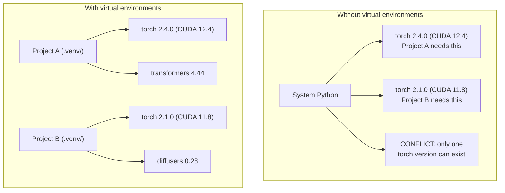

# Python Ambientes . Python  Gestión del medio ambiente

> El infierno de la dependencia es real.
> Depende de que el infierno es la realidad.

**Type:** Build | **类型:** 构建
**Languages:** Shell | **语言:** Shell
**Prerequisites:** Phase 0, Lesson 01 | **前置知识:** Phase 0, 第 01 课
**Time:** ~30 minutes | **时间:** ~30 分钟

## Objetivos de aprendizaje

- Crear entornos virtuales aislados utilizando `uv`¿ Qué ?`venv`, o`conda`
  En inglés:`uv`¿Qué es esto?`venv`O `conda`Crear un entorno virtual separado
- Escriba un`pyproject.toml`con grupos de dependencias opcionales y generar ficheros de bloqueo para la reproducibilidad
  Traducción: 编写带可选依赖组的`pyproject.toml`, generar archivo de bloqueo  asegurar la capacidad de recuperación
- Diagnóstico y solución de fallos comunes: instalaciones globales, mezcla de pip/conda, incompatibilidades de la versión CUDA
  China 混用 CUDA 版本不匹配 诊断并修复常见问题: 全局安装、pip/conda 混用、CUDA 版本不匹配
- Implementar una estrategia de entorno por fase para proyectos con dependencias contradictorias
  Traducción:Estrategias ambientales en fase de desarrollo de proyectos que dependen del conflicto

> **【中文解读】**
> Python  proyecto dependiente conflicto es uno de los problemas más comunes en el desarrollo de IA. Este proyecto requiere PyTorch 2.4, ese proyecto requiere 2.1                                                                                                                                                                                                                                                                                                                                                                                                                                                                                        

## El problema es describir el problema

Instalas PyTorch 2.4 para un proyecto de ajuste fino. La semana que viene, un proyecto diferente necesita PyTorch 2.1 porque su construcción CUDA está fijada. Actualiza globalmente, y el primer proyecto se rompe. Bajas la calificación, y el segundo se rompe.

> Usted instaló PyTorch 2.4 para un proyecto de micro-modución. Otro proyecto porque CUDA  Construir la versión de bloqueo necesita PyTorch 2.1. Usted actualiza la totalidad, el primer proyecto está en suspensión. Usted está en suspensión.

Esto es el infierno de la dependencia.

> Esto es lo que sucede a menudo en el trabajo de AI/ML, porque:

- PyTorch, JAX y TensorFlow envían sus propios enlaces CUDA
  Cifrado de la información de la empresa.
- Las bibliotecas de modelos pin versiones de marco específicas
  Traducción:Model库锁定特定框架版本
- Un mundo `pip install`sobreescribe lo que haya existido antes
  En español:`pip install`Cualquier versión de la versión anterior
- CUDA 11.8 construcciones no funcionan con los controladores CUDA 12.x (y viceversa)
  Ciencia de la información sobre el sistema de control de datos de los usuarios

La solución: cada proyecto tiene su propio entorno aislado con sus propios paquetes.

>  solución: cada proyecto tiene su propio entorno aislado, posee un conjunto de dependencias independientes.

> **【中文解读】**
> "Dependencias de la Tierra" es una característica común en los proyectos de IA, ya que PyTorch/JAX/TensorFlow se mantiene unido, versiones entre sí no están compatibles.

## El concepto central.

> **【中文解读】**La siguiente gráfica muestra la diferencia entre un entorno virtual y uno sin: sin entorno virtual, el sistema Python sólo puede instalar una versión de PyTorch, los proyectos entre sí se enfrentan; tiene un entorno virtual, cada proyecto tiene dependencia independiente, no interfiere entre sí.



## Construye y realiza.

> **【拓展：uv vs pip vs conda — 该选哪个？】**(1) **uv**(推):Rust 写的,比 pip 快 10-100 倍, automáticamente gestionar el ambiente virtual,一行命令搞定 `uv venv && uv pip install`△ (2) **venv**Python está instalado, no necesita instalarse, pero la velocidad es lenta y la función es pequeña.**conda**La mayoría de los proyectos de IA de 2026 se han propuesto como una opción de carácter previo.
```figure
s0-env-isolation
```

## Construye el mismo

### Opción 1: uv venv (recomendado)

`uv`Es el administrador de paquetes Python más rápido (10-100 veces más rápido que pip).

> `uv`Es el más rápido Python 包管理器 (en inglés) 比 pip 快 10-100 倍) .

```bash
curl -LsSf https://astral.sh/uv/install.sh | sh

uv python install 3.12

cd your-project
uv venv
source .venv/bin/activate
```

Instalar paquetes:

> El equipo de montaje:

```bash
uv pip install torch numpy
```

Crear un proyecto con `pyproject.toml`en un solo paso:

> Una etapa de creación `pyproject.toml`de proyectos:

```bash
uv init my-ai-project
cd my-ai-project
uv add torch numpy matplotlib
```

### Opción 2: venv (construido) 选项2:venv(Python 内置)

> **【中文解读】**venv es un instrumento de entorno virtual de Python, no necesita instalación adicional. Pero en comparación con uv, no administra automáticamente la versión de Python, ni genera un archivo de bloqueo.

Si no puedes instalarlo`uv`, las naves Python con `venv`¿Qué es esto ?

> Si no puedes instalarlo`uv`,Python se lleva`venv`¿Qué es esto ?

```bash
python3 -m venv .venv
source .venv/bin/activate  # Linux/macOS
.venv\Scripts\activate     # Windows

pip install torch numpy
```

Más lento que`uv`, pero funciona en todas partes Python está instalado.

> Más que`uv`Es lento, pero en cualquier lugar que haya instalado Python se puede usar.

### Opción 3: conda (cuando lo necesites)

Conda administra dependencias no Python como kits de herramientas CUDA, cuDNN y bibliotecas C. Utilice cuando:

> Conda 管理非 Python depende, por ejemplo, de CUDA 工具包、cuDNN 和 C 库── en las siguientes situaciones:

- Necesitas una versión específica de CUDA sin instalarla en todo el sistema
  Needs to specify CUDA 工具包版本, pero no quiere que la totalidad de la instalación
- Estás en un grupo compartido donde no puedes instalar paquetes de sistema
  En el grupo compartido, no se puede instalar un paquete de sistemas.
- Las instrucciones de instalación de una biblioteca dicen "usar conda"
  En el libro de la obra, el texto se dice "Usar conda".

```bash
# Install miniconda (not the full Anaconda)
curl -LsSf https://repo.anaconda.com/miniconda/Miniconda3-latest-Linux-x86_64.sh -o miniconda.sh
bash miniconda.sh -b

conda create -n myproject python=3.12
conda activate myproject

conda install pytorch torchvision torchaudio pytorch-cuda=12.4 -c pytorch -c nvidia
```

Una regla: si utiliza conda para un entorno, use conda para todos los paquetes en ese entorno.`pip install`En un conda env causa conflictos de dependencia que son dolorosos de depurar.

> Una regla: si usas el ambiente de gestión, usas el ambiente de gestión de los bienes de propiedad.`pip install`Las relaciones entre los países de la UE y los países de la UE se han vuelto más complejas.

### Para este curso: Estrategia por fase

No, las diferentes fases necesitan diferentes dependencias (a veces contradictorias).

> Puedes crear un ambiente para todo el curso. No lo hagas. Diferentes etapas necesitan diferentes etapas.

Estrategia:

> 策略:

```
ai-engineering-from-scratch/
├── .venv/                    <-- shared lightweight env for phases 0-3
├── phases/
│   ├── 04-neural-networks/
│   │   └── .venv/            <-- PyTorch env
│   ├── 05-cnns/
│   │   └── .venv/            <-- same PyTorch env (symlink or shared)
│   ├── 08-transformers/
│   │   └── .venv/            <-- might need different transformer versions
│   └── 11-llm-apis/
│       └── .venv/            <-- API SDKs, no torch needed
```

El guión en `code/env_setup.sh`crea el entorno de base para este curso.

> `code/env_setup.sh`El Centro de Escritura creará el entorno básico de este curso.

## Pyproject.toml Basics. pyproject.toml base

> **【拓展：pyproject.toml 是现代 Python 项目的标准配置】**Se sustituyó por la tradición.`setup.py`Y `requirements.txt`◊ un documento define el proyecto元数据、依赖、开发工具配置──AI 项目推使用可选依赖群 来区分训练依赖(`[train]`) y la supuesta dependencia`[serve]`), evitar la instalación innecesaria de GPU en el entorno de producción.

Cada proyecto Python debe tener un`pyproject.toml`- Se reemplaza .`setup.py`¿ Qué ?`setup.cfg`, y `requirements.txt`en un archivo.

> Cada proyecto Python debería tener`pyproject.toml`Lo reemplazó con un archivo.`setup.py`¿Qué es esto?`setup.cfg`Y `requirements.txt`¿Qué es eso?

```toml
[project]
name = "ai-engineering-from-scratch"
version = "0.1.0"
requires-python = ">=3.11"
dependencies = [
    "numpy>=1.26",
    "matplotlib>=3.8",
    "jupyter>=1.0",
    "scikit-learn>=1.4",
]

[project.optional-dependencies]
torch = ["torch>=2.3", "torchvision>=0.18"]
llm = ["anthropic>=0.39", "openai>=1.50"]
```

Luego instale:

> Luego se instala:

```bash
uv pip install -e ".[torch]"    # base + PyTorch
uv pip install -e ".[llm]"     # base + LLM SDKs
uv pip install -e ".[torch,llm]" # everything
```

## Ficha de bloqueo

Un archivo de bloqueo pinsa todas las dependencias (incluidas las transitivas) a versiones exactas. Esto garantiza la reproducibilidad: cualquier persona que instala desde el archivo de bloqueo obtiene exactamente los mismos paquetes.

> El archivo de bloqueo se bloqueará hasta la versión exacta. Esto garantiza la repetibilidad: cualquier persona que instale el archivo de bloqueo puede obtener el mismo paquete.

```bash
# uv generates uv.lock automatically when using uv add
uv add numpy

# pip-tools approach
uv pip compile pyproject.toml -o requirements.lock
uv pip install -r requirements.lock
```

Cuando alguien clona el repo, instala desde el archivo y obtiene versiones idénticas.

> Cuando alguien lo instaló en el almacén, se instaló y obtuvo la misma versión.

## Errores comunes                                                                                                                                                                                                                                                                                                                                                                                                                                                                                                                           

> **【中文解读】**Python 环境管理中最常见的 5 个错误:  1) 整局安装`pip install`No está en el ambiente virtual; 2) 混用 pip 和 conda; 3) 忘记激活虚拟环境; 4) 把 `.venv`El texto se presenta hasta el punto de partida; (5) CUDA  versión no coincide.

### 1. Instalación a nivel mundial

```bash
pip install torch  # BAD: installs to system Python

source .venv/bin/activate
pip install torch  # GOOD: installs to virtual environment
```

Compruebe dónde van sus paquetes:

>  Check your packaging está en dónde:

```bash
which python       # should show .venv/bin/python, not /usr/bin/python
which pip           # should show .venv/bin/pip
```

### 2. Mezcla de pip y conda

```bash
conda create -n myenv python=3.12
conda activate myenv
conda install pytorch -c pytorch
pip install some-other-package   # BAD: can break conda's dependency tracking
conda install some-other-package # GOOD: let conda manage everything
```

Si debe utilizar pip dentro de conda (algunos paquetes son solo conda), instale primero todos los paquetes conda, luego los paquetes conda duran.

> Si hay que usar pipes en el conda, primero instalar todos los conda y luego volver a instalar pipes.

### 3. Olvidar activar

```bash
python train.py           # uses system Python, missing packages
source .venv/bin/activate
python train.py           # uses project Python, packages found
```

El prompt de la captura debe mostrar el nombre del entorno:

> Su shell 提示符 debería mostrar el nombre ambiental:

```
(.venv) $ python train.py
```

### 4. Compromiso .venv a git

```bash
echo ".venv/" >> .gitignore
```

Los entornos virtuales son de 200 MB a 2 GB. Son locales, no portátiles entre máquinas.`pyproject.toml`y el archivo de bloqueo en su lugar.

> En el ambiente virtual hay 200 MB-2GB. Son locales, no pueden ser transferidos entre máquinas.`pyproject.toml`Y el archivo de bloqueo.

### 5. La versión de CUDA no coincide.

> **【拓展：CUDA 版本地狱】**PyTorch Cada versión se une a un CUDA específico  versión(como PyTorch 2.4 → CUDA 12.4) ~~装错版本会出现"找不到 GPU"或奇异的运行时错误──解决方案:先`nvidia-smi`确认驱动版本,再去 [pytorch.org](https://pytorch.org)查对应的安装命令.`uv pip install torch --index-url URL`指定 CUDA 版本──

```bash
nvidia-smi                # shows driver CUDA version (e.g., 12.4)
python -c "import torch; print(torch.version.cuda)"  # shows PyTorch CUDA version

# These must be compatible.
# PyTorch CUDA version must be <= driver CUDA version.
```

## Usa la guía.

> **【中文解读】**Esta es la estrategia de recomendación de este curso: cada fase  Crea un ambiente virtual `.venv-phase04`), para evitar conflictos de dependencia en diferentes fases. En la ingeniería de IA, la incompatibilidad de las versiones es la primera causa de la caída.

Ejecutar el guión de configuración para crear su entorno de curso:

> 运行安装脚本 Crear un programa de formación en el ambiente:

```bash
bash phases/00-setup-and-tooling/06-python-environments/code/env_setup.sh
```

Esto crea un`.venv`en la raíz de repo con dependencias centrales instaladas y verificadas.

> Esto creará uno en el registro de almacén.`.venv`,并安装和验证核心依赖──

## Los ejercicios.

1. - ¿ Qué ?`env_setup.sh`y verificar el paso de todos los cheques
   运行环境安装脚本, confirmar todos los controles
2. Crear un segundo entorno virtual, instalar una versión diferente de numpy en él, y confirmar que los dos entornos están aislados
   Crear un segundo ambiente virtual, instalar diferentes versiones de NumPy, confirmar dos ambientes separados
3. Escriba un`pyproject.toml`para un proyecto que necesita tanto PyTorch como el SDK Anthropic
   Para una programación simultánea de PyTorch y SDK Antropico`pyproject.toml`
4. Instalar un paquete de forma deliberada a nivel mundial (sin activar un venv), notar hacia dónde va, y luego desinstalarlo
   Por lo tanto, todo lo que se quiere hacer es instalar un paquete, ver dónde está instalado y luego descargarlo.

## Términos clave .

| Term | What people say | What it actually means |
|------|----------------|----------------------|
| Virtual environment | "A venv" | An isolated directory containing a Python interpreter and packages, separate from the system Python |
| Lockfile | "Pinned dependencies" | A file listing every package and its exact version, guaranteeing identical installs across machines |
| pyproject.toml | "The new setup.py" | The standard Python project configuration file, replacing setup.py/setup.cfg/requirements.txt |
| Transitive dependency | "A dependency of a dependency" | Package B depends on C; if you install A which depends on B, C is a transitive dependency of A |
| CUDA mismatch | "My GPU isn't working" | PyTorch was compiled for a different CUDA version than what your GPU driver supports |

| 术语 | 俗称 | 实际含义 |
|------|------|---------|
| Virtual environment | "venv" | 包含独立 Python 解释器和包的隔离目录 |
| Lockfile | "锁定依赖" | 记录每个包精确版本的文件，确保跨机器安装一致 |
| pyproject.toml | "新版 setup.py" | Python 项目标准配置文件，替代 setup.py 和 requirements.txt |
| Transitive dependency | "依赖的依赖" | A 依赖 B，B 依赖 C，C 就是 A 的传递依赖 |
| CUDA mismatch | "GPU 不工作" | PyTorch 编译时的 CUDA 版本与 GPU 驱动不匹配 |
