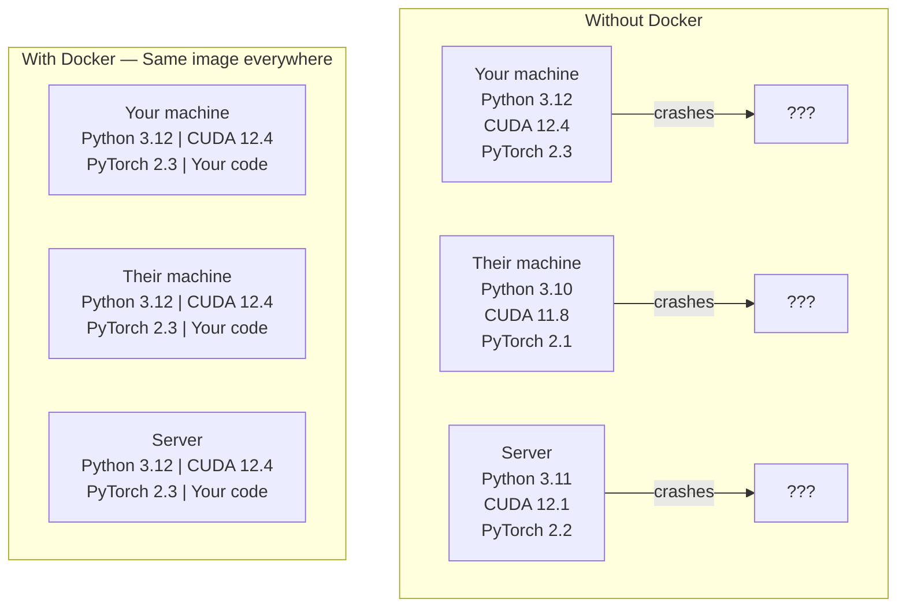

# Docker para la IA  Docker para la capacidad de IA  Aplicaciones

> Los contenedores hacen que "trabajar en mi máquina" sea algo del pasado.
> 容器让"My机器上能跑" se hace historia.

**Type:** Build | **类型:** 构建
**Languages:** Docker | **语言:** Docker
**Prerequisites:** Phase 0, Lessons 01 and 03 | **前置知识:** Phase 0, 第 01 课和第 03 课
**Time:** ~60 minutes | **时间:** ~60 分钟

## Objetivos de aprendizaje

- Construir una imagen de Docker habilitada por GPU con bibliotecas de CUDA, PyTorch y IA desde un archivo de Docker
  En inglés traducción: desde Dockerfile 构建支持GPU的 Docker 镜像, contenida CUDA、PyTorch 和 AI 库
- Montar directorios de host como volúmenes para persistir en modelos, conjuntos de datos y código en las reconstrucciones de contenedores
  En español: en español: en español: en español: en español: en chino: en chino: en chino: en chino: en chino: en chino: en chino: en chino: en chino: en chino: en chino: en chino: en chino: en chino: en chino: en chino: en chino: en chino: en chino: en chino: en chino: en chino: en chino: en chino: en chino: en chino: en chino: en chino: en chino: en chino: en chino: en chino: en chino: en chino: en chino: en chino: en chino: en chino: en chino: en chino: en chino: en chino: en chino: en chino: en chino: en chino: en chino: en chino: en chino: en chino: en chino: en chino: en chino: en chino: en chino: en chino: en chino: en chino: en chino: en chino: en chino: en chino: en chino: en chino: en chino: en chino: en chino: en chino: en chino: en chino: en chino: en chino: en chino: en chino: en chino: en chino: en chino: en chino: en chino: en chino: en chino: en chino: en chino: en chino: en chino: en chino: en chino: en chino: en chino: en chino: en chino: en chino: en chino: en chino: en chino: en chino: en chino: en chino: en chino: en chino: en chino: en chino: en chino: en chino: en chino: en chino: en chino: en chino: en chino: en chino: chino: en chino: en chino: en chino: en chino: en chino: chino: en chino: chino: en chino: chino: en chino: en chino: chino: chino: en chino: chino: en chino: chino: en chino: en chino: chino: chino: en chino: en chino: chino: chino: chino: chino: chino: chino: chino: chino: chino: chino: chino: chino: chino: chino: chino: chino: chino: chino: chino: chino: chino: chino: chino: chino: chino: chino: chino: chino: chino: chino: chino: chino: chino: chino: chino: chino: chino: chino: chino: chino: chino: chino: chino: chino: chino: chino: chino: chino: chino: chino:
- Configurar el kit de herramientas NVIDIA Container para exponer las GPUs dentro de los contenedores
  En inglés, el contenido de contenedores de NVIDIA es un contenido de contenedores de contenedores de contenidos de contenidos de contenidos de contenidos de contenidos de contenidos de contenidos de contenidos de contenidos de contenidos de contenidos de contenidos de contenidos de contenidos de contenidos de contenidos de contenidos de contenidos de contenidos de contenidos de contenidos de contenidos de contenidos de contenidos de contenidos de contenidos de contenidos de contenidos de contenidos de contenidos de contenidos de contenidos de contenidos de contenidos de contenidos de contenidos de contenidos de contenidos de contenidos de contenidos de contenidos de contenidos de contenidos de contenidos de contenidos de contenidos de contenidos de contenidos de contenidos de contenidos de contenidos de contenidos de contenidos de contenidos de contenidos de contenidos de contenidos de contenidos de contenidos de contenidos de contenidos de contenidos de contenidos de contenidos de contenidos de contenidos de contenidos de contenidos de contenidos de contenidos de contenidos de contenidos de contenidos de contenidos de contenidos de contenidos de contenidos de contenidos de contenidos de contenidos de contenidos de contenidos de contenidos de contenidos de contenidos de contenidos de contenidos de contenidos de contenidos.
- Orquesta aplicaciones de IA multi-servicio (servidor de inferencia + base de datos vectorial) utilizando Docker Compose
  China: Docker Compose 编排多服务 AI 应用 推理服务器 + 向量数据库)

> **【中文解读】**
> Docker pone el código, el tiempo de ejecución, la biblioteca y los instrumentos del sistema en un "contenedor", asegúrese de que los resultados de ejecución en cualquier máquina coincidan.

## El problema es describir el problema

Entrenó un modelo en su computadora portátil con PyTorch 2.3, CUDA 12.4 y Python 3.12. Su colega tiene PyTorch 2.1, CUDA 11.8 y Python 3.10.

> Usted ha entrenado un modelo en su computadora de ordenador con PyTorch 2.3、CUDA 12.4 y Python 3.12 ⋅ su compañero usa PyTorch 2.1、CUDA 11.8 y Python 3.10── el modelo se derrumba en su máquina ⋅ pero su archivo de Docker ⋅ dos máquinas pueden correr ⋅

Los proyectos de IA son pesadillas de dependencia. Una pila típica incluye Python, PyTorch, controladores CUDA, cuDNN, bibliotecas C a nivel de sistema y paquetes especializados como flash-attn que necesitan versiones de compilador exactas. Docker empaqueta todo esto en una sola imagen que se ejecuta de manera idéntica en todas partes.

> Los proyectos de IA dependen de la gestión de los sueños. La técnica típica incluye Python, PyTorch, CUDA, Drive, cuDNN, C 库, así como la necesidad de un paquete especial de una versión específica de un compilador, como flash-attn.

> **【中文解读】**
> El proyecto de IA es uno de los tipos de proyectos que más necesita Docker. CUDA  versión incompleble, PyTorch  versión conflictual, cuDNN  falta  Estos problemas con Docker una solución de naturaleza.

## El concepto central.

> **【拓展：Docker 在 AI 中的三大用途】**(1) **环境一致性**: un buen modelo entrenado en su propio ordenador, no se reportará por las versiones diferentes de la biblioteca cuando se despliegue en el servidor;**GPU 隔离**:多人共享一台 GPU 服务器, cada uno de los contenedores interactúa;(3) **一键部署**¿Qué es esto ?`docker run`Una条命令启动完整的AI 服务(模型 + API + 前端),无需手动配置──Hugging Face TGI、vLLM等推理框架都提供Docker 镜像──

Docker envuelve su código, tiempo de ejecución, bibliotecas y herramientas del sistema en una unidad aislada llamada un contenedor. Piense en ella como una máquina virtual ligera, excepto que comparte el kernel del sistema operativo host en lugar de ejecutar el propio, por lo que comienza en segundos en lugar de minutos.

> Docker empaquetará su código, tiempo de funcionamiento, biblioteca y herramientas de sistema en una unidad de aislamiento llamada "contenedor". Se puede imaginar que es una máquina virtual de clase ligera, aunque comparte el núcleo interno del sistema operativo del host en lugar de ejecutar su propio núcleo, por lo que el arranque sólo toma unos segundos en lugar de unos minutos.



### ¿Por qué los proyectos de IA necesitan a Docker más que la mayoría ?

> **【中文解读】**AI  proyectos dependen de la cadena especial:Python → PyTorch → CUDA → cuDNN → sistema de nivel C 库。 Cualquier una capa de versión no coincide con la cual puede causar el colapso del entrenamiento o los resultados de la hipótesis no coinciden。Docker Colocar todos los niveles en un espejo, asegurarse de que "mi máquina puede correr" se convierta en "en dondequiera que pueda correr"。

1. **GPU drivers are fragile.**CUDA 12.4 código no se ejecuta en CUDA 11.8. Docker aisla el kit de herramientas CUDA dentro del contenedor mientras comparte el controlador de GPU host a través del NVIDIA Container Toolkit.

> 1. **GPU 驱动很脆弱。**CUDA 12.4                                                                                                                                                                                                                                                                                                                                                                                                                                                                                                                          

2. **Model weights are large.**Un modelo de parámetro 7B es de 14 GB en fp16. no se quiere volver a descargar cada vez que se reconstruye.

> 2. **模型权重很大。**7B 参数的模型在fp16 下有14GB──你不想每次重建容器都重新下载──Docker卷让你从主机上载模型目录──

3. **Multi-service architectures are common.**Una aplicación de IA real no es solo un script de Python. Es un servidor de inferencias, una base de datos vectorial para RAG, tal vez un frontend web. Docker Compose orquesta todo esto con un solo comando.

> 3. **多服务架构很常见。**La aplicación de IA real no es sólo un guión Python. Contiene un servidor de análisis, una base de datos de RAG, y una base de datos de datos de la red.

### El vocabulario clave.

| Term | What it means |
|------|---------------|
| Image | A read-only template. Your recipe. Built from a Dockerfile. |
| Container | A running instance of an image. Your kitchen. |
| Dockerfile | Instructions to build an image. Layer by layer. |
| Volume | Persistent storage that survives container restarts. |
| docker-compose | A tool for defining multi-container applications in YAML. |

| 术语 | 含义 |
|------|------|
| Image（镜像） | 只读模板，相当于菜谱。由 Dockerfile 构建。 |
| Container（容器） | 镜像的运行实例，相当于厨房。 |
| Dockerfile | 构建镜像的指令文件，逐层定义。 |
| Volume（卷） | 持久化存储，容器重启后数据不丢失。 |
| docker-compose | 用 YAML 定义多容器应用的编排工具。 |

### Modelos comunes de contenedores en IA.

> **【拓展：AI 部署的标准模式】**Lo más común es que el sistema de contenedores de IA:**训练容器**挂载数据集目录, training完完输出模型权重;(2) **推理容器**加载模型权重, proporcionar API REST;(3) **Jupyter 容器** Pre-construcción de todos los libros de notas 环境──Hugging Face、NVIDIA NGC  ha proporcionado una gran cantidad de imágenes de base de IA preconstruidas──

```
Dev Container
  Full toolkit. Editor support. Jupyter. Debugging tools.
  Used during development and experimentation.

Training Container
  Minimal. Just the training script and dependencies.
  Runs on GPU clusters. No editor, no Jupyter.

Inference Container
  Optimized for serving. Small image. Fast cold start.
  Runs behind a load balancer in production.
```

## Construye y realiza.
```figure
s0-image-layers
```

## Construye el mismo

### Paso 1: Instalar Docker

```bash
# macOS
brew install --cask docker
open /Applications/Docker.app

# Ubuntu
curl -fsSL https://get.docker.com | sh
sudo usermod -aG docker $USER
# Log out and back in for group change to take effect
```

Verifique:

> 验证安装:

```bash
docker --version
docker run hello-world
```

### Paso 2: Instalar el kit de herramientas NVIDIA Container (Linux con GPU NVIDIA)

Esto permite que los contenedores de Docker accedan a su GPU. los usuarios de macOS y Windows (WSL2) pueden omitir esto; Docker Desktop maneja la GPU de manera diferente en esas plataformas.

> Esto permite que el contenedor de Docker pueda acceder a su GPU. MacOS y Windows (WSL2) los usuarios pueden saltar estos pasos.

```bash
distribution=$(. /etc/os-release;echo $ID$VERSION_ID)
curl -fsSL https://nvidia.github.io/libnvidia-container/gpgkey | sudo gpg --dearmor -o /usr/share/keyrings/nvidia-container-toolkit-keyring.gpg
curl -s -L https://nvidia.github.io/libnvidia-container/$distribution/libnvidia-container.list | \
    sed 's#deb https://#deb [signed-by=/usr/share/keyrings/nvidia-container-toolkit-keyring.gpg] https://#g' | \
    sudo tee /etc/apt/sources.list.d/nvidia-container-toolkit.list

sudo apt-get update
sudo apt-get install -y nvidia-container-toolkit
sudo nvidia-ctk runtime configure --runtime=docker
sudo systemctl restart docker
```

Prueba de acceso de GPU dentro de un contenedor:

> 测试容器内 GPU 访问:

```bash
docker run --rm --gpus all nvidia/cuda:12.4.1-base-ubuntu22.04 nvidia-smi
```

Si ves la información de tu GPU, el kit de herramientas está funcionando.

> Si puedes ver la información de la GPU, explica que el trabajo del kit de herramientas es normal.

### Paso 3: Comprender las imágenes básicas.

> **【中文解读】**基础镜像是Dockerfile的起点──AI 项目推使用NVIDIA 官方的CUDA 镜像(`nvidia/cuda:12.4.0-devel-ubuntu22.04`) o PyTorch 官方镜像(`pytorch/pytorch:2.4.0-cuda12.4`), que preconfiguraron CUDA 运行时和深度学习库──选错基础镜像会导致 GPU不可用──

Elegir la imagen base correcta ahorra horas de depuración.

> 选择正确的基础镜像能节省几个小时的调试时间──

```
nvidia/cuda:12.4.1-devel-ubuntu22.04
  Full CUDA toolkit. Compilers included.
  Use for: building packages that need nvcc (flash-attn, bitsandbytes)
  Size: ~4 GB

nvidia/cuda:12.4.1-runtime-ubuntu22.04
  CUDA runtime only. No compilers.
  Use for: running pre-built code
  Size: ~1.5 GB

pytorch/pytorch:2.6.0-cuda12.4-cudnn9-runtime
  PyTorch pre-installed on top of CUDA.
  Use for: skipping the PyTorch install step
  Size: ~6 GB

python:3.12-slim
  No CUDA. CPU only.
  Use for: inference on CPU, lightweight tools
  Size: ~150 MB
```

### Paso 4: Escriba un archivo de Docker para el desarrollo de IA

Aquí está el archivo de Docker en `code/Dockerfile`- Caminar por ella:

> Es el .`code/Dockerfile`En el archivo de Docker.

```dockerfile
FROM nvidia/cuda:12.4.1-devel-ubuntu22.04

ENV DEBIAN_FRONTEND=noninteractive
ENV PYTHONUNBUFFERED=1

RUN apt-get update && apt-get install -y --no-install-recommends \
    software-properties-common \
    git \
    curl \
    build-essential \
    && add-apt-repository -y ppa:deadsnakes/ppa \
    && apt-get update && apt-get install -y --no-install-recommends \
    python3.12 \
    python3.12-venv \
    python3.12-dev \
    && rm -rf /var/lib/apt/lists/*

RUN update-alternatives --install /usr/bin/python python /usr/bin/python3.12 1

RUN curl -sSL https://raw.githubusercontent.com/pypa/get-pip/3b73145063be545b649ad9ca83ea8da5fc915a4f/public/get-pip.py -o /tmp/get-pip.py \
    && echo "a341e1a43e38001c551a1508a73ff23636a11970b61d901d9a1cad2a18f57055  /tmp/get-pip.py" | sha256sum -c - \
    && python /tmp/get-pip.py \
    && rm /tmp/get-pip.py \
    && update-alternatives --install /usr/bin/pip pip /usr/local/bin/pip3.12 1

RUN python -m pip install --no-cache-dir --upgrade pip setuptools wheel

RUN python -m pip install --no-cache-dir \
    torch==2.6.0+cu124 \
    torchvision==0.21.0+cu124 \
    torchaudio==2.6.0+cu124 \
    --index-url https://download.pytorch.org/whl/cu124

RUN python -m pip install --no-cache-dir \
    numpy \
    pandas \
    scikit-learn \
    matplotlib \
    jupyter \
    transformers \
    datasets \
    accelerate \
    safetensors

WORKDIR /workspace

VOLUME ["/workspace", "/models"]

EXPOSE 8888

CMD ["python"]
```

Construye:

>  构建镜像:

```bash
docker build -t ai-dev -f phases/00-setup-and-tooling/07-docker-for-ai/code/Dockerfile .
```

Esto toma un tiempo la primera vez (descargar CUDA base imagen + PyTorch).

> 首次构建需要一些时间(下载 CUDA 基础镜像 + PyTorch) ⋅后续构建会使用缓存的层──

- ¿Qué quieres decir ?

> 运行容器:

```bash
docker run --rm -it --gpus all \
    -v $(pwd):/workspace \
    -v ~/models:/models \
    ai-dev python -c "import torch; print(f'PyTorch {torch.__version__}, CUDA: {torch.cuda.is_available()}')"
```

Ejecutar Jupyter dentro del contenedor:

> En el contenedor de la operación de Jupyter:

```bash
docker run --rm -it --gpus all \
    -v $(pwd):/workspace \
    -v ~/models:/models \
    -p 8888:8888 \
    ai-dev jupyter notebook --ip=0.0.0.0 --port=8888 --no-browser --allow-root
```

### Paso 5: Montes de volumen para datos y modelos

Los montantes de volumen son críticos para el trabajo de la IA. Sin ellos, sus descargas de modelos de 14 GB desaparecen cuando el contenedor se detiene.

> 卷 挂载对 AI 工作至关重要――没有它们, el modelo de 14 GB que descargas desaparecerá cuando el contenedor se detenga―

```bash
# Mount your code
-v $(pwd):/workspace

# Mount a shared models directory
-v ~/models:/models

# Mount datasets
-v ~/datasets:/data
```

Dentro de tu guión de entrenamiento, carga desde el camino montado:

> En el guión de entrenamiento, desde el camino de carga

```python
from transformers import AutoModel

model = AutoModel.from_pretrained("/models/llama-7b")
```

El modelo vive en tu sistema de archivos host. Reconstruye el contenedor tantas veces como quieras sin volver a descargarlo.

> 模型存储在主机文件系统上── puedes reconstruir el contenedor de tu manera, sin necesidad de volver a descargar.

### Paso 6: Docker Compone para aplicaciones de IA multi-servicio

Una aplicación RAG real necesita un servidor de inferencias y una base de datos vectorial.

> Real RAG  aplicación necesita de un servidor y una base de datos de velocidad.

¿ Qué ?`code/docker-compose.yml`¿Qué es esto ?

```yaml
services:
  ai-dev:
    build:
      context: .
      dockerfile: Dockerfile
    deploy:
      resources:
        reservations:
          devices:
            - driver: nvidia
              count: all
              capabilities: [gpu]
    volumes:
      - ../../../:/workspace
      - ~/models:/models
      - ~/datasets:/data
    ports:
      - "8888:8888"
    stdin_open: true
    tty: true
    command: jupyter notebook --ip=0.0.0.0 --port=8888 --no-browser --allow-root

  qdrant:
    image: qdrant/qdrant:v1.12.5
    ports:
      - "6333:6333"
      - "6334:6334"
    volumes:
      - qdrant_data:/qdrant/storage

volumes:
  qdrant_data:
```

Comienza todo:

> 启动所有服务:

```bash
cd phases/00-setup-and-tooling/07-docker-for-ai/code
docker compose up -d
```

Ahora su contenedor de desarrollo de IA puede llegar a la base de datos vectorial en `http://qdrant:6333`Docker Compose crea una red compartida automáticamente.

> Ahora la IA puede desarrollar contenedores a través de servicios.`http://qdrant:6333`访问量数据库──Docker Compose 自动创建共享网络──

Prueba la conexión desde dentro del contenedor de IA:

> Desde AI 容器内部测试连接:

```python
from qdrant_client import QdrantClient

client = QdrantClient(host="qdrant", port=6333)
print(client.get_collections())
```

Detenga todo:

> 停止所有服务:

```bash
docker compose down
```

Añadir`-v`para eliminar también el volumen de qdrant:

> ¡ Qué !`-v`También se puede ver en el video.

```bash
docker compose down -v
```

### Paso 7: Comando de Docker útil para el trabajo de IA

> 第7步:AI 工作中常用Docker 命令

```bash
# List running containers
docker ps

# List all images and their sizes
docker images

# Remove unused images (reclaim disk space)
docker system prune -a

# Check GPU usage inside a running container
docker exec -it <container_id> nvidia-smi

# Copy a file from container to host
docker cp <container_id>:/workspace/results.csv ./results.csv

# View container logs
docker logs -f <container_id>
```

## Usa la guía.

> **【拓展：Docker vs Conda 选择指南】**简单项目用Conda/uv 即可;需要部署或多人协作时使用Docker。Ley de experiencia: Si dices "Mi máquina puede correr", indica que deberías usarDocker 了──La mayor parte del curso no necesita Docker, pero la Fase 17 (Infraestructuras y Producción) se utilizará en profundidad──

Ahora tienes un entorno de desarrollo de IA reproducible.

> Ahora tienes un entorno de desarrollo de IA que se puede reproducir.

- Usar`docker compose up`para iniciar su entorno de desarrollo y base de datos vectorial juntos
  En inglés:`docker compose up`Al mismo tiempo, se inicia el desarrollo de la base de datos de entorno y de velocidad
- Coloque su código, modelos y datos en volúmenes para que no se pierda nada entre las reconstrucciones
  Cfr:将代码、模型和数据挂载为卷, reconstrucción no se perderá después
- Cuando una lección requiere un nuevo paquete Python, agregue a la Dockerfile y reconstruya
  Cuando el curso necesita un nuevo Python, añadir al archivo de Docker y reconstruirlo
- Comparte tu archivo con tus compañeros de equipo.
  China: Con el equipo de equipo compartiendo el archivo de Docker, obtuvieron el mismo ambiente

### ¿No hay GPU?

Retirada de la`--gpus all`El contenedor todavía funciona para las clases basadas en la CPU. PyTorch detecta la ausencia de CUDA y cae de nuevo a la CPU automáticamente.

> 移除                                                                                                                                                                                                                                                                                                                                                                                                                                                                                                                           `--gpus all`标志和 NVIDIA desplegar 配置块──容器 todavía puede ser utilizado en cursos basados en CPU──PyTorch 会自动检测 CUDA 不存在并回归到CPU──

## Los ejercicios.

1. Construye el archivo de Docker y ejecuta`python -c "import torch; print(torch.__version__)"`dentro del contenedor
   Construir Docker 镜像, en el contenedor
2. Inicie la pila de componentes de docker y compruebe que Qdrant es accesible desde el contenedor de IA en `http://qdrant:6333/collections`
   Initiar docker-compose ,验证 Qdrant 向量数据库可访问
3. Añadir`flask`a la Dockerfile, reconstruir, y ejecutar un servidor API simple en el puerto 5000.`-p 5000:5000`
   En el archivo de Docker añadir la botella, reconstruir el espejo, ejecutar API  servidor
4. Mide el tamaño de la imagen con `docker images`Intentar cambiar la imagen de base de`devel`¿ Qué ?`runtime`y comparar los tamaños
    medida de tamaño de la imagen, en comparación con el desarrollo y el tiempo de ejecución  base de la imagen de la diferencia de tamaño

## Términos clave .

| Term | What people say | What it actually means |
|------|----------------|----------------------|
| Container | "Lightweight VM" | An isolated process using the host kernel, with its own filesystem and network |
| Image layer | "Cached step" | Each Dockerfile instruction creates a layer. Unchanged layers are cached, so rebuilds are fast. |
| NVIDIA Container Toolkit | "GPU in Docker" | A runtime hook that exposes host GPUs to containers via `--gpus` flag |
| Volume mount | "Shared folder" | A directory on the host mapped into the container. Changes persist after the container stops. |
| Base image | "Starting point" | The `FROM` image your Dockerfile builds on top of. Determines what is pre-installed. |

| 术语 | 俗称 | 实际含义 |
|------|------|---------|
| Container | "轻量虚拟机" | 使用宿主内核的隔离进程，拥有独立文件系统和网络 |
| Image layer | "缓存层" | 每条 Dockerfile 指令创建一层，未修改的层会被缓存 |
| NVIDIA Container Toolkit | "Docker 中的 GPU" | 通过 `--gpus` 标志将宿主 GPU 暴露给容器的运行时钩子 |
| Volume mount | "共享文件夹" | 宿主目录映射到容器内，容器停止后数据保留 |
| Base image | "起点" | Dockerfile 的 FROM 镜像，决定了预装内容 |
