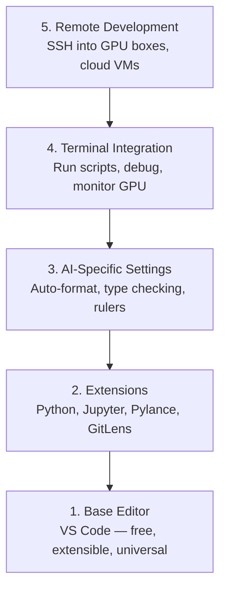

# Configuración de editor

> Su editor es su copiloto, configúralo una vez para que se quede fuera de su camino y comience a tirar de su peso.
> El editor es tu ayudante de dirección. Configurar una vez, dejar de ser un obstáculo, sino realmente desempeñar el papel.

**Type:** Build | **类型:** 构建
**Languages:** -- | **语言:** 无
**Prerequisites:** Phase 0, Lesson 01 | **前置知识:** Phase 0, 第 01 课
**Time:** ~20 minutes | **时间:** ~20 分钟

## Objetivos de aprendizaje

- Instalar VS Code con extensiones esenciales para Python, Jupyter, linting y SSH remoto
  En español: instalación VS Code 及 Python、Jupyter、代码检查和远程 SSH等必备扩展
- Configurar el formato en la guía, la verificación de tipo y el desplazamiento de salida de la libreta para los flujos de trabajo de IA
  Traducción: Configurar guardar 时格式化、类型检查和笔记本 输出滚动等 AI 工作流设置
- Configurar Remote SSH para editar y deshacer el código en máquinas remotas de GPU como si fueran locales
  La versión de la versión de la versión de la versión de la versión de la versión de la versión de la versión de la versión de la versión de la versión de la versión de la versión de la versión de la versión de la versión de la versión de la versión de la versión de la versión de la versión de la versión de la versión de la versión de la versión de la versión de la versión de la versión de la versión de la versión de la versión de la versión de la versión de la versión de la versión de la versión de la versión de la versión de la versión de la versión de la versión de la versión de la versión de la versión de la versión de la versión de la versión de la versión de la versión de la versión de la versión de la versión de la versión de la versión de la versión de la versión de la versión de la versión de la versión de la versión de la versión de la versión de la versión de la versión de la versión de la versión de la versión de la versión de la versión de la versión de la versión de la versión de la versión de la versión de la versión de la versión de la versión de la versión de la versión de la versión de la versión de la versión de la versión de la versión de la versión de la versión de la versión de la versión de la versión de la versión de la versión de la versión de la versión de la versión de la versión de la versión de la versión de la versión de la versión de la versión de la versión de la versión de la versión de la versión de la versión de la versión de la versión de la versión de la versión de la versión de la versión de la versión de la versión de la versión de la versión de la versión de la versión de la versión de la versión de la versión de la versión de la versión de la versión de la versión de la versión de la versión de la versión de la versión de la versión de la versión de la versión de la versión de la versión de la versión de la versión de la versión de la versión de la versión de la versión de la versión de la versión de la versión de la versión de la versión de la versión de la versión de la versión de la versión de la versión de Java.
- Evaluar las alternativas de editor (Cursor, Windsurf, Neovim) y sus compensaciones para el trabajo de IA
  La traducción de la traducción de la traducción de la traducción de la traducción de la traducción de la traducción de la traducción de la traducción de la traducción de la traducción de la traducción de la traducción de la traducción de la traducción de la traducción de la traducción de la traducción de la traducción de la traducción de la traducción de la traducción de la traducción de la traducción de la traducción de la traducción de la traducción de la traducción de la traducción de la traducción de la traducción de la traducción de la traducción de la traducción de la traducción de la traducción de la traducción de la traducción de la traducción de la traducción de la traducción de la traducción de la traducción de la traducción de la traducción de la traducción de la traducción de la traducción de la traducción de la traducción de la traducción de la traducción de la traducción de la traducción de la traducción de la traducción de la traducción de la traducción de la traducción de la traducción de la traducción de la traducción de la traducción de la traducción de la traducción de la lengua inglesa de la lengua inglesa de la lengua inglesa de inglés de inglés de inglés de inglés de inglés de inglés de inglés de inglés de inglés de inglés de inglés de inglés de inglés de inglés de inglés de inglés de inglés de inglés de inglés de inglés de inglés de inglés de inglés de inglés de inglés de inglés de inglés de inglés de inglés de inglés de inglés de inglés de inglés de inglés de inglés de inglés de inglés de inglés de inglés de inglés de inglés de inglés de inglés de inglés de inglés de inglés de inglés de inglés de inglés de inglés de inglés de inglés de inglés de inglés de inglés de inglés de inglés de inglés de inglés de inglés de inglés de inglés de inglés de inglés de inglés de inglés de inglés de inglés de inglés de inglés de inglés de inglés de inglés de inglés de inglés de inglés de inglés de inglés de inglés de inglés de inglés de inglés de inglés de inglés de inglés de inglés de inglés de inglés de inglés de inglés de inglés de inglés de inglés de inglés de inglés de inglés de inglés de inglés de inglés de inglés de inglés de inglés de inglés de inglés de inglés de inglés de inglés de inglés de inglés de inglés de inglés de inglés de inglés de inglés de inglés de inglés de inglés de inglés de inglés de

> **【中文解读】**
> 编辑器是你写代码的主力工具──本章帮你配置 VS Code 用于 AI 开发:Python 支持、Jupyter 集成、远程SSH 连接GPU 服务器──配置一次,受益整个课程──

## El problema es describir el problema

Pasará miles de horas dentro de su editor escribiendo Python, ejecutando cuadernos de notas, desactivando los bucles de entrenamiento y incorporando SSH en las cajas de GPU. Un editor mal configurado convierte cada sesión en fricción: no hay complemento automático, no hay sugerencias de tipografía, no hay errores de línea, formato manual y un flujo de trabajo terminal torpe.

> Usted pasará miles de horas en el editor escribiendo Python, ejecutando un Notebook, modificando un ciclo de entrenamiento, conectando a un servidor GPU, un editor incorrecto hará que cada edición se convierta en un tormento: sin complemento automático, sin tipo de sugerencias, sin errores de sugerencias, con formato manual, sin un flujo de trabajo final.

La configuración correcta toma 20 minutos, pero saltarlo te cuesta 20 minutos al día.

> La configuración correcta sólo toma 20 minutos. Salto de la configuración te hará perder más 20 minutos al día.

> **【中文解读】**
> La configuración de un editor sólo requiere 20 minutos, pero no la configuración te hará perder más de 20 minutos al día.

## El concepto central.

Una configuración de editor de ingeniería de IA necesita cinco cosas:

> El editor de ingeniería de IA necesita cinco niveles de configuración:



> **【中文解读】**
> AI  desarrollo editor necesita cinco niveles de configuración: base editor →  ampliar plugins → AI  especial configuración →  terminal integrado →  desarrollo de distancia;; de los cuales el desarrollo de SSH de distancia es lo más importante necesitas operar directamente en el editor local de GPU  servidor。
```figure
s0-lsp-roundtrip
```

## Construye el mismo

## Construye y realiza.

> **【拓展：VS Code 为什么是 AI 开发的首选编辑器】**Los siguientes son los principales factores que contribuyen a la creación de un sistema operativo de software de software de alta tecnología: 1) un sistema operativo de software de alta tecnología y software de alta tecnología. 2) un sistema operativo de alta tecnología y software de alta tecnología. 2) un sistema operativo de alta tecnología y software de alta tecnología.

### Paso 1: Instala el código VS.

VS Code es el editor recomendado. Es gratuito, se ejecuta en todos los sistemas operativos, tiene soporte de primera clase para portátiles Jupyter, y el ecosistema de extensión cubre todo lo que necesita para el trabajo de IA.

> VS Code es un editor de recomendación. Es gratis, a través de la plataforma, tiene un buen libro de notas de Jupyter.

Descarga desde [code.visualstudio.com](https://code.visualstudio.com/)¿ Qué ?

> Desde[code.visualstudio.com](https://code.visualstudio.com/)Descarga.

Verifique desde el terminal:

> En el final de la prueba:

```bash
code --version
```

Si ...`code`no se encuentra en macOS, abrir VS Code, presione `Cmd+Shift+P`, escriba "Comando de captura", y seleccione "Installar el comando 'código' en PATH".

> Si macOS 上找不到 `code`命令,打开 VS Código,按 `Cmd+Shift+P`,输入 "Shell Command", seleccionar "Installar el comando 'código' en PATH"。

### Paso 2: Instalar las extensiones esenciales.

> **【中文解读】**AI 开发必备的 VS Code 扩展:Python(调试+Lint) Jupyter(在编辑器运行笔记本) Pylance(智能补全和类型检查) ✓GitLens(查看代码历史) ⋅安装后在设置中启动"保存时格式化",从此不用手动整理代码──

Abre la terminal integrada en el código VS (`` Ctrl+``` en todas las plataformas) e instalar las extensiones que importan para el trabajo de IA:

> 打开 VS Código de la terminal de integración`Ctrl+`` `O `` Cmd+```), instalar AI 工作所需的关键扩展:

```bash
code --install-extension ms-python.python
code --install-extension ms-python.vscode-pylance
code --install-extension ms-toolsai.jupyter
code --install-extension eamodio.gitlens
code --install-extension ms-vscode-remote.remote-ssh
code --install-extension ms-python.debugpy
code --install-extension ms-python.black-formatter
code --install-extension charliermarsh.ruff
```

Lo que cada uno hace:

> Cada uno de los efectos de la expansión:

| Extension | Why |
|-----------|-----|
| Python | Language support, virtual env detection, run/debug |
| Pylance | Fast type checking, autocomplete, import resolution |
| Jupyter | Run notebooks inside VS Code, variable explorer |
| GitLens | See who changed what, inline git blame |
| Remote SSH | Open a folder on a remote GPU box as if it were local |
| Debugpy | Step-through debugging for Python |
| Black Formatter | Auto-format on save, consistent style |
| Ruff | Fast linting, catches common mistakes |

El archivo`code/.vscode/extensions.json`Cuando abras la carpeta de proyectos, VS Code te pedirá que las instales.

> 本课中   en el curso`code/.vscode/extensions.json`包含完整的推列表──当你打开项目文件时,VS Code 会提示你安装──

### Paso 3: Configurar las configuraciones

Copie las configuraciones de `code/.vscode/settings.json`En esta lección, o aplicarlos manualmente a través de `Settings > Open Settings (JSON)`¿ Qué ?

> Desde el curso`code/.vscode/settings.json`复制设置, o por `Settings > Open Settings (JSON)`Aplicación manual.

Las configuraciones clave para el trabajo de IA:

> Configuración clave de AI 工作:

```jsonc
{
    "python.analysis.typeCheckingMode": "basic",
    "editor.formatOnSave": true,
    "editor.rulers": [88, 120],
    "notebook.output.scrolling": true,
    "files.autoSave": "afterDelay"
}
```

¿Por qué son importantes?

> ¿Por qué estas configuraciones son importantes:

- **Type checking on basic**: Captura tipos de argumento incorrectos antes de ejecutar. Ahorra tiempo de depuración en las incompatibilidades de forma del tensor y los parámetros de API incorrectos.
  En inglés:**基础类型检查**: en el funcionamiento pre-captura de errores de parámetros tipo。 ahorro de la forma de la cantidad de tiempo de la configuración no coincide y de errores API parámetros 调试时间。
- **Format on save**Nunca más pienses en el formato.
  En inglés:**保存时格式化**No hay necesidad de pensar en el formato.
- **Rulers at 88 and 120**El marcador 120 muestra cuando las cadenas de documentos y comentarios se están haciendo demasiado largos.
  En inglés:**88 和 120 标尺**: Negro en 88 处换行──120 标尺显示文档字符串和注释是否过长──
- **Notebook output scrolling**Los bucles de entrenamiento imprimen miles de líneas.
  En inglés:**Notebook 输出滚动**No se rodea, se sale la tabla.
- **Auto-save**Se olvidará de guardar. Su guión de entrenamiento ejecutará código obsoleto.
  En inglés:**自动保存**:You will forget to save.                                                                                                                                                                                                                                                            

### Paso 4: Integración de la terminal

El terminal integrado de VS Code es donde ejecutas scripts de entrenamiento, monitoreas GPUs y gestionas entornos.

> El terminal integrado de VS Code es el lugar donde se ejecuta el entrenamiento de guión, control de GPU y gestión del entorno.

Configúralo correctamente:

> El juego está listo.

```jsonc
{
    "terminal.integrated.defaultProfile.osx": "zsh",
    "terminal.integrated.defaultProfile.linux": "bash",
    "terminal.integrated.fontSize": 13,
    "terminal.integrated.scrollback": 10000
}
```

Acortajes útiles:

> 常用快捷键:

| Action | macOS | Linux/Windows |
|--------|-------|---------------|
| Toggle terminal | `` Ctrl+` `` | `` Ctrl+` `` |
| New terminal | `` Ctrl+Shift+` `` | `` Ctrl+Shift+` `` |
| Split terminal | `Cmd+\` | `Ctrl+Shift+5` |

Los terminales divididos son útiles: uno para ejecutar tu script, otro para monitorear la GPU con `nvidia-smi -l 1`o `watch -n 1 nvidia-smi`¿ Qué ?

> Un guión de trabajo, un guión de trabajo.`nvidia-smi -l 1`O `watch -n 1 nvidia-smi`Monitoring GPU♪

### Paso 5: Desarrollo remoto (SSH en GPU Boxes)

> **【拓展：Remote SSH 是 AI 开发的杀手级功能】**La mayoría de las personas no tienen GPU local, necesitan SSH hasta el GPU de distancia  servidor de entrenamiento modelo。 VS Code de SSH de distancia  expansión te permite editar código de distancia como editar archivos locales auto-reemplazo, ajuste、 terminal todo disponible。 Esto significa que puedes desarrollar en el libro de poca distancia, en el A100 de entrenamiento de la distancia。

Esta es la extensión más importante para el trabajo de IA. Se ejecutará el entrenamiento en máquinas remotas (VM en la nube, servidores de laboratorio, Lambda, Vast.ai).

> Esto es la mayor expansión de la IA en el trabajo. Usted va a operar en máquinas de distancia.

Configuración:

> 设置步骤:

1. Instale la extensión remota SSH (hecho en el paso 2).
2. Prensa `Ctrl+Shift+P`(o `Cmd+Shift+P`), el tipo "Remote-SSH: Conectarse a Host".
3. Entrar .`user@your-gpu-box-ip`¿ Qué ?
4. VS Code instala su componente de servidor en la máquina remota automáticamente.

> 1. 安装 Remote SSH 扩展(已在步骤 2 完成)
> 2. 按  `Ctrl+Shift+P`(o `Cmd+Shift+P`),输入 "Remote-SSH: Conectarse a el host"──
> 3. 输入  `user@your-gpu-box-ip`¿Qué es eso?
> 4. VS Código automático instalar su servidor en un equipo remoto.

Para acceder sin contraseña, configure las claves SSH:

> Para lograr acceso sin contraseña, configurar la clave SSH:

```bash
ssh-keygen -t ed25519 -C "your-email@example.com"
ssh-copy-id user@your-gpu-box-ip
```

Añadir al host a `~/.ssh/config`para su conveniencia:

> Para que sea más fácil, el director se añade.`~/.ssh/config`¿Qué es esto ?

```
Host gpu-box
    HostName 203.0.113.50
    User ubuntu
    IdentityFile ~/.ssh/id_ed25519
    ForwardAgent yes
```

Ahora .`Remote-SSH: Connect to Host > gpu-box`se conecta instantáneamente.

> Ahora .`Remote-SSH: Connect to Host > gpu-box`¡Estoy en contacto con usted!

## Las alternativas.

> **【拓展：AI 增强编辑器对比】**Cursor (basado en VS Code, INE AI 编程助手, $ 20/月) y Windsurf (Codeium 出品,免费层可用) son las principales ventajas de las nuevas tecnologías de inteligencia artificial en el período 2024-2026.

### El cursor

[cursor.com](https://cursor.com)es un fork VS Code con generación de código de IA incorporada. Utiliza el mismo ecosistema de extensiones y formato de configuración. Si usa Cursor, todo en esta lección todavía se aplica. Importa lo mismo `settings.json`y `extensions.json`¿ Qué ?

> [cursor.com](https://cursor.com)Es un código de IA incorporado generado por VS Code 分支── utiliza el mismo modo de expansión y formato de configuración── si usas Cursor, todo el contenido de esta clase sigue siendo aplicable──导入相同`settings.json`Y `extensions.json`Es decir,

### El windsurf

[windsurf.com](https://windsurf.com)Es otro fork de VS Code de IA. La misma historia: las mismas extensiones, el mismo formato de configuración, el mismo soporte de SSH remoto.

> [windsurf.com](https://windsurf.com)Es otro código VS de prioridad de IA, de la misma manera: la misma extensión, el mismo formato de configuración, el mismo soporte de SSH remoto.

### Vim/Neovim

Si ya utilizas Vim o Neovim y eres productivo en ello, quédate allí. La configuración mínima para el trabajo de Python de IA:

> Si ya estás usando Vim o Neovim y la eficiencia no está mal, continúa usando AI Python 工作的最低配置:

- **pyright**o **pylsp**para la verificación de tipo (a través de la instalación manual o de la máquina de maquillaje)
  En inglés:**pyright**O **pylsp**Usado para tipo de inspección (a través de Mason o manual)
- **nvim-lspconfig**para la integración de servidores de idiomas
  En inglés:**nvim-lspconfig**Utilizado en el lenguaje de servidor
- **jupyter-vim**o **molten-nvim**para ejecución similar a un cuaderno
  En inglés:**jupyter-vim**O **molten-nvim**Usado para ejecutar como Notebook
- **telescope.nvim**para la búsqueda de archivos/símbolos
  En inglés:**telescope.nvim**Usado para buscar archivos / símbolos
- **none-ls.nvim**con negro y ruff para el formato/linting
  En inglés:**none-ls.nvim**配合 negro y ruff Usado para el formato / lente

Si no utilizas Vim, no empieces ahora. La curva de aprendizaje competirá con el aprendizaje de ingeniería de IA.

> Si aún no usas Vim, ahora no empieces.

## Usa la guía.

> **【中文解读】**推配置:VS Code + Python + Jupyter + Remote SSH。 Si utiliza GPU  servidor de distancia, Remote SSH es obligatorio。调试训练循环时,Jupyter 扩展让你在编辑器内直接查看张量形和损曲线。

Con esta configuración, tu flujo de trabajo diario se ve como:

> Con esta configuración, tu trabajo diario es así:

1. Abre la carpeta del proyecto en VS Code (o conecte a través de Remote SSH a una caja de GPU).
   En inglés, en inglés, en inglés, en inglés, en inglés, en inglés, en inglés, en inglés, en inglés, en inglés, en inglés, en inglés, en inglés, en inglés, en inglés, en inglés, en inglés, en inglés, en inglés, en inglés, en inglés, en inglés, en inglés, en inglés, en inglés, en inglés, en inglés, en inglés, en inglés, en inglés, en inglés, en inglés, en inglés, en inglés, en inglés, en inglés, en inglés, en inglés, en inglés, en inglés, en inglés, en inglés, en inglés, en inglés, en inglés, en inglés, en inglés, en inglés, en inglés, en inglés, en inglés, en inglés, en inglés, en inglés, en inglés, en inglés, en inglés, en inglés, en inglés, en inglés, en inglés, en inglés, en inglés, en inglés, en inglés, en inglés, en inglés, en inglés, en inglés, en inglés, en inglés, en inglés, en inglés, en inglés, en inglés, en inglés, en inglés, en inglés, en inglés, en inglés, en inglés, en inglés, en inglés, en inglés, en inglés, en inglés, en inglés, en inglés, en inglés, en inglés, en inglés, en inglés, en inglés, en inglés, en inglés, en inglés, en inglés, en inglés, en inglés, en inglés, en inglés, en inglés, en inglés, en inglés, en inglés, en inglés, en inglés, en inglés, en inglés, en inglés, en inglés, en inglés, en inglés, en inglés, en inglés, en inglés, en inglés, en inglés, en inglés, en inglés, en inglés, en inglés, en inglés, en inglés, en inglés, en inglés, en inglés, en inglés, en inglés, en inglés, en inglés, en inglés, en inglés, en inglés, en inglés, en inglés, en inglés, en inglés, en inglés, en inglés, en inglés, en inglés, en inglés, en inglés, en inglés, en inglés, translated, en inglés, en inglés, en inglés, en inglés, en inglés, en inglés, en inglés, en inglés, translated, en inglés, en inglés, en inglés, en inglés, translated, en inglés, en inglés, en inglés, en inglés, translated, en inglés, en inglés, translated as as as as
2. Escriba Python en el editor con autocompletado, sugerencias de tipografía y errores de línea.
   Traducción:En el editor, escribe Python, disfruta de complemento automático, tipo de sugerencias y error de sugerencias.
3. Ejecutar los cuadernos de Jupyter en línea con la extensión de Jupyter.
   En español: "Jupiter" en español: "Jupiter" en español: "Jupiter" en español: "Jupiter" en español: "Jupiter" en español: "Jupiter" en español: "Jupiter" en español: "Jupiter" en español: "Jupiter" en español: "Jupiter" en español: "Jupiter" en español: "Jupiter" en español: "Jupiter" en español: "Jupiter" en español: "Jupiter" en español: "Jupiter" en español: "Jupiter" en español: "Jupiter" en español: "Jupiter" en español: "Jupiter" en español: "Jupiter" en español: "Jupiter" en español: "Jupiter" en español: "Jupiter" en español: "Jupiter" en español: "Jupiter" en español: "Jupiter" en español: "Jupiter" en español: "Jupiter" en español: "Jupiter" en español: "Jupiter" en español: "Jupiter" en español: "Jupiter" en español: "Jupiter" en español: "Jupiter" en español: "en español: "en español: "en español: "en español: "en español: español: español: español: español: español: español: español: español: español: español: español: español: español: español: español: español: español: español: español: español: español: español: español: español: español: español: español: español: español: español: español: español: español: español: español: español: español: español: español: español: español: español: español: español: español: español: español: español: español: español: español: español: español: español: español: español: español: español: español: español: español: español: español: español: español: español: español: español: español: español: español: español: español: español: español: español: español: español
4. Utilice la terminal integrada para los scripts de formación, `uv pip install`, y la supervisión de GPU.
   La lengua inglesa se traduce en inglés como "el lenguaje de la lengua inglesa".`uv pip install`Y GPU  monitoreo
5. Revise los cambios con GitLens antes de comprometerse.
   En inglés, el nombre de la página web de GitLens es traducido en inglés como "GitLens".

## Los ejercicios.

1. Instalar el código VS y todas las extensiones enumeradas en el paso 2
   Instalación VS Código y paso 2
2. Copie el `settings.json`de esta lección en su VS código de configuración
   ¿Qué es esto?`settings.json` Copie hasta su VS Código  Configuración
3. Abre un archivo Python y comprueba que Pylance muestra sugerencias de tipo y formatos negros en guardar
   打开一个Python文件,验证Pylance 显示类型提示、黑 保存时自动格式化
4. Si tiene acceso a una máquina remota, configure Remote SSH y abra una carpeta en ella
   Si hay un dispositivo remoto, configurar SSH remoto y abrir archivos remotos

## Términos clave .

| Term | What people say | What it actually means |
|------|----------------|----------------------|
| LSP | "Autocomplete engine" | Language Server Protocol: a standard for editors to get type info, completions, and diagnostics from a language-specific server |
| Pylance | "The Python plugin" | Microsoft's Python language server using Pyright for type checking and IntelliSense |
| Remote SSH | "Working on the server" | VS Code extension that runs a lightweight server on a remote machine and streams the UI to your local editor |
| Format on save | "Auto-prettier" | The editor runs a formatter (Black, Ruff) every time you save, so code style is always consistent |

| 术语 | 俗称 | 实际含义 |
|------|------|---------|
| LSP | "自动补全引擎" | 语言服务器协议：编辑器获取类型信息、补全和诊断的标准 |
| Pylance | "Python 插件" | 微软的 Python 语言服务器，提供类型检查和智能提示 |
| Remote SSH | "在服务器上开发" | VS Code 在远程机器上运行轻量服务器，将 UI 传输到本地编辑器 |
| Format on save | "保存时自动格式化" | 每次保存时自动运行格式化工具，保持代码风格一致 |
