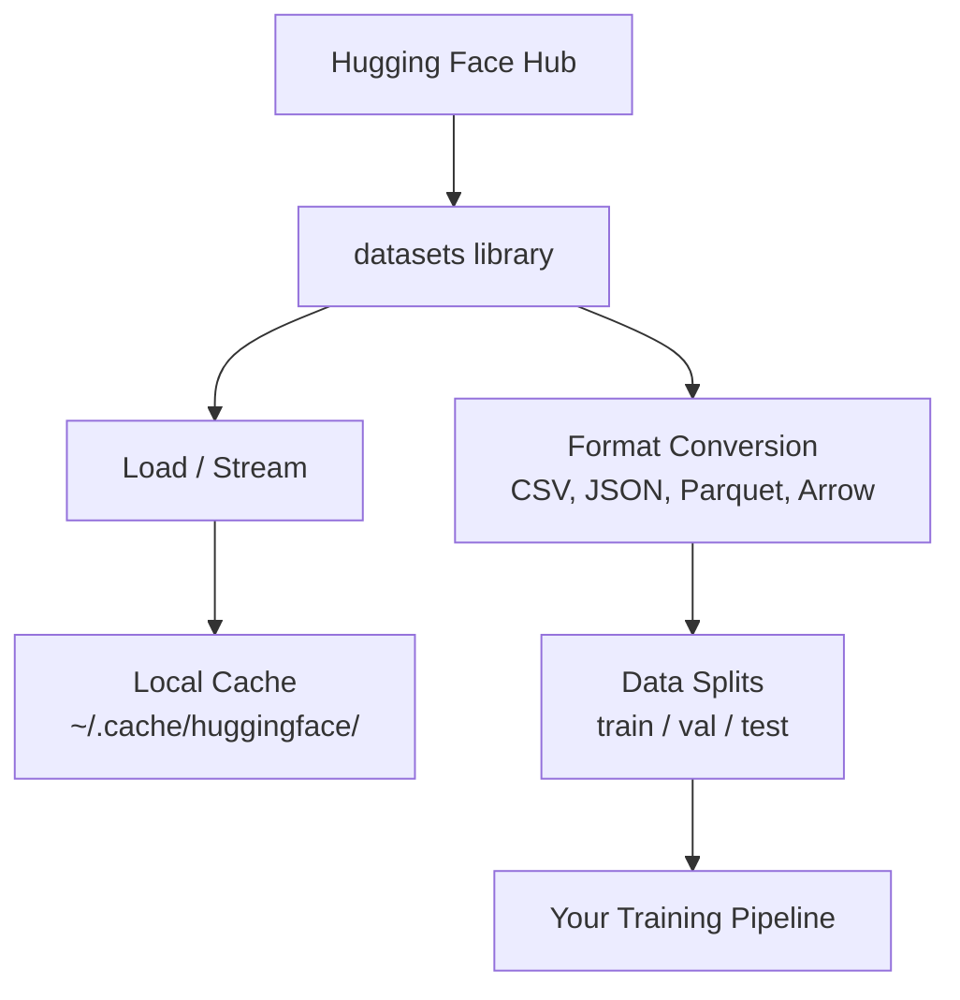

# Gestión de datos Gestión de datos

> Los datos son el combustible, y la forma en que los manejas determina la velocidad.
> Los datos son combustible. La forma en que lo manejas determina si puedes correr más rápido.

**Type:** Build | **类型:** 构建
**Language:**¿ Qué pasa ?**语言:**Python
**Prerequisites:** Phase 0, Lesson 01 | **前置知识:** Phase 0, 第 01 课
**Time:** ~45 minutes | **时间:** ~45 分钟

## Objetivos de aprendizaje

- Cargar, transmitir y almacenar en caché conjuntos de datos utilizando el Face Hugging `datasets`biblioteca
  中文翻译: usar Acogida del rostro `datasets`库加载、流式处理和缓存数据集 库加载、流式处理和缓存数据集
- Convertir entre los formatos CSV, JSON, Parquet y Arrow y explicar sus compensaciones
  Traducción:En CSV、JSON、Parquet y Arrow format entre los cambios, y explica sus ventajas y desventajas
- Crear divisiones reproducibles de tren/validación/pruebas con semillas aleatorias fijas
  Traducción:Con fijo como semejante crea un entrenamiento / prueba / prueba
- Gestionar archivos de modelos y conjuntos de datos grandes utilizando `.gitignore`, Git LFS o DVC
  En inglés:`.gitignore`、Git LFS o DVC 管理大型模型和数据文件

> **【中文解读】**
> El dato es el combustible de la IA.`datasets`库加载、缓存、转换和拆分数据集――hacerse cargo de la gestión de datos es el prerequisito para comenzar las experiencias de aprendizaje automático―

## El problema es describir el problema

Cada proyecto de IA comienza con datos. Necesitas encontrar conjuntos de datos, descargarlos, convertirlos entre formatos, dividirlos para entrenamiento y evaluación, y versionarlos para que los experimentos sean reproducibles. Hacer esto manualmente cada vez es lento y propenso a errores. Necesitas un flujo de trabajo repetible.

> Cada proyecto de IA se inicia con datos. Necesitas encontrar un conjunto de datos, descargar, transformar formato, dividirlo en un conjunto de entrenamiento y evaluación, y realizar la gestión de versiones para garantizar que el experimento pueda ser repetido.

> **【中文解读】**
> Cada proyecto de IA se inicia con datos. Necesitas descargar conjuntos de datos, transformar formato, desglosar entrenamiento/verificación/probos y administrar versiones para asegurar que el experimento pueda ser repetido.

> **【拓展：Hugging Face 在 AI 生态中的地位】**
> Hugging Face es un "GitHub" en el ámbito de la IA, que ha gestionado cientos de miles de conjuntos de datos y modelos de entrenamiento preliminares.`datasets`La biblioteca es un instrumento estándar para cargar y procesar datos, similar a Pandas, pero especializado en AI  optimización, soporte de la carga de grandes conjuntos de datos.

## El concepto central.



El rostro abrazado`datasets`La biblioteca es la forma estándar de cargar datos para el trabajo de IA. Se encarga de descargar, almacenar en caché, convertir formato y transmitir fuera de la caja.

> Un rostro abrazador .`datasets`库是AI 数据加载的标准方式──它开箱即即用地处理下载,缓存,形式转换和流式加载──

> **【中文解读】**
> Un rostro abrazador .`datasets`Es el estándar de realidad de carga de datos de IA. Procesan automáticamente la descarga, almacenamiento, conversión y carga de datos. No necesitas manejar manualmente los archivos de datos, la biblioteca te ayudará a completar todos los trabajos básicos. Comprender esta línea de flujo de datos es la base de todos los experimentos de IA.

> **【拓展：数据格式对训练速度的影响】**
> En el trabajo real de la IA, el formato de datos afecta directamente la eficiencia de entrenamiento. El formato de parquet es de 60 a 80% más rápido que el CSV.

## Construye y realiza.
```figure
s0-data-pipeline
```

## Construye el mismo

### Paso 1: Instalar la biblioteca de conjuntos de datos

```bash
pip install datasets huggingface_hub  # 安装 Hugging Face 数据集库和模型仓库工具
```

### Paso 2: Cargar un conjunto de datos

```python
from datasets import load_dataset

dataset = load_dataset("imdb")  # 加载 IMDB 电影评论数据集（首次下载，之后从缓存读取）
dataset = load_dataset("stanfordnlp/imdb")
print(dataset)
print(dataset["train"][0])  # 查看训练集第一条样本
```

Esto descarga el conjunto de datos de revisión de películas de IMDB. Después de la primera descarga, se carga desde la caché en `~/.cache/huggingface/datasets/`¿ Qué ?

> Esta será la primera descarga en IMDB.`~/.cache/huggingface/datasets/`De la caja de seguridad.

### Paso 3: Transmite grandes conjuntos de datos

Algunos conjuntos de datos son demasiado grandes para caber en el disco.

> Algunos conjuntos de datos son demasiado grandes para ser descargados por completo en un disco magnético.

```python
dataset = load_dataset("wikimedia/wikipedia", "20220301.en", split="train", streaming=True)  # 流式加载：不下载完整数据集

for i, example in enumerate(dataset):
    print(example["title"])  # 逐条处理，内存占用恒定
    if i >= 4:
        break
```

El streaming te da una oportunidad .`IterableDataset`El uso de memoria se mantiene constante independientemente del tamaño del conjunto de datos.

> 流式加载 回复                                                                                                                                                                                                                                                                                                                                                                                                                                                                                                                       `IterableDataset` Usted cada vez más procesar los datos hasta donde llegan.

> **【拓展：流式加载在大模型训练中的应用】**
> 流式加载是训练大语言模型的关键技术――Common Crawl 数据集集约250TB, imposible de descargar en su totalidad hasta el lugar―GPT-4 训练数据通过流式方式从分布式存储中加载,每秒处理数十万条文―Hugging Face 的`streaming=True`Los parámetros te permiten procesar los grandes conjuntos de datos de la misma manera, incluso un portátil de 8 GB de memoria interna también puede procesar datos de TB.

### Paso 4: Formatos de conjunto de datos

El `datasets`La biblioteca utiliza Apache Arrow bajo el capó. Puedes convertirlo a otros formatos dependiendo de lo que tu tubería necesite.

> `datasets`库底层使用Apache Arrow──你可以根据管线需要转换为其他格式──

```python
dataset = load_dataset("stanfordnlp/imdb", split="train")

dataset.to_csv("imdb_train.csv")  # 导出为 CSV 格式（通用但体积大）
dataset.to_json("imdb_train.json")  # 导出为 JSON 格式（适合 API 交换）
dataset.to_parquet("imdb_train.parquet")  # 导出为 Parquet 格式（压缩率高、读取快）
```

Comparación de formato:

> 格式对比:

| Format | Size | Read Speed | Best For |
|--------|------|-----------|----------|
| CSV | Large | Slow | Human readability, spreadsheets |
| JSON | Large | Slow | APIs, nested data |
| Parquet | Small | Fast | Analytics, columnar queries |
| Arrow | Small | Fastest | In-memory processing (what `datasets` uses internally) |

| 格式 | 体积 | 读取速度 | 最适合 |
|------|------|---------|--------|
| CSV | 大 | 慢 | 人类阅读、电子表格 |
| JSON | 大 | 慢 | API、嵌套数据 |
| Parquet | 小 | 快 | 分析查询、列式存储 |
| Arrow | 小 | 最快 | 内存中处理（datasets 库内部使用） |

Para el trabajo de IA, Parquet es el mejor formato de almacenamiento. Arrow es lo que se trabaja en la memoria. CSV y JSON son para el intercambio.

> Para la IA, Parquet es el mejor formato de almacenamiento. Arrow es el formato utilizado en la memoria. CSV y JSON se utilizan para el intercambio de datos.

### Paso 5: División de datos

> **【中文解读】**
> Los datos se desglosan como principios básicos del aprendizaje automático. Los ensayos se utilizan para aprender, los ensayos se usan para modificar, los ensayos se utilizan para evaluar. Los ensayos se deben superponer entre sí, de lo contrario, el modelo se presenta como "fuerte de datos" pero en realidad no tiene ningún uso.

Cada proyecto de ML necesita tres divisiones:

> Cada proyecto de ML necesita tres divisiones:

- **Train**El modelo aprende de esto (normalmente el 80%)
  En inglés:**训练集**Modelo de aquí aprender (normalmente 80%)
- **Validation**: Verifica el progreso durante la formación (normalmente 10%)
  En inglés:**验证集**: En el proceso de entrenamiento, el control de progreso (normalmente 10%)
- **Test**: Evaluación final después de la formación (normalmente 10%)
  En inglés:**测试集**: evaluación final después de la finalización del entrenamiento (normalmente 10%)

Algunos conjuntos de datos vienen pre-divididos. Cuando no lo hacen, dividielos tú mismo:

> Algunos conjuntos de datos ya están previamente divididos. Si no, necesitas separarte a ti mismo:

```python
dataset = load_dataset("stanfordnlp/imdb", split="train")

split = dataset.train_test_split(test_size=0.2, seed=42)  # 80% 训练+验证，20% 测试
train_val = split["train"].train_test_split(test_size=0.125, seed=42)  # 从 80% 中取 12.5% 作为验证集

train_ds = train_val["train"]  # 最终：70% 训练集
val_ds = train_val["test"]  # 最终：10% 验证集
test_ds = split["test"]  # 最终：20% 测试集

print(f"Train: {len(train_ds)}, Val: {len(val_ds)}, Test: {len(test_ds)}")
```

Siempre fije una semilla para la reproducibilidad.

> Es necesario establecer semillas para asegurar la repetibilidad.

### Paso 6: Descargar y almacenar modelos en caché

Los modelos son archivos grandes.`huggingface_hub`librería maneja descarga y almacenamiento en caché.

> El modelo es un gran documento.`huggingface_hub`库负责下载和缓存──

```python
from huggingface_hub import hf_hub_download, snapshot_download

model_path = hf_hub_download(  # 下载单个文件
    repo_id="sentence-transformers/all-MiniLM-L6-v2",
    filename="config.json"
)
print(f"Cached at: {model_path}")

model_dir = snapshot_download("sentence-transformers/all-MiniLM-L6-v2")  # 下载整个模型仓库
print(f"Full model at: {model_dir}")
```

> **【拓展：模型缓存机制】**
> El mecanismo de almacenamiento de Hugging Face es muy inteligente: modelo descarga y posterior almacenamiento en `~/.cache/huggingface/hub/`, posterior carga directamente leer leer en el local de almacenamiento. Un LLM común como Llama-2-7B 约14GB, la primera descarga requiere unos minutos, después de la segunda carga. En el escenario empresarial, un equipo compartido de archivos de modelos puede ahorrar cientos de GB de descargas repetidas.

Modelos en caché para `~/.cache/huggingface/hub/`Una vez descargados, se cargan instantáneamente en las siguientes carreras.

> 模型缓存到                                                                                                                                                                                                                                                                                                                                                                                                                                                                                                                         `~/.cache/huggingface/hub/` 下载一次后后,后续运行秒级加载──

### Paso 7: Manejar archivos grandes

> **【中文解读】**
> AI 模型文件动数 GB(GPT-2 约500MB,Llama-2-70B 约140GB), no puede utilizar el git 管理普通──三种方案各有适用场景:`.gitignore`Última página: "Git LFS 适合团队共享模型权重,DVC 适合严格复现的实验").

Los pesos de modelo y los grandes conjuntos de datos no deben entrar en git.

> 模型权重和大型数据集不应放入 git──三种选择:

**Option A: .gitignore (simplest)**

> **选项 A：.gitignore（最简单）**

```
*.bin
*.safetensors
*.pt
*.onnx
data/*.parquet
data/*.csv
models/
```

**Option B: Git LFS (track large files in git)**

> **选项 B：Git LFS（在 git 中追踪大文件）**

```bash
git lfs install
git lfs track "*.bin"
git lfs track "*.safetensors"
git add .gitattributes
```

Git LFS almacena los punteros en su repo y los archivos reales en un servidor separado. GitHub le da 1 GB gratis.

> Git LFS en el almacenamiento en el almacenamiento de indices, archivos reales almacenados en un servidor independiente. GitHub ofrece 1 GB de espacio libre.

**Option C: DVC (data version control)**

> **选项 C：DVC（数据版本控制）**

```bash
pip install dvc
dvc init
dvc add data/training_set.parquet
git add data/training_set.parquet.dvc data/.gitignore
git commit -m "Track training data with DVC"
```

DVC crea pequeñas .`.dvc`Los datos en sí viven en S3, GCS, o otro backend de almacenamiento remoto.

> DVC 创建小的 `.dvc`文件指向你的数据── datos en sí mismos almacenados en S3、GCS o en otros almacenamientos remotos posterior.

> **【拓展：工业级数据版本管理】**
> En Google y Meta, la gestión de versiones de datos es más compleja que la gestión de versiones de código. Un experimento de sistema recomendado puede involucrar decenas de conjuntos de datos, miles de millones de muestras.

| Approach | Complexity | Best For |
|----------|-----------|----------|
| .gitignore | Low | Personal projects, downloaded data you can re-fetch |
| Git LFS | Medium | Teams sharing model weights via git |
| DVC | High | Reproducible experiments, large datasets, teams |

| 方案 | 复杂度 | 最适合 |
|------|--------|--------|
| .gitignore | 低 | 个人项目、可重新下载的数据 |
| Git LFS | 中 | 通过 git 共享模型权重的团队 |
| DVC | 高 | 需要严格复现的实验、大数据集、团队协作 |

Para este curso,`.gitignore`Utilice DVC cuando necesite reproducir experimentos exactos en máquinas.

> Este curso es`.gitignore`Ya está. Cuando necesites pasar por el equipo, vuelve a usar el DVC.

### Paso 8: Modelos de almacenamiento

> **【中文解读】**
> El almacenamiento local se adapta a 10 GB de datos, Hugging Face 缓存自动管理── cuando el conjunto de datos sea más grande o sea necesario compartir entre varios equipos, se debe utilizar el almacenamiento en la nube (S3、GCS)──DVC se puede integrar directamente con el almacenamiento en la nube, para lograr el manejo de la versión de datos──

**Local storage**funciona para conjuntos de datos de menos de ~ 10 GB. El caché HF maneja esto automáticamente.

> **本地存储** Aplicable para el procesamiento automático de los datos de 10 GB en el cuadro siguiente.

**Cloud storage**es para cualquier cosa más grande o compartida entre máquinas:

> **云存储**Para el uso de un conjunto de datos más grande o para la necesidad de compartir entre máquinas:

```python
import os

local_path = os.path.expanduser("~/.cache/huggingface/datasets/")

# s3_path = "s3://my-bucket/datasets/"
# gcs_path = "gs://my-bucket/datasets/"
```

DVC se integra directamente con S3 y GCS:

> DVC  directamente con S3 y GCS 集成:

```bash
dvc remote add -d myremote s3://my-bucket/dvc-store
dvc push
```

El almacenamiento en la nube se vuelve relevante cuando se ajusta a las instancias remotas de la GPU.

> El almacenamiento local en este curso es suficiente. Cuando se hace un pequeño cambio en el ejemplo de GPU remoto, sólo se necesita almacenamiento en el cloud.

## Datos utilizados en este curso

| Dataset | Lessons | Size | What It Teaches |
|---------|---------|------|----------------|
| IMDB | Tokenization, classification | 84 MB | Text classification basics |
| WikiText | Language modeling | 181 MB | Next-token prediction |
| SQuAD | QA systems | 35 MB | Question answering, spans |
| Common Crawl (subset) | Embeddings | Varies | Large-scale text processing |
| MNIST | Vision basics | 21 MB | Image classification fundamentals |
| COCO (subset) | Multimodal | Varies | Image-text pairs |

| 数据集 | 涉及课程 | 体积 | 教你什么 |
|--------|---------|------|---------|
| IMDB | 分词、分类 | 84 MB | 文本分类基础 |
| WikiText | 语言建模 | 181 MB | 下一个 token 预测 |
| SQuAD | 问答系统 | 35 MB | 问答与区间选择 |
| Common Crawl（子集） | 嵌入 | 不定 | 大规模文本处理 |
| MNIST | 视觉基础 | 21 MB | 图像分类入门 |
| COCO（子集） | 多模态 | 不定 | 图像-文本对 |

No es necesario descargar todas estas cosas ahora, cada lección especifica lo que necesita.

> No necesitas descargar todos estos datos ahora. Cada sección te explicará lo que necesitas.

## Usalo con el marco de ejecución

> **【中文解读】**
> 实践环节:运行 `data_utils.py`验证所有数据管理功能正常工作── Este guión descargará automáticamente un pequeño conjunto de datos、 hacer un formato de transformación、 desglosar el entrenamiento/验证/测试集, y imprimir información resumida── asegurarse de que su configuración ambiental sea correcta y luego volver a entrar en el siguiente curso──

Ejecutar el script de utilidad para verificar todo funciona:

> 运行工具脚本验证一切正常:

```bash
python code/data_utils.py
```

Esto descarga un pequeño conjunto de datos, lo convierte, lo divide y imprime un resumen.

> Se descargará un pequeño conjunto de datos, se transformará en formato, se descompone, y se imprimirá resumen.

## Envíe el producto .

Esta lección produce:
- `code/data_utils.py`- utilidad de carga y almacenamiento en caché de datos reutilizables
- `outputs/prompt-data-helper.md`- de manera rápida para encontrar el conjunto de datos adecuado para una tarea

> 本课产 出:
> - `code/data_utils.py`- herramienta de carga y almacenamiento de datos de uso repetitivo
> - `outputs/prompt-data-helper.md`- Para buscar la información adecuada

## Los ejercicios.

1. Carga el `glue`conjunto de datos con el `mrpc`Configurar e inspeccionar los primeros 5 ejemplos
   Carga`glue`Datos de la`mrpc`配置,查看前 5 条数据
2. Envía el `c4`conjunto de datos y contar cuántos ejemplos puede procesar en 10 segundos
   流式加载                                                                                                                                                                                                                                                                                                                                                                                                                                                                                                                         `c4`Datos, estadísticas 10 segundos en el procesamiento de cuántos datos
3. Convierta un conjunto de datos a Parquet y compara el tamaño del archivo a CSV
   Convirtiendo el conjunto de datos en formato de parquet, en comparación con el tamaño de los archivos de CSV
4. Crear una división de tren/val/prueba 70/15/15 con semilla fija y verificar los tamaños
   Con fijación de semillas creado 70/15/15 de entrenamiento/verificación/测试集 分分,验证比例

## Términos clave .

| Term | What people say | What it actually means |
|------|----------------|----------------------|
| Dataset split | "Training data" | A named subset (train/val/test) used at different stages of the ML lifecycle |
| Streaming | "Load it lazily" | Processing data row by row from a remote source without downloading the full dataset |
| Parquet | "Compressed CSV" | A columnar file format optimized for analytical queries and storage efficiency |
| Arrow | "Fast dataframe" | An in-memory columnar format used internally by the datasets library for zero-copy reads |
| Git LFS | "Git for big files" | An extension that stores large files outside the git repo while keeping pointers in version control |
| DVC | "Git for data" | A version control system for datasets and models that integrates with cloud storage |
| Cache | "Already downloaded" | A local copy of previously fetched data, stored at ~/.cache/huggingface/ by default |

| 术语 | 俗称 | 实际含义 |
|------|------|---------|
| Dataset split | "训练数据" | 数据集的命名子集（训练/验证/测试），用于 ML 生命周期的不同阶段 |
| Streaming | "懒加载" | 逐行处理远程数据，不下载完整数据集 |
| Parquet | "压缩 CSV" | 为分析查询和存储效率优化的列式文件格式 |
| Arrow | "快速数据帧" | datasets 库内部使用的内存列式格式，支持零拷贝读取 |
| Git LFS | "大文件 Git" | 将大文件存储在 git 仓库之外的扩展 |
| DVC | "数据版控" | 数据集和模型的版本控制系统，集成云存储 |
| Cache | "已下载" | 默认存储在 ~/.cache/huggingface/ 的本地缓存 |
