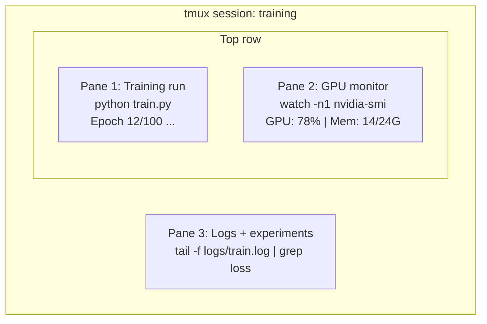

# Terminal y Shell . Terminal y Shell .

> La terminal es donde viven los ingenieros de IA.
> El final es el hogar de un ingeniero de IA.

**Type:** Learn | **类型:** 学习
**Languages:** -- | **语言:** 无
**Prerequisites:** Phase 0, Lesson 01 | **前置知识:** Phase 0, 第 01 课
**Time:** ~35 minutes | **时间:** ~35 分钟

## Objetivos de aprendizaje

- Usar tuberías, redirecciones y `grep`filtrar y procesar los registros de entrenamiento desde la línea de comandos
  La traducción de la lengua china es:`grep`Desde el orden de la línea de entrenamiento y el procesamiento
- Crear sesiones de tmux persistentes con múltiples paneles para entrenamiento simultáneo y monitoreo de GPU
  Traducción:Crear con múltiples tablas de duración, para entrenamiento y control simultáneos de GPU
- Monitorear los recursos del sistema y de la GPU con `htop`¿ Qué ?`nvtop`, y `nvidia-smi`
  En inglés:`htop`¿Qué es esto?`nvtop`Y `nvidia-smi` Sistema de control y recursos de GPU
- Transferencia de archivos entre máquinas locales y remotas utilizando SSH, `scp`, y `rsync`
  En inglés, el uso de SSH`scp`Y `rsync`En el local y el de distancia entre máquinas de transmisión de archivos

> **【中文解读】**
> 终端是AI 工程师最常用的工具――训练模型、监控 GPU、查看日志、远程连接全部在终端完成──本章教你终端操作的核心技能:管道、tmux 会话、GPU 监控和文件传输──

## El problema es describir el problema

Pasará más tiempo en el terminal que en cualquier editor. Entrenamiento, monitoreo de GPU, registro de secuencias, sesiones remotas de SSH, gestión ambiental. Cada flujo de trabajo de IA toca la cáscara. Si eres lento aquí, eres lento en todas partes.

> Tu tiempo en el terminal es más que en cualquier editor. Entrenamiento en funcionamiento, vigilancia de GPU, registro de datos, gestión de ambiente, etc. Cada flujo de trabajo de IA es un poco más lento.

Esta lección cubre las habilidades terminales que son importantes para el trabajo de la IA. No hay historia de Unix. No hay inmersión profunda en el scripting Bash.

> Este curso sólo habla de las habilidades finales que realmente se necesitan en el trabajo de la IA.

> **【中文解读】**
> Los ingenieros de IA en el tiempo terminal son más numerosos que cualquier editor. Los modelos de entrenamiento, la supervisión de GPUs, la SSH de distancia dependen de las habilidades del terminal.

## El concepto central.



Tres cosas funcionan a la vez, una terminal, puedes desprenderte, ir a casa, volver a la SSH y volver a conectarte.

> Tres tareas simultáneamente en funcionamiento, una ventana terminal. Puedes separarte de la sesión.

> **【中文解读】**
> 终端复用是AI 工程师的核心技能──上图展示一个典型的 tmux 会话: una tablero running training、 una tablero control GPU、 una tablero查看日志──三个任务同时运行在一个终端窗口──断开SSH 后训练继续,第二天重新连接即可恢复──

> **【拓展：tmux 在 GPU 训练中的重要性】**
> En AWS p4d  ejemplos(8x A100 GPU, aproximadamente $32.77/小时) en el entrenamiento LLM, si por el cierre de notas causa interrupción de entrenamiento, no sólo el desperdicio de todo el cálculo realizado, también debe comenzar a reentrenarse.

## Construye y realiza.
```figure
s0-shell-pipeline
```

## Construye el mismo

### Paso 1: Conozca su cáscara

Compruebe qué proyectil está ejecutando:

> 检查你正在使用哪个贝:

```bash
echo $SHELL
```

La mayoría de los sistemas utilizan `bash`o `zsh`Ambos funcionan bien, los comandos de este curso funcionan en ambos.

> La mayoría de los sistemas usan`bash`O `zsh` ambos pueden ser                                                                                                                                                                                                                                                             

Cosas clave que hay que saber:

> 关键知识:

```bash
# Move around
cd ~/projects/ai-engineering-from-scratch
pwd
ls -la

# History search (most useful shortcut you'll learn)
# Ctrl+R then type part of a previous command
# Press Ctrl+R again to cycle through matches

# Clear terminal
clear   # or Ctrl+L

# Cancel a running command
# Ctrl+C

# Suspend a running command (resume with fg)
# Ctrl+Z
```

### Paso 2: Piping y redirecciones

El tubo conecta los comandos entre sí. Así es como procesas registros, filtros de salida y herramientas de cadena.

> 管道将命令连接在一起── ése es el modo en que se manejan los diarios, las salidas y las herramientas de la conexión── se usan frecuentemente──

> **【中文解读】**
> 管道(pipe) es el núcleo de la filosofía de Unix: cada herramienta sólo hace una cosa, a través de los tubos se enlazan para completar tareas complejas.`cat train.log | grep "loss" | wc -l`Este orden tiene como significado:读取日志 → 过含"loss" 的行 → 统计行数──重定向(`>`¿Qué es esto?`>>`¿Qué es esto?`2>`Control de la salida a un archivo o a la pantalla. Estas son operaciones necesarias para los ingenieros de IA.

```bash
# Count how many times "loss" appears in a log  统计日志中 "loss" 出现的次数
cat train.log | grep "loss" | wc -l

# Extract just the loss values from training output  提取训练输出中的 loss 值
grep "loss:" train.log | awk '{print $NF}' > losses.txt

# Watch a log file update in real time, filtering for errors  实时过滤错误日志
tail -f train.log | grep --line-buffered "ERROR"

# Sort experiments by final accuracy  按最终准确率排序实验结果
grep "final_accuracy" results/*.log | sort -t= -k2 -n -r

# Redirect stdout and stderr to separate files  分别重定向标准输出和标准错误
python train.py > output.log 2> errors.log

# Redirect both to the same file  将所有输出合并到同一文件
python train.py > train_full.log 2>&1
```

Los tres redirecciones que necesitas:

> Hay tres tipos de orientación que necesitas aprender:

| Symbol | What it does |
|--------|-------------|
| `>` | Write stdout to file (overwrite) |
| `>>` | Append stdout to file |
| `2>` | Write stderr to file |
| `2>&1` | Send stderr to same place as stdout |
| `\|` | Send stdout of one command as stdin to the next |

| 符号 | 作用 |
|------|------|
| `>` | 将标准输出写入文件（覆盖） |
| `>>` | 将标准输出追加到文件 |
| `2>` | 将标准错误写入文件 |
| `2>&1` | 将标准错误合并到标准输出 |
| `\|` | 将一个命令的输出传给下一个命令 |

### Paso 3: Procesos de fondo

Las carreras de entrenamiento tardan horas, no quieres mantener abierto el terminal todo el tiempo.

> El entrenamiento se lleva un par de horas.

```bash
# Run in background (output still goes to terminal)
python train.py &

# Run in background, immune to hangup (closing terminal won't kill it)
nohup python train.py > train.log 2>&1 &

# Check what's running in background
jobs
ps aux | grep train.py

# Bring a background job to foreground
fg %1

# Kill a background process
kill %1
# or find its PID and kill that
kill $(pgrep -f "train.py")
```

La diferencia entre `&`¿ Qué ?`nohup`, y `screen`- ¿ Qué ?`tmux`¿Qué es esto ?

> `&`¿Qué es esto?`nohup`Y `screen`- ¿ Qué ?`tmux`的区别:

| Method | Survives terminal close? | Can reattach? |
|--------|-------------------------|---------------|
| `command &` | No | No |
| `nohup command &` | Yes | No (check log file) |
| `screen` / `tmux` | Yes | Yes |

| 方式 | 关闭终端后存活？ | 可重新连接？ |
|------|---------------|-------------|
| `command &` | 否 | 否 |
| `nohup command &` | 是 | 否（查看日志文件） |
| `screen` / `tmux` | 是 | 是 |

Para cualquier cosa que dure más de unos minutos, use tmux.

> Para más de unos minutos de tareas, usa tmux.

### Paso 4: Tmux

tmux permite crear sesiones terminales persistentes con múltiples paneles. Esta es la herramienta única más útil para gestionar las carreras de entrenamiento.

> tmux 让你创建带多面板的持久终端会话── es el instrumento más útil para ejecutar el entrenamiento de gestión──

> **【中文解读】**
> tmux es un terminal de uso, capaz de crear varios paneles y ventanas, cortando SSH 后会话仍然在后台运行── es el principal instrumento para gestionar las tareas de entrenamiento de la GPU. El código de arriba muestra el funcionamiento central de tmux: nueva construcción de paneles, división de paneles, separación y re-conexión.

```bash
# Install
# macOS
brew install tmux
# Ubuntu
sudo apt install tmux

# Start a named session
tmux new -s training

# Split horizontally
# Ctrl+B then "

# Split vertically
# Ctrl+B then %

# Navigate between panes
# Ctrl+B then arrow keys

# Detach (session keeps running)
# Ctrl+B then d

# Reattach
tmux attach -t training

# List sessions
tmux ls

# Kill a session
tmux kill-session -t training
```

Una sesión típica de flujo de trabajo de IA:

> 典型 AI 工作流会话:

```bash
tmux new -s train

# Pane 1: start training
python train.py --epochs 100 --lr 1e-4

# Ctrl+B, " to split, then run GPU monitor
watch -n1 nvidia-smi

# Ctrl+B, % to split vertically, tail the logs
tail -f logs/experiment.log

# Now detach with Ctrl+B, d
# SSH out, go get coffee, come back
# tmux attach -t train
```

### Paso 5: Monitoreo con htop y nvtop

```bash
# System processes (better than top)  系统进程监控（比 top 更好用）
htop

# GPU processes (if you have NVIDIA GPU)  GPU 进程监控
# Install: sudo apt install nvtop (Ubuntu) or brew install nvtop (macOS)
nvtop

# Quick GPU check without nvtop  快速查看 GPU 状态
nvidia-smi

# Watch GPU usage update every second  每秒刷新 GPU 使用情况
watch -n1 nvidia-smi

# See which processes are using the GPU  查看占用 GPU 的进程
nvidia-smi --query-compute-apps=pid,name,used_memory --format=csv
```

> **【拓展：GPU 监控在实际训练中的价值】**
> En el entrenamiento de múltiples GPU, la tasa de utilización de GPU es inferior al 80% normalmente significa que la carga de datos es de botella.`nvidia-smi`Puede encontrar rápidamente: falta de almacenamiento (OOM) √ GPU utilization rate low (Data bottle) √ temperatura demasiado alta (散热问题) √`--query-compute-apps`参数能精确找到哪个进程占用 GPU 显存 显存 显存 显存 显存 显存 显存 显存 显存 显存 显存 显存 显存 显存 显存 显存 显存 显存 显存 显存 显存 显存 显存 显存 显存 显存 显存 显存 显存 显存 显存 显存 显存 显存 显存 显存 显存 显存 显存 显存 显存 显存 显存

`htop`las llaves que utilizará:

> `htop`常用快捷键:

- `F6`o `>`para ordenar por columna (ordenar por memoria para encontrar fugas de memoria)
  En inglés:`F6`O `>`按列排序(按内存排序找到内存泄漏)
- `F5`para cambiar la vista de árbol (ver procesos infantiles)
  En inglés:`F5`切换树形视图(查看子进程)
- `F9`para matar un proceso
  En inglés:`F9`终止进程 终止进程 终止进程 终止进程
- `/`para buscar un nombre de proceso
  En inglés:`/`搜索进程名

### Paso 6: SSH para cajas de GPU remotas

Cuando alquila una GPU en la nube (Lambda, RunPod, Vast.ai), se conecta a través de SSH.

> Cuando usted alquila con GPUs (Lambda, RunPod, Vast.ai)

```bash
# Basic connection  基本 SSH 连接
ssh user@gpu-box-ip

# With a specific key  使用指定密钥连接
ssh -i ~/.ssh/my_gpu_key user@gpu-box-ip

# Copy files to remote  复制文件到远程服务器
scp model.pt user@gpu-box-ip:~/models/

# Copy files from remote  从远程服务器复制文件
scp user@gpu-box-ip:~/results/metrics.json ./

# Sync a whole directory (faster for many files)  同步整个目录（比 scp 更快）
rsync -avz ./data/ user@gpu-box-ip:~/data/

# Port forward (access remote Jupyter/TensorBoard locally)  端口转发（本地访问远程服务）
ssh -L 8888:localhost:8888 user@gpu-box-ip
# Now open localhost:8888 in your browser
```

# Configuración de SSH para la conveniencia
# Añadir a ~/.ssh/config:
# Gpu de acogida
#     Nombre de anfitrión 192.168.1.100
#     Usuario Ubuntu
#     IdentidadFile ~/.ssh/gpu_key
¿ Qué es eso ?
# Entonces sólo:
# gpu
```

### Step 7: Useful aliases for AI work

> **【中文解读】**
> Shell 别名（alias）是将常用长命令缩短为短命令的方式。AI 工程中，`gpu` 查看 GPU 状态、`killtraining` 终止所有训练进程、`watchloss` 实时监控 loss——这些别名每天要用几十次。将它们加入 `~/.bashrc` 或 `~/.zshrc` 后，每次打开终端自动生效。

Add these to your `~/.bashrc` or `~/.zshrc`:

> 将这些添加到你的 `~/.bashrc` 或 `~/.zshrc`：

```bash
Fases de origen/00-configuración y herramienta/10-terminal y caparazón/código/caparazón_aliases.sh
```

Or copy the ones you want. The key aliases:

> 或者复制你想要的。关键别名：

```bash
# estado de la GPU en un vistazo 一行查看 estado de la GPU
alias gpu='nvidia-smi --query-gpu=index,name,utilization.gpu,memory.used,memory.total,temperature.gpu --format=csv,noheader'

# Ejecutar todos los procesos de entrenamiento de Python 终止所有训练进程
alias "Killtraining" = "Pkill -f "Python.*train"

# Rápido entorno virtual activar 快速激活虚拟环境
alias ae='fuente .venv/bin/activar'

# Vigilar la pérdida de entrenamiento 实时监控训练损失
alias watchloss='tail-f logs/*.logs.
```

See `code/shell_aliases.sh` for the full set.

> 完整的别名列表参见 `code/shell_aliases.sh`。

> **【拓展：管道与重定向在 AI 日志分析中的威力】**
> 在 Google Brain 和 DeepMind，研究员用管道链处理实验日志：`grep "loss" train.log | awk '{print $3}' | sort -n | head -5` 可以在一秒内从百万行日志中找出 loss 最低的 5 个 epoch。这种技能不依赖任何 IDE 或 GUI 工具，在远程 GPU 服务器上尤其有用——那里只有终端可用。

### Step 8: Common AI terminal patterns

These come up repeatedly in practice:

> 这些模式在实践中反复出现：

> **【中文解读】**
> 这些是 AI 工程中反复出现的终端模式：用 `tee` 同时输出到终端和日志文件、用 `diff` 对比实验结果、用 `find` 找到最大的模型文件清理磁盘、用 `tar` 解压数据集。掌握这些命令组合能大幅提升日常效率。

```bash
# Ejecutar el entrenamiento, registrar todo, notificar cuando se haya hecho
python train.py 2>&1 ✓ tee train.log; eco "DONE" ✓ correo "Training complete" you@email.com

# Comparar dos registros de experimento uno al lado del otro
Dif <(grep "acurate" exp1.log) <(grep "acurate" exp2.log)

# Encuentra los archivos de modelo más grandes (limpie el espacio en disco)
Encuentra. -Nombre "*.pt" -o-Nombre "*.sefetensores"

# Descarga un modelo de Hugging Face
¿ Qué ?https://huggingface.co/model/resolve/main/model.safetensors

# Desarmar un conjunto de datos
tar xzf conjunto de datos.tar.gz -C ./datos/

# Cuenta líneas en todos los archivos Python (ver cuánto es grande su proyecto)
- El nombre "*.py"

# Verifique el espacio en el disco (los datos de entrenamiento llenan los discos rápidamente)
Df - h
-sh./datos/*

# Verificación de variables ambientales antes de la formación
Env se lo cogí
Env... me cogí la antorcha
```

## Use It | 用框架实现

Here's when each tool comes into play during this course:

> 以下是每个工具在本课程中的使用场景：

| Tool | When you use it |
|------|----------------|
| tmux | Every training run (Phases 3+) |
| `tail -f` + `grep` | Monitoring training logs |
| `nohup` / `&` | Quick background tasks |
| `htop` / `nvtop` | Debugging slow training, OOM errors |
| SSH + `rsync` | Working on cloud GPUs |
| Piping + redirects | Processing experiment results |
| Aliases | Saving time on repetitive commands |

| 工具 | 使用场景 |
|------|---------|
| tmux | 所有训练任务（Phase 3+） |
| `tail -f` + `grep` | 监控训练日志 |
| `nohup` / `&` | 快速后台任务 |
| `htop` / `nvtop` | 排查训练慢、OOM 错误 |
| SSH + `rsync` | 云 GPU 工作 |
| 管道 + 重定向 | 处理实验结果 |
| 别名 | 节省重复命令时间 |

> **【拓展：AI 工程师的终端工作流】**
> 一个高效的 AI 工程师通常同时维护 2-3 个 tmux 会话：一个用于训练（长时间运行）、一个用于数据处理和调试、一个用于监控。SSH config 文件可以简化连接——配置好后只需 `ssh gpu` 就能连上远程服务器。rsync 是传输大数据集的最佳选择，它只传输变化的字节，支持断点续传，比 scp 快 10 倍以上。

## Exercises | 练习题

1. Install tmux, create a session with three panes, and run `htop` in one, `watch -n1 date` in another, and a Python script in the third. Detach and reattach.
   安装 tmux，创建包含三个面板的会话，分别运行 htop、定时命令和 Python 脚本，然后分离并重新连接。
2. Add the aliases from `code/shell_aliases.sh` to your shell config and reload with `source ~/.zshrc` (or `~/.bashrc`).
   将 `code/shell_aliases.sh` 中的别名添加到你的 shell 配置中并重载。
3. Create a fake training log with `for i in $(seq 1 100); do echo "epoch $i loss: $(echo "scale=4; 1/$i" | bc)"; sleep 0.1; done > fake_train.log` and then use `grep`, `tail`, and `awk` to extract just the loss values.
   创建模拟训练日志，用 `grep`、`tail` 和 `awk` 提取 loss 值。
4. Set up an SSH config entry for a server you have access to (or use `localhost` to practice the syntax).
   为你有权限的服务器设置 SSH config 条目。

## Key Terms | 关键术语

| Term | What people say | What it actually means |
|------|----------------|----------------------|
| Shell | "The terminal" | The program that interprets your commands (bash, zsh, fish) |
| tmux | "Terminal multiplexer" | A program that lets you run multiple terminal sessions inside one window, and detach/reattach |
| Pipe | "The bar thing" | The `\|` operator that sends one command's output as input to another |
| PID | "Process ID" | A unique number assigned to every running process, used to monitor or kill it |
| nohup | "No hangup" | Runs a command immune to the hangup signal, so closing the terminal won't kill it |
| SSH | "Connecting to the server" | Secure Shell, an encrypted protocol for running commands on a remote machine |

| 术语 | 俗称 | 实际含义 |
|------|------|---------|
| Shell | "终端" | 解释执行命令的程序（bash、zsh、fish） |
| tmux | "终端复用器" | 在一个窗口中运行多个终端会话，支持分离/重连 |
| Pipe（管道） | "竖线那个" | `\|` 操作符，将一个命令的输出传给另一个命令 |
| PID | "进程号" | 每个运行进程的唯一编号，用于监控或终止 |
| nohup | "不挂断" | 关闭终端也不会终止命令 |
| SSH | "连服务器" | 安全外壳协议，用于远程执行命令 |
