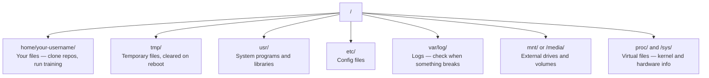

# Linux para la IA  Linux base   Ingeniero de IA necesario)

> La mayoría de la IA funciona en Linux. Necesitas saber lo suficiente para no quedar atascado.
> La mayoría de la IA funciona en Linux. Necesitas tener suficiente conocimiento, no sólo para estar en el sistema.

**Type:** Learn | **类型:** 学习
**Languages:** -- | **语言:** 无
**Prerequisites:** Phase 0, Lesson 01 | **前置知识:** Phase 0, 第 01 课
**Time:** ~30 minutes | **时间:** ~30 分钟

## Objetivos de aprendizaje

- Navega el sistema de archivos Linux y realiza operaciones de archivos esenciales desde la línea de comandos
  Traducción:en Linux 文件系统中导航, desde orden y ejecutar operaciones de los documentos básicos
- Gestionar los permisos de archivos con `chmod`y `chown`para resolver los errores de "Permiso negado"
  En inglés:`chmod`Y `chown`管理文件权限, resolver "Permiso negado" error
- Instalar paquetes de sistema con `apt`y configurar una caja de GPU fresca para el trabajo de IA
  En inglés:`apt`Instalar un sistema de procesamiento para nuevas GPUs  servidores de configuración de IA  ambiente de trabajo
- Identificar las diferencias entre macOS y Linux que generalmente causan problemas a los desarrolladores que trabajan en máquinas remotas
  拼音:识别 切换从 macOS 转换到 Linux 时常见的踩坑点

> **【中文解读】**
> La mayoría de la capacitación de IA se ejecuta en servidores Linux. Cuando se utiliza SSH para el ejemplo de GPU en la nube, solo se tiene una interfaz terminal.

## El problema es describir el problema

Se desarrolla en macOS o Windows. Pero en el momento en que se pone en una caja de GPU en la nube, alquilar una instancia Lambda, o girar una máquina EC2, se aterriza en Ubuntu. La terminal es tu única interfaz. No hay Finder, no hay Explorer, no hay interfaz gráfica. Si no puedes navegar por el sistema de archivos, instalar paquetes y administrar procesos desde la línea de comandos, estás atrapado pagando horas de GPU inactivas mientras buscas en Google "cómo deszipar un archivo en Linux".

> Estás en macOS o Windows en desarrollo. Pero una vez que has SSH hasta el servidor de GPU en la nube, alquila Lambda, ejemplo o inicia EC2  máquina, estás en Ubuntu. El terminal es tu única interfaz.

Esta es una guía de supervivencia. Cubre exactamente lo que necesitas para operar en una máquina Linux remota para el trabajo de la IA. Nada más.

> Este es un manual de supervivencia. Sólo cubre los conocimientos necesarios para realizar el trabajo de IA en máquinas Linux remotas.

> **【中文解读】**
> Normalmente se desarrolla con macOS o Windows, pero un servidor de GPU en la nube ya ha entrado en Linux. No hay administrador de archivos, sólo el terminal.

## La configuración del sistema de archivos

Linux organiza todo bajo una sola raíz .`/`No hay ninguna .`C:\`o `/Volumes`Los directorios que realmente tocarás:

> Linux organizará todo el contenido en un solo directorio.`/`No hay nada.`C:\`O `/Volumes`你实际会接触的目录:

> **【中文解读】**
> Linux 文件系统是单树状结构,根目录是 `/`¿Qué es eso?`/home/用户名/`(简写 `~`Es tu directorio de trabajo, casi todas las operaciones se realizan aquí.`/tmp/`存临时文件, re-start后清空──`/var/log/`存日志, 出问题时必查──`/mnt/`                                                                                                                                                                                                                                                              



Su directorio de hogar es`~`o `/home/your-username`Casi todo lo que haces sucede aquí.

> Tu directorio principal es`~`O `/home/your-username` Prácticamente todas las operaciones se llevan a cabo aquí

## Los comandos esenciales.

Estos son los 15 comandos que cubren el 95% de lo que harás en una caja de GPU remota.

> Estos 15 comandos cubren el 95% de su operación en el servidor de GPU remoto.

> **【中文解读】**
> Solo necesitas dominar 15 órdenes para poder completar el 95% de los trabajos en un servidor Linux remoto. Estas órdenes se dividen en cuatro clases:导航: pwd,ls,cd,文件操作: cp,mv,rm,mkdir,查看文件: cat,head,tail,grep y search:find,grep -r) ◊

### Movimiento alrededor.

```bash
pwd                         # Where am I?  当前在哪个目录？
ls                          # What's here?  列出当前目录内容
ls -la                      # What's here, including hidden files with details?  详细列出所有文件（含隐藏文件）
cd /path/to/dir             # Go there  切换到指定目录
cd ~                        # Go home  回到主目录
cd ..                       # Go up one level  返回上一级目录
```

### Archivos y directorios

```bash
mkdir my-project            # Create a directory  创建目录
mkdir -p a/b/c              # Create nested directories in one shot  递归创建多级目录

cp file.txt backup.txt      # Copy a file  复制文件
cp -r src/ src-backup/      # Copy a directory (recursive)  递归复制目录

mv old.txt new.txt          # Rename a file  重命名文件
mv file.txt /tmp/           # Move a file  移动文件

rm file.txt                 # Delete a file (no trash, it's gone)  删除文件（无法恢复！）
rm -rf my-dir/              # Delete a directory and everything inside  递归删除目录（危险操作！）
```

`rm -rf`No hay nada que deshacer, revisa el camino antes de entrar.

> `rm -rf`Es una de las mejores opciones de la industria.

### Leer archivos .

```bash
cat file.txt                # Print entire file  打印整个文件内容
head -20 file.txt           # First 20 lines  查看前 20 行
tail -20 file.txt           # Last 20 lines  查看后 20 行
tail -f log.txt             # Follow a log file in real time (Ctrl+C to stop)  实时跟踪日志文件
less file.txt               # Scroll through a file (q to quit)  分页浏览文件
```

### Buscando Buscando y Buscando

```bash
grep "error" training.log           # Find lines containing "error"  搜索包含 "error" 的行
grep -r "learning_rate" .           # Search all files in current directory  递归搜索所有文件
grep -i "cuda" config.yaml          # Case-insensitive search  不区分大小写搜索

find . -name "*.py"                 # Find all Python files under current dir  查找所有 Python 文件
find . -name "*.ckpt" -size +1G     # Find checkpoint files larger than 1GB  查找大于 1GB 的检查点文件
```

## Permisos de archivo

Cada archivo en Linux tiene un propietario y bits de permisos. Te encontrarás con esto cuando los scripts no se ejecutan o no puedes escribir a un directorio.

> Cada archivo en Linux tiene un lugar de propietario y de permisos. Cuando el guión no puede ejecutarse o no puede escribirse en el directorio, usted se encuentra con este problema.

> **【中文解读】**
> Linux 权限分为三组:文件所有者 (文件所有者) 、同组用户 (用户) 、其他用户 (用户) 、其他用户 (用户) 、 每组有读 (读) 、写 (写) 、执行 (执行) 、 x) 三种权限──`chmod +x`让脚本可执行,`chmod 644`设置文件为所有者可读写"",Permisos denegados" 错误几乎可以使用`chmod`O `sudo`¿Qué es eso?

```bash
ls -l train.py
# -rwxr-xr-- 1 user group 2048 Mar 19 10:00 train.py
#  ^^^             owner permissions: read, write, execute
#     ^^^          group permissions: read, execute
#        ^^        everyone else: read only
```

Correcciones comunes:

> 常见修复方法:

```bash
chmod +x train.sh           # Make a script executable  让脚本可执行
chmod 755 deploy.sh         # Owner: full, others: read+execute  所有者全部权限，其他人可读可执行
chmod 644 config.yaml       # Owner: read+write, others: read only  所有者可读写，其他人只读

chown user:group file.txt   # Change who owns a file (needs sudo)  修改文件所有者（需要 sudo）
```

Cuando algo dice "Permisón negada", casi siempre es un problema de permisos. `chmod +x`o `sudo`arreglará la mayoría de los casos.

> Cuando aparece "permiso negado", casi siempre es un problema de derechos.`chmod +x`O `sudo`能 resolver la mayoría de las situaciones.

## Gestión de paquetes (apt) 包管理

Utiliza Ubuntu `apt`Así es como se instala software a nivel de sistema.

> Ubuntu `apt` Ésta es la forma de instalar un sistema de software.

```bash
sudo apt update             # Refresh the package list (always do this first)  更新软件包列表（首先执行）
sudo apt install -y htop    # Install a package (-y skips confirmation)  安装软件包（-y 跳过确认）
sudo apt install -y build-essential  # C compiler, make, etc. Needed by many Python packages  C 编译器和构建工具
sudo apt install -y tmux    # Terminal multiplexer (keep sessions alive after disconnect)  终端复用器

apt list --installed        # What's installed?  查看已安装的软件包
sudo apt remove htop        # Uninstall  卸载软件包
```

> **【中文解读】**
> `apt`Es el administrador de paquetes de Ubuntu.`apt update`刷新列表──`build-essential`提供 C 编译器, muchos Python 包(tal como numpy、torch) necesita para compilación。`tmux`Es un instrumento indispensable para mantener una conversación a distancia sin interrupción.

> **【拓展：新 GPU 服务器的初始化清单】**
> Después de conseguir un nuevo servidor de GPU, normalmente se requiere ejecutar:`apt update && apt install -y build-essential git curl wget tmux htop unzip python3-venv` Luego instalar NVIDIA 驱动和 CUDA Toolkit, volver a instalar conda/uv──AWS EC2 Deep Learning AMI 已 preinstalar la mayor parte de los instrumentos, pero los ejemplos de Lambda Labs 和 Vast.ai suelen necesitar inicialización manual―

Paquetes comunes que instalarás en una caja de GPU nueva:

> Nueva GPU  servidor normalmente se instala en el paquete:

```bash
sudo apt update && sudo apt install -y \
    build-essential \
    git \
    curl \
    wget \
    tmux \
    htop \
    unzip \
    python3-venv
```

## Usuarios y sudo. Usuarios y permisos de actualización.

Normalmente estás conectado como usuario regular. Algunas operaciones necesitan acceso root (admin).

> Usted normalmente tiene acceso al usuario normal. Algunas operaciones requieren de la raíz.

```bash
whoami                      # What user am I?  查看当前用户名
sudo command                # Run a single command as root  以 root 权限执行命令
sudo su                     # Become root (exit to go back, use sparingly)  切换为 root 用户（谨慎使用）
```

> **【中文解读】**
> Linux tiene un nivel de derechos estricto. El usuario común sólo puede manejar sus propios archivos, el nivel de operación del sistema es necesario.`sudo`(superusuario hace)  La mejor práctica es sólo en el momento necesario`sudo`, no se ejecute por mucho tiempo en la raíz de su identidad para evitar errores de eliminación de los archivos del sistema.

En las instancias de GPU en la nube, normalmente eres el único usuario y ya tienes acceso a sudo. No ejecutes todo como root.

> En el caso de la GPU en el cloud, usualmente eres el único usuario y ya tienes los permisos de sudo.

## Procesos y sistemas.

Cuando tu entrenamiento está suspendido, o necesitas comprobar lo que está funcionando:

> Cuando entrenar o cuando necesitas revisar el proceso en curso:

```bash
htop                        # Interactive process viewer (q to quit)  交互式进程查看器
ps aux | grep python        # Find running Python processes  查找 Python 进程
kill 12345                  # Gracefully stop process with PID 12345  优雅终止进程
kill -9 12345               # Force kill (use when graceful doesn't work)  强制终止进程
nvidia-smi                  # GPU processes and memory usage  查看 GPU 进程和显存
```

> **【中文解读】**
> Cuando entrenar, usar.`htop`查看哪个进程占用资源,使用 `kill`终止失控的进程── también se puede decir que el proceso es un proceso de desaparición.`kill -9`Es obligatorio terminar, sólo en la norma.`kill`无效时使用──`nvidia-smi`Es la orden central de la gestión de procesos de GPU, puede ver qué procesos están usando GPU ̊ ocupando la cantidad de almacenamiento.

sistemad administra servicios (daemones de fondo). lo utilizará si ejecuta servidores de inferencia:

> sistema de administración de servicios (后台守护进程) ⋅ Si usted ejecuta el servicio de administración, utilizará:

```bash
sudo systemctl start nginx          # Start a service  启动服务
sudo systemctl stop nginx           # Stop it  停止服务
sudo systemctl restart nginx        # Restart it  重启服务
sudo systemctl status nginx         # Check if it's running  查看服务状态
sudo systemctl enable nginx         # Start automatically on boot  设置开机自启
```

## Espacio en disco.

Las cajas de GPU a menudo tienen espacio limitado en el disco. Los modelos y conjuntos de datos lo llenan rápidamente.

> El espacio en el disco del servidor de GPU es normalmente limitado.

```bash
df -h                       # Disk usage for all mounted drives  查看所有磁盘使用情况
df -h /home                 # Disk usage for /home specifically  查看 /home 分区使用情况

du -sh *                    # Size of each item in current directory  查看当前目录各项大小
du -sh ~/.cache             # Size of your cache (pip, huggingface models land here)  缓存目录大小
du -sh /data/checkpoints/   # Check how big your checkpoints are  检查检查点文件大小

# Find the biggest space hogs  找出最大的空间占用
du -h --max-depth=1 / 2>/dev/null | sort -hr | head -20
```

> **【中文解读】**
> El espacio en el disco del servidor de GPU  no es suficiente.`df -h`查看整体磁盘使用,用 `du -sh *`找到具体哪个目录占占空间最多── regularly cleaned `~/.cache/huggingface/`Y el viejo documento de control.

Los ahorros de espacio comunes:

> 常见的空间清理方法:

```bash
# Clear pip cache  清理 pip 缓存
pip cache purge

# Clear apt cache  清理 apt 缓存
sudo apt clean

# Remove old checkpoints you don't need  删除不需要的旧检查点
rm -rf checkpoints/epoch_01/ checkpoints/epoch_02/
```

## Las redes de operaciones

Se descargarán modelos, transferir archivos, y golpear API desde la línea de comandos.

> Usted va a descargar el modelo de orden de la línea de transmisión de archivos y la API de la configuración.

```bash
# Download files  下载文件
wget https://example.com/model.bin                   # Download a file  下载文件
curl -O https://example.com/data.tar.gz              # Same thing with curl  用 curl 下载
curl -s https://api.example.com/health | python3 -m json.tool  # Hit an API, pretty-print JSON  调用 API 并格式化输出

# Transfer files between machines  在机器间传输文件
scp model.bin user@remote:/data/                     # Copy file to remote machine  复制文件到远程机器
scp user@remote:/data/results.csv .                  # Copy file from remote to local  从远程复制到本地
scp -r user@remote:/data/checkpoints/ ./local-dir/   # Copy directory  复制整个目录

# Sync directories (faster than scp for large transfers, resumes on failure)  同步目录（比 scp 快，支持断点续传）
rsync -avz --progress ./data/ user@remote:/data/
rsync -avz --progress user@remote:/results/ ./results/
```

> **【中文解读】**
> Los ordenes de red son herramientas diarias de los ingenieros de IA.`wget`Y `curl`Descargar modelos y datos`scp`En el local y el remoto máquina entre copiar archivos.`rsync`Es la primera opción de la transmisión de datos grandes. Sólo transmite los cambios de carácter, soporta el continuo de transmisión de puntos, más rápido que el de scp.

> **【拓展：rsync 在 AI 工作流中的关键作用】**
> Cuando usted está en AWS p4d  ejemplos($32.77/小时) en el entrenamiento de un LLM, necesita transferir 50 GB de puntos de control a su propio lugar.

Usar`rsync`- ¿ Qué ?`scp`Sólo transfiere cambios de bytes y maneja conexiones interrumpidas.

> Para grandes documentos de transmisión, uso prioritario `rsync`Y no`scp`                                                                                                                                                                                                                                                              

## Mantenga las sesiones vivas

Cuando se pone en una caja remota, cerrar su computadora portátil mata su entrenamiento.

> Cuando usted SSH al servidor remoto, cierra el equipo de terminación de entrenamiento.

```bash
tmux new -s train           # Start a new session named "train"  创建名为 "train" 的新会话
# ... start your training, then:
# Ctrl+B, then D            # Detach (training keeps running)  分离会话（训练继续运行）

tmux ls                     # List sessions  列出所有会话
tmux attach -t train        # Reattach to session  重新连接到会话

# Inside tmux:  tmux 内操作：
# Ctrl+B, then %            # Split pane vertically  垂直分割面板
# Ctrl+B, then "            # Split pane horizontally  水平分割面板
# Ctrl+B, then arrow keys   # Switch between panes  切换面板
```

> **【中文解读】**
> Tmux es un dispositivo de seguridad para entrenamiento de GPU de distancia.`Ctrl+B, D`Se separó, el entrenamiento en la retaguardia continuó.`tmux attach`重新连接──长时间训练任务必须用tmux──

Siempre se ejecuta un largo entrenamiento dentro de la casa.

> 长时间训练任务务必在tmux 中运行――务必如此――

> **【拓展：Linux 在 AI 基础设施中的统治地位】**
> Más del 99% de la capacitación de IA en Linux se ejecuta en todo el mundo. Los ejemplos de GPU de AWS, GCP, Azure, y Linux se ejecutan en todo el mundo.

## WSL2 para usuarios de Windows

> **【中文解读】**
> WSL2  Que los usuarios de Windows obtengan un Linux real  Ambiente, no necesita dos sistemas, GPU directamente ha sido apoyado                                                                                                                                                                                                                                                                                                                                                                                                                                                                                                `/mnt/c/Users/用户名/`访问── es la mejor solución para los usuarios de Windows para aprender Linux y desarrollar IA──

Si estás en Windows, WSL2 te da un ambiente Linux real sin doble arranque.

> Si usas Windows, WSL2 无需双系统就能给你真正的Linux 环境──

```bash
# In PowerShell (admin)
wsl --install -d Ubuntu-24.04

# After restart, open Ubuntu from Start menu
sudo apt update && sudo apt upgrade -y
```

WSL2 ejecuta un kernel Linux real. Todo en esta lección funciona dentro de él. Sus archivos de Windows están en`/mnt/c/Users/YourName/`desde dentro de WSL.

> WSL2 运行真正的Linux内核──本课的所有内容都可在其中使用──Windows 文件在 WSL内通过 `/mnt/c/Users/YourName/`访问──

La GPU de paso funciona con los controladores NVIDIA instalados en el lado de Windows. Instale el controlador NVIDIA de Windows (no el de Linux), y CUDA estará disponible dentro de WSL2.

> GPU directamente a través de Windows 侧安装的NVIDIA 驱动工作──安装 Windows 版NVIDIA 驱动(no es Linux 版),CUDA 就能在 WSL2 内使用──

> **【拓展：WSL2 GPU 支持的实际表现】**
> La GPU directa de WSL2 se aproxima al rendimiento de Linux, PyTorch y TensorFlow.`nvidia-smi`Se puede ver la GPU de Windows.`/mnt/c/`) Es menos lento que el sistema de archivos de WSL2 originarios 3-5 veces.`~/`Ahora se está obteniendo el mejor rendimiento.

## Tengo macOS a Linux .

Cosas que te echarán de trampa si vienes de macOS:

> Si cambias de macOS, estas cosas te dejarán en el cratera:

| macOS | Linux | Notes |
|-------|-------|-------|
| `brew install` | `sudo apt install` | Different package names sometimes. `brew install htop` vs `sudo apt install htop` works the same, but `brew install readline` vs `sudo apt install libreadline-dev` does not. |
| `open file.txt` | `xdg-open file.txt` | But you won't have a GUI on a remote box. Use `cat` or `less`. |
| `pbcopy` / `pbpaste` | Not available | Pipe to/from clipboard doesn't exist over SSH. |
| `~/.zshrc` | `~/.bashrc` | macOS defaults to zsh. Most Linux servers use bash. |
| `/opt/homebrew/` | `/usr/bin/`, `/usr/local/bin/` | Binaries live in different places. |
| `sed -i '' 's/a/b/' file` | `sed -i 's/a/b/' file` | macOS sed needs an empty string after `-i`. Linux does not. |
| Case-insensitive filesystem | Case-sensitive filesystem | `Model.py` and `model.py` are two different files on Linux. |
| Line endings `\n` | Line endings `\n` | Same. But Windows uses `\r\n`, which breaks bash scripts. Run `dos2unix` to fix. |

| macOS | Linux | 注意事项 |
|------|------|---------|
| `brew install` | `sudo apt install` | 包名有时不同，如 readline vs libreadline-dev |
| `open file.txt` | `xdg-open file.txt` | 远程服务器无 GUI，用 `cat` 或 `less` |
| `pbcopy` / `pbpaste` | 不可用 | SSH 下无法操作剪贴板 |
| `~/.zshrc` | `~/.bashrc` | macOS 默认 zsh，Linux 服务器多用 bash |
| `/opt/homebrew/` | `/usr/bin/`, `/usr/local/bin/` | 可执行文件路径不同 |
| `sed -i '' 's/a/b/' file` | `sed -i 's/a/b/' file` | macOS sed 的 `-i` 后需要空字符串 |
| 大小写不敏感 | 大小写敏感 | `Model.py` 和 `model.py` 是两个不同文件 |
| 换行符 `\n` | 换行符 `\n` | 相同，但 Windows 的 `\r\n` 会破坏 bash 脚本 |

## Tarjeta de referencia rápida.

```
Navigation:     pwd, ls, cd, find
Files:          cp, mv, rm, mkdir, cat, head, tail, less
Search:         grep, find
Permissions:    chmod, chown, sudo
Packages:       apt update, apt install
Processes:      htop, ps, kill, nvidia-smi
Services:       systemctl start/stop/restart/status
Disk:           df -h, du -sh
Network:        curl, wget, scp, rsync
Sessions:       tmux new/attach/detach
```

## Los ejercicios.
```figure
s0-process-fork
```

## Los ejercicios

1. SSH en cualquier máquina Linux (o abrir WSL2) y navegar a su directorio de origen. Crea una carpeta de proyecto, crea tres archivos vacíos dentro de ella con `touch`, luego los enumeran con `ls -la`¿ Qué ?
   SSH a Linux 机器, crear proyectos de archivos 和空文件, us `ls -la`列出
2. Instalar`htop`con apt, ejecutarlo, y identificar qué proceso está utilizando más memoria.
   Us apt instalar htop, encontrar el mayor número de procesos de ocupación de memoria
3. Comience una sesión de tmux, ejecuta`sleep 300`dentro de ella, desprenderse, hacer una lista de sesiones y volver a unir.
   创建 tmux 会话,运行睡眠 命令,分离后重新连接
4. Usar`df -h`para comprobar el espacio disponible en el disco, luego utilizar `du -sh ~/.cache/*`para encontrar lo que está ocupando espacio en su caché.
    Revisa el espacio en el disco, encuentra el mayor contenido del espacio en el archivo
5. Transfiere un archivo de su máquina local a una remota usando `scp`, entonces haga la misma transferencia con `rsync`y comparar la experiencia.
   Usar scp y rsync, entre otros, para transmitir archivos, en dos formas diferentes
