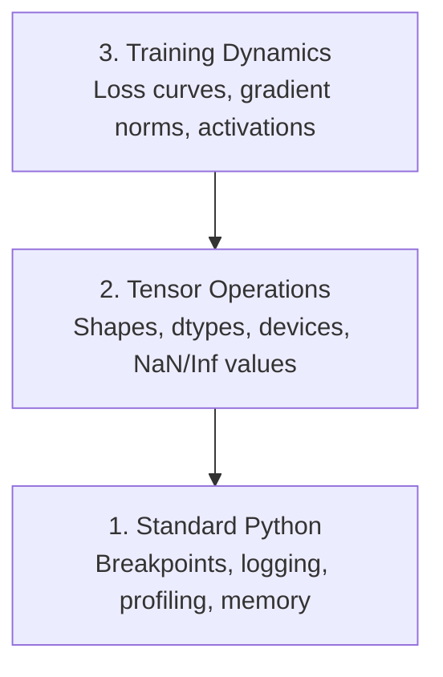

# Desarreglamiento y Profilización 调试与性能分析

> Los peores insectos de IA no se estrellan, sino que se entrenan en silencio en la basura y reportan una hermosa curva de pérdidas.
> Los peores errores de IA no hacen que el proceso se desplome. Entrenan en silencio en datos de basura, y luego reportan una hermosa pérdida.

**Type:** Build | **类型:** 构建
**Language:**¿ Qué pasa ?**语言:**Python
**Prerequisites:** Lesson 1 (Dev Environment), basic PyTorch familiarity | **前置知识:** 第 1 课（开发环境），基本 PyTorch 知识
**Time:** ~60 minutes | **时间:** ~60 分钟

## Objetivos de aprendizaje

- Utilice condicional `breakpoint()`y `debug_print`para inspeccionar las formas, los tipos y los valores de tensor en medio del entrenamiento
  En inglés:`breakpoint()`Y `debug_print`En el proceso de entrenamiento, comprobar la forma de la cantidad de datos y el valor de la NaN
- Perfil de los bucles de entrenamiento con `cProfile`¿ Qué ?`line_profiler`, y `tracemalloc`para encontrar cuellos de botella
  En inglés:`cProfile`¿Qué es esto?`line_profiler`Y `tracemalloc` Analizar el ciclo de entrenamiento, encontrar el botellón de rendimiento
- Detectar errores comunes de IA: desajustes de forma, pérdida de NaN, fuga de datos y tensores de dispositivo equivocado
  China: Recherche habituel de errores de inteligencia artificial: forma de error
- Configure TensorBoard para visualizar curvas de pérdida, histogramas de peso y distribuciones de gradientes
  En inglés, el tensor se puede ver en la tabla de la tabla de la tabla de la tabla de la tabla de la tabla de la tabla de la tabla de la tabla de la tabla de la tabla de la tabla de la tabla de la tabla de la tabla de la tabla de la tabla de la tabla de la tabla de la tabla de la tabla de la tabla de la tabla de la tabla de la tabla de la tabla de la tabla de la tabla de la tabla de la tabla de la tabla de la tabla de la tabla de la tabla de la tabla de la tabla de la tabla de la tabla de la tabla de la tabla de la tabla de la tabla de la tabla de la tabla de la tabla de la tabla de la tabla de la tabla de la tabla de la tabla de la tabla de la tabla de la tabla de la tabla de la tabla de la tabla de la tabla de la tabla de la tabla de la tabla de la tabla de la tabla de la tabla de la tabla de la tabla de la tabla de la tabla de la tabla de la tabla de la tabla de la tabla de la tabla de la tabla de la tabla de la tabla de la tabla de la tabla de la tabla de la tabla de la tabla de la tabla de la tabla de la tabla de la tabla de la tabla de la tabla de la tabla de la tabla de tabla de tabla de tabla de tabla de tabla de tabla de tabla de tabla de tabla de tabla de tabla de tabla de tabla de tabla de tabla de tabla de tabla de tabla de tabla de tabla de tabla de tabla de tabla de tabla de tabla de tabla de tabla de tabla de tabla de tabla de tabla de tabla de tabla de tabla de tabla de tabla de tabla de tabla de tabla de tabla de tabla de tabla de tabla de tabla de tabla de tabla de tabla de tabla de tabla de tab

> **【中文解读】**
> El código de IA 代码的 bug 和普通代码不同: no se estropeará el informe de error, sino que se entrenará silenciosamente con errores de datos para un modelo inútil.

> **【拓展：AI 调试为什么特别难？】**
>  Tradicional Bug en el desarrollo de la Web suele tener un error claro ── pero el bug de la IA es "silencia fallida"  el modelo se entrena en datos erróneos 8 horas, la pérdida parece normal, pero finalmente se predice que todo es basura── causas comunes: la forma de la cantidad no coincide  NaN  aparecen                                                                                                                                                                                                                      

## El problema es describir el problema

El código de IA falla de manera diferente al código normal. Una aplicación web se estrella con un rastro de pila. Un bucle de entrenamiento mal configurado se ejecuta durante 8 horas, quema $ 200 en tiempo de GPU, y produce un modelo que predice la media de cada entrada. El código nunca cometió error. El error fue un tensor en el dispositivo equivocado, un olvidado.`.detach()`, o etiquetas que se filtran en las características.

> El método de falla del código de IA es diferente al código ordinario. La aplicación web se desploma y da un montón de seguimiento. Un ciclo de entrenamiento de configuración errónea se ejecuta durante 8 horas, quema un tiempo de GPU de 200 dólares, y luego se produce un modelo de pronóstico de todos los valores medios de entrada. El código nunca se ha informado de errores.`.detach()`、 o etiqueta se ha filtrado en los rasgos ∙∙

Necesitas herramientas de depuración que capten estos fallos silenciosos antes de que pierdan tu tiempo y computación.

> Necesitas poder capturar sus herramientas de prueba antes de perder tiempo y capacidad matemática en estos silencios fallidos.

> **【中文解读】**
> El lugar más difícil de la IA es que el código no se informa de errores, pero el resultado del entrenamiento es completamente erróneo. Por ejemplo, la cantidad de CPU en lugar de GPU se olvida.`.detach()`Esto puede causar una fuga de gradientes, una mezcla de etiquetas y características. Estos errores no provocan anomalías, pero permiten que el modelo salga basura.

## El concepto central.

La debugging de IA funciona en tres niveles:

> La IA se realizó en tres niveles:



La mayoría de la gente salta directamente al nivel 3 (mirando TensorBoard). Pero el 80% de los errores de IA viven en los niveles 1 y 2.

> La mayoría de las personas saltan directamente a la tercera capa. Pero el 80% de los errores de IA existen en la primera y segunda.

> **【中文解读】**
> La IA 调试分为三个层次:第一层是标准Python 调试(断点、日志、内存分析);第二层是张量操作检查(形状、数据类型、设备、NaN 值);第三层是训练动态观察(loss 曲线、梯度分布、激活值) ∼ La mayoría de las personas miran directamente TensorBoard, pero el 80% de los errores en realidad se encuentran en las dos primeras fases en la que se puede encontrar──

## Construye y realiza.
```figure
s0-flame-hot
```

## Construye el mismo

### Parte 1: Descargar los errores de impresión (sí, funciona)

Para el código tensor, una declaración de impresión dirigida es mejor que pasar por un depurador porque necesitas ver formas, tipos y rangos de valores a la vez.

> 打调试常被轻视──但不应如此──对于张量代码, una frase de impresión dirigida 语句 es más eficaz que el proceso de prueba gradual, ya que necesitas ver simultáneamente la forma, el tipo de datos y el rango de valores──

```python
def debug_print(name, tensor):
    print(f"{name}: shape={tensor.shape}, dtype={tensor.dtype}, "
          f"device={tensor.device}, "  # 张量在 CPU 还是 GPU 上？
          f"min={tensor.min().item():.4f}, max={tensor.max().item():.4f}, "
          f"mean={tensor.mean().item():.4f}, "
          f"has_nan={tensor.isnan().any().item()}")  # 检测是否有 NaN 值
```

Llame esto después de cada operación sospechosa.

> En cada operación de duda, se puede utilizar.

### Parte 2: Descomposición de Python (pdb y punto de ruptura)

El depurador incorporado está subestimado por el trabajo de IA.`breakpoint()`En su bucle de entrenamiento e inspeccionar los tensores de forma interactiva.

> El interior de los módulos de trabajo en IA se ha subestimado.`breakpoint()`, puede intercambiar información sobre la cantidad de datos.

> **【中文解读】**
> `breakpoint()`Es la mejor manera de establecer condiciones de interrupción en el ciclo de entrenamiento, como la pérdida de cambios repentinos o la aparición de NaN, el proceso sólo se interrumpe en momentos inusuales.`p`命令检查张量形状、值范围和梯度──

```python
def training_step(model, batch, criterion, optimizer):
    inputs, labels = batch
    outputs = model(inputs)
    loss = criterion(outputs, labels)

    if loss.item() > 100 or torch.isnan(loss):  # loss 异常大或为 NaN 时触发断点
        breakpoint()  # 进入交互式调试器

    loss.backward()
    optimizer.step()
```

Cuando el desembolso te deja entrar, comandos útiles:

> 调试器激活后, ordenación habitual:

- `p outputs.shape`para comprobar las formas
  En inglés:`p outputs.shape`检查形状
- `p loss.item()`para ver el valor de pérdida
  En inglés:`p loss.item()`查看 pérdida valor
- `p torch.isnan(outputs).sum()`para contar las NaN
  En inglés:`p torch.isnan(outputs).sum()`统计 NaN 个数
- `p model.fc1.weight.grad`para comprobar los gradientes
  En inglés:`p model.fc1.weight.grad`检查梯度
- `c`para continuar,`q`dejar de fumar
  En inglés:`c`continuar,`q` Retiro

Esto es depuración condicional, sólo se detiene cuando algo parece mal para una carrera de entrenamiento de 10.000 pasos, eso importa.

> Es una condición de prueba. Sólo te detienes cuando apareces anormal. Para un entrenamiento de 10.000 pasos, es muy importante.

### Parte 3: registro de Python

Sustituye las declaraciones de impresión con registro cuando el depuración va más allá de una verificación rápida.

> Cuando el tiempo de prueba supera el alcance del examen rápido, utiliza el diario para sustituir el texto impreso.

```python
import logging

logging.basicConfig(
    level=logging.INFO,
    format="%(asctime)s [%(levelname)s] %(message)s",  # 带时间戳和级别的格式
    handlers=[
        logging.FileHandler("training.log"),  # 输出到文件
        logging.StreamHandler()  # 同时输出到终端
    ]
)
logger = logging.getLogger(__name__)

logger.info("Starting training: lr=%.4f, batch_size=%d", lr, batch_size)
logger.warning("Loss spike detected: %.4f at step %d", loss.item(), step)  # 警告级别
logger.error("NaN loss at step %d, stopping", step)  # 错误级别
```

> **【中文解读】**
> Cuando el día se desploma, necesitas el archivo del día en lugar de la salida del terminal que se ha rodado.

Cuando una carrera de entrenamiento falla a las 3 AM, se quiere un archivo de registro, no una salida terminal que se desplace fuera de la pantalla.

> Cuando el entrenamiento falla a las 3 de la mañana, necesitas el archivo del diario, no el resultado del terminal de la pantalla.

### Parte 4: Secciones de código de tiempo

Saber dónde va el tiempo es el primer paso para la optimización.

> Saber dónde pasa el tiempo es el primer paso para mejorar.

```python
import time

class Timer:
    def __init__(self, name=""):
        self.name = name

    def __enter__(self):
        self.start = time.perf_counter()  # 高精度计时器
        return self

    def __exit__(self, *args):
        elapsed = time.perf_counter() - self.start
        print(f"[{self.name}] {elapsed:.4f}s")  # 打印耗时

with Timer("data loading"):  # 计时数据加载
    batch = next(dataloader_iter)

with Timer("forward pass"):  # 计时前向传播
    outputs = model(batch)

with Timer("backward pass"):  # 计时反向传播
    loss.backward()
```

El resultado común es que la carga de datos toma el 60% del tiempo de formación.`num_workers > 0`en su DataLoader, no una GPU más rápida.

> 常见发现: la carga de datos ocupa el 60% del tiempo de entrenamiento.`num_workers > 0`, en lugar de comprar GPU más rápido.

> **【中文解读】**
> El primer paso para optimizar el rendimiento es encontrar el botella.`Timer`类用Python 上下文管理器精确计时每步.  El descubrimiento más común es que la carga de datos ocupa el 60% del tiempo de entrenamiento.  La solución no es comprar una GPU más cara, sino configurar DataLoader `num_workers > 0`¿Qué es eso?

> **【拓展：数据加载瓶颈是 AI 训练的头号性能杀手】**
> En la industria, la principal razón por la que la tasa de uso de GPU es inferior al 80% es que la carga de datos es demasiado lenta, la GPU en otros datos.`num_workers`(normalmente se establece para 4-8) 、 uso `pin_memory=True` 加速 CPU-GPU 传输、使用 `prefetch_factor`预取数据──Google 内部  TPU 训练管线使用专门的数据流水线优化,确保 TPU 永远不用等数据──

### Parte 5: cProfil y line_profiiler

Cuando necesite más que temporizadores manuales:

> Cuando el tiempo de movimiento no es suficiente:

```bash
python -m cProfile -s cumtime train.py  # 按累计时间排序的性能分析
```

Esto muestra cada llamada de función ordenada por tiempo acumulado.

> Esto se muestra según la orden de tiempo acumulado de cada función.

```bash
pip install line_profiler
```

```python
@profile  # line_profiler 装饰器，逐行统计耗时
def train_step(model, data, target):
    output = model(data)
    loss = F.cross_entropy(output, target)
    loss.backward()
    return loss

# Run with: kernprof -l -v train.py  运行逐行性能分析
```

### Parte 6: Profiles de memoria

> **【中文解读】**
> Analiza de memoria en CPU y GPU 两个部分──CPU `tracemalloc` encontrar la mayor cantidad de código de memoria distribuido, GPU usados `torch.cuda.memory_summary()`查看显存使用──OOM(Out of Memory) es uno de los errores más comunes de entrenamiento de IA  primero reducir el tamaño del lote, volver a intentar entrenamiento de precisión mixta──

#### Memoria de CPU con tracemalloc

```python
import tracemalloc

tracemalloc.start()  # 开始跟踪内存分配

# your code here
model = build_model()
data = load_dataset()

snapshot = tracemalloc.take_snapshot()  # 拍摄内存快照
top_stats = snapshot.statistics("lineno")  # 按代码行统计内存
for stat in top_stats[:10]:
    print(stat)
```

#### CPU memoria con memoria_profiler

```bash
pip install memory_profiler
```

```python
from memory_profiler import profile

@profile  # 逐行分析内存使用
def load_data():
    raw = read_csv("data.csv")       # watch memory jump here  观察内存跳变
    processed = preprocess(raw)       # and here  数据预处理也会增加内存
    return processed
```

Corra con`python -m memory_profiler your_script.py`para ver el uso de memoria línea por línea.

> 运行                                                                                                                                                                                                                                                                                                                                                                                                                                                                                                                           `python -m memory_profiler your_script.py`查看逐行内存使用──

#### Memoria de GPU con PyTorch

```python
import torch

if torch.cuda.is_available():
    print(torch.cuda.memory_summary())  # GPU 显存完整报告

    print(f"Allocated: {torch.cuda.memory_allocated() / 1e9:.2f} GB")  # 已分配的显存
    print(f"Cached: {torch.cuda.memory_reserved() / 1e9:.2f} GB")  # 缓存的显存
```

Cuando pulsamos OOM (Desde memoria):

> Cuando te encuentres con OOM (no tiene memoria)

1. Reducir el tamaño del lote (lo primero que se intenta, siempre)
   En español, "decebir" significa "realizar" (decebir).
2. Usar`torch.cuda.empty_cache()`para liberar la memoria almacenada en caché
   En inglés:`torch.cuda.empty_cache()`释放缓存内存 释放缓存内存
3. Usar`del tensor`seguido por `torch.cuda.empty_cache()`para grandes intermediarios
   La lengua inglesa se traduce en inglés como "la lengua inglesa" o "la lengua inglesa"`del tensor`¡ Qué !`torch.cuda.empty_cache()`
4. Utilice una precisión mixta (`torch.cuda.amp`) para reducir a la mitad el uso de memoria
   En inglés, el uso de la palabra "mingido" se utiliza en la traducción de "mingido" (mingido)`torch.cuda.amp`) reducción de la mitad del uso
5. Utilice el control de gradientes para modelos muy profundos
   Traducción:En el lenguaje chino, el lenguaje es el lenguaje de la lengua china.

### Parte 7: Los insectos comunes de IA y cómo atraparlos

> **【中文解读】**
> Este es el capítulo más práctico. Cuatro tipos de errores de IA más comunes: forma no coincide.

#### Desajuste de forma

El problema más frecuente es que el tensor tiene forma.`[batch, features]`cuando el modelo espera `[batch, channels, height, width]`¿ Qué ?

> Lo más común es la forma de la pieza.`[batch, features]`, pero el modelo espera`[batch, channels, height, width]`¿Qué es eso?

```python
def check_shapes(model, sample_input):
    print(f"Input: {sample_input.shape}")  # 打印输入形状
    hooks = []

    def make_hook(name):
        def hook(module, inp, out):
            in_shape = inp[0].shape if isinstance(inp, tuple) else inp.shape
            out_shape = out.shape if hasattr(out, "shape") else type(out)
            print(f"  {name}: {in_shape} -> {out_shape}")  # 打印每层的输入输出形状
        return hook

    for name, module in model.named_modules():
        hooks.append(module.register_forward_hook(make_hook(name)))  # 注册钩子函数

    with torch.no_grad():  # 不计算梯度，仅检查形状
        model(sample_input)

    for h in hooks:
        h.remove()  # 清理钩子
```

Ejecutar esto una vez con un lote de muestras.

> Utiliza un lote de muestras 运行一次──它会映射模型中的每一个形状变化──

#### Pérdida de

La pérdida de NaN significa algo explotado.

> La pérdida significa que algo explotó.

> **【拓展：NaN 在大模型训练中的灾难性影响】**
> En el entrenamiento de LLM, NaN una vez que aparece en la gradiente, se extiende a través de la transmisión inversa a todos los parámetros, lo que lleva al modelo entero a ser irrecuperable. En el artículo de entrenamiento GPT-3 se menciona que utilizan la gradiente de corte (cortado gradiente) y la tasa de aprendizaje pre-calentado (calentado) para prevenir la NaN. Una vez que se detecta la NaN, la práctica habitual es volver a comenzar de nuevo a los puntos de inspección más recientes, en lugar de intentar la restauración.

- Taxa de aprendizaje demasiado alta
  Ciencia de aprendizaje
- División por cero en pérdidas de aduana
  Traducción: pérdida de auto-definición
- Registro de cero o número negativo
  Traducción: para cero o para negativo
- Gradientes explosivos en las RNN
  El nivel de explosión en el RNN

```python
def detect_nan(model, loss, step):
    if torch.isnan(loss):  # 检测 loss 是否为 NaN
        print(f"NaN loss at step {step}")
        for name, param in model.named_parameters():
            if param.grad is not None:
                if torch.isnan(param.grad).any():  # 检测梯度中的 NaN
                    print(f"  NaN gradient in {name}")
                if torch.isinf(param.grad).any():  # 检测梯度中的 Inf
                    print(f"  Inf gradient in {name}")
        return True
    return False
```

#### Fugas de datos

Su modelo tiene una precisión del 99% en el set de pruebas.

> Tu modelo obtiene un 99% de precisión en el ensayo.

```python
def check_data_leakage(train_set, test_set, id_column="id"):
    train_ids = set(train_set[id_column].tolist())  # 训练集 ID 集合
    test_ids = set(test_set[id_column].tolist())  # 测试集 ID 集合
    overlap = train_ids & test_ids  # 取交集
    if overlap:
        print(f"DATA LEAKAGE: {len(overlap)} samples in both train and test")  # 发现重叠！
        return True
    return False
```

También compruebe la fuga temporal: usando datos futuros para predecir el pasado.

> También hay que revisar las fuentes de tiempo: Usando futuros datos predicción pasado.

#### Dispositivo equivocado

Los tensores en diferentes dispositivos (CPU vs GPU) causan errores de tiempo de ejecución. Pero a veces un tensor permanece silenciosamente en la CPU mientras todo lo demás está en la GPU, y el entrenamiento solo se ejecuta lentamente.

> Diferente volumen de CPU en el equipo (CPU vs GPU) puede causar errores en el funcionamiento. Pero a veces una cantidad de CPU permanece en el CPU, mientras que el resto está en la GPU, el entrenamiento es lento.

```python
def check_devices(model, *tensors):
    model_device = next(model.parameters()).device  # 获取模型所在设备
    print(f"Model device: {model_device}")
    for i, t in enumerate(tensors):
        if t.device != model_device:  # 检查张量和模型是否在同一设备
            print(f"  WARNING: tensor {i} on {t.device}, model on {model_device}")
```

### Parte 8: Fundamentos de la tabla de tensores

TensorBoard te muestra lo que está sucediendo dentro del entrenamiento con el tiempo.

> TensorBoard  muestra los cambios que ocurren en el proceso de entrenamiento interno.

```bash
pip install tensorboard  # 安装 TensorBoard
```

```python
from torch.utils.tensorboard import SummaryWriter

writer = SummaryWriter("runs/experiment_1")  # 创建日志写入器

for step in range(num_steps):
    loss = train_step(model, batch)

    writer.add_scalar("loss/train", loss.item(), step)  # 记录训练 loss
    writer.add_scalar("lr", optimizer.param_groups[0]["lr"], step)  # 记录学习率

    if step % 100 == 0:
        for name, param in model.named_parameters():
            writer.add_histogram(f"weights/{name}", param, step)  # 记录权重分布
            if param.grad is not None:
                writer.add_histogram(f"grads/{name}", param.grad, step)  # 记录梯度分布

writer.close()
```

Lanza el juego:

> Incaminar TensorBoard:

```bash
tensorboard --logdir=runs  # 启动 TensorBoard 可视化服务
```

Qué buscar:

>  observar 要点:

- **Loss not decreasing**: Taxa de aprendizaje demasiado baja o problema de arquitectura de modelo
  En inglés:**Loss 不降**: la tasa de aprendizaje es demasiado baja, o la estructura del modelo tiene problemas
- **Loss oscillating wildly**: Taxa de aprendizaje demasiado alta
  En inglés:**Loss 剧烈震荡**: la tasa de aprendizaje es demasiado alta
- **Loss goes to NaN**: Inestabilidad numérica (véase la sección NaN anterior)
  En inglés:**Loss 变 NaN**: número de valores no está estable (en inglés)
- **Train loss decreasing, val loss increasing**: Superajuste
  En inglés:**训练 loss 降但验证 loss 升**: sobre la capacidad
- **Weight histograms collapsing to zero**: Gradientes que se desvanecen
  En inglés:**权重直方图趋零**: la disparidad
- **Gradient histograms exploding**: Necesita recorte de gradiente
  En inglés:**梯度直方图爆炸**: necesita cortar

> **【中文解读】**
> TensorBoard es un instrumento estándar para entrenar en la visualización. Pérdida de datos.

> **【拓展：Weights & Biases 与 TensorBoard 的对比】**
> TensorBoard es una herramienta de entrenamiento de Google de código abierto, adecuada para individuos y pequeños equipos. Pesos y prejuicios (W&B) es una herramienta comercial, que aumenta la comparación de experimentos, la colaboración en equipo, la búsqueda de superparámetros, etc. En OpenAI, Antropic, etc., W&B es una plataforma de seguimiento de experimentos estándar. Una gran experiencia de tipo típico rastrea miles de indicadores: pérdida, tasa de aprendizaje, gradiente, distribución de peso en diferentes niveles, tasa de uso de GPU, etc. Estos datos ayudan a los ingenieros a encontrar los mejores superparámetros en cientos de experimentos.

### Parte 9: Descargador de código VS

Para el depuración interactiva, configure el código VS con un `launch.json`¿Qué es esto ?

> 对于交互式调试, us `launch.json`配置 VS Código:

```json
{
    "version": "0.2.0",
    "configurations": [
        {
            "name": "Debug Training",
            "type": "debugpy",
            "request": "launch",
            "program": "${file}",  // 调试当前打开的文件
            "console": "integratedTerminal",  // 使用集成终端
            "justMyCode": false  // 允许调试第三方库代码
        }
    ]
}
```

Establezca puntos de ruptura haciendo clic en la barranca. Utilice el panel de variables para inspeccionar las propiedades del tensor. La consola de descomposición le permite ejecutar expresiones de Python arbitrarias en medio de la ejecución.

> 点击行号左侧设置断点──使用变量板检查张量属性──调试控制台让你在执行过程中运行任意Python表达式──

Útil para pasar por las líneas de procesamiento previo de datos donde quieres ver cada transformación.

>  Aplicable para la fase de prueba de datos de la tubería de tratamiento previo, ver los resultados de cada cambio.

## Usalo con el marco de ejecución

> **【中文解读】**
> 实践中的调试工作流分五步: entrenamiento preuso `check_shapes`验证维度;前 10 步用 `debug_print`检查张量值; entrenamiento en uso TensorBoard 监控; 出问题时使用 `breakpoint()`交互调试; performance bottle con cronómetro y memoria de análisis de posición.

Aquí está el flujo de trabajo de depuración que capta la mayoría de los errores de IA:

> Los siguientes son los procesos de trabajo que pueden capturar la mayoría de los errores de la IA:

1. **Before training**- ¿ Qué ?`check_shapes`Con un lote de muestra, comprobar que las dimensiones de entrada y salida coinciden con las expectativas.
   En inglés:**训练前**:用样本批 运行 `check_shapes`,verificar si la entrada y salida y salida de dimensiones cumplen con las expectativas.
2. **First 10 steps**Uso:`debug_print`Confirmar que nada es NaN y los valores están en rangos razonables.
   En inglés:**前 10 步**: para la pérdida, la producción y el uso de la escala`debug_print`, confirman que no hay valor en el alcance razonable.
3. **During training**: pérdida de registro, tasa de aprendizaje y normas de gradiente. Utilice TensorBoard para la visualización.
   En inglés:**训练中**El número de estudiantes en el campo de la enseñanza de la lengua se reduce a un nivel de 5 años.
4. **When something breaks**- ¡ No !`breakpoint()`Inspeccionar los tensores de forma interactiva.
   En inglés:**出问题时**: en el punto de fallas`breakpoint()`,交互式检查张量──
5. **For performance**Tiempo de carga de datos frente a paso hacia adelante frente a paso hacia atrás. memoria de perfil si estás cerca de OOM.
   En inglés:**性能优化**Se puede realizar un análisis de memoria si se acerca a la OOM.

## Envíe el producto .

Ejecutar el guión de depuración del kit de herramientas:

> 运行调试工具脚本:

```bash
python phases/00-setup-and-tooling/12-debugging-and-profiling/code/debug_tools.py
```

¿ Qué ?`outputs/prompt-debug-ai-code.md`para una llamada que ayuda a diagnosticar errores específicos de IA.

> 参见 `outputs/prompt-debug-ai-code.md`, que contiene ayuda para diagnosticar AI                                                                                                                                                                                                                                                                                                                                                                                                                                                                                                                     

## Los ejercicios.

1. - ¿ Qué ?`debug_tools.py`Modifique el modelo de maniobra para introducir un NaN (sentido: dividir por cero en el pase hacia adelante) y vea que el detector lo capte.
   运行调试工具脚本, modificar el modelo introducir NaN, observar cómo el examinador lo captura
2. Perfila un ciclo de entrenamiento con `cProfile`y identificar la función más lenta.
   Usar cProfile  análisis de ciclo de entrenamiento, encontrar la función más lenta
3. Usar`tracemalloc`para encontrar qué línea en su línea de carga de datos asigna la mayor cantidad de memoria.
   Usar tracemalloc  encontrar datos carga de la línea de tubos que distribuyen más memoria
4. Configure TensorBoard para una simple carrera de entrenamiento y identifique si el modelo está sobreajustado.
   设置TensorBoard 监控训练过程,判断模型是否过合适
5. Usar`breakpoint()`En el interior de un bucle de entrenamiento.
   En el ciclo de entrenamiento, el uso de puntos de ruptura (en inglés) se utiliza en el ejercicio de control de la forma de la cantidad de objetos, dispositivos y valores de la escala.
