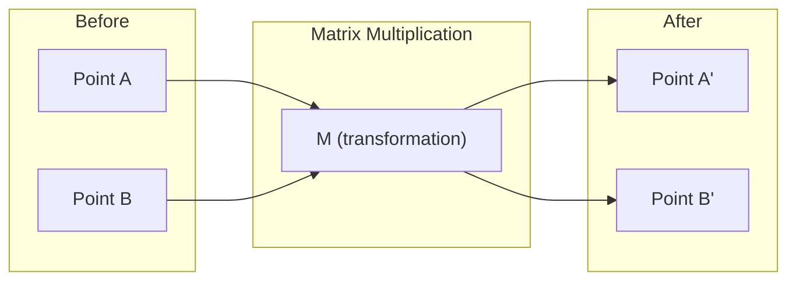
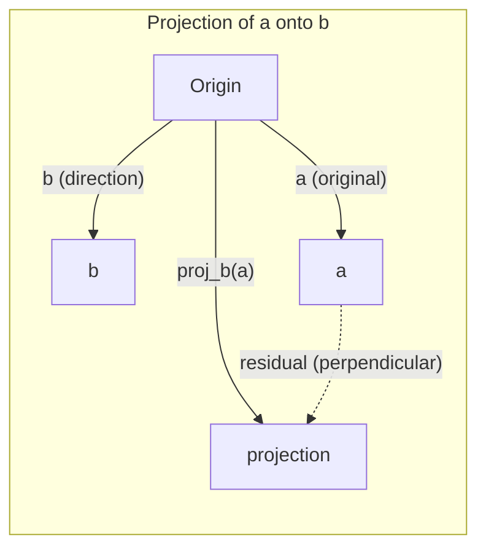

# Intuición de álgebra lineal
# 线性代数直觉

> Cada modelo de IA es sólo matemáticas de matriz con un sombrero elegante.
> Cada modelo de IA es en esencia una matriz de funcionamiento con un vestido de exterior elegante.

**Type:** Learn | **类型:** 学习 | **Languages:** Python, Julia | **语言:** Python, Julia | **Prerequisites:** Phase 0 | **前置知识:** Phase 0 | **Time:** ~60 minutes | **时间:** ~60 分钟

## Objetivos de aprendizaje

- Implementar operaciones de vectores y matrices (addición, producto de puntos, multiplicación de matrices) desde cero en Python
  Desde el 0 realizando la masa y la matriz de la operación de la matriz de la matriz
- Explicar geométricamente lo que hacen el producto de puntos, la proyección y el proceso de Gram-Schmidt
  Desde un punto de vista geográfico, la interpretación del proceso de Gram-Schmidt
- Determine la independencia lineal, la clasificación y la base de un conjunto de vectores utilizando la reducción de filas
  Usar la lengua de la lengua de la lengua de la lengua de la lengua de la lengua de la lengua de la lengua de la lengua de la lengua de la lengua de la lengua de la lengua de la lengua de la lengua de la lengua de la lengua de la lengua de la lengua de la lengua de la lengua de la lengua de la lengua de la lengua de la lengua de la lengua de la lengua de la lengua de la lengua de la lengua de la lengua de la lengua de la lengua de la lengua de la lengua de la lengua de la lengua de la lengua de la lengua de la lengua de la lengua de la lengua de la lengua de la lengua de la lengua de la lengua de la lengua de la lengua de la lengua de la lengua de la lengua de la lengua de la lengua de la lengua de la lengua de la lengua de la lengua de la lengua de la lengua de la lengua de la lengua de la lengua de la lengua de la lengua de la lengua de la lengua de la lengua de la lengua de la lengua de la lengua de la lengua de la lengua de la lengua de la lengua de la lengua de la lengua de la lengua de la lengua de la lengua de la lengua de la lengua de la lengua de la lengua de la lengua de la lengua de la lengua de la lengua de la lengua de la lengua de la lengua de la lengua de la lengua de la lengua de la lengua de la lengua de la lengua de la lengua de la lengua de la lengua de la lengua de la lengua de la lengua de la lengua de la lengua de la lengua de la lengua de la lengua de la lengua de la lengua de la lengua de la lengua de la lengua de la lengua de la lengua de la lengua de la lengua de la lengua de la lengua de la lengua de la lengua de la lengua de la lengua de la lengua de la lengua de la lengua de la lengua de la lengua de la lengua de la lengua de la lengua de la lengua de la lengua de la lengua de la lengua de la lengua de la lengua de la lengua de la lengua de la lengua de la lengua de la lengua de la lengua de la lengua de la lengua de la lengua de la lengua de la lengua de la lengua de la lengua de la lengua de la lengua de la lengua de la lengua de la lengua de la lengua de la lengua de la lengua de la lengua de la lengua de la lengua de la lengua de la lengua de la lengua de la lengua de la lengua de la lengua de la lengua de la lengua de la lengua de la
- Conectar conceptos de álgebra lineal a sus aplicaciones de IA: embebedidos, puntuaciones de atención y LoRA
  **将线性代数概念与 AI 应用对接：词嵌入、注意力分数、LoRA 微调**

## El problema es por qué tienes que aprender esto

Abre cualquier documento de ML. En la primera página, verás vectores, matrices, productos de puntos y transformaciones. Sin la intuición de álgebra lineal, estos son solo símbolos. Con él, puedes ver lo que una red neuronal está haciendo realmente - moviendo puntos en el espacio.

No necesitas ser matemático, tienes que ver lo que estas operaciones significan geométricamente, y luego codificarlas tú mismo.

> **【中文解读】**Revisar cualquier artículo de aprendizaje de máquina, primera página aparecen en el vector, la matriz, los puntos, los cambios, los cambios, los cambios, los cambios, los cambios, los cambios, los cambios, los cambios, los cambios, los cambios, los cambios, los cambios, los cambios, los cambios, los cambios, los cambios, los cambios, los cambios, los cambios, los cambios, los cambios, los cambios, los cambios, los cambios, los cambios, los cambios, los cambios, los cambios, los cambios, los cambios, los cambios, los cambios, los cambios, los cambios, los cambios, los cambios, los cambios, los cambios, los cambios, los cambios, los cambios, los cambios, los cambios, los cambios, los cambios, los cambios, los cambios, los cambios, los cambios, los cambios, los cambios, los cambios, los cambios, los cambios, los cambios, los cambios, los cambios, los cambios, los cambios, los cambios, los cambios, los cambios, los cambios, los cambios, los cambios, los cambios, los cambios, los cambios, los cambios, los cambios, los cambios, los cambios, los cambios, los cambios, los cambios, los cambios, los cambios, los cambios, los cambios, los cambios, los cambios, los cambios, etc.

## El concepto central.

### Los vectores son puntos (y direcciones)

Un vector es sólo una lista de números. Pero esos números significan algo - son coordenadas en el espacio.

**2D vector [3, 2]:**

| x | y | Point |
|---|---|-------|
| 3 | 2 | The vector points from origin (0,0) to (3, 2) on the plane |

El vector tiene magnitud cuadrados ((3^2 + 2^2) = cuadrados ((13) y apunta hacia arriba y a la derecha.

En IA, los vectores representan todo:
- Una palabra → un vector de 768 números (su "significado" en el espacio de incorporación)
- Una imagen → un vector de millones de valores de píxeles
- Un usuario → un vector de preferencias

> **【中文解读】**向量就是一组数字, representa el坐标 en el espacio.`[3, 2]`Indicar los arcos de un punto de partida (0,0) hacia (3,2) , longitud = √(32+22) = √13。
>
> **【拓展：向量在 AI 中的化身】**
> - **词嵌入 (Word Embedding)**Cada palabra se convierte en 768 维向量── "rey" y "reina" se encuentran muy cerca, ya que la palabra es relacionada── esto es la expresión de la palabra 2Vec、BERT、GPT.
> - **图片特征**Una imagen de color de 224×224 = 150.528 volúmenes de números.
> - **用户画像**Recomendación: Sistema de recopilar tu código de navegación/compra en un volumen preferido, y luego encontrar el volumen de mercancías más similar recomendado para ti.

### Las matrices son transformaciones.

Una matriz transforma un vector en otro. Puede girar, escalar, estirar o proyectar.



En IA, las matrices son el modelo:
- Pesos de la red neuronal → matrices que transforman la entrada en salida
- Las puntuaciones de atención → matrices que deciden en qué enfocarse
- Embedings → matrices que trazan palabras a vectores

> **【中文解读】**La matriz es una "regla de cambio": entra en un eje, saca otro eje. Puede girar, acumular, extender, proyectar.
>
> **【拓展：神经网络就是矩阵乘法的嵌套】**
> Una capa de la red de la neura = `output = W × input + bias`
> - W is权重矩阵 (es decir, es un peso de la matriz)
> - entrada es la entrada y la salida
> - Una red de tres niveles es una cadena de tres veces multiplicada.
> - GPT-3 tiene 1750 mil millones de parámetros, en esencia son cientos de matrices gigantes.
> - **训练**= Con un ritmo de bajada constante ajustar los números en estas matrices

### El punto mide la similitud de producto.

El producto de puntos de dos vectores le dice lo similares que son.

```
a · b = a₁×b₁ + a₂×b₂ + ... + aₙ×bₙ

Same direction:      a · b > 0  (similar)
Perpendicular:       a · b = 0  (unrelated)
Opposite direction:  a · b < 0  (dissimilar)
```

Así es literalmente como funcionan los motores de búsqueda, los sistemas de recomendación y RAG: encontrar vectores con productos de puntos altos.

> **【中文解读】**Por lo tanto, el resultado es que el resultado es igual a 0 方向相似, = 0 垂直无关, < 0 方向相反.
>
> **【拓展：点积是 AI 最核心的数学操作】**
> 1. **Transformer Attention**¿Qué es esto ?`Attention(Q,K,V) = softmax(Q·K^T / √d)·V`
>    - P: (con frecuencia) y (con frecuencia) de puntos = "debo estar más atento a esta palabra"
>    - Es el mecanismo central de ChatGPT, BERT, etc. de todos los grandes modelos.
> 2. **RAG 检索**: hacer que los problemas de usuario se conviertan en volúmenes, y todos los archivos se hacen puntos acumulados, encontrar los archivos más relacionados
> 3. **推荐系统**: preferencia de usuario · 商品特征向量 = 推分数
> 4. **余弦相似度**= 归一化后的点积,`cos(a,b) = a·b / (|a|×|b|)`, valor域 [-1, 1]
>    Por lo tanto, el "precio" es el mismo que el "precio".

### La independencia lineal no tiene nada que ver con la línea.

Los vectores son linealmente independientes si ningún vector en el conjunto puede ser escrito como una combinación de los otros. Si v1, v2, v3 son independientes, abarcan un espacio 3D. Si uno es una combinación de los otros, sólo abarcan un plano.

Por qué es importante para la IA: su matriz de características debe tener columnas linealmente independientes. Si dos características están perfectamente correlacionadas (dependientes linealmente), el modelo no puede distinguir sus efectos. Esto causa multicolinariedad en regresión - la matriz de peso se vuelve inestable, y pequeños cambios de entrada producen cambios salvajes de salida.

**Concrete example:**

```
v1 = [1, 0, 0]
v2 = [0, 1, 0]
v3 = [2, 1, 0]   # v3 = 2*v1 + v2
```

v1 y v2 son independientes, ni es un múltiplo escalar ni una combinación de los otros. Pero v3 = 2*v1 + v2, así que {v1, v2, v3} es un conjunto dependiente. Estos tres vectores están todos en el plano xy. No importa cómo los combines, no puedes alcanzar [0, 0, 1]. Tienes tres vectores pero sólo dos dimensiones de libertad.

En un conjunto de datos: si feature_3 = 2*feature_1 + feature_2, añadir feature_3 da al modelo cero información nueva. Peor aún, hace que las ecuaciones normales sean singulares - no hay una solución única para los pesos.

> **【中文解读】**Un grupo de los vectores "lineal no está relacionado" =  ninguno de ellos puede ser extraído de otros vectores.
>
> Ejemplo:`[1,0,0]`¿ Qué ?`[0,1,0]`¿ Qué ?`[0,0,1]`相互独立 ✓
>     `[1,0,0]`¿ Qué ?`[0,1,0]`¿ Qué ?`[2,1,0]`¿Qué es esto?
>
> **【拓展：多重共线性问题】**
> En los datos financieros es muy común: por ejemplo, "casa en dólares" y "casa en moneda de cambio" están completamente relacionados,
> También se puede introducir un modelo que haga que el peso sea inestable, el modelo sea demasiado adecuado o no.

### Base y rango.

Una base es un conjunto mínimo de vectores linealmente independientes que abarcan todo el espacio.

La base estándar para el espacio 3D es {[1,0,0], [0,1,0], [0,0,1]}. Pero cualquier tres vectores independientes en 3D forman una base válida.

Rango de una matriz = número de columnas linealmente independientes = número de filas linealmente independientes. Si el rango < min(ramas, collas), la matriz es deficiente en rango. Esto significa:
- El sistema tiene infinitas soluciones (o ninguna)
- La información se pierde en la transformación
- La matriz no puede ser invertida

| Situation | Rank | What it means for ML |
|-----------|------|---------------------|
| Full rank (rank = min(m, n)) | Maximum possible | Unique least-squares solution exists. Model is well-conditioned. |
| Rank deficient (rank < min(m, n)) | Below maximum | Features are redundant. Infinitely many weight solutions. Regularization needed. |
| Rank 1 | 1 | Every column is a scaled copy of one vector. All data lies on a line. |
| Near rank-deficient (small singular values) | Numerically low | Matrix is ill-conditioned. Tiny input noise causes large output changes. Use SVD truncation or ridge regression. |

> **【中文解读】**
> - **基 (Basis)**: describe un espacio que necesita el menor volumen.
> - **秩 (Rank)**:矩阵中真正独立列数 (或行数)
>
> # La situación # # significa # # no tiene impacto #
> ¿Qué es eso?
>                                                                                                                                                                                                                                                               
> # Hay exceso # # no hay solución, necesita normalización #
> # Las cifras son casi todas en línea # # toda la información en una dirección #
>
> **【拓展：LoRA —— 秩在 AI 中最惊艳的应用】**
> LoRA(Low-Rank Adaptación)
> - El peso original de la matriz W es 4096×4096
> - 微调时,权重更新 ΔW 实际上是"低排"的(Los cambios reales sólo ocurren en unas pocas direcciones)
> - LoRA poner ΔW dividido en dos pequeñas matrices A(4096×16) y B(16×4096)
> - 参数 de 1600 000 → 130.000, reducido **99%**Pero el efecto casi no disminuye.
> - Este es un ejemplo de la transformación directa del concepto de "秩".

### Proyección proyección

Vektor de proyección **a**en el vector **b**da el componente de **a**en la dirección de **b**¿Qué es esto ?

```
proj_b(a) = (a dot b / b dot b) * b
```

El residual (a - proj_b(a)) es perpendicular a b. Esta descomposición ortogonal es la base de la instalación de cuadrados mínimos.

La proyección está en todas partes en ML:
- Regresión lineal minimiza la distancia de las observaciones al espacio columnar - la solución es una proyección
- PCA proyecta datos en las direcciones de la varianza máxima
- La atención en transformadores calcula las proyecciones de las consultas en las teclas



**Example:**a = [3, 4], b = [1, 0]

Proj_b(a) = (3*1 + 4*0) / (1*1 + 0*0) * [1, 0] = 3 * [1, 0] = [3, 0]

La proyección deja caer el componente y. Esto es la reducción de dimensiones en su forma más simple - tirar las direcciones que no te importan.

> **【中文解读】**投影 = 向量在某方向上的"影子"──
> `a=[3,4]`投影到x 轴 `[1,0]`上 = `[3,0]`, es tirar y la cantidad de la basura.
> 残差 = 原向量 - 投影 = `[0,4]`, con la dirección de proyección vertical
>
> **【拓展：投影与降维的关系】**
> 投影是最简单的降维抛掉不关心的方向──PCA
> No se lanza en dirección fija, sino que se encuentra automáticamente la "más grande diferencia" de información para proyectar.
> Si se proyecta 1000 dimensiones de datos a 50 dimensiones, se conserva el 95% de la información superior.

### El proceso de Gram-Schmidt está en proceso.

Convertir cualquier conjunto de vectores independientes en una base ortónorma.

El algoritmo:
1. Tomar el primer vector, normalizarlo
2. Tomar el segundo vector, restar su proyección en el primero, normalizar
3. Tomar el tercer vector, restar sus proyecciones en todos los vectores anteriores, normalizar
4. Repite para los vectores restantes

```
Input:  v1, v2, v3, ... (linearly independent)

u1 = v1 / |v1|

w2 = v2 - (v2 dot u1) * u1
u2 = w2 / |w2|

w3 = v3 - (v3 dot u1) * u1 - (v3 dot u2) * u2
u3 = w3 / |w3|

Output: u1, u2, u3, ... (orthonormal basis)
```

Así es como funciona la descomposición QR internamente. Q es la base ortónormal, R capta los coeficientes de proyección.
- Solución de sistemas lineales (más estables que la eliminación gaussiana)
- Calculación de valores propios (algoritmo de RQ)
- Regresión de cuadrados mínimos (método numérico estándar)

> **【中文解读】**Colocar cualquier grupo de velocidades en "interdependiente + longitud para 1" de los estándares de equilibrio.
>
> 直觉: cada nuevo movimiento primero se reduce en la "parte de la carga" de la dirección que ya existe, sólo se conserva la nueva dirección, se vuelve a reglutar.
> Como en el edificio, cada pieza se ha elegido una nueva dirección, diferente a la anterior.
>
> **【拓展：为什么"正交"这么重要？】**
> Si hay "cuotación" entre las dimensiones de la base, los errores de cálculo se acumulan cada vez más.
> QR 分解(Gram-Schmidt de la forma de la matriz) es el cálculo de valores numéricos de la piedra angular:
> - El número de cuentas de la base de la cuenca es el QR 分解
> - Algorithm QR 代 que se utiliza para calcular el valor
> - La última segunda cuadra de la norma de valor de la vuelta

## Construye y realiza.
```figure
eigen-directions
```

## Construye el mismo

### Paso 1: VECTORES desde cero (Python)

```python
class Vector:
    def __init__(self, components):
        self.components = list(components)
        self.dim = len(self.components)

    def __add__(self, other):
        return Vector([a + b for a, b in zip(self.components, other.components)])

    def __sub__(self, other):
        return Vector([a - b for a, b in zip(self.components, other.components)])

    def dot(self, other):
        # 点积：对应分量相乘后求和。AI 中最核心的相似度度量。
        return sum(a * b for a, b in zip(self.components, other.components))

    def magnitude(self):
        return sum(x**2 for x in self.components) ** 0.5

    def normalize(self):
        # 归一化：缩放到长度1。归一化后点积=余弦相似度。
        mag = self.magnitude()
        return Vector([x / mag for x in self.components])

    def cosine_similarity(self, other):
        # 余弦相似度：只看方向不看长度，值域[-1,1]
        return self.dot(other) / (self.magnitude() * other.magnitude())

    def __repr__(self):
        return f"Vector({self.components})"


a = Vector([1, 2, 3])
b = Vector([4, 5, 6])

print(f"a + b = {a + b}")
print(f"a · b = {a.dot(b)}")
print(f"|a| = {a.magnitude():.4f}")
print(f"cosine similarity = {a.cosine_similarity(b):.4f}")
```

### Paso 2: Matrices desde cero (Python)

```python
class Matrix:
    def __init__(self, rows):
        self.rows = [list(row) for row in rows]
        self.shape = (len(self.rows), len(self.rows[0]))

    def __matmul__(self, other):
        # 矩阵乘法 = 神经网络一层的前向传播
        if isinstance(other, Vector):
            return Vector([
                sum(self.rows[i][j] * other.components[j] for j in range(self.shape[1]))
                for i in range(self.shape[0])
            ])
        rows = []
        for i in range(self.shape[0]):
            row = []
            for j in range(other.shape[1]):
                row.append(sum(
                    self.rows[i][k] * other.rows[k][j]
                    for k in range(self.shape[1])
                ))
            rows.append(row)
        return Matrix(rows)

    def transpose(self):
        return Matrix([
            [self.rows[j][i] for j in range(self.shape[0])]
            for i in range(self.shape[1])
        ])

    def __repr__(self):
        return f"Matrix({self.rows})"


rotation_90 = Matrix([[0, -1], [1, 0]])
point = Vector([3, 1])

rotated = rotation_90 @ point
print(f"Original: {point}")
print(f"Rotated 90°: {rotated}")
```

### Paso 3: Por qué esto importa para la IA. Paso 3: ¿Qué tiene que ver con la IA?

```python
import random

random.seed(42)
weights = Matrix([[random.gauss(0, 0.1) for _ in range(3)] for _ in range(2)])
input_vector = Vector([1.0, 0.5, -0.3])

output = weights @ input_vector
print(f"Input (3D): {input_vector}")
print(f"Output (2D): {output}")
print("This is what a neural network layer does -- matrix multiplication.")
# 矩阵乘法：3维输入 → 2维输出。这就是神经网络一层的全部计算。
# 一个真正的网络就是把很多这样的层串起来，每层都有一个权重矩阵。
```

### Paso 4: versión de Julia.

```julia
a = [1.0, 2.0, 3.0]
b = [4.0, 5.0, 6.0]

println("a + b = ", a + b)
println("a · b = ", a ⋅ b)       # Julia supports unicode operators
println("|a| = ", √(a ⋅ a))
println("cosine = ", (a ⋅ b) / (√(a ⋅ a) * √(b ⋅ b)))

# Matrix-vector multiplication
W = [0.1 -0.2 0.3; 0.4 0.5 -0.1]
x = [1.0, 0.5, -0.3]
println("Wx = ", W * x)
println("This is a neural network layer.")
```

### Paso 5: Independencia lineal y proyección desde cero (Python)

```python
def is_linearly_independent(vectors):
    # 高斯消元法：把向量排成矩阵，化简，看秩是否等于向量个数
    n = len(vectors)
    dim = len(vectors[0].components)
    mat = Matrix([v.components[:] for v in vectors])
    rows = [row[:] for row in mat.rows]
    rank = 0
    for col in range(dim):
        pivot = None
        for row in range(rank, len(rows)):
            if abs(rows[row][col]) > 1e-10:
                pivot = row
                break
        if pivot is None:
            continue
        rows[rank], rows[pivot] = rows[pivot], rows[rank]
        scale = rows[rank][col]
        rows[rank] = [x / scale for x in rows[rank]]
        for row in range(len(rows)):
            if row != rank and abs(rows[row][col]) > 1e-10:
                factor = rows[row][col]
                rows[row] = [rows[row][j] - factor * rows[rank][j] for j in range(dim)]
        rank += 1
    return rank == n


def project(a, b):
    # 投影：a 在 b 方向上的"影子"
    scalar = a.dot(b) / b.dot(b)
    return Vector([scalar * x for x in b.components])


def gram_schmidt(vectors):
    # 正交化：每个向量减去在已有方向上的投影，只保留新方向
    orthonormal = []
    for v in vectors:
        w = v
        for u in orthonormal:
            proj = project(w, u)
            w = w - proj
        if w.magnitude() < 1e-10:
            continue
        orthonormal.append(w.normalize())
    return orthonormal


v1 = Vector([1, 0, 0])
v2 = Vector([1, 1, 0])
v3 = Vector([1, 1, 1])
basis = gram_schmidt([v1, v2, v3])
for i, u in enumerate(basis):
    print(f"u{i+1} = {u}")
    print(f"  |u{i+1}| = {u.magnitude():.6f}")

print(f"u1 · u2 = {basis[0].dot(basis[1]):.6f}")
print(f"u1 · u3 = {basis[0].dot(basis[2]):.6f}")
print(f"u2 · u3 = {basis[1].dot(basis[2]):.6f}")
```

## Usalo con el marco de la realización de la manera que realmente usará en la guerra real)

Ahora lo mismo con NumPy -- lo que realmente usará en la práctica:
Ahora, con NumPy, en el trabajo real, lo que usas es esto:

```python
import numpy as np

a = np.array([1, 2, 3], dtype=float)
b = np.array([4, 5, 6], dtype=float)

print(f"a + b = {a + b}")
print(f"a · b = {np.dot(a, b)}")
print(f"|a| = {np.linalg.norm(a):.4f}")
print(f"cosine = {np.dot(a, b) / (np.linalg.norm(a) * np.linalg.norm(b)):.4f}")

W = np.random.randn(2, 3) * 0.1
x = np.array([1.0, 0.5, -0.3])
print(f"Wx = {W @ x}")
```

### Rango, proyección y QR con NumPy 秩、投影和QR 分解

```python
import numpy as np

A = np.array([[1, 2], [2, 4]])
print(f"Rank: {np.linalg.matrix_rank(A)}")  # 秩=1，第2行是第1行的2倍

a = np.array([3, 4])
b = np.array([1, 0])
proj = (np.dot(a, b) / np.dot(b, b)) * b
print(f"Projection of {a} onto {b}: {proj}")

Q, R = np.linalg.qr(np.random.randn(3, 3))  # QR 分解 = Gram-Schmidt 的矩阵形式
print(f"Q is orthogonal: {np.allclose(Q @ Q.T, np.eye(3))}")  # Q 正交
print(f"R is upper triangular: {np.allclose(R, np.triu(R))}")  # R 上三角
```

### PyTorch -- Tensores son vectores con Autodiff

```python
import torch

x = torch.randn(3, requires_grad=True)  # 3维向量，开启自动求导
y = torch.tensor([1.0, 0.0, 0.0])

similarity = torch.dot(x, y)  # 点积
similarity.backward()          # 自动求导！

print(f"x = {x.data}")
print(f"y = {y.data}")
print(f"dot product = {similarity.item():.4f}")
print(f"d(dot)/dx = {x.grad}")  # 梯度 = y 本身，因为 d(x·y)/dx = y
```

> **【拓展：自动求导的魔法】**
> PyTorch de `backward()`Automaticamente calculado la gradiente d  x y) / dx = y 
> El entrenamiento de la red de los nervios = 反复做:
> 1. Antes de la transmisión (en inglés)
> 2. 计算损失 (cuantidad de pérdida)
> 3. Contrario a la circulación`backward()`Autótipo de cada uno de los niveles de peso)
> 4. 更新权重(梯度下降) y el número de personas que han sido asesinadas
> Sección 2-3 pasos dependen totalmente de la "autogestión", mientras que la base matemática de la "autogestión" es la ley de la cadena.

El gradiente del producto de puntos con respecto a x es sólo y PyTorch calcula esto automáticamente. Cada operación en una red neuronal se construye de operaciones como esta - multiplicadores de matriz, productos de puntos, proyecciones - y auto-difiguración de las vías de gradientes a través de todos ellos.

Acabas de construir desde cero lo que NumPy hace en una línea.
Tú acabas de hacer lo que NumPy ha hecho desde cero. Ahora sabes lo que ha pasado en el fondo.

## Envíe el producto .

Esta lección produce:
- `outputs/prompt-linear-algebra-tutor.md`-- un aviso para que los asistentes de IA enseñen álgebra lineal a través de la intuición geométrica

## Conexiones conceptos relacionados mapa

Todo en esta lección se conecta con partes específicas de la IA moderna:
Este curso cada concepto se aplica directamente a un componente de la IA moderna:

| Concept 概念 | Where it shows up 在 AI 中的位置 |
|---------|------------------|
| Dot product 点积 | Attention scores in transformers, cosine similarity in RAG / Transformer 的注意力分数、RAG 的余弦相似度 |
| Matrix multiply 矩阵乘法 | Every neural network layer, every linear transformation / 神经网络的每一层 |
| Linear independence 线性无关 | Feature selection, avoiding multicollinearity / 特征选择、避免多重共线性 |
| Rank 秩 | Determining if a system is solvable, LoRA (low-rank adaptation) / 方程可解性判断、LoRA 微调 |
| Projection 投影 | Linear regression (projecting onto column space), PCA / 线性回归、PCA 降维 |
| Gram-Schmidt / QR | Numerical solvers, eigenvalue computation / 数值求解器、特征值计算 |
| Orthonormal basis 正交基 | Stable numerical computation, whitening transforms / 数值稳定计算、白化变换 |

LoRA merece una mención especial. Al ajustar los modelos de lenguaje grandes descomponendo las actualizaciones de peso en matrices de bajo rango. En lugar de actualizar una matriz de peso 4096x4096 (16M parámetros), LoRA actualiza dos matrices de tamaño 4096x16 y 16x4096 (131K parámetros). La restricción de rango 16 significa que LoRA asume que la actualización de peso se encuentra en un subespacio 16 dimensiones del espacio completo de 4096 dimensiones. Eso es álgebra lineal haciendo trabajo real.

> **【中文解读】LoRA 特别值得一提。**Se divide el proceso de micro-modución del gran modelo en un cálculo de la matriz de bajo orden.
> Originally to update 4096×4096 de la matriz de peso (en 16 millones de parámetros),
> LoRA sólo actualiza 4096×16 y 16×4096 两个小矩阵
> "秩=16" significa: el poder de actualizarse en realidad sólo ocurre en 16 direcciones, y no en el espacio completo de 4096 dimensiones.
> Esta es la aplicación más rentable de la lógica en IA para que el gráfico común también pueda modificar el modelo.

## Los ejercicios.

1. Implementación `Vector.angle_between(other)`que devuelve el ángulo en grados entre dos vectores
   **实现计算两向量夹角的方法（返回角度）**
2. Crear una matriz de escala 2D que dobla la coordenada x y triplica la coordenada y, luego aplicar a la vector [1, 1]
   **创建一个 2D 缩放矩阵（x坐标翻倍，y坐标三倍），应用到向量 [1, 1]**
3. Dados 5 vectores aleatorios similares a palabras (dimensión 50), encuentre los dos más similares usando la similitud cosina
   **给定5个随机50维"词向量"，用余弦相似度找最相似的2个**
4. Verifique si la salida de Gram-Schmidt es realmente ortónormal: compruebe que cada par tiene producto de punto 0 y cada vector tiene magnitud 1
   **验证 Gram-Schmidt 输出确实正交：任意两个点积=0，每个长度=1**
5. Crear una matriz 3x3 con rango 2. Verificar usando el `rank()`Luego explica qué objeto geométrico las columnas abarcan.
   **构造一个秩为2的3×3矩阵，验证秩，解释它的列向量张成什么几何体（答案：一个平面）**
6. Proyectad el vector [1, 2, 3] hacia [1, 1, 1]. ¿Qué representa el resultado geométricamente?
   **把 [1,2,3] 投影到 [1,1,1] 上，几何含义是什么？（答案：在对角线方向上的分量）**

## Términos clave .

| Term 英文 | What people say 常见误解 | What it actually means 准确含义 |
|------|----------------|----------------------|
| Vector 向量 | "An arrow 一根箭头" | A list of numbers representing a point or direction in n-dimensional space / n维空间中的点或方向 |
| Matrix 矩阵 | "A table of numbers 一堆数字" | A transformation that maps vectors from one space to another / 把向量从一个空间映射到另一个空间的变换 |
| Dot product 点积 | "Multiply and sum 乘完加起来" | A measure of how aligned two vectors are -- the core of similarity search / 衡量对齐程度——相似度搜索的核心 |
| Embedding 嵌入 | "Some AI magic AI魔法" | A vector that represents the meaning of something (word, image, user) / 表示事物"意义"的向量 |
| Linear independence 线性无关 | "They don't overlap 不重叠" | No vector in the set can be written as a combination of the others / 没有向量能用其他向量凑出来 |
| Rank 秩 | "How many dimensions 几个维度" | The number of linearly independent columns (or rows) in a matrix / 独立列（行）的数量 |
| Projection 投影 | "The shadow 影子" | The component of one vector in the direction of another / 一个向量在另一个方向上的分量 |
| Basis 基 | "The coordinate axes 坐标轴" | A minimal set of independent vectors that span the space / 张成整个空间的最少独立向量 |
| Orthonormal 正交归一 | "Perpendicular unit vectors 垂直单位向量" | Vectors that are mutually perpendicular and each have length 1 / 互相垂直且长度各为1 |
