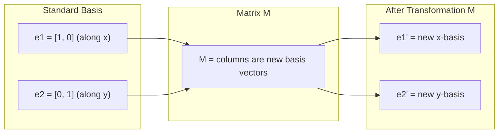
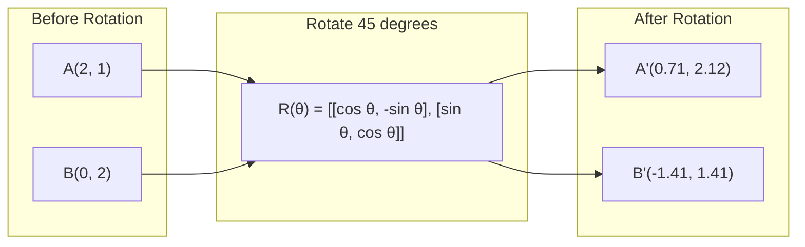
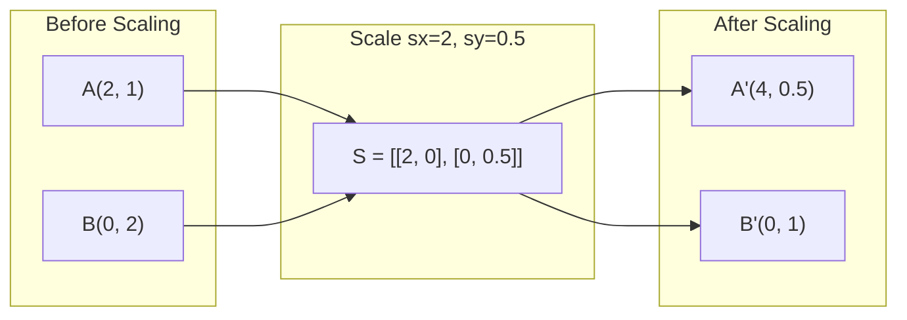
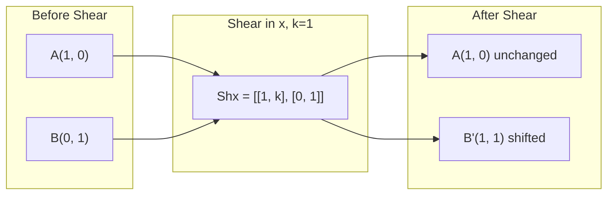
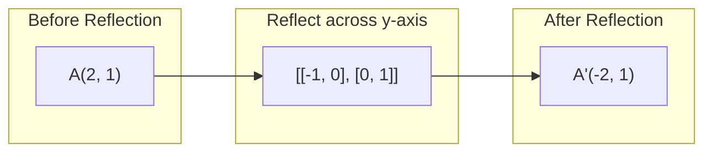
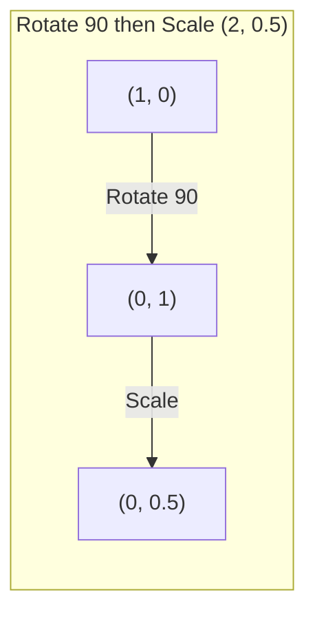
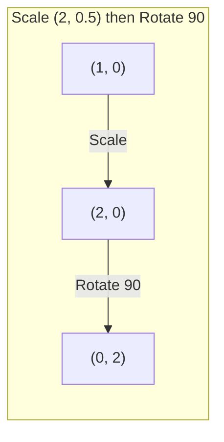

# Las transformaciones de la matriz.

> Una matriz es una máquina que remodela el espacio. Aprenda lo que hace a cada punto, y usted entiende toda la transformación.

> La matriz es una máquina de "espacio de reposición". Comprender su efecto sobre cada punto, ya entiende todo el cambio.

**Type:** Build | **类型:** 动手
**Languages:** Python, Julia | **语言:** Python, Julia
**Prerequisites:** Phase 1, Lessons 01-02 (Linear Algebra Intuition, Vectors & Matrices Operations) | **前置知识:** Phase 1, Lessons 01-02（线性代数直觉、向量与矩阵运算）
**Time:** ~75 minutes | **时间:** ~75 分钟

## Objetivos de aprendizaje

- Construir matrices de rotación, escala, corte y reflexión y aplicarlas a puntos 2D y 3D
  Construcción de rotos, acrecentamientos, cortes, reflejos y aplicaciones en 2D y 3D
- Compone múltiples transformaciones por multiplicación de matriz y verifique que el orden importa
  通过矩阵乘法组合多变, importancia de la secuencia de verificación
- Computa valores propios y vectores propios de matrices 2x2 a partir de la ecuación característica
  Calculación de la cuota de las características de la cuadrícula 2x2
- Explicar por qué los valores propios determinan las direcciones de PCA, la estabilidad de RNN y el comportamiento de agrupamiento espectral
  解释特征值为何决定 PCA 方向、RNN 稳定性和谱聚类行为

> **【中文解读】**
> La matriz es el cambio de la rotatividad del espacio, la reducción, el corte, el cambio, el cambio, el cambio, el cambio, el cambio, el cambio, el cambio, el cambio, el cambio, el cambio, el cambio, el cambio, el cambio, el cambio, el cambio, el cambio, el cambio, el cambio, el cambio, el cambio, el cambio, el cambio, el cambio, el cambio, el cambio, el cambio, el cambio, el cambio, el cambio, el cambio, el cambio, el cambio, el cambio, el cambio, el cambio, el cambio, el cambio, el cambio, el cambio, el cambio, el cambio, el cambio, el cambio, el cambio, el cambio, el cambio, el cambio, el cambio, el cambio, el cambio, el cambio, el cambio, el cambio, el cambio, el cambio, el cambio, el cambio, el cambio, el cambio, el cambio, el cambio, etc.

> **【拓展：特征值/特征向量在 AI 中的位置】**
> - **PCA（主成分分析）** encontrar la dimensión de la matriz de datos, es la dirección más grande de la diferencia de datos.
> - **RNN 稳定性**Si el valor absoluto de la matriz de peso es mayor que 1, el índice de gradiencia aumenta; menor que 1 disminuye a zero.
> - **谱聚类**: Utiliza la masa de características de la matriz de la plantilla para hacer la agrupación, más adecuada a los datos no esféricos que K-Means.

## El problema es la introducción del problema

> **【中文解读】**PCA dice "encontrar la velocidad de las características de la matriz de diferencia", modelo estabilidad dice "examinar si el valor de las características es menor que 1", datos aumentados dice "a la vez que se giran" todo esto necesita entender la matriz de cambios en el espacio.

## El concepto central.

> **【拓展：Transformer 中的矩阵变换】**Cada uno de los primeros pasos de la formación del transformador está en el proceso de cambio de matriz: Q=W_q·x, K=W_k·x, V=W_v·x, entre los cuales W_q/W_k/W_v es un proceso de cambio de matriz que se puede aprender. El proceso de entrenamiento del modelo es el proceso de aprendizaje automático de "el mejor cambio".

### Transformaciones como matrices

Cada transformación lineal en 2D puede ser escrita como una matriz 2x2. La matriz le dice exactamente dónde terminan los vectores base [1, 0] y [0, 1]. Todo lo demás sigue.

> Cada línea de cambio en el espacio de dos dimensiones puede ser escrita en una matriz de dos veces dos. La matriz dice que la base de la matriz [1, 0] y [0, 1] se ha cambiado hasta donde, todo lo demás lo determina.

> 矩阵的列就是变换后的基向量──如果矩阵第一列是 [2, 0],说明 e1=[1,0] 被映射到 [2,0](沿 x 轴拉伸 2 倍)──



### Rotación

Una rotación 2D por ángulo theta mantiene intactos las distancias y los ángulos.

> Dos dimensiones de rotación mantendrán la distancia y el ángulo invariables, moverán cada punto a lo largo del arco de círculo.

> 旋转矩阵 R(θ) = [[cosθ, -sinθ], [sinθ, cosθ]]。θ 为正表示逆时针旋转。R^T = R^(-1),转置即逆旋转。



En 3D, giras alrededor de un eje. Cada eje tiene su propia matriz de rotación:

> En tres dimensiones del espacio, se gira alrededor de un eje. Cada eje tiene su propia rotatoria.

```
Rz(theta) = | cos  -sin  0 |     Rotate around z-axis
            | sin   cos  0 |     (x-y plane spins, z stays)
            |  0     0   1 |

Rx(theta) = | 1   0     0    |   Rotate around x-axis
            | 0  cos  -sin   |   (y-z plane spins, x stays)
            | 0  sin   cos   |

Ry(theta) = |  cos  0  sin |     Rotate around y-axis
            |   0   1   0  |     (x-z plane spins, y stays)
            | -sin  0  cos |
```

### Escalado

El estiramiento de escala se extiende o se comprime a lo largo de cada eje de forma independiente.

> 缩放沿每轴独立地拉伸或压缩──

> 缩放矩阵 S = [[sx, 0], [0, sy]]―sx、sy puede ser diferente―



### El corte de piezas

El corte inclina un eje mientras mantiene fijo el otro.

> 切切使一个轴倾斜而保持另一个轴固定,将矩形变成平行四边形.

> 剪切保持面积不变(行列式=1) ・・・Imagine a 克牌向一边推:底牌不动,顶牌平移──



Matrices de corte:
- `Shx = [[1, k], [0, 1]]`cambios x por k * y
- `Shy = [[1, 0], [k, 1]]`cambios y por k * x

> 剪切矩阵:`Shx`沿 y 偏移 x(x 新 = x + k*y),`Shy`沿 x 偏移 y(y 新 = y + k*x) 』

### Reflexión

El reflejo refleja puntos a través de un eje o una línea.

> Reflexión sobre un eje o una línea de hacer un reflejo.

> Reflexión de cambio de dirección (~~~~~~~~~~~~~~~~~~~~~~~~~~~~~~~~~~~~~~~~~~~~~~~~~~~~~~~~~~~~~~~~~~~~~~~~~~~~~~~~~~~~~~~~~~~~~~~~~~~~~~~~~~~~~~~~~~~~~~~~~~~~~~~~~~~~~~~~~~~~~~~~~~~~~~~~~~~~~~~~~~~~~~~~~~~~~~~~~~~~~~~~~~~~~~~~~~~~~~~~~~~~~~~~~~~~~~~~~~~~~~~~~~~~~~~~~~~~~~~~~~~~~~~~~~~~~~~~~~~~~~~~~~~~~~~~~~~~~~~~~~~~~~~~~~~~~~~~~~~~~~~~~~~~~~~~~~~~~~~~~~~~~~~~~~~~~~~~~~~~~~~~~~~~~~~~~~~~~~~~~~~~~~~~~~~~~~~~~~~~~~~~~~~~~~~~~~~~~~~~~~~~~~~~~~~~~~~~~~~~~~~~~~~~~~~~~~~~~~~~~~~~~~~~~~~~~~~~~~~~~~~~~~~~~~~~~~~~~~~~~~~~~~~~~~~~~~~~~~~~~~



Matrices de reflexión:
- Reflexión a través del eje y: `[[-1, 0], [0, 1]]`
- Reflejo a través del eje x: `[[1, 0], [0, -1]]`

> Sobre el eje de reflexión`[[-1, 0], [0, 1]]`, acerca de la reflexión de x 轴`[[1, 0], [0, -1]]`¿Qué es eso?

### Compuesto: transformaciones de cadenas

Aplicar la transformación A y luego B es lo mismo que multiplicar sus matrices: `result = B @ A @ point`La orden es importante. girar luego la escala da resultados diferentes a la escala luego girar.

> Antes de hacer cambios A después de hacer cambios B igual que multiplicando su matriz:`result = B @ A @ point`◊ El orden es importante El resultado del primer giro reajustado es diferente al resultado del primer giro reajustado 

> Es por eso que la secuencia de nn en PyTorch se aplica en forma estricta a los módulos, y la secuencia de matrices multiplicadas se transfiere automáticamente en la transmisión inversa.



Compuesto por: `S @ R = [[0, -2], [0.5, 0]]`

> 先旋转 90° 再缩放 (2, 0.5): desde (1,0) → 旋转后 (0,1) → 缩放后 (0, 0.5)──组合矩阵 S @ R = [[0, -2], [0,5, 0]]──



Compuesto por: `R @ S = [[0, -0.5], [2, 0]]`

> Antes de acelerar (2, 0.5) y volver a girar 90°: desde (1,0) → 缩放后 (2, 0) → 旋转后 (0, 2)──组合矩阵 R @ S = [[0, -0.5], [2, 0]], con arriba completamente diferente。

Diferentes resultados. La multiplicación de matrices no es commutativa.

> 结果不同──矩阵乘法不满足交换律这就是为什么变压器注意力中 Q、K、V 的相乘顺序至关重要──

### Valores propios y vectores propios

La mayoría de los vectores cambian de dirección cuando una matriz los alcanza. Los vectores propios son especiales: la matriz solo los escala, nunca los gira. El factor de escala es el valor propio.

> La mayoría de los vectores son modificados por la matriz después de cambiar de dirección.

> 几何直觉: la característica de un eje es la dirección de un cambio en la dirección de un cambio. Si la matriz es un cambio de un círculo, la característica de un eje es el eje de un círculo.

```
A @ v = lambda * v

v is the eigenvector (direction that survives)
lambda is the eigenvalue (how much it stretches)

Example: A = | 2  1 |
             | 1  2 |

Eigenvector [1, 1] with eigenvalue 3:
  A @ [1,1] = [3, 3] = 3 * [1, 1]     (same direction, scaled by 3)

Eigenvector [1, -1] with eigenvalue 1:
  A @ [1,-1] = [1, -1] = 1 * [1, -1]  (same direction, unchanged)
```

La matriz se extiende el espacio por 3x a lo largo de [1, 1] y mantiene [1, -1] sin cambios.

> La rectangularidad de la dirección [1, 1] se extiende 3 veces, manteniendo la dirección [1, -1]. Todas las demás direcciones son la combinación de estas dos direcciones.

### Composición propia

Si una matriz tiene n vectores propios linealmente independientes, se puede descomponer:

> Si la matriz tiene n 个线性无关的特征向量, se puede descomponer en A = V D V−1──

> Trademarcación de características: transformar arbitrariamente la diferenciación de características en "rotar a la rotatividad de la rotatividad de la rotatividad de la rotatividad de la rotatividad de la rotatividad de la rotatividad de la rotatividad de la rotatividad de la rotatividad de la rotatividad de la rotatividad de la rotatividad de la rotatividad de la rotatividad de la rotatividad de la rotatividad de la rotatividad de la rotatividad de la rotatividad de la rotatividad de la rotatividad de la rotatividad de la rotatividad de la rotatividad de la rotatividad de la rotatividad de la rotatividad de la rotatividad de la rotatividad de la rotatividad de la rotatividad de la rotatividad de la rotatividad de la rotatividad de la rotatividad de la rotatividad de la rotatividad de la rotatividad de la rotatividad de la rotatividad de la rotatividad de la PCA.

```
A = V @ D @ V^(-1)

V = matrix whose columns are eigenvectors
D = diagonal matrix of eigenvalues
V^(-1) = inverse of V

This says: rotate into eigenvector coordinates, scale along each axis, rotate back.
```

> Esto significa: girar hacia el eje de la carga, en cada eje de reducción, volver a girar hacia atrás.

### Por qué importan los valores propios

**PCA.**Los vectores propios de la matriz de covarianza son los componentes principales. Los valores propios le dicen cuánto variación capta cada componente.

> **PCA（主成分分析）。**El valor de las características de la matriz de diferencia es el componente principal, el valor de las características le dice a cada componente principal cuánto diferencia ha capturado.

**Stability.**En redes y sistemas dinámicos recurrentes, los valores propios con magnitud > 1 causan que las salidas exploten.

> **稳定性。**En la red circular y el sistema de energía, el valor de la característica absolutamente > 1 provoca la explosión de salida,< 1 provoca la desaparición.

**Spectral methods.**Las redes neuronales de gráficos utilizan valores propios de la matriz adyacente.

> **谱方法。**图神经网络使用邻属矩阵的特征值,谱聚类使用拉普拉斯矩阵的特征值――特征向量揭示图的结构――

### Determinante como factor de escala de volumen

El determinante de una matriz de transformación le dice cuánto escala el área (2D) o volumen (3D).

> La línea de cambios de la matriz te dice que se reduce en la superficie de la dimensión de la dimensión de la dimensión de la dimensión de la dimensión de la dimensión de la dimensión de la dimensión de la dimensión de la dimensión de la dimensión de la dimensión de la dimensión de la dimensión de la dimensión de la dimensión de la dimensión de la dimensión de la dimensión de la dimensión de la dimensión de la dimensión de la dimensión de la dimensión de la dimensión de la dimensión de la dimensión de la dimensión de la dimensión de la dimensión de la dimensión de la dimensión de la dimensión de la dimensión de la dimensión de la dimensión de la dimensión de la dimensión de la dimensión de la dimensión de la dimensión de la dimensión de la dimensión de la dimensión de la dimensión de la dimensión de la dimensión de la dimensión de la dimensión de la dimensión de la dimensión de la dimensión de la dimensión de la dimensión de la dimensión de la dimensión de la dimensión de la dimensión de la dimensión de la dimensión de la dimensión de la dimensión de la dimensión de la dimensión de la dimensión.

> det=0 es "catastrophe"矩阵把空间 comprimido a baja dimensiones (como 2D → 1D 线), información perdida,矩阵不可逆── cuando se inicia la red neuronal para evitar que el peso de la矩阵 se acerque a lo extraño──

```
det = 1:   area preserved (rotation)
det = 2:   area doubled
det = 0:   space crushed to lower dimension (singular)
det = -1:  area preserved but orientation flipped (reflection)

| det(Rotation) | = 1        (always)
| det(Scale sx, sy) | = sx * sy
| det(Shear) | = 1           (area preserved)
| det(Reflection) | = -1     (orientation flipped)
```

> 行列式含义:det=1 保面积(旋转);det=2 面积翻倍;det=0 空间崩缩到低维(奇异,矩阵不可逆);det=-1 保面积但翻转方向(反射) ・・・

## Construye y realiza.
```figure
matrix-transform
```

## Construye el mismo

### Paso 1: Matrices de transformación desde cero (Python)

> Paso 1: desde el 0 hasta el 0

> Desde el 0 de realizar la rotación, la aceleración, el corte, la reflexión de la matriz. Todos los cambios son 2x2 de la matriz. También se realiza la matriz y la matriz.

```python
import math

def rotation_2d(theta):
    c, s = math.cos(theta), math.sin(theta)
    return [[c, -s], [s, c]]

def scaling_2d(sx, sy):
    return [[sx, 0], [0, sy]]

def shearing_2d(kx, ky):
    return [[1, kx], [ky, 1]]

def reflection_x():
    return [[1, 0], [0, -1]]

def reflection_y():
    return [[-1, 0], [0, 1]]

def mat_vec_mul(matrix, vector):
    return [
        sum(matrix[i][j] * vector[j] for j in range(len(vector)))
        for i in range(len(matrix))
    ]

def mat_mul(a, b):
    rows_a, cols_b = len(a), len(b[0])
    cols_a = len(a[0])
    return [
        [sum(a[i][k] * b[k][j] for k in range(cols_a)) for j in range(cols_b)]
        for i in range(rows_a)
    ]

point = [1.0, 0.0]
angle = math.pi / 4

rotated = mat_vec_mul(rotation_2d(angle), point)
print(f"Rotate (1,0) by 45 deg: ({rotated[0]:.4f}, {rotated[1]:.4f})")

scaled = mat_vec_mul(scaling_2d(2, 3), [1.0, 1.0])
print(f"Scale (1,1) by (2,3): ({scaled[0]:.1f}, {scaled[1]:.1f})")

sheared = mat_vec_mul(shearing_2d(1, 0), [1.0, 1.0])
print(f"Shear (1,1) kx=1: ({sheared[0]:.1f}, {sheared[1]:.1f})")

reflected = mat_vec_mul(reflection_y(), [2.0, 1.0])
print(f"Reflect (2,1) across y: ({reflected[0]:.1f}, {reflected[1]:.1f})")
```

### Paso 2: Composición de las transformaciones

> Paso 2: La combinación de cambios

> 验证矩阵乘法不可交换:先旋转90° 再缩放 (2, 0.5) con先缩放再旋转 obtiene resultados completamente diferentes. Esto explica por qué PyTorch nn.

```python
R = rotation_2d(math.pi / 2)
S = scaling_2d(2, 0.5)

rotate_then_scale = mat_mul(S, R)
scale_then_rotate = mat_mul(R, S)

point = [1.0, 0.0]
result1 = mat_vec_mul(rotate_then_scale, point)
result2 = mat_vec_mul(scale_then_rotate, point)

print(f"Rotate 90 then scale: ({result1[0]:.2f}, {result1[1]:.2f})")
print(f"Scale then rotate 90: ({result2[0]:.2f}, {result2[1]:.2f})")
print(f"Same? {result1 == result2}")
```

> 验证: Previo giro y posterior aceleración, el resultado es diferente al anterior aceleración y posterior giro.

### Paso 3: Valores propios desde cero (2x2)

> Paso 3: desde el valor de las características de cálculo

> 2x2 矩阵的特征值通过解二次方程 λ2 - trace·λ + det = 0 得到, en el cual trace=a+d,det=ad-bc。特征向量通过 (A - λI) v = 0 求解。

Para una matriz 2x2 `[[a, b], [c, d]]`, los valores propios resuelven la ecuación característica: `lambda^2 - (a+d)*lambda + (ad - bc) = 0`¿ Qué ?

> Para 2x2 矩阵 `[[a, b], [c, d]]`,特征值满足特征方程 λ2 - (a+d)λ + (ad-bc) = 0── entre ellos (a+d) es un trazo, (ad-bc) es un rango de rango.

```python
def eigenvalues_2x2(matrix):
    a, b = matrix[0]
    c, d = matrix[1]
    trace = a + d
    det = a * d - b * c
    discriminant = trace ** 2 - 4 * det
    if discriminant < 0:
        real = trace / 2
        imag = (-discriminant) ** 0.5 / 2
        return (complex(real, imag), complex(real, -imag))
    sqrt_disc = discriminant ** 0.5
    return ((trace + sqrt_disc) / 2, (trace - sqrt_disc) / 2)

def eigenvector_2x2(matrix, eigenvalue):
    a, b = matrix[0]
    c, d = matrix[1]
    if abs(b) > 1e-10:
        v = [b, eigenvalue - a]
    elif abs(c) > 1e-10:
        v = [eigenvalue - d, c]
    else:
        if abs(a - eigenvalue) < 1e-10:
            v = [1, 0]
        else:
            v = [0, 1]
    mag = (v[0] ** 2 + v[1] ** 2) ** 0.5
    return [v[0] / mag, v[1] / mag]

A = [[2, 1], [1, 2]]
vals = eigenvalues_2x2(A)
print(f"Matrix: {A}")
print(f"Eigenvalues: {vals[0]:.4f}, {vals[1]:.4f}")

for val in vals:
    vec = eigenvector_2x2(A, val)
    result = mat_vec_mul(A, vec)
    scaled = [val * vec[0], val * vec[1]]
    print(f"  lambda={val:.1f}, v={[round(x,4) for x in vec]}")
    print(f"    A@v = {[round(x,4) for x in result]}")
    print(f"    l*v = {[round(x,4) for x in scaled]}")
```

> 验证 A=[[2,1],[1,2]] de la característica es 3 和 1,对应特征向量 [1,1]/√2 和 [1,-1]/√2。验证 A@v = λ×v 成立。

### Paso 4: Determinante como factor de escala de volumen

> Paso 4: La línea de eje como factor de tamaño reducido

```python
def det_2x2(matrix):
    return matrix[0][0] * matrix[1][1] - matrix[0][1] * matrix[1][0]

print(f"det(rotation 45) = {det_2x2(rotation_2d(math.pi/4)):.4f}")
print(f"det(scale 2,3)   = {det_2x2(scaling_2d(2, 3)):.1f}")
print(f"det(shear kx=1)  = {det_2x2(shearing_2d(1, 0)):.1f}")
print(f"det(reflect y)   = {det_2x2(reflection_y()):.1f}")

singular = [[1, 2], [2, 4]]
print(f"det(singular)     = {det_2x2(singular):.1f}")
print("Singular: columns are proportional, space collapses to a line.")
```

> Ejemplo de la línea de cuadros de las líneas de cuadros: [1, 2], [2, 4]] se reduce a 0, pues las líneas de cuadros se comprimen a una línea, y el espacio se vuelve inalterable.

## Usalo con el marco de ejecución

NumPy maneja todo esto con rutinas optimizadas.

> NumPy utiliza el proceso optimizado para procesar todas estas operaciones.

> NumPy de `np.linalg.eig`Y `np.linalg.det`底层调用 LAPACK(C/Fortran 写的线性代数库),比手写 Python 快 100-1000 倍──

```python
import numpy as np

theta = np.pi / 4
R = np.array([[np.cos(theta), -np.sin(theta)],
              [np.sin(theta),  np.cos(theta)]])

point = np.array([1.0, 0.0])
print(f"Rotate (1,0) by 45 deg: {R @ point}")

S = np.diag([2.0, 3.0])
composed = S @ R
print(f"Scale(2,3) after Rotate(45): {composed @ point}")

A = np.array([[2, 1], [1, 2]], dtype=float)
eigenvalues, eigenvectors = np.linalg.eig(A)
print(f"\nEigenvalues: {eigenvalues}")
print(f"Eigenvectors (columns):\n{eigenvectors}")

for i in range(len(eigenvalues)):
    v = eigenvectors[:, i]
    lam = eigenvalues[i]
    print(f"  A @ v{i} = {A @ v}, lambda * v{i} = {lam * v}")

print(f"\ndet(R) = {np.linalg.det(R):.4f}")
print(f"det(S) = {np.linalg.det(S):.1f}")

B = np.array([[3, 1], [0, 2]], dtype=float)
vals, vecs = np.linalg.eig(B)
D = np.diag(vals)
V = vecs
reconstructed = V @ D @ np.linalg.inv(V)
print(f"\nEigendecomposition A = V @ D @ V^-1:")
print(f"Original:\n{B}")
print(f"Reconstructed:\n{reconstructed}")
```

> TEMPRESACIÓN DE DECOMPOSIÓN: A = V @ D @ V−1 应能完美重建原矩阵―― esto demuestra que cualquier rectangular en forma de angular puede ser dividido en "rotar → acrecentarse → retornar" 三步──

### Rotación 3D con NumPy

```python
def rotation_3d_z(theta):
    c, s = np.cos(theta), np.sin(theta)
    return np.array([[c, -s, 0], [s, c, 0], [0, 0, 1]])

def rotation_3d_x(theta):
    c, s = np.cos(theta), np.sin(theta)
    return np.array([[1, 0, 0], [0, c, -s], [0, s, c]])

point_3d = np.array([1.0, 0.0, 0.0])
rotated_z = rotation_3d_z(np.pi / 2) @ point_3d
rotated_x = rotation_3d_x(np.pi / 2) @ point_3d

print(f"\n3D point: {point_3d}")
print(f"Rotate 90 around z: {np.round(rotated_z, 4)}")
print(f"Rotate 90 around x: {np.round(rotated_x, 4)}")
```

> NumPy  Implementar 3D  rotativo: alrededor de z 轴 y alrededor de x 轴 各有独立的 3x3 旋转矩阵──3D 图形学、机器人学、计算机视觉都依赖这些矩阵──

## Envíe el producto .

Esta lección construye las bases geométricas para el análisis de peso de PCA (fase 2) y la red neuronal. El código de valor propio/eigenvector construido aquí es el mismo algoritmo que impulsa la reducción de dimensionalidad, el agrupamiento espectral y el análisis de estabilidad en los sistemas ML de producción.

> Esta clase construyó la base geográfica del análisis de peso de PCA (Fase 2) y de la red neuronal. En este curso, el código de valor/trademarque de características se basa en el mismo algoritmo que el de la reducción, acumulación de espectros y análisis de estabilidad en el sistema ML.

> Este código puede ser utilizado directamente para comprender temas de alto nivel como PCA, grupos de grupos de grupos de grupos de grupos de grupos de grupos de grupos de grupos de grupos de grupos de grupos de grupos de grupos de grupos de grupos de grupos de grupos de grupos de grupos de grupos de grupos de grupos de grupos de grupos de grupos de grupos de grupos de grupos de grupos de grupos de grupos de grupos de grupos de grupos de grupos de grupos de grupos de grupos de grupos de grupos de grupos de grupos de grupos de grupos de grupos de grupos de grupos de grupos de grupos de grupos de grupos de grupos de grupos de grupos de grupos de grupos de grupos de grupos de grupos de grupos de grupos de grupos de grupos de grupos de grupos de grupos de grupos de grupos de grupos de grupos de grupos de grupos de grupos de grupos de grupos de grupos de grupos de grupos de grupos de grupos de grupos de grupos de grupos de grupos de grupos de grupos de grupos de grupos de grupos de grupos de grupos de grupos de grupos de grupos de grupos de grupos de grupos de grupos de grupos de grupos de grupos de grupos de grupos de grupos de grupos de grupos de grupos de grupos de grupos de grupos de grupos de grupos de grupos de grupos de grupos de grupos de grupos de grupos de grupos de grupos de grupos de grupos de grupos de grupos de grupos de grupos de grupos de grupos de grupos de grupos de grupos de grupos de grupos de grupos de grupos de grupos de grupos de grupos de grupos de grupos de grupos de grupos de grupos de grupos de grupos de grupos de grupos de grupos de grupos de grupos de grupos de grupos de grupos de grupos de grupos de grupos de grupos de grupos de grupos de grupos de grupos de grupos de grupos de grupos de grupos de grupos de grupos de grupos de grupos de grupos de grupos de grupos de grupos de grupos de grupos de grupos de grupos de grupos de grupos de grupos de grupos de grupos de grupos de grupos de grupos de grupos de grupos de grupos de grupos de grupos de grupos de grupos de grupos de grupos de grupos de grupos de grupos de grupos de grupos de grupos de grupos de grupos de grupos de grupos de grupos de grupos de grupos de grupos de grupos de grupos de grupos de grupos de grupos de grupos de grupos de grupos de grupos de grupos de grupos de grupos de grupos de grupos de grupos de grupos de grupos de grupos de grupos de grupos de grupos de grupos de grupos de grupos de grupos de grupos de grupos de grupos de grupos de grupos de grupos de grupos de grupos de grupos de grupos de grupos de grupos de grupos de

## Los ejercicios.

1. Aplique la rotación, la escala y el corte a un cuadrado unitario (corneras en [0,0], [1,0], [1,1], [0,1]). Imprima las esquinas transformadas para cada una. Verifique que la rotación preserva las distancias entre las esquinas.
   Para la unidad de forma cuadrada ((角在 [0,0]、[1,0]、[1,1]、[0,1]) aplicación de la rotación, acrecentamiento, corte, imprimir cada cambio de la lateral de la corta.

2. Encuentra los valores propios de la matriz [[4, 2], [1, 3]] a mano utilizando la ecuación característica. Luego verifica con tu función desde cero y con NumPy.
   Hand工用特征方程求矩阵的特征值 [[4, 2], [1, 3]] , y luego utilizar de la función de realización y NumPy 验证从零.

3. Crea una composición de tres transformaciones (rota 30 grados, escala por [1,5, 0,8], corte con kx=0,3) y apliquela a 8 puntos dispuestos en un círculo. Imprima antes y después de las coordenadas. Computa el determinante de la matriz compuesta y verifica que es igual al producto de los determinantes individuales.
   组合三个变换(旋转30°、缩放 [1.5, 0.8]、剪切 kx=0.3), aplicada a 8 puntos en el círculo──印前后坐标──计算组合矩阵的行列式,验证它等于各自行列式的乘积──

## Términos clave .

| Term | What people say | What it actually means |
|------|----------------|----------------------|
| Rotation matrix | "Spins things" | An orthogonal matrix that moves points along circular arcs while preserving distances and angles. Determinant is always 1. |
| Scaling matrix | "Makes things bigger" | A diagonal matrix that stretches or compresses independently along each axis. Determinant is the product of scale factors. |
| Shearing matrix | "Slants things" | A matrix that shifts one coordinate proportionally to another, turning rectangles into parallelograms. Determinant is 1. |
| Reflection | "Mirrors things" | A matrix that flips space across an axis or plane. Determinant is -1. |
| Composition | "Do two things" | Multiplying transformation matrices to chain operations. Order matters: B @ A means apply A first, then B. |
| Eigenvector | "Special direction" | A direction that the matrix only scales, never rotates. The transformation's fingerprint. |
| Eigenvalue | "How much it stretches" | The scalar factor by which the matrix scales its eigenvector. Can be negative (flip) or complex (rotation). |
| Eigendecomposition | "Break the matrix apart" | Writing a matrix as V @ D @ V^(-1), separating it into its fundamental scaling directions and magnitudes. |
| Determinant | "A single number from a matrix" | The factor by which the transformation scales area (2D) or volume (3D). Zero means the transformation is irreversible. |
| Characteristic equation | "Where eigenvalues come from" | det(A - lambda * I) = 0. The polynomial whose roots are the eigenvalues. |

> 术语速查:Rotación matriz(torsión de la matriz,正交,行列式=1) √Escalación matriz(agudización de la matriz,对角) √Searing(剪切,矩形→平行四边形) √Reflexión(反射,行列式=-1) √Composition(组合,B@A 表示先 A 后 B) √Eigenvector(特征向量,只缩放不值旋转的方向) √Eigenvalue(特征,缩放倍数,可为负负或复数) √Eigendecomposition √特征分解 A=VDV−1) √Determinant行列式,面积/体积放放因子,0 = 奇异) √Caracteristic equation √特征方方 √A-λI=0) √

## Más Leer más Leer más

- [3Blue1Brown: Linear Transformations](https://www.3blue1brown.com/lessons/linear-transformations)-- intuición visual para cómo las matrices remodelar el espacio
- [3Blue1Brown: Eigenvectors and Eigenvalues](https://www.3blue1brown.com/lessons/eigenvalues)-- la mejor explicación visual de lo que los propios vectores significan geométricamente
- [MIT 18.06 Lecture 21: Eigenvalues and Eigenvectors](https://ocw.mit.edu/courses/18-06-linear-algebra-spring-2010/)- El tratamiento clásico de Gilbert Strang
