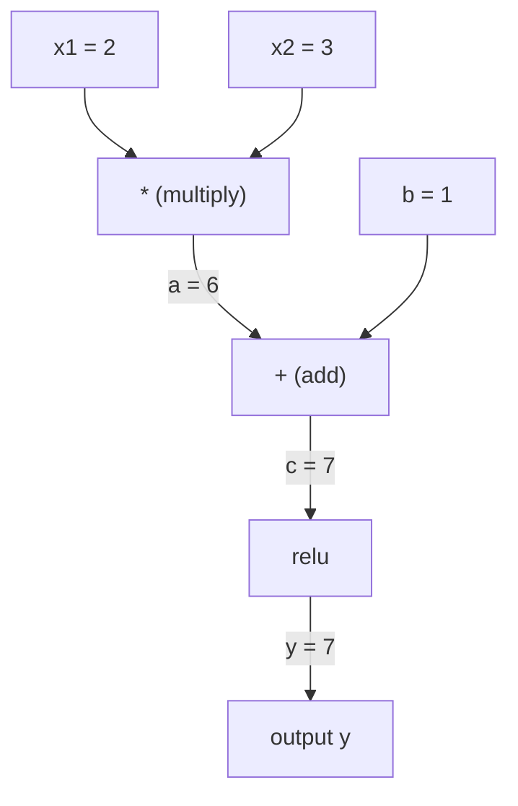
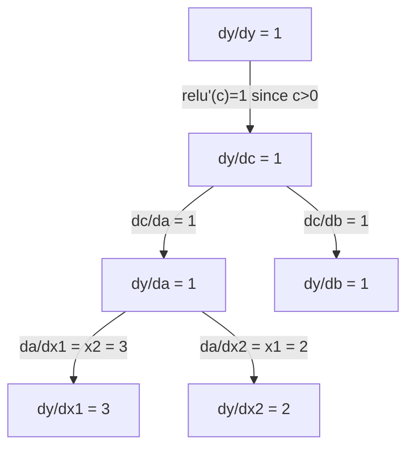

# Regla de cadena y diferenciación automática.

> La regla de la cadena es el motor detrás de cada red neuronal que aprende.

**Type:** Build | **类型:** 动手
**Language:**¿ Qué pasa ?**语言:**Python
**Prerequisites:** Phase 1, Lesson 04 (Derivatives & Gradients) | **前置知识:** Phase 1, Lesson 04（导数与梯度）
**Time:** ~90 minutes | **时间:** ~90 分钟

## Objetivos de aprendizaje

- Construir un motor de autogrado mínimo (clase de valor) que registre las operaciones y computa los gradientes a través del autodiff en modo inverso
  构建最小化 autograd 引擎(Valor 类),记录运算并通过反向模式自动微分计算梯度
- Implementar pasos hacia adelante y hacia atrás a través de un gráfico de cálculo utilizando ordenamiento topológico
  Usando el orden de la distribución para lograr la distribución de la figura de cálculo
- Construir y entrenar un perceptron de varias capas en XOR utilizando sólo el motor de autograd desde cero
  Construir y entrenar en XOR sólo con un motor de autograd desde cero
- Verificar la corrección de la auto-diff con la verificación de gradientes contra diferencias finitas numéricas
  Con un número limitado de diferencias para realizar un examen de grado, verificación de la autenticidad del auto-dif

> **【中文解读】**
> La ley de la cadena es "la dirección de un conjunto de funciones". La ley de la cadena permite que se pueda empezar desde la última etapa, gradualmente y de nuevo, calcular la escala de cada parámetro.

> **【拓展：链式法则 → 反向传播 → PyTorch autograd】**
> La ley de la cadena es la base matemática de la "repropagación" (Reflexión) de PyTorch.`autograd`、Flujo de tensión `GradientTape`Todo lo que se puede hacer es realizar los gráficos de cálculo de seguimiento automático con un modelo de inversión automática y luego calcular todos los niveles con la ley de cadenas.

## El problema es la introducción del problema

Se pueden calcular derivadas de funciones simples. Pero una red neuronal no es una función simple. Son cientos de funciones compuestas juntas: multiplicar matriz, agregar sesgo, aplicar activación, multiplicar matriz de nuevo, softmax, pérdida de entropía cruzada. La salida es una función de una función de una función.

> Puedes calcular la dirección de una función simple. Pero la red neuronal no es una función simple. Es una composición de cientos de funciones: la matriz multiplicada, la función de activación, la función de multiplicada, la matriz de la función Softmax, la función de la función de la función de la función de la salida.

Para entrenar la red, se necesita el gradiente de la pérdida con respecto a cada peso.

> Para entrenar la red, necesitas pérdida para cada peso de la escala.

La regla de la cadena te da las matemáticas. La diferenciación automática te da el algoritmo. Juntos te permiten calcular gradientes exactos a través de composiciones arbitrarias de funciones en tiempo proporcionales a un solo pase hacia adelante.

> La ley de cadenas da matemáticas, la diferenciación automática da algoritmos. La combinación de ambos, permite calcular la magnitud exacta de la función de composición arbitraria en un tiempo equivalente al de la transmisión de una sola.

Así es como PyTorch, TensorFlow y JAX funcionan.

> Así es como PyTorch, TensorFlow y JAX trabajan.

> **【中文解读】**神经网络 = 函数的函数的函数──链式法则让你逐层解解复合函数的导数:dL/dw = dL/d_out × d_out/d_hidden × d_hidden/d_w──自动求导把这个过程自动化PyTorch的`backward()`Una línea de código para determinar la gradiencia de los millones de parámetros calculado.

## El concepto central.

> **【拓展：自动求导是深度学习的引擎】**PyTorch de `loss.backward()`Utilizando el método de búsqueda automática de modo contrario: desde la salida hacia la vuelta, por la aplicación de la cadena de la ley de la capa.`backward()`Una vez que se puede calcular la gradiencia de todos los parámetros, sin guía automática, el aprendizaje profundo no puede procesar un modelo tan grande.

### La regla de la cadena

Si ...`y = f(g(x))`, el derivado de `y`en lo que respecta a `x`es:

> Si es que`y = f(g(x))`,y para x es el número de direcciones:

```
dy/dx = dy/dg * dg/dx = f'(g(x)) * g'(x)
```

Multiplicar las derivadas a lo largo de la cadena. Cada enlace contribuye a su derivada local.

> 沿链路乘导数── cada paso contribuye a su local导数──

Ejemplo: `y = sin(x^2)`

```
g(x) = x^2       g'(x) = 2x
f(g) = sin(g)     f'(g) = cos(g)

dy/dx = cos(x^2) * 2x
```

> Ejemplo:y = sin(x2);;;;;;;;;;;;;;;;;;;;;;;;;;;;;;;;;;;;;;;;;;;;;;;;;;;;;;;;;;;;;;;;;;;;;;;;;;;;;;;;;;;;;;;;;;;;;;;;;;;;;;;;;;;;;;;;;;;;;;;;;;;;;;;;;;;;;;;;;;;;;;;;;;;;;;;;;;;;;;;;;;;;;;;;;;;;;;;;;;;;;;;;;;;;;;;;;;;;;;;;;;;;;;;;;;;;;;;;;;;;;;;;;;;;;;;;;;;;;;;;;;;;;;;;;;;;;;;;;;;;;;;;;;;;;;;;;;;;;;;;;;;;;;;;;;;;;;;;;;;;;;;;;;;;;;;;;;;;;;;;;;;;;;;;;;;;;;;;;;;;;;;;;;;;;;;;;;;;;;;;;;;;;;;;;;;;;;;;;;;;;;;;;;;;;;;;;;;;;;;;;;;;;;;;;;;;;;;;;;;;;;;;;;;;;;;;;;;;;;;;;;;;;;;;;;;;;;;;;;;;;;;;;;;;;;;;;;;;;;;;;;;;;;;;;;;;;;;;;;;;;;

Para composiciones más profundas, la cadena se extiende:

```
y = f(g(h(x)))

dy/dx = f'(g(h(x))) * g'(h(x)) * h'(x)
```

> Más profundo de la composición: y = f(g(h(x))),导数为 f'(g(h(x))) × g'(h(x)) × h'(x), cada uno de los niveles es un número de veces un y otro.

Cada capa de una red neuronal es un eslabón de esta cadena.

> Cada nivel de la red neuronal es un elemento de esta cadena.

### Gráficos computacionales

Un gráfico computacional hace que la regla de la cadena sea visual. Cada operación se convierte en un nodo. Los datos fluyen hacia adelante a través del gráfico.

> 計算圖讓链式法则可視化── cada operación se convierte en un nodo, los datos fluyen hacia adelante, la escala fluye hacia atrás──

> 计算图是 PyTorch autograd 的底层抽象:节点是运算,前向时存储中值,反向时计算局部梯度──

**Forward pass (compute values):**



**Backward pass (compute gradients):**



El paso hacia atrás aplica la regla de la cadena en cada nodo, propagando gradientes de salida a entrada.

> En el caso de la transmisión de cada punto de la aplicación de la cadena, el grado de transmisión de salida a entrada se

### Modo de marcha adelante vs Modo inverso

Hay dos maneras de aplicar la regla de la cadena a través de un gráfico.

> 通过计算图应用链式法则有两种方式──

**Forward mode**El sistema de cálculo de las derivadas de las operaciones de cálculo de las operaciones de cálculo de las operaciones de cálculo de las operaciones de cálculo de las operaciones de cálculo de las operaciones de cálculo de las operaciones de cálculo de las operaciones de cálculo de las operaciones de cálculo de las operaciones de cálculo de las operaciones de cálculo de las operaciones de cálculo de las operaciones de cálculo de las operaciones de cálculo de las operaciones de cálculo de cálculo de las operaciones de cálculo de las operaciones de cálculo de las operaciones de cálculo de las operaciones de cálculo de cálculo de las operaciones de cálculo de las operaciones de cálculo de cálculo de las operaciones de cálculo de cálculo de las operaciones de cálculo de cálculo de las operaciones de cálculo de cálculo de las operaciones de cálculo de cálculo de las operaciones de cálculo de cálculo de las operaciones de cálculo de cálculo de las operaciones de cálculo de cálculo de cálculo de las operaciones de cálculo de cálculo de cálculo de las operaciones de cálculo de cálculo de cálculo de las operaciones de cálculo de cálculo de las operaciones de cálculo de cálculo de las operaciones de cálculo de cálculo de las operaciones de cálculo de cálculo de las operaciones de cálculo de cálculo de las operaciones de cálculo de cálculo de las operaciones de cálculo de cálculo de las operaciones de cálculo de cálculo de las operaciones de cálculo de cálculo de las operaciones de cálculo de cálculo de las operaciones de cálculo de cálculo de las cuentas de cálculo de cálculo de las cuentas de cálculo de las cuentas de cuentas de cuentas de cuentas de cuentas de cuentas de cuentas de cuentas de cuentas de cuentas de cuentas de cuentas de cuentas de cuentas de cuentas de cuentas de cuentas de cuentas de cuentas de cuentas de cuentas de cuentas de cuentas de cuentas de cuentas de cuentas de cuentas de cuentas de cuentas de cuentas de cuentas de cuentas de cuentas de cuentas de cuentas de cuentas de cuentas de cuentas de cuentas de cuentas de cuentas de cuentas de cuentas de cuentas de cuentas de cuentas de cuentas de cuentas de cuentas de cuentas de cuentas de cuentas de cuentas de cuentas de cuentas de cuentas de cuentas de cuentas de cuentas de cuentas de cuentas de cuentas de cuentas de cuentas de cuentas de cuentas de cuentas de cuentas de cuentas de cuentas de cuentas de cuentas de cuentas de cuentas de cuentas de cuentas de cu`dx/dx = 1`Es bueno cuando tienes pocas entradas y muchas salidas.

> **前向模式**Desde la entrada hasta la entrada.`dx/dx = 1`Y a través de cada operación se transmite.

```
Forward mode: seed dx/dx = 1, propagate forward

  x = 2       (dx/dx = 1)
  a = x^2     (da/dx = 2x = 4)
  y = sin(a)  (dy/dx = cos(a) * da/dx = cos(4) * 4 = -2.615)
```

**Reverse mode**comienza en la salida y tira los gradientes hacia atrás.`dy/dy = 1`Es bueno cuando tienes muchas entradas y pocas salidas.

> **反向模式**Desde la salida de la producción hasta la retirada de la producción.`dy/dy = 1`Y en reversa a través de cada operación. Cuando la entrada es mayor, la salida es menor.

```
Reverse mode: seed dy/dy = 1, propagate backward

  y = sin(a)  (dy/dy = 1)
  a = x^2     (dy/da = cos(a) = cos(4) = -0.654)
  x = 2       (dy/dx = dy/da * da/dx = -0.654 * 4 = -2.615)
```

Las redes neuronales tienen millones de entradas (pesos) y una salida (pérdida). El modo inverso calcula todos los gradientes en un paso hacia atrás.

> La red nerviosa tiene millones de entradas y pérdidas.

| Mode | Seed | Direction | Best when |
|------|------|-----------|-----------|
| Forward | `dx_i/dx_i = 1` | Input to output | Few inputs, many outputs |
| Reverse | `dy/dy = 1` | Output to input | Many inputs, few outputs (neural nets) |

> 两种模式对比:前向模式种子 dx/dx = 1,输入到输出,适合少输入多输出;反向模式种子 dy/dy = 1,输出到输入,适合多输入少输出(

### Números dobles para el modo de avanzada

El modo de avanzada puede implementarse con elegancia con números dobles.`a + b*epsilon`donde`epsilon^2 = 0`¿ Qué ?

> El modelo de orientación se puede realizar con forma óptima en el número de pares.`a + b*ε`, entre ellos `ε² = 0`¿Qué es eso?

```
Dual number: (value, derivative)

(2, 1) means: value is 2, derivative w.r.t. x is 1

Arithmetic rules:
  (a, a') + (b, b') = (a+b, a'+b')
  (a, a') * (b, b') = (a*b, a'*b + a*b')
  sin(a, a')         = (sin(a), cos(a)*a')
```

> Para el número de veces: (((valor, 导数) ;; reglas de cálculo:加法对应分量相加;乘法用积的求导法则;sin 用链式法则;;把输入的导数种子设为1,导数会自动通过每个运算传播;;

Seem la variable de entrada con derivada 1. La derivada se propaga automáticamente a través de cada operación.

> Para que el número de dichas variables se establezca en 1, el número de dichas variables se transmite automáticamente a través de cada cálculo.

### Construir un motor de Autograd

Un motor de autograd necesita tres cosas:

1. **Value wrapping.**Envuelve cada número en un objeto que almacene su valor y gradiente.
2. **Graph recording.**Cada operación registra sus entradas y la función de gradiente local.
3. **Backward pass.**La clasificación topológica del gráfico, luego caminar en sentido contrario, aplicando la regla de cadena en cada nodo.

> Autograd Motor necesita tres cosas: 1.**数值包装**: Envasar cada número en objetos de valor y gradiente de almacenamiento; 2. **图记录**Cada operación registra su entrada y su función de gradiente local.**反向传播**En el caso de los sistemas de orden, el sistema de ordenamiento de los puntos de referencia es el siguiente:

Esto es exactamente lo que PyTorch es.`autograd`¿Qué es eso?`torch.Tensor`clase envuelve valores, registra operaciones cuando `requires_grad=True`, y calcula los gradientes cuando llamas`.backward()`¿ Qué ?

> Esto es exactamente PyTorch.`autograd`Hacer cosas.`torch.Tensor`包装数值,当 `requires_grad=True`时记录操作,调用 `.backward()`时计算梯度──

### Cómo funciona la PyTorch Autograd bajo el capó

Cuando escribe código PyTorch:

```python
x = torch.tensor(2.0, requires_grad=True)
y = x ** 2 + 3 * x + 1
y.backward()
print(x.grad)  # 7.0 = 2*x + 3 = 2*2 + 3
```

> Cuando escribiste PyTorch 代码时:x 设 requerir_grad=True,运算自动记录,调用倒向() 后 x.grad 自动算出梯度 7.0。

PyTorch internamente:

1. Crea una`Tensor`nodo para `x`con`requires_grad=True`
2. Cada operación (`**`¿ Qué ?`*`¿ Qué ?`+`) crea un nuevo nodo y registra la función retrocediente
3. `y.backward()`desencadena el modo inverso de auto-difusión a través del gráfico registrado
4. Cada nodo es `grad_fn`computa gradientes locales y los pasa a los nodos padres
5. Los gradientes se acumulan en `.grad`Los atributos se añaden (no se sustituyen)

> PyTorch 内部:1) Para x 创建紧节点;2) Cada运算(**、*、+) Creación de nuevos节点并记录反向函数;3) y.backward() 触发反向自动微分;4) Cada节点的 grad_fn 计算局部梯度并传给父节点;5) 梯度通过加法累积到 .grad 属性(不是替代) 

El gráfico es dinámico (definido por ejecución). Un nuevo gráfico se construye en cada paso hacia adelante. Por eso PyTorch admite el flujo de control (si / o, bucles) dentro de los modelos.

> 计算图是动态的 (definición por ejecución) ⋅ ⋅ ⋅ ⋅ ⋅ ⋅ ⋅ ⋅ ⋅ ⋅ ⋅ ⋅ ⋅ ⋅ ⋅ ⋅ ⋅ ⋅ ⋅ ⋅ ⋅ ⋅ ⋅ ⋅ ⋅ ⋅ ⋅ ⋅ ⋅ ⋅ ⋅ ⋅ ⋅ ⋅ ⋅ ⋅ ⋅ ⋅ ⋅ ⋅ ⋅ ⋅ ⋅ ⋅ ⋅ ⋅ ⋅ ⋅ ⋅ ⋅ ⋅ ⋅ ⋅ ⋅ ⋅ ⋅ ⋅ ⋅ ⋅ ⋅ ⋅ ⋅ ⋅ ⋅ ⋅ ⋅ ⋅ ⋅ ⋅ ⋅ ⋅ ⋅ ⋅ ⋅ ⋅ ⋅ ⋅ ⋅ ⋅ ⋅ ⋅ ⋅ ⋅ ⋅ ⋅ ⋅ ⋅ ⋅ ⋅ ⋅ ⋅ ⋅ ⋅ ⋅ ⋅ ⋅ ⋅ ⋅ ⋅ ⋅ ⋅ ⋅ ⋅ ⋅ ⋅ ⋅ ⋅ ⋅ ⋅ ⋅ ⋅ ⋅ ⋅ ⋅ ⋅ ⋅ ⋅ ⋅ ⋅ ⋅ ⋅ ⋅ ⋅ ⋅ ⋅ ⋅ ⋅ ⋅ ⋅ ⋅ ⋅ ⋅ ⋅ ⋅ ⋅ ⋅ ⋅ ⋅ ⋅ ⋅ ⋅ ⋅ ⋅ ⋅ ⋅ ⋅ ⋅ ⋅ ⋅ ⋅ ⋅                                                                                                                                                                                                  

## Construye y realiza.
```figure
chain-rule
```

## Construye el mismo

### Paso 1: La clase de valor

```python
class Value:
    def __init__(self, data, children=(), op=''):
        self.data = data
        self.grad = 0.0
        self._backward = lambda: None
        self._prev = set(children)
        self._op = op

    def __repr__(self):
        return f"Value(data={self.data:.4f}, grad={self.grad:.4f})"
```

> El valor 类是自格的核心数据结构──每一个值 存储数值、梯度、反向函数闭包和子节点指针──

Cada uno .`Value`almacena sus datos numéricos, su gradiente (initialemente cero), una función retrógrada y señala los nodos infantiles que lo produjeron.

> Cada uno .`Value`存储数值、梯度(初始为零) 、反向函数和产生它的子节点指针──

### Paso 2: Operaciones aritméticas con seguimiento de gradientes

```python
    def __add__(self, other):
        other = other if isinstance(other, Value) else Value(other)
        out = Value(self.data + other.data, (self, other), '+')
        def _backward():
            self.grad += out.grad
            other.grad += out.grad
        out._backward = _backward
        return out

    def __mul__(self, other):
        other = other if isinstance(other, Value) else Value(other)
        out = Value(self.data * other.data, (self, other), '*')
        def _backward():
            self.grad += other.data * out.grad
            other.grad += self.data * out.grad
        out._backward = _backward
        return out

    def relu(self):
        out = Value(max(0, self.data), (self,), 'relu')
        def _backward():
            self.grad += (1.0 if out.data > 0 else 0.0) * out.grad
        out._backward = _backward
        return out
```

Cada operación crea un cierre que sabe cómo calcular los gradientes locales y multiplicarse por el gradiente aguas arriba (`out.grad`¿ Qué es ?`+=`maneja el caso en que se utilice un valor en múltiples operaciones.

> Cada operación crea un bloque, sabe cómo calcular la escala local y multiplicar la escala de viaje.`+=`处理一个值被多操作使用的情况 (): 处理一个值被多操作使用的情况 (): 处理一个值被多操作使用的情况) 处理一个值被多操作使用的情况 (): 处理一个值被多操作使用的情况) 处理一个值被多操作的情况 (处理一个值被多操作的情况) 处理一个值被多操作的情况 (处理一个值被多操作的情况) 处理一个值被多操作的情况) 处理一个值被多操作的情况 (处理一个值被多操作的情况) 处理一个值被多操作的情况 (处理一个值被多操作的情况) 处理一个值被多操作的情况 (处理一个值被多操作的情况) 处理一个值被多操作的情况

> 关键设计:加法的反向是1(梯度直接传给两个输入),乘法的反向是另一个操作数(链式法则:d(a*b)/da = b)。relu 的反向是0或1(取决于前向是否激活)。

### Paso 3: El pase hacia atrás

```python
    def backward(self):
        topo = []
        visited = set()
        def build_topo(v):
            if v not in visited:
                visited.add(v)
                for child in v._prev:
                    build_topo(child)
                topo.append(v)
        build_topo(self)

        self.grad = 1.0
        for v in reversed(topo):
            v._backward()
```

El orden topológico asegura que el gradiente de cada nodo se calcula completamente antes de que se propague a sus hijos.

> 拓排序 拓排序 拓排序 拓排序 拓排序 拓排序 拓排序 拓排序 拓排序 拓排序 拓排序 拓排序 拓排序 拓排序 拓排序 拓排序 拓排序 拓排序 拓排序 拓排序 拓排序 拓排序 拓排序 拓排序 拓排序 拓排序 拓排序 拓排序 拓排序 拓排序 拓排序 拓排序 拓排序 拓排序 拓排序 拓排序 拓排序 拓排序 拓排序 拓排序 拓排序 拓排序 拓排序 排序 排序 排序 排序 排序 排序 排序 排序 排序 排序 排序 排序 排序 排序 排序 排序 排序 排序 排序 排序 排序 排序 排序 排 排 排 排 排 排 排 排 排 排 排 排 排 排 排 排 排 排 排 排 排 排 排 排 排 排 排 排 排 排 排 排 排 排 排 排 排 排 排 排 排 排 排 排 排 排 排 排 排 排 排 排 排 排 排 排 排 排 排 排 排 排 排 排 排 排 排 排 排 排 排 排 排 排 排 排 排 排 排 排 排 排 排 排 排 排 排 排 排 排 排 排 排 排 排 排 排 排 排 排 排 排 排 排 排 排 排 排 排 排 排 排 排

> Algorithm: primero con el regreso a la construcción de un orden de orden de orden de orden de orden de orden de orden de orden de orden de orden de orden de orden de orden de orden de orden de orden de orden de orden de orden de orden de orden de orden de orden de orden de orden de orden de orden de orden de orden de orden de orden de orden de orden de orden de orden de orden de orden de orden de orden de orden de orden de orden de orden de orden de orden de orden de orden de orden de orden de orden de orden de orden de orden de orden de orden de orden de orden de orden de orden de orden de orden de orden de orden de orden de orden de orden de orden de orden de orden de orden de orden de orden de orden de orden de orden de orden de orden de orden de orden de orden de orden de orden de orden de orden de orden de orden de orden de orden de orden de orden de orden de orden de orden de orden de orden de orden de orden de orden de orden de orden de orden de orden de orden de orden de orden de orden de orden de orden de orden de orden de orden de orden de orden de orden de orden de orden de orden de orden de orden de orden de orden de orden de orden de orden de orden de orden de orden de orden de orden de orden de orden de orden de orden de orden de orden de orden de orden de orden de orden de orden de orden de orden de orden de orden de orden de orden de orden de orden de orden de orden de orden de orden de orden de orden de orden de orden de orden de orden de orden de orden de orden de orden de orden de orden de orden de orden de orden de orden de orden de orden de orden de orden de orden de orden de orden de orden de orden de orden de orden de orden de orden de orden de orden de orden de orden de orden de orden de orden de orden de orden de orden de orden de orden de orden de orden de orden de orden de orden de orden de orden de orden de orden de orden de orden de orden de orden de orden de orden de orden de orden de orden de orden de orden de orden de orden de orden de orden de orden de orden de orden de orden de orden de orden de orden de orden de orden de orden de orden de orden de orden de orden de orden de orden de orden de orden de orden de orden de orden de orden de orden de orden de orden de orden de orden de orden de orden de orden de orden

### Paso 4: Más operaciones para un motor completo

La clase de valor básica maneja la adición, multiplicación y relu. Un motor autograd real necesita más. Estas son las operaciones que necesita para construir redes neuronales:

> Un verdadero motor de autogradamiento necesita más operaciones: reducción de la diferencia, la diferenciación, la explicación, el registro, el tiempo.

```python
    def __neg__(self):
        return self * -1

    def __sub__(self, other):
        return self + (-other)

    def __radd__(self, other):
        return self + other

    def __rmul__(self, other):
        return self * other

    def __rsub__(self, other):
        return other + (-self)

    def __pow__(self, n):
        out = Value(self.data ** n, (self,), f'**{n}')
        def _backward():
            self.grad += n * (self.data ** (n - 1)) * out.grad
        out._backward = _backward
        return out

    def __truediv__(self, other):
        return self * (other ** -1) if isinstance(other, Value) else self * (Value(other) ** -1)

    def exp(self):
        import math
        e = math.exp(self.data)
        out = Value(e, (self,), 'exp')
        def _backward():
            self.grad += e * out.grad
        out._backward = _backward
        return out

    def log(self):
        import math
        out = Value(math.log(self.data), (self,), 'log')
        def _backward():
            self.grad += (1.0 / self.data) * out.grad
        out._backward = _backward
        return out

    def tanh(self):
        import math
        t = math.tanh(self.data)
        out = Value(t, (self,), 'tanh')
        def _backward():
            self.grad += (1 - t ** 2) * out.grad
        out._backward = _backward
        return out
```

**Why each operation matters:**

| Operation | Backward rule | Used in |
|-----------|--------------|---------|
| `__sub__` | Reuses add + neg | Loss computation (pred - target) |
| `__pow__` | n * x^(n-1) | Polynomial activations, MSE (error^2) |
| `__truediv__` | Reuses mul + pow(-1) | Normalization, learning rate scaling |
| `exp` | exp(x) * upstream | Softmax, log-likelihood |
| `log` | (1/x) * upstream | Cross-entropy loss, log probabilities |
| `tanh` | (1 - tanh^2) * upstream | Classic activation function |

> Las reglas de diferentes operaciones son: reducción de la frecuencia de la frecuencia de la frecuencia de la frecuencia de la frecuencia de la frecuencia de la frecuencia de la frecuencia de la frecuencia de la frecuencia de la frecuencia de la frecuencia de la frecuencia de la frecuencia de la frecuencia de la frecuencia de la frecuencia de la frecuencia de la frecuencia de la frecuencia de la frecuencia de la frecuencia de la frecuencia de la frecuencia de la frecuencia de la frecuencia de la frecuencia de la frecuencia de la frecuencia de la frecuencia de la frecuencia de la frecuencia de la frecuencia de la frecuencia de la frecuencia de la frecuencia de la frecuencia de la frecuencia de la frecuencia de la frecuencia de la frecuencia de la frecuencia de la frecuencia de la frecuencia de la frecuencia de la frecuencia de la frecuencia de la frecuencia de la frecuencia de la frecuencia de la frecuencia de la frecuencia de la frecuencia de la frecuencia de la frecuencia de la frecuencia de la frecuencia de la frecuencia de la frecuencia de la frecuencia de la frecuencia de la frecuencia de la frecuencia de la frecuencia de la frecuencia de la frecuencia de la frecuencia de la frecuencia de la frecuencia de la frecuencia de la frecuencia de la frecuencia de la frecuencia de la frecuencia de la frecuencia de la frecuencia de la frecuencia de la frecuencia de la frecuencia de la frecuencia de la frecuencia de la frecuencia de la frecuencia de la frecuencia de la frecuencia de la frecuencia de la frecuencia de la frecuencia de la frecuencia de la frecuencia de la frecuencia de la frecuencia de la frecuencia de la frecuencia de la frecuencia de la frecuencia de la frecuencia de la frecuencia de la frecuencia de la frecuencia de la frecuencia de la frecuencia de la frecuencia de la frecuencia de la frecuencia de la frecuencia de la frecuencia de la frecuencia de la frecuencia de la frecuencia de la frecuencia de la frecuencia de la frecuencia de la frecuencia de la frecuencia de la frecuencia de la frecuencia de la frecuencia de la frecuencia de la frecuencia de la frecuencia de la frecuencia de la frecuencia de la frecuencia de la frecuencia de la frecuencia de la frecuencia de la frecuencia de la frecuencia de la frecuencia de la frecuencia de la frecuencia de la frecuencia de la frecuencia de la frecuencia de la frecuencia de la frecuencia de la que la frecuencia de la frecuencia de la que la frecuencia de la frecuencia de la que la frecuencia de la frecuencia de la que la frecuencia de la frecuencia de la que la frecuencia de la que la que la frecuencia de la que la que la que la que la que la que la que la frecuencia de la que la que la que la que la que la que la que la que la que la que la que la que la que la

La parte inteligente:`__sub__`y `__truediv__`Se pueden definir en términos de operaciones existentes. Obtienen gradientes correctos de forma gratuita porque la regla de cadena se compone a través de las operaciones subyacentes de adición/mul/pow.

> ¿Qué es eso?`__sub__`Y `__truediv__`通过已有操作定义, por lo que la gradiencia 通过链式法则自动正确

### Paso 5: Mini MLP desde cero

Con una clase completa de valores, puedes construir una red neuronal sin PyTorch, sin NumPy, sólo valores y la regla de cadena.

> Con un valor completo, puedes construir una red neuronal. No necesitas PyTorch, no necesitas NumPy, sólo necesitas el valor y la ley de cadena.

```python
import random

class Neuron:
    def __init__(self, n_inputs):
        self.w = [Value(random.uniform(-1, 1)) for _ in range(n_inputs)]
        self.b = Value(0.0)

    def __call__(self, x):
        act = sum((wi * xi for wi, xi in zip(self.w, x)), self.b)
        return act.tanh()

    def parameters(self):
        return self.w + [self.b]

class Layer:
    def __init__(self, n_inputs, n_outputs):
        self.neurons = [Neuron(n_inputs) for _ in range(n_outputs)]

    def __call__(self, x):
        return [n(x) for n in self.neurons]

    def parameters(self):
        return [p for n in self.neurons for p in n.parameters()]

class MLP:
    def __init__(self, sizes):
        self.layers = [Layer(sizes[i], sizes[i+1]) for i in range(len(sizes)-1)]

    def __call__(self, x):
        for layer in self.layers:
            x = layer(x)
        return x[0] if len(x) == 1 else x

    def parameters(self):
        return [p for layer in self.layers for p in layer.parameters()]
```

¿ Qué es esto ?`Neuron`computaciones`tanh(w1*x1 + w2*x2 + ... + b)`- ¿ Qué ?`Layer`Es una lista de neuronas.`MLP`Cada peso es un`Value`, así que llamando`loss.backward()`propaga los gradientes a todos los parámetros.

> Una de ellas .`Neuron`计算 `tanh(w1*x1 + w2*x2 + ... + b)`  `Layer`Es un fenómeno.`MLP`堆叠多层── cada uno tiene un peso.`Value`, así que se utiliza`loss.backward()`La gradiencia se propaga a cada parámetro.

**Training on XOR:**

> **在 XOR 上训练**:XOR es un problema clásico de separación no lineal, que no puede resolverse con una sola capa de percepción, debe utilizarse al menos una capa oculta.

```python
random.seed(42)
model = MLP([2, 4, 1])  # 2 inputs, 4 hidden neurons, 1 output

xs = [[0, 0], [0, 1], [1, 0], [1, 1]]
ys = [-1, 1, 1, -1]  # XOR pattern (using -1/1 for tanh)

for step in range(100):
    preds = [model(x) for x in xs]
    loss = sum((p - y) ** 2 for p, y in zip(preds, ys))

    for p in model.parameters():
        p.grad = 0.0
    loss.backward()

    lr = 0.05
    for p in model.parameters():
        p.data -= lr * p.grad

    if step % 20 == 0:
        print(f"step {step:3d}  loss = {loss.data:.4f}")

print("\nPredictions after training:")
for x, y in zip(xs, ys):
    print(f"  input={x}  target={y:2d}  pred={model(x).data:6.3f}")
```

Esto es microgrado. Un ciclo completo de entrenamiento de red neuronal en Python puro con diferenciación automática.

> Esto es microgrado. Se realiza con Python completo ciclo de entrenamiento de red neuronal y micro-segmentos automáticos. Cada marco de aprendizaje de profundidad comercial hace lo mismo a una escala más grande.

>                                                                                                                                                                                                                                                               

### Paso 6: Verificación gradual

¿Cómo saber si su auto-difusión es correcta? Compáralo con derivadas numéricas. Esto es comprobar el gradiente.

> ¿Cómo saber si tu auto-dif es correcto?

```python
def gradient_check(build_expr, x_val, h=1e-7):
    x = Value(x_val)
    y = build_expr(x)
    y.backward()
    autodiff_grad = x.grad

    y_plus = build_expr(Value(x_val + h)).data
    y_minus = build_expr(Value(x_val - h)).data
    numerical_grad = (y_plus - y_minus) / (2 * h)

    diff = abs(autodiff_grad - numerical_grad)
    return autodiff_grad, numerical_grad, diff
```

Prueba con una expresión compleja:

```python
def expr(x):
    return (x ** 3 + x * 2 + 1).tanh()

ad, num, diff = gradient_check(expr, 0.5)
print(f"Autodiff:  {ad:.8f}")
print(f"Numerical: {num:.8f}")
print(f"Difference: {diff:.2e}")
# Difference should be < 1e-5
```

> 测试复杂表达式:(x3 + 2x + 1) de tanh en x=0.5 处的梯度──autodiff 和数值导数的差异应 < 1e-5,验证反向传播实现正确──

La verificación de gradientes es esencial cuando se implementan nuevas operaciones. Si su pase retrocediente tiene un error, la verificación numérica lo detecta.

> La verificación de gradiente es indispensable en la realización de nuevas operaciones. Si hay un error en la transmisión de la dirección contraria, la verificación de valores se puede encontrar.

**When to use gradient checking:**

| Situation | Do gradient check? |
|-----------|-------------------|
| Adding a new operation to your autograd | Yes, always |
| Debugging a training loop that won't converge | Yes, check gradients first |
| Production training | No, too slow (2x forward passes per parameter) |
| Unit tests for autograd code | Yes, automate it |

> ¿Cuándo utilizar la escala de control: darle autograd 加新操作(永远要);调试不收的训练循环(先查梯度); producción entrenamiento(不要,太慢); autograd 单元测试(自动化)

### Paso 7: Verificar con el cálculo manual

```python
x1 = Value(2.0)
x2 = Value(3.0)
a = x1 * x2          # a = 6.0
b = a + Value(1.0)    # b = 7.0
y = b.relu()          # y = 7.0

y.backward()

print(f"y = {y.data}")          # 7.0
print(f"dy/dx1 = {x1.grad}")   # 3.0 (= x2)
print(f"dy/dx2 = {x2.grad}")   # 2.0 (= x1)
```

> 手动验证:y = relu(x1*x2 + 1), porque x1*x2 + 1 = 7 > 0,relu es恒等映射──dy/dx1 = x2 = 3,dy/dx2 = x1 = 2──引擎计算结果完全匹配──

Verificación manual: `y = relu(x1*x2 + 1)`Desde entonces .`x1*x2 + 1 = 7 > 0`, Relu es identidad.
`dy/dx1 = x2 = 3`- ¿ Qué ?`dy/dx2 = x1 = 2`- El motor coincide.

## Usalo con el marco de ejecución

### Verificar con PyTorch

> Con PyTorch: con torcha, escribir en la misma expresión, en comparación con resultados de la escalada.

```python
import torch

x1 = torch.tensor(2.0, requires_grad=True)
x2 = torch.tensor(3.0, requires_grad=True)
a = x1 * x2
b = a + 1.0
y = torch.relu(b)
y.backward()

print(f"PyTorch dy/dx1 = {x1.grad.item()}")  # 3.0
print(f"PyTorch dy/dx2 = {x2.grad.item()}")  # 2.0
```

Su motor calcula el mismo resultado que PyTorch porque las matemáticas son las mismas: auto-difusión en modo inverso a través de la regla de cadena.

> La misma escala. Tu motor y PyTorch calcularon el mismo resultado, porque las matemáticas son las mismas: a través de la ley de la cadena, el modelo de reversación se reduce automáticamente.

## Envíe el producto .

Esta lección produce:
- `outputs/skill-autodiff.md`-- una habilidad para construir y deshacer sistemas de autograd
- `code/autodiff.py`-- un motor de autograd mínimo que se puede extender

> 本课产出: Construir y modificar Autograd 系统的技能文档 +可扩展的最小 Autograd 引擎代码──

La clase de valor construida aquí es la base para el ciclo de entrenamiento de la red neuronal en la Fase 3.

> El valor de la clase construida en este es la base del ciclo de entrenamiento de la Fase 3 de la red neuronal.

### Una expresión más compleja

```python
a = Value(2.0)
b = Value(-3.0)
c = Value(10.0)
f = (a * b + c).relu()  # relu(2*(-3) + 10) = relu(4) = 4

f.backward()
print(f"df/da = {a.grad}")  # -3.0 (= b)
print(f"df/db = {b.grad}")  #  2.0 (= a)
print(f"df/dc = {c.grad}")  #  1.0
```

> Más complejo de expresión: relu(a*b + c) en a=2, b=-3, c=10 处, resultado es relu(4) = 4。df/da = b = -3,df/db = a = 2,df/dc = 1。

## Los ejercicios.

1. Añadir`__pow__`a la clase de valor para que pueda calcular`x ** n`Verifique eso .`d/dx(x^3)`En el`x=2`igual `12.0`¿ Qué ?
   给 Value 类添加 `__pow__`, hacer que puedas calcular`x ** n` Prueba`d/dx(x^3)`En el`x=2`¿ Qué es eso ?`12.0`¿Qué es eso?

2. Añadir`tanh`como una función de activación.`tanh'(0) = 1`y `tanh'(2) = 0.0707`(aproximadamente).
   添加                                                                                                                                                                                                                                                                                                                                                                                                                                                                                                                           `tanh`激活函数──验证                                                                                                                                                                                                                                                                                                                                                                                                                                                                                                                      `tanh'(0) = 1`¿ Qué ?`tanh'(2) ≈ 0.0707`¿Qué es eso?

3. Construir un gráfico de cálculo para una sola neurona: `y = relu(w1*x1 + w2*x2 + b)`Computa los cinco gradientes y verifica contra PyTorch.
   Para un solo neurón construye el gráfico de cálculo:`y = relu(w1*x1 + w2*x2 + b)`△ calcular todos los cinco niveles并与 PyTorch 验证──

4. Implementar la autoproducción en modo avanzado utilizando números dobles.`Dual`clase y comprobar que da las mismas derivadas que su motor de modo inverso.
   Utiliza el número de parentes para realizar el modelo de adelanto automático.`Dual`类并验证 que da la misma dirección que tu motor de modo inverso.

## Términos clave .

| Term | What people say | What it actually means |
|------|----------------|----------------------|
| Chain rule | "Multiply the derivatives" | The derivative of composed functions equals the product of each function's local derivative, evaluated at the right point |
| Computational graph | "The network diagram" | A directed acyclic graph where nodes are operations and edges carry values (forward) or gradients (backward) |
| Forward mode | "Push derivatives forward" | Autodiff that propagates derivatives from inputs to outputs. One pass per input variable. |
| Reverse mode | "Backpropagation" | Autodiff that propagates gradients from outputs to inputs. One pass per output variable. |
| Autograd | "Automatic gradients" | A system that records operations on values, builds a graph, and computes exact gradients via the chain rule |
| Dual numbers | "Value plus derivative" | Numbers of the form a + b*epsilon (epsilon^2 = 0) that carry derivative information through arithmetic |
| Topological sort | "Dependency order" | Ordering graph nodes so every node comes after all its dependencies. Required for correct gradient propagation. |
| Gradient accumulation | "Add, don't replace" | When a value feeds into multiple operations, its gradient is the sum of all incoming gradient contributions |
| Dynamic graph | "Define by run" | A computation graph rebuilt on every forward pass, allowing Python control flow inside models (PyTorch style) |
| Gradient checking | "Numerical verification" | Comparing autodiff gradients against numerical finite-difference gradients to verify correctness. Essential for debugging. |
| MLP | "Multi-layer perceptron" | A neural network with one or more hidden layers of neurons. Each neuron computes a weighted sum plus bias, then applies an activation function. |
| Neuron | "Weighted sum + activation" | The basic unit: output = activation(w1*x1 + w2*x2 + ... + b). The weights and bias are learnable parameters. |

> 术语速查:Regla de cadena, código de cadena, composición de funciones de la cadena (en inglés: Chain rule, complex function) √ Computacional graph √ Calculation graph √ Forward mode √ Forward mode √ Forward mode √ Forward mode √ Forward mode √ Forward mode √ Forward mode √ Forward mode √ Forward mode √ Reverse mode √ Reverse mode √ Reverse mode √ Forward mode √ Forward mode √ Forward mode √ Forward mode √ Forward mode √ Forward mode √ Forward mode √ Forward mode √ Forward mode √ Forward mode √ Forward mode √ Forward mode √ Forward mode √ Forward mode √ Forward mode √ Forward mode √ Forward mode √ Forward mode √ Forward mode √ Forward mode √ Forward mode √ Forward mode √ Forward mode √ Forward mode √ Forward mode √ Forward mode √ Forward mode √ Forward mode √ Forward mode √ Forward mode √ Forward mode √ Forward mode √ Forward mode √ Forward mode √ Forward mode √ Forward mode √ Forward mode √ Forward mode √ Forward mode √ Forward mode √ Forward mode √ Forward mode √ Forward mode √ Forward mode √ Forward mode √ Forward mode √ Forward mode √ Forward mode √ Forward mode √ Forward mode √ Forward mode √ Forward mode √ Forward mode √ Forward mode √ Forward mode √ Forward mode √ Forward mode √ Forward mode √ Forward mode √ Forward mode √ Forward mode √ Forward mode √ Forward mode √ Forward mode √ Forward mode √ Forward mode √ Forward mode √ Forward mode √ Forward mode √ Forward mode √ Forward mode √ Forward mode √ Forward √ Forward mode √ Forward √ Forward √ Forward √ Forward mode √ Forward √ Forward √ Forward √ Forward 

## Más Leer más Leer más

- [3Blue1Brown: Backpropagation calculus](https://www.youtube.com/watch?v=tIeHLnjs5U8)-- explicación visual de la regla de la cadena en las redes neuronales
- [PyTorch Autograd mechanics](https://pytorch.org/docs/stable/notes/autograd.html)-- cómo funciona el sistema real
- [Baydin et al., Automatic Differentiation in Machine Learning: a Survey](https://arxiv.org/abs/1502.05767)-- referencia general
