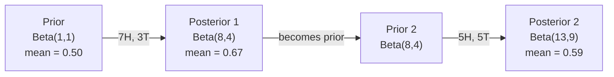

# Teorema de Bayes. La teoría de Bayes.

> La probabilidad es lo que esperas y el teorema de Bayes es lo que aprendes.
> La probabilidad depende de tus expectativas. La probabilidad depende de lo que has aprendido.

**Type:** Build | **类型:** 动手
**Language:**¿ Qué pasa ?**语言:**Python
**Prerequisites:** Phase 1, Lesson 06 (Probability Fundamentals) | **前置知识:** Phase 1, Lesson 06（概率基础）
**Time:** ~75 minutes | **时间:** ~75 分钟

## Objetivos de aprendizaje

- Aplicar el teorema de Bayes para calcular probabilidades posteriores a partir de antecedentes, probabilidades y evidencia
- Construir un clasificador de texto Bayes Ingenuo desde cero con Laplace suavización y cálculo de espacio log
- Comparar la estimación de MLE y MAP y explicar cómo el MAP corresponde a la regularización de L2
- Implementar actualizaciones bayesianas secuenciales utilizando los antecedentes conjugados beta-binomial para las pruebas A/B

> **【中文解读】**
> 贝叶斯定理的核心思想: Usando nuevas pruebas actualizar tu creencia──先验概率 (precedente de la conjetura) × 似然 (probabilidad de la aparición de la evidencia) = 后验概率 (precedente de la aparición de la evidencia) ─更新后的猜测──本章还从零构建简单贝叶斯文本分类器──

> **【拓展：贝叶斯在 AI 中的位置】**
> - **朴素贝叶斯分类器**El algoritmo clásico, aprender en el medio `GaussianNB`- ¿ Qué ?`MultinomialNB`¿Qué es eso?
> - **贝叶斯优化**En el caso de los usuarios de Internet, el contenido de los datos de Internet es el siguiente:
> - **MAP 与正则化**El precio de la MAP es igual a L2 y es "prevención de la sobreadaptación" desde el punto de vista de Bayes.

## El problema es la introducción del problema

> **【中文解读】**¿Cuál es la probabilidad de enfermedad real? ¿Intuitivamente dice que el 99%, pero con el cálculo de Beyes es posible sólo el 50% porque primero hay que considerar la "probabilidad de enfermedad previa" (la tasa de enfermedad es muy baja) 

## El concepto central.

> **【拓展：贝叶斯思维是 AI 的核心范式】** Bayes Resolución `P(假设|证据) = P(证据|假设) × P(假设) / P(证据)`En AI no hay nada:**朴素贝叶斯分类器**El método clásico de la basura es:**贝叶斯优化**:调超参数的高效方法(比网格搜索快 10 倍);(3) **MAP = L2 正则化**La mayor estimación posterior es equivalente a un aumento de L2 en el castigo, explicando desde el punto de vista de Bayes por qué la normalización puede ser más adecuada;**贝叶斯神经网络**:输出不确定性估计,知道"我不知道"──

La mayoría de la gente dice que el 99% de la respuesta real depende de lo rara que es la enfermedad. Si 1 de cada 10.000 personas la tienen, un resultado positivo sólo le da un 1% de probabilidad de enfermarse. El otro 99% de los resultados positivos son falsas alarmas de personas sanas.

> La mayoría de las personas dicen que el 99% de la respuesta real depende de la cantidad de enfermedades que hay. Si uno de mil personas tiene una enfermedad, el resultado positivo solo le da una probabilidad de enfermedad de aproximadamente el 1% de la población. El 99% restante de los resultados positivos son falsos positivos de las personas sanas.

Esta no es una pregunta de truco. Es el teorema de Bayes. Cada filtro de spam, cada diagnóstico médico, cada modelo de aprendizaje automático que cuantifica la incertidumbre utiliza este razonamiento exacto. Comienzas con una creencia. Ves evidencia. Actualizas.

> Esto no es un cambio de cerebro rápido. Es la teoría de Bayes. Cada filtro de basura, cada diagnóstico médico, cada modelo de aprendizaje de la incertidumbre, utiliza el mismo argumento:

Si construyes sistemas de inteligencia artificial sin entender esto, interpretarás mal las salidas del modelo, establecerás malos umbrales y enviarás predicciones demasiado confiadas.

> Si no entiendes esto en cuanto a construir un sistema de inteligencia artificial, te equivocarás en el modelo de salida, en la configuración de valores erróneos, en la publicación de previsiones de exceso de confianza.

## El concepto central.

### De probabilidad conjunta a Bayes

Ya sabes por la lección 06 que la probabilidad condicional es:

> En la clase 06 ya has aprendido las condiciones de probabilidad:

```
P(A|B) = P(A and B) / P(B)
```

Y simétricamente:

```
P(B|A) = P(A and B) / P(A)
```

Ambas expresiones comparten el mismo numerador: P(A y B.

> 两个 moléculas expresadas de la misma manera: P(A y B)。 las clasificarán igual y se volverán a clasificar:

```
P(A and B) = P(A|B) * P(B) = P(B|A) * P(A)

Therefore:

P(A|B) = P(B|A) * P(A) / P(B)
```

Eso es el teorema de Bayes. Cuatro cantidades, una ecuación.

> Éste es el teorema de Bayes.

### Las cuatro partes

| Part | Name | What it means |
|------|------|---------------|
| P(A\|B) | Posterior / 后验 | Your updated belief about A after seeing evidence B / 看到证据 B 后对 A 的更新信念 |
| P(B\|A) | Likelihood / 似然 | How probable the evidence B is if A is true / 如果 A 为真，证据 B 出现的概率 |
| P(A) | Prior / 先验 | Your belief about A before seeing any evidence / 看到任何证据前对 A 的信念 |
| P(B) | Evidence / 证据 | Total probability of seeing B under all possibilities / 在所有可能情况下看到 B 的总概率 |

El término prueba P(B) actúa como normalizador.

> 证据项 P(B) 作为归一化因子──可以用全概率公式展开:

```
P(B) = P(B|A) * P(A) + P(B|not A) * P(not A)
```

### Ejemplo de prueba médica

Una enfermedad afecta a 1 de cada 10.000 personas. La prueba es 99% exacta (captura al 99% de las personas enfermas, da falsos resultados en el 1% de las veces).

> Una enfermedad afecta a mil personas. Precisión del 99% de los pacientes, falsos resultados del 1% de los pacientes.

```
P(sick)          = 0.0001     (prior: disease is rare)
P(positive|sick) = 0.99       (likelihood: test catches it)
P(positive|healthy) = 0.01    (false positive rate)

P(positive) = P(positive|sick) * P(sick) + P(positive|healthy) * P(healthy)
            = 0.99 * 0.0001 + 0.01 * 0.9999
            = 0.000099 + 0.009999
            = 0.010098

P(sick|positive) = P(positive|sick) * P(sick) / P(positive)
                 = 0.99 * 0.0001 / 0.010098
                 = 0.0098
                 = 0.98%
```

Cuando una afección es rara, incluso las pruebas precisas producen en su mayoría falsos resultados positivos.

> No es hasta el 1%. La probabilidad de prueba previa es predominante. Cuando las enfermedades son raras, incluso los exámenes precisos también producen un falso positivo.

### Ejemplo de filtro de spam

Recibes un correo electrónico que contiene la palabra "lotería". ¿Es spam?

> ¿Has recibido un correo que contenía "lotería"?

```
P(spam)                = 0.3      (30% of email is spam)
P("lottery"|spam)      = 0.05     (5% of spam emails contain "lottery")
P("lottery"|not spam)  = 0.001    (0.1% of legitimate emails contain "lottery")

P("lottery") = 0.05 * 0.3 + 0.001 * 0.7
             = 0.015 + 0.0007
             = 0.0157

P(spam|"lottery") = 0.05 * 0.3 / 0.0157
                  = 0.955
                  = 95.5%
```

Una palabra cambia la probabilidad del 30% al 95.5%. Un verdadero filtro de spam aplica Bayes a cientos de palabras simultáneamente.

> Una palabra tendrá una probabilidad del 30% 推到95.5% ⋅ real basura correo filtrador simultáneamente transcenderá cientos de palabras aplicaciones ⋅

### Bayes ingenuo: suposición de independencia

Naive Bayes extiende esto a múltiples características asumiendo que todas las características son condicionalmente independientes dadas las clases:

> La simple abeja se extenderá a varias características, suponiendo que todas las características sean independientes entre sí en condiciones de una determinada clase:

```
P(class | feature_1, feature_2, ..., feature_n)
  = P(class) * P(feature_1|class) * P(feature_2|class) * ... * P(feature_n|class)
    / P(feature_1, feature_2, ..., feature_n)
```

La parte "ingenuo" es la suposición de independencia. En el texto, las ocurrencias de palabras no son independientes ("Nuevo" y "York" están correlacionados). Pero la suposición funciona sorprendentemente bien en la práctica porque el clasificador solo necesita clasificar clases, no producir probabilidades calibradas.

> La parte "pure" es una hipótesis de independencia. En el texto, la aparición de palabras no es independiente.

Dado que el denominador es el mismo para todas las clases, se puede saltar y simplemente comparar numeradores:

> Como las moléculas de las moléculas son iguales, se puede saltar por encima de ellas.

```
score(class) = P(class) * product of P(feature_i | class)
```

Elige la clase con la puntuación más alta.

> 选择得分最高的类──

### Estimación máxima de probabilidad (MLE)

¿Cómo obtienes P "feature" de los datos de entrenamiento?

> ¿Cómo obtener datos de formación en P                                                                                                                                                                                                                                                           

```
P("free"|spam) = (number of spam emails containing "free") / (total spam emails)
```

Esto es MLE: elija los valores de parámetros que hacen que los datos observados sean más probables. Estás maximizando la función de probabilidad, que para los recuentos discretos se reduce a la frecuencia relativa.

> Éste es MLE: la opción de hacer que los datos de observación aparezcan con mayor probabilidad.

Problema: si una palabra nunca aparece en el spam durante el entrenamiento, MLE le da probabilidad cero. Una palabra no vista mata todo el producto.

>  problema: si un término no aparece en el correo basura durante el entrenamiento, MLE le da la probabilidad de cero.

```
P(word|class) = (count(word, class) + 1) / (total_words_in_class + vocabulary_size)
```

Añadir 1 a cada cuenta asegura que ninguna probabilidad es cero.

> Dá cada cuento más 1                                                                                                                                                                                                                                                                                                                                                                                                                                                                                                                      

### El importe máximo a posteriori (MAP)

MLE pregunta: ¿qué parámetros maximizan los parámetros de datos P?

> MLE 问: ¿Qué parametros hacen que los parámetros de datos de P (P) sean máximos?

MAP pregunta: ¿qué parámetros maximizan los parámetros P  en los datos?

> ¿Qué parametros hacen que los parámetros de P (datos) max?

Por el teorema de Bayes:

> Según la teoría de Bayes:

```
P(parameters|data) proportional to P(data|parameters) * P(parameters)
```

MAP agrega un prior sobre los parámetros mismos. Si crees que los parámetros deben ser pequeños, codificas eso como un prior que penaliza valores grandes. Esto es idéntico a la regularización de L2 en ML. La penalización de "arido" en la regresión de la cresta es literalmente un prior gaussiano en los pesos.

> MAP añade una prioridad a los parámetros en el libro. Si crees que los parámetros deben ser más pequeños, usa la prioridad para castigar el valor de la gran cantidad. Esto es igual al precio de la L2 en el ML.

| Estimation | Optimizes | ML equivalent |
|------------|-----------|---------------|
| MLE | P(data\|params) | Unregularized training / 无正则化训练 |
| MAP | P(data\|params) * P(params) | L2 / L1 regularization / L2/L1 正则化 |

### Bayesiano vs frecuentista: la diferencia práctica

Los frecuentistas consideran que los parámetros son algo desconocido y preguntan: "Si repito este experimento muchas veces, ¿qué pasaría?"

> La frecuencia de la escuela considera que los parámetros son un número fijo de desconocidos. Ellos preguntan: "¿Qué pasaría si repito este experimento muchas veces?"

Los bayesianos tratan los parámetros como distribuciones. "¿Qué creo de los parámetros, dada la observación que he hecho?"

> Los estudiantes de Beyaz estudian los parámetros como distribuidos. Ellos preguntan: "¿De acuerdo con lo que observé, tengo alguna creencia en los parámetros?"

Para la construcción de sistemas ML, la diferencia práctica:

> Para la construcción de sistemas de gestión de datos, la diferencia real es:

| Aspect | Frequentist | Bayesian |
|--------|-------------|----------|
| Output | Point estimate / 点估计 | Distribution over values / 值的分布 |
| Uncertainty | Confidence intervals (about procedure) / 置信区间（关于过程） | Credible intervals (about parameter) / 可信区间（关于参数） |
| Small data | Can overfit / 可能过拟合 | Prior acts as regularization / 先验充当正则化 |
| Computation | Usually faster / 通常更快 | Often requires sampling (MCMC) / 通常需要采样（MCMC） |

La mayoría de los métodos de producción de ML son frecuentistas (SGD, estimaciones de puntos). Los métodos bayesianos brillan cuando se necesita incertidumbre calibrada (decisiones médicas, sistemas críticos para la seguridad) o cuando los datos son escasos (aprendizaje a pocos disparos, arranque en frío).

> La mayoría de la producción de ML es de frecuencia de la escuela de la (SGD 点估计) ⋅ cuando usted necesita la calificación de la incertidumbre ⋅ decisiones médicas ⋅ sistemas clave de seguridad ⋅ datos raros ⋅ cuando poco muestra de aprendizaje ⋅ frío iniciación ⋅ cuando el método de Beyes se manifiesta en color ⋅

### Por qué el pensamiento bayesiano es importante para la ML

La conexión es más profunda que la analogía:

> Este tipo de contacto es más profundo que el tipo:

**Priors are regularization.**Un previo gaussiano en pesas es la regularización L2. Un previo de Laplace es L1. Cada vez que añades un término de regularización, estás haciendo una declaración bayesiana sobre qué valores de parámetros esperas.

> **先验就是正则化。**El prejuicio de la altura en el peso es L2 normalización, el prejuicio de la rapra es L1── cada vez que se añade normalización, se hace una declaración de Bayes sobre el valor esperado de la parámetro──

**Posteriors are uncertainty.**Una sola probabilidad prevista no le dice nada sobre lo seguro que es el modelo en esa estimación. Los métodos bayesianos le dan una distribución: "Creo que P(spam) es entre 0,8 y 0,95. "

> **后验就是不确定性。**单个预测概率不能 decir que el modelo tiene mucha confianza en esta estimación.

**Bayes updates are online learning.**El posterior de hoy se convierte en el anterior de mañana. Cuando tu modelo ve nuevos datos, actualiza sus creencias incrementalmente en lugar de reentrenarse desde cero.

> **贝叶斯更新就是在线学习。**La experiencia de hoy se convierte en la experiencia de mañana. Cuando el modelo ve nuevos datos, aumenta la creencia en lugar de volver a entrenar.

**Model comparison is Bayesian.**El criterio de información bayesiano (BIC), la probabilidad marginal y los factores de Bayes utilizan el razonamiento bayesiano para elegir entre modelos sin sobreajuste.

> **模型比较是贝叶斯的。**贝叶斯信息准则 (BIC) 边际似然和贝叶斯因子都使用贝叶斯推理来选择模型之间而不会导致过合适――

## Construye y realiza.
```figure
bayes-update
```

## Construye el mismo

### Paso 1: Función del teorema de Bayes

```python
def bayes(prior, likelihood, false_positive_rate):
    evidence = likelihood * prior + false_positive_rate * (1 - prior)
    posterior = likelihood * prior / evidence
    return posterior

result = bayes(prior=0.0001, likelihood=0.99, false_positive_rate=0.01)
print(f"P(sick|positive) = {result:.4f}")
```

### Paso 2: Clasificador Bayes Ingenuo

```python
import math
from collections import defaultdict

class NaiveBayes:
    def __init__(self, smoothing=1.0):
        self.smoothing = smoothing
        self.class_counts = defaultdict(int)
        self.word_counts = defaultdict(lambda: defaultdict(int))
        self.class_word_totals = defaultdict(int)
        self.vocab = set()

    def train(self, documents, labels):
        for doc, label in zip(documents, labels):
            self.class_counts[label] += 1
            words = doc.lower().split()
            for word in words:
                self.word_counts[label][word] += 1
                self.class_word_totals[label] += 1
                self.vocab.add(word)

    def predict(self, document):
        words = document.lower().split()
        total_docs = sum(self.class_counts.values())
        vocab_size = len(self.vocab)
        best_class = None
        best_score = float("-inf")
        for cls in self.class_counts:
            score = math.log(self.class_counts[cls] / total_docs)
            for word in words:
                count = self.word_counts[cls].get(word, 0)
                total = self.class_word_totals[cls]
                score += math.log((count + self.smoothing) / (total + self.smoothing * vocab_size))
            if score > best_score:
                best_score = score
                best_class = cls
        return best_class
```

Las probabilidades de registro evitan el flujo inferior. Multiplicar muchas probabilidades pequeñas produce números demasiado pequeños para un punto flotante. Sumar las probabilidades de registro es numéricamente estable y matemáticamente equivalente.

> Para evitar que la probabilidad de números se desplome. Muchas pequeñas probabilidades multiplicadas producen números demasiado pequeños para el número de puntos de desplome.

### Paso 3: Entrenamiento en datos de spam

```python
train_docs = [
    "win free money now",
    "free lottery ticket winner",
    "claim your prize today free",
    "urgent offer free cash",
    "congratulations you won free",
    "meeting tomorrow at noon",
    "project update attached",
    "can we schedule a call",
    "quarterly report review",
    "lunch on thursday sounds good",
    "team standup notes attached",
    "please review the pull request",
]

train_labels = [
    "spam", "spam", "spam", "spam", "spam",
    "ham", "ham", "ham", "ham", "ham", "ham", "ham",
]

classifier = NaiveBayes()
classifier.train(train_docs, train_labels)

test_messages = [
    "free money waiting for you",
    "meeting rescheduled to friday",
    "you won a free prize",
    "please review the attached report",
]

for msg in test_messages:
    print(f"  '{msg}' -> {classifier.predict(msg)}")
```

### Paso 4: Inspeccionar las probabilidades aprendidas

```python
def show_top_words(classifier, cls, n=5):
    vocab_size = len(classifier.vocab)
    total = classifier.class_word_totals[cls]
    probs = {}
    for word in classifier.vocab:
        count = classifier.word_counts[cls].get(word, 0)
        probs[word] = (count + classifier.smoothing) / (total + classifier.smoothing * vocab_size)
    sorted_words = sorted(probs.items(), key=lambda x: x[1], reverse=True)
    for word, prob in sorted_words[:n]:
        print(f"    {word}: {prob:.4f}")

print("\nTop spam words:")
show_top_words(classifier, "spam")
print("\nTop ham words:")
show_top_words(classifier, "ham")
```

## Usalo con el marco de ejecución

Navios barcos de aprendizaje de la producción implementaciones Bayes:

> El aprendizaje de la lengua se ha convertido en una práctica simple de la producción.

```python
from sklearn.feature_extraction.text import CountVectorizer
from sklearn.naive_bayes import MultinomialNB
from sklearn.metrics import classification_report

vectorizer = CountVectorizer()
X_train = vectorizer.fit_transform(train_docs)
clf = MultinomialNB()
clf.fit(X_train, train_labels)

X_test = vectorizer.transform(test_messages)
predictions = clf.predict(X_test)
for msg, pred in zip(test_messages, predictions):
    print(f"  '{msg}' -> {pred}")
```

El algoritmo es el mismo. CountVectorizer maneja la tokenización y la construcción de vocabulario. MultinomialNB maneja la suavización y las probabilidades de registro internamente. Su versión desde cero hace lo mismo en 40 líneas.

> Igual algoritmo―CountVectorizer 处理分词和词汇构建,MultinomialNB 内部处理平滑和对数概率―Su versión desde 0 hace lo mismo con 40 行―

## Envíe el producto .

La clase NaiveBayes construida aquí demuestra la línea completa: tokenización, estimación de probabilidad con suavizamiento de Laplace, predicción del espacio log.`code/bayes.py`se ejecuta de extremo a extremo sin dependencias más allá de la biblioteca estándar de Python.

> En este caso, la clase NaiveBayes construida en el sitio web muestra un proceso completo:`code/bayes.py`El código central de extremo a extremo se ejecuta, sin necesidad de Python 标准库以外的依赖──

### Los antecesores conjuntos

Cuando el anterior y posterior pertenecen a la misma familia de distribuciones, el anterior se llama "conjugado". Esto hace que la actualización bayesiana sea algebraicamente limpia - obtienes un posterior de forma cerrada sin integración numérica.

> Cuando los primeros y los últimos experimentos pertenecen a la misma distribución, los primeros experimentos se llaman "comúnes". Esto permite que los cambios en los átomos sean muy simples y no requieran un valor numérico.

| Likelihood | Conjugate Prior | Posterior | Example |
|-----------|----------------|-----------|---------|
| Bernoulli | Beta(a, b) | Beta(a + successes, b + failures) | Coin flip bias estimation / 抛硬币偏差估计 |
| Normal (known variance) | Normal(mu_0, sigma_0) | Normal(weighted mean, smaller variance) | Sensor calibration / 传感器校准 |
| Poisson | Gamma(a, b) | Gamma(a + sum of counts, b + n) | Modeling arrival rates / 建模到达率 |
| Multinomial | Dirichlet(alpha) | Dirichlet(alpha + counts) | Topic modeling, language models / 主题建模，语言模型 |

Por qué esto importa: sin antecedentes conjugados, se necesita muestreo de Monte Carlo o inferencia variativa para aproximar el posterior.

> Por qué es importante: no hay un común previo, necesitas un modelo de cálculo o una hipótesis de variación para un posterior aproximado.

La distribución Beta es el conjugado anterior más común en la práctica. Beta(a, b) representa su creencia sobre un parámetro de probabilidad. La media es a/(a+b).

> Beta 分布是实践中最常用的共先验──Beta, b) Expresar tu creencia en un parámetro de probabilidad── el promedio es a/(a+b)──a+b 越大,分布越集中(越自信)──

Casos especiales del Beta anterior:
- Beta(1, 1) = uniforme. No tienes opinión sobre el parámetro.
  En la actualidad, el número de parámetros es de un tamaño muy bajo.
- Beta(10, 10) = alcanzó el máximo de 0.5.
  En el punto de 0.5 en la cima, usted considera que el parámetro se acerca a 0.5 .
- Beta(1, 10) = sesgado hacia 0. Crees que el parámetro es pequeño.
  En inglés, el número de puntos es muy pequeño.

La regla de actualización es muy simple:

> 更新规则极其简单:

```
Prior:     Beta(a, b)
Data:      s successes, f failures
Posterior: Beta(a + s, b + f)
```

No hay integrales, no muestreo, sólo suma.

> 无需积分,无需采样, sólo necesita más法──

### Actualización Bayesiana secuencial

La inferencia bayesiana es naturalmente secuencial. El posterior de hoy se convierte en el anterior de mañana. Así es como los sistemas reales aprenden incrementalmente sin volver a procesar todos los datos históricos.

> 贝叶斯 deduce que el proceso natural es continuo. Hoy, el pasado se convierte en el futuro. Así es como el sistema real aumenta el aprendizaje sin procesar todos los datos históricos.

Ejemplo concreto: estimar si una moneda es justa.

> 具体例: estimate de si una moneda es justa o no.

**Day 1: No data yet.**
Comience con Beta ((1, 1) -- un prior uniforme. No tienes opinión.
- Mediano anterior: 0,5
- El Prior es plano en el [0, 1]

> **第 1 天：还没有数据。**Desde Beta(1, 1) 开始均先验,你没有预设观点──

**Day 2: Observe 7 heads, 3 tails.**
Posterior = Beta(1 + 7, 1 + 3) = Beta(8, 4)
- Media posterior: 8/12 = 0,667
- La evidencia sugiere que la moneda está sesgada hacia las cabezas

> **第 2 天：观察到 7 次正面，3 次反面。**后验 = Beta(8, 4), promedio de 0,667, evidencia indica que la moneda se encuentra en la dirección correcta.

**Day 3: Observe 5 more heads, 5 more tails.**
Usa el posterior de ayer como el anterior de hoy.
Posterior = Beta(8 + 5, 4 + 5) = Beta(13, 9)
- Mediano posterior: 13/22 = 0,591
- Los nuevos datos equilibrados retrasaron la estimación hacia 0,5

> **第 3 天：又观察 5 次正面，5 次反面。**Utilizando los resultados de ayer como los resultados de hoy, el valor promedio será de 0,591 y el nuevo dato de equilibrio será de 0,5 y el valor estimado será de 0,591.



El orden de las observaciones no importa. Beta(1,1) actualizado con las 12 cabezas y 8 colas a la vez da Beta(13, 9) - el mismo resultado. Actualización secuencial y actualización de lote son matemáticamente equivalentes. Pero la actualización secuencial le permite tomar decisiones en cada paso sin almacenar datos brutos.

> 观测序无关紧要──Beta(1,1) Una vez se utiliza todo 12 veces positiva y 8 veces negativa actualización obtiene Beta(13, 9) El mismo resultado──序贯更新和批量更新在数学上等价──但序贯更新让你可以在每步做决策而无需存储原始数据──

Esta es la base del aprendizaje en línea en los sistemas ML de producción.

> Esta es la base del aprendizaje en línea en el sistema de producción de máquinas de juego.

### Conexión a las pruebas A/B

Las pruebas A/B son inferencias bayesianas disfrazadas.

> A/B 测试就是假装的贝叶斯推──

Configuración: está probando dos colores de botones: variante A (azul) y variante B (verde).

> 设置:你在测试两种按颜色──变体 A(蓝色) 和变体 B(绿色)──你想知道哪个获得更多点击──

El ensayo Bayesiano A/B:

> 贝叶斯 A/B 测试步骤:

1. **Prior.**Comience con Beta(1, 1) para ambas variantes.
2. **Data.**La variante A: 50 clics de 1000 vistas. La variante B: 65 clics de 1000 vistas.
3. **Posteriors.**
   - A: Beta(1 + 50, 1 + 950) = Beta(51, 951).
   - B: Beta(1 + 65, 1 + 935) = Beta(66, 936). media = 0,066
4. **Decision.**Computa P ((B > A) -- la probabilidad de que la tasa de conversión verdadera de B es mayor que la de A.

Computación P ((B > A) analíticamente es difícil. Pero Monte Carlo lo hace trivial:

> 解析计算 P(B > A) 很难――但蒙特卡洛让这变得轻松而易举:

```
1. Draw 100,000 samples from Beta(51, 951)  -> samples_A
2. Draw 100,000 samples from Beta(66, 936)  -> samples_B
3. P(B > A) = fraction of samples where B > A
```

Si P(B > A) > 0,95, envías la variante B. Si está entre 0,05 y 0,95, sigues recopilando datos. Si P(B > A) < 0,05, envías la variante A.

> Si P(B > A) > 0.95, publicar el cambio B。 Si entre 0.05 y 0.95 ∞, continuar recopilando datos。 Si P(B > A) < 0.05, publicar el cambio A。

Ventajas sobre las pruebas A/B frecuentes:
- Obtienes una declaración de probabilidad directa: "hay un 97% de probabilidad de que B sea mejor"
  China: You get a direct probability: "B mejor probabilidad es el 97%".
- No hay confusión de valor p, no hay cobertura de "no rechazar la hipótesis nula".
  No hay ninguna duda sobre la existencia de una realidad que no puede ser aceptada.
- Puede comprobar los resultados en cualquier momento sin inflar tasas falsas positivas (sin "problema de búsqueda")
  China: puedes ver los resultados en cualquier momento sin aumentar la tasa de falsos positivos.
- Puede incorporar conocimientos previos (por ejemplo, pruebas anteriores sugieren que las tasas de conversión son generalmente de 3-8%)
  Por ejemplo, los test anteriores muestran que la tasa de conversión suele estar en 3-8%.

| Aspect | Frequentist A/B | Bayesian A/B |
|--------|----------------|--------------|
| Output | p-value / p 值 | P(B > A) |
| Interpretation | "How surprising is this data if A=B?" / "如果 A=B，数据有多令人惊讶？" | "How likely is B better than A?" / "B 比 A 好的可能性有多大？" |
| Early stopping | Inflates false positives / 会增加假阳性 | Safe at any point (given a well-chosen prior and correctly specified model) / 随时安全（假设先验选择合理且模型正确） |
| Prior knowledge | Not used / 不使用 | Encoded as Beta prior / 编码为 Beta 先验 |
| Decision rule | p < 0.05 | P(B > A) > threshold / P(B > A) > 阈值 |

## Los ejercicios.

1. **Multiple tests.**Un paciente prueba positivo dos veces en pruebas independientes (ambas son 99% precisas, la prevalencia de la enfermedad es de 1 en 10.000). ¿Qué es P(enfermo) después de ambas pruebas?

2. **Smoothing impact.**¿Cómo cambian las probabilidades de la palabra superior? ¿Qué sucede con la palabra que aparece sólo en jamón?

3. **Add features.**Extenda la clase NaiveBayes para que también utilice la longitud del mensaje (corto/largo) como una característica junto con el conteo de palabras. Estima P(short dizerspam) y P(short dizerham) a partir de los datos de entrenamiento y dobla en la puntuación de predicción.

4. **MAP by hand.**Dados los datos observados (7 cabezas en 10 lanzamientos de moneda), calcular la estimación de MAP del sesgo utilizando un Beta(2,2) anterior.

## Términos clave .

| Term | What people say | What it actually means |
|------|----------------|----------------------|
| Prior | "My initial guess" / "我的初始猜测" | P(hypothesis) before observing evidence. In ML: the regularization term. / 观测证据前的 P(hypothesis)。在 ML 中：正则化项。 |
| Likelihood | "How well the data fits" / "数据拟合得好不好" | P(evidence\|hypothesis). How probable the observed data is under a specific hypothesis. / 在特定假设下观测数据的概率。 |
| Posterior | "My updated belief" / "我的更新信念" | P(hypothesis\|evidence). The prior multiplied by the likelihood, then normalized. / 先验乘以似然再归一化。 |
| Evidence | "The normalizing constant" / "归一化常数" | P(data) across all hypotheses. Ensures the posterior sums to 1. / 所有假设下 P(data) 的总和，确保后验求和为 1。 |
| Naive Bayes | "That simple text classifier" / "那个简单的文本分类器" | A classifier that assumes features are independent given the class. Works well despite the false assumption. / 假设特征在给定类别下独立的分类器，尽管假设不成立但效果很好。 |
| Laplace smoothing | "Add-one smoothing" / "加一平滑" | Adding a small count to every feature to prevent zero probabilities from unseen data. / 给每个特征加一个小计数以防止未见数据的零概率。 |
| MLE | "Just use the frequencies" / "直接用频率" | Choose parameters that maximize P(data\|parameters). No prior. Can overfit with small data. / 选择使 P(data\|parameters) 最大的参数。无先验，小数据可能过拟合。 |
| MAP | "MLE with a prior" / "带先验的 MLE" | Choose parameters that maximize P(data\|parameters) * P(parameters). Equivalent to regularized MLE. / 选择使 P(data\|parameters) * P(parameters) 最大的参数，等价于正则化 MLE。 |
| Log-probability | "Work in log space" / "在对数空间计算" | Using log(P) instead of P to avoid floating-point underflow when multiplying many small numbers. / 用 log(P) 代替 P，避免许多小数相乘时的浮点下溢。 |
| False positive | "A wrong alarm" / "错误警报" | The test says positive, but the true state is negative. Drives the base rate fallacy. / 检测为阳性但实际为阴性，是基本比率谬误的根源。 |

## Más Leer más Leer más

- [3Blue1Brown: Bayes' theorem](https://www.youtube.com/watch?v=HZGCoVF3YvM)- explicación visual con el ejemplo del examen médico
- [Stanford CS229: Generative Learning Algorithms](https://cs229.stanford.edu/notes2022fall/cs229-notes2.pdf)- Bayes ingenuo y su conexión con modelos discriminatorios
- [Think Bayes](https://greenteapress.com/wp/think-bayes/)- libro gratuito, estadísticas bayesianas con código Python
- [scikit-learn Naive Bayes](https://scikit-learn.org/stable/modules/naive_bayes.html)- las implementaciones de la producción y cuándo utilizar cada variante
