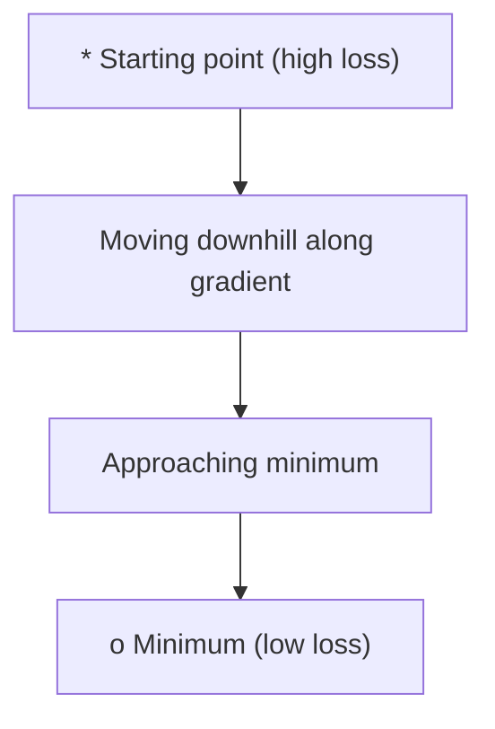
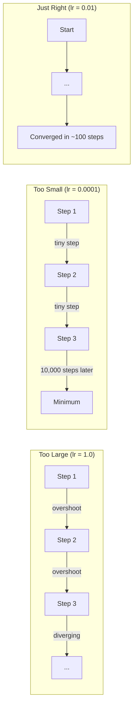
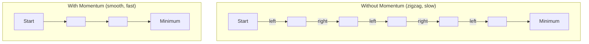
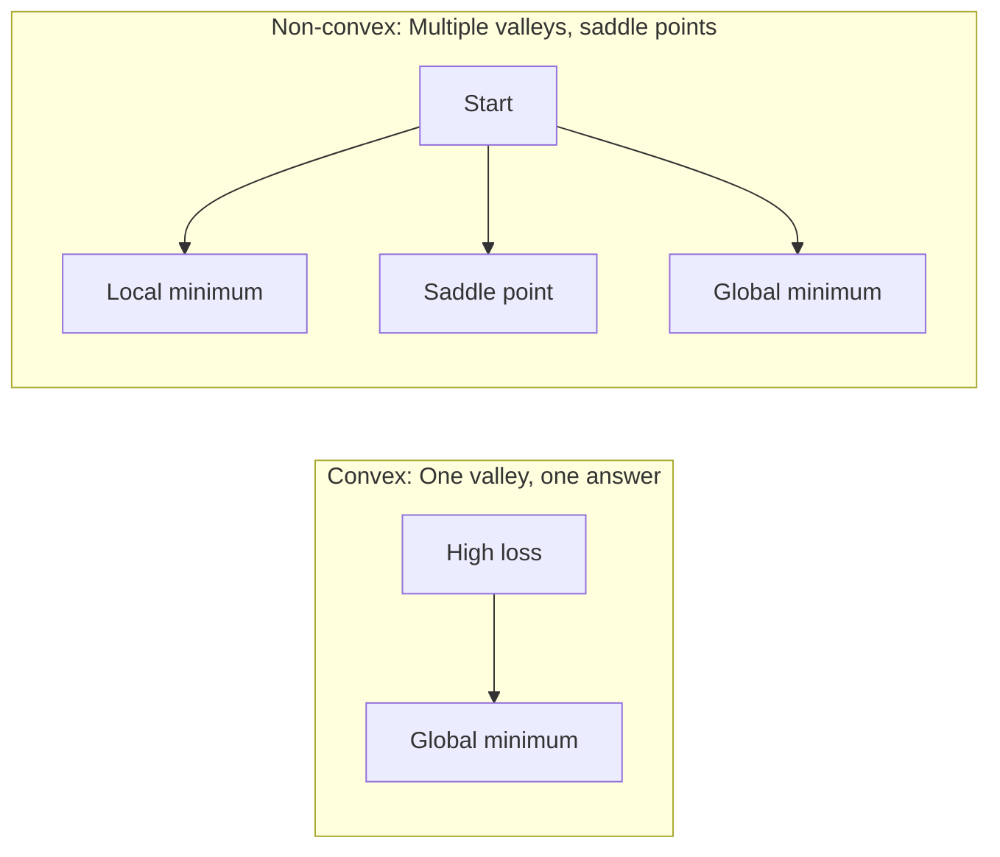
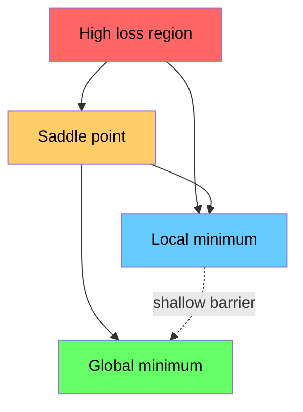

# Optimización .

> Entrenar una red neuronal no es más que encontrar el fondo de un valle.
> El entrenamiento de la red neuronal no es más que encontrar el punto más bajo del valle.

**Type:** Build | **类型:** 动手
**Language:**¿ Qué pasa ?**语言:**Python
**Prerequisites:** Phase 1, Lessons 04-05 (Derivatives, Gradients) | **前置知识:** Phase 1, Lessons 04-05 (Derivatives, Gradients)
**Time:** ~75 minutes | **时间:** ~75 分钟

## Objetivos de aprendizaje

- Implemente el descenso de la gradiente de vainilla, SGD con impulso, y Adam desde cero
  Desde el 0 hasta la realización de la escala inicial de baja, la SGD y la Adam  optimizador
- Comparar la convergencia de optimizador en la función Rosenbrock y explicar por qué Adam adapta las tasas de aprendizaje por peso
  En la función Rosenbrock  en comparación de la capacidad de optimizador, explicar por qué Adam para cada peso de autoadaptación de la tasa de aprendizaje
- Distinguir entre los paisajes convexos y los paisajes de pérdidas no convexos y explicar el papel de los puntos de silla en dimensiones altas
  区分凸与非凸损曲面, explicación del papel de los puntos en el espacio
- Configurar los horarios de la tasa de aprendizaje (desintegración en etapas, anulación cosina, calentamiento) para la estabilidad del entrenamiento
  配置学习率调度(步衰减、余弦退火、预热) para garantizar la estabilidad del entrenamiento

> **【中文解读】**
> 训练神经网络就是"寻找山谷最低点"――la función de pérdida te dice que hay muchos errores en el presente, la gradiencia te dice en qué dirección puede hacer que los errores sean más pequeños, el optimizador decide cómo caminar―.

> **【拓展：优化器在 AI 中的位置】**
> - **SGD**: 最基础优化器, los "ancestros" de todos los optimizadores.
> - **Adam**El mejor sistema de aprendizaje de la actualidad, el índice de adaptación + la cantidad de movimientos, se ha convertido en una opción casi de uso común.
> - **学习率调度**El entrenamiento inicial utiliza el gran paso largo rápido cerca de lo mejor, el último utiliza el pequeño paso largo con el ajuste detallado.

## El problema es la introducción del problema

Tienes una función de pérdida que te dice lo mal que es tu modelo tienes gradientes que te dicen en qué dirección empeora la pérdida ahora necesitas una estrategia para caminar bajando la colina

> Tu tienes una función de pérdida, te dice que el modelo es diferente. Tienes una tendencia, te dice en qué dirección hacer que la pérdida sea mayor. Ahora necesitas una estrategia para ir al fondo.

El enfoque ingenuo es simple: moverse en contra del gradiente. Escala el paso por algún número llamado la tasa de aprendizaje. Repito, ¿qué quieres? Esto es un descenso de gradiente, y funciona. Pero "trabajos" tiene advertencias. Una tasa de aprendizaje demasiado alta y se sobrepasa el valle por completo, saltando entre paredes. Demasiado pequeño y te arrastras hacia la respuesta a través de miles de pasos innecesarios. Golpea un punto de silla y deja de moverse aunque no haya encontrado un mínimo.

> El método es simple: se mueve en la escala en dirección opuesta, el paso se repite en el control del ritmo de aprendizaje. Pero "facil" es condicional: el ritmo de aprendizaje es demasiado alto, saltarás por el fondo del valle entre dos muros y volverás a temblar.

Cada optimizador en el aprendizaje profundo es una respuesta a la misma pregunta: ¿cómo llegar al fondo del valle más rápido y confiable?

> Cada optimizador del aprendizaje profundo está respondiendo a la misma pregunta: ¿cómo llegar más rápido, más confiable al fondo del valle?

> **【中文解读】**Tu tienes una función de pérdida (tu tienes una función de pérdida) y un grado (tu tienes un grado de pérdida) (tu tienes un grado de pérdida) (tu tienes un grado de pérdida) (tu tienes un grado de pérdida) (tu tienes un grado de pérdida) (tu tienes un grado de pérdida) (tu tienes un grado de pérdida) (tu tienes un grado de pérdida) (tu tienes un grado de pérdida) (tu tienes un grado de pérdida) (tu tienes un grado de pérdida) (tu tienes un grado de pérdida) (tu tienes un grado de pérdida) (tu tienes un grado de pérdida) (tu tienes un grado de pérdida) (tu tienes un grado de pérdida) (tu tienes un grado de pérdida) (tu tienes un grado de pérdida) (tu tienes un grado de pérdida) (tu tienes un grado de pérdida) (tu tienes un grado de pérdida) (tu tienes un grado de pérdida) (tu tienes un grado de pérdida) (tu tienes un grado de pérdida) (tu tienes un grado de pérdida) (tu tienes un grado de pérdida) (tu tienes un grado de pérdida) (tu tienes un grado de pérdida) (tu tienes un grado de pérdida) (tu tienes un grado de pérdida) (tu tienes un grado de pérdida) (tu tienes un grado de pérdida) (tu tienes un grado de pérdida) (tu tienes un grado de pérdida) (tu tienes un mínimo) (tu tienes un mínimo) (tu tienes un mínimo) (tu tienes un mínimo) (tu tienes un mínimo) (tu tienes un mínimo) (tu tienes un mínimo) (tu) (tu) (tu) (tu) (tu) (tu) (tu) (tu) (tu) (tu) (tu) (tu) (tu) (tu) (tu) (tu) (tu) (tu) (tu) (tu) (tu) (tu) (tu) (tu) (tu) (tu) (tu) (tu) (tu) (tu) (tu) (tu) (tu) (tu) (tu) (tu) (tu) (tu) (tu) (tu) (tu) (tu) (tu) (tu) (tu) (tu) (tu) (tu

## El concepto central.

### ¿Qué significa optimización? ¿Qué es optimización?

La optimización es encontrar los valores de entrada que minimizan (o maximizan) una función. En el aprendizaje automático, la función es la pérdida. Las entradas son los pesos del modelo.

> 优化就是找到使函数最小化 (±最大化) 的输入值──在机器学习中,函数是损失函数,输入是模型权重──训练就是优化──

```
minimize L(w) where:
  L = loss function
  w = model weights (could be millions of parameters)
```

> **【拓展：优化是机器学习的引擎】**訓練 = 優化──GPT-4 訓練過程就是: con una función de pérdida de 1.8 millones de parámetros, a través de Adam 优化器代调整参数, hacer que la predicción sea más exacta── entrenar un transformador grande puede requerir 10^20 veces FLOPS de cálculo, pero el núcleo es la operación de repetirse `w = w - lr * gradient`¿Qué es eso?

### Descenso gradual (vanilla) 梯度下降 (también conocido como "descenso gradual")

El optimizador más simple: calcular el gradiente de la pérdida con respecto a cada peso. mover cada peso en la dirección opuesta a su gradiente. Escala el paso por la tasa de aprendizaje.

> La pérdida de peso en cada uno de los niveles, movimiento en dirección opuesta, control de la tasa de aprendizaje.

```
w = w - lr * gradient
```

Es todo el algoritmo.

> Éste es el algoritmo completo.

> **【中文解读】**梯度下降: calcular pérdida por cada escala de peso, en dirección contraria, paso a paso, paso a paso por el control de la tasa de aprendizaje.`w = w - lr * gradient`, un camino completo. Intuito: Montonado a la vista, cada paso está hacia el más profundo de la ladera.



### Rate de aprendizaje: el hiperparámetro más importante.

La tasa de aprendizaje controla el tamaño de los pasos. Determina todo acerca de la convergencia.

> El control de la tasa de aprendizaje, el tiempo de decisión de todo.



No hay una fórmula para la tasa de aprendizaje correcta. Lo encontramos por experimento. puntos de partida comunes: 0,001 para Adam, 0,01 para SGD con impulso.

> 没有公式能告诉你正确的学习率──你只能通过实验找到──常见起点:Adam utiliza 0.001,SGD con impulso utiliza 0.01──

> **【拓展：学习率选择的实践指南】**El índice de aprendizaje es el más difícil de regular. La ley de experiencia es: desde 0.001 开始 ([[Adán]]s默认值), observar el entrenamiento de la línea de formación.

### SGD vs lote vs mini lote . SGD vs lote completo vs lote pequeño

La descenda del gradiente de vainilla calcula el gradiente de todo el conjunto de datos antes de dar un paso. Esto se llama descenda del gradiente de lote. Es estable pero lento.

> El primer nivel se reduce con todo el nivel de cálculo de datos antes de un paso siguiente. Esto se llama nivel de baja de la cantidad, estable pero lento.

El descenso de gradiente estocástico (SGD) calcula el gradiente en una sola muestra aleatoria y pasa inmediatamente.

> 随机梯度下降 (SGD) en un solo ejemplar de随机, se actualiza inmediatamente después de la escala calculada.

El descenso de gradiente de mini lote divide la diferencia. Calcule el gradiente en un lote pequeño (32, 64, 128, 256 muestras), luego paso. Esto es lo que todos utilizan realmente.

> Programa de reducción de la cantidad de datos: con una pequeña cantidad de datos (32、64、128、256 个样本) calcula la cantidad de datos después de actualizarse.

| Variant | Batch size | Gradient quality | Speed per step | Noise |
|---------|-----------|-----------------|---------------|-------|
| Batch GD / 全批量 | Entire dataset | Exact / 精确 | Slow / 慢 | None / 无 |
| SGD / 随机 | 1 sample | Very noisy / 噪声大 | Fast / 快 | High / 高 |
| Mini-batch / 小批量 | 32-256 | Good estimate / 好的估计 | Balanced / 均衡 | Moderate / 中等 |

El ruido en SGD y mini-batch no es un error, ayuda a escapar de mínimos locales superficiales y puntos de silla.

> SGD y el ruido en la pequeña cantidad no son errores, sino que ayuda a escapar de los niveles bajos de la zona.

> **【中文解读】**Tres tipos de escala: 1) Toda la cantidad de datos con un solo escala, pero lento; 2) SGD con una escala de datos rápida pero ruidosa; 3) Lado pequeño con 32/64/256 datos. En realidad, casi todos los entrenamientos de IA usan una pequeña cantidad de datos, el tamaño del lote es otro elemento clave.

### El impulso: la pelota rodando abajo la colina

El descenso del gradiente de vainilla sólo mira el gradiente actual. Si el gradiente zigzag (común en valles estrechos), el progreso es lento.

> El progreso es lento, pero el proceso de movimiento se ha ido acumulando hasta alcanzar la velocidad para resolver este problema.

```
v = beta * v + gradient
w = w - lr * v
```

La analogía: una bola rodando hacia abajo. No se detiene y reinicia en cada golpe.

> 类比: la bola se arrolla desde la ladera baja. No se detiene en cada posición de la ladera.



`beta`La beta más alta significa más impulso, caminos más suaves, pero una respuesta más lenta a los cambios de dirección.

> `beta`(normalmente 0.9) control conservan mucho tiempo. Beta más alta significa mayor movimiento, más suave, pero la respuesta a los cambios de dirección es más lenta.

> **【拓展：动量在深度学习中的效果】**动量法让优化"记住" anterior direcciones, como la bola roll down mountain坡 积累动能. 优惠: (1) 加速通过平坦区域; (2) 抑制震荡.`torch.optim.SGD(lr=0.1, momentum=0.9)`El impulso = 0,9 es una configuración habitual.

### Adam: Tajas de aprendizaje adaptativas Adam: Tajas de aprendizaje adaptativas

Los diferentes pesos necesitan diferentes tasas de aprendizaje. Un peso que rara vez tiene grandes gradientes debe dar pasos más grandes cuando finalmente lo haga. Un peso que recibe grandes gradientes constantemente debe dar pasos más pequeños.

> Los diferentes pesos requieren diferentes tasas de aprendizaje. Pocos pocos pasos deben ser realizados para obtener un mayor peso, y los pasos continuos de un mayor peso deben ser realizados para obtener un menor peso.

Adam (estimación de momento adaptativo) rastrea dos cosas por peso:
  Adam (en inglés) tiene dos dimensiones para cada uno de ellos:

1. Primero momento (m): promedio corriente de los gradientes (como el momento)
   Un阶矩 (m): gradiente de movimiento medio
2. Segundo momento (v): promedio corriente de los gradientes al cuadrado (magnitud de gradiente)
   Segundo grado (v): gradiente cuadrado de movimiento medio

```
m = beta1 * m + (1 - beta1) * gradient
v = beta2 * v + (1 - beta2) * gradient^2

m_hat = m / (1 - beta1^t)    bias correction
v_hat = v / (1 - beta2^t)    bias correction

w = w - lr * m_hat / (sqrt(v_hat) + epsilon)
```

La división por `sqrt(v_hat)`Los pesos con grandes gradientes se dividen por un número grande (pequeño paso efectivo). los pesos con pequeños gradientes se dividen por un número pequeño (pequeño paso efectivo). cada peso obtiene su propia tasa de aprendizaje adaptativa.

> Además de`sqrt(v_hat)`Es importante que el peso de un gran nivel sea elevado a un gran número de veces, pero también a un pequeño nivel.

Hiperparámetros por defecto: `lr=0.001, beta1=0.9, beta2=0.999, epsilon=1e-8`Estos valores defectuosos funcionan bien para la mayoría de los problemas.

> 默认超参数:`lr=0.001, beta1=0.9, beta2=0.999, epsilon=1e-8` Estos valores imperativos son válidos para la mayoría de los problemas

> **【中文解读】**Adam = Momentum + Autoadaptation learning rate── se utiliza para cada parámetro mantener la "velocidad" independiente, según la escala histórica, ajustar automáticamente el paso largo──grado de parámetro de gran escala, escala de parámetro de pequeño escala.`torch.optim.Adam(lr=0.001)`Es casi una elección de hecho.

### Los horarios de la tasa de aprendizaje

Una tasa de aprendizaje fija es un compromiso. Al principio del entrenamiento, se quieren grandes pasos para progresar rápidamente.

> Fixed learning rate is a fold-in scheme── la formación inicial necesita un gran progreso rápido, la formación posterior necesita un pequeño ajuste detallado──

Horarios comunes:
  常见调度方式:

| Schedule / 调度方式 | Formula / 公式 | Use case / 使用场景 |
|----------|---------|----------|
| Step decay / 步衰减 | lr = lr * factor every N epochs | Simple, manual control / 简单手动控制 |
| Exponential decay / 指数衰减 | lr = lr_0 * decay^t | Smooth reduction / 平滑递减 |
| Cosine annealing / 余弦退火 | lr = lr_min + 0.5 * (lr_max - lr_min) * (1 + cos(pi * t / T)) | Transformers, modern training / Transformer、现代训练 |
| Warmup + decay / 预热+衰减 | Linear ramp up, then decay | Large models, prevents early instability / 大模型，防止早期不稳定 |

### Convexa vs no convexa 凸优化 vs 非凸优化

Una función convexa tiene un mínimo.`f(x) = x^2`es convexa.

> 凸函数 sólo tiene un valor mínimo, gradiente abajo总能找到──像 `f(x) = x^2`Esta segunda función es de la conmoción.

Las funciones de pérdida de la red neuronal no son convexas. Tienen muchos mínimos locales, puntos de silla y regiones planas.

> La función de pérdida de la red neuronal no es de gran importancia, hay muchos puntos de valor mínimo en la región plana.



En la práctica, los mínimos locales en redes neuronales de alta dimensión rara vez son un problema. La mayoría de los mínimos locales tienen valores de pérdida cercanos al mínimo global. Los puntos de sedal (planos en algunas direcciones, curvos en otras) son el verdadero obstáculo.

> En la práctica, el mínimo local de la red nerviosa de alto nivel es muy poco problema. La mayor parte de los puntos de pérdida local de la mínima local se acerca al mínimo local.

> **【拓展：神经网络的损失曲面为什么是非凸的】**La función de pérdida de la regresión lineal es de gran tamaño (sólo un punto mínimo, que se puede encontrar), pero la pérdida de la red neuronal tiene innumerables puntos y puntos mínimos locales en el espacio parámétrico de 100.000 dimensiones. En el espacio parámétrico, algunos puntos de aumento y disminución de ciertas dimensiones son mucho más numerosos que los puntos mínimos locales.

### Perdida de visualización del paisaje.

La pérdida es una función de todos los pesos. Para un modelo con 1 millón de pesos, el paisaje de pérdida vive en un espacio de 1.000,001 dimensiones. Lo visualizamos escogiendo dos direcciones aleatorias en el espacio de peso y trazando la pérdida a lo largo de esas direcciones, produciendo una superficie 2D.

> 损失是所有权重的函数―― para los 100 000 modelos de peso, la pérdida de curvatura existe en 1.000,001 dimensiones del espacio─.



Los mínimos nítidos se generalizan mal. Los mínimos planos se generalizan bien. Esta es una de las razones por las que SGD con impulso a menudo supera a Adam en la precisión de la prueba final: su ruido evita que se establezca en mínimos nítidos.

> El mínimo de potencia de generalización de la punta es el menor de la plana, es el mejor de los dos.
```figure
gradient-descent
```

## Construye el mismo

## Construye y realiza.

### Paso 1: Definir una función de prueba.

La función Rosenbrock es un estándar clásico de optimización. Su mínimo es (1, 1) dentro de un estrecho valle curvo que es fácil de encontrar pero difícil de seguir.

> La función de Rosenbrock es la base de optimización clásica. Su valor mínimo es (1, 1), que se encuentra en un valle estrecho pero difícil de seguir.

```
f(x, y) = (1 - x)^2 + 100 * (y - x^2)^2
```

```python
def rosenbrock(params):
    x, y = params
    return (1 - x) ** 2 + 100 * (y - x ** 2) ** 2

def rosenbrock_gradient(params):
    x, y = params
    df_dx = -2 * (1 - x) + 200 * (y - x ** 2) * (-2 * x)
    df_dy = 200 * (y - x ** 2)
    return [df_dx, df_dy]
```

### Paso 2: Descenso del gradiente de vainilla.

```python
class GradientDescent:
    def __init__(self, lr=0.001):
        self.lr = lr

    def step(self, params, grads):
        return [p - self.lr * g for p, g in zip(params, grads)]
```

### Paso 3: SGD con impulso.

```python
class SGDMomentum:
    def __init__(self, lr=0.001, momentum=0.9):
        self.lr = lr
        self.momentum = momentum
        self.velocity = None

    def step(self, params, grads):
        if self.velocity is None:
            self.velocity = [0.0] * len(params)
        self.velocity = [
            self.momentum * v + g
            for v, g in zip(self.velocity, grads)
        ]
        return [p - self.lr * v for p, v in zip(params, self.velocity)]
```

### Paso 4: Adam. Paso 4: Adam.

```python
class Adam:
    def __init__(self, lr=0.001, beta1=0.9, beta2=0.999, epsilon=1e-8):
        self.lr = lr
        self.beta1 = beta1
        self.beta2 = beta2
        self.epsilon = epsilon
        self.m = None
        self.v = None
        self.t = 0

    def step(self, params, grads):
        if self.m is None:
            self.m = [0.0] * len(params)
            self.v = [0.0] * len(params)

        self.t += 1

        self.m = [
            self.beta1 * m + (1 - self.beta1) * g
            for m, g in zip(self.m, grads)
        ]
        self.v = [
            self.beta2 * v + (1 - self.beta2) * g ** 2
            for v, g in zip(self.v, grads)
        ]

        m_hat = [m / (1 - self.beta1 ** self.t) for m in self.m]
        v_hat = [v / (1 - self.beta2 ** self.t) for v in self.v]

        return [
            p - self.lr * mh / (vh ** 0.5 + self.epsilon)
            for p, mh, vh in zip(params, m_hat, v_hat)
        ]
```

### Paso 5: Corre y compara.

```python
def optimize(optimizer, func, grad_func, start, steps=5000):
    params = list(start)
    history = [params[:]]
    for _ in range(steps):
        grads = grad_func(params)
        params = optimizer.step(params, grads)
        history.append(params[:])
    return history

start = [-1.0, 1.0]

gd_history = optimize(GradientDescent(lr=0.0005), rosenbrock, rosenbrock_gradient, start)
sgd_history = optimize(SGDMomentum(lr=0.0001, momentum=0.9), rosenbrock, rosenbrock_gradient, start)
adam_history = optimize(Adam(lr=0.01), rosenbrock, rosenbrock_gradient, start)

for name, history in [("GD", gd_history), ("SGD+M", sgd_history), ("Adam", adam_history)]:
    final = history[-1]
    loss = rosenbrock(final)
    print(f"{name:6s} -> x={final[0]:.6f}, y={final[1]:.6f}, loss={loss:.8f}")
```

Producción esperada: Adam converge más rápido. SGD con impulso sigue un camino más suave. Vanilla GD progresa lentamente a lo largo del valle estrecho.

> 预期输出:Adam 收最快,SGD con impulso 路径更平滑,GD original en el estrecho valle progreso lento。

## Usalo con el marco de ejecución

En la práctica, utilice PyTorch o JAX optimizadores. manejan grupos de parámetros, desintegración de peso, recorte de gradientes y aceleración de GPU.

> En la práctica, utilizan PyTorch o JAX optimizadores.

> **【中文解读】**PyTorch 中优化器的标准使用法:`optimizer = torch.optim.Adam(model.parameters(), lr=0.001)`, y luego en el ciclo de entrenamiento .`optimizer.zero_grad()`¿ Qué es esto ?`loss.backward()`¿ Qué es esto ?`optimizer.step()`  Este código es el ciclo central del entrenamiento de aprendizaje profundo

```python
import torch

model = torch.nn.Linear(784, 10)

sgd = torch.optim.SGD(model.parameters(), lr=0.01, momentum=0.9)
adam = torch.optim.Adam(model.parameters(), lr=0.001)
adamw = torch.optim.AdamW(model.parameters(), lr=0.001, weight_decay=0.01)

scheduler = torch.optim.lr_scheduler.CosineAnnealingLR(adam, T_max=100)
```

Reglas de los pulgares:
  经验法则:

- Comienza con Adam (lr=0.001). Funciona para la mayoría de los problemas sin ajuste.
  Desde Adam (lr=0.001) 开始, no hay necesidad de modificar即可解决大多数问题──
- Cambiar a SGD con impulso (lr=0.01, impulso=0.9) cuando necesite la mejor precisión final y puede permitirse más sintonización.
  Cuando se necesita la mejor precisión final y puede soportar más modificaciones, cambiar a SGD con impulso.
- Utilice AdamW (Adam con desacoplado de desintegración de peso) para transformadores.
  Transformer 模型使用亚当W(带解权重衰减的亚当)
- Siempre utilice un horario de tasa de aprendizaje para entrenamientos que duran más de unas pocas épocas.
                                                                                                                                                                                                                                                                
- Si la formación es inestable, reduzca la tasa de aprendizaje.
  trenamiento inestable en la reducción de la tasa de aprendizaje, entrenamiento demasiado lento en la aumento de la tasa de aprendizaje universitario

## Envíe el producto .

Esta lección produce una invitación para elegir el optimizador adecuado.`outputs/prompt-optimizer-guide.md`¿ Qué ?

> Este curso produce una selección de palabras de la mejoría de la calidad.`outputs/prompt-optimizer-guide.md`¿Qué es eso?

Las clases de optimizadores construidas aquí reaparecen en la Fase 3 cuando entrenamos una red neuronal desde cero.

> El tipo de optimizador construido en este se volverá a presentar en la Fase 3 de la red neuronal de entrenamiento cero.

## Los ejercicios.

1. **Learning rate sweep.**Ejecutar la descensos de gradiente de vainilla en la función Rosenbrock con tasas de aprendizaje [0.0001, 0.0005, 0.001, 0.005, 0.01].
   **学习率扫描。**Utilice diferentes tasas de aprendizaje [0.0001, 0.0005, 0.001, 0.005, 0.01] en la función Rosenbrock 运行原始梯度下降──印印每学习率 5000 步后的最终损失──找到仍能收的最大学习率──

2. **Momentum comparison.**ejecuta SGD con valores de impulso [0,0, 0,5, 0,9, 0,99] en la función Rosenbrock.
   **动量比较。**Utilice diferentes valores de movimiento [0.0, 0.5, 0.9, 0.99] En la función Rosenbrock  ejecutar SGD ⋅ seguir cada paso de pérdida ⋅ ¿Cuál es el valor de movimiento más rápido?

3. **Saddle point escape.**Define la función `f(x, y) = x^2 - y^2`Comparar cómo vanilla GD, SGD con el impulso, y Adam se comportan. ¿Cuál escapa del punto de la silla?
   **鞍点逃逸。**定义函数   Función de definición`f(x, y) = x^2 - y^2`(original point is there  point) 〜 From (0.01, 0.01) 开始── Compare GD、SGD original con el impulso 和 Adam's behavior── ¿cuál puede escapar  point?

4. **Implement learning rate decay.**Añadir un calendario de desintegración exponencial a la clase GradientDescent: `lr = lr_0 * 0.999^step`Comparar la convergencia con y sin descomposición en la función Rosenbrock.
   **实现学习率衰减。**En el grado de descenso, el índice de disminución de la`lr = lr_0 * 0.999^step` Comparado con la función de Rosenbrock  en la que hay una situación de recepción sin disminución

## Términos clave .

| Term / 术语 | What people say | What it actually means / 实际含义 |
|------|----------------|----------------------|
| Gradient descent / 梯度下降 | "Go downhill" | Update weights by subtracting the gradient scaled by the learning rate. The most basic optimizer. / 用学习率缩放梯度后从权重中减去，更新权重。最基础的优化器。 |
| Learning rate / 学习率 | "Step size" | A scalar that controls how far each update moves the weights. Too large causes divergence. Too small wastes compute. / 控制每次更新移动多远的标量。太大导致发散，太小浪费算力。 |
| Momentum / 动量 | "Keep rolling" | Accumulate past gradients into a velocity vector. Dampens oscillations and accelerates movement through consistent directions. / 将历史梯度累积到速度向量中。抑制震荡，在一致方向上加速。 |
| SGD / 随机梯度下降 | "Random sampling" | Stochastic gradient descent. Compute gradient on a random subset instead of the full dataset. Almost always means mini-batch SGD in practice. / 随机梯度下降。在随机子集上计算梯度。实践中几乎都指小批量 SGD。 |
| Mini-batch / 小批量 | "A chunk of data" | A small subset of training data (32-256 samples) used to estimate the gradient. Balances speed and gradient accuracy. / 训练数据的小子集（32-256 个样本），用于估计梯度。平衡速度和梯度精度。 |
| Adam / Adam 优化器 | "The default optimizer" | Adaptive Moment Estimation. Tracks per-weight running averages of gradients and squared gradients to give each weight its own learning rate. / 自适应矩估计。跟踪每个权重的梯度和平方梯度的移动平均，为每个权重提供独立的学习率。 |
| Bias correction / 偏差校正 | "Fix the cold start" | Adam's first and second moments are initialized to zero. Bias correction divides by (1 - beta^t) to compensate during early steps. / Adam 的一阶和二阶矩初始化为零。偏差校正除以 (1 - beta^t) 来补偿早期步骤。 |
| Learning rate schedule / 学习率调度 | "Change lr over time" | A function that adjusts the learning rate during training. Large steps early, small steps late. / 训练过程中调整学习率的函数。早期大步，后期小步。 |
| Convex function / 凸函数 | "One valley" | A function where any local minimum is the global minimum. Gradient descent always finds it. Neural network losses are not convex. / 任何局部最小值都是全局最小值的函数。梯度下降总能找到。神经网络损失不是凸的。 |
| Saddle point / 鞍点 | "Flat but not a minimum" | A point where the gradient is zero but it is a minimum in some directions and a maximum in others. Common in high dimensions. / 梯度为零但在某些方向是最小值、某些方向是最大值的点。在高维中常见。 |
| Loss landscape / 损失曲面 | "The terrain" | The loss function plotted over weight space. Visualized by slicing along two random directions. / 在权重空间上绘制的损失函数。通过沿两个随机方向切片来可视化。 |
| Convergence / 收敛 | "Getting there" | The optimizer has reached a point where further steps do not meaningfully reduce the loss. / 优化器已到达一个点，进一步步进不会显著降低损失。 |

## Más Leer más Leer más

- [Sebastian Ruder: An overview of gradient descent optimization algorithms](https://ruder.io/optimizing-gradient-descent/)- encuesta exhaustiva de todos los principales optimizadores
  梯度下降优化算法综述, abarcando en su totalidad todos los principales optimizadores
- [Why Momentum Really Works (Distill)](https://distill.pub/2017/momentum/)- visualización interactiva de la dinámica de impulso
  ¿Por qué la interacción de la movilidad efectiva, la interacción de la movilidad efectiva
- [Adam: A Method for Stochastic Optimization (Kingma & Ba, 2014)](https://arxiv.org/abs/1412.6980)- el papel original de Adam, legible y corto
  Adam 原始论文, se puede leer y es breve
- [Visualizing the Loss Landscape of Neural Nets (Li et al., 2018)](https://arxiv.org/abs/1712.09913)- el papel que mostró mínimos nítidos vs. planos
   mostrar artículos de punta y plano de mínimo valor
