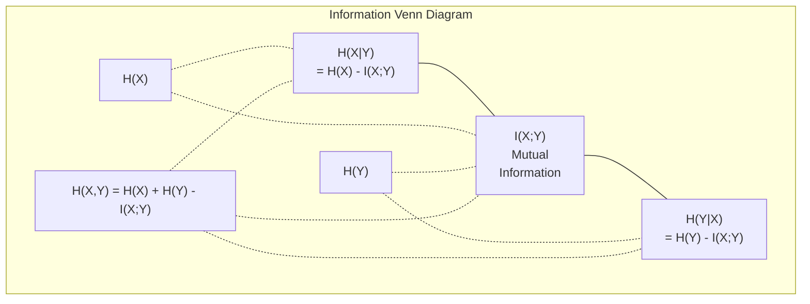

# Teoría de la información

> La teoría de la información mide la sorpresa y las funciones de pérdida se basan en ella.
> 信息论衡惊喜程度──损失函数建立在此──

**Type:** Learn | **类型:** 学习
**Language:**¿ Qué pasa ?**语言:**Python
**Prerequisites:** Phase 1, Lesson 06 (Probability) | **前置知识:** Phase 1, Lesson 06 (Probability)
**Time:** ~60 minutes | **时间:** ~60 分钟

## Objetivos de aprendizaje

- Computa la entropía, la entropía cruzada y la divergencia KL desde cero y explica su relación
  Desde el cálculo de cero, el intercambio y la escala de KL, explica la relación entre ellos
- Derivar por qué minimizar la pérdida de entropía cruzada es equivalente a maximizar la probabilidad de registro
  推导为什么最小化交叉损失等价于最大化对数似然
- Calcular la información mutua entre las características y un objetivo para clasificar la importancia de las características
                                                                                                                                                                                                                                                                                                                                                                                                                                                                                                                               
- Explica la perplejidad como el tamaño efectivo del vocabulario que un modelo de lenguaje elige de
  解释困惑度作为语言模型选择的有效词汇量

> **【中文解读】**
> 信息论衡量"惊喜程度"越不可能发生事件,包含信息量越大──交叉损失函数、KL 散度、困惑度(困惑度)

> **【拓展：信息论在 AI 中的位置】**
> - **交叉熵损失**: 所有分类模型和语言模型的标准损失函数 (en inglés)`CrossEntropyLoss`)。
> - **KL 散度**El objetivo de la formación del modelo de recompensa en el RLHF es:
> - **困惑度(Perplexity)**: 语言模型的评价标准,越低越好,表示模型对下一个词的预测越确定──

## El problema es la introducción del problema

> **【中文解读】**Usted está en el entrenamiento de los modelos de clase`CrossEntropyLoss()`En el trabajo sobre modelos de lenguaje, se ve "perplejidad", en el VAE, el vapor, el RLHF, la KL 散度.

## El concepto central.

> **【拓展：Shannon 与信息论的诞生】**En 1948 Claude Shannon publicó la teoría matemática de la comunicación, proponiendo un marco para medir la cantidad de información con bits. 80 años después, este marco se convirtió en la piedra angular de la IA:交叉 es la función de pérdida de todos los modelos de clases y lenguajes, KL 散度 es la generación de modelos (VAE 散散模型) es el objetivo de entrenamiento, la información entre sí es un instrumento de selección de características. La información es el puente de la IA desde la ingeniería de la comunicación hasta el puente de la IA.

### Contenido de información (sorpresa) 信息量(惊喜度)

Cuando algo improbable sucede, lleva más información. ¿Una moneda aterriza cabeza? No es sorprendente. Una lotería gana?

> Cuando ocurre algo poco probable, lleva más información. ¿No es sorprendente?

El contenido de información de un evento con probabilidad p es:
  概率为 p 的事件的信息量为:

```
I(x) = -log(p(x))
```

Usando la base de registro 2 se obtienen bits. Usando registro natural se obtienen nats.
  Uso en 2 por la base de los parámetros obtenidos bites), uso natural de los parámetros obtenidos netos.

```
Event              Probability    Surprise (bits)
Fair coin heads    0.5            1.0
Rolling a 6        0.167          2.58
1-in-1000 event    0.001          9.97
Certain event      1.0            0.0
```

Ciertos eventos tienen información cero.
> Los eventos inevitablemente llevan información. Ya sabes que ocurrirán.

### Entropias (Sorpresa promedio)

Entropia es la sorpresa esperada en todos los posibles resultados de una distribución.
> 是分布中所有可能结果的预期惊喜度.

```
H(P) = -sum( p(x) * log(p(x)) )  for all x
```

Una moneda justa tiene entropía máxima para una variable binaria: 1 bit. Una moneda sesgada (99% de cabeza) tiene una baja entropía: 0.08 bits. Ya sabes lo que va a pasar, así que cada giro no te dice casi nada.
> La tasa de cambio de divisas tiene un valor máximo de 1 bits. La tasa de cambio de divisas es de 99%.

```
Fair coin:    H = -(0.5 * log2(0.5) + 0.5 * log2(0.5)) = 1.0 bit
Biased coin:  H = -(0.99 * log2(0.99) + 0.01 * log2(0.01)) = 0.08 bits
```

La entropía mide la incertidumbre irreductible de una distribución.
>  Mejora de la distribución de la incertidumbre de la cuota.

### La función de pérdida que usas todos los días.

La entropía cruzada mide la sorpresa promedio cuando se utiliza la distribución Q para codificar eventos que realmente provienen de la distribución P.
> 交叉 medir el uso de la distribución Q 编码 en realidad para su propia creación P de eventos 

```
H(P, Q) = -sum( p(x) * log(q(x)) )  for all x
```

P es la distribución verdadera (las etiquetas). Q es la predicción de su modelo. Si Q coincide perfectamente con P, la entropía cruzada es igual a la entropía. Cualquier desajuste lo hace más grande.
> P es una distribución real, Q es una predicción del modelo. Si Q es una perfecta correspondencia P, el交叉 es igual a── cualquier incompatibilidad lo hará más grande.

En la clasificación, P es un vector de una sola calidez (la clase verdadera tiene probabilidad 1, todo lo demás 0). Esto simplifica la entropía cruzada a:
> En分类中, P es un uno-hot 向量(真实类概率为 1,其余为 0) ;; esto hace que交叉简化为:

```
H(P, Q) = -log(q(true_class))
```

Esa es toda la fórmula de pérdida de entropía cruzada para la clasificación. Maximizar la probabilidad prevista de la clase correcta.
> Esta es la fórmula de la división completa de los cambios de los tipos.

### KL Divergencia (Distancia entre Distribuciones)

La divergencia KL mide cuánto sorpresa extra obtienes al usar Q en lugar de P.
> KL 散度度衡量使用 Q 代替 P 时多出的惊喜度──

```
D_KL(P || Q) = sum( p(x) * log(p(x) / q(x)) )  for all x
             = H(P, Q) - H(P)
```

La entropía cruzada es entropía más la divergencia KL. Dado que la entropía de la distribución verdadera es constante durante el entrenamiento, minimizar la entropía cruzada es lo mismo que minimizar la divergencia KL. Estás empujando la distribución de tu modelo hacia la distribución verdadera.
> 交叉 =  + KL 散度──Debido a que la distribución real en el proceso de entrenamiento es constante, minimizar el交叉 es igual a minimizar la KL 散度──you en la distribución del modelo se propone a la distribución real──

La divergencia KL no es simétrica: D_KL(P ∫ Q) != D_KL(Q ∫ P). No es una métrica de distancia verdadera.
> KL 散度不对称:D_KL P  Q) != DKL  Q                                                                                                                                                                                                                                                  

### Información mutua.

La información mutua mide cuánto saber una variable le dice sobre otra.
> 互信息衡知道一个变量后能告诉你关于另一个变量多少信息──

```
I(X; Y) = H(X) - H(X|Y)
        = H(X) + H(Y) - H(X, Y)
```

Si X y Y son independientes, la información mutua es cero. Conocer uno no le dice nada sobre el otro. Si están perfectamente correlacionados, la información mutua es igual a la entropía de cualquiera de las variables.
> Si X y Y son independientes, la información es nula. Si uno no puede decirte nada sobre el otro, la información es igual a una variable.

En la selección de características, una alta información mutua entre una característica y el objetivo significa que la característica es útil.
> En la selección de rasgos, la alta interacción entre rasgos y objetivos significa que los rasgos son útiles. La baja interacción significa que es ruido.

### Entropia condicional.

H(Y del X) mide cuánto incertidumbre queda sobre Y después de observar X.
> H                                                                                                                                                                                                                                                                                                                                                                                                                                                                                                                             

```
H(Y|X) = H(X,Y) - H(X)
```

Dos extremos:
  两个极端:

- Si X determina completamente Y, entonces H(Y deX) = 0. Conocer X elimina toda incertidumbre sobre Y. Ejemplo: X = temperatura en Celsius, Y = temperatura en Fahrenheit.
  Si X  completamente decide Y, entonces H  Y  X) = 0── saber X  eliminó toda incertidumbre acerca de Y──
- Si X no te dice nada sobre Y, entonces H(YX)) = H(Y). Saber X no reduce tu incertidumbre en absoluto. Ejemplo: X = cambio de moneda, Y = el clima de mañana.
  Si X a Y  no tiene ninguna información, entonces H  Y X ) = H  Y) 

La entropía condicional es siempre no negativa y nunca excede H(Y):
> 条件始终非负且不超过 H(Y):

```
0 <= H(Y|X) <= H(Y)
```

En el aprendizaje automático, la entropía condicional aparece en los árboles de decisión. En cada división, el algoritmo selecciona la característica X que minimiza H(Y) = la característica que elimina la mayor incertidumbre sobre la etiqueta Y.
> En el aprendizaje automático, las condiciones se presentan en el árbol de decisión. En cada división, el algoritmo selecciona H  Y Y X) el menor rasgo X es el más mínimo que puede eliminar el rasgo Y de incertidumbre.

### Entropias conjuntas

H(X,Y) es la entropía de la distribución conjunta de X y Y juntos.
> H(X,Y) es X y Y 联合分布的──

```
H(X,Y) = -sum sum p(x,y) * log(p(x,y))   for all x, y
```

Propiedad clave:
  关键性质:

```
H(X,Y) <= H(X) + H(Y)
```

La igualdad se mantiene cuando X y Y son independientes. Si comparten información, la entropía conjunta es menor que la suma de entropias individuales. La entropía "falta" es exactamente la información mutua.
> Cuando X y Y se forman independientes, se comparten información, y se unifican en su propio conjunto.



Las relaciones:
  关系式:

- H(X,Y) = H(X) + H(Y que sea X) = H(Y) + H(X que sea)
- El valor de la cantidad de residuos de la producción de la planta de producción de la planta de producción de la planta de producción de la planta de producción de la planta de producción de la planta de producción de la planta de producción de la planta de producción de la planta de producción de la planta de producción de la planta de producción de la planta de producción de la planta de producción de la planta de producción de la planta de producción de la planta de producción de la planta de producción de la planta de producción de la planta de producción de la planta de producción de la planta de producción de la planta de producción de la planta de producción de la planta de producción de la planta de la planta de producción de la planta de la planta de producción de la planta de la planta de la planta de producción de la planta de la planta de la planta de la planta de la planta de la planta de la planta de la planta de la planta de la planta de la planta de la planta de la planta de la planta de la planta de la planta de la planta de la planta de la planta de la planta de la planta de la planta de la planta de la planta de la planta de la planta de la planta de la planta de la planta de la planta de la planta de la planta de la planta de la planta de la planta de la planta de la planta de la planta de la planta de la planta de la planta de la planta de la planta de la planta de la planta de la planta de la planta de la planta de la planta de la planta de la planta de la planta de la planta de la planta de la planta de la planta de la planta de la planta de la planta de la planta de la planta de la planta de la planta de la planta de la planta de la planta de la planta de la planta de la planta de la planta de la planta de la planta de la planta de la planta de la planta de la planta de la planta de la planta de la planta de la planta de la planta de la planta de la planta de la planta de la planta de la planta de la planta de la planta de la planta de la planta de la planta de la planta de la planta de la planta de la planta de la planta de la planta de la planta de la planta de la planta de la planta de la planta de la planta de la planta de la planta de la planta de la planta de la planta de la planta de la planta de la planta de la planta de la planta de la planta de la planta de la planta de la planta de
- H(X,Y) = H(X) + H(Y) - I(X;Y)

### Información mutua (Depth Dive) 互信息(深入理解)

Información mutua I(X;Y) cuantifica cuánto conocer una variable reduce la incertidumbre sobre la otra.
> 互信息 I(X;Y) 量化知道一个变量后对另一个变量不确定性的减少量──

```
I(X;Y) = H(X) - H(X|Y)
       = H(Y) - H(Y|X)
       = H(X) + H(Y) - H(X,Y)
       = sum sum p(x,y) * log(p(x,y) / (p(x) * p(y)))
```

Propiedades:
  Sexualidad:

- I ((X;Y) >= 0 siempre. Nunca pierdes información al observar algo.
  I(X;Y) >= 0 始终成立── observar cosas nunca perderá información──
- I(X;Y) = 0 si y sólo si X y Y son independientes.
  I(X;Y) = 0 cuando y sólo cuando X y Y 独立。
- I(X;Y) = I(Y;X). Es simétrico, a diferencia de la divergencia KL.
  I(X;Y) = I(Y;X)。 es un homónimo, diferente de KL 散度。
- I  X) = H  X) Una variable comparte toda su información consigo misma.
  I(X;X) = H(X)。变量与自己共享所有信息──

**Mutual information for feature selection.**En ML, se quieren características que sean informativas sobre el objetivo.
> **互信息用于特征选择。**En el aprendizaje automático, se necesita una característica de información para el objetivo. La información entre sí ofrece una forma de ordenar las características de principio:

1. Para cada característica X_i, computa I(X_i; Y) donde Y es la variable objetivo.
   Para cada característica X_i, calcular I(X_i; Y), de las cuales Y es el objetivo de la variabilidad.
2. Las características de clasificación por puntaje MI.
   按MI 得分排序特征──
3. Mantenga las características de k superior.
   Mantener un buen tiempo.

Esto funciona para cualquier relación entre la característica y el objetivo, lineal, no lineal, monótono o no. La correlación sólo capta las relaciones lineares. MI capta todo.
> Se aplica a cualquier relación entre características y objetivos: lineal, no lineal, unímico o no unímico. La correlación sólo puede captar relaciones lineares, la información entre sí puede captar todo.

| Method / 方法 | Detects / 检测 | Computational cost / 计算成本 | Handles categorical? / 处理类别型？ |
|--------|---------|-------------------|---------------------|
| Pearson correlation / 皮尔逊相关 | Linear relationships / 线性关系 | O(n) | No / 否 |
| Spearman correlation / 斯皮尔曼相关 | Monotonic relationships / 单调关系 | O(n log n) | No / 否 |
| Mutual information / 互信息 | Any statistical dependency / 任何统计依赖 | O(n log n) with binning | Yes / 是 |

### Etiqueta de suavizamiento y entropía cruzada.

La clasificación estándar utiliza objetivos duros: [0, 0, 1, 0]. La clase verdadera obtiene probabilidad 1, todo lo demás obtiene 0.
> 标准分类使用硬目标:[0, 0, 1, 0]──真实类概率为 1,其余为 0──标签平滑将其替换为软目标:

```
soft_target = (1 - epsilon) * hard_target + epsilon / num_classes
```

Con epsilon = 0,1 y 4 clases:
  Cuando epsilon = 0,1 y tiene 4 categorías:

- Objetivo duro: [0, 0, 1, 0]
- Objetivo suave: [0,025, 0,025, 0,925, 0,025]

Desde la perspectiva de la teoría de la información, el suavización de etiquetas aumenta la entropía de la distribución de objetivos. Los objetivos duros de una sola calidez tienen entropía 0 - no hay incertidumbre. Los objetivos blandos tienen entropía positiva.
> Desde el punto de vista informático, el etiquetado de la distribución de la información aumentó la distribución de objetivos.

Por qué esto ayuda:
  ¿Por qué esto ayuda?

- Impide que el modelo conduzca los logits a valores extremos (se necesitarían logits infinitos para que coincida perfectamente con un objetivo de una sola caliente bajo entropía cruzada)
  防止模型将 logits 推到极端值 推到极端值 防止模型将 logits 推到极端值 推到极端值 推到极端值 推到极端值 推到极端值 推到极端值 推到极端值 推到极端值 推到极端值 推到极端值 推到极端值 推到极端值 推到极端值 推到极端值 推到极端值 推到极端值 推到极端值 推到极端值 推到极端值 推到极端值 推到极端值 推到极端值 推到极端值 推到极端值 推到极端值
- Actúa como regularización: el modelo no puede ser 100% seguro
  Como normalización: el modelo no puede ser 100% autoconfianza
- Mejora la calibración: las probabilidades previstas reflejan mejor la verdadera incertidumbre
   mejorar la calificación: la probabilidad de pronóstico refleja mejor la realidad de la incertidumbre
- Reduce la brecha entre el entrenamiento y el comportamiento de inferencia
   Reducir la diferencia entre el entrenamiento y el comportamiento de la

La pérdida de entropía cruzada con el suavización de la etiqueta se convierte en:
> 带标签平滑的交叉损失为:

```
L = (1 - epsilon) * CE(hard_target, prediction) + epsilon * H_uniform(prediction)
```

El segundo término penaliza predicciones que están lejos de ser uniformes -- una regularización directa de la confianza.
> El segundo castigo es la regularización directa de la confianza en la predicción de la distribución media de distancia.

### ¿Por qué la entropía cruzada es la pérdida de clasificación?

Tres perspectivas, la misma conclusión.
> Tres puntos de vista, con un mismo final.

**Information theory view.**La entropía cruzada mide cuántos bits se desperdician utilizando la distribución de su modelo en lugar de la distribución real. Minimizándola hace que su modelo sea el codificador más eficiente de la realidad.
> **信息论视角。**交叉 medir el uso de la distribución del modelo en lugar de la distribución real desperdició muchos bits― minimizar hace que tu modelo sea el codificador real más eficaz―

**Maximum likelihood view.**Para muestras de formación N con clases y_i reales:
> **最大似然视角。**对于 N 个训练样本,真实类别为 y_i:

```
Likelihood     = product( q(y_i) )
Log-likelihood = sum( log(q(y_i)) )
Negative log-likelihood = -sum( log(q(y_i)) )
```

La última línea es la pérdida de entropía cruzada. Minimizar la entropía cruzada = maximizar la probabilidad de los datos de entrenamiento bajo su modelo.
> La última línea es el trayecto  pérdida                                                                                                                                                                                                                                                         

**Gradient view.**El gradiente de entropía cruzada con respecto a los logits es sencillo (predecible - verdadero). limpio, estable y rápido de calcular.
> **梯度视角。**交叉对逻辑的梯度就是 (predecicionado - verdadero) ――简洁、稳定、计算快速――这就是为什么它与软max 完美搭配──

### Bits vs Nats. Bits vs Nate.

La única diferencia es la base de registro.
> La única diferencia es el número inferior de la contra-número.

```
log base 2   -> bits      (information theory tradition / 信息论传统)
log base e   -> nats      (machine learning convention / 机器学习惯例)
log base 10  -> hartleys  (rarely used / 很少使用)
```

1 nat = 1/ln(2) bits = 1,4427 bits. PyTorch y TensorFlow utilizan log natural (nats) por defecto.
> 1 nat = 1/ln(2) bits = 1,4427 bits。PyTorch y TensorFlow 默认使用自然对数(nats)。

### Perplejidad.

La perplejidad es el exponencial de entropía cruzada. Te dice el número efectivo de opciones igualmente probables entre el modelo es incierto.
> La confusión es el índice de la intersección. Te dice cuántos modelos hay entre ellos.

```
Perplexity = 2^H(P,Q)   (if using bits / 使用 bits 时)
Perplexity = e^H(P,Q)   (if using nats / 使用 nats 时)
```

Un modelo de lenguaje con complejidad 50 es, en promedio, tan confuso como si tuviera que elegir uniformemente de 50 posibles fichas siguientes.
> 困惑度为 50 的语言模型,平均而言就像在 50 个可能的下一个词中均选择一样困惑──越低越好──

GPT-2 logró una perplejidad de ~30 en los puntos de referencia comunes.
> GPT-2 en el marco de la normalidad ha alcanzado ~30 de confusión.

## Construye y realiza.
```figure
entropy-kl
```

## Construye el mismo

### Paso 1: Contenido de información y entropía.

```python
import math

def information_content(p, base=2):
    if p <= 0 or p > 1:
        return float('inf') if p <= 0 else 0.0
    return -math.log(p) / math.log(base)

def entropy(probs, base=2):
    return sum(
        p * information_content(p, base)
        for p in probs if p > 0
    )

fair_coin = [0.5, 0.5]
biased_coin = [0.99, 0.01]
fair_die = [1/6] * 6

print(f"Fair coin entropy:   {entropy(fair_coin):.4f} bits")
print(f"Biased coin entropy: {entropy(biased_coin):.4f} bits")
print(f"Fair die entropy:    {entropy(fair_die):.4f} bits")
```

### Paso 2: Entropia cruzada y divergencia KL.

```python
def cross_entropy(p, q, base=2):
    total = 0.0
    for pi, qi in zip(p, q):
        if pi > 0:
            if qi <= 0:
                return float('inf')
            total += pi * (-math.log(qi) / math.log(base))
    return total

def kl_divergence(p, q, base=2):
    return cross_entropy(p, q, base) - entropy(p, base)

true_dist = [0.7, 0.2, 0.1]
good_model = [0.6, 0.25, 0.15]
bad_model = [0.1, 0.1, 0.8]

print(f"Entropy of true dist:     {entropy(true_dist):.4f} bits")
print(f"CE (good model):          {cross_entropy(true_dist, good_model):.4f} bits")
print(f"CE (bad model):           {cross_entropy(true_dist, bad_model):.4f} bits")
print(f"KL divergence (good):     {kl_divergence(true_dist, good_model):.4f} bits")
print(f"KL divergence (bad):      {kl_divergence(true_dist, bad_model):.4f} bits")
```

### Paso 3: Entropia cruzada como pérdida de clasificación.

```python
def softmax(logits):
    max_logit = max(logits)
    exps = [math.exp(z - max_logit) for z in logits]
    total = sum(exps)
    return [e / total for e in exps]

def cross_entropy_loss(true_class, logits):
    probs = softmax(logits)
    return -math.log(probs[true_class])

logits = [2.0, 1.0, 0.1]
true_class = 0

probs = softmax(logits)
loss = cross_entropy_loss(true_class, logits)

print(f"Logits:      {logits}")
print(f"Softmax:     {[f'{p:.4f}' for p in probs]}")
print(f"True class:  {true_class}")
print(f"Loss:        {loss:.4f} nats")
print(f"Perplexity:  {math.exp(loss):.2f}")
```

### Paso 4: La entropía cruzada es igual a probabilidad de registro negativo.

```python
import random

random.seed(42)

n_samples = 1000
n_classes = 3
true_labels = [random.randint(0, n_classes - 1) for _ in range(n_samples)]
model_logits = [[random.gauss(0, 1) for _ in range(n_classes)] for _ in range(n_samples)]

ce_loss = sum(
    cross_entropy_loss(label, logits)
    for label, logits in zip(true_labels, model_logits)
) / n_samples

nll = -sum(
    math.log(softmax(logits)[label])
    for label, logits in zip(true_labels, model_logits)
) / n_samples

print(f"Cross-entropy loss:      {ce_loss:.6f}")
print(f"Negative log-likelihood: {nll:.6f}")
print(f"Difference:              {abs(ce_loss - nll):.2e}")
```

### Paso 5: Información mutua.

```python
def mutual_information(joint_probs, base=2):
    rows = len(joint_probs)
    cols = len(joint_probs[0])

    margin_x = [sum(joint_probs[i][j] for j in range(cols)) for i in range(rows)]
    margin_y = [sum(joint_probs[i][j] for i in range(rows)) for j in range(cols)]

    mi = 0.0
    for i in range(rows):
        for j in range(cols):
            pxy = joint_probs[i][j]
            if pxy > 0:
                mi += pxy * math.log(pxy / (margin_x[i] * margin_y[j])) / math.log(base)
    return mi

independent = [[0.25, 0.25], [0.25, 0.25]]
dependent = [[0.45, 0.05], [0.05, 0.45]]

print(f"MI (independent): {mutual_information(independent):.4f} bits")
print(f"MI (dependent):   {mutual_information(dependent):.4f} bits")
```

## Usalo con el marco de ejecución

Los mismos conceptos que utilizan NumPy, la forma en que los utilizará en la práctica:
> Usando NumPy 实现 el mismo concepto, este es el modo de usar en la práctica:

```python
import numpy as np

def np_entropy(p):
    p = np.asarray(p, dtype=float)
    mask = p > 0
    result = np.zeros_like(p)
    result[mask] = p[mask] * np.log(p[mask])
    return -result.sum()

def np_cross_entropy(p, q):
    p, q = np.asarray(p, dtype=float), np.asarray(q, dtype=float)
    mask = p > 0
    return -(p[mask] * np.log(q[mask])).sum()

def np_kl_divergence(p, q):
    return np_cross_entropy(p, q) - np_entropy(p)

true = np.array([0.7, 0.2, 0.1])
pred = np.array([0.6, 0.25, 0.15])
print(f"Entropy:    {np_entropy(true):.4f} nats")
print(f"Cross-ent:  {np_cross_entropy(true, pred):.4f} nats")
print(f"KL div:     {np_kl_divergence(true, pred):.4f} nats")
```

¿ Qué construiste desde cero ?`torch.nn.CrossEntropyLoss()`Ahora ya sabes por qué la pérdida disminuye durante el entrenamiento: la distribución prevista de tu modelo se está acercando a la distribución real, medida en nats de información desperdiciada.
> Tu construiste desde cero.`torch.nn.CrossEntropyLoss()` Lo que se hace internamente― ahora sabes por qué las pérdidas en el entrenamiento disminuyen: tu modelo de predicción de distribución se acerca cada vez más a la distribución real, con el número de características de la información de la basura para medir―

## Los ejercicios.

1. Calcule la entropía del alfabeto inglés asumiendo una distribución uniforme (26 letras). Luego, estima usando frecuencias de letras reales. ¿Cuál es mayor y por qué?
   假设均分布计算英文字母表(26 个字母) ──后用实际字母频率估计──哪个更高?为什么?

2. Un modelo saca logits [5.0, 2.0, 0.5] para una muestra con clase verdadera 1. Calcula la pérdida de entropía cruzada a mano, luego verifique con su `cross_entropy_loss`¿Qué logitos darían cero pérdida?
   模型对真实类别为 1的样本输出逻辑 [5.0, 2.0, 0.5]──手算交叉损失,然后用你的函数验证──什么逻辑会给出零损失?

3. Muestre que la divergencia KL no es simétrica. escoge dos distribuciones P y Q y computa D_KL_P_K Ђ Q) y DL Q Ђ P). Explique por qué difieren.
   证明 KL 散度不对称──选择两个分布 P 和 Q,计算 D_KL(P 含 Q) 和 D_KL(Q 含 P)──解释为什么它们不同──

4. Construir una función que compute la perplejidad de una secuencia de predicciones de tokens. Dado una lista de pares (true_token_index, predicted_logits), devuelva la perplejidad de la secuencia.
   Construir un token de cálculo  predicción de la secuencia de confusión ⋅ given (indicador de los tokens reales,  predicción de logitos) para la lista de, retornar la secuencia de confusión ⋅

## Términos clave .

| Term / 术语 | What people say | What it actually means / 实际含义 |
|------|----------------|----------------------|
| Information content / 信息量 | "Surprise" | The number of bits (or nats) needed to encode an event: -log(p) / 编码事件所需的比特数（或奈特数）：-log(p) |
| Entropy / 熵 | "Randomness" | The average surprise across all outcomes of a distribution. Measures irreducible uncertainty. / 分布中所有结果的平均惊喜度。衡量不可约减的不确定性。 |
| Cross-entropy / 交叉熵 | "The loss function" | Average surprise when using model distribution Q to encode events from true distribution P. / 使用模型分布 Q 编码来自真实分布 P 的事件时的平均惊喜度。 |
| KL divergence / KL 散度 | "Distance between distributions" | Extra bits wasted by using Q instead of P. Equals cross-entropy minus entropy. Not symmetric. / 使用 Q 代替 P 浪费的额外比特。等于交叉熵减熵。不对称。 |
| Mutual information / 互信息 | "How related are X and Y" | Reduction in uncertainty about X from knowing Y. Zero means independent. / 知道 Y 后关于 X 不确定性的减少。零意味着独立。 |
| Softmax | "Turn logits into probabilities" | Exponentiate and normalize. Maps any real-valued vector to a valid probability distribution. / 指数化并归一化。将任意实值向量映射为有效概率分布。 |
| Perplexity / 困惑度 | "How confused the model is" | Exponential of cross-entropy. The effective vocabulary size the model is choosing from at each step. / 交叉熵的指数。模型每一步选择时的有效词汇量。 |
| Bits / 比特 | "Shannon's unit" | Information measured with log base 2. One bit resolves one fair coin flip. / 用以 2 为底的对数衡量的信息。一比特解决一次公平抛硬币。 |
| Nats / 奈特 | "ML's unit" | Information measured with natural log. Used by PyTorch and TensorFlow by default. / 用自然对数衡量的信息。PyTorch 和 TensorFlow 默认使用。 |
| Negative log-likelihood / 负对数似然 | "NLL loss" | Identical to cross-entropy loss for one-hot labels. Minimizing it maximizes the probability of correct predictions. / 对 one-hot 标签等价于交叉熵损失。最小化它等于最大化正确预测的概率。 |

## Más Leer más Leer más

- [Shannon 1948: A Mathematical Theory of Communication](https://people.math.harvard.edu/~ctm/home/text/others/shannon/entropy/entropy.pdf)- el papel original, todavía legible
  Original, hasta ahora todavía se puede leer
- [Visual Information Theory (Chris Olah)](https://colah.github.io/posts/2015-09-Visual-Information/)- mejor explicación visual de la entropía y la divergencia KL
   y KL 散度 mejor explicación visible
- [PyTorch CrossEntropyLoss docs](https://pytorch.org/docs/stable/generated/torch.nn.CrossEntropyLoss.html)- cómo el marco implementa lo que acabas de construir
  框架 Cómo realizar el contenido que acabas de construir
